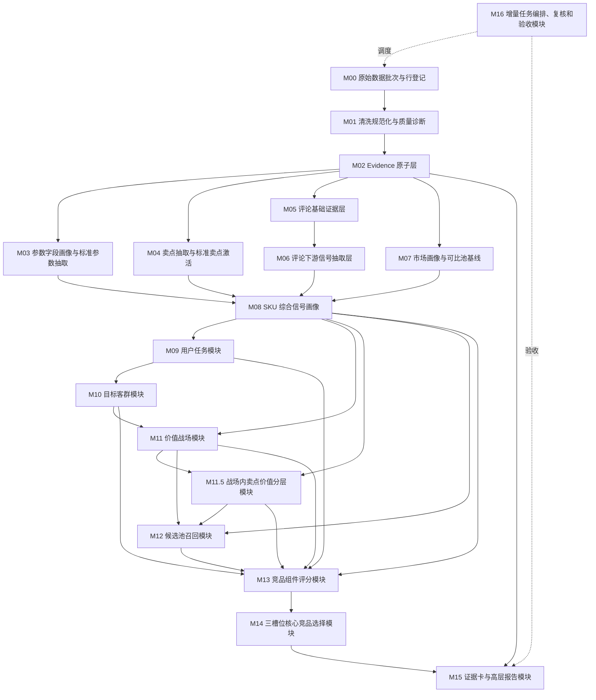

# CatForge 彩电核心三竞品生成 SOP 与模块指导文档

版本：v1.0  
日期：2026-06-12  
适用范围：CatForge 内部生产线，一个月 MVP 至后续生产化迭代。  
输入数据：PostgreSQL 中的 SKU 主数据、周/月量价、参数、宣传卖点、评论。  
核心输出：对每个目标 SKU 生成核心三竞品（正面对打、价格/销量挤压、高端标杆/潜在下探）及证据卡。

---

## 0. 对附件方案的判断

附件《00a 竞品生成方法论 SOP 模块设计计划》相比前面讨论已经明显更完善，主要改进包括：

1. **把原始数据、清洗、Evidence、参数、卖点、评论、市场画像、任务、客群、战场、竞品评分、三槽位选择拆成模块**，避免“一次性把所有数据丢给模型分析”。
2. **增加了 Evidence 原子层**，能支撑后续所有结论可追溯。
3. **明确评论基础分类不能直接生成用户任务、客群、战场或竞品结论**，这点非常关键。
4. **明确 seed 是业务本体和识别框架，不是 SKU 结论**，避免把预置知识当成分析结果。
5. **加入了增量重算、复核、验收模块**，更接近可持续生产线。

但为了满足“输入 SKU → 输出核心三竞品”的 MVP，还需要补强四点：

| 问题 | 影响 | 建议 |
|---|---|---|
| 缺少独立的“战场内卖点价值分层”模块 | 无法把价值战场和卖点价值分层闭环起来 | 在 M11 和 M12 之间补充 **M11.5 战场内卖点价值分层模块** |
| M04 和 M06 可能形成循环依赖 | M04 需要评论验证，M06 又可能依赖卖点辅助信号 | 将 M04 拆为 **M04a 基础卖点激活** 和 **M04b 评论验证增强** |
| M14 需要明确不是 TopN，而是三槽位选择 | 避免输出几十个竞品等于没有竞品 | 固定三槽位：正面对打、价格/销量挤压、高端标杆/潜在下探 |
| MVP 需要收敛范围 | 全链路做完超过一个月 | MVP 只做“批量核心三竞品 + 单 SKU 证据卡 + 简版报告” |

---

## 1. MVP 范围定义

### 1.1 MVP 目标

一个月内完成：

```text
输入任意目标 SKU
→ 读取 PostgreSQL 中该 SKU 和全量候选 SKU 数据
→ 生成目标 SKU 的市场画像、参数画像、卖点激活、评论信号、用户任务、客群、价值战场
→ 构建候选竞品池
→ 计算候选竞品组件分
→ 选择核心三竞品
→ 生成证据卡和单 SKU 竞品报告
```

### 1.2 MVP 只展示结果，不展示完整生产过程

MVP 汇报页面只保留：

1. 批量竞品生成总览。
2. 单 SKU 竞品报告。
3. 核心三竞品证据卡。
4. 可选：算法初选与 LLM 裁决对比。

### 1.3 MVP 不做

| 不做 | 原因 |
|---|---|
| 完整品类生产工具 UI | 一个月内太大 |
| 全量参数库/卖点库在线编辑 | 不是汇报重点 |
| 完整专家 Gold Set 系统 | 二期做 |
| 完整任务编排和发布治理 | MVP 先用离线/半在线脚本 |
| 多品类 | 只做彩电 |
| Agent 自由访问数据库 | 不可控、不稳定 |
| 竞品 TopN 大列表 | 只展示核心三竞品 |

---

## 2. 总体数据原则

### 2.1 不允许下游绕过上游

除 Evidence 追溯外，下游模块不得直接读取原始表进行业务判断。

错误：

```text
M14 三竞品选择直接读取 comment_data 重新理解评论。
```

正确：

```text
M14 只读取 M13 组件分、M11 战场分、M11.5 卖点分层、M08 SKU 画像和 evidence_id。
```

### 2.2 缺失值不是 false

例如：

```text
MINILED = 空
```

应解释为：

```text
unknown
```

不是：

```text
false
```

### 2.3 任何结论都必须有 evidence_id

包括：

- 卖点激活。
- 用户任务。
- 目标客群。
- 价值战场。
- 卖点价值分层。
- 竞品关系。
- 证据卡报告。

### 2.4 高置信结论必须满足三类条件

```text
数据证据足够
规则版本明确
样本充分性达标
```

不满足时输出：

```text
low_confidence / insufficient_sample / needs_review
```

---

## 3. 推荐 PostgreSQL Schema 分层

```text
raw_*               原始只读表或视图
core3_clean_*       清洗规范表
core3_evidence_*    Evidence 原子表
core3_feature_*     参数、卖点、评论、市场特征
core3_score_*       任务、客群、战场、卖点分层评分
core3_competitor_*  候选、组件分、三竞品结果
core3_report_*      证据卡、报告 payload
core3_job_*         批次、增量、复核、验收
```

统一字段建议：

```text
batch_id
source_row_id
sku_code
model
brand
category
evidence_id
asset_version
rule_version
confidence
review_status
created_at
updated_at
input_hash
```

---

## 4. 主链路总览



---

## M00 原始数据批次与行登记

### 1. 模块目标

为每次数据接入建立批次、来源行登记、行级 hash 和受影响 SKU 列表，为后续清洗、Evidence 和增量重算提供稳定边界。

### 2. 上游依赖

PostgreSQL 中的原始表或视图：

- `week_sales_data`
- `attribute_data`
- `selling_points_data`
- `comment_data`

### 3. 本模块不做什么

- 不做业务清洗。
- 不做参数归一。
- 不做卖点判断。
- 不做评论分类。
- 不做竞品判断。

### 4. 输入数据契约

至少需要识别：

| 数据类型 | 必须字段 |
|---|---|
| 销售量价 | sku_code/model/brand/category/period/channel/sales_volume/sales_amount/avg_price |
| 参数 | sku_code/model/brand/category/raw_param_name/raw_param_value |
| 卖点 | sku_code/model/brand/category/raw_claim_text |
| 评论 | sku_code/model/brand/category/comment_id/comment_text/comment_time/platform |

### 5. 处理流程

1. 创建 `batch_id`。
2. 读取每张源表本次新增或变更数据。
3. 为每一行生成 `source_row_id`。
4. 计算 `row_hash`。
5. 标记数据来源表、来源主键、时间窗口。
6. 汇总受影响 `sku_code`。
7. 写入行登记表。

### 6. 输出数据契约

#### `core3_source_batch`

| 字段 | 说明 |
|---|---|
| batch_id | 本次数据批次 |
| batch_type | full / incremental |
| source_system | 数据来源 |
| data_period_start | 数据期开始 |
| data_period_end | 数据期结束 |
| status | registered / cleaned / failed |
| created_at | 创建时间 |

#### `core3_source_row_registry`

| 字段 | 说明 |
|---|---|
| source_row_id | 行级唯一 ID |
| batch_id | 批次 |
| source_table | 原始表 |
| source_pk | 原始主键 |
| sku_code | SKU |
| row_hash | 行内容 hash |
| operation_type | insert/update/delete/no_change |
| affected_modules | 受影响模块 |
| created_at | 时间 |

### 7. Evidence 与置信度

M00 不生成业务 evidence，但生成 source reference。后续 M02 使用 `source_row_id` 生成 evidence。

### 8. 增量重算策略

增量判断依据：

```text
同 source_table + source_pk 的 row_hash 变化
```

受影响 SKU：

```text
销售行变化 → M07 以后受影响
参数行变化 → M03、M04、M08 以后受影响
卖点行变化 → M04、M08 以后受影响
评论行变化 → M05、M06、M08 以后受影响
```

### 9. 给下游的数据承诺

- 每条原始行都有稳定 `source_row_id`。
- 每个 batch 都能列出受影响 SKU。
- 后续模块可以按 `batch_id` 和 `sku_code` 增量处理。

### 10. 验收标准

| 验收项 | 标准 |
|---|---|
| 原始行登记覆盖 | 100% |
| row_hash 变化识别 | 正确 |
| 受影响 SKU 列表 | 正确 |
| 原始表不被修改 | 必须 |


## M01 清洗规范化与质量诊断

### 1. 模块目标

把原始行转成统一格式的清洗事实表，并输出数据质量诊断结果。M01 只做通用清洗，不做业务结论。

### 2. 上游依赖

- `core3_source_batch`
- `core3_source_row_registry`
- 原始表或原始视图

### 3. 本模块不做什么

- 不做标准参数归一。
- 不做标准卖点激活。
- 不判断用户任务、价值战场或竞品。
- 不把缺失值当 false。

### 4. 输入数据契约

读取 M00 登记的新增/变化行。

### 5. 从参数/卖点/评论/市场中分别消费什么

| 类型 | 消费内容 | 清洗动作 |
|---|---|---|
| 市场 | 销量、销额、均价、周/月、渠道 | 数值化、渠道标准化、异常价格检测 |
| 参数 | 原始参数名、原始参数值 | 去空格、统一标点、保留原值 |
| 卖点 | 原始宣传语 | 去 HTML、切换行、保留文本 |
| 评论 | 原文、短句、情感、时间 | 去噪、切句准备、时间标准化 |

### 6. 处理流程

1. 字段类型转换。
2. 清理空白、HTML、异常符号。
3. 标准化日期、渠道、品牌、型号。
4. 识别重复行。
5. 识别缺失、异常、非法数值。
6. 输出清洗表和质量问题表。

### 7. 输出数据契约

#### `core3_clean_market_fact`

| 字段 | 说明 |
|---|---|
| source_row_id | 来源行 |
| batch_id | 批次 |
| sku_code | SKU |
| brand/model/category | 主信息 |
| period | 周/月 |
| channel_type | 渠道 |
| sales_volume | 销量 |
| sales_amount | 销额 |
| avg_price | 均价 |
| quality_status | ok/warn/error |

#### `core3_clean_param_fact`

| 字段 | 说明 |
|---|---|
| sku_code | SKU |
| raw_param_name | 原始参数名 |
| raw_param_value | 原始参数值 |
| normalized_text_value | 仅文本规范化后的值 |
| quality_status | ok/warn/error |

#### `core3_clean_claim_fact`

| 字段 | 说明 |
|---|---|
| sku_code | SKU |
| raw_claim_text | 清洗后的宣传文本 |
| claim_seq | 序号 |
| quality_status | 状态 |

#### `core3_clean_comment_fact`

| 字段 | 说明 |
|---|---|
| sku_code | SKU |
| comment_id | 评论 ID |
| comment_text | 清洗后原文 |
| comment_time | 时间 |
| platform | 平台 |
| sentiment_raw | 原始情感 |
| quality_status | 状态 |

#### `core3_data_quality_issue`

| 字段 | 说明 |
|---|---|
| issue_id | 问题 ID |
| batch_id | 批次 |
| source_row_id | 来源 |
| sku_code | SKU |
| issue_type | missing/duplicate/invalid/outlier |
| severity | info/warn/error |
| issue_detail | 说明 |

### 8. Evidence 与置信度

M01 不生成业务 evidence，只标记数据质量。质量结果会影响下游 evidence confidence。

### 9. 增量重算策略

只处理 M00 标记为 insert/update/delete 的行。  
如果 clean 结果 hash 未变化，不触发下游重算。

### 10. 给下游的数据承诺

- 清洗表字段类型稳定。
- 原始文本仍可追溯。
- 每条清洗行有 quality_status。
- 缺失、异常、重复有 issue 记录。

### 11. 验收标准

| 验收项 | 标准 |
|---|---|
| 清洗表生成 | 必须 |
| 数值字段转换 | 正确 |
| 原始值可追溯 | 必须 |
| 缺失不误判为 false | 必须 |
| 质量问题可查询 | 必须 |


## M02 Evidence 原子层

### 1. 模块目标

把清洗后的参数、卖点、评论、市场事实转成可复用的 evidence 原子，支撑后续所有业务判断。

### 2. 上游依赖

- `core3_clean_market_fact`
- `core3_clean_param_fact`
- `core3_clean_claim_fact`
- `core3_clean_comment_fact`
- `core3_data_quality_issue`

### 3. 本模块不做什么

- 不判断卖点是否成立。
- 不判断用户任务。
- 不判断价值战场。
- 不判断竞品。

### 4. 输入数据契约

清洗规范表中的每条有效事实。

### 5. Evidence 类型

| 类型 | 说明 |
|---|---|
| param_raw | 参数原始事实 |
| promo_raw | 宣传原始文本 |
| comment_raw | 评论原文 |
| comment_sentence | 评论短句 |
| market_fact | 价格、销量、渠道事实 |
| quality_issue | 数据质量问题 |
| rule | 后续规则 evidence |

### 6. 处理流程

1. 为每个清洗事实生成 `evidence_id`。
2. 保存来源表、来源行、原始字段、原始值。
3. 生成 source_ref。
4. 根据 quality_status 给初始 confidence。
5. 写入 evidence 表。

### 7. 输出数据契约

#### `core3_evidence_atom`

| 字段 | 说明 |
|---|---|
| evidence_id | 证据 ID |
| batch_id | 批次 |
| sku_code | SKU |
| source_type | param_raw/promo_raw/comment_raw/market_fact |
| source_table | 来源表 |
| source_row_id | 来源行 |
| raw_field | 原始字段 |
| raw_value | 原始值 |
| normalized_text | 规范化文本 |
| evidence_time | 证据发生时间 |
| channel_type | 渠道 |
| confidence | 初始置信度 |
| quality_status | 数据质量 |
| asset_version | 资产版本 |
| created_at | 时间 |

### 8. 置信度规则

| 数据质量 | 初始 confidence |
|---|---:|
| ok | 0.95 |
| warn | 0.70 |
| error | 0.30 |
| missing/unknown | 不生成或生成 unknown evidence |

### 9. 增量重算策略

若 M01 清洗行 hash 变化：

```text
失效旧 evidence
生成新 evidence
下游按 evidence_id 依赖图重算
```

### 10. 给下游的数据承诺

- 下游所有结论必须引用 evidence_id。
- evidence 不直接等于业务结论。
- evidence 可以追溯到原始 source_row_id。

### 11. 验收标准

| 验收项 | 标准 |
|---|---|
| 有效清洗事实都有 evidence | 100% |
| evidence 可追溯源行 | 100% |
| confidence 受数据质量影响 | 必须 |
| 旧 evidence 不直接物理删除 | 推荐逻辑失效 |


## M03 参数字段画像与标准参数抽取

### 1. 模块目标

将原始参数字段和宣传中抽取出的派生参数，转成标准参数画像，为卖点激活、任务、战场和竞品评分提供稳定输入。

### 2. 上游依赖

- `core3_evidence_atom` 中的 param_raw evidence
- `core3_clean_claim_fact` 或 M04a 中抽出的数值实体
- seed 标准参数库：`std_param_seed`

### 3. 本模块不做什么

- 不判断标准卖点是否激活。
- 不判断任务、客群、战场。
- 不做竞品评分。
- 不把 unknown 当作 false。

### 4. 输入数据契约

| 输入 | 说明 |
|---|---|
| 原始参数 evidence | 例如“尺寸(寸)=85” |
| 派生参数候选 | 例如宣传中的“5200nits” |
| 参数 seed | 参数别名、单位、分档、冲突规则 |

### 5. 从参数/卖点/评论/市场中消费什么

| 来源 | 消费 |
|---|---|
| 参数 | 原始字段名、原始字段值 |
| 卖点 | 数值实体作为派生参数，例如 nits、Hz、分区、HDMI |
| 评论 | 不消费 |
| 市场 | 不消费 |

### 6. 处理流程

1. 原始字段名匹配标准参数别名。
2. 提取数值、布尔、枚举。
3. 单位归一。
4. 参数分档。
5. 处理冲突，例如参数表刷新率与宣传刷新率不一致。
6. 生成标准参数值。
7. 生成未知字段候选别名。
8. 输出参数画像。

### 7. 关键标准参数

MVP 必须覆盖：

```text
screen_size_inch
panel_technology
backlight_type
mini_led_flag
oled_flag
resolution
native_refresh_rate_hz
system_refresh_rate_hz
peak_brightness_nits
dimming_zones
color_gamut_dci_p3
delta_e
hdmi_2_1_ports
vrr_flag
allm_flag
eye_dimming_freq_hz
low_blue_light_flag
flicker_free_flag
ram_gb
storage_gb
voice_control_flag
far_field_voice_flag
audio_strength
```

### 8. 输出数据契约

#### `core3_param_field_profile`

| 字段 | 说明 |
|---|---|
| raw_param_name | 原始参数名 |
| standard_param_code | 标准参数 |
| occurrence_count | 出现次数 |
| sku_coverage_rate | SKU 覆盖率 |
| alias_confidence | 别名置信度 |
| review_status | 复核状态 |

#### `core3_extract_param_value`

| 字段 | 说明 |
|---|---|
| sku_code | SKU |
| standard_param_code | 标准参数 |
| normalized_value | 标准值 |
| unit | 单位 |
| value_level | 分档 |
| source_type | param_raw / derived_from_claim |
| evidence_ids | 证据 |
| confidence | 置信度 |
| conflict_flag | 是否冲突 |
| rule_version | 规则版本 |

### 9. Evidence 与置信度

- 参数表证据一般高于宣传派生参数。
- 参数表和宣传冲突时，降置信度并进入复核。
- 派生参数必须保留原宣传 evidence。

### 10. 候选资产与复核规则

进入复核：

| 条件 | 说明 |
|---|---|
| 高频未归一字段 | 标准参数库漏项 |
| 同一 SKU 多来源冲突 | 例如 300Hz vs 170Hz |
| 派生参数影响核心战场 | 例如亮度、分区、调光 |
| 单位无法解析 | 需要人工规则 |

### 11. 增量重算策略

参数行变化只重算受影响 SKU 的：

```text
M03 -> M04 -> M08 -> M09/M10/M11 -> M12/M13/M14
```

### 12. 验收标准

| 验收项 | 标准 |
|---|---|
| 重点参数识别率 | ≥95% |
| 参数证据保留 | 100% |
| 派生参数抽取 | 支持亮度、分区、Hz、HDMI、调光 |
| unknown 不误判 false | 必须 |
| 冲突进入复核 | 必须 |


## M04 宣传卖点切分、实体抽取与标准卖点激活

### 1. 模块目标

将宣传材料中的原始表达切分、抽取实体，并结合参数证据和评论验证信号，计算每个 SKU 对标准卖点的激活分。

### 2. 推荐拆分

为避免与 M06 评论信号形成循环，M04 拆为：

```text
M04a 基础卖点激活：参数 + 宣传
M04b 评论验证增强：M04a + M06 评论信号
```

### 3. 上游依赖

- M02 promo_raw evidence
- M03 标准参数和派生参数
- seed 标准卖点库：`std_claim_seed`
- M06 评论下游信号，仅 M04b 使用

### 4. 本模块不做什么

- 不判断卖点价值分层。
- 不判断用户任务最终结论。
- 不判断竞品。
- 不把宣传强度等同于用户感知。

### 5. 从参数/卖点/评论/市场中消费什么

| 来源 | 消费 |
|---|---|
| 参数 | 是否支撑卖点，例如 Mini LED、Hz、nits |
| 卖点 | 原始宣传语、数值实体、关键词 |
| 评论 | M04b 使用评论主题验证 |
| 市场 | 不消费，市场用于 M11.5 卖点价值分层 |

### 6. 处理流程

#### M04a 基础激活

1. 宣传语切句。
2. 抽取实体：Mini LED、OLED、nits、分区、Hz、HDMI2.1、护眼、音响、语音。
3. 将片段映射到标准卖点候选。
4. 根据参数证据和宣传证据计算基础激活分。
5. 产出 `core3_sku_claim_activation_base`。

#### M04b 评论增强

1. 读取 M06 的评论卖点验证信号。
2. 对体验型卖点增加评论分。
3. 对宣传强但评论弱的卖点打上 `weak_perception_candidate`。
4. 产出最终 `core3_sku_claim_activation`。

### 7. 标准卖点激活分

技术型卖点：

```text
activation_score =
  param_score * 0.55
+ promo_score * 0.35
+ comment_score * 0.10
```

体验型卖点：

```text
activation_score =
  param_score * 0.30
+ promo_score * 0.30
+ comment_score * 0.40
```

市场型卖点不在本模块最终分层，由 M11.5 处理。

### 8. MVP 标准卖点

```text
大屏沉浸
Mini LED 高端背光
OLED 高端显示
高亮度 HDR
精细分区控光
广色域高色准
抗反光屏
高刷新率
HDMI 2.1 游戏连接
低延迟 / VRR / ALLM
高频调光护眼
低蓝光无频闪
沉浸音响
智能语音易用
系统流畅配置
AI 画质增强
价格吸引力
```

### 9. 输出数据契约

#### `core3_extract_claim_hit`

| 字段 | 说明 |
|---|---|
| sku_code | SKU |
| raw_claim_evidence_id | 原始宣传证据 |
| claim_fragment | 卖点片段 |
| extracted_entity_json | 抽取实体 |
| candidate_claim_code | 候选标准卖点 |
| match_method | regex/keyword/embedding/manual |
| confidence | 匹配置信度 |

#### `core3_sku_claim_activation`

| 字段 | 说明 |
|---|---|
| sku_code | SKU |
| claim_code | 标准卖点 |
| param_score | 参数分 |
| promo_score | 宣传分 |
| comment_score | 评论分 |
| activation_score | 总分 |
| confidence | 置信度 |
| evidence_ids | 参数/宣传/评论证据 |
| weak_perception_flag | 弱感知候选 |
| review_status | 复核状态 |
| rule_version | 规则版本 |

### 10. Evidence 与置信度

| 情况 | 处理 |
|---|---|
| 参数 + 宣传都命中 | 高置信 |
| 只有宣传命中 | 中置信 |
| 只有评论体验命中 | 不能直接激活技术卖点 |
| 参数与宣传冲突 | 降置信，复核 |
| 抽象宣传词 | 不进入高置信 |

### 11. 候选资产与复核规则

进入复核：

- 新营销词高频出现。
- 多个标准卖点候选分接近。
- 宣传强但无参数支撑。
- 核心卖点激活分影响竞品选择。
- 体验型卖点评论与宣传冲突。

### 12. 增量重算策略

宣传行或参数变化影响：

```text
M04 -> M08 -> M09/M10/M11 -> M11.5 -> M12/M13/M14
```

评论变化只触发 M04b 增强，不重跑 M04a。

### 13. 验收标准

| 验收项 | 标准 |
|---|---|
| 原始卖点切分 | 可追溯 |
| 核心卖点识别 | ≥85% |
| 每个激活卖点有证据 | 100% |
| 技术型/体验型权重不同 | 必须 |
| 弱感知候选可识别 | 必须 |


## M05 评论基础证据层

### 1. 模块目标

把评论原文拆成可复用的评论 evidence 原子，完成基础主题、情感、产品/服务体验区分。该层只提供基础信号，不直接输出业务结论。

### 2. 上游依赖

- M02 comment_raw evidence
- `core3_clean_comment_fact`

### 3. 本模块不做什么

- 不直接生成用户任务。
- 不直接生成目标客群。
- 不直接生成价值战场。
- 不直接判断竞品。
- 不把服务体验用于产品卖点激活。

### 4. 从参数/卖点/评论/市场中消费什么

| 来源 | 消费 |
|---|---|
| 评论 | 评论原文、短句、情感 |
| 参数 | 不消费 |
| 卖点 | 不消费 |
| 市场 | 不消费 |

### 5. 处理流程

1. 评论去噪。
2. 切句。
3. 判断是否产品体验。
4. 基础主题分类。
5. 情感识别。
6. 抽取代表短语。
7. 生成评论 evidence 原子。

### 6. MVP 评论主题

```text
画质体验
清晰度
色彩表现
亮度表现
暗场表现
体育观看
运动流畅
游戏体验
接口连接
系统流畅
语音易用
长辈易用
儿童观看
护眼舒适
音质体验
外观设计
尺寸满意
价格划算
安装服务
物流服务
售后服务
负面卡顿
负面广告
负面画质
负面操作复杂
```

### 7. 输出数据契约

#### `core3_comment_evidence_atom`

| 字段 | 说明 |
|---|---|
| comment_evidence_id | 评论证据 ID |
| sku_code | SKU |
| source_comment_evidence_id | 原始评论 evidence |
| sentence_text | 评论短句 |
| topic_code | 基础主题 |
| sentiment | positive/neutral/negative |
| is_product_experience | 是否产品体验 |
| confidence | 置信度 |
| evidence_ids | 来源证据 |

### 8. Evidence 与置信度

- 评论句必须可追溯到原评论。
- 服务体验不能进入产品卖点和战场高置信判断。
- 情感不明确时标 neutral。

### 9. 复核规则

进入复核：

- 高频未知主题。
- 产品/服务边界不清。
- 负面评论集中影响目标 SKU。
- 重点 SKU 评论主题分布异常。

### 10. 增量重算策略

评论新增或变化：

```text
M05 -> M06 -> M04b -> M08 -> M09/M10/M11 -> M13
```

### 11. 验收标准

| 验收项 | 标准 |
|---|---|
| 评论切句有效 | ≥90% |
| 产品/服务区分 | ≥90% |
| 主题分类可解释 | 必须 |
| 服务体验不误用 | 必须 |


## M06 评论下游信号抽取层

### 1. 模块目标

基于 M05 的评论基础 evidence，面向不同下游任务抽取专用信号：卖点验证、任务线索、客群线索、战场支撑、痛点、价格感知、服务信号。

### 2. 上游依赖

- `core3_comment_evidence_atom`
- seed 评论主题映射
- 可选：M03 参数、M04a 卖点候选，用于辅助识别

### 3. 本模块不做什么

- 不直接输出任务最终分。
- 不直接输出客群最终分。
- 不直接输出战场最终分。
- 不直接选择竞品。

### 4. 从参数/卖点/评论/市场中消费什么

| 来源 | 消费 |
|---|---|
| 评论 | 主题、短句、情感、产品/服务标记 |
| 参数 | 可选，用于理解评论是否对应某类功能 |
| 卖点 | 可选，用于卖点体验验证 |
| 市场 | 不消费 |

### 5. 下游信号类型

| 信号 | 用途 |
|---|---|
| claim_validation_signal | 增强卖点激活 |
| task_cue_signal | 用户任务评分 |
| target_group_cue_signal | 客群评分 |
| battlefield_support_signal | 价值战场评分 |
| pain_point_signal | 弱感知、负面风险 |
| price_perception_signal | 性价比、价格挤压 |
| service_signal | 报告辅助，不进入产品卖点 |

### 6. 输出数据契约

#### `core3_comment_downstream_signal`

| 字段 | 说明 |
|---|---|
| sku_code | SKU |
| signal_type | claim_validation/task_cue/group_cue/battlefield_support/pain_point/price_perception/service |
| signal_code | 信号编码 |
| signal_score | 信号分 |
| sentiment | 情感 |
| mention_count | 提及次数 |
| mention_rate | 提及率 |
| positive_rate | 正向率 |
| evidence_ids | 评论证据 |
| confidence | 置信度 |

### 7. 判定逻辑

示例：

```text
画质体验正向 → CLAIM_HIGH_PICTURE / TASK_PREMIUM_PICTURE / BF_PREMIUM_PICTURE
看球爽 → CLAIM_HIGH_REFRESH_RATE / TASK_SPORT_VIEWING / BF_GAMING_TV
老人能上手 → TASK_ELDERLY_EASY_USE / GROUP_ELDERLY_FRIENDLY / BF_ELDERLY_EASY_USE
价格划算 → TASK_VALUE_FOR_MONEY / BF_BIG_SCREEN_UPGRADE / pressure competitor
安装服务好 → service_signal，不进入产品卖点
```

### 8. Evidence 与置信度

评论信号是辅助证据。只有评论提及率、正向率、产品体验属性都达标，才能作为强支撑。

### 9. 增量重算策略

评论变化只影响对应 SKU 的评论信号和后续依赖。

### 10. 验收标准

| 验收项 | 标准 |
|---|---|
| 评论信号按下游类型分开 | 必须 |
| 服务信号不进入产品卖点 | 必须 |
| 每个信号有 evidence | 100% |
| 提及率和正负向可计算 | 必须 |


## M07 市场画像与可比池基线

### 1. 模块目标

将周/月量价数据转成 SKU 市场画像和可比池基线，为价值战场、卖点价值分层和竞品识别提供量价证据。

### 2. 上游依赖

- `core3_clean_market_fact`
- M03 中的尺寸、品类、关键参数
- sku_master

### 3. 本模块不做什么

- 不做卖点激活。
- 不直接选竞品。
- 不直接判断价值战场，只提供市场分所需指标。

### 4. 从参数/卖点/评论/市场中消费什么

| 来源 | 消费 |
|---|---|
| 市场 | 价格、销量、销额、渠道、周期 |
| 参数 | 尺寸、品类、核心维度用于可比池 |
| 卖点 | 不直接消费 |
| 评论 | 不消费 |

### 5. 处理流程

1. 汇总 12 个月加权均价。
2. 汇总最新价格。
3. 汇总销量、销额。
4. 计算渠道销量占比。
5. 计算价格趋势和降价信号。
6. 按品类、尺寸段、渠道、价格带建立可比池。
7. 计算价格分位、销量分位、销额分位。
8. 生成市场画像。

### 6. 关键指标

```text
price_wavg_12m
price_latest
price_median_12m
price_min_12m
sales_volume_12m
sales_amount_12m
sales_rank_percentile
amount_rank_percentile
channel_sales_share_json
main_channel_type
price_drop_rate_3m
sales_growth_3m
price_percentile_in_size_channel
volume_percentile_in_size_channel
price_gap_to_size_channel_median
volume_gap_to_size_channel_median
```

### 7. 输出数据契约

#### `core3_sku_market_profile`

| 字段 | 说明 |
|---|---|
| sku_code | SKU |
| price_wavg_12m | 12 月加权均价 |
| price_latest | 最新价格 |
| sales_volume_12m | 12 月销量 |
| sales_amount_12m | 12 月销额 |
| main_channel_type | 主销渠道 |
| channel_share_json | 渠道占比 |
| price_drop_rate_3m | 近 3 月降价 |
| sales_growth_3m | 近 3 月销量增长 |
| market_confidence | 市场数据置信度 |
| evidence_ids | 市场证据 |

#### `core3_comparable_pool_baseline`

| 字段 | 说明 |
|---|---|
| pool_id | 可比池 |
| pool_type | size_channel/price_band/battlefield/claim |
| pool_condition_json | 条件 |
| sku_count | 样本数 |
| median_price | 中位价 |
| median_volume | 中位销量 |
| price_distribution_json | 价格分布 |
| volume_distribution_json | 销量分布 |

### 8. Evidence 与置信度

量价证据来自 market_fact。  
如果销量为 0 或价格缺失，市场置信度下降。

### 9. 增量重算策略

市场行变化影响：

```text
M07 -> M08 -> M09/M10/M11 -> M11.5 -> M12/M13/M14
```

### 10. 验收标准

| 验收项 | 标准 |
|---|---|
| 12 月加权均价可计算 | 必须 |
| 渠道占比可计算 | 必须 |
| 价格/销量分位可计算 | 必须 |
| 可比池样本数输出 | 必须 |
| 样本不足标记 | 必须 |


## M08 SKU 综合信号画像

### 1. 模块目标

将参数、卖点、评论、市场信号合并成 SKU 级统一画像，作为任务、客群、战场、候选池和竞品评分的唯一上游特征接口。

### 2. 上游依赖

- M03 标准参数
- M04 标准卖点激活
- M06 评论下游信号
- M07 市场画像

### 3. 本模块不做什么

- 不生成新业务结论。
- 不重新读取原始表。
- 不修改上游评分。

### 4. 输入数据契约

读取所有 `sku_code` 级标准化特征。

### 5. 输出数据契约

#### `core3_sku_signal_profile`

| 字段 | 说明 |
|---|---|
| sku_code | SKU |
| brand/model/category | 主信息 |
| core_params_json | 核心参数 |
| activated_claims_json | 激活卖点 |
| comment_signals_json | 评论信号 |
| market_profile_json | 市场画像 |
| data_completeness_score | 数据完整度 |
| evidence_ids | 关键证据 |
| feature_version | 特征版本 |

### 6. 处理流程

1. 合并 SKU 主数据。
2. 汇总核心参数。
3. 汇总激活卖点 TopN。
4. 汇总评论信号。
5. 汇总市场画像。
6. 计算数据完整度。
7. 生成特征版本和 hash。

### 7. 数据完整度

```text
data_completeness_score =
  param_completeness * 0.30
+ claim_completeness * 0.20
+ comment_completeness * 0.20
+ market_completeness * 0.30
```

### 8. 给下游的数据承诺

下游模块只消费 M08 画像和各自专用表，不直接回读原始表。

### 9. 验收标准

| 验收项 | 标准 |
|---|---|
| 每个有效 SKU 有画像 | ≥95% |
| 缺失维度有标记 | 必须 |
| 下游所需特征齐全 | 必须 |
| profile_hash 可用于增量 | 必须 |


## M09 用户任务模块

### 1. 模块目标

基于 SKU 综合信号画像，推断该 SKU 可能服务的用户任务，并输出任务得分、置信度和证据。

### 2. 上游依赖

- M08 SKU 综合信号画像
- seed 用户任务库
- M06 评论任务线索
- M07 市场画像

### 3. 本模块不做什么

- 不直接从评论贴标签为任务。
- 不判断目标客群最终结论。
- 不判断价值战场最终结论。
- 不选择竞品。

### 4. 从参数/卖点/评论/市场中消费什么

| 来源 | 消费 |
|---|---|
| 参数 | 尺寸、刷新率、HDMI、护眼、语音等 |
| 卖点 | 标准卖点激活分 |
| 评论 | 任务线索，例如看球、老人易用、价格划算 |
| 市场 | 价格、销量、渠道，作为任务市场验证 |

### 5. MVP 用户任务

```text
TASK_PREMIUM_PICTURE 高画质影音体验
TASK_LIVING_ROOM_MOVIE 客厅沉浸观影
TASK_SPORT_VIEWING 体育赛事观看
TASK_CONSOLE_GAMING 主机游戏娱乐
TASK_BIG_SCREEN_UPGRADE 大屏换新升级
TASK_CHILD_EYE_CARE 儿童安心观看
TASK_ELDERLY_EASY_USE 长辈易用
TASK_VALUE_FOR_MONEY 性价比换新
```

### 6. 评分逻辑

```text
task_score =
  claim_support_score * 0.40
+ param_strength_score * 0.25
+ comment_support_score * 0.20
+ market_signal_score * 0.15
```

市场信号示例：

| 任务 | 市场信号 |
|---|---|
| 高画质影音 | 中高价格带、销量不弱 |
| 大屏换新 | 同尺寸价格吸引力、销量强、降价趋势 |
| 游戏娱乐 | 高刷池销量表现、线上渠道占比 |
| 性价比换新 | 价格低于可比池中位、销量强 |

### 7. 输出数据契约

#### `core3_sku_task_score`

| 字段 | 说明 |
|---|---|
| sku_code | SKU |
| task_code | 用户任务 |
| claim_score | 卖点支撑 |
| param_score | 参数支撑 |
| comment_score | 评论支撑 |
| market_score | 市场支撑 |
| final_score | 最终任务分 |
| confidence | 置信度 |
| relation | main/secondary/weak |
| evidence_ids | 证据 |
| rule_version | 规则版本 |

### 8. Evidence 与置信度

任务得分必须能拆解为卖点、参数、评论、市场四类证据。  
评论仅为验证信号，不能单独高置信生成任务。

### 9. 增量重算策略

M08 画像变化触发对应 SKU 任务重算。

### 10. 验收标准

| 验收项 | 标准 |
|---|---|
| 每个 SKU 有任务得分 | 数据完整 SKU 必须 |
| 任务分可拆解 | 必须 |
| 评论不直接决定任务 | 必须 |
| 市场信号进入任务分 | 必须 |


## M10 目标客群模块

### 1. 模块目标

基于用户任务、价格带、渠道、评论客群线索，推断 SKU 的主/次/弱目标客群倾向。

### 2. 上游依赖

- M09 用户任务得分
- M08 SKU 综合信号画像
- M06 评论客群线索
- M07 市场画像
- seed 目标客群库

### 3. 本模块不做什么

- 不直接从评论文本生成客群结论。
- 不定义价值战场。
- 不选择竞品。

### 4. MVP 目标客群

```text
GROUP_PREMIUM_PICTURE_UPGRADE 高端画质改善用户
GROUP_FAMILY_MOVIE_UPGRADE 家庭观影改善用户
GROUP_GAMER 游戏用户
GROUP_SPORT_FAN 体育赛事用户
GROUP_BIG_SCREEN_REPLACEMENT 大屏换新用户
GROUP_CHILD_FAMILY 有孩家庭
GROUP_ELDERLY_FRIENDLY 长辈友好家庭
GROUP_VALUE_SEEKER 性价比换新用户
```

### 5. 评分逻辑

```text
target_group_score =
  related_task_score * 0.65
+ price_band_fit * 0.15
+ channel_fit * 0.10
+ comment_group_signal * 0.10
```

### 6. 输出数据契约

#### `core3_sku_target_group_score`

| 字段 | 说明 |
|---|---|
| sku_code | SKU |
| group_code | 目标客群 |
| task_score_component | 任务支撑 |
| price_fit_score | 价格适配 |
| channel_fit_score | 渠道适配 |
| comment_signal_score | 评论人群线索 |
| final_score | 最终分 |
| relation | main/secondary/weak |
| confidence | 置信度 |
| evidence_ids | 证据 |

### 7. 复核规则

进入复核：

- 目标客群得分接近。
- 评论客群信号与任务得分冲突。
- 高价 SKU 被判为性价比换新。
- 无评论但客群高置信。

### 8. 验收标准

| 验收项 | 标准 |
|---|---|
| 任务到客群映射明确 | 必须 |
| 价格/渠道参与评分 | 必须 |
| 主/次/弱输出 | 必须 |
| 证据链完整 | 必须 |


## M11 价值战场模块

### 1. 模块目标

判断 SKU 在哪些用户价值维度上参与竞争，输出主战场、次战场、机会战场和弱战场。价值战场不是卖点列表，而是竞品识别的比较语境。

### 2. 上游依赖

- M08 SKU 综合信号画像
- M09 用户任务
- M10 目标客群
- M07 市场画像
- M06 评论战场支撑信号
- seed 价值战场库

### 3. 本模块不做什么

- 不直接选择竞品。
- 不做战场内卖点价值分层；该工作在 M11.5。
- 不生成报告最终话术。

### 4. 从参数/卖点/评论/市场中消费什么

| 来源 | 消费 |
|---|---|
| 参数 | 支撑战场的核心功能，例如尺寸、亮度、刷新率 |
| 卖点 | 核心卖点组合 |
| 评论 | 战场体验验证 |
| 市场 | 价格位置、销量、渠道、趋势 |

### 5. MVP 价值战场

```text
BF_PREMIUM_PICTURE 高端画质战场
BF_LIVING_ROOM_MOVIE 家庭观影改善战场
BF_GAMING_TV 游戏电视战场
BF_BIG_SCREEN_UPGRADE 大屏换新战场
BF_EYE_CARE_FAMILY 家庭护眼战场
BF_ELDERLY_EASY_USE 长辈易用战场
```

### 6. 评分逻辑

先算语义分：

```text
semantic_score =
  core_task_score * 0.40
+ core_claim_combo_score * 0.35
+ comment_validation_score * 0.15
+ target_group_score * 0.10
```

再算市场分：

```text
market_score =
  price_position_fit * 0.30
+ sales_validation * 0.25
+ channel_fit * 0.15
+ trend_signal * 0.15
+ comparable_pool_strength * 0.15
```

最终分：

```text
final_score =
  semantic_score * semantic_weight
+ market_score * market_weight
```

战场权重：

| 战场 | 语义权重 | 市场权重 |
|---|---:|---:|
| 高端画质 | 0.70 | 0.30 |
| 家庭观影改善 | 0.65 | 0.35 |
| 游戏电视 | 0.65 | 0.35 |
| 大屏换新 | 0.55 | 0.45 |
| 家庭护眼 | 0.70 | 0.30 |
| 长辈易用 | 0.70 | 0.30 |

### 7. 关系判定

```text
final_score >= 75      主战场
60 <= final_score < 75 次战场
45 <= final_score < 60 机会战场
final_score < 45       弱战场
```

额外规则：

```text
语义高、市场低：降一级，说明“能力具备但市场未验证”
语义中、市场高：最多升一级，说明“市场机会显著”
样本不足：relation = insufficient_sample
```

### 8. 输出数据契约

#### `core3_sku_battlefield_score`

| 字段 | 说明 |
|---|---|
| sku_code | SKU |
| battlefield_code | 价值战场 |
| semantic_score | 语义分 |
| market_score | 市场分 |
| final_score | 最终分 |
| relation | main/secondary/opportunity/weak |
| core_task_score | 核心任务分 |
| core_claim_combo_score | 卖点组合分 |
| price_position_score | 价格位置 |
| sales_validation_score | 销量验证 |
| channel_fit_score | 渠道适配 |
| trend_signal_score | 趋势信号 |
| sample_sufficiency | 样本充分性 |
| evidence_ids | 证据 |
| explanation | 进入理由 |

### 9. 验收标准

| 验收项 | 标准 |
|---|---|
| 战场分包含语义分和市场分 | 必须 |
| 量价能影响战场强弱 | 必须 |
| 主/次/机会/弱明确 | 必须 |
| 战场输出可用于候选池 | 必须 |


## M11.5 战场内卖点价值分层模块

### 1. 模块目标

在每个价值战场内判断 SKU 的核心卖点属于基础门槛、竞争绩效、溢价倾向还是弱感知。该模块是附件计划中建议补充的关键模块。

### 2. 上游依赖

- M04 卖点激活
- M07 市场画像与可比池
- M11 价值战场
- M06 评论感知信号
- M08 SKU 综合信号画像

### 3. 本模块不做什么

- 不判断 SKU 是否进入战场；那是 M11。
- 不直接选择竞品。
- 不把卖点做全局分层，必须带 `battlefield_code`。

### 4. 为什么必须在战场内分层

同一卖点在不同战场价值不同：

```text
高刷：游戏电视战场 = 竞争绩效
高刷：家庭观影战场 = 辅助
高刷：长辈易用战场 = 非核心
```

因此输出必须是：

```text
sku_code + battlefield_code + claim_code + layer
```

### 5. 指标

```text
coverage_rate = 战场可比池中命中该卖点 SKU 数 / 可比池 SKU 数
PSI = median(price_with_claim) / median(price_without_claim) - 1
SSI = median(volume_with_claim) / median(volume_without_claim) - 1
CPI = 正向评论提及率 - 负向评论提及率
```

### 6. 分层规则

| 层级 | 规则 |
|---|---|
| 基础门槛 | 覆盖率 ≥70%，PSI/SSI 不明显 |
| 竞争绩效 | 覆盖率 20%-70%，参数可量化，SSI 或 CPI 有支撑 |
| 溢价倾向 | 样本≥30，PSI≥5%，SSI 不弱，参数/宣传/评论至少两类证据成立 |
| 弱感知 | 宣传强但评论低、参数弱、PSI/SSI 无支撑 |

样本不足时：

```text
layer = insufficient_sample
```

### 7. 输出数据契约

#### `core3_sku_claim_value_layer`

| 字段 | 说明 |
|---|---|
| sku_code | SKU |
| battlefield_code | 战场 |
| claim_code | 标准卖点 |
| claim_activation_score | 激活分 |
| comparable_pool_id | 可比池 |
| pool_sku_count | 样本数 |
| coverage_rate | 覆盖率 |
| psi | 价格支撑 |
| ssi | 销量支撑 |
| cpi | 评论感知 |
| layer | basic_threshold / competitive_performance / premium_tendency / weak_perception / insufficient_sample |
| confidence | 置信度 |
| evidence_ids | 证据 |
| explanation | 分层解释 |

### 8. 反向校准 M11

可选二期：

```text
如果战场核心卖点多数为弱感知，则战场降级
如果战场核心卖点存在溢价/竞争绩效，则战场增强
```

### 9. 验收标准

| 验收项 | 标准 |
|---|---|
| 每条分层都有 battlefield_code | 必须 |
| 量价进入 PSI/SSI | 必须 |
| 样本不足不强判 | 必须 |
| 分层结果可用于竞品解释 | 必须 |


## M12 候选池召回模块

### 1. 模块目标

从全量 SKU 中为目标 SKU 召回候选竞品池，按价值战场和竞品角色初步筛选，降低后续评分范围。

### 2. 上游依赖

- M08 SKU 综合信号画像
- M11 价值战场
- M11.5 卖点价值分层
- M07 市场画像
- sku_master

### 3. 本模块不做什么

- 不输出最终竞品。
- 不生成报告话术。
- 不做三槽位最终选择。

### 4. 候选池基础过滤

```text
同品类
排除目标 SKU
销量不为 0
价格不为空
尺寸不为空
数据完整度达标
```

### 5. 按战场召回

#### 高端画质战场

```text
BF_PREMIUM_PICTURE score >= 60
尺寸同段或相邻段
价格在目标价 ±30%
渠道重合度 >= 0.30
具备 Mini LED / OLED / 高亮度 / 分区控光至少一类
```

#### 家庭观影改善战场

```text
尺寸 >= 75
价格在目标价 ±35%
家庭观影战场 score >= 60
具备大屏、画质、音响、观影评论至少两类证据
```

#### 游戏电视战场

```text
高刷 >= 120
HDMI2.1 或游戏相关卖点
线上渠道重合
游戏电视战场 score >= 55
```

#### 大屏换新战场

```text
尺寸 >= 75
价格 <= 目标价 * 1.10
销量强或近期降价明显
大屏换新战场 score >= 55
```

### 6. 输出数据契约

#### `core3_competitor_candidate`

| 字段 | 说明 |
|---|---|
| target_sku_code | 目标 SKU |
| candidate_sku_code | 候选 SKU |
| battlefield_code | 战场 |
| recall_reason_code | 召回原因 |
| candidate_role_hint | direct/pressure/benchmark/potential |
| hard_filter_pass | 是否通过 |
| recall_score | 召回分 |
| evidence_ids | 召回证据 |
| rule_version | 规则版本 |

### 7. 复核规则

候选池过大或过小都需要复核：

```text
候选数 < 3 → insufficient_comparable_pool
候选数 > 100 → filter_too_loose
```

### 8. 验收标准

| 验收项 | 标准 |
|---|---|
| 候选池能从 1000 SKU 收敛到 20-50 | 推荐 |
| 召回有理由 | 必须 |
| 不同战场候选池不同 | 必须 |
| 不直接输出最终竞品 | 必须 |


## M13 竞品组件评分模块

### 1. 模块目标

对 M12 候选竞品计算组件分和三类角色分，为 M14 核心三竞品选择提供可解释输入。

### 2. 上游依赖

- M12 候选池
- M08 SKU 画像
- M09 用户任务
- M10 目标客群
- M11 价值战场
- M11.5 卖点价值分层
- M07 市场画像

### 3. 本模块不做什么

- 不最终选择 3 个竞品。
- 不生成高层报告。
- 不绕过候选池读全量 SKU。

### 4. 组件分

```text
price_similarity
price_advantage
channel_overlap
size_similarity
param_similarity
claim_similarity
task_similarity
target_group_similarity
battlefield_similarity
sales_strength
param_superiority
claim_superiority
price_drop_signal
recent_sales_growth
evidence_quality
```

### 5. 三类角色分

#### 正面对打分

```text
direct_score =
  battlefield_similarity * 0.25
+ claim_similarity * 0.20
+ price_similarity * 0.15
+ channel_overlap * 0.10
+ size_similarity * 0.10
+ task_similarity * 0.10
+ sales_strength * 0.10
```

#### 价格/销量挤压分

```text
pressure_score =
  task_similarity * 0.25
+ price_advantage * 0.25
+ sales_strength * 0.20
+ channel_overlap * 0.10
+ battlefield_similarity * 0.10
+ price_drop_signal * 0.10
```

#### 高端标杆/潜在下探分

```text
benchmark_potential_score =
  param_superiority * 0.25
+ claim_superiority * 0.20
+ battlefield_similarity * 0.20
+ sales_or_amount_strength * 0.15
+ price_premium_or_downshift_signal * 0.15
+ channel_overlap * 0.05
```

### 6. 输出数据契约

#### `core3_competitor_component_score`

| 字段 | 说明 |
|---|---|
| target_sku_code | 目标 |
| candidate_sku_code | 候选 |
| battlefield_code | 战场 |
| component_scores_json | 组件分 |
| direct_score | 正面对打 |
| pressure_score | 价格/销量挤压 |
| benchmark_potential_score | 标杆/潜在 |
| evidence_quality | 证据质量 |
| sample_sufficiency | 样本充分性 |
| evidence_ids | 证据 |
| rule_version | 规则版本 |

### 7. Evidence 与置信度

组件分必须能说明用了哪些证据，例如：

```text
价格相似度 → 目标与候选价格证据
渠道重合度 → 两个 SKU 渠道销量占比证据
参数相似度 → 标准参数证据
卖点相似度 → 卖点激活证据
销量强度 → 市场画像证据
```

### 8. 验收标准

| 验收项 | 标准 |
|---|---|
| 组件分可解释 | 必须 |
| 三角色分独立计算 | 必须 |
| 量价进入评分 | 必须 |
| 证据质量参与置信度 | 必须 |


## M14 三槽位核心竞品选择模块

### 1. 模块目标

从候选池中为每个目标 SKU 选择最多 3 个核心竞品，分别代表正面对打、价格/销量挤压、高端标杆/潜在下探。该模块不输出几十个 TopN。

### 2. 上游依赖

- M13 组件分和角色分
- M11 价值战场
- M11.5 卖点价值分层
- M08 SKU 画像

### 3. 本模块不做什么

- 不重新计算组件分。
- 不生成原始候选。
- 不直接读原始数据。
- 不强行凑满 3 个。

### 4. 三槽位定义

| 槽位 | 业务问题 |
|---|---|
| 正面对打竞品 | 谁和我最像，正在抢同一批用户？ |
| 价格/销量挤压竞品 | 谁以更低价格、更强销量或相同任务形成替代压力？ |
| 高端标杆/潜在下探竞品 | 谁更强，或降价后会压到我？ |

### 5. 硬门槛

#### 正面对打

```text
price_similarity >= 0.65
battlefield_similarity >= 0.65
claim_similarity >= 0.50
channel_overlap >= 0.35
```

#### 价格/销量挤压

```text
task_similarity >= 0.65
channel_overlap >= 0.30
且满足：
  price_advantage >= 0.05
  或 sales_strength >= 0.70
  或 price_drop_rate_3m >= 0.10
```

#### 标杆/潜在

```text
battlefield_similarity >= 0.60
且满足：
  param_superiority > 0
  或 claim_superiority > 0
  或 candidate_price >= target_price * 1.05
  或 price_drop_into_target_band = true
```

### 6. 去重规则

```text
同一 candidate_sku 只能出现一次
同一品牌最多 1 个，除非领先第二名超过 10%
同系列型号只保留最高分
候选之间相似度 > 0.85，只保留业务解释更强者
```

### 7. 兜底规则

| 情况 | 输出 |
|---|---|
| 正面对打不足 | weak_direct 或空 |
| 价格挤压不足 | 改为销量挤压 |
| 标杆不足 | 改为潜在下探 |
| 总数不足 3 | 输出不足原因 |
| 数据严重不足 | insufficient_data，不生成竞品 |

### 8. 输出数据契约

#### `core3_competitor_result`

| 字段 | 说明 |
|---|---|
| target_sku_code | 目标 SKU |
| slot | direct/pressure/benchmark_potential |
| competitor_sku_code | 竞品 SKU |
| battlefield_code | 主要战场 |
| final_score | 最终分 |
| confidence | 置信度 |
| selection_reason | 选择原因 |
| component_scores_json | 组件分 |
| evidence_ids | 证据 |
| review_flag | 是否复核 |
| insufficient_reason | 不足原因 |
| rule_version | 规则版本 |

### 9. 可选 LLM 裁决

MVP 可选：规则初选候选池后，使用 LLM 只在候选池中裁决核心三竞品。  
LLM 必须：

```text
只能选择 candidate_id
必须引用 evidence_id
输出结构化 JSON
通过 validator
失败则回退规则结果
```

### 10. 验收标准

| 验收项 | 标准 |
|---|---|
| 每个 SKU 输出 0-3 个核心竞品 | 必须 |
| 不强行凑满 | 必须 |
| 三个竞品角色不同 | 推荐 |
| 竞品有选择理由 | 必须 |
| 有不足原因 | 必须 |


## M15 证据卡与高层报告模块

### 1. 模块目标

将 M14 的核心三竞品转成可读、可追溯、可汇报的证据卡和单 SKU 竞品报告。

### 2. 上游依赖

- M14 核心三竞品结果
- M13 组件分
- M02 Evidence 原子层
- M08 SKU 画像
- M09/M10/M11/M11.5 业务评分

### 3. 本模块不做什么

- 不重新选择竞品。
- 不重新计算得分。
- 不添加没有 evidence 的事实。
- 不把低置信结论写成确定语气。

### 4. 证据卡结构

#### `core3_evidence_card`

| 字段 | 说明 |
|---|---|
| card_id | 证据卡 ID |
| target_sku_code | 目标 |
| competitor_sku_code | 竞品 |
| slot | 竞品角色 |
| battlefield_code | 战场 |
| headline | 一句话结论 |
| reason_summary | 选择理由 |
| price_evidence | 价格证据 |
| channel_evidence | 渠道证据 |
| param_evidence | 参数证据 |
| claim_evidence | 卖点证据 |
| task_evidence | 任务证据 |
| market_evidence | 销量/趋势证据 |
| comment_evidence | 评论证据 |
| component_scores_json | 组件分 |
| confidence | 置信度 |
| evidence_ids | 全部证据 |

### 5. 报告 payload

#### `core3_target_report_payload`

| 字段 | 说明 |
|---|---|
| target_sku_profile | 目标 SKU 画像 |
| main_battlefields | 主战场 |
| top_tasks | 任务 |
| top_groups | 客群 |
| claim_layers | 卖点分层 |
| core3_competitors | 三竞品 |
| evidence_cards | 证据卡 |
| review_flags | 复核项 |
| report_summary | 汇报摘要 |

### 6. 报告语气规则

| 置信度 | 话术 |
|---|---|
| high | “系统识别为” |
| medium | “系统倾向判断为” |
| low | “建议复核” |
| insufficient | “当前数据不足以判断” |

### 7. 页面呈现建议

MVP 只做三页：

1. 批量竞品生成总览。
2. 单 SKU 核心三竞品页。
3. 竞品证据卡详情页。

### 8. 验收标准

| 验收项 | 标准 |
|---|---|
| 每个竞品有证据卡 | 100% |
| 证据卡不编造事实 | 必须 |
| 可追溯 evidence | 必须 |
| 低置信有提示 | 必须 |
| 支持导出 JSON/Markdown | 推荐 |


## M16 增量任务编排、复核和验收模块

### 1. 模块目标

管理全链路任务执行、增量重算、复核队列和验收报告，确保数据持续更新时能稳定重跑。

### 2. 上游依赖

- M00 source registry
- 各模块 output_hash
- review_status
- asset_version / rule_version

### 3. 本模块不做什么

- 不做业务评分。
- 不选择竞品。
- 不生成报告内容，只生成执行状态和验收结果。

### 4. 任务状态机

```text
pending
running
success
failed
skipped
needs_review
released
```

### 5. 增量重算依赖

| 变化 | 影响 |
|---|---|
| 销售量价变化 | M07-M16 |
| 参数变化 | M03-M16 |
| 宣传卖点变化 | M04-M16 |
| 评论变化 | M05-M16，M04b-M16 |
| seed 参数变化 | M03-M16 |
| seed 卖点变化 | M04-M16 |
| 任务/战场规则变化 | M09-M16 |
| 竞品规则变化 | M12-M16 |

### 6. 复核队列

进入复核：

```text
数据质量低
核心参数冲突
核心卖点低置信
任务/战场得分接近阈值
三竞品槽位不足
LLM 裁决校验失败
证据质量不足
高价值 SKU 低置信
```

#### `core3_review_queue`

| 字段 | 说明 |
|---|---|
| review_id | 复核 ID |
| module_code | 来源模块 |
| sku_code | SKU |
| object_type | param/claim/task/battlefield/competitor |
| object_id | 对象 |
| issue_type | 问题 |
| severity | 级别 |
| evidence_ids | 证据 |
| suggested_action | 建议 |
| review_status | pending/approved/rejected |
| reviewer | 复核人 |

### 7. 验收报告

#### `core3_acceptance_report`

| 指标 | 说明 |
|---|---|
| processed_sku_count | 已处理 SKU |
| high_confidence_count | 高置信竞品组合 |
| medium_confidence_count | 中置信 |
| low_confidence_count | 低置信 |
| insufficient_count | 数据不足 |
| avg_competitor_count | 平均竞品数 |
| direct_slot_fill_rate | 正面对打填充率 |
| pressure_slot_fill_rate | 压力槽位填充率 |
| benchmark_slot_fill_rate | 标杆槽位填充率 |
| evidence_coverage_rate | 证据覆盖率 |
| review_pending_count | 待复核 |

### 8. MVP 验收标准

| 验收项 | 标准 |
|---|---|
| 任意目标 SKU 可运行 | 必须 |
| 批量 1000 SKU 可生成结果 | 推荐 |
| 高置信/中置信/不足能区分 | 必须 |
| 复核队列可输出 | 必须 |
| 结果可导出 | 必须 |

---

## 17. 一个月 MVP 最小落地路线

### 第 1 周：数据底座与基础特征

完成：

```text
M00-M02 轻量实现
M03 参数归一
M04a 基础卖点激活
M05/M06 评论信号
M07 市场画像
```

输出：

```text
sku_market_profile
sku_param_profile
sku_claim_activation_base
sku_comment_signal
```

### 第 2 周：任务、客群、战场

完成：

```text
M08 SKU 综合画像
M09 用户任务
M10 目标客群
M11 价值战场
M11.5 卖点价值分层 MVP
```

输出：

```text
sku_task_score
sku_target_group_score
sku_battlefield_score
sku_claim_value_layer
```

### 第 3 周：竞品推导

完成：

```text
M12 候选池
M13 组件分
M14 三槽位核心竞品
```

输出：

```text
core3_competitor_candidate
core3_competitor_component_score
core3_competitor_result
```

### 第 4 周：证据卡、报告和演示

完成：

```text
M15 证据卡
M16 MVP 验收报告
前端三页：总览、单 SKU、证据卡
```

输出：

```text
核心三竞品报告
证据卡
批量生成总览
```

---

## 18. 最终业务闭环

```text
PostgreSQL 原始数据
→ Evidence 原子层
→ 参数/卖点/评论/市场信号
→ SKU 综合画像
→ 用户任务
→ 目标客群
→ 价值战场
→ 战场内卖点价值分层
→ 候选池
→ 组件评分
→ 核心三竞品
→ 证据卡
→ 高层报告
```

最终输出不是“很多竞品列表”，而是每个 SKU 的：

```text
正面对打竞品
价格/销量挤压竞品
高端标杆/潜在下探竞品
```

并且每个竞品都必须说明：

```text
为什么是它
和目标 SKU 在哪个战场竞争
价格/渠道/参数/卖点/评论/销量证据是什么
置信度如何
是否需要复核
```
