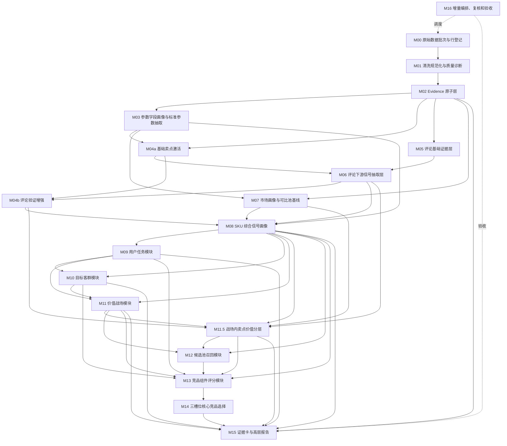

# 00a 竞品生成 SOP 对齐后的模块设计计划

## 1. 本计划依据

本计划已根据以下新增参考材料重新修订：

- `cankao/CatForge_竞品生成SOP_详细指导_v1.md`
- `cankao/CatForge_核心竞品展示页_UI设计规范_v1.md`
- `cankao/catforge_sop_md/README.md`
- `cankao/catforge_sop_md/modules/M00_*.md` 到 `M16_*.md`

本文件只确定总体计划和模块关系，不展开每个模块的完整详细设计。后续按本文顺序一个模块一个模块生成，生成后先讨论确认，再进入下一个模块。

## 2. 新增材料对原计划的关键修正

| 修正点 | 原计划问题 | 新计划处理 |
| --- | --- | --- |
| 增加 M11.5 战场内卖点价值分层 | 原计划从价值战场直接进入候选池，缺少“卖点在该战场里到底是门槛、绩效还是溢价”的判断 | 在 M11 和 M12 之间加入 M11.5，并让 M12/M13/M14/M15 使用该结果 |
| 拆分 M04 | 原计划 M04 使用评论验证，M06 又可能依赖卖点，容易循环 | M04a 只做参数+宣传的基础卖点激活；M04b 在 M06 之后做评论验证增强 |
| 强化 M14 | 原计划虽有三槽位，但还不够强调“不是 TopN” | M14 固定输出 0-3 个核心竞品，只代表三类竞争压力，不输出长竞品列表 |
| 收敛 MVP 范围 | 原计划偏完整生产线 | 一个月 MVP 聚焦批量三竞品、单 SKU 报告、证据卡、简版总览 |
| 引入展示页规范 | 原计划偏后台链路 | M15 必须产出领导汇报页所需聚合 payload，页面结论先行、证据支撑、推导可展开 |

## 3. 设计总原则

1. 下游不得绕过上游直接读取原始表做业务判断，除非只是追溯 evidence。
2. 评论基础分类只作为参考提示，不能直接生成用户任务、客群、战场或竞品结论。
3. 参数、卖点、评论、市场不能一次性“分析完”；每个业务对象必须有独立模块。
4. seed 是业务本体和识别框架，不是 SKU 结论。
5. 缺失是 unknown，不是 false。
6. 任意业务结论必须有 evidence_id、rule_version、asset_version、confidence。
7. 高置信结论必须同时满足数据证据、规则版本、样本充分性。
8. 最终页面只展示核心 2-3 竞品，不展示几十个 TopN。
9. 页面是领导汇报页，不是算法调试台；主屏用业务语言，公式和技术细节进入二级展开。

## 4. 修订后的 SOP 主链路

```text
M00 原始数据批次与行登记
  -> M01 清洗规范化与质量诊断
  -> M02 Evidence 原子层
  -> M03 参数字段画像与标准参数抽取
  -> M04a 基础卖点激活：参数 + 宣传
  -> M05 评论基础证据层
  -> M06 评论下游信号抽取层
  -> M04b 评论验证增强：基础卖点 + 评论信号
  -> M07 市场画像与可比池基线
  -> M08 SKU 综合信号画像
  -> M09 用户任务模块
  -> M10 目标客群模块
  -> M11 价值战场模块
  -> M11.5 战场内卖点价值分层模块
  -> M12 候选池召回模块
  -> M13 竞品组件评分模块
  -> M14 三槽位核心竞品选择模块
  -> M15 证据卡与高层报告模块
  -> M16 增量任务编排、复核和验收模块
```

## 5. 模块依赖图



## 6. 模块数据契约总表

| 模块 | 主要输入 | 主要输出 | 下游消费者 |
| --- | --- | --- | --- |
| M00 原始数据批次与行登记 | `week_sales_data`、`attribute_data`、`selling_points_data`、`comment_data` | `core3_source_batch`、`core3_source_row_registry`、受影响 SKU | M01、M16 |
| M01 清洗规范化与质量诊断 | 原始行登记 | `core3_clean_market_fact`、`core3_clean_param_fact`、`core3_clean_claim_fact`、`core3_clean_comment_fact`、`core3_data_quality_issue` | M02、M03、M04a、M05、M07 |
| M02 Evidence 原子层 | 清洗规范表 | `core3_evidence_atom`、source refs、基础置信度 | 全部下游 |
| M03 参数字段画像与标准参数抽取 | 清洗参数、宣传数值实体、型号、seed 参数 | `core3_param_field_profile`、`core3_extract_param_value`、参数冲突、候选别名 | M04a、M07、M08、M09、M11、M13 |
| M04a 基础卖点激活 | 清洗卖点句、M03 参数、seed 卖点 | `core3_extract_claim_hit`、`core3_sku_claim_activation_base`、候选卖点 | M06、M04b、M08 |
| M05 评论基础证据层 | 清洗评论句、评论维度 | `core3_comment_evidence_atom`、基础主题、情感、产品/服务体验提示 | M06 |
| M06 评论下游信号抽取层 | M05 评论 evidence、M04a 基础卖点、可选 M03 参数 | `core3_comment_downstream_signal`：卖点验证、任务线索、客群线索、战场支撑、痛点、价格感知、服务信号 | M04b、M08、M09、M10、M11、M11.5、M13 |
| M04b 评论验证增强 | M04a 基础卖点、M06 评论卖点验证信号 | `core3_sku_claim_activation` 最终激活、评论增强/削弱信息 | M08、M09、M11、M11.5、M13 |
| M07 市场画像与可比池基线 | 清洗周销、M03 尺寸参数 | `core3_sku_market_profile`、`core3_comparable_pool_baseline`、价格带、渠道占比、销量/销额分位 | M08、M09、M10、M11、M11.5、M12、M13 |
| M08 SKU 综合信号画像 | M03、M04b、M06、M07 | `core3_sku_signal_profile` 或扩展 `core3_sku_feature_profile` | M09、M10、M11、M11.5、M12、M13、M15 |
| M09 用户任务模块 | M08、任务 seed、M06 任务线索、M07 市场 | `core3_sku_task_score`、候选任务 | M10、M11、M13、M15 |
| M10 目标客群模块 | M09、M06 客群线索、M07 价格渠道 | `core3_sku_target_group_score`、候选客群 | M11、M13、M15 |
| M11 价值战场模块 | M08、M09、M10、M06 战场支撑、M07 市场 | `core3_sku_battlefield_score` | M11.5、M12、M13、M14、M15 |
| M11.5 战场内卖点价值分层 | M04b、M06、M07、M08、M11 | `core3_sku_claim_value_layer`，按 `sku_code + battlefield_code + claim_code` 输出分层 | M12、M13、M14、M15 |
| M12 候选池召回 | M08、M11、M11.5、M07 | `core3_competitor_candidate` 初筛和召回证据 | M13、M15 |
| M13 竞品组件评分 | M12、M08、M09、M10、M11、M11.5、M07 | `core3_competitor_component_score`、三槽位角色分、证据质量 | M14、M15 |
| M14 三槽位核心竞品选择 | M13、M11、M11.5、M08 | `core3_competitor_result`，每目标 SKU 0-3 个核心竞品 | M15 |
| M15 证据卡与高层报告 | M14、M13、M08-M11.5、M02 evidence | `core3_evidence_card`、`core3_target_report_payload`、页面聚合 API payload | 页面、导出 |
| M16 增量任务编排、复核和验收 | source registry、版本、复核状态、全链路输出 | job 状态、重算计划、`core3_review_queue`、`core3_acceptance_report` | 全链路 |

## 7. 每个模块统一设计模板

后续每篇模块详细设计都按以下结构写：

```text
1. 模块目标
2. 上游依赖
3. 本模块不做什么
4. 输入数据契约
5. 从参数/卖点/评论/市场中分别消费什么
6. 处理流程
7. 评分或判定逻辑
8. 输出数据契约
9. Evidence 与置信度
10. 候选资产与复核规则
11. 增量重算策略
12. 给下游模块的数据承诺
13. 页面或报告呈现方式
14. 验收标准
15. 待讨论问题
```

如果某模块不消费某类信号，必须明确写“不消费”。

## 8. 分批生成计划

后续不要一次生成所有模块文档。按以下批次推进。

### 批次 1：数据底座

生成顺序：

1. M00 原始数据批次与行登记。
2. M01 清洗规范化与质量诊断。
3. M02 Evidence 原子层。

讨论重点：

- 原始表是否只读。
- 行级 hash、批次、水位、受影响 SKU 是否足够支撑增量。
- Evidence 是否能支撑后续所有结论回溯。

### 批次 2：基础信号抽取

生成顺序：

4. M03 参数字段画像与标准参数抽取。
5. M04a 基础卖点激活。
6. M05 评论基础证据层。
7. M06 评论下游信号抽取层。
8. M04b 评论验证增强。
9. M07 市场画像与可比池基线。

讨论重点：

- M04a/M04b 如何避免循环依赖。
- 评论基础分类只能做参考。
- 评论为卖点、任务、客群、战场、痛点、价格、服务分别产出独立信号。
- 市场画像如何生成可比池基线。

### 批次 3：SKU 画像和业务语义

生成顺序：

10. M08 SKU 综合信号画像。
11. M09 用户任务模块。
12. M10 目标客群模块。
13. M11 价值战场模块。
14. M11.5 战场内卖点价值分层模块。

讨论重点：

- 后续模块如何消费 M08 统一画像和各专用表。
- 任务、客群、战场不能从评论直接贴标签。
- 战场必须同时有语义分和市场分。
- 卖点价值分层必须在战场内计算，不能全局分层。

### 批次 4：竞品推导和高层报告

生成顺序：

15. M12 候选池召回模块。
16. M13 竞品组件评分模块。
17. M14 三槽位核心竞品选择模块。
18. M15 证据卡与高层报告模块。

讨论重点：

- 候选池如何按战场收敛。
- 正面对打、压力、标杆三槽位为什么不同。
- M14 只输出 0-3 个核心竞品，不输出 TopN 大列表。
- M15 如何满足领导汇报页：结论先行、证据矩阵、SOP 轨迹、候选未选原因。

### 批次 5：执行与治理

生成顺序：

19. M16 增量任务编排、复核和验收模块。

讨论重点：

- 每类变化影响哪些模块。
- 复核队列何时产生。
- 哪些结论可以高置信展示，哪些只能提示。
- MVP 验收报告如何区分高/中/低置信和不足。

## 9. 页面设计对 M15 的约束

M15 不能只生成后台 JSON。它必须直接支持核心竞品展示页。

聚合 API payload 至少包含：

- `target_sku`：目标 SKU 摘要、价格带、渠道、核心卖点、主/次战场。
- `executive_conclusion`：一句话业务结论。
- `readiness`：候选池数、有效可比数、已选竞品数、置信度、数据版本。
- `core_competitors`：三槽位竞品卡。
- `evidence_matrix`：价格、渠道、参数、卖点、市场、评论证据。
- `key_difference`：目标优势和竞品优势。
- `strategy_hint`：业务策略启示。
- `sop_trace`：SKU 画像、用户任务、价值战场、候选池、组件评分、三槽位选择。
- `candidate_pool_summary`：候选池和未选原因。

页面主屏禁止：

- 大段算法过程。
- 英文枚举和内部字段。
- AI 炫技文案。
- 十几个竞品列表。
- 没有业务意义的 UUID。

## 10. MVP 最小落地路线

这不是后续立即开发计划，只是用于控制设计优先级。

| 周期 | 设计/实现关注 | 产物 |
| --- | --- | --- |
| 第 1 周 | M00-M02、M03、M04a、M05/M06、M07 | 市场画像、参数画像、基础卖点、评论信号 |
| 第 2 周 | M08-M11.5 | SKU 综合画像、任务、客群、战场、卖点价值分层 |
| 第 3 周 | M12-M14 | 候选池、组件分、核心三竞品 |
| 第 4 周 | M15-M16、前端三页 | 总览、单 SKU 报告、证据卡、验收报告 |

## 11. 当前已有文档的处理

当前已有：

- `04a_comment_modular_extraction.md`
- `05a_user_task_module_design.md`

这两份是前一次讨论快速补充的草稿。后续按本文计划重写或拆分：

- `04a_comment_modular_extraction.md` 归入 M05/M06。
- `05a_user_task_module_design.md` 归入 M09。

在 M00 到 M08 没有确认前，不把 M09 视为最终设计。

## 12. 下一步

请先讨论确认本计划。确认后，下一篇只生成：

```text
M00 原始数据批次与行登记详细设计
```

完成 M00 后先讨论，确认输入、输出、增量边界和下游承诺，再继续 M01。

