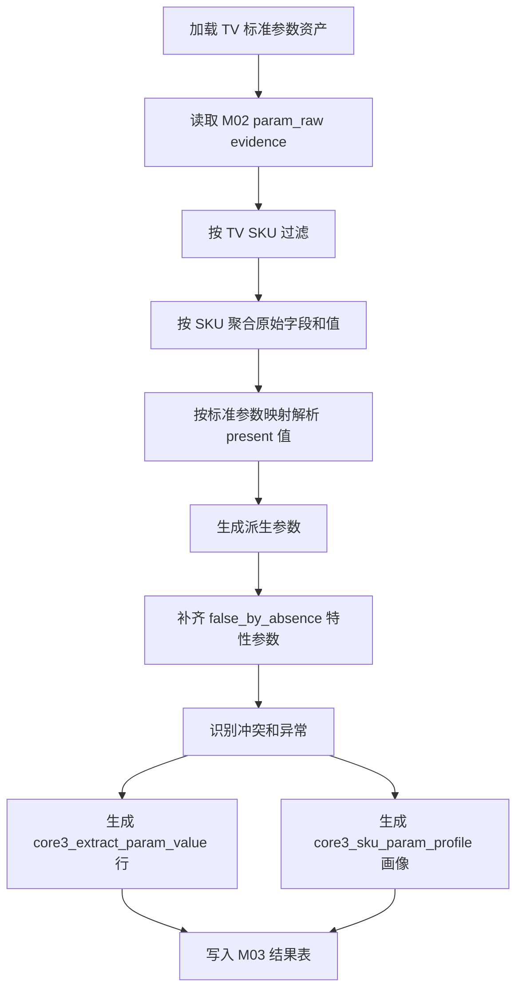

# M03B 彩电 SKU 参数事实画像设计

生成日期：2026-06-20

本文设计新的 M03B：基于已人工复核的 TV 标准参数资产，生成每个彩电 SKU 的参数事实画像。它属于 L2 SKU 事实层，只生成参数事实，不生成卖点、用户任务、目标客群、价值战场或竞品结论。

## 1. 模块定位

### 1.1 与 M03A 的关系

| 模块 | 职责 | 执行频率 | 输出 |
|---|---|---|---|
| M03A | 生成/维护品类标准参数资产 | 低频，人工复核后发布 | TV 标准参数定义、原始字段映射、特性缺失规则、解析规则 |
| M03B | 基于已发布标准参数，为每个 SKU 生成参数事实画像 | 每次新数据进入后可重复执行 | SKU 标准参数值、核心参数分组、完整度、异常和证据 |

当前 TV 标准参数资产来源：

- [tv_param_taxonomy_manual_v1.md](tv_param_taxonomy_manual_v1.md)
- 版本建议：`tv_param_taxonomy_manual_v0.1`

M03B 不再尝试自动生成标准参数，也不调用 LLM。M03B 是确定性处理模块。

### 1.2 与旧 M03 的关系

仓库现有 M03 已有五类结果表：

- `core3_param_field_profile`
- `core3_extract_param_value`
- `core3_param_alias_candidate`
- `core3_param_value_conflict`
- `core3_sku_param_profile`

M03B 设计优先复用这些表，避免下游 M04/M08 重新适配结果接口。差异是：

- 旧 M03 以 seed alias matcher 自动匹配标准参数。
- 新 M03B 以人工发布的 TV 标准参数映射为准，字段映射不再依赖模糊匹配。
- 旧 M03 会尝试从 `promo_sentence` 派生参数；M03B v1 只消费 M02 `param_raw`，卖点/评论对参数的印证留到后续卖点事实和评论事实模块补充。

## 2. 输入边界

### 2.1 必需输入

| 输入 | 来源 | 用途 |
|---|---|---|
| TV 标准参数资产 | M03A 人工发布配置 | 标准参数定义、原始字段映射、缺失规则、解析规则 |
| `param_raw` evidence | M02 `core3_evidence_atom` | 每个 SKU 的原始参数事实 |
| M00 batch 信息 | `core3_source_batch` | batch 边界、增量边界 |

### 2.2 当前 205 数据过滤

205 当前最新批次存在 TV/AC 混品类问题：

- batch：`m00_20260619084551_857df63b`
- `category_code=TV`
- TV SKU：`sku_code like 'TV%'`
- AC SKU：`sku_code like 'AC%'`

M03B-TV 在品类边界修复前必须增加硬过滤：

```text
category_code = 'TV'
and evidence_type = 'param_raw'
and evidence_status = 'current'
and is_current = true
and sku_code like 'TV%'
```

后续 M00/M02 修复品类边界后，`sku_code like 'TV%'` 可以降级为防御性校验。

### 2.3 明确不消费

M03B-TV v1 不消费：

- `comment_raw` / `comment_sentence`
- `promo_raw` / `promo_sentence`
- `market_fact`
- 服务类评论或质量诊断文本

这些数据只在后续卖点事实、评论事实、市场事实模块中与参数画像做相互印证。

## 3. 标准参数资产配置

人工文档需要固化为机器可读配置，建议文件：

```text
apps/api-server/app/services/core3_real_data/assets/tv_param_taxonomy_v0_1.json
```

配置结构：

```json
{
  "taxonomy_version": "tv_param_taxonomy_manual_v0.1",
  "category_code": "TV",
  "source_doc": "docs/core3_mvp/real_data_v2/tv_param_taxonomy_manual_v1.md",
  "missing_as_false_rule_version": "missing_as_false_by_tv_param_taxonomy_v0.1",
  "standard_params": [
    {
      "param_code": "screen_size_inch",
      "param_name": "屏幕尺寸",
      "param_group": "display_basic",
      "data_type": "number",
      "unit": "inch",
      "source_raw_fields": ["尺寸"],
      "parser": "inch",
      "value_policy": "use_present_value",
      "missing_policy": "unknown",
      "core_rank": 10,
      "profile_sections": ["display_basic", "core_picture"]
    }
  ],
  "excluded_raw_fields": [
    {
      "raw_field": "屏幕尺寸",
      "reason": "all_zero_invalid",
      "replacement": "尺寸"
    }
  ]
}
```

### 3.1 `missing_policy`

| policy | 含义 | 示例 |
|---|---|---|
| `unknown` | 缺失就是未知，不写否 | 亮度、RAM、芯片型号 |
| `false_by_absence` | 缺失按不具备该特性 | 摄像头、远场语音、量子点 |
| `derived` | 不直接读原始值，由其他参数派生 | HDMI2.1 数量、尺寸段 |
| `excluded` | 不进入 SKU 参数画像 | 占位 0 字段、空值字段 |

### 3.2 TV 特性标记字段

以下标准参数缺失按否处理，并在画像中写入规则标记：

```text
ai_model_capability_flag
whole_home_control_flag
full_screen_design_flag
wifi_builtin_flag
camera_flag
flush_wall_mount_flag
voice_engine
voice_recognition_flag
slim_design_flag
far_field_voice_flag
quantum_dot_flag
portable_tv_flag
```

缺失补值只进入 `core3_sku_param_profile.param_values_json`。v1 不写 `core3_extract_param_value`，因为该表当前要求 `primary_evidence_id` 非空。若后续需要把缺失补值也做成行级事实，应单独新增 `source_type=taxonomy_rule` 并允许 `primary_evidence_id` 为空，或在 M02 生成参数缺失 evidence。

## 4. 处理流程



### 4.1 读取和聚合

聚合粒度：

```text
batch_id + sku_code + raw_field
```

每个原始字段保留：

- evidence ids
- clean value / raw value
- model_name / brand_name
- base confidence
- quality flags
- source row id

同一 SKU 同一原始字段多值时，保留候选并进入冲突判断。

### 4.2 字段映射

M03B 不再做模糊 alias 匹配。映射只来自 TV 标准参数资产：

```text
raw_field -> one or more standard params
```

示例：

| 原始字段 | 标准参数 |
|---|---|
| 尺寸 | `screen_size_inch` |
| 屏幕刷新率 | `refresh_rate_hz` |
| HDMI参数 | `hdmi_version_mix`, `hdmi_2_1_port_count` |
| HDMI数量 | `hdmi_port_count` |
| 亮度 | `brightness_nit_or_band` |
| 全色域 | `color_gamut_ratio` |
| MINILED | `mini_led_flag` |
| MINILED2 | `mini_led_type` |
| AI大模型 | `ai_model_name`, `ai_model_capability_flag` |
| 能效指数 | `energy_efficiency_index` |

未在配置中的字段不进入参数画像，但写入 run summary 的 `ignored_raw_fields` 便于审计。

## 5. 解析和归一规则

### 5.1 通用输出字段

每个标准参数值输出为：

```json
{
  "param_code": "brightness_nit_or_band",
  "param_name": "亮度",
  "param_group": "picture",
  "value_presence": "present",
  "normalized_value": {"value": 1300, "unit": "nits"},
  "numeric_value": "1300",
  "value_text": "1300",
  "unit": "nits",
  "source_raw_fields": ["亮度"],
  "source_type": "raw_param",
  "evidence_ids": ["..."],
  "confidence": "0.9500",
  "confidence_level": "high",
  "quality_flags": [],
  "rule_version": "m03b_tv_param_profile_v0.1"
}
```

### 5.2 关键 parser

| parser | 用途 | 规则 |
|---|---|---|
| `inch` | 尺寸 | 从 `尺寸` 解析英寸数值；忽略原始 `屏幕尺寸=0` |
| `resolution` | 分辨率 | `3840×2160` -> width/height/4K |
| `hz` | 刷新率 | 解析 Hz；屏幕刷新率归入画质，同时可供游戏场景使用 |
| `nits_or_band` | 亮度 | 数字按 nit；区间如 `400-600` 保留 band，并可取中位数供排序 |
| `percentage_ratio` | 全色域 | `1` -> 100%，`0.98` -> 98%，越接近 100% 越好 |
| `zones` | 分区背光 | 数字为分区数；0 表示无分区或未标注，需要结合 MiniLED 判断 |
| `hdmi_mix` | HDMI 参数 | 解析 HDMI2.0/2.1 组合、端口数量、是否含 HDMI2.1 |
| `usb_mix` | USB 参数 | 解析 USB2.0/3.0 组合、是否含 USB3.0 |
| `gb` | RAM/ROM | 解析 GB |
| `boolean_feature` | 特性标记 | 有有效值为 true；缺失按配置补 false |
| `energy_index` | 能效指数 | 1/2/3/4；`1.3` 归一为 1 |
| `thickness_mm` | 机身厚度 | 解析 mm |

现有 `ParamValueParserRegistry` 已有 `inch/resolution/hz/nits/zones/ports/gb/percentage/boolean_keyword/string/number`，但 M03B-TV 需要新增或增强：

- `nits_or_band`
- `percentage_ratio_without_percent`
- `hdmi_mix`
- `usb_mix`
- `energy_index`
- `feature_presence`
- `mm_dimension`

### 5.3 缺失和占位值

| 情况 | 处理 |
|---|---|
| 标准参数 `missing_policy=unknown` 且 SKU 没有来源字段 | 不写 present 值；在完整度中记 missing |
| 标准参数 `missing_policy=false_by_absence` 且 SKU 没有来源字段 | 在 profile JSON 中补 false |
| 原始值为空、`-`、`未知` | unknown |
| 原始值为占位 0 且字段在排除清单 | 不进入画像 |
| 原始字段混入 AC | TV 运行中过滤掉 |

## 6. 冲突和主值选择

### 6.1 主值选择优先级

同一 SKU 同一标准参数多个候选时：

1. 手工标准参数映射来源优先于派生来源。
2. `source_raw_fields` 中优先级靠前的字段优先。
3. parser 状态 `parsed` 优先于 `unit_uncertain` / `scope_uncertain`。
4. confidence 高者优先。
5. 若值互相矛盾且都高置信，生成 `core3_param_value_conflict`。

### 6.2 典型冲突规则

| 参数 | 冲突识别 |
|---|---|
| `screen_size_inch` | `尺寸` 与型号解析尺寸不一致超过 1 英寸 |
| `refresh_rate_hz` | 多个刷新率值差异明显；高于 240Hz 保留但标 `scope_uncertain` |
| `brightness_nit_or_band` | 数值和区间同时存在且不相交 |
| `mini_led_flag` / `mini_led_type` | `MINILED=否` 但 `MINILED2=QD-MINILED` |
| `resolution_class` | `分辨率` 与 `清晰度/清晰度2` 不一致 |
| `energy_efficiency_index` / `energy_efficiency_grade` | 编码与等级不一致 |

冲突不阻断画像生成。主值进入画像，候选和冲突写入 `quality_summary_json`。

## 7. SKU 参数画像结构

### 7.1 总体 JSON

落表：`core3_sku_param_profile.param_values_json`

```json
{
  "taxonomy_version": "tv_param_taxonomy_manual_v0.1",
  "sku_code": "TV00027549",
  "model_name": "65E3Q",
  "brand_name": "海信",
  "values": {
    "screen_size_inch": {},
    "refresh_rate_hz": {},
    "mini_led_flag": {},
    "ai_model_capability_flag": {}
  },
  "missing": {
    "unknown_param_codes": ["brightness_nit_or_band"],
    "false_by_absence_param_codes": ["camera_flag", "quantum_dot_flag"]
  },
  "excluded": {
    "raw_fields": ["屏幕尺寸", "屏幕面积"]
  }
}
```

### 7.2 分组画像

现有表已有四个 core JSON 字段，但旧分组不完全贴合新 TV 标准参数。M03B-TV v1 保持字段名不变，重新定义内容：

| 字段 | 内容 |
|---|---|
| `core_picture_params_json` | 尺寸、分辨率、刷新率、亮度、HDR、MiniLED、分区、背光、色域、量子点、RGB |
| `core_gaming_params_json` | 刷新率、HDMI2.1、HDMI 数量、USB、低延迟/VRR/ALLM 若后续有字段 |
| `core_system_params_json` | CPU/GPU/芯片、RAM、ROM、OS、AI、语音、摄像头、内容生态 |
| `core_eye_care_params_json` | v1 只有 HDR/亮度/刷新率可作为间接观看舒适参数；不生成护眼结论 |

额外在 `quality_summary_json` 中增加：

```json
{
  "taxonomy_version": "tv_param_taxonomy_manual_v0.1",
  "missing_as_false_rule_version": "missing_as_false_by_tv_param_taxonomy_v0.1",
  "known_param_count": 42,
  "unknown_param_count": 8,
  "false_by_absence_count": 6,
  "excluded_raw_field_count": 9,
  "conflict_count": 0,
  "parse_warning_count": 1,
  "category_boundary_filter": "sku_code_prefix_TV"
}
```

### 7.3 完整度

不要用所有标准参数平均计算完整度。M03B-TV 应定义核心参数集合：

```text
screen_size_inch
resolution_class
refresh_rate_hz
brightness_nit_or_band
mini_led_flag
mini_led_type
local_dimming_zone_count
color_gamut_ratio
ram_gb
storage_gb
os_family
hdmi_port_count
hdmi_version_mix
energy_efficiency_grade
```

`param_completeness = known_core_count / core_param_count`

`false_by_absence` 的特性字段算 known，因为它是明确规则判断；`unknown` 不算 known。

## 8. 落表策略

### 8.1 复用现有表

| 表 | M03B 用法 |
|---|---|
| `core3_param_field_profile` | 可选保留字段画像；字段匹配来自标准参数资产，不做模糊匹配 |
| `core3_extract_param_value` | 写 present/unknown 且有 M02 evidence 的标准参数值 |
| `core3_param_value_conflict` | 写同 SKU 同参数冲突 |
| `core3_sku_param_profile` | 写完整 SKU 参数画像，包括 false_by_absence 补值 |

### 8.2 不写 `extract_param_value` 的值

以下值 v1 只写入 `core3_sku_param_profile.param_values_json`：

- 缺失补 false 的特性参数
- 纯派生且无单一 primary evidence 的参数
- 被排除字段的审计信息

原因：现有 `core3_extract_param_value.primary_evidence_id` 非空且外键到 M02 evidence。缺失补值没有天然 evidence id。

### 8.3 版本号

建议：

```text
taxonomy_version = tv_param_taxonomy_manual_v0.1
seed_version = tv_param_taxonomy_manual_v0.1
parser_version = m03b_tv_parser_v0.1
rule_version = m03b_tv_param_profile_v0.1
```

## 9. API 和 CLI

### 9.1 API

沿用或新增：

```text
POST /api/mvp/core3/v2/projects/{project_id}/batches/{batch_id}/params/run
GET  /api/mvp/core3/v2/projects/{project_id}/skus/{sku_code}/params
```

新增请求字段：

```json
{
  "category_code": "TV",
  "taxonomy_version": "tv_param_taxonomy_manual_v0.1",
  "target_sku_codes": [],
  "force_rebuild": true
}
```

### 9.2 CLI/Skill

后续预处理 skill 可以支持自然语言：

```text
生成彩电 SKU 参数画像
```

底层执行：

```text
catforge-realdata m03b tv-param-profiles \
  --project-id ... \
  --batch-id ... \
  --taxonomy-version tv_param_taxonomy_manual_v0.1
```

CLI 必须支持 `--target-sku-codes`，方便先对少量 SKU 烟测。

## 10. 验收标准

### 10.1 单 SKU 验收

任选 3 个 TV SKU，验证：

- `尺寸` 正确生成 `screen_size_inch`。
- `屏幕刷新率` 正确生成 `refresh_rate_hz`，归入画质。
- `亮度` 按 nit 处理。
- `全色域` 的 0.98/1 归一为百分比。
- `HDMI参数` 生成 HDMI 版本组合和 HDMI2.1 端口派生。
- `摄像头/远场语音/量子点/无缝贴墙` 缺失时补 false。
- `屏幕尺寸=0`、`屏幕面积=0` 不进入画像。

### 10.2 全批次验收

对 205 当前数据：

- 只处理 `TV%` SKU，预期约 293 个 TV SKU。
- 不处理 `AC%` SKU。
- 每个 SKU 都生成一条 `core3_sku_param_profile`。
- `review_required_count` 大部分为 0；只有真实冲突或异常值才触发。
- 输出 summary 包含：
  - sku_profile_count
  - param_value_count
  - false_by_absence_count
  - conflict_count
  - ignored_raw_field_count
  - category_boundary_filter

### 10.3 越界验收

M03B 必须有测试保证：

- 不读取评论。
- 不读取卖点。
- 不读取周销。
- 不生成卖点、任务、客群、战场、竞品结论。
- 不把质量信息当作正向业务证据。

## 11. 实现拆分建议

建议后续实现分 6 个小闭环：

| 闭环 | 内容 | 验收 |
|---|---|---|
| M03B-1 | TV 标准参数资产 JSON + loader | 配置校验、字段映射完整 |
| M03B-2 | TV 专用 parser 增强 | 亮度、色域、HDMI、USB、能效、缺失特性 parser 通过 |
| M03B-3 | M02 evidence reader + TV SKU 过滤 | 205 批次只读 TV% SKU |
| M03B-4 | 标准参数值抽取和派生 | 单 SKU 参数值正确 |
| M03B-5 | SKU profile builder 改造 | false_by_absence 写入 profile JSON |
| M03B-6 | API/CLI/全批次验收 | 205 全量 TV SKU 跑通，summary 可解释 |

## 12. 待确认点

1. `false_by_absence` 是否长期只写 profile JSON，还是需要新增 `taxonomy_rule` evidence/param value 行。
2. `core_eye_care_params_json` 是否继续保留旧字段名，还是在后续 M08 统一改为更通用的 `core_comfort_params_json`。
3. 内容生态参数是否归入 `core_system_params_json`，还是后续新增 `core_content_params_json`。
4. M03B 是否要立即覆盖旧 M03 runner，还是先以新 rule_version 并行跑，验证稳定后替换。
