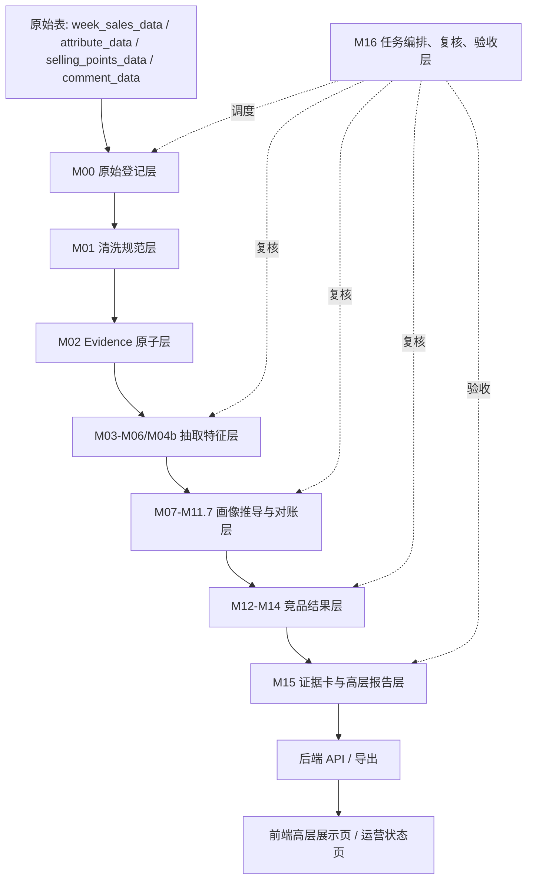
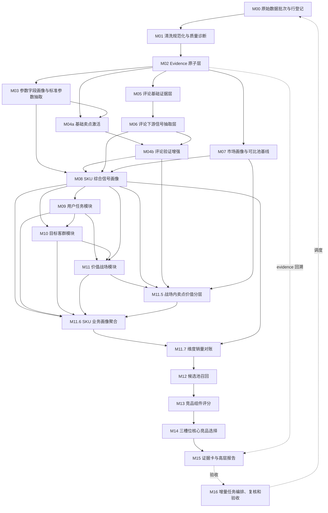

# 00 总体架构与数据字典详细设计

## 1. 设计目标

本文是 CatForge 彩电核心三竞品真实数据 v2 的总体详细设计。它承接 `sop_requirements/` 中 M00-M16 的需求文档，统一后续模块详细设计必须遵守的架构、数据分层、表命名、通用字段、状态枚举、hash 和版本规则、API 边界、前端边界和测试策略。

本文不是开发任务拆分，不写代码，不替代 M00-M16 的模块详细设计。后续模块文档必须复用本文的统一契约；如果模块详细设计需要新增表、字段或状态，必须说明是否扩展本文契约。

## 2. 现状和边界

### 2.1 当前仓库技术基线

后端现状：

- Python 3.11+。
- FastAPI。
- Pydantic。
- SQLAlchemy 2.x。
- Alembic。
- PostgreSQL 为目标数据库。

前端现状：

- React。
- TypeScript。
- Vite。
- Ant Design。
- 已有独立 `core3` 页面族，不能混回 Goal1/Goal3 workbench。

当前已有 MVP 表包括：

- `core3_pipeline_run`
- `core3_sku_market_profile`
- `core3_sku_feature_profile`
- `core3_competitor_candidate`
- `core3_competitor_result`
- `core3_evidence_card`

这些表属于早期粗粒度 MVP 实现，只能作为兼容参考。真实数据 v2 的详细设计以 M00-M16 文档中的细分表为准。后续开发可以选择扩展现有表或迁移到新表，但不能继续把清洗、证据、抽取、画像、评分和报告混在少数粗粒度 JSON 表里。

### 2.2 真实数据基线

当前 205 PostgreSQL `catforge_dev` 样例数据：

| 原始表 | 行数 | 覆盖 |
| --- | ---: | --- |
| `week_sales_data` | 1326 | 35 个型号，26W01-26W23，线上渠道，专业电商/平台电商 |
| `attribute_data` | 2843 | 35 个型号，84 类属性，unknown/空值/`-` 较多 |
| `selling_points_data` | 65 | 只覆盖 5 个型号，每个 13 条卖点 |
| `comment_data` | 62426 | 33 个型号，34438 个评论 ID，13514 个去重正文 |

全量样例当前都是海信。三竞品不能按外部品牌过滤，海信内部 SKU 可以互为竞品。

85E7Q 的 `model_code=TV00029115`，有量价、参数、评论，但无结构化卖点。任何卖点结论都必须表达为“宣传卖点证据缺口 + 参数/评论补证”，不能伪造宣传证据。

## 3. 总体架构

### 3.1 分层架构



### 3.2 核心原则

| 原则 | 工程约束 |
| --- | --- |
| 原始只读 | 不更新、不删除、不清洗覆盖原始表 |
| 分层落表 | 清洗、证据、抽取、画像、评分、报告分表保存 |
| Evidence first | 业务结论必须带 `evidence_ids` 或明确缺失原因 |
| 缺失即未知 | null、空字符串、`-`、unknown 不能当 false |
| 同品牌可竞品 | 不按品牌内外部排除候选 |
| 评论不越权 | 评论不能单独高置信生成任务、客群、战场或竞品结论 |
| 服务边界 | 安装、物流、售后不能替代产品核心竞争证据 |
| 结论先行 | 高层页面先展示核心竞品和业务理由，再展开证据 |
| 可增量 | 每层有 hash、版本、水位和重算边界 |
| 可复核 | 低置信、冲突、样本不足必须进入复核 |

## 4. 模块 DAG



任何下游模块缺少必要上游产物时，应输出复核或阻断状态，不能直接读取原始表补算。

## 5. 数据层和表清单

### 5.1 原始表

原始表由上传方或外部导入流程维护，v2 处理链只读。

| 表 | 业务含义 | 主键来源 |
| --- | --- | --- |
| `week_sales_data` | 周销量、销额、均价、渠道、平台 | `id` |
| `attribute_data` | 型号属性参数 | `id` |
| `selling_points_data` | 结构化卖点 | `id` |
| `comment_data` | 评论、分段、维度、情感 | `id` |

### 5.2 原始登记层

| 表 | 模块 | 用途 |
| --- | --- | --- |
| `core3_source_batch` | M00 | 记录一次扫描或增量批次 |
| `core3_source_row_registry` | M00 | 记录原始行、行 hash、变化状态 |
| `core3_source_impacted_sku` | M00 | 记录本批受影响 SKU 和建议触发模块 |

### 5.3 清洗规范层

| 表 | 模块 | 用途 |
| --- | --- | --- |
| `core3_clean_sku` | M01 | SKU 主数据清洗和覆盖情况 |
| `core3_clean_market_weekly` | M01 | 周销量价清洗事实 |
| `core3_clean_attribute` | M01 | 参数清洗事实 |
| `core3_clean_claim` | M01 | 结构化卖点清洗事实 |
| `core3_clean_claim_sentence` | M01 | 卖点句级切分 |
| `core3_clean_comment` | M01 | 评论原文清洗和去重准备 |
| `core3_clean_comment_sentence` | M01 | 评论句级切分 |
| `core3_clean_comment_dimension` | M01 | 原始评论维度弱标签 |
| `core3_data_quality_issue` | M01 | 清洗和覆盖质量问题 |

### 5.4 Evidence 原子层

| 表 | 模块 | 用途 |
| --- | --- | --- |
| `core3_evidence_atom` | M02 | 市场、参数、卖点、评论、质量问题的统一证据原子 |
| `core3_evidence_link` | M02 | 证据间关系，例如评论正文、分句、维度拆行关系 |

MVP 可先把 link 所需字段保留在 `core3_evidence_atom` 中，但详细设计应保留 `core3_evidence_link` 表位，避免后续评论拆行关系无法表达。

### 5.5 抽取特征层

| 表 | 模块 | 用途 |
| --- | --- | --- |
| `core3_param_field_profile` | M03 | 原始参数字段画像 |
| `core3_extract_param_value` | M03 | 标准参数值抽取 |
| `core3_param_alias_candidate` | M03 | 未映射高覆盖字段候选 |
| `core3_param_value_conflict` | M03 | 参数冲突 |
| `core3_sku_param_profile` | M03 | SKU 级参数画像 |
| `core3_extract_claim_hit` | M04a | 卖点命中明细 |
| `core3_sku_claim_source_status` | M04a | SKU 卖点来源覆盖状态 |
| `core3_sku_claim_activation_base` | M04a | 基础卖点激活 |
| `core3_comment_unit` | M05 | 去重评论单元 |
| `core3_comment_evidence_atom` | M05 | 评论专用句级证据 |
| `core3_comment_topic_hint` | M05 | 评论弱主题提示 |
| `core3_comment_quality_profile` | M05 | SKU 评论质量画像 |
| `core3_comment_signal_candidate` | M06 | 句级评论信号候选 |
| `core3_comment_downstream_signal` | M06 | 下游专用评论信号 |
| `core3_sku_comment_signal_profile` | M06 | SKU 级评论信号画像 |
| `core3_sku_claim_comment_validation` | M04b | 评论对卖点的验证/削弱 |
| `core3_sku_claim_activation` | M04b | 最终卖点激活 |
| `core3_claim_comment_review_issue` | M04b | 评论增强复核问题 |

### 5.6 画像推导层

| 表 | 模块 | 用途 |
| --- | --- | --- |
| `core3_sku_market_profile` | M07 | SKU 市场画像 |
| `core3_market_signal` | M07 | 下游消费的市场信号 |
| `core3_comparable_pool_baseline` | M07 | 可比池定义和统计 |
| `core3_market_pool_member` | M07 | 可比池成员 |
| `core3_sku_signal_profile` | M08 | SKU 综合信号画像 |
| `core3_sku_signal_evidence_matrix` | M08 | SKU 证据覆盖矩阵 |
| `core3_sku_downstream_feature_view` | M08 | 下游任务/客群/战场特征视图 |
| `core3_sku_task_candidate` | M09 | 用户任务候选 |
| `core3_sku_task_score` | M09 | 用户任务得分 |
| `core3_sku_task_evidence_breakdown` | M09 | 任务证据拆分 |
| `core3_sku_task_review_issue` | M09 | 任务复核问题 |
| `core3_sku_target_group_candidate` | M10 | 客群候选 |
| `core3_sku_target_group_score` | M10 | 客群得分 |
| `core3_sku_target_group_evidence_breakdown` | M10 | 客群证据拆分 |
| `core3_sku_target_group_review_issue` | M10 | 客群复核问题 |
| `core3_sku_battlefield_candidate` | M11 | 战场候选 |
| `core3_sku_battlefield_score` | M11 | 战场得分 |
| `core3_sku_battlefield_evidence_breakdown` | M11 | 战场证据拆分 |
| `core3_sku_battlefield_portfolio` | M11 | SKU 战场组合摘要 |
| `core3_sku_battlefield_review_issue` | M11 | 战场复核问题 |
| `core3_sku_battlefield_claim_candidate` | M11.5 | 战场内卖点候选 |
| `core3_sku_claim_value_layer` | M11.5 | 战场内卖点价值层 |
| `core3_sku_claim_value_evidence_breakdown` | M11.5 | 卖点价值证据拆分 |
| `core3_sku_battlefield_claim_value_summary` | M11.5 | 战场内卖点组合摘要 |
| `core3_sku_claim_value_review_issue` | M11.5 | 卖点价值复核问题 |
| `core3_sku_business_profile` | M11.6 | SKU 业务画像主表 |
| `core3_sku_business_profile_dimension` | M11.6 | 卖点、任务、客群、战场候选排序和证据 |
| `core3_sku_business_profile_sales_allocation` | M11.6 | 卖点、任务、客群、战场销量/销额估算支撑 |
| `core3_sku_business_profile_review_issue` | M11.6 | SKU 业务画像复核问题 |
| `core3_business_dimension_sales_summary` | M11.7 | 卖点、任务、客群、战场市场规模汇总 |
| `core3_business_dimension_sku_contribution` | M11.7 | 维度内 SKU 销量/销额贡献 |
| `core3_business_sales_reconciliation_check` | M11.7 | 维度销量守恒检查 |
| `core3_business_sales_reconciliation_issue` | M11.7 | 对账失败原因定位 |

### 5.7 竞品结果层

| 表 | 模块 | 用途 |
| --- | --- | --- |
| `core3_candidate_recall_run` | M12 | 候选召回运行 |
| `core3_candidate_pool` | M12 | 目标-候选 pair |
| `core3_candidate_recall_reason` | M12 | 候选召回理由 |
| `core3_candidate_feature_snapshot` | M12 | M13 可直接消费的 pair 特征快照 |
| `core3_candidate_recall_review_issue` | M12 | 候选召回复核问题 |
| `core3_candidate_component_score` | M13 | 候选组件分 |
| `core3_candidate_role_score` | M13 | 候选角色分 |
| `core3_candidate_component_explanation` | M13 | 组件中文解释和证据 |
| `core3_candidate_score_review_issue` | M13 | 评分复核问题 |
| `core3_competitor_selection_run` | M14 | 三槽位选择运行 |
| `core3_competitor_selection` | M14 | 入选核心竞品 |
| `core3_competitor_slot_decision` | M14 | 每个槽位选择/空槽状态 |
| `core3_competitor_selection_audit` | M14 | 入选、未选和去重审计 |
| `core3_competitor_selection_review_issue` | M14 | 选择复核问题 |

### 5.8 报告和治理层

| 表 | 模块 | 用途 |
| --- | --- | --- |
| `core3_evidence_card` | M15 | 核心竞品证据卡 |
| `core3_target_report_payload` | M15 | 单 SKU 高层报告 payload |
| `core3_report_section` | M15 | 报告章节内容和展示顺序 |
| `core3_report_export` | M15 | JSON/Markdown/摘要导出 |
| `core3_pipeline_run` | M16 | 全链路运行 |
| `core3_module_run` | M16 | 模块运行状态 |
| `core3_recompute_plan` | M16 | 增量重算计划 |
| `core3_module_dependency_snapshot` | M16 | 模块依赖 hash 快照 |
| `core3_review_queue` | M16 | 复核队列 |
| `core3_review_decision` | M16 | 人工复核决策 |
| `core3_acceptance_report` | M16 | 验收报告 |
| `core3_release_gate` | M16 | 发布门禁 |
| `core3_pipeline_watermark` | M16 | 原始表和模块处理水位 |

## 6. 通用字段规范

### 6.1 标识字段

| 字段 | 类型建议 | 必填 | 说明 |
| --- | --- | --- | --- |
| `id` | `uuid/text` | 是 | 技术主键。模块内也可使用更具语义的 `*_id` |
| `project_id` | `text` | 是 | 项目编号 |
| `category_code` | `text` | 是 | 品类，彩电固定为 `TV` |
| `batch_id` | `text` | 条件必填 | 数据批次，M00-M15 结果都应可追溯 |
| `run_id` | `text` | 条件必填 | M16 pipeline run 或模块运行 |
| `module_run_id` | `text` | 条件必填 | 对应模块运行 |
| `sku_code` | `text` | SKU 粒度必填 | 标准 SKU 编码，首版来自 `model_code` |
| `target_sku_code` | `text` | 目标粒度必填 | 竞品生成目标 SKU |
| `candidate_sku_code` | `text` | pair 粒度必填 | 候选 SKU |

### 6.2 来源追溯字段

| 字段 | 类型建议 | 说明 |
| --- | --- | --- |
| `source_table` | `text` | 原始表名 |
| `source_pk` | `text` | 原始表主键 |
| `source_row_id` | `text` | `source_table + ':' + source_pk` |
| `source_row_hash` | `text` | 原始行 hash |
| `clean_table` | `text` | 清洗表名 |
| `clean_record_key` | `text` | 清洗记录稳定键 |
| `clean_hash` | `text` | 清洗结果 hash |
| `evidence_ids` | `jsonb/text[]` | 支撑证据 |
| `representative_evidence_ids` | `jsonb/text[]` | 页面或解释用代表证据 |

PostgreSQL 首版建议 `evidence_ids` 使用 `jsonb`，避免跨模块 link 表尚未完善时迁移过重；M02 详细设计再决定是否拆 `core3_evidence_link`。

### 6.3 版本和 hash 字段

| 字段 | 类型建议 | 说明 |
| --- | --- | --- |
| `rule_version` | `text` | 模块规则版本 |
| `ruleset_version` | `text` | 全链路规则版本 |
| `module_version` | `text` | 模块实现版本 |
| `seed_version` | `text` | seed 或本体版本 |
| `asset_version` | `text` | 资产版本 |
| `hash_version` | `text` | hash 算法版本 |
| `input_hash` | `text` | 模块输入 hash |
| `dependency_hash` | `text` | 上游依赖 hash |
| `output_hash` | `text` | 本模块输出 hash |
| `profile_hash` | `text` | M08 SKU 画像 hash |

hash 计算必须稳定：字段名排序、null 和空值保留原语义、JSON 序列化固定 key 顺序、记录 `hash_version`。

### 6.4 质量和复核字段

| 字段 | 类型建议 | 说明 |
| --- | --- | --- |
| `quality_status` | `text` | ok/warning/error |
| `confidence` | `numeric` | 0-1 |
| `confidence_level` | `text` | high/medium/low/unknown |
| `sample_status` | `text` | sufficient/limited/insufficient |
| `review_status` | `text` | auto_pass/review_required/approved/rejected/waived |
| `review_required` | `boolean` | 是否需要复核 |
| `review_reason` | `text/jsonb` | 复核原因 |
| `risk_flags` | `jsonb` | 风险标记 |
| `missing_signals_json` | `jsonb` | 缺失信号 |

### 6.5 审计字段

| 字段 | 类型建议 | 说明 |
| --- | --- | --- |
| `created_at` | `timestamptz` | 创建时间 |
| `updated_at` | `timestamptz` | 更新时间 |
| `created_by` | `text` | 创建人或任务 |
| `updated_by` | `text` | 更新人或任务 |
| `is_current` | `boolean` | 是否当前版本 |
| `valid_from` | `timestamptz` | 版本有效起点 |
| `valid_to` | `timestamptz` | 版本有效终点 |

旧结果不物理删除。新运行产生新版本，旧版本通过 `is_current=false` 或 `valid_to` 标记失效。

## 7. 通用枚举

### 7.1 模块代码

```text
M00, M01, M02, M03, M04a, M05, M06, M04b, M07, M08,
M09, M10, M11, M11.5, M11.6, M11.7, M12, M13, M14, M15, M16
```

### 7.2 数据域

| 枚举 | 含义 |
| --- | --- |
| `sku` | SKU 主数据 |
| `market` | 量价和渠道平台 |
| `param` | 参数 |
| `claim` | 卖点 |
| `comment` | 评论 |
| `quality` | 质量问题 |
| `profile` | SKU 画像 |
| `task` | 用户任务 |
| `target_group` | 目标客群 |
| `battlefield` | 价值战场 |
| `claim_value` | 卖点价值层 |
| `candidate` | 候选 |
| `score` | 评分 |
| `selection` | 三槽位选择 |
| `report` | 报告 |

### 7.3 evidence 类型

| 类型 | 来源 |
| --- | --- |
| `sku_fact` | `core3_clean_sku` |
| `market_fact` | `core3_clean_market_weekly` |
| `param_raw` | `core3_clean_attribute` |
| `promo_raw` | `core3_clean_claim` |
| `promo_sentence` | `core3_clean_claim_sentence` |
| `comment_raw` | `core3_clean_comment` |
| `comment_sentence` | `core3_clean_comment_sentence` |
| `comment_dimension` | `core3_clean_comment_dimension` |
| `quality_issue` | `core3_data_quality_issue` |

### 7.4 运行状态

| 状态 | 说明 |
| --- | --- |
| `pending` | 已计划未执行 |
| `running` | 正在执行 |
| `success` | 成功 |
| `warning` | 成功但有非阻断问题 |
| `review_required` | 成功但需复核 |
| `blocked` | 缺上游或有阻断问题 |
| `failed` | 执行失败 |
| `skipped_reused` | 复用历史结果 |
| `skipped_by_dependency` | 上游失败导致跳过 |
| `released` | 已发布 |
| `deprecated` | 被新版本替代 |

### 7.5 发布门禁状态

| 状态 | 含义 |
| --- | --- |
| `not_ready` | 尚未生成完整报告 |
| `review_required` | 需要人工复核 |
| `releasable` | 可汇报或导出 |
| `released` | 已发布 |
| `blocked` | 阻断发布 |

### 7.6 竞品角色

| 角色 | 中文名 |
| --- | --- |
| `direct` | 正面对打竞品 |
| `pressure` | 价格/销量挤压竞品 |
| `benchmark_potential` | 高端标杆/潜在下探竞品 |

三槽位最多输出 0-3 个核心竞品，不输出 TopN 主列表。

## 8. 主键、唯一键和索引规则

### 8.1 主键规则

所有业务表使用字符串 UUID 或稳定 hash ID 做主键。建议：

```text
<table_short>_id
```

例如：

- `batch_id`
- `evidence_id`
- `profile_id`
- `candidate_id`
- `selection_id`
- `report_payload_id`

### 8.2 唯一键规则

同一业务粒度下必须有唯一键，避免重复写入。典型规则：

| 粒度 | 唯一键建议 |
| --- | --- |
| 原始行登记 | `project_id + category_code + source_table + source_pk + hash_version` |
| 清洗市场行 | `batch_id + source_row_id + clean_hash` |
| 参数值 | `batch_id + sku_code + param_code + value_source + rule_version` |
| SKU 画像 | `batch_id + sku_code + profile_hash + rule_version` |
| 任务得分 | `batch_id + sku_code + task_code + profile_hash + rule_version` |
| 候选 pair | `batch_id + target_sku_code + candidate_sku_code + recall_run_id` |
| 角色分 | `batch_id + target_sku_code + candidate_sku_code + role_code + score_version` |
| 三槽位选择 | `selection_run_id + target_sku_code + role_code` |
| 报告 payload | `batch_id + target_sku_code + selection_run_id + report_rule_version` |

### 8.3 索引规则

所有表至少按以下字段建立索引：

- `project_id`
- `category_code`
- `batch_id`
- `run_id` 或 `module_run_id`
- `sku_code`
- `target_sku_code`
- `candidate_sku_code`
- `created_at`

证据、评论和候选 pair 表还需要额外索引：

- `evidence_id`
- `source_row_id`
- `comment_id`
- `comment_text_hash`
- `segment_text_hash`
- `target_sku_code + candidate_sku_code`

## 9. Evidence 引用规则

### 9.1 引用方式

业务表不得只保存结论。凡是用于下游判断的结论都必须至少包含：

```text
evidence_ids
confidence
sample_status
rule_version
review_status
```

如果没有 evidence，必须写入缺失原因，例如：

```text
missing_structured_claim
insufficient_comment_sample
market_sample_limited
param_unknown
```

### 9.2 短证据编号

M15 高层页面不得展示原始 UUID。报告层需要把 `evidence_id` 映射为短编号：

```text
E-价格-001
E-参数-004
E-评论-012
E-质量-003
```

短编号只用于展示，必须能回溯到 `core3_evidence_atom.evidence_id`。

### 9.3 质量 evidence

质量 evidence 只说明数据覆盖或质量风险，不能直接说明业务能力弱。

示例：

```text
85E7Q 无结构化卖点 evidence
=> 生成 claim_coverage_missing 质量 evidence
=> 不生成“85E7Q 卖点弱”结论
```

## 10. 增量和版本策略

### 10.1 输入水位

M00 负责原始表水位：

| 原始表 | 水位字段 |
| --- | --- |
| `week_sales_data` | `id`、`write_time`、row_hash |
| `attribute_data` | `id`、`write_time`、row_hash |
| `selling_points_data` | `id`、`write_time`、row_hash |
| `comment_data` | `id`、`write_time`、`comment_id`、正文 hash、分句 hash |

M16 负责记录全链路水位到 `core3_pipeline_watermark`。

### 10.2 重算传播

| 变化 | 起点 | 下游 |
| --- | --- | --- |
| 周销量价变化 | M01/M02/M07 | M08-M15 |
| 参数变化 | M01/M02/M03 | M04a、M08-M15 |
| 卖点变化 | M01/M02/M04a | M04b、M08-M15 |
| 评论变化 | M01/M02/M05 | M06、M04b、M08-M15 |
| seed 或规则变化 | 对应模块 | 对应模块及全部下游 |
| 复核决策变化 | 被复核模块 | 需要时触发下游重算 |

### 10.3 历史版本

所有结果层和画像层默认保留历史，不覆盖旧记录。查询当前结果时按：

1. `is_current=true`
2. 最新 `run_id`
3. 最新 `created_at`

三者组合确定当前结果。开发阶段不得依赖“删除旧记录后插入新记录”的方式实现 current。

## 11. 服务和任务边界

### 11.1 后端包建议

真实数据 v2 建议新增或扩展独立包：

```text
apps/api-server/app/services/core3_real_data/
```

建议服务拆分：

| 服务 | 职责 |
| --- | --- |
| `source_registry_service.py` | M00 |
| `cleaning_service.py` | M01 |
| `evidence_service.py` | M02 |
| `param_extraction_service.py` | M03 |
| `claim_activation_service.py` | M04a/M04b |
| `comment_evidence_service.py` | M05 |
| `comment_signal_service.py` | M06 |
| `market_profile_service.py` | M07 |
| `sku_signal_profile_service.py` | M08 |
| `task_group_battlefield_service.py` | M09-M11 |
| `claim_value_layer_service.py` | M11.5 |
| `sku_business_profile_service.py` | M11.6 |
| `dimension_sales_reconciliation_service.py` | M11.7 |
| `candidate_recall_service.py` | M12 |
| `component_scoring_service.py` | M13 |
| `core3_selection_service.py` | M14 |
| `evidence_report_service.py` | M15 |
| `pipeline_orchestration_service.py` | M16 |

现有 `apps/api-server/app/services/core3_mvp/` 可保留用于旧 MVP 页面兼容。新服务不应继续把全部链路压缩进 `feature_pipeline.py` 或 `competitor_engine.py`。

### 11.2 Repository 边界

建议按层建立 repository：

| Repository | 访问范围 |
| --- | --- |
| `RawSourceRepository` | 只读四张原始表 |
| `SourceRegistryRepository` | M00 登记表 |
| `CleanRepository` | M01 清洗表 |
| `EvidenceRepository` | M02 evidence |
| `FeatureRepository` | M03-M08 抽取和画像 |
| `ScoreRepository` | M09-M13 分数和推导 |
| `CompetitorRepository` | M12-M14 候选和选择 |
| `ReportRepository` | M15 报告 |
| `JobRepository` | M16 运行、复核、验收 |

除 `RawSourceRepository` 外，其他 repository 不允许直接读原始表。

### 11.3 Runner 边界

M16 调用模块 runner，而不是调用散函数：

```text
Core3ModuleRunner.run(module_code, run_context, target_scope)
```

每个 runner 输出：

- `status`
- `input_count`
- `output_count`
- `output_hash`
- `review_issues`
- `warnings`
- `downstream_impacts`

## 12. API 分层

### 12.1 内部调度 API

运营或任务系统使用：

| API | 用途 |
| --- | --- |
| `POST /api/mvp/core3/v2/projects/{project_id}/pipeline/run` | 启动全链路或增量运行 |
| `GET /api/mvp/core3/v2/projects/{project_id}/pipeline/runs/{run_id}` | 查看运行状态 |
| `GET /api/mvp/core3/v2/projects/{project_id}/review-queue` | 查看复核队列 |
| `POST /api/mvp/core3/v2/projects/{project_id}/review-queue/{review_id}/decision` | 提交复核决策 |
| `GET /api/mvp/core3/v2/projects/{project_id}/acceptance/{run_id}` | 查看验收报告 |

### 12.2 业务展示 API

高层页面使用：

| API | 用途 |
| --- | --- |
| `GET /api/mvp/core3/v2/projects/{project_id}/targets/{sku_or_model}/report` | 单 SKU 高层报告 |
| `GET /api/mvp/core3/v2/projects/{project_id}/targets/{sku_or_model}/evidence-cards` | 证据卡 |
| `GET /api/mvp/core3/v2/projects/{project_id}/overview` | 批量总览 |
| `GET /api/mvp/core3/v2/projects/{project_id}/exports/report` | 报告导出 |

业务展示 API 返回中文业务字段和聚合 payload，不返回内部表名、SQL、UUID、模型过程或调试字段。

### 12.3 技术追溯 API

技术追溯只给运营/内部查看，不进高层主屏：

| API | 用途 |
| --- | --- |
| `GET /api/mvp/core3/v2/projects/{project_id}/evidence/{short_evidence_code}` | 短证据编号回溯 |
| `GET /api/mvp/core3/v2/projects/{project_id}/targets/{sku}/sop-trace` | 7 步业务推导轨迹 |
| `GET /api/mvp/core3/v2/projects/{project_id}/targets/{sku}/candidate-audit` | 候选池和未选原因 |

## 13. 前端页面边界

### 13.1 页面分区

前端继续保持独立三竞品页面族，不混入 Goal1/Goal3：

| 页面 | 面向对象 | 内容 |
| --- | --- | --- |
| 批量总览 | 业务/运营 | 可发布报告数量、复核数量、核心三竞品概览 |
| 单品报告 | 业务领导 | 目标 SKU、核心竞品、为什么是竞品、证据和策略含义 |
| 证据卡片 | 业务/分析人员 | 每个竞品的证据卡和短证据编号 |
| 生产线状态 | 运营/数据人员 | M16 运行状态、复核、验收、发布门禁 |

### 13.2 高层页面禁止内容

高层主屏不得出现：

- 英文内部字段名。
- UUID。
- SQL。
- JSON 大段结构。
- M00-M16 完整技术链路。
- AI 生成过程、模型思考、机器人话术。
- 原始大表。

高层主屏必须先展示：

1. 核心竞品是谁。
2. 每个竞品代表什么压力。
3. 为什么是竞品。
4. 证据强度和限制。
5. 策略含义。

### 13.3 前端不重算

前端只展示后端 payload，不重新拼业务结论，不重新计算竞品角色，不重新解释证据强弱。

## 14. 测试策略

### 14.1 测试分层

| 层 | 测试重点 |
| --- | --- |
| 单元测试 | hash、清洗、抽取、评分、门禁规则 |
| Repository 测试 | 主键、唯一键、增量查询、历史版本 |
| Service 测试 | 模块输入输出、复核问题、下游触发 |
| Pipeline 测试 | M00-M16 DAG、失败恢复、复用历史结果 |
| API 测试 | Pydantic schema、错误码、权限边界 |
| 前端测试 | 中文业务语言、无内部字段、空状态、低置信状态 |

### 14.2 固定测试 fixture

必须建立 85E7Q fixture，至少覆盖：

- 有市场、参数、评论。
- 无结构化卖点。
- 评论有重复和服务类内容。
- 同品牌候选可进入候选池。
- 当前只有线上渠道。

测试不得依赖外部 LLM 调用。语义抽取可以用规则、mock 或离线 fixture。

### 14.3 关键验收测试

| 测试 | 标准 |
| --- | --- |
| 原始只读 | 运行后原始四表行数和内容不被修改 |
| 分层落表 | 每层至少有对应输出或明确空状态 |
| evidence 追溯 | 任意报告结论能回溯 `core3_evidence_atom` |
| unknown 处理 | unknown/空/`-` 不被当成 false |
| 卖点缺失 | 85E7Q 不生成伪造 promo evidence |
| 同品牌竞品 | 海信内部 SKU 不被排除 |
| 评论边界 | 服务评论不增强产品卖点 |
| 发布门禁 | 缺 evidence 或主屏出现 UUID 时阻断发布 |

## 15. 与后续模块详细设计的关系

后续模块详细设计必须遵守：

1. 表名优先使用本文清单。
2. 通用字段优先使用本文字段名。
3. 状态枚举优先使用本文枚举。
4. API 必须区分业务展示、技术追溯和内部调度。
5. 任何新增字段必须说明所属层级、来源、下游用途和是否进入高层页面。
6. 任意模块不得绕过 M16 运行状态和复核队列。

如果后续 M00-M16 详细设计发现本文表清单缺漏，应在对应模块文档中标记“建议补充到 00 总体字典”，再单独回到本文修订，不能在一个任务里同时改多个模块文档。

## 16. 本阶段不处理的问题

以下内容留到后续阶段：

- 具体 Alembic migration 文件。
- SQLAlchemy model 代码。
- Pydantic schema 代码。
- 实际 API handler。
- 前端页面改造。
- 205 部署。
- 历史粗粒度 MVP 表的数据迁移脚本。

本文只定义详细设计阶段的统一工程契约。

## 17. 下一步

下一份详细设计文档应生成：

```text
M00_source_batch_registry_design.md
```

重点落地：

- `core3_source_batch`
- `core3_source_row_registry`
- `core3_source_impacted_sku`
- 原始表扫描水位。
- source row hash。
- 受影响 SKU 和模块判断。
- 与 M16 增量编排的接口。
