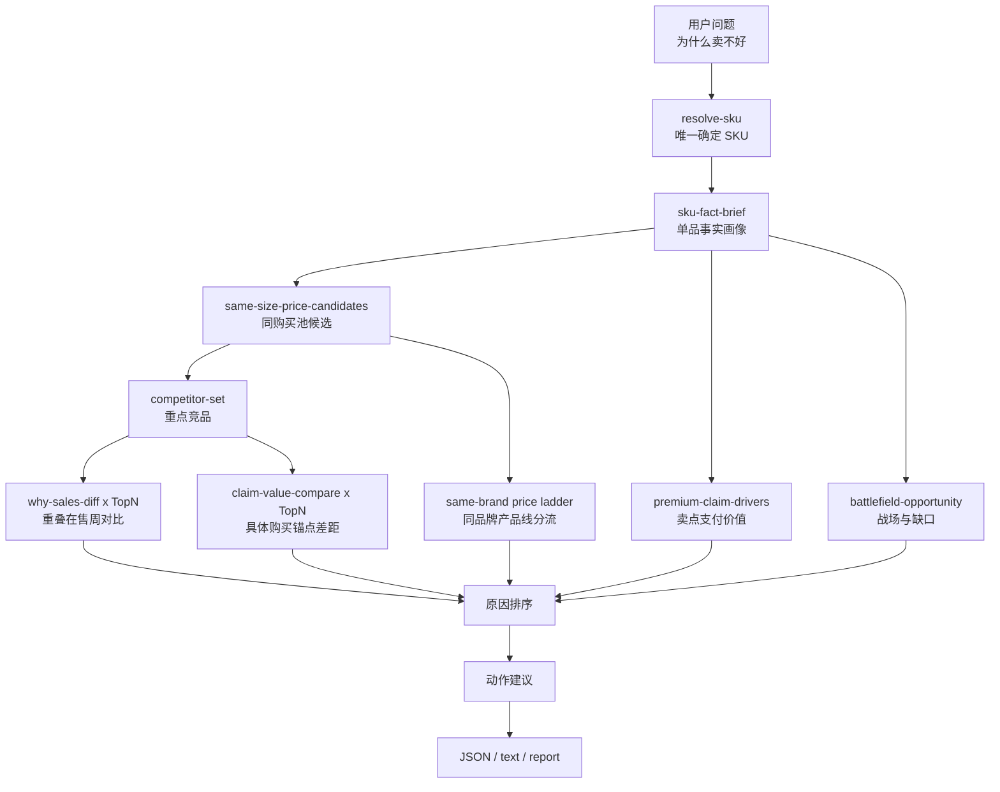

# CatForge Analyst 单品低销量诊断详细设计

## 1. 设计目标

本文把 [CatForge Analyst 单品低销量诊断需求](../sop_requirements/CATFORGE_ANALYST_low_sales_diagnosis_requirements.md) 转换为工程设计。

设计目标：

1. 在 `catforge_analyst` 中新增 `low-sales-diagnosis` SOP。
2. 复用现有原子能力和 SOP，不新增事实生成链路。
3. 按价值棒理论输出可解释的低销量诊断。
4. 支持 `--format json`、`--format text`、`--answer-style xiaoao` 和可选报告。
5. 保留证据、限制、降级状态和可测试结构。

## 2. 模块边界

### 2.1 本模块负责

- 识别单 SKU 低销量诊断问题。
- 解析目标 SKU。
- 找同购买池和重点竞品。
- 对重点竞品执行重叠在售周销量对比。
- 对重点竞品执行卖点价值对比，抽取具体购买锚点差距。
- 汇总卖点支付价值、价格压力、竞品拦截、机会缺口和同品牌产品线分流信号。
- 汇总价值战场、用户任务、目标客群、价格、参数、卖点、评论风险。
- 生成“事实证据、真正原因、价值棒机制、决策含义、验证动作”完整原因排序、动作建议、短答案和可选报告。

### 2.2 本模块不负责

- 不执行 M00-M12C 生成任务。
- 不直接读取原始表做业务判断。
- 不把累计销量作为胜负判断依据。
- 不判断广告、库存、促销、线下渠道、导购、毛利和 BOM 原因。
- 不调用外部 LLM。

## 3. 工程位置

需要改动的代码位置：

```text
apps/api-server/app/cli/catforge_analyst.py
apps/api-server/app/services/core3_real_data/analyst/ability_registry.py
apps/api-server/app/services/core3_real_data/analyst/analyst_service.py
apps/api-server/app/services/core3_real_data/analyst/sop_orchestrators.py
apps/api-server/app/services/core3_real_data/analyst/low_sales_answer.py
apps/api-server/tests/core3_real_data/test_catforge_analyst_cli.py
```

`low_sales_answer.py` 是建议新增的展示适配模块，职责类似 `claim_value_answer.py` 和 `competitor_answer.py`，只负责把 SOP 结构化结果转成短答案和 Markdown 报告，不重新计算分析结果。

## 4. 命令形态

### 4.1 JSON 输出

```bash
python -m app.cli.catforge_analyst low-sales-diagnosis \
  --query "海信 65E7Q" \
  --product-category tv \
  --batch-id latest \
  --market-window full_observed_window \
  --analysis-population fact_complete_with_comment \
  --format json
```

### 4.2 文本输出

```bash
python -m app.cli.catforge_analyst low-sales-diagnosis \
  --query "海信 65E7Q" \
  --product-category tv \
  --format text \
  --answer-style xiaoao
```

### 4.3 生成报告

```bash
python -m app.cli.catforge_analyst low-sales-diagnosis \
  --sku-code TV00029112 \
  --product-category tv \
  --format json \
  --answer-style xiaoao \
  --with-report markdown
```

## 5. 能力注册

在 `SOP_ABILITIES` 中新增：

```python
AbilityDefinition(
    code="low-sales-diagnosis",
    ability_type="sop",
    description_cn="分析单 SKU 是否相对卖得弱，并按价值棒理论解释价格、用户愿付价值、卖点、竞品、战场客群和评论风险。",
    required_inputs=("sku_code|query",),
    optional_inputs=("limit", "top_n", "diagnosis_depth", "with_report"),
    source_modules=("M01", "M03B", "M04C", "M05C", "M07", "M09C", "M10C", "M11C", "M11D", "M12C"),
    status="implemented",
)
```

在 `SOP_COMMANDS`、`SOP_COMMAND_ORDER` 和 `SOP_STEP_MAP` 中加入同名命令。

## 6. SOP 步骤

`SOP_STEP_MAP` 建议：

```python
"low-sales-diagnosis": (
    "resolve-sku",
    "sku-fact-brief",
    "same-size-price-candidates",
    "competitor-set",
    "why-sales-diff",
    "claim-value-compare",
    "premium-claim-drivers",
    "claim-opportunity-gaps",
    "battlefield-opportunity",
)
```

实际执行时 `why-sales-diff` 和 `claim-value-compare` 对 Top N 竞品循环执行。若竞品不足，则跳过 pairwise 对比和卖点对比，保留限制说明。

## 7. 总体数据流



## 8. `low_sales_diagnosis()` 编排函数

建议在 `SopOrchestrators` 中新增：

```python
def low_sales_diagnosis(
    self,
    context: AnalystContext,
    *,
    query: str | None = None,
    sku_code: str | None = None,
    model_name: str | None = None,
    limit: int = 20,
    top_n: int = 3,
    answer_style: str = "raw",
    with_report: str = "none",
    max_chat_chars: int = 800,
    report_title: str | None = None,
    **_: Any,
) -> dict[str, Any]:
    ...
```

### 8.1 执行顺序

1. `resolve_sku()`。
2. `sku_fact_brief()`。
3. `same_size_price_candidates()`。
4. `competitor_set()`，首版可用 `answer_style="raw"`，避免重复生成竞品长报告。
5. 从竞品结果中选择 Top `top_n`。
6. 对每个候选执行 `why_sales_diff()`。
7. 对每个候选执行 `claim_value_compare()`，输出竞品已成立、本品未形成正向对照的购买锚点。
8. 执行 `premium_claim_drivers()`。
9. 执行 `claim_opportunity_gaps()`。
10. 执行 `battlefield_opportunity()`。
11. 从 `same_size_price_candidates()` 中构造同品牌、同尺寸、相邻或更低价格带的产品线分流信号。
12. 调用纯函数构建 `low_sales_diagnosis` payload。
13. 如 `answer_style == "xiaoao"` 或 `with_report != "none"`，调用 `build_low_sales_answer()`。

### 8.2 原子结果收集

```python
atom_results = [
    target,
    fact,
    candidates,
    competitor_set,
    *pairwise_sales_results,
    *claim_compare_results,
    premium,
    claim_gaps,
    battlefield,
    product_line_cannibalization,
]
```

使用已有 `_steps()`、`_atoms_used()`、`_evidence()`、`_limitations()` 聚合 SOP 元信息。

## 9. 结构化结果模型

### 9.1 顶层 payload

```json
{
  "low_sales_diagnosis": {
    "diagnosis_version": "low_sales_diagnosis_v0.1",
    "target_summary": {},
    "sales_status": {},
    "value_stick_summary": {},
    "reason_ranking": [],
    "competitor_evidence": [],
    "claim_compare_summary": {},
    "claim_value_summary": {},
    "battlefield_gap_summary": {},
    "gap_signal_summary": {},
    "action_plan": {},
    "not_supported_reasons": [],
    "method_note_cn": ""
  }
}
```

### 9.2 `sales_status`

```json
{
  "status": "weak",
  "confidence": "medium",
  "basis_cn": "目标在重点竞品重叠在售周中周均销量偏低。",
  "target_avg_weekly_sales": 0,
  "target_avg_weekly_amount": 0,
  "comparison_count": 3,
  "weak_against_count": 2,
  "not_weak_against_count": 1,
  "uncertain_against_count": 0,
  "comparison_rows": []
}
```

状态枚举：

- `weak`
- `not_weak`
- `mixed`
- `uncertain`

### 9.3 `value_stick_summary`

```json
{
  "customer_wtp": {
    "status": "weak",
    "summary_cn": "核心用户愿付价值没有被稳定卖点和评论验证支撑。"
  },
  "price_capture": {
    "status": "pressure",
    "summary_cn": "价格位置高于同池承接能力。"
  },
  "competitor_alternative": {
    "status": "high",
    "summary_cn": "同购买池竞品在核心战场形成替代压力。"
  },
  "product_line_cannibalization": {
    "status": "possible",
    "summary_cn": "同品牌同尺寸更低价 SKU 可能分流本品。"
  },
  "evidence_risk": {
    "status": "medium",
    "summary_cn": "部分卖点只有市场观测信号，参数或评论证据不足。"
  },
  "enterprise_side": {
    "status": "not_supported",
    "summary_cn": "缺少广告、库存、促销、毛利和渠道费用数据。"
  }
}
```

### 9.4 `reason_ranking`

```json
{
  "rank": 1,
  "reason_type": "specific_competitor_value_gap",
  "reason_name_cn": "关键购买锚点被竞品占位",
  "severity": "high",
  "evidence_strength": 0.82,
  "value_stick_position": "competitor_alternative",
  "summary_cn": "重点竞品在某个画质锚点上形成更清晰的高价价值锚点，本品没有同等正向对照。",
  "observation_points": [
    "竞品重叠在售周周均销量高于目标。",
    "画质锚点 A：市场观测为溢价相关，参数口径为领先优势。",
    "影音认证锚点 B：市场观测为销量相关，但参数口径为基础门槛，不能单独当作强卖点。"
  ],
  "root_cause_cn": "用户在同一购买池里更容易理解竞品的画质升级理由，本品缺少能抵消价差或选择风险的清晰购买锚点。",
  "value_stick_mechanism_cn": "竞品提高了用户 WTP 并降低选择不确定性，本品的相对用户剩余价值下降。",
  "decision_implication_cn": "优先补充画质锚点的参数和场景证据；如果补不出证据，应避免正面讲高价画质，改用更有把握的战场或做权益补偿。",
  "validation_cn": "用详情页 A/B、导购话术和同池价格测试验证该锚点是否提升点击/收藏/转化。",
  "evidence_refs": [
    {
      "source": "claim-value-compare",
      "summary_cn": "竞品存在候选优势卖点，且参数口径高于本品。"
    }
  ],
  "recommended_action_keys": ["competitor_claim_reframe", "evidence_pack_test"]
}
```

原因类型枚举：

- `specific_competitor_value_gap`
- `price_value_mismatch`
- `weak_customer_wtp`
- `claim_not_activated`
- `competitor_intercept`
- `battlefield_target_mismatch`
- `same_brand_cannibalization`
- `experience_or_evidence_risk`

每个 reason 都必须包含 `observation_points`、`root_cause_cn`、`value_stick_mechanism_cn`、`decision_implication_cn` 和 `validation_cn`。如果某一项因数据缺失无法判断，字段仍保留，值写明“不足以判断”并给出缺口。

### 9.5 `claim_compare_summary`

```json
{
  "top_competitor_claim_gaps": [
    {
      "candidate_sku_code": "TV_COMP_001",
      "candidate_model_name": "重点竞品 A",
      "candidate_advantage_claims": [
        {
          "claim_name_cn": "画质锚点 A",
          "candidate_market_signal_cn": "市场观测：溢价相关",
          "candidate_parameter_level_cn": "参数口径：领先优势",
          "downgrade_reason_cn": null,
          "effect_cn": "可作为高价价值锚点候选"
        }
      ],
      "target_advantage_claims": [],
      "specific_gap_summary_cn": "竞品有更清晰的画质购买锚点，本品没有形成同等正向对照。"
    }
  ],
  "method_note_cn": "市场观测角色不等于卖点天然强弱，必须和参数/事实口径一起展示。"
}
```

### 9.6 `action_plan`

```json
{
  "short_term_actions": [],
  "mid_term_actions": [],
  "high_cost_actions": []
}
```

动作对象：

```json
{
  "action_key": "price_band_test",
  "priority": 1,
  "cost_level": "low",
  "time_horizon": "short_term",
  "summary_cn": "测试券后价或权益包，让价格回到用户感知价值可以承接的位置。",
  "why_cn": "当前证据显示价格压力高于卖点承接。",
  "expected_impact_cn": "降低价格价值不匹配对转化的影响。",
  "evidence_refs": [],
  "not_supported_note_cn": "不能直接估算销量增长，因为缺广告、流量和转化链路。"
}
```

## 10. 销量强弱判断

### 10.1 输入来源

优先读取每个 `why-sales-diff` 的：

- `sales_overlap.overlap_week_count`
- `sales_overlap.target.avg_weekly_sales_volume`
- `sales_overlap.candidate.avg_weekly_sales_volume`
- `sales_overlap.target.avg_weekly_sales_amount`
- `sales_overlap.candidate.avg_weekly_sales_amount`
- `sales_overlap.target.weighted_price`
- `sales_overlap.candidate.weighted_price`
- `sales_overlap.method`

字段名以当前实际 payload 为准，设计上应通过 helper 做兼容读取，不在 SOP 中散落字段路径。

### 10.2 Pairwise 判断

对每个竞品生成：

```text
sales_ratio = target_avg_weekly_sales / candidate_avg_weekly_sales
amount_ratio = target_avg_weekly_amount / candidate_avg_weekly_amount
price_ratio = target_weighted_price / candidate_weighted_price
```

判断：

| 结果 | 规则 |
| --- | --- |
| `weak` | `sales_ratio < 0.75` 且 `amount_ratio < 0.9` |
| `price_supported_niche` | `sales_ratio < 0.75` 但 `amount_ratio >= 0.9`，说明可能是高价小众或高价销额承接 |
| `not_weak` | `sales_ratio >= 0.9` 或 `amount_ratio >= 1.0` |
| `uncertain` | 重叠周不足、分母缺失或 fallback 口径 |

阈值首版用常量集中维护：

```python
LOW_SALES_RATIO_THRESHOLD = Decimal("0.75")
LOW_AMOUNT_RATIO_THRESHOLD = Decimal("0.90")
NOT_WEAK_SALES_RATIO_THRESHOLD = Decimal("0.90")
NOT_WEAK_AMOUNT_RATIO_THRESHOLD = Decimal("1.00")
MIN_OVERLAP_WEEKS = 4
```

### 10.3 总体状态

```text
weak_against_count = pairwise weak 数量
not_weak_against_count = pairwise not_weak + price_supported_niche 数量
```

规则：

| 总体状态 | 规则 |
| --- | --- |
| `weak` | 可用对比不少于 2，且 `weak_against_count / usable_count >= 0.6` |
| `not_weak` | 可用对比不少于 2，且 `not_weak_against_count / usable_count >= 0.6` |
| `mixed` | 可用对比不少于 2，但 weak 和 not weak 不占多数 |
| `uncertain` | 可用对比少于 2 |

## 11. 原因评分

每类原因输出一个候选 reason，再按分数排序。

```text
reason_score =
  severity_weight * 0.35
  + evidence_strength * 0.30
  + sales_relevance * 0.20
  + actionability * 0.15
```

### 11.1 关键购买锚点被竞品占位

证据来源：

- `claim-value-compare` 的 `candidate_advantage_claims`。
- 对应竞品 `why-sales-diff` 为目标弱或竞品强。
- 候选卖点同时具备市场观测角色和参数/事实口径，且不是纯样本不足。

评分建议：

| 信号 | 加分 |
| --- | ---: |
| 竞品候选优势卖点不少于 1 个 | 0.25 |
| 候选优势卖点为“市场观测：溢价相关” | 0.20 |
| 候选优势卖点参数口径为领先优势或较强优势 | 0.20 |
| 竞品重叠在售周销量或销额强于目标 | 0.20 |
| 只有基础门槛或样本不足 | 降低 0.20 |

输出要求：

- `observation_points` 必须列出具体竞品、具体卖点、市场观测和参数口径。
- `root_cause_cn` 解释用户为什么因此更容易选择竞品。
- `decision_implication_cn` 必须区分补证据、改表达、权益补偿和避开正面竞争。

### 11.2 价格价值不匹配

证据来源：

- `opportunity_gaps.price_gap_signals`
- `claim_value_summary.price_pressure_claims`
- pairwise 竞品价格更低但销量或销额更强。
- 目标高价但缺少可抵消价差的明确购买锚点。

评分建议：

| 信号 | 加分 |
| --- | ---: |
| `high_price_weak_volume` | 0.35 |
| 有价格压力卖点 | 0.25 |
| 两个以上低价竞品销量更强 | 0.20 |
| 目标高价且无明确购买锚点 | 0.20 |
| 目标高价但销额不弱 | 降低 0.15 |

该原因不等于“必须降价”。`decision_implication_cn` 必须说明是降价测试、权益包、补价值证明，还是重设定位。

### 11.3 核心愿付价值不足

证据来源：

- 能抬高 WTP 的购买锚点为空或偏少。
- 主战场/主任务/主客群弱。
- M11D allocation 中主战场分配低。
- 评论或参数证据不足以让卖点成为支付理由。

评分建议：

| 信号 | 加分 |
| --- | ---: |
| 无可解释高价的购买锚点 | 0.25 |
| 有市场观测但参数/评论不支撑 | 0.20 |
| 主战场缺失 | 0.25 |
| 评论支撑弱 | 0.20 |

### 11.4 卖点未激活

证据来源：

- 待激活卖点。
- 厂家主张卖点。
- 参数强但评论弱。
- claim gap 中 `unsupported_claim_codes`。

评分建议：

| 信号 | 加分 |
| --- | ---: |
| 待激活卖点不少于 2 个 | 0.25 |
| 厂家主张卖点不少于 2 个 | 0.20 |
| unsupported claim 存在 | 0.20 |
| 评论事实不足 | 0.15 |

### 11.5 外部竞品替代截流

证据来源：

- `competitor-set` Top 竞品。
- `why-sales-diff` pairwise weak。
- `claim-value-compare` 中竞品具体购买锚点更清晰。
- `claim-opportunity-gaps` 中竞品正向卖点而本品缺失。

评分建议：

| 信号 | 加分 |
| --- | ---: |
| Top 1 竞品销量更强 | 0.20 |
| Top 1 竞品价格更低且销量更强 | 0.20 |
| 竞品具体购买锚点更强 | 0.25 |
| 主战场语义重合高 | 0.15 |

该原因必须解释“替代路径”，即用户为什么会从本品转向具体竞品，而不是只写竞品卖得好。

### 11.6 战场客群错位

证据来源：

- `opportunity_gaps.semantic_gap_signals`
- `battlefield_opportunity.opportunity_gaps`
- 拖后腿战场、机会战场、未满足客群、无主任务。

评分建议：

| 信号 | 加分 |
| --- | ---: |
| 无主价值战场 | 0.25 |
| 拖后腿战场存在 | 0.25 |
| 未满足客群存在 | 0.20 |
| 机会战场空间较大但本品未成立 | 0.20 |

### 11.7 同品牌产品线分流

证据来源：

- `same-size-price-candidates` 中同品牌、同尺寸、相邻或更低价格带 SKU。
- 该 SKU 周均销量或销额高于目标。
- 目标 SKU 高价但缺少足够清晰的购买锚点。

评分建议：

| 信号 | 加分 |
| --- | ---: |
| 同品牌同尺寸低价 SKU 销量更强 | 0.30 |
| 低价 SKU 与目标主战场或主任务重合 | 0.20 |
| 目标价差无法被卖点证据解释 | 0.25 |
| 同品牌候选不足 | 降级为 unknown |

### 11.8 用户体验或证据风险

证据来源：

- 负向评论。
- 低评论置信度。
- 参数冲突。
- 样本不足。
- M12C 降级原因显示“基础门槛”“样本不足”或“不能单独支撑溢价”。

评分建议：

| 信号 | 加分 |
| --- | ---: |
| 负向评论事实存在 | 0.25 |
| 评论事实句不足 | 0.20 |
| 参数冲突 | 0.20 |
| M12C 样本不足或降级原因明确 | 0.20 |

## 12. 卖点价值汇总

从 `premium-claim-drivers` 和 `claim-opportunity-gaps` 中构造：

```json
{
  "premium_claims": [],
  "share_conversion_claims": [],
  "customer_value_claims": [],
  "threshold_claims": [],
  "pending_claims": [],
  "brand_claims": [],
  "intercept_claims": [],
  "price_pressure_claims": [],
  "sample_insufficient_claims": []
}
```

显示名称必须使用中文卖点名；内部 `claim_code` 可在 JSON 中保留，但 `--format text` 不展示。

### 12.1 M12C 标签转换口径

低销量诊断不得把 M12C 的 `claim_value_role` 直接翻译成“强溢价卖点”或“强销量卖点”。必须通过 helper 转成两个独立显示字段：

| 输入字段 | 转换后字段 | 示例 |
| --- | --- | --- |
| `claim_value_role=premium_driver_estimated` | `candidate_market_signal_cn` | 市场观测：溢价相关 |
| `claim_value_role=sales_driver_estimated` | `candidate_market_signal_cn` | 市场观测：销量相关 |
| `claim_value_role=basic_threshold` | `candidate_market_signal_cn` | 市场观测：基础门槛 |
| `business_value_label` 样本不足 | `candidate_market_signal_cn` | 市场观测：样本不足 |
| `parameter_competitiveness.overall_parameter_competitiveness_level_cn` | `candidate_parameter_level_cn` | 参数口径：领先优势 / 较强优势 / 基础门槛 / 弱或缺失 |
| `downgrade_reason_cn` | `downgrade_reason_cn` | 不能单独支撑溢价 |

输出层必须同时展示 `candidate_market_signal_cn` 和 `candidate_parameter_level_cn`。如果一个卖点只有销量相关市场观测但参数口径是基础门槛，只能说“这是可帮助用户确认的基础门槛”，不能说它是强销量卖点。

## 13. 竞品证据汇总

对每个 Top 竞品输出：

```json
{
  "rank": 1,
  "candidate": {},
  "role_cn": "首选直接竞品",
  "pairwise_sales_status": "target_weak",
  "sales_summary_cn": "重叠在售周内，竞品周均销量更强。",
  "price_relation_cn": "竞品价格更低但仍承接相同核心需求。",
  "semantic_overlap_summary_cn": "主战场和主用户任务重合。",
  "claim_gap_summary_cn": "竞品在高端画质卖点上更容易形成拦截。",
  "candidate_advantage_claims": [
    {
      "claim_name_cn": "画质锚点 A",
      "candidate_market_signal_cn": "市场观测：溢价相关",
      "candidate_parameter_level_cn": "参数口径：领先优势",
      "downgrade_reason_cn": null,
      "effect_cn": "更适合解释高价画质锚点"
    }
  ],
  "target_advantage_claims": [],
  "specific_gap_summary_cn": "竞品有更明确的画质升级理由，本品未形成同等正向对照。",
  "evidence_refs": []
}
```

如果 `competitor-set` 没有候选，输出空数组并加入 limitation。

## 14. 战场缺口汇总

从 `battlefield-opportunity` 输出：

```json
{
  "established_battlefields": [],
  "opportunity_battlefields": [],
  "user_observed_battlefields": [],
  "drag_factor_battlefields": [],
  "top_market_spaces": []
}
```

`top_market_spaces` 只保留与机会或拖后腿相关的价值战场空间摘要，不输出完整 M11D 大表。

## 15. 动作建议生成

动作由原因驱动，不允许脱离原因单独生成。

### 15.1 原因到动作映射

| 原因 | 短期动作 | 中期动作 | 高成本动作 |
| --- | --- | --- | --- |
| 关键购买锚点被竞品占位 | 竞品对比表达、证据包 A/B 测试 | 补充评测、样张、场景内容 | 下一代规格或定位补强 |
| 价格价值不匹配 | 券后价/权益包测试、价格带校准 | 复盘同池价格锚点和高价理由 | 产品线价格梯度调整 |
| 核心愿付价值不足 | 聚焦已验证主卖点 | 补充用户场景内容和测评证据 | SKU 定位重设 |
| 卖点未激活 | 详情页重排、导购话术调整 | 补评论证据、补体验内容 | 下一代规格补强 |
| 外部竞品替代截流 | 增加竞品对比表达、避开无证据正面硬碰 | 补齐拦截卖点证据 | 调整防守款/进攻款组合 |
| 战场客群错位 | 重写目标客群和使用场景 | 重新分配内容资源到机会战场 | 产品定位和渠道策略重设 |
| 同品牌产品线分流 | 明确本 SKU 与低价 SKU 的价差理由 | 调整同品牌内容和权益区隔 | 产品线价格梯度调整 |
| 用户体验或证据风险 | 降低问题卖点表达强度 | 修复体验、补充验证样本 | 规格或供应链改造 |

### 15.2 动作去重

同一动作可被多个原因引用。最终输出时按：

1. 最高关联原因排序。
2. 成本低优先。
3. 证据强优先。

每个层级最多输出 5 条。

## 16. 文本答案生成

新增 `low_sales_answer.py`：

```python
def build_low_sales_answer(
    *,
    target: dict[str, Any],
    payload: dict[str, Any],
    with_report: ReportMode = "none",
    max_chat_chars: int = 800,
    report_title: str | None = None,
) -> dict[str, Any]:
    ...
```

返回：

```json
{
  "short_answer": "",
  "report": {
    "status": "disabled|created|failed",
    "markdown_path": null,
    "report_url": null
  },
  "markdown": null,
  "report_title": ""
}
```

### 16.1 短答案模板

```text
{目标 SKU} 在当前可比线上样本中{销量状态}。
主要原因优先看：{原因1.root_cause_cn}；{原因2.root_cause_cn}；{原因3.root_cause_cn}。
对应机制是：{原因1.value_stick_mechanism_cn}；{原因2.value_stick_mechanism_cn}。
建议先做：{短期动作1}；{短期动作2}。中期关注：{中期动作1}。
当前不能判断广告、库存、促销和毛利原因，因为缺少对应数据。
```

如果 `sales_status=not_weak`：

```text
{目标 SKU} 在当前可比线上样本中不属于明显低销量 SKU。当前更适合做价值表达优化，而不是按“卖不好”处理。
...
```

如果 `sales_status=uncertain`：

```text
当前样本不足以判断 {目标 SKU} 是否真的卖得弱。可以先看价格、卖点、评论和战场缺口，但不能输出确定低销量原因。
...
```

## 17. Markdown 报告结构

```text
# {目标} 单品低销量诊断报告

## 一、结论
## 二、是否真的卖得弱
## 三、价值棒拆解
## 四、主要原因排序
## 五、重点竞品购买锚点差距
## 六、卖点支付价值、参数口径和价格压力
## 七、战场、任务、客群和评论缺口
## 八、同品牌产品线分流
## 九、动作建议
## 十、数据口径和限制
```

报告中的数字必须来自 payload，不重新计算。

## 18. CLI 文本输出适配

在 `format_business_text()` 中加入：

```python
low_sales_answer = payload.get("low_sales_answer") or {}
if low_sales_answer.get("short_answer"):
    return str(low_sales_answer["short_answer"])
if "low_sales_diagnosis" in payload:
    return _format_low_sales_diagnosis_text(result)
```

`_format_low_sales_diagnosis_text()` 是 fallback，只用于没有 `low_sales_answer.short_answer` 的情况。

## 19. 自然语言路由

在 `route_question()` 中新增低销量识别。

建议顺序：

1. 先处理卖点价值、竞品、双 SKU 销量差等更明确意图。
2. 若问题是单 SKU 低销量、卖不好、怎么提升销量，路由 `low-sales-diagnosis`。
3. 若两个 SKU 同时出现并包含“销量差”“为什么比”，仍路由 `why-sales-diff`。

规则示例：

```python
is_low_sales_question = bool(re.search(
    r"卖不好|卖不动|销量低|销量不好|销量不行|提升销量|怎么卖|问题在哪|原因.*销量|价值棒",
    normalized,
))
...
elif is_sales_diff_question and routing_params.get("candidate_sku_code"):
    command = "why-sales-diff"
elif is_low_sales_question:
    command = "low-sales-diagnosis"
```

## 20. 降级和错误处理

| 场景 | `status` | 处理 |
| --- | --- | --- |
| SKU 多候选 | `ambiguous` | 透传 `resolve-sku` 候选 |
| SKU 不存在 | `not_found` | 透传提示 |
| 缺 M07 | `ok` 或 `not_found` | 输出 `sales_status=uncertain` 和 limitation |
| 无竞品候选 | `ok` | 不执行 pairwise，输出 `sales_status=uncertain` |
| M12C 缺失 | `ok` | 卖点价值诊断降级，并加入 limitation |
| 评论缺失 | `ok` | 用户愿付价值信心降级 |
| `claim-value-compare` 缺失 | `ok` | 不输出具体竞品锚点差距，只保留价格、战场和事实卖点诊断 |
| 同品牌候选不足 | `ok` | `same_brand_cannibalization` 降级为 unknown，不硬判产品线分流 |
| 内部原子能力局部失败 | `ok` 或 `error` | 非关键原子失败时保留限制，关键解析失败才 error |

## 21. 测试设计

### 21.1 能力注册测试

- `list-abilities` 包含 `low-sales-diagnosis`。
- `SOP_COMMANDS` 包含 `low-sales-diagnosis`。

### 21.2 路由测试

| 问题 | 期望 |
| --- | --- |
| “TV00029112 为什么卖不好？” | `low-sales-diagnosis` |
| “海信65E7Q 销量低原因是什么？” | `low-sales-diagnosis` |
| “按照价值棒理论看 TV00029112 问题在哪？” | `low-sales-diagnosis` |
| “TV00029112 和 TV00030001 为什么销量差？” | `why-sales-diff` |
| “TV00029112 的哪些卖点是溢价卖点？” | `premium-claim-drivers` |

### 21.3 结构化输出测试

- 返回 `result.low_sales_diagnosis.sales_status.status`。
- 返回 `value_stick_summary` 中 WTP、价格、竞品替代、产品线分流、证据风险和企业侧不支持边界。
- 返回 `reason_ranking`。
- 返回 `claim_compare_summary.top_competitor_claim_gaps`。
- 返回 `action_plan.short_term_actions`、`mid_term_actions`、`high_cost_actions`。
- 返回 `not_supported_reasons`，包含广告、库存、促销、毛利边界。

### 21.4 不硬判低销量测试

构造一个目标 SKU，对 Top 竞品周均销量和销额不弱，断言：

```python
assert payload["sales_status"]["status"] == "not_weak"
assert "不属于明显低销量" in text
```

### 21.5 弱销量测试

构造目标 SKU 对两个以上 Top 竞品弱，且存在价格压力和竞品拦截，断言：

```python
assert payload["sales_status"]["status"] == "weak"
assert payload["reason_ranking"][0]["reason_type"] in {
    "specific_competitor_value_gap",
    "price_value_mismatch",
    "competitor_intercept",
}
```

### 21.6 M12C 缺失降级测试

删除或不构造 M12C 行，断言：

- `status == "ok"`
- limitation 包含 M12C 缺失说明
- 不输出确定溢价相关市场观测或价格压力卖点

### 21.7 文本输出测试

调用：

```python
catforge_analyst.main([
    "low-sales-diagnosis",
    "--sku-code", "TV00029112",
    "--format", "text",
    "--answer-style", "xiaoao",
])
```

断言 stdout：

- 第一段说明销量状态。
- 包含主要原因。
- 包含建议。
- 包含数据边界。
- 不包含 `M07`、`M12C`、表名或 JSON。

### 21.8 具体竞品锚点测试

构造 `claim-value-compare` 结果，竞品存在 `candidate_advantage_claims`，断言：

```python
reason = first_reason(payload, "specific_competitor_value_gap")
assert reason["observation_points"]
assert "市场观测" in " ".join(reason["observation_points"])
assert "参数口径" in " ".join(reason["observation_points"])
assert reason["root_cause_cn"]
assert reason["value_stick_mechanism_cn"]
assert reason["decision_implication_cn"]
assert reason["validation_cn"]
```

### 21.9 M12C 标签口径测试

构造一个卖点 `claim_value_role=sales_driver_estimated` 且参数口径为基础门槛，断言：

- 文本可以包含“市场观测：销量相关”。
- 文本必须包含“参数口径：基础门槛”或等价表达。
- 文本不得包含“强销量卖点”“强溢价卖点”。

### 21.10 同品牌分流测试

构造同品牌、同尺寸、更低价 SKU 周均销量强于目标，且目标缺少价差锚点，断言：

```python
reason = first_reason(payload, "same_brand_cannibalization")
assert reason["severity"] in {"medium", "high"}
assert "同品牌" in reason["root_cause_cn"]
```

### 21.11 因果边界测试

断言短答案和 Markdown 报告不得包含以下承诺式表达：

- “一定能追平”
- “必然提升销量”
- “卖点比过竞品就能赶上”

## 22. 实现顺序

1. 新增 `low-sales-diagnosis` 注册和 CLI 命令。
2. 新增路由规则和测试。
3. 在 `SopOrchestrators` 中实现编排骨架。
4. 实现销量状态判断 helper。
5. 接入 Top N `claim-value-compare` 并实现 M12C 标签转换 helper。
6. 实现同品牌产品线分流 helper。
7. 实现原因构造和排序 helper。
8. 实现动作建议 helper。
9. 新增 `low_sales_answer.py` 短答案和 Markdown 报告。
10. 接入 `format_business_text()`。
11. 补齐缺失、降级和边界测试。

## 23. 验收命令

```bash
cd apps/api-server
uv run pytest tests/core3_real_data/test_catforge_analyst_cli.py -q
```

人工 smoke：

```bash
python -m app.cli.catforge_analyst ask "海信 65E7Q 为什么卖不好" --product-category tv --format text
python -m app.cli.catforge_analyst low-sales-diagnosis --query "65E7Q" --product-category tv --format json
python -m app.cli.catforge_analyst low-sales-diagnosis --sku-code TV00029112 --product-category tv --format text --answer-style xiaoao
```

## 24. 后续扩展

1. 接入飞书卡片看板 payload，展示销量状态、原因排序和动作建议。
2. 在前端报告页增加“低销量诊断”页签。
3. 引入广告、库存、促销、毛利数据后，扩展价值棒的企业成本侧和渠道侧诊断。
4. 支持 AC 品类，但必须先确认 AC 的 M11D/M12C 覆盖与口径。
