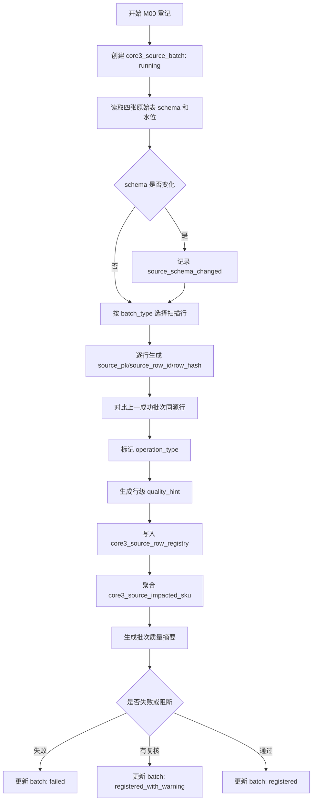

# M00 原始数据批次与行登记详细设计

## 1. 文档定位

本文是 CatForge 彩电核心三竞品真实数据 v2 的 M00 模块详细设计。它承接：

- `sop_requirements/M00_source_batch_registry_requirements.md`
- `sop_requirements/00_real_data_baseline.md`
- `cankao/CatForge_竞品生成SOP_详细指导_v1.md`
- `cankao/catforge_sop_md/modules/M00_原始数据批次与行登记.md`
- `sop_detailed_design/00_architecture_data_dictionary_design.md`

M00 的工程目标是为每次真实数据接入建立稳定边界：本次扫描了哪些原始表、哪些原始行发生变化、哪些 SKU 受影响、后续哪些模块需要被 M16 编排重算。

本文写到可以拆开发任务的程度，但不包含代码实现、迁移文件或部署动作。

## 2. 模块职责

### 2.1 解决的问题

M00 负责把 205 PostgreSQL 原始表的一次扫描登记为可追溯、可增量、可复核的数据批次。

M00 必须回答：

| 问题 | M00 输出 |
| --- | --- |
| 本次扫描了哪些原始表 | `core3_source_batch.source_tables`、`input_watermark_json` |
| 每张表本次扫描范围是什么 | `source_pk_range_json`、`write_time_range_json`、`input_watermark_json` |
| 原始行是新增、变化、未变还是跳过 | `core3_source_row_registry.operation_type` |
| 原始行如何跨批次稳定定位 | `source_table`、`source_pk`、`source_row_id` |
| 行内容是否变化 | `row_hash`、`previous_row_hash`、`hash_version` |
| 哪些 SKU 受影响 | `core3_source_impacted_sku` |
| 后续建议重算哪些模块 | `affected_modules`、`affected_module_summary_json` |
| 是否存在接入级质量风险 | `quality_summary_json`、`quality_hint`、`review_required` |

### 2.2 不解决的问题

M00 严禁做以下事情：

| 禁止事项 | 原因 | 归属模块 |
| --- | --- | --- |
| 清洗字段值 | M00 只登记原始边界，不能改变语义 | M01 |
| 把空值、`-`、`unknown` 解释成 false | 缺失即未知 | M01/M03 |
| 参数标准化和参数码映射 | 需要参数本体和字段画像 | M03 |
| 卖点拆分、实体抽取、激活判断 | 需要宣传语义处理 | M04a |
| 评论去重、分句、主题和任务抽取 | 需要评论证据层 | M05/M06 |
| 生成 business evidence | M00 只生成 source reference | M02 |
| 判断用户任务、客群、价值战场 | 依赖清洗、证据、画像 | M09-M11 |
| 生成竞品候选、评分和三竞品结果 | 依赖全链路画像 | M12-M14 |
| 为页面拼接高层报告 | M00 是生产线入口，不是业务展示 | M15 |
| 修改、删除或回写原始表 | 原始表只读 | 不允许 |

### 2.3 复用历史结果

M00 可以复用历史登记结果做增量判断，但不能覆盖历史批次。

复用规则：

- `source_row_id` 跨批次稳定。
- 最新历史状态通过同一 `project_id + category_code + source_table + source_pk + hash_version` 找到。
- 历史 `row_hash` 与本次 `row_hash` 一致时标记为 `no_change`。
- 历史 `row_hash` 与本次 `row_hash` 不一致时标记为 `update`。
- 全量扫描时历史存在但本次不存在，标记为 `not_seen_in_current_scan`。
- 增量扫描不扫描全表，因此默认不生成 `not_seen_in_current_scan`。

## 3. 上游输入

### 3.1 原始表

M00 读取当前 205 PostgreSQL `catforge_dev` 中四张原始表。M00 只读这些表，不通过 ORM 对原始表执行写入。

| 原始表 | 业务域 | 当前样例规模 | M00 用途 |
| --- | --- | ---: | --- |
| `week_sales_data` | 周销量、销额、均价、渠道平台 | 1326 行 | 登记市场量价行变化 |
| `attribute_data` | SKU 参数属性 | 2843 行 | 登记参数行变化 |
| `selling_points_data` | 结构化宣传卖点 | 65 行 | 登记卖点原文行变化 |
| `comment_data` | 评论、分段、维度、情感 | 62426 行 | 登记评论原始行变化 |

当前数据事实：

- 量价表覆盖 35 个型号。
- 当前所有数据品牌均为海信，同品牌 SKU 可以互为竞品，M00 不做品牌排除。
- 当前只有线上渠道，平台为专业电商和平台电商，M00 只登记原值。
- 85E7Q 的 `model_code=TV00029115`，有量价、参数、评论，没有结构化卖点。
- 评论表存在维度拆行、重复正文、空维度和默认评价，M00 不去重。

### 3.2 字段读取契约

M00 对每张表只要求能读到来源主键、SKU 候选、展示型号、写入时间和业务定位字段。

| 表 | 来源主键 | SKU 候选 | 展示型号 | 写入时间 | 业务定位字段 |
| --- | --- | --- | --- | --- | --- |
| `week_sales_data` | `id` | `model_code` | `model` | `write_time` | `date_value`、`channel`、`platform` |
| `attribute_data` | `id` | `model_code` | `model` | `write_time` | `attr_name`、`attr_value` |
| `selling_points_data` | `id` | `model_code` | `model` | `write_time` | `variable`、`selling_point` |
| `comment_data` | `id` | `model_code` | `model` | `write_time` | `comment_id`、`comment_content`、`comments_segments`、`primary_dim`、`secondary_dim`、`third_dim`、`sentiment` |

`model_code` 在 M00 中保存为 `sku_code_candidate`。M00 不把它改名为最终标准 SKU，也不判断它是否有效。标准 SKU 的确认由 M01/M08 之后继续完成。

### 3.3 原始表字段白名单

首版 M00 按表维护字段白名单，用于生成 `business_key_json`、`row_hash` 和质量提示。

#### `week_sales_data`

| 字段 | 用途 | 是否参与 `row_hash` |
| --- | --- | --- |
| `id` | 来源主键 | 否，已经进入 `source_pk` |
| `model_code` | SKU 候选 | 是 |
| `category` | 原始品类 | 是 |
| `brand` | 原始品牌 | 是 |
| `model` | 展示型号 | 是 |
| `date_value` | 周期 | 是 |
| `channel` | 渠道 | 是 |
| `platform` | 平台 | 是 |
| `sales_volume` | 销量 | 是 |
| `sales_amount` | 销额 | 是 |
| `avg_price` | 均价 | 是 |
| `write_time` | 原始写入时间 | 是 |

#### `attribute_data`

| 字段 | 用途 | 是否参与 `row_hash` |
| --- | --- | --- |
| `id` | 来源主键 | 否 |
| `model_code` | SKU 候选 | 是 |
| `category` | 原始品类 | 是 |
| `brand` | 原始品牌 | 是 |
| `model` | 展示型号 | 是 |
| `attr_name` | 参数名 | 是 |
| `attr_value` | 参数值 | 是 |
| `write_time` | 原始写入时间 | 是 |

#### `selling_points_data`

| 字段 | 用途 | 是否参与 `row_hash` |
| --- | --- | --- |
| `id` | 来源主键 | 否 |
| `model_code` | SKU 候选 | 是 |
| `category` | 原始品类 | 是 |
| `brand` | 原始品牌 | 是 |
| `model` | 展示型号 | 是 |
| `variable` | 卖点序号 | 是 |
| `selling_point` | 卖点原文 | 是 |
| `write_time` | 原始写入时间 | 是 |

#### `comment_data`

| 字段 | 用途 | 是否参与 `row_hash` |
| --- | --- | --- |
| `id` | 来源主键 | 否 |
| `model_code` | SKU 候选 | 是 |
| `category` | 原始品类 | 是 |
| `brand` | 原始品牌 | 是 |
| `model` | 展示型号 | 是 |
| `comment_id` | 评论业务 ID | 是 |
| `comment_content` | 评论正文 | 是 |
| `comments_segments` | 评论分段 | 是 |
| `primary_dim` | 原始一级维度 | 是 |
| `secondary_dim` | 原始二级维度 | 是 |
| `third_dim` | 原始三级维度 | 是 |
| `sentiment` | 原始情感 | 是 |
| `write_time` | 原始写入时间 | 是 |

如果后续原始表字段增加，M00 必须先记录 `source_schema_changed` warning，再按字段策略决定是否纳入 `row_hash`。新增字段默认不参与 `row_hash`，直到 `hash_version` 升级。

## 4. 输出表设计

M00 输出三张表：

1. `core3_source_batch`
2. `core3_source_row_registry`
3. `core3_source_impacted_sku`

M00 不新增清洗表、证据表、抽取表或画像表。

### 4.1 `core3_source_batch`

#### 4.1.1 表用途

记录一次原始数据扫描或登记批次，是 M01、M02、M16 的共同入口。

#### 4.1.2 字段契约

| 字段 | 类型建议 | 必填 | 说明 |
| --- | --- | --- | --- |
| `batch_id` | `text` | 是 | 主键，建议格式 `m00_YYYYMMDDHHMMSS_<short_uuid>` |
| `project_id` | `text` | 是 | 项目 ID，MVP 可用 `core3_mvp` |
| `category_code` | `text` | 是 | MVP 固定 `TV` |
| `run_id` | `text` | 否 | M16 全链路运行 ID，独立运行 M00 时可空 |
| `module_run_id` | `text` | 否 | M16 模块运行 ID，独立运行 M00 时可空 |
| `batch_type` | `text` | 是 | `full` 或 `incremental` |
| `source_system` | `text` | 是 | 数据来源，如 `postgresql_205` |
| `source_database` | `text` | 是 | 来源库逻辑名，如 `catforge_dev`，不保存密码 |
| `source_schema` | `text` | 否 | 来源 schema，默认 `public` |
| `source_tables` | `jsonb` | 是 | 本次扫描表清单 |
| `ruleset_version` | `text` | 是 | 全链路规则版本 |
| `module_version` | `text` | 是 | M00 实现版本 |
| `hash_version` | `text` | 是 | 行 hash 规则版本 |
| `scan_started_at` | `timestamptz` | 是 | 扫描开始时间 |
| `scan_finished_at` | `timestamptz` | 否 | 扫描结束时间 |
| `input_watermark_json` | `jsonb` | 是 | 每张表的输入水位 |
| `row_counts_json` | `jsonb` | 是 | 每张表扫描、登记、新增、变化、未变、跳过行数 |
| `write_time_range_json` | `jsonb` | 是 | 每张表本次扫描到的 `write_time` 范围 |
| `source_pk_range_json` | `jsonb` | 是 | 每张表本次扫描到的 `id` 范围 |
| `schema_snapshot_json` | `jsonb` | 是 | 每张表字段列表、字段类型、schema hash |
| `impacted_sku_count` | `integer` | 是 | 受影响 SKU 候选数 |
| `affected_module_summary_json` | `jsonb` | 是 | 建议触发模块汇总 |
| `quality_summary_json` | `jsonb` | 是 | 批次级质量摘要 |
| `status` | `text` | 是 | `running`、`registered`、`registered_with_warning`、`failed` |
| `review_required` | `boolean` | 是 | 是否需要 M16 复核 |
| `review_status` | `text` | 是 | `auto_pass`、`review_required`、`approved`、`rejected`、`waived` |
| `review_reason` | `jsonb` | 否 | 复核原因 |
| `error_code` | `text` | 否 | 失败代码 |
| `error_message` | `text` | 否 | 失败信息，不暴露敏感连接串 |
| `created_at` | `timestamptz` | 是 | 创建时间 |
| `updated_at` | `timestamptz` | 是 | 更新时间 |

#### 4.1.3 主键、唯一键和索引

| 类型 | 字段 |
| --- | --- |
| 主键 | `batch_id` |
| 普通索引 | `project_id, category_code, created_at desc` |
| 普通索引 | `project_id, category_code, status` |
| 普通索引 | `run_id` |
| 普通索引 | `module_run_id` |

同一时间可以存在多次批次运行，因此不设置 `project_id + category_code + created_at` 唯一键。

#### 4.1.4 JSON 字段结构

`source_tables`：

```json
[
  "week_sales_data",
  "attribute_data",
  "selling_points_data",
  "comment_data"
]
```

`input_watermark_json`：

```json
{
  "week_sales_data": {
    "scan_mode": "full",
    "previous_success_batch_id": null,
    "previous_max_id": null,
    "previous_max_write_time": null,
    "current_min_id": 1,
    "current_max_id": 1326,
    "current_min_write_time": "2026-06-11T11:23:33+08:00",
    "current_max_write_time": "2026-06-11T11:23:33+08:00",
    "candidate_rule": "full_table_scan"
  }
}
```

`row_counts_json`：

```json
{
  "week_sales_data": {
    "scanned": 1326,
    "registered": 1326,
    "insert": 1326,
    "update": 0,
    "no_change": 0,
    "not_seen_in_current_scan": 0,
    "skipped": 0
  }
}
```

`schema_snapshot_json`：

```json
{
  "week_sales_data": {
    "columns": [
      {"name": "id", "type": "integer", "nullable": false},
      {"name": "model_code", "type": "text", "nullable": true}
    ],
    "schema_hash": "sha256:...",
    "schema_status": "unchanged"
  }
}
```

`affected_module_summary_json`：

```json
{
  "M01": {"sku_count": 35, "source_tables": ["week_sales_data", "attribute_data", "selling_points_data", "comment_data"]},
  "M02": {"sku_count": 35, "source_tables": ["week_sales_data", "attribute_data", "selling_points_data", "comment_data"]},
  "M07": {"sku_count": 35, "source_tables": ["week_sales_data"]},
  "M08": {"sku_count": 35, "source_tables": ["week_sales_data", "attribute_data", "selling_points_data", "comment_data"]}
}
```

`quality_summary_json`：

```json
{
  "status": "warning",
  "warnings": [
    {
      "code": "comment_duplicate_import_suspected",
      "source_table": "comment_data",
      "message": "评论新增行较多但 distinct comment_id 增幅较小，疑似重复导入"
    }
  ],
  "table_quality": {
    "attribute_data": {
      "missing_sku_code_candidate": 0,
      "missing_write_time": 0,
      "skipped": 0
    }
  }
}
```

### 4.2 `core3_source_row_registry`

#### 4.2.1 表用途

记录每个批次中被扫描到的原始行，以及它与历史登记结果相比的变化状态。

M00 不复制完整原始行，只保存来源定位、hash、业务定位字段和接入级质量提示。下游如需读取原始值，应通过 M01/M02 或受控的 `RawSourceRepository` 追溯。

#### 4.2.2 字段契约

| 字段 | 类型建议 | 必填 | 说明 |
| --- | --- | --- | --- |
| `row_registry_id` | `text` | 是 | 主键，建议格式 `m00rr_<uuid>` |
| `batch_id` | `text` | 是 | 关联 `core3_source_batch.batch_id` |
| `project_id` | `text` | 是 | 项目 ID |
| `category_code` | `text` | 是 | 品类，MVP 为 `TV` |
| `source_table` | `text` | 是 | 原始表名 |
| `source_pk` | `text` | 否 | 原始主键值 |
| `source_pk_strategy` | `text` | 是 | `id_column` 或后续扩展策略 |
| `source_row_id` | `text` | 否 | 稳定来源行 ID，规则为 `source_table + ':' + source_pk` |
| `row_hash` | `text` | 否 | 当前行内容 hash |
| `hash_version` | `text` | 是 | hash 规则版本 |
| `previous_batch_id` | `text` | 否 | 上一次看到该来源行的批次 |
| `previous_row_hash` | `text` | 否 | 上一次登记的行 hash |
| `previous_operation_type` | `text` | 否 | 上一次状态 |
| `sku_code_candidate` | `text` | 否 | `model_code` 原值 |
| `model_name_raw` | `text` | 否 | `model` 原值 |
| `brand_raw` | `text` | 否 | `brand` 原值 |
| `category_raw` | `text` | 否 | `category` 原值 |
| `write_time` | `timestamptz` | 否 | 原始写入时间 |
| `business_key_json` | `jsonb` | 是 | 业务定位字段 |
| `source_field_presence_json` | `jsonb` | 是 | 关键字段是否存在、是否为空 |
| `operation_type` | `text` | 是 | `insert`、`update`、`no_change`、`not_seen_in_current_scan`、`skipped` |
| `change_reason` | `text` | 否 | 中文变化原因 |
| `affected_modules` | `jsonb` | 是 | 建议受影响模块 |
| `quality_hint` | `jsonb` | 是 | 行级接入质量提示 |
| `review_required` | `boolean` | 是 | 行级是否需要复核 |
| `review_status` | `text` | 是 | `auto_pass`、`review_required`、`approved`、`rejected`、`waived` |
| `created_at` | `timestamptz` | 是 | 登记时间 |

#### 4.2.3 主键、唯一键和索引

| 类型 | 字段 |
| --- | --- |
| 主键 | `row_registry_id` |
| 唯一键 | `batch_id, source_table, source_pk`，仅当 `source_pk is not null` |
| 普通索引 | `project_id, category_code, batch_id` |
| 普通索引 | `source_table, source_pk` |
| 普通索引 | `source_row_id` |
| 普通索引 | `sku_code_candidate` |
| 普通索引 | `operation_type` |
| 普通索引 | `review_required` |

`source_row_id` 不能作为全表唯一键，因为同一个来源行会在多个批次中重复登记。跨批次查最新状态时按 `source_table + source_pk + hash_version + created_at desc` 查询。

#### 4.2.4 `source_row_id` 规则

首版：

```text
source_row_id = source_table + ':' + source_pk
```

示例：

```text
week_sales_data:123
attribute_data:456
selling_points_data:789
comment_data:10001
```

如果后续某张原始表没有 `id`，不得随意使用行号。必须定义 `source_pk_strategy`：

| 策略 | 规则 | 使用条件 |
| --- | --- | --- |
| `id_column` | 使用原始表 `id` | 当前四张表 |
| `business_key_hash` | 使用业务主键字段 hash | 后续没有自增主键但业务键稳定 |
| `composite_key` | 多字段拼接 | 后续业务键字段天然唯一 |

不满足稳定主键条件的行进入 `skipped`，并记录 `missing_source_pk`。

#### 4.2.5 `business_key_json` 结构

`week_sales_data`：

```json
{
  "date_value": "26W01",
  "channel": "线上",
  "platform": "专业电商"
}
```

`attribute_data`：

```json
{
  "attr_name": "屏幕刷新率",
  "attr_value_raw_presence": "present"
}
```

`selling_points_data`：

```json
{
  "variable": "卖点1",
  "selling_point_raw_presence": "present"
}
```

`comment_data`：

```json
{
  "comment_id": "123456",
  "comment_content_presence": "present",
  "comments_segments_presence": "present",
  "primary_dim": "产品质量",
  "secondary_dim": "显示画质",
  "third_dim": "画质整体评价",
  "sentiment": "正面"
}
```

M00 不在 `business_key_json` 中保存大段完整评论正文或卖点全文。正文进入 M01/M02 后再以清洗行和 evidence 管理。

#### 4.2.6 `source_field_presence_json` 结构

```json
{
  "source_pk": "present",
  "model_code": "present",
  "model": "present",
  "brand": "present",
  "category": "present",
  "write_time": "present",
  "business_fields": {
    "comment_id": "present",
    "comment_content": "empty_string",
    "comments_segments": "present"
  }
}
```

允许值：

| 值 | 含义 |
| --- | --- |
| `present` | 字段存在且非空 |
| `null` | 字段存在但为 null |
| `empty_string` | 字段存在但为空字符串 |
| `dash` | 字段值为 `-` |
| `unknown_literal` | 字段值为 `unknown` 或大小写变体 |
| `missing_column` | 原始表缺少该字段 |

这些值只表示接入状态，不表示业务真假。

### 4.3 `core3_source_impacted_sku`

#### 4.3.1 表用途

按批次聚合受影响 SKU 候选，供 M16 生成重算计划，供 M01/M02 按 SKU 和表域读取本次变化。

#### 4.3.2 字段契约

| 字段 | 类型建议 | 必填 | 说明 |
| --- | --- | --- | --- |
| `impacted_sku_id` | `text` | 是 | 主键，建议格式 `m00sku_<uuid>` |
| `batch_id` | `text` | 是 | 批次 ID |
| `project_id` | `text` | 是 | 项目 ID |
| `category_code` | `text` | 是 | 品类，MVP 为 `TV` |
| `sku_code_candidate` | `text` | 是 | 原始 `model_code` |
| `model_name_raw` | `text` | 否 | 型号展示名 |
| `brand_raw` | `text` | 否 | 原始品牌 |
| `source_tables` | `jsonb` | 是 | 触发变化的原始表 |
| `operation_summary_json` | `jsonb` | 是 | 新增、变化、未变、跳过计数 |
| `affected_modules` | `jsonb` | 是 | 建议触发模块 |
| `impact_reason` | `text` | 是 | 中文影响原因 |
| `impact_level` | `text` | 是 | `none`、`low`、`medium`、`high` |
| `needs_recompute` | `boolean` | 是 | 是否建议 M16 编排下游 |
| `review_required` | `boolean` | 是 | 是否需要复核 |
| `review_status` | `text` | 是 | `auto_pass`、`review_required`、`approved`、`rejected`、`waived` |
| `review_reason` | `jsonb` | 否 | 复核原因 |
| `created_at` | `timestamptz` | 是 | 创建时间 |

#### 4.3.3 主键、唯一键和索引

| 类型 | 字段 |
| --- | --- |
| 主键 | `impacted_sku_id` |
| 唯一键 | `batch_id, sku_code_candidate` |
| 普通索引 | `project_id, category_code, batch_id` |
| 普通索引 | `sku_code_candidate` |
| 普通索引 | `needs_recompute` |
| 普通索引 | `review_required` |

#### 4.3.4 `operation_summary_json` 结构

```json
{
  "total_changed_rows": 127,
  "by_source_table": {
    "week_sales_data": {
      "insert": 46,
      "update": 0,
      "no_change": 0,
      "skipped": 0
    },
    "attribute_data": {
      "insert": 81,
      "update": 0,
      "no_change": 0,
      "skipped": 0
    }
  }
}
```

#### 4.3.5 `affected_modules` 结构

```json
[
  {"module_code": "M01", "reason": "原始行新增或变化，需要清洗规范化"},
  {"module_code": "M02", "reason": "清洗后需要生成或更新 evidence 原子"},
  {"module_code": "M03", "reason": "参数原始行变化"},
  {"module_code": "M08", "reason": "SKU 综合画像依赖参数、市场、卖点和评论信号"}
]
```

## 5. 状态和枚举

### 5.1 `batch_type`

| 值 | 含义 |
| --- | --- |
| `full` | 全量扫描四张原始表 |
| `incremental` | 基于水位和 hash 的增量扫描 |

### 5.2 `core3_source_batch.status`

| 值 | 含义 | 是否允许下游继续 |
| --- | --- | --- |
| `running` | 批次登记中 | 否 |
| `registered` | 登记完成且无阻断风险 | 是 |
| `registered_with_warning` | 登记完成但有 warning 或复核项 | 由 M16 判断 |
| `failed` | 登记失败 | 否 |

### 5.3 `operation_type`

| 值 | 生成条件 | 是否影响下游 |
| --- | --- | --- |
| `insert` | 历史无同一 `source_table + source_pk` | 是 |
| `update` | 历史存在但 `row_hash` 变化 | 是 |
| `no_change` | 历史存在且 `row_hash` 不变 | 否 |
| `not_seen_in_current_scan` | 全量扫描中历史存在但本次未出现 | 是，进入删除或失效复核 |
| `skipped` | 缺少主键或读取失败，无法稳定登记 | 进入复核，通常不直接触发业务重算 |

### 5.4 `impact_level`

| 值 | 判断 |
| --- | --- |
| `none` | 只有 `no_change` |
| `low` | 少量非关键行变化，且不影响目标 SKU |
| `medium` | 单一数据域变化，例如只新增参数或评论 |
| `high` | 多数据域变化，或量价、参数、评论同时变化，或 schema 变化 |

### 5.5 质量提示代码

| code | 级别 | 触发条件 |
| --- | --- | --- |
| `missing_source_pk` | blocked | 来源主键为空 |
| `missing_sku_code_candidate` | review | `model_code` 为空 |
| `missing_write_time` | warning | `write_time` 为空 |
| `duplicate_source_pk_in_scan` | blocked | 同一表同一主键在本次扫描重复出现 |
| `hash_collision_suspected` | review | 不同业务定位字段生成异常相同 hash |
| `source_schema_changed` | review | 字段列表或字段类型较上一成功批次变化 |
| `row_count_drop_suspected` | review | 全量扫描行数较上一成功全量批次异常下降 |
| `write_time_watermark_regressed` | warning | 最大 `write_time` 早于上一成功批次 |
| `comment_duplicate_import_suspected` | warning | 评论新增行多但 distinct `comment_id` 或正文 hash 增幅小 |

## 6. 行 hash 设计

### 6.1 目标

`row_hash` 只回答一个问题：同一来源主键的原始行内容是否发生变化。

`row_hash` 不回答：

- 这个变化是否有业务意义。
- 空值是否代表 false。
- 评论是否重复。
- 参数是否标准化。
- 卖点是否成立。

### 6.2 计算规则

首版 `hash_version=m00_row_hash_v1`。

规则：

1. 按表读取字段白名单。
2. 排除 `id`，因为 `id` 已经作为 `source_pk`。
3. 保留 null、空字符串、`-`、`unknown` 原始语义，不做转换。
4. 字段名按字典序排序。
5. 使用稳定 JSON 序列化：固定 key 顺序、UTF-8、保留数字和字符串区别。
6. 计算 SHA-256，保存为 `sha256:<hex>`。

伪代码：

```text
function compute_row_hash(source_table, raw_row, hash_version):
    columns = hash_columns[source_table][hash_version]
    payload = {}
    for column in sorted(columns):
        payload[column] = raw_row.get(column)
    serialized = stable_json_dump(payload)
    return "sha256:" + sha256(serialized)
```

### 6.3 `write_time` 是否参与 hash

当前四张表的 `write_time` 是原始数据写入时间，首版参与 hash。

如果后续确认某张表的 `write_time` 只是导入批处理时间，导致重复导入引发大量虚假 update，则不能直接改规则；应：

1. 在 M00 质量摘要中输出 `write_time_noise_suspected`。
2. 提交需求评审。
3. 升级 `hash_version`，例如 `m00_row_hash_v2_exclude_write_time`。
4. 保留旧批次 hash 可解释性。

### 6.4 schema hash

每张表生成 schema hash：

```text
schema_hash = sha256(stable_json([
  {"name": column_name, "type": db_type, "nullable": nullable}
]))
```

schema hash 只用于发现接入结构变化，不参与行内容 hash。

## 7. 模块影响规则

### 7.1 表到模块映射

M00 输出的是建议影响范围，实际调度由 M16 决定。

| 原始表变化 | 直接影响 | 下游连带影响 |
| --- | --- | --- |
| `week_sales_data` | M01、M02、M07 | M08、M09、M10、M11、M11.5、M12、M13、M14、M15 |
| `attribute_data` | M01、M02、M03 | M04a、M08、M09、M10、M11、M11.5、M12、M13、M14、M15 |
| `selling_points_data` | M01、M02、M04a | M04b、M08、M09、M10、M11、M11.5、M12、M13、M14、M15 |
| `comment_data` | M01、M02、M05、M06 | M04b、M08、M09、M10、M11、M11.5、M12、M13、M14、M15 |

M16 不在 `affected_modules` 中作为业务重算模块出现；M16 负责消费 M00 输出并编排执行。

### 7.2 SKU 影响口径

```text
impacted_sku_codes =
  changed_or_new week_sales_data.model_code
  union changed_or_new attribute_data.model_code
  union changed_or_new selling_points_data.model_code
  union changed_or_new comment_data.model_code
```

`changed_or_new` 包括：

- `insert`
- `update`
- 全量扫描中的 `not_seen_in_current_scan`

不包括：

- `no_change`
- 无法定位 SKU 的 `skipped`

缺少 `model_code` 的 `skipped` 行需要进入批次级复核，不能被直接丢弃。

### 7.3 中文影响原因生成

M00 的 `impact_reason` 必须使用业务人员可读的中文，但不能生成业务结论。

示例：

| 变化 | `impact_reason` 示例 |
| --- | --- |
| 量价行变化 | `该型号本批次存在周销量价数据新增或变化，建议更新市场画像及后续竞品评分。` |
| 参数行变化 | `该型号本批次存在参数属性新增或变化，建议更新参数画像、卖点激活和后续竞品评分。` |
| 卖点行变化 | `该型号本批次存在结构化卖点新增或变化，建议更新卖点激活和评论验证。` |
| 评论行变化 | `该型号本批次存在评论数据新增或变化，建议更新评论证据、评论信号和后续画像。` |
| 多域变化 | `该型号本批次存在量价、参数、评论等多类数据变化，建议进入完整增量重算。` |

## 8. 处理流程

### 8.1 总体流程图



### 8.2 分步处理

#### 步骤 1：创建批次

输入：

- `project_id`
- `category_code`
- `batch_type`
- `source_system`
- `ruleset_version`
- `module_version`
- `hash_version`
- 可选 `run_id`、`module_run_id`

动作：

1. 生成 `batch_id`。
2. 插入 `core3_source_batch`，状态为 `running`。
3. 初始化空 JSON：`input_watermark_json`、`row_counts_json`、`quality_summary_json`。

失败处理：

- 如果批次记录无法创建，任务直接失败，不扫描原始表。
- 错误信息不能写入明文密码、完整连接串或服务器密钥。

#### 步骤 2：读取 schema 和水位

对四张原始表读取：

- 字段列表。
- 字段类型。
- nullable。
- 总行数。
- `id` 最小值和最大值。
- `write_time` 最小值和最大值。
- distinct `model_code` 数。

同时读取上一成功 M00 批次：

- 同项目、同品类、同 `source_system`。
- 状态为 `registered` 或 `registered_with_warning`。
- 相同 `hash_version` 优先。

输出：

- `schema_snapshot_json`
- `input_watermark_json`
- `source_pk_range_json`
- `write_time_range_json`

#### 步骤 3：选择扫描行

`batch_type=full`：

```text
select * from source_table order by id
```

`batch_type=incremental`：

候选行规则：

```text
id > previous_max_id
or write_time >= previous_max_write_time - overlap_window
```

首版 `overlap_window` 建议为 1 天，目的是覆盖延迟写入或同一天重复导入。

如果 `write_time` 缺失：

- 仍按 `id > previous_max_id` 扫描。
- 记录 `missing_write_time` warning。
- 如果该表大量缺少 `write_time`，建议 M16 定期触发 full。

如果没有上一成功批次：

- 即使请求 `incremental`，也自动降级为 `full`。
- 在 `input_watermark_json` 记录 `fallback_reason=no_previous_success_batch`。

#### 步骤 4：生成来源标识

对每行生成：

```text
source_pk = raw_row["id"]
source_pk_strategy = "id_column"
source_row_id = source_table + ":" + source_pk
```

异常规则：

| 场景 | 处理 |
| --- | --- |
| `id` 为空 | `operation_type=skipped`，`quality_hint=missing_source_pk` |
| 同批同表同 `id` 重复 | 所有冲突行标记复核，批次 `registered_with_warning` 或 `failed` |
| 原始表缺少 `id` 字段 | 批次 `failed`，除非已配置其他 `source_pk_strategy` |

#### 步骤 5：计算 `row_hash`

按第 6 节规则计算。若某字段缺失：

- 字段缺失进入 `source_field_presence_json`。
- 若缺失字段属于该表 hash 白名单，批次输出 `source_schema_changed`。
- 该行仍尽量登记，除非无法读取主键。

#### 步骤 6：对比历史状态

历史状态查询：

```text
latest_history =
  same project_id
  same category_code
  same source_table
  same source_pk
  same hash_version
  latest created_at
  status batch in registered/registered_with_warning
```

操作类型判断：

```text
if source_pk missing:
    operation_type = "skipped"
elif no latest_history:
    operation_type = "insert"
elif latest_history.row_hash != current.row_hash:
    operation_type = "update"
else:
    operation_type = "no_change"
```

全量扫描结束后，对上一成功批次中存在但当前 full 未见的来源行生成 `not_seen_in_current_scan`。

#### 步骤 7：写入行登记

写入 `core3_source_row_registry`。

幂等规则：

- 同一 `batch_id + source_table + source_pk` 只能存在一条可登记行。
- 任务重试时允许先检查该唯一键，已存在且字段一致则跳过，字段不一致则任务失败并要求人工处理。
- 不通过删除旧行重跑。需要重跑时创建新 `batch_id`。

#### 步骤 8：聚合受影响 SKU

从本批 `operation_type in ('insert','update','not_seen_in_current_scan')` 的行中聚合 `sku_code_candidate`。

输出：

- `source_tables`
- `operation_summary_json`
- `affected_modules`
- `impact_reason`
- `impact_level`
- `needs_recompute`

如果一个 SKU 只有 `no_change`，不写入 `core3_source_impacted_sku`，除非本次是全量基线批次且需要完整盘点。

#### 步骤 9：更新批次状态

批次状态判断：

| 条件 | 状态 |
| --- | --- |
| 原始表无法读取、缺少必要表、主键字段缺失 | `failed` |
| 登记完成但有 schema 变化、异常下降、重复主键、大量缺 SKU | `registered_with_warning` |
| 登记完成且没有复核风险 | `registered` |

M00 完成后把批次结果交给 M16，由 M16 判断后续是否启动 M01-M15。

## 9. 增量策略

### 9.1 触发条件

M00 可由三类入口触发：

| 触发方式 | `batch_type` | 使用场景 |
| --- | --- | --- |
| 手工全量登记 | `full` | 首次接入、规则重建、怀疑历史漏数 |
| M16 定时增量 | `incremental` | 原始表持续新增 |
| M16 风险回补 | `full` 或 `incremental` | schema 变化、行数异常、write_time 异常后补扫 |

### 9.2 新增、变化、失效和复用

| 类型 | 判断 | 下游处理建议 |
| --- | --- | --- |
| 新增 | 历史无同源行 | 触发相关模块 |
| 变化 | 历史有同源行但 hash 变化 | 触发相关模块 |
| 未变 | 历史有同源行且 hash 不变 | 默认不触发 |
| 疑似失效 | full 中历史有但当前无 | 进入复核后再决定是否使下游失效 |
| 跳过 | 无法稳定定位 | 进入复核，不直接生成业务结果 |

### 9.3 水位持久化

M00 自身把水位写在 `core3_source_batch.input_watermark_json`。

M16 后续把已验收的全链路水位写入 `core3_pipeline_watermark`。M00 不直接更新 `core3_pipeline_watermark`，避免未验收批次污染生产水位。

### 9.4 周期性 full 建议

由于增量扫描无法发现“旧 `id` 被改但 `write_time` 未更新”的情况，M16 应支持周期性 full。

建议策略：

- 开发和演示期：每次重要样例数据上传后运行 full。
- 稳定期：日常 incremental，每周或每次上传批次结束后运行 full 校验。
- 当出现 `source_schema_changed`、`row_count_drop_suspected` 或大量 `missing_write_time` 时，自动建议 full。

## 10. 服务、任务和 API 边界

### 10.1 后端包边界

建议后续开发放在：

```text
apps/api-server/app/services/core3_real_data/source_registry_service.py
```

M00 相关组件：

| 组件 | 职责 |
| --- | --- |
| `RawSourceRepository` | 只读四张原始表，提供 schema、水位、候选行 |
| `SourceBatchRepository` | 写入和查询 `core3_source_batch` |
| `SourceRowRegistryRepository` | 写入和查询 `core3_source_row_registry` |
| `SourceImpactedSkuRepository` | 写入和查询 `core3_source_impacted_sku` |
| `SourceSchemaInspector` | 生成 schema snapshot 和 schema hash |
| `SourceRowHashService` | 生成稳定 `row_hash` |
| `SourceOperationClassifier` | 判断 insert/update/no_change/skipped |
| `SourceImpactPlanner` | 根据原始表变化生成 affected modules |
| `SourceRegistryRunner` | 编排 M00 全流程 |

### 10.2 Repository 约束

只有 `RawSourceRepository` 可以读取原始表。

其他 repository 不允许直接读取：

- `week_sales_data`
- `attribute_data`
- `selling_points_data`
- `comment_data`

M01 如需原始值，应通过受控接口基于 M00 的 `source_row_id` 和 `source_table/source_pk` 读取，不得绕过 M00 自行扫描原始表做增量判断。

### 10.3 内部任务接口

建议任务入口：

```text
SourceRegistryRunner.register_batch(
  project_id,
  category_code,
  batch_type,
  source_tables,
  ruleset_version,
  module_version,
  hash_version,
  run_id=None,
  module_run_id=None
)
```

返回：

```text
{
  batch_id,
  status,
  impacted_sku_count,
  review_required,
  affected_module_summary
}
```

### 10.4 API 设计

M00 API 是生产线和运营查看接口，不是高层业务报告接口。

| 方法 | 路径 | 用途 |
| --- | --- | --- |
| `POST` | `/api/mvp/core3/v2/projects/{project_id}/source-batches/register` | 手工触发 M00 登记 |
| `GET` | `/api/mvp/core3/v2/projects/{project_id}/source-batches/{batch_id}` | 查看批次摘要 |
| `GET` | `/api/mvp/core3/v2/projects/{project_id}/source-batches/{batch_id}/rows` | 查看行登记，供数据人员排查 |
| `GET` | `/api/mvp/core3/v2/projects/{project_id}/source-batches/{batch_id}/impacted-skus` | 查看受影响 SKU |

API 返回中可以出现技术字段，但前端高层报告页不得直接展示 UUID、hash、原始表名或 M00-M16 技术链路。M15 负责把证据和推导转成业务可读表达。

### 10.5 与 M16 的接口

M16 消费 M00 输出：

| M00 输出 | M16 用途 |
| --- | --- |
| `core3_source_batch.status` | 判断能否进入后续模块 |
| `review_required`、`review_reason` | 创建复核任务 |
| `core3_source_impacted_sku` | 生成 SKU 粒度重算计划 |
| `affected_modules` | 生成模块 DAG 执行子任务 |
| `input_watermark_json` | 验收后更新全链路水位 |
| `quality_summary_json` | 决定是否阻断或降级运行 |

## 11. 质量和复核规则

### 11.1 warning 条件

| 条件 | 判断 | 输出 |
| --- | --- | --- |
| `missing_write_time` | 任一表 `write_time` 为空比例 > 0 | 批次 warning |
| `write_time_watermark_regressed` | 当前最大 `write_time` 小于上一成功批次 | 批次 warning |
| `comment_duplicate_import_suspected` | 评论新增行很多但 distinct `comment_id` 或正文 hash 增幅很小 | 批次 warning |
| `selling_points_sparse_coverage` | 卖点表覆盖 SKU 少于量价 SKU 的 30% | 批次 warning，不阻断 |

`selling_points_sparse_coverage` 对当前样例数据应触发 warning，因为卖点只覆盖 5 个型号，但不阻断 85E7Q 后续分析。M04a/M04b 会处理“缺结构化卖点”降级。

### 11.2 review_required 条件

| 条件 | 判断 |
| --- | --- |
| `source_schema_changed` | 字段列表或类型变化 |
| `row_count_drop_suspected` | 全量扫描时某表行数较上一成功 full 下降超过阈值 |
| `missing_sku_code_candidate_high` | 新增或变化行中 `model_code` 缺失比例超过阈值 |
| `duplicate_source_pk_in_scan` | 本次扫描出现同表重复 `id` |
| `not_seen_in_current_scan` | full 扫描中发现历史行消失 |

首版阈值建议：

| 指标 | 阈值 |
| --- | --- |
| 行数异常下降 | 超过 20% |
| `model_code` 缺失比例 | 超过 1% 或绝对数超过 10 行 |
| `write_time` 缺失比例 | 超过 5% |
| 评论重复导入疑似 | 新增行 > 1000 且 distinct `comment_id` 增幅 < 新增行 20% |

### 11.3 blocked 条件

| 条件 | 状态 |
| --- | --- |
| 四张必需原始表任一不可读 | `failed` |
| 原始表缺少 `id` 且没有替代主键策略 | `failed` |
| 无法创建 `core3_source_batch` | `failed` |
| 行登记唯一键冲突且无法幂等确认 | `failed` |
| 数据库写入失败 | `failed` |

### 11.4 人工复核后的影响

M00 复核通常不改历史行登记，而是由 M16 记录复核结论：

- `approved`：允许后续模块消费该批次。
- `rejected`：该批次不进入后续重算。
- `waived`：风险已知，允许继续，但风险标记保留。

如果复核结论要求重新扫描，必须创建新 `batch_id`，不能修改原批次状态以伪造重新登记。

## 12. 真实数据样例处理预期

### 12.1 首次 full 登记

以当前样例数据做首次 full，预期：

| 表 | 预期登记 |
| --- | --- |
| `week_sales_data` | 1326 行，35 个型号 |
| `attribute_data` | 2843 行，35 个型号 |
| `selling_points_data` | 65 行，5 个型号 |
| `comment_data` | 62426 行，33 个型号 |

首次批次中大多数行应为 `insert`。

批次 warning：

- 卖点覆盖不足。
- 评论存在重复导入或维度拆行风险提示。

这些 warning 不应阻断 M01-M02。

### 12.2 85E7Q 预期

`TV00029115 / 85E7Q`：

| 数据域 | M00 预期 |
| --- | --- |
| 周销行 | 登记约 46 行 |
| 属性行 | 登记约 81 行 |
| 结构化卖点行 | 0 行，不生成伪造卖点 |
| 评论行 | 登记约 3621 行 |
| 受影响模块 | M01、M02、M03、M05、M06、M07 及 M08-M15 |

如果 full 批次中 85E7Q 没有 `selling_points_data` 行，这是真实缺失，不是 M00 错误。M00 不为它补卖点。

## 13. 测试设计

### 13.1 单元测试

| 测试 | 断言 |
| --- | --- |
| `source_row_id` 生成 | `week_sales_data:123` 稳定生成 |
| `row_hash` 稳定 | 字段顺序变化不影响 hash |
| `row_hash` 保留缺失语义 | null、空字符串、`-`、`unknown` 产生不同 hash payload |
| `operation_type=insert` | 无历史时标记 insert |
| `operation_type=update` | 同源行 hash 变化时标记 update |
| `operation_type=no_change` | 同源行 hash 不变时标记 no_change |
| 缺主键 | 标记 skipped 和 `missing_source_pk` |
| 影响模块映射 | 四张表分别映射到正确模块列表 |

### 13.2 Repository 测试

| 测试 | 断言 |
| --- | --- |
| 批次创建 | `core3_source_batch` 初始状态为 `running` |
| 行登记唯一键 | 同一 `batch_id + source_table + source_pk` 不重复 |
| 跨批次历史查询 | 能按来源主键找到上一成功批次 |
| 受影响 SKU 聚合 | 同一 SKU 多表变化只产生一条 impacted 记录 |
| 原始表只读 | 测试中不执行 update/delete/insert 原始表 |

### 13.3 增量测试

| 场景 | 断言 |
| --- | --- |
| 无上一成功批次请求 incremental | 自动降级 full |
| `id` 新增 | 扫描新增行并标记 insert |
| 旧 `id` 新 `write_time` | 进入候选扫描并按 hash 判断 |
| overlap 扫到未变行 | 标记 no_change，不触发 impacted SKU |
| full 中历史行消失 | 生成 `not_seen_in_current_scan` 和复核 |

### 13.4 真实样例 fixture 测试

至少准备 85E7Q 小样本 fixture：

- `week_sales_data` 46 行左右。
- `attribute_data` 81 行左右。
- `selling_points_data` 0 行。
- `comment_data` 若干行，包含重复 `comment_id` 或重复正文。

断言：

- 85E7Q 没有卖点行时不报错。
- 85E7Q 仍进入 `core3_source_impacted_sku`。
- 受影响模块包含 M03、M05、M06、M07 和后续 M08-M15。
- M00 不生成评论去重结果、不生成卖点结论、不生成竞品结论。

### 13.5 不依赖外部服务

M00 测试不依赖外部 LLM 调用。

数据库测试可以使用：

- PostgreSQL 测试库，优先用于 migration 和 JSONB 行为。
- SQLite 仅用于纯 repository 或 service 的轻量单测时的替代，但不能覆盖 PostgreSQL JSONB 和索引行为的最终验收。

## 14. 验收标准

| 验收项 | 标准 |
| --- | --- |
| 原始四表可登记 | `week_sales_data`、`attribute_data`、`selling_points_data`、`comment_data` 均可扫描 |
| 原始表只读 | 运行前后原始四表行数和内容不变 |
| 批次可追溯 | 每次运行生成 `core3_source_batch` |
| 行可追溯 | 每条可读原始行都有稳定 `source_row_id` |
| hash 可解释 | `row_hash` 有 `hash_version`，规则固定 |
| full/incremental 可区分 | `batch_type` 和 `input_watermark_json` 明确 |
| 新增/变化可识别 | `insert/update/no_change` 判断正确 |
| skipped 有原因 | 缺主键、缺字段等都有 `quality_hint` |
| 受影响 SKU 可输出 | `core3_source_impacted_sku` 可被 M16 消费 |
| 模块影响可输出 | `affected_modules` 覆盖 M01-M15 相关链路 |
| 85E7Q 可跑通 | 无结构化卖点时不报错、不伪造卖点 |
| 当前样例可跑通 | 35 个量价型号、33 个评论型号、5 个卖点型号均按真实覆盖登记 |
| M00 不越界 | 不生成清洗、evidence、画像、竞品和报告结论 |

## 15. 与前后模块接口

### 15.1 给 M01

M01 从 M00 获取：

- `batch_id`
- `source_table`
- `source_pk`
- `source_row_id`
- `operation_type`
- `sku_code_candidate`
- `business_key_json`
- `quality_hint`

M01 可以按 `operation_type in ('insert','update','not_seen_in_current_scan')` 处理变化行。M01 不应该自行扫描原始表决定增量。

### 15.2 给 M02

M02 使用 M00 的 `source_row_id` 做 evidence 追溯底座，但业务 evidence 必须来自 M01 清洗事实或受控原始引用。

M00 不生成：

- `evidence_id`
- `evidence_type`
- `raw_value`
- `clean_value`
- business confidence

### 15.3 给 M16

M16 从 M00 获取：

- 批次状态。
- 复核要求。
- 受影响 SKU。
- 建议影响模块。
- 输入水位。
- 质量摘要。

M16 决定：

- 是否启动 M01-M15。
- 是否只跑部分 SKU。
- 是否阻断、降级或等待人工复核。
- 验收后是否更新生产水位。

## 16. 待评审问题

| 问题 | 建议 |
| --- | --- |
| `write_time` 是否长期参与 hash | 首版参与；如果发现重复导入噪声，再升 `hash_version` |
| 增量 overlap 窗口多长 | 首版 1 天；稳定后根据上传频率调整 |
| 是否需要单独表保存 schema snapshot | 首版放在 `core3_source_batch.schema_snapshot_json`；若 schema 审计频繁，再拆表 |
| 是否记录完整原始行 JSON | 首版不记录，避免复制大表和敏感字段；M01/M02 需要时按 source reference 读取 |
| `not_seen_in_current_scan` 是否视作删除 | M00 只提示疑似失效，是否删除或失效由 M16 复核后决定 |

## 17. 下一步

下一个详细设计文档应生成：

```text
M01_cleaning_quality_design.md
```

M01 需要基于本文件的 `core3_source_batch` 和 `core3_source_row_registry`，设计四类清洗事实表、质量诊断、重复识别、unknown/null/空字符串/`-` 处理、评论拆行保留和增量清洗策略。
