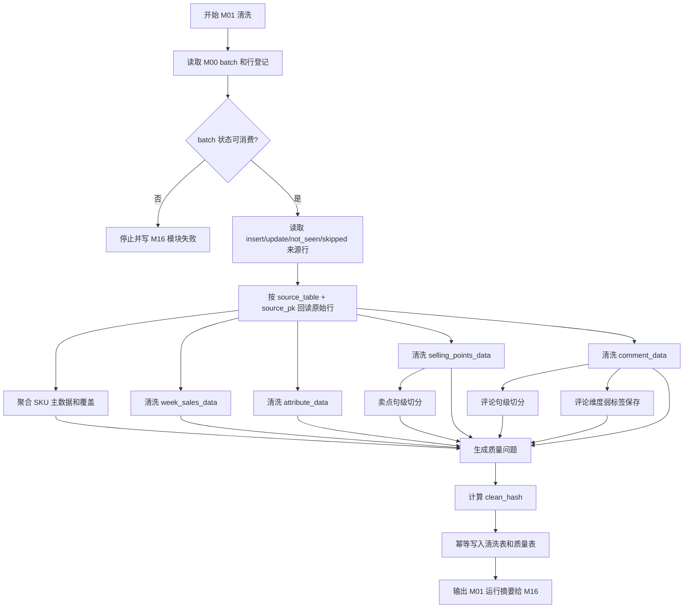

# M01 清洗规范化与质量诊断详细设计

## 1. 文档定位

本文是 CatForge 彩电核心三竞品真实数据 v2 的 M01 模块详细设计。它承接：

- `sop_requirements/M01_cleaning_quality_requirements.md`
- `sop_requirements/00_real_data_baseline.md`
- `sop_detailed_design/00_architecture_data_dictionary_design.md`
- `sop_detailed_design/M00_source_batch_registry_design.md`
- `cankao/CatForge_竞品生成SOP_详细指导_v1.md`
- `cankao/catforge_sop_md/modules/M01_清洗规范化与质量诊断.md`

M01 的目标是把 M00 登记的原始行转换成稳定、可追溯、可增量、可复核的清洗事实表，并输出数据质量诊断。M01 是后续 M02 Evidence、M03 参数、M04 卖点、M05/M06 评论、M07 市场画像的共同输入层。

本文写到可拆开发任务的程度，不包含代码、迁移或部署动作。

## 2. 模块职责

### 2.1 解决的问题

M01 负责解决四类工程问题：

| 问题 | M01 输出 |
| --- | --- |
| 原始表字段不统一 | 统一成 SKU、市场、参数、卖点、评论清洗事实表 |
| 原始值存在缺失、`unknown`、`-`、重复、拆行、默认评论 | 输出结构化质量标记和质量问题 |
| 下游需要增量处理 | 每条清洗事实生成 `clean_hash` 和 `clean_record_key` |
| 后续 evidence 必须可追溯 | 每条清洗事实保留 `batch_id`、`source_row_id`、原始值和清洗值 |

### 2.2 不解决的问题

M01 严禁做以下事情：

| 禁止事项 | 原因 | 归属模块 |
| --- | --- | --- |
| 修改原始四表 | 原始表只读 | 不允许 |
| 生成业务 evidence | evidence 原子由 M02 负责 | M02 |
| 标准参数编码和参数优劣判断 | 需要参数本体和规则 | M03 |
| 标准卖点激活 | 需要卖点 seed、参数和宣传语义 | M04a |
| 评论主题、任务、客群、战场抽取 | 评论语义下游信号独立设计 | M05/M06/M09-M11 |
| 把评论维度直接当业务标签 | 原始维度只是弱标签 | M05/M06 |
| 把缺失当 false | 缺失即 unknown | 全链路原则 |
| 判断竞品、角色和三槽位 | 依赖画像、候选和评分 | M12-M14 |
| 拼高层报告 | 页面表达由 M15 负责 | M15 |

### 2.3 输入边界

M01 只消费 M00 确认过的批次和来源行。

| 上游产物 | 用途 |
| --- | --- |
| `core3_source_batch` | 确认批次、水位、状态、原始表范围 |
| `core3_source_row_registry` | 获取本批来源行、变化状态、来源定位 |
| `core3_source_impacted_sku` | 了解受影响 SKU 候选 |
| 原始四表 | 仅按 `source_table + source_pk` 回读原始值 |

M01 不允许绕过 M00 扫描原始表决定增量范围。

### 2.4 输出边界

M01 输出九张清洗规范层表：

| 表 | 作用 |
| --- | --- |
| `core3_clean_sku` | SKU 主数据、跨表覆盖和冲突 |
| `core3_clean_market_weekly` | 周销量价清洗事实 |
| `core3_clean_attribute` | 参数字段清洗事实 |
| `core3_clean_claim` | 结构化卖点清洗事实 |
| `core3_clean_claim_sentence` | 卖点句级切分 |
| `core3_clean_comment` | 评论原文清洗和去重准备 |
| `core3_clean_comment_sentence` | 评论句级切分 |
| `core3_clean_comment_dimension` | 原始评论维度弱标签 |
| `core3_data_quality_issue` | 清洗、覆盖、冲突和异常诊断 |

M01 不输出抽取特征、画像、竞品结果或报告 payload。

## 3. 清洗原则

| 原则 | 设计要求 |
| --- | --- |
| 保留原值 | 所有事实表同时保存 raw 字段和 clean 字段 |
| 缺失即未知 | null、空字符串、`-`、`unknown`、`未知`、`暂无` 统一标记为 unknown，不转 false |
| 最小规范化 | 只做去空白、去不可见字符、统一标点、HTML 去除、基础数值解析 |
| 弱标签保留 | 评论维度、情感、卖点标题只保留为弱提示 |
| 不丢数据 | 低价值评论、重复评论、缺卖点 SKU 不删除，只标记 |
| 可增量 | 每条清洗事实计算 `clean_hash`，用于下游重算 |
| 可复核 | 所有异常有 `core3_data_quality_issue` |
| 分层消费 | 下游从清洗表读取，不直接读原始表做业务判断 |

## 4. 通用字段和 hash 规则

### 4.1 通用字段

除特殊说明外，M01 清洗事实表都包含以下字段：

| 字段 | 类型建议 | 必填 | 说明 |
| --- | --- | --- | --- |
| `project_id` | `text` | 是 | 项目 ID，MVP 可用 `core3_mvp` |
| `category_code` | `text` | 是 | 品类，MVP 为 `TV` |
| `batch_id` | `text` | 是 | M00 批次 |
| `run_id` | `text` | 否 | M16 全链路运行 ID |
| `module_run_id` | `text` | 否 | M01 模块运行 ID |
| `source_table` | `text` | 是 | 原始表 |
| `source_pk` | `text` | 是 | 原始主键 |
| `source_row_id` | `text` | 是 | 来源行 ID |
| `source_row_hash` | `text` | 否 | M00 行 hash |
| `source_operation_type` | `text` | 是 | M00 操作类型 |
| `clean_record_key` | `text` | 是 | 清洗记录稳定键 |
| `clean_hash` | `text` | 是 | 清洗结果 hash |
| `clean_version` | `text` | 是 | 清洗规则版本 |
| `hash_version` | `text` | 是 | 清洗 hash 版本 |
| `record_status` | `text` | 是 | `active`、`inactive_candidate`、`skipped` |
| `quality_status` | `text` | 是 | `ok`、`warning`、`error` |
| `quality_flags` | `jsonb` | 是 | 质量标记数组 |
| `review_required` | `boolean` | 是 | 是否需要复核 |
| `review_status` | `text` | 是 | `auto_pass`、`review_required`、`approved`、`rejected`、`waived` |
| `created_at` | `timestamptz` | 是 | 创建时间 |
| `updated_at` | `timestamptz` | 是 | 更新时间 |

`record_status` 说明：

| 值 | 说明 |
| --- | --- |
| `active` | 本批可用清洗事实 |
| `inactive_candidate` | M00 full 扫描发现来源行疑似消失，需要复核 |
| `skipped` | 来源行无法清洗，但要保留问题记录 |

### 4.2 `clean_record_key`

`clean_record_key` 是同一来源事实在清洗层的稳定键，不包含 `batch_id`。

| 表 | 规则 |
| --- | --- |
| `core3_clean_market_weekly` | `market:` + `source_row_id` |
| `core3_clean_attribute` | `attribute:` + `source_row_id` |
| `core3_clean_claim` | `claim:` + `source_row_id` |
| `core3_clean_claim_sentence` | `claim_sentence:` + `source_row_id` + `:` + `sentence_seq` |
| `core3_clean_comment` | `comment:` + `source_row_id` |
| `core3_clean_comment_sentence` | `comment_sentence:` + `source_row_id` + `:` + `sentence_source` + `:` + `sentence_seq` |
| `core3_clean_comment_dimension` | `comment_dimension:` + `source_row_id` |
| `core3_clean_sku` | `sku:` + `sku_code` |

### 4.3 `clean_hash`

`clean_hash` 用于判断清洗结果是否变化。首版建议 `hash_version=m01_clean_hash_v1`。

计算原则：

1. 只使用清洗输出字段，不使用 `batch_id`、`created_at`、`updated_at`。
2. 保留 null、empty、unknown 的差异。
3. JSON 字段固定 key 顺序。
4. 数值字段使用 Decimal 字符串稳定序列化。
5. 质量状态和质量标记参与 hash，因为质量变化会影响 evidence 置信度和下游复核。

伪代码：

```text
function compute_clean_hash(clean_domain, clean_payload):
    fields = clean_hash_fields[clean_domain]
    payload = {}
    for field in sorted(fields):
        payload[field] = clean_payload.get(field)
    return "sha256:" + sha256(stable_json_dump(payload))
```

### 4.4 值存在性枚举

| 值 | 含义 |
| --- | --- |
| `present` | 有明确内容 |
| `null` | 原始值为 null |
| `empty` | 原始值为空字符串或清洗后为空 |
| `dash` | 原始值为 `-` |
| `unknown_literal` | 原始值为 `unknown`、`未知`、`暂无` 等 |
| `missing_column` | 原始表缺少字段 |

后续业务模块必须把除 `present` 外的值视为 unknown，不得解释为 false。

## 5. 数据模型设计

### 5.1 `core3_clean_sku`

#### 5.1.1 表用途

聚合四张原始表中出现的 SKU 候选，形成跨表一致的 SKU 主数据、覆盖情况和冲突诊断。

#### 5.1.2 字段契约

| 字段 | 类型建议 | 必填 | 说明 |
| --- | --- | --- | --- |
| `clean_sku_id` | `text` | 是 | 主键，建议 `m01sku_<uuid>` |
| `project_id` | `text` | 是 | 项目 ID |
| `category_code` | `text` | 是 | 标准品类，MVP 为 `TV` |
| `batch_id` | `text` | 是 | 批次 |
| `run_id` | `text` | 否 | 全链路运行 ID |
| `module_run_id` | `text` | 否 | 模块运行 ID |
| `sku_code` | `text` | 是 | 首版等于 `model_code` 清洗值 |
| `sku_code_raw_values` | `jsonb` | 是 | 跨表原始 `model_code` 集合 |
| `model_name` | `text` | 否 | 清洗展示型号 |
| `model_name_raw_values` | `jsonb` | 是 | 跨表原始 `model` 集合 |
| `brand_name` | `text` | 否 | 清洗品牌 |
| `brand_raw_values` | `jsonb` | 是 | 跨表原始品牌集合 |
| `category_name` | `text` | 否 | 原始品类展示名 |
| `source_tables` | `jsonb` | 是 | 出现过的原始表 |
| `first_seen_source_row_id` | `text` | 否 | 本批首个来源行 |
| `representative_source_row_ids` | `jsonb` | 是 | 代表来源行 |
| `coverage_json` | `jsonb` | 是 | 市场、参数、卖点、评论覆盖 |
| `field_conflicts_json` | `jsonb` | 是 | 品牌、型号、品类冲突 |
| `missing_signals_json` | `jsonb` | 是 | 缺失数据域 |
| `clean_record_key` | `text` | 是 | `sku:<sku_code>` |
| `clean_hash` | `text` | 是 | SKU 清洗 hash |
| `clean_version` | `text` | 是 | 清洗规则版本 |
| `hash_version` | `text` | 是 | hash 版本 |
| `quality_status` | `text` | 是 | `ok`、`warning`、`error` |
| `quality_flags` | `jsonb` | 是 | 质量标记 |
| `review_required` | `boolean` | 是 | 是否复核 |
| `review_status` | `text` | 是 | 复核状态 |
| `created_at` | `timestamptz` | 是 | 创建时间 |
| `updated_at` | `timestamptz` | 是 | 更新时间 |

#### 5.1.3 约束和索引

| 类型 | 字段 |
| --- | --- |
| 主键 | `clean_sku_id` |
| 唯一键 | `batch_id, sku_code` |
| 普通索引 | `project_id, category_code, batch_id` |
| 普通索引 | `sku_code` |
| 普通索引 | `quality_status` |
| GIN 索引 | `coverage_json`、`missing_signals_json` |

#### 5.1.4 JSON 结构

`coverage_json`：

```json
{
  "market": {"row_count": 46, "covered": true},
  "attribute": {"row_count": 81, "covered": true, "unknown_count": 0},
  "claim": {"row_count": 0, "covered": false},
  "comment": {"row_count": 3621, "covered": true, "distinct_comment_id_count": 1648}
}
```

`field_conflicts_json`：

```json
{
  "brand": {"has_conflict": false, "values": ["海信"]},
  "model": {"has_conflict": false, "values": ["85E7Q"]},
  "category": {"has_conflict": false, "values": ["彩电"]}
}
```

`missing_signals_json`：

```json
{
  "claim_structured": {
    "missing": true,
    "reason": "本批 selling_points_data 未覆盖该 SKU",
    "business_interpretation": "结构化卖点数据缺失，不代表该 SKU 没有卖点"
  }
}
```

### 5.2 `core3_clean_market_weekly`

#### 5.2.1 表用途

保存 `week_sales_data` 的周销量价清洗事实，供 M02 生成市场 evidence、M07 生成市场画像、M13 计算价格和渠道重合。

#### 5.2.2 字段契约

| 字段 | 类型建议 | 必填 | 说明 |
| --- | --- | --- | --- |
| `clean_market_id` | `text` | 是 | 主键，建议 `m01mkt_<uuid>` |
| `project_id` | `text` | 是 | 项目 ID |
| `category_code` | `text` | 是 | `TV` |
| `batch_id` | `text` | 是 | 批次 |
| `run_id` | `text` | 否 | 运行 ID |
| `module_run_id` | `text` | 否 | 模块运行 ID |
| `source_table` | `text` | 是 | `week_sales_data` |
| `source_pk` | `text` | 是 | 原始 `id` |
| `source_row_id` | `text` | 是 | 来源行 |
| `source_row_hash` | `text` | 否 | M00 hash |
| `source_operation_type` | `text` | 是 | M00 操作类型 |
| `sku_code` | `text` | 否 | `model_code` 清洗值 |
| `model_name` | `text` | 否 | 型号 |
| `brand_name` | `text` | 否 | 品牌 |
| `category_name_raw` | `text` | 否 | 原始品类 |
| `period_raw` | `text` | 否 | 如 `26W01` |
| `period_type` | `text` | 否 | `week`、`unknown` |
| `period_year_hint` | `integer` | 否 | 如 `2026`，只作提示 |
| `period_week_index` | `integer` | 否 | 周序号 |
| `period_parse_status` | `text` | 是 | `parsed`、`partial`、`failed` |
| `channel_raw` | `text` | 否 | 原始渠道 |
| `channel_type` | `text` | 否 | 如 `线上` |
| `platform_raw` | `text` | 否 | 原始平台 |
| `platform_type` | `text` | 否 | 如 `专业电商`、`平台电商` |
| `sales_volume_raw` | `text` | 否 | 原始销量 |
| `sales_volume` | `numeric` | 否 | 数值化销量 |
| `sales_amount_raw` | `text` | 否 | 原始销额 |
| `sales_amount` | `numeric` | 否 | 数值化销额 |
| `avg_price_raw` | `text` | 否 | 原始均价 |
| `avg_price` | `numeric` | 否 | 数值化均价 |
| `avg_price_expected` | `numeric` | 否 | `sales_amount / sales_volume` |
| `price_check_status` | `text` | 是 | `pass`、`mismatch`、`uncheckable` |
| `price_check_delta` | `numeric` | 否 | 均价差异比例 |
| `clean_record_key` | `text` | 是 | `market:<source_row_id>` |
| `clean_hash` | `text` | 是 | 清洗 hash |
| `clean_version` | `text` | 是 | 规则版本 |
| `hash_version` | `text` | 是 | hash 版本 |
| `record_status` | `text` | 是 | `active`、`inactive_candidate`、`skipped` |
| `quality_status` | `text` | 是 | 质量状态 |
| `quality_flags` | `jsonb` | 是 | 质量标记 |
| `review_required` | `boolean` | 是 | 是否复核 |
| `review_status` | `text` | 是 | 复核状态 |
| `created_at` | `timestamptz` | 是 | 创建时间 |
| `updated_at` | `timestamptz` | 是 | 更新时间 |

#### 5.2.3 约束和索引

| 类型 | 字段 |
| --- | --- |
| 主键 | `clean_market_id` |
| 唯一键 | `batch_id, source_row_id` |
| 普通索引 | `project_id, category_code, batch_id` |
| 普通索引 | `sku_code, period_raw` |
| 普通索引 | `channel_type, platform_type` |
| 普通索引 | `quality_status` |
| 普通索引 | `clean_hash` |

#### 5.2.4 清洗规则

| 字段 | 规则 |
| --- | --- |
| `category` | `彩电` 映射为 `category_code=TV`，原值进入 `category_name_raw` |
| `date_value` | 保留原值；匹配 `YYWNN` 时解析 `period_year_hint` 和 `period_week_index` |
| `channel` | 去空白后保留当前 `线上`；不生成线下结论 |
| `platform` | 去空白后保留 `专业电商`、`平台电商` |
| `sales_volume` | Decimal 数值化；负值 error |
| `sales_amount` | Decimal 数值化；负值 error |
| `avg_price` | Decimal 数值化；负值 error |
| 均价校验 | 销量 > 0 时计算 `sales_amount/sales_volume`，差异超过 1% 且超过 1 元标记 `price_check_mismatch` |

### 5.3 `core3_clean_attribute`

#### 5.3.1 表用途

保存 `attribute_data` 的参数清洗事实，供 M02 生成参数 evidence、M03 做字段画像和标准参数抽取。

M01 只做文本规范化、存在性标记、数字和单位候选提取，不做标准参数映射。

#### 5.3.2 字段契约

| 字段 | 类型建议 | 必填 | 说明 |
| --- | --- | --- | --- |
| `clean_attribute_id` | `text` | 是 | 主键，建议 `m01attr_<uuid>` |
| `project_id` | `text` | 是 | 项目 ID |
| `category_code` | `text` | 是 | `TV` |
| `batch_id` | `text` | 是 | 批次 |
| `run_id` | `text` | 否 | 运行 ID |
| `module_run_id` | `text` | 否 | 模块运行 ID |
| `source_table` | `text` | 是 | `attribute_data` |
| `source_pk` | `text` | 是 | 原始 `id` |
| `source_row_id` | `text` | 是 | 来源行 |
| `source_row_hash` | `text` | 否 | M00 hash |
| `source_operation_type` | `text` | 是 | M00 操作类型 |
| `sku_code` | `text` | 否 | SKU |
| `model_name` | `text` | 否 | 型号 |
| `brand_name` | `text` | 否 | 品牌 |
| `raw_attr_name` | `text` | 否 | 原始属性名 |
| `clean_attr_name` | `text` | 否 | 清洗属性名 |
| `raw_attr_value` | `text` | 否 | 原始属性值 |
| `clean_attr_value` | `text` | 否 | 清洗属性值 |
| `value_presence` | `text` | 是 | `present`、`null`、`empty`、`dash`、`unknown_literal`、`missing_column` |
| `value_number_candidates` | `jsonb` | 是 | 数字候选数组 |
| `value_unit_candidates` | `jsonb` | 是 | 单位候选数组 |
| `raw_value_token_count` | `integer` | 否 | 粗分词数量，供 M03 判断复杂值 |
| `conflict_group_key` | `text` | 否 | `sku_code + clean_attr_name` |
| `clean_record_key` | `text` | 是 | `attribute:<source_row_id>` |
| `clean_hash` | `text` | 是 | 清洗 hash |
| `clean_version` | `text` | 是 | 规则版本 |
| `hash_version` | `text` | 是 | hash 版本 |
| `record_status` | `text` | 是 | 状态 |
| `quality_status` | `text` | 是 | 质量状态 |
| `quality_flags` | `jsonb` | 是 | 质量标记 |
| `review_required` | `boolean` | 是 | 是否复核 |
| `review_status` | `text` | 是 | 复核状态 |
| `created_at` | `timestamptz` | 是 | 创建时间 |
| `updated_at` | `timestamptz` | 是 | 更新时间 |

#### 5.3.3 约束和索引

| 类型 | 字段 |
| --- | --- |
| 主键 | `clean_attribute_id` |
| 唯一键 | `batch_id, source_row_id` |
| 普通索引 | `project_id, category_code, batch_id` |
| 普通索引 | `sku_code, clean_attr_name` |
| 普通索引 | `value_presence` |
| 普通索引 | `conflict_group_key` |
| GIN 索引 | `value_number_candidates`、`quality_flags` |

#### 5.3.4 清洗规则

| 场景 | 处理 |
| --- | --- |
| `attr_name` 有首尾空白或全半角差异 | 文本规范化后写入 `clean_attr_name` |
| `attr_value` 为 null、空、`-`、`unknown`、`未知`、`暂无` | `value_presence` 标记 unknown 类，不转 false |
| `attr_value=300HZ` | 数字候选 `300`，单位候选 `HZ`，不做单位换算 |
| `attr_value=4GB+64GB` | 提取多个数字和单位候选，交给 M03 |
| 同一 SKU 同一属性多值 | 写 `conflict_group_key`，批量生成质量问题 |

### 5.4 `core3_clean_claim`

#### 5.4.1 表用途

保存 `selling_points_data` 的结构化卖点清洗事实，供 M02 生成宣传 evidence、M04a 做基础卖点激活。

M01 不判断卖点是否成立，不把标题结构直接当标准卖点。

#### 5.4.2 字段契约

| 字段 | 类型建议 | 必填 | 说明 |
| --- | --- | --- | --- |
| `clean_claim_id` | `text` | 是 | 主键，建议 `m01claim_<uuid>` |
| `project_id` | `text` | 是 | 项目 ID |
| `category_code` | `text` | 是 | `TV` |
| `batch_id` | `text` | 是 | 批次 |
| `run_id` | `text` | 否 | 运行 ID |
| `module_run_id` | `text` | 否 | 模块运行 ID |
| `source_table` | `text` | 是 | `selling_points_data` |
| `source_pk` | `text` | 是 | 原始 `id` |
| `source_row_id` | `text` | 是 | 来源行 |
| `source_row_hash` | `text` | 否 | M00 hash |
| `source_operation_type` | `text` | 是 | M00 操作类型 |
| `sku_code` | `text` | 否 | SKU |
| `model_name` | `text` | 否 | 型号 |
| `brand_name` | `text` | 否 | 品牌 |
| `claim_seq_raw` | `text` | 否 | 原始 `variable`，如 `卖点1` |
| `claim_seq` | `integer` | 否 | 卖点序号 |
| `raw_claim_text` | `text` | 否 | 原始卖点文本 |
| `clean_claim_text` | `text` | 否 | 清洗文本 |
| `claim_text_presence` | `text` | 是 | 存在性 |
| `title_hint` | `text` | 否 | 标题结构候选 |
| `structure_hints` | `jsonb` | 是 | 标题、冒号、编号、括号等弱结构 |
| `clean_record_key` | `text` | 是 | `claim:<source_row_id>` |
| `clean_hash` | `text` | 是 | 清洗 hash |
| `clean_version` | `text` | 是 | 规则版本 |
| `hash_version` | `text` | 是 | hash 版本 |
| `record_status` | `text` | 是 | 状态 |
| `quality_status` | `text` | 是 | 质量状态 |
| `quality_flags` | `jsonb` | 是 | 质量标记 |
| `review_required` | `boolean` | 是 | 是否复核 |
| `review_status` | `text` | 是 | 复核状态 |
| `created_at` | `timestamptz` | 是 | 创建时间 |
| `updated_at` | `timestamptz` | 是 | 更新时间 |

#### 5.4.3 约束和索引

| 类型 | 字段 |
| --- | --- |
| 主键 | `clean_claim_id` |
| 唯一键 | `batch_id, source_row_id` |
| 普通索引 | `project_id, category_code, batch_id` |
| 普通索引 | `sku_code, claim_seq` |
| 普通索引 | `claim_text_presence` |
| GIN 索引 | `structure_hints`、`quality_flags` |

#### 5.4.4 清洗规则

| 场景 | 处理 |
| --- | --- |
| `variable=卖点1` | `claim_seq=1` |
| `variable` 无法解析 | 保留原值，`claim_seq=null`，输出质量问题 |
| `selling_point` 含 HTML | 去 HTML，保留文本 |
| 卖点文本含“核心定位”等标题 | 写入 `title_hint`，不得生成卖点结论 |
| SKU 无卖点行 | 不在本表造行，由 `core3_clean_sku.missing_signals_json` 和质量问题表达 |

### 5.5 `core3_clean_claim_sentence`

#### 5.5.1 表用途

保存卖点文本的句级切分结果，供 M02 建宣传句 evidence，供 M04a 后续抽取实体和激活标准卖点。

#### 5.5.2 字段契约

| 字段 | 类型建议 | 必填 | 说明 |
| --- | --- | --- | --- |
| `claim_sentence_id` | `text` | 是 | 主键，建议 `m01clsent_<uuid>` |
| `project_id` | `text` | 是 | 项目 ID |
| `category_code` | `text` | 是 | `TV` |
| `batch_id` | `text` | 是 | 批次 |
| `source_row_id` | `text` | 是 | 卖点来源行 |
| `clean_claim_id` | `text` | 是 | 对应 `core3_clean_claim` |
| `sku_code` | `text` | 否 | SKU |
| `claim_seq` | `integer` | 否 | 卖点序号 |
| `sentence_seq` | `integer` | 是 | 句序号 |
| `sentence_text` | `text` | 是 | 句文本 |
| `sentence_text_hash` | `text` | 是 | 句 hash |
| `sentence_role_hint` | `text` | 否 | `title`、`body`、`numeric_claim`、`unknown` |
| `split_rule` | `text` | 是 | 切句规则版本 |
| `clean_record_key` | `text` | 是 | 稳定键 |
| `clean_hash` | `text` | 是 | 清洗 hash |
| `clean_version` | `text` | 是 | 规则版本 |
| `hash_version` | `text` | 是 | hash 版本 |
| `quality_status` | `text` | 是 | 质量状态 |
| `quality_flags` | `jsonb` | 是 | 质量标记 |
| `created_at` | `timestamptz` | 是 | 创建时间 |

#### 5.5.3 约束和索引

| 类型 | 字段 |
| --- | --- |
| 主键 | `claim_sentence_id` |
| 唯一键 | `batch_id, source_row_id, sentence_seq` |
| 普通索引 | `sku_code, claim_seq` |
| 普通索引 | `sentence_text_hash` |

### 5.6 `core3_clean_comment`

#### 5.6.1 表用途

保存 `comment_data` 的评论清洗事实，保留正文、分段、情感、重复依据和低价值标记，供 M02 生成评论 evidence，供 M05 做评论去重和证据构建。

M01 不做评论主题抽取，不按维度生成任务、客群、战场。

#### 5.6.2 字段契约

| 字段 | 类型建议 | 必填 | 说明 |
| --- | --- | --- | --- |
| `clean_comment_id` | `text` | 是 | 主键，建议 `m01cmt_<uuid>` |
| `project_id` | `text` | 是 | 项目 ID |
| `category_code` | `text` | 是 | `TV` |
| `batch_id` | `text` | 是 | 批次 |
| `run_id` | `text` | 否 | 运行 ID |
| `module_run_id` | `text` | 否 | 模块运行 ID |
| `source_table` | `text` | 是 | `comment_data` |
| `source_pk` | `text` | 是 | 原始 `id` |
| `source_row_id` | `text` | 是 | 来源行 |
| `source_row_hash` | `text` | 否 | M00 hash |
| `source_operation_type` | `text` | 是 | M00 操作类型 |
| `sku_code` | `text` | 否 | SKU |
| `model_name` | `text` | 否 | 型号 |
| `brand_name` | `text` | 否 | 品牌 |
| `platform_raw` | `text` | 否 | 原始平台，如原表无字段则 null |
| `url_id` | `text` | 否 | 原始链接或商品页标识，如存在 |
| `comment_id` | `text` | 否 | 原始评论 ID |
| `comment_time_raw` | `text` | 否 | 原始评论时间 |
| `comment_time` | `timestamptz` | 否 | 规范化评论时间 |
| `comment_time_parse_status` | `text` | 是 | `parsed`、`missing`、`failed` |
| `raw_comment_text` | `text` | 否 | 原始正文 |
| `clean_comment_text` | `text` | 否 | 清洗正文 |
| `comment_text_presence` | `text` | 是 | 正文存在性 |
| `comment_text_hash` | `text` | 否 | 清洗正文 hash |
| `segment_text_raw` | `text` | 否 | 原始 `comments_segments` |
| `segment_text_clean` | `text` | 否 | 清洗分段 |
| `segment_text_hash` | `text` | 否 | 分段 hash |
| `sentiment_raw` | `text` | 否 | 原始情感 |
| `sentiment_clean` | `text` | 是 | `正面`、`中立`、`负面`、`unknown` |
| `low_value_flag` | `boolean` | 是 | 是否低价值文本 |
| `low_value_reason` | `text` | 否 | 默认评价、空评价等 |
| `duplicate_group_key` | `text` | 否 | 去重准备键 |
| `dimension_available` | `boolean` | 是 | 是否有原始维度 |
| `clean_record_key` | `text` | 是 | `comment:<source_row_id>` |
| `clean_hash` | `text` | 是 | 清洗 hash |
| `clean_version` | `text` | 是 | 规则版本 |
| `hash_version` | `text` | 是 | hash 版本 |
| `record_status` | `text` | 是 | 状态 |
| `quality_status` | `text` | 是 | 质量状态 |
| `quality_flags` | `jsonb` | 是 | 质量标记 |
| `review_required` | `boolean` | 是 | 是否复核 |
| `review_status` | `text` | 是 | 复核状态 |
| `created_at` | `timestamptz` | 是 | 创建时间 |
| `updated_at` | `timestamptz` | 是 | 更新时间 |

#### 5.6.3 约束和索引

| 类型 | 字段 |
| --- | --- |
| 主键 | `clean_comment_id` |
| 唯一键 | `batch_id, source_row_id` |
| 普通索引 | `project_id, category_code, batch_id` |
| 普通索引 | `sku_code, comment_id` |
| 普通索引 | `comment_text_hash` |
| 普通索引 | `segment_text_hash` |
| 普通索引 | `duplicate_group_key` |
| 普通索引 | `sentiment_clean` |
| 普通索引 | `low_value_flag` |
| GIN 索引 | `quality_flags` |

#### 5.6.4 清洗规则

| 场景 | 处理 |
| --- | --- |
| 正文为空 | `comment_text_presence=empty`，保留行，质量 issue |
| 正文为“此用户没有填写评价”“默认好评”等 | `low_value_flag=true`，不删除 |
| 原始 `sentiment` 为空 | `sentiment_clean=unknown`，不能当中立 |
| 同一 `comment_id` 多行 | 保留多行，写重复准备标记 |
| 同一正文多行 | 生成相同 `comment_text_hash`，交给 M05 去重 |
| `comments_segments` 有内容 | 保留原始分段和分段 hash，不替代系统分句 |

### 5.7 `core3_clean_comment_sentence`

#### 5.7.1 表用途

保存评论句级切分结果，供 M02 建句级 evidence，供 M05/M06 做评论 evidence 去重和下游信号抽取。

#### 5.7.2 字段契约

| 字段 | 类型建议 | 必填 | 说明 |
| --- | --- | --- | --- |
| `comment_sentence_id` | `text` | 是 | 主键，建议 `m01cmsent_<uuid>` |
| `project_id` | `text` | 是 | 项目 ID |
| `category_code` | `text` | 是 | `TV` |
| `batch_id` | `text` | 是 | 批次 |
| `source_row_id` | `text` | 是 | 评论来源行 |
| `clean_comment_id` | `text` | 是 | 对应 `core3_clean_comment` |
| `sku_code` | `text` | 否 | SKU |
| `comment_id` | `text` | 否 | 评论 ID |
| `sentence_source` | `text` | 是 | `system_split`、`source_segment` |
| `sentence_seq` | `integer` | 是 | 句序号 |
| `sentence_text` | `text` | 是 | 句文本 |
| `sentence_text_hash` | `text` | 是 | 句 hash |
| `source_segment_text` | `text` | 否 | 原始 `comments_segments` |
| `is_from_existing_segment` | `boolean` | 是 | 是否来自原始分段 |
| `split_rule` | `text` | 是 | 切句规则版本 |
| `clean_record_key` | `text` | 是 | 稳定键 |
| `clean_hash` | `text` | 是 | 清洗 hash |
| `clean_version` | `text` | 是 | 规则版本 |
| `hash_version` | `text` | 是 | hash 版本 |
| `quality_status` | `text` | 是 | 质量状态 |
| `quality_flags` | `jsonb` | 是 | 质量标记 |
| `created_at` | `timestamptz` | 是 | 创建时间 |

#### 5.7.3 约束和索引

| 类型 | 字段 |
| --- | --- |
| 主键 | `comment_sentence_id` |
| 唯一键 | `batch_id, source_row_id, sentence_source, sentence_seq` |
| 普通索引 | `sku_code, comment_id` |
| 普通索引 | `sentence_text_hash` |
| 普通索引 | `sentence_source` |

### 5.8 `core3_clean_comment_dimension`

#### 5.8.1 表用途

保存 `comment_data` 原始维度路径，作为弱标签和质量背景，供 M05/M06 参考，但不能直接作为任务、客群、战场或卖点结论。

#### 5.8.2 字段契约

| 字段 | 类型建议 | 必填 | 说明 |
| --- | --- | --- | --- |
| `comment_dimension_id` | `text` | 是 | 主键，建议 `m01cmdim_<uuid>` |
| `project_id` | `text` | 是 | 项目 ID |
| `category_code` | `text` | 是 | `TV` |
| `batch_id` | `text` | 是 | 批次 |
| `source_row_id` | `text` | 是 | 评论来源行 |
| `clean_comment_id` | `text` | 是 | 对应 `core3_clean_comment` |
| `sku_code` | `text` | 否 | SKU |
| `comment_id` | `text` | 否 | 评论 ID |
| `primary_dim_raw` | `text` | 否 | 原始一级维度 |
| `secondary_dim_raw` | `text` | 否 | 原始二级维度 |
| `third_dim_raw` | `text` | 否 | 原始三级维度 |
| `dimension_path_raw` | `text` | 否 | 维度路径 |
| `dimension_available` | `boolean` | 是 | 是否有维度 |
| `dimension_quality_flag` | `text` | 是 | `available`、`missing`、`weak_label`、`split_row_suspected` |
| `clean_record_key` | `text` | 是 | 稳定键 |
| `clean_hash` | `text` | 是 | 清洗 hash |
| `clean_version` | `text` | 是 | 规则版本 |
| `hash_version` | `text` | 是 | hash 版本 |
| `quality_status` | `text` | 是 | 质量状态 |
| `quality_flags` | `jsonb` | 是 | 质量标记 |
| `created_at` | `timestamptz` | 是 | 创建时间 |

#### 5.8.3 约束和索引

| 类型 | 字段 |
| --- | --- |
| 主键 | `comment_dimension_id` |
| 唯一键 | `batch_id, source_row_id` |
| 普通索引 | `sku_code, comment_id` |
| 普通索引 | `dimension_available` |
| 普通索引 | `primary_dim_raw, secondary_dim_raw, third_dim_raw` |

### 5.9 `core3_data_quality_issue`

#### 5.9.1 表用途

统一记录 M01 发现的缺失、非法、冲突、覆盖不足、重复、异常和复核建议，供 M16 编排复核，供 M02-M15 降级或解释结果。

#### 5.9.2 字段契约

| 字段 | 类型建议 | 必填 | 说明 |
| --- | --- | --- | --- |
| `issue_id` | `text` | 是 | 主键，建议 `m01qi_<uuid>` |
| `project_id` | `text` | 是 | 项目 ID |
| `category_code` | `text` | 是 | `TV` |
| `batch_id` | `text` | 是 | 批次 |
| `run_id` | `text` | 否 | 运行 ID |
| `module_run_id` | `text` | 否 | 模块运行 ID |
| `module_code` | `text` | 是 | 固定 `M01` |
| `domain` | `text` | 是 | `sku`、`market`、`attribute`、`claim`、`comment`、`coverage` |
| `source_table` | `text` | 否 | 来源表 |
| `source_row_id` | `text` | 否 | 来源行 |
| `clean_table` | `text` | 否 | 清洗表 |
| `clean_record_key` | `text` | 否 | 清洗记录键 |
| `sku_code` | `text` | 否 | SKU |
| `issue_type` | `text` | 是 | 问题类型 |
| `severity` | `text` | 是 | `info`、`warning`、`error` |
| `issue_detail` | `text` | 是 | 中文说明 |
| `issue_payload_json` | `jsonb` | 是 | 结构化问题详情 |
| `suggested_downstream_action` | `text` | 否 | 给下游的处理建议 |
| `review_required` | `boolean` | 是 | 是否需要复核 |
| `review_status` | `text` | 是 | 复核状态 |
| `created_at` | `timestamptz` | 是 | 创建时间 |

#### 5.9.3 约束和索引

| 类型 | 字段 |
| --- | --- |
| 主键 | `issue_id` |
| 幂等唯一键 | `batch_id, domain, issue_type, coalesce(source_row_id,''), coalesce(clean_record_key,''), coalesce(sku_code,'')` |
| 普通索引 | `project_id, category_code, batch_id` |
| 普通索引 | `sku_code` |
| 普通索引 | `domain, issue_type` |
| 普通索引 | `severity` |
| 普通索引 | `review_required` |
| GIN 索引 | `issue_payload_json` |

#### 5.9.4 问题类型

| `issue_type` | 触发场景 | 严重度 |
| --- | --- | --- |
| `missing_required_field` | SKU、来源主键、核心事实字段缺失 | `warning` 或 `error` |
| `invalid_number` | 销量、销额、均价无法数值化 | `error` |
| `negative_number` | 量价字段为负 | `error` |
| `price_check_mismatch` | 均价与销额/销量偏差过大 | `warning` |
| `unknown_value` | 参数值为空、`unknown`、`-` | `info` 或 `warning` |
| `cross_table_conflict` | 同一 SKU 品牌、型号、品类冲突 | `warning` 或 `error` |
| `claim_coverage_missing` | SKU 无结构化卖点 | `warning` |
| `claim_seq_parse_failed` | 卖点序号无法解析 | `warning` |
| `low_value_comment` | 默认评价、空评价 | `info` |
| `duplicate_comment_text` | 评论正文重复 | `info` 或 `warning` |
| `comment_dimension_missing` | 原始维度为空 | `info` |
| `comment_split_row_suspected` | 评论维度拆行明显 | `info` 或 `warning` |
| `schema_changed` | M00 发现 schema 变化 | `warning` 或 `error` |
| `clean_hash_changed_high` | 清洗 hash 变化比例异常 | `warning` |

## 6. 处理流程

### 6.1 总体流程图



### 6.2 步骤 1：读取并校验 M00 批次

可消费条件：

- `core3_source_batch.status in ('registered', 'registered_with_warning')`
- 如果 `review_required=true`，必须由 M16 判断是否允许继续。
- `source_tables` 包含当前 M01 支持的四张表。

不可消费条件：

- M00 批次 `failed`。
- 原始表读取权限不可用。
- M00 schema 变化被 M16 标记为阻断。

### 6.3 步骤 2：确定清洗范围

默认增量范围：

```text
source_operation_type in (
  'insert',
  'update',
  'not_seen_in_current_scan',
  'skipped'
)
```

处理规则：

| M00 状态 | M01 处理 |
| --- | --- |
| `insert` | 回读原始行，生成清洗事实 |
| `update` | 回读原始行，生成新清洗事实 |
| `no_change` | 默认跳过，除非全量重建 |
| `not_seen_in_current_scan` | 生成 inactive candidate 标记和质量问题 |
| `skipped` | 不回读或尽力回读，生成质量问题 |

### 6.4 步骤 3：文本最小规范化

统一文本函数只做以下处理：

1. 去除首尾空白。
2. 合并连续空白。
3. 去不可见字符。
4. HTML 标签去除。
5. 全角英数字和标点按规则转半角，中文标点保留可读形式。
6. 保留原有中文业务表达，不做同义词改写。

M01 不做：

- 语义归类。
- 标准参数同义词映射。
- 卖点价值判断。
- 评论主题推断。

### 6.5 步骤 4：数值和周期解析

数值解析：

- 支持整数、小数、千分位、字符串数字。
- 解析失败保留 raw，数值字段为 null。
- 负销量、负销额、负均价为 error。

周期解析：

```text
26W01 -> period_type=week, period_year_hint=2026, period_week_index=1
```

`period_year_hint` 只是提示，不代表已解析到完整自然日期。

### 6.6 步骤 5：句级切分准备

卖点句级切分：

- 按换行、句号、分号、冒号、括号标题、编号切分。
- 保留标题型片段。
- 过滤纯空白句。

评论句级切分：

- 对 `clean_comment_text` 做系统切句。
- 对 `comments_segments` 单独生成 `sentence_source=source_segment` 的句记录。
- 不把原始分段视为最终语义分类。

### 6.7 步骤 6：质量问题生成

质量问题分三类：

| 类型 | 粒度 | 示例 |
| --- | --- | --- |
| 行级问题 | `source_row_id` | 销量无法数值化 |
| SKU 级问题 | `sku_code` | 85E7Q 无结构化卖点 |
| 批次级问题 | `batch_id` | 评论重复率异常 |

所有质量问题进入 `core3_data_quality_issue`，不得只写日志。

### 6.8 步骤 7：写入和幂等

写入顺序：

1. `core3_clean_sku`
2. 分域清洗事实表
3. 句级和维度表
4. `core3_data_quality_issue`

幂等规则：

- 同一 `batch_id + source_row_id` 的同一清洗表只能有一条主事实。
- 同一 `batch_id + source_row_id + sentence_seq` 的句级表只能有一条。
- 重跑同一 batch 时，如果记录已存在且 `clean_hash` 一致，可跳过。
- 如果记录已存在但 `clean_hash` 不一致，应失败并要求重新创建 batch 或清理失败批次，不能静默覆盖。

## 7. 增量策略

### 7.1 clean 变化判定

M01 输出以下清洗变化状态，供 M16 使用：

```text
same clean_record_key + same clean_hash = clean_no_change
same clean_record_key + different clean_hash = clean_changed
new clean_record_key = clean_insert
record_status=inactive_candidate = clean_inactive_candidate
record_status=skipped = clean_skipped
```

变化状态不单独建表，首版可以由 M16 对比本批和上一成功批的清洗表计算。若后续性能不足，再增设 M01 变化汇总表。

### 7.2 触发下游建议

| 清洗变化 | 建议影响 |
| --- | --- |
| SKU 主数据变化 | M02-M16 |
| 市场清洗变化 | M02、M07、M08-M15 |
| 参数清洗变化 | M02、M03、M04a、M08-M15 |
| 卖点清洗变化 | M02、M04a、M04b、M08-M15 |
| 评论清洗变化 | M02、M05、M06、M04b、M08-M15 |
| 仅质量标签变化 | M02 置信度、M16 复核 |

M01 不直接启动下游任务。

### 7.3 历史保留

清洗表按 `batch_id` 保留历史。旧结果不物理删除。

查询“当前清洗事实”时由 M16 或 repository 使用：

1. 已验收批次优先。
2. 最新成功 M01 模块运行。
3. 同一 `clean_record_key` 最新 `created_at`。

开发阶段不得依赖“删除旧记录后插入新记录”的 current 逻辑。

## 8. 服务、任务和 API 边界

### 8.1 后端包建议

建议后续开发放在：

```text
apps/api-server/app/services/core3_real_data/cleaning_quality_service.py
```

配套组件：

| 组件 | 职责 |
| --- | --- |
| `SourceRegistryReader` | 读取 M00 批次和行登记 |
| `RawSourceRepository` | 按 `source_table + source_pk` 受控读取原始行 |
| `CleanSkuRepository` | 写入 SKU 主数据 |
| `CleanMarketRepository` | 写入市场清洗事实 |
| `CleanAttributeRepository` | 写入参数清洗事实 |
| `CleanClaimRepository` | 写入卖点清洗事实和句表 |
| `CleanCommentRepository` | 写入评论清洗事实、句表、维度表 |
| `DataQualityIssueRepository` | 写入质量问题 |
| `TextNormalizer` | 文本最小规范化 |
| `NumberParser` | 数值解析 |
| `PeriodParser` | 周期解析 |
| `SentenceSplitter` | 句级切分 |
| `CleanHashService` | 生成 `clean_hash` |
| `CleaningQualityRunner` | 编排 M01 全流程 |

### 8.2 任务入口

```text
CleaningQualityRunner.run(
  project_id,
  category_code,
  batch_id,
  run_id=None,
  module_run_id=None,
  clean_version="m01_clean_v1",
  hash_version="m01_clean_hash_v1",
  mode="incremental"
)
```

返回：

```json
{
  "batch_id": "m00_...",
  "module_code": "M01",
  "status": "completed_with_warning",
  "clean_counts": {
    "sku": 35,
    "market": 1326,
    "attribute": 2843,
    "claim": 65,
    "comment": 62426
  },
  "issue_counts": {
    "info": 1200,
    "warning": 37,
    "error": 0
  },
  "review_required": true
}
```

### 8.3 API 设计

M01 API 是生产线运营和数据排查接口，不是高层报告接口。

| 方法 | 路径 | 用途 |
| --- | --- | --- |
| `POST` | `/api/mvp/core3/v2/projects/{project_id}/batches/{batch_id}/cleaning/run` | 手工触发 M01 |
| `GET` | `/api/mvp/core3/v2/projects/{project_id}/batches/{batch_id}/cleaning/summary` | 查看清洗摘要 |
| `GET` | `/api/mvp/core3/v2/projects/{project_id}/batches/{batch_id}/cleaning/skus` | 查看 SKU 覆盖 |
| `GET` | `/api/mvp/core3/v2/projects/{project_id}/batches/{batch_id}/quality-issues` | 查看质量问题 |

高层展示页不得直接展示 M01 的内部表名、hash、UUID 或原始大表明细。M15 只使用经过报告转译的业务表达。

## 9. 质量和复核规则

### 9.1 warning 条件

| 条件 | 输出 |
| --- | --- |
| 参数 unknown/空值/`-` 比例高 | `unknown_value` issue |
| SKU 缺结构化卖点 | `claim_coverage_missing` issue |
| 评论正文重复率高 | `duplicate_comment_text` issue |
| 评论维度为空比例高 | `comment_dimension_missing` issue |
| 低价值评论比例高 | `low_value_comment` issue |
| 均价与销额/销量不一致 | `price_check_mismatch` issue |

### 9.2 review_required 条件

| 条件 | 判断 |
| --- | --- |
| 核心字段无法清洗 | SKU、销量、销额等核心字段缺失或非法 |
| 跨表主数据冲突 | 同一 SKU 品牌、型号、品类冲突 |
| 卖点覆盖异常下降 | 本批卖点覆盖 SKU 数较上一成功批次明显下降 |
| 评论重复异常升高 | 新增评论行多但 distinct 正文增量低 |
| clean hash 大面积变化 | 变化比例异常，可能清洗规则或原始数据异常 |

### 9.3 blocked 条件

| 条件 | 处理 |
| --- | --- |
| M00 批次不可消费 | M01 不运行 |
| 原始行按 `source_table + source_pk` 无法回读且不是 `not_seen` | 模块失败或行级 error，视比例决定 |
| 清洗表写入失败 | 模块失败 |
| 同一 batch 幂等冲突 | 模块失败并要求人工处理 |

### 9.4 当前真实数据应触发的质量提示

| 数据事实 | M01 表达 |
| --- | --- |
| `attribute_data` unknown/空值/`-` 约 961 行 | 参数 unknown 质量统计，不当 false |
| 卖点只覆盖 5 个型号 | SKU 级 `claim_coverage_missing` |
| 85E7Q 无结构化卖点 | 85E7Q 标记为“结构化卖点数据缺失” |
| 评论 62426 行但正文 hash 13514 个 | 评论重复和拆行提示 |
| 评论空维度 15766 行 | 评论维度缺失提示 |
| 情感空 15766 行 | `sentiment_clean=unknown` |

## 10. 与前后模块接口

### 10.1 从 M00 接收

M01 必须使用：

- `batch_id`
- `source_table`
- `source_pk`
- `source_row_id`
- `source_row_hash`
- `source_operation_type`
- `sku_code_candidate`
- `quality_hint`

### 10.2 给 M02

M02 可以从清洗表生成 evidence：

| Evidence 来源 | M01 输入 |
| --- | --- |
| 市场事实 | `core3_clean_market_weekly` |
| 参数原始事实 | `core3_clean_attribute` |
| 宣传原始文本 | `core3_clean_claim`、`core3_clean_claim_sentence` |
| 评论原始文本 | `core3_clean_comment`、`core3_clean_comment_sentence` |
| 评论维度弱标签 | `core3_clean_comment_dimension` |

M01 质量状态会影响 M02 evidence confidence，但 M01 不生成 evidence。

### 10.3 给 M03

M03 消费：

- `raw_attr_name`
- `clean_attr_name`
- `raw_attr_value`
- `clean_attr_value`
- `value_presence`
- `value_number_candidates`
- `value_unit_candidates`
- `conflict_group_key`
- 质量问题

M03 负责标准参数码、单位标准化和参数可信度。

### 10.4 给 M04a/M04b

M04a 消费：

- `core3_clean_claim`
- `core3_clean_claim_sentence`
- 卖点覆盖质量问题

M04b 不能直接用 M01 评论维度做验证，必须等待 M05/M06 评论证据和下游信号。

### 10.5 给 M05/M06

M05/M06 消费：

- `core3_clean_comment`
- `core3_clean_comment_sentence`
- `core3_clean_comment_dimension`
- `comment_text_hash`
- `segment_text_hash`
- `duplicate_group_key`
- `low_value_flag`
- `sentiment_clean`

M05 负责评论 evidence 去重，M06 负责评论下游信号抽取。M01 不越界。

### 10.6 给 M07

M07 消费：

- `period_raw`
- `period_week_index`
- `channel_type`
- `platform_type`
- `sales_volume`
- `sales_amount`
- `avg_price`
- `price_check_status`

当前只有线上渠道，M07 不得从 M01 推导线下市场。

### 10.7 给 M16

M16 使用 M01 的：

- 清洗数量摘要。
- clean hash 变化。
- 质量问题。
- `review_required`。
- SKU 覆盖情况。

M16 决定是否继续 M02-M15、是否复核、是否降级或阻断。

## 11. 测试设计

### 11.1 单元测试

| 测试 | 断言 |
| --- | --- |
| 文本规范化 | 去 HTML、去不可见字符、保留中文语义 |
| 值存在性 | null、空字符串、`-`、`unknown` 分别被标记，均不转 false |
| 数值解析 | 销量、销额、均价可转 Decimal |
| 数值异常 | 负销量、非法数字输出 error |
| 周期解析 | `26W01` 解析为 week、2026、1 |
| 参数数字候选 | `300HZ` 提取数字和单位候选 |
| 卖点序号 | `卖点13` 解析为 13 |
| 情感清洗 | 空情感为 unknown，不是中立 |
| 低价值评论 | 默认评价被标记但不删除 |
| clean hash | 字段顺序不影响 hash，质量标记变化影响 hash |

### 11.2 Repository 测试

| 测试 | 断言 |
| --- | --- |
| 每张清洗表唯一键 | 同一 batch/source_row_id 不重复 |
| 句级表唯一键 | 同一 source row 的句序号不重复 |
| 质量问题幂等 | 重跑不会重复插入同一 issue |
| 原始表只读 | M01 不对原始四表执行写操作 |
| 下游查询索引 | SKU、batch、hash、quality 可查询 |

### 11.3 增量测试

| 场景 | 断言 |
| --- | --- |
| M00 insert | 生成新清洗事实 |
| M00 update | 生成新清洗事实，clean hash 可变化 |
| M00 no_change | 默认不处理 |
| M00 not_seen | 生成 inactive candidate 或质量问题 |
| M00 skipped | 生成质量问题，不造业务清洗事实 |
| 清洗结果未变 | 不建议下游重算 |
| 仅质量状态变化 | 触发 M02 confidence 和 M16 复核建议 |

### 11.4 真实样例 fixture 测试

必须覆盖 85E7Q：

| 输入 | 断言 |
| --- | --- |
| 46 行周销 | 生成市场清洗事实，周期和平台保留 |
| 81 行属性 | 生成参数清洗事实，unknown 不当 false |
| 0 行卖点 | 不造卖点事实，SKU 覆盖中标记结构化卖点缺失 |
| 3621 行评论 | 生成评论清洗事实，保留重复和拆行依据 |
| 空情感或空维度 | 标记 unknown/缺失，不删除 |

### 11.5 禁止越界测试

测试必须断言：

- M01 不生成 `evidence_id`。
- M01 不生成标准 `param_code`。
- M01 不生成标准 `claim_code`。
- M01 不生成 `task_code`、`target_group_code`、`battlefield_code`。
- M01 不生成竞品候选或评分。
- M01 不把评论维度直接转成业务任务。

测试不依赖外部 LLM 调用。

## 12. 验收标准

| 验收项 | 标准 |
| --- | --- |
| 清洗表可落地 | 九张 M01 表字段、主键、唯一键、索引明确 |
| 原始可追溯 | 每条清洗事实保留 `source_row_id` |
| 原始值和清洗值并存 | 参数、卖点、评论、市场均满足 |
| 缺失不误判 | null、空字符串、`-`、unknown 不当 false |
| 市场量价可用 | 销量、销额、均价数值化并有校验状态 |
| 参数供 M03 消费 | 属性名、属性值、数字候选、单位候选齐全 |
| 卖点供 M04a 消费 | 原文、清洗文本、句级切分、标题弱提示齐全 |
| 评论供 M05/M06 消费 | 正文 hash、分段 hash、句级文本、维度弱标签齐全 |
| 质量问题可查询 | 可按 batch、SKU、domain、issue_type 查询 |
| 增量可判断 | `clean_record_key` 和 `clean_hash` 足以比较变化 |
| 85E7Q 可跑通 | 无结构化卖点不报错、不伪造卖点 |
| 当前样例可跑通 | 35 个量价型号、35 个参数型号、5 个卖点型号、33 个评论型号均正确表达覆盖 |
| M01 不越界 | 不生成 evidence、参数码、卖点码、任务、客群、战场、竞品结论 |

## 13. 待评审问题

| 问题 | 建议 |
| --- | --- |
| `core3_clean_sku` 是否需要保存所有来源行 | 首版保存代表来源行和覆盖统计，完整行在分域表中追溯 |
| 评论系统切句和 source segment 是否都入句表 | 首版都入，使用 `sentence_source` 区分 |
| 低价值评论是否参与下游 | M01 不删除，M05 决定 evidence 权重 |
| 卖点缺失的严重度 | 首版 warning，不阻断；M04a/M04b 降级处理 |
| clean hash 是否包含质量标记 | 首版包含，因为质量会影响 evidence 置信度 |

## 14. 下一步

下一个详细设计文档应生成：

```text
M02_evidence_atom_design.md
```

M02 需要基于 M01 的清洗事实表设计 evidence 原子层，包括 evidence 类型、source_ref、原始值/清洗值、置信度、短编号、证据间 link 和下游可追溯规则。
