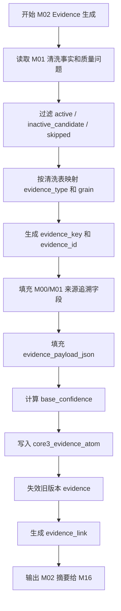

# M02 Evidence 原子层详细设计

## 1. 文档定位

本文是 CatForge 彩电核心三竞品真实数据 v2 的 M02 模块详细设计。它承接：

- `sop_requirements/M02_evidence_atom_requirements.md`
- `sop_requirements/00_real_data_baseline.md`
- `sop_detailed_design/00_architecture_data_dictionary_design.md`
- `sop_detailed_design/M00_source_batch_registry_design.md`
- `sop_detailed_design/M01_cleaning_quality_design.md`
- `cankao/CatForge_竞品生成SOP_详细指导_v1.md`
- `cankao/catforge_sop_md/modules/M02_Evidence 原子层.md`
- `cankao/CatForge_核心竞品展示页_UI设计规范_v1.md`

M02 的目标是把 M01 清洗后的事实和质量问题转换成全链路可复用的 evidence 原子，建立“任何业务结论都能追溯到真实数据和清洗事实”的证据底座。

本文写到可拆开发任务的程度，不包含代码、迁移或部署动作。

## 2. 模块职责

### 2.1 解决的问题

M02 负责解决五类工程问题：

| 问题 | M02 输出 |
| --- | --- |
| 下游需要统一引用证据 | 生成 `core3_evidence_atom.evidence_id` |
| 证据必须追溯到真实数据 | 保存 M00 原始行和 M01 清洗行引用 |
| 证据质量会影响下游置信度 | 计算 `base_confidence` 和质量标记 |
| 评论、分句、维度、质量问题之间有关联 | 生成 `core3_evidence_link` 或可重建关联键 |
| 增量变化不能破坏历史报告 | 旧 evidence 逻辑失效，新 evidence current，均保留 |

M02 只建立事实证据和质量证据，不做业务判断。

### 2.2 不解决的问题

M02 严禁做以下事情：

| 禁止事项 | 原因 | 归属模块 |
| --- | --- | --- |
| 判断参数是否为标准参数 | 需要参数本体和规则 | M03 |
| 判断卖点是否成立 | 需要卖点 seed、参数、评论验证 | M04a/M04b |
| 解释评论主题、任务、客群、战场 | 评论语义抽取独立完成 | M05/M06/M09-M11 |
| 把评论维度直接当任务或战场 | 原始维度只是弱标签 | M06/M09-M11 |
| 把质量问题当业务事实 | 质量证据只说明数据限制 | M16/M15 展示 |
| 把缺结构化卖点解释为没有卖点 | 缺失只代表数据覆盖不足 | M04a/M15 |
| 生成市场画像、SKU 画像或竞品评分 | 依赖后续画像和评分模块 | M07-M14 |
| 在高层页面展示 UUID 或原始大表 | 页面证据由 M15 转译 | M15 |

### 2.3 输入边界

M02 只消费 M01 清洗规范层和 M00 来源登记层。

| 上游表 | 用途 |
| --- | --- |
| `core3_source_row_registry` | 补充原始表、原始主键、`source_row_id`、`source_row_hash` |
| `core3_clean_sku` | 生成 SKU 覆盖事实 evidence |
| `core3_clean_market_weekly` | 生成市场量价 evidence |
| `core3_clean_attribute` | 生成参数原始事实 evidence |
| `core3_clean_claim` | 生成宣传卖点原文 evidence |
| `core3_clean_claim_sentence` | 生成宣传卖点句级 evidence |
| `core3_clean_comment` | 生成评论原文 evidence |
| `core3_clean_comment_sentence` | 生成评论句级 evidence |
| `core3_clean_comment_dimension` | 生成评论维度弱标签 evidence |
| `core3_data_quality_issue` | 生成质量问题 evidence |

M02 不直接读取原始四表做业务判断。必要的来源字段必须通过 M00/M01 已落表字段获得。

### 2.4 输出边界

M02 输出两张证据层表：

| 表 | 用途 |
| --- | --- |
| `core3_evidence_atom` | 市场、参数、卖点、评论、维度、质量问题的统一证据原子 |
| `core3_evidence_link` | 证据间关系，例如评论正文和句子、评论和维度、事实和质量问题 |

MVP 可先实现 `core3_evidence_atom`，但详细设计必须保留 `core3_evidence_link` 表位。即使首版不落 link 表，也必须在 atom 中保留 `comment_id`、`comment_text_hash`、`segment_text_hash`、`source_row_id`、`clean_record_key` 等可重建关联键。

## 3. Evidence 分层和粒度

### 3.1 事实证据

事实证据来自 M01 清洗事实表，代表“数据中确实观察到的事实”。

| `evidence_type` | 来源表 | 粒度 | 下游主要用途 |
| --- | --- | --- | --- |
| `sku_fact` | `core3_clean_sku` | SKU 覆盖粒度 | M08/M16 判断数据覆盖和缺口 |
| `market_fact` | `core3_clean_market_weekly` | SKU + 周期 + 平台 | M07 市场画像，M13 价格和渠道重合 |
| `param_raw` | `core3_clean_attribute` | SKU + 原始参数行 | M03 参数抽取，M04a 卖点激活 |
| `promo_raw` | `core3_clean_claim` | SKU + 卖点序号 | M04a 宣传卖点候选 |
| `promo_sentence` | `core3_clean_claim_sentence` | SKU + 卖点句 | M04a 句级实体和价值表达候选 |
| `comment_raw` | `core3_clean_comment` | 评论原文行 | M05 评论基础证据 |
| `comment_sentence` | `core3_clean_comment_sentence` | 评论句 | M05/M06 评论信号抽取 |
| `comment_dimension` | `core3_clean_comment_dimension` | 评论维度路径 | M05/M06 弱标签参考 |

### 3.2 质量证据

质量证据来自 `core3_data_quality_issue`，代表“数据覆盖、可用性或一致性风险”。

质量证据可以说明：

- 参数值 unknown。
- 卖点覆盖缺失。
- 评论为默认评价或低价值文本。
- 评论重复或拆行明显。
- 量价校验异常。
- 跨表品牌、型号、品类冲突。

质量证据不能说明：

- 某参数能力弱。
- 某 SKU 没有卖点。
- 用户不关注某任务。
- 某型号不是竞品。

示例：

```text
85E7Q 没有结构化卖点行
=> 生成 claim_coverage_missing 的 quality_issue evidence
=> 不生成“85E7Q 没有卖点”的 promo evidence
```

## 4. ID、版本和状态设计

### 4.1 `evidence_key` 和 `evidence_id`

M02 同时设计两个标识：

| 字段 | 作用 | 是否随清洗结果变化 |
| --- | --- | --- |
| `evidence_key` | 逻辑证据身份，同一清洗记录的同一证据字段稳定不变 | 否 |
| `evidence_id` | 证据版本记录 ID，用于下游引用和历史追溯 | 是，clean hash 变化后生成新 ID |

原因：如果只用一个稳定 ID，清洗事实变化时无法同时保留旧 evidence 和新 evidence。M02 首版采用“逻辑键稳定、记录 ID 版本化”的方式。

### 4.2 生成规则

`evidence_key`：

```text
hash(
  project_id,
  category_code,
  evidence_type,
  clean_table,
  clean_record_key,
  evidence_field,
  evidence_version
)
```

`evidence_id`：

```text
hash(
  evidence_key,
  clean_hash,
  source_row_hash,
  evidence_version
)
```

说明：

- 同一清洗事实未变化时，`evidence_id` 可重复生成。
- 清洗结果变化时，`evidence_key` 不变，`evidence_id` 变化。
- 下游报告引用 `evidence_id`，历史报告仍能指向旧证据记录。
- 下游聚合依赖可按 `evidence_key` 找到当前版本。

### 4.3 状态枚举

`evidence_status`：

| 值 | 含义 |
| --- | --- |
| `current` | 当前可被新结果引用 |
| `inactive` | 来源清洗事实失效或 full 扫描未见 |
| `superseded` | 被同一 `evidence_key` 的新版本替代 |
| `skipped` | 清洗事实不可用，未生成正式证据内容 |

`inactive_reason`：

| 值 | 含义 |
| --- | --- |
| `clean_hash_changed` | 清洗结果变化 |
| `clean_record_inactive` | 清洗记录疑似失效 |
| `quality_issue_resolved` | 质量问题已解决 |
| `source_row_not_seen` | 来源行全量扫描未见 |
| `manual_review_rejected` | 人工复核拒绝 |

### 4.4 版本字段

| 字段 | 说明 |
| --- | --- |
| `evidence_version` | evidence 生成规则版本，首版 `m02_evidence_v1` |
| `confidence_rule_version` | 置信度规则版本，首版 `m02_confidence_v1` |
| `clean_version` | M01 清洗规则版本 |
| `clean_hash` | M01 清洗结果 hash |
| `source_row_hash` | M00 原始行 hash |
| `asset_version` | 资产版本占位，MVP 可为 `default` |

## 5. 数据模型设计

### 5.1 `core3_evidence_atom`

#### 5.1.1 表用途

统一保存所有可被下游引用的事实证据和质量证据。

#### 5.1.2 字段契约

| 字段 | 类型建议 | 必填 | 说明 |
| --- | --- | --- | --- |
| `evidence_id` | `text` | 是 | 主键，版本化证据 ID |
| `evidence_key` | `text` | 是 | 逻辑证据键 |
| `project_id` | `text` | 是 | 项目 ID |
| `category_code` | `text` | 是 | MVP 为 `TV` |
| `batch_id` | `text` | 是 | M00 批次 |
| `run_id` | `text` | 否 | M16 全链路运行 ID |
| `module_run_id` | `text` | 否 | M02 模块运行 ID |
| `sku_code` | `text` | 否 | SKU |
| `model_name` | `text` | 否 | 型号展示名 |
| `brand_name` | `text` | 否 | 品牌 |
| `evidence_type` | `text` | 是 | `sku_fact`、`market_fact`、`param_raw` 等 |
| `evidence_grain` | `text` | 是 | `sku`、`row`、`field`、`sentence`、`dimension`、`quality` |
| `evidence_field` | `text` | 是 | 证据字段，如 `avg_price`、`attr_value`、`sentence_text` |
| `evidence_title` | `text` | 否 | 中文短标题，供 M15 转译参考 |
| `source_table` | `text` | 否 | 原始表 |
| `source_pk` | `text` | 否 | 原始主键 |
| `source_row_id` | `text` | 否 | 来源行 |
| `source_row_hash` | `text` | 否 | M00 行 hash |
| `clean_table` | `text` | 是 | M01 清洗表 |
| `clean_record_key` | `text` | 是 | M01 清洗记录键 |
| `clean_hash` | `text` | 是 | M01 清洗 hash |
| `clean_version` | `text` | 是 | M01 清洗规则版本 |
| `raw_field` | `text` | 否 | 原始字段名 |
| `raw_value` | `text` | 否 | 原始值，长文本可截断摘要并在 payload 中保存 |
| `clean_field` | `text` | 否 | 清洗字段名 |
| `clean_value` | `text` | 否 | 清洗值 |
| `value_presence` | `text` | 否 | `present`、`unknown_literal`、`empty` 等 |
| `numeric_value` | `numeric` | 否 | 单一数值证据 |
| `numeric_values_json` | `jsonb` | 是 | 多数值候选 |
| `unit_value` | `text` | 否 | 单位 |
| `text_value` | `text` | 否 | 文本候选 |
| `text_hash` | `text` | 否 | 文本 hash |
| `evidence_time` | `timestamptz` | 否 | 证据发生时间，如评论时间 |
| `period_raw` | `text` | 否 | 市场周期原值 |
| `period_week_index` | `integer` | 否 | 周序号 |
| `channel_type` | `text` | 否 | 渠道 |
| `platform_type` | `text` | 否 | 平台 |
| `comment_id` | `text` | 否 | 评论 ID |
| `comment_text_hash` | `text` | 否 | 评论正文 hash |
| `segment_text_hash` | `text` | 否 | 评论分段 hash |
| `sentence_seq` | `integer` | 否 | 句序号 |
| `dimension_path_raw` | `text` | 否 | 评论维度路径 |
| `quality_status` | `text` | 是 | M01 质量状态 |
| `quality_flags` | `jsonb` | 是 | M01 质量标记 |
| `base_confidence` | `numeric` | 是 | 证据可用性基础置信度 |
| `confidence_level` | `text` | 是 | `high`、`medium`、`low`、`unknown` |
| `sample_status` | `text` | 否 | `sufficient`、`limited`、`insufficient`、`unknown` |
| `evidence_payload_json` | `jsonb` | 是 | 类型专用结构化内容 |
| `evidence_status` | `text` | 是 | `current`、`inactive`、`superseded`、`skipped` |
| `inactive_reason` | `text` | 否 | 失效原因 |
| `is_current` | `boolean` | 是 | 是否当前版本 |
| `evidence_version` | `text` | 是 | evidence 规则版本 |
| `confidence_rule_version` | `text` | 是 | 置信度规则版本 |
| `asset_version` | `text` | 是 | 资产版本占位 |
| `review_required` | `boolean` | 是 | 是否需要复核 |
| `review_status` | `text` | 是 | 复核状态 |
| `created_at` | `timestamptz` | 是 | 创建时间 |
| `updated_at` | `timestamptz` | 是 | 更新时间 |

#### 5.1.3 主键、唯一键和索引

| 类型 | 字段 |
| --- | --- |
| 主键 | `evidence_id` |
| 唯一键 | `evidence_key, clean_hash, evidence_version` |
| 普通索引 | `project_id, category_code, batch_id` |
| 普通索引 | `sku_code, evidence_type` |
| 普通索引 | `source_row_id` |
| 普通索引 | `clean_table, clean_record_key` |
| 普通索引 | `evidence_key, is_current` |
| 普通索引 | `evidence_status` |
| 普通索引 | `comment_id` |
| 普通索引 | `comment_text_hash` |
| 普通索引 | `segment_text_hash` |
| GIN 索引 | `quality_flags`、`evidence_payload_json` |

#### 5.1.4 `evidence_payload_json` 结构

`market_fact`：

```json
{
  "period_raw": "26W01",
  "channel_type": "线上",
  "platform_type": "专业电商",
  "sales_volume": "1268",
  "sales_amount": "13421195.40",
  "avg_price": "10584.54",
  "price_check_status": "pass"
}
```

`param_raw`：

```json
{
  "raw_attr_name": "屏幕刷新率",
  "clean_attr_name": "屏幕刷新率",
  "raw_attr_value": "300HZ",
  "clean_attr_value": "300HZ",
  "value_presence": "present",
  "number_candidates": ["300"],
  "unit_candidates": ["HZ"]
}
```

`promo_sentence`：

```json
{
  "claim_seq": 1,
  "sentence_seq": 2,
  "sentence_text": "Mini LED 高亮画质表现",
  "sentence_role_hint": "body"
}
```

`comment_sentence`：

```json
{
  "comment_id": "123456",
  "sentence_source": "system_split",
  "sentence_seq": 1,
  "sentence_text": "画质很清晰",
  "sentiment_clean": "正面",
  "low_value_flag": false,
  "duplicate_group_key": "..."
}
```

`quality_issue`：

```json
{
  "domain": "claim",
  "issue_type": "claim_coverage_missing",
  "severity": "warning",
  "issue_detail": "该 SKU 本批次没有结构化卖点数据，不能据此判断没有卖点。",
  "suggested_downstream_action": "M04a 降级使用参数和评论验证，M15 展示数据限制。"
}
```

### 5.2 `core3_evidence_link`

#### 5.2.1 表用途

保存证据之间的弱关联和从属关系，尤其服务评论正文、评论句、评论维度、质量问题之间的追溯。

#### 5.2.2 字段契约

| 字段 | 类型建议 | 必填 | 说明 |
| --- | --- | --- | --- |
| `link_id` | `text` | 是 | 主键，建议 `m02link_<uuid>` 或稳定 hash |
| `project_id` | `text` | 是 | 项目 ID |
| `category_code` | `text` | 是 | `TV` |
| `batch_id` | `text` | 是 | 批次 |
| `from_evidence_id` | `text` | 是 | 起始 evidence |
| `to_evidence_id` | `text` | 是 | 目标 evidence |
| `from_evidence_key` | `text` | 是 | 起始逻辑键 |
| `to_evidence_key` | `text` | 是 | 目标逻辑键 |
| `link_type` | `text` | 是 | 关联类型 |
| `link_payload_json` | `jsonb` | 是 | 关联上下文 |
| `confidence` | `numeric` | 是 | 关联可信度 |
| `link_status` | `text` | 是 | `current`、`inactive` |
| `created_at` | `timestamptz` | 是 | 创建时间 |
| `updated_at` | `timestamptz` | 是 | 更新时间 |

#### 5.2.3 主键、唯一键和索引

| 类型 | 字段 |
| --- | --- |
| 主键 | `link_id` |
| 唯一键 | `from_evidence_id, to_evidence_id, link_type` |
| 普通索引 | `project_id, category_code, batch_id` |
| 普通索引 | `from_evidence_id` |
| 普通索引 | `to_evidence_id` |
| 普通索引 | `link_type` |
| GIN 索引 | `link_payload_json` |

#### 5.2.4 link 类型

| `link_type` | 说明 |
| --- | --- |
| `same_source_row` | 来自同一 `source_row_id` |
| `same_clean_record` | 来自同一 `clean_record_key` |
| `has_sentence` | 评论原文或卖点原文包含句级 evidence |
| `has_dimension` | 评论 evidence 关联原始维度弱标签 |
| `has_quality_issue` | 事实 evidence 关联质量问题 evidence |
| `same_comment` | 同一 `comment_id` 的评论行、句子或维度 |
| `same_comment_text` | 同一评论正文 hash |
| `same_segment` | 同一评论分段 hash |
| `supersedes` | 新 evidence 替代旧 evidence |

## 6. Evidence 生成规则

### 6.1 总体流程



### 6.2 清洗表到 evidence 映射

| 清洗表 | 生成 evidence | 生成粒度 |
| --- | --- | --- |
| `core3_clean_sku` | `sku_fact` | 每个 SKU 一条覆盖 evidence |
| `core3_clean_market_weekly` | `market_fact` | 每个周销来源行一条 evidence |
| `core3_clean_attribute` | `param_raw` | 每个参数来源行一条 evidence |
| `core3_clean_claim` | `promo_raw` | 每个卖点来源行一条 evidence |
| `core3_clean_claim_sentence` | `promo_sentence` | 每个卖点句一条 evidence |
| `core3_clean_comment` | `comment_raw` | 每个评论清洗行一条 evidence |
| `core3_clean_comment_sentence` | `comment_sentence` | 每个评论句一条 evidence |
| `core3_clean_comment_dimension` | `comment_dimension` | 每个评论维度行一条 evidence |
| `core3_data_quality_issue` | `quality_issue` | 每个质量问题一条 evidence |

### 6.3 跳过规则

M02 尽量为所有清洗事实生成 evidence。只有以下场景允许跳过正式 evidence：

| 场景 | 处理 |
| --- | --- |
| 清洗记录 `record_status=skipped` 且无有效事实字段 | 不生成事实 evidence，只生成质量 issue evidence |
| clean 表缺少 `clean_record_key` | 生成 M02 质量问题，模块 review |
| clean 表缺少 `source_row_id` 且不是 SKU/quality 粒度 | 生成 M02 质量问题，模块 review |
| 文本为空且已由质量 issue 表达 | 不生成文本事实 evidence |

跳过必须有中文原因，不得静默丢弃。

### 6.4 类型专用规则

#### 6.4.1 `sku_fact`

来自 `core3_clean_sku`。

证据字段：

- `coverage_json`
- `field_conflicts_json`
- `missing_signals_json`

用途：

- 说明某 SKU 有哪些数据域覆盖。
- 说明缺结构化卖点、评论不足、参数冲突等数据限制。

`sku_fact` 不表示业务能力强弱。

#### 6.4.2 `market_fact`

来自 `core3_clean_market_weekly`。

证据字段：

- `sales_volume`
- `sales_amount`
- `avg_price`
- `period_raw`
- `channel_type`
- `platform_type`
- `price_check_status`

M02 不计算趋势、价格带、份额或销量分位，这些由 M07/M13 负责。

当前样例只有线上渠道和两个平台，M02 不得生成线下相关 evidence。

#### 6.4.3 `param_raw`

来自 `core3_clean_attribute`。

证据字段：

- `raw_attr_name`
- `clean_attr_name`
- `raw_attr_value`
- `clean_attr_value`
- `value_presence`
- `value_number_candidates`
- `value_unit_candidates`

unknown 参数可以生成 evidence，用于说明“该字段在来源数据中缺失或未知”。它不是 false 证据。

#### 6.4.4 `promo_raw` 和 `promo_sentence`

来自 `core3_clean_claim` 和 `core3_clean_claim_sentence`。

证据字段：

- `claim_seq`
- `raw_claim_text`
- `clean_claim_text`
- `sentence_text`
- `sentence_role_hint`
- `title_hint`

未覆盖卖点的 SKU 不生成 promo evidence，只通过 `quality_issue` 表达结构化卖点缺失。

#### 6.4.5 `comment_raw` 和 `comment_sentence`

来自 `core3_clean_comment` 和 `core3_clean_comment_sentence`。

证据字段：

- `comment_id`
- `clean_comment_text`
- `comment_text_hash`
- `segment_text_hash`
- `sentence_text`
- `sentiment_clean`
- `low_value_flag`
- `duplicate_group_key`

低价值评论可以生成 evidence，但 `base_confidence` 必须低。M05/M06 决定是否纳入强支撑。

#### 6.4.6 `comment_dimension`

来自 `core3_clean_comment_dimension`。

证据字段：

- `primary_dim_raw`
- `secondary_dim_raw`
- `third_dim_raw`
- `dimension_path_raw`
- `dimension_quality_flag`

维度 evidence 是弱标签 evidence，默认 `base_confidence` 低于评论正文和句级 evidence。

#### 6.4.7 `quality_issue`

来自 `core3_data_quality_issue`。

证据字段：

- `domain`
- `issue_type`
- `severity`
- `issue_detail`
- `suggested_downstream_action`

质量 evidence 用于降权、复核和说明限制，不得当作业务事实。

## 7. 基础置信度设计

### 7.1 置信度含义

`base_confidence` 只代表“该 evidence 作为数据证据是否可用”，不代表业务结论正确性。

业务结论的置信度由后续模块在引用 evidence 后另行计算。

### 7.2 规则表

| 证据情况 | `base_confidence` | `confidence_level` |
| --- | ---: | --- |
| 结构化市场量价，数值解析成功且均价校验通过 | 0.95 | high |
| 结构化参数，非 unknown，字段来源明确 | 0.90 | high |
| 结构化卖点原文，来源明确 | 0.85 | high |
| 卖点句级文本，切句清晰 | 0.80 | high |
| SKU 覆盖事实，无跨表冲突 | 0.80 | high |
| 评论原文有效，非低价值，非明显重复 | 0.75 | medium |
| 评论句级文本有效，非低价值 | 0.70 | medium |
| 评论原始维度弱标签 | 0.55 | medium |
| 参数 unknown 或缺失质量 evidence | 0.35 | low |
| 默认评价、空评价、低价值评论 | 0.25 | low |
| 数值异常、跨表冲突等 error 质量 evidence | 0.20 | low |

### 7.3 调整规则

| 条件 | 调整 |
| --- | --- |
| `quality_status=warning` | 上限 0.70 |
| `quality_status=error` | 上限 0.30 |
| `value_presence != present` | 上限 0.35 |
| `low_value_flag=true` | 上限 0.25 |
| `price_check_status=mismatch` | 上限 0.70 |
| `dimension_quality_flag=missing` | 上限 0.25 |
| `record_status=inactive_candidate` | 生成 inactive evidence 或 current=false |

最终置信度必须可解释，`confidence_rule_version` 必须记录。

## 8. Evidence Link 生成规则

### 8.1 评论原文到句子

为同一 `source_row_id` 的 `comment_raw` 和 `comment_sentence` 生成：

```text
link_type = has_sentence
confidence = 1.0
```

### 8.2 评论原文到维度

为同一 `source_row_id` 的 `comment_raw` 和 `comment_dimension` 生成：

```text
link_type = has_dimension
confidence = 0.55
```

维度是弱标签，关联置信度不能高于正文 evidence。

### 8.3 同一评论 ID

同一 `sku_code + comment_id` 下的多条评论 evidence 生成：

```text
link_type = same_comment
confidence = 0.80
```

如果 `comment_id` 缺失，不生成该 link。

### 8.4 同一正文或分段

同一 `comment_text_hash` 或 `segment_text_hash` 下的评论 evidence 生成：

```text
link_type = same_comment_text / same_segment
confidence = 0.70
```

该 link 只说明重复或相同文本关系，不代表业务观点重复强度。

### 8.5 质量问题关联

如果质量问题和清洗事实可以通过 `clean_record_key`、`source_row_id` 或 `sku_code + domain` 关联，则生成：

```text
link_type = has_quality_issue
confidence = 1.0
```

示例：

- `param_raw` evidence 关联 `unknown_value` quality evidence。
- `comment_raw` evidence 关联 `low_value_comment` quality evidence。
- `sku_fact` evidence 关联 `claim_coverage_missing` quality evidence。

## 9. 增量和失效策略

### 9.1 输入变化

M02 对以下 M01 变化重算：

| M01 变化 | M02 行为 |
| --- | --- |
| 新 clean record | 生成新 evidence |
| 同 `clean_record_key` 但 `clean_hash` 变化 | 旧 evidence `superseded`，新 evidence `current` |
| clean record inactive | 旧 evidence `inactive` |
| quality issue 新增 | 生成 quality evidence |
| quality issue 解决 | 旧 quality evidence `inactive` |
| 仅质量标记变化 | 生成新 evidence 版本或更新关联质量 evidence |

### 9.2 current 维护

同一 `evidence_key` 只能有一个 `is_current=true` 的 evidence。

更新流程：

1. 生成候选 evidence。
2. 查找同一 `evidence_key` 的 current evidence。
3. 如果 `evidence_id` 相同，保持 current。
4. 如果 `evidence_id` 不同，把旧 current 标记 `superseded` 和 `is_current=false`。
5. 插入新 evidence，`is_current=true`。
6. 生成 `supersedes` link。

### 9.3 历史报告引用

旧 evidence 不物理删除。历史报告如果引用旧 `evidence_id`，仍可查看：

- 当时的 raw/clean 值。
- 当时的质量状态。
- 被哪个 evidence 替代。
- 替代原因。

M15 当前报告默认只使用 `is_current=true` 的 evidence。

## 10. 服务、任务和 API 边界

### 10.1 后端包建议

建议后续开发放在：

```text
apps/api-server/app/services/core3_real_data/evidence_atom_service.py
```

配套组件：

| 组件 | 职责 |
| --- | --- |
| `CleanFactReader` | 读取 M01 清洗事实 |
| `EvidenceMapper` | 清洗表到 evidence 类型映射 |
| `EvidenceIdService` | 生成 `evidence_key` 和 `evidence_id` |
| `EvidencePayloadBuilder` | 构造 `evidence_payload_json` |
| `EvidenceConfidenceService` | 计算基础置信度 |
| `EvidenceAtomRepository` | 写入和查询 `core3_evidence_atom` |
| `EvidenceLinkRepository` | 写入和查询 `core3_evidence_link` |
| `EvidenceInvalidationService` | 处理 superseded/inactive |
| `EvidenceAtomRunner` | 编排 M02 全流程 |

### 10.2 任务入口

```text
EvidenceAtomRunner.run(
  project_id,
  category_code,
  batch_id,
  run_id=None,
  module_run_id=None,
  evidence_version="m02_evidence_v1",
  confidence_rule_version="m02_confidence_v1",
  mode="incremental"
)
```

返回：

```json
{
  "batch_id": "m00_...",
  "module_code": "M02",
  "status": "completed_with_warning",
  "evidence_counts": {
    "market_fact": 1326,
    "param_raw": 2843,
    "promo_raw": 65,
    "promo_sentence": 220,
    "comment_raw": 62426,
    "comment_sentence": 90000,
    "comment_dimension": 62426,
    "quality_issue": 1500
  },
  "low_confidence_count": 1800,
  "review_required": true
}
```

### 10.3 API 设计

M02 API 是证据查询和排查接口，不是高层报告接口。

| 方法 | 路径 | 用途 |
| --- | --- | --- |
| `POST` | `/api/mvp/core3/v2/projects/{project_id}/batches/{batch_id}/evidence/run` | 手工触发 M02 |
| `GET` | `/api/mvp/core3/v2/projects/{project_id}/batches/{batch_id}/evidence/summary` | 查看证据生成摘要 |
| `GET` | `/api/mvp/core3/v2/projects/{project_id}/evidence/{evidence_id}` | 查看单条 evidence |
| `GET` | `/api/mvp/core3/v2/projects/{project_id}/evidence/{evidence_id}/links` | 查看证据关联 |
| `GET` | `/api/mvp/core3/v2/projects/{project_id}/skus/{sku_code}/evidence` | 按 SKU 查询 evidence |

高层页面不得展示原始 `evidence_id` UUID 或 hash。M15 应把 evidence 映射为短编号，例如：

```text
E-价格-001
E-参数-004
E-评论-012
```

### 10.4 查询视图建议

首版可提供只读视图，供下游模块方便消费 current evidence：

```text
core3_current_evidence_atom
```

视图条件：

```text
where is_current = true
  and evidence_status = 'current'
```

视图不替代表设计，也不允许下游忽略 evidence 状态直接读历史记录。

## 11. 质量和复核规则

### 11.1 warning 条件

| 条件 | 输出 |
| --- | --- |
| 某类清洗事实没有生成 evidence | M02 warning |
| evidence 低置信占比高 | M16 复核建议 |
| 某 SKU 关键域 evidence 缺失 | SKU 级复核 |
| 评论 evidence 重复组异常集中 | 评论证据质量 warning |
| quality issue evidence 数量异常升高 | 批次 warning |

### 11.2 review_required 条件

| 条件 | 判断 |
| --- | --- |
| evidence 无法回溯到 `source_row_id` | 非 SKU/quality 粒度必须复核 |
| 同一 `evidence_key` 多条 current evidence | 必须复核 |
| 同一 clean fact 生成重复 current evidence | 必须复核 |
| 旧 evidence 被失效但没有新 current evidence | 需要复核 |
| 85E7Q 缺 promo evidence | 不阻断，但必须有质量 evidence 解释缺口 |

### 11.3 blocked 条件

| 条件 | 处理 |
| --- | --- |
| M01 清洗表不可读 | M02 失败 |
| `core3_evidence_atom` 写入失败 | M02 失败 |
| evidence ID 生成规则缺失 | M02 失败 |
| 同一 `evidence_key` current 唯一性被破坏 | M02 失败或阻断下游 |

## 12. 真实数据样例处理预期

### 12.1 当前 full 样例预期

以当前样例数据为首次 full：

| 数据域 | 预期 |
| --- | --- |
| 市场 | 1326 条 `market_fact` |
| 参数 | 2843 条 `param_raw`，其中 unknown/空值/`-` 降低置信度 |
| 卖点 | 65 条 `promo_raw`，以及对应 `promo_sentence` |
| 评论 | 62426 条 `comment_raw`，以及系统切句和 source segment evidence |
| 评论维度 | 62426 条左右 `comment_dimension`，空维度低置信或质量标记 |
| 质量问题 | 参数缺失、卖点覆盖缺失、评论重复、维度缺失等 |

### 12.2 85E7Q 预期

`TV00029115 / 85E7Q`：

| 数据域 | M02 预期 |
| --- | --- |
| 周销 | 约 46 条 `market_fact` |
| 参数 | 约 81 条 `param_raw` |
| 结构化卖点 | 0 条 `promo_raw` 和 `promo_sentence` |
| 评论 | 约 3621 条 `comment_raw`，并生成评论句 evidence |
| 卖点缺失 | 生成 `claim_coverage_missing` 的 `quality_issue` evidence |

M02 不得为 85E7Q 伪造宣传卖点 evidence。

### 12.3 评论拆行和重复

当前评论数据：

- 62426 行。
- 34438 个不同 `comment_id`。
- 13514 个正文 hash。
- 20916 个不同 `comments_segments`。

M02 必须保留：

- `comment_id`
- `comment_text_hash`
- `segment_text_hash`
- `same_comment` link
- `same_comment_text` link
- `same_segment` link

去重和代表评论选择由 M05 负责。

## 13. 与前后模块接口

### 13.1 从 M01 接收

M02 必须接收：

- `clean_table`
- `clean_record_key`
- `clean_hash`
- `source_row_id`
- `source_row_hash`
- raw 字段
- clean 字段
- `quality_status`
- `quality_flags`
- `record_status`

### 13.2 给 M03

M03 只从 `param_raw` evidence 抽取标准参数。

M03 必须区分：

- `value_presence=present`：可抽取参数。
- `value_presence!=present`：表示 unknown 或缺失，不是 false。

### 13.3 给 M04a/M04b

M04a 消费：

- `promo_raw`
- `promo_sentence`
- `param_raw`
- `quality_issue` 中的卖点覆盖缺失。

M04b 不直接消费 M02 的评论维度生成验证结论，必须等待 M05/M06 后的评论信号。

### 13.4 给 M05/M06

M05 消费：

- `comment_raw`
- `comment_sentence`
- `comment_dimension`
- 关联 link。

M06 在 M05 代表评论和句级 evidence 基础上抽取任务、客群、战场、卖点验证、痛点等下游信号。

### 13.5 给 M07/M08

M07 消费 `market_fact` evidence 做市场画像。

M08 汇总 SKU 画像时必须保存 evidence 引用和质量风险，不得只保存画像结论。

### 13.6 给 M12-M15

M12-M14 的候选、评分和选择结论必须包含 `evidence_ids`。

M15 负责把 evidence 转成业务可读证据卡和短编号。M15 页面可以展示原始参数、宣传句、评论片段、量价指标，但不展示 M00-M16 技术链路和 UUID。

### 13.7 给 M16

M16 使用：

- evidence 生成数量。
- current evidence 唯一性。
- 低置信 evidence 占比。
- 质量 issue evidence。
- evidence 失效和替代关系。

M16 决定是否继续下游、复核、降级或阻断。

## 14. 测试设计

### 14.1 单元测试

| 测试 | 断言 |
| --- | --- |
| `evidence_key` 稳定 | 同一 clean record 同一字段重复生成一致 |
| `evidence_id` 版本化 | clean hash 变化后 evidence ID 变化 |
| market evidence payload | 销量、销额、均价、周期、平台齐全 |
| param unknown evidence | unknown 生成低置信 evidence，不当 false |
| promo 缺失 | 无清洗卖点时不生成 promo evidence |
| comment low value | 低价值评论 evidence 置信度低 |
| dimension weak label | 评论维度 evidence 置信度低于评论正文 |
| quality evidence | 质量问题生成 quality_issue evidence |
| confidence 上限 | warning/error/unknown 正确降权 |

### 14.2 Repository 测试

| 测试 | 断言 |
| --- | --- |
| current 唯一 | 同一 `evidence_key` 只有一条 current |
| 历史保留 | superseded evidence 不删除 |
| link 唯一 | 同一 from/to/type 不重复 |
| 索引查询 | 按 SKU、类型、source_row_id、comment_id 可查 |
| JSON payload | PostgreSQL JSONB 查询可用 |

### 14.3 增量测试

| 场景 | 断言 |
| --- | --- |
| 新 clean record | 生成 current evidence |
| clean hash 不变 | 不重复生成新 evidence |
| clean hash 变化 | 旧 evidence superseded，新 evidence current |
| clean record inactive | evidence inactive |
| quality issue resolved | quality evidence inactive |
| comment sentence 新增 | comment_raw 与新 sentence link 正确 |

### 14.4 真实样例 fixture 测试

| 输入 | 断言 |
| --- | --- |
| 85E7Q 46 行周销 | 生成 46 条左右 market evidence |
| 85E7Q 81 行属性 | 生成 param evidence，unknown 降权 |
| 85E7Q 0 行卖点 | 0 条 promo evidence，存在 claim_coverage_missing quality evidence |
| 85E7Q 评论 | 生成 comment_raw/comment_sentence/comment_dimension evidence |
| 空情感 | sentiment unknown，不当中立 |
| 空维度 | 维度缺失低置信，不生成业务标签 |

### 14.5 禁止越界测试

必须断言：

- M02 不生成 `param_code`。
- M02 不生成 `claim_code`。
- M02 不生成 `task_code`。
- M02 不生成 `target_group_code`。
- M02 不生成 `battlefield_code`。
- M02 不生成竞品候选、评分和三槽位。
- M02 不把质量 evidence 当业务事实。
- M02 不把评论维度转成任务或战场。

测试不依赖外部 LLM 调用。

## 15. 验收标准

| 验收项 | 标准 |
| --- | --- |
| evidence 表可落地 | `core3_evidence_atom` 和 `core3_evidence_link` 字段、键、索引明确 |
| 清洗事实有 evidence | 有对应 evidence 或明确跳过原因 |
| 可追溯 | evidence 可追溯到 M01 清洗行和 M00 来源行 |
| ID 稳定且可版本化 | `evidence_key` 稳定，`evidence_id` 可表达版本 |
| unknown 不误判 | unknown evidence 与 false 证据严格区分 |
| 质量证据不越界 | 质量 issue 只表达数据限制 |
| 评论关系可追溯 | comment、sentence、dimension、duplicate link 可用 |
| 历史可追溯 | 旧 evidence 逻辑失效，不物理删除 |
| 下游强制引用 | 后续结论必须保存 `evidence_ids` |
| 85E7Q 约束满足 | 不生成伪造卖点 evidence，有卖点缺失质量 evidence |
| 当前样例可跑通 | 市场、参数、卖点、评论、维度、质量 evidence 都可生成 |
| M02 不越界 | 不做参数、卖点、任务、战场或竞品判断 |

## 16. 待评审问题

| 问题 | 建议 |
| --- | --- |
| MVP 是否立即落 `core3_evidence_link` | 建议首版落表；若赶进度，atom 必须保留可重建 link 的字段 |
| `raw_value` 长文本是否完整保存 | 建议保存完整文本到 `evidence_payload_json`，列表页摘要截断 |
| `evidence_id` 是否暴露给前端 | 高层页不展示 UUID；M15 映射短编号 |
| quality evidence 是否进入证据矩阵 | 可以进入“证据不足/数据限制”区域，不能作为业务强证据 |
| comment_dimension 置信度是否固定 0.55 | 首版固定，后续 M05/M06 可按样本和一致性调整 |

## 17. 下一步

下一个详细设计文档应生成：

```text
M03_param_extraction_design.md
```

M03 需要基于 `param_raw` evidence 和 M01 参数清洗事实，设计参数字段画像、标准参数本体、参数值抽取、unknown/false 区分、单位规范化、参数证据置信度和下游可消费的 SKU 参数画像。
