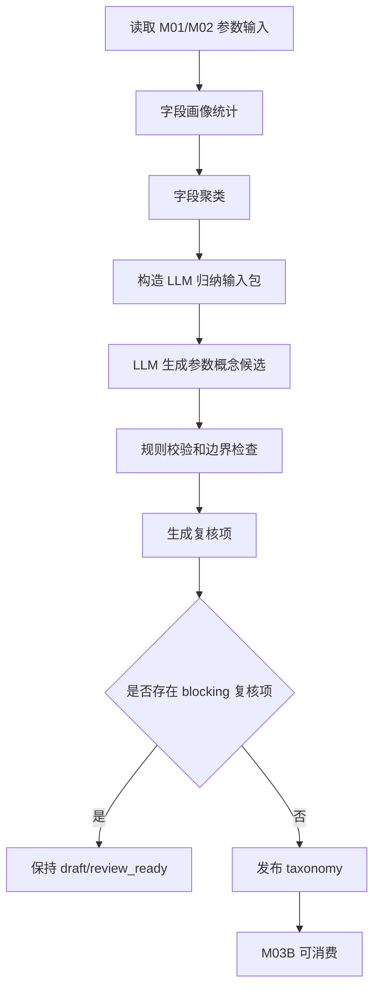

# M03A 品类参数语义资产生成详细设计

## 1. 文档定位

本文是 M03A 的工程详细设计，承接：

- `sop_requirements/M03A_param_taxonomy_semantic_asset_requirements.md`
- `sop_requirements/M03_param_extraction_requirements.md`
- `sop_detailed_design/M03_param_extraction_design.md`
- `sop_detailed_design/M02_evidence_atom_design.md`
- `sop_detailed_design/M08_sku_signal_profile_design.md`

M03 被拆成两个生命周期不同的能力：

| 模块 | 生命周期 | 目标 |
| --- | --- | --- |
| M03A | 品类资产低频生成 | 从该品类原始字段生成参数 taxonomy |
| M03B | 新数据批次高频执行 | 使用已发布 taxonomy 生成 SKU 参数事实画像 |

本文只设计 M03A。M03B 延续现有 M03 参数抽取能力，但输入要从静态 seed 改为已发布 taxonomy。

## 2. 设计目标

M03A 要把某个品类的原始参数字段，转成可复用的品类参数语义资产：

```text
原始参数字段
  -> 字段画像
  -> 字段聚类
  -> LLM 参数概念归纳
  -> 规则校验
  -> 人工复核
  -> taxonomy 发布
```

M03A 输出的 taxonomy 必须回答：

1. 当前品类有哪些原始参数字段。
2. 哪些字段可以合并为同一个标准参数。
3. 每个标准参数的字段来源、单位、解析规则是什么。
4. 每个标准参数表达什么产品能力。
5. 哪些字段或参数存在风险，需要复核。

M03A 不回答：

- 这个参数支撑哪个具体卖点。
- 这个参数属于哪个用户任务。
- 这个参数面向哪个目标客群。
- 这个参数落在哪个价值战场。

这些是 M04、M09、M10、M11 的职责。

## 3. 现状约束

本轮只读观察 205 `catforge_dev.attribute_data`：

| 范围 | 观察结果 |
| --- | --- |
| 全表原始属性字段 | 118 个 distinct `attr_name` |
| 彩电 | 377 个 SKU，最多 90 个属性字段 |
| 空调 | 155 个 SKU，最多 31 个属性字段 |

该观察说明：

1. 电视、空调的字段集合明显不同。
2. 程序不能内置电视标准参数作为默认。
3. M03A 必须按 `category_code` 独立生成 taxonomy。

## 4. 模块边界

### 4.1 输入边界

M03A 读取：

| 输入 | 来源 | 必需 | 用途 |
| --- | --- | --- | --- |
| `param_raw` evidence | M02 | 是 | 原始参数字段和值 |
| 人工复核决策 | M16 或 M03A review API | 否 | 发布前修正 |

当前实现只直接读取 M02 `param_raw` evidence。M01 清洗结果通过 M02 evidence 的 `clean_field`、`clean_value`、`value_presence`、`quality_flags` 等字段间接进入 M03A。旧参数 seed、原始卖点文本、评论正文、市场量价、M04-M16 结果都不作为本版 M03A 输入。

### 4.2 输出边界

M03A 写入：

- taxonomy 版本表
- 原始字段清单表
- 字段聚类表
- 参数概念候选表
- 标准参数定义表
- 字段映射规则表
- taxonomy 复核项表

M03A 不写入 SKU 参数画像，不写入卖点激活，不写入任务、客群、战场。

## 5. 数据模型设计

### 5.1 `core3_param_taxonomy_version`

记录一个品类 taxonomy 版本。

| 字段 | 类型建议 | 必填 | 说明 |
| --- | --- | --- | --- |
| `taxonomy_version_id` | text | 是 | 主键 |
| `taxonomy_version` | text | 是 | 如 `TV_PARAM_TAXONOMY_v20260620` |
| `project_id` | text | 是 | 项目 |
| `category_code` | text | 是 | 品类 |
| `status` | text | 是 | `draft`、`review_ready`、`published`、`superseded`、`rejected` |
| `source_batch_ids` | jsonb | 是 | 参与生成的批次 |
| `source_field_count` | integer | 是 | 原始字段数 |
| `active_param_count` | integer | 是 | 发布后的 active 参数数 |
| `llm_model_snapshot` | text | 否 | LLM 模型或配置快照 |
| `llm_prompt_version` | text | 否 | prompt 版本 |
| `rule_version` | text | 是 | 规则版本 |
| `taxonomy_hash` | text | 是 | 发布内容 hash |
| `published_at` | timestamptz | 否 | 发布时间 |
| `created_by` | text | 是 | 触发人或系统 |
| `created_at` | timestamptz | 是 | 创建时间 |
| `updated_at` | timestamptz | 是 | 更新时间 |

约束：

- 唯一键：`project_id, category_code, taxonomy_version`
- 同一 `project_id + category_code` 只能有一个 `published` 且未 superseded 的当前版本。

### 5.2 `core3_param_raw_field_inventory`

记录品类原始字段原貌。

| 字段 | 类型建议 | 必填 | 说明 |
| --- | --- | --- | --- |
| `raw_field_id` | text | 是 | 主键 |
| `taxonomy_version` | text | 是 | taxonomy 版本 |
| `project_id` | text | 是 | 项目 |
| `category_code` | text | 是 | 品类 |
| `raw_param_name` | text | 是 | 原始字段名 |
| `clean_param_name` | text | 是 | 清洗字段名 |
| `normalized_param_name` | text | 是 | 规范化字段名 |
| `occurrence_count` | integer | 是 | 出现次数 |
| `sku_coverage_count` | integer | 是 | 覆盖 SKU 数 |
| `sku_coverage_rate` | numeric | 是 | SKU 覆盖率 |
| `unknown_count` | integer | 是 | unknown/空/`-` 数量 |
| `unknown_rate` | numeric | 是 | unknown 比例 |
| `top_values_json` | jsonb | 是 | 高频值 |
| `sample_values_json` | jsonb | 是 | 代表样例值 |
| `value_pattern_json` | jsonb | 是 | 值形态统计 |
| `unit_candidates_json` | jsonb | 是 | 单位候选 |
| `cooccurrence_field_names` | jsonb | 是 | 高频共现字段 |
| `field_status` | text | 是 | `usable`、`metadata`、`weak_signal`、`ignore`、`review_required` |
| `field_hash` | text | 是 | 字段画像 hash |

`value_pattern_json` 示例：

```json
{
  "numeric_like_rate": 0.98,
  "boolean_like_rate": 0.00,
  "enum_like_rate": 0.10,
  "text_like_rate": 0.02,
  "has_unit": true,
  "units": ["HZ"],
  "zero_value_rate": 0.00,
  "dash_rate": 0.01
}
```

### 5.3 `core3_param_field_cluster`

记录字段聚类结果。

| 字段 | 类型建议 | 必填 | 说明 |
| --- | --- | --- | --- |
| `field_cluster_id` | text | 是 | 主键 |
| `taxonomy_version` | text | 是 | taxonomy 版本 |
| `cluster_code` | text | 是 | 稳定簇编码 |
| `cluster_name_candidate` | text | 否 | 候选簇名 |
| `member_raw_fields` | jsonb | 是 | 字段列表 |
| `cluster_method` | text | 是 | `name_similarity`、`value_pattern`、`cooccurrence`、`llm_semantic`、`manual` |
| `cluster_confidence` | numeric | 是 | 聚类置信度 |
| `cluster_reason_json` | jsonb | 是 | 聚类理由 |
| `review_status` | text | 是 | 复核状态 |

聚类只说明“字段可能表达同一事实”，不是最终标准参数。

### 5.4 `core3_param_concept_candidate`

记录 LLM 和规则共同生成的参数概念候选。

| 字段 | 类型建议 | 必填 | 说明 |
| --- | --- | --- | --- |
| `concept_candidate_id` | text | 是 | 主键 |
| `taxonomy_version` | text | 是 | taxonomy 版本 |
| `candidate_code` | text | 是 | 候选参数编码 |
| `candidate_name` | text | 是 | 中文候选名 |
| `source_cluster_ids` | jsonb | 是 | 来源字段簇 |
| `source_raw_fields` | jsonb | 是 | 来源原始字段 |
| `definition_candidate` | text | 是 | 候选定义 |
| `data_type_candidate` | text | 是 | 数据类型候选 |
| `unit_candidate` | text | 否 | 单位候选 |
| `parser_candidate` | text | 否 | 解析器候选 |
| `capability_tags` | jsonb | 是 | 能力标签候选 |
| `benefit_hints` | jsonb | 是 | 收益提示 |
| `scenario_hints` | jsonb | 是 | 场景提示 |
| `comparison_axis` | text | 是 | 比较轴 |
| `evidence_role` | text | 是 | 证据角色 |
| `risk_notes` | jsonb | 是 | 风险说明 |
| `llm_confidence` | numeric | 是 | LLM 置信度 |
| `rule_confidence` | numeric | 是 | 规则校验置信度 |
| `review_required` | boolean | 是 | 是否复核 |
| `review_status` | text | 是 | 复核状态 |

### 5.5 `core3_param_definition`

记录发布后的标准参数定义。

| 字段 | 类型建议 | 必填 | 说明 |
| --- | --- | --- | --- |
| `param_definition_id` | text | 是 | 主键 |
| `taxonomy_version` | text | 是 | taxonomy 版本 |
| `param_code` | text | 是 | 标准参数编码 |
| `param_name` | text | 是 | 中文名 |
| `definition` | text | 是 | 参数定义 |
| `param_group` | text | 是 | 从字段归纳生成的参数组 |
| `data_type` | text | 是 | `number`、`enum`、`boolean`、`list`、`string`、`range`、`object` |
| `unit` | text | 否 | 标准单位 |
| `value_parser` | text | 是 | 解析器 |
| `parser_config_json` | jsonb | 是 | 解析配置 |
| `source_raw_fields` | jsonb | 是 | 支撑字段 |
| `capability_tags` | jsonb | 是 | 参数语义能力标签 |
| `benefit_hints` | jsonb | 是 | 收益提示 |
| `scenario_hints` | jsonb | 是 | 场景提示 |
| `comparison_axis` | text | 是 | 比较方式 |
| `evidence_role` | text | 是 | `strong_param_evidence`、`supporting_param_evidence`、`weak_signal`、`metadata_only` |
| `analysis_status` | text | 是 | `active`、`unsupported_in_current_data`、`deprecated`、`review_required` |
| `review_status` | text | 是 | 复核状态 |
| `definition_hash` | text | 是 | 定义 hash |

重要约束：

- `capability_tags` 不能包含 `claim_code`、`task_code`、`target_group_code`、`battlefield_code`。
- `analysis_status=active` 的参数必须至少有一个 `source_raw_fields`，除非人工明确标记为 `manual_reference`。

### 5.6 `core3_param_field_mapping_rule`

记录原始字段如何进入标准参数。

| 字段 | 类型建议 | 必填 | 说明 |
| --- | --- | --- | --- |
| `mapping_rule_id` | text | 是 | 主键 |
| `taxonomy_version` | text | 是 | taxonomy 版本 |
| `raw_param_name` | text | 是 | 原始字段 |
| `param_code` | text | 否 | 目标标准参数 |
| `mapping_type` | text | 是 | `direct`、`alias`、`derived_helper`、`metadata`、`weak_signal`、`ignore`、`review_required` |
| `value_policy` | text | 是 | `use_as_value`、`use_as_helper`、`do_not_extract`、`requires_rule` |
| `parser_type` | text | 否 | 解析器 |
| `parser_config_json` | jsonb | 是 | 解析配置 |
| `invalid_value_policy_json` | jsonb | 是 | 0、空值、`-`、异常值处理 |
| `source_priority` | integer | 是 | 多字段冲突时优先级 |
| `confidence` | numeric | 是 | 映射置信度 |
| `review_status` | text | 是 | 复核状态 |

示例：

```json
{
  "raw_param_name": "屏幕尺寸",
  "param_code": "screen_size_inch",
  "mapping_type": "alias",
  "value_policy": "use_as_value",
  "invalid_value_policy_json": {
    "zero": "treat_as_invalid_when_size_field_present",
    "dash": "unknown",
    "empty": "unknown"
  }
}
```

### 5.7 `core3_param_taxonomy_review_item`

记录发布前必须复核的问题。

| 字段 | 类型建议 | 必填 | 说明 |
| --- | --- | --- | --- |
| `review_item_id` | text | 是 | 主键 |
| `taxonomy_version` | text | 是 | taxonomy 版本 |
| `item_type` | text | 是 | `unmapped_high_coverage_field`、`low_confidence_llm`、`ambiguous_mapping`、`unsupported_old_param`、`invalid_value_policy` |
| `severity` | text | 是 | `info`、`warning`、`blocking` |
| `raw_param_name` | text | 否 | 相关字段 |
| `param_code` | text | 否 | 相关参数 |
| `issue_summary_cn` | text | 是 | 中文说明 |
| `evidence_json` | jsonb | 是 | 覆盖率、样例值、LLM 理由 |
| `suggested_action` | text | 是 | 建议动作 |
| `review_decision_json` | jsonb | 是 | 人工决策 |
| `review_status` | text | 是 | 复核状态 |

## 6. 处理流程设计



### 6.1 读取输入

读取条件：

- 只读取目标 `project_id + category_code`。
- 可以指定一个或多个 `batch_id` 作为 taxonomy 生成样本。
- 只消费 `current` 状态的 M02 `param_raw` evidence。
- M01/M02 未完成时阻断。

### 6.2 字段画像统计

规则统计输出：

- 字段覆盖率。
- unknown 率。
- 样例值。
- 数值、枚举、布尔、文本、区间、混合类型概率。
- 单位候选。
- 零值比例。
- 与其他字段共现关系。

字段画像是 LLM 输入的事实边界，LLM 不能修改这些统计。

### 6.3 字段聚类

聚类信号：

1. 字段名相似。
2. 值类型相似。
3. 单位相似。
4. 覆盖 SKU 高度重合。
5. 字段值存在上下位关系，例如 `尺寸` 与 `尺寸段`。

聚类输出是候选，不自动发布。

### 6.4 LLM 归纳输入包

给 LLM 的输入必须是结构化 JSON，不直接塞完整原始表。

```json
{
  "category_code": "TV",
  "field_inventory": [
    {
      "raw_param_name": "屏幕刷新率",
      "coverage_rate": 1.0,
      "unknown_rate": 0.0,
      "top_values": ["144HZ", "120HZ", "60HZ"],
      "value_pattern": {"numeric_like_rate": 1.0, "units": ["HZ"]}
    }
  ],
  "field_clusters": [
    {
      "cluster_code": "cluster_refresh_rate",
      "member_fields": ["屏幕刷新率", "面板刷新率"]
    }
  ],
  "old_param_reference": [
    {
      "param_code": "refresh_rate_hz",
      "param_name": "刷新率"
    }
  ],
  "output_rules": {
    "no_claim_task_target_battlefield_codes": true,
    "must_include_source_fields": true,
    "must_mark_review_required_when_uncertain": true
  }
}
```

### 6.5 LLM 输出契约

LLM 必须输出 JSON：

```json
{
  "param_candidates": [
    {
      "candidate_code": "refresh_rate_hz",
      "candidate_name": "刷新率",
      "source_raw_fields": ["屏幕刷新率", "面板刷新率"],
      "definition": "电视屏幕或系统标称刷新能力",
      "data_type": "number",
      "unit": "Hz",
      "parser": "extract_number_with_unit",
      "capability_tags": ["motion_smoothness", "fast_motion_display"],
      "benefit_hints": ["运动画面更流畅", "拖影更少"],
      "scenario_hints": ["游戏", "体育观看", "动作片"],
      "comparison_axis": "higher_is_generally_better_with_scope_check",
      "evidence_role": "strong_param_evidence",
      "risk_notes": ["需区分面板刷新率、系统刷新率、倍频宣传"],
      "llm_confidence": 0.92,
      "review_required": false
    }
  ],
  "field_decisions": [
    {
      "raw_param_name": "尺寸段",
      "mapping_type": "derived_helper",
      "target_candidate_code": "screen_size_inch",
      "reason_cn": "该字段是尺寸的粗分档，不能覆盖精确尺寸"
    }
  ],
  "review_items": [
    {
      "item_type": "ambiguous_mapping",
      "severity": "warning",
      "raw_param_name": "响应时间",
      "issue_summary_cn": "字段可能表示面板响应时间，不应直接等同游戏输入延迟"
    }
  ]
}
```

### 6.6 规则校验

规则校验必须检查：

- 所有候选参数都有来源字段。
- active 参数有解析器。
- 能力标签不含下游业务代码。
- 弱信号字段不能生成强参数证据。
- 空、`-`、unknown 不能转 false。
- `0` 值必须有字段级解释。
- 一个字段映射多个参数时必须有拆分规则。
- 旧参数无当前字段支撑时标记 `unsupported_in_current_data`。

### 6.7 人工复核和发布

发布条件：

- 无 `blocking` review item。
- 高频字段已有处理状态。
- 所有 `active` 参数通过规则校验。
- taxonomy hash 已生成。

发布动作：

1. 将 taxonomy status 从 `draft` 或 `review_ready` 改为 `published`。
2. 将同品类旧 published 版本标记为 `superseded`。
3. 固化 `taxonomy_hash`。
4. 下游 M03B 使用该版本。

发布后不可修改；任何调整必须生成新版本。

## 7. 增量和重跑策略

M03A 低频运行，触发条件：

| 触发 | 动作 |
| --- | --- |
| 新品类首次导入 | 生成首版 taxonomy draft |
| 原始字段新增或缺失比例超过阈值 | 生成 taxonomy drift report |
| 高频字段值形态变化 | 生成复核项 |
| 人工要求重做品类参数体系 | 新建 taxonomy draft |
| 下游发现参数映射错误 | 针对字段或参数生成复核项，新版 taxonomy 修正 |

M03B 高频运行，输入变化只重算 SKU 参数画像，不自动修改 taxonomy。

## 8. 服务设计

### 8.1 Service

| 服务 | 职责 |
| --- | --- |
| `ParamTaxonomyEvidenceReader` | 分页读取 M02 `param_raw` evidence，不受 TV 枚举限制 |
| `ParamTaxonomyService` | 生成字段画像、字段聚类、LLM 输入包、候选参数、映射规则和复核项 |
| `DeepSeekOpenAIParamTaxonomyClient` | 通过 OpenAI-compatible `/chat/completions` 调用 DeepSeek |
| `ParamTaxonomyRepository` | 保存、读取、复核、发布 taxonomy |

### 8.2 Repository

| Repository | 表 |
| --- | --- |
| `ParamTaxonomyRepository` | version、raw field inventory、field cluster、concept candidate、definition、mapping、review |
| `ParamTaxonomyEvidenceReader` | M02 `core3_evidence_atom` |

### 8.3 Runner

当前已实现 Service/API 闭环：

- `build_draft`
- `publish`

`validate`、`detect_drift`、M03B published taxonomy loader 属于后续实现。

### 8.4 LLM 配置

LLM 配置只通过环境变量注入，不在代码、文档或测试中写入密钥。

| 环境变量 | 当前用途 |
| --- | --- |
| `CATFORGE_LLM_BASE_URL` | OpenAI-compatible base URL，例如 `https://api.deepseek.com` |
| `CATFORGE_LLM_ANTHROPIC_BASE_URL` | Anthropic-compatible base URL 预留，例如 `https://api.deepseek.com/anthropic` |
| `CATFORGE_LLM_API_KEY` | API key，必须在部署环境设置 |
| `CATFORGE_LLM_MODEL` | 默认 `deepseek-v4-pro` |
| `CATFORGE_LLM_TIMEOUT_SECONDS` | 默认 60 秒 |

当前 M03A 使用 OpenAI-compatible endpoint：`{CATFORGE_LLM_BASE_URL}/chat/completions`。

## 9. API 和 CLI

### 9.1 API

| 方法 | 路径 | 用途 |
| --- | --- | --- |
| `POST` | `/projects/{project_id}/categories/{category_code}/param-taxonomies/draft` | 生成 taxonomy draft |
| `GET` | `/projects/{project_id}/categories/{category_code}/param-taxonomies/{version}` | 查看 taxonomy |
| `GET` | `/projects/{project_id}/categories/{category_code}/param-taxonomies/{version}/review-items` | 查看复核项 |
| `POST` | `/projects/{project_id}/categories/{category_code}/param-taxonomies/{version}/review-decisions` | 写入复核决策 |
| `POST` | `/projects/{project_id}/categories/{category_code}/param-taxonomies/{version}/publish` | 发布 taxonomy |
| `GET` | `/projects/{project_id}/categories/{category_code}/param-taxonomies/current` | 获取当前 published taxonomy |

API 是生产线运营和复核接口，不是高层报告接口。

### 9.2 CLI

CLI 尚未实现。后续可以包装为：

```bash
catforge-core3 m03a build-taxonomy \
  --project-id core3_real_data \
  --category-code TV \
  --batch-id m00_xxx
```

当前自然语言 agent 应优先调用 API 或直接调用 `ParamTaxonomyService`。

## 10. M03B 消费约束

M03B 必须显式传入：

```text
category_code
taxonomy_version
```

如果目标品类没有 `published` taxonomy：

```text
M03B blocked: category taxonomy is not published.
```

M03B 输出 SKU 参数画像时必须记录：

- `taxonomy_version`
- `taxonomy_hash`
- `param_definition_hash`
- `mapping_rule_hash`

M03B 不能在运行中自动新增标准参数或修改映射规则。

## 11. 质量和复核规则

### 11.1 warning 条件

- 低覆盖字段被 LLM 建议为 active 参数。
- 字段值多数为 `0`，但被建议直接抽取。
- 字段只有营销词，没有明确规格值。
- 字段与旧参数 seed 存在命名相似但语义不一致。

### 11.2 blocking 条件

- 高频字段未处理。
- active 参数没有来源字段。
- active 参数没有解析规则。
- LLM 输出包含下游业务代码。
- taxonomy 校验 hash 不稳定。
- 一个字段映射多个参数但无拆分规则。

### 11.3 review_required 条件

- LLM 置信度低于阈值。
- 规则置信度低于阈值。
- 原始字段含义不清。
- 样例值存在多个互斥含义。
- 旧标准参数需要停用或拆分。

## 12. 测试设计

测试不能依赖外部 LLM 实时调用。LLM 相关测试使用 fixture 或 mock。

| 测试 | 目标 |
| --- | --- |
| `test_m03a_builds_field_inventory` | 能从 M02 param evidence 生成字段画像 |
| `test_m03a_param_taxonomy_models` | 7 张 M03A 表、迁移链和表边界 |
| `test_param_taxonomy_service_builds_draft_from_m02_param_evidence` | mock LLM 下能从 M02 evidence 生成 taxonomy draft |
| `test_m03a_rejects_downstream_codes` | 拒绝 claim/task/target/battlefield code |
| `test_m03a_unknown_not_false` | unknown、空、`-` 不转 false |
| `test_m03a_blocks_publish_with_high_coverage_unmapped` | 高频未解释字段阻断发布 |
| `test_m03a_publishes_immutable_taxonomy` | 发布后不可修改 |
| `test_m03b_requires_published_taxonomy` | 无 taxonomy 时 M03B 阻断 |

## 13. 样例：TCL 75J7K-JN

本轮只读样例：

```text
model_code: TV00027055
brand: TCL
model: 75J7K-JN
attribute_count: 90
```

部分字段可归纳为：

| 标准参数候选 | 来源字段 | 能力标签 | 处理说明 |
| --- | --- | --- | --- |
| `screen_size_inch` | `尺寸`、`尺寸段`、`屏幕尺寸` | `display_scale`、`viewing_immersion` | `尺寸=75` 为主，`尺寸段` 辅助，`屏幕尺寸=0` 异常 |
| `resolution_class` | `分辨率`、`清晰度`、`清晰度2` | `visual_clarity` | 4K/UHD |
| `refresh_rate_hz` | `屏幕刷新率`、`面板刷新率` | `motion_smoothness` | 144Hz，需区分面板/系统刷新 |
| `hdmi_capability` | `HDMI参数`、`HDMI数量` | `external_device_connectivity`、`game_input_readiness` | HDMI2.1 + 数量 |
| `display_technology_stack` | `产品技术`、`背光源`、`背光源细分`、`量子点` | `display_technology`、`color_expression` | LCD/LED/QLED/QD |
| `mini_led_flag` | `MINILED`、`MINILED2`、`分区背光` | `backlight_control` | 当前样例为非 MiniLED |
| `voice_ai_control` | `人工智能`、`语音技术`、`语音识别`、`远场语音` | `smart_interaction` | 智能交互能力 |

这些不是完整电视 taxonomy，只是 M03A 详细设计中的单 SKU 验证样例。

## 14. 验收标准

M03A 完成后必须满足：

1. 任意品类均可从原始字段生成 taxonomy draft。
2. 电视 taxonomy 不会被空调等其他品类复用。
3. taxonomy active 参数来自真实字段或人工依据。
4. 参数定义包含能力标签，但不包含卖点、任务、客群、战场代码。
5. 高频未解释字段会阻断发布。
6. LLM 输出可追溯、可校验、可复核。
7. 已发布 taxonomy 不可变。
8. M03B 只能消费已发布 taxonomy。

## 15. 开发拆分建议

| 闭环 | 内容 | 验收 |
| --- | --- | --- |
| M03A-1 | migration、model、schema | 表结构测试通过 |
| M03A-2 | 字段画像 builder | fixture 生成字段画像 |
| M03A-3 | 字段聚类 | 相似字段聚类测试 |
| M03A-4 | LLM 输入输出契约 | mock LLM 测试 |
| M03A-5 | taxonomy validator | 越界和发布阻断测试 |
| M03A-6 | review API/CLI | 可导出和导入复核决策 |
| M03A-7 | publish loader | M03B 可加载 published taxonomy |
