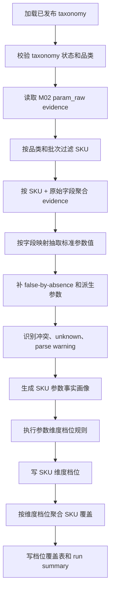

# M03B SKU 参数事实画像与参数档位覆盖详细设计

## 1. 文档定位

本文是 M03B 的工程详细设计，承接：

- `sop_requirements/M03B_sku_param_profile_requirements.md`
- `sop_requirements/M03A_param_taxonomy_semantic_asset_requirements.md`
- `sop_detailed_design/M03A_param_taxonomy_semantic_asset_design.md`
- `sop_detailed_design/M02_evidence_atom_design.md`
- `sop_detailed_design/M03_param_extraction_design.md`

M03B 使用 M03A 已发布 taxonomy，生成 SKU 参数事实画像、SKU 参数维度档位画像、参数档位覆盖 SKU 清单。M03B 是确定性模块，不调用 LLM。

## 2. 模块职责

### 2.1 解决的问题

M03B 必须回答：

1. 每个 SKU 有哪些标准参数事实。
2. 每个参数事实来自哪些 M02 `param_raw` evidence。
3. 每个 SKU 在尺寸、显示技术、分区控光、画质综合、性能、智能、接口、外观、能效等维度处于哪个档位。
4. 每个档位覆盖哪些 SKU，覆盖率是多少，是否足够支撑后续竞品召回。

### 2.2 不解决的问题

M03B 不回答：

- 某个卖点是否成立。
- 某个 SKU 的用户任务是什么。
- 某个 SKU 面向哪个目标客群。
- 某个 SKU 落在哪个价值战场。
- 某个 SKU 的核心竞品是谁。

这些问题由 M04a/M04b、M08-M14 处理。M03B 只提供事实和档位索引。

## 3. 输入边界

### 3.1 必需输入

| 输入 | 来源 | 用途 |
| --- | --- | --- |
| taxonomy version | M03A published taxonomy | 标准参数、字段映射、parser、缺失策略、档位规则 |
| `param_raw` evidence | M02 `core3_evidence_atom` | SKU 原始参数事实 |
| source batch | M00 | batch 边界、重跑范围 |

### 3.2 查询条件

基础条件：

```sql
project_id = :project_id
and category_code = :category_code
and batch_id = :batch_id
and evidence_type = 'param_raw'
and evidence_status = 'current'
and is_current = true
```

205 当前 TV 临时补充：

```sql
and sku_code like 'TV%'
```

该条件是当前混品类数据的防御性过滤。后续 M00/M02 修复品类边界后，仍可保留为 warning 校验，不再作为主要品类判断依据。

### 3.3 不读取的数据

M03B 不读取：

- `comment_raw` / `comment_sentence`
- `promo_raw` / `promo_sentence`
- `market_fact`
- 清洗质量诊断文本
- 服务履约类评论

## 4. 输出设计

M03B 首版输出四类数据：

1. 标准参数值：复用 `core3_extract_param_value`。
2. SKU 参数事实画像：复用并扩展 `core3_sku_param_profile` JSON。
3. SKU 参数维度档位：新增 `core3_sku_param_dimension_tier`。
4. 参数档位覆盖：新增 `core3_param_tier_coverage`。

如果开发阶段暂不新增物理表，`core3_sku_param_dimension_tier` 和 `core3_param_tier_coverage` 可以先作为 JSON 输出和 API payload 落在 run artifact 中；但正式实现应建表，方便 M12/M13 查询。

## 5. 数据模型设计

### 5.1 `core3_extract_param_value`

复用现有表，保存有明确 evidence 支撑的标准参数值。

M03B 写入约束：

| 规则 | 说明 |
| --- | --- |
| 只写 present/unknown 且有 M02 evidence 的值 | 现表 `primary_evidence_id` 非空 |
| 不写 false-by-absence 补值 | 缺失补 false 没有天然 row evidence |
| 不写纯派生且无单一 evidence 的档位 | 档位写入维度档位表 |
| 不写评论或卖点派生参数 | M03B 不消费这些输入 |

关键版本字段：

- `taxonomy_version`
- `parser_version`
- `rule_version`
- `param_value_hash`

### 5.2 `core3_sku_param_profile`

复用现有表，保存 SKU 级聚合画像。

`param_values_json` 建议结构：

```json
{
  "taxonomy_version": "tv_param_taxonomy_manual_v0.1",
  "parser_version": "m03b_tv_parser_v0.1",
  "rule_version": "m03b_tv_param_profile_v0.1",
  "values": {
    "screen_size_inch": {
      "value_presence": "present",
      "normalized_value": {"value": 65, "unit": "inch"},
      "source_type": "raw_param",
      "source_raw_fields": ["尺寸"],
      "evidence_ids": ["sha256:..."],
      "confidence": 0.95
    },
    "camera_flag": {
      "value_presence": "derived_false",
      "normalized_value": false,
      "source_type": "taxonomy_rule",
      "source_raw_fields": ["摄像头"],
      "rule": "false_by_absence",
      "evidence_ids": []
    }
  },
  "dimension_tier_profile": {
    "size": "large_60_69",
    "picture_overall": "picture_enhanced",
    "performance": "perf_basic"
  }
}
```

`quality_summary_json` 建议结构：

```json
{
  "known_core_param_count": 14,
  "core_param_count": 14,
  "param_completeness": 1.0,
  "unknown_param_codes": ["cpu_frequency_ghz"],
  "false_by_absence_param_codes": ["camera_flag", "quantum_dot_flag"],
  "excluded_raw_fields": ["屏幕尺寸", "屏幕面积"],
  "conflict_count": 0,
  "parse_warning_count": 1,
  "category_boundary_filter": "sku_code_prefix_TV"
}
```

### 5.3 `core3_sku_param_dimension_tier`

新增表，记录每个 SKU 每个参数维度的档位。

| 字段 | 类型建议 | 必填 | 说明 |
| --- | --- | --- | --- |
| `dimension_tier_id` | text | 是 | 主键 |
| `project_id` | text | 是 | 项目 |
| `category_code` | text | 是 | 品类 |
| `batch_id` | text | 是 | 批次 |
| `taxonomy_version` | text | 是 | taxonomy 版本 |
| `sku_code` | text | 是 | SKU |
| `dimension_code` | text | 是 | `size`、`picture_overall` 等 |
| `tier_code` | text | 是 | 档位编码 |
| `tier_name` | text | 是 | 档位中文名 |
| `tier_rank` | integer | 否 | 同维度内顺序；无高低顺序时为空 |
| `basis_param_codes` | jsonb | 是 | 参与判断的标准参数 |
| `basis_values_json` | jsonb | 是 | 判断使用的参数值 |
| `rule_snapshot_json` | jsonb | 是 | 档位规则快照 |
| `explanation` | text | 是 | 为什么落入该档位 |
| `evidence_ids` | jsonb | 是 | 参数 evidence 汇总 |
| `confidence` | numeric | 是 | 档位置信度 |
| `quality_flags` | jsonb | 是 | `declared_metric`、`unknown_input`、`rule_fallback` 等 |
| `profile_hash` | text | 是 | 当前档位画像 hash |
| `is_current` | boolean | 是 | 当前版本 |
| `created_at` | timestamptz | 是 | 创建时间 |
| `updated_at` | timestamptz | 是 | 更新时间 |

唯一约束：

```text
project_id + category_code + batch_id + taxonomy_version + sku_code + dimension_code + is_current
```

查询索引：

- `sku_code, dimension_code`
- `dimension_code, tier_code`
- `batch_id, dimension_code, tier_code`
- GIN: `basis_values_json`、`evidence_ids`、`quality_flags`

### 5.4 `core3_param_tier_coverage`

新增表，记录每个参数维度档位覆盖的 SKU。

| 字段 | 类型建议 | 必填 | 说明 |
| --- | --- | --- | --- |
| `tier_coverage_id` | text | 是 | 主键 |
| `project_id` | text | 是 | 项目 |
| `category_code` | text | 是 | 品类 |
| `batch_id` | text | 是 | 批次 |
| `taxonomy_version` | text | 是 | taxonomy 版本 |
| `dimension_code` | text | 是 | 参数维度 |
| `tier_code` | text | 是 | 档位编码 |
| `tier_name` | text | 是 | 档位中文名 |
| `tier_rank` | integer | 否 | 档位顺序 |
| `rule_summary` | text | 是 | 档位规则摘要 |
| `sku_count` | integer | 是 | 覆盖 SKU 数 |
| `sku_ratio` | numeric | 是 | 覆盖率 |
| `sku_codes` | jsonb | 是 | 完整 SKU 列表 |
| `sample_sku_codes` | jsonb | 是 | 展示用样例 |
| `coverage_status` | text | 是 | `covered`、`empty_current_batch`、`insufficient_sample` |
| `coverage_hash` | text | 是 | 覆盖结果 hash |
| `is_current` | boolean | 是 | 当前版本 |
| `created_at` | timestamptz | 是 | 创建时间 |
| `updated_at` | timestamptz | 是 | 更新时间 |

唯一约束：

```text
project_id + category_code + batch_id + taxonomy_version + dimension_code + tier_code + is_current
```

查询索引：

- `dimension_code, tier_code`
- `sku_count`
- `coverage_status`
- GIN: `sku_codes`、`sample_sku_codes`

## 6. TV taxonomy 配置要求

M03B 消费的 TV taxonomy 必须包含：

```json
{
  "taxonomy_version": "tv_param_taxonomy_manual_v0.1",
  "category_code": "TV",
  "standard_params": [],
  "field_mapping_rules": [],
  "missing_as_false_params": [],
  "excluded_raw_fields": [],
  "dimension_tier_rules": []
}
```

### 6.1 `standard_params`

每个标准参数至少包含：

- `param_code`
- `param_name`
- `param_group`
- `data_type`
- `unit`
- `source_raw_fields`
- `parser`
- `missing_policy`
- `core_rank`
- `profile_sections`

### 6.2 `dimension_tier_rules`

每条规则至少包含：

```json
{
  "dimension_code": "picture_overall",
  "dimension_name": "画质综合",
  "tier_code": "picture_enhanced",
  "tier_name": "增强画质",
  "tier_rank": 30,
  "rule_type": "deterministic_expression",
  "basis_param_codes": [
    "resolution_label",
    "declared_refresh_rate_hz",
    "declared_brightness_nit_or_band",
    "display_tech_class",
    "local_dimming_zone_count"
  ],
  "rule_expression": "4K and any(high_refresh, hdr, high_color_gamut, high_brightness) and not premium_control",
  "downstream_usage": ["candidate_recall", "component_scoring"],
  "quality_notes": ["declared_refresh_rate_hz is a declared value, not verified native panel refresh"]
}
```

M03B 运行时只能执行这些规则，不能修改规则。

## 7. Parser 和归一规则

### 7.1 标准参数 parser

| parser | 输入字段 | 输出 |
| --- | --- | --- |
| `inch` | `尺寸` | number, unit inch |
| `resolution` | `分辨率`、`清晰度`、`清晰度2` | width/height/resolution label |
| `declared_hz` | `屏幕刷新率` | declared Hz，标记 `declared_metric` |
| `nits_or_band` | `亮度` | nit 数值或区间，中位数仅用于排序和档位 |
| `percentage_ratio` | `全色域` | 0.98 -> 98%，1 -> 100% |
| `zones` | `分区背光` | integer zone count |
| `display_tech` | `产品技术`、`背光源`、`背光源细分`、`MINILED`、`MINILED2`、`量子点` | display technology class |
| `gb` | `RAM内存`、`ROM容量` | GB |
| `hdmi_mix` | `HDMI参数`、`HDMI数量` | version mix、HDMI2.1 flag、port count |
| `usb_mix` | `USB参数`、`USB数量` | version mix、USB3.0 flag、port count |
| `energy_grade` | `能效等级` | grade |
| `energy_index` | `能效指数` | 1/2/3/4；`1.3` 归一为 1 |
| `feature_presence` | 特性标记字段 | true 或 false-by-absence |
| `mm_dimension` | `机身厚度` | mm |

### 7.2 缺失策略

| policy | 处理 |
| --- | --- |
| `unknown` | 不补 false，计入 unknown |
| `false_by_absence` | 画像中补 false，`source_type=taxonomy_rule` |
| `derived` | 从已有参数派生，记录 `basis_param_codes` |
| `excluded` | 不进入参数值，只进入审计 |

TV 首版 false-by-absence 参数包括：

```text
ai_model_capability_flag
whole_home_control_flag
full_screen_design_flag
wifi_builtin_flag
camera_flag
flush_wall_mount_flag
voice_engine
voice_recognition_flag
slim_design_flag
far_field_voice_flag
quantum_dot_flag
portable_tv_flag
```

## 8. 参数维度档位规则

### 8.1 尺寸

| tier | 规则 |
| --- | --- |
| `small_32_45` | `screen_size_inch <= 45` |
| `medium_46_59` | `46 <= screen_size_inch <= 59` |
| `large_60_69` | `60 <= screen_size_inch <= 69` |
| `xlarge_70_85` | `70 <= screen_size_inch <= 85` |
| `xxlarge_86_97` | `86 <= screen_size_inch <= 97` |
| `giant_98_plus` | `screen_size_inch >= 98` |

### 8.2 显示技术

判断优先级：

1. `OLED`
2. `LASER`
3. `RGB-MINILED`
4. `QD-MINILED` / `SQD-MINILED`
5. `MINILED`
6. `QLED/LCD`
7. `LCD/LED`
8. `unknown`

注意：`非MINILED` 不能用字符串包含 `MINILED` 判断为 MiniLED。必须按：

```text
MINILED = 是
or MINILED2 in (MINILED, QD-MINILED, SQD-MINILED, RGB-MINILED)
```

### 8.3 分区控光

| tier | 规则 |
| --- | --- |
| `z_none_0` | `local_dimming_zone_count = 0` |
| `z_entry_1_499` | `1-499` |
| `z_mid_500_999` | `500-999` |
| `z_high_1000_1999` | `1000-1999` |
| `z_premium_2000_3999` | `2000-3999` |
| `z_flagship_4000_plus` | `>=4000` |

### 8.4 画质综合

画质综合读取：

- 分辨率。
- `declared_refresh_rate_hz`。
- `declared_brightness_nit_or_band`。
- HDR。
- 色域。
- 显示技术。
- 分区控光。

判断顺序从高到低：

| tier | 规则摘要 |
| --- | --- |
| `picture_flagship` | QD/RGB MiniLED + 高亮度 + 高分区控光组合成立 |
| `picture_premium` | MiniLED/QD/RGB MiniLED，且亮度或分区有明显支撑 |
| `picture_enhanced` | 4K 且有高刷、HDR、高色域或亮度增强，但未达到高端控光组合 |
| `picture_mainstream` | 4K，但亮度、刷新率、控光没有明显增强 |
| `picture_basic` | HD/FHD、60Hz 或明显低规格 |

刷新率和亮度只作为输入，不独立决定画质综合档。输出解释必须说明其为原始标称参数。

### 8.5 性能

| tier | 规则摘要 |
| --- | --- |
| `perf_low` | RAM `<=1.5GB` 或 ROM `<=16GB` |
| `perf_basic` | RAM `<=2GB` 或 ROM `<=32GB` |
| `perf_mainstream` | RAM 3GB 左右，ROM 64GB 左右 |
| `perf_main_plus` | RAM `>=4GB` 且 ROM `>=64GB` |
| `perf_high` | RAM `>=6GB` 或 ROM `>=128GB`，芯片/GPU信息作为增强证据 |
| `perf_unknown` | RAM 或 ROM 关键输入缺失 |

### 8.6 智能

| tier | 规则摘要 |
| --- | --- |
| `smart_basic` | 仅智能电视/网络电视基础标签 |
| `smart_voice_ai_basic` | 有人工智能或语音/远场语音基础能力 |
| `smart_ai_voice` | 有 AI 大模型 + 语音/远场语音 |
| `smart_interaction_iot` | 有摄像头或全屋智控 |

### 8.7 接口

| tier | 规则摘要 |
| --- | --- |
| `ports_weak` | HDMI `<=1` 或 USB `<=1` |
| `ports_basic` | HDMI/USB 有基础数量，无 HDMI2.1 增强 |
| `ports_main_hdmi21` | 有 HDMI2.1，但数量不丰富 |
| `ports_main_plus` | HDMI 数量较多，或 HDMI2.1 + USB3.0 组合 |
| `ports_rich` | HDMI `>=4` 且有 HDMI2.1 和 USB3.0 |

### 8.8 外观安装

| tier | 规则摘要 |
| --- | --- |
| `appearance_wall_flush` | 有无缝贴墙 |
| `appearance_ultra_slim` | 明确超轻薄，或厚度 `<=50mm` |
| `appearance_slim_fullscreen` | 全面屏且厚度 `<=60mm` |
| `appearance_slim` | 厚度 `<=60mm` |
| `appearance_standard` | `60-75mm` |
| `appearance_thick` | `75-90mm` |
| `appearance_heavy` | `>90mm` |
| `appearance_unknown` | 厚度缺失且无外观特性 |

### 8.9 能效

| tier | 规则 |
| --- | --- |
| `energy_grade_1` | 能效等级一级 |
| `energy_grade_2` | 能效等级二级 |
| `energy_grade_3_4` | 能效等级三级或四级 |
| `energy_unknown` | 能效等级缺失 |

能效以 `能效等级` 为主，`能效指数` 作为辅助记录。

## 9. 处理流程



### 9.1 taxonomy 校验

阻断条件：

- taxonomy 不存在。
- taxonomy 非 `published`。
- taxonomy `category_code` 与运行参数不一致。
- taxonomy 缺少 active 标准参数。
- taxonomy 缺少 dimension tier rule。

### 9.2 evidence 聚合

聚合键：

```text
project_id + category_code + batch_id + sku_code + raw_field
```

聚合内容：

- `evidence_ids`
- `clean_value`
- `raw_value`
- `value_presence`
- `numeric_value`
- `numeric_values_json`
- `unit_value`
- `base_confidence`
- `quality_flags`
- `source_row_id`

### 9.3 主值选择

同一 SKU 同一标准参数多候选时：

1. taxonomy `source_priority` 高者优先。
2. parser 成功优先于 parser warning。
3. `base_confidence` 高者优先。
4. present 优先于 unknown。
5. 高置信矛盾写入冲突记录，不阻断 SKU 画像。

### 9.4 档位执行

每个维度执行步骤：

1. 读取该维度 `basis_param_codes`。
2. 检查关键输入是否 present、derived false 或 unknown。
3. 执行 deterministic rule。
4. 生成 `tier_code`、`tier_rank`、`explanation`。
5. 写 `quality_flags`，例如：
   - `declared_metric`
   - `missing_core_input`
   - `false_by_absence_used`
   - `rule_fallback`

## 10. 当前 205 TV 档位覆盖验收基线

当前基线：`293` 个 TV SKU。

| 维度 | 档位 | SKU 数 |
| --- | --- | ---: |
| 尺寸 | `small_32_45` | 26 |
| 尺寸 | `medium_46_59` | 43 |
| 尺寸 | `large_60_69` | 38 |
| 尺寸 | `xlarge_70_85` | 135 |
| 尺寸 | `xxlarge_86_97` | 0 |
| 尺寸 | `giant_98_plus` | 51 |
| 显示技术 | `lcd_led` | 100 |
| 显示技术 | `miniled` | 108 |
| 显示技术 | `qd_miniled` | 68 |
| 显示技术 | `rgb_miniled` | 14 |
| 显示技术 | `qled_lcd` | 2 |
| 显示技术 | `laser` | 1 |
| 显示技术 | `oled` | 0 |
| 分区控光 | `z_none_0` | 149 |
| 分区控光 | `z_entry_1_499` | 38 |
| 分区控光 | `z_mid_500_999` | 24 |
| 分区控光 | `z_high_1000_1999` | 28 |
| 分区控光 | `z_premium_2000_3999` | 36 |
| 分区控光 | `z_flagship_4000_plus` | 18 |
| 画质综合 | `picture_basic` | 33 |
| 画质综合 | `picture_mainstream` | 21 |
| 画质综合 | `picture_enhanced` | 90 |
| 画质综合 | `picture_premium` | 110 |
| 画质综合 | `picture_flagship` | 39 |
| 性能 | `perf_low` | 30 |
| 性能 | `perf_basic` | 51 |
| 性能 | `perf_mainstream` | 36 |
| 性能 | `perf_main_plus` | 113 |
| 性能 | `perf_high` | 56 |
| 性能 | `perf_unknown` | 7 |
| 智能 | `smart_basic` | 13 |
| 智能 | `smart_voice_ai_basic` | 110 |
| 智能 | `smart_ai_voice` | 144 |
| 智能 | `smart_interaction_iot` | 26 |
| 接口 | `ports_weak` | 30 |
| 接口 | `ports_basic` | 30 |
| 接口 | `ports_main_hdmi21` | 39 |
| 接口 | `ports_main_plus` | 85 |
| 接口 | `ports_rich` | 109 |
| 外观安装 | `appearance_standard` | 77 |
| 外观安装 | `appearance_thick` | 71 |
| 外观安装 | `appearance_wall_flush` | 35 |
| 外观安装 | `appearance_slim` | 33 |
| 外观安装 | `appearance_heavy` | 22 |
| 外观安装 | `appearance_ultra_slim` | 19 |
| 外观安装 | `appearance_slim_fullscreen` | 17 |
| 外观安装 | `appearance_unknown` | 19 |
| 能效 | `energy_grade_1` | 261 |
| 能效 | `energy_grade_2` | 30 |
| 能效 | `energy_grade_3_4` | 2 |

## 11. 单 SKU 示例

以 `TV00027549 / 海信 65E3Q` 为例：

```json
{
  "sku_code": "TV00027549",
  "param_fact_profile": {
    "screen_size_inch": 65,
    "resolution_label": "4K",
    "declared_refresh_rate_hz": 144,
    "declared_brightness_band": "200-300",
    "display_tech_class": "lcd_led",
    "mini_led_flag": false,
    "local_dimming_zone_count": 0,
    "ram_gb": 2,
    "storage_gb": 32,
    "ai_model_name": "海信星海",
    "hdmi_version_mix": "HDMI2.1",
    "hdmi_port_count": 2,
    "energy_efficiency_grade": "一级"
  },
  "dimension_tier_profile": {
    "size": "large_60_69",
    "display_tech": "lcd_led",
    "local_dimming": "z_none_0",
    "picture_overall": "picture_enhanced",
    "performance": "perf_basic",
    "smart": "smart_ai_voice",
    "ports": "ports_main_hdmi21",
    "appearance": "appearance_standard",
    "energy": "energy_grade_1"
  },
  "tier_explanation": {
    "picture_overall": "4K、144Hz、HDR、高色域成立，但亮度 200-300、非 MiniLED、分区背光 0，因此是增强画质，不是高端画质。",
    "performance": "2GB+32GB，落在基础性能档。",
    "smart": "有 AI 大模型、语音识别、远场语音，落在 AI 语音增强档。"
  }
}
```

## 12. 增量和幂等

重算范围：

| 变化 | 重算 |
| --- | --- |
| 新 batch | 该 batch 全量 SKU |
| 单 SKU 参数 evidence 变化 | 该 SKU 参数值、维度档位；并更新相关档位覆盖 |
| taxonomy 新版本发布 | 该品类当前分析窗口全量重算 |
| 复核决策变化 | 涉及 SKU 或涉及档位重算 |

幂等键：

```text
project_id + category_code + batch_id + taxonomy_version + rule_version
```

写入策略：

1. 以 batch、SKU、taxonomy/rule、维度等业务键做幂等写入。
2. 相同业务键且 hash 一致时复用既有结果，不重复插入。
3. 相同业务键但 hash 不一致时默认阻断，避免静默覆盖；`force_rebuild=true` 时更新既有 current 结果。
4. 生成 run summary 和 hash，失败时事务回滚。

## 13. API 和 CLI

### 13.1 API

```text
POST /api/mvp/core3/v2/projects/{project_id}/batches/{batch_id}/params/m03b/run
GET  /api/mvp/core3/v2/projects/{project_id}/skus/{sku_code}/params?batch_id={batch_id}
GET  /api/mvp/core3/v2/projects/{project_id}/batches/{batch_id}/params/m03b/dimension-tiers
GET  /api/mvp/core3/v2/projects/{project_id}/batches/{batch_id}/params/m03b/tier-coverages
```

run request：

```json
{
  "category_code": "TV",
  "taxonomy_version": "tv_param_taxonomy_manual_v0.1",
  "target_sku_codes": [],
  "force_rebuild": false
}
```

### 13.2 CLI

当前实现已落地 API、runner、初始化流程接入和只读查询接口。CLI 仍按下列形态作为后续对外调用封装，不在首版 M03B 后端实现中强行新增独立命令框架。

```text
catforge-realdata m03b sku-param-profiles \
  --project-id PROJECT_ID \
  --batch-id BATCH_ID \
  --category-code TV \
  --taxonomy-version tv_param_taxonomy_manual_v0.1
```

必须支持：

- `--target-sku-code`
- `--target-sku-codes-file`
- `--limit`
- `--dry-run`
- `--force-rebuild`
- `--write-tier-coverage`

## 14. 测试要求

### 14.1 单元测试

| 测试 | 要求 |
| --- | --- |
| parser 测试 | inch、resolution、declared_hz、nits_or_band、percentage_ratio、zones、display_tech、hdmi_mix、usb_mix |
| 缺失策略测试 | unknown 不判 false，false-by-absence 正确补 false |
| 显示技术测试 | `非MINILED` 不能误判为 MiniLED |
| 画质综合测试 | 高刷低亮 LCD 不判高端画质 |
| 冲突测试 | `MINILED=否` + `MINILED2=QD-MINILED` 触发冲突 |
| 档位覆盖测试 | 每个档位 sku_count 与 SKU 列表一致 |

### 14.2 集成测试

使用小 fixture 验证：

1. 一个 SKU 能生成参数事实画像。
2. 一个 SKU 能生成所有参数维度档位。
3. 多个 SKU 能生成档位覆盖。
4. M03B 不读取 comment、promo、market。
5. taxonomy 非 published 时阻断。

### 14.3 205 验收测试

205 当前 TV 批次验收：

- 处理 `293` 个 TV SKU。
- 不处理 `AC%` SKU。
- 档位覆盖分布与本文第 10 节一致。
- `TV00027549` 档位与第 11 节一致。
- run summary 包含：
  - `sku_profile_count`
  - `param_value_count`
  - `dimension_tier_count`
  - `tier_coverage_count`
  - `false_by_absence_count`
  - `conflict_count`
  - `ignored_raw_field_count`

## 15. 下游契约

### 15.1 给 M04a

M04a 可读取：

- `core3_extract_param_value`
- `core3_sku_param_profile`
- `core3_sku_param_dimension_tier`

用途：判断基础卖点是否有参数支撑。例如 MiniLED、高亮、分区、高刷、HDMI2.1、AI 语音等。

### 15.2 给 M07/M12/M13

候选召回和评分可读取：

- `core3_param_tier_coverage`
- `core3_sku_param_dimension_tier`

推荐召回顺序：

1. 同尺寸档。
2. 同画质综合档或相邻画质档。
3. 同显示技术档。
4. 同性能档和智能档。
5. 接口、外观、能效作为辅助条件。

### 15.3 给 M08-M11

M08-M11 可以引用参数事实和档位，但不能把参数档位直接等同为任务、客群或战场结论。任务、客群、战场仍需结合卖点、评论、市场等证据。

## 16. 待评审问题

1. `core3_sku_param_dimension_tier`、`core3_param_tier_coverage` 是否首版建表，还是先作为 JSON artifact 输出。
2. `picture_overall` 是否应在 M03B 固化，还是只输出子维度档位，由 M08 再组合。
3. `declared_refresh_rate_hz` 高于 240Hz 的口径是否需要统一标记 `scope_uncertain`。
4. 档位规则变更是否全部归入 M03A taxonomy 发布流程，还是允许 M03B rule patch 小版本。
5. 当前 205 没有 OLED，是否在 TV taxonomy 中保留 `oled` 空档位作为未来兼容。
