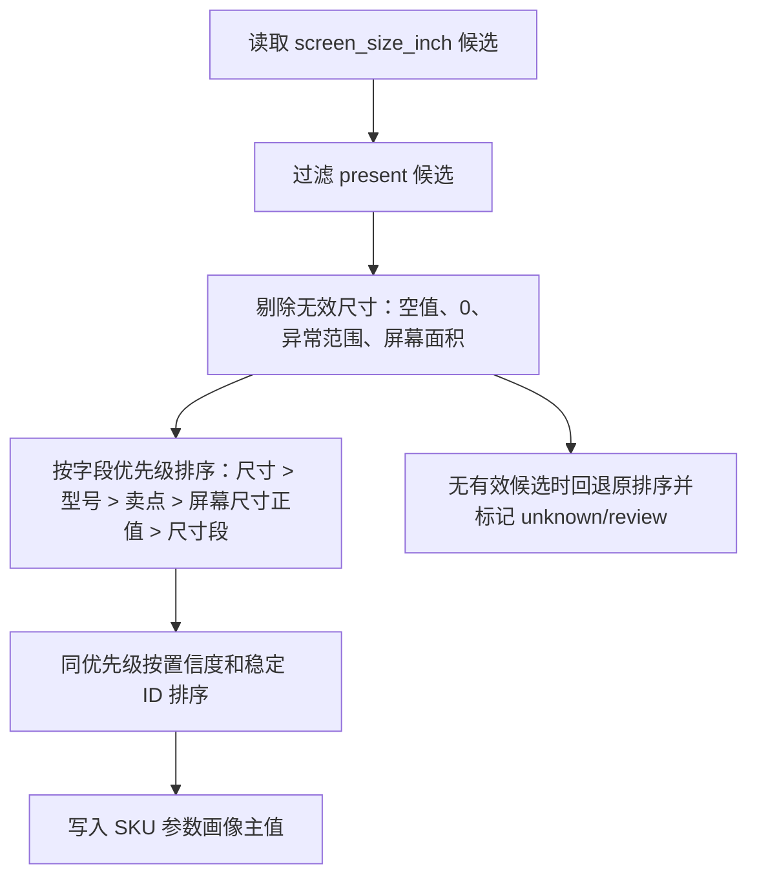

# M03/M07 屏幕尺寸参数稳定化专项详细设计

## 1. 文档定位

本文是 M03 参数抽取与 M07 市场画像的专项补充设计，解决 205 真实数据运行后暴露的屏幕尺寸取值不稳定问题。

关联文档：

- `M03_param_extraction_design.md`
- `M07_market_profile_design.md`
- `M08_4_product_anchor_correction_design.md`
- `M11_battlefield_v2_size_price_pool_design.md`

本文只修正屏幕尺寸标准参数和市场池输入，不改价值战场、目标客群、用户任务的业务定义。

## 2. 真实数据问题

205 当前批次排查结论：

| 项目 | 结论 |
| --- | --- |
| `attribute_data` 覆盖 | 84 个 SKU 均有参数数据 |
| 精确尺寸字段 | `attribute_data.尺寸` 覆盖 84/84 SKU，可直接表示英寸 |
| 范围尺寸字段 | `attribute_data.尺寸段` 覆盖 84/84 SKU，但只表示范围，例如 `51-59`、`60-69`、`>=70` |
| 误导字段 | `attribute_data.屏幕尺寸` 覆盖 84/84 SKU，但当前全为 `0` |
| M07 异常 | 25 个 SKU 被写成 `screen_size_inch <= 0`，54 个 SKU 与原始 `尺寸` 差异大于 2 寸 |

典型错误：

| SKU | 原始 `尺寸` | 原始 `屏幕尺寸` | 原始 `尺寸段` | 当前 M07 |
| --- | ---: | ---: | --- | --- |
| `100E5Q` | 100 | 0 | `>=70` | 0 / `compact_screen` |
| `85E5Q` | 85 | 0 | `>=70` | 0 / `compact_screen` |
| `75E5Q` | 75 | 0 | `>=70` | 70 / `large_upgrade` |

根因不是缺少尺寸参数，而是程序在同一个标准参数下错误地把候选值等价排序：

1. M03 对 `screen_size_inch` 的主值选择只按来源优先级和置信度排序，`屏幕尺寸=0`、`尺寸=85`、`尺寸段=>=70` 置信度相近时会选错。
2. M07 直接消费 `core3_extract_param_value`，同样按置信度保留，绕过了 SKU 参数画像的主值校正。
3. `_screen_size_class(0)` 当前返回 `compact_screen`，把无效尺寸变成有效市场池。

## 3. 修正目标

### 3.1 业务目标

屏幕尺寸是彩电价值战场和市场池的基础字段，必须满足：

1. 有精确 `尺寸` 时，市场池必须使用精确英寸值。
2. `尺寸段` 只能作为缺失时的范围兜底，不能覆盖精确尺寸。
3. `屏幕尺寸=0`、`屏幕面积=0`、空值、`-` 不能作为有效尺寸。
4. M07 不能把无效尺寸归入小屏池；无效尺寸只能是 `unknown`。
5. 下游 M08/M11/M11.6/M11.7 只消费修正后的尺寸和市场池。

### 3.2 工程目标

1. M03 主值选择新增 `screen_size_inch` 专用 resolver。
2. M07 尺寸输入新增二次防线，即使 M03 历史数据未清理，也不消费无效候选。
3. 所有新增规则保持确定性，不依赖外部 LLM。
4. 保持幂等：同一批次重跑 M03/M07 后，相同输入得到相同 `profile_hash` / `result_hash`。

## 4. 字段优先级

### 4.1 权威来源顺序

| 优先级 | 来源 | 使用规则 |
| ---: | --- | --- |
| 1 | 原始参数字段 `尺寸` | 精确英寸，当前 205 覆盖 84/84 SKU，首选 |
| 2 | 型号名解析 | 仅在精确 `尺寸` 缺失时兜底，或用于校验 |
| 3 | 卖点中的精确英寸 | 仅在参数缺失时兜底，不覆盖参数 |
| 4 | `尺寸段` | 范围字段，只能作为低置信兜底；例如 `>=70` 不等于 70 寸 |
| 5 | 评论中的尺寸 | 只做用户感知验证，不作为产品规格 |

### 4.2 无效来源拦截

| 字段/值 | 处理 |
| --- | --- |
| `屏幕尺寸=0` | 无效，不进入 M03 主值，不进入 M07 尺寸输入 |
| `屏幕面积=0` | 无效，不作为 `screen_size_inch` |
| `numeric_value <= 0` | 无效 |
| `numeric_value < 20` 或 `> 130` | 异常范围，默认无效并进入复核 |
| `尺寸段=51-59/60-69/>=70` | 范围值，不得覆盖精确尺寸 |

## 5. M03 设计

### 5.1 模块职责

M03 对每个 SKU 输出标准参数画像。对 `screen_size_inch`，M03 必须在候选值中选出一个主值，并保留其它候选作为复核证据。

### 5.2 处理流程



### 5.3 数据契约

`core3_sku_param_profile.param_values_json["screen_size_inch"]`：

| 字段 | 要求 |
| --- | --- |
| `numeric_value` | 有精确 `尺寸` 时必须等于原始英寸 |
| `normalized_value.value` | 与 `numeric_value` 一致 |
| `source_type` | 保留真实来源 |
| `quality_flags` | 保留冲突标记，但冲突不能让 0 值胜出 |
| `candidates` | 保留所有候选，便于复核 |

### 5.4 复核规则

| 条件 | 复核 |
| --- | --- |
| 精确 `尺寸` 与型号解析差异 > 2 寸 | `review_required` |
| 只有 `尺寸段` 无精确尺寸 | `review_required`，低置信 |
| 所有候选均无效 | `review_required`，下游尺寸为 unknown |

## 6. M07 设计

### 6.1 模块职责

M07 生成市场画像、价格位置、尺寸市场池和可比池。M07 必须只消费有效尺寸输入。

### 6.2 尺寸输入选择

M07 读取 `core3_extract_param_value` 时，按 SKU 聚合所有 `screen_size_inch` 候选，再执行与 M03 一致的选择规则：

1. 跳过无效尺寸。
2. 优先使用原始字段 `尺寸`。
3. 其次使用正向可解释的精确字段。
4. `尺寸段` 只在没有精确值时兜底。
5. 若抽取值没有有效尺寸，再读取 `core3_sku_param_profile` 的主值。

### 6.3 市场池规则

| 输入尺寸 | `size_segment` | `screen_size_class` |
| --- | --- | --- |
| `None`、`0`、异常范围 | `unknown` | `unknown` |
| 32/40/43 | 对应常见尺寸或 custom | `compact_screen` |
| 50/55/65 | 对应常见尺寸或 custom | `mainstream_living` |
| 75/85 | 对应常见尺寸或 custom | `large_upgrade` |
| 98/100+ | 对应常见尺寸或 custom | `ultra_large_flagship` |

`price_per_inch` 只有在有效尺寸存在时计算。

### 6.4 质量规则

| 条件 | 输出 |
| --- | --- |
| M07 无有效尺寸 | `size_missing`，市场池为 unknown |
| M07 使用范围兜底 | `size_range_fallback`，低置信 |
| 市场池样本不足 | 保持原有 `market_pool_insufficient` |

## 7. 下游重跑范围

这次修复改变 M03/M07 输出，会影响以下模块：

| 模块 | 影响 |
| --- | --- |
| M08/M08.4/M08.5 | 产品锚点和维度定义会使用正确尺寸池 |
| M09/M10/M11 | 任务、客群、价值战场的市场池适配更准确 |
| M11.6/M11.7 | SKU 销量分配和维度销量对账需要基于修正后的战场 |
| M12-M14 | 竞品召回和评分的尺寸/价格可比关系更准确 |

205 重跑顺序建议：

```text
M03 -> M07 -> M08 -> M08.4 -> M08.5 -> M09 -> M10 -> M11 -> M11.6 -> M11.7 -> M12
```

若只验证尺寸修复，最小重跑：

```text
M03 -> M07
```

## 8. 测试与验收

### 8.1 单元测试

1. M03：同 SKU 同时存在 `屏幕尺寸=0`、`尺寸=85`、`尺寸段=>=70` 时，主值必须是 85。
2. M07：`_screen_size_class(0)` 和 `_size_segment(0)` 必须返回 `unknown`。
3. M07：候选中有 `尺寸=85` 和 `尺寸段=>=70` 时，尺寸输入必须选 85。

### 8.2 205 验收 SQL

修复并重跑 M03/M07 后必须满足：

```sql
-- M07 不应再把 0 写成有效尺寸
select count(*)
from core3_sku_market_profile
where batch_id = :batch_id
  and screen_size_inch <= 0;

-- M07 与原始 attribute_data.尺寸 差异大于 2 寸的 SKU 应为 0
-- 如存在差异，必须输出 SKU、原始字段和 M03 候选供复核。
```

### 8.3 业务验收

1. 75/85/100 寸 SKU 不再进入 `compact_screen`。
2. `large_upgrade` 和 `ultra_large_flagship` 池内 SKU 数量符合原始尺寸分布。
3. M11 v2 不再因为错误尺寸导致单个战场覆盖 80+ SKU。
4. M11.7 中按价值战场汇总销量时，战场 SKU 构成与尺寸/价格市场池能解释。

## 9. 风险与边界

1. 当前修复不改变 M03 字段匹配本体；如果未来发现 `尺寸` 之外的新精确字段，需要补充别名和字段优先级。
2. 当前不直接读取原始表修正 M07，仍坚持从 M03/M02/M01 后的结果进入画像层。
3. 历史已经落库的错误 M07/M11 结果不会自动消失，必须通过界面或 runner 重跑覆盖。
4. 若 205 旧批次 M03 未重跑，M07 的二次防线仍可避免消费 0，但最佳结果仍依赖 M03 重跑。
