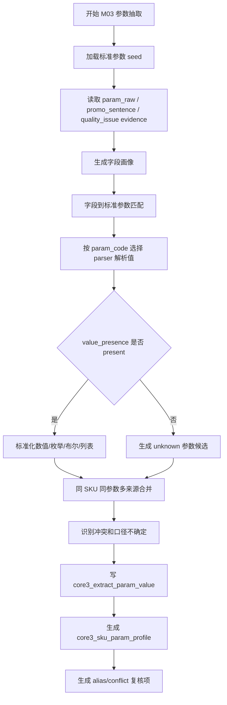

# M03 参数字段画像与标准参数抽取详细设计

## 1. 文档定位

本文是 CatForge 彩电核心三竞品真实数据 v2 的 M03 模块详细设计。它承接：

- `sop_requirements/M03_param_extraction_requirements.md`
- `sop_requirements/00_real_data_baseline.md`
- `sop_detailed_design/00_architecture_data_dictionary_design.md`
- `sop_detailed_design/M01_cleaning_quality_design.md`
- `sop_detailed_design/M02_evidence_atom_design.md`
- `cankao/CatForge_竞品生成SOP_详细指导_v1.md`
- `cankao/catforge_sop_md/modules/M03_参数字段画像与标准参数抽取.md`
- `apps/api-server/app/rules/tv_core3_mvp_seed_v0_2.json`

M03 的目标是把 `param_raw` evidence 和可控宣传文本派生参数转换成标准参数画像，向后续 M04a、M08、M09-M15 提供稳定的 `param_code + normalized_value + evidence_ids + confidence`。

本文写到可拆开发任务的程度，不包含代码、迁移或部署动作。

## 2. 模块职责

### 2.1 解决的问题

M03 负责解决五类工程问题：

| 问题 | M03 输出 |
| --- | --- |
| 原始参数字段多且命名不统一 | `core3_param_field_profile` 字段画像和标准参数匹配 |
| 参数值存在 unknown、空值、`-` | `value_presence`、`quality_flags`、unknown 证据保留 |
| 参数值口径和单位不统一 | `normalized_value`、`unit`、`parser_type`、`value_level` |
| 同 SKU 同参数可能多值或多来源冲突 | `core3_param_value_conflict` |
| 下游需要 SKU 粒度参数资产 | `core3_sku_param_profile` |

M03 是参数标准化模块，不做卖点激活、任务推导、客群推导、战场推导或竞品判断。

### 2.2 不解决的问题

M03 严禁做以下事情：

| 禁止事项 | 原因 | 归属模块 |
| --- | --- | --- |
| 判断标准卖点是否激活 | 参数只是能力事实，卖点激活需要规则和多证据 | M04a/M04b |
| 从评论直接抽参数 | 评论是体验表达，先由 M05/M06 处理 | M05/M06 |
| 使用市场量价推断参数强弱 | 市场画像独立处理 | M07 |
| 把参数直接解释成用户任务 | 任务需要卖点、评论、市场共现 | M09 |
| 把参数直接解释成价值战场 | 战场需要任务、客群、卖点、市场组合 | M11 |
| 判断某 SKU 是否竞品 | 竞品召回和评分在后续模块 | M12-M14 |
| 把 unknown 当 false | 缺失即未知 | 全链路原则 |
| 用 85E7Q 字段写死规则 | 规则必须来自 seed 和真实字段画像 | 不允许 |

### 2.3 输入边界

| 输入 | 来源 | 用途 |
| --- | --- | --- |
| `param_raw` evidence | M02 `core3_evidence_atom` | 原始参数字段和值的主输入 |
| `promo_sentence` evidence | M02 `core3_evidence_atom` | 宣传文本数值实体派生参数候选 |
| `quality_issue` evidence | M02 `core3_evidence_atom` | unknown、冲突、覆盖缺失等降权依据 |
| `core3_clean_attribute` | M01 | 字段画像聚合的辅助来源 |
| 标准参数 seed | `tv_core3_mvp_seed_v0_2.json` | 标准参数定义、别名、解析器、阈值、映射关系 |

M03 不直接消费：

- 评论正文和评论句。
- 市场量价。
- M04a 卖点激活结果。
- M05/M06 评论信号。

如果 seed 中某些标准参数声明可来自 `comment_text`，M03 首版必须忽略该 source type。评论来源参数或体验信号由 M06 产生，避免 M03 越界。

### 2.4 输出边界

M03 输出五张抽取特征层表：

| 表 | 用途 |
| --- | --- |
| `core3_param_field_profile` | 原始参数字段画像、标准参数匹配和复核状态 |
| `core3_extract_param_value` | SKU 标准参数值抽取结果 |
| `core3_param_alias_candidate` | 未映射高覆盖字段的标准参数别名候选 |
| `core3_param_value_conflict` | 同 SKU 同参数的冲突和复核 |
| `core3_sku_param_profile` | SKU 级参数画像，供 M08 消费 |

M03 不新增 evidence。所有输出必须引用 M02 的 `evidence_ids`。

## 3. 标准参数资产设计

### 3.1 资产来源

MVP 标准参数资产首版来自：

```text
apps/api-server/app/rules/tv_core3_mvp_seed_v0_2.json
```

该文件中已有 `standard_params`，包含参数编码、中文名、定义、参数组、类型、单位、别名、关键词、来源优先级、解析器、阈值，以及与卖点、任务、战场的映射关系。

M03 详细设计不要求本阶段新增资产管理表。开发阶段可以先实现 `StdParamSeedLoader` 从 JSON 加载，但必须把 seed 作为版本化资产处理，并在 M03 输出记录：

- `seed_version`
- `asset_version`
- `rule_version`
- `parser_version`

后续如要将 seed 入库，可补充 `core3_std_param_seed`，但不能在 M03 输出表中硬编码 seed 内容。

### 3.2 标准参数资产字段

每个标准参数必须包含：

| 字段 | 类型 | 说明 |
| --- | --- | --- |
| `param_code` | text | 稳定编码 |
| `param_name` | text | 中文参数名 |
| `definition` | text | 业务定义 |
| `param_group` | text | 参数组 |
| `data_type` | text | `number`、`enum`、`boolean`、`list`、`string` |
| `unit` | text/null | 标准单位 |
| `aliases` | array | 原始字段别名 |
| `keywords` | array | 文本抽取关键词 |
| `source_types` | array | 可接受来源 |
| `source_priority` | array | 来源优先级 |
| `value_parsers` | array | 值解析器 |
| `thresholds` | object | 分档阈值 |
| `enum_values` | array/null | 枚举值 |
| `mapped_claim_codes` | array | 可支撑的卖点 |
| `mapped_task_codes` | array | 可支撑的任务 |
| `mapped_battlefield_codes` | array | 可支撑的战场 |

M03 只使用 `mapped_claim_codes`、`mapped_task_codes`、`mapped_battlefield_codes` 作为下游可引用的映射元数据，不在本模块生成卖点、任务或战场结论。

### 3.3 MVP 参数覆盖范围

首版必须覆盖彩电竞品生成的核心参数域：

| 参数组 | 代表参数 |
| --- | --- |
| 显示基础 | `screen_size_inch`、`resolution_class`、`panel_type`、`display_technology`、`series_name`、`launch_period` |
| 画质 | `native_refresh_rate_hz`、`system_refresh_rate_hz`、`refresh_rate_hz`、`peak_brightness_nits`、`color_gamut_pct`、`hdr_format_list`、`picture_processor`、`motion_compensation_flag` |
| 背光控光 | `mini_led_flag`、`oled_flag`、`qled_flag`、`backlight_type`、`dimming_zones`、`local_dimming_flag` |
| 游戏连接 | `hdmi_2_1_ports`、`full_bandwidth_hdmi_flag`、`vrr_flag`、`allm_flag`、`input_lag_ms`、`game_mode_flag`、`freesync_flag` |
| 音频 | `speaker_power_w`、`speaker_channel`、`subwoofer_flag`、`dolby_atmos_flag`、`dts_flag` |
| 智能系统 | `ram_gb`、`storage_gb`、`chipset_name`、`os_name`、`voice_control_flag`、`far_field_voice_flag`、`startup_ads_risk_flag` |
| 护眼体验 | `eye_dimming_freq_hz`、`low_blue_light_flag`、`flicker_free_flag`、`ambient_light_sensor_flag`、`anti_glare_flag`、`elder_mode_flag`、`child_mode_flag` |

真实数据中高覆盖但未命中的字段必须进入候选，不允许因为 seed 没有别名就丢弃。

## 4. 数据模型设计

### 4.1 `core3_param_field_profile`

#### 4.1.1 表用途

记录每个原始参数字段在当前批次的覆盖、unknown 率、值形态、标准参数匹配结果和复核状态。

该表回答：

- 原始字段覆盖多少 SKU。
- 是否高频但未映射。
- unknown 比例是否异常。
- 字段匹配到哪个标准参数。
- 匹配置信度如何。

#### 4.1.2 字段契约

| 字段 | 类型建议 | 必填 | 说明 |
| --- | --- | --- | --- |
| `field_profile_id` | `text` | 是 | 主键，建议 `m03field_<uuid>` |
| `project_id` | `text` | 是 | 项目 ID |
| `category_code` | `text` | 是 | `TV` |
| `batch_id` | `text` | 是 | 批次 |
| `run_id` | `text` | 否 | 全链路运行 ID |
| `module_run_id` | `text` | 否 | M03 运行 ID |
| `raw_param_name` | `text` | 是 | 原始字段名 |
| `clean_param_name` | `text` | 是 | M01 清洗字段名 |
| `normalized_param_name` | `text` | 是 | 用于匹配的规范化字段名 |
| `occurrence_count` | `integer` | 是 | 出现次数 |
| `sku_coverage_count` | `integer` | 是 | 覆盖 SKU 数 |
| `sku_coverage_rate` | `numeric` | 是 | 覆盖率 |
| `unknown_count` | `integer` | 是 | unknown/null/空/`-` 数量 |
| `unknown_rate` | `numeric` | 是 | unknown 比例 |
| `present_count` | `integer` | 是 | 有明确值的数量 |
| `top_values_json` | `jsonb` | 是 | 高频值 |
| `value_pattern_summary_json` | `jsonb` | 是 | 值形态摘要 |
| `matched_param_code` | `text` | 否 | 命中的标准参数 |
| `matched_param_name` | `text` | 否 | 标准参数中文名 |
| `param_group` | `text` | 否 | 参数组 |
| `match_type` | `text` | 是 | `exact_alias`、`standard_name`、`contains_alias`、`keyword`、`value_pattern`、`unmapped` |
| `alias_confidence` | `numeric` | 是 | 字段匹配置信度 |
| `candidate_status` | `text` | 是 | `mapped`、`unmapped`、`review_candidate`、`rejected` |
| `review_required` | `boolean` | 是 | 是否复核 |
| `review_status` | `text` | 是 | `auto_pass`、`review_required`、`approved`、`rejected`、`waived` |
| `review_reason` | `text` | 否 | 中文复核原因 |
| `evidence_ids` | `jsonb` | 是 | 代表性 `param_raw` evidence |
| `field_profile_hash` | `text` | 是 | 字段画像 hash |
| `seed_version` | `text` | 是 | 参数 seed 版本 |
| `rule_version` | `text` | 是 | 字段画像规则版本 |
| `created_at` | `timestamptz` | 是 | 创建时间 |
| `updated_at` | `timestamptz` | 是 | 更新时间 |

#### 4.1.3 主键、唯一键和索引

| 类型 | 字段 |
| --- | --- |
| 主键 | `field_profile_id` |
| 唯一键 | `batch_id, clean_param_name, seed_version, rule_version` |
| 普通索引 | `project_id, category_code, batch_id` |
| 普通索引 | `matched_param_code` |
| 普通索引 | `candidate_status` |
| 普通索引 | `review_required` |
| GIN 索引 | `top_values_json`、`value_pattern_summary_json`、`evidence_ids` |

#### 4.1.4 `value_pattern_summary_json`

```json
{
  "has_number": true,
  "has_unit": true,
  "units": ["HZ"],
  "boolean_like_rate": 0.0,
  "enum_like_rate": 0.15,
  "number_like_rate": 0.85,
  "sample_values": ["300HZ", "144HZ", "120HZ"]
}
```

### 4.2 `core3_extract_param_value`

#### 4.2.1 表用途

保存 SKU 级标准参数值。该表是 M04a、M08、M09-M15 使用参数事实的主表。

#### 4.2.2 字段契约

| 字段 | 类型建议 | 必填 | 说明 |
| --- | --- | --- | --- |
| `param_value_id` | `text` | 是 | 主键，建议 `m03val_<uuid>` |
| `project_id` | `text` | 是 | 项目 ID |
| `category_code` | `text` | 是 | `TV` |
| `batch_id` | `text` | 是 | 批次 |
| `run_id` | `text` | 否 | 全链路运行 ID |
| `module_run_id` | `text` | 否 | M03 运行 ID |
| `sku_code` | `text` | 是 | SKU |
| `model_name` | `text` | 否 | 型号 |
| `param_code` | `text` | 是 | 标准参数编码 |
| `param_name` | `text` | 是 | 标准参数中文名 |
| `param_group` | `text` | 是 | 参数组 |
| `data_type` | `text` | 是 | 参数类型 |
| `normalized_value` | `jsonb` | 是 | 标准值，按类型保存 |
| `numeric_value` | `numeric` | 否 | 数值型参数主值 |
| `value_text` | `text` | 否 | 展示文本 |
| `unit` | `text` | 否 | 标准单位 |
| `value_level` | `text` | 否 | 分档，如 `large`、`premium_hdr` |
| `value_presence` | `text` | 是 | `present`、`unknown`、`conflict`、`not_applicable` |
| `source_type` | `text` | 是 | `raw_param`、`derived_from_claim`、`model_name` |
| `source_priority_rank` | `integer` | 是 | 来源优先级 |
| `raw_param_name` | `text` | 否 | 原始字段名 |
| `raw_param_value` | `text` | 否 | 原始值 |
| `match_type` | `text` | 是 | 字段匹配方式 |
| `parser_type` | `text` | 是 | 值解析器 |
| `parser_status` | `text` | 是 | `parsed`、`unknown`、`failed`、`scope_uncertain` |
| `confidence` | `numeric` | 是 | 参数值置信度 |
| `confidence_level` | `text` | 是 | `high`、`medium`、`low`、`unknown` |
| `evidence_ids` | `jsonb` | 是 | 支撑 evidence |
| `primary_evidence_id` | `text` | 否 | 主证据 |
| `quality_flags` | `jsonb` | 是 | unknown、unit_uncertain、scope_uncertain、conflict 等 |
| `conflict_flag` | `boolean` | 是 | 是否有冲突 |
| `conflict_id` | `text` | 否 | 关联冲突 |
| `review_required` | `boolean` | 是 | 是否复核 |
| `review_status` | `text` | 是 | `auto_pass`、`review_required`、`approved`、`rejected`、`waived` |
| `param_value_hash` | `text` | 是 | 参数值 hash |
| `seed_version` | `text` | 是 | seed 版本 |
| `parser_version` | `text` | 是 | parser 版本 |
| `rule_version` | `text` | 是 | M03 规则版本 |
| `created_at` | `timestamptz` | 是 | 创建时间 |
| `updated_at` | `timestamptz` | 是 | 更新时间 |

#### 4.2.3 主键、唯一键和索引

| 类型 | 字段 |
| --- | --- |
| 主键 | `param_value_id` |
| 唯一键 | `batch_id, sku_code, param_code, source_type, primary_evidence_id, rule_version` |
| 普通索引 | `project_id, category_code, batch_id` |
| 普通索引 | `sku_code, param_code` |
| 普通索引 | `param_group` |
| 普通索引 | `source_type` |
| 普通索引 | `review_required` |
| 普通索引 | `param_value_hash` |
| GIN 索引 | `normalized_value`、`evidence_ids`、`quality_flags` |

同一 SKU 同一标准参数允许多来源候选值并存。最终主值由 `core3_sku_param_profile` 汇总选择，并在冲突表中保留原因。

### 4.3 `core3_param_alias_candidate`

#### 4.3.1 表用途

保存未映射或低置信映射的高覆盖原始字段，供人工扩充标准参数 seed。

#### 4.3.2 字段契约

| 字段 | 类型建议 | 必填 | 说明 |
| --- | --- | --- | --- |
| `alias_candidate_id` | `text` | 是 | 主键，建议 `m03alias_<uuid>` |
| `project_id` | `text` | 是 | 项目 ID |
| `category_code` | `text` | 是 | `TV` |
| `batch_id` | `text` | 是 | 批次 |
| `raw_param_name` | `text` | 是 | 原始字段名 |
| `clean_param_name` | `text` | 是 | 清洗字段名 |
| `sku_coverage_rate` | `numeric` | 是 | 覆盖率 |
| `unknown_rate` | `numeric` | 是 | unknown 率 |
| `top_values_json` | `jsonb` | 是 | 高频值 |
| `value_pattern_summary_json` | `jsonb` | 是 | 值形态摘要 |
| `suggested_param_code` | `text` | 否 | 建议标准参数 |
| `suggestion_reason` | `text` | 是 | 中文建议理由 |
| `confidence` | `numeric` | 是 | 建议置信度 |
| `candidate_type` | `text` | 是 | `new_alias`、`new_param`、`ignore_candidate` |
| `review_required` | `boolean` | 是 | 是否复核 |
| `review_status` | `text` | 是 | `pending`、`accepted`、`rejected`、`waived` |
| `review_decision_json` | `jsonb` | 否 | 人工处理结果 |
| `seed_version` | `text` | 是 | 当前 seed 版本 |
| `created_at` | `timestamptz` | 是 | 创建时间 |
| `updated_at` | `timestamptz` | 是 | 更新时间 |

#### 4.3.3 主键、唯一键和索引

| 类型 | 字段 |
| --- | --- |
| 主键 | `alias_candidate_id` |
| 唯一键 | `batch_id, clean_param_name, seed_version` |
| 普通索引 | `suggested_param_code` |
| 普通索引 | `candidate_type` |
| 普通索引 | `review_status` |
| GIN 索引 | `top_values_json`、`review_decision_json` |

### 4.4 `core3_param_value_conflict`

#### 4.4.1 表用途

记录同 SKU 同标准参数的多值、多来源、口径或单位冲突，并给出暂定主值和复核建议。

#### 4.4.2 字段契约

| 字段 | 类型建议 | 必填 | 说明 |
| --- | --- | --- | --- |
| `conflict_id` | `text` | 是 | 主键，建议 `m03conf_<uuid>` |
| `project_id` | `text` | 是 | 项目 ID |
| `category_code` | `text` | 是 | `TV` |
| `batch_id` | `text` | 是 | 批次 |
| `run_id` | `text` | 否 | 运行 ID |
| `module_run_id` | `text` | 否 | M03 运行 ID |
| `sku_code` | `text` | 是 | SKU |
| `param_code` | `text` | 是 | 标准参数 |
| `conflict_type` | `text` | 是 | 冲突类型 |
| `candidate_values_json` | `jsonb` | 是 | 候选值和来源 |
| `preferred_value_json` | `jsonb` | 否 | 暂定主值 |
| `preferred_source_type` | `text` | 否 | 主值来源 |
| `confidence` | `numeric` | 是 | 暂定主值置信度 |
| `evidence_ids` | `jsonb` | 是 | 冲突证据 |
| `quality_flags` | `jsonb` | 是 | 冲突质量标记 |
| `review_required` | `boolean` | 是 | 是否复核 |
| `review_status` | `text` | 是 | `pending`、`approved`、`rejected`、`waived` |
| `review_reason` | `text` | 是 | 中文复核原因 |
| `rule_version` | `text` | 是 | 规则版本 |
| `created_at` | `timestamptz` | 是 | 创建时间 |
| `updated_at` | `timestamptz` | 是 | 更新时间 |

#### 4.4.3 主键、唯一键和索引

| 类型 | 字段 |
| --- | --- |
| 主键 | `conflict_id` |
| 唯一键 | `batch_id, sku_code, param_code, conflict_type, rule_version` |
| 普通索引 | `sku_code, param_code` |
| 普通索引 | `conflict_type` |
| 普通索引 | `review_required` |
| GIN 索引 | `candidate_values_json`、`evidence_ids`、`quality_flags` |

#### 4.4.4 冲突类型

| `conflict_type` | 示例 | 处理 |
| --- | --- | --- |
| `same_param_multi_value` | 同 SKU 多个亮度值 | 保留多值，按来源和置信度选主值 |
| `raw_param_vs_claim_conflict` | 参数 144Hz，宣传 300Hz | 原始参数优先，宣传降权，复核 |
| `unit_uncertain` | `亮度=5200` 无单位 | 保留数值，单位推断，复核 |
| `scope_uncertain` | `屏幕刷新率=300HZ` | 系统/原生口径不明，复核 |
| `boolean_unknown` | `MINILED` 空 | unknown，不是 false |
| `hdmi_version_count_mixed` | `HDMI参数=HDMI2.1`、`HDMI数量=4` | 版本和数量分别记录，不合并成 4 个 HDMI2.1 |

### 4.5 `core3_sku_param_profile`

#### 4.5.1 表用途

聚合 SKU 级标准参数画像，是 M08 的主输入之一。

#### 4.5.2 字段契约

| 字段 | 类型建议 | 必填 | 说明 |
| --- | --- | --- | --- |
| `sku_param_profile_id` | `text` | 是 | 主键，建议 `m03profile_<uuid>` |
| `project_id` | `text` | 是 | 项目 ID |
| `category_code` | `text` | 是 | `TV` |
| `batch_id` | `text` | 是 | 批次 |
| `run_id` | `text` | 否 | 运行 ID |
| `module_run_id` | `text` | 否 | M03 运行 ID |
| `sku_code` | `text` | 是 | SKU |
| `model_name` | `text` | 否 | 型号 |
| `param_values_json` | `jsonb` | 是 | 标准参数键值 |
| `core_picture_params_json` | `jsonb` | 是 | 画质核心摘要 |
| `core_gaming_params_json` | `jsonb` | 是 | 游戏连接核心摘要 |
| `core_system_params_json` | `jsonb` | 是 | 智能系统摘要 |
| `core_eye_care_params_json` | `jsonb` | 是 | 护眼摘要 |
| `param_completeness` | `numeric` | 是 | 核心参数完整度 |
| `known_param_count` | `integer` | 是 | 已知参数数 |
| `unknown_param_count` | `integer` | 是 | unknown 参数数 |
| `conflict_count` | `integer` | 是 | 冲突数 |
| `review_required_count` | `integer` | 是 | 待复核参数数 |
| `evidence_ids` | `jsonb` | 是 | 核心证据 |
| `quality_summary_json` | `jsonb` | 是 | 质量摘要 |
| `profile_hash` | `text` | 是 | SKU 参数画像 hash |
| `seed_version` | `text` | 是 | seed 版本 |
| `rule_version` | `text` | 是 | 规则版本 |
| `created_at` | `timestamptz` | 是 | 创建时间 |
| `updated_at` | `timestamptz` | 是 | 更新时间 |

#### 4.5.3 主键、唯一键和索引

| 类型 | 字段 |
| --- | --- |
| 主键 | `sku_param_profile_id` |
| 唯一键 | `batch_id, sku_code, seed_version, rule_version` |
| 普通索引 | `project_id, category_code, batch_id` |
| 普通索引 | `sku_code` |
| 普通索引 | `profile_hash` |
| GIN 索引 | `param_values_json`、`quality_summary_json`、`evidence_ids` |

#### 4.5.4 `param_values_json` 结构

```json
{
  "screen_size_inch": {
    "value": 85,
    "unit": "inch",
    "value_level": "extra_large",
    "confidence": 0.96,
    "evidence_ids": ["ev_..."],
    "source_type": "raw_param",
    "quality_flags": []
  },
  "system_refresh_rate_hz": {
    "value": 300,
    "unit": "Hz",
    "value_level": "premium_system_refresh",
    "confidence": 0.72,
    "evidence_ids": ["ev_..."],
    "quality_flags": ["scope_uncertain"]
  }
}
```

## 5. 字段画像和匹配设计

### 5.1 字段规范化

字段名规范化用于匹配，不覆盖原始字段名。

规范化步骤：

1. 去首尾空白。
2. 统一全半角字符。
3. 删除括号内无业务意义的单位提示时保留单位候选。
4. 转小写英文。
5. 删除空格、下划线、连字符。
6. 常见同形词归一，例如 `MiniLED`、`MINILED`、`Mini LED`。

### 5.2 字段画像聚合

以 `clean_param_name` 聚合：

```text
occurrence_count = count(param_raw evidence)
sku_coverage_count = count(distinct sku_code)
sku_coverage_rate = sku_coverage_count / total_sku_count_with_attribute
unknown_count = count(value_presence != present)
unknown_rate = unknown_count / occurrence_count
top_values = top N clean_attr_value
value_pattern_summary = numeric / enum / boolean / string patterns
```

当前真实数据中 `attribute_data` 有 84 类属性，M03 必须为全部字段输出画像。高覆盖但 unknown 高的字段不能丢弃。

### 5.3 字段匹配顺序

字段名匹配按以下顺序执行：

| 顺序 | 匹配方式 | `match_type` | 说明 |
| ---: | --- | --- | --- |
| 1 | 精确别名匹配 | `exact_alias` | `normalized_param_name == normalized(alias)` |
| 2 | 标准名匹配 | `standard_name` | 字段名等于 `param_name` |
| 3 | 包含别名匹配 | `contains_alias` | 字段名包含 seed alias |
| 4 | 关键词匹配 | `keyword` | 字段名或高频值命中 keywords |
| 5 | 值形态辅助 | `value_pattern` | 值形态符合参数解析器 |
| 6 | 未命中 | `unmapped` | 进入候选或忽略 |

### 5.4 匹配置信度建议

| 匹配方式 | 基础分 |
| --- | ---: |
| `exact_alias` | 0.95 |
| `standard_name` | 0.93 |
| `contains_alias` | 0.82 |
| `keyword` | 0.70 |
| `value_pattern` | 0.55 |
| `unmapped` | 0.00 |

调整：

| 条件 | 调整 |
| --- | --- |
| 字段覆盖率 >= 80% 且值形态符合 parser | +0.03 |
| unknown 率 > 50% | -0.10 |
| 一个字段命中多个标准参数 | -0.15 并复核 |
| 命中核心战场参数但 match_type 不是 exact/standard | review_required |

### 5.5 未映射字段处理

未映射字段按覆盖率和业务可能性处理：

| 条件 | 处理 |
| --- | --- |
| 覆盖率 >= 30% | 进入 `core3_param_alias_candidate` |
| 覆盖率 < 30% 但高频值明显命中核心技术词 | 进入候选 |
| unknown 率 > 80% 且无有效值 | 记录画像，不进候选或进入低优先候选 |
| 字段名疑似服务、物流、评论维度 | 不映射参数，交给后续模块 |

高覆盖但未映射字段，例如 `CPU主频`、`GPU核数`、`HDR`、`IC型号`、`全面屏`、`UI界面`、`HEVC参数`、`主芯片供应商`，必须出现在字段画像和候选摘要中。

## 6. 参数值解析设计

### 6.1 总体流程



### 6.2 通用解析规则

| 类型 | 输入示例 | 输出 |
| --- | --- | --- |
| `number` | `85`、`85英寸` | `numeric_value=85`，单位按 parser |
| `enum` | `4K`、`Mini LED` | 标准枚举值 |
| `boolean` | `是`、`支持`、`无`、`不支持` | true/false/unknown |
| `list` | `HDR10/HLG/Dolby Vision` | 标准列表 |
| `string` | `海信星海` | 清洗字符串 |

### 6.3 unknown 和 false 区分

| 原始值 | M03 结果 |
| --- | --- |
| null | `value_presence=unknown` |
| 空字符串 | `value_presence=unknown` |
| `-` | `value_presence=unknown` |
| `unknown`、`未知`、`暂无` | `value_presence=unknown` |
| `否`、`不支持`、`无` | 仅当字段已匹配布尔参数时可解析为 false |
| 字段缺失 | 不生成 false，生成覆盖缺口或 unknown |

示例：`MINILED` 字段为空，只能表示 `mini_led_flag=unknown`，不能表示 `mini_led_flag=false`。

### 6.4 核心 parser

| parser | 规则 |
| --- | --- |
| `inch` | 抽取英寸数值；`85` 在尺寸字段下可解析为 85 inch |
| `resolution` | `4K`、`8K`、`3840x2160`、`7680x4320` 归一 |
| `hz` | 抽取 Hz；保留原生/系统口径标记 |
| `nits` | 抽取亮度数值；无单位但字段是亮度时标记 `unit_inferred` |
| `zones` | 抽取分区数；`千级分区` 可解析为范围或等级，不伪造精确值 |
| `ports` | 解析端口数量；HDMI 版本和数量需分开 |
| `gb` | 解析 RAM/ROM 容量 |
| `percentage` | 解析百分比和色域标准 |
| `boolean_keyword` | `是/支持/有` 为 true，`否/不支持/无` 为 false，缺失为 unknown |
| `enum_keyword` | 按 seed `enum_values` 和 keywords 归一 |
| `list_keyword` | 抽取多个格式或标准 |
| `string` | 保留清洗字符串 |

### 6.5 刷新率特殊口径

`屏幕刷新率=300HZ` 必须支持口径复核：

| 条件 | 处理 |
| --- | --- |
| 字段或 seed 明确“原生刷新率” | 写 `native_refresh_rate_hz` |
| 字段或 seed 明确“系统/倍频/动态刷新率” | 写 `system_refresh_rate_hz` |
| 字段只有“屏幕刷新率/刷新率”，且值高于常见原生口径 | 优先写 `system_refresh_rate_hz`，加 `scope_uncertain` |
| 无法判断原生/系统 | 写兼容 `refresh_rate_hz` 或低置信候选，复核 |

M03 不允许把系统/倍频刷新率直接当成原生刷新率，去支撑高置信游戏战场结论。

### 6.6 HDMI 特殊口径

HDMI 版本和数量不能混淆：

| 原始字段 | 示例 | 处理 |
| --- | --- | --- |
| `HDMI参数` | `HDMI2.1` | 生成 HDMI2.1 能力 evidence，若无数量不写端口数 |
| `HDMI数量` | `4` | 生成 HDMI 接口数量候选，不说明都是 HDMI2.1 |
| 宣传句 | `4 个 HDMI2.1` | 可生成 `hdmi_2_1_ports=4` 派生候选 |

如果只有 `HDMI参数=HDMI2.1` 和 `HDMI数量=4`，`hdmi_2_1_ports` 不能自动等于 4，必须进入 `hdmi_version_count_mixed` 复核或拆成能力标记和总接口数候选。

### 6.7 宣传派生参数

M03 可以从 `promo_sentence` evidence 抽取派生参数候选：

- `5200nits`
- `3500分区`
- `144Hz`
- `HDMI2.1`
- `4+64GB`

规则：

| 规则 | 说明 |
| --- | --- |
| 来源 | `source_type=derived_from_claim` |
| 优先级 | 低于 `raw_param` |
| 置信度 | 默认不高于 0.75 |
| 冲突 | 与参数表冲突时保留两边 evidence 并复核 |
| 覆盖缺失 | 对没有结构化卖点的 SKU 不生成宣传派生参数 |

85E7Q 当前无结构化卖点，因此 M03 不应为 85E7Q 从宣传文本补派生参数。

## 7. 多来源合并和主值选择

### 7.1 来源优先级

默认优先级：

```text
raw_param > derived_from_claim > model_name
```

评论不进入 M03 标准参数值。

### 7.2 主值选择

同 SKU 同参数存在多候选值时：

1. 过滤 `value_presence=unknown` 的候选，但保留 unknown 记录。
2. 优先选择 `raw_param` 来源。
3. 同来源多值时，选择 `confidence` 高的。
4. 置信度接近但值不同，生成冲突。
5. 派生参数只在参数表缺失或作为补充候选时进入主值。

### 7.3 置信度规则

| 情况 | 基础置信度 |
| --- | ---: |
| 参数表字段 exact alias 且值解析成功 | 0.95 |
| 参数表字段 standard name 且值解析成功 | 0.93 |
| 参数表 contains alias 且值解析成功 | 0.85 |
| keyword/value pattern 匹配 | 0.65 |
| 宣传派生参数解析成功 | 0.70 |
| model name 派生尺寸 | 0.60 |
| unknown 参数 | 0.30 |
| 单位不明 | 上限 0.70 |
| 口径不明 | 上限 0.72 |
| 与其他来源冲突 | 上限 0.60 |

参数值置信度不能高于其主 evidence 的 `base_confidence` 太多。建议：

```text
confidence = min(parser_confidence, evidence_base_confidence + 0.05)
```

## 8. 增量策略

### 8.1 触发条件

| 输入变化 | M03 动作 | 下游影响建议 |
| --- | --- | --- |
| `param_raw` evidence 新增/变化 | 重算对应 SKU 参数值和画像 | M04a、M08-M16 |
| `promo_sentence` evidence 新增/变化 | 重算派生参数候选 | M04a、M08-M16 |
| `quality_issue` evidence 变化 | 更新置信度和复核状态 | M04a、M08、M16 |
| 标准参数 seed 变化 | 重算字段画像和全部参数值 | M03-M16 |
| parser 规则变化 | 重算受影响 parser 对应参数 | M03-M16 |

### 8.2 hash 设计

`field_profile_hash`：

```text
hash(clean_param_name, occurrence_count, sku_coverage_count, unknown_rate,
     top_values_json, matched_param_code, match_type, alias_confidence,
     seed_version, rule_version)
```

`param_value_hash`：

```text
hash(sku_code, param_code, normalized_value, unit, value_level,
     source_type, evidence_ids, quality_flags, confidence,
     seed_version, parser_version, rule_version)
```

`profile_hash`：

```text
hash(sku_code, param_values_json, param_completeness,
     unknown_param_count, conflict_count, quality_summary_json,
     seed_version, rule_version)
```

如果同一 SKU 的 `profile_hash` 未变化，不建议触发下游重算。

### 8.3 历史保留

M03 输出按 `batch_id` 和版本保留历史，不物理删除旧画像。

查询 current 参数画像时由 M16 或 repository 使用：

1. 已验收批次优先。
2. 最新成功 M03 run。
3. 同一 `sku_code + seed_version + rule_version` 最新 `created_at`。

## 9. 服务、任务和 API 边界

### 9.1 后端包建议

建议后续开发放在：

```text
apps/api-server/app/services/core3_real_data/param_extraction_service.py
```

配套组件：

| 组件 | 职责 |
| --- | --- |
| `StdParamSeedLoader` | 加载和校验标准参数 seed |
| `ParamEvidenceReader` | 读取 `param_raw`、`promo_sentence`、`quality_issue` evidence |
| `ParamFieldProfiler` | 生成字段画像 |
| `ParamAliasMatcher` | 字段到标准参数匹配 |
| `ParamValueParserRegistry` | parser 注册和调度 |
| `ParamValueExtractor` | 抽取标准参数值 |
| `ParamConflictDetector` | 冲突识别 |
| `SkuParamProfileBuilder` | 生成 SKU 参数画像 |
| `ParamRepository` | 写入 M03 五张表 |
| `ParamExtractionRunner` | 编排 M03 全流程 |

### 9.2 任务入口

```text
ParamExtractionRunner.run(
  project_id,
  category_code,
  batch_id,
  run_id=None,
  module_run_id=None,
  seed_version="tv_core3_mvp_seed_v0_2",
  parser_version="m03_parser_v1",
  rule_version="m03_param_v1",
  mode="incremental"
)
```

返回：

```json
{
  "batch_id": "m00_...",
  "module_code": "M03",
  "status": "completed_with_warning",
  "field_profile_count": 84,
  "param_value_count": 1200,
  "sku_profile_count": 35,
  "alias_candidate_count": 12,
  "conflict_count": 8,
  "review_required": true
}
```

### 9.3 API 设计

M03 API 是生产线运营和数据排查接口，不是高层报告接口。

| 方法 | 路径 | 用途 |
| --- | --- | --- |
| `POST` | `/api/mvp/core3/v2/projects/{project_id}/batches/{batch_id}/params/run` | 手工触发 M03 |
| `GET` | `/api/mvp/core3/v2/projects/{project_id}/batches/{batch_id}/params/field-profiles` | 查看字段画像 |
| `GET` | `/api/mvp/core3/v2/projects/{project_id}/skus/{sku_code}/params` | 查看 SKU 参数画像 |
| `GET` | `/api/mvp/core3/v2/projects/{project_id}/batches/{batch_id}/params/alias-candidates` | 查看别名候选 |
| `GET` | `/api/mvp/core3/v2/projects/{project_id}/batches/{batch_id}/params/conflicts` | 查看参数冲突 |

高层报告页不得展示内部 `param_code` 作为主要语言。M15 应把参数转成业务中文表达，例如“85 英寸大屏”“Mini LED 背光”“系统/倍频刷新率 300Hz，口径待复核”。

## 10. 质量和复核规则

### 10.1 warning 条件

| 条件 | 输出 |
| --- | --- |
| unknown 率高 | 字段画像 warning，参数值低置信 |
| 字段低置信匹配 | alias candidate |
| 单位不明 | `unit_uncertain` |
| 口径不明 | `scope_uncertain` |
| HDMI 版本和数量混合 | `hdmi_version_count_mixed` |
| 宣传派生参数无参数表支撑 | `derived_without_raw_param_support` |

### 10.2 review_required 条件

| 条件 | 说明 |
| --- | --- |
| 高覆盖原始字段未匹配标准参数 | 进入别名候选复核 |
| 别名匹配置信度低但影响核心战场 | 需要人工确认 |
| 同一 SKU 同一标准参数多值冲突 | 进入参数冲突复核 |
| 参数表和宣传派生参数冲突 | 进入复核 |
| 关键参数 unknown 且 SKU 是目标或候选核心 SKU | 进入复核 |
| `屏幕刷新率=300HZ` 这类口径不明 | 进入口径复核 |
| `亮度=5200` 无单位 | 进入单位复核或低置信 |

### 10.3 blocked 条件

| 条件 | 处理 |
| --- | --- |
| 标准参数 seed 无法加载或结构非法 | M03 失败 |
| M02 evidence 不可读 | M03 失败 |
| 核心输出表写入失败 | M03 失败 |
| 同一 `batch_id + sku_code + param_code + source_type + primary_evidence_id` 幂等冲突 | M03 失败 |

## 11. 真实数据样例处理预期

### 11.1 当前样例总体预期

当前真实样例：

- `attribute_data` 有 2843 行。
- 覆盖 35 个型号。
- 有 84 类属性字段。
- unknown/空值/`-` 约 961 行。

M03 应输出：

| 输出 | 预期 |
| --- | --- |
| 字段画像 | 84 类原始字段全部有画像 |
| unknown 摘要 | unknown 高发字段和比例 |
| 标准参数值 | 核心参数可抽取，非核心未映射字段进候选 |
| SKU 参数画像 | 35 个参数覆盖 SKU 均有画像 |
| 复核项 | 高频未映射字段、口径不明、单位不明、冲突 |

### 11.2 85E7Q 样例要求

`TV00029115 / 85E7Q` 至少应能抽取：

| 原始字段 | 原值 | 标准参数方向 | 处理要求 |
| --- | --- | --- | --- |
| `尺寸` | 85 | `screen_size_inch=85` | 单位 inch |
| `清晰度2` | 4K | `resolution_class=4K` | `清晰度2` 应进别名或候选 |
| `屏幕刷新率` | 300HZ | `system_refresh_rate_hz=300` 或复核 | 不直接当原生刷新率 |
| `亮度` | 5200 | `peak_brightness_nits=5200` | 无单位标记 `unit_inferred` |
| `分区背光` | 3500 | `dimming_zones=3500` | 字段别名覆盖 |
| `MINILED` | 是 | `mini_led_flag=true` | 布尔 true |
| `HDMI参数` | HDMI2.1 | HDMI2.1 能力 | 不伪造端口数 |
| `HDMI数量` | 4 | HDMI 总接口数量候选 | 与 HDMI2.1 端口数分开 |
| `RAM内存` | 4GB | `ram_gb=4` | 标准单位 GB |
| `ROM容量` | 64GB | `storage_gb=64` | 标准单位 GB |
| `AI大模型` | 海信星海 | 智能系统字符串参数 | 保留字符串 |

85E7Q 没有结构化卖点，M03 不应从宣传文本生成 85E7Q 派生参数。

## 12. 与前后模块接口

### 12.1 从 M02 接收

M03 必须读取：

- `param_raw` evidence。
- `promo_sentence` evidence。
- `quality_issue` evidence。
- `evidence_id`、`evidence_key`。
- `evidence_payload_json`。
- `base_confidence`。
- `quality_flags`。

M03 输出的每条参数值必须保留 `evidence_ids`。

### 12.2 给 M04a

M04a 使用标准参数判断基础卖点支撑，例如：

- Mini LED 背光。
- 高亮度。
- 分区控光。
- 高刷。
- HDMI2.1。
- 大内存和智能系统。

M03 承诺：

- 每个参数都有 evidence 和 confidence。
- unknown 不会被输出为 false。
- 口径不明确参数会带 `scope_uncertain` 或 `unit_uncertain`。

### 12.3 给 M08

M08 直接消费 `core3_sku_param_profile`。

M08 必须能看到：

- 参数完整度。
- unknown 数。
- 冲突数。
- 核心画质参数。
- 核心游戏参数。
- 核心系统参数。
- evidence 引用。

### 12.4 给 M09-M11.5

用户任务、目标客群、价值战场和卖点价值分层可以引用 M03 参数支撑，但必须结合卖点、评论和市场证据。

M03 参数只说明能力事实，不直接等于任务或战场结论。

### 12.5 给 M12-M15

竞品候选、组件评分和报告中的参数证据来自 M03 输出。

M15 展示时要使用业务中文表达，不展示内部 `param_code`。例如：

```text
参数证据：85 英寸、Mini LED、3500 分区、5200 亮度、HDMI2.1 能力。
```

如果参数口径不明，M15 必须展示限制：

```text
刷新率为 300Hz 系统/倍频口径，原生刷新率仍需复核。
```

### 12.6 给 M16

M16 使用：

- 字段画像。
- 未映射高覆盖字段候选。
- 参数冲突。
- 关键参数 unknown。
- `profile_hash`。

M16 决定是否复核、是否阻断、是否触发下游重算。

## 13. 测试设计

### 13.1 单元测试

| 测试 | 断言 |
| --- | --- |
| seed 加载 | `standard_params` 结构合法，必填字段齐全 |
| 字段规范化 | `MINILED`、`Mini LED`、`MiniLED` 可统一匹配 |
| exact alias | `尺寸` 匹配 `screen_size_inch` |
| 未映射字段 | 高覆盖未命中字段进入 alias candidate |
| unknown 处理 | null、空、`-`、unknown 不解析为 false |
| 布尔解析 | `是` 解析 true，`不支持` 解析 false |
| 刷新率解析 | `300HZ` 不直接写原生刷新率 |
| HDMI 解析 | `HDMI2.1` 不等于 4 个 HDMI2.1 |
| 亮度解析 | `5200` 在亮度字段下解析数值并标记单位推断 |
| GB 解析 | `4GB`、`64GB` 正确解析 |
| profile hash | 参数值不变时 hash 稳定 |

### 13.2 Repository 测试

| 测试 | 断言 |
| --- | --- |
| 字段画像唯一键 | 同一 batch/字段/seed/rule 不重复 |
| 参数值可多来源并存 | raw_param 和 derived_from_claim 可并存 |
| 冲突唯一键 | 同 SKU 同参数同冲突类型不重复 |
| SKU profile 唯一 | 同一 batch/SKU/seed/rule 仅一条 |
| evidence 引用 | 每条参数值都有 evidence_ids |

### 13.3 增量测试

| 场景 | 断言 |
| --- | --- |
| param evidence 新增 | 只重算受影响 SKU |
| param evidence hash 变化 | 参数值 hash 变化并触发 profile hash |
| promo_sentence 变化 | 派生参数候选重算 |
| seed alias 新增 | 字段画像和参数值重算 |
| profile hash 不变 | 不建议下游重算 |

### 13.4 真实样例 fixture 测试

必须覆盖 85E7Q：

| 输入 | 断言 |
| --- | --- |
| `尺寸=85` | `screen_size_inch=85` |
| `清晰度2=4K` | `resolution_class=4K` 或进入别名候选后可识别 |
| `屏幕刷新率=300HZ` | 不输出高置信 `native_refresh_rate_hz=300` |
| `亮度=5200` | 数值 5200，单位推断或不确定 |
| `分区背光=3500` | `dimming_zones=3500` |
| `MINILED=是` | `mini_led_flag=true` |
| `HDMI参数=HDMI2.1`、`HDMI数量=4` | 不混成 4 个 HDMI2.1 端口 |
| `RAM内存=4GB` | `ram_gb=4` |
| `ROM容量=64GB` | `storage_gb=64` |
| 无结构化卖点 | 不生成 derived_from_claim 参数 |

### 13.5 禁止越界测试

必须断言：

- M03 不读取评论 evidence 做参数。
- M03 不读取市场 evidence。
- M03 不生成 `claim_code` 激活结果。
- M03 不生成 `task_code`、`target_group_code`、`battlefield_code` 结论。
- M03 不生成竞品候选或评分。
- unknown 不被输出为 false。

测试不依赖外部 LLM 调用。

## 14. 验收标准

| 验收项 | 标准 |
| --- | --- |
| 参数表可落地 | 五张 M03 表字段、键、索引明确 |
| 全字段画像 | 84 类原始属性字段都有画像 |
| 标准参数资产版本化 | seed 加载和版本字段明确 |
| 85E7Q 核心参数可抽取 | 尺寸、4K、刷新率、亮度、分区、Mini LED、HDMI、内存、存储、AI 大模型 |
| 重点参数识别率 | 目标不低于 95%，未识别进入候选 |
| evidence 保留 | 参数值 100% 引用 evidence |
| unknown 不误判 | unknown/null/空/`-` 不当 false |
| 口径可解释 | 系统/原生刷新率可区分或复核 |
| HDMI 不混淆 | 版本和数量分开 |
| 派生参数降权 | 宣传派生参数低于参数表优先级 |
| 未映射字段候选 | 高频未映射字段进入复核候选 |
| 冲突可复核 | 多来源、多值、单位、口径冲突可查询 |
| 下游可消费 | `core3_sku_param_profile` 可供 M08 直接使用 |
| M03 不越界 | 不生成卖点、任务、战场或竞品结论 |

## 15. 待评审问题

| 问题 | 建议 |
| --- | --- |
| `清晰度2` 是否加入 `resolution_class` 别名 | 应进入 alias candidate，评审后纳入 seed |
| `屏幕刷新率` 默认归 `system_refresh_rate_hz` 还是兼容 `refresh_rate_hz` | 首版高值归系统/倍频并复核 |
| `亮度=5200` 无单位是否默认 nits | 字段名为亮度时可单位推断，但标记 `unit_inferred` |
| HDMI 2.1 能力是否需要单独参数 | 建议后续新增 `hdmi_2_1_capability_flag`，首版不伪造端口数 |
| `AI大模型=海信星海` 标准参数归属 | 首版保留字符串，后续评审是否进入智能系统能力 |

## 16. 下一步

下一个详细设计文档应生成：

```text
M04a_base_claim_activation_design.md
```

M04a 需要基于 M03 标准参数、M02 `promo_raw/promo_sentence` evidence 和标准卖点 seed，设计基础卖点激活、卖点来源覆盖、宣传缺失降级、参数支撑规则和下游卖点画像。
