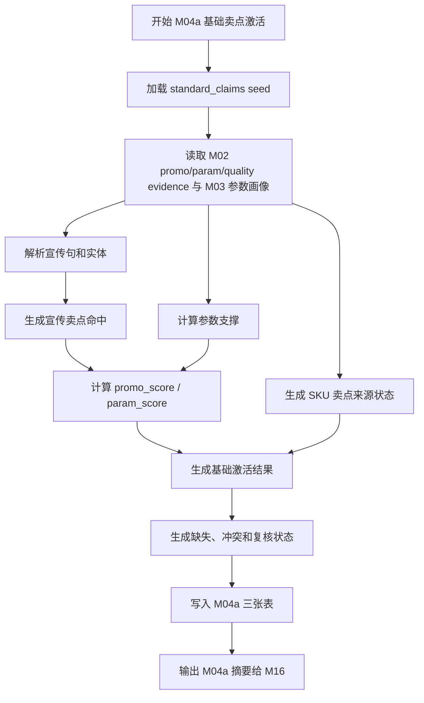

# M04a 基础卖点激活详细设计

## 1. 文档定位

本文是 CatForge 彩电核心三竞品真实数据 v2 的 M04a 模块详细设计。它承接：

- `sop_requirements/M04a_base_claim_activation_requirements.md`
- `sop_requirements/00_real_data_baseline.md`
- `sop_detailed_design/00_architecture_data_dictionary_design.md`
- `sop_detailed_design/M02_evidence_atom_design.md`
- `sop_detailed_design/M03_param_extraction_design.md`
- `cankao/CatForge_竞品生成SOP_详细指导_v1.md`
- `cankao/catforge_sop_md/modules/M04_宣传卖点切分、实体抽取与标准卖点激活.md`
- `apps/api-server/app/rules/tv_core3_mvp_seed_v0_2.json`

M04a 的目标是基于“标准参数 + 结构化宣传卖点”计算 SKU 的标准卖点基础激活分，形成不含评论验证、不含市场价值分层的卖点能力底座。

本文写到可拆开发任务的程度，不包含代码、迁移或部署动作。

## 2. 模块职责

### 2.1 解决的问题

M04a 负责解决五类工程问题：

| 问题 | M04a 输出 |
| --- | --- |
| 原始宣传语需要映射到标准卖点 | `core3_extract_claim_hit` |
| 标准参数需要支撑技术型卖点 | `param_score` 和参数 evidence |
| SKU 可能没有结构化宣传卖点 | `core3_sku_claim_source_status` |
| 基础卖点需要区分参数支撑和宣传支撑 | `core3_sku_claim_activation_base` |
| 下游需要知道缺失、冲突和复核 | `missing_signals`、`conflict_flags`、`review_status` |

M04a 只输出基础激活，不输出评论增强后的最终卖点。

### 2.2 不解决的问题

M04a 严禁做以下事情：

| 禁止事项 | 原因 | 归属模块 |
| --- | --- | --- |
| 消费评论原文、评论句或评论主题 | 评论验证由 M05/M06/M04b 负责 | M05/M06/M04b |
| 用评论证明卖点成立 | 避免与 M04b 循环和越界 | M04b |
| 判断卖点用户感知强弱 | 需要评论信号和样本质量 | M04b/M06 |
| 做战场内卖点价值分层 | 需要战场上下文和市场证据 | M11.5 |
| 用市场量价激活性价比 | 市场画像和价值分层在后续 | M07/M11.5 |
| 判断用户任务、客群、战场 | M04a 是这些模块的上游 | M09-M11 |
| 生成竞品候选或评分 | 需要画像、候选池和评分 | M12-M14 |
| 把没有结构化宣传解释为没有卖点 | 缺失只代表宣传数据未覆盖 | 全链路原则 |
| 为未覆盖 SKU 伪造 promo evidence | 证据必须来自真实数据 | 不允许 |

### 2.3 输入边界

| 输入 | 来源 | 用途 |
| --- | --- | --- |
| `promo_raw` evidence | M02 `core3_evidence_atom` | 原始结构化卖点文本 |
| `promo_sentence` evidence | M02 `core3_evidence_atom` | 宣传句级匹配和实体抽取 |
| `param_raw` evidence | M02 `core3_evidence_atom` | 参数证据引用 |
| `quality_issue` evidence | M02 `core3_evidence_atom` | 卖点覆盖缺失、参数 unknown、冲突降权 |
| `core3_extract_param_value` | M03 | SKU 标准参数值 |
| `core3_sku_param_profile` | M03 | SKU 参数画像和核心参数摘要 |
| 标准卖点 seed | `standard_claims` | 标准卖点定义、关键词、参数规则、映射关系 |

M04a 不读取：

- `comment_raw`
- `comment_sentence`
- `comment_dimension`
- `core3_comment_*`
- 市场画像和市场信号
- 任务、客群、战场结果

### 2.4 输出边界

M04a 输出三张表：

| 表 | 作用 |
| --- | --- |
| `core3_extract_claim_hit` | 宣传句或参数支撑命中的标准卖点候选明细 |
| `core3_sku_claim_source_status` | SKU 的结构化卖点来源覆盖状态 |
| `core3_sku_claim_activation_base` | SKU 标准卖点基础激活结果 |

M04a 不输出最终 `core3_sku_claim_activation`。最终卖点激活由 M04b 在评论验证后生成。

## 3. 标准卖点资产设计

### 3.1 资产来源

MVP 标准卖点资产首版来自：

```text
apps/api-server/app/rules/tv_core3_mvp_seed_v0_2.json
```

其中 `standard_claims` 当前覆盖 20 类彩电卖点。开发阶段可以先通过 `StdClaimSeedLoader` 从 JSON 加载，但 M04a 输出必须记录：

- `seed_version`
- `asset_version`
- `rule_version`

标准卖点 seed 是预制资产；真实宣传句、参数支撑和覆盖状态必须从数据中抽取。

### 3.2 标准卖点字段

每个标准卖点至少包含：

| 字段 | 类型 | 说明 |
| --- | --- | --- |
| `claim_code` | text | 稳定卖点编码 |
| `claim_name` | text | 中文卖点名 |
| `definition` | text | 业务定义 |
| `claim_group` | text | `picture`、`gaming`、`motion`、`eye_care`、`smart`、`audio`、`design`、`value`、`service` |
| `aliases` | array | 宣传同义表达 |
| `keywords` | array | 通用关键词 |
| `promo_keywords` | array | 宣传文本关键词 |
| `source_types` | array | seed 声明可接受来源 |
| `evidence_requirement` | array | 证据要求 |
| `supporting_param_codes` | array | 支撑参数 |
| `mapped_param_codes` | array | 关联参数 |
| `mapped_task_codes` | array | 可支撑任务 |
| `mapped_battlefield_codes` | array | 可支撑战场 |
| `activation_rule` | object | 激活规则 |
| `activation_weights` | object | seed 建议权重 |

如果 seed 中 `source_types` 包含 `comment_text`，M04a 只把它视为 M04b 的后续可用来源，M04a 本模块不得读取评论。

### 3.3 MVP 标准卖点范围

首版覆盖以下 20 类标准卖点：

| 卖点编码 | 中文卖点 | M04a 激活原则 |
| --- | --- | --- |
| `CLAIM_LARGE_SCREEN_IMMERSION` | 大屏沉浸观影 | 可由尺寸参数低/中置信支撑，有宣传更强 |
| `CLAIM_MINI_LED_BACKLIGHT` | Mini LED 背光 | 可由 Mini LED 参数强支撑 |
| `CLAIM_OLED_SELF_LIT` | OLED 自发光 | 可由 OLED 参数强支撑 |
| `CLAIM_QLED_WIDE_COLOR` | 量子点广色域 | 参数或宣传均可支撑 |
| `CLAIM_HIGH_BRIGHTNESS_HDR` | 高亮 HDR | 亮度/HDR 参数为主 |
| `CLAIM_FINE_LOCAL_DIMMING` | 精细分区控光 | 分区数/局部调光参数为主 |
| `CLAIM_HIGH_REFRESH_RATE` | 高刷新率 | 刷新率参数为主，口径不明需降权 |
| `CLAIM_GAMING_LOW_LATENCY` | 低延迟游戏 | ALLM/VRR/低延迟参数或宣传支撑 |
| `CLAIM_HDMI_2_1_GAMING` | HDMI 2.1 游戏接口 | HDMI 2.1 参数或宣传支撑 |
| `CLAIM_SPORTS_MOTION_SMOOTH` | 体育运动流畅 | M04a 只做参数/宣传基础，评论体验留给 M04b |
| `CLAIM_EYE_CARE_COMFORT` | 护眼舒适 | 护眼参数或宣传支撑 |
| `CLAIM_ELDER_FRIENDLY_SMART` | 长辈友好智能 | 需要宣传或明确参数，评论验证留给 M04b |
| `CLAIM_SMART_VOICE_EASE` | 智能语音易用 | 语音/内存参数和宣传支撑 |
| `CLAIM_NO_AD_OR_CLEAN_SYSTEM` | 清爽系统/少广告 | M04a 仅接收宣传/参数，不用评论 |
| `CLAIM_IMMERSIVE_AUDIO` | 沉浸音效 | 音频参数或宣传支撑 |
| `CLAIM_DOLBY_CINEMA_AUDIO` | 杜比影音 | Dolby 参数或宣传支撑 |
| `CLAIM_THIN_DESIGN` | 超薄美学设计 | 依赖宣传，参数支撑弱 |
| `CLAIM_ENERGY_SAVING` | 节能省电 | 依赖能效参数或宣传 |
| `CLAIM_VALUE_FOR_MONEY` | 高性价比 | M04a 不用市场，不强激活；可保留宣传命中 |
| `CLAIM_INSTALLATION_SERVICE_ASSURANCE` | 安装服务保障 | M04a 仅可用服务宣传，评论验证留给 M04b |

## 4. 数据模型设计

### 4.1 `core3_extract_claim_hit`

#### 4.1.1 表用途

保存宣传句、宣传原文、参数支撑命中的标准卖点候选明细。该表是解释“为什么一个卖点进入基础激活候选”的明细层。

#### 4.1.2 字段契约

| 字段 | 类型建议 | 必填 | 说明 |
| --- | --- | --- | --- |
| `claim_hit_id` | `text` | 是 | 主键，建议 `m04ahit_<uuid>` |
| `project_id` | `text` | 是 | 项目 ID |
| `category_code` | `text` | 是 | `TV` |
| `batch_id` | `text` | 是 | 批次 |
| `run_id` | `text` | 否 | 全链路运行 ID |
| `module_run_id` | `text` | 否 | M04a 运行 ID |
| `sku_code` | `text` | 是 | SKU |
| `model_name` | `text` | 否 | 型号 |
| `claim_code` | `text` | 是 | 标准卖点编码 |
| `claim_name` | `text` | 是 | 标准卖点中文名 |
| `claim_group` | `text` | 是 | 卖点组 |
| `hit_source_type` | `text` | 是 | `promo_raw`、`promo_sentence`、`param_support`、`quality_gap` |
| `source_sentence_key` | `text` | 否 | 宣传句证据键 |
| `claim_seq` | `integer` | 否 | 卖点序号 |
| `sentence_seq` | `integer` | 否 | 句序号 |
| `claim_fragment` | `text` | 否 | 命中的宣传片段 |
| `matched_keywords` | `jsonb` | 是 | 命中关键词 |
| `title_hint` | `text` | 否 | 标题弱提示 |
| `extracted_entity_json` | `jsonb` | 是 | 技术实体和数值实体 |
| `matched_param_codes` | `jsonb` | 是 | 命中的支撑参数 |
| `match_method` | `text` | 是 | `exact_alias`、`keyword`、`entity`、`param_support`、`quality_gap` |
| `promo_evidence_ids` | `jsonb` | 是 | 宣传 evidence |
| `param_evidence_ids` | `jsonb` | 是 | 参数 evidence |
| `quality_evidence_ids` | `jsonb` | 是 | 质量 evidence |
| `match_confidence` | `numeric` | 是 | 命中置信度 |
| `quality_flags` | `jsonb` | 是 | 抽象宣传、缺参数、冲突等 |
| `review_required` | `boolean` | 是 | 是否复核 |
| `review_status` | `text` | 是 | `auto_pass`、`review_required`、`approved`、`rejected`、`waived` |
| `hit_hash` | `text` | 是 | 命中结果 hash |
| `seed_version` | `text` | 是 | seed 版本 |
| `rule_version` | `text` | 是 | 规则版本 |
| `created_at` | `timestamptz` | 是 | 创建时间 |
| `updated_at` | `timestamptz` | 是 | 更新时间 |

#### 4.1.3 主键、唯一键和索引

| 类型 | 字段 |
| --- | --- |
| 主键 | `claim_hit_id` |
| 唯一键 | `batch_id, sku_code, claim_code, hit_source_type, coalesce(source_sentence_key,''), rule_version` |
| 普通索引 | `project_id, category_code, batch_id` |
| 普通索引 | `sku_code, claim_code` |
| 普通索引 | `hit_source_type` |
| 普通索引 | `review_required` |
| GIN 索引 | `matched_keywords`、`extracted_entity_json`、`promo_evidence_ids`、`param_evidence_ids`、`quality_flags` |

#### 4.1.4 `extracted_entity_json`

```json
{
  "technology_entities": ["Mini LED", "HDMI2.1"],
  "numeric_entities": [
    {"value": 5200, "unit": "nits", "raw": "5200nits"},
    {"value": 3500, "unit": "zones", "raw": "3500分区"}
  ],
  "entity_quality": {
    "abstract_promo_only": false,
    "unit_uncertain": false,
    "scope_uncertain": false
  }
}
```

### 4.2 `core3_sku_claim_source_status`

#### 4.2.1 表用途

记录 SKU 的结构化卖点来源覆盖状态，明确“有宣传卖点”“缺结构化宣传卖点”“宣传不可用”或“宣传与参数冲突”。

#### 4.2.2 字段契约

| 字段 | 类型建议 | 必填 | 说明 |
| --- | --- | --- | --- |
| `claim_source_status_id` | `text` | 是 | 主键，建议 `m04asrc_<uuid>` |
| `project_id` | `text` | 是 | 项目 ID |
| `category_code` | `text` | 是 | `TV` |
| `batch_id` | `text` | 是 | 批次 |
| `run_id` | `text` | 否 | 全链路运行 ID |
| `module_run_id` | `text` | 否 | M04a 运行 ID |
| `sku_code` | `text` | 是 | SKU |
| `model_name` | `text` | 否 | 型号 |
| `claim_source_status` | `text` | 是 | 来源状态 |
| `structured_claim_count` | `integer` | 是 | 结构化卖点条数 |
| `claim_sentence_count` | `integer` | 是 | 宣传句数 |
| `promo_evidence_count` | `integer` | 是 | 宣传 evidence 数 |
| `param_only_claim_count` | `integer` | 是 | 仅参数支撑卖点数 |
| `quality_evidence_ids` | `jsonb` | 是 | 质量 evidence |
| `missing_signals` | `jsonb` | 是 | 缺失信号 |
| `conflict_summary_json` | `jsonb` | 是 | 宣传参数冲突摘要 |
| `status_note` | `text` | 是 | 中文说明 |
| `review_required` | `boolean` | 是 | 是否复核 |
| `review_status` | `text` | 是 | 复核状态 |
| `status_hash` | `text` | 是 | 状态 hash |
| `seed_version` | `text` | 是 | seed 版本 |
| `rule_version` | `text` | 是 | 规则版本 |
| `created_at` | `timestamptz` | 是 | 创建时间 |
| `updated_at` | `timestamptz` | 是 | 更新时间 |

#### 4.2.3 主键、唯一键和索引

| 类型 | 字段 |
| --- | --- |
| 主键 | `claim_source_status_id` |
| 唯一键 | `batch_id, sku_code, seed_version, rule_version` |
| 普通索引 | `project_id, category_code, batch_id` |
| 普通索引 | `sku_code` |
| 普通索引 | `claim_source_status` |
| 普通索引 | `review_required` |
| GIN 索引 | `quality_evidence_ids`、`missing_signals`、`conflict_summary_json` |

#### 4.2.4 来源状态枚举

| 值 | 含义 |
| --- | --- |
| `has_structured_claim` | 有结构化宣传卖点 |
| `missing_structured_claim` | 没有结构化宣传卖点，但有参数或其它数据 |
| `claim_data_insufficient` | 宣传卖点为空、不可读或质量过低 |
| `claim_conflict` | 宣传与参数明显冲突 |

85E7Q 当前必须是 `missing_structured_claim`，不是 `claim_data_insufficient`，也不是“无卖点”。

### 4.3 `core3_sku_claim_activation_base`

#### 4.3.1 表用途

保存 SKU 对标准卖点的基础激活结果，不包含评论验证分。该表是 M04b、M08、M09-M15 使用卖点能力的主输入之一。

#### 4.3.2 字段契约

| 字段 | 类型建议 | 必填 | 说明 |
| --- | --- | --- | --- |
| `claim_activation_base_id` | `text` | 是 | 主键，建议 `m04abase_<uuid>` |
| `project_id` | `text` | 是 | 项目 ID |
| `category_code` | `text` | 是 | `TV` |
| `batch_id` | `text` | 是 | 批次 |
| `run_id` | `text` | 否 | 全链路运行 ID |
| `module_run_id` | `text` | 否 | M04a 运行 ID |
| `sku_code` | `text` | 是 | SKU |
| `model_name` | `text` | 否 | 型号 |
| `claim_code` | `text` | 是 | 标准卖点 |
| `claim_name` | `text` | 是 | 中文卖点名 |
| `claim_group` | `text` | 是 | 卖点组 |
| `claim_type` | `text` | 是 | `technical`、`experience`、`service`、`value`、`design`、`mixed` |
| `param_score` | `numeric` | 是 | 参数支撑分 |
| `promo_score` | `numeric` | 是 | 宣传支撑分 |
| `base_activation_score` | `numeric` | 是 | 基础激活分 |
| `activation_level` | `text` | 是 | `high`、`medium`、`low`、`unknown` |
| `activation_basis` | `text` | 是 | `param_and_promo`、`param_only`、`promo_only`、`insufficient` |
| `param_support_json` | `jsonb` | 是 | 参数支撑详情 |
| `promo_support_json` | `jsonb` | 是 | 宣传支撑详情 |
| `missing_signals` | `jsonb` | 是 | 缺失信号 |
| `conflict_flags` | `jsonb` | 是 | 冲突标记 |
| `confidence` | `numeric` | 是 | 基础激活置信度 |
| `confidence_level` | `text` | 是 | `high`、`medium`、`low`、`unknown` |
| `evidence_ids` | `jsonb` | 是 | 参数和宣传 evidence |
| `param_evidence_ids` | `jsonb` | 是 | 参数 evidence |
| `promo_evidence_ids` | `jsonb` | 是 | 宣传 evidence |
| `quality_evidence_ids` | `jsonb` | 是 | 质量 evidence |
| `claim_hit_ids` | `jsonb` | 是 | 命中明细 |
| `review_required` | `boolean` | 是 | 是否复核 |
| `review_status` | `text` | 是 | `auto_pass`、`review_required`、`approved`、`rejected`、`waived` |
| `review_reason` | `text` | 否 | 中文复核原因 |
| `activation_hash` | `text` | 是 | 激活结果 hash |
| `seed_version` | `text` | 是 | seed 版本 |
| `rule_version` | `text` | 是 | 规则版本 |
| `created_at` | `timestamptz` | 是 | 创建时间 |
| `updated_at` | `timestamptz` | 是 | 更新时间 |

#### 4.3.3 主键、唯一键和索引

| 类型 | 字段 |
| --- | --- |
| 主键 | `claim_activation_base_id` |
| 唯一键 | `batch_id, sku_code, claim_code, seed_version, rule_version` |
| 普通索引 | `project_id, category_code, batch_id` |
| 普通索引 | `sku_code, claim_code` |
| 普通索引 | `claim_group` |
| 普通索引 | `activation_level` |
| 普通索引 | `activation_basis` |
| 普通索引 | `review_required` |
| 普通索引 | `activation_hash` |
| GIN 索引 | `evidence_ids`、`missing_signals`、`conflict_flags`、`param_support_json`、`promo_support_json` |

#### 4.3.4 `param_support_json`

```json
{
  "matched_params": [
    {
      "param_code": "mini_led_flag",
      "value": true,
      "confidence": 0.95,
      "evidence_ids": ["ev_param_001"],
      "quality_flags": []
    }
  ],
  "required_param_status": "satisfied",
  "supporting_param_status": "partial"
}
```

#### 4.3.5 `promo_support_json`

```json
{
  "matched_sentences": [
    {
      "claim_hit_id": "m04ahit_...",
      "sentence_text": "Mini LED 高亮画质表现",
      "matched_keywords": ["Mini LED"],
      "confidence": 0.86,
      "evidence_ids": ["ev_promo_001"]
    }
  ],
  "abstract_promo_only": false,
  "title_hint": "功能价值"
}
```

## 5. 处理流程设计

### 5.1 总体流程图



### 5.2 步骤 1：加载标准卖点 seed

输入：

- `standard_claims`
- `seed_version`
- `rule_version`

校验：

- 每个 claim 必须有 `claim_code`、`claim_name`、`claim_group`。
- `supporting_param_codes` 或 `mapped_param_codes` 必须是数组。
- `activation_rule` 缺失时可以降级到关键词和参数映射规则，但必须记录 warning。

### 5.3 步骤 2：读取输入证据和参数画像

按批次和 SKU 读取：

- `promo_raw` evidence。
- `promo_sentence` evidence。
- `param_raw` evidence。
- `quality_issue` evidence 中的 `claim_coverage_missing`、`unknown_value`、参数冲突。
- `core3_extract_param_value`。
- `core3_sku_param_profile`。

过滤：

- 只消费 `is_current=true` 且 `evidence_status=current` 的 M02 evidence。
- 只消费成功的 M03 参数画像。
- 不消费任何 `comment_*` evidence。

### 5.4 步骤 3：生成 SKU 卖点来源状态

判断规则：

| 条件 | 状态 |
| --- | --- |
| `promo_raw` 或 `promo_sentence` 数量 > 0 且质量可用 | `has_structured_claim` |
| 宣传 evidence 数量 = 0，但参数画像存在 | `missing_structured_claim` |
| 宣传 evidence 存在但文本为空、低质量或全部 skipped | `claim_data_insufficient` |
| 宣传命中与关键参数明显冲突 | `claim_conflict` |

质量说明必须用中文表达。

示例：

```text
该 SKU 本批没有结构化宣传卖点数据，但参数和评论等其它数据存在；后续技术型卖点只能基于参数降级判断，不能视为宣传明确。
```

### 5.5 步骤 4：宣传句解析和实体抽取

对 `promo_sentence` evidence 执行：

1. 保留 `claim_seq`、`sentence_seq`、`sentence_text`。
2. 读取 M01 的 `sentence_role_hint` 或 M02 payload 中的 `title_hint`。
3. 匹配 `aliases`、`keywords`、`promo_keywords`。
4. 抽取技术实体和数值实体。
5. 生成 `core3_extract_claim_hit`。

抽取实体：

| 实体类型 | 示例 |
| --- | --- |
| 显示技术 | Mini LED、OLED、QLED、ULED |
| 画质 | HDR、XDR、高亮、色域、控黑 |
| 背光控光 | 分区、局部调光、光晕控制 |
| 游戏连接 | Hz、HDMI2.1、VRR、ALLM、低延迟 |
| 护眼 | 低蓝光、无频闪、高频调光 |
| 音频 | Dolby、Atmos、W、声道、低音 |
| 智能 | AI、语音、内存、系统流畅 |
| 服务 | 安装、送装、售后 |

标题结构只作为弱提示，不能单独高置信激活。

### 5.6 步骤 5：参数支撑计算

对每个 SKU 和标准卖点读取 seed 的 `supporting_param_codes`、`mapped_param_codes`、`activation_rule`。

参数支撑分：

```text
param_score = weighted_sum(
  required_param_match_score,
  supporting_param_match_score,
  param_confidence,
  param_quality_penalty
)
```

典型参数规则：

| 卖点 | 参数支撑 |
| --- | --- |
| Mini LED 背光 | `mini_led_flag=true`、`backlight_type=MiniLED` |
| 高亮 HDR | `peak_brightness_nits >= 1000`、`hdr_format_list` |
| 精细分区控光 | `dimming_zones >= 100`、`local_dimming_flag=true` |
| 高刷新率 | `native_refresh_rate_hz >= 120` 或 `system_refresh_rate_hz >= 120` |
| HDMI 2.1 游戏接口 | `hdmi_2_1_ports >= 1`、`full_bandwidth_hdmi_flag=true` |
| 低延迟游戏 | `input_lag_ms <= 20`、`vrr_flag=true`、`allm_flag=true` |
| 护眼舒适 | `eye_dimming_freq_hz >= 1000`、`low_blue_light_flag=true`、`flicker_free_flag=true` |
| 智能语音易用 | `voice_control_flag=true`、`ram_gb >= 3` |
| 沉浸音效 | `speaker_power_w >= 40`、`speaker_channel`、`subwoofer_flag=true` |

参数支撑不是最终用户感知，只能作为基础能力。

### 5.7 步骤 6：宣传支撑计算

宣传支撑分：

```text
promo_score = weighted_sum(
  exact_alias_hit,
  keyword_hit,
  entity_hit,
  numeric_entity_hit,
  title_hint_bonus,
  promo_quality_penalty
)
```

规则：

| 情况 | 处理 |
| --- | --- |
| 精确命中 aliases | 高宣传支撑 |
| 命中多个关键词并有实体 | 中高宣传支撑 |
| 只有抽象词，如“旗舰体验” | 低宣传支撑 |
| 有数值实体但参数冲突 | 宣传支撑保留但降权 |
| 无结构化宣传 | `promo_score=0`，不伪造 evidence |

### 5.8 步骤 7：基础激活计算

M04a 不使用 `comment_score`。

技术型卖点：

```text
base_activation_score =
  param_score * 0.65
  + promo_score * 0.35
  - conflict_penalty
  - missing_signal_penalty
```

体验/设计/服务/价值型卖点：

```text
base_activation_score =
  param_score * 0.35
  + promo_score * 0.65
  - conflict_penalty
  - missing_signal_penalty
```

对 seed 中 `activation_weights` 的处理：

- 如果 seed 的 comment 权重大于 0，M04a 必须把 comment 权重暂时剔除并归一化到 param/promo。
- 原始 seed 权重保留到 `promo_support_json` 或 `param_support_json` 的 `seed_weight_snapshot` 中，便于 M04b 接续。

### 5.9 步骤 8：激活等级

| 等级 | 分数 | 说明 |
| --- | ---: | --- |
| `high` | `>= 0.75` | 参数和/或宣传支撑强 |
| `medium` | `>= 0.55` | 有一定支撑，但可能缺宣传或口径待复核 |
| `low` | `>= 0.35` | 弱支撑或证据不足 |
| `unknown` | `< 0.35` | 不足以激活 |

如果 `activation_basis=param_only`，默认最高等级不超过 `medium`，除非业务评审明确允许。

### 5.10 步骤 9：写入和幂等

写入顺序：

1. `core3_sku_claim_source_status`
2. `core3_extract_claim_hit`
3. `core3_sku_claim_activation_base`

幂等规则：

- 同一 `batch_id + sku_code + claim_code + seed_version + rule_version` 只生成一条基础激活。
- 同一宣传句对同一标准卖点只生成一条 hit。
- 重跑同一 batch 时，如果 hash 一致可跳过；hash 不一致则失败并要求新批次或人工处理。

## 6. 卖点分类和激活策略

### 6.1 卖点类型

M04a 将 seed `claim_group` 转成 `claim_type`：

| `claim_group` | `claim_type` | M04a 策略 |
| --- | --- | --- |
| `picture` | `technical` 或 `mixed` | 参数可强支撑 |
| `gaming` | `technical` 或 `mixed` | 参数可强支撑，口径需复核 |
| `motion` | `experience` | 参数只能基础支撑，评论验证后增强 |
| `eye_care` | `mixed` | 参数和宣传可支撑 |
| `smart` | `experience` 或 `mixed` | 参数只能基础支撑，体验需后续验证 |
| `audio` | `mixed` | 参数和宣传基础支撑，体验需后续验证 |
| `design` | `design` | 主要依赖宣传，不用评论 |
| `value` | `value` | M04a 不用市场，只保留宣传/参数基础 |
| `service` | `service` | M04a 只用服务宣传，评论验证后增强 |

### 6.2 参数-only 策略

没有结构化宣传时，技术型卖点可基于强参数形成低/中置信基础激活。

允许 param-only 的卖点：

- `CLAIM_LARGE_SCREEN_IMMERSION`
- `CLAIM_MINI_LED_BACKLIGHT`
- `CLAIM_OLED_SELF_LIT`
- `CLAIM_QLED_WIDE_COLOR`
- `CLAIM_HIGH_BRIGHTNESS_HDR`
- `CLAIM_FINE_LOCAL_DIMMING`
- `CLAIM_HIGH_REFRESH_RATE`
- `CLAIM_HDMI_2_1_GAMING`
- `CLAIM_EYE_CARE_COMFORT`
- `CLAIM_IMMERSIVE_AUDIO`
- `CLAIM_DOLBY_CINEMA_AUDIO`

需要谨慎或不允许 param-only 强激活的卖点：

- `CLAIM_SPORTS_MOTION_SMOOTH`
- `CLAIM_ELDER_FRIENDLY_SMART`
- `CLAIM_NO_AD_OR_CLEAN_SYSTEM`
- `CLAIM_THIN_DESIGN`
- `CLAIM_VALUE_FOR_MONEY`
- `CLAIM_INSTALLATION_SERVICE_ASSURANCE`

### 6.3 missing signals

常见缺失信号：

| 缺失信号 | 含义 |
| --- | --- |
| `missing_structured_claim` | 无结构化宣传卖点 |
| `missing_promo_evidence` | 无宣传 evidence |
| `missing_required_param` | 缺关键参数 |
| `param_unknown` | 参数值 unknown |
| `scope_uncertain` | 参数口径不明确 |
| `unit_uncertain` | 单位不明确 |
| `comment_validation_pending` | 评论验证待 M04b |
| `market_value_pending` | 价值/性价比待 M07/M11.5 |

## 7. 增量策略

### 7.1 触发条件

| 输入变化 | M04a 动作 | 下游影响 |
| --- | --- | --- |
| `promo_raw` evidence 新增/变化 | 重算对应 SKU 宣传命中和基础激活 | M04b、M08-M16 |
| `promo_sentence` evidence 新增/变化 | 重算句级命中和实体抽取 | M04b、M08-M16 |
| `core3_extract_param_value` 变化 | 重算对应 SKU 参数支撑和基础激活 | M04b、M08-M16 |
| `core3_sku_param_profile` 变化 | 重算 SKU 基础激活 | M04b、M08-M16 |
| 标准卖点 seed 变化 | 重算受影响卖点映射 | M04a-M16 |
| quality evidence 变化 | 更新缺失、冲突和置信度 | M04b、M08、M16 |
| 评论变化 | 不触发 M04a | M05/M06/M04b |

### 7.2 hash 设计

`hit_hash`：

```text
hash(sku_code, claim_code, hit_source_type, source_sentence_key,
     matched_keywords, extracted_entity_json, promo_evidence_ids,
     param_evidence_ids, quality_flags, seed_version, rule_version)
```

`status_hash`：

```text
hash(sku_code, claim_source_status, structured_claim_count,
     claim_sentence_count, missing_signals, conflict_summary_json,
     seed_version, rule_version)
```

`activation_hash`：

```text
hash(sku_code, claim_code, param_score, promo_score,
     base_activation_score, activation_basis, missing_signals,
     conflict_flags, evidence_ids, seed_version, rule_version)
```

如果 `activation_hash` 未变化，不建议触发下游重算。

### 7.3 历史保留

M04a 输出按 `batch_id` 和版本保留历史。旧基础激活不物理删除。

查询 current 基础卖点时由 M16 或 repository 使用：

1. 已验收批次优先。
2. 最新成功 M04a run。
3. 同一 `sku_code + claim_code + seed_version + rule_version` 最新 `created_at`。

## 8. 服务、任务和 API 边界

### 8.1 后端包建议

建议后续开发放在：

```text
apps/api-server/app/services/core3_real_data/base_claim_activation_service.py
```

配套组件：

| 组件 | 职责 |
| --- | --- |
| `StdClaimSeedLoader` | 加载和校验标准卖点 seed |
| `ClaimEvidenceReader` | 读取 M02 promo/param/quality evidence |
| `SkuParamProfileReader` | 读取 M03 参数值和参数画像 |
| `ClaimSourceStatusBuilder` | 生成 SKU 卖点来源状态 |
| `PromoClaimMatcher` | 宣传句到标准卖点匹配 |
| `ClaimEntityExtractor` | 技术实体和数值实体抽取 |
| `ParamSupportScorer` | 参数支撑打分 |
| `PromoSupportScorer` | 宣传支撑打分 |
| `ClaimActivationBaseScorer` | 基础激活分和等级计算 |
| `ClaimActivationRepository` | 写入 M04a 三张表 |
| `BaseClaimActivationRunner` | 编排 M04a 全流程 |

### 8.2 任务入口

```text
BaseClaimActivationRunner.run(
  project_id,
  category_code,
  batch_id,
  run_id=None,
  module_run_id=None,
  seed_version="tv_core3_mvp_seed_v0_2",
  rule_version="m04a_claim_base_v1",
  mode="incremental"
)
```

返回：

```json
{
  "batch_id": "m00_...",
  "module_code": "M04a",
  "status": "completed_with_warning",
  "sku_source_status_count": 35,
  "claim_hit_count": 120,
  "activation_base_count": 420,
  "param_only_count": 80,
  "missing_structured_claim_sku_count": 30,
  "review_required": true
}
```

### 8.3 API 设计

M04a API 是生产线运营和数据排查接口，不是高层报告接口。

| 方法 | 路径 | 用途 |
| --- | --- | --- |
| `POST` | `/api/mvp/core3/v2/projects/{project_id}/batches/{batch_id}/claims/base/run` | 手工触发 M04a |
| `GET` | `/api/mvp/core3/v2/projects/{project_id}/batches/{batch_id}/claims/source-status` | 查看 SKU 卖点来源覆盖 |
| `GET` | `/api/mvp/core3/v2/projects/{project_id}/skus/{sku_code}/claims/base` | 查看 SKU 基础卖点 |
| `GET` | `/api/mvp/core3/v2/projects/{project_id}/batches/{batch_id}/claims/hits` | 查看宣传命中明细 |

高层页面不得直接展示内部 `claim_code`、规则分、hash 和 UUID。M15 应转成业务语言，并明确“参数支撑”“宣传支撑”“评论验证待补”。

## 9. 质量和复核规则

### 9.1 warning 条件

| 条件 | 输出 |
| --- | --- |
| SKU 无结构化宣传卖点 | `missing_structured_claim` |
| 技术型卖点仅参数支撑 | `param_only` |
| 宣传命中但缺关键参数 | `missing_required_param` |
| 抽象宣传词无实体 | `abstract_promo_only` |
| 刷新率、HDMI、亮度等参数口径不清 | `scope_uncertain` 或 `unit_uncertain` |
| 服务/价值型卖点缺评论或市场验证 | `validation_pending` |

### 9.2 review_required 条件

| 条件 | 说明 |
| --- | --- |
| 新营销词高频出现但未匹配标准卖点 | 进入 seed 复核 |
| 一个宣传句命中多个标准卖点且分数接近 | 人工确认 |
| 技术型卖点只有宣传没有参数支撑 | 需要复核 |
| 参数和宣传冲突 | 需要复核 |
| 核心 SKU 结构化卖点缺失 | 例如 85E7Q |
| `param_only` 卖点会影响核心竞品判断 | M16 复核 |
| 体验/服务/价值型卖点只有弱宣传或无宣传 | 不强激活，进入复核或 pending |

### 9.3 blocked 条件

| 条件 | 处理 |
| --- | --- |
| 标准卖点 seed 无法加载或结构非法 | M04a 失败 |
| M02 evidence 不可读 | M04a 失败 |
| M03 参数画像不可读 | M04a 失败 |
| 输出表写入失败 | M04a 失败 |
| 同一 SKU/claim current 基础激活唯一性破坏 | M04a 失败或阻断下游 |

## 10. 真实数据样例处理预期

### 10.1 当前样例总体预期

当前真实样例：

- `selling_points_data` 65 行。
- 只覆盖 5 个型号。
- 每个覆盖型号有 `卖点1` 到 `卖点13`。
- 35 个量价型号中约 30 个没有结构化卖点。

M04a 应输出：

| 输出 | 预期 |
| --- | --- |
| 卖点来源状态 | 5 个 `has_structured_claim`，其它参数覆盖 SKU 多为 `missing_structured_claim` |
| 宣传命中 | 只对有 promo evidence 的 SKU 生成 |
| 参数基础激活 | 技术型卖点可基于 M03 参数生成低/中置信基础激活 |
| 质量提示 | 卖点覆盖缺失、param_only、口径不明 |

### 10.2 85E7Q 样例要求

`TV00029115 / 85E7Q`：

| 数据事实 | M04a 处理 |
| --- | --- |
| 周销 46 行 | M04a 不消费 |
| 属性 81 行 | 从 M03 参数画像消费 |
| 结构化卖点 0 行 | `claim_source_status=missing_structured_claim` |
| 评论 3621 行 | M04a 不消费 |
| 尺寸 85 | 可支撑大屏沉浸基础激活 |
| Mini LED 是 | 可支撑 Mini LED 背光基础激活 |
| 亮度 5200 | 可支撑高亮 HDR，但单位推断需保留质量标记 |
| 分区背光 3500 | 可支撑精细分区控光 |
| 屏幕刷新率 300HZ | 可支撑高刷新率基础激活，但系统/倍频口径需降权 |
| HDMI参数 HDMI2.1 | 可支撑 HDMI2.1 能力，但不伪造端口数 |

85E7Q 不能生成任何伪造的 `promo_evidence_ids`。

### 10.3 不应激活的示例

对 85E7Q，M04a 不应强激活：

- 安装服务保障。
- 高性价比。
- 体育运动流畅的用户感知。
- 长辈友好智能的用户感知。
- 清爽系统/少广告。

这些需要评论、市场或宣传证据，由 M04b、M07、M11.5 或后续模块处理。

## 11. 与前后模块接口

### 11.1 从 M02 接收

M04a 读取：

- `promo_raw`
- `promo_sentence`
- `param_raw`
- `quality_issue`
- `evidence_id`
- `evidence_payload_json`
- `base_confidence`
- `quality_flags`

### 11.2 从 M03 接收

M04a 读取：

- `core3_extract_param_value`
- `core3_sku_param_profile`
- `param_code`
- `normalized_value`
- `value_level`
- `confidence`
- `quality_flags`
- `evidence_ids`

### 11.3 给 M04b

M04b 从 `core3_sku_claim_activation_base` 开始，只做评论验证增强。

M04a 承诺：

- 不包含 `comment_score`。
- 不消费评论 evidence。
- `activation_basis` 明确区分参数、宣传、缺失。
- `missing_signals` 明确告诉 M04b 哪些卖点需要评论验证。

### 11.4 给 M08

M08 可使用基础卖点作为 SKU 综合画像的一部分。

M08 必须看到：

- `base_activation_score`
- `activation_basis`
- `missing_signals`
- `confidence`
- `evidence_ids`

### 11.5 给 M09-M11.5

用户任务、目标客群、价值战场和战场内卖点价值分层可以引用 M04a 基础卖点，但必须结合 M05/M06 评论和 M07 市场。

仅参数基础激活不能等同于用户任务成立。

### 11.6 给 M12-M15

竞品解释中的卖点证据必须区分：

- 参数支撑。
- 宣传支撑。
- 评论验证。
- 数据缺口。

M15 面向高层展示时不得把 `param_only` 写成“宣传卖点明确”。

### 11.7 给 M16

M16 使用：

- 结构化卖点缺失状态。
- 参数-only 激活数量。
- 参数宣传冲突。
- 低置信基础激活。
- `activation_hash`。

M16 决定复核、降级或触发下游。

## 12. 测试设计

### 12.1 单元测试

| 测试 | 断言 |
| --- | --- |
| seed 加载 | 20 类标准卖点必填字段齐全 |
| 不消费评论 | 输入评论 evidence 时 M04a 忽略 |
| 宣传关键词命中 | promo sentence 命中 claim hit |
| 标题弱提示 | “功能价值”等只进入 `title_hint` |
| 技术实体抽取 | Mini LED、HDMI2.1、Hz、nits、分区可抽取 |
| 参数支撑 | `mini_led_flag=true` 支撑 Mini LED |
| 参数-only | 无 promo evidence 时技术型卖点为 param_only |
| 体验型限制 | 服务/价值型不能仅靠参数强激活 |
| 抽象宣传降权 | “旗舰体验”无实体不高置信 |
| 激活 hash | 输入不变 hash 稳定 |

### 12.2 Repository 测试

| 测试 | 断言 |
| --- | --- |
| claim hit 唯一键 | 同一句同 claim 不重复 |
| source status 唯一键 | 同一 batch/SKU 一条状态 |
| activation 唯一键 | 同一 batch/SKU/claim 一条基础激活 |
| evidence 引用 | 激活结果保留参数和宣传 evidence |
| GIN 查询 | 可按 missing_signals 和 evidence_ids 查询 |

### 12.3 增量测试

| 场景 | 断言 |
| --- | --- |
| promo evidence 新增 | 只重算对应 SKU 宣传命中 |
| param profile 变化 | 只重算对应 SKU 参数支撑 |
| seed 新增 claim | 受影响卖点重算 |
| 评论变化 | 不触发 M04a |
| activation_hash 不变 | 不建议下游重算 |

### 12.4 真实样例 fixture 测试

必须覆盖 85E7Q：

| 输入 | 断言 |
| --- | --- |
| 无结构化卖点 | `missing_structured_claim` |
| Mini LED 参数 true | 生成 Mini LED 参数-only 基础激活 |
| 亮度 5200 | 生成高亮 HDR 参数支撑，带单位推断质量标记 |
| 分区 3500 | 生成精细分区控光参数支撑 |
| 屏幕刷新率 300HZ | 高刷基础激活带口径不明标记 |
| HDMI2.1 + HDMI数量4 | 不伪造 4 个 HDMI2.1 端口 |
| 评论存在 | M04a 不消费、不改变输出 |

### 12.5 禁止越界测试

必须断言：

- M04a 不读取 `comment_raw`、`comment_sentence`、`comment_dimension`。
- M04a 不读取 M06 评论信号。
- M04a 不读取市场画像。
- M04a 不生成最终 `core3_sku_claim_activation`。
- M04a 不生成任务、客群、战场或竞品结论。
- M04a 不为无卖点 SKU 伪造 `promo_evidence_ids`。

测试不依赖外部 LLM 调用。

## 13. 验收标准

| 验收项 | 标准 |
| --- | --- |
| M04a 表可落地 | 三张 M04a 表字段、键、索引明确 |
| seed 可版本化 | 标准卖点 seed 加载和版本字段明确 |
| 覆盖 20 类 MVP 卖点 | 必须 |
| 有卖点 SKU 可生成宣传命中 | 必须 |
| 技术型卖点可参数支撑 | 必须 |
| 85E7Q 卖点来源缺失 | 输出 `missing_structured_claim` |
| 85E7Q 不伪造宣传 evidence | `promo_evidence_ids` 为空且有缺失信号 |
| 体验/服务/价值型不强行参数激活 | 必须 |
| 每个激活卖点有 evidence_ids | 必须 |
| 参数和宣传冲突可复核 | 必须 |
| 输出可被 M04b/M08 消费 | 必须 |
| M04a 不越界 | 不消费评论，不做任务、战场、竞品结论 |

## 14. 待评审问题

| 问题 | 建议 |
| --- | --- |
| 参数-only 技术卖点最高等级 | 首版不超过 medium，避免把参数事实写成宣传明确 |
| `CLAIM_VALUE_FOR_MONEY` 是否在 M04a 激活 | 首版只保留宣传命中，强结论等待 M07/M11.5 |
| 服务型卖点是否允许宣传激活 | 可低/中置信保留，但评论验证在 M04b |
| 刷新率 300Hz 的高刷卖点等级 | 可基础激活，但必须带 `scope_uncertain` |
| HDMI2.1 能力和端口数 | 首版分开表达，不把 HDMI 数量等同于 HDMI2.1 端口数 |

## 15. 下一步

下一个详细设计文档应生成：

```text
M05_comment_evidence_design.md
```

M05 需要基于 M02 评论 evidence 和 M01 评论清洗事实，设计去重评论单元、评论专用句级证据、弱主题提示、评论质量画像，并为 M06 的评论下游信号抽取提供可靠输入。
