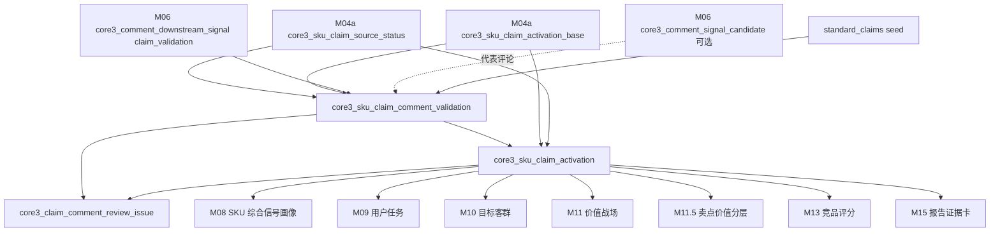
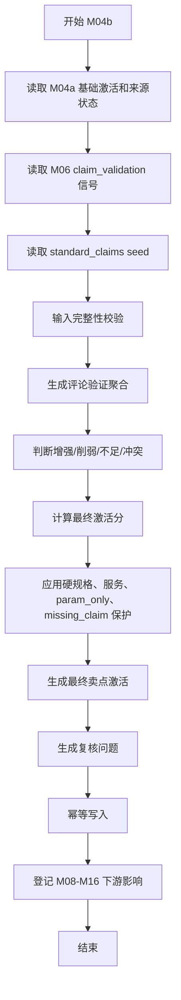

# M04b 评论验证增强详细设计

## 1. 文档定位

本文是 CatForge 彩电核心三竞品 SOP 的 M04b 详细设计，承接：

- 需求文档：`docs/core3_mvp/real_data_v2/sop_requirements/M04b_claim_comment_enhancement_requirements.md`
- 总体设计：`docs/core3_mvp/real_data_v2/sop_detailed_design/00_architecture_data_dictionary_design.md`
- 上游 M04a：`core3_sku_claim_source_status`、`core3_sku_claim_activation_base`
- 上游 M06：`core3_comment_downstream_signal` 中的 `claim_validation`
- 可选解释上游 M06：`core3_comment_signal_candidate`
- 下游 M08、M09、M10、M11、M11.5、M12-M15

M04b 是 M04 的第二段，只做“基础卖点 + 评论验证”的增强。M04a 已经完成参数和宣传的基础卖点激活，M06 已经把评论抽成下游专用信号。M04b 不重新解析卖点、参数或评论，只负责把 M06 的 `claim_validation` 信号用于卖点体验验证、削弱、风险标记和最终置信度调整。

## 2. 模块职责

### 2.1 本模块解决什么

M04b 解决五个工程问题：

1. 把参数/宣传形成的基础卖点能力，与用户评论是否感知到该体验分开保存。
2. 为每个 SKU + 标准卖点生成评论验证聚合结果。
3. 按卖点类型计算最终卖点激活分和激活等级。
4. 识别评论增强、评论削弱、弱感知、评论冲突、服务错配、硬规格越权等复核问题。
5. 为 M08 之后模块提供最终可消费的 `core3_sku_claim_activation`，并保留参数、宣传、评论三类 evidence。

### 2.2 本模块不解决什么

| 不做事项 | 原因 | 后续模块 |
| --- | --- | --- |
| 不重新计算参数分 | 参数支撑由 M03/M04a 负责 | M03/M04a |
| 不重新计算宣传分 | 宣传切分和基础激活由 M04a 负责 | M04a |
| 不读取原始评论 | 评论必须通过 M05/M06 分层产物进入 | M05/M06 |
| 不直接读取 M05 topic hint | M05 只是弱提示，必须经过 M06 `claim_validation` | M06 |
| 不消费 `task_cue`、`target_group_cue`、`battlefield_support` | 这些信号分别由 M09/M10/M11 使用 | M09-M11 |
| 不用评论证明硬规格 | 评论只能证明体验感知，不能证明 nits、分区、端口数、原生刷新率 | M03/M04a |
| 不做卖点价值分层 | 卖点价值需要战场、市场和价格证据 | M11.5 |
| 不判断竞品 | 竞品由候选召回、评分和选择模块完成 | M12-M14 |

### 2.3 允许复用历史结果

允许复用历史 M04b 输出，但必须同时满足：

- M04a `core3_sku_claim_activation_base.activation_hash` 未变化。
- M04a `core3_sku_claim_source_status.status_hash` 未变化。
- M06 对应 SKU/claim 的 `claim_validation` signal hash 未变化。
- `standard_claims` seed 版本未变化。
- M04b 规则版本未变化。
- 历史记录 `is_current=true` 且 `processing_status` 不是 `failed`、`blocked`。

## 3. 输入输出总览

### 3.1 必须输入

| 输入 | 来源模块 | 表 | 用途 |
| --- | --- | --- | --- |
| 基础卖点激活 | M04a | `core3_sku_claim_activation_base` | 参数分、宣传分、基础分、基础证据 |
| 卖点来源状态 | M04a | `core3_sku_claim_source_status` | 是否缺结构化卖点、是否 `missing_structured_claim` |
| 评论验证聚合信号 | M06 | `core3_comment_downstream_signal` | 只消费 `signal_type='claim_validation'` |
| 标准卖点 seed | seed | `standard_claims` | 卖点类型、评论权重、topic 映射和硬规格边界 |

### 3.2 可选输入

| 输入 | 来源 | 用途 | 边界 |
| --- | --- | --- | --- |
| 句级信号候选 | M06 `core3_comment_signal_candidate` | 选择代表评论短句、复核解释 | 只作为解释，不重新抽取 |
| M02 evidence | M02 `core3_evidence_atom` | evidence 详情钻取 | 只通过 ID 追溯，不重算 |

### 3.3 明确不消费

| 数据 | 禁止原因 |
| --- | --- |
| 原始 `comment_data` | 评论已由 M05/M06 处理 |
| `core3_comment_topic_hint` | 不能绕过 M06 的专用信号 |
| M06 非 `claim_validation` 信号 | 下游各自消费，不属于 M04b |
| 市场量价 | 卖点价值和价格支撑由 M07/M11.5/M13 处理 |
| 用户任务、客群、战场结果 | M04b 是这些模块上游 |

### 3.4 输出表

| 输出表 | 粒度 | 下游用途 |
| --- | --- | --- |
| `core3_sku_claim_comment_validation` | SKU + 标准卖点 | 保存评论对卖点的验证、削弱和体验感知 |
| `core3_sku_claim_activation` | SKU + 标准卖点 | 最终卖点激活结果，供 M08 之后消费 |
| `core3_claim_comment_review_issue` | SKU + 标准卖点 + 问题 | 评论增强复核和风险问题 |

### 3.5 模块关系



## 4. 卖点类型和评论权重策略

### 4.1 卖点类型来源

M04b 优先使用 M04a 输出的 `claim_type`。如果 M04a 缺失，则基于 seed `claim_group` 和 `source_types` 推断。

| M04b 类型 | 典型 claim_group | 示例 | 评论作用 |
| --- | --- | --- | --- |
| `technical_hard` | `picture` 且硬规格主导 | Mini LED、OLED、QLED、高亮、分区、HDMI2.1 | 只验证体验，不证明规格 |
| `technical_experience_mixed` | `gaming`、`eye_care`、`audio`、`smart` | 高刷新率、护眼、音效、语音、少广告 | 可验证体验，不能证明硬件规格 |
| `experience_scenario` | `motion`、部分 `picture/design` | 大屏沉浸、体育运动流畅、超薄美学 | 评论可显著增强或削弱 |
| `service` | `service` | 安装服务保障 | 评论可作为核心证据 |
| `value` | `value` | 高性价比、节能省电 | 评论代表价值感，仍需市场/参数补证 |

### 4.2 类型映射建议

| 标准卖点 | M04b 类型 | 关键边界 |
| --- | --- | --- |
| `CLAIM_MINI_LED_BACKLIGHT` | `technical_hard` | 评论不能证明 Mini LED 背光存在 |
| `CLAIM_OLED_SELF_LIT` | `technical_hard` | 评论不能证明 OLED 面板 |
| `CLAIM_QLED_WIDE_COLOR` | `technical_hard` | 评论不能证明量子点或色域值 |
| `CLAIM_HIGH_BRIGHTNESS_HDR` | `technical_hard` | 评论不能证明 nits |
| `CLAIM_FINE_LOCAL_DIMMING` | `technical_hard` | 评论不能证明分区数 |
| `CLAIM_HDMI_2_1_GAMING` | `technical_hard` | 评论不能证明端口数量和带宽 |
| `CLAIM_HIGH_REFRESH_RATE` | `technical_experience_mixed` | 评论可验证流畅感，不证明原生刷新率 |
| `CLAIM_GAMING_LOW_LATENCY` | `technical_experience_mixed` | 评论可验证低延迟感，不证明 ms |
| `CLAIM_EYE_CARE_COMFORT` | `technical_experience_mixed` | 评论可验证舒适感，不证明认证 |
| `CLAIM_IMMERSIVE_AUDIO` | `technical_experience_mixed` | 评论可验证音效体验，不证明功率 |
| `CLAIM_SMART_VOICE_EASE` | `technical_experience_mixed` | 评论可验证语音易用，不证明芯片 |
| `CLAIM_LARGE_SCREEN_IMMERSION` | `experience_scenario` | 评论可增强沉浸体验 |
| `CLAIM_SPORTS_MOTION_SMOOTH` | `experience_scenario` | 评论可增强运动流畅体验 |
| `CLAIM_ELDER_FRIENDLY_SMART` | `experience_scenario` | 评论可增强长辈易用体验 |
| `CLAIM_THIN_DESIGN` | `experience_scenario` | 评论可增强家居适配感知 |
| `CLAIM_VALUE_FOR_MONEY` | `value` | 需要 M07/M13 价格验证 |
| `CLAIM_ENERGY_SAVING` | `value` | 需要参数或能耗证据验证 |
| `CLAIM_INSTALLATION_SERVICE_ASSURANCE` | `service` | 只能使用服务类评论 |

### 4.3 权重策略

| M04b 类型 | 基础分权重 | 评论验证权重 | 评论风险扣分上限 | 评论增强上限 |
| --- | ---: | ---: | ---: | --- |
| `technical_hard` | 0.85 | 0.15 | 0.20 | 只增强体验置信度，不补硬规格 |
| `technical_experience_mixed` | 0.70 | 0.30 | 0.25 | 可增强体验，但保留规格边界 |
| `experience_scenario` | 0.55 | 0.45 | 0.30 | 可显著增强或削弱 |
| `service` | 0.40 | 0.60 | 0.35 | 服务评论可作为核心证据 |
| `value` | 0.70 | 0.30 | 0.20 | 仅代表价值感，需市场补证 |

M04b 不允许评论权重覆盖 M04a 的基础证据缺口。例如：

- 没有 HDMI2.1 参数时，评论“打游戏挺好”不能生成高置信 HDMI2.1 卖点。
- 没有 Mini LED 参数时，评论“画质清晰”不能证明 Mini LED。
- 没有结构化卖点时，评论可以增强体验感知，但必须保留 `missing_structured_claim` 风险。

## 5. 数据模型设计

### 5.1 通用字段约定

M04b 所有输出表必须包含以下通用字段。

| 字段 | 类型建议 | 必填 | 说明 |
| --- | --- | --- | --- |
| `project_id` | `text` | 是 | 项目 ID |
| `category_code` | `text` | 是 | MVP 为 `TV` |
| `batch_id` | `text` | 是 | M00 批次 |
| `run_id` | `text` | 否 | M16 全链路运行 ID |
| `module_run_id` | `text` | 否 | M04b 模块运行 ID |
| `sku_code` | `text` | 是 | SKU 编码 |
| `model_name` | `text` | 否 | 型号名 |
| `brand_name` | `text` | 否 | 当前样例为海信 |
| `rule_version` | `text` | 是 | M04b 规则版本 |
| `seed_version` | `text` | 是 | 标准卖点 seed 版本 |
| `input_fingerprint` | `text` | 是 | 输入 hash |
| `result_hash` | `text` | 是 | 输出业务内容 hash |
| `is_current` | `boolean` | 是 | 是否当前版本 |
| `processing_status` | `text` | 是 | `success`、`warning`、`review_required`、`blocked`、`failed` |
| `review_required` | `boolean` | 是 | 是否需要复核 |
| `review_status` | `text` | 是 | `auto_pass`、`review_required`、`approved`、`rejected`、`waived` |
| `review_reason_json` | `jsonb` | 是 | 复核原因 |
| `created_at` | `timestamptz` | 是 | 创建时间 |
| `updated_at` | `timestamptz` | 是 | 更新时间 |

### 5.2 枚举定义

#### 5.2.1 `comment_effect`

| 枚举 | 含义 |
| --- | --- |
| `enhance` | 评论正向验证，可提升体验置信度 |
| `weaken` | 评论负向集中，削弱卖点 |
| `neutral` | 评论不足或无明显影响 |
| `contradict` | 评论与基础激活明显冲突 |
| `comment_only_hint` | 只有评论命中，无 M04a 基础候选 |
| `blocked` | 服务错配、硬规格越权或证据不可用 |

#### 5.2.2 `perception_status`

| 枚举 | 含义 |
| --- | --- |
| `validated` | 评论验证体验成立 |
| `weak_perception` | 基础卖点存在，但评论感知弱 |
| `contradicted` | 评论负向削弱基础卖点 |
| `insufficient_comment` | 评论不足，不改变基础卖点 |
| `not_applicable` | 该卖点不适合评论验证 |
| `service_guarded` | 服务隔离，不能用于产品卖点 |
| `comment_only_pending` | 评论-only 线索待复核 |

#### 5.2.3 `activation_basis`

M04b 输出沿用并扩展 M04a `activation_basis`：

```text
param_and_promo
param_only
promo_only
insufficient
comment_enhanced
comment_weakened
comment_only_hint
service_comment_validated
```

下游必须读取 `activation_basis`，不能只看最终分。

#### 5.2.4 `issue_type`

```text
comment_only
spec_claimed_by_comment
service_mismatch
comment_contradiction
weak_perception
missing_structured_claim_enhanced
param_only_core_claim
promo_only_param_missing
value_requires_market_validation
low_quality_comment_signal
```

### 5.3 `core3_sku_claim_comment_validation`

#### 5.3.1 表用途

保存评论对标准卖点的体验验证、削弱和风险。该表是 M04b 的中间主表，独立于最终卖点激活，便于下游和报告区分：

- 基础能力是否成立。
- 用户评论是否感知到该能力。
- 评论是增强、削弱还是不足。

#### 5.3.2 字段契约

| 字段 | 类型建议 | 必填 | 说明 |
| --- | --- | --- | --- |
| `claim_comment_validation_id` | `text` | 是 | 主键，建议 `m04bcv_<hash>` |
| `validation_key` | `text` | 是 | 稳定逻辑键 |
| `claim_activation_base_id` | `text` | 否 | M04a 基础激活 ID，comment-only 时为空 |
| `claim_source_status_id` | `text` | 否 | M04a 来源状态 ID |
| `claim_code` | `text` | 是 | 标准卖点编码 |
| `claim_name` | `text` | 是 | 中文卖点名 |
| `claim_group` | `text` | 是 | seed claim_group |
| `m04b_claim_type` | `text` | 是 | `technical_hard`、`technical_experience_mixed` 等 |
| `base_activation_score` | `numeric` | 是 | M04a 基础分，无基础时为 0 |
| `base_activation_level` | `text` | 是 | M04a 基础等级 |
| `base_activation_basis` | `text` | 是 | M04a 基础来源 |
| `param_score` | `numeric` | 是 | M04a 参数分 |
| `promo_score` | `numeric` | 是 | M04a 宣传分 |
| `claim_source_status` | `text` | 是 | `has_structured_claim`、`missing_structured_claim` 等 |
| `mention_count` | `integer` | 是 | M06 去重评论单元提及数 |
| `sentence_count` | `integer` | 是 | M06 句级候选数 |
| `valid_comment_unit_count` | `integer` | 是 | M06 分母 |
| `mention_rate` | `numeric` | 是 | 去重提及率 |
| `positive_count` | `integer` | 是 | 正向提及数 |
| `negative_count` | `integer` | 是 | 负向提及数 |
| `positive_rate` | `numeric` | 是 | 正向率 |
| `negative_rate` | `numeric` | 是 | 负向率 |
| `specificity_avg` | `numeric` | 是 | 平均具体程度 |
| `evidence_quality_score` | `numeric` | 是 | 评论证据质量 |
| `domain_match_score` | `numeric` | 是 | 产品/服务域匹配 |
| `comment_validation_score` | `numeric` | 是 | 评论验证分 |
| `comment_risk_score` | `numeric` | 是 | 评论风险分 |
| `comment_effect` | `text` | 是 | `enhance`、`weaken`、`neutral`、`contradict`、`comment_only_hint`、`blocked` |
| `perception_status` | `text` | 是 | 用户感知状态 |
| `hard_spec_protection_flag` | `boolean` | 是 | 是否受硬规格保护 |
| `service_guardrail_flag` | `boolean` | 是 | 是否服务隔离 |
| `comment_only_flag` | `boolean` | 是 | 是否只有评论命中 |
| `weak_perception_flag` | `boolean` | 是 | 是否弱感知 |
| `contradiction_flag` | `boolean` | 是 | 是否评论冲突 |
| `representative_phrases` | `jsonb` | 是 | 代表评论短句 |
| `comment_signal_ids` | `jsonb` | 是 | M06 signal IDs |
| `comment_candidate_ids` | `jsonb` | 是 | M06 candidate IDs |
| `comment_evidence_ids` | `jsonb` | 是 | M05/M02 评论 evidence |
| `base_evidence_ids` | `jsonb` | 是 | M04a 参数和宣传 evidence |
| `quality_flags` | `jsonb` | 是 | 质量标记 |
| `confidence` | `numeric` | 是 | 评论验证置信度 |
| `confidence_level` | `text` | 是 | `high`、`medium`、`low`、`unknown` |

#### 5.3.3 主键、唯一键和索引

| 类型 | 字段 |
| --- | --- |
| 主键 | `claim_comment_validation_id` |
| 唯一键 | `project_id, category_code, batch_id, sku_code, claim_code, rule_version, seed_version` |
| 普通索引 | `sku_code, claim_code` |
| 普通索引 | `claim_code, comment_effect` |
| 普通索引 | `perception_status` |
| 普通索引 | `claim_source_status` |
| 普通索引 | `review_required` |
| GIN 索引 | `representative_phrases`、`comment_signal_ids`、`comment_evidence_ids`、`quality_flags` |

#### 5.3.4 `representative_phrases` JSON 结构

```json
[
  {
    "phrase": "看球很流畅，运动画面不卡",
    "polarity": "support",
    "signal_id": "m06sig_...",
    "candidate_id": "m06cand_...",
    "evidence_ids": ["m05cea_...", "ev_..."],
    "specificity_score": 0.82
  }
]
```

### 5.4 `core3_sku_claim_activation`

#### 5.4.1 表用途

保存最终卖点激活结果，是 M08 之后模块消费卖点能力的唯一主表。

该表必须同时呈现：

- 参数支撑。
- 宣传支撑。
- 评论体验验证。
- 评论风险。
- 来源缺口。
- 最终激活等级。
- 可下游使用策略。

#### 5.4.2 字段契约

| 字段 | 类型建议 | 必填 | 说明 |
| --- | --- | --- | --- |
| `claim_activation_id` | `text` | 是 | 主键，建议 `m04bact_<hash>` |
| `activation_key` | `text` | 是 | 稳定逻辑键 |
| `claim_activation_base_id` | `text` | 否 | M04a 基础激活 ID |
| `claim_comment_validation_id` | `text` | 否 | 评论验证 ID |
| `claim_source_status_id` | `text` | 否 | 卖点来源状态 ID |
| `claim_code` | `text` | 是 | 标准卖点 |
| `claim_name` | `text` | 是 | 中文卖点 |
| `claim_group` | `text` | 是 | seed claim_group |
| `m04b_claim_type` | `text` | 是 | M04b 类型 |
| `param_score` | `numeric` | 是 | M04a 参数分 |
| `promo_score` | `numeric` | 是 | M04a 宣传分 |
| `base_activation_score` | `numeric` | 是 | M04a 基础分 |
| `comment_validation_score` | `numeric` | 是 | 评论验证分 |
| `comment_risk_score` | `numeric` | 是 | 评论风险分 |
| `final_activation_score` | `numeric` | 是 | 最终激活分 |
| `base_activation_level` | `text` | 是 | M04a 基础等级 |
| `activation_level` | `text` | 是 | `high`、`medium`、`low`、`unknown`、`review_required` |
| `activation_basis` | `text` | 是 | 扩展后的来源基础 |
| `perception_status` | `text` | 是 | 用户感知状态 |
| `claim_source_status` | `text` | 是 | 来源状态 |
| `comment_effect` | `text` | 是 | 评论作用 |
| `hard_spec_protection_flag` | `boolean` | 是 | 硬规格保护 |
| `service_guardrail_flag` | `boolean` | 是 | 服务隔离 |
| `missing_structured_claim_flag` | `boolean` | 是 | 是否缺结构化卖点 |
| `param_only_flag` | `boolean` | 是 | 是否参数-only |
| `promo_only_flag` | `boolean` | 是 | 是否宣传-only |
| `comment_only_flag` | `boolean` | 是 | 是否评论-only |
| `weak_perception_flag` | `boolean` | 是 | 是否弱感知 |
| `contradiction_flag` | `boolean` | 是 | 是否评论冲突 |
| `value_requires_market_validation` | `boolean` | 是 | 价值型是否需市场补证 |
| `downstream_usage_policy_json` | `jsonb` | 是 | 下游使用策略 |
| `score_breakdown_json` | `jsonb` | 是 | 分数拆解 |
| `missing_signals` | `jsonb` | 是 | 缺失信号 |
| `conflict_flags` | `jsonb` | 是 | 冲突标记 |
| `quality_flags` | `jsonb` | 是 | 质量标记 |
| `evidence_ids` | `jsonb` | 是 | 参数、宣传、评论总 evidence |
| `param_evidence_ids` | `jsonb` | 是 | 参数 evidence |
| `promo_evidence_ids` | `jsonb` | 是 | 宣传 evidence |
| `comment_evidence_ids` | `jsonb` | 是 | 评论 evidence |
| `comment_signal_ids` | `jsonb` | 是 | M06 signal IDs |
| `representative_phrases` | `jsonb` | 是 | 代表评论 |
| `confidence` | `numeric` | 是 | 最终置信度 |
| `confidence_level` | `text` | 是 | `high`、`medium`、`low`、`unknown` |

#### 5.4.3 主键、唯一键和索引

| 类型 | 字段 |
| --- | --- |
| 主键 | `claim_activation_id` |
| 唯一键 | `project_id, category_code, batch_id, sku_code, claim_code, rule_version, seed_version` |
| 普通索引 | `sku_code, claim_code` |
| 普通索引 | `claim_code, activation_level` |
| 普通索引 | `m04b_claim_type` |
| 普通索引 | `activation_basis` |
| 普通索引 | `perception_status` |
| 普通索引 | `missing_structured_claim_flag` |
| 普通索引 | `param_only_flag` |
| 普通索引 | `review_required` |
| GIN 索引 | `downstream_usage_policy_json`、`score_breakdown_json`、`evidence_ids`、`missing_signals`、`conflict_flags` |

#### 5.4.4 下游使用策略 JSON

```json
{
  "M08": {
    "allowed": true,
    "usage": "sku_claim_signal"
  },
  "M09": {
    "allowed": true,
    "max_confidence_if_param_only": "medium",
    "blocked_if_comment_only": true
  },
  "M11": {
    "allowed": true,
    "requires_market_or_task_support": true
  },
  "M11_5": {
    "allowed": true,
    "value_layer_required": true
  },
  "M13": {
    "allowed": true,
    "must_keep_evidence_risk": true
  },
  "M15": {
    "display_data_gap": true,
    "display_comment_as_experience_not_spec": true
  }
}
```

#### 5.4.5 分数拆解 JSON

```json
{
  "claim_type": "technical_hard",
  "weights": {
    "base": 0.85,
    "comment": 0.15,
    "risk_penalty": 0.20
  },
  "base_activation_score": 0.78,
  "comment_validation_score": 0.62,
  "comment_risk_score": 0.05,
  "conflict_penalty": 0.00,
  "final_activation_score": 0.747,
  "score_caps": ["param_only_cap_medium", "hard_spec_not_proven_by_comment"]
}
```

### 5.5 `core3_claim_comment_review_issue`

#### 5.5.1 表用途

保存 M04b 发现的评论增强复核问题。该表既可被 M16 复核队列消费，也可供 M15 报告生成时展示证据风险。

#### 5.5.2 字段契约

| 字段 | 类型建议 | 必填 | 说明 |
| --- | --- | --- | --- |
| `issue_id` | `text` | 是 | 主键，建议 `m04bissue_<hash>` |
| `issue_key` | `text` | 是 | 稳定逻辑键 |
| `claim_activation_id` | `text` | 否 | 最终激活 ID |
| `claim_comment_validation_id` | `text` | 否 | 评论验证 ID |
| `claim_activation_base_id` | `text` | 否 | 基础激活 ID |
| `claim_code` | `text` | 是 | 标准卖点 |
| `claim_name` | `text` | 是 | 中文卖点 |
| `issue_type` | `text` | 是 | 问题类型 |
| `severity` | `text` | 是 | `info`、`warning`、`review_required`、`blocked` |
| `business_note` | `text` | 是 | 中文业务说明 |
| `technical_note` | `text` | 否 | 技术说明 |
| `suggested_action` | `text` | 是 | 建议动作 |
| `downstream_policy` | `text` | 是 | `continue_with_warning`、`require_approval`、`block_downstream` |
| `evidence_ids` | `jsonb` | 是 | 关联 evidence |
| `comment_signal_ids` | `jsonb` | 是 | 关联 M06 signal |
| `quality_flags` | `jsonb` | 是 | 质量标记 |
| `issue_status` | `text` | 是 | `open`、`approved`、`rejected`、`waived`、`closed` |

#### 5.5.3 主键、唯一键和索引

| 类型 | 字段 |
| --- | --- |
| 主键 | `issue_id` |
| 唯一键 | `project_id, category_code, batch_id, sku_code, claim_code, issue_type, rule_version, seed_version` |
| 普通索引 | `sku_code, claim_code` |
| 普通索引 | `issue_type` |
| 普通索引 | `severity` |
| 普通索引 | `issue_status` |
| GIN 索引 | `evidence_ids`、`comment_signal_ids`、`quality_flags` |

## 6. 处理流程设计

### 6.1 总流程



### 6.2 步骤 1：读取基础卖点

按 SKU 读取 M04a 当前版本：

- `core3_sku_claim_source_status`
- `core3_sku_claim_activation_base`

关键字段：

| 字段 | 用途 |
| --- | --- |
| `claim_source_status` | 判断是否 `missing_structured_claim` |
| `claim_code` | 与 M06 target_code_hint 对齐 |
| `claim_type` | 权重策略 |
| `param_score` | 参数支撑 |
| `promo_score` | 宣传支撑 |
| `base_activation_score` | 基础激活 |
| `activation_basis` | `param_only`、`promo_only`、`param_and_promo` 等 |
| `missing_signals` | 缺失证据 |
| `conflict_flags` | 基础冲突 |
| `evidence_ids` | 参数和宣传 evidence |

### 6.3 步骤 2：读取 M06 评论验证信号

只读取：

```text
core3_comment_downstream_signal.signal_type = 'claim_validation'
```

过滤规则：

| 条件 | 处理 |
| --- | --- |
| `target_code_hint` 不是 `CLAIM_*` | 忽略并记录 warning |
| `service_guardrail_flag=true` 且 claim 不是服务型 | 阻断，生成 `service_mismatch` |
| `hard_spec_policy='experience_only'` | 可验证体验，但不得证明硬规格 |
| `signal_level='blocked'` | 不进入增强，只进入 issue |
| `confidence_level='unknown'` | 降低验证置信度 |

### 6.4 步骤 3：输入校验

| 校验项 | 处理 |
| --- | --- |
| M04a 缺失 | 当前 SKU M04b blocked |
| M06 缺失 | 输出 final activation 继承 M04a，`perception_status='insufficient_comment'` |
| seed 缺失 | M04b blocked |
| claim_validation 命中无 M04a 基础 claim | 生成 `comment_only_hint` 和复核问题 |
| M04a `param_only` 且会进入下游核心判断 | 保留中置信上限并复核 |
| 85E7Q `claim_source_status` 不是 `missing_structured_claim` | 复核 M04a 来源状态 |

### 6.5 步骤 4：生成评论验证聚合

M06 已按 SKU/claim 聚合，M04b 不重新计算原始评论提及率，只做业务口径调整：

1. 以 `sku_code + claim_code` 对齐 M04a base 和 M06 signal。
2. 拷贝 M06 的 `mention_count`、`mention_rate`、`positive_rate`、`negative_rate`、`specificity_avg`、`evidence_quality_score`。
3. 计算 `domain_match_score`：
   - 产品 claim 使用产品体验域。
   - 服务 claim 使用服务域。
   - 价值 claim 使用价格价值感域，并打市场验证需求。
4. 计算 `comment_validation_score`。
5. 计算 `comment_risk_score`。
6. 生成 `comment_effect` 和 `perception_status`。

### 6.6 步骤 5：评论作用判定

| 条件 | `comment_effect` | `perception_status` |
| --- | --- | --- |
| 正向提及、具体程度和证据质量达标 | `enhance` | `validated` |
| 负向提及集中且对应同一体验 | `weaken` | `contradicted` |
| M04a 基础强但评论几乎无感知 | `neutral` | `weak_perception` |
| 评论与 M04a 参数/宣传方向冲突 | `contradict` | `contradicted` |
| 评论命中但无 M04a 基础候选 | `comment_only_hint` | `comment_only_pending` |
| 服务评论命中产品 claim | `blocked` | `service_guarded` |
| 评论不足或低置信 | `neutral` | `insufficient_comment` |

弱感知规则示例：

```text
weak_perception =
  base_activation_score >= 0.70
  and mention_count < min_mention_threshold
  and positive_rate < 0.50
  and m04b_claim_type in ('experience_scenario', 'technical_experience_mixed')
```

冲突规则示例：

```text
contradicted =
  base_activation_score >= 0.60
  and negative_rate >= 0.35
  and comment_risk_score >= 0.45
```

### 6.7 步骤 6：计算评论验证分

```text
comment_validation_score =
  0.30 * mention_rate_score
+ 0.25 * positive_rate_score
+ 0.20 * specificity_score
+ 0.15 * evidence_quality_score
+ 0.10 * domain_match_score
```

其中：

- `mention_rate_score` 使用 M06 已平滑后的提及率评分，或按 M06 分母重新平滑。
- `positive_rate_score` 只对 `polarity=support` 的信号计算。
- 如果 `service_guardrail_flag=true` 且 claim 不是服务型，score 强制为 0。
- 如果 `hard_spec_policy='experience_only'`，score 只进入体验验证，不补齐硬规格缺口。

### 6.8 步骤 7：计算评论风险分

```text
comment_risk_score =
  0.40 * negative_rate_score
+ 0.30 * risk_specificity_score
+ 0.20 * evidence_quality_score
+ 0.10 * repeated_issue_score
```

`repeated_issue_score` 必须基于 M06 去重评论单元，不得按原始评论行数放大。

### 6.9 步骤 8：计算最终激活分

#### 6.9.1 按类型加权

`technical_hard`：

```text
final_activation_score =
  base_activation_score * 0.85
+ comment_validation_score * 0.15
- comment_risk_score * 0.20
- conflict_penalty
```

`technical_experience_mixed`：

```text
final_activation_score =
  base_activation_score * 0.70
+ comment_validation_score * 0.30
- comment_risk_score * 0.25
- conflict_penalty
```

`experience_scenario`：

```text
final_activation_score =
  base_activation_score * 0.55
+ comment_validation_score * 0.45
- comment_risk_score * 0.30
- conflict_penalty
```

`service`：

```text
final_activation_score =
  base_activation_score * 0.40
+ comment_validation_score * 0.60
- comment_risk_score * 0.35
```

`value`：

```text
final_activation_score =
  base_activation_score * 0.70
+ comment_validation_score * 0.30
- comment_risk_score * 0.20
```

#### 6.9.2 保护和封顶规则

| 条件 | 保护规则 |
| --- | --- |
| `activation_basis='param_only'` | 默认最高 `medium`，并保留 `param_only_flag=true` |
| `claim_source_status='missing_structured_claim'` | 保留 `missing_structured_claim_flag=true`，M15 必须展示数据缺口 |
| `comment_only_hint` | 最高 `low` 或 `review_required`，不得自动成为高置信卖点 |
| `technical_hard` 且无参数支撑 | 评论不能激活，生成 `spec_claimed_by_comment` |
| 服务信号命中产品卖点 | 阻断，生成 `service_mismatch` |
| 价值型卖点评论强 | `value_requires_market_validation=true`，等待 M07/M13 |
| M04a `promo_only` 且参数缺失 | 降置信并复核 |

### 6.10 步骤 9：激活等级

| 等级 | 条件 |
| --- | --- |
| `high` | 基础证据强、评论无冲突、非 param-only/comment-only、evidence 完整 |
| `medium` | 基础成立但存在缺口，或评论验证中等 |
| `low` | 单侧证据、评论弱、低置信或 comment-only hint |
| `unknown` | evidence 不足或冲突严重 |
| `review_required` | 影响下游核心判断但存在证据冲突或保护规则命中 |

### 6.11 步骤 10：最终置信度

```text
confidence =
  0.35 * base_confidence
+ 0.20 * comment_confidence
+ 0.15 * evidence_completeness
+ 0.10 * source_status_score
+ 0.10 * domain_consistency_score
+ 0.10 * review_risk_inverse
```

降权：

- `missing_structured_claim` 降 0.08。
- `param_only` 降 0.08。
- `promo_only` 且参数缺失降 0.12。
- `comment_only_hint` 降 0.30。
- 服务错配直接 blocked。
- 硬规格被评论单独支撑直接 blocked 或 review_required。

## 7. 增量策略

### 7.1 触发条件

| 输入变化 | M04b 动作 | 下游影响 |
| --- | --- | --- |
| M04a 基础卖点变化 | 重算对应 SKU/claim 评论验证和最终激活 | M08-M16 |
| M04a 来源状态变化 | 更新缺失、param_only、结构化卖点风险 | M08-M16 |
| M06 `claim_validation` 变化 | 重算对应 SKU/claim 评论验证和最终激活 | M08-M16 |
| M06 非 `claim_validation` 变化 | 不触发 M04b | 对应下游自行处理 |
| `standard_claims` seed 变化 | 重算受影响 claim | M04b-M16 |
| quality evidence 变化 | 更新置信度和复核状态 | M08、M16 |
| 人工复核决策变化 | 更新 issue 和最终使用策略 | 需要时触发 M08-M16 |

### 7.2 幂等写入

1. 按 `project_id + category_code + batch_id + sku_code` 计算输入 fingerprint。
2. 如果 fingerprint 未变化且非 force，跳过。
3. 逐 `sku_code + claim_code` 生成 validation、activation、issue。
4. 如果 `result_hash` 未变化，复用当前记录。
5. 如果变化，将旧记录 `is_current=false`，插入新记录。
6. 如果某 claim 不再有基础或评论来源，将旧记录失效，并记录 `inactive_reason`。

### 7.3 hash 计算

| 对象 | hash 输入 |
| --- | --- |
| `claim_comment_validation` | `base_activation_hash + claim_source_status_hash + m06_signal_hash + seed_version + rule_version` |
| `claim_activation` | `base_activation_hash + validation_hash + score_breakdown_json + downstream_usage_policy_json + seed_version + rule_version` |
| `review_issue` | `sku_code + claim_code + issue_type + evidence_ids + severity + rule_version + seed_version` |

### 7.4 下游触发范围

| M04b 输出变化 | 触发模块 |
| --- | --- |
| `core3_sku_claim_activation` 分数或等级变化 | M08、M09、M10、M11、M11.5、M12-M16 |
| 只变 `representative_phrases` | M15、M16 |
| 只变 `review_issue` | M16，必要时阻断 M08-M15 |
| `activation_basis` 从 param_only/comment_only 变完整 | M08-M16 |
| `weak_perception` 或 `contradicted` 状态变化 | M08、M11、M13、M15 |

## 8. 服务、任务和 API 边界

### 8.1 后端服务建议

| 服务 | 职责 |
| --- | --- |
| `ClaimCommentEnhancementM04bRunner` | M04b 模块入口 |
| `ClaimBaseInputService` | 读取 M04a 基础卖点和来源状态 |
| `ClaimValidationSignalInputService` | 读取 M06 `claim_validation` |
| `ClaimTypePolicyService` | 卖点类型和权重策略 |
| `ClaimCommentValidationBuilder` | 生成评论验证聚合 |
| `ClaimActivationFinalScorer` | 计算最终激活分 |
| `ClaimGuardrailService` | 硬规格、服务、param_only、comment_only 保护 |
| `ClaimCommentReviewPolicy` | 生成复核问题 |
| `M04bDownstreamImpactService` | 登记下游影响 |

### 8.2 Repository 边界

| Repository | 访问表 |
| --- | --- |
| `ClaimSourceStatusRepository` | 只读 M04a `core3_sku_claim_source_status` |
| `ClaimActivationBaseRepository` | 只读 M04a `core3_sku_claim_activation_base` |
| `CommentDownstreamSignalRepository` | 只读 M06 `core3_comment_downstream_signal` |
| `CommentSignalCandidateRepository` | 可选只读 M06 `core3_comment_signal_candidate` |
| `SkuClaimCommentValidationRepository` | 写 `core3_sku_claim_comment_validation` |
| `SkuClaimActivationRepository` | 写 `core3_sku_claim_activation` |
| `ClaimCommentReviewIssueRepository` | 写 `core3_claim_comment_review_issue` |
| `SeedAssetRepository` | 读取 `standard_claims` seed |

Repository 不允许读取原始四张表。

### 8.3 任务入口

建议任务函数：

```text
run_core3_m04b_claim_comment_enhancement(
  project_id: str,
  category_code: str,
  batch_id: str,
  sku_scope: list[str] | None,
  claim_scope: list[str] | None,
  force: bool = False,
  run_id: str | None = None
) -> M04bRunResult
```

返回结构建议：

```json
{
  "module": "M04b",
  "status": "completed_with_warning",
  "processed_sku_count": 35,
  "changed_sku_codes": ["TV00029115"],
  "changed_claim_count": 18,
  "review_required_count": 6,
  "blocked_claim_count": 1,
  "downstream_impacts": [
    {"sku_code": "TV00029115", "next_modules": ["M08", "M09", "M11", "M11_5", "M13", "M15"]}
  ],
  "metrics": {
    "validation_count": 420,
    "final_activation_count": 510,
    "issue_count": 32
  }
}
```

### 8.4 API 边界

M04b API 用于运营复核、下游联调和报告证据钻取。

| API | 用途 | 边界 |
| --- | --- | --- |
| `GET /api/mvp/core3/v2/projects/{project_id}/batches/{batch_id}/skus/{sku_code}/claim-activations` | 查询 SKU 最终卖点激活 | 返回最终卖点，但不判断任务/战场/竞品 |
| `GET /api/mvp/core3/v2/projects/{project_id}/batches/{batch_id}/skus/{sku_code}/claim-comment-validations` | 查询评论验证结果 | 明确区分体验验证和硬规格证据 |
| `GET /api/mvp/core3/v2/projects/{project_id}/claim-activations/{claim_activation_id}/evidence` | 查询参数/宣传/评论证据 | 用于证据追溯 |
| `GET /api/mvp/core3/v2/projects/{project_id}/batches/{batch_id}/claim-comment-review-issues` | 查看 M04b 复核问题 | 给运营和 M16 使用 |

前端不得基于 M04b API 直接写“该 SKU 的主战场是某某”或“核心竞品是某某”。这些必须来自 M11-M15。

## 9. 质量和复核规则

### 9.1 warning 条件

| 条件 | warning |
| --- | --- |
| `claim_source_status='missing_structured_claim'` | 结构化卖点缺失，报告需提示 |
| `activation_basis='param_only'` | 参数-only，不可当完整宣传卖点 |
| `activation_basis='promo_only'` 且参数缺失 | 宣传缺参数支撑 |
| 评论验证样本不足 | 评论不改变基础激活 |
| 价值型评论强 | 需 M07/M13 市场验证 |
| 评论验证弱但基础激活强 | 弱感知候选 |

### 9.2 review_required 条件

| 条件 | issue_type |
| --- | --- |
| 评论单独命中某卖点但 M04a 无基础候选 | `comment_only` |
| 技术规格被评论信号单独支撑 | `spec_claimed_by_comment` |
| 服务评论被映射到产品卖点 | `service_mismatch` |
| M04a 基础强但评论负向集中 | `comment_contradiction` |
| 宣传强但评论很弱 | `weak_perception` |
| `param_only` 卖点影响核心竞品选择 | `param_only_core_claim` |
| 重点 SKU 缺结构化卖点但评论增强强 | `missing_structured_claim_enhanced` |
| 价值型卖点评论强但缺市场验证 | `value_requires_market_validation` |
| 低质量评论信号影响最终分 | `low_quality_comment_signal` |

### 9.3 blocked 条件

| 条件 | 处理 |
| --- | --- |
| M04a 未完成 | M04b blocked |
| M06 未完成且必须评论验证 | 当前 SKU warning 或 blocked，取决于下游要求 |
| seed 无法加载 | M04b blocked |
| 服务评论增强产品卖点 | 对该 claim blocked |
| 评论-only 试图激活技术硬规格 | 对该 claim blocked |
| evidence 追溯链断裂 | 对该 claim review_required 或 blocked |
| 输出写入失败 | M04b failed |

### 9.4 复核队列字段

M04b 向 M16 提供：

| 字段 | 说明 |
| --- | --- |
| `module_code` | 固定 `M04b` |
| `review_object_type` | `claim_comment_validation`、`claim_activation`、`claim_comment_issue` |
| `review_object_id` | 对应输出 ID |
| `sku_code` | SKU |
| `claim_code` | 标准卖点 |
| `issue_type` | 问题类型 |
| `severity` | 严重度 |
| `business_note` | 中文业务说明 |
| `evidence_ids` | 参数、宣传、评论 evidence |
| `suggested_action` | 建议复核动作 |
| `downstream_policy` | 下游策略 |

### 9.5 人工复核影响

| 复核结果 | M04b 处理 | 下游影响 |
| --- | --- | --- |
| `approved` | 当前激活可用 | 可触发下游 |
| `rejected` | 降级或移除该 claim 激活 | 重算 M08-M16 |
| `waived` | 保留 warning 继续 | 下游带 warning |
| 修改 seed | 更新 seed_version | 重算 M04b-M16 |
| 修改规则 | 更新 rule_version | 重算 M04b-M16 |

## 10. 与其他模块接口

### 10.1 来自 M04a 的承诺

M04a 必须提供：

- `core3_sku_claim_source_status`
- `core3_sku_claim_activation_base`

关键字段：

| 字段 | M04b 用途 |
| --- | --- |
| `claim_source_status` | 判断结构化卖点缺失 |
| `param_score` | 最终分基础 |
| `promo_score` | 最终分基础 |
| `base_activation_score` | 最终分基础 |
| `activation_basis` | param_only、promo_only、param_and_promo 等保护 |
| `claim_type` | 权重策略 |
| `missing_signals` | 下游风险 |
| `conflict_flags` | 冲突继承 |
| `evidence_ids` | 参数/宣传 evidence |

### 10.2 来自 M06 的承诺

M04b 只消费：

```text
core3_comment_downstream_signal
where signal_type = 'claim_validation'
```

M06 必须提供：

| 字段 | M04b 用途 |
| --- | --- |
| `target_code_hint` | 对齐 `claim_code` |
| `mention_count` | 提及数 |
| `mention_rate` | 提及率 |
| `positive_rate` | 正向率 |
| `negative_rate` | 负向率 |
| `signal_score` | 评论信号分 |
| `specificity_avg` | 具体程度 |
| `evidence_quality_score` | 证据质量 |
| `representative_phrases` | 报告和复核 |
| `service_guardrail_flag` | 服务隔离 |
| `hard_spec_policy` | 硬规格边界 |
| `evidence_ids` | 评论 evidence |

### 10.3 给 M08 的承诺

M08 消费 `core3_sku_claim_activation`，并能看到：

- 最终激活分。
- 参数、宣传、评论三类分数。
- `activation_basis`。
- `perception_status`。
- 缺结构化卖点、param-only、comment-only 等风险。
- evidence IDs。

### 10.4 给 M09/M10 的承诺

用户任务和客群可以使用最终卖点激活，但必须遵守：

- `comment_only_hint` 不得单独支撑高置信任务或客群。
- `param_only` 默认最高中置信。
- `weak_perception` 要降低任务/客群中评论相关权重。
- 服务型 claim 只能支撑服务敏感或新家装修相关推断。

### 10.5 给 M11/M11.5 的承诺

M11 可使用最终卖点激活判断战场语义支撑。

M11.5 必须继续结合市场和评论感知做战场内卖点价值分层。M04b 不输出：

- 基础门槛。
- 竞争绩效。
- 溢价倾向。
- 弱感知价值层级。

### 10.6 给 M12-M14 的承诺

竞品召回和评分可以使用 M04b 最终卖点激活，但必须同时读取风险字段：

- `missing_structured_claim_flag`
- `param_only_flag`
- `comment_only_flag`
- `weak_perception_flag`
- `contradiction_flag`
- `value_requires_market_validation`

评论验证不能替代参数和市场证据。

### 10.7 给 M15 的承诺

M15 可以展示：

- “评论验证了某体验”。
- “评论削弱了某体验”。
- “缺结构化卖点，当前为参数 + 评论体验验证”。

M15 不能写：

- “评论证明了 5200 nits”。
- “评论证明了 3500 分区”。
- “评论证明了 HDMI2.1 接口数”。
- “安装服务好说明画质强”。

## 11. 真实数据样例处理预期

### 11.1 全量样例

当前样例结构化卖点只覆盖 5 个型号，M04b 必须支持大部分 SKU 的 `missing_structured_claim` 场景。

预期：

- 有 M04a 基础激活的 SKU/claim 生成最终 `core3_sku_claim_activation`。
- 有评论信号但没有 M04a 基础候选的 SKU/claim 只生成 `comment_only_hint` 和复核问题。
- 服务安装评论只影响服务型 claim。
- 价值型评论不直接转成价格竞争结论。

### 11.2 85E7Q 样例

85E7Q `model_code=TV00029115`：

| 数据事实 | M04b 处理 |
| --- | --- |
| 无结构化卖点 | `missing_structured_claim_flag=true` |
| M04a 基于参数输出 Mini LED、高亮、分区、高刷、HDMI 等候选 | 保留 `param_only_flag=true`，评论只增强体验侧 |
| 评论“画面清晰、色彩好、细节好” | 增强画质体验相关 claim，不证明 5200 nits 或 3500 分区 |
| 评论“看球不卡、运动画面顺” | 增强体育运动流畅体验，不证明原生刷新率 |
| 评论“语音控制方便、运行流畅” | 增强智能/易用体验，不证明芯片或内存 |
| 评论“安装快、师傅专业” | 只增强 `CLAIM_INSTALLATION_SERVICE_ASSURANCE` |
| 评论“性价比高、买得值” | 价值感增强，但 `value_requires_market_validation=true` |

85E7Q 的最终报告必须能说明：

```text
该 SKU 的部分核心卖点来自参数基础和评论体验验证，当前缺结构化宣传卖点数据，因此不能把评论当成宣传证据或硬规格证据。
```

## 12. 测试设计

### 12.1 单元测试

| 测试 | 输入 | 期望 |
| --- | --- | --- |
| 技术型评论增强 | Mini LED base + 画质正向评论 | final 分轻微增强，保留硬规格保护 |
| 评论不能证明规格 | 无 Mini LED base + 画质评论 | comment_only_hint，不能高置信激活 Mini LED |
| 体验型增强 | 体育运动流畅 base + 看球不卡评论 | final 明显增强 |
| 评论削弱 | 基础高刷强 + 多条拖影卡顿评论 | `contradicted` 或降级 |
| 服务隔离 | 安装师傅好 + 画质 claim | blocked，生成 `service_mismatch` |
| 服务 claim 增强 | 安装服务保障 + 安装正向评论 | 服务 claim 可增强 |
| 价值感评论 | 高性价比 + 划算评论 | 增强价值感，但标记市场验证 |
| param_only cap | 85E7Q 参数-only 高刷 + 评论正向 | 最高默认 medium，保留 param_only |

### 12.2 集成测试

| 测试 | 期望 |
| --- | --- |
| M04a + M06 -> M04b | 输出 validation、activation、review_issue |
| 85E7Q 样例 | 输出缺结构化卖点和 param_only 风险 |
| M06 非 claim_validation 变化 | 不触发 M04b |
| M06 claim_validation 变化 | 对应 SKU/claim 重算 |
| M04a 基础变化 | 对应 SKU/claim 重算 |
| 输入 hash 未变 | 不重复写当前记录 |
| evidence 追溯 | final activation 可追溯参数、宣传、评论 evidence |

### 12.3 边界测试

| 场景 | 期望 |
| --- | --- |
| 无 M06 评论信号 | 继承 M04a，`insufficient_comment` |
| 无 M04a 基础但有评论 | comment_only_hint + review |
| M04a promo_only 且参数缺失 | review_required |
| M04a param_only 且缺宣传 | 保留 missing_structured_claim 或 param_only |
| 服务评论映射产品 claim | blocked |
| 硬规格 comment-only | blocked 或 review_required |
| 评论全 unknown/低置信 | 不增强 |
| 负向评论集中 | 风险分扣减并复核 |

### 12.4 禁止越界测试

必须验证：

- M04b 不读取原始 `comment_data`。
- M04b 不读取 M05 topic hint。
- M04b 不消费 M06 非 `claim_validation` 信号。
- M04b 不读取市场量价。
- M04b 不输出任务、客群、战场、竞品结论。
- 服务评论不能增强产品卖点。
- 评论不能证明硬规格。

### 12.5 LLM 依赖测试

M04b 首版不依赖外部 LLM。所有增强、削弱、复核和评分规则均基于 M04a/M06 结构化输出。

如果后续加入 LLM 辅助解释文案，必须：

- 使用 mock LLM。
- 固定离线 fixture。
- 不影响最终评分。
- CI 不发起外部调用。

## 13. 验收标准

| 验收项 | 标准 |
| --- | --- |
| 表结构可落地 | 3 张 M04b 输出表字段、键、索引明确，可写 Alembic |
| 输入边界正确 | 只消费 M04a 和 M06 `claim_validation` |
| 不读取原始评论 | 必须 |
| 不消费 M05 主题 | 必须 |
| 评论不证明硬规格 | 必须 |
| 服务隔离正确 | 服务评论不增强产品卖点 |
| 类型权重不同 | 技术型、体验型、服务型、价值型权重不同 |
| 输出评论验证聚合 | `core3_sku_claim_comment_validation` 可用 |
| 输出最终卖点激活 | `core3_sku_claim_activation` 可供 M08 消费 |
| 输出复核问题 | `core3_claim_comment_review_issue` 可供 M16 消费 |
| 85E7Q 可运行 | 保留 `missing_structured_claim` 和 `param_only` 风险 |
| evidence 可追溯 | 参数、宣传、评论 evidence IDs 齐全 |
| 增量可重跑 | M04a/M06/seed 变化能触发正确范围 |
| 测试可实现 | 单元、集成、边界、越界测试点明确 |

## 14. 待评审问题

| 问题 | 建议 |
| --- | --- |
| comment-only hint 是否进入最终激活表 | 建议进入但最高 low/review_required，便于 M15 展示和业务复核 |
| `param_only` 是否永远不能 high | MVP 默认不能 high，除非业务复核批准并记录 |
| 服务型 claim 是否可由评论主导 | 可，但只限 `CLAIM_INSTALLATION_SERVICE_ASSURANCE` |
| 价值型 claim 是否在 M04b 给最终 high | 不建议，需 M07/M13 市场验证后才能在商业价值上高置信 |
| 技术型 claim 的评论权重是否可调 | 可按 seed/规则版本调，但必须保留硬规格保护 |

## 15. 下一步

下一个详细设计文档：

```text
M07_market_profile_design.md
```

M07 需要基于清洗后的周销、价格、渠道和可比池口径生成 SKU 市场画像。它将为 M08、M11.5、M12、M13 提供价格带、销量、销售额、渠道平台和可比池基线，不能与评论或卖点逻辑混在一起。
