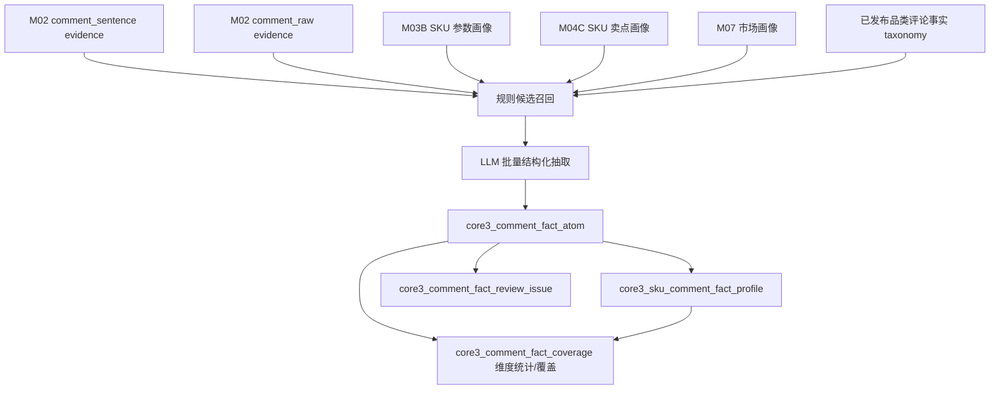

# M05C 评论事实画像详细设计

## 1. 文档定位

本文是 M05C 评论事实画像的工程详细设计，承接：

- `sop_requirements/M05C_comment_fact_profile_requirements.md`
- `09_tv_comment_fact_dimension_draft.md`
- `sop_detailed_design/M02_evidence_atom_design.md`
- `sop_detailed_design/M03B_sku_param_profile_design.md`
- `sop_detailed_design/M04C_claim_fact_profile_design.md`
- `sop_detailed_design/M07_market_profile_design.md`
- `08_layered_analysis_path_guidance.md`

M05C 是新事实层模块，不复用旧 M05/M06 作为主执行链路。它直接消费 M02 评论 evidence，并把 M03B 参数事实、M04C 卖点事实、M07 市场画像作为 SKU 上下文，生成 SKU 评论事实画像。

M05C-A 评论事实 taxonomy 不写生成程序。每个品类的 taxonomy 由分析者读取该品类真实评论和事实资产后人工/LLM 辅助生成，经人工确认后作为只读资产发布。工程实现只负责加载已发布 taxonomy；M05C-B 生成由 `catforge_pipeline` 执行，M05C-C 查询由 `catforge_insight` 执行。

业务讨论中提到的“m05b”对应本设计中的 M05C-B，也就是 SKU 评论事实画像生成阶段。该阶段必须调用 LLM 做评论语义分类、正负向判断、人群/用途/品牌力/竞品线索识别和复杂句拆解；规则只做候选召回、保护性判断和测试兜底。M05C-C 是查询阶段，只读取已生成结果，不调用 LLM。

## 2. 模块职责

### 2.1 必须回答的问题

1. 当前品类有哪些已发布标准评论事实维度。
2. 某 SKU 的评论覆盖了哪些事实维度。
3. 某 SKU 的评论支持了哪些参数事实。
4. 某 SKU 的评论反证了哪些参数事实。
5. 某 SKU 的评论支持了哪些卖点事实。
6. 某 SKU 的评论反证了哪些卖点事实。
7. 评论中出现了哪些人群、用途、尺寸/空间、价格/价值、品牌力、竞品提及和质量风险线索。
8. 某个评论事实维度或信号覆盖哪些 SKU。

### 2.2 不回答的问题

M05C 不回答：

- 用户任务最终分类。
- 目标客群最终分类。
- 价值战场最终分类。
- 卖点是否溢价。
- 核心竞品是谁。
- 竞品三槽位排序。

这些问题由后续新语义能力层、画像层和竞品分析层处理。

### 2.3 新执行顺序

新链路落地后，常规执行顺序为：

```text
M00
-> M01
-> M02
-> M03B 参数事实画像
-> M04C 卖点事实画像
-> M07 市场画像
-> M05C 评论事实画像
-> 新语义能力层
-> 新画像层
-> 新竞品分析层
```

旧 M05/M06 不进入新链路常规执行计划。它们只用于历史回看、迁移期对照验证和未迁移旧链路的临时兼容。

## 3. 总体流程



处理步骤：

1. 解析 `project_id`、`batch_id`、`product_category`、SKU 范围。
2. 按 `product_category` 加载已发布评论事实 taxonomy；未发布则阻断。
3. 读取 M02 `comment_sentence`，只读取当前 SKU chunk。
4. 读取同一 SKU 的 M03B 参数画像和 M04C 卖点画像。
5. 读取可用的 M07 市场画像，作为价格/尺寸解释上下文。
6. 使用规则对句子做快速候选召回。
7. 按 SKU + 批次调用 LLM 做结构化判断。
8. 标准化 LLM 输出，生成句级评论事实原子。
9. 按 SKU 聚合生成评论事实画像。
10. 按评论维度、二级维度、信号、参数支持和卖点支持生成批次级统计与覆盖。
11. 生成复核问题。
12. 每个 SKU chunk 提交一次。

## 4. Taxonomy 设计

### 4.1 首版存储方式

首版 taxonomy 使用人工维护的 YAML/JSON asset 或代码内置只读 asset，和 M03B/M04C 当前加载方式保持一致。重点是：taxonomy 是人工发布资产，不由运行时程序生成。后续可迁移到数据库资产表。

推荐版本：

```text
tv_comment_fact_taxonomy_manual_v0.1
```

多品类版本命名：

```text
{product_category}_comment_fact_taxonomy_manual_v{major}.{minor}
```

示例：

| 品类 | taxonomy version | 状态 |
| --- | --- | --- |
| TV | `tv_comment_fact_taxonomy_manual_v0.1` | 首版计划发布 |
| AC | `ac_comment_fact_taxonomy_manual_v0.1` | 未生成前不可执行 |
| WASHER | `washer_comment_fact_taxonomy_manual_v0.1` | 未生成前不可执行 |

### 4.2 Taxonomy 顶层结构

```json
{
  "taxonomy_version": "tv_comment_fact_taxonomy_manual_v0.1",
  "product_category": "TV",
  "source_doc": "docs/core3_mvp/real_data_v2/09_tv_comment_fact_dimension_draft.md",
  "dimensions": [],
  "subdimensions": [],
  "param_anchor_rules": [],
  "claim_anchor_rules": [],
  "signal_rules": [],
  "service_exclusion_rules": []
}
```

### 4.3 `dimensions`

| 字段 | 说明 |
| --- | --- |
| `dimension_code` | 稳定编码 |
| `dimension_name` | 中文名称 |
| `dimension_type` | `product_experience`、`audience`、`use_case`、`market_value`、`brand_power`、`competitor`、`risk`、`service_excluded` |
| `definition` | 维度定义 |
| `include_rules` | 包含规则 |
| `exclude_rules` | 排除规则 |
| `downstream_usage` | 可供哪些后续能力使用 |

TV 首版一级维度：

| `dimension_code` | 中文名 | `dimension_type` |
| --- | --- | --- |
| `picture_screen_experience` | 画质与屏幕体验 | `product_experience` |
| `audio_cinema_experience` | 音质与影院体验 | `product_experience` |
| `system_interaction_experience` | 系统性能与交互体验 | `product_experience` |
| `gaming_motion_experience` | 游戏与运动流畅 | `product_experience` |
| `appearance_installation_space` | 外观安装与空间适配 | `product_experience` |
| `price_value_perception` | 价格、价值与市场位置 | `market_value` |
| `audience_signal` | 人群线索 | `audience` |
| `use_case_signal` | 用途/用户任务线索 | `use_case` |
| `brand_power_signal` | 品牌力、复购与推荐 | `brand_power` |
| `competitor_comparison_signal` | 竞品提及与对比 | `competitor` |
| `product_quality_risk` | 质量稳定性与产品风险 | `risk` |
| `service_fulfillment_excluded` | 服务履约隔离 | `service_excluded` |

### 4.4 `subdimensions`

每个二级维度至少包含：

| 字段 | 说明 |
| --- | --- |
| `subdimension_code` | 稳定编码 |
| `dimension_code` | 一级维度 |
| `subdimension_name` | 中文名称 |
| `positive_patterns` | 正向表达 |
| `negative_patterns` | 负向表达 |
| `neutral_patterns` | 中性事实表达 |
| `negative_guard_patterns` | 负向关键词的反向保护，例如“不卡顿”“不反光” |
| `linked_param_codes` | 可关联标准参数 |
| `linked_claim_codes` | 可关联标准卖点 |
| `evidence_strength_policy` | 强/弱证据判断策略 |

### 4.5 品牌力与竞品规则

品牌力和竞品必须分开：

| 信号 | 判断规则 |
| --- | --- |
| `brand_trust` | 大品牌、老牌子、值得信赖、相信某品牌 |
| `brand_repurchase` | 再次购买、一直用、家里多台同品牌 |
| `brand_recommendation` | 朋友推荐、家人推荐、推荐购买 |
| `brand_loyalty` | 忠粉、全家电器同品牌、只看该品牌 |
| `competitor_compare` | 明确“比/对比/比较”且存在其他品牌/型号 |
| `replacement_source` | 原来用某品牌/型号，现在换成当前 SKU |

出现品牌词但没有信任、复购、推荐、比较关系时，只作为 `brand_mention` 弱信号，不直接算品牌力强证据。

## 5. 数据模型设计

### 5.1 `core3_comment_fact_atom`

句级评论事实原子。一个评论句可以输出多条事实。

| 字段 | 类型建议 | 必填 | 说明 |
| --- | --- | --- | --- |
| `comment_fact_atom_id` | text | 是 | 主键 |
| `project_id` | text | 是 | 项目 |
| `category_code` | text | 是 | 源品类 |
| `product_category` | text | 是 | 业务品类 |
| `batch_id` | text | 是 | 批次 |
| `run_id` | text | 否 | pipeline run |
| `module_run_id` | text | 否 | module run |
| `taxonomy_version` | text | 是 | 评论事实 taxonomy |
| `rule_version` | text | 是 | 规则版本 |
| `llm_model` | text | 否 | LLM 模型名 |
| `llm_prompt_version` | text | 否 | prompt 版本 |
| `sku_code` | text | 是 | SKU |
| `model_name` | text | 否 | 型号 |
| `brand_name` | text | 否 | 品牌 |
| `sentence_evidence_id` | text | 是 | M02 `comment_sentence` evidence |
| `comment_evidence_id` | text | 否 | M02 `comment_raw` evidence |
| `comment_id` | text | 否 | 原始评论 ID |
| `sentence_seq` | integer | 否 | 句序 |
| `evidence_text` | text | 是 | 证据句文本 |
| `dimension_code` | text | 是 | 一级维度 |
| `subdimension_code` | text | 是 | 二级维度 |
| `fact_type` | text | 是 | `product_experience`、`audience_signal`、`use_case_signal` 等 |
| `polarity` | text | 是 | `positive`、`negative`、`neutral`、`mixed`、`unknown` |
| `polarity_reason` | text | 否 | 情绪/正负向解释 |
| `evidence_strength` | text | 是 | `strong`、`medium`、`weak` |
| `normalized_phrases` | jsonb | 是 | 抽取短语 |
| `audience_signal_json` | jsonb | 是 | 人群线索 |
| `use_case_signal_json` | jsonb | 是 | 用途线索 |
| `size_space_signal_json` | jsonb | 是 | 尺寸/空间线索 |
| `price_value_signal_json` | jsonb | 是 | 价格/价值线索 |
| `brand_power_signal_json` | jsonb | 是 | 品牌力线索 |
| `competitor_signal_json` | jsonb | 是 | 竞品线索 |
| `linked_param_codes` | jsonb | 是 | 关联参数 |
| `linked_claim_codes` | jsonb | 是 | 关联卖点 |
| `support_relation` | text | 是 | 支持/反证/仅评论事实等 |
| `support_target_type` | text | 否 | `param`、`claim`、`dimension` |
| `support_target_codes` | jsonb | 是 | 支持或反证的参数/卖点 code |
| `sku_param_snapshot_json` | jsonb | 是 | 本 SKU 相关参数快照 |
| `sku_claim_snapshot_json` | jsonb | 是 | 本 SKU 相关卖点快照 |
| `extraction_method` | text | 是 | `rule_only`、`llm`、`hybrid` |
| `rule_hit_json` | jsonb | 是 | 规则候选 |
| `llm_raw_json` | jsonb | 是 | LLM 原始结构化输出 |
| `confidence` | numeric | 是 | 0-1 |
| `review_required` | boolean | 是 | 是否复核 |
| `review_reason_json` | jsonb | 是 | 复核原因 |
| `fact_hash` | text | 是 | 结果 hash |
| `is_current` | boolean | 是 | 当前版本 |
| `created_at` | timestamptz | 是 | 创建时间 |
| `updated_at` | timestamptz | 是 | 更新时间 |

唯一约束：

```text
project_id + category_code + product_category + batch_id
+ taxonomy_version + rule_version + sku_code
+ sentence_evidence_id + dimension_code + subdimension_code
+ support_relation + is_current
```

索引：

- `(project_id, category_code, batch_id, sku_code, is_current)`
- `(dimension_code, subdimension_code, polarity)`
- GIN `linked_param_codes`
- GIN `linked_claim_codes`
- GIN `brand_power_signal_json`
- GIN `competitor_signal_json`
- GIN `audience_signal_json`
- GIN `use_case_signal_json`

### 5.2 `core3_sku_comment_fact_profile`

SKU 评论事实画像聚合表。每个 SKU 每个 taxonomy/rule 一条。

| 字段 | 类型建议 | 必填 | 说明 |
| --- | --- | --- | --- |
| `sku_comment_profile_id` | text | 是 | 主键 |
| `project_id` | text | 是 | 项目 |
| `category_code` | text | 是 | 源品类 |
| `product_category` | text | 是 | 业务品类 |
| `batch_id` | text | 是 | 批次 |
| `run_id` | text | 否 | pipeline run |
| `module_run_id` | text | 否 | module run |
| `taxonomy_version` | text | 是 | 评论事实 taxonomy |
| `rule_version` | text | 是 | 规则版本 |
| `sku_code` | text | 是 | SKU |
| `model_name` | text | 否 | 型号 |
| `brand_name` | text | 否 | 品牌 |
| `comment_raw_count` | integer | 是 | M02 可用评论原文数 |
| `comment_sentence_count` | integer | 是 | M02 可用评论句数 |
| `comment_fact_count` | integer | 是 | 事实原子数 |
| `positive_fact_count` | integer | 是 | 正向事实数 |
| `negative_fact_count` | integer | 是 | 负向事实数 |
| `mixed_fact_count` | integer | 是 | 混合事实数 |
| `dimension_summary_json` | jsonb | 是 | 各评论维度摘要 |
| `supported_param_codes` | jsonb | 是 | 被评论支持的参数 |
| `contradicted_param_codes` | jsonb | 是 | 被评论反证的参数 |
| `unmentioned_param_codes` | jsonb | 是 | 有参数但评论未提及 |
| `comment_only_param_candidates` | jsonb | 是 | 评论有事实但参数缺失 |
| `supported_claim_codes` | jsonb | 是 | 被评论支持的卖点 |
| `contradicted_claim_codes` | jsonb | 是 | 被评论反证的卖点 |
| `unmentioned_claim_codes` | jsonb | 是 | 有卖点但评论未提及 |
| `comment_only_claim_candidates` | jsonb | 是 | 评论有事实但卖点缺失 |
| `audience_signals_json` | jsonb | 是 | 人群线索 |
| `use_case_signals_json` | jsonb | 是 | 用途线索 |
| `size_space_signals_json` | jsonb | 是 | 尺寸/空间线索 |
| `price_value_signals_json` | jsonb | 是 | 价格/价值线索 |
| `brand_power_signals_json` | jsonb | 是 | 品牌力线索 |
| `competitor_signals_json` | jsonb | 是 | 竞品提及线索 |
| `quality_risk_summary_json` | jsonb | 是 | 产品风险摘要 |
| `positive_evidence_examples_json` | jsonb | 是 | 典型正向证据 |
| `negative_evidence_examples_json` | jsonb | 是 | 典型负向证据 |
| `review_issue_summary_json` | jsonb | 是 | 复核摘要 |
| `input_fingerprint` | text | 是 | 输入 fingerprint |
| `profile_hash` | text | 是 | 画像 hash |
| `processing_status` | text | 是 | `success`、`warning`、`blocked`、`failed` |
| `is_current` | boolean | 是 | 当前版本 |
| `created_at` | timestamptz | 是 | 创建时间 |
| `updated_at` | timestamptz | 是 | 更新时间 |

唯一约束：

```text
project_id + category_code + product_category + batch_id
+ taxonomy_version + rule_version + sku_code + is_current
```

### 5.3 `core3_comment_fact_coverage`

评论事实维度统计与覆盖表。它不是单纯查询缓存，而是 M05C-B 的正式分析输出，作用类似 M03B 的参数档位覆盖、M04C 的卖点位置覆盖。

M05C-B 每次生成 SKU 评论事实画像后，必须同步生成以下统计覆盖：

- 评论事实一级维度覆盖。
- 评论事实二级维度覆盖。
- 人群、用途、尺寸/空间、价格/价值、品牌力、竞品提及覆盖。
- 标准参数被评论支持/反证覆盖。
- 标准卖点被评论支持/反证覆盖。

| 字段 | 类型建议 | 必填 | 说明 |
| --- | --- | --- | --- |
| `coverage_id` | text | 是 | 主键 |
| `project_id` | text | 是 | 项目 |
| `category_code` | text | 是 | 源品类 |
| `product_category` | text | 是 | 业务品类 |
| `batch_id` | text | 是 | 批次 |
| `taxonomy_version` | text | 是 | taxonomy |
| `rule_version` | text | 是 | rule |
| `coverage_type` | text | 是 | `dimension`、`subdimension`、`audience`、`use_case`、`size_space`、`price_value`、`brand_power`、`competitor`、`param_support`、`claim_support` |
| `coverage_code` | text | 是 | 维度 code、signal code、param code 或 claim code |
| `coverage_name` | text | 是 | 中文名 |
| `relation` | text | 是 | `mentioned`、`supports`、`contradicts`、`positive`、`negative` |
| `sku_count` | integer | 是 | 覆盖 SKU 数 |
| `sentence_count` | integer | 是 | 覆盖句数 |
| `comment_count` | integer | 是 | 覆盖评论数 |
| `positive_sentence_count` | integer | 是 | 正向句数 |
| `negative_sentence_count` | integer | 是 | 负向句数 |
| `mixed_sentence_count` | integer | 是 | 混合句数 |
| `neutral_sentence_count` | integer | 是 | 中性句数 |
| `strong_evidence_count` | integer | 是 | 强证据数 |
| `supported_param_count` | integer | 是 | 支持参数数 |
| `contradicted_param_count` | integer | 是 | 反证参数数 |
| `supported_claim_count` | integer | 是 | 支持卖点数 |
| `contradicted_claim_count` | integer | 是 | 反证卖点数 |
| `sku_codes` | jsonb | 是 | 覆盖 SKU |
| `top_sku_codes` | jsonb | 是 | Top SKU |
| `dimension_stats_json` | jsonb | 是 | 维度统计明细，例如正负向、强弱证据、参数/卖点关联 |
| `sample_evidence_json` | jsonb | 是 | 样例证据 |
| `sample_status` | text | 是 | `sufficient`、`thin`、`insufficient` |
| `review_required` | boolean | 是 | 是否需要复核 |
| `review_reason_json` | jsonb | 是 | 复核原因 |
| `coverage_hash` | text | 是 | hash |
| `is_current` | boolean | 是 | 当前版本 |
| `created_at` | timestamptz | 是 | 创建时间 |
| `updated_at` | timestamptz | 是 | 更新时间 |

唯一约束：

```text
project_id + category_code + product_category + batch_id
+ taxonomy_version + rule_version + coverage_type
+ coverage_code + relation + is_current
```

### 5.4 `core3_comment_fact_review_issue`

复核问题表。

| 字段 | 类型建议 | 必填 | 说明 |
| --- | --- | --- | --- |
| `issue_id` | text | 是 | 主键 |
| `project_id` | text | 是 | 项目 |
| `category_code` | text | 是 | 源品类 |
| `product_category` | text | 是 | 业务品类 |
| `batch_id` | text | 是 | 批次 |
| `sku_code` | text | 否 | SKU |
| `related_atom_id` | text | 否 | 相关事实原子 |
| `related_profile_id` | text | 否 | 相关 SKU 画像 |
| `issue_type` | text | 是 | 问题类型 |
| `severity` | text | 是 | `low`、`medium`、`high` |
| `issue_summary` | text | 是 | 问题摘要 |
| `evidence_ids` | jsonb | 是 | 证据 |
| `suggested_action` | text | 是 | 建议动作 |
| `issue_status` | text | 是 | `open`、`approved`、`rejected`、`waived` |
| `created_at` | timestamptz | 是 | 创建时间 |
| `updated_at` | timestamptz | 是 | 更新时间 |

常见 `issue_type`：

- `comment_param_missing`
- `comment_claim_missing`
- `comment_param_contradiction`
- `comment_claim_contradiction`
- `sentiment_direction_uncertain`
- `brand_competitor_ambiguous`
- `service_leakage`
- `llm_parse_failed`

## 6. 服务组件设计

### 6.1 组件列表

| 组件 | 职责 |
| --- | --- |
| `M05CCommentTaxonomyLoader` | 加载已发布评论事实 taxonomy |
| `M05CCommentEvidenceReader` | 读取 M02 评论句和评论原文 |
| `M05CSkuContextReader` | 读取 M03B 参数、M04C 卖点、M07 市场上下文 |
| `M05CRulePreclassifier` | 规则候选召回和低风险直接命中 |
| `M05CLlmBatchExtractor` | 按 SKU/批次调用 LLM 输出结构化事实 |
| `M05CFactNormalizer` | 校验 LLM JSON、标准化事实、建立支持/反证关系 |
| `M05CProfileAggregator` | 聚合 SKU 评论事实画像 |
| `M05CCoverageBuilder` | 生成维度/信号/参数/卖点的批次级统计与覆盖 |
| `M05CReviewIssueBuilder` | 生成复核问题 |
| `M05CRepository` | 写入四类结果表 |
| `M05CRunner` | 模块编排、分批、事务、重试、输出 summary |

`M05CCommentTaxonomyLoader` 只做加载和校验，不做自动生成。它必须按 `product_category` 和 `taxonomy_version` 精确匹配资产：

| 情况 | 行为 |
| --- | --- |
| TV + 已发布 TV taxonomy | 正常加载 |
| AC/其他品类 + taxonomy 未发布 | 抛出明确错误 |
| 未指定 taxonomy version | 使用该品类默认发布版本 |
| 指定 taxonomy version 不存在 | 抛出明确错误 |
| SKU 前缀与 product_category 不匹配 | 阻断或进入复核，不得跨品类混跑 |

### 6.2 SKU 上下文压缩

传给 LLM 的 SKU 上下文必须压缩，避免 token 过大。

上下文结构：

```json
{
  "sku": {
    "sku_code": "TV00030054",
    "model_name": "75VX3S",
    "brand_name": "VIDDA"
  },
  "key_params": {
    "screen_size_inch": 75,
    "display_tech": "MiniLED",
    "refresh_rate_hz": 300,
    "brightness_nit": 1300,
    "local_dimming_zone_count": 320,
    "ram_gb": 3,
    "storage_gb": 128,
    "hdmi_2_1_port_count": 1,
    "voice_engine": "讯飞",
    "ai_model_name": "海信星海"
  },
  "param_tiers": {
    "size": "xlarge_70_85",
    "picture_overall": "picture_premium",
    "performance": "perf_high",
    "smart": "smart_ai_voice"
  },
  "fact_claims": [
    {
      "claim_code": "tv_claim_high_refresh_rate",
      "claim_name": "高刷新率",
      "param_support_status": "supported"
    }
  ],
  "market_context": {
    "price_band": "optional",
    "size_segment": "75"
  }
}
```

### 6.3 LLM 输入与输出

每个 LLM batch 输入：

```json
{
  "taxonomy_version": "tv_comment_fact_taxonomy_manual_v0.1",
  "taxonomy_summary": {},
  "sku_context": {},
  "sentences": [
    {
      "sentence_evidence_id": "sha256:...",
      "comment_id": "xxx",
      "sentence_seq": 1,
      "text": "画质清晰，系统流畅不卡顿"
    }
  ]
}
```

LLM 必须输出：

```json
{
  "facts": [
    {
      "sentence_evidence_id": "sha256:...",
      "dimension_code": "picture_screen_experience",
      "subdimension_code": "clarity_resolution",
      "polarity": "positive",
      "evidence_strength": "medium",
      "normalized_phrases": ["画质清晰"],
      "linked_param_codes": ["resolution_class"],
      "linked_claim_codes": [],
      "support_relation": "supports_sku_param",
      "support_target_codes": ["resolution_class"],
      "confidence": 0.82,
      "reason": "评论正向评价清晰度，SKU 参数中有 4K 清晰度。"
    }
  ],
  "review_issues": []
}
```

### 6.4 LLM 配置

LLM 配置只从环境变量读取：

| 环境变量 | 说明 |
| --- | --- |
| `CATFORGE_M05C_LLM_BASE_URL` | M05C 专用 OpenAI-compatible base URL，默认 `https://api.deepseek.com` |
| `CATFORGE_M05C_LLM_API_KEY` | M05C 专用 API key |
| `CATFORGE_M05C_LLM_MODEL` | M05C 专用 model，默认 `deepseek-v4-pro` |
| `CATFORGE_M05C_LLM_TIMEOUT_SECONDS` | M05C 专用超时，默认 90 秒 |
| `CATFORGE_LLM_BASE_URL` / `OPENAI_BASE_URL` | 通用 fallback base URL |
| `CATFORGE_LLM_API_KEY` / `DEEPSEEK_API_KEY` / `OPENAI_API_KEY` | 通用 fallback API key |
| `CATFORGE_LLM_MODEL` / `OPENAI_MODEL` | 通用 fallback model |

不得把 API key 写入代码、文档、日志或测试快照。

运行模式：

| `llm_mode` | 用途 | 行为 |
| --- | --- | --- |
| `required` | 205 实库验证和正式需要确认调用模型的运行 | 未配置或调用失败即失败 |
| `auto` | 普通联调 | 配置了 LLM 就调用；未配置时退回规则候选并给 warning |
| `off` | 本地确定性测试 | 不调用外部 LLM |

## 7. 抽取规则设计

### 7.1 规则预分类

规则预分类只做候选召回：

| 候选类型 | 示例关键词 |
| --- | --- |
| 画质 | 画质、清晰、色彩、亮度、暗场、反光、护眼、拖影 |
| 音质 | 音质、声音、音响、环绕、低音、影院 |
| 系统 | 系统、流畅、卡顿、广告、遥控、语音、投屏 |
| 游戏 | 游戏、高刷、刷新率、PS5、HDMI2.1、看球 |
| 人群 | 老人、孩子、父母、家人、宝宝、租房 |
| 用途 | 客厅、卧室、追剧、电影、投屏、游戏 |
| 价格 | 性价比、价格、便宜、贵、补贴、同价位 |
| 品牌力 | 大品牌、老牌子、值得信赖、再次购买、推荐 |
| 竞品 | 比、对比、比较、索尼、TCL、小米、创维等品牌词 |

### 7.2 正负向保护

规则必须先识别正向否定：

| 表达 | polarity |
| --- | --- |
| 不卡顿 | positive |
| 无广告 | positive |
| 不反光 | positive |
| 不刺眼 | positive |
| 没有拖影 | positive |
| 广告太多 | negative |
| 卡顿 | negative |
| 反光严重 | negative |
| 刺眼 | negative |
| 拖影 | negative |

无法确定时交给 LLM，并标记 `sentiment_direction_uncertain`。

### 7.3 支持/反证关系

判断顺序：

1. 评论事实是否命中维度。
2. 该维度是否有可关联参数/卖点。
3. 本 SKU 是否存在这些参数/卖点。
4. 评论正负向是否与参数/卖点一致。
5. 输出支持、反证、未覆盖或仅评论事实。

示例：

| 情况 | 输出 |
| --- | --- |
| SKU 有 `declared_refresh_rate_hz=300`，评论说“高刷游戏拉满” | `supports_sku_param` + `supports_sku_claim` |
| SKU 有“系统流畅”卖点，评论说“系统卡顿” | `contradicts_sku_claim` |
| 评论说“音质很好”，但缺音响硬参数 | `comment_only_product_fact` + `comment_claim_candidate` |
| 评论说“创维老牌子，值得信赖” | `brand_power_signal_only` |
| 评论说“比索尼便宜，画质也够用” | `competitor_signal_only` + 价格/画质事实 |

## 8. 增量与性能设计

### 8.1 分批策略

默认参数：

| 参数 | 默认值 |
| --- | ---: |
| `sku_chunk_size` | 20 |
| `llm_batch_size` | 20 |
| `max_parallel_llm_requests` | 1 |
| `commit_every_sku_chunk` | true |

`M05CRunner` 每次只读取当前 SKU chunk 的：

- M02 评论句。
- M02 评论原文摘要。
- M03B 参数画像。
- M04C 卖点画像。
- M07 市场画像。

不得一次加载全量 M02 评论句。

### 8.2 输入 fingerprint

每个 SKU 的 `input_fingerprint` 应包括：

- 本 SKU M02 comment_sentence evidence ids/hash。
- 本 SKU M03B profile_hash。
- 本 SKU M04C profile_hash。
- 本 SKU M07 market profile hash 或空标记。
- taxonomy_version。
- rule_version。
- prompt_version。

fingerprint 未变化且历史输出 `is_current=true` 时可跳过。

### 8.3 事务策略

每个 SKU chunk 一个事务：

1. 写入或替换 atom。
2. 写入或替换 profile。
3. 写入或替换 coverage 受影响部分。
4. 写入 review issue。
5. commit。

`--force-rebuild` 允许替换同 business key 但 hash 不同的 current 记录；默认遇到 hash 冲突应失败，避免覆盖不可解释结果。

## 9. CLI 设计

### 9.1 `catforge_pipeline`

`catforge_pipeline` 只执行 M05C-B 生成，不生成 M05C-A taxonomy，也不承担 M05C-C 查询。

自然语言：

```bash
python -m app.cli.catforge_pipeline ask "生成彩电评论事实画像" --llm-mode required --format json
python -m app.cli.catforge_pipeline ask "重跑 TV00030054 的评论画像" --llm-mode required --format json
python -m app.cli.catforge_pipeline ask "新数据来了，把彩电评论事实准备好" --llm-mode required --format json
```

原子命令：

```bash
python -m app.cli.catforge_pipeline run-comment-profile \
  --product-category tv \
  --batch-id latest \
  --llm-mode required \
  --llm-batch-size 20 \
  --format json
```

参数：

| 参数 | 说明 |
| --- | --- |
| `--project-id` | 默认当前 205 project |
| `--batch-id` | 默认 `latest` |
| `--product-category` | 首版支持 `tv` |
| `--sku-code` | 可重复，限定 SKU |
| `--max-sentences-per-sku` | 每个 SKU 读取的 M02 评论句上限，默认 500 |
| `--llm-mode` | `required`、`auto` 或 `off`；205 实库验证使用 `required` |
| `--llm-batch-size` | LLM 句子批次大小 |
| `--force-rebuild` | 允许替换现有 current 结果 |
| `--format` | `json` 或 `text` |

多品类行为：

| 请求 | 行为 |
| --- | --- |
| `--product-category tv` 且 TV taxonomy 已发布 | 执行 |
| `--product-category ac` 但 AC taxonomy 未发布 | 返回 `error: comment taxonomy not published for AC` |
| 未指定 `--product-category` | 从自然语言或 SKU 前缀推断；无法推断时报错 |
| 指定多个 SKU 且跨品类 | 阻断，要求拆分执行 |

输出 summary：

```json
{
  "ok": true,
  "module": "M05C",
  "batch_id": "m00_...",
  "product_category": "TV",
  "sku_count": 183,
  "sentence_count": 20060,
  "comment_fact_atom_count": 0,
  "sku_comment_profile_count": 0,
  "coverage_count": 0,
  "dimension_coverage_count": 0,
  "signal_coverage_count": 0,
  "param_support_coverage_count": 0,
  "claim_support_coverage_count": 0,
  "review_issue_count": 0,
  "llm_stats": {
    "llm_mode": "required",
    "llm_called": true,
    "llm_model": "deepseek-v4-pro",
    "llm_batch_count": 0
  },
  "skipped_unchanged_count": 0,
  "warnings": []
}
```

### 9.2 `catforge_insight`

自然语言：

```bash
python -m app.cli.catforge_insight ask "查 TV00030054 的评论事实画像" --format json
python -m app.cli.catforge_insight ask "查彩电评论事实维度" --format json
python -m app.cli.catforge_insight ask "哪些 SKU 的品牌力评论强" --sku-limit 100 --format json
python -m app.cli.catforge_insight ask "哪些 SKU 评论里提到索尼" --sku-limit 100 --format json
python -m app.cli.catforge_insight ask "哪些 SKU 的高刷卖点被评论支持" --sku-limit 100 --format json
```

原子命令：

```bash
python -m app.cli.catforge_insight sku-comment-profile --sku-code TV00030054 --include-comment-facts --format json
python -m app.cli.catforge_insight comment-taxonomy --product-category tv --format json
python -m app.cli.catforge_insight comment-dimension-coverage --dimension-code picture_screen_experience --sku-limit 100 --format json
python -m app.cli.catforge_insight comment-dimension-coverage --coverage-type brand_power_signal --query "值得信赖" --sku-limit 100 --format json
python -m app.cli.catforge_insight comment-dimension-coverage --coverage-type param_support --coverage-key declared_refresh_rate_hz --sku-limit 100 --format json
python -m app.cli.catforge_insight comment-dimension-coverage --coverage-type claim_support --coverage-key tv_claim_high_refresh_rate --sku-limit 100 --format json
```

`comment-taxonomy` 只读取已发布 taxonomy 资产，不能触发 taxonomy 生成。

## 10. Claude Code skill 设计

### 10.1 `catforge-pipeline` skill 更新

新增触发语：

- “生成彩电评论事实画像”
- “重跑某个 SKU 的评论画像”
- “新数据来了，把评论事实准备好”
- “评论事实可以分析了吗”
- “先跑评论事实画像”

执行策略：

1. 优先使用 `catforge_pipeline ask`。
2. 明确指定 SKU 时添加 `--sku-code`。
3. 205 实库验证默认添加 `--llm-mode required --llm-batch-size 20`。
4. 205 负载敏感时先限定 `--sku-code` 或降低 `--max-sentences-per-sku`，再放大全量范围。
5. CLI 返回 `error` 时不得声称完成。
6. 如果用户要求“生成某品类评论事实维度 taxonomy”，Claude Code 不应调用 pipeline CLI；应提示该动作需要由分析者先生成并发布 taxonomy 文档/资产。

### 10.2 `catforge-insight` skill 更新

新增触发语：

- “查某 SKU 的评论事实画像”
- “评论是否支持某个卖点”
- “评论是否反证某个参数”
- “哪些 SKU 品牌力强”
- “哪些 SKU 评论提到某品牌/型号”
- “老人/孩子/客厅/游戏这些评论线索覆盖哪些 SKU”

查询策略：

1. 优先使用 `catforge_insight ask`。
2. 查询 SKU 时优先返回 SKU 评论事实画像摘要。
3. 查询维度覆盖时返回 SKU count、样例 SKU 和证据句。
4. 查询品牌力时必须区分品牌信任/复购/推荐与竞品对比。
5. 查询竞品时必须只返回明确比较、替换来源或跨品牌提及，不把本品牌复购误报为竞品。

## 11. API 设计

首版可以先只实现 CLI，不强制 API。若需要 API，建议：

| 方法 | 路径 | 说明 |
| --- | --- | --- |
| `POST` | `/api/mvp/core3/v2/projects/{project_id}/batches/{batch_id}/comments/m05c/run` | 执行评论事实画像 |
| `GET` | `/api/mvp/core3/v2/projects/{project_id}/batches/{batch_id}/comments/m05c/profiles/{sku_code}` | 查询 SKU 评论事实画像 |
| `GET` | `/api/mvp/core3/v2/projects/{project_id}/comments/m05c/taxonomy` | 查询评论事实 taxonomy |
| `GET` | `/api/mvp/core3/v2/projects/{project_id}/batches/{batch_id}/comments/m05c/coverage` | 查询维度/信号覆盖 |

API 必须复用 CLI/service，不允许另写业务逻辑。

## 12. 测试设计

### 12.1 单元测试

| 测试 | 目的 |
| --- | --- |
| `test_m05c_taxonomy_loads_tv_asset` | TV taxonomy 可加载 |
| `test_m05c_blocks_unpublished_category_taxonomy` | 未发布 taxonomy 的品类必须阻断，不能借用 TV taxonomy |
| `test_m05c_rule_preclassifier_positive_negation` | “不卡顿/无广告/不反光”判为正向 |
| `test_m05c_brand_power_not_competitor` | 本品牌复购进入品牌力，不进入竞品 |
| `test_m05c_competitor_comparison_detected` | 明确“比索尼好/差”进入竞品 |
| `test_m05c_supports_param_when_sku_has_param` | 评论支持本 SKU 参数 |
| `test_m05c_comment_only_when_param_missing` | 参数缺失时不自动补参数 |
| `test_m05c_service_excluded` | 服务履约不进入产品事实 |
| `test_m05c_llm_json_schema_validation` | LLM 输出 schema 校验 |

### 12.2 集成测试

| 测试 | 目的 |
| --- | --- |
| `test_m05c_run_one_sku_with_fake_llm` | 指定 SKU 生成 atom/profile/coverage |
| `test_m05c_skip_unchanged_profile` | fingerprint 不变时跳过 |
| `test_m05c_force_rebuild_replaces_current` | force rebuild 可替换 current |
| `test_pipeline_cli_run_comment_profile_offline_mode` | pipeline CLI 在 `llm-mode=off` 下可确定性运行 |
| `test_insight_cli_sku_comment_profile` | insight CLI 查询 SKU 画像 |
| `test_claude_skill_examples_match_cli` | skill 示例命令与 CLI 一致 |

所有测试必须使用 fake LLM，不得发起外部 API 调用。

## 13. 迁移与开发任务

### 13.1 迁移

新增迁移：

- `core3_comment_fact_atom`
- `core3_sku_comment_fact_profile`
- `core3_comment_fact_coverage`
- `core3_comment_fact_review_issue`

### 13.2 服务实现顺序

1. 新增 taxonomy dataclass/loader，并接入人工发布的 TV 首版 taxonomy 资产。
2. 新增 ORM 和 Alembic migration。
3. 实现 M05C readers。
4. 实现规则预分类和正负向保护。
5. 实现 LLM adapter 和 fake LLM。
6. 实现 atom normalizer。
7. 实现 profile aggregator。
8. 实现 coverage builder。
9. 实现 repository 和 runner。
10. 接入 `catforge_pipeline`。
11. 接入 `catforge_insight`。
12. 更新 Claude Code skills。
13. 更新 CLI/skill manual。

不实现 M05C-A taxonomy 生成 runner、生成 CLI 或自动归纳服务。新增其他品类时，由分析者先生成该品类 taxonomy 资产，工程侧只扩展 loader 可见资产和必要测试。

## 14. 验收样例

以当前 205 数据为基线：

| SKU | 预期样例输出 |
| --- | --- |
| `TV00030054` | 评论强支持画质、音质、系统流畅、游戏/高刷、家庭观影、性价比、品牌力；音响硬参数缺口进入评论补充候选 |
| `TV00028424` | 评论总体支持 MiniLED 画质、控光、家庭观影、老人小孩易用、性价比、创维品牌力；同时保留画质/音响反证和尺寸推荐风险 |

验收时必须能通过 CLI 查询上述 SKU，并返回证据句。
