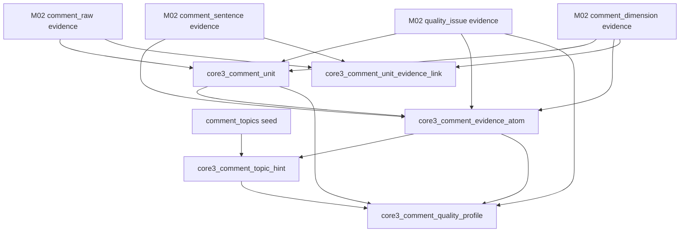
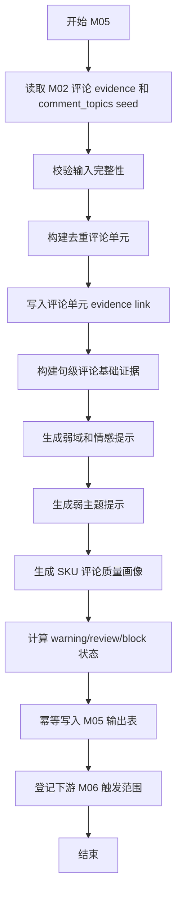

# M05 评论基础证据层详细设计

## 1. 文档定位

本文是 CatForge 彩电核心三竞品 SOP 的 M05 详细设计，承接：

- 需求文档：`docs/core3_mvp/real_data_v2/sop_requirements/M05_comment_evidence_requirements.md`
- 总体设计：`docs/core3_mvp/real_data_v2/sop_detailed_design/00_architecture_data_dictionary_design.md`
- 上游 M01：`core3_clean_comment`、`core3_clean_comment_sentence`、`core3_clean_comment_dimension`
- 上游 M02：`core3_evidence_atom` 中的评论原文、评论句、评论维度、质量问题 evidence
- 下游 M06：评论下游信号抽取层

M05 的目标不是直接判断用户任务、目标客群、价值战场或竞品关系，而是把真实评论沉淀成可复用、可追溯、可增量重跑的评论基础证据底座。

本模块必须解决当前真实样例数据的评论特点：

| 数据事实 | 对 M05 的设计要求 |
| --- | --- |
| `comment_data` 有 62426 行 | 不能直接按原始行统计评论声量 |
| 只有 34438 个不同 `comment_id` | 必须形成去重评论单元 |
| 只有 13514 个不同正文 hash | 必须识别同正文、多维度拆行和模板重复 |
| 20916 个不同 `comments_segments` | 必须保留原始分段和系统切句关系 |
| 空维度约 15766 行 | 空维度不能丢弃，只能作为弱标签缺失 |
| 情感空值 15766 行 | 空情感必须是 `unknown`，不能当 neutral |
| 安装服务维度占比高 | 服务、物流、安装不得误用于产品卖点或产品战场高置信判断 |
| 85E7Q 有 3621 行评论、1648 个去重评论 ID | 目标演示 SKU 必须形成可用句级证据 |

## 2. 模块职责

### 2.1 本模块解决什么

M05 解决评论基础证据工程化问题：

1. 把 M02 评论 evidence 合并成去重评论单元。
2. 把评论正文和评论分段沉淀为句级评论基础证据。
3. 标记低价值、重复、默认评价、模板化和质量风险。
4. 保留原始维度路径和原始情感作为弱标签。
5. 生成基础弱域提示，例如产品体验、产品风险、价格感知、服务体验、物流安装。
6. 基于评论主题 seed 生成弱主题提示。
7. 生成 SKU 粒度评论质量画像，供 M06、M08、M15、M16 判断评论是否可用。

### 2.2 本模块不解决什么

| 不做事项 | 原因 | 后续模块 |
| --- | --- | --- |
| 不直接生成用户任务 | 评论主题只是线索，任务需要卖点、参数、评论、市场共推 | M09 |
| 不直接生成目标客群 | 客群需要任务、价格带、渠道、评论线索综合推断 | M10 |
| 不直接生成价值战场 | 战场需要任务、客群、参数、卖点、市场共同支撑 | M11 |
| 不直接激活产品卖点 | 卖点激活由 M04a/M04b 控制，M05 只给评论基础证据 | M04b |
| 不判断竞品关系 | 竞品判断由候选池、评分和三槽位选择完成 | M12-M14 |
| 不把原始维度当最终主题 | 原始维度是平台弱标签，可能为空或与文本不一致 | M06 |
| 不把服务体验当产品体验 | 安装、配送、客服不能替代画质、游戏、护眼等产品证据 | M06/M04b/M11 |
| 不直接读取 `comment_data` | 分层要求下游必须基于 M01/M02 产物 | M00-M02 |

### 2.3 允许复用历史结果

允许复用历史 M05 输出，但必须同时满足：

- 上游 `comment_raw`、`comment_sentence`、`comment_dimension`、`quality_issue` evidence hash 未变化。
- `comment_topics` seed 版本未变化。
- M05 规则版本未变化。
- 对应 SKU 的 `input_fingerprint` 未变化。
- 历史记录 `is_current=true` 且 `processing_status` 不是 `failed`、`blocked`。

## 3. 输入输出总览

### 3.1 上游输入

M05 以 M02 evidence 为主输入。M01 清洗表只作为 evidence payload 已不足时的可追溯补充，服务实现应优先通过 `core3_evidence_atom` 的字段和 `evidence_payload_json` 读取，不允许绕过 M02 直接读原始表。

| 输入 | 来源模块 | 表 | 过滤条件 | 用途 |
| --- | --- | --- | --- | --- |
| 评论原文 evidence | M02 | `core3_evidence_atom` | `evidence_type='comment_raw'` | 构建评论单元 |
| 评论句 evidence | M02 | `core3_evidence_atom` | `evidence_type='comment_sentence'` | 构建句级基础证据 |
| 评论维度 evidence | M02 | `core3_evidence_atom` | `evidence_type='comment_dimension'` | 保留原始维度弱标签 |
| 质量问题 evidence | M02 | `core3_evidence_atom` | `evidence_type='quality_issue'` 且 comment 相关 | 标记低价值、重复、空维度等 |
| 评论主题 seed | 规则资产 | `tv_core3_mvp_seed_v0_2.json.comment_topics` | `category_code='TV'` | 生成弱主题提示 |

### 3.2 下游输出

| 输出表 | 输出粒度 | 下游用途 |
| --- | --- | --- |
| `core3_comment_unit` | SKU + 去重评论单元 | 统一评论数量、重复率、来源追溯 |
| `core3_comment_unit_evidence_link` | 评论单元 + M02 evidence | 保存去重单元与原始行、句、维度、质量问题关系 |
| `core3_comment_evidence_atom` | 评论句级基础证据 | M06 下游信号抽取的唯一评论句输入 |
| `core3_comment_topic_hint` | 评论句 + 弱主题 | M06 的主题线索、M15 的证据展示辅助 |
| `core3_comment_quality_profile` | SKU + 批次 | M06/M08/M16 判断评论证据可用性 |

### 3.3 输入输出关系



## 4. 数据模型设计

### 4.1 通用字段约定

M05 所有输出表必须包含以下通用字段，除特殊说明外均必填。

| 字段 | 类型建议 | 说明 |
| --- | --- | --- |
| `project_id` | `text` | 项目 ID |
| `category_code` | `text` | MVP 为 `TV` |
| `batch_id` | `text` | M00 批次 |
| `run_id` | `text` | M16 全链路运行 ID，可为空 |
| `module_run_id` | `text` | M05 本次模块运行 ID |
| `sku_code` | `text` | SKU 编码 |
| `model_name` | `text` | 型号展示名 |
| `brand_name` | `text` | 品牌名，当前样例为海信 |
| `rule_version` | `text` | M05 规则版本，例如 `m05_comment_evidence_v1` |
| `asset_version` | `text` | seed 资产版本 |
| `input_fingerprint` | `text` | 当前输出依赖的上游输入 hash |
| `result_hash` | `text` | 当前输出业务内容 hash |
| `is_current` | `boolean` | 是否当前版本 |
| `processing_status` | `text` | `success`、`warning`、`review_required`、`blocked`、`failed` |
| `review_required` | `boolean` | 是否需要复核 |
| `review_status` | `text` | `auto_pass`、`review_required`、`approved`、`rejected`、`waived` |
| `review_reason_json` | `jsonb` | 复核原因列表 |
| `created_at` | `timestamptz` | 创建时间 |
| `updated_at` | `timestamptz` | 更新时间 |

### 4.2 枚举定义

#### 4.2.1 评论单元状态

| 枚举 | 含义 |
| --- | --- |
| `usable` | 有实际文本，可用于下游基础分析 |
| `low_value` | 文本低价值，只可计入质量画像，不可形成强信号 |
| `duplicate_only` | 仅作为重复来源保留，不形成独立评论单元 |
| `blocked` | 关键字段缺失，不能形成可追溯证据 |

#### 4.2.2 弱域提示

| 枚举 | 中文含义 | 下游限制 |
| --- | --- | --- |
| `product_experience` | 产品体验 | 可进入 M06 产品体验信号 |
| `product_risk` | 产品风险 | 可进入 M06 风险和痛点信号 |
| `market_perception` | 价格价值感 | 可进入 M06 价格价值感信号 |
| `service_experience` | 服务体验 | 不能直接增强产品卖点 |
| `logistics_installation` | 物流安装 | 不能直接增强产品卖点 |
| `unknown` | 未知或低价值 | 只能用于质量画像或复核 |

#### 4.2.3 情感弱标签

| 枚举 | 说明 |
| --- | --- |
| `positive` | 正向 |
| `negative` | 负向 |
| `neutral` | 明确中立 |
| `unknown` | 原始为空、文本无法判断或低价值 |
| `conflict` | 原始情感和文本情感明显冲突 |

空情感必须落为 `unknown`，不能落为 `neutral`。这是 M05 对旧参考文档的明确修正，以已强化需求为准。

#### 4.2.4 低价值原因

| 枚举 | 判断说明 |
| --- | --- |
| `empty_text` | 空文本 |
| `default_positive` | 默认好评、此用户未填写评价 |
| `punctuation_only` | 只有标点、表情或无语义字符 |
| `too_short_generic` | 文本过短且只有“不错”“很好”等泛化评价 |
| `template_duplicate` | 模板化重复文本 |
| `service_only_for_product_use` | 只描述安装服务，不能用于产品体验信号 |
| `quality_issue_flagged` | M02 质量 evidence 已标记低价值 |

### 4.3 `core3_comment_unit`

#### 4.3.1 表用途

保存去重后的评论单元。评论单元是 M05 的核心计数粒度，用于区分：

- 原始评论行数。
- 去重评论 ID 数。
- 去重正文数。
- 句级评论证据数。

同一 `sku_code + comment_id` 的多维度拆行应合并为一个评论单元；`comment_id` 缺失时用 `sku_code + comment_text_hash` 降级合并。

#### 4.3.2 字段契约

| 字段 | 类型建议 | 必填 | 说明 |
| --- | --- | --- | --- |
| `comment_unit_id` | `text` | 是 | 主键，建议 `m05cu_<hash>` |
| `comment_unit_key` | `text` | 是 | 稳定逻辑键 |
| `dedup_strategy` | `text` | 是 | `comment_id`、`text_hash`、`source_row_fallback` |
| `comment_id` | `text` | 否 | 原始评论 ID |
| `comment_text_hash` | `text` | 否 | 评论正文 hash |
| `canonical_comment_text` | `text` | 否 | 去重后的代表正文，可截断展示 |
| `canonical_text_length` | `integer` | 是 | 代表正文长度 |
| `source_row_count` | `integer` | 是 | 合并的 M02 comment_raw 来源数量 |
| `source_sentence_count` | `integer` | 是 | 关联的 M02 comment_sentence 数量 |
| `source_dimension_count` | `integer` | 是 | 关联的原始维度数量 |
| `source_quality_issue_count` | `integer` | 是 | 关联质量问题数量 |
| `source_comment_evidence_ids` | `jsonb` | 是 | M02 comment_raw evidence ID 列表 |
| `source_sentence_evidence_ids` | `jsonb` | 是 | M02 comment_sentence evidence ID 列表 |
| `source_dimension_evidence_ids` | `jsonb` | 是 | M02 comment_dimension evidence ID 列表 |
| `source_quality_evidence_ids` | `jsonb` | 是 | M02 quality_issue evidence ID 列表 |
| `raw_dimension_paths` | `jsonb` | 是 | 去重后的原始维度路径集合 |
| `sentiment_raw_set` | `jsonb` | 是 | 原始情感集合，保留空值来源统计 |
| `sentiment_hint` | `text` | 是 | 归一后的弱情感 |
| `sentiment_conflict_flag` | `boolean` | 是 | 情感是否冲突 |
| `low_value_flag` | `boolean` | 是 | 是否低价值评论 |
| `low_value_reasons` | `jsonb` | 是 | 低价值原因 |
| `duplicate_group_id` | `text` | 否 | 同正文重复组 |
| `duplicate_source_count` | `integer` | 是 | 同重复组来源数 |
| `comment_unit_status` | `text` | 是 | `usable`、`low_value`、`duplicate_only`、`blocked` |
| `quality_flags` | `jsonb` | 是 | 质量标记 |
| `confidence` | `numeric` | 是 | 评论单元可用性，0-1 |
| `confidence_level` | `text` | 是 | `high`、`medium`、`low`、`unknown` |

#### 4.3.3 主键、唯一键和索引

| 类型 | 字段 |
| --- | --- |
| 主键 | `comment_unit_id` |
| 唯一键 | `project_id, category_code, batch_id, comment_unit_key, rule_version` |
| 普通索引 | `project_id, category_code, batch_id` |
| 普通索引 | `sku_code, comment_id` |
| 普通索引 | `sku_code, comment_text_hash` |
| 普通索引 | `duplicate_group_id` |
| 普通索引 | `comment_unit_status` |
| 普通索引 | `review_required` |
| GIN 索引 | `raw_dimension_paths`、`quality_flags`、`low_value_reasons` |

#### 4.3.4 JSON 字段结构

`raw_dimension_paths`：

```json
[
  {
    "dimension_path": "产品质量/显示画质/画质整体评价",
    "source_count": 2,
    "source_evidence_ids": ["ev_1", "ev_2"],
    "dimension_available": true
  }
]
```

`sentiment_raw_set`：

```json
{
  "positive": 2,
  "negative": 0,
  "neutral": 0,
  "empty": 1,
  "unknown": 0,
  "raw_values": ["正面", ""]
}
```

### 4.4 `core3_comment_unit_evidence_link`

#### 4.4.1 表用途

保存评论单元与 M02 evidence 的多对多关系。虽然 `core3_comment_unit` 保留 evidence ID 数组，但该 link 表用于：

- 大量评论来源的可分页追溯。
- 多维度拆行关系复原。
- M15 展示证据时按来源类型查证。
- M16 复核时定位具体 M02 evidence。

#### 4.4.2 字段契约

| 字段 | 类型建议 | 必填 | 说明 |
| --- | --- | --- | --- |
| `unit_link_id` | `text` | 是 | 主键，建议 `m05cul_<hash>` |
| `comment_unit_id` | `text` | 是 | 逻辑引用 `core3_comment_unit` |
| `source_evidence_id` | `text` | 是 | M02 `core3_evidence_atom.evidence_id` |
| `source_evidence_type` | `text` | 是 | `comment_raw`、`comment_sentence`、`comment_dimension`、`quality_issue` |
| `link_role` | `text` | 是 | `raw_source`、`sentence_source`、`dimension_weak_label`、`quality_flag` |
| `source_row_id` | `text` | 否 | 来源行 ID |
| `comment_id` | `text` | 否 | 评论 ID |
| `comment_text_hash` | `text` | 否 | 评论正文 hash |
| `sentence_hash` | `text` | 否 | 句 hash |
| `dimension_path_raw` | `text` | 否 | 原始维度 |
| `quality_issue_type` | `text` | 否 | 质量问题类型 |

#### 4.4.3 主键、唯一键和索引

| 类型 | 字段 |
| --- | --- |
| 主键 | `unit_link_id` |
| 唯一键 | `comment_unit_id, source_evidence_id, link_role, rule_version` |
| 普通索引 | `source_evidence_id` |
| 普通索引 | `source_evidence_type` |
| 普通索引 | `sku_code, comment_id` |
| 普通索引 | `comment_text_hash` |

### 4.5 `core3_comment_evidence_atom`

#### 4.5.1 表用途

保存 M05 生成的评论基础证据原子。它不是 M02 的原始 evidence，而是以评论单元为基础、去重和弱标注后的句级证据，供 M06 作为唯一评论句输入。

M05 的 `core3_comment_evidence_atom` 必须保留 M02 来源 evidence，以满足证据追溯。

#### 4.5.2 字段契约

| 字段 | 类型建议 | 必填 | 说明 |
| --- | --- | --- | --- |
| `comment_evidence_id` | `text` | 是 | 主键，建议 `m05cea_<hash>` |
| `comment_evidence_key` | `text` | 是 | 稳定逻辑键 |
| `comment_unit_id` | `text` | 是 | 来源评论单元 |
| `comment_id` | `text` | 否 | 原始评论 ID |
| `comment_text_hash` | `text` | 否 | 评论正文 hash |
| `sentence_hash` | `text` | 是 | 句文本 hash |
| `sentence_seq` | `integer` | 是 | 评论单元内句序 |
| `sentence_source_priority` | `text` | 是 | `system_split` 优先，其次 `source_segment` |
| `sentence_text` | `text` | 是 | 句文本 |
| `normalized_sentence_text` | `text` | 是 | 归一化句文本 |
| `sentence_length` | `integer` | 是 | 句长 |
| `source_sentence_evidence_ids` | `jsonb` | 是 | M02 comment_sentence evidence |
| `source_comment_evidence_ids` | `jsonb` | 是 | M02 comment_raw evidence |
| `source_dimension_evidence_ids` | `jsonb` | 是 | M02 comment_dimension evidence |
| `source_quality_evidence_ids` | `jsonb` | 是 | M02 quality_issue evidence |
| `raw_dimension_paths` | `jsonb` | 是 | 关联原始维度路径 |
| `domain_hints` | `jsonb` | 是 | 弱域提示数组 |
| `primary_domain_hint` | `text` | 是 | 主弱域 |
| `domain_conflict_flag` | `boolean` | 是 | 维度和文本域是否冲突 |
| `sentiment_hint` | `text` | 是 | `positive`、`negative`、`neutral`、`unknown`、`conflict` |
| `sentiment_source` | `text` | 是 | `raw_only`、`text_rule`、`raw_text_combined`、`unknown` |
| `sentiment_conflict_flag` | `boolean` | 是 | 情感是否冲突 |
| `low_value_flag` | `boolean` | 是 | 是否低价值句 |
| `low_value_reasons` | `jsonb` | 是 | 低价值原因 |
| `duplicate_group_id` | `text` | 否 | 正文重复组 |
| `sentence_duplicate_group_id` | `text` | 否 | 句级重复组 |
| `specificity_score` | `numeric` | 是 | 具体程度，0-1 |
| `representative_phrase` | `text` | 否 | 代表短语 |
| `representative_phrase_rule` | `text` | 否 | 短语抽取规则 |
| `usable_for_downstream` | `boolean` | 是 | 是否可进入 M06 |
| `downstream_block_reasons` | `jsonb` | 是 | 阻止进入 M06 的原因 |
| `confidence` | `numeric` | 是 | 基础置信度 |
| `confidence_level` | `text` | 是 | `high`、`medium`、`low`、`unknown` |

#### 4.5.3 主键、唯一键和索引

| 类型 | 字段 |
| --- | --- |
| 主键 | `comment_evidence_id` |
| 唯一键 | `project_id, category_code, batch_id, comment_evidence_key, rule_version` |
| 普通索引 | `sku_code, comment_unit_id` |
| 普通索引 | `sku_code, sentence_hash` |
| 普通索引 | `primary_domain_hint` |
| 普通索引 | `sentiment_hint` |
| 普通索引 | `low_value_flag` |
| 普通索引 | `usable_for_downstream` |
| 普通索引 | `review_required` |
| GIN 索引 | `domain_hints`、`raw_dimension_paths`、`low_value_reasons` |

#### 4.5.4 `domain_hints` JSON 结构

```json
[
  {
    "domain": "product_experience",
    "domain_name": "产品体验",
    "confidence": 0.78,
    "match_sources": ["text_keyword", "dimension_path"],
    "matched_terms": ["画质", "清晰"],
    "guardrail": "can_feed_product_signal"
  },
  {
    "domain": "service_experience",
    "domain_name": "服务体验",
    "confidence": 0.42,
    "match_sources": ["dimension_path"],
    "matched_terms": ["安装服务"],
    "guardrail": "service_only"
  }
]
```

### 4.6 `core3_comment_topic_hint`

#### 4.6.1 表用途

保存句级评论证据上的基础主题弱提示。该表只表达“这句话可能涉及某主题”，不是业务结论。

M06 可以按不同下游目标重新抽取：

- `claim_validation`
- `task_clue`
- `target_group_clue`
- `battlefield_support`
- `pain_point_risk`
- `price_value_perception`
- `service_signal`

M04b 不能直接消费 `core3_comment_topic_hint` 作为最终卖点验证，必须消费 M06 的 `claim_validation` 信号。

#### 4.6.2 字段契约

| 字段 | 类型建议 | 必填 | 说明 |
| --- | --- | --- | --- |
| `topic_hint_id` | `text` | 是 | 主键，建议 `m05cth_<hash>` |
| `comment_evidence_id` | `text` | 是 | M05 评论基础证据 |
| `comment_unit_id` | `text` | 是 | 评论单元 |
| `topic_code` | `text` | 是 | seed 中的主题编码 |
| `topic_name` | `text` | 是 | 中文主题名 |
| `topic_group` | `text` | 是 | `product_experience`、`product_risk`、`market_perception`、`service_experience` |
| `topic_definition` | `text` | 否 | seed 定义快照 |
| `match_method` | `text` | 是 | `keyword`、`positive_keyword`、`negative_keyword`、`dimension_path`、`phrase`、`seed_rule` |
| `matched_terms` | `jsonb` | 是 | 命中词 |
| `match_source_json` | `jsonb` | 是 | 文本、维度、seed 的命中来源 |
| `polarity_hint` | `text` | 是 | 主题内极性 |
| `topic_confidence` | `numeric` | 是 | 弱主题置信度 |
| `is_weak_hint` | `boolean` | 是 | 固定为 true |
| `activates_product_claim` | `boolean` | 是 | seed 快照，只作为边界提示 |
| `service_guardrail_flag` | `boolean` | 是 | 服务类是否需要禁止进入产品卖点 |
| `mapped_claim_codes_snapshot` | `jsonb` | 是 | seed 中映射卖点快照 |
| `mapped_task_codes_snapshot` | `jsonb` | 是 | seed 中映射任务快照 |
| `mapped_battlefield_codes_snapshot` | `jsonb` | 是 | seed 中映射战场快照 |
| `topic_hint_status` | `text` | 是 | `matched`、`low_confidence`、`blocked_low_value`、`blocked_service_guardrail` |

#### 4.6.3 主键、唯一键和索引

| 类型 | 字段 |
| --- | --- |
| 主键 | `topic_hint_id` |
| 唯一键 | `comment_evidence_id, topic_code, match_method, rule_version` |
| 普通索引 | `sku_code, topic_code` |
| 普通索引 | `topic_group` |
| 普通索引 | `polarity_hint` |
| 普通索引 | `topic_hint_status` |
| GIN 索引 | `matched_terms`、`match_source_json` |

### 4.7 `core3_comment_quality_profile`

#### 4.7.1 表用途

保存 SKU 粒度评论质量画像。该表不是评论结论，而是告诉下游：

- 评论样本是否足够。
- 去重后还有多少可用评论。
- 低价值、重复、空维度、空情感、服务评论占比是否异常。
- 弱域和弱主题分布能否支撑后续信号抽取。

#### 4.7.2 字段契约

| 字段 | 类型建议 | 必填 | 说明 |
| --- | --- | --- | --- |
| `comment_quality_profile_id` | `text` | 是 | 主键，建议 `m05cqp_<hash>` |
| `profile_key` | `text` | 是 | 稳定逻辑键 |
| `raw_comment_row_count` | `integer` | 是 | M02 comment_raw 来源数 |
| `comment_unit_count` | `integer` | 是 | 去重评论单元数 |
| `distinct_comment_id_count` | `integer` | 是 | 去重评论 ID 数 |
| `distinct_comment_text_count` | `integer` | 是 | 去重正文数 |
| `sentence_count` | `integer` | 是 | M05 句级证据数 |
| `usable_sentence_count` | `integer` | 是 | 可进入 M06 的句数 |
| `low_value_unit_count` | `integer` | 是 | 低价值评论单元数 |
| `low_value_sentence_count` | `integer` | 是 | 低价值句数 |
| `duplicate_text_rate` | `numeric` | 是 | 正文重复率 |
| `duplicate_row_rate` | `numeric` | 是 | 原始行重复率 |
| `empty_dimension_count` | `integer` | 是 | 空维度来源数 |
| `empty_dimension_rate` | `numeric` | 是 | 空维度占比 |
| `sentiment_distribution_json` | `jsonb` | 是 | 情感分布 |
| `sentiment_unknown_rate` | `numeric` | 是 | unknown 情感占比 |
| `sentiment_conflict_rate` | `numeric` | 是 | 情感冲突占比 |
| `domain_distribution_json` | `jsonb` | 是 | 弱域分布 |
| `topic_distribution_json` | `jsonb` | 是 | 弱主题分布 |
| `service_installation_share` | `numeric` | 是 | 服务安装弱域占比 |
| `product_experience_share` | `numeric` | 是 | 产品体验弱域占比 |
| `negative_sentence_rate` | `numeric` | 是 | 负向句占比 |
| `sample_status` | `text` | 是 | `sufficient`、`limited`、`insufficient`、`unknown` |
| `comment_usability_score` | `numeric` | 是 | 评论基础可用分，0-1 |
| `quality_summary` | `text` | 是 | 中文质量摘要 |
| `warning_flags` | `jsonb` | 是 | warning 标记 |
| `blocked_reasons` | `jsonb` | 是 | 阻断原因 |
| `downstream_ready` | `boolean` | 是 | 是否可供 M06 运行 |

#### 4.7.3 主键、唯一键和索引

| 类型 | 字段 |
| --- | --- |
| 主键 | `comment_quality_profile_id` |
| 唯一键 | `project_id, category_code, batch_id, sku_code, rule_version, asset_version` |
| 普通索引 | `sku_code, sample_status` |
| 普通索引 | `downstream_ready` |
| 普通索引 | `review_required` |
| GIN 索引 | `sentiment_distribution_json`、`domain_distribution_json`、`topic_distribution_json`、`warning_flags` |

## 5. 处理流程设计

### 5.1 总流程



### 5.2 步骤 1：读取输入

输入读取只允许通过上游契约读取：

1. 查询当前 `project_id + category_code + batch_id` 下 `is_current=true` 的 M02 evidence。
2. 按 SKU 分批读取，避免一次性加载 62426 行评论和句级 evidence。
3. 读取 `comment_topics` seed，形成内存索引：
   - `topic_code -> topic definition`
   - `keyword -> topic_code`
   - `positive_keyword -> topic_code`
   - `negative_keyword -> topic_code`
   - `topic_group -> topic_code[]`
4. 计算 SKU 级 `input_fingerprint`：
   - 排序后的 M02 evidence ID。
   - 对应 evidence `result_hash` 或 `clean_hash`。
   - M05 `rule_version`。
   - `comment_topics` seed 版本和内容 hash。

### 5.3 步骤 2：输入校验

| 校验项 | 处理 |
| --- | --- |
| SKU 没有 comment_raw evidence | 写 `core3_comment_quality_profile`，`sample_status='insufficient'`，`downstream_ready=false` |
| 有 comment_raw 但没有 comment_sentence | 尝试用 raw 文本降级切句；标记 `sentence_source_priority='raw_fallback'` 和 review |
| comment_id 和 text_hash 都缺失 | 使用 `source_row_id` 降级，评论单元低置信 |
| M02 evidence 无法追溯 M01 clean key | 当前 SKU M05 `blocked` |
| seed 缺失或无法解析 | M05 `blocked`，不生成主题提示 |
| 情感为空 | 标记 `unknown`，不作为 neutral |

### 5.4 步骤 3：构建去重评论单元

#### 5.4.1 去重键规则

按以下优先级生成 `comment_unit_key`：

| 优先级 | 条件 | key 组成 | 置信度影响 |
| ---: | --- | --- | --- |
| 1 | `comment_id` 存在 | `project_id:category_code:batch_id:sku_code:comment_id` | 不降级 |
| 2 | `comment_id` 缺失但 `comment_text_hash` 存在 | `project_id:category_code:batch_id:sku_code:text_hash` | 降 0.08 |
| 3 | 二者都缺失但 `source_row_id` 存在 | `project_id:category_code:batch_id:sku_code:source_row_id` | 降 0.25 并 review |
| 4 | 关键字段全缺 | 不建单元 | blocked |

#### 5.4.2 合并规则

同一 `comment_unit_key` 内合并：

- 多条 `comment_raw` evidence。
- 多条 `comment_sentence` evidence。
- 多条 `comment_dimension` evidence。
- 与 comment 相关的 `quality_issue` evidence。

合并时不得删除任何来源关系，必须写入 `core3_comment_unit_evidence_link`。

#### 5.4.3 低价值识别

低价值识别由 M02 quality flags 和 M05 文本规则共同决定。

| 条件 | 标记 |
| --- | --- |
| 文本为空、null、空字符串 | `empty_text` |
| 包含“此用户没有填写评价”“默认好评”等 | `default_positive` |
| 去除标点后长度为 0 | `punctuation_only` |
| 文本长度小于 4 且无产品/服务/价格词 | `too_short_generic` |
| 同 SKU 内同正文重复来源数超过阈值 | `template_duplicate` |
| M02 quality evidence 标记低价值 | `quality_issue_flagged` |

低价值评论仍然保留评论单元和 link，但：

- `comment_unit_status='low_value'`
- `confidence<=0.35`
- 不形成高置信主题提示
- M06 默认不消费，除非后续人工复核放行

### 5.5 步骤 4：构建句级评论基础证据

#### 5.5.1 句源优先级

| 优先级 | 句源 | 规则 |
| ---: | --- | --- |
| 1 | M01 系统切句 `system_split` | 标准句级证据，优先使用 |
| 2 | 原始 `comments_segments` 对应 `source_segment` | 作为补充，防止系统切句遗漏 |
| 3 | raw 文本降级切句 | 仅在缺失 comment_sentence evidence 时启用，并 review |

同一评论单元内句文本 hash 相同的句子只生成一条 M05 atom，但 `source_sentence_evidence_ids` 保留全部来源。

#### 5.5.2 句级可用性规则

| 条件 | `usable_for_downstream` | 说明 |
| --- | --- | --- |
| 低价值句 | false | 只进入质量画像 |
| 句长过短且无业务词 | false | 防止“很好”“满意”泛化噪声 |
| 只有安装服务词 | true | 可进入 M06 service_signal，但不能进入产品卖点 |
| 有产品体验词且非低价值 | true | 可进入 M06 产品相关信号 |
| 情感 unknown 但文本具体 | true | 情感不确定不代表证据不可用 |
| 维度为空但文本具体 | true | 空维度不能丢弃 |

#### 5.5.3 具体程度评分

`specificity_score` 用于区分“好评”与“可解释评论证据”。

建议首版规则：

```text
specificity_score =
  0.20 * length_score
+ 0.25 * entity_term_score
+ 0.20 * experience_term_score
+ 0.15 * scenario_term_score
+ 0.10 * polarity_specific_score
+ 0.10 * dimension_support_score
- 0.30 * generic_penalty
- 0.40 * low_value_penalty
```

| 子项 | 说明 |
| --- | --- |
| `length_score` | 句长在 8-60 字较优 |
| `entity_term_score` | 命中画质、音质、刷新率、HDMI、安装、价格等实体词 |
| `experience_term_score` | 命中清晰、流畅、卡顿、划算、刺眼等体验词 |
| `scenario_term_score` | 命中看球、游戏、老人、孩子、客厅、卧室等场景词 |
| `polarity_specific_score` | 有明确正负向词 |
| `dimension_support_score` | 原始维度与文本主题一致 |
| `generic_penalty` | “不错”“很好”“满意”等泛化评价 |
| `low_value_penalty` | 低价值规则命中 |

### 5.6 步骤 5：生成弱域提示

弱域提示优先基于文本，其次参考原始维度。原始维度只能加权，不能覆盖文本。

#### 5.6.1 弱域关键词策略

| 弱域 | 关键词示例 | 原始维度示例 |
| --- | --- | --- |
| `product_experience` | 画质、清晰、色彩、音质、系统、游戏、接口、护眼、尺寸 | 产品质量、显示画质、音频效果、产品设计 |
| `product_risk` | 卡顿、广告、故障、坏、漏光、刺眼、复杂 | 产品质量、系统体验、负面评价 |
| `market_perception` | 价格、性价比、划算、优惠、贵、不值 | 产品价格、性价比 |
| `service_experience` | 客服、售后、服务、师傅、态度 | 送装维保、安装服务、售后服务 |
| `logistics_installation` | 物流、配送、送货、上门、挂装、安装 | 送装维保、安装整体服务 |
| `unknown` | 无有效业务词 | 空维度或无法判断 |

#### 5.6.2 服务优先隔离规则

如果句子同时命中服务词和产品词，按以下规则处理：

1. 句子主体是“安装师傅/物流/客服/售后”时，主弱域为 `service_experience` 或 `logistics_installation`。
2. 句子主体是“电视画质/音质/系统/游戏”，且只附带“服务也好”，可以同时保留产品和服务弱域。
3. 服务弱域 `guardrail='service_only'`，M06 不能把它作为产品卖点验证强证据。
4. 服务类句子可以进入 M06 `service_signal`，也可以在 M15 作为服务保障证据展示，但不能证明“画质好”“游戏强”。

### 5.7 步骤 6：生成情感弱标签

情感由原始情感和文本规则共同生成。

| 原始情感 | 文本规则 | 输出 |
| --- | --- | --- |
| 正面 | 正向词 | `positive` |
| 负面 | 负向词 | `negative` |
| 中立 | 无明显正负 | `neutral` |
| 空 | 无明显正负 | `unknown` |
| 空 | 正向词 | `positive`，`sentiment_source='text_rule'` |
| 空 | 负向词 | `negative`，`sentiment_source='text_rule'` |
| 正面 | 负向词强命中 | `conflict`，`sentiment_conflict_flag=true` |
| 负面 | 正向词强命中 | `conflict`，`sentiment_conflict_flag=true` |

低价值文本即使原始情感为正面，也必须降低置信度；默认好评不应形成强正向信号。

### 5.8 步骤 7：生成基础主题提示

#### 5.8.1 主题 seed

MVP 必须使用真实 seed 中的 `comment_topics`，不得临时随意写几个主题。当前首版主题至少包括：

| 主题编码 | 中文主题 | 主题组 | 产品卖点隔离 |
| --- | --- | --- | --- |
| `TOPIC_PICTURE_QUALITY` | 画质体验 | `product_experience` | 可作为 M06 产品体验线索 |
| `TOPIC_BRIGHTNESS_HDR` | 亮度/HDR | `product_experience` | 可作为 M06 产品体验线索 |
| `TOPIC_DARK_SCENE_CONTRAST` | 暗场/对比度 | `product_experience` | 可作为 M06 产品体验线索 |
| `TOPIC_SPORTS_WATCHING` | 体育观看 | `product_experience` | 可作为 M06 体育线索 |
| `TOPIC_GAMING_SMOOTHNESS` | 游戏流畅 | `product_experience` | 可作为 M06 游戏线索 |
| `TOPIC_EYE_COMFORT` | 护眼舒适 | `product_experience` | 可作为 M06 护眼线索 |
| `TOPIC_EASE_OF_USE` | 操作易用 | `product_experience` | 可作为 M06 易用线索 |
| `TOPIC_SENIOR_FRIENDLY` | 长辈友好 | `product_experience` | 可作为 M06 客群线索 |
| `TOPIC_CHILD_FAMILY` | 儿童家庭 | `product_experience` | 可作为 M06 客群线索 |
| `TOPIC_INTERFACE_CONNECTIVITY` | 接口连接 | `product_experience` | 可作为 M06 接口线索 |
| `TOPIC_AUDIO_QUALITY` | 音质体验 | `product_experience` | 可作为 M06 音质线索 |
| `TOPIC_SYSTEM_ADS_PERFORMANCE` | 系统广告/流畅 | `product_risk` | 需区分正负向 |
| `TOPIC_SIZE_SPACE_FIT` | 尺寸与空间适配 | `product_experience` | 可作为 M06 尺寸适配线索 |
| `TOPIC_PRICE_VALUE` | 价格价值感 | `market_perception` | 不直接证明产品卖点 |
| `TOPIC_INSTALLATION_SERVICE` | 安装服务 | `service_experience` | 不能直接增强产品卖点 |
| `TOPIC_DURABILITY_QUALITY` | 做工耐用 | `product_risk` | 风险/质量线索 |

#### 5.8.2 匹配规则

主题匹配按以下顺序：

1. 低价值句不生成强主题提示，只可生成 `blocked_low_value` 状态。
2. 命中 seed `negative_keywords` 时，`polarity_hint='negative'`。
3. 命中 seed `positive_keywords` 时，`polarity_hint='positive'`。
4. 命中 seed `keywords` 或 `aliases` 时，结合句子情感生成 `polarity_hint`。
5. 原始维度路径只增加 `topic_confidence`，不能单独生成高置信主题。
6. 一个句子可命中多个主题，但需保留各自 matched_terms 和 confidence。
7. 没有命中主题时，不强行贴 `unknown` 主题；unknown 计入质量画像。

#### 5.8.3 主题置信度

```text
topic_confidence =
  0.45 * keyword_match_score
+ 0.20 * polarity_match_score
+ 0.15 * domain_consistency_score
+ 0.10 * dimension_support_score
+ 0.10 * specificity_score
- 0.30 * low_value_penalty
- 0.20 * service_product_conflict_penalty
```

阈值建议：

| 置信度 | 状态 |
| --- | --- |
| `>=0.75` | `matched` |
| `0.50-0.75` | `low_confidence` |
| `<0.50` | 不写入主题提示，计入 unknown |

服务主题即使高置信，也必须带 `service_guardrail_flag=true`。

### 5.9 步骤 8：生成 SKU 评论质量画像

按 SKU 聚合：

```text
duplicate_text_rate = 1 - distinct_comment_text_count / max(raw_comment_row_count, 1)
duplicate_row_rate = 1 - comment_unit_count / max(raw_comment_row_count, 1)
sentiment_unknown_rate = unknown_sentiment_sentence_count / max(sentence_count, 1)
service_installation_share = service_or_logistics_sentence_count / max(usable_sentence_count, 1)
product_experience_share = product_experience_sentence_count / max(usable_sentence_count, 1)
comment_usability_score =
  0.25 * sample_score
+ 0.20 * usable_sentence_score
+ 0.15 * non_low_value_score
+ 0.15 * non_duplicate_score
+ 0.10 * sentiment_available_score
+ 0.10 * topic_coverage_score
+ 0.05 * dimension_quality_score
```

样本状态：

| 条件 | `sample_status` |
| --- | --- |
| `comment_unit_count >= 300` 且 `usable_sentence_count >= 500` | `sufficient` |
| `comment_unit_count >= 80` 且 `usable_sentence_count >= 120` | `limited` |
| `comment_unit_count > 0` | `insufficient` |
| 无评论 | `unknown` |

当前 85E7Q 有 3621 行评论、1648 个去重评论 ID，理论上应达到 `sufficient` 或至少 `limited`。如果实际结果低于 `limited`，必须触发复核，说明去重或低价值规则过严。

## 6. 增量策略

### 6.1 触发条件

| 输入变化 | M05 动作 | 下游影响 |
| --- | --- | --- |
| `comment_raw` evidence 新增 | 重建对应 SKU 评论单元 | M06、M04b、M08-M16 |
| `comment_raw` evidence 内容变化 | 重算评论单元、句级 atom、画像 | M06、M04b、M08-M16 |
| `comment_sentence` evidence 新增/变化 | 重建句级 atom 和 topic hint | M06、M04b、M08-M16 |
| `comment_dimension` evidence 新增/变化 | 更新维度弱标签和弱域 | M06、M16 |
| `quality_issue` evidence 变化 | 更新低价值、置信度、画像 | M06、M16 |
| `comment_topics` seed 变化 | 重算主题提示和画像 | M06、M04b、M08-M16 |
| M05 规则版本变化 | 重算全部受影响 SKU | M06、M04b、M08-M16 |

### 6.2 幂等和版本

每张表的写入策略：

1. 先按 `project_id + category_code + batch_id + sku_code` 计算输入 fingerprint。
2. 如果 fingerprint 与当前版本一致，跳过重算。
3. 如果变化，生成新 `result_hash`。
4. 对同一逻辑键，若 `result_hash` 相同，只更新时间和 module_run_id。
5. 若 `result_hash` 不同，将旧记录置为 `is_current=false`，插入新版本。
6. 对删除或失效的上游 evidence，当前输出置为 `processing_status='warning'` 或 `inactive`，并记录原因。

### 6.3 hash 计算

| 对象 | hash 输入 |
| --- | --- |
| `comment_unit` | `comment_unit_key + source_comment_evidence_ids + raw_dimension_paths + sentiment_raw_set + low_value_reasons + rule_version` |
| `unit_link` | `comment_unit_id + source_evidence_id + link_role + rule_version` |
| `comment_evidence_atom` | `comment_unit_id + sentence_hash + source_sentence_evidence_ids + domain_hints + sentiment_hint + low_value_reasons + rule_version` |
| `topic_hint` | `comment_evidence_id + topic_code + matched_terms + polarity_hint + topic_confidence + asset_version + rule_version` |
| `quality_profile` | `sku_code + counts + distributions + warning_flags + asset_version + rule_version` |

### 6.4 下游触发范围

M05 不直接调用 M06/M04b，只向 M16 或任务编排层登记影响范围：

| M05 变化对象 | 建议下游触发 |
| --- | --- |
| 评论单元新增/删除 | M06 当前 SKU 全量重算 |
| 句级 atom 变化 | M06 当前 SKU 增量重算 |
| topic hint 变化 | M06 当前 SKU 相关 signal type 重算 |
| quality profile 从 ready 变 blocked | 阻断 M06，并通知 M16 |
| quality profile warning 变化 | M06 可继续，M16 记录复核 |

## 7. 服务、任务和 API 边界

### 7.1 后端服务建议

| 服务 | 职责 |
| --- | --- |
| `CommentEvidenceM05Runner` | M05 模块入口，按项目/批次/SKU 调度 |
| `CommentEvidenceInputService` | 读取 M02 evidence 和 seed |
| `CommentUnitBuilder` | 构建 `core3_comment_unit` |
| `CommentUnitLinkBuilder` | 构建 evidence link |
| `CommentSentenceAtomBuilder` | 构建 M05 句级 atom |
| `CommentDomainHintService` | 生成弱域提示 |
| `CommentSentimentHintService` | 生成情感弱标签 |
| `CommentTopicHintMatcher` | 基于 seed 生成弱主题提示 |
| `CommentQualityProfileService` | 聚合 SKU 评论质量画像 |
| `CommentEvidenceReviewPolicy` | 计算 warning/review/block |
| `M05DownstreamImpactService` | 向 M16 登记下游影响范围 |

### 7.2 Repository 边界

| Repository | 访问表 |
| --- | --- |
| `EvidenceAtomRepository` | 只读 `core3_evidence_atom`、可选只读 `core3_evidence_link` |
| `CommentUnitRepository` | 写 `core3_comment_unit` |
| `CommentUnitEvidenceLinkRepository` | 写 `core3_comment_unit_evidence_link` |
| `CommentEvidenceAtomRepository` | 写 `core3_comment_evidence_atom` |
| `CommentTopicHintRepository` | 写 `core3_comment_topic_hint` |
| `CommentQualityProfileRepository` | 写 `core3_comment_quality_profile` |
| `SeedAssetRepository` | 读取 TV `comment_topics` seed |

Repository 不允许读取原始 `comment_data`。

### 7.3 任务入口

建议任务函数：

```text
run_core3_m05_comment_evidence(
  project_id: str,
  category_code: str,
  batch_id: str,
  sku_scope: list[str] | None,
  force: bool = False,
  run_id: str | None = None
) -> M05RunResult
```

返回结构建议：

```json
{
  "module": "M05",
  "status": "completed_with_warning",
  "processed_sku_count": 33,
  "changed_sku_codes": ["TV00029115"],
  "blocked_sku_codes": [],
  "review_required_sku_codes": ["TV00029115"],
  "downstream_impacts": [
    {"sku_code": "TV00029115", "next_modules": ["M06", "M04b", "M08"]}
  ],
  "metrics": {
    "comment_unit_count": 34438,
    "comment_evidence_atom_count": 20916,
    "topic_hint_count": 56000
  }
}
```

### 7.4 API 边界

M05 API 主要用于运营查看、复核和报告证据钻取，不面向高层直接展示业务结论。

| API | 用途 | 边界 |
| --- | --- | --- |
| `GET /api/mvp/core3/v2/projects/{project_id}/batches/{batch_id}/skus/{sku_code}/comment-quality-profile` | 查看 SKU 评论质量画像 | 只返回基础质量，不返回竞品结论 |
| `GET /api/mvp/core3/v2/projects/{project_id}/batches/{batch_id}/skus/{sku_code}/comment-evidence-atoms` | 查看句级评论证据 | 支持按弱域、情感、主题过滤 |
| `GET /api/mvp/core3/v2/projects/{project_id}/batches/{batch_id}/skus/{sku_code}/comment-topic-hints` | 查看弱主题提示 | 明确标记“弱提示” |
| `GET /api/mvp/core3/v2/projects/{project_id}/comment-units/{comment_unit_id}/sources` | 查看来源 evidence | 用于复核和证据追溯 |

前端不得基于 M05 API 自行拼接“用户任务”“客群”“战场”“竞品理由”。这些结论只能来自 M09-M15 的结果表。

## 8. 质量和复核规则

### 8.1 warning 条件

| 条件 | warning |
| --- | --- |
| `duplicate_text_rate > 0.65` | 正文重复过高 |
| `low_value_sentence_count / sentence_count > 0.40` | 低价值评论占比高 |
| `empty_dimension_rate > 0.50` | 原始维度缺失高 |
| `sentiment_unknown_rate > 0.40` | 情感 unknown 高 |
| `service_installation_share > 0.50` | 服务安装评论可能淹没产品体验 |
| `topic_unknown_rate > 0.45` | 高频未知主题 |
| `domain_conflict_rate > 0.20` | 维度和文本域冲突明显 |

### 8.2 review_required 条件

| 条件 | 处理 |
| --- | --- |
| 重点 SKU `sample_status='insufficient'` | 进入复核 |
| 85E7Q 去重后评论单元数明显低于 1648 的合理范围 | 进入复核 |
| 服务类评论被主题匹配为产品体验高置信 | 进入复核 |
| 原始正面但文本负面冲突率高 | 进入复核 |
| 负面评论集中且 `negative_sentence_rate > 0.15` | 进入复核 |
| 新高频词未命中任何 seed topic | 进入 seed 复核 |
| M02 evidence 追溯链缺失但仍可降级生成 | 进入复核 |

### 8.3 blocked 条件

| 条件 | 处理 |
| --- | --- |
| seed 无法加载 | M05 blocked |
| SKU 的 M02 comment_raw evidence 无法追溯清洗记录 | 当前 SKU blocked |
| comment_raw 全部缺少 comment_id、text_hash、source_row_id | 当前 SKU blocked |
| 数据库写入任一核心表失败 | M05 failed |
| 上游 M02 未完成 | M05 blocked，等待上游 |

### 8.4 复核队列字段

M05 不直接落最终复核决策，复核队列由 M16 统一管理。M05 需要把以下字段提供给 M16：

| 字段 | 来源 |
| --- | --- |
| `module_code='M05'` | 固定 |
| `review_object_type` | `sku_comment_profile`、`comment_atom`、`topic_hint` |
| `review_object_id` | profile/atom/topic ID |
| `sku_code` | 当前 SKU |
| `severity` | `warning`、`review_required`、`blocked` |
| `review_reason_code` | 例如 `service_product_conflict`、`high_unknown_topic_rate` |
| `review_reason_text` | 中文原因 |
| `evidence_ids` | M02 来源 evidence 或 M05 atom |
| `suggested_action` | 例如补 seed、调整低价值规则、人工确认服务边界 |
| `downstream_policy` | `continue_with_warning`、`block_downstream`、`require_approval` |

### 8.5 人工复核后的影响

| 复核结论 | M05 处理 | 下游影响 |
| --- | --- | --- |
| `approved` | 保持当前输出，解除 review block | 可触发 M06 |
| `rejected` | 将对象标记为不可用或低置信 | 重算 M06 |
| `waived` | 保留 warning，不阻断 | M06 带 warning 运行 |
| 修改 seed | 更新 asset_version，重算 M05 topic hint | M06-M16 重算 |

## 9. 与其他模块接口

### 9.1 来自 M02 的承诺

M05 依赖 M02 提供：

- `comment_raw` evidence。
- `comment_sentence` evidence。
- `comment_dimension` evidence。
- comment 相关 `quality_issue` evidence。
- evidence 中可追溯字段：`source_row_id`、`clean_record_key`、`comment_id`、`comment_text_hash`、`segment_text_hash`、`sentence_seq`。

如果 M02 没有生成 `comment_dimension`，M05 仍可运行，但必须把维度缺失写入质量画像。

### 9.2 给 M06 的承诺

M06 只应消费：

- `core3_comment_evidence_atom`
- `core3_comment_topic_hint`
- `core3_comment_quality_profile`

M06 不应再读取 M02 comment evidence 做独立清洗，也不应直接读取原始 `comment_data`。

M05 给 M06 的核心字段：

| 字段 | 下游用途 |
| --- | --- |
| `sentence_text` | 信号抽取文本 |
| `primary_domain_hint` | 下游选择 signal type |
| `domain_hints` | 多域线索和服务隔离 |
| `sentiment_hint` | 正负向判断 |
| `specificity_score` | 过滤泛化评价 |
| `topic_code` | 主题线索 |
| `service_guardrail_flag` | 防止误用服务评论 |
| `source_evidence_ids` | 证据追溯 |

### 9.3 给 M04b 的边界

M04b 不直接读取 M05 topic hint。正确链路是：

```text
M05 评论基础证据 -> M06 claim_validation 信号 -> M04b 评论验证增强
```

原因：

- M05 topic 只是弱提示。
- M04b 需要区分卖点验证、负向风险、服务隔离。
- M06 会按 `claim_validation` 目标重新抽取和聚合。

### 9.4 给 M08/M09/M10/M11 的边界

M08 之后不应把 M05 弱主题当最终任务、客群、战场结论。正确链路是：

```text
M05 -> M06 -> M08 -> M09/M10/M11
```

M05 质量画像可以作为下游置信度和可用性约束，例如：

- 评论样本不足时，下游评论贡献降权。
- 服务评论占比过高时，产品体验信号需要更严格阈值。
- unknown 主题过高时，任务/战场评论证据不能强支撑。

### 9.5 给 M15 的边界

M15 可以引用 M05 的代表评论短句作为“原始评论证据展示”，但展示文案必须说明：

- 这是评论片段或基础证据。
- 不是最终业务结论。
- 若用于证明竞品原因，必须来自 M06-M14 的聚合结论，并带 M05 原句追溯。

## 10. 真实数据样例处理预期

### 10.1 全量样例预期

当前样例：

| 指标 | 当前基线 | M05 预期 |
| --- | ---: | --- |
| 原始评论行 | 62426 | `raw_comment_row_count` 接近该数 |
| 不同评论 ID | 34438 | `comment_unit_count` 不应大幅低于该数，除非同 ID 合并 |
| 不同正文 hash | 13514 | `distinct_comment_text_count` 接近该数 |
| 不同分段 | 20916 | 句级 atom 应至少覆盖有效分段 |
| 空维度 | 15766 | 不丢弃，计入 `empty_dimension_count` |
| 正面情感 | 42560 | 进入情感分布，但默认好评需降权 |
| 空情感 | 15766 | 必须计入 `unknown` |

### 10.2 85E7Q 预期

85E7Q `model_code=TV00029115`：

| 数据域 | 当前基线 | M05 处理 |
| --- | ---: | --- |
| 评论行 | 3621 | 全部可追溯到 M02 comment_raw |
| 去重评论 ID | 1648 | 形成去重评论单元 |
| 结构化卖点 | 0 | 不影响 M05；M05 不伪造卖点 |
| 服务安装评论 | 预计较多 | 进入服务/物流弱域，不用于产品卖点高置信 |
| 画质/音质/价格/智能易用评论 | 需分句拆开 | 分别形成弱域和弱主题提示 |

85E7Q 的质量画像必须能回答：

1. 评论证据是否足够支撑后续 M06。
2. 产品体验评论和服务安装评论各占多少。
3. 画质、游戏、体育、价格、安装服务等主题是否只是弱提示。
4. 哪些评论片段可作为 M15 证据卡候选。

## 11. 测试设计

### 11.1 单元测试

| 测试 | 输入 | 期望 |
| --- | --- | --- |
| comment_id 去重 | 同 SKU 同 comment_id 多行 | 生成一个 comment_unit |
| text_hash 去重 | comment_id 空但正文 hash 相同 | 生成一个 comment_unit，置信度降级 |
| 多维度拆行 | 同评论多个 dimension | raw_dimension_paths 合并 |
| 默认好评 | “此用户没有填写评价” | low_value=true，不生成强 topic |
| 空情感 | raw sentiment 空 | sentiment_hint=`unknown` |
| 情感冲突 | raw 正面但文本“卡顿严重” | sentiment_hint=`conflict` |
| 服务隔离 | “安装师傅服务好” | primary_domain=`service_experience`，service_guardrail=true |
| 产品体验 | “画质清晰，看球不卡” | product_experience + 对应 topic hints |
| 泛化评价 | “很好，很满意” | specificity_score 低 |
| 空维度评论 | 无 dimension 但文本具体 | 保留句级 atom |

### 11.2 集成测试

| 测试 | 期望 |
| --- | --- |
| M02 evidence -> M05 全链路 | 输出 unit、atom、topic、profile 均可追溯 M02 evidence |
| 85E7Q 样例 | 形成可用 profile，不因无结构化卖点失败 |
| 重复正文聚合 | 原始行数、评论单元数、正文数可区分 |
| 服务评论高占比 | profile warning，但不阻断产品评论处理 |
| seed 变化 | topic_hint hash 变化并登记 M06 重算 |
| 输入 hash 未变 | 二次运行不重复插入当前记录 |
| 上游 comment_sentence 缺失 | 降级或 review，不直接读原始表 |

### 11.3 边界测试

| 场景 | 期望 |
| --- | --- |
| SKU 无评论 | profile `sample_status='unknown'`，downstream_ready=false |
| 全部低价值评论 | atom 可保留但 M06 不消费，profile review |
| 全部服务评论 | service share warning，产品信号降权 |
| 高频 unknown 主题 | review_required |
| M02 evidence 追溯字段缺失 | blocked |
| null、空字符串、`-` | 作为 unknown 或缺失，不当 false |
| 原始维度与文本冲突 | domain_conflict_flag=true |

### 11.4 禁止越界测试

测试必须验证：

- M05 service/repository 不读取 `comment_data`。
- M05 不读取 `week_sales_data`、`attribute_data`、`selling_points_data` 做业务判断。
- M05 不输出 `task_code`、`target_group_code`、`battlefield_code` 的最终结论字段。
- M05 不写 `core3_sku_claim_activation`。
- M05 不把 `TOPIC_INSTALLATION_SERVICE` 用作产品卖点高置信证据。

### 11.5 LLM 依赖测试

M05 首版不依赖外部 LLM。主题、弱域、低价值、情感弱标签都用规则和 seed 实现。

如果后续加入 LLM 辅助短语抽取，测试必须：

- 使用 mock LLM。
- 固定 fixture 输出。
- 不在 CI 中发起外部调用。
- 保留规则结果作为降级 fallback。

## 12. 验收标准

| 验收项 | 标准 |
| --- | --- |
| 表结构可落地 | 5 张 M05 输出表字段、键、索引明确，可写 Alembic |
| 数据分层合规 | 不直接读取原始 `comment_data` |
| 评论去重有效 | 原始行、评论单元、正文 hash、句级证据可区分 |
| 证据可追溯 | 任一 M05 atom 可回溯 M02 evidence |
| 情感空值正确 | 空情感为 `unknown`，不当 `neutral` |
| 服务边界正确 | 安装、物流、售后不能增强产品卖点高置信 |
| 弱主题边界正确 | topic hint 只作为弱提示，不是业务结论 |
| 低价值处理正确 | 默认好评、空文本、模板重复不形成强信号 |
| 85E7Q 可运行 | 85E7Q 评论可形成可用句级证据和质量画像 |
| 下游可消费 | M06 可直接读取 atom/topic/profile |
| 增量可重跑 | 输入 hash 未变不重复写，变化后能触发 M06 |
| 复核可执行 | warning/review/block 条件可落 M16 队列 |
| 测试可实现 | 单元、集成、边界、越界测试点明确 |

## 13. 待评审问题

| 问题 | 建议 |
| --- | --- |
| `core3_comment_unit_evidence_link` 是否首版落地 | 建议首版落地；评论量较大，数组字段不利于分页追溯 |
| topic unknown 是否单独落表 | 建议不落 `TOPIC_UNKNOWN`，只在 profile 统计 unknown，避免 unknown 被下游误当主题 |
| 85E7Q 的评论样本阈值 | 建议以 1648 去重评论 ID 为 sanity check，若输出明显偏低必须复核 |
| 服务安装是否可进入价值战场 | 可以进入 M06 service_signal 和 M11 服务保障战场，但不能证明产品核心卖点 |
| 主题 seed 是否需要业务复核界面 | 建议 M16 提供 seed 复核入口，高频 unknown 触发词应能沉淀为候选 seed |

## 14. 下一步

下一个详细设计文档：

```text
M06_comment_downstream_signal_design.md
```

M06 需要基于 M05 的评论基础证据，按不同下游目标分别抽取卖点验证、用户任务线索、目标客群线索、价值战场支撑、痛点风险、价格价值感和服务信号。M06 必须保持“评论只是信号，不直接形成最终任务/客群/战场/竞品结论”的边界。
