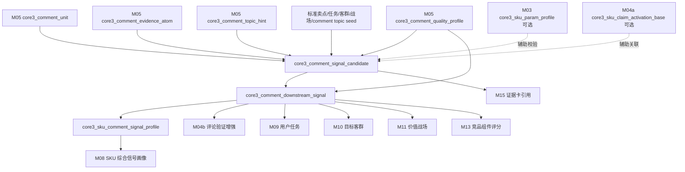
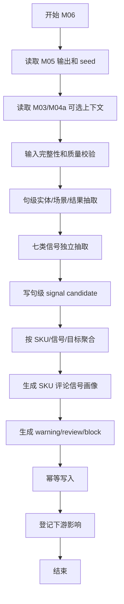

# M06 评论下游信号抽取层详细设计

## 1. 文档定位

本文是 CatForge 彩电核心三竞品 SOP 的 M06 详细设计，承接：

- 需求文档：`docs/core3_mvp/real_data_v2/sop_requirements/M06_comment_downstream_signal_requirements.md`
- 总体设计：`docs/core3_mvp/real_data_v2/sop_detailed_design/00_architecture_data_dictionary_design.md`
- 上游 M05：`core3_comment_unit`、`core3_comment_evidence_atom`、`core3_comment_topic_hint`、`core3_comment_quality_profile`
- 可选辅助上游 M03：`core3_sku_param_profile`
- 可选辅助上游 M04a：`core3_sku_claim_activation_base`
- 下游 M04b、M08、M09、M10、M11、M11.5、M13、M15

M06 的目标不是“重新理解全部评论并直接输出业务结论”，而是把 M05 的评论基础证据转换成七类下游专用评论信号。每类信号必须独立抽取、独立聚合、独立给下游消费，避免把评论主题直接贴成用户任务、目标客群、价值战场或竞品结论。

## 2. 模块职责

### 2.1 本模块解决什么

M06 解决评论到业务推导之间的标准信号接口问题：

1. 把同一句评论拆成不同类型的下游信号，例如卖点验证、任务线索、客群线索、战场支撑、痛点风险、价格价值感和服务信号。
2. 按真实 seed 中的 `standard_claims`、`user_tasks`、`target_groups`、`battlefields` 和 `comment_topics` 生成目标编码，不临时写死标签。
3. 计算句级信号候选，保留评论句、实体、主题、情感、弱域、服务隔离、低价值和 evidence。
4. 按 SKU + 信号类型 + 目标编码聚合提及数、提及率、正负向率、信号分和置信度。
5. 生成 SKU 评论信号画像，供 M08 汇总为 SKU 综合信号画像。
6. 为 M04b 提供 `claim_validation` 信号，为 M09/M10/M11 提供对应线索，但不直接生成最终结论。

### 2.2 本模块不解决什么

| 不做事项 | 原因 | 下游模块 |
| --- | --- | --- |
| 不输出最终用户任务分 | 评论只是任务证据之一，任务需要参数、卖点、市场共同推导 | M09 |
| 不输出最终目标客群分 | 客群需要任务、市场、价格、评论线索综合判断 | M10 |
| 不输出最终价值战场分 | 战场需要任务、客群、卖点、参数、市场共同支撑 | M11 |
| 不输出最终卖点激活 | 卖点激活必须从 M04a 基础激活开始增强 | M04b |
| 不做战场内卖点价值分层 | 需要战场上下文和市场价值判断 | M11.5 |
| 不判断竞品 | 竞品由候选召回、评分和三槽位选择完成 | M12-M14 |
| 不用评论证明硬规格 | 评论只能证明体验感知，不能证明 5200 nits、3500 分区、HDMI 2.1 端口数等硬规格 | M03/M04a |
| 不直接读取原始 `comment_data` | 分层要求 M06 必须基于 M05 输出 | M00-M05 |
| 不消费市场量价 | 价格事实和市场表现由 M07/M13 处理 | M07/M13 |

### 2.3 允许复用历史结果

允许复用历史 M06 输出，但必须同时满足：

- M05 `core3_comment_evidence_atom`、`core3_comment_topic_hint`、`core3_comment_quality_profile` 的当前 hash 未变化。
- `standard_claims`、`user_tasks`、`target_groups`、`battlefields`、`comment_topics` seed 版本未变化。
- M06 规则版本未变化。
- 可选输入 M03/M04a 的相关 hash 未变化，或当前信号类型不依赖这些辅助输入。
- 历史记录 `is_current=true` 且 `processing_status` 不是 `failed`、`blocked`。

## 3. 输入输出总览

### 3.1 必须输入

| 输入 | 来源模块 | 表或资产 | 用途 |
| --- | --- | --- | --- |
| 评论单元 | M05 | `core3_comment_unit` | 去重分母、重复降权、评论来源 |
| 句级评论基础证据 | M05 | `core3_comment_evidence_atom` | 句级信号抽取主输入 |
| 评论弱主题提示 | M05 | `core3_comment_topic_hint` | 主题到信号目标的弱映射 |
| SKU 评论质量画像 | M05 | `core3_comment_quality_profile` | 样本质量、提及率分母、下游是否可运行 |
| 评论主题 seed | seed | `comment_topics` | 主题到卖点、任务、战场的映射 |
| 标准卖点 seed | seed | `standard_claims` | `claim_validation` 目标字典 |
| 用户任务 seed | seed | `user_tasks` | `task_cue` 目标字典 |
| 目标客群 seed | seed | `target_groups` | `target_group_cue` 目标字典 |
| 价值战场 seed | seed | `battlefields` | `battlefield_support` 目标字典 |

### 3.2 可选辅助输入

| 输入 | 来源 | 用途 | 边界 |
| --- | --- | --- | --- |
| SKU 参数画像 | M03 `core3_sku_param_profile` | 辅助判断评论是否与 SKU 能力一致 | 不能用评论反推硬规格 |
| 基础卖点激活 | M04a `core3_sku_claim_activation_base` | 辅助判断评论是否验证已有基础卖点 | M06 不依赖 M04b，避免循环 |

M03/M04a 辅助输入只用于冲突标记、目标关联和置信度调整。M06 输出仍是评论信号，不得把辅助输入混成最终卖点、任务、客群或战场结论。

### 3.3 明确不消费

| 数据 | 禁止原因 |
| --- | --- |
| 原始 `comment_data` | 已由 M00-M05 处理，M06 不得绕过分层 |
| `week_sales_data` | 市场量价由 M07/M13 处理 |
| `attribute_data` 原始表 | 参数事实由 M03 提供 |
| `selling_points_data` 原始表 | 卖点事实由 M04a 提供 |
| M04b 结果 | M06 是 M04b 上游 |
| M09/M10/M11 最终结果 | M06 是线索层，不反向依赖画像推导层 |

### 3.4 输出表

| 输出表 | 粒度 | 下游用途 |
| --- | --- | --- |
| `core3_comment_signal_candidate` | 评论句 + 信号类型 + 目标编码 | 句级证据、复核和聚合明细 |
| `core3_comment_downstream_signal` | SKU + 信号类型 + 目标编码 | M04b/M09/M10/M11/M13 消费的聚合信号 |
| `core3_sku_comment_signal_profile` | SKU + 批次 | M08 消费的 SKU 评论信号画像 |

### 3.5 模块关系



## 4. 七类信号边界

M06 固定输出七类信号。

| `signal_type` | 中文名 | 目标编码前缀 | 下游 |
| --- | --- | --- | --- |
| `claim_validation` | 卖点体验验证信号 | `CLAIM_*` | M04b |
| `task_cue` | 用户任务线索 | `TASK_*` | M09 |
| `target_group_cue` | 目标客群线索 | `TG_*` | M10 |
| `battlefield_support` | 价值战场支撑/削弱信号 | `BF_*` | M11/M13 |
| `pain_point` | 痛点风险信号 | `RISK_*` | M08/M11/M13 |
| `price_perception` | 价格价值感信号 | `PRICE_*` | M09/M13 |
| `service_signal` | 服务保障信号 | `SERVICE_*` | M10/M11/M15 |

同一句评论允许产生多条信号，但必须保留：

- 不同 `signal_type`。
- 不同 `target_code_hint`。
- 不同 `cue_basis`。
- 不同 evidence 和匹配依据。
- 服务隔离标记。

### 4.1 业务边界规则

| 规则 | 说明 |
| --- | --- |
| 评论只能证明体验感知 | 评论不能证明硬规格值，只能说明用户是否感知到清晰、流畅、护眼、划算等 |
| 产品和服务隔离 | 安装、物流、售后不能增强画质、游戏、护眼等产品卖点 |
| 主题不是结论 | M05 topic hint 只是弱提示，M06 必须按 signal type 重新判断 |
| 下游独立消费 | M04b 只消费 `claim_validation`，M09 只消费任务/价格/痛点相关信号 |
| 负向风险单独沉淀 | 负面评论不能被简单抵消，需形成 `pain_point` 或 weaken 信号 |
| 同品牌不特殊处理 | 当前样例全为海信，M06 不做品牌内外判断 |

## 5. 信号目标字典设计

### 5.1 `claim_validation` 目标字典

目标来自 seed 的 `standard_claims`。M06 只验证体验，不证明硬规格。

| 卖点编码 | 中文卖点 | 可用评论主题 | 允许评论证明什么 | 禁止证明什么 |
| --- | --- | --- | --- | --- |
| `CLAIM_LARGE_SCREEN_IMMERSION` | 大屏沉浸观影 | 画质体验、尺寸适配 | 大屏、沉浸、客厅观影体验 | 不能证明具体尺寸参数 |
| `CLAIM_HIGH_BRIGHTNESS_HDR` | 高亮 HDR | 亮度/HDR、画质体验 | 白天清楚、亮度感知、HDR 观感 | 不能证明 nits |
| `CLAIM_FINE_LOCAL_DIMMING` | 精细分区控光 | 暗场/对比度、画质体验 | 暗场、黑位、光晕感知 | 不能证明分区数量 |
| `CLAIM_HIGH_REFRESH_RATE` | 高刷新率 | 游戏流畅、体育观看 | 流畅、拖影少、不卡 | 不能证明原生刷新率 |
| `CLAIM_SPORTS_MOTION_SMOOTH` | 体育运动流畅 | 体育观看 | 看球、运动画面流畅 | 不能证明 MEMC 参数 |
| `CLAIM_GAMING_LOW_LATENCY` | 低延迟游戏 | 游戏流畅 | 游戏延迟感知、不卡顿 | 不能证明输入延迟 ms |
| `CLAIM_HDMI_2_1_GAMING` | HDMI 2.1 游戏接口 | 接口连接、游戏流畅 | 外接主机方便 | 不能证明端口数量和带宽 |
| `CLAIM_EYE_CARE_COMFORT` | 护眼舒适 | 护眼舒适、儿童家庭 | 不累眼、孩子观看舒适 | 不能证明护眼认证 |
| `CLAIM_ELDER_FRIENDLY_SMART` | 长辈友好智能 | 长辈友好、操作易用 | 老人会用、语音方便 | 不能证明具体系统功能 |
| `CLAIM_SMART_VOICE_EASE` | 智能语音易用 | 操作易用 | 语音、系统上手、流畅 | 不能证明芯片规格 |
| `CLAIM_NO_AD_OR_CLEAN_SYSTEM` | 清爽系统/少广告 | 系统广告/流畅 | 广告少、开机快、系统清爽 | 不能证明官方无广告承诺 |
| `CLAIM_IMMERSIVE_AUDIO` | 沉浸音效 | 音质体验 | 音质、低音、环绕感知 | 不能证明喇叭功率 |
| `CLAIM_DOLBY_CINEMA_AUDIO` | 杜比影音 | 音质体验、画质体验 | 影院感、音画体验 | 不能证明杜比授权 |
| `CLAIM_THIN_DESIGN` | 超薄美学设计 | 尺寸与空间适配 | 外观、挂墙、装修适配 | 不能证明厚度参数 |
| `CLAIM_VALUE_FOR_MONEY` | 高性价比 | 价格价值感 | 值、划算、优惠感知 | 不能替代真实价格 |
| `CLAIM_INSTALLATION_SERVICE_ASSURANCE` | 安装服务保障 | 安装服务 | 服务体验 | 只能作为服务卖点，不得增强产品卖点 |

`CLAIM_MINI_LED_BACKLIGHT`、`CLAIM_OLED_SELF_LIT`、`CLAIM_QLED_WIDE_COLOR` 这类技术型卖点，如果只有评论主题命中，M06 只能输出“体验验证候选”，不能输出“技术能力证明”。M04b 必须结合 M04a 参数/宣传基础激活再决定是否增强。

### 5.2 `task_cue` 目标字典

目标来自 seed 的 `user_tasks`。任务线索必须至少满足“场景、动作、对象、结果、约束”中的两类信息，避免只用单个词贴任务。

| 任务编码 | 中文任务 | 必要线索组合 |
| --- | --- | --- |
| `TASK_LIVING_ROOM_CINEMA` | 客厅影院观影 | 客厅/电影/追剧/全家 + 音画体验 |
| `TASK_PREMIUM_PICTURE_AV` | 高端画质影音 | 画质/亮度/暗场/色彩 + 明确正负体验 |
| `TASK_GAMING_ENTERTAINMENT` | 游戏娱乐 | 游戏/主机/接口 + 流畅/延迟/连接 |
| `TASK_SPORTS_WATCHING` | 体育赛事观看 | 看球/赛事/运动 + 不卡/拖影/清晰 |
| `TASK_LARGE_SCREEN_REPLACEMENT` | 大屏换新 | 大屏/尺寸/换新 + 客厅/价格/满意 |
| `TASK_CHILD_EYE_CARE` | 儿童护眼 | 孩子/儿童/长期观看 + 护眼/不累 |
| `TASK_SENIOR_EASY_USE` | 长辈易用 | 老人/父母/长辈 + 语音/简单/广告 |
| `TASK_VALUE_PURCHASE` | 性价比购买 | 价格/优惠/预算 + 值/划算/不值 |
| `TASK_NEW_HOME_DECORATION` | 新家装修搭配 | 新家/装修/挂墙 + 外观/尺寸/安装 |
| `TASK_BEDROOM_SECOND_TV` | 卧室/副屏 | 卧室/第二台/小空间 + 易用/价格/护眼 |

### 5.3 `target_group_cue` 目标字典

目标来自 seed 的 `target_groups`。

| 客群编码 | 中文客群 | 线索基础 |
| --- | --- | --- |
| `TG_FAMILY_UPGRADE` | 家庭换新用户 | 家庭、全家、客厅、大屏、换新 |
| `TG_AV_QUALITY_SEEKER` | 画质影音用户 | 画质党、影音、HDR、Mini LED、清晰 |
| `TG_GAMER` | 游戏用户 | 游戏、主机、PS5、Switch、电竞 |
| `TG_SPORTS_FAN` | 体育观看用户 | 看球、体育、赛事 |
| `TG_SENIOR_FAMILY` | 长辈家庭用户 | 父母、老人、长辈、语音简单 |
| `TG_CHILD_FAMILY` | 儿童家庭用户 | 孩子、儿童、护眼、家庭 |
| `TG_VALUE_BUYER` | 性价比用户 | 性价比、划算、优惠、价格 |
| `TG_NEW_HOME_DECORATOR` | 新家装修用户 | 新家、装修、安装、家居搭配 |
| `TG_BEDROOM_SECOND_TV` | 卧室副屏用户 | 卧室、副屏、第二台、小尺寸 |

`target_group_cue` 必须输出 `cue_basis`：

| `cue_basis` | 说明 | 置信度 |
| --- | --- | --- |
| `explicit_people` | 明确出现人群词，例如老人、孩子、父母 | 最高 |
| `purchase_motivation` | 出现购买动机，例如给父母买、给新家买 | 高 |
| `scenario_inference` | 由客厅、卧室、装修等场景推断 | 中 |
| `topic_hint` | 仅由主题弱映射 | 低 |

### 5.4 `battlefield_support` 目标字典

目标来自 seed 的 `battlefields`。M06 只提供评论维度的支撑或削弱，不输出战场最终分。

| 战场编码 | 中文战场 | 支撑评论 | 削弱评论 |
| --- | --- | --- | --- |
| `BF_PREMIUM_PICTURE` | 高端画质战场 | 画质、亮度、暗场、色彩正向 | 模糊、偏色、暗场差、刺眼 |
| `BF_FAMILY_VIEWING_UPGRADE` | 家庭观影升级战场 | 大屏、客厅、电影、音画震撼 | 尺寸不合适、音效差 |
| `BF_GAMING_SPORTS` | 游戏体育战场 | 看球不卡、游戏流畅、接口方便 | 拖影、延迟、卡顿 |
| `BF_LARGE_SCREEN_VALUE` | 大屏性价比战场 | 大屏、划算、换新值 | 贵、不值、降价快 |
| `BF_FAMILY_EYE_CARE` | 家庭护眼战场 | 护眼、不累、孩子看舒服 | 刺眼、累眼 |
| `BF_SENIOR_EASE_OF_USE` | 长辈易用战场 | 老人会用、语音方便 | 操作复杂、广告多 |
| `BF_SMART_SYSTEM_EXPERIENCE` | 智能系统体验战场 | 系统流畅、语音灵敏 | 卡顿、广告、复杂 |
| `BF_CINEMA_AUDIO_IMMERSION` | 影院音效战场 | 音质好、低音、环绕 | 音效差、破音 |
| `BF_DESIGN_HOME_FIT` | 家居美学战场 | 外观、装修、挂墙、尺寸适配 | 尺寸不适配、不好看 |
| `BF_SERVICE_ASSURANCE` | 服务保障战场 | 安装、配送、客服、售后正向 | 配送慢、安装差、售后差 |

服务类评论只能支撑 `BF_SERVICE_ASSURANCE`，或在 `TASK_NEW_HOME_DECORATION` 相关上下文中作为服务侧辅助，不得支撑高端画质、游戏体育、家庭护眼等产品战场。

### 5.5 `pain_point` 目标字典

痛点风险使用 M06 内置风险字典。风险字典可以后续资产化，但首版必须完整可用。

| 风险编码 | 中文风险 | 典型表达 | 主要下游 |
| --- | --- | --- | --- |
| `RISK_PICTURE_NEGATIVE` | 画质负向 | 模糊、偏色、不清楚、反光 | M08/M11/M13 |
| `RISK_MOTION_LAG` | 运动拖影卡顿 | 拖影、卡顿、看球不顺、掉帧 | M08/M11/M13 |
| `RISK_SYSTEM_ADS_LAG` | 系统广告和卡顿 | 广告多、弹窗、系统卡、复杂 | M08/M11/M13 |
| `RISK_AUDIO_NEGATIVE` | 音质负向 | 声音小、破音、低音差 | M08/M11/M13 |
| `RISK_EYE_DISCOMFORT` | 护眼不适 | 刺眼、累眼、看久不舒服 | M08/M11/M13 |
| `RISK_SERVICE_DELIVERY` | 服务配送风险 | 配送慢、安装差、客服差 | M10/M11/M15 |
| `RISK_DURABILITY_QUALITY` | 做工耐用风险 | 故障、坏点、品控差、做工差 | M08/M13 |
| `RISK_PRICE_OVERPAY` | 价格不值风险 | 太贵、不值、降价背刺 | M09/M13 |

`pain_point` 必须输出 `risk_severity`：

| 严重度 | 条件 |
| --- | --- |
| `low` | 单句弱负向或情感不明确 |
| `medium` | 明确负向体验，具体程度达标 |
| `high` | 多个去重评论单元集中负向，或涉及核心体验 |

### 5.6 `price_perception` 目标字典

价格感知是评论中的主观价值表达，不能替代 M07/M13 的真实价格。

| 价格信号编码 | 中文信号 | 典型表达 |
| --- | --- | --- |
| `PRICE_VALUE_POSITIVE` | 价值正向 | 性价比高、划算、值、买得值 |
| `PRICE_VALUE_NEGATIVE` | 价值负向 | 贵、不值、价格高、后悔 |
| `PRICE_PROMOTION_SENSITIVE` | 促销敏感 | 活动、优惠、补贴、赠品 |
| `PRICE_BIG_SCREEN_VALUE` | 大屏价格价值 | 这么大这个价很值、85 吋划算 |
| `PRICE_DROP_RISK` | 降价风险 | 刚买就降价、背刺、保价 |

### 5.7 `service_signal` 目标字典

服务信号是独立信号，不进入产品卖点增强。

| 服务信号编码 | 中文信号 | 典型表达 |
| --- | --- | --- |
| `SERVICE_INSTALL_POSITIVE` | 安装正向 | 安装快、师傅专业、挂装好 |
| `SERVICE_DELIVERY_POSITIVE` | 配送正向 | 送货快、物流好、包装好 |
| `SERVICE_SUPPORT_POSITIVE` | 客服售后正向 | 客服好、售后响应快 |
| `SERVICE_INSTALL_NEGATIVE` | 安装负向 | 安装慢、不专业、收费不清 |
| `SERVICE_DELIVERY_NEGATIVE` | 配送负向 | 配送慢、破损、送错 |
| `SERVICE_SUPPORT_NEGATIVE` | 客服售后负向 | 售后差、客服差、不处理 |

## 6. 数据模型设计

### 6.1 通用字段约定

M06 所有输出表必须包含以下通用字段。

| 字段 | 类型建议 | 必填 | 说明 |
| --- | --- | --- | --- |
| `project_id` | `text` | 是 | 项目 ID |
| `category_code` | `text` | 是 | MVP 为 `TV` |
| `batch_id` | `text` | 是 | M00 批次 |
| `run_id` | `text` | 否 | M16 全链路运行 ID |
| `module_run_id` | `text` | 否 | M06 模块运行 ID |
| `sku_code` | `text` | 是 | SKU 编码 |
| `model_name` | `text` | 否 | 型号名 |
| `brand_name` | `text` | 否 | 当前样例为海信 |
| `rule_version` | `text` | 是 | M06 规则版本 |
| `asset_version` | `text` | 是 | seed 版本 |
| `input_fingerprint` | `text` | 是 | 输入 hash |
| `result_hash` | `text` | 是 | 输出业务内容 hash |
| `is_current` | `boolean` | 是 | 是否当前版本 |
| `processing_status` | `text` | 是 | `success`、`warning`、`review_required`、`blocked`、`failed` |
| `review_required` | `boolean` | 是 | 是否需要复核 |
| `review_status` | `text` | 是 | `auto_pass`、`review_required`、`approved`、`rejected`、`waived` |
| `review_reason_json` | `jsonb` | 是 | 复核原因 |
| `created_at` | `timestamptz` | 是 | 创建时间 |
| `updated_at` | `timestamptz` | 是 | 更新时间 |

### 6.2 枚举定义

#### 6.2.1 `signal_type`

```text
claim_validation
task_cue
target_group_cue
battlefield_support
pain_point
price_perception
service_signal
```

#### 6.2.2 `polarity`

| 枚举 | 含义 |
| --- | --- |
| `support` | 支撑目标 |
| `weaken` | 削弱目标 |
| `mixed` | 正负混合 |
| `neutral` | 无明确正负 |
| `unknown` | 情感未知 |

#### 6.2.3 `signal_strength_level`

| 枚举 | 分数范围 | 含义 |
| --- | --- | --- |
| `strong` | `>=0.75` | 强评论信号，可作为下游重要支撑 |
| `medium` | `0.55-0.75` | 中等评论信号 |
| `weak` | `0.35-0.55` | 弱信号，只能辅助 |
| `blocked` | `<0.35` 或被规则阻断 | 不进入聚合强信号 |

#### 6.2.4 `cue_basis`

| 枚举 | 说明 |
| --- | --- |
| `explicit_keyword` | 明确关键词命中 |
| `topic_mapping` | M05 topic hint 到 seed 映射 |
| `scenario_action_result` | 场景、动作、结果组合成立 |
| `explicit_people` | 明确人群词 |
| `purchase_motivation` | 购买动机 |
| `scenario_inference` | 场景推断 |
| `negative_risk_pattern` | 负向风险模式 |
| `service_pattern` | 服务模式 |
| `price_pattern` | 价格感知模式 |
| `upstream_claim_context` | M04a 基础卖点上下文辅助 |

#### 6.2.5 `hard_spec_policy`

| 枚举 | 说明 |
| --- | --- |
| `experience_only` | 评论只证明体验 |
| `hard_spec_not_proven` | 禁止证明硬规格 |
| `service_only` | 只可用于服务信号 |
| `market_fact_required` | 需要 M07/M13 价格或市场事实支撑 |

### 6.3 `core3_comment_signal_candidate`

#### 6.3.1 表用途

保存句级评论信号候选。一个 `comment_evidence_id` 可生成多条候选，每条候选只面向一个 `signal_type + target_code_hint`。

该表用于：

- 句级证据追溯。
- 聚合信号明细。
- 复核冲突、低价值误判和服务误用。
- M15 选择代表评论短句。

#### 6.3.2 字段契约

| 字段 | 类型建议 | 必填 | 说明 |
| --- | --- | --- | --- |
| `signal_candidate_id` | `text` | 是 | 主键，建议 `m06cand_<hash>` |
| `signal_candidate_key` | `text` | 是 | 稳定逻辑键 |
| `comment_unit_id` | `text` | 是 | M05 评论单元 |
| `comment_evidence_id` | `text` | 是 | M05 句级评论证据 |
| `comment_text_hash` | `text` | 否 | 评论正文 hash |
| `sentence_hash` | `text` | 是 | 句文本 hash |
| `sentence_text` | `text` | 是 | 句文本快照 |
| `signal_type` | `text` | 是 | 七类信号 |
| `target_code_hint` | `text` | 是 | `CLAIM_*`、`TASK_*`、`TG_*`、`BF_*`、`RISK_*`、`PRICE_*`、`SERVICE_*` |
| `target_name_hint` | `text` | 是 | 中文目标名 |
| `target_group_hint` | `text` | 否 | 目标分组，例如 claim_group、battlefield_name |
| `polarity` | `text` | 是 | `support`、`weaken`、`mixed`、`neutral`、`unknown` |
| `signal_strength` | `numeric` | 是 | 句级信号强度，0-1 |
| `signal_strength_level` | `text` | 是 | `strong`、`medium`、`weak`、`blocked` |
| `confidence` | `numeric` | 是 | 句级信号置信度，0-1 |
| `confidence_level` | `text` | 是 | `high`、`medium`、`low`、`unknown` |
| `specificity_score` | `numeric` | 是 | 来自 M05 或重算后的具体程度 |
| `sentiment_hint` | `text` | 是 | M05 情感弱标签 |
| `domain_hints` | `jsonb` | 是 | M05 弱域 |
| `primary_domain_hint` | `text` | 是 | M05 主弱域 |
| `topic_hints_json` | `jsonb` | 是 | 命中的 M05 topic hints |
| `matched_entities_json` | `jsonb` | 是 | 场景、动作、人群、对象、结果、约束 |
| `matched_rules_json` | `jsonb` | 是 | 命中的规则和 seed 快照 |
| `cue_basis` | `text` | 是 | 信号依据 |
| `hard_spec_policy` | `text` | 是 | 评论是否只能体验证明 |
| `service_guardrail_flag` | `boolean` | 是 | 是否服务隔离 |
| `eligible_for_product_claim` | `boolean` | 是 | 是否可进入产品卖点验证 |
| `eligible_for_service_claim` | `boolean` | 是 | 是否可进入服务卖点验证 |
| `eligible_for_task` | `boolean` | 是 | 是否可进入 M09 |
| `eligible_for_group` | `boolean` | 是 | 是否可进入 M10 |
| `eligible_for_battlefield` | `boolean` | 是 | 是否可进入 M11 |
| `low_value_flag` | `boolean` | 是 | M05 低价值 |
| `duplicate_group_id` | `text` | 否 | 重复组 |
| `quality_flags` | `jsonb` | 是 | 质量标记 |
| `blocked_reasons` | `jsonb` | 是 | 句级阻断原因 |
| `source_m05_evidence_ids` | `jsonb` | 是 | M05 evidence ID |
| `source_m02_evidence_ids` | `jsonb` | 是 | M02 evidence ID 透传 |
| `optional_param_context_json` | `jsonb` | 是 | M03 辅助上下文 |
| `optional_claim_context_json` | `jsonb` | 是 | M04a 辅助上下文 |

#### 6.3.3 主键、唯一键和索引

| 类型 | 字段 |
| --- | --- |
| 主键 | `signal_candidate_id` |
| 唯一键 | `project_id, category_code, batch_id, signal_candidate_key, rule_version, asset_version` |
| 普通索引 | `sku_code, signal_type` |
| 普通索引 | `sku_code, target_code_hint` |
| 普通索引 | `comment_evidence_id` |
| 普通索引 | `comment_unit_id` |
| 普通索引 | `signal_strength_level` |
| 普通索引 | `polarity` |
| 普通索引 | `review_required` |
| GIN 索引 | `topic_hints_json`、`matched_entities_json`、`matched_rules_json`、`quality_flags` |

#### 6.3.4 JSON 字段结构

`matched_entities_json`：

```json
{
  "scenarios": ["客厅", "看球"],
  "actions": ["观看"],
  "people": ["家人"],
  "objects": ["球赛"],
  "experience_results": ["流畅", "不卡"],
  "constraints": [],
  "price_terms": [],
  "service_terms": [],
  "negative_terms": []
}
```

`matched_rules_json`：

```json
{
  "signal_rule": "sports_task_rule_v1",
  "seed_sources": ["comment_topics", "user_tasks", "battlefields"],
  "matched_topic_codes": ["TOPIC_SPORTS_WATCHING"],
  "matched_keywords": ["看球", "不卡"],
  "target_mapping_reason": "体育观看主题 + 运动流畅结果",
  "rule_weight_snapshot": {
    "topic": 0.35,
    "entity": 0.30,
    "sentiment": 0.15,
    "specificity": 0.20
  }
}
```

### 6.4 `core3_comment_downstream_signal`

#### 6.4.1 表用途

保存 SKU 聚合评论信号，供下游模块按 `signal_type` 和 `target_code_hint` 消费。

聚合分母必须使用 M05 的去重评论单元，而不是原始评论行数，防止维度拆行和模板重复放大评论声量。

#### 6.4.2 字段契约

| 字段 | 类型建议 | 必填 | 说明 |
| --- | --- | --- | --- |
| `signal_id` | `text` | 是 | 主键，建议 `m06sig_<hash>` |
| `signal_key` | `text` | 是 | 稳定逻辑键 |
| `signal_type` | `text` | 是 | 七类信号 |
| `target_code_hint` | `text` | 是 | 下游目标编码 |
| `target_name_hint` | `text` | 是 | 中文目标名 |
| `target_group_hint` | `text` | 否 | 目标分组 |
| `polarity` | `text` | 是 | `support`、`weaken`、`mixed`、`neutral`、`unknown` |
| `mention_count` | `integer` | 是 | 去重评论单元提及数 |
| `sentence_count` | `integer` | 是 | 句级候选数 |
| `valid_comment_unit_count` | `integer` | 是 | 可用评论单元分母 |
| `usable_sentence_count` | `integer` | 是 | 可用句分母 |
| `mention_rate` | `numeric` | 是 | `mention_count / valid_comment_unit_count` |
| `sentence_mention_rate` | `numeric` | 是 | `sentence_count / usable_sentence_count` |
| `positive_count` | `integer` | 是 | 正向去重评论单元数 |
| `negative_count` | `integer` | 是 | 负向去重评论单元数 |
| `neutral_count` | `integer` | 是 | 中性/未知单元数 |
| `positive_rate` | `numeric` | 是 | 正向率 |
| `negative_rate` | `numeric` | 是 | 负向率 |
| `mixed_flag` | `boolean` | 是 | 是否正负混合 |
| `signal_score` | `numeric` | 是 | 聚合信号分，0-1 |
| `signal_level` | `text` | 是 | `strong`、`medium`、`weak`、`blocked` |
| `specificity_avg` | `numeric` | 是 | 平均具体程度 |
| `evidence_quality_score` | `numeric` | 是 | 评论证据质量分 |
| `sample_status` | `text` | 是 | 来自 M05 profile |
| `comment_quality_flags` | `jsonb` | 是 | 评论质量标记 |
| `representative_phrases` | `jsonb` | 是 | 代表评论短句 |
| `top_candidate_ids` | `jsonb` | 是 | 代表候选 ID |
| `evidence_ids` | `jsonb` | 是 | M05/M02 evidence 透传 |
| `service_guardrail_flag` | `boolean` | 是 | 服务隔离 |
| `hard_spec_policy` | `text` | 是 | 硬规格边界 |
| `downstream_usage_policy_json` | `jsonb` | 是 | 下游允许消费策略 |
| `quality_summary` | `text` | 是 | 中文质量摘要 |
| `confidence` | `numeric` | 是 | 聚合置信度 |
| `confidence_level` | `text` | 是 | `high`、`medium`、`low`、`unknown` |

#### 6.4.3 主键、唯一键和索引

| 类型 | 字段 |
| --- | --- |
| 主键 | `signal_id` |
| 唯一键 | `project_id, category_code, batch_id, sku_code, signal_type, target_code_hint, polarity, rule_version, asset_version` |
| 普通索引 | `sku_code, signal_type` |
| 普通索引 | `signal_type, target_code_hint` |
| 普通索引 | `signal_level` |
| 普通索引 | `confidence_level` |
| 普通索引 | `review_required` |
| GIN 索引 | `comment_quality_flags`、`representative_phrases`、`evidence_ids`、`downstream_usage_policy_json` |

#### 6.4.4 下游消费策略 JSON

```json
{
  "M04b": {
    "allowed": true,
    "allowed_scope": "product_claim_experience_validation",
    "blocked_if_service_guardrail": true
  },
  "M09": {
    "allowed": false,
    "reason": "not_task_signal"
  },
  "M11": {
    "allowed": true,
    "allowed_scope": "battlefield_comment_support"
  },
  "hard_spec_policy": "experience_only"
}
```

### 6.5 `core3_sku_comment_signal_profile`

#### 6.5.1 表用途

保存 SKU 级评论信号画像，作为 M08 的评论输入。它不面向单一目标编码，而是概括该 SKU 评论信号的结构、强弱、风险和下游可用性。

#### 6.5.2 字段契约

| 字段 | 类型建议 | 必填 | 说明 |
| --- | --- | --- | --- |
| `sku_comment_signal_profile_id` | `text` | 是 | 主键，建议 `m06prof_<hash>` |
| `profile_key` | `text` | 是 | 稳定逻辑键 |
| `comment_signal_summary_json` | `jsonb` | 是 | 七类信号总体摘要 |
| `claim_validation_summary_json` | `jsonb` | 是 | 卖点验证摘要 |
| `task_cue_summary_json` | `jsonb` | 是 | 任务线索摘要 |
| `target_group_cue_summary_json` | `jsonb` | 是 | 客群线索摘要 |
| `battlefield_support_summary_json` | `jsonb` | 是 | 战场支撑摘要 |
| `pain_risk_summary_json` | `jsonb` | 是 | 风险摘要 |
| `price_perception_summary_json` | `jsonb` | 是 | 价格价值感摘要 |
| `service_signal_summary_json` | `jsonb` | 是 | 服务信号摘要 |
| `strong_signal_count` | `integer` | 是 | 强信号数量 |
| `medium_signal_count` | `integer` | 是 | 中信号数量 |
| `weak_signal_count` | `integer` | 是 | 弱信号数量 |
| `blocked_signal_count` | `integer` | 是 | 阻断信号数量 |
| `claim_validation_ready` | `boolean` | 是 | 是否可供 M04b 消费 |
| `task_cue_ready` | `boolean` | 是 | 是否可供 M09 消费 |
| `target_group_cue_ready` | `boolean` | 是 | 是否可供 M10 消费 |
| `battlefield_support_ready` | `boolean` | 是 | 是否可供 M11 消费 |
| `comment_signal_confidence` | `numeric` | 是 | 评论信号整体置信度 |
| `confidence_level` | `text` | 是 | `high`、`medium`、`low`、`unknown` |
| `quality_flags` | `jsonb` | 是 | 质量标记 |
| `review_issue_summary_json` | `jsonb` | 是 | 复核问题摘要 |
| `evidence_ids` | `jsonb` | 是 | 核心证据 ID |

#### 6.5.3 主键、唯一键和索引

| 类型 | 字段 |
| --- | --- |
| 主键 | `sku_comment_signal_profile_id` |
| 唯一键 | `project_id, category_code, batch_id, sku_code, rule_version, asset_version` |
| 普通索引 | `sku_code` |
| 普通索引 | `comment_signal_confidence` |
| 普通索引 | `claim_validation_ready` |
| 普通索引 | `review_required` |
| GIN 索引 | `comment_signal_summary_json`、`quality_flags`、`review_issue_summary_json`、`evidence_ids` |

#### 6.5.4 摘要 JSON 示例

`task_cue_summary_json`：

```json
{
  "top_task_cues": [
    {
      "task_code": "TASK_SPORTS_WATCHING",
      "task_name": "体育赛事观看",
      "signal_score": 0.72,
      "mention_rate": 0.045,
      "positive_rate": 0.83,
      "signal_level": "medium",
      "representative_phrases": ["看球很流畅", "运动画面不卡"]
    }
  ],
  "blocked_task_cues": [],
  "quality_flags": []
}
```

## 7. 处理流程设计

### 7.1 总流程



### 7.2 步骤 1：读取输入

按 SKU 范围读取：

1. `core3_comment_quality_profile` 中 `downstream_ready=true` 的 SKU。
2. `core3_comment_evidence_atom` 中 `usable_for_downstream=true` 的句级证据。
3. `core3_comment_topic_hint` 中 `topic_hint_status in ('matched','low_confidence')` 的主题提示。
4. `core3_comment_unit` 提供去重分母和重复组。
5. seed 中的五类资产：评论主题、标准卖点、用户任务、目标客群、价值战场。
6. 可选读取 M03/M04a 当前版本，用于辅助冲突和 claim 上下文。

输入 fingerprint：

```text
input_fingerprint = hash(
  sorted(m05_atom.result_hash)
  + sorted(m05_topic.result_hash)
  + m05_profile.result_hash
  + seed_hash(standard_claims, user_tasks, target_groups, battlefields, comment_topics)
  + optional_hash(m03_param_profile)
  + optional_hash(m04a_claim_activation_base)
  + rule_version
)
```

### 7.3 步骤 2：输入校验

| 校验项 | 处理 |
| --- | --- |
| M05 profile 缺失 | 当前 SKU blocked |
| M05 `downstream_ready=false` | 当前 SKU M06 blocked，不生成强信号 |
| 可用句数为 0 | 写空 profile，`comment_signal_confidence=0` |
| seed 缺失 | M06 blocked |
| M05 topic hint 缺失 | 可运行，但全部以文本实体规则为主，降低置信度 |
| M03/M04a 缺失 | 可运行，但相关冲突校验为空 |
| M05 服务占比高 | 可运行，增加服务隔离 warning |

### 7.4 步骤 3：实体、场景和结果抽取

M06 首版使用规则和 seed，不依赖外部 LLM。

#### 7.4.1 抽取实体类别

| 类别 | 字段 | 示例 |
| --- | --- | --- |
| 场景 | `scenarios` | 客厅、卧室、白天、晚上、装修、看球、电影、游戏 |
| 动作 | `actions` | 看球、追剧、打游戏、投屏、语音控制、安装、配送 |
| 人群 | `people` | 家人、父母、老人、孩子、全家 |
| 对象 | `objects` | PS5、Switch、球赛、电影、机顶盒 |
| 体验结果 | `experience_results` | 清晰、流畅、震撼、方便、护眼、划算 |
| 约束条件 | `constraints` | 价格、空间、光线、操作复杂、广告、售后 |
| 负向词 | `negative_terms` | 卡顿、拖影、刺眼、故障、贵、不值 |
| 服务词 | `service_terms` | 安装、师傅、配送、客服、售后 |

#### 7.4.2 抽取规则

1. 先使用 M05 `domain_hints` 和 `topic_hints_json` 建立候选目标。
2. 再使用 seed 的 `keywords`、`aliases`、`comment_topic_codes` 扩展候选目标。
3. 最后用实体组合规则确认 `cue_basis` 和 `signal_strength`。
4. 同一句命中多个信号类型时分别生成候选。
5. 低价值、重复、服务隔离、域冲突必须降低或阻断。

### 7.5 步骤 4：七类信号独立抽取

#### 7.5.1 `claim_validation`

抽取条件：

- 目标来自 `standard_claims.comment_topic_codes` 或 seed 关键词映射。
- 评论句非低价值。
- 句子具体程度达标。
- 产品类卖点必须来自 `product_experience` 或 `product_risk` 域。
- 服务类卖点仅允许 `CLAIM_INSTALLATION_SERVICE_ASSURANCE`，且必须打 `service_guardrail_flag=true`。

阻断条件：

| 条件 | 阻断原因 |
| --- | --- |
| 只有服务词却目标是产品卖点 | `service_to_product_claim_blocked` |
| 只有评论证明硬规格 | `hard_spec_not_proven` |
| M05 低价值 | `low_value_comment` |
| 目标 claim 不在 seed | `unknown_claim_code` |

输出约束：

- `hard_spec_policy='experience_only'`。
- 技术型 claim 的 `eligible_for_product_claim=true` 只代表可作为体验验证，不能代表技术事实成立。
- M04b 必须再结合 M04a 的 `base_activation_score`。

#### 7.5.2 `task_cue`

抽取条件：

- 目标来自 `user_tasks.comment_topic_codes`、`mapped_claim_codes` 或实体组合。
- 至少满足两类实体：场景、动作、人群、对象、结果、约束。
- 评论句非低价值。

例：

```text
"看球很流畅" => scenario/action=看球 + result=流畅 => TASK_SPORTS_WATCHING
"给爸妈买的，语音操作简单" => people=爸妈 + result=操作简单 => TASK_SENIOR_EASY_USE
```

输出约束：

- `task_cue` 只是 M09 的评论证据。
- 如果只命中单个主题词，`signal_strength_level` 最高只能是 `weak`。

#### 7.5.3 `target_group_cue`

抽取条件：

- 明确人群词优先。
- 购买动机次之。
- 场景推断再次。
- 仅 topic 映射置信度最低。

强信号要求：

- `cue_basis in ('explicit_people','purchase_motivation')`。
- 评论句具体程度达标。
- 不是低价值。

#### 7.5.4 `battlefield_support`

抽取条件：

- 目标来自 `battlefields.comment_topic_codes`、`core_task_codes`、`core_claim_codes` 映射。
- 支撑或削弱方向明确。
- 服务类只可进入 `BF_SERVICE_ASSURANCE` 或服务相关辅助。

削弱信号：

- 负向产品体验生成 `polarity='weaken'`。
- 例如画质差削弱 `BF_PREMIUM_PICTURE`，卡顿削弱 `BF_GAMING_SPORTS`。

#### 7.5.5 `pain_point`

抽取条件：

- 负向情感或负向关键词明确。
- 可映射到内置风险字典。
- 低价值不生成强风险。

严重度计算：

```text
risk_severity_score =
  0.35 * negative_term_strength
+ 0.25 * specificity_score
+ 0.20 * core_experience_weight
+ 0.20 * repeated_unit_concentration
```

其中 `repeated_unit_concentration` 必须按去重评论单元计算，不能按原始行数。

#### 7.5.6 `price_perception`

抽取条件：

- 命中价格、优惠、划算、贵、不值、降价等词。
- 可来自 `TOPIC_PRICE_VALUE`。
- 不读取真实市场价格。

输出约束：

- `hard_spec_policy='market_fact_required'`。
- M13 必须用 M07 的真实价格、价格带和销量共同判断价格挤压，不能只用评论。

#### 7.5.7 `service_signal`

抽取条件：

- 命中安装、配送、客服、售后、师傅、上门等服务词。
- 可来自 `TOPIC_INSTALLATION_SERVICE`。
- 正负向明确时输出对应 SERVICE 编码。

输出约束：

- `service_guardrail_flag=true`。
- `eligible_for_product_claim=false`。
- 可进入 M11 `BF_SERVICE_ASSURANCE` 和 M15 服务证据展示。

### 7.6 步骤 5：句级信号强度

句级强度：

```text
signal_strength =
  0.30 * topic_match_score
+ 0.25 * entity_specificity_score
+ 0.15 * sentiment_strength
+ 0.15 * domain_consistency_score
+ 0.10 * target_mapping_score
+ 0.05 * upstream_context_score
- 0.35 * low_value_penalty
- 0.20 * duplicate_penalty
- 0.35 * domain_mismatch_penalty
- 0.50 * service_product_misuse_penalty
```

| 子项 | 说明 |
| --- | --- |
| `topic_match_score` | M05 topic 与目标字典匹配 |
| `entity_specificity_score` | 场景/动作/对象/结果是否具体 |
| `sentiment_strength` | 正负向是否明确 |
| `domain_consistency_score` | M05 弱域与目标是否一致 |
| `target_mapping_score` | seed 映射是否清楚 |
| `upstream_context_score` | 可选 M03/M04a 上下文是否一致 |
| `low_value_penalty` | 低价值评论降权 |
| `duplicate_penalty` | 模板化重复降权 |
| `domain_mismatch_penalty` | 服务/产品域冲突 |
| `service_product_misuse_penalty` | 服务评论误用于产品目标时强阻断 |

### 7.7 步骤 6：SKU 聚合信号

#### 7.7.1 分母规则

| 分母 | 来源 |
| --- | --- |
| `valid_comment_unit_count` | M05 `comment_unit_count - low_value_unit_count` |
| `usable_sentence_count` | M05 `usable_sentence_count` |
| `mention_count` | 当前 target 去重 `comment_unit_id` 数 |
| `sentence_count` | 当前 target 句级候选数 |

提及率必须使用去重评论单元，不允许使用原始评论行数。

```text
mention_rate = mention_count / max(valid_comment_unit_count, 1)
sentence_mention_rate = sentence_count / max(usable_sentence_count, 1)
positive_rate = positive_count / max(mention_count, 1)
negative_rate = negative_count / max(mention_count, 1)
```

#### 7.7.2 聚合信号分

正向支撑信号：

```text
signal_score =
  0.35 * mention_rate_score
+ 0.25 * positive_rate
+ 0.20 * specificity_avg
+ 0.20 * evidence_quality_score
```

负向风险或削弱信号：

```text
signal_score =
  0.35 * mention_rate_score
+ 0.25 * negative_rate
+ 0.20 * specificity_avg
+ 0.20 * evidence_quality_score
```

`mention_rate_score` 需要做平滑，避免超大评论量下小众强信号被完全淹没：

```text
mention_rate_score = min(1, log(1 + mention_count) / log(1 + min(valid_comment_unit_count, 500)))
```

#### 7.7.3 聚合置信度

```text
confidence =
  0.25 * sample_score
+ 0.20 * evidence_quality_score
+ 0.20 * target_mapping_score
+ 0.15 * polarity_clarity_score
+ 0.10 * domain_consistency_score
+ 0.10 * upstream_consistency_score
```

置信度等级：

| 等级 | 条件 |
| --- | --- |
| `high` | `confidence>=0.80` 且 `signal_score>=0.65` 且无关键 warning |
| `medium` | `confidence>=0.60` |
| `low` | `confidence>=0.35` |
| `unknown` | 样本不足或被阻断 |

强信号最低条件：

- `mention_count >= 5`，或重点目标有 `mention_count >= 3` 且具体程度高。
- `signal_strength_level` 为 strong/medium 的候选占多数。
- 非低价值和非高度重复。
- 目标编码来自 seed 或内置风险/价格/服务字典。
- 服务/产品域没有冲突。

### 7.8 步骤 7：生成 SKU 评论信号画像

按七类信号聚合摘要：

1. 每类信号取 top targets。
2. 记录强、中、弱、阻断数量。
3. 记录最主要的正向支撑和负向风险。
4. 记录服务占比高、unknown 高、样本不足等质量问题。
5. 为 M08 提供统一 `comment_signal_summary_json`。

## 8. 增量策略

### 8.1 触发条件

| 输入变化 | M06 动作 | 下游影响 |
| --- | --- | --- |
| M05 句级 evidence 新增/变化 | 重算对应句级候选和聚合信号 | M04b、M08-M16 |
| M05 topic hint 变化 | 重算对应信号目标映射 | M04b、M08-M16 |
| M05 quality profile 变化 | 更新分母、提及率、置信度和 ready 状态 | M08-M16 |
| `standard_claims` seed 变化 | 重算 `claim_validation` | M04b、M08-M16 |
| `user_tasks` seed 变化 | 重算 `task_cue` | M09-M16 |
| `target_groups` seed 变化 | 重算 `target_group_cue` | M10-M16 |
| `battlefields` seed 变化 | 重算 `battlefield_support` | M11-M16 |
| `comment_topics` seed 变化 | 重算全部依赖 topic 的信号 | M04b、M08-M16 |
| M03 参数变化 | 更新辅助冲突标记 | M04b、M08、M16 |
| M04a 基础卖点变化 | 更新 claim_validation 目标关联 | M04b、M08、M16 |

### 8.2 幂等写入

1. 对 SKU 计算 `input_fingerprint`。
2. 若 fingerprint 未变且未 `force`，跳过。
3. 对每条 candidate 计算 `result_hash`。
4. 对每条 downstream signal 计算 `result_hash`。
5. hash 未变则复用当前记录。
6. hash 变化则旧记录 `is_current=false`，插入新版本。
7. 对不再存在的候选或聚合信号置为非当前，并记录 `inactive_reason='source_signal_removed'`。

### 8.3 hash 计算

| 对象 | hash 输入 |
| --- | --- |
| `signal_candidate` | `comment_evidence_id + signal_type + target_code_hint + polarity + matched_entities_json + matched_rules_json + quality_flags + rule_version + asset_version` |
| `downstream_signal` | `sku_code + signal_type + target_code_hint + polarity + mention_count + rates + signal_score + representative_phrases + quality_flags + rule_version + asset_version` |
| `sku_comment_signal_profile` | `sku_code + all downstream signal hashes + M05 quality profile hash + rule_version + asset_version` |

### 8.4 下游触发范围

| M06 输出变化 | 建议触发 |
| --- | --- |
| `claim_validation` 变化 | M04b、M08、M11.5、M13-M16 |
| `task_cue` 变化 | M08、M09-M16 |
| `target_group_cue` 变化 | M08、M10-M16 |
| `battlefield_support` 变化 | M08、M11-M16 |
| `pain_point` 变化 | M08、M11、M13-M16 |
| `price_perception` 变化 | M08、M09、M13-M16 |
| `service_signal` 变化 | M08、M10、M11、M15-M16 |
| SKU profile ready 状态变化 | M08-M16 |

M06 只登记影响范围，不直接调用下游模块。

## 9. 服务、任务和 API 边界

### 9.1 后端服务建议

| 服务 | 职责 |
| --- | --- |
| `CommentSignalM06Runner` | M06 模块入口，按项目/批次/SKU 调度 |
| `CommentSignalInputService` | 读取 M05 输出、seed、可选 M03/M04a |
| `CommentEntityExtractor` | 抽取场景、动作、人群、对象、结果、约束 |
| `ClaimValidationSignalExtractor` | 抽取卖点体验验证信号 |
| `TaskCueSignalExtractor` | 抽取用户任务线索 |
| `TargetGroupCueSignalExtractor` | 抽取目标客群线索 |
| `BattlefieldSupportSignalExtractor` | 抽取战场支撑/削弱信号 |
| `PainPointSignalExtractor` | 抽取痛点风险 |
| `PricePerceptionSignalExtractor` | 抽取价格价值感 |
| `ServiceSignalExtractor` | 抽取服务保障信号 |
| `CommentSignalAggregator` | 聚合 SKU 级下游信号 |
| `SkuCommentSignalProfileBuilder` | 生成 SKU 评论信号画像 |
| `CommentSignalReviewPolicy` | 生成 warning/review/block |
| `M06DownstreamImpactService` | 登记下游影响 |

### 9.2 Repository 边界

| Repository | 访问表 |
| --- | --- |
| `CommentUnitRepository` | 只读 M05 `core3_comment_unit` |
| `CommentEvidenceAtomRepository` | 只读 M05 `core3_comment_evidence_atom` |
| `CommentTopicHintRepository` | 只读 M05 `core3_comment_topic_hint` |
| `CommentQualityProfileRepository` | 只读 M05 `core3_comment_quality_profile` |
| `SkuParamProfileRepository` | 可选只读 M03 |
| `ClaimActivationBaseRepository` | 可选只读 M04a |
| `CommentSignalCandidateRepository` | 写 `core3_comment_signal_candidate` |
| `CommentDownstreamSignalRepository` | 写 `core3_comment_downstream_signal` |
| `SkuCommentSignalProfileRepository` | 写 `core3_sku_comment_signal_profile` |
| `SeedAssetRepository` | 读取 TV seed |

Repository 不允许读取原始 `comment_data`、`week_sales_data`、`attribute_data`、`selling_points_data`。

### 9.3 任务入口

建议任务函数：

```text
run_core3_m06_comment_downstream_signal(
  project_id: str,
  category_code: str,
  batch_id: str,
  sku_scope: list[str] | None,
  signal_types: list[str] | None,
  force: bool = False,
  run_id: str | None = None
) -> M06RunResult
```

返回结构建议：

```json
{
  "module": "M06",
  "status": "completed_with_warning",
  "processed_sku_count": 33,
  "changed_sku_codes": ["TV00029115"],
  "changed_signal_types": ["claim_validation", "task_cue", "battlefield_support"],
  "blocked_sku_codes": [],
  "review_required_sku_codes": ["TV00029115"],
  "downstream_impacts": [
    {"sku_code": "TV00029115", "next_modules": ["M04b", "M08", "M09", "M11"]}
  ],
  "metrics": {
    "candidate_count": 120000,
    "downstream_signal_count": 2500,
    "profile_count": 33
  }
}
```

### 9.4 API 边界

M06 API 用于运营查看、复核、联调和 M15 证据钻取，不给高层页面直接拼最终结论。

| API | 用途 | 边界 |
| --- | --- | --- |
| `GET /api/mvp/core3/v2/projects/{project_id}/batches/{batch_id}/skus/{sku_code}/comment-signals` | 查询 SKU 聚合评论信号 | 返回 signal_type/target_code，不输出最终任务/战场分 |
| `GET /api/mvp/core3/v2/projects/{project_id}/batches/{batch_id}/skus/{sku_code}/comment-signal-profile` | 查询 SKU 评论信号画像 | 供 M08/M15 联调 |
| `GET /api/mvp/core3/v2/projects/{project_id}/comment-signals/{signal_id}/candidates` | 查询聚合信号的句级明细 | 用于证据追溯 |
| `GET /api/mvp/core3/v2/projects/{project_id}/comment-signal-candidates/{candidate_id}` | 查询单条候选详情 | 用于复核 |

前端不得基于 M06 API 自行判断“这是核心竞品”“这是主战场”“这是目标客群”。这些业务结论必须来自 M09-M15。

## 10. 质量和复核规则

### 10.1 warning 条件

| 条件 | warning |
| --- | --- |
| `unknown_signal_rate > 0.35` | 高频评论无法映射到信号 |
| `service_signal_share > 0.50` | 服务信号占比过高，可能影响产品判断 |
| `low_value_candidate_rate > 0.20` | 低价值评论进入候选过多 |
| `mixed_polarity_rate > 0.25` | 同一目标正负混合明显 |
| `claim_validation_count=0` 且 M04a 有体验型基础卖点 | 评论无法验证基础卖点 |
| `task_cue_count=0` 且评论样本充足 | 任务线索抽取可能过严 |
| `price_perception` 强但 M06 无市场事实 | 提醒 M13 必须用市场价格复核 |

### 10.2 review_required 条件

| 条件 | 处理 |
| --- | --- |
| 服务信号误入产品 claim_validation | 必须复核 |
| 低价值评论被判为 strong signal | 必须复核 |
| 同一句评论命中多个关键目标且分数接近 | 进入复核 |
| 评论信号与 M03 参数明显冲突 | 进入复核 |
| 评论信号与 M04a 基础卖点冲突 | 进入复核 |
| 重点 SKU 评论信号太少 | 进入复核 |
| 85E7Q 无法拆出画质、价格、智能、服务等基本信号 | 进入复核 |
| 负向风险集中且影响核心卖点 | 进入复核 |

### 10.3 blocked 条件

| 条件 | 处理 |
| --- | --- |
| M05 未完成 | M06 blocked |
| M05 profile `downstream_ready=false` | 当前 SKU blocked |
| seed 无法加载 | M06 blocked |
| 所有可用评论句为空 | 当前 SKU blocked 或空 profile |
| 输出表写入失败 | M06 failed |
| evidence 追溯链断裂 | 当前信号 blocked |

### 10.4 复核队列字段

M06 向 M16 提供复核对象：

| 字段 | 说明 |
| --- | --- |
| `module_code` | 固定 `M06` |
| `review_object_type` | `signal_candidate`、`downstream_signal`、`sku_comment_signal_profile` |
| `review_object_id` | candidate/signal/profile ID |
| `sku_code` | SKU |
| `signal_type` | 七类信号之一 |
| `target_code_hint` | 目标编码 |
| `severity` | `warning`、`review_required`、`blocked` |
| `review_reason_code` | 例如 `service_to_product_claim`、`low_value_strong_signal` |
| `review_reason_text` | 中文原因 |
| `evidence_ids` | M05/M02 evidence |
| `suggested_action` | 调整规则、补 seed、人工确认、阻断下游 |
| `downstream_policy` | `continue_with_warning`、`block_downstream`、`require_approval` |

### 10.5 人工复核影响

| 复核结果 | M06 处理 | 下游影响 |
| --- | --- | --- |
| `approved` | 当前信号可用 | 可触发下游 |
| `rejected` | 信号标记不可用或降权 | 重算下游 |
| `waived` | 保留 warning 继续 | 下游带 warning |
| 修改 seed | 更新 asset_version | 重算 M06 和下游 |
| 修改规则 | 更新 rule_version | 重算 M06 和下游 |

## 11. 与其他模块接口

### 11.1 来自 M05 的承诺

M06 只消费 M05 的：

- `core3_comment_unit`
- `core3_comment_evidence_atom`
- `core3_comment_topic_hint`
- `core3_comment_quality_profile`

关键字段：

| M05 字段 | M06 用途 |
| --- | --- |
| `comment_unit_id` | 去重聚合分母 |
| `usable_for_downstream` | 输入过滤 |
| `primary_domain_hint` | 产品/服务/价格/风险初步域 |
| `domain_hints` | 多域判断和服务隔离 |
| `sentiment_hint` | 正负向 |
| `specificity_score` | 强弱判断 |
| `topic_code` | seed 映射 |
| `service_guardrail_flag` | 服务隔离 |
| `source_evidence_ids` | 证据追溯 |

### 11.2 给 M04b 的承诺

M04b 只能消费 `core3_comment_downstream_signal` 中：

```text
signal_type = 'claim_validation'
```

并且必须遵守：

- `service_guardrail_flag=true` 的信号不得增强产品卖点。
- `hard_spec_policy='experience_only'` 的信号不能证明硬规格。
- 技术型卖点必须结合 M04a 基础激活。
- 85E7Q 无结构化卖点时，M06 只能提供体验验证，不能补造宣传证据。

### 11.3 给 M08 的承诺

M08 消费：

- `core3_sku_comment_signal_profile`
- 必要时按类型读取 `core3_comment_downstream_signal`

M08 应看到：

- 评论强信号。
- 风险和痛点。
- 价格价值感。
- 服务占比。
- 低质量、重复、样本不足 warning。

### 11.4 给 M09 的承诺

M09 消费：

- `signal_type='task_cue'`
- `signal_type='price_perception'`
- 与任务相关的 `pain_point`

M09 不得仅凭 M06 任务线索给出高置信任务结论，必须结合 M03、M04b、M07/M08。

### 11.5 给 M10 的承诺

M10 消费：

- `signal_type='target_group_cue'`
- 服务敏感相关 `service_signal`
- 与人群相关的 `task_cue`

客群线索不能单独生成高置信目标客群。

### 11.6 给 M11/M11.5/M13 的承诺

M11 消费：

- `battlefield_support`
- `pain_point`
- 必要的 `service_signal`

M11.5 可使用评论正负向提及计算 CPI，但 CPI 只是战场内卖点价值证据之一。

M13 可使用评论信号作为评分组件，但不能绕过 M06 直接读评论。

### 11.7 给 M15 的承诺

M15 可以展示 M06 的代表评论短句，但必须把文案写成业务证据：

- “评论中有看球流畅提及，支持游戏体育战场的体验侧证据。”
- “安装服务评价较强，但只用于服务保障，不用于证明画质或游戏能力。”

M15 不得把 M06 弱信号包装成最终业务结论。

## 12. 真实数据样例处理预期

### 12.1 全量样例

当前样例中 `comment_data` 有 62426 行，但 M06 聚合必须基于 M05 去重评论单元和可用句级证据。

预期：

- 低价值和默认评价不形成 strong signal。
- 空维度评论只要文本具体，仍可形成信号。
- 空情感作为 unknown，不当 neutral。
- 服务安装类评论进入 `service_signal` 和 `BF_SERVICE_ASSURANCE`，不进入产品 claim。
- 高频产品体验评论形成对应 `claim_validation`、`task_cue` 和 `battlefield_support`。

### 12.2 85E7Q 样例

85E7Q `model_code=TV00029115` 有 3621 行评论、1648 个去重评论 ID，无结构化卖点。

M06 对 85E7Q 的预期拆解：

| 评论方向 | 应输出信号 | 边界 |
| --- | --- | --- |
| 画面清晰、色彩好、细节好 | `claim_validation` 支持画质体验；`battlefield_support=BF_PREMIUM_PICTURE/BF_FAMILY_VIEWING_UPGRADE` | 不能证明亮度 5200 或分区 3500 |
| 看球清晰、运动画面顺 | `task_cue=TASK_SPORTS_WATCHING`；`battlefield_support=BF_GAMING_SPORTS` | 不能证明原生刷新率 |
| 游戏流畅、接主机方便 | `task_cue=TASK_GAMING_ENTERTAINMENT`；`claim_validation` 体验验证 | 不能证明 HDMI 2.1 端口数 |
| 音质好、听觉棒 | `claim_validation` 支持音效体验；`battlefield_support=BF_CINEMA_AUDIO_IMMERSION` | 不能证明喇叭功率 |
| 语音方便、运行流畅 | `task_cue=TASK_SENIOR_EASY_USE`；`battlefield_support=BF_SMART_SYSTEM_EXPERIENCE` | 不能证明芯片/内存规格 |
| 性价比高、买得值 | `price_perception=PRICE_VALUE_POSITIVE` | 不能替代真实价格 |
| 安装快、师傅专业 | `service_signal`；可支持 `BF_SERVICE_ASSURANCE` | 不能增强画质或游戏卖点 |

## 13. 测试设计

### 13.1 单元测试

| 测试 | 输入 | 期望 |
| --- | --- | --- |
| 画质正向 | “画质很清晰” | 生成画质相关 claim_validation 和 BF_PREMIUM_PICTURE 支撑 |
| 看球流畅 | “看球不卡” | 生成 TASK_SPORTS_WATCHING 和 BF_GAMING_SPORTS |
| 游戏接口 | “接 PS5 很方便” | 生成 TASK_GAMING_ENTERTAINMENT，但不证明 HDMI 2.1 端口 |
| 老人易用 | “爸妈语音就会用” | 生成 TG_SENIOR_FAMILY 和 TASK_SENIOR_EASY_USE |
| 价格划算 | “这个价买 85 吋很值” | 生成 PRICE_BIG_SCREEN_VALUE，不生成真实低价结论 |
| 安装服务 | “安装师傅很专业” | 只生成 service_signal，不生成产品 claim |
| 负向风险 | “系统广告太多还卡” | 生成 RISK_SYSTEM_ADS_LAG 和 weaken 智能系统体验 |
| 低价值评论 | “很好” | 不生成 strong signal |

### 13.2 集成测试

| 测试 | 期望 |
| --- | --- |
| M05 -> M06 全链路 | candidate、signal、profile 都可追溯 M05/M02 evidence |
| 七类信号独立 | 同一句评论可分别生成不同类型，互不覆盖 |
| 聚合分母正确 | mention_rate 使用去重评论单元，不用原始行 |
| 85E7Q 样例 | 能拆出画质、看球、音效、价格、智能、服务信号 |
| M04a 缺结构化卖点 | M06 仍可提供体验验证，但不伪造宣传证据 |
| seed 变化 | 对应 signal_type 重算 |
| M05 profile blocked | M06 当前 SKU blocked |
| 输入未变重跑 | 不重复插入当前记录 |

### 13.3 边界测试

| 场景 | 期望 |
| --- | --- |
| 全部服务评论 | 只生成 service_signal 和服务战场相关信号 |
| 全部 unknown 情感 | 可生成弱信号，但置信度降低 |
| 空维度但文本具体 | 正常抽取信号 |
| 情感冲突 | mixed 或 review |
| 服务词和产品词混句 | 分别生成服务和产品信号，服务不增强产品 |
| 高频 unknown target | review_required |
| 评论与参数冲突 | 记录冲突，不直接改参数 |
| 评论与 M04a 基础卖点冲突 | 记录 weaken 或 review，交给 M04b |

### 13.4 禁止越界测试

必须验证：

- M06 不读取原始 `comment_data`。
- M06 不读取市场原始表做价格判断。
- M06 不输出最终任务分、客群分、战场分或竞品选择。
- `service_signal` 不进入产品 claim_validation。
- 评论不能证明硬规格。
- M13/M15 不能绕过 M06 直接读 M05 或原始评论生成竞品理由。

### 13.5 LLM 依赖测试

M06 首版不依赖外部 LLM。实体抽取、信号映射、风险识别、价格感知和服务信号全部使用 seed + 规则。

如果后续加入 LLM 辅助，必须：

- 使用 mock LLM。
- 固定离线 fixture。
- 保留规则结果作为 fallback。
- CI 不发起外部调用。

## 14. 验收标准

| 验收项 | 标准 |
| --- | --- |
| 表结构可落地 | 3 张 M06 输出表字段、键、索引明确，可写 Alembic |
| 七类信号独立 | `claim_validation`、`task_cue`、`target_group_cue`、`battlefield_support`、`pain_point`、`price_perception`、`service_signal` 分开 |
| 不生成最终结论 | 不输出最终任务、客群、战场、竞品选择 |
| 证据可追溯 | 每条 candidate 和 signal 可追溯 M05/M02 evidence |
| 聚合口径正确 | 提及率使用去重评论单元分母 |
| 低价值降级 | 默认好评和泛化短句不形成强信号 |
| 服务隔离正确 | 安装、物流、售后不增强产品卖点 |
| 硬规格边界正确 | 评论不能证明 nits、分区数、端口数、芯片等硬规格 |
| 85E7Q 可运行 | 可拆出画质、看球、音效、价格、智能、服务信号 |
| 下游可消费 | M04b/M08/M09/M10/M11/M13 可按 signal_type 消费 |
| 增量可重跑 | M05/seed/M03/M04a 变化能触发正确范围 |
| 复核可执行 | warning/review/block 条件可落 M16 队列 |
| 测试可实现 | 单元、集成、边界、越界测试点明确 |

## 15. 待评审问题

| 问题 | 建议 |
| --- | --- |
| 服务型卖点 `CLAIM_INSTALLATION_SERVICE_ASSURANCE` 是否进入 `claim_validation` | 建议允许作为服务 claim validation，但必须 `service_guardrail_flag=true`，M04b 不得用于产品卖点增强 |
| 风险/价格/服务字典是否资产化 | MVP 可内置，后续应纳入 seed 资产并走复核 |
| `mention_count` 强信号阈值是否按 SKU 评论量自适应 | 建议首版使用平滑提及率 + 最低去重评论数，后续用业务复核校准 |
| M06 是否需要独立复核问题表 | 暂不新增表，由 M16 `core3_review_queue` 承接 |
| 是否允许 LLM 做实体抽取 | 首版不允许外部 LLM；后续如加入必须可 mock、可降级 |

## 16. 下一步

下一个详细设计文档：

```text
M04b_claim_comment_enhancement_design.md
```

M04b 需要基于 M04a 的基础卖点激活和 M06 的 `claim_validation` 信号，生成评论验证增强后的最终卖点激活。M04b 必须处理 85E7Q 无结构化卖点的降级场景，明确评论只能增强体验感知，不能补造宣传证据或硬规格证据。
