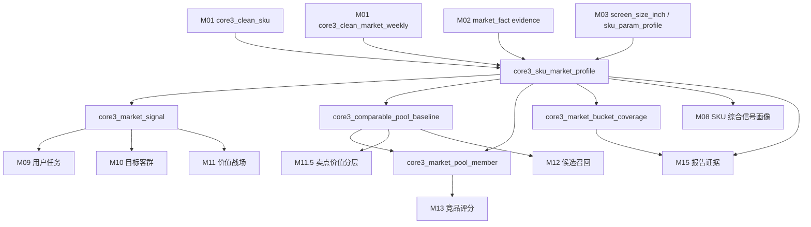
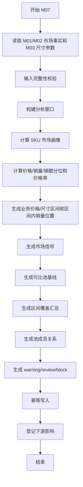

# M07 市场画像与可比池基线详细设计

## 1. 文档定位

本文是 CatForge 彩电核心三竞品 SOP 的 M07 详细设计，承接：

- 需求文档：`docs/core3_mvp/real_data_v2/sop_requirements/M07_market_profile_requirements.md`
- 总体设计：`docs/core3_mvp/real_data_v2/sop_detailed_design/00_architecture_data_dictionary_design.md`
- 上游 M01：`core3_clean_market_weekly`、`core3_clean_sku`
- 上游 M02：`core3_evidence_atom` 中的 `market_fact`
- 上游 M03：`core3_extract_param_value`、`core3_sku_param_profile`
- 下游 M08、M09、M10、M11、M11.5、M12、M13、M15、M16

M07 是市场事实和可比池模块，只处理清洗后的周销量、销额、均价、渠道、平台、周期和尺寸等可比池基础参数。M07 还必须输出业务可读的价格区间、尺寸区间和区间内销量位置。M07 不激活卖点、不判断用户任务、不推导目标客群、不生成价值战场、不召回或选择竞品。

当前真实样例只有 `26W01` 到 `26W23` 的周数据，因此 M07 必须使用可配置的观测窗口，不得生成 `12m` 这类伪 12 个月字段或结论。

## 2. 模块职责

### 2.1 本模块解决什么

M07 解决六类工程问题：

1. 把清洗后的周销量价事实汇总成 SKU 粒度市场画像。
2. 生成价格、销量、销额、平台占比、趋势、价格/英寸、分位等可复用市场指标。
3. 基于同品类、同/相邻尺寸、价格带、平台重合和市场活跃度建立可比池基线。
4. 输出下游可消费的市场信号，例如价格偏高、价格偏低、销量强、销额强、平台重合强、样本不足。
5. 保证所有市场指标和可比池成员可追溯到 M02 `market_fact` evidence。
6. 输出业务可解释的“SKU 位于哪个价格区间、在该价格区间销量处于什么位置；SKU 位于哪个尺寸区间、在该尺寸区间销量处于什么位置”。

### 2.2 本模块不解决什么

| 不做事项 | 原因 | 后续模块 |
| --- | --- | --- |
| 不做卖点激活 | 卖点来自 M04a/M04b | M04b/M08 |
| 不消费评论信号 | 评论由 M05/M06/M08 处理 | M06/M08 |
| 不判断用户任务 | 市场只是任务证据之一 | M09 |
| 不判断目标客群 | 客群需要任务、评论、市场综合推断 | M10 |
| 不判断价值战场 | 市场只提供战场市场分 | M11 |
| 不做战场内卖点价值分层 | PSI/SSI 需要卖点和战场上下文 | M11.5 |
| 不召回候选竞品 | M07 只提供可比池基线，不等于候选池 | M12 |
| 不计算竞品评分 | 市场压力评分由 M13 结合候选 pair 计算 | M13 |
| 不按品牌内外过滤 | 当前样例全为海信，同品牌 SKU 也可互为竞品 | M12-M14 |
| 不生成线下渠道结论 | 当前数据只有线上渠道 | M15 |

### 2.3 允许复用历史结果

允许复用历史 M07 输出，但必须同时满足：

- M01 `core3_clean_market_weekly.clean_hash` 未变化。
- M02 `market_fact` evidence hash 未变化。
- M03 `screen_size_inch` 相关参数画像 hash 未变化。
- 价格带、业务价格区间、业务尺寸区间、窗口、分位、可比池规则版本未变化。
- 历史记录 `is_current=true` 且 `processing_status` 不是 `failed`、`blocked`。

## 3. 输入输出总览

### 3.1 必须输入

| 输入 | 来源模块 | 表 | 用途 |
| --- | --- | --- | --- |
| SKU 主数据 | M01 | `core3_clean_sku` | SKU、型号、品牌、品类覆盖 |
| 周销量价清洗事实 | M01 | `core3_clean_market_weekly` | 周销量、销额、均价、渠道、平台、周期 |
| 市场 evidence | M02 | `core3_evidence_atom` where `evidence_type='market_fact'` | 市场指标证据追溯 |
| 标准尺寸参数 | M03 | `core3_extract_param_value` | 尺寸可比池和价格/英寸 |
| SKU 参数画像 | M03 | `core3_sku_param_profile` | 读取 `screen_size_inch`、参数质量 |

### 3.2 明确不消费

| 数据 | 禁止原因 |
| --- | --- |
| 原始 `week_sales_data` | 已由 M00-M02 分层处理，M07 不得绕过 |
| M04b 卖点激活 | M07 是市场基线，不受卖点影响 |
| M06 评论信号 | M07 不消费评论 |
| M09/M10/M11 结果 | M07 是上游，不依赖画像推导结果 |
| M12-M14 竞品结果 | M07 是候选和评分的上游 |

### 3.3 输出表

| 输出表 | 粒度 | 下游用途 |
| --- | --- | --- |
| `core3_sku_market_profile` | SKU + 分析窗口 | SKU 市场画像，供 M08/M09/M10/M11/M13 消费 |
| `core3_market_signal` | SKU + 分析窗口 + 市场信号 | 下游可消费的标准市场信号 |
| `core3_comparable_pool_baseline` | 目标 SKU + 可比池类型 + 分析窗口 | M11.5/M12/M13 的可比池基线 |
| `core3_market_pool_member` | 可比池 + 成员 SKU | 目标-成员市场关系，供候选和评分使用 |
| `core3_market_bucket_coverage` | 业务价格/尺寸区间 + 分析窗口 | 价格区间、尺寸区间的 SKU 覆盖、销量头部和分布摘要 |

### 3.4 模块关系



## 4. 分析窗口设计

### 4.1 窗口枚举

当前样例是 23 周数据，M07 必须用观测窗口表达，不使用 12 个月字段。

| 窗口编码 | 说明 | 计算口径 |
| --- | --- | --- |
| `full_observed_window` | 当前批次全量观测周 | 当前批次最小到最大有效周 |
| `latest_week` | 最新有效周 | 每个 SKU 或全局最新周，可配置 |
| `recent_4w` | 最近 4 个有效周 | 以全局最新周向前 4 周 |
| `recent_8w` | 最近 8 个有效周 | 以全局最新周向前 8 周 |
| `recent_12w` | 最近 12 个有效周 | 以全局最新周向前 12 周 |

后续数据达到更长周期时可新增 `rolling_26w`、`rolling_52w`，但首版不输出 `12m` 命名。

### 4.2 周序列口径

周字段来自 M01：

- `period_raw`：例如 `26W01`。
- `period_type='week'`。
- `period_year_hint=2026`。
- `period_week_index=1..23`。

窗口计算以 `period_week_index` 为主，`period_raw` 保留展示和证据引用。若 `period_parse_status!='parsed'`，该行可参与全量汇总但不能参与趋势窗口，并标记质量风险。

### 4.3 最新周口径

首版建议同时保存：

| 字段 | 含义 |
| --- | --- |
| `global_latest_week` | 当前批次全品类最大有效周 |
| `sku_latest_week` | 当前 SKU 最大有效周 |
| `latest_week_gap` | `global_latest_week - sku_latest_week` |

如果某 SKU 缺最新周但历史有数据，`price_latest` 使用 `sku_latest_week`，同时标记 `latest_week_missing_against_global`。

## 5. 数据模型设计

### 5.1 通用字段约定

M07 所有输出表必须包含以下通用字段。

| 字段 | 类型建议 | 必填 | 说明 |
| --- | --- | --- | --- |
| `project_id` | `text` | 是 | 项目 ID |
| `category_code` | `text` | 是 | MVP 为 `TV` |
| `batch_id` | `text` | 是 | M00 批次 |
| `run_id` | `text` | 否 | M16 全链路运行 ID |
| `module_run_id` | `text` | 否 | M07 模块运行 ID |
| `rule_version` | `text` | 是 | M07 规则版本 |
| `input_fingerprint` | `text` | 是 | 输入 hash |
| `result_hash` | `text` | 是 | 输出业务内容 hash |
| `is_current` | `boolean` | 是 | 是否当前版本 |
| `processing_status` | `text` | 是 | `success`、`warning`、`review_required`、`blocked`、`failed` |
| `review_required` | `boolean` | 是 | 是否需要复核 |
| `review_status` | `text` | 是 | `auto_pass`、`review_required`、`approved`、`rejected`、`waived` |
| `review_reason_json` | `jsonb` | 是 | 复核原因 |
| `created_at` | `timestamptz` | 是 | 创建时间 |
| `updated_at` | `timestamptz` | 是 | 更新时间 |

### 5.2 枚举定义

#### 5.2.1 `analysis_window`

```text
full_observed_window
latest_week
recent_4w
recent_8w
recent_12w
```

#### 5.2.2 `price_band`

动态价格带从当前批次分位生成，不能写死行业绝对价格段。该枚举用于模型计算、可比池和规则评分，不直接作为报告里的业务价格区间。

```text
low
mid_low
mid
mid_high
high
unknown
```

#### 5.2.3 `business_price_bucket`

业务价格区间输出绝对金额边界和中文标签，用于业务查询和报告展示。它可以来自已发布的品类配置，也可以由当前批次自动生成候选区间。

示例：

```text
price_0000_2499
price_2500_3999
price_4000_5999
price_6000_8999
price_9000_plus
unknown
```

区间标签示例：

```text
2500-3999 元
4000-5999 元
9000 元以上
```

编码和边界必须保存 `bucket_rule_version`，不能只保存展示文案。

#### 5.2.4 `size_bucket`

业务尺寸区间按品类配置。彩电首版以 `screen_size_inch` 为尺寸轴，同时保留精确尺寸段。

```text
size_under_55
size_55_65
size_70_79
size_80_89
size_90_plus
unknown
```

其他品类不得复用彩电尺寸规则，应由品类标准参数决定市场尺寸轴。例如空调可使用匹数或制冷量区间。

#### 5.2.5 `pool_type`

```text
same_size
adjacent_size
same_price_band
size_price_band
platform_overlap
market_active
```

禁止 M07 生成 `battlefield` 或 `claim` 可比池。

#### 5.2.6 `sample_status`

| 枚举 | 含义 |
| --- | --- |
| `sufficient` | 样本数量和有效周数满足分析 |
| `limited` | 样本偏少但可参考 |
| `insufficient` | 样本太少、关键字段缺失或无法计算 |
| `unknown` | 无有效市场事实 |

#### 5.2.7 `market_signal_code`

```text
PRICE_PERCENTILE_HIGH
PRICE_PERCENTILE_LOW
SALES_VOLUME_STRONG
SALES_AMOUNT_STRONG
PRICE_BUCKET_VOLUME_LEADER
SIZE_BUCKET_VOLUME_LEADER
PRICE_PER_INCH_VALUE
RECENT_PRICE_DROP
RECENT_SALES_UP
PLATFORM_OVERLAP_STRONG
SAMPLE_INSUFFICIENT
```

### 5.3 `core3_sku_market_profile`

#### 5.3.1 表用途

保存 SKU 在某个分析窗口下的市场画像。该表是 M08 之后消费市场事实的主输入。

#### 5.3.2 字段契约

| 字段 | 类型建议 | 必填 | 说明 |
| --- | --- | --- | --- |
| `sku_market_profile_id` | `text` | 是 | 主键，建议 `m07prof_<hash>` |
| `profile_key` | `text` | 是 | 稳定逻辑键 |
| `sku_code` | `text` | 是 | SKU 编码 |
| `model_name` | `text` | 否 | 型号名 |
| `brand_name` | `text` | 否 | 品牌名 |
| `category_name` | `text` | 否 | 原始或清洗品类名 |
| `analysis_window` | `text` | 是 | 分析窗口 |
| `period_start_raw` | `text` | 否 | 窗口起始周期 |
| `period_end_raw` | `text` | 否 | 窗口结束周期 |
| `period_start_week_index` | `integer` | 否 | 起始周序号 |
| `period_end_week_index` | `integer` | 否 | 结束周序号 |
| `global_latest_week_index` | `integer` | 否 | 批次全局最新周 |
| `sku_latest_week_index` | `integer` | 否 | SKU 最新周 |
| `latest_week_gap` | `integer` | 否 | 与全局最新周差距 |
| `active_week_count` | `integer` | 是 | 有有效销量价事实的周数 |
| `market_row_count` | `integer` | 是 | 来源市场行数 |
| `platform_count` | `integer` | 是 | 平台数 |
| `screen_size_inch` | `numeric` | 否 | 屏幕尺寸 |
| `size_segment` | `text` | 是 | 50/55/65/75/85/100/unknown |
| `size_param_confidence` | `numeric` | 是 | M03 尺寸置信度 |
| `sales_volume_total` | `numeric` | 否 | 观察期总销量 |
| `sales_amount_total` | `numeric` | 否 | 观察期总销额 |
| `price_wavg` | `numeric` | 否 | 销额 / 销量 |
| `price_latest` | `numeric` | 否 | SKU 最新有效周加权均价 |
| `price_median` | `numeric` | 否 | 周均价中位数 |
| `price_min` | `numeric` | 否 | 最低有效周均价 |
| `price_max` | `numeric` | 否 | 最高有效周均价 |
| `price_per_inch` | `numeric` | 否 | `price_wavg / screen_size_inch` |
| `main_channel_type` | `text` | 否 | 当前样例应为线上 |
| `main_platform` | `text` | 否 | 主销平台 |
| `channel_share_json` | `jsonb` | 是 | 渠道销量/销额占比 |
| `platform_share_json` | `jsonb` | 是 | 平台销量/销额占比 |
| `price_change_recent_4w` | `numeric` | 否 | 近 4 周均价变化率 |
| `sales_growth_recent_4w` | `numeric` | 否 | 近 4 周销量变化率 |
| `amount_growth_recent_4w` | `numeric` | 否 | 近 4 周销额变化率 |
| `price_volatility` | `numeric` | 否 | 周均价波动系数 |
| `sales_volatility` | `numeric` | 否 | 周销量波动系数 |
| `promotion_suspect_flag` | `boolean` | 是 | 价格下探且销量变化的促销疑似 |
| `price_band_category` | `text` | 是 | 品类动态价格带 |
| `price_band_size` | `text` | 是 | 尺寸内动态价格带 |
| `price_band_method` | `text` | 是 | `category_quantile`、`size_quantile` 等 |
| `business_price_bucket_code` | `text` | 是 | 业务价格区间编码 |
| `business_price_bucket_label` | `text` | 是 | 业务价格区间中文展示 |
| `business_price_bucket_floor` | `numeric` | 否 | 价格区间下界，含边界 |
| `business_price_bucket_ceiling` | `numeric` | 否 | 价格区间上界，开区间；最高档可为空 |
| `price_bucket_sku_count` | `integer` | 是 | 同业务价格区间 SKU 数 |
| `volume_rank_in_price_bucket` | `integer` | 否 | 同业务价格区间销量降序排名 |
| `volume_percentile_in_price_bucket` | `numeric` | 否 | 同业务价格区间销量分位，越高销量越强 |
| `volume_gap_to_price_bucket_median` | `numeric` | 否 | 与同业务价格区间中位销量差 |
| `amount_rank_in_price_bucket` | `integer` | 否 | 同业务价格区间销额降序排名 |
| `amount_percentile_in_price_bucket` | `numeric` | 否 | 同业务价格区间销额分位 |
| `size_bucket_code` | `text` | 是 | 业务尺寸区间编码 |
| `size_bucket_label` | `text` | 是 | 业务尺寸区间中文展示 |
| `size_bucket_floor_inch` | `numeric` | 否 | 尺寸区间下界，含边界 |
| `size_bucket_ceiling_inch` | `numeric` | 否 | 尺寸区间上界，开区间；最高档可为空 |
| `size_bucket_sku_count` | `integer` | 是 | 同业务尺寸区间 SKU 数 |
| `volume_rank_in_size_bucket` | `integer` | 否 | 同业务尺寸区间销量降序排名 |
| `volume_percentile_in_size_bucket` | `numeric` | 否 | 同业务尺寸区间销量分位，越高销量越强 |
| `volume_gap_to_size_bucket_median` | `numeric` | 否 | 与同业务尺寸区间中位销量差 |
| `size_price_bucket_key` | `text` | 否 | 业务尺寸区间 + 业务价格区间交叉 key |
| `size_price_bucket_sku_count` | `integer` | 是 | 交叉区间 SKU 数 |
| `volume_percentile_in_size_price_bucket` | `numeric` | 否 | 交叉区间销量分位，样本少时仅低置信使用 |
| `market_position_label` | `text` | 是 | 区间头部、区间中上、区间中位、区间尾部、样本不足等 |
| `price_percentile_in_category` | `numeric` | 否 | 品类价格分位 |
| `volume_percentile_in_category` | `numeric` | 否 | 品类销量分位 |
| `amount_percentile_in_category` | `numeric` | 否 | 品类销额分位 |
| `price_percentile_in_size` | `numeric` | 否 | 同尺寸价格分位 |
| `volume_percentile_in_size` | `numeric` | 否 | 同尺寸销量分位 |
| `amount_percentile_in_size` | `numeric` | 否 | 同尺寸销额分位 |
| `price_gap_to_category_median` | `numeric` | 否 | 与品类中位价差 |
| `price_gap_to_size_median` | `numeric` | 否 | 与同尺寸中位价差 |
| `volume_gap_to_size_median` | `numeric` | 否 | 与同尺寸中位销量差 |
| `amount_gap_to_size_median` | `numeric` | 否 | 与同尺寸中位销额差 |
| `market_confidence` | `numeric` | 是 | 市场画像置信度 |
| `confidence_level` | `text` | 是 | `high`、`medium`、`low`、`unknown` |
| `sample_status` | `text` | 是 | 样本充分性 |
| `quality_flags` | `jsonb` | 是 | 缺价格、缺尺寸、样本少等 |
| `evidence_ids` | `jsonb` | 是 | market evidence |
| `market_evidence_ids` | `jsonb` | 是 | M02 market_fact evidence |
| `param_evidence_ids` | `jsonb` | 是 | 尺寸参数 evidence |

#### 5.3.3 主键、唯一键和索引

| 类型 | 字段 |
| --- | --- |
| 主键 | `sku_market_profile_id` |
| 唯一键 | `project_id, category_code, batch_id, sku_code, analysis_window, rule_version` |
| 普通索引 | `sku_code, analysis_window` |
| 普通索引 | `analysis_window, size_segment` |
| 普通索引 | `price_band_category` |
| 普通索引 | `price_band_size` |
| 普通索引 | `analysis_window, business_price_bucket_code` |
| 普通索引 | `analysis_window, size_bucket_code` |
| 普通索引 | `analysis_window, size_price_bucket_key` |
| 普通索引 | `sample_status` |
| 普通索引 | `market_confidence` |
| 普通索引 | `review_required` |
| GIN 索引 | `channel_share_json`、`platform_share_json`、`quality_flags`、`evidence_ids` |

#### 5.3.4 JSON 字段结构

`platform_share_json`：

```json
{
  "专业电商": {
    "sales_volume": 1268,
    "sales_amount": 13421195.40,
    "volume_share": 0.94,
    "amount_share": 0.94
  },
  "平台电商": {
    "sales_volume": 79,
    "sales_amount": 828421.00,
    "volume_share": 0.06,
    "amount_share": 0.06
  }
}
```

`quality_flags`：

```json
[
  "observed_window_less_than_52w",
  "online_only_channel",
  "size_pool_limited",
  "latest_week_gap"
]
```

### 5.4 `core3_market_signal`

#### 5.4.1 表用途

保存 SKU 市场画像派生出的标准市场信号。市场信号是下游可消费的市场证据接口，不代表卖点、评论、任务、客群或战场结论。

#### 5.4.2 字段契约

| 字段 | 类型建议 | 必填 | 说明 |
| --- | --- | --- | --- |
| `market_signal_id` | `text` | 是 | 主键，建议 `m07sig_<hash>` |
| `signal_key` | `text` | 是 | 稳定逻辑键 |
| `sku_market_profile_id` | `text` | 是 | 来源市场画像 |
| `sku_code` | `text` | 是 | SKU |
| `analysis_window` | `text` | 是 | 分析窗口 |
| `signal_code` | `text` | 是 | 市场信号编码 |
| `signal_name` | `text` | 是 | 中文信号名 |
| `signal_value` | `numeric` | 否 | 信号值 |
| `signal_strength` | `numeric` | 是 | 信号强度，0-1 |
| `signal_level` | `text` | 是 | `strong`、`medium`、`weak`、`blocked` |
| `basis_metric` | `text` | 是 | 来源指标 |
| `basis_value_json` | `jsonb` | 是 | 来源指标快照 |
| `comparison_scope` | `text` | 是 | `category`、`size`、`pool`、`platform` |
| `comparison_scope_key` | `text` | 否 | 尺寸段、池 ID 或平台 |
| `polarity` | `text` | 是 | `positive`、`negative`、`neutral`、`risk` |
| `downstream_usage_json` | `jsonb` | 是 | 下游消费提示 |
| `confidence` | `numeric` | 是 | 置信度 |
| `confidence_level` | `text` | 是 | `high`、`medium`、`low`、`unknown` |
| `sample_status` | `text` | 是 | 样本状态 |
| `quality_flags` | `jsonb` | 是 | 质量标记 |
| `evidence_ids` | `jsonb` | 是 | market evidence |

#### 5.4.3 主键、唯一键和索引

| 类型 | 字段 |
| --- | --- |
| 主键 | `market_signal_id` |
| 唯一键 | `project_id, category_code, batch_id, sku_code, analysis_window, signal_code, comparison_scope, rule_version` |
| 普通索引 | `sku_code, signal_code` |
| 普通索引 | `analysis_window, signal_code` |
| 普通索引 | `signal_level` |
| 普通索引 | `comparison_scope` |
| 普通索引 | `review_required` |
| GIN 索引 | `basis_value_json`、`downstream_usage_json`、`quality_flags`、`evidence_ids` |

### 5.5 `core3_comparable_pool_baseline`

#### 5.5.1 表用途

保存目标 SKU 的可比池定义和池内市场分布。可比池是市场比较基线，不是候选竞品列表。

M07 只生成市场维度可比池：

- 同尺寸。
- 相邻尺寸。
- 同价格带。
- 同/相邻尺寸 + 同/相邻价格带。
- 平台重合。
- 市场活跃。

M07 不生成战场池或卖点池。

#### 5.5.2 字段契约

| 字段 | 类型建议 | 必填 | 说明 |
| --- | --- | --- | --- |
| `pool_id` | `text` | 是 | 主键，建议 `m07pool_<hash>` |
| `pool_key` | `text` | 是 | 稳定逻辑键 |
| `target_sku_code` | `text` | 是 | 目标 SKU |
| `target_model_name` | `text` | 否 | 目标型号 |
| `analysis_window` | `text` | 是 | 分析窗口 |
| `pool_type` | `text` | 是 | 可比池类型 |
| `pool_condition_json` | `jsonb` | 是 | 可比条件 |
| `candidate_sku_codes` | `jsonb` | 是 | 池内 SKU 编码列表 |
| `pool_sku_count` | `integer` | 是 | 池内 SKU 数 |
| `valid_member_count` | `integer` | 是 | 有可用市场画像的成员数 |
| `target_included` | `boolean` | 是 | 池内是否包含目标 SKU |
| `target_size_segment` | `text` | 是 | 目标尺寸段 |
| `target_price_band` | `text` | 是 | 目标价格带 |
| `median_price` | `numeric` | 否 | 池内价格中位数 |
| `median_volume` | `numeric` | 否 | 池内销量中位数 |
| `median_amount` | `numeric` | 否 | 池内销额中位数 |
| `price_distribution_json` | `jsonb` | 是 | 价格分布 |
| `volume_distribution_json` | `jsonb` | 是 | 销量分布 |
| `amount_distribution_json` | `jsonb` | 是 | 销额分布 |
| `platform_distribution_json` | `jsonb` | 是 | 平台分布 |
| `pool_confidence` | `numeric` | 是 | 可比池置信度 |
| `sample_status` | `text` | 是 | 样本状态 |
| `basis` | `text` | 是 | 中文可比依据 |
| `quality_flags` | `jsonb` | 是 | 样本少、尺寸缺失等 |
| `evidence_ids` | `jsonb` | 是 | 池内 market evidence |

#### 5.5.3 主键、唯一键和索引

| 类型 | 字段 |
| --- | --- |
| 主键 | `pool_id` |
| 唯一键 | `project_id, category_code, batch_id, target_sku_code, analysis_window, pool_type, rule_version` |
| 普通索引 | `target_sku_code, pool_type` |
| 普通索引 | `analysis_window, pool_type` |
| 普通索引 | `sample_status` |
| 普通索引 | `pool_sku_count` |
| GIN 索引 | `pool_condition_json`、`candidate_sku_codes`、`price_distribution_json`、`quality_flags`、`evidence_ids` |

#### 5.5.4 `pool_condition_json` 示例

```json
{
  "pool_type": "size_price_band",
  "category_code": "TV",
  "size_relation": ["same", "adjacent"],
  "target_size_segment": "85",
  "allowed_size_segments": ["75", "85", "100"],
  "price_band_relation": ["same", "adjacent"],
  "target_price_band": "mid_high",
  "analysis_window": "full_observed_window",
  "brand_filter": "none"
}
```

### 5.6 `core3_market_pool_member`

#### 5.6.1 表用途

保存目标 SKU 与可比池成员 SKU 的市场关系。该表是 M12 候选召回和 M13 市场压力评分的重要输入，但 M07 不给出候选竞品判断。

#### 5.6.2 字段契约

| 字段 | 类型建议 | 必填 | 说明 |
| --- | --- | --- | --- |
| `pool_member_id` | `text` | 是 | 主键，建议 `m07pm_<hash>` |
| `pool_id` | `text` | 是 | 可比池 ID |
| `target_sku_code` | `text` | 是 | 目标 SKU |
| `member_sku_code` | `text` | 是 | 成员 SKU |
| `analysis_window` | `text` | 是 | 分析窗口 |
| `member_model_name` | `text` | 否 | 成员型号 |
| `member_brand_name` | `text` | 否 | 成员品牌 |
| `is_target_self` | `boolean` | 是 | 是否目标本身 |
| `size_relation` | `text` | 是 | `same`、`adjacent`、`different`、`unknown` |
| `price_band_relation` | `text` | 是 | `same`、`adjacent`、`higher`、`lower`、`unknown` |
| `platform_overlap_score` | `numeric` | 是 | 平台重合分 |
| `channel_overlap_score` | `numeric` | 是 | 渠道重合分，当前线上为主 |
| `price_gap_to_target` | `numeric` | 否 | 成员价 - 目标价 |
| `price_gap_pct_to_target` | `numeric` | 否 | 价差比例 |
| `volume_gap_to_target` | `numeric` | 否 | 成员销量 - 目标销量 |
| `amount_gap_to_target` | `numeric` | 否 | 成员销额 - 目标销额 |
| `member_price_percentile_in_pool` | `numeric` | 否 | 成员池内价格分位 |
| `member_volume_percentile_in_pool` | `numeric` | 否 | 成员池内销量分位 |
| `member_amount_percentile_in_pool` | `numeric` | 否 | 成员池内销额分位 |
| `member_market_confidence` | `numeric` | 是 | 成员市场画像置信度 |
| `relation_strength` | `numeric` | 是 | 市场可比关系强度 |
| `quality_flags` | `jsonb` | 是 | 质量标记 |
| `evidence_ids` | `jsonb` | 是 | market evidence |

#### 5.6.3 主键、唯一键和索引

| 类型 | 字段 |
| --- | --- |
| 主键 | `pool_member_id` |
| 唯一键 | `pool_id, target_sku_code, member_sku_code, rule_version` |
| 普通索引 | `target_sku_code, member_sku_code` |
| 普通索引 | `pool_id` |
| 普通索引 | `size_relation` |
| 普通索引 | `price_band_relation` |
| 普通索引 | `platform_overlap_score` |
| GIN 索引 | `quality_flags`、`evidence_ids` |

### 5.7 `core3_market_bucket_coverage`

#### 5.7.1 表用途

保存每个分析窗口下业务价格区间、业务尺寸区间和尺寸价格交叉区间的覆盖情况。该表解决两个查询问题：

1. 某个价格区间或尺寸区间覆盖哪些 SKU。
2. 某个区间内销量头部、腰部、尾部 SKU 分别是谁。

它是 M07 市场事实输出，不是竞品池，也不表达任务、客群、战场或卖点价值。

#### 5.7.2 字段契约

| 字段 | 类型建议 | 必填 | 说明 |
| --- | --- | --- | --- |
| `bucket_coverage_id` | `text` | 是 | 主键，建议 `m07bucket_<hash>` |
| `bucket_key` | `text` | 是 | 稳定逻辑键 |
| `project_id` | `text` | 是 | 项目 ID |
| `category_code` | `text` | 是 | 品类 |
| `batch_id` | `text` | 是 | 批次 |
| `analysis_window` | `text` | 是 | 分析窗口 |
| `bucket_type` | `text` | 是 | `business_price_bucket`、`size_bucket`、`size_price_bucket` |
| `bucket_code` | `text` | 是 | 区间编码 |
| `bucket_label` | `text` | 是 | 中文展示 |
| `bucket_floor` | `numeric` | 否 | 价格或尺寸下界 |
| `bucket_ceiling` | `numeric` | 否 | 价格或尺寸上界 |
| `bucket_unit` | `text` | 是 | `yuan`、`inch` 或 `mixed` |
| `sku_count` | `integer` | 是 | 区间 SKU 数 |
| `valid_sku_count` | `integer` | 是 | 有可用销量价事实的 SKU 数 |
| `total_sales_volume` | `numeric` | 否 | 区间总销量 |
| `total_sales_amount` | `numeric` | 否 | 区间总销额 |
| `median_price` | `numeric` | 否 | 区间中位价格 |
| `median_volume` | `numeric` | 否 | 区间中位销量 |
| `median_amount` | `numeric` | 否 | 区间中位销额 |
| `top_sku_codes` | `jsonb` | 是 | 销量头部 SKU，默认前 10 |
| `sku_codes` | `jsonb` | 是 | 区间覆盖 SKU，可按销量降序保存 |
| `distribution_json` | `jsonb` | 是 | 价格、销量、销额分布摘要 |
| `sample_status` | `text` | 是 | `sufficient/limited/insufficient/unknown` |
| `bucket_rule_version` | `text` | 是 | 区间规则版本 |
| `rule_version` | `text` | 是 | M07 规则版本 |
| `quality_flags` | `jsonb` | 是 | 样本少、价格缺失、尺寸缺失等 |
| `evidence_ids` | `jsonb` | 是 | 区间内 market evidence |

#### 5.7.3 主键、唯一键和索引

| 类型 | 字段 |
| --- | --- |
| 主键 | `bucket_coverage_id` |
| 唯一键 | `project_id, category_code, batch_id, analysis_window, bucket_type, bucket_code, rule_version` |
| 普通索引 | `analysis_window, bucket_type` |
| 普通索引 | `bucket_code` |
| 普通索引 | `sku_count` |
| 普通索引 | `sample_status` |
| GIN 索引 | `top_sku_codes`、`sku_codes`、`distribution_json`、`quality_flags`、`evidence_ids` |

## 6. 指标计算设计

### 6.1 基础指标

对每个 SKU 和分析窗口计算：

```text
sales_volume_total = sum(valid sales_volume)
sales_amount_total = sum(valid sales_amount)
price_wavg = sales_amount_total / sales_volume_total
price_latest = latest_week sales_amount / latest_week sales_volume
price_median = median(weekly avg_price)
price_min = min(weekly avg_price)
price_max = max(weekly avg_price)
price_per_inch = price_wavg / screen_size_inch
```

特殊规则：

- `sales_volume` 为 null：该行不参与销量和价格计算，标记 `missing_sales_volume`。
- `sales_volume=0` 且 `sales_amount=0`：保留为有效零销量周，但不参与 `price_wavg` 分母。
- `sales_volume=0` 且 `sales_amount>0`：标记 `market_amount_without_volume`，价格不可计算。
- `avg_price` 与 `sales_amount/sales_volume` 不一致时，以 M01 `price_check_status` 为准，保留 quality flag。
- `price_wavg` 必须优先用销额/销量计算，不使用简单周均价平均。

### 6.2 平台和渠道占比

当前真实样例：

- `channel_type=线上`
- `platform_type in ('专业电商','平台电商')`

M07 计算：

```text
platform_volume_share = platform_sales_volume / sku_sales_volume_total
platform_amount_share = platform_sales_amount / sku_sales_amount_total
main_platform = platform with max platform_sales_amount
main_channel_type = channel with max channel_sales_amount
```

当前只有线上渠道，因此：

- 可以输出线上渠道占比。
- 不得输出线下覆盖、线下优势、线下渠道压力等结论。
- M12/M13 的渠道重合首版应基于 `platform_type`。

### 6.3 趋势指标

趋势只在窗口有效周数满足阈值时计算。

| 指标 | 计算 |
| --- | --- |
| `price_change_recent_4w` | 最近 4 周加权均价 vs 前 4 周加权均价 |
| `sales_growth_recent_4w` | 最近 4 周销量 vs 前 4 周销量 |
| `amount_growth_recent_4w` | 最近 4 周销额 vs 前 4 周销额 |
| `price_volatility` | 周均价标准差 / 周均价均值 |
| `sales_volatility` | 周销量标准差 / 周销量均值 |
| `promotion_suspect_flag` | 价格下降且销量/销额明显上升 |

样本不足规则：

- 最近 4 周有效周数少于 3：趋势 `null`，标记 `trend_sample_insufficient`。
- 前 4 周有效周数少于 3：增长率 `null`，标记 `baseline_window_insufficient`。
- 周序列中断较多：趋势置信度降低。

### 6.4 分位指标

分位在五个 scope 中计算：

| scope | 分位字段 |
| --- | --- |
| 品类 | `price_percentile_in_category`、`volume_percentile_in_category`、`amount_percentile_in_category` |
| 同尺寸 | `price_percentile_in_size`、`volume_percentile_in_size`、`amount_percentile_in_size` |
| 同业务价格区间 | `volume_percentile_in_price_bucket`、`amount_percentile_in_price_bucket` |
| 同业务尺寸区间 | `volume_percentile_in_size_bucket`、`amount_percentile_in_size_bucket` |
| 业务尺寸价格交叉区间 | `volume_percentile_in_size_price_bucket` |
| 可比池 | `member_*_percentile_in_pool` |

分位规则：

```text
percentile_rank = count(values <= target_value) / count(valid values)
```

解释：

- 价格分位越高，价格越高。
- 销量分位越高，销量越强。
- 销额分位越高，销额越强。
- 区间内销量排名按 `sales_volume_total` 降序，`rank=1` 表示该区间销量最高。

样本规则：

- scope 内有效 SKU 数 `< 3`：分位可计算但 `sample_status='insufficient'`，下游不得高置信使用。
- scope 内有效 SKU 数 `3-5`：`sample_status='limited'`。
- scope 内有效 SKU 数 `>= 6`：可为 `sufficient`，但仍需看有效周数。

### 6.5 动态价格带

动态价格带必须动态生成，用于规则计算和可比池，不作为业务报告里的绝对价格区间。

首版建议：

| 价格带 | 分位范围 |
| --- | --- |
| `low` | `0.00-0.20` |
| `mid_low` | `0.20-0.40` |
| `mid` | `0.40-0.60` |
| `mid_high` | `0.60-0.80` |
| `high` | `0.80-1.00` |

如果样本不足或价格缺失：

- `price_band_category='unknown'`
- `price_band_size='unknown'`
- 标记 `price_band_sample_insufficient` 或 `price_missing`。

### 6.6 业务价格区间

业务价格区间用于回答“这个 SKU 在哪个价格区间”。它必须有绝对金额边界和中文标签。

#### 6.6.1 区间来源

优先级：

1. 使用已发布的品类业务价格区间配置。
2. 如果没有发布配置，则用当前批次 `full_observed_window.price_wavg` 自动生成候选区间。
3. 候选区间必须写入 `bucket_rule_version` 并标记 `bucket_rule_status='candidate'`，后续可经人工复核固化。

#### 6.6.2 自动生成候选区间

自动区间生成规则：

1. 读取有效 `price_wavg`。
2. 以分位边界生成候选切点，例如 0%、20%、40%、60%、80%、100%。
3. 将候选切点吸附到业务可读价格，例如 500、1000、2000、5000 的倍数。
4. 如果吸附后出现重复边界，合并相邻区间。
5. 如果某个非边缘区间有效 SKU 数 `<3`，与相邻区间合并。
6. 只将有 SKU 覆盖的区间展示为市场事实；无覆盖区间只作为规则候选保留。

#### 6.6.3 SKU 归桶

```text
business_price_bucket =
  bucket where floor <= price_wavg < ceiling
```

最高区间 `ceiling=null` 时表示无上界。价格缺失时：

- `business_price_bucket_code='unknown'`
- `business_price_bucket_label='价格未知'`
- `quality_flags` 增加 `business_price_bucket_unknown`

#### 6.6.4 区间内销量位置

同一 `analysis_window + business_price_bucket_code` 内：

```text
volume_rank_in_price_bucket = dense_rank(desc sales_volume_total)
volume_percentile_in_price_bucket = count(volume <= target_volume) / count(valid volume)
volume_gap_to_price_bucket_median = target_volume - median(bucket volumes)
```

销额位置同理计算 `amount_rank_in_price_bucket` 和 `amount_percentile_in_price_bucket`。

### 6.7 尺寸段和业务尺寸区间

尺寸来自 M03 `screen_size_inch`。

建议规则：

```text
if value in [50, 55, 65, 75, 85, 100] => exact segment
else if abs(value - nearest common size) <= 2 => nearest segment
else => custom_<rounded>
```

缺尺寸时：

- `size_segment='unknown'`
- `size_bucket_code='unknown'`
- 不进入 `same_size`、`adjacent_size`、`size_price_band` 可比池。
- 可进入 `same_price_band`、`platform_overlap`、`market_active`。

业务尺寸区间按品类配置。彩电首版：

| `size_bucket_code` | 区间 | 说明 |
| --- | --- | --- |
| `size_under_55` | `<55` | 小尺寸/入门 |
| `size_55_65` | `55-65` | 主流尺寸 |
| `size_70_79` | `70-79` | 大屏升级 |
| `size_80_89` | `80-89` | 超大屏主流 |
| `size_90_plus` | `>=90` | 巨幕/旗舰尺寸 |
| `unknown` | 未知 | 缺尺寸或无法解析 |

其他品类必须配置自己的市场尺寸轴。空调不能使用彩电寸数区间，应使用匹数或制冷量区间。

同一 `analysis_window + size_bucket_code` 内计算：

```text
volume_rank_in_size_bucket = dense_rank(desc sales_volume_total)
volume_percentile_in_size_bucket = count(volume <= target_volume) / count(valid volume)
volume_gap_to_size_bucket_median = target_volume - median(bucket volumes)
```

### 6.8 尺寸价格交叉区间

`size_price_bucket_key = size_bucket_code + "|" + business_price_bucket_code`。

交叉区间用于辅助竞品池和报告解释，但只有当有效 SKU 数 `>=3` 时才可高置信展示。样本不足时：

- 保留 `size_price_bucket_key`。
- `volume_percentile_in_size_price_bucket` 可计算但标记 `size_price_bucket_limited` 或 `size_price_bucket_insufficient`。
- 下游不得把交叉区间位置作为强结论。

### 6.9 市场位置标签

市场位置标签以区间内销量分位为主，不用价格高低替代销量强弱。

| 标签 | 条件 |
| --- | --- |
| `bucket_leader` | 价格区间或尺寸区间销量分位 `>=0.80`，且样本数充足 |
| `bucket_upper` | 销量分位 `>=0.60` |
| `bucket_middle` | 销量分位 `>=0.40` |
| `bucket_lower` | 销量分位 `>=0.20` |
| `bucket_tail` | 销量分位 `<0.20` |
| `sample_limited` | 区间有效 SKU 数不足，不能高置信分层 |
| `unknown` | 销量或区间缺失 |

如果价格区间和尺寸区间给出的标签冲突，`market_position_label` 可输出综合标签，并在 `basis_value_json` 或 `distribution_json` 中保留两个维度的原始位置。

### 6.10 平台重合分

目标 SKU 与成员 SKU 的平台重合：

```text
platform_overlap_score =
  sum(min(target_platform_amount_share[p], member_platform_amount_share[p]))
```

当前只有两个平台，分值范围 0-1。

渠道重合：

```text
channel_overlap_score =
  sum(min(target_channel_amount_share[c], member_channel_amount_share[c]))
```

当前样例基本为线上，渠道重合不能成为区分优势，只能作为基本可比条件。

## 7. 市场信号生成规则

### 7.1 信号定义

| 信号编码 | 中文名 | 触发条件 | 下游用途 |
| --- | --- | --- | --- |
| `PRICE_PERCENTILE_HIGH` | 价格分位高 | 品类或同尺寸价格分位 >= 0.75 | M11/M13 高端或上探压力 |
| `PRICE_PERCENTILE_LOW` | 价格分位低 | 品类或同尺寸价格分位 <= 0.25 | M09/M13 性价比或价格拦截 |
| `SALES_VOLUME_STRONG` | 销量强 | 销量分位 >= 0.75 | M09/M11/M13 |
| `SALES_AMOUNT_STRONG` | 销额强 | 销额分位 >= 0.75 | M11/M13 |
| `PRICE_BUCKET_VOLUME_LEADER` | 同价格区间销量靠前 | `volume_percentile_in_price_bucket >= 0.80` 且区间样本充足 | M09/M11/M13/M15 |
| `SIZE_BUCKET_VOLUME_LEADER` | 同尺寸区间销量靠前 | `volume_percentile_in_size_bucket >= 0.80` 且区间样本充足 | M09/M11/M13/M15 |
| `PRICE_PER_INCH_VALUE` | 每英寸价格效率好 | 同尺寸或相邻尺寸价格/英寸分位 <= 0.30 | M09/M11/M13 |
| `RECENT_PRICE_DROP` | 近期价格下探 | 近 4 周价格下降超过阈值 | M13 价格压力 |
| `RECENT_SALES_UP` | 近期销量上升 | 近 4 周销量增长超过阈值 | M13 市场压力 |
| `PLATFORM_OVERLAP_STRONG` | 平台重合强 | 与目标或池成员平台重合 >= 0.70 | M12/M13 |
| `SAMPLE_INSUFFICIENT` | 样本不足 | 样本 insufficient 或关键指标缺失 | M16 复核 |

### 7.2 信号强度

示例：

```text
PRICE_PERCENTILE_HIGH strength = max(price_percentile_in_category, price_percentile_in_size)
PRICE_PERCENTILE_LOW strength = 1 - min(price_percentile_in_category, price_percentile_in_size)
SALES_VOLUME_STRONG strength = max(volume_percentile_in_category, volume_percentile_in_size)
PRICE_BUCKET_VOLUME_LEADER strength = volume_percentile_in_price_bucket
SIZE_BUCKET_VOLUME_LEADER strength = volume_percentile_in_size_bucket
PRICE_PER_INCH_VALUE strength = 1 - price_per_inch_percentile
RECENT_PRICE_DROP strength = min(1, abs(price_change_recent_4w) / threshold)
```

信号等级：

| 等级 | 分数 |
| --- | --- |
| `strong` | `>=0.75` |
| `medium` | `0.55-0.75` |
| `weak` | `0.35-0.55` |
| `blocked` | 样本不足或证据不可用 |

### 7.3 下游使用策略

`downstream_usage_json` 示例：

```json
{
  "M09": {
    "allowed": true,
    "usage": "market_support_for_value_or_replacement_task",
    "cannot_alone_determine_task": true
  },
  "M11": {
    "allowed": true,
    "usage": "battlefield_market_support",
    "cannot_alone_determine_battlefield": true
  },
  "M13": {
    "allowed": true,
    "usage": "market_pressure_component"
  },
  "M15": {
    "display_as_market_evidence_only": true
  }
}
```

## 8. 可比池设计

### 8.1 通用原则

1. 可比池用于市场比较，不等于核心竞品列表。
2. 可比池不按品牌排除，当前全是海信也必须保留同品牌比较。
3. 可比池只依赖市场和基础尺寸/价格带，不依赖卖点、评论、任务或战场。
4. 同一目标 SKU 可以有多个可比池。
5. 池内可以包含目标 SKU 本身，用于计算分布；下游召回候选时再排除目标本身。

### 8.2 可比池类型

| `pool_type` | 条件 | 用途 |
| --- | --- | --- |
| `same_size` | 同品类 + 同尺寸段 | 同尺寸价格/销量比较 |
| `adjacent_size` | 同品类 + 相邻尺寸段 | 75/85/100 等跨尺寸压力 |
| `same_price_band` | 同品类 + 同品类价格带 | 同价位市场比较 |
| `size_price_band` | 同/相邻尺寸 + 同/相邻价格带 | M12/M13 主要候选市场基线 |
| `platform_overlap` | 同品类 + 平台重合强 | 渠道平台可比 |
| `market_active` | 同品类 + 有效销售周数达标 | 活跃 SKU 基线 |

### 8.3 相邻尺寸规则

当前样例常见尺寸：

```text
50, 55, 65, 75, 85, 100
```

相邻规则：

| 目标尺寸 | 相邻尺寸 |
| --- | --- |
| 50 | 55 |
| 55 | 50、65 |
| 65 | 55、75 |
| 75 | 65、85 |
| 85 | 75、100 |
| 100 | 85 |

非标准尺寸按最近标准尺寸归入后再判断。

### 8.4 样本充分性

| 状态 | 条件 |
| --- | --- |
| `sufficient` | 池内有效成员数 >= 6 且目标有效周数 >= 8 |
| `limited` | 池内有效成员数 3-5，或目标有效周数 4-7 |
| `insufficient` | 池内有效成员数 < 3，或目标有效周数 < 4 |
| `unknown` | 无法形成池 |

MVP 样例只有 35 个型号，同尺寸池经常为 `limited`。不能因为池小就强行输出高置信结论。

### 8.5 可比池成员关系强度

```text
relation_strength =
  0.30 * size_relation_score
+ 0.25 * price_band_relation_score
+ 0.20 * platform_overlap_score
+ 0.15 * market_activity_score
+ 0.10 * confidence_score
```

评分规则：

| 子项 | 规则 |
| --- | --- |
| `size_relation_score` | same=1.0, adjacent=0.7, different=0.2, unknown=0 |
| `price_band_relation_score` | same=1.0, adjacent=0.7, higher/lower=0.4, unknown=0 |
| `platform_overlap_score` | 平台份额交集 |
| `market_activity_score` | 有效周数和销量可用性 |
| `confidence_score` | 成员市场画像置信度 |

## 9. 处理流程设计

### 9.1 总流程



### 9.2 步骤 1：读取输入

1. 读取 `core3_clean_sku` 当前批次 SKU。
2. 读取 `core3_clean_market_weekly` 中 `record_status='active'` 的周事实。
3. 读取 M02 `market_fact` evidence 并按 `sku_code + period + platform` 建索引。
4. 读取 M03 `core3_sku_param_profile.param_values_json.screen_size_inch`。
5. 计算输入 fingerprint：

```text
hash(
  sorted(clean_market_weekly.clean_hash)
  + sorted(market_fact.evidence_id/evidence_hash)
  + screen_size_inch profile_hash
  + window_rule_version
  + price_band_rule_version
  + business_price_bucket_rule_version
  + size_bucket_rule_version
  + pool_rule_version
)
```

### 9.3 步骤 2：输入校验

| 校验项 | 处理 |
| --- | --- |
| SKU 无市场行 | 输出空 profile，`sample_status='unknown'`，生成 `SAMPLE_INSUFFICIENT` |
| 销量/销额无法数值化 | 过滤异常行，生成质量标记 |
| 均价校验 mismatch | 保留但降置信，进入 warning |
| 周期无法解析 | 参与全量汇总，不能参与趋势 |
| 尺寸缺失 | 不进入尺寸池，生成 review |
| 平台缺失 | 平台重合不可用，生成 warning |
| 当前只有线上 | 标记 `online_only_channel`，禁止线下结论 |

### 9.4 步骤 3：构建分析窗口

全局窗口：

1. 找出当前批次所有 `period_type='week'` 且已解析的最大周序号。
2. `full_observed_window` 使用全量有效周。
3. `latest_week` 使用每个 SKU 的最新有效周。
4. `recent_4w/8w/12w` 使用全局最新周向前回溯。

SKU 在某窗口内无有效行时，仍生成 profile，但 `sample_status='unknown'`。

### 9.5 步骤 4：计算 SKU 市场画像

逐 SKU + 窗口：

1. 聚合销量和销额。
2. 计算加权均价、最新价、中位价、最低价、最高价。
3. 计算平台占比和主平台。
4. 读取尺寸并计算价格/英寸。
5. 计算趋势和波动。
6. 写入 evidence IDs。
7. 计算 `market_confidence`。

### 9.6 步骤 5：计算分位和价格带

同一批次、同一窗口内：

1. 先计算品类 scope 的价格/销量/销额分位。
2. 再按 `size_segment` 计算尺寸内分位。
3. 根据品类价格分位生成 `price_band_category`。
4. 根据尺寸内价格分位生成 `price_band_size`。
5. 样本不足时保留分位值但降级 sample status。

### 9.7 步骤 6：生成业务区间和区间内销量位置

同一批次、同一窗口内：

1. 读取或生成业务价格区间规则。
2. 按 `price_wavg` 将 SKU 放入 `business_price_bucket`。
3. 按品类尺寸轴将 SKU 放入 `size_bucket`，彩电使用 `screen_size_inch`。
4. 生成 `size_price_bucket_key`。
5. 在价格区间内计算销量排名、销量分位、销额排名和销额分位。
6. 在尺寸区间内计算销量排名、销量分位、销额排名和销额分位。
7. 在尺寸价格交叉区间内计算辅助销量分位。
8. 生成 `market_position_label` 和样本状态。
9. 生成 `core3_market_bucket_coverage` 覆盖汇总。

### 9.8 步骤 7：生成市场信号

对每个 profile 执行信号规则：

1. 价格高低信号。
2. 销量/销额强信号。
3. 同价格区间销量领先信号。
4. 同尺寸区间销量领先信号。
5. 每英寸价格效率信号。
6. 近期价格和销量趋势信号。
7. 样本不足信号。

`PLATFORM_OVERLAP_STRONG` 主要在 pool member 中计算；如需 SKU 自身 profile signal，可表示“该 SKU 主销平台与品类主平台高度一致”。

### 9.9 步骤 8：生成可比池

对每个目标 SKU + 窗口：

1. 读取目标 profile。
2. 按 pool type 生成候选条件。
3. 从同批次同窗口 profile 中筛选成员。
4. 计算池内中位价、销量、销额和分布。
5. 计算 sample status。
6. 写 `core3_comparable_pool_baseline`。
7. 写 `core3_market_pool_member`。

### 9.10 步骤 9：质量和复核

生成 warning/review/block：

- 数据缺失。
- 样本不足。
- 趋势不足。
- 尺寸缺失。
- 价格异常。
- 平台缺失。
- 最新周缺失。
- 批次间波动异常。

## 10. 市场置信度设计

### 10.1 SKU 市场画像置信度

```text
market_confidence =
  0.25 * active_week_score
+ 0.20 * price_validity_score
+ 0.20 * volume_amount_validity_score
+ 0.15 * evidence_trace_score
+ 0.10 * size_available_score
+ 0.10 * platform_available_score
```

降权：

- `price_check_mismatch`：降 0.10。
- `latest_week_gap > 2`：降 0.08。
- `screen_size_inch` 缺失：降 0.12。
- `platform_type` 缺失：降 0.08。
- 观察窗口少于 4 周：最高 low。

### 10.2 可比池置信度

```text
pool_confidence =
  0.35 * pool_size_score
+ 0.20 * member_market_confidence_avg
+ 0.20 * condition_specificity_score
+ 0.15 * distribution_validity_score
+ 0.10 * evidence_trace_score
```

`same_size` 和 `size_price_band` 如果尺寸缺失，直接 `unknown` 或不生成。

## 11. 增量策略

### 11.1 触发条件

| 输入变化 | M07 动作 | 下游影响 |
| --- | --- | --- |
| `core3_clean_market_weekly` 新增/变化 | 重算对应 SKU 市场画像 | M08-M16 |
| M02 `market_fact` evidence 变化 | 重算 evidence 引用和相关画像 | M08-M16 |
| M03 `screen_size_inch` 变化 | 重算尺寸段、价格/英寸、尺寸可比池 | M08-M16 |
| 平台/渠道清洗规则变化 | 重算平台占比、平台重合和相关池 | M08-M16 |
| 分位/价格带规则变化 | 重算所有同窗口分位、价格带和池 | M07-M16 |
| 业务价格区间规则变化 | 重算价格区间、区间内销量位置和区间覆盖 | M07-M16 |
| 业务尺寸区间规则变化 | 重算尺寸区间、区间内销量位置和区间覆盖 | M07-M16 |
| 可比池规则变化 | 重算池和成员关系 | M11.5-M16 |

### 11.2 幂等写入

1. 按 SKU + 窗口计算 profile fingerprint。
2. 若 fingerprint 未变且非 force，跳过 profile 重算。
3. 分位、动态价格带和业务区间依赖全体 SKU，需要在窗口级别判断是否全局重算。
4. profile 或区间规则变化后重算相关 signals、bucket coverage、pools、pool members。
5. hash 未变复用当前记录。
6. hash 变化则旧记录 `is_current=false`，插入新版本。
7. 输入消失时将对应输出置为非当前并记录 `inactive_reason`。

### 11.3 hash 计算

| 对象 | hash 输入 |
| --- | --- |
| `sku_market_profile` | `sku_code + analysis_window + market_row_hashes + market_metrics + screen_size + business_bucket_assignments + bucket_position_metrics + rule_version` |
| `market_signal` | `profile_hash + signal_code + basis_metric + signal_strength + sample_status + rule_version` |
| `comparable_pool_baseline` | `target_sku + analysis_window + pool_type + pool_condition + member_sku_codes + distributions + rule_version` |
| `market_pool_member` | `pool_id + target_sku + member_sku + relation_metrics + rule_version` |
| `market_bucket_coverage` | `analysis_window + bucket_type + bucket_code + sku_codes + distributions + bucket_rule_version + rule_version` |

### 11.4 下游触发

| M07 输出变化 | 触发模块 |
| --- | --- |
| SKU market profile 变化 | M08-M16 |
| market signal 变化 | M08、M09、M10、M11、M13-M16 |
| comparable pool 变化 | M11.5、M12、M13-M16 |
| pool member 变化 | M12、M13-M16 |
| market bucket coverage 变化 | M08、M11、M13、M15、M16 |
| 仅 evidence 展示变化 | M15、M16 |
| 样本状态变为 insufficient | M16，必要时阻断下游 |

## 12. 服务、任务和 API 边界

### 12.1 后端服务建议

| 服务 | 职责 |
| --- | --- |
| `MarketProfileM07Runner` | M07 模块入口 |
| `MarketInputService` | 读取 M01/M02/M03 输入 |
| `MarketWindowService` | 构建分析窗口 |
| `SkuMarketMetricCalculator` | 计算 SKU 市场指标 |
| `MarketPercentileService` | 计算分位和价格带 |
| `BusinessMarketBucketService` | 生成业务价格区间、业务尺寸区间和区间内排名/分位 |
| `MarketSignalBuilder` | 生成标准市场信号 |
| `MarketBucketCoverageBuilder` | 生成区间覆盖汇总 |
| `ComparablePoolBuilder` | 生成可比池基线 |
| `MarketPoolMemberBuilder` | 生成池成员关系 |
| `MarketQualityPolicy` | 质量、复核和阻断规则 |
| `M07DownstreamImpactService` | 登记下游影响 |

### 12.2 Repository 边界

| Repository | 访问表 |
| --- | --- |
| `CleanSkuRepository` | 只读 M01 `core3_clean_sku` |
| `CleanMarketWeeklyRepository` | 只读 M01 `core3_clean_market_weekly` |
| `EvidenceAtomRepository` | 只读 M02 `market_fact` evidence |
| `SkuParamProfileRepository` | 只读 M03 `core3_sku_param_profile` |
| `MarketProfileRepository` | 写 `core3_sku_market_profile` |
| `MarketSignalRepository` | 写 `core3_market_signal` |
| `MarketBucketCoverageRepository` | 写 `core3_market_bucket_coverage` |
| `ComparablePoolRepository` | 写 `core3_comparable_pool_baseline` |
| `MarketPoolMemberRepository` | 写 `core3_market_pool_member` |

Repository 不允许读取原始 `week_sales_data`。

### 12.3 任务入口

建议任务函数：

```text
run_core3_m07_market_profile(
  project_id: str,
  category_code: str,
  batch_id: str,
  sku_scope: list[str] | None,
  analysis_windows: list[str] | None,
  force: bool = False,
  run_id: str | None = None
) -> M07RunResult
```

返回结构建议：

```json
{
  "module": "M07",
  "status": "completed_with_warning",
  "processed_sku_count": 35,
  "analysis_windows": ["full_observed_window", "recent_4w", "recent_8w", "recent_12w"],
  "changed_sku_codes": ["TV00029115"],
  "review_required_sku_codes": [],
  "blocked_sku_codes": [],
  "downstream_impacts": [
    {"sku_code": "TV00029115", "next_modules": ["M08", "M11_5", "M12", "M13"]}
  ],
  "metrics": {
    "market_profile_count": 140,
    "market_signal_count": 500,
    "bucket_coverage_count": 40,
    "pool_count": 840,
    "pool_member_count": 12000
  }
}
```

### 12.4 API 边界

M07 API 用于运营查看、下游联调、报告证据钻取。

| API | 用途 | 边界 |
| --- | --- | --- |
| `GET /api/mvp/core3/v2/projects/{project_id}/batches/{batch_id}/skus/{sku_code}/market-profile` | 查询 SKU 市场画像 | 只返回市场指标和信号 |
| `GET /api/mvp/core3/v2/projects/{project_id}/batches/{batch_id}/skus/{sku_code}/market-signals` | 查询 SKU 市场信号 | 不输出战场或竞品结论 |
| `GET /api/mvp/core3/v2/projects/{project_id}/batches/{batch_id}/market-buckets` | 查询价格区间、尺寸区间和覆盖 SKU | 只返回区间覆盖和市场分布 |
| `GET /api/mvp/core3/v2/projects/{project_id}/batches/{batch_id}/market-buckets/{bucket_id}/skus` | 查询某区间内 SKU 及销量位置 | 不返回竞品结论 |
| `GET /api/mvp/core3/v2/projects/{project_id}/batches/{batch_id}/skus/{sku_code}/comparable-pools` | 查询目标 SKU 可比池 | 明确可比池不是竞品列表 |
| `GET /api/mvp/core3/v2/projects/{project_id}/market-pools/{pool_id}/members` | 查询池成员关系 | 供 M12/M13 联调和证据追溯 |

前端不得基于 M07 API 直接写“核心竞品”“主战场”“目标客群”。这些结论来自 M09-M15。

## 13. 质量和复核规则

### 13.1 warning 条件

| 条件 | warning |
| --- | --- |
| 观察窗口少于 52 周 | 标记 `observed_window_less_than_52w`，不得展示 12 月口径 |
| 当前只有线上渠道 | 标记 `online_only_channel`，不得输出线下判断 |
| `latest_week_gap > 2` | 最新周缺失 |
| `price_check_status='mismatch'` 占比高 | 均价校验风险 |
| 同尺寸池样本 3-5 | 样本 limited |
| 业务价格区间样本 3-5 | 区间位置只能 limited 展示 |
| 业务尺寸区间样本 3-5 | 区间位置只能 limited 展示 |
| 尺寸价格交叉区间样本 < 3 | 交叉区间位置不得高置信使用 |
| 趋势窗口有效周不足 | 趋势不可高置信 |
| 平台字段缺失 | 平台重合不可用 |

### 13.2 review_required 条件

| 条件 | 处理 |
| --- | --- |
| SKU 有参数/评论但无市场数据 | 进入复核 |
| 销量、销额、均价明显异常 | 进入复核 |
| 尺寸缺失导致无法进入尺寸池 | 进入复核 |
| 可比池样本数 < 3 且下游需要强判断 | 进入复核 |
| 业务价格区间或业务尺寸区间无法生成 | 进入复核 |
| 某 SKU 市场画像较上一批波动异常 | 进入复核 |
| 85E7Q 无法生成市场画像或 85 寸可比池 | 进入复核 |

### 13.3 blocked 条件

| 条件 | 处理 |
| --- | --- |
| M01 市场清洗未完成 | M07 blocked |
| M02 market evidence 未完成 | M07 blocked |
| 所有 SKU 均无有效市场事实 | M07 blocked |
| 价格/销量核心字段全部不可用 | 当前 SKU blocked |
| 输出表写入失败 | M07 failed |

### 13.4 复核队列字段

M07 向 M16 提供：

| 字段 | 说明 |
| --- | --- |
| `module_code` | 固定 `M07` |
| `review_object_type` | `market_profile`、`market_signal`、`market_bucket_coverage`、`comparable_pool`、`pool_member` |
| `review_object_id` | 对应 ID |
| `sku_code` | SKU |
| `analysis_window` | 分析窗口 |
| `issue_type` | `missing_market`、`price_mismatch`、`size_missing`、`pool_insufficient` 等 |
| `severity` | `warning`、`review_required`、`blocked` |
| `business_note` | 中文业务说明 |
| `evidence_ids` | market evidence |
| `suggested_action` | 补数据、复核价格、调整池规则 |
| `downstream_policy` | `continue_with_warning`、`require_approval`、`block_downstream` |

## 14. 与其他模块接口

### 14.1 来自 M01/M02/M03 的承诺

M01 提供：

- `core3_clean_market_weekly`。
- `core3_clean_sku`。

M02 提供：

- `market_fact` evidence。

M03 提供：

- `screen_size_inch`。
- `core3_sku_param_profile.profile_hash`。
- 尺寸 evidence IDs。

### 14.2 给 M08 的承诺

M08 消费：

- `core3_sku_market_profile`
- `core3_market_signal`

M08 必须看到：

- 市场置信度。
- 样本状态。
- 价格、销量、销额、平台。
- 动态价格带、业务价格区间、业务尺寸区间和区间内销量位置。
- 质量标记。

### 14.3 给 M09 的承诺

M09 可使用：

- `PRICE_PERCENTILE_LOW`
- `PRICE_PER_INCH_VALUE`
- `SALES_VOLUME_STRONG`
- `RECENT_PRICE_DROP`

但 M09 不得仅凭市场信号判断任务成立，仍需参数、卖点、评论共同支撑。

### 14.4 给 M10 的承诺

M10 可使用价格带、销量、平台等市场线索支持性价比用户、家庭换新用户等客群推断，但客群仍需任务和评论线索。

### 14.5 给 M11 的承诺

M11 可使用价格、销量、销额、平台、样本状态作为战场市场分。M07 不直接输出主战场、次战场或弱战场。

### 14.6 给 M11.5 的承诺

M11.5 使用：

- 可比池价格分布。
- 可比池销量分布。
- 可比池销额分布。
- 市场信号。

M07 不知道卖点 with/without，只提供池内市场基线。PSI/SSI 在 M11.5 计算。

### 14.7 给 M12/M13 的承诺

M12 使用 `core3_comparable_pool_baseline` 和 `core3_market_pool_member` 召回市场可比候选。

M13 使用：

- 价格差。
- 销量差。
- 销额差。
- 平台重合。
- 分位。
- 市场置信度。

M12/M13 不能直接读取原始周销表。

### 14.8 给 M15 的承诺

M15 可以展示：

- “位于某业务价格区间，在该价格区间销量排名第 N / 共 M，销量分位 P”。
- “位于某业务尺寸区间，在该尺寸区间销量排名第 N / 共 M，销量分位 P”。
- “同尺寸价格分位”。
- “同尺寸销量分位”。
- “平台重合”。
- “近期价格下探”。
- “样本有限”。

M15 不能把市场信号写成参数、卖点、评论、任务或战场结论。

## 15. 真实数据样例处理预期

### 15.1 全量样例

当前样例：

| 指标 | 数据事实 | M07 预期 |
| --- | ---: | --- |
| 周销行 | 1326 | 生成 market evidence 驱动画像 |
| 型号数 | 35 | 35 个量价型号生成市场画像 |
| 周期 | 26W01-26W23 | 输出观测窗口，不写 12m |
| 渠道 | 线上 | 不输出线下结论 |
| 平台 | 专业电商、平台电商 | 计算平台占比和平台重合 |
| 品牌 | 海信 | 不按品牌过滤 |
| 平台覆盖 | 同一 SKU 同一周可能只有一个平台 | 视为正常售卖覆盖，不作为缺项降级 |

### 15.2 85E7Q 样例

85E7Q `model_code=TV00029115`：

| 数据事实 | M07 处理 |
| --- | --- |
| 周销 46 行 | 生成 full/recent 窗口市场画像 |
| 26W01、26W04 等周有平台拆分 | 聚合平台加权均价和平台占比 |
| 尺寸 85 | 进入 85 寸同尺寸池 |
| 价格 | 依据 `price_wavg` 进入业务价格区间 |
| 业务尺寸 | 进入 `80-89` 超大屏主流区间 |
| 当前同品牌都是海信 | 不排除海信内部型号 |
| 85 寸相关型号多 | same_size 池检查 85D30QD、85E3Q、85E52Q、85E52S-PRO、85E5Q、85E5Q-PRO、85E5S-PRO、85E7Q、85E8Q |
| 相邻尺寸 | adjacent_size 池包含 75 寸、100 寸相关型号 |

M07 不能直接说 85E7Q 的竞品是谁，只能提供：

- 85 寸可比池。
- 所在业务价格区间和区间内销量排名/分位。
- 所在业务尺寸区间和区间内销量排名/分位。
- 价格位置。
- 销量/销额位置。
- 平台重合。
- 近期价格和销量变化。
- 样本充分性。

## 16. 测试设计

### 16.1 单元测试

| 测试 | 输入 | 期望 |
| --- | --- | --- |
| 加权均价 | 多周销量销额 | `price_wavg=sales_amount_total/sales_volume_total` |
| 零销量周 | 销量 0 销额 0 | 不导致除零，保留质量标记 |
| 价格校验 mismatch | M01 标记 mismatch | profile 降置信 |
| 平台占比 | 两个平台销量销额 | 输出 `platform_share_json` 和主平台 |
| 窗口不足 | 近 4 周不足 3 周 | 趋势 null 并 warning |
| 尺寸缺失 | M03 无 `screen_size_inch` | 不进入尺寸池，review |
| 价格带 | 品类价格分位 | 动态生成 low-high |
| 业务价格区间 | 多 SKU 加权均价 | 生成绝对金额区间并归桶 |
| 价格区间内销量位置 | 同区间多 SKU 销量 | 输出销量排名、销量分位和样本数 |
| 业务尺寸区间 | 多个屏幕尺寸 | 输出尺寸区间和区间内销量位置 |
| 样本过少区间 | 区间 SKU < 3 | 位置保留但 sample limited/insufficient |
| 样本不足池 | 同尺寸成员少于 3 | `sample_status='insufficient'` |

### 16.2 集成测试

| 测试 | 期望 |
| --- | --- |
| M01/M02/M03 -> M07 | 画像、信号、可比池、成员均可生成 |
| 35 个量价型号 | full window 下生成 35 个 SKU profile |
| 85E7Q 样例 | 生成 85 寸可比池和平台占比 |
| 业务区间覆盖 | 生成价格区间、尺寸区间、尺寸价格交叉区间覆盖 |
| 当前 23 周 | 不出现 `12m` 字段或 12 月展示口径 |
| 只线上渠道 | 不生成线下结论 |
| 同品牌可比 | 不按海信品牌过滤池成员 |
| 输入 hash 未变 | 重跑不重复插入当前记录 |
| M03 尺寸变化 | 重算尺寸池和价格/英寸 |

### 16.3 边界测试

| 场景 | 期望 |
| --- | --- |
| SKU 无市场数据 | 输出 unknown profile 和 SAMPLE_INSUFFICIENT |
| SKU 有市场无尺寸 | 可生成市场画像，不生成尺寸池 |
| SKU 仅一个有效周 | 可生成 latest_week，趋势样本不足 |
| 平台为空 | 平台重合不可用 |
| 销额有值销量为空 | 价格不可计算，review |
| 同尺寸池只有目标自己 | pool insufficient |
| 价格区间只有目标自己 | bucket insufficient，不能输出区间头部强结论 |
| 尺寸价格交叉区间样本少 | 交叉区间分位仅低置信展示 |
| 价格全相同 | 分位可计算但应稳定处理并标记 |

### 16.4 禁止越界测试

必须验证：

- M07 不读取原始 `week_sales_data`。
- M07 不读取 M04b 卖点激活。
- M07 不读取 M06 评论信号。
- M07 不输出任务、客群、战场、候选或竞品结论。
- M07 不按品牌内外过滤。
- M07 不生成线下渠道判断。
- M07 不生成 `price_wavg_12m` 等 12 月口径字段。
- M07 不把“价格区间销量靠前”解释成卖点强或用户任务成立。

### 16.5 LLM 依赖测试

M07 不依赖 LLM。所有指标、分位、价格带、可比池和市场信号均为确定性规则，CI 中不得发起外部模型调用。

## 17. 验收标准

| 验收项 | 标准 |
| --- | --- |
| 表结构可落地 | 5 张 M07 输出表字段、键、索引明确，可写 Alembic |
| 35 个量价型号生成画像 | full window 必须生成 |
| 23 周不伪装 12 月 | 不出现 12m 字段和结论 |
| 市场指标可计算 | 价格、销量、销额、平台占比、趋势、分位 |
| 业务价格区间可解释 | 每个有价格 SKU 能输出绝对价格区间、区间 SKU 数、销量排名和销量分位 |
| 业务尺寸区间可解释 | 每个有尺寸 SKU 能输出尺寸区间、区间 SKU 数、销量排名和销量分位 |
| 区间覆盖可查询 | 可查询某价格区间或尺寸区间覆盖 SKU 和销量头部 SKU |
| 可比池可生成 | 同尺寸、相邻尺寸、同价、尺寸价、平台、活跃池 |
| 样本不足可表达 | sufficient/limited/insufficient/unknown |
| 85E7Q 可运行 | 市场画像和 85 寸可比池可生成 |
| 线上渠道边界正确 | 不生成线下结论 |
| 同品牌边界正确 | 不按品牌排除海信内部型号 |
| evidence 可追溯 | 每个 profile/signal/pool/member 有 market evidence |
| 不越界 | 不做卖点、评论、任务、战场或竞品判断 |
| 增量可重跑 | 市场、尺寸、规则变化触发正确范围 |
| 测试可实现 | 单元、集成、边界、越界测试点明确 |

## 18. 待评审问题

| 问题 | 建议 |
| --- | --- |
| 可比池是否包含目标 SKU 自身 | 建议 M07 池分布包含目标，M12 召回候选时再排除目标 |
| 同尺寸样本少时是否仍输出分位 | 建议输出但 sample_status=limited/insufficient，下游降权 |
| 价格带是否品类分位还是尺寸分位优先 | 两者都保存；M13 可按场景选择 |
| 业务价格区间是否先自动生成还是先人工固化 | 建议首版自动生成候选区间，同时输出覆盖，经过业务复核后固化为品类配置 |
| 业务尺寸区间是否用精确尺寸还是大段区间 | 两者都保存；精确尺寸用于同尺寸池，大段区间用于业务解释和报告 |
| 区间内销量位置是否按销量还是销额 | 主口径按销量，销额作为辅助，因为用户问题是“销量处在什么位置” |
| 平台重合阈值是否 0.70 | MVP 可用 0.70，后续通过业务复核调整 |
| 85 寸相邻尺寸是否包含 75 和 100 | 建议包含，符合当前彩电尺寸结构 |

## 19. 下一步

下一个详细设计文档：

```text
M08_sku_signal_profile_design.md
```

M08 需要把 M03 参数画像、M04b 最终卖点激活、M06 评论信号画像、M07 市场画像合并成 SKU 综合信号画像，作为 M09-M14 的统一上游特征接口。M08 不能回读原始表，也不能自己重新推导任务、客群、战场或竞品。
