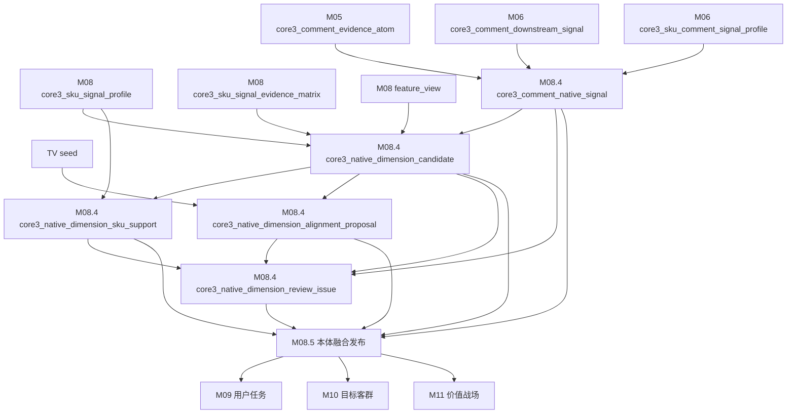
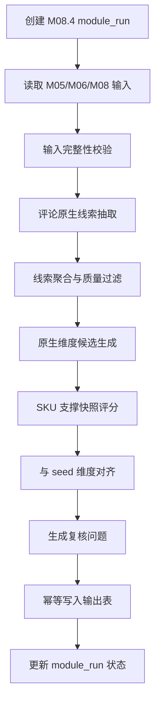

# M08.4 评论原生业务维度发现详细设计

## 1. 文档定位

本文是 CatForge 彩电核心三竞品真实数据 MVP 的 M08.4 详细设计，承接：

- 需求文档：`docs/core3_mvp/real_data_v2/sop_requirements/M08_4_comment_native_dimension_discovery_requirements.md`
- 总体设计：`docs/core3_mvp/real_data_v2/sop_detailed_design/00_architecture_data_dictionary_design.md`
- 上游 M05：`core3_comment_evidence_atom`
- 上游 M06：`core3_comment_downstream_signal`、`core3_sku_comment_signal_profile`
- 上游 M08：`core3_sku_signal_profile`、`core3_sku_signal_evidence_matrix`、`core3_sku_downstream_feature_view`
- 规则资产：`apps/api-server/app/rules/tv_core3_mvp_seed_v0_2.json`
- 诊断依据：`docs/core3_mvp/real_data_v2/validation/comment_native_dimension_alignment_205_20260615.md`
- 下游 M08.5、M09、M10、M11、M11.6、M11.7

M08.4 的定位是“评论原生维度发现层”。它先从真实评论中抽取用户实际表达的人群、场景、购买动机、产品体验、服务体验和风险线索，再组合成原生用户任务、原生目标客群、原生产品价值战场、服务语境、风险语境和购买动机候选，最后与 seed 预设维度做对齐建议。

M08.4 不发布最终本体版本，不生成 SKU 主任务、主客群、主战场，不做销量分配。M08.5 才负责把 M08.4 的原生发现结果、seed 和复核意见融合成当前项目可用的 active 业务维度本体。

## 2. 模块职责

### 2.1 本模块解决什么

M08.4 解决七类工程问题：

1. 从 M05/M06 的可下游消费评论中发现评论原生业务线索，避免 seed-first 套标签。
2. 将原生线索聚合为可评审的任务、客群、产品价值战场、服务语境、风险语境和购买动机候选。
3. 为每个候选维度计算评论支撑、产品锚点、市场支撑、服务污染、过宽程度和可进入后续画像的判断。
4. 生成 SKU 对原生候选维度的支撑快照，为 M08.5 和后续 M09-M11 提供素材。
5. 将原生候选与 seed 预设维度做逐项对齐，输出保留、改名、拆分、合并、降级、废弃、新增建议。
6. 把服务履约、低价值泛化好评、过宽背景维度从产品价值战场中剥离。
7. 输出复核问题，提示业务人员哪些维度需要确认后才能进入 M08.5 发布。

### 2.2 本模块不解决什么

| 不做事项 | 原因 | 后续模块 |
| --- | --- | --- |
| 不直接读取原始四张业务表 | 必须消费清洗、证据和画像层结果 | M00-M08 |
| 不重新清洗评论 | 评论去重、句级拆分、低价值过滤已经由 M05 完成 | M05 |
| 不重新生成 M06 信号 | M08.4 可以读取 M06，但不替代 M06 | M06 |
| 不直接修改 seed 文件 | seed 是基础资产，本模块只输出项目级建议 | M08.5/规则治理 |
| 不发布 active 本体版本 | M08.4 是发现和建议，不是发布 | M08.5 |
| 不生成 SKU 主任务、主客群、主战场 | 本模块只做原生候选和支撑快照 | M09/M10/M11 |
| 不做销量分配 | 分配必须基于已发布本体和正式 SKU 画像 | M11.6 |
| 不做销量交叉对账 | 对账是独立校验模块 | M11.7 |
| 不输出高层报告结论 | M08.4 面向业务复核和本体治理 | M15 |

### 2.3 允许复用历史结果

允许复用历史 M08.4 输出，但必须同时满足：

- M05 可下游消费评论句集合 hash 未变化。
- M06 评论信号和 SKU 评论画像 hash 未变化。
- M08 SKU 画像、证据矩阵和下游视图 hash 未变化。
- seed 文件 hash 未变化。
- M08.4 原生线索抽取规则版本、聚合规则版本、对齐规则版本未变化。
- 上一次输出 `is_current=true`，且没有 blocking 级复核问题未处理。
- 上一次模块运行状态不是 `failed` 或 `blocked`。

## 3. 输入输出总览

### 3.1 必须输入

| 输入 | 来源模块 | 表或文件 | 用途 |
| --- | --- | --- | --- |
| 评论句级证据 | M05 | `core3_comment_evidence_atom` | 可下游消费评论句、低价值标记、代表文本、评论 evidence |
| 评论下游信号 | M06 | `core3_comment_downstream_signal` | 主题、信号类型、情感、强弱线索 |
| SKU 评论画像 | M06 | `core3_sku_comment_signal_profile` | SKU 级评论质量、低价值率、服务占比、产品体验占比 |
| SKU 综合画像 | M08 | `core3_sku_signal_profile` | SKU 主数据、参数、卖点、市场、画像完整度 |
| SKU 证据矩阵 | M08 | `core3_sku_signal_evidence_matrix` | 参数、卖点、评论、市场各证据域覆盖 |
| 下游特征视图 | M08 | `core3_sku_downstream_feature_view` | 面向 M08.4/M09/M10/M11 的统一特征入口 |
| TV seed | 规则资产 | `tv_core3_mvp_seed_v0_2.json` | 对齐阶段使用，不作为发现阶段聚类中心 |

### 3.2 可选输入

| 输入 | 来源模块 | 表 | 使用条件 |
| --- | --- | --- | --- |
| 市场画像 | M07 | `core3_sku_market_profile` | M08 缺少必要市场摘要时读取 |
| 最终卖点激活 | M04b | `core3_sku_claim_activation` | M08 缺少卖点锚点明细时读取 |
| 参数画像 | M03 | `core3_sku_param_profile` | M08 缺少参数锚点明细时读取 |
| evidence 原子 | M02 | `core3_evidence_atom` | 只用于 evidence 回溯，不做新判断 |

可选输入必须在代码中通过 repository 边界控制，不能由业务 service 随意散读。

### 3.3 明确不消费

| 数据 | 禁止原因 |
| --- | --- |
| 原始 `comment_data` | 未经过低价值过滤和句级 evidence 化 |
| 原始 `week_sales_data` | 市场必须来自 M07/M08 |
| 原始 `attribute_data` | 参数必须来自 M03/M08 |
| 原始 `selling_points_data` | 卖点必须来自 M04b/M08 |
| M09/M10/M11 结果 | M08.4 是它们的上游 |
| M11.6/M11.7 结果 | M08.4 不消费销量分配和对账 |

### 3.4 输出表

| 输出表 | 粒度 | 用途 |
| --- | --- | --- |
| `core3_comment_native_signal` | 批次 + 原生线索类型 + 原生线索 code | 保存评论原生低层语义线索 |
| `core3_native_dimension_candidate` | 批次 + 原生维度类型 + 原生维度 code | 保存原生业务维度候选 |
| `core3_native_dimension_sku_support` | 原生维度候选 + SKU | 保存 SKU 对原生维度的支撑快照 |
| `core3_native_dimension_alignment_proposal` | seed 维度 + 原生维度 + 对齐动作 | 保存 seed 与原生维度的对齐建议 |
| `core3_native_dimension_review_issue` | 对象 + 问题类型 | 保存过宽、服务污染、缺锚点、新维度等复核问题 |

### 3.5 模块关系



## 4. 数据模型设计

### 4.1 通用字段约定

M08.4 输出表统一包含以下字段。

| 字段 | 类型建议 | 必填 | 说明 |
| --- | --- | --- | --- |
| `project_id` | `text` | 是 | 项目 ID |
| `category_code` | `text` | 是 | MVP 为 `TV` |
| `batch_id` | `text` | 是 | M00 批次 ID |
| `run_id` | `uuid` 或 `text` | 否 | 全链路运行 ID，必须存在于 `core3_pipeline_run` 后再写子表 |
| `module_run_id` | `uuid` 或 `text` | 是 | M08.4 模块运行 ID |
| `rule_version` | `text` | 是 | M08.4 总规则版本 |
| `extract_rule_version` | `text` | 是 | 原生线索抽取规则版本 |
| `cluster_rule_version` | `text` | 是 | 原生维度聚合规则版本 |
| `alignment_rule_version` | `text` | 是 | seed 对齐规则版本 |
| `seed_version` | `text` | 是 | seed 业务版本 |
| `seed_hash` | `text` | 是 | seed 文件 hash |
| `input_fingerprint` | `text` | 是 | 上游输入 fingerprint |
| `result_hash` | `text` | 是 | 当前行稳定 hash |
| `is_current` | `boolean` | 是 | 是否当前有效版本 |
| `processing_status` | `text` | 是 | `success`、`warning`、`review_required`、`blocked`、`failed` |
| `review_required` | `boolean` | 是 | 是否需要业务复核 |
| `review_status` | `text` | 是 | `auto_pass`、`review_required`、`approved`、`rejected`、`waived` |
| `created_at` | `timestamptz` | 是 | 创建时间 |
| `updated_at` | `timestamptz` | 是 | 更新时间 |

`result_hash` 必须使用稳定 JSON 规范化工具计算，不能受字段顺序、时间戳、数据库自增 ID 影响。

### 4.2 枚举定义

#### 4.2.1 `native_signal_type`

```text
person
scene
motive
product_experience
service_experience
risk
generic_praise
unknown
```

`generic_praise` 用于识别泛化好评，只能作为质量统计，不允许直接支撑任务、客群或战场。

#### 4.2.2 `native_dimension_type`

```text
native_task
native_target_group
native_product_value_battlefield
service_context
risk_context
purchase_motive
```

MVP 必须落地前三类和 `service_context`。`risk_context`、`purchase_motive` 可先作为候选维度输出，但字段契约必须完整。

#### 4.2.3 `support_level`

```text
strong
medium
weak
insufficient
not_applicable
```

`weak` 和 `insufficient` 不得默认进入后续销量分配。

#### 4.2.4 `alignment_action`

```text
keep
rename
split
merge
downgrade
deprecate
new
no_match
```

`new` 表示原生维度在 seed 中没有合适预设维度；`no_match` 表示 seed 维度在当前原生发现中找不到足够对应证据。

#### 4.2.5 `issue_type`

```text
over_broad_dimension
service_pollution
missing_product_anchor
weak_native_support
seed_native_mismatch
duplicate_dimension
new_dimension_candidate
low_value_comment_dominant
coverage_too_sparse
name_not_explainable
```

### 4.3 `core3_comment_native_signal`

#### 4.3.1 表用途

保存评论中真实出现的低层原生语义线索。它不是任务、客群或战场，只是后续聚合维度的证据基础。

#### 4.3.2 字段

| 字段 | 类型建议 | 必填 | 说明 |
| --- | --- | --- | --- |
| `native_signal_id` | `uuid` | 是 | 主键 |
| `project_id` | `text` | 是 | 项目 |
| `category_code` | `text` | 是 | 品类 |
| `batch_id` | `text` | 是 | 批次 |
| `run_id` | `uuid/text` | 否 | 全链路运行 |
| `module_run_id` | `uuid/text` | 是 | 模块运行 |
| `native_signal_type` | `text` | 是 | 原生线索类型 |
| `native_signal_code` | `text` | 是 | 稳定 code，例如 `product_picture_quality` |
| `native_signal_name` | `text` | 是 | 业务中文名，例如 `画质体验` |
| `canonical_phrase` | `text` | 是 | 代表短语 |
| `alias_phrases_json` | `jsonb` | 是 | 归一前的高频短语 |
| `source_topic_codes_json` | `jsonb` | 是 | M06 主题或信号 code |
| `sentence_count` | `integer` | 是 | 支撑句数 |
| `sku_count` | `integer` | 是 | 覆盖 SKU 数 |
| `strong_sentence_count` | `integer` | 是 | 强证据句数 |
| `negative_sentence_count` | `integer` | 是 | 负向句数 |
| `low_value_excluded_count` | `integer` | 是 | 被低价值规则排除的句数 |
| `avg_sentence_strength` | `numeric(8,4)` | 是 | 平均句级强度 |
| `service_guardrail_flag` | `boolean` | 是 | 是否服务履约线索 |
| `generic_praise_flag` | `boolean` | 是 | 是否泛化好评线索 |
| `eligible_for_dimension` | `boolean` | 是 | 是否可用于原生维度聚合 |
| `eligibility_reason_json` | `jsonb` | 是 | 可用或不可用原因 |
| `representative_phrases_json` | `jsonb` | 是 | 代表短语及频次 |
| `representative_comments_json` | `jsonb` | 是 | 代表评论句，包含 comment evidence id |
| `sku_distribution_json` | `jsonb` | 是 | SKU 覆盖和句数摘要 |
| `evidence_ids_json` | `jsonb` | 是 | 代表 evidence id 列表 |
| `quality_flags_json` | `jsonb` | 是 | 过泛、低价值、服务等质量标记 |
| 通用字段 | 见 4.1 | 是 | 版本、hash、状态 |

#### 4.3.3 主键、唯一键和索引

| 类型 | 字段 |
| --- | --- |
| 主键 | `native_signal_id` |
| 唯一键 | `(project_id, category_code, batch_id, rule_version, native_signal_type, native_signal_code)` |
| 索引 | `(project_id, category_code, batch_id, native_signal_type)` |
| 索引 | `(project_id, category_code, batch_id, eligible_for_dimension)` |
| 索引 | `(project_id, category_code, batch_id, is_current)` |
| JSON GIN | `source_topic_codes_json`、`quality_flags_json` |

#### 4.3.4 JSON 字段结构

`representative_phrases_json`：

```json
[
  {"phrase": "画质清晰", "count": 3210, "strength": 0.86},
  {"phrase": "色彩好", "count": 812, "strength": 0.81}
]
```

`representative_comments_json`：

```json
[
  {
    "evidence_id": "comment_atom_xxx",
    "sku_code": "TV00029115",
    "sentence": "画质很清晰，客厅看电影效果不错",
    "strength": 0.88,
    "polarity": "positive"
  }
]
```

`sku_distribution_json`：

```json
{
  "top_skus": [
    {"sku_code": "TV00029115", "sentence_count": 128, "strong_sentence_count": 101}
  ],
  "coverage_rate": 0.88
}
```

### 4.4 `core3_native_dimension_candidate`

#### 4.4.1 表用途

保存由原生线索聚合成的业务维度候选。候选维度仍不是 active 本体，必须由 M08.5 消费后再发布。

#### 4.4.2 字段

| 字段 | 类型建议 | 必填 | 说明 |
| --- | --- | --- | --- |
| `native_dimension_id` | `uuid` | 是 | 主键 |
| `native_dimension_type` | `text` | 是 | 原生维度类型 |
| `native_dimension_code` | `text` | 是 | 稳定 code，例如 `native_bf_picture_quality_value` |
| `native_dimension_name` | `text` | 是 | 来自评论归纳的中文名称 |
| `business_definition` | `text` | 是 | 业务定义 |
| `source_method` | `text` | 是 | `cooccurrence_cluster`、`single_dominant_signal`、`service_guardrail` 等 |
| `source_signal_codes_json` | `jsonb` | 是 | 组成该候选的原生线索 code |
| `include_rules_json` | `jsonb` | 是 | 包含规则 |
| `exclude_rules_json` | `jsonb` | 是 | 排除规则 |
| `required_evidence_json` | `jsonb` | 是 | 后续分类必需证据 |
| `optional_evidence_json` | `jsonb` | 是 | 可选补强证据 |
| `sentence_count` | `integer` | 是 | 支撑句数 |
| `sku_count` | `integer` | 是 | 覆盖 SKU |
| `strong_sentence_count` | `integer` | 是 | 强证据句数 |
| `product_anchor_count` | `integer` | 是 | 有产品锚点的 SKU 或证据数 |
| `market_support_count` | `integer` | 是 | 有市场支撑的 SKU 数 |
| `service_signal_count` | `integer` | 是 | 服务线索句数 |
| `comment_support_score` | `numeric(8,4)` | 是 | 评论支撑分 |
| `product_anchor_score` | `numeric(8,4)` | 是 | 参数/卖点锚点分 |
| `market_support_score` | `numeric(8,4)` | 是 | 市场支撑分 |
| `distinctiveness_score` | `numeric(8,4)` | 是 | 区分度 |
| `broadness_score` | `numeric(8,4)` | 是 | 过宽程度 |
| `candidate_confidence` | `numeric(8,4)` | 是 | 候选置信度 |
| `service_guardrail_flag` | `boolean` | 是 | 是否服务履约维度 |
| `broadness_flag` | `boolean` | 是 | 是否过宽 |
| `eligible_for_product_dimension` | `boolean` | 是 | 是否可作为产品维度 |
| `eligible_for_profile` | `boolean` | 是 | 是否可进入后续 SKU 分类候选 |
| `allocation_allowed_default` | `boolean` | 是 | 默认是否允许后续销量分配，MVP 通常为 false，由 M08.5/M11.6 再确认 |
| `not_eligible_reason_json` | `jsonb` | 是 | 不可用原因 |
| `representative_comments_json` | `jsonb` | 是 | 代表评论 |
| `representative_skus_json` | `jsonb` | 是 | 代表 SKU 和支撑概览 |
| 通用字段 | 见 4.1 | 是 | 版本、hash、状态 |

#### 4.4.3 主键、唯一键和索引

| 类型 | 字段 |
| --- | --- |
| 主键 | `native_dimension_id` |
| 唯一键 | `(project_id, category_code, batch_id, rule_version, native_dimension_type, native_dimension_code)` |
| 索引 | `(project_id, category_code, batch_id, native_dimension_type)` |
| 索引 | `(project_id, category_code, batch_id, eligible_for_profile)` |
| 索引 | `(project_id, category_code, batch_id, review_required)` |
| JSON GIN | `source_signal_codes_json`、`not_eligible_reason_json` |

#### 4.4.4 JSON 字段结构

`include_rules_json`：

```json
[
  {"rule": "comment_signal", "required": true, "signal_codes": ["product_picture_quality"]},
  {"rule": "product_anchor", "required": true, "anchor_types": ["param", "claim", "product_comment"]}
]
```

`exclude_rules_json`：

```json
[
  {"rule": "service_only", "reason": "只有安装配送售后不能作为产品价值战场"},
  {"rule": "generic_praise_only", "reason": "泛化好评不能支撑业务维度"}
]
```

### 4.5 `core3_native_dimension_sku_support`

#### 4.5.1 表用途

保存每个 SKU 对原生候选维度的支撑快照。该表是 M08.5 判断维度是否可发布、M09-M11 后续分类设计的重要输入，但它不是最终 SKU 分类结果。

#### 4.5.2 字段

| 字段 | 类型建议 | 必填 | 说明 |
| --- | --- | --- | --- |
| `support_id` | `uuid` | 是 | 主键 |
| `native_dimension_id` | `uuid` | 是 | 逻辑外键到候选维度 |
| `native_dimension_type` | `text` | 是 | 冗余维度类型，便于查询 |
| `native_dimension_code` | `text` | 是 | 冗余维度 code |
| `sku_code` | `text` | 是 | SKU |
| `model_name` | `text` | 否 | 型号 |
| `brand_name` | `text` | 否 | 品牌 |
| `comment_support_score` | `numeric(8,4)` | 是 | 评论支撑 |
| `param_support_score` | `numeric(8,4)` | 是 | 参数支撑 |
| `claim_support_score` | `numeric(8,4)` | 是 | 卖点支撑 |
| `market_support_score` | `numeric(8,4)` | 是 | 市场支撑 |
| `service_pollution_score` | `numeric(8,4)` | 是 | 服务污染 |
| `risk_penalty_score` | `numeric(8,4)` | 是 | 风险扣减 |
| `support_score` | `numeric(8,4)` | 是 | 综合支撑分 |
| `support_level` | `text` | 是 | strong、medium、weak、insufficient |
| `eligible_for_profile` | `boolean` | 是 | 是否可进入后续分类候选 |
| `evidence_gap_flags_json` | `jsonb` | 是 | 缺口标记 |
| `support_reason` | `text` | 是 | 中文原因 |
| `top_comment_evidence_ids_json` | `jsonb` | 是 | 代表评论证据 |
| `top_product_evidence_ids_json` | `jsonb` | 是 | 参数/卖点证据 |
| `top_market_evidence_ids_json` | `jsonb` | 是 | 市场证据 |
| `profile_hash` | `text` | 是 | M08 SKU 画像 hash |
| 通用字段 | 见 4.1 | 是 | 版本、hash、状态 |

#### 4.5.3 主键、唯一键和索引

| 类型 | 字段 |
| --- | --- |
| 主键 | `support_id` |
| 唯一键 | `(project_id, category_code, batch_id, rule_version, native_dimension_code, sku_code)` |
| 逻辑外键 | `native_dimension_id -> core3_native_dimension_candidate.native_dimension_id` |
| 索引 | `(project_id, category_code, batch_id, sku_code)` |
| 索引 | `(project_id, category_code, batch_id, native_dimension_type, support_level)` |
| 索引 | `(project_id, category_code, batch_id, eligible_for_profile)` |

### 4.6 `core3_native_dimension_alignment_proposal`

#### 4.6.1 表用途

保存原生维度与 seed 维度的对齐建议。M08.5 消费该表，决定是否发布当前项目 active 本体定义。

#### 4.6.2 字段

| 字段 | 类型建议 | 必填 | 说明 |
| --- | --- | --- | --- |
| `alignment_id` | `uuid` | 是 | 主键 |
| `seed_dimension_type` | `text` | 否 | task、target_group、battlefield |
| `seed_dimension_code` | `text` | 否 | seed code，`new` 时为空 |
| `seed_dimension_name` | `text` | 否 | seed 名称 |
| `native_dimension_id` | `uuid` | 否 | 原生维度，`deprecate` 时可为空 |
| `native_dimension_type` | `text` | 否 | 原生维度类型 |
| `native_dimension_code` | `text` | 否 | 原生维度 code |
| `native_dimension_name` | `text` | 否 | 原生维度名称 |
| `alignment_action` | `text` | 是 | keep、rename、split、merge、downgrade、deprecate、new、no_match |
| `alignment_score` | `numeric(8,4)` | 是 | 综合对齐分 |
| `name_similarity_score` | `numeric(8,4)` | 是 | 名称相似度 |
| `definition_similarity_score` | `numeric(8,4)` | 是 | 定义相似度 |
| `evidence_structure_score` | `numeric(8,4)` | 是 | 证据结构相似度 |
| `coverage_overlap_score` | `numeric(8,4)` | 是 | 覆盖重叠 |
| `sku_overlap_score` | `numeric(8,4)` | 是 | SKU 支撑重叠 |
| `service_pollution_score` | `numeric(8,4)` | 是 | 服务污染程度 |
| `recommended_dimension_type` | `text` | 是 | 建议发布的维度类型 |
| `recommended_code` | `text` | 是 | 建议 code |
| `recommended_name` | `text` | 是 | 建议中文名称 |
| `recommended_definition` | `text` | 是 | 建议定义 |
| `required_evidence_json` | `jsonb` | 是 | 后续分类必需证据 |
| `excluded_evidence_json` | `jsonb` | 是 | 后续分类排除证据 |
| `impact_modules_json` | `jsonb` | 是 | 影响 M09/M10/M11/M11.6 等模块 |
| `proposal_reason` | `text` | 是 | 中文业务原因 |
| `decision_status` | `text` | 是 | `pending`、`accepted`、`rejected`、`superseded` |
| 通用字段 | 见 4.1 | 是 | 版本、hash、状态 |

#### 4.6.3 主键、唯一键和索引

| 类型 | 字段 |
| --- | --- |
| 主键 | `alignment_id` |
| 唯一键 | `(project_id, category_code, batch_id, rule_version, coalesce(seed_dimension_code,'__new__'), coalesce(native_dimension_code,'__none__'), alignment_action)` |
| 索引 | `(project_id, category_code, batch_id, seed_dimension_type)` |
| 索引 | `(project_id, category_code, batch_id, alignment_action)` |
| 索引 | `(project_id, category_code, batch_id, review_required, decision_status)` |

### 4.7 `core3_native_dimension_review_issue`

#### 4.7.1 表用途

保存 M08.4 发现的本体治理问题和复核问题。M08.5 发布本体前必须读取 blocking 级问题。

#### 4.7.2 字段

| 字段 | 类型建议 | 必填 | 说明 |
| --- | --- | --- | --- |
| `issue_id` | `uuid` | 是 | 主键 |
| `issue_scope` | `text` | 是 | signal、candidate、support、alignment、module |
| `issue_type` | `text` | 是 | 见枚举 |
| `severity` | `text` | 是 | info、warning、blocking |
| `object_type` | `text` | 是 | native_signal、native_dimension、sku_support、alignment |
| `object_id` | `uuid/text` | 否 | 对象 ID |
| `object_code` | `text` | 否 | 对象 code |
| `sku_code` | `text` | 否 | SKU 级问题时填写 |
| `title` | `text` | 是 | 中文标题 |
| `description` | `text` | 是 | 中文说明 |
| `suggested_action` | `text` | 是 | 建议动作 |
| `blocking_modules_json` | `jsonb` | 是 | 阻断的下游模块 |
| `evidence_refs_json` | `jsonb` | 是 | 代表证据 |
| `status` | `text` | 是 | open、resolved、waived |
| `resolution_note` | `text` | 否 | 处理说明 |
| 通用字段 | 见 4.1 | 是 | 版本、hash、状态 |

#### 4.7.3 主键、唯一键和索引

| 类型 | 字段 |
| --- | --- |
| 主键 | `issue_id` |
| 唯一键 | `(project_id, category_code, batch_id, rule_version, issue_type, object_type, coalesce(object_code,'__module__'), coalesce(sku_code,'__all__'))` |
| 索引 | `(project_id, category_code, batch_id, severity, status)` |
| 索引 | `(project_id, category_code, batch_id, issue_type)` |

## 5. 处理流程设计

### 5.1 总流程



### 5.2 步骤一：创建运行上下文

1. 接收 `project_id`、`category_code`、`batch_id`、可选 `run_id`。
2. 如果传入 `run_id`，必须先确认 `core3_pipeline_run` 中存在该 run，避免后续外键错误。
3. 创建 `module_run_id`，记录模块、规则版本、seed hash、输入 fingerprint。
4. 如果输入 fingerprint 与当前有效输出一致，且没有 blocking issue，可直接返回 `reused`。

### 5.3 步骤二：读取和校验输入

读取范围：

1. M05 评论句：`usable_for_downstream=true` 且 `low_value_flag=false`。
2. M06 评论信号：只读取当前批次、当前有效版本。
3. M08 SKU 画像：只读取当前有效版本。
4. M08 证据矩阵和 feature view：优先读取 `for_module='M08_4'`，没有则读取 M09/M10/M11 通用字段。
5. seed 文件：只用于对齐阶段。

输入校验：

| 条件 | 状态 |
| --- | --- |
| 没有 M05 可用评论句 | `blocked` |
| 没有 M08 当前 SKU 画像 | `blocked` |
| M06 信号缺失但 M05 可用 | `warning`，允许只用 M05 线索抽取 |
| seed 文件缺失 | `warning`，可生成原生候选，但不能生成对齐建议 |
| 可用评论句低于阈值 | `review_required` |

### 5.4 步骤三：评论原生线索抽取

MVP 使用规则和统计结合的确定性抽取，不依赖外部 LLM。

#### 5.4.1 抽取器

建议实现以下抽取器：

| 抽取器 | 输入 | 输出 |
| --- | --- | --- |
| `NativePhraseExtractor` | 评论句、M06 主题 | 候选短语、短语类型、强度 |
| `PersonCueExtractor` | 评论句 | 老人、父母、孩子、家人、单位等 |
| `SceneCueExtractor` | 评论句 | 客厅、卧室、新家、看球、游戏等 |
| `MotiveCueExtractor` | 评论句 | 换新、国补、性价比、预算等 |
| `ProductExperienceCueExtractor` | 评论句 | 画质、音质、护眼、语音、系统等 |
| `ServiceCueExtractor` | 评论句 | 安装、配送、售后、师傅、物流等 |
| `RiskCueExtractor` | 评论句 | 广告、卡顿、坏点、破损等 |
| `GenericPraiseFilter` | 评论句 | 泛化好评识别 |

抽取规则可以使用 YAML/JSON 配置，但配置只定义低层语义词和同义词，不定义最终任务、客群和战场名称。

#### 5.4.2 强度计算

句级线索强度建议：

```text
signal_strength =
  phrase_match_score * 0.45
  + m06_signal_score * 0.25
  + sentiment_strength * 0.15
  + specificity_score * 0.15
```

其中：

- `phrase_match_score`：短语命中和词组完整度。
- `m06_signal_score`：M06 已生成信号的支持强度，没有则为 0。
- `sentiment_strength`：正负情感强度，风险线索允许负向增强。
- `specificity_score`：是否包含明确人群、场景、产品体验，而不是泛化好评。

泛化好评、服务-only 句子可以抽取为线索，但不能直接进入产品维度聚合。

### 5.5 步骤四：线索聚合与质量过滤

将句级线索聚合为 `core3_comment_native_signal`：

1. 按 `native_signal_type + normalized_phrase_group` 聚合。
2. 生成稳定 `native_signal_code`。
3. 统计句数、强句数、SKU 覆盖、低价值排除数。
4. 选取代表短语和代表评论。
5. 计算 `eligible_for_dimension`。

过滤条件：

| 条件 | 处理 |
| --- | --- |
| 只有泛化好评 | `eligible_for_dimension=false` |
| 服务履约线索 | `eligible_for_dimension=true`，但只能进入 `service_context` |
| 句数低且覆盖 SKU 少 | 保留为弱线索，进入复核或候选，不自动聚合 |
| 覆盖 SKU 极高且无区分度 | 标记 `over_broad` |

### 5.6 步骤五：原生维度候选生成

#### 5.6.1 共现图

构建原生线索共现图：

- 节点：`core3_comment_native_signal`。
- 句内边：同一句评论出现。
- 评论单元边：同一个评论单元出现。
- SKU 边：同一 SKU 上高频共现。
- 证据锚点边：同一 SKU 上有相同参数/卖点/市场支撑。

边权建议：

```text
edge_weight =
  sentence_cooccurrence_pmi * 0.35
  + sku_cooccurrence_score * 0.25
  + product_anchor_overlap * 0.25
  + market_support_overlap * 0.15
```

MVP 可使用阈值连通分量或贪心聚类，不要求复杂图算法；但必须可解释、可测试。

#### 5.6.2 候选类型判定

| 候选类型 | 必需线索 | 补强线索 | 排除 |
| --- | --- | --- | --- |
| `native_task` | scene 或 motive | product_experience、person、market | 服务-only、泛化好评-only |
| `native_target_group` | person | scene、motive、price/market、task cue | 只有“家里/家人”的泛化家庭词 |
| `native_product_value_battlefield` | product_experience | param/claim anchor、market、task/scene | 服务-only、无产品锚点 |
| `service_context` | service_experience | risk、scene | 不能发布为产品战场 |
| `risk_context` | risk 或负向体验 | service/product experience | 不能作为正向卖点 |
| `purchase_motive` | motive | price/market、scene | 不能直接等同产品战场 |

#### 5.6.3 候选置信度

候选置信度建议：

```text
candidate_confidence =
  comment_support_score * 0.35
  + product_anchor_score * 0.25
  + market_support_score * 0.15
  + distinctiveness_score * 0.15
  + definition_quality_score * 0.10
  - service_pollution_penalty
  - broadness_penalty
```

不同维度类型可以调整权重：

- `service_context` 不要求产品锚点，但必须明确不能进入产品战场。
- `native_target_group` 更重视人群线索和场景/动机组合。
- `native_product_value_battlefield` 必须有产品锚点，否则上限封顶为 `weak`。

### 5.7 步骤六：SKU 支撑快照评分

对每个候选维度和 SKU 计算支撑快照。

#### 5.7.1 支撑分域

| 分域 | 来源 | 说明 |
| --- | --- | --- |
| 评论支撑 | M05/M06/M08.4 signal | 该 SKU 下的相关评论句数、强句数、代表句 |
| 参数支撑 | M08 参数摘要/证据矩阵 | 是否有相关参数锚点 |
| 卖点支撑 | M08 卖点摘要/证据矩阵 | 是否有结构化或评论增强卖点 |
| 市场支撑 | M08 市场画像 | 销量、价位、渠道是否支撑该维度 |
| 服务污染 | M08.4 service signal | 是否服务线索占主导 |
| 风险扣减 | M08.4 risk signal | 是否存在明显负向体验 |

#### 5.7.2 支撑等级

默认阈值：

| 等级 | 条件 |
| --- | --- |
| `strong` | `support_score >= 0.72` 且无 blocking gap |
| `medium` | `support_score >= 0.55` 且核心证据完整 |
| `weak` | `support_score >= 0.35`，但证据不足或缺锚点 |
| `insufficient` | `support_score < 0.35` 或只有泛化/服务污染 |
| `not_applicable` | 维度类型与 SKU 无关或输入缺失不可判断 |

`weak` 只允许进入候选提示，不允许默认进入销量分配。

### 5.8 步骤七：seed 对齐

对齐顺序：

1. 读取 seed 中 task、target_group、battlefield。
2. 将每个 seed 维度转为比较对象：名称、定义、关键词、参数锚点、卖点锚点、评论主题、排除规则。
3. 与 M08.4 原生候选逐项比较。
4. 输出 `alignment_action`。
5. 对 seed 找不到原生支撑的输出 `no_match` 或 `deprecate`。
6. 对原生候选找不到 seed 对象的输出 `new`。

对齐评分：

```text
alignment_score =
  name_similarity_score * 0.15
  + definition_similarity_score * 0.20
  + evidence_structure_score * 0.30
  + coverage_overlap_score * 0.15
  + sku_overlap_score * 0.15
  - service_pollution_score * 0.20
```

名称相似不能单独决定 `keep`。如果证据结构不一致，必须输出 `rename`、`split`、`merge` 或 `downgrade`。

### 5.9 步骤八：复核问题生成

生成规则：

| 条件 | issue_type | severity |
| --- | --- | --- |
| 产品价值战场主要由服务线索支撑 | `service_pollution` | blocking |
| 产品价值战场缺少参数、卖点或产品体验锚点 | `missing_product_anchor` | warning/blocking |
| 候选覆盖 SKU 过多且支持强度差异小 | `over_broad_dimension` | warning |
| 原生候选在 seed 中不存在且证据强 | `new_dimension_candidate` | warning |
| seed 维度无原生证据 | `weak_native_support` | warning |
| seed 名称与原生证据不一致 | `seed_native_mismatch` | warning |
| 多个 seed 维度对应同一原生候选 | `duplicate_dimension` | warning |
| 代表证据主要来自泛化好评 | `low_value_comment_dominant` | blocking |

Blocking issue 未处理时，M08.5 不能发布对应维度为 active。

### 5.10 步骤九：幂等写入

写入策略：

1. 先计算所有输出行 `result_hash`。
2. 对同一 `project_id/category_code/batch_id/rule_version` 旧行置 `is_current=false`，但不删除历史。
3. 使用唯一键 upsert 当前结果。
4. 如果某行 hash 与历史一致，可复用 ID，但仍更新 `module_run_id` 和 `updated_at`。
5. 所有输出必须在同一事务中写入。
6. 如果事务失败，模块运行状态置为 `failed`，不保留半成品当前行。

## 6. 增量策略

### 6.1 输入 fingerprint

`input_fingerprint` 由以下内容组成：

- M05 可下游消费评论句集合 hash。
- M06 当前评论信号 hash。
- M06 SKU 评论画像 hash。
- M08 SKU 画像 hash 集合。
- M08 证据矩阵 hash 集合。
- M08 feature view hash 集合。
- seed hash。
- M08.4 规则版本。

只要任一组成变化，M08.4 需要重算。

### 6.2 受影响 SKU

优先使用 M00-M08 已计算的受影响 SKU。如果没有受影响 SKU 输入，则按当前批次全量计算。

增量时：

- 原生线索和原生维度是批次级聚合，任何评论或 SKU 画像变化都可能影响全局统计。
- MVP 可选择全量重算 M08.4，以保证维度候选一致性。
- 后续优化可实现局部重算，但必须重新计算全局覆盖率、过宽程度和 seed 对齐。

### 6.3 下游触发

M08.4 输出变化会触发：

| 输出变化 | 下游影响 |
| --- | --- |
| 原生候选新增/删除/改名 | M08.5 必须重算 |
| 对齐建议变化 | M08.5 必须重算 |
| SKU 支撑快照变化 | M08.5 需要重新判断发布规则，M09-M11 后续可能重算 |
| Blocking issue 新增 | 阻断 M08.5 发布相关维度 |

M08.4 不直接触发 M09-M11。只有 M08.5 发布新的 active 本体版本后，M09-M11 才应重算。

## 7. 服务、任务和 API 边界

### 7.1 Service 边界

建议后端服务拆分：

| 服务 | 职责 |
| --- | --- |
| `CommentNativeSignalExtractionService` | 从 M05/M06 抽取原生线索 |
| `NativeSignalAggregationService` | 聚合信号、生成 `core3_comment_native_signal` |
| `NativeDimensionCandidateService` | 构建原生维度候选 |
| `NativeDimensionSkuSupportService` | 计算 SKU 支撑快照 |
| `NativeDimensionSeedAlignmentService` | 与 seed 维度对齐 |
| `NativeDimensionReviewPolicy` | 生成复核问题 |
| `CommentNativeDimensionDiscoveryService` | 编排完整 M08.4 流程 |

Service 不能直接拼 SQL 读取原始四张表。

### 7.2 Repository 边界

建议 repository：

| Repository | 管理对象 |
| --- | --- |
| `CommentEvidenceAtomRepository` | M05 评论句读取，只暴露可下游消费查询 |
| `CommentDownstreamSignalRepository` | M06 信号读取 |
| `SkuSignalProfileRepository` | M08 画像读取 |
| `NativeSignalRepository` | M08.4 原生线索写入/查询 |
| `NativeDimensionCandidateRepository` | M08.4 候选维度写入/查询 |
| `NativeDimensionSkuSupportRepository` | SKU 支撑快照写入/查询 |
| `NativeDimensionAlignmentRepository` | 对齐建议写入/查询 |
| `NativeDimensionReviewIssueRepository` | 复核问题写入/查询 |

### 7.3 Runner 边界

建议 runner：

```text
CommentNativeDimensionDiscoveryRunner.run(project_id, category_code, batch_id, run_id=None, force=False)
```

Runner 职责：

1. 创建运行上下文。
2. 调用主 service。
3. 更新模块运行状态。
4. 返回产物数量、问题数量、推荐下一步。

Runner 不包含业务抽取逻辑。

### 7.4 API 边界

MVP 需要内部运营 API，供“初始化运行”页面和调试页面使用。

| API | 方法 | 用途 |
| --- | --- | --- |
| `/api/core3-real-data/projects/{project_id}/modules/m08-4/run` | POST | 触发 M08.4 |
| `/api/core3-real-data/projects/{project_id}/native-signals` | GET | 查看原生线索 |
| `/api/core3-real-data/projects/{project_id}/native-dimensions` | GET | 查看原生维度候选 |
| `/api/core3-real-data/projects/{project_id}/native-dimensions/{code}` | GET | 查看候选详情和 SKU 支撑 |
| `/api/core3-real-data/projects/{project_id}/dimension-alignment-proposals` | GET | 查看 seed 对齐建议 |
| `/api/core3-real-data/projects/{project_id}/native-dimension-issues` | GET | 查看复核问题 |

API 返回给前端的字段必须是中文业务语言优先，内部 code/hash/SQL 错误不得作为主展示内容。

## 8. 质量和复核规则

### 8.1 Warning 条件

- M06 信号缺失，但 M05 评论句可用。
- seed 文件缺失，只能生成原生候选。
- 某类高频线索缺少参数或卖点锚点。
- 原生候选覆盖 SKU 过多，存在过宽风险。
- 出现 seed 未覆盖的新维度候选。

### 8.2 Review required 条件

- 对齐建议为 `rename`、`split`、`merge`、`downgrade`、`deprecate`、`new`。
- 产品价值战场候选缺少足够产品锚点。
- 目标客群候选只有泛化家庭词。
- 用户任务候选只有价格或服务线索。
- 候选名称无法被代表评论解释。

### 8.3 Blocked 条件

- 没有 M05 可下游消费评论句。
- 没有 M08 当前 SKU 画像。
- 运行上下文未创建成功。
- 输出写入违反唯一约束或外键约束且无法自动修复。
- 服务履约被配置为产品价值战场且未被守门规则拦截。

### 8.4 业务稀疏性检查

M08.4 不是最终 SKU 分类，但必须提前发现无区分度风险：

| 检查 | 规则 |
| --- | --- |
| 过宽候选 | 覆盖 SKU 比例大于 0.75 且支撑分标准差低于 0.08 |
| 过窄候选 | 支撑句数低于配置阈值且 SKU 覆盖低于 3 |
| 服务污染 | 服务线索句数占候选支撑句数超过 0.50 |
| 泛化污染 | 泛化好评占候选支撑句数超过 0.40 |
| 产品锚点缺失 | 产品战场候选 `product_anchor_score < 0.30` |

这些检查不一定阻断 M08.4，但会影响 M08.5 是否发布。

## 9. 测试设计

### 9.1 单元测试

| 测试对象 | 测试点 |
| --- | --- |
| `NativePhraseExtractor` | 人群、场景、动机、产品体验、服务、风险、泛化好评识别 |
| `GenericPraiseFilter` | “不错、好评、满意”不进入产品维度 |
| `ServiceCueExtractor` | 安装、配送、售后只能进入服务语境 |
| `NativeSignalAggregationService` | 句数、SKU 覆盖、代表短语、代表评论稳定 |
| `NativeDimensionCandidateService` | 游戏/体育/卧室等窄场景不会泛化到全部 SKU |
| `NativeDimensionSkuSupportService` | 无产品锚点的产品战场封顶为 weak |
| `NativeDimensionSeedAlignmentService` | keep、rename、split、merge、downgrade、deprecate、new 规则 |
| `NativeDimensionReviewPolicy` | 过宽、服务污染、缺锚点、新维度问题生成 |

### 9.2 集成测试

至少覆盖：

1. M05-M08 fixture 完整时，M08.4 生成五类输出表。
2. 低价值评论很多时，不会支撑任务、客群、战场。
3. 服务评论很多时，生成 `service_context`，不生成产品战场。
4. seed 中有“游戏体育”，但评论中游戏、体育为窄场景时，输出 split 或 review 建议。
5. seed 中“服务保障战场”被降级为服务语境。
6. 没有 seed 时，仍能生成原生候选，但 alignment 状态 warning。
7. 没有 M08 当前画像时，模块 blocked。
8. 重跑同一输入时结果 hash 稳定。

### 9.3 205 真实数据验收测试

基于 205 当前批次，应验证：

- 能识别画质、服务、价格价值、音质、智能易用、客厅观影、护眼、长辈、装修/家居、换新、儿童、游戏、体育、卧室/副屏、单位采购等原生线索。
- 服务履约进入服务语境，不进入产品价值战场。
- 游戏、体育、卧室/副屏不会成为所有 SKU 的强支撑维度。
- 家庭泛化不会直接成为家庭换新用户或家庭观影战场。
- 每个 seed 任务、客群、战场都有对齐建议。

### 9.4 越界测试

测试中必须证明：

- M08.4 不读取原始 `comment_data`。
- M08.4 不读取原始 `week_sales_data`、`attribute_data`、`selling_points_data` 做业务判断。
- M08.4 不读取 M09/M10/M11/M11.6/M11.7 结果。
- API 不暴露 SQL 错误和内部调试字段给主展示区域。

## 10. 验收标准

### 10.1 数据落地验收

通过条件：

1. 五张 M08.4 输出表均能生成当前批次结果。
2. 每张表都有稳定主键、唯一键、hash、版本、状态和复核字段。
3. 原生线索和原生候选能追溯到代表评论 evidence。
4. SKU 支撑快照能追溯到评论、参数、卖点和市场证据。
5. seed 对齐建议覆盖所有 seed 任务、客群和战场。

### 10.2 业务结果验收

通过条件：

1. 原生维度名称由真实评论代表短语归纳，不默认复用 seed 名称。
2. 服务履约被降级为服务语境。
3. 窄场景不被扩展为全 SKU 维度。
4. 过宽维度被标记，不能直接进入后续 SKU 分类。
5. 产品价值战场必须有产品锚点。
6. 对齐建议能清楚解释为什么 keep、rename、split、merge、downgrade、deprecate 或 new。

### 10.3 下游支撑验收

通过条件：

1. M08.5 可以消费 M08.4 输出生成 active 本体版本。
2. M09/M10/M11 后续可以基于 active 本体避免全 SKU 全维度命中。
3. M11.6 可以读取 `eligible_for_profile` 和后续本体规则，避免 weak/insufficient 默认分配销量。
4. M11.7 能在销量守恒之外继续校验业务稀疏性。

## 11. 待评审问题

1. M08.4 的“原生维度名称”是否允许自动生成后直接进入 M08.5，还是所有 `new/rename/split/merge` 必须人工确认后发布。
2. 过宽阈值首版是否使用 `SKU 覆盖 > 75% 且支撑分标准差 < 0.08`，还是按真实 205 数据再调优。
3. `purchase_motive` 是否在 MVP 中作为独立正式维度发布，还是只作为任务/客群/战场的支撑证据。
4. 单位/公司采购是否需要在 M08.5 中发布为目标客群，还是先作为渠道/场景线索。

