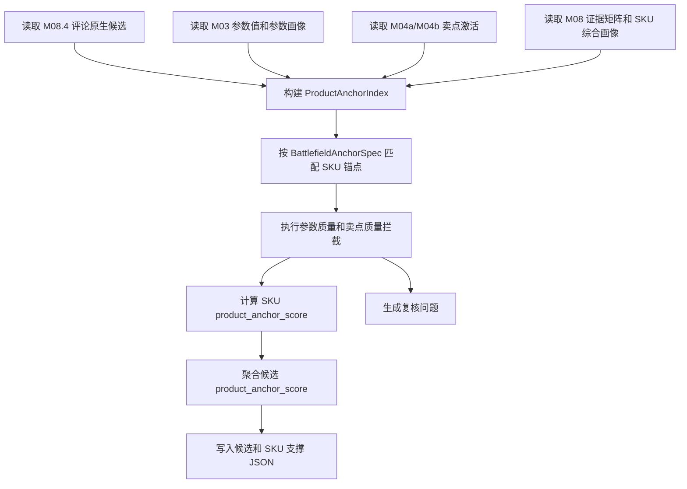

# M08.4 产品锚点索引与评分修正补充设计

## 1. 文档定位

本文是 M08.4 评论原生业务维度发现的专项补充设计，解决 205 真实运行后暴露出的产品锚点问题。

关联文档：

- `M08_4_comment_native_dimension_discovery_design.md`
- `M08_5_business_dimension_ontology_calibration_design.md`
- `M08_4_M08_5_dimension_boundary_optimization_design.md`
- `M03_param_extraction_design.md`
- `M04a_base_claim_activation_design.md`
- `M04b_claim_comment_enhancement_design.md`
- `M08_sku_signal_profile_design.md`

本文只设计 M08.4 的产品锚点索引、评分和复核规则，不改变 M08.5 的职责边界。M08.4 仍然只产出原生候选和对齐建议，不发布正式任务、客群或价值战场。

## 2. 205 真实运行问题

### 2.1 现象

205 当前批次：

```text
project_id = d8d2245b-358b-4a64-95cc-9d7f2341bd26
batch_id   = m00_20260613004311_d548f6dc
run_id     = m084_hotfix_20260615_002
```

M08.4 生成了 8 个产品价值战场，其中 4 个产品锚点为 0：

| 价值战场 | 覆盖 SKU | 当前产品锚点 | 当前状态 |
| --- | ---: | ---: | --- |
| 大屏价值性价比战场 | 84/84 | 0.8500 | strong_candidate |
| 大屏沉浸画质战场 | 74/84 | 0.3409 | candidate |
| 家居空间适配战场 | 70/84 | 0.4167 | candidate |
| 智能交互易用战场 | 73/84 | 0.3929 | candidate |
| 运动流畅观看战场 | 61/84 | 0.0000 | candidate_review |
| 护眼舒适观看战场 | 71/84 | 0.0000 | candidate_review |
| 声画沉浸战场 | 74/84 | 0.0000 | candidate_review |
| 高刷低延迟游戏战场 | 57/84 | 0.0000 | candidate_review |

### 2.2 排查结论

锚点为 0 不等于真实数据没有参数或卖点。205 排查结果：

| 战场 | 真实上游证据 | 当前未命中原因 |
| --- | --- | --- |
| 高刷低延迟游戏 | M03 有 `native_refresh_rate_hz`、`hdmi_2_1_ports`，M04 有高刷新率、HDMI 2.1 游戏接口、低延迟游戏卖点 | M08.4 只读证据矩阵泛化特征，没有直接读取具体参数值和卖点激活 |
| 运动流畅观看 | M03 有 `motion_compensation_flag`，M04 有体育运动流畅卖点 | 参数存在，但部分原始字段误映射，需要质量拦截 |
| 声画沉浸 | M04 有沉浸音效、杜比影音卖点 | M03 的 `speaker_power_w` 当前来自 `内置WIFI=-`，参数映射错误，不能作为强锚点 |
| 护眼舒适观看 | M04 有护眼舒适卖点 | M03 未抽到稳定护眼参数，当前只能由卖点和评论形成弱锚点 |

M08 证据矩阵当前只保存泛化特征：

```text
param.core_params
param.param_quality
claim.final_claim_activation
claim.structured_claim
comment.battlefield_support
```

这些特征不包含 `刷新率`、`HDMI2.1`、`运动补偿`、`杜比`、`护眼` 等具体业务锚点词。当前 M08.4 用字符串扫描矩阵字段，天然会漏掉具体参数和卖点。

## 3. 修正目标

### 3.1 业务目标

产品价值战场必须回答：

```text
这款 SKU 靠什么产品能力参与竞争？
这个产品能力有没有参数、卖点或可比池优势证明？
评论只是感知验证，不能单独让产品战场成立。
```

修正后，M08.4 必须做到：

1. 产品锚点直接消费 M03 参数值、M04a/M04b 卖点激活和 M08 证据矩阵。
2. 参数存在但值无效、映射错误、字段错配时，不得作为强锚点。
3. 卖点存在但分数弱、只有评论增强、缺少结构化支撑时，只能作为弱锚点。
4. 矩阵泛化特征只能作为辅助覆盖证据，不能单独支撑产品价值战场。
5. 每个产品价值战场输出参数锚点、卖点锚点、矩阵锚点、缺口原因和质量标记。
6. 如果真实有参数或卖点支撑，`product_anchor_score` 不应因为索引读取不到而为 0。
7. 如果参数或卖点质量不足，仍可保持 0 或低分，但必须输出明确原因。

### 3.2 工程目标

新增一个 M08.4 内部服务：

```text
ProductAnchorIndexBuilder
```

职责：

1. 读取 M03/M04/M08 的产品锚点证据。
2. 按 SKU 建立可查询的锚点索引。
3. 按价值战场规格生成 SKU 级锚点命中。
4. 输出候选级 `product_anchor_score` 和 SKU 级 `product_anchor_score`。
5. 生成锚点质量复核问题。

## 4. 输入边界

### 4.1 必须读取

| 输入 | 表 | 用途 |
| --- | --- | --- |
| 参数值 | `core3_extract_param_value` | 判断参数锚点是否存在、值是否有效、是否有区分度 |
| 参数画像 | `core3_sku_param_profile` | 读取参数完整度、冲突数量、质量摘要 |
| 基础卖点激活 | `core3_sku_claim_activation_base` | 判断卖点是否有参数支撑、宣传支撑和基础激活 |
| 最终卖点激活 | `core3_sku_claim_activation` | 判断卖点最终是否可下游使用 |
| SKU 证据矩阵 | `core3_sku_signal_evidence_matrix` | 辅助读取 M08 汇总覆盖，不作为唯一锚点来源 |
| SKU 综合画像 | `core3_sku_signal_profile` | 读取市场、参数、卖点摘要，做降级兜底 |

### 4.2 不直接读取

| 不读 | 原因 |
| --- | --- |
| 原始 `attribute_data` | 未经过 M03 标准化和质量判断 |
| 原始 `selling_points_data` | 未经过 M04 激活和评论增强 |
| M09/M10/M11 结果 | M08.4 是它们的上游 |
| M11.6/M11.7 销量分配结果 | M08.4 不用销量分配反推锚点 |

### 4.3 Repository 接口

在 M08.4 repository 边界新增读取方法，业务 service 不直接拼 SQL：

```python
class CommentNativeDimensionRepository:
    def list_param_values(batch_id: str, sku_codes: Sequence[str]) -> list[Core3ExtractParamValue]: ...
    def list_param_profiles(batch_id: str, sku_codes: Sequence[str]) -> list[Core3SkuParamProfile]: ...
    def list_claim_activation_bases(batch_id: str, sku_codes: Sequence[str]) -> list[Core3SkuClaimActivationBase]: ...
    def list_claim_activations(batch_id: str, sku_codes: Sequence[str]) -> list[Core3SkuClaimActivation]: ...
    def list_sku_signal_profiles(batch_id: str, sku_codes: Sequence[str]) -> list[Core3SkuSignalProfile]: ...
    def list_signal_matrices(batch_id: str, sku_codes: Sequence[str]) -> list[Core3SkuSignalEvidenceMatrix]: ...
```

## 5. 产品锚点数据模型

MVP 不新增表，先写入现有 JSON 字段：

- `core3_native_dimension_candidate.support_summary_json`
- `core3_native_dimension_sku_support.support_detail_json`
- `core3_native_dimension_review_issue.evidence_json`

### 5.1 内部结构

```python
@dataclass(frozen=True)
class ProductAnchorEvidence:
    sku_code: str
    source_type: str  # param, claim, matrix, profile
    anchor_code: str
    anchor_name_cn: str
    anchor_group: str
    raw_name: str | None
    raw_value: str | None
    normalized_value: Any | None
    score: Decimal
    strength: str  # required, strong, weak, auxiliary
    confidence: Decimal
    evidence_ids: tuple[str, ...]
    quality_flags: tuple[str, ...]
    usable_for_battlefield: bool
```

### 5.2 候选级输出 JSON

`core3_native_dimension_candidate.support_summary_json` 新增：

```json
{
  "anchor_spec_code": "high_refresh_low_latency_gaming",
  "product_anchor_score": 0.42,
  "anchor_source_count": {
    "param": 57,
    "claim": 42,
    "matrix": 84
  },
  "anchor_quality_summary": {
    "valid_param_sku_count": 57,
    "valid_claim_sku_count": 42,
    "dirty_param_sku_count": 12,
    "matrix_only_sku_count": 0
  },
  "sku_anchor_distribution": {
    "TV00000001": {
      "score": 0.65,
      "param_hits": ["native_refresh_rate_hz", "hdmi_2_1_ports"],
      "claim_hits": ["CLAIM_HIGH_REFRESH_RATE"],
      "quality_flags": []
    }
  }
}
```

### 5.3 SKU 支撑输出 JSON

`core3_native_dimension_sku_support.support_detail_json` 新增：

```json
{
  "product_anchor": {
    "score": 0.65,
    "param_anchor_score": 0.45,
    "claim_anchor_score": 0.20,
    "market_advantage_score": 0.00,
    "matrix_anchor_score": 0.05,
    "param_hits": [
      {
        "param_code": "native_refresh_rate_hz",
        "value": "144HZ",
        "strength": "strong",
        "evidence_ids": ["..."]
      }
    ],
    "claim_hits": [
      {
        "claim_code": "CLAIM_HIGH_REFRESH_RATE",
        "score": 0.41,
        "activation_basis": "param_and_promo"
      }
    ],
    "quality_flags": []
  }
}
```

## 6. 战场锚点规格

### 6.1 规格结构

每个产品价值战场必须有 `BattlefieldAnchorSpec`：

```python
@dataclass(frozen=True)
class BattlefieldAnchorSpec:
    battlefield_code: str
    required_param_rules: tuple[ParamAnchorRule, ...]
    strong_param_rules: tuple[ParamAnchorRule, ...]
    weak_param_rules: tuple[ParamAnchorRule, ...]
    strong_claim_codes: tuple[str, ...]
    weak_claim_codes: tuple[str, ...]
    matrix_keywords: tuple[str, ...]
    invalid_raw_name_patterns: tuple[str, ...]
    min_product_anchor_score: Decimal
    min_valid_anchor_source_count: int
```

### 6.2 MVP 规格

| 战场 | 强参数锚点 | 强卖点锚点 | 弱锚点 | 明确排除 |
| --- | --- | --- | --- | --- |
| 高刷低延迟游戏 | `native_refresh_rate_hz >= 120`、`hdmi_2_1_ports` 包含 HDMI2.1、VRR、ALLM | `CLAIM_HIGH_REFRESH_RATE`、`CLAIM_HDMI_2_1_GAMING`、`CLAIM_GAMING_LOW_LATENCY` | 游戏评论、主机场景 | 仅普通 HDMI2.0、刷新率缺失、只有泛化“游戏”评论 |
| 运动流畅观看 | `native_refresh_rate_hz >= 120`、可信 `motion_compensation_flag=是`、MEMC | `CLAIM_SPORTS_MOTION_SMOOTH` | 体育赛事评论、看球场景 | 原始字段明显不是运动补偿的误映射 |
| 声画沉浸 | 有效扬声器功率、声道、杜比、DTS、独立音响系统 | `CLAIM_IMMERSIVE_AUDIO`、`CLAIM_DOLBY_CINEMA_AUDIO` | 音质评论、影院感知 | `speaker_power_w` 来自 `内置WIFI=-` 等错映射 |
| 护眼舒适观看 | 低蓝光、无频闪、护眼认证、儿童模式、环境光调节 | `CLAIM_EYE_CARE_COMFORT` | 不刺眼、孩子观看评论 | 只有儿童人群词，没有护眼参数或卖点 |
| 大屏沉浸画质 | 尺寸、亮度、分区控光、Mini LED/OLED/QLED、HDR、色域 | 画质、Mini LED、OLED、分区控光、广色域 | 画质评论 | 只有“清楚”“好看”等泛化好评 |
| 智能交互易用 | 芯片、内存、存储、语音、遥控器、开机广告、系统流畅 | 智能语音、少广告、投屏、长辈友好 | 易用评论 | 只有“长辈”人群词 |
| 大屏价值性价比 | 尺寸、价格、价格/英寸、销量分位、促销 | 高性价比、大屏高配低价 | 划算评论 | 只有低价但核心配置缺失 |
| 家居空间适配 | 尺寸、厚度、边框、挂墙、底座、艺术模式 | 超薄、全面屏、家居融合 | 装修/挂墙评论 | 只有安装服务评论 |

## 7. 参数锚点质量规则

### 7.1 有效值判断

以下值一律不得作为参数锚点：

```text
null, "", "-", "--", "未知", "无", "不详", "N/A"
```

数值参数必须能解析出可比较数值或等级。例如：

- `144HZ` 可解析为 144。
- `HDMI2.0+HDMI2.1*2` 可解析为 HDMI2.1 命中。
- `是` 可作为布尔命中，但必须通过字段语义校验。

### 7.2 字段语义校验

参数命中必须同时满足：

1. `param_code` 属于战场规格允许集合。
2. `raw_param_name` 或 `param_name` 与该参数语义相容。
3. `confidence_level` 不是 low，或者 `review_required=false`。
4. `quality_flags` 不包含阻断类问题。

如果 `param_code=speaker_power_w`，但 `raw_param_name=内置WIFI`，必须标记：

```text
param_mapping_suspect
```

并且不得作为声画沉浸战场强锚点。

如果 `param_code=motion_compensation_flag`，但 `raw_param_name` 是 `人工智能`、`全屋智控`、`无缝贴墙` 等非运动补偿字段，必须标记：

```text
param_mapping_suspect
```

可保留为待复核弱锚点，不得直接强支撑运动流畅战场。

### 7.3 参数区分度判断

一个参数覆盖所有 SKU 不代表每个 SKU 都拥有同等战场优势。必须按值判断：

| 参数 | 强支撑 | 弱支撑 | 不支撑 |
| --- | --- | --- | --- |
| `native_refresh_rate_hz` | `>=120Hz` | `>60Hz 且 <120Hz` 或口径不确定 | `60Hz`、缺失、`-` |
| `hdmi_2_1_ports` | 包含 HDMI2.1 | 只有 HDMI2.0+HDMI2.1 且口径不清 | 只有 HDMI2.0、缺失 |
| `motion_compensation_flag` | 可信字段且为是 | 字段可疑但值为是 | 否、缺失、字段错配 |
| `speaker_power_w` | 有有效功率或声道信息 | 只有音效卖点无参数 | `-` 或字段错配 |

## 8. 卖点锚点质量规则

### 8.1 可用卖点

卖点锚点来自：

- `core3_sku_claim_activation_base`
- `core3_sku_claim_activation`

可用条件：

1. `claim_code` 在战场规格允许集合内。
2. `final_activation_score >= 0.30`，或 `base_activation_score >= 0.35`。
3. `activation_basis` 不是纯 `insufficient`。
4. `review_required=false`，或只有非阻断复核问题。

### 8.2 强弱分层

| 卖点状态 | 锚点等级 |
| --- | --- |
| `param_and_promo` 且分数达标 | strong |
| `param_only` 且分数达标 | strong |
| `promo_only` 且分数达标 | medium |
| `comment_enhanced` 且无结构化支撑 | weak |
| `comment_weakened` | weak 或不支撑 |
| `insufficient` | 不支撑 |

### 8.3 不能把低分卖点当强锚点

205 中部分卖点覆盖 84 个 SKU，但平均激活分很低。例如高刷、HDMI、护眼等卖点存在广覆盖情况。修正后不能只看 `claim_code` 覆盖，必须看：

- 激活分。
- 激活依据。
- 是否有参数或宣传支撑。
- 是否进入下游可用策略。

## 9. 锚点评分

### 9.1 SKU 级分数

每个 SKU 对某个产品战场的锚点分：

```text
sku_product_anchor_score =
  param_anchor_score * 0.40
  + claim_anchor_score * 0.30
  + same_pool_advantage_score * 0.20
  + matrix_anchor_score * 0.10
```

说明：

- `param_anchor_score`：来自 M03 参数，必须通过质量规则。
- `claim_anchor_score`：来自 M04 卖点激活，必须通过质量规则。
- `same_pool_advantage_score`：后续可由 M07/M08 可比池计算，首版可为 0。
- `matrix_anchor_score`：只能作为辅助，不得单独使战场成立。

如果只有 `matrix_anchor_score`，则 `sku_product_anchor_score` 最大不得超过 0.10。

### 9.2 候选级分数

候选维度的 `product_anchor_score`：

```text
candidate_product_anchor_score =
  average(sku_product_anchor_score for covered_skus)
  * anchor_coverage_factor
  * anchor_quality_factor
```

其中：

- `anchor_coverage_factor = valid_anchor_sku_count / covered_sku_count`
- `anchor_quality_factor = 1 - dirty_anchor_sku_count / covered_sku_count`

如果 `covered_sku_count=0`，分数为 0。

### 9.3 发布判断

M08.4 不发布正式维度，但要给 M08.5 提供状态建议：

| 条件 | M08.4 候选状态 |
| --- | --- |
| `product_anchor_score >= 0.50` 且无过宽问题 | `strong_candidate` |
| `0.30 <= product_anchor_score < 0.50` | `candidate` |
| `0.10 <= product_anchor_score < 0.30` | `candidate_review` |
| `< 0.10` 且只有评论支撑 | `comment_only_review` |
| 只有服务、安装、售后 | `service_context_only` |

## 10. 处理流程



### 10.1 构建索引

按 SKU 建立：

```python
ProductAnchorIndex = dict[str, SkuProductAnchorBundle]
```

`SkuProductAnchorBundle` 包含：

- `param_by_code`
- `claim_by_code`
- `matrix_features`
- `profile_summary`
- `quality_flags`

### 10.2 匹配锚点

对每个产品价值战场：

1. 获取 `BattlefieldAnchorSpec`。
2. 对覆盖该候选的 SKU 逐个匹配参数锚点。
3. 再匹配卖点锚点。
4. 再读取矩阵辅助锚点。
5. 生成 SKU 级锚点明细。
6. 聚合候选级锚点分。

### 10.3 生成复核问题

新增或强化以下问题类型：

| issue_type | 触发条件 | 业务含义 |
| --- | --- | --- |
| `product_anchor_missing` | 产品战场评论成立但参数/卖点都缺失 | 评论有感知，但产品能力未证明 |
| `param_mapping_suspect` | 参数 code 与原始字段语义不一致 | 不能把脏参数当战场锚点 |
| `claim_anchor_weak` | 卖点覆盖但激活分低 | 卖点存在但不够强 |
| `matrix_only_anchor` | 只有 M08 矩阵泛化特征 | 不能单独支撑产品战场 |
| `anchor_over_coverage` | 锚点覆盖接近全量且无值差异 | 战场区分度不足 |
| `anchor_value_not_differentiated` | 参数有值但同质化严重 | 有门槛能力但不是竞争战场 |

## 11. 与 M03 的关系

本次修正不直接修改 M03，但必须把 M03 的问题暴露出来。

### 11.1 M08.4 可以处理的问题

- 参数值有效性过滤。
- 字段语义错配拦截。
- 参数作为强/弱/待复核锚点分层。
- 输出 `param_mapping_suspect` 问题。

### 11.2 M08.4 不应该处理的问题

- 重新识别 raw 参数字段。
- 修改 `param_code`。
- 修复 parser。
- 重新生成 `core3_extract_param_value`。

这些属于 M03 稳定化任务。M08.4 只能不采信脏参数，并把问题返回给复核队列。

## 12. 与 M08.5 的关系

M08.5 负责发布当前项目可用的业务维度本体。M08.4 修正后给 M08.5 提供：

1. 每个原生产品战场的参数锚点、卖点锚点、评论支撑和质量问题。
2. 哪些战场可以进入 `profile_eligible`。
3. 哪些战场可以进入 `allocation_eligible`。
4. 哪些战场只能作为评论感知候选。
5. 哪些战场需要先修 M03 或 M04。

M08.5 不得把 `product_anchor_score < 0.30` 的产品价值战场发布为正式可分配战场。

## 13. 205 验收口径

修正后在 205 执行 M08.4，至少检查以下结果。

### 13.1 高刷低延迟游戏战场

应读取：

- `native_refresh_rate_hz`
- `hdmi_2_1_ports`
- `CLAIM_HIGH_REFRESH_RATE`
- `CLAIM_HDMI_2_1_GAMING`
- `CLAIM_GAMING_LOW_LATENCY`

验收：

1. `product_anchor_score` 不应为 0。
2. 60Hz 且无 HDMI2.1 的 SKU 不应强支撑该战场。
3. 高刷参数值要进入 `support_detail_json.product_anchor.param_hits`。

### 13.2 运动流畅观看战场

应读取：

- `native_refresh_rate_hz`
- `motion_compensation_flag`
- `CLAIM_SPORTS_MOTION_SMOOTH`

验收：

1. 有可信运动补偿或高刷参数的 SKU 可以有锚点分。
2. `motion_compensation_flag` 来自可疑原始字段时，生成 `param_mapping_suspect`。
3. 不能因为 84 个 SKU 都有脏 motion 参数就全量强支撑。

### 13.3 声画沉浸战场

应读取：

- 有效音响参数。
- `CLAIM_IMMERSIVE_AUDIO`
- `CLAIM_DOLBY_CINEMA_AUDIO`

验收：

1. `speaker_power_w` 如果来自 `内置WIFI=-`，不得作为参数锚点。
2. 如果只有杜比/音效卖点，战场可以有弱锚点，但需标记缺参数。

### 13.4 护眼舒适观看战场

应读取：

- 护眼、低蓝光、无频闪等参数。
- `CLAIM_EYE_CARE_COMFORT`

验收：

1. 如果 M03 仍无护眼参数，必须说明 `param_anchor_missing`。
2. 护眼卖点可形成弱/中锚点，但不得冒充强参数支撑。

## 14. 开发任务拆分建议

后续实现可作为一个完整 M08.4 修正任务，不再拆成微任务：

1. `Repository` 增加 M03/M04/M08 产品锚点输入读取。
2. 新增 `ProductAnchorIndexBuilder`。
3. 新增 `BattlefieldAnchorSpec` 配置。
4. 新增参数有效性和字段语义质量规则。
5. 新增卖点激活强弱规则。
6. 替换当前 `_matrix_anchor_index` 单一锚点来源。
7. 写入候选和 SKU 支撑锚点明细。
8. 生成锚点复核问题。
9. 更新 M08.4 单元测试和本地链路测试。
10. 热更新 205，基于当前批次重跑 M08.4。

## 15. 完成标准

1. M08.4 产品锚点不再只依赖 M08 证据矩阵的泛化字段。
2. 高刷低延迟游戏战场在 205 上能读到刷新率、HDMI2.1 和游戏卖点支撑。
3. 运动流畅、声画沉浸、护眼舒适至少能给出“有锚点/缺锚点/脏锚点”的明确解释。
4. 脏参数不会提升产品战场分数。
5. 卖点低分或只有评论增强时不会被当作强产品锚点。
6. 所有 `candidate_review` 都能解释是缺参数、缺卖点、锚点过宽、还是参数质量问题。
7. M08.5 可以基于 M08.4 输出决定哪些维度进入正式本体，哪些只保留为复核候选。
