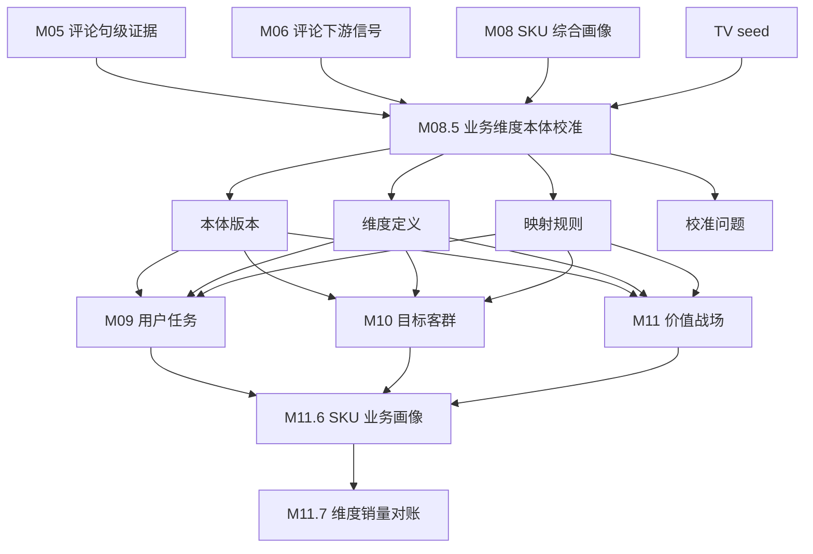
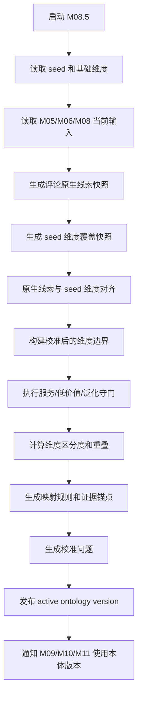

# M08.5 业务维度本体校准模块详细设计

## 1. 文档定位

本文是 CatForge 彩电核心三竞品真实数据 MVP 的新增详细设计，位于 M08 SKU 综合信号画像之后、M09 用户任务之前。

M08.5 的目标不是生成 SKU 结论，而是基于当前批次真实数据，对用户任务、目标客群、价值战场等业务维度的预设本体做校准，形成后续 M09、M10、M11 可消费的“当前项目维度定义版本”。

本文承接：

- 总体设计：`docs/core3_mvp/real_data_v2/sop_detailed_design/00_architecture_data_dictionary_design.md`
- 上游 M05：`core3_comment_evidence_atom`
- 上游 M06：`core3_comment_downstream_signal`、`core3_sku_comment_signal_profile`
- 上游 M07：`core3_sku_market_profile`、`core3_market_signal`、`core3_comparable_pool_baseline`
- 上游 M08：`core3_sku_signal_profile`、`core3_sku_signal_evidence_matrix`、`core3_sku_downstream_feature_view`
- 上游 M08.4：`core3_native_dimension_candidate`、`core3_native_dimension_sku_support`、`core3_native_dimension_alignment_proposal`、`core3_native_dimension_review_issue`
- 规则资产：`apps/api-server/app/rules/tv_core3_mvp_seed_v0_2.json`
- 诊断依据：`docs/core3_mvp/real_data_v2/validation/comment_native_dimension_alignment_205_20260615.md`
- 补充设计：`docs/core3_mvp/real_data_v2/sop_detailed_design/M08_4_product_anchor_correction_design.md`
- 下游 M09、M10、M11、M11.5、M11.6、M11.7、M12-M16

新增 M08.5 的直接原因是 205 真实数据验证显示：当前 M06-M11 维度映射过宽，M09/M10/M11 对所有 SKU 生成全量候选，M11.6 又把 weak/insufficient 候选参与销量分配，导致 84 个 SKU 几乎全部命中所有任务、客群和战场。这个问题不能只靠 M11.7 平账解决，必须先把业务维度本体的定义、边界、排除规则和可分配条件校准清楚。

### 1.1 2026-06-15 M08.4 产品锚点修正后的设计变更

M08.4 已改为从 M03 参数、M04 卖点激活和 M08 证据矩阵共同生成产品锚点，并把产品锚点质量拆成：

- `product_anchor_score`：候选维度整体产品锚点强度。
- `product_anchor_by_sku`：每个 SKU 的参数、卖点、矩阵辅助锚点明细。
- `anchor_quality_summary`：有效参数 SKU 数、有效卖点 SKU 数、脏参数 SKU 数、矩阵辅助 SKU 数等质量摘要。
- `product_anchor_missing`：完全没有有效参数、卖点或同池辅助锚点。
- `product_anchor_weak`：有部分锚点，但强度不足以直接进入正式可分配维度。
- `param_mapping_suspect`：M03 参数 code 与原始字段语义疑似错配，例如运动补偿来自“人工智能/全屋智控/无缝贴墙”，音响功率来自“内置WIFI”。

因此 M08.5 不能再只判断“有没有产品锚点”，而必须把本体发布分成三层：

| 层级 | M08.5 决策 |
| --- | --- |
| 本体定义可保留 | 维度名称、定义和业务边界可进入项目级本体，用于业务复核和后续候选生成 |
| SKU 画像可使用 | 维度可作为 M09/M10/M11 的 `profile_eligible` 判断依据 |
| 销量分配可使用 | 维度可进入 M11.6 销量/销额分配和 M11.7 对账 |

`product_anchor_weak` 的维度可以保留为本体候选或 `active_with_warning`，但默认不得进入 `allocation_eligible`。`param_mapping_suspect` 不由 M08.5 修 M03，而是在本体定义和映射规则中降级消费，避免脏参数继续放大战场。

## 2. 模块职责

### 2.1 本模块解决什么

M08.5 解决七类工程问题：

1. 将 seed 中的用户任务、目标客群、价值战场从“静态预设”转换成“当前项目可执行定义版本”。
2. 基于评论原生语义、参数、卖点、市场和 M08 SKU 画像，识别哪些 seed 维度过宽、重叠、缺产品锚点或被服务履约污染。
3. 为每个业务维度生成清晰中文定义、包含规则、排除规则、必需证据、可选证据和下游分配策略。
4. 把服务履约、安装配送、售后等高频评论从产品价值战场中剥离，作为服务体验或履约风险维度。
5. 生成评论原生线索到标准任务、客群、战场的映射规则，区分“候选触发”和“画像可分配”。
6. 输出可复核问题，提示业务人员哪些维度需要收紧、合并、拆分、移出或保留。
7. 为 M09/M10/M11 提供 `ontology_version_id`，确保后续模块不再直接用原始 seed 全量套标签。

### 2.2 本模块不解决什么

| 不做事项 | 原因 | 后续模块 |
| --- | --- | --- |
| 不直接判断某个 SKU 的主任务、主客群、主战场 | 本模块校准维度定义，不做 SKU 结论 | M09/M10/M11/M11.6 |
| 不重新清洗评论 | 评论质量、去重、低价值过滤由 M01/M05/M06 负责 | M01/M05/M06 |
| 不重新抽参数或卖点 | 参数和卖点抽取已由 M03/M04a/M04b 完成 | M03/M04a/M04b |
| 不绕过 M08 读取原始四张表 | M08.5 应消费画像和证据层结果 | M00-M08 |
| 不替换全局 seed 文件 | seed 是基础资产，本模块输出项目级校准版本 | 规则治理 |
| 不做销量分配 | 销量分配由 M11.6 完成，对账由 M11.7 完成 | M11.6/M11.7 |
| 不生成竞品候选和报告 | 竞品召回、评分、选择和报告在后续模块 | M12-M15 |

### 2.3 允许复用历史结果

允许复用历史 M08.5 输出，但必须同时满足：

- M08 当前 `profile_hash` 和 M08 下游视图 hash 未变化。
- M05/M06 评论原生证据、可下游消费句、低价值过滤规则和下游信号 hash 未变化。
- M03 参数画像、M04a/M04b 卖点激活、M07 市场画像的当前结果 hash 未变化。
- seed 文件 hash 未变化。
- M08.5 规则版本、阈值版本、服务剥离策略版本未变化。
- 上一次 ontology version 仍为 `active`，且没有未处理的 blocking review issue。

## 3. 核心概念

### 3.1 seed、本体和校准版本

| 概念 | 含义 | 是否直接给 SKU 下结论 |
| --- | --- | --- |
| seed | TV 类目的基础任务、客群、战场、卖点、参数、主题定义 | 否 |
| 本体 | 某类业务维度的名称、定义、边界和证据要求 | 否 |
| 校准版本 | 针对当前项目、批次和真实数据生成的本体版本 | 否 |
| SKU 画像 | 某个 SKU 在任务、客群、战场、卖点价值上的判断 | 是，由 M09-M11.6 生成 |

M08.5 不改 seed 文件本身，而是生成 `core3_dimension_ontology_version`。M09/M10/M11 后续必须引用当前 active ontology version。

### 3.2 评论原生线索

评论原生线索不是预设任务、客群、战场，而是评论本身表达出来的低层业务语义：

| 类型 | 示例 | 用途 |
| --- | --- | --- |
| `person` | 老人、父母、孩子、家人、单位 | 客群候选 |
| `scene` | 客厅、卧室、新家、挂墙、宿舍 | 任务/客群/战场候选 |
| `motive` | 换新、国补、性价比、送礼、装修 | 任务/购买动机 |
| `product_experience` | 画质、音质、高刷、护眼、语音、系统 | 产品价值支撑 |
| `service_experience` | 安装、配送、售后、师傅、退换 | 服务体验和履约风险 |
| `risk` | 广告、卡顿、坏点、做工、物流破损 | 风险和复核 |

M08.5 使用这些原生线索校准维度边界。比如“服务安装”可以支撑新家装修的履约侧面，但不能直接成为产品价值战场。

### 3.3 候选触发和画像可分配

M08.5 必须把两类规则分开：

| 层级 | 含义 | 后续用途 |
| --- | --- | --- |
| `candidate_trigger` | 某个信号可以让任务、客群或战场进入候选 | M09/M10/M11 候选表 |
| `profile_eligible` | 满足证据门槛，可以进入 SKU 画像主/次判断 | M11.6 画像聚合 |
| `allocation_eligible` | 可以参与销量/销额分配 | M11.6 分配、M11.7 对账 |

弱线索可以触发候选，但不能默认进入画像和销量分配。

## 4. 输入输出总览

### 4.1 必须输入

| 输入 | 来源 | 用途 |
| --- | --- | --- |
| `core3_sku_signal_profile` | M08 | SKU 范围、画像完整度、参数/卖点/评论/市场摘要 |
| `core3_sku_signal_evidence_matrix` | M08 | 证据域覆盖和代表 evidence |
| `core3_sku_downstream_feature_view` | M08 | `for_module='M08_5'`，若首版未实现可复用 M09/M10/M11 视图字段 |
| `core3_comment_evidence_atom` | M05 | 可下游消费评论句、低价值标记、代表文本 |
| `core3_comment_downstream_signal` | M06 | 现有任务、客群、战场、服务、价格、痛点等信号 |
| `core3_sku_comment_signal_profile` | M06 | SKU 评论质量和信号覆盖 |
| `core3_sku_market_profile` | M07/M08 | 销量、价格、价格带、渠道、市场表现 |
| `core3_sku_param_profile` | M03/M08 | 关键参数是否能支撑产品价值锚点 |
| `core3_sku_claim_activation` | M04a/M04b/M08 | 结构化卖点和基础卖点激活 |
| `core3_native_dimension_candidate` | M08.4 | 评论原生任务、客群、价值战场、服务语境候选 |
| `core3_native_dimension_sku_support` | M08.4 | SKU 对原生维度的支撑快照和产品锚点明细 |
| `core3_native_dimension_alignment_proposal` | M08.4 | 原生维度与 seed 维度的新增、拆分、合并、降级建议 |
| `core3_native_dimension_review_issue` | M08.4 | `product_anchor_weak`、`param_mapping_suspect`、服务剥离、维度过宽等本体治理问题 |
| TV seed | 规则资产 | 基础任务、客群、战场、卖点、参数和主题 |

MVP 允许 M08.5 直接读取 M05/M06/M07 当前表做校准统计，但 SKU 结论类模块仍必须通过 M08 或 M08.5 的输出消费，不得各自散读。

### 4.2 明确不消费

| 数据 | 禁止原因 |
| --- | --- |
| 原始 `comment_data` | 必须使用 M05 低价值过滤后的评论句 |
| 原始 `week_sales_data` | 市场数据必须来自 M07/M08 |
| 原始 `attribute_data` | 参数必须来自 M03/M08 |
| 原始 `selling_points_data` | 卖点必须来自 M04a/M04b/M08 |
| M09/M10/M11 当前结果 | M08.5 是这些模块的上游，不能反向消费 |
| M11.6/M11.7 结果 | M08.5 负责本体，不消费画像聚合和对账结果 |

### 4.3 输出表

| 输出表 | 粒度 | 用途 |
| --- | --- | --- |
| `core3_dimension_ontology_version` | 项目 + 品类 + 批次 + 本体版本 | 当前项目可用的本体版本 |
| `core3_dimension_definition` | 本体版本 + 维度类型 + 维度 code | 维度定义、边界、证据要求和下游策略 |
| `core3_dimension_evidence_anchor` | 维度定义 + 证据锚点 | 评论/参数/卖点/市场/seed 锚点 |
| `core3_dimension_mapping_rule` | 来源信号 + 目标维度 | 评论原生线索或 seed 信号到标准维度的映射 |
| `core3_dimension_candidate_snapshot` | 本体版本 + 原生线索/标准维度 | 当前批次信号分布快照 |
| `core3_dimension_calibration_issue` | 本体版本 + 维度或映射 | 过宽、重叠、服务污染、缺锚点等问题 |

### 4.4 模块关系



## 5. 数据模型设计

### 5.1 通用字段

所有输出表必须包含：

| 字段 | 类型建议 | 必填 | 说明 |
| --- | --- | --- | --- |
| `project_id` | text | 是 | 项目 ID |
| `category_code` | text | 是 | MVP 为 `TV` |
| `batch_id` | text | 是 | M00 批次 ID |
| `run_id` | uuid/text | 否 | 全链路运行 ID |
| `module_run_id` | uuid/text | 否 | M08.5 模块运行 ID |
| `rule_version` | text | 是 | M08.5 规则版本 |
| `seed_version` | text | 是 | seed 版本 |
| `seed_hash` | text | 是 | seed 文件 hash |
| `input_fingerprint` | text | 是 | 上游输入 hash |
| `result_hash` | text | 是 | 当前记录 hash |
| `created_at` | timestamptz | 是 | 创建时间 |
| `updated_at` | timestamptz | 是 | 更新时间 |

### 5.2 枚举

#### 5.2.1 `dimension_type`

```text
task
target_group
battlefield
claim_value
service_context
purchase_motive
risk_context
```

MVP 必须落地 `task`、`target_group`、`battlefield`、`service_context`。`claim_value` 可用于 M11.5/M11.6 联动，`purchase_motive`、`risk_context` 可先作为候选快照和映射来源。

#### 5.2.2 `definition_status`

```text
active
active_with_warning
review_required
disabled
blocked
```

#### 5.2.3 `boundary_policy`

```text
product_value
purchase_context
service_context
risk_context
diagnostic_only
```

含义：

| policy | 含义 |
| --- | --- |
| `product_value` | 可参与产品价值战场、任务、客群和销量分配 |
| `purchase_context` | 可解释购买动机，但不能单独作为产品战场 |
| `service_context` | 服务履约或售后体验，不进入产品价值战场分配 |
| `risk_context` | 风险或阻碍，只做降权和复核 |
| `diagnostic_only` | 只作为诊断线索，不进入 SKU 画像 |

#### 5.2.4 `allocation_policy`

```text
eligible_when_main_or_secondary
eligible_when_profile_eligible
eligible_when_product_anchor_present
candidate_only
never_allocate
review_required
```

### 5.3 `core3_dimension_ontology_version`

该表记录当前项目和批次使用的本体校准版本。

| 字段 | 类型 | 必填 | 说明 |
| --- | --- | --- | --- |
| `ontology_version_id` | uuid | 是 | 主键 |
| `project_id` | text | 是 | 项目 ID |
| `category_code` | text | 是 | `TV` |
| `batch_id` | text | 是 | M00 批次 |
| `ontology_version` | text | 是 | 如 `tv_core3_ontology_v20260615_01` |
| `base_seed_version` | text | 是 | seed 业务版本 |
| `base_seed_hash` | text | 是 | seed 文件 hash |
| `source_profile_batch_hash` | text | 是 | M08/M05/M06/M07 输入摘要 hash |
| `calibration_scope` | text | 是 | `project_batch`、后续可扩 `category_global` |
| `status` | text | 是 | `draft`、`active`、`superseded`、`blocked` |
| `active_from_run_id` | uuid/text | 否 | 激活它的运行 |
| `dimension_count_json` | jsonb | 是 | 各维度数量 |
| `quality_summary_json` | jsonb | 是 | 过宽、重叠、服务污染、缺锚点统计 |
| `review_required` | boolean | 是 | 是否需要复核 |
| `review_status` | text | 是 | `auto_pass`、`review_required`、`approved`、`rejected` |
| `created_at` | timestamptz | 是 | 创建时间 |
| `activated_at` | timestamptz | 否 | 激活时间 |

约束：

```text
primary key(ontology_version_id)
unique(project_id, category_code, batch_id, ontology_version)
partial unique(project_id, category_code, batch_id, status='active')
```

索引：

```text
idx_core3_dimension_ontology_version_active(project_id, category_code, batch_id, status)
idx_core3_dimension_ontology_version_seed_hash(base_seed_hash)
```

### 5.4 `core3_dimension_definition`

该表保存校准后的任务、客群、战场和服务维度定义。

| 字段 | 类型 | 必填 | 说明 |
| --- | --- | --- | --- |
| `dimension_definition_id` | uuid | 是 | 主键 |
| `ontology_version_id` | uuid | 是 | 关联本体版本 |
| `dimension_type` | text | 是 | 任务、客群、战场等 |
| `dimension_code` | text | 是 | 稳定 code |
| `base_dimension_code` | text | 否 | 来源 seed code |
| `dimension_name_cn` | text | 是 | 中文名 |
| `definition_cn` | text | 是 | 校准后的定义 |
| `business_question_cn` | text | 是 | 这个维度回答什么问题 |
| `include_rule_json` | jsonb | 是 | 纳入规则 |
| `exclude_rule_json` | jsonb | 是 | 排除规则 |
| `required_evidence_json` | jsonb | 是 | 必需证据门槛 |
| `optional_evidence_json` | jsonb | 是 | 可选补强证据 |
| `negative_evidence_json` | jsonb | 是 | 降权或阻断证据 |
| `boundary_policy` | text | 是 | 维度边界 |
| `allocation_policy` | text | 是 | 分配策略 |
| `candidate_trigger_policy_json` | jsonb | 是 | 候选触发规则 |
| `profile_eligibility_policy_json` | jsonb | 是 | 画像成立规则 |
| `downstream_policy_json` | jsonb | 是 | 下游消费策略 |
| `distinctiveness_score` | numeric | 是 | 与其他维度的区分度 |
| `support_score` | numeric | 是 | 当前真实数据支撑强度 |
| `sku_coverage_count` | integer | 是 | 候选覆盖 SKU 数 |
| `strong_sku_coverage_count` | integer | 是 | 强证据 SKU 数 |
| `definition_status` | text | 是 | 状态 |
| `review_required` | boolean | 是 | 是否需复核 |
| `review_reason_json` | jsonb | 是 | 复核原因 |

约束：

```text
primary key(dimension_definition_id)
foreign key(ontology_version_id) references core3_dimension_ontology_version
unique(ontology_version_id, dimension_type, dimension_code)
check(distinctiveness_score >= 0 and distinctiveness_score <= 1)
check(support_score >= 0 and support_score <= 1)
```

索引：

```text
idx_core3_dimension_definition_type(ontology_version_id, dimension_type)
idx_core3_dimension_definition_status(definition_status)
idx_core3_dimension_definition_boundary(boundary_policy)
```

### 5.5 `core3_dimension_evidence_anchor`

该表保存某个维度成立所依赖的证据锚点。

| 字段 | 类型 | 必填 | 说明 |
| --- | --- | --- | --- |
| `dimension_anchor_id` | uuid | 是 | 主键 |
| `dimension_definition_id` | uuid | 是 | 维度定义 |
| `anchor_type` | text | 是 | `native_comment`、`param`、`claim`、`market`、`task`、`target_group`、`seed` |
| `anchor_code` | text | 是 | 锚点 code |
| `anchor_name_cn` | text | 是 | 中文名 |
| `anchor_role` | text | 是 | `required`、`optional`、`negative`、`exclusion` |
| `polarity` | text | 是 | `positive`、`negative`、`neutral` |
| `weight` | numeric | 是 | 对该维度的权重 |
| `min_sentence_count` | integer | 否 | 评论锚点句数门槛 |
| `min_sku_count` | integer | 否 | 批次支撑 SKU 门槛 |
| `min_confidence` | numeric | 否 | 最低置信度 |
| `representative_phrase_json` | jsonb | 是 | 代表短语 |
| `representative_evidence_ids` | jsonb | 是 | 代表 evidence |
| `source_rule_json` | jsonb | 是 | 来源规则 |

约束：

```text
primary key(dimension_anchor_id)
foreign key(dimension_definition_id) references core3_dimension_definition
unique(dimension_definition_id, anchor_type, anchor_code, anchor_role, polarity)
check(weight >= 0 and weight <= 1)
```

### 5.6 `core3_dimension_mapping_rule`

该表保存从原生线索或 seed 信号到标准维度的映射规则。

| 字段 | 类型 | 必填 | 说明 |
| --- | --- | --- | --- |
| `dimension_mapping_rule_id` | uuid | 是 | 主键 |
| `ontology_version_id` | uuid | 是 | 本体版本 |
| `source_type` | text | 是 | `native_comment_signal`、`comment_topic`、`param_code`、`claim_code`、`market_signal`、`seed_mapping` |
| `source_code` | text | 是 | 来源 code |
| `source_name_cn` | text | 否 | 中文名 |
| `target_dimension_type` | text | 是 | 目标维度类型 |
| `target_dimension_code` | text | 是 | 目标维度 code |
| `mapping_level` | text | 是 | `candidate_trigger`、`profile_eligible`、`allocation_eligible`、`negative`、`exclude` |
| `mapping_strength` | numeric | 是 | 映射强度 |
| `requires_product_anchor` | boolean | 是 | 是否需要产品价值锚点 |
| `requires_market_anchor` | boolean | 是 | 是否需要市场锚点 |
| `service_guardrail_flag` | boolean | 是 | 是否服务守门 |
| `low_value_guardrail_flag` | boolean | 是 | 是否低价值守门 |
| `rule_expr_json` | jsonb | 是 | 可执行规则表达式 |
| `reason_cn` | text | 是 | 中文解释 |
| `active` | boolean | 是 | 是否启用 |

约束：

```text
primary key(dimension_mapping_rule_id)
foreign key(ontology_version_id) references core3_dimension_ontology_version
unique(ontology_version_id, source_type, source_code, target_dimension_type, target_dimension_code, mapping_level)
check(mapping_strength >= 0 and mapping_strength <= 1)
```

### 5.7 `core3_dimension_candidate_snapshot`

该表保存当前批次评论原生线索和标准维度候选分布，用于解释为什么要校准。

| 字段 | 类型 | 必填 | 说明 |
| --- | --- | --- | --- |
| `candidate_snapshot_id` | uuid | 是 | 主键 |
| `ontology_version_id` | uuid | 是 | 本体版本 |
| `snapshot_type` | text | 是 | `native_signal`、`seed_dimension`、`mapped_dimension` |
| `signal_type` | text | 是 | person/scene/motive/product/service/risk 或 dimension_type |
| `signal_code` | text | 是 | 线索或维度 code |
| `signal_name_cn` | text | 是 | 中文名 |
| `sentence_count` | integer | 是 | 句数 |
| `sku_count` | integer | 是 | 覆盖 SKU |
| `strong_sentence_count` | integer | 是 | 强句数 |
| `service_sentence_count` | integer | 是 | 服务句数 |
| `low_value_sentence_count` | integer | 是 | 低价值句数 |
| `avg_signal_score` | numeric | 是 | 平均信号分 |
| `coverage_ratio` | numeric | 是 | 覆盖比例 |
| `specificity_score` | numeric | 是 | 特异性 |
| `distribution_json` | jsonb | 是 | SKU 分布、Top SKU、短语样例 |
| `representative_evidence_ids` | jsonb | 是 | 代表 evidence |

约束：

```text
unique(ontology_version_id, snapshot_type, signal_type, signal_code)
```

### 5.8 `core3_dimension_calibration_issue`

该表保存本体校准问题。

| 字段 | 类型 | 必填 | 说明 |
| --- | --- | --- | --- |
| `calibration_issue_id` | uuid | 是 | 主键 |
| `ontology_version_id` | uuid | 是 | 本体版本 |
| `issue_scope` | text | 是 | `dimension`、`mapping`、`batch`、`service_guardrail`、`overlap` |
| `dimension_type` | text | 否 | 维度类型 |
| `dimension_code` | text | 否 | 维度 code |
| `source_type` | text | 否 | 来源类型 |
| `source_code` | text | 否 | 来源 code |
| `issue_code` | text | 是 | 问题 code |
| `severity` | text | 是 | `info`、`warning`、`blocking` |
| `issue_message_cn` | text | 是 | 中文说明 |
| `evidence_json` | jsonb | 是 | 支撑数据 |
| `suggested_action_cn` | text | 是 | 建议动作 |
| `review_status` | text | 是 | `open`、`approved`、`rejected`、`waived`、`resolved` |

常见 `issue_code`：

| issue_code | 条件 |
| --- | --- |
| `dimension_overbroad` | 维度候选覆盖超过阈值且强证据不足 |
| `service_leakage_to_product_battlefield` | 服务履约映射到产品战场 |
| `missing_product_anchor` | 价值战场缺少参数/卖点/产品体验锚点 |
| `product_anchor_weak` | 价值战场有锚点但平均强度不足，默认不可参与销量分配 |
| `param_mapping_suspect` | 上游参数映射疑似错配，相关参数不得作为强产品锚点 |
| `low_distinctiveness_overlap` | 两个维度锚点高度重叠 |
| `seed_definition_too_generic` | seed 定义无法区分相邻维度 |
| `weak_signal_allocatable` | weak/insufficient 仍被标记可分配 |
| `low_value_signal_used` | 低价值评论被用于画像成立 |
| `service_dimension_should_be_context` | 服务保障应移出产品战场 |

## 6. 处理流程设计

### 6.1 总流程



### 6.2 步骤 1：加载 seed 和输入

1. 读取 TV seed 中 `user_tasks`、`target_groups`、`battlefields`、`standard_claims`、`standard_params`、`comment_topics`。
2. 校验 seed code 无重复、映射 code 可识别、核心字段不为空。
3. 读取 M08 current SKU 画像，确定当前批次 SKU 总数和有效 SKU 范围。
4. 读取 M05 可下游消费评论句，只允许 `usable_for_downstream=true` 且 `low_value_flag=false` 的句子进入原生线索统计。
5. 读取 M06 当前下游信号，用于发现现有映射过宽、服务污染和弱信号误用。
6. 读取 M03/M04/M07 经 M08 汇总的参数、卖点和市场锚点。

### 6.3 步骤 2：生成评论原生线索

M08.5 不依赖外部 LLM。MVP 使用规则词典、M06 topic、M05 句级 evidence 和已有评论信号组合生成原生线索。

原生线索示例：

| native code | 类型 | 说明 | 下游候选 |
| --- | --- | --- | --- |
| `picture_quality` | product_experience | 画质、清晰、色彩、亮度 | 高端画质、家庭观影 |
| `audio_quality` | product_experience | 音响、低音、杜比、环绕 | 影院音效、家庭观影 |
| `game_console` | scene/motive | 游戏、主机、HDMI、高刷 | 游戏任务、游戏用户、游戏体育 |
| `sports_watching` | scene | 看球、球赛、体育赛事 | 体育任务、体育用户、游戏体育 |
| `senior_family` | person | 老人、父母、爸妈、长辈 | 长辈任务、长辈客群 |
| `installation_service` | service_experience | 安装、送货、师傅、售后 | 服务履约，不直接进产品战场 |
| `price_value` | motive | 性价比、优惠、国补、划算 | 性价比任务、性价比用户 |
| `bedroom_second_tv` | scene | 卧室、房间、副屏、第二台 | 卧室副屏任务/客群 |

每个原生线索统计：

```text
sentence_count
strong_sentence_count
sku_count
service_sentence_count
low_value_sentence_count
avg_signal_score
specificity_score
representative_phrases
representative_evidence_ids
```

### 6.4 步骤 3：对齐原生线索和 seed 维度

对齐分三层：

1. seed 显式映射：seed 中 `mapped_task_codes`、`mapped_target_group_codes`、`mapped_battlefield_codes`。
2. 规则映射：原生线索和参数/卖点/市场信号与标准 code 的规则映射。
3. 诊断映射：只用于发现维度过宽、重叠和污染，不进入下游执行。

映射强度建议：

| 映射关系 | strength |
| --- | ---: |
| 必需产品锚点，如 high_refresh -> 游戏体育 | 0.90 |
| 强评论场景，如 game_console -> 游戏任务 | 0.80 |
| 泛化体验，如 picture_quality -> 家庭观影候选 | 0.45 |
| 服务履约到产品战场 | 0.00，且标记 `exclude` |
| 低价值好评到任何维度 | 0.00，且标记 `exclude` |

### 6.5 步骤 4：校准维度定义

校准动作包括：

| 动作 | 说明 | 示例 |
| --- | --- | --- |
| retain | 保留原定义 | 高端画质战场保留，但要求高端参数/卖点 |
| narrow | 收紧边界 | 游戏体育战场必须有高刷、HDMI、MEMC、低延迟等 |
| split | 拆分候选 | 游戏任务和体育任务在 M09 分开，战场可合并 |
| merge | 合并过近定义 | 家庭观影和影院音效若证据太重叠，可让影院音效作为子战场候选 |
| move_to_context | 移出产品战场 | 服务保障战场改为服务履约维度 |
| disable | 当前数据不足，不作为 active 产品维度 | 缺产品锚点的临时维度 |

MVP 不临时新增正式产品战场，避免破坏后续标准全集；但可以新增 `service_context`、`purchase_motive`、`risk_context` 作为辅助维度。

### 6.6 步骤 5：构建任务定义边界

用户任务回答“买这台电视主要为了完成什么使用任务”。

任务成立必须至少满足两类证据：

1. 明确任务锚点：场景词、动作词、强参数或强卖点。
2. 产品或市场支撑：参数/卖点/评论体验/市场价格渠道之一。

任务示例规则：

| 任务 | 必需或强锚点 | 排除规则 |
| --- | --- | --- |
| 游戏娱乐 | 游戏/主机/高刷/HDMI/低延迟/VRR | 只有“画质好”不能成立 |
| 体育赛事观看 | 看球/赛事/MEMC/运动补偿/高刷 | 只有“清晰流畅”不能成立 |
| 长辈易用 | 老人/父母/语音/简单/少广告 | 只有“家里人用”不能成立 |
| 儿童护眼 | 孩子/儿童/护眼/低蓝光/无频闪 | 只有“舒服”不能成立 |
| 新家装修搭配 | 新家/装修/外观/超薄/尺寸适配 | 纯安装服务不能单独成立产品任务 |

### 6.7 步骤 6：构建目标客群定义边界

目标客群回答“谁会买，为什么是这类人买”。

客群成立必须满足至少两类证据：

1. 人群或场景线索。
2. 任务支撑。
3. 价格渠道或市场支撑。
4. 产品卖点或参数支撑。

关键规则：

- “家庭泛化”不能直接等同家庭换新用户。
- “老人”评论能触发长辈家庭用户候选，但要结合语音、简洁系统、少广告或易用评论才能加强。
- 单位/公司采购应作为 B 端/工程采购线索，不混入家庭客群。
- 服务安装好只能作为新家装修用户的服务侧面，不可直接证明产品适合装修客群。

### 6.8 步骤 7：构建价值战场定义边界

价值战场回答“SKU 靠什么产品价值参与竞争”。

战场成立必须有产品价值锚点：

| 战场 | 必需产品锚点 | 服务/泛化排除 |
| --- | --- | --- |
| 高端画质战场 | Mini LED/OLED/QLED/亮度/控光/色域/画质芯片 | 普通“画质清晰”只能候选 |
| 家庭观影升级战场 | 大屏 + 观影/音画体验/客厅场景 | 只有服务好或安装好不成立 |
| 游戏体育战场 | 高刷/HDMI/MEMC/低延迟/VRR/游戏体育评论 | 泛化流畅或画质好不成立 |
| 大屏性价比战场 | 尺寸 + 价格/英寸/销量/价值感 | 只有国补优惠不等同产品战场 |
| 家庭护眼战场 | 护眼参数/护眼卖点/儿童或长期观看 | 只有“看着舒服”不成立 |
| 长辈易用战场 | 语音/适老/简单系统/少广告 | 只有“给父母买”不成立产品战场 |
| 家居美学战场 | 外观/超薄/边框/尺寸适配/家居搭配 | 安装、送货、售后需剥离 |
| 服务履约 | 安装/配送/售后/师傅 | 移到 `service_context`，不进产品战场 |

M08.5 对 M08.4 锚点质量的消费规则：

| M08.4 状态 | M08.5 发布策略 | 映射层级 |
| --- | --- | --- |
| `product_anchor_score >= 0.30` 且无 `param_mapping_suspect` | 可发布为产品价值本体定义 | 可生成 `candidate_trigger`、`profile_eligible`，满足市场/评论条件后可 `allocation_eligible` |
| `product_anchor_score >= 0.30` 但存在 `param_mapping_suspect` | 可发布为 `active_with_warning`，但必须标记参数质量风险 | 默认最高到 `profile_eligible`，不得直接 `allocation_eligible` |
| `0 < product_anchor_score < 0.30` 或 `product_anchor_weak` | 可保留为候选定义或复核定义 | 只允许 `candidate_trigger`，除非人工复核补充证据 |
| `product_anchor_missing` | 不发布为正式产品价值战场 | 只生成校准问题或诊断快照 |
| 只有 `matrix_only_anchor` | 只能辅助解释，不能单独使战场成立 | 只允许 `candidate_trigger` |

这意味着 205 当前“运动流畅、声画沉浸、护眼舒适、性价比、家居适配”等弱锚点战场，M08.5 可以保留本体定义用于后续观察，但不能让它们默认进入 M11.6 销量分配。

### 6.9 步骤 8：计算区分度和过宽问题

对每个维度计算：

```text
support_score =
  normalized_sentence_support * 0.25
  + normalized_sku_support * 0.15
  + product_anchor_score * 0.25
  + market_anchor_score * 0.10
  + specificity_score * 0.15
  + evidence_diversity_score * 0.10

distinctiveness_score =
  1 - max(anchor_overlap_jaccard_with_other_dimensions)
```

过宽判定：

```text
sku_coverage_ratio > 0.70
and strong_sku_coverage_ratio < 0.35
and product_anchor_score < 0.50
```

满足时生成 `dimension_overbroad`。

### 6.10 步骤 9：发布 active ontology

发布规则：

| 条件 | 结果 |
| --- | --- |
| 存在 blocking issue | 版本 `blocked`，M09/M10/M11 不应使用 |
| 只有 warning/review_required | 版本可 `active_with_warning`，下游可运行但需提示 |
| 无严重问题 | 版本 `active` |

如果新版本 active，旧版本置为 `superseded`，但保留历史。

## 7. 关键业务规则

### 7.1 服务履约剥离规则

以下信号默认不得映射为产品价值战场的 `profile_eligible` 或 `allocation_eligible`：

- 安装、配送、送货、师傅、上门、挂架、售后、退换、物流。
- 好评返现、客服态度、发票、保价。
- 包装破损、延迟送达、安装收费。

允许用途：

- 作为 `service_context` 展示。
- 作为新家装修任务/客群的服务侧面弱证据。
- 作为风险或复核问题。
- 作为 M15 报告中的履约体验，不作为产品战场。

### 7.2 低价值评论守门

以下评论不得独立支撑任务、客群、战场：

- 只有“好评、不错、满意、值得、可以、挺好”的泛化评论。
- 只有物流或客服，不含产品体验。
- 只有晒单、追评模板、返现话术。
- 重复模板评论。

低价值评论只能用于质量统计，不进入 `profile_eligible`。

### 7.3 泛化体验降级

“画质清晰”“声音不错”“性价比高”是常见评论，不能自动推出所有维度：

| 泛化体验 | 只能触发 | 需要补强才能成立 |
| --- | --- | --- |
| 画质清晰 | 家庭观影候选、高端画质候选 | Mini LED/OLED/亮度/控光/色域等 |
| 声音不错 | 影院音效候选 | 杜比/音响功率/沉浸音效/强音质评论 |
| 性价比高 | 性价比任务候选 | 价格分位、价格/英寸、销量表现 |
| 操作简单 | 易用候选 | 语音/适老/少广告/系统流畅 |

### 7.4 稀疏化原则

后续 M09/M10/M11 可以保留全量候选表，但只有满足本体定义的 `profile_eligible` 结果才能进入 M11.6 画像。M11.6 默认只对 `allocation_eligible` 的维度做销量分配。

## 8. 增量策略

### 8.1 触发重算条件

任一条件变化，M08.5 需重算：

- seed 文件 hash 变化。
- M05 可下游消费评论句 hash 变化。
- M06 评论下游信号 hash 或服务守门规则版本变化。
- M08 当前 SKU 画像 hash 变化。
- M03 参数画像、M04 卖点激活、M07 市场画像经 M08 汇总后的 hash 变化。
- M08.5 阈值、映射规则、服务剥离策略、区分度算法版本变化。
- 人工复核修改维度定义或映射规则。

### 8.2 输出版本策略

1. 每次重算生成新的 `ontology_version`。
2. 如果输出 hash 与当前 active 版本一致，可以复用，不新增 active 版本。
3. 如果输出变化但无 blocking issue，新版本置为 `active` 或 `active_with_warning`。
4. 旧版本置为 `superseded`，但下游历史结果仍引用旧 `ontology_version_id`。
5. 当本体版本变化时，M09、M10、M11、M11.5、M11.6、M11.7、M12-M15 均应标记需重算或需确认。

### 8.3 input_fingerprint

建议包含：

```json
{
  "seed_hash": "...",
  "m05_comment_atom_hash": "...",
  "m06_signal_hash": "...",
  "m08_profile_hash": "...",
  "m08_feature_view_hash": "...",
  "rule_version": "m08_5_v1",
  "service_guardrail_version": "service_guardrail_v1",
  "threshold_version": "ontology_threshold_v1"
}
```

## 9. 服务、Runner 和 API 边界

### 9.1 Service 建议

| Service | 职责 |
| --- | --- |
| `DimensionOntologyCalibrationService` | 主流程编排 |
| `DimensionSeedLoader` | 读取和校验 seed |
| `NativeCommentSignalAggregator` | 聚合评论原生线索 |
| `DimensionSupportSnapshotBuilder` | 生成 candidate snapshot |
| `SeedAlignmentService` | seed 与原生线索对齐 |
| `DimensionBoundaryBuilder` | 生成维度包含/排除/证据规则 |
| `ServiceGuardrailPolicy` | 服务履约剥离 |
| `LowValueSignalGuardrailPolicy` | 低价值评论守门 |
| `DimensionDistinctivenessService` | 区分度和重叠计算 |
| `DimensionCalibrationReviewPolicy` | 复核问题生成 |
| `DimensionOntologyRepository` | 持久化版本、定义、锚点、映射、问题 |

### 9.2 Runner 边界

Runner 名称建议：`M085DimensionOntologyRunner`。

Runner 输入：

```json
{
  "project_id": "...",
  "category_code": "TV",
  "batch_id": "...",
  "run_id": "...",
  "mode": "full|incremental|reuse",
  "force_new_version": false
}
```

Runner 输出：

```json
{
  "module": "M08.5",
  "status": "success|warning|blocked|failed",
  "ontology_version_id": "...",
  "ontology_version": "...",
  "definition_count": {
    "task": 10,
    "target_group": 9,
    "battlefield": 9,
    "service_context": 1
  },
  "issue_count": {
    "warning": 0,
    "blocking": 0
  },
  "next_modules_should_rerun": ["M09", "M10", "M11"]
}
```

### 9.3 API 建议

| API | 方法 | 用途 |
| --- | --- | --- |
| `/api/core3/real-data/pipeline/m08-5/run` | POST | 触发本体校准 |
| `/api/core3/real-data/projects/{project_id}/ontology/current` | GET | 查询当前 active 本体版本 |
| `/api/core3/real-data/ontology/{ontology_version_id}/definitions` | GET | 查看维度定义 |
| `/api/core3/real-data/ontology/{ontology_version_id}/snapshots` | GET | 查看原生线索和维度覆盖 |
| `/api/core3/real-data/ontology/{ontology_version_id}/issues` | GET | 查看校准问题 |
| `/api/core3/real-data/ontology/{ontology_version_id}/mapping-rules` | GET | 查看映射规则 |

API 返回给前端时必须使用业务中文名称和解释，不暴露内部调试堆栈。内部 code 可以作为折叠信息。

## 10. 与后续模块的接口约束

### 10.1 M09 用户任务

M09 必须新增输入：

- 当前 active `ontology_version_id`。
- `dimension_type='task'` 的 definition、anchor、mapping。

M09 输出候选时必须区分：

- `candidate_triggered=true`
- `profile_eligible=true/false`
- `allocation_eligible=true/false`
- `eligibility_reason_cn`

M09 不得再只按 seed 中 10 个任务全量分配。

### 10.2 M10 目标客群

M10 必须消费 `dimension_type='target_group'` 的定义和映射，尤其是：

- 人群/场景/任务/价格渠道至少两类证据规则。
- 家庭泛化、服务泛化、低价值泛化降权规则。
- B 端/单位采购作为线索，不混入家庭客群。

### 10.3 M11 价值战场

M11 必须消费 `dimension_type='battlefield'` 和 `service_context`：

- 产品战场必须有产品价值锚点。
- 服务履约不得进入产品战场。
- 服务保障若仍保留 seed code，只能映射到 `service_context` 或 `risk_context`，不能进入产品战场销量分配。

### 10.4 M11.6 SKU 业务画像

M11.6 只应把 `allocation_eligible=true` 的任务、客群、战场、卖点纳入销量分配。若某 SKU 某维度证据不足，可输出低置信主方向，但不能把所有 weak 候选平均分配。

### 10.5 M11.7 销量对账

M11.7 在原有销量守恒外，应增加业务稀疏性检查：

- 某维度类型若所有 SKU 都命中所有标准维度，除非有强证据解释，否则 warning 或 failed。
- `service_context` 不进入产品价值战场汇总。
- 维度贡献明细必须能解释“哪些 SKU 贡献了某战场销量，SKU 在该战场内占多少”。

## 11. 质量和复核规则

### 11.1 warning 条件

| 条件 | issue_code |
| --- | --- |
| 某维度覆盖 SKU 比例超过 70%，但强证据 SKU 比例低于 35% | `dimension_overbroad` |
| 两个维度锚点 Jaccard 重叠超过 0.65 | `low_distinctiveness_overlap` |
| 某维度主要由泛化评论支撑 | `generic_comment_dominant` |
| 某维度缺市场支撑但仍可作为候选 | `missing_market_anchor_warning` |
| 当前批次某维度真实支撑太弱 | `weak_batch_support` |
| 上游 M08.4 存在 `product_anchor_weak` | `product_anchor_weak` |
| 上游 M08.4 存在 `param_mapping_suspect` | `param_mapping_suspect` |

### 11.2 review_required 条件

| 条件 | issue_code |
| --- | --- |
| seed 维度定义与真实评论原生线索不匹配 | `seed_definition_mismatch` |
| 某维度应保留还是移出存在业务判断 | `manual_boundary_review_required` |
| 新增服务/采购/补贴线索是否进入正式本体需业务确认 | `new_context_review_required` |
| 某战场缺产品锚点但业务上希望保留 | `missing_product_anchor_review` |
| 某战场锚点偏弱但业务上希望进入正式画像 | `weak_product_anchor_review` |

### 11.3 blocked 条件

| 条件 | issue_code |
| --- | --- |
| seed 无法读取或关键 code 重复 | `invalid_seed` |
| 没有 M08 current SKU 画像 | `missing_m08_current_profile` |
| 没有可下游消费评论且规则要求评论校准 | `missing_usable_comment_atoms` |
| 服务履约仍被标记为产品战场 allocation eligible | `service_leakage_blocking` |
| 输出没有 active task/target_group/battlefield 定义 | `missing_active_dimension_definition` |

## 12. 测试设计

### 12.1 单元测试

| 测试 | 断言 |
| --- | --- |
| seed loader 校验 | code 重复、缺定义、映射缺失能报错 |
| 原生线索聚合 | 低价值评论和不可下游评论不进入统计 |
| 服务守门 | 安装/配送/售后不得映射为产品战场可分配 |
| 泛化体验降级 | “画质好”不能独立使高端画质 allocation eligible |
| 游戏体育收紧 | 游戏体育需高刷/HDMI/MEMC/游戏体育评论之一 |
| 长辈易用收紧 | 仅“给父母买”只能触发候选，不能直接进战场 |
| 区分度计算 | 高重叠维度生成 `low_distinctiveness_overlap` |
| 结果 hash | 相同输入生成稳定 hash |

### 12.2 集成测试

| 测试 | 断言 |
| --- | --- |
| local_validation_fixture_v1 | 能生成 active ontology version |
| 205-like 评论分布 | 服务履约被移到 service_context |
| M09/M10/M11 联动 | 下游能读到 ontology_version_id |
| 增量重跑 | seed hash 不变且输入不变时复用 |
| 人工复核后重跑 | review 变更能触发新版本 |

### 12.3 越界测试

M08.5 不得直接读取原始四张业务表：

- `week_sales_data`
- `attribute_data`
- `selling_points_data`
- `comment_data`

如果为了诊断临时读取，必须放在独立 validation 脚本，不进入业务 Runner。

## 13. 205 真实数据约束

当前 205 批次 `m00_20260613004311_d548f6dc` 暴露的约束必须成为验收条件：

| 现象 | 设计处理 |
| --- | --- |
| 84 个 SKU、32,454 条原始评论、42,398 条可下游句、25,859 条低价值句 | 只消费可下游且非低价值评论句 |
| 服务履约 8,018 句、覆盖 74 SKU | 移入 service_context，不作为产品战场 |
| 游戏 402 句、体育 204 句，却被现有战场扩展到 73 SKU | 收紧游戏体育战场必需产品锚点 |
| 画质体验 9,888 句覆盖 74 SKU | 画质是强体验线索，但高端画质需高端参数/卖点补强 |
| M09/M10/M11 全量候选覆盖 84 SKU | 候选可全量，画像和分配必须稀疏 |
| M11.6 当前 84x10 战场全量分配 | 只允许 allocation eligible 的维度参与分配 |
| M08.4 重跑后 8 个价值战场中 3 个锚点分超过 0.30，5 个为 `product_anchor_weak` | 弱锚点战场只进入候选/复核，默认不进入销量分配 |
| `motion_compensation_flag`、`speaker_power_w` 存在明显参数映射疑似错配 | M08.5 不修 M03，但必须把相关战场标记为参数质量风险，不允许脏参数支撑强战场 |

## 14. 验收标准

M08.5 完成后必须满足：

1. 能为当前项目、品类、批次生成一条 active 或 active_with_warning 的 `core3_dimension_ontology_version`。
2. 至少生成 10 个任务定义、9 个目标客群定义、产品价值战场定义和服务履约上下文定义。
3. `BF_SERVICE_ASSURANCE` 不再作为产品价值战场 allocation eligible；应被移入 `service_context` 或等价上下文。
4. 每个维度有中文定义、包含规则、排除规则、必需证据、可选证据和下游策略。
5. 泛化评论不能单独使高端画质、游戏体育、长辈易用、家庭护眼等维度成立。
6. 输出映射规则明确区分 `candidate_trigger`、`profile_eligible`、`allocation_eligible`、`exclude`。
7. 能生成当前批次原生线索快照，解释为什么某些维度过宽或证据不足。
8. 能生成复核问题，至少覆盖服务污染、维度过宽、缺产品锚点、维度重叠和 weak 信号误分配。
9. M09/M10/M11 后续可通过 `ontology_version_id` 读取本体定义，不再直接使用 seed 全量推断。
10. 所有输出保留 `project_id`、`category_code`、`batch_id`、`run_id`、`module_run_id`、`seed_hash`、`input_fingerprint`、`result_hash`。
11. 能消费 M08.4 的 `anchor_quality_summary`，并把 `product_anchor_weak`、`param_mapping_suspect` 写入 M08.5 复核问题和下游映射策略。
12. `product_anchor_weak` 的价值战场不得默认生成 `allocation_eligible` 映射，除非后续人工复核或上游证据补强。

## 15. 后续开发任务拆分建议

| 任务 | 内容 |
| --- | --- |
| D08.5-01 | 新增 Alembic migration 和 SQLAlchemy model |
| D08.5-02 | 新增 Pydantic schema、枚举和 API 响应模型 |
| D08.5-03 | 实现 seed loader 和 seed 校验 |
| D08.5-04 | 实现评论原生线索聚合与 candidate snapshot |
| D08.5-05 | 实现 seed alignment 和 mapping rule builder |
| D08.5-06 | 实现维度边界生成、服务守门和低价值守门 |
| D08.5-07 | 实现区分度、过宽识别和 review issue policy |
| D08.5-08 | 实现 repository、runner、API 和初始化页入口 |
| D08.5-09 | 补 local_validation_fixture_v1 和 205-like 集成测试 |
| D09-compat | 修改 M09 消费 ontology version 和 eligibility policy |
| D10-compat | 修改 M10 消费 ontology version 和客群边界 |
| D11-compat | 修改 M11 消费 ontology version、服务剥离和产品锚点 |
| D11.6-compat | 修改 M11.6 只分配 allocation eligible 维度 |
| D11.7-compat | 修改 M11.7 增加稀疏性和服务剥离对账 |

## 16. 待评审问题

1. `BF_SERVICE_ASSURANCE` 是否保留原 code 但改为 `service_context`，还是从产品战场全集中移除并新增服务维度 code。
2. B 端/单位采购是否在本期进入正式目标客群，还是先作为 `purchase_motive` 或 `channel_context`。
3. 换新补贴/国补驱动是否作为独立购买动机，还是继续归入性价比任务的证据锚点。
4. M11.7 是否允许低置信 SKU 的某些销量进入 `generic_or_unassigned` 诊断桶，还是继续要求四类标准维度各自 100% 闭合。
5. 本体校准是否需要人工审批后才激活，还是 warning 级版本可自动激活并下游展示复核提示。
