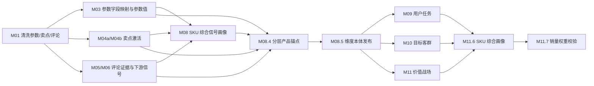

# M08.6 参数-卖点-评论分层产品锚点校准详细设计

## 1. 设计目标

本文把 `M08_6_product_anchor_evidence_layer_requirements.md` 转换为可开发的详细设计。

核心目标：

1. 修正 M03 参数字段映射，避免错误参数污染战场、任务和客群判断。
2. 在 M08.4 建立分层产品锚点索引，明确参数、卖点、评论和市场各自作用。
3. 在 M08.5 发布维度本体时写清楚每个维度的产品锚点、适用边界和分配资格。
4. 为 M09/M10/M11/M11.6/M11.7 提供可解释、可校验的维度分类基础。

## 2. 职责边界

### 2.1 M08.6 修改什么

| 层级 | 修改点 |
| --- | --- |
| M03 | 增加参数映射防误判规则、代理参数映射、字段黑白名单 |
| M08.4 | 增加分层锚点索引和 SKU 级锚点明细 |
| M08.5 | 增加任务、战场、客群的锚点发布规则 |
| API/页面 | 能查看每步产物、执行结果和失败原因 |
| 测试 | 增加误映射、缺卖点、代理参数、评论低质、服务剥离测试 |

### 2.2 M08.6 不做什么

1. 不新增业务结论表替代 M09/M10/M11。
2. 不直接从原始表绕过 M03/M04/M05/M06/M07 做业务判断。
3. 不把卖点写成参数。
4. 不把评论写成参数或卖点。
5. 不为了让战场数量好看而伪造音效、护眼等缺失参数。

## 3. 数据流



## 4. M03 参数映射详细设计

### 4.1 新增映射守卫

在 M03 参数匹配逻辑中增加 `ParamMappingGuard`。

职责：

1. 在 alias/keyword/value_pattern 匹配后做二次校验。
2. 对已知误映射强制返回 unmapped 或 review_required。
3. 对字段名和目标参数语义不一致的结果降级。
4. 对代理参数生成明确 `proxy_for_codes` 元数据。

建议内部结构：

```python
@dataclass(frozen=True)
class ParamMappingGuardRule:
    raw_name_keywords: tuple[str, ...]
    blocked_param_codes: tuple[str, ...]
    allowed_param_codes: tuple[str, ...] = ()
    action: str = "block"  # block, review, downgrade
    reason_code: str = ""
```

### 4.2 必须内置的阻断规则

| raw name keywords | blocked param codes | reason |
| --- | --- | --- |
| `内置WIFI`, `wifi` | `speaker_power_w`, `speaker_channel`, `audio_system` | wifi 不是音响参数 |
| `HDMI数量`, `USB数量`, `屏幕比例`, `屏幕面积`, `整机厚度`, `机身厚度`, `边框` | `color_depth_bit` | 接口/尺寸/结构字段不是色深 |
| `人工智能`, `全屋智控`, `无缝贴墙` | `motion_compensation_flag` | 智能/家居/安装不是运动补偿 |
| `面板刷新率`, `屏幕刷新率` | `panel_type` | 刷新率不是面板类型 |
| `HDR` | `peak_brightness_nits` | HDR 不是亮度数值 |

### 4.3 必须补充的代理映射

| 原始字段 | 标准参数或代理参数 | 用途 |
| --- | --- | --- |
| `背光源`, `背光源细分` | `backlight_type` | 画质、MiniLED、显示技术代理 |
| `HDR` | `hdr_support_flag` 或 `hdr_format_list` | 画质/观影代理 |
| `能效等级` | `energy_efficiency_level` | 性价比、家用节能代理 |
| `HDMI参数` | `hdmi_2_1_ports` 或 `hdmi_capability` | 游戏体育代理 |
| `HDMI数量` | `hdmi_port_count` | 接口丰富度代理 |
| `全面屏` | `full_screen_flag` | 家居设计代理 |
| `SLIM`, `超轻薄`, `机身厚度` | `slim_design_flag`, `body_thickness_mm` | 家居适配代理 |
| `AI大模型` | `ai_model_name` | 智能交互代理 |
| `CPU核数`, `CPU主频`, `IC型号` | `chipset_name`, `cpu_core_count`, `cpu_frequency` | 系统性能代理 |

### 4.4 输出字段约定

M03 不一定新增表，优先在已有字段中写入质量信息：

| 表 | 字段 | 追加内容 |
| --- | --- | --- |
| `core3_param_field_profile` | `review_reason_json` | `mapping_guard_reason_codes`、`blocked_param_codes` |
| `core3_extract_param_value` | `quality_flags_json` | `proxy_param`、`guard_downgraded`、`raw_name_suspect` |
| `core3_sku_param_profile` | `profile_summary_json` | `proxy_param_count`、`blocked_mapping_count`、`suspect_mapping_count` |

如果现有 model 不支持上述字段，可在 service 输出 JSON 中先兼容写入已有 `review_reason_json` 或 `quality_summary_json`。

## 5. M08.4 分层产品锚点设计

### 5.1 内部索引

新增或强化 `ProductAnchorIndexBuilder`。

```python
@dataclass(frozen=True)
class LayeredProductAnchorMatch:
    sku_code: str
    dimension_code: str
    param_anchor_score: Decimal
    proxy_param_anchor_score: Decimal
    claim_anchor_score: Decimal
    comment_validation_score: Decimal
    market_anchor_score: Decimal
    overall_anchor_score: Decimal
    anchor_source_status: str
    param_hits: tuple[ProductAnchorEvidence, ...]
    claim_hits: tuple[ProductAnchorEvidence, ...]
    comment_hits: tuple[ProductAnchorEvidence, ...]
    market_hits: tuple[ProductAnchorEvidence, ...]
    quality_flags: tuple[str, ...]
```

### 5.2 输入读取

M08.4 必须读取：

| 来源 | 表 | 用途 |
| --- | --- | --- |
| 参数值 | `core3_extract_param_value` | 强参数和代理参数锚点 |
| 参数画像 | `core3_sku_param_profile` | 参数质量、缺失和冲突 |
| 基础卖点 | `core3_sku_claim_activation_base` | 结构化卖点、参数支撑卖点 |
| 最终卖点 | `core3_sku_claim_activation` | 下游可用卖点 |
| 评论信号 | `core3_sku_comment_signal_profile`、M06 signals | 评论验证和低质过滤 |
| 市场画像 | `core3_sku_market_profile` | 价格带、销量、可比池位置 |
| SKU 画像 | `core3_sku_signal_profile` | 已汇总的分域摘要 |

禁止直接读取原始 `attribute_data`、`selling_points_data`、`comment_data`。

### 5.3 锚点规则结构

原 `ParamAnchorRule` 扩展为：

```python
@dataclass(frozen=True)
class ParamAnchorRule:
    param_codes: tuple[str, ...]
    strength: str  # required, strong, proxy, weak
    score: Decimal
    min_numeric: Decimal | None = None
    value_keywords: tuple[str, ...] = ()
    invalid_raw_name_keywords: tuple[str, ...] = ()
    valid_raw_name_keywords: tuple[str, ...] = ()
    proxy_for_codes: tuple[str, ...] = ()
    max_score_cap: Decimal | None = None
```

`ClaimAnchorRule` 扩展为：

```python
@dataclass(frozen=True)
class ClaimAnchorRule:
    claim_codes: tuple[str, ...]
    strength: str  # strong, weak, comment_enhanced
    score: Decimal
    min_score: Decimal
    requires_param_support: bool = False
```

### 5.4 战场锚点规则示例

| 战场 | 强参数 | 代理参数 | 卖点 | 评论验证 |
| --- | --- | --- | --- | --- |
| 大屏沉浸画质 | 屏幕尺寸、分辨率、亮度、MiniLED、分区背光、色域 | HDR、背光源、QLED | 大屏、MiniLED、画质、分区控光 | 画质好、清晰、沉浸 |
| 游戏体育流畅 | 原生刷新率、HDMI 2.1、运动补偿 | HDMI 参数、刷新率描述 | 高刷、游戏、低延迟、体育流畅 | 玩游戏、看球、运动不卡 |
| 智能交互易用 | RAM、ROM、CPU、系统、语音、远场语音 | AI 大模型、系统版本 | 智能语音、无广告、长辈友好 | 操作简单、语音方便 |
| 家庭护眼舒适 | 低蓝光、无频闪、护眼认证 | 无稳定代理时为空 | 护眼、儿童模式 | 不刺眼、孩子看 |
| 声画沉浸 | 音响功率、声道、杜比、DTS | 当前数据无稳定代理 | 杜比、影院音效、沉浸音响 | 声音好、影院感 |
| 家居空间适配 | 机身厚度、边框、挂墙、全面屏 | SLIM、超轻薄 | 超薄、全面屏、大屏 | 客厅摆放、挂墙 |

### 5.5 分数计算

SKU 级综合锚点分：

```text
param_part = min(sum(strong_param_hits), 0.55)
proxy_part = min(sum(proxy_param_hits), 0.25)
claim_part = min(sum(claim_hits), 0.35)
comment_part = min(sum(comment_validation_hits), 0.15)
market_part = min(sum(market_hits), 0.15)

overall = clamp(
  param_part
  + proxy_part * 0.70
  + claim_part * claim_multiplier
  + comment_part * comment_multiplier
  + market_part * market_multiplier
)
```

乘数规则：

| 条件 | claim_multiplier | comment_multiplier | market_multiplier |
| --- | ---: | ---: | ---: |
| 有强参数 | 1.00 | 0.80 | 0.60 |
| 只有代理参数 | 0.85 | 0.60 | 0.50 |
| 无参数、有卖点 | 0.65 | 0.50 | 0.40 |
| 只有评论 | 0.00 | 0.35 | 0.00 |

### 5.6 状态判定

| 状态 | 条件 | 下游含义 |
| --- | --- | --- |
| `claim_plus_param` | 有强参数且有卖点 | 可作为强业务证据 |
| `param_only` | 有强参数但无卖点 | 可用于无卖点 SKU 的定位 |
| `proxy_param_only` | 只有代理参数 | 可作为候选或弱支撑 |
| `claim_only` | 有卖点但无参数 | 需复核，不能直接强分配 |
| `comment_validated` | 参数/卖点被评论验证 | 增强支撑，不单独成立 |
| `comment_only` | 只有评论 | 只能候选，不能进入强战场 |
| `no_direct_anchor` | 无可用证据 | 不进入分类或进入缺口复核 |

## 6. M08.5 维度发布设计

### 6.1 价值战场发布

价值战场必须满足：

1. 至少有参数或卖点锚点。
2. 不允许 `comment_only` 进入 `allocation_eligible`。
3. `proxy_param_only` 可进入候选，但需要 review 或 warning。
4. 当前原始参数缺失的战场，例如音效、护眼，允许发布为候选定义，但必须标记参数缺口。

### 6.2 用户任务发布

用户任务必须有产品回链：

```text
用户任务 -> 价值战场或产品锚点 -> 参数/卖点/评论/市场证据
```

M08.5 对 task 输出：

| 字段 | 含义 |
| --- | --- |
| `task_product_anchor_codes` | 可支撑该任务的参数/卖点锚点 |
| `linked_battlefield_codes` | 任务依赖的价值战场 |
| `task_scene_topic_codes` | 评论场景线索 |
| `task_anchor_quality` | 参数、卖点、评论、市场分层质量 |
| `allocation_allowed` | 是否可进入后续权重分配 |

### 6.3 目标客群发布

目标客群允许间接锚点：

```text
目标客群 -> 用户任务 -> 价值战场 -> 产品锚点
```

不得要求每个客群直接有参数，但必须至少满足以下之一：

1. 有明确人群评论线索。
2. 有任务回链。
3. 有价格带、尺寸段、渠道或销量分布支撑。
4. 有明确战场回链。

### 6.4 服务语境隔离

M08.5 必须把安装、物流、售后、客服等定义为 `service_context`：

1. 可用于体验风险。
2. 可用于报告备注。
3. 不进入产品价值战场。
4. 不进入 SKU 销量权重分配。

## 7. API 和页面查看要求

初始化页面和执行结果页需要能展示：

1. 当前模块是否已执行。
2. 当前模块是否可增量跳过。
3. 本次新生成/更新/跳过数量。
4. 每个战场/任务/客群的锚点来源分布。
5. 失败原因和复核原因。
6. 典型 SKU 的参数、卖点、评论证据明细。

展示必须使用业务语言：

| 内部字段 | 页面文案 |
| --- | --- |
| `param_anchor_score` | 参数支撑 |
| `proxy_param_anchor_score` | 相近参数支撑 |
| `claim_anchor_score` | 卖点支撑 |
| `comment_validation_score` | 用户评论验证 |
| `anchor_source_status` | 证据状态 |
| `quality_flags` | 待确认问题 |

## 8. 测试设计

### 8.1 单元测试

1. M03 已知误映射阻断测试。
2. M03 代理参数映射测试。
3. M08.4 `param_only` SKU 测试。
4. M08.4 `claim_plus_param` SKU 测试。
5. M08.4 `claim_only` 降级测试。
6. M08.4 `comment_only` 不进入强战场测试。
7. M08.5 任务回链到产品锚点测试。
8. 服务语境不进入价值战场测试。

### 8.2 集成测试

使用 `local_validation_fixture_v1` 增强 fixture：

| SKU 场景 | 必须覆盖 |
| --- | --- |
| 有参数、有卖点、有评论 | `claim_plus_param` |
| 有参数、无卖点、有评论 | `param_only` |
| 有代理参数、无卖点 | `proxy_param_only` |
| 有卖点、无参数 | `claim_only` |
| 只有评论 | `comment_only` |
| 服务履约评论 | `service_context` |

### 8.3 205 验收查询

205 重跑后检查：

1. 参数误映射样例是否清零。
2. 84 个 SKU 参数画像是否仍覆盖。
3. 有原始卖点 SKU 是否形成卖点支撑。
4. 无原始卖点 SKU 是否能形成参数支撑。
5. 战场、任务、客群 SKU 分布是否有区分度。
6. 音效、护眼等缺参数方向是否正确标记为参数缺口。

## 9. 重跑顺序

修改完成后，205 上必须按顺序重跑：

```text
M03
-> M04a
-> M04b
-> M08
-> M08.4
-> M08.5
-> M09
-> M10
-> M11
-> M11.6
-> M11.7
```

如果 M03 参数映射结果变化，必须视为 M08 以后全部下游受影响。

## 10. 验收口径

通过条件：

1. 页面或 API 能说明每个 SKU 在每个主维度中的证据来源。
2. 没有卖点的 SKU 不再被判定为“无法定位”，而是通过参数和市场形成基础定位。
3. 有卖点的 SKU 不再只靠卖点文本成立，必须能看到参数或评论验证情况。
4. 战场和任务分布不再全量泛化。
5. M11.7 可以校验 SKU 维度和战场/任务/客群维度的销量权重是否对得上。

