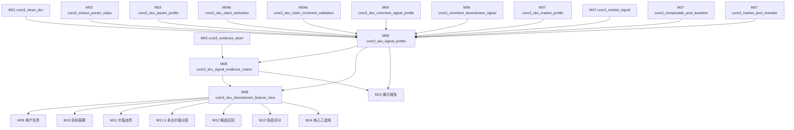
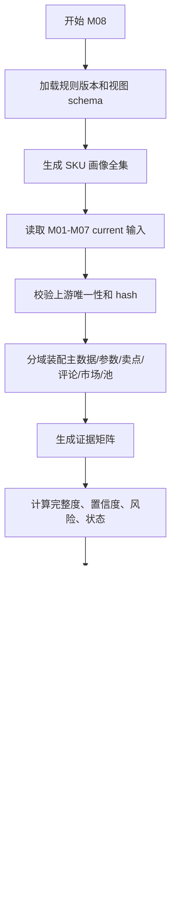

# M08 SKU 综合信号画像详细设计

## 1. 文档定位

本文是 CatForge 彩电核心三竞品 SOP 的 M08 详细设计，承接：

- 需求文档：`docs/core3_mvp/real_data_v2/sop_requirements/M08_sku_signal_profile_requirements.md`
- 总体设计：`docs/core3_mvp/real_data_v2/sop_detailed_design/00_architecture_data_dictionary_design.md`
- 上游 M01：`core3_clean_sku`
- 上游 M02：`core3_evidence_atom`
- 上游 M03：`core3_extract_param_value`、`core3_sku_param_profile`
- 上游 M04b：`core3_sku_claim_activation`、`core3_sku_claim_comment_validation`
- 上游 M06：`core3_sku_comment_signal_profile`、`core3_comment_downstream_signal`
- 上游 M07：`core3_sku_market_profile`、`core3_market_signal`、`core3_comparable_pool_baseline`、`core3_market_pool_member`
- 下游 M09、M10、M11、M11.5、M12、M13、M14、M15、M16

M08 是 SKU 级统一特征装配层。它不重新抽取、不重新解释、不生成新的业务结论，只把上游已经抽取和画像化的参数、卖点、评论、市场、可比池和证据，合并成下游统一入口。

当前真实样例数据中，市场和参数覆盖 35 个型号，评论覆盖 33 个型号，结构化卖点只覆盖 5 个型号。M08 必须支持“部分域缺失但仍可分析”的 SKU，尤其要准确表达 85E7Q 这类“参数强、评论多、市场有、结构化卖点缺失”的画像状态。

## 2. 模块职责

### 2.1 本模块解决什么

M08 解决六类工程问题：

1. 生成每个 SKU 的统一信号画像，作为 M09-M15 的默认特征入口。
2. 将参数、卖点、评论、市场、可比池的覆盖、证据和风险集中表达。
3. 为下游模块提供按模块裁剪后的 `core3_sku_downstream_feature_view`，避免下游各自回读 M03/M04b/M06/M07 散表。
4. 为报告和复核提供 `core3_sku_signal_evidence_matrix`，快速判断每个 SKU 哪些证据可用、哪些证据缺失。
5. 用 `profile_hash` 和 `view_hash` 支撑增量计算，只有画像或模块视图发生变化才触发后续模块重算。
6. 在数据不完整时保留 unknown 和缺失原因，不把缺失解释成业务能力弱。

### 2.2 本模块不解决什么

| 不做事项 | 原因 | 后续模块 |
| --- | --- | --- |
| 不读取原始 `week_sales_data`、`attribute_data`、`selling_points_data`、`comment_data` | M08 必须消费清洗、证据和抽取层结果，不绕过分层 | M00-M07 |
| 不重新抽参数 | 参数标准化和冲突处理已经在 M03 完成 | M03 |
| 不重新激活卖点 | 卖点激活和评论增强已经在 M04b 完成 | M04b |
| 不重新分析评论 | 评论去重、句级 evidence、下游线索已经在 M05/M06 完成 | M05/M06 |
| 不重新计算市场画像 | 市场窗口、分位、可比池已经在 M07 完成 | M07 |
| 不生成用户任务 | M08 只输出任务线索，不做任务推断 | M09 |
| 不生成目标客群 | M08 只输出客群线索，不做客群推断 | M10 |
| 不生成价值战场 | M08 只输出战场支撑信号，不做战场判断 | M11 |
| 不做卖点价值分层 | 分层需要战场上下文 | M11.5 |
| 不召回候选竞品 | M08 只提供可比基础和画像 | M12 |
| 不计算竞品分 | 组件评分和核心三竞品选择在后续模块完成 | M13/M14 |
| 不生成高层报告话术 | M08 可提供业务摘要素材，但报告表达由 M15 负责 | M15 |

### 2.3 允许复用历史结果

允许复用历史 M08 输出，但必须同时满足：

- M01 `core3_clean_sku.clean_hash` 未变化。
- M02 evidence 状态、证据代表集和关键 evidence hash 未变化。
- M03 参数画像 hash 未变化。
- M04b 卖点激活 hash 未变化。
- M06 评论信号画像 hash 未变化。
- M07 市场画像、市场信号和可比池 hash 未变化。
- M08 画像规则版本、字段版本、下游视图 schema 版本未变化。
- 历史记录 `is_current=true` 且 `processing_status` 不是 `failed`、`blocked`。

## 3. 输入输出总览

### 3.1 必须输入

| 输入 | 来源模块 | 表 | 用途 |
| --- | --- | --- | --- |
| SKU 主数据 | M01 | `core3_clean_sku` | SKU、型号、品牌、品类、跨表覆盖 |
| evidence 原子 | M02 | `core3_evidence_atom` | 画像证据矩阵和代表证据 |
| 标准参数明细 | M03 | `core3_extract_param_value` | 核心参数、参数 evidence、关键参数缺口 |
| SKU 参数画像 | M03 | `core3_sku_param_profile` | 参数完整度、unknown、冲突、参数画像 hash |
| 最终卖点激活 | M04b | `core3_sku_claim_activation` | 最终卖点、激活依据、结构化卖点缺失状态 |
| 卖点评论验证 | M04b | `core3_sku_claim_comment_validation` | 卖点体验验证、弱感知、矛盾和证据 |
| 评论信号画像 | M06 | `core3_sku_comment_signal_profile` | 评论质量、七类评论信号摘要 |
| 评论下游信号 | M06 | `core3_comment_downstream_signal` | 任务线索、客群线索、战场支撑、风险等可裁剪信号 |
| 市场画像 | M07 | `core3_sku_market_profile` | 价格、销量、销额、平台、分位、趋势 |
| 市场信号 | M07 | `core3_market_signal` | 价格偏高/偏低、销量强弱、平台重合、样本风险 |
| 可比池基线 | M07 | `core3_comparable_pool_baseline` | 同尺寸、相邻尺寸、同价带、平台重合等池摘要 |
| 可比池成员 | M07 | `core3_market_pool_member` | 可比池成员、相似基础和市场关系 |

### 3.2 明确不消费

| 数据 | 禁止原因 |
| --- | --- |
| 原始四张业务表 | 已由 M00-M02 处理，M08 不得绕过清洗和 evidence |
| M09 用户任务结果 | M08 是 M09 上游 |
| M10 目标客群结果 | M08 是 M10 上游 |
| M11 价值战场结果 | M08 是 M11 上游 |
| M11.5 卖点价值层级 | M08 为其提供卖点、市场和可比池输入 |
| M12-M14 竞品结果 | M08 是竞品召回和评分的上游 |
| M15 报告输出 | M08 提供报告素材，不消费报告 |

### 3.3 输出表

| 输出表 | 粒度 | 下游用途 |
| --- | --- | --- |
| `core3_sku_signal_profile` | SKU + 画像范围 + 特征版本 | SKU 统一画像，供 M09-M15 默认读取 |
| `core3_sku_signal_evidence_matrix` | SKU 画像 + 证据域 + 子域 | 证据覆盖、缺失、风险和代表 evidence |
| `core3_sku_downstream_feature_view` | SKU 画像 + 下游模块 | M09-M15 的裁剪特征视图 |

### 3.4 模块关系



## 4. 画像范围与版本

### 4.1 `profile_scope`

MVP 默认生成一类画像：

| scope | 说明 | 用途 |
| --- | --- | --- |
| `sku_default` | SKU 默认统一画像 | M09-M15 默认读取 |

后续可扩展 `channel_platform_profile`、`period_profile` 等范围，但首版不拆分到平台级画像。当前样例只有线上渠道，平台有专业电商和平台电商，平台信息保存在市场摘要和下游视图中。

### 4.2 `analysis_window`

M08 默认以 M07 的 `full_observed_window` 作为统一画像主窗口，同时把 `latest_week`、`recent_4w`、`recent_8w`、`recent_12w` 放入 `market_recent_windows_json`。

M08 不输出 `12m`、`year_to_date` 等当前数据无法支撑的窗口命名。当前样例只覆盖 `26W01` 到 `26W23`。

### 4.3 `feature_version`

`feature_version` 用于控制字段契约，不等于业务批次。建议首版：

```text
core3_mvp_real_data_v2_m08_v1
```

当字段结构、完整度公式、下游视图 payload schema 或风险规则变化时，必须升级 `feature_version` 或 `view_schema_version`。

## 5. 数据模型设计

### 5.1 通用字段约定

M08 输出表必须包含以下通用字段。

| 字段 | 类型建议 | 必填 | 说明 |
| --- | --- | --- | --- |
| `project_id` | `text` | 是 | 项目 ID |
| `category_code` | `text` | 是 | MVP 为 `TV` |
| `batch_id` | `text` | 是 | M00 批次 ID |
| `run_id` | `text` | 否 | 全链路运行 ID |
| `module_run_id` | `text` | 否 | M08 模块运行 ID |
| `rule_version` | `text` | 是 | M08 规则版本 |
| `feature_version` | `text` | 是 | 特征字段版本 |
| `input_fingerprint` | `text` | 是 | 上游输入 hash |
| `result_hash` | `text` | 是 | 本行结果 hash |
| `is_current` | `boolean` | 是 | 是否当前有效版本 |
| `processing_status` | `text` | 是 | `success`、`warning`、`review_required`、`blocked`、`failed` |
| `review_required` | `boolean` | 是 | 是否需要复核 |
| `review_status` | `text` | 是 | `auto_pass`、`review_required`、`approved`、`rejected`、`waived` |
| `review_reason_json` | `jsonb` | 是 | 复核原因 |
| `created_at` | `timestamptz` | 是 | 创建时间 |
| `updated_at` | `timestamptz` | 是 | 更新时间 |

### 5.2 枚举定义

#### 5.2.1 `profile_status`

```text
ready
limited
review_required
insufficient
blocked
failed
```

含义：

| 状态 | 说明 |
| --- | --- |
| `ready` | 分域数据足以进入下游自动推断 |
| `limited` | 存在非关键缺失，下游可用但需携带风险 |
| `review_required` | 能进入下游，但关键证据缺口或冲突需要人工复核 |
| `insufficient` | 数据不足以支撑主要下游模块自动运行 |
| `blocked` | SKU 主键或关键上游状态异常，不能生成可靠画像 |
| `failed` | 模块运行异常 |

#### 5.2.2 `signal_domain`

```text
sku_master
param
claim
claim_comment_validation
comment
market
pool
quality
downstream_view
```

#### 5.2.3 `coverage_status`

```text
covered
partially_covered
missing
unknown
conflict
not_applicable
```

#### 5.2.4 `for_module`

```text
M09
M10
M11
M11_5
M12
M13
M14
M15
M16
```

MVP 必须生成 M09-M15 视图。M16 视图可作为运维和复核视图，首版可选，但设计中保留。

#### 5.2.5 `confidence_level`

```text
high
medium
low
unknown
```

## 6. 表设计：`core3_sku_signal_profile`

### 6.1 表职责

`core3_sku_signal_profile` 保存 SKU 的统一画像主记录，是 M09-M15 的默认入口。它只保存已装配后的摘要、证据索引、完整度、风险和 hash，不保存下游业务结论。

### 6.2 字段级契约

| 字段 | 类型建议 | 必填 | 来源 | 说明 |
| --- | --- | --- | --- | --- |
| `sku_signal_profile_id` | `uuid` | 是 | M08 | 主键 |
| `project_id` | `text` | 是 | M00 | 项目 ID |
| `category_code` | `text` | 是 | M00/M01 | MVP 为 `TV` |
| `batch_id` | `text` | 是 | M00 | 批次 ID |
| `run_id` | `text` | 否 | M16 | 全链路运行 ID |
| `module_run_id` | `text` | 否 | M08 | 本模块运行 ID |
| `sku_code` | `text` | 是 | M01 | SKU 编码，优先使用清洗后稳定编码 |
| `model_code` | `text` | 否 | M01 | 原始/清洗型号编码，例如 `TV00029115` |
| `model_name` | `text` | 否 | M01 | 型号名，例如 `85E7Q` |
| `brand_name` | `text` | 否 | M01 | 品牌名。当前样例均为海信，但不可用于排除竞品 |
| `profile_scope` | `text` | 是 | M08 | MVP 为 `sku_default` |
| `analysis_window` | `text` | 是 | M07/M08 | MVP 主窗口为 `full_observed_window` |
| `source_coverage_json` | `jsonb` | 是 | M01-M07 | 各输入域覆盖状态和行数 |
| `source_profile_refs_json` | `jsonb` | 是 | M03-M07 | 上游画像 ID、hash、版本 |
| `sku_master_json` | `jsonb` | 是 | M01 | SKU 主数据摘要 |
| `core_params_json` | `jsonb` | 是 | M03 | 核心参数业务摘要 |
| `param_profile_json` | `jsonb` | 是 | M03 | 参数完整度、unknown、冲突、代表证据 |
| `claim_activation_summary_json` | `jsonb` | 是 | M04b | 最终卖点激活摘要 |
| `claim_evidence_breakdown_json` | `jsonb` | 是 | M04b/M02 | 参数、结构化卖点、评论验证拆分 |
| `comment_signal_summary_json` | `jsonb` | 是 | M06 | 七类评论信号摘要 |
| `comment_quality_json` | `jsonb` | 是 | M05/M06 | 去重、低价值、服务占比、信号充分性 |
| `market_summary_json` | `jsonb` | 是 | M07 | 主窗口市场画像 |
| `market_recent_windows_json` | `jsonb` | 是 | M07 | 最近窗口市场摘要 |
| `market_signal_summary_json` | `jsonb` | 是 | M07 | 市场信号摘要 |
| `comparable_pool_summary_json` | `jsonb` | 是 | M07 | 可比池摘要和样本状态 |
| `business_signal_index_json` | `jsonb` | 是 | M08 | 下游可用业务信号索引，不含最终结论 |
| `missing_signals_json` | `jsonb` | 是 | M08 | 缺失信号列表 |
| `risk_signals_json` | `jsonb` | 是 | M08 | 风险信号列表 |
| `domain_completeness_json` | `jsonb` | 是 | M08 | 分域完整度 |
| `data_completeness_score` | `numeric(6,4)` | 是 | M08 | 整体数据完整度，0-1 |
| `domain_confidence_json` | `jsonb` | 是 | M02-M08 | 分域置信度 |
| `confidence` | `numeric(6,4)` | 是 | M08 | 画像置信度，0-1 |
| `confidence_level` | `text` | 是 | M08 | high/medium/low/unknown |
| `profile_status` | `text` | 是 | M08 | ready/limited/review_required/insufficient/blocked/failed |
| `downstream_ready_json` | `jsonb` | 是 | M08 | 对 M09-M15 是否可用及缺失字段 |
| `evidence_summary_json` | `jsonb` | 是 | M08/M02 | 证据计数和代表证据摘要 |
| `representative_evidence_ids` | `uuid[]` | 是 | M02-M07 | 代表 evidence ID，避免保存过大数组 |
| `input_fingerprint` | `text` | 是 | M08 | 上游输入 hash |
| `profile_hash` | `text` | 是 | M08 | 画像业务内容 hash |
| `result_hash` | `text` | 是 | M08 | 表记录 hash，可等于 `profile_hash` 加审计字段 |
| `rule_version` | `text` | 是 | M08 | 规则版本 |
| `feature_version` | `text` | 是 | M08 | 特征字段版本 |
| `is_current` | `boolean` | 是 | M08 | 是否当前版本 |
| `processing_status` | `text` | 是 | M08 | 处理状态 |
| `review_required` | `boolean` | 是 | M08 | 是否复核 |
| `review_status` | `text` | 是 | M08 | 复核状态 |
| `review_reason_json` | `jsonb` | 是 | M08 | 复核原因 |
| `created_at` | `timestamptz` | 是 | M08 | 创建时间 |
| `updated_at` | `timestamptz` | 是 | M08 | 更新时间 |

### 6.3 主键、唯一键和索引

主键：

```sql
primary key (sku_signal_profile_id)
```

唯一键：

```sql
unique (project_id, category_code, batch_id, sku_code, profile_scope, feature_version, profile_hash)
```

当前版本唯一索引：

```sql
create unique index uq_core3_sku_signal_profile_current
on core3_sku_signal_profile(project_id, category_code, batch_id, sku_code, profile_scope, feature_version)
where is_current = true;
```

查询索引：

```sql
create index idx_core3_sku_signal_profile_sku
on core3_sku_signal_profile(project_id, category_code, batch_id, sku_code);

create index idx_core3_sku_signal_profile_status
on core3_sku_signal_profile(project_id, category_code, batch_id, profile_status, review_required);

create index idx_core3_sku_signal_profile_hash
on core3_sku_signal_profile(project_id, category_code, batch_id, profile_hash);

create index idx_core3_sku_signal_profile_json_gin
on core3_sku_signal_profile
using gin (business_signal_index_json jsonb_path_ops);
```

### 6.4 `source_coverage_json` 契约

示例结构：

```json
{
  "sku_master": {"status": "covered", "row_count": 1, "hash": "m01_hash"},
  "param": {"status": "covered", "param_count": 81, "profile_hash": "m03_hash"},
  "claim": {"status": "partially_covered", "structured_claim_count": 0, "activation_count": 12, "profile_hash": "m04b_hash"},
  "comment": {"status": "covered", "raw_rows": 3621, "dedup_comment_count": 1648, "profile_hash": "m06_hash"},
  "market": {"status": "covered", "weekly_rows": 46, "week_range": "26W01-26W23", "profile_hash": "m07_hash"},
  "pool": {"status": "partially_covered", "same_size_pool_count": 6, "adjacent_size_pool_count": 12, "profile_hash": "m07_pool_hash"}
}
```

约束：

- `status` 只能使用 `coverage_status` 枚举。
- `row_count=0` 不等于业务弱，只表示该数据域缺失。
- 对 85E7Q，`claim.structured_claim_count=0` 必须标为 `partially_covered` 或 `missing_structured_claim`，不能生成伪结构化卖点。

### 6.5 `business_signal_index_json` 契约

该字段是下游快速索引，不保存最终任务、客群、战场或竞品结论。

```json
{
  "param_signal_codes": ["screen_size_85", "resolution_4k", "refresh_rate_high", "mini_led", "zone_high"],
  "claim_codes": ["large_screen_immersive", "high_refresh_gaming", "mini_led_picture_quality"],
  "comment_signal_types": ["claim_validation", "task_cue", "target_group_cue", "battlefield_support", "price_perception", "service_signal"],
  "market_signal_codes": ["same_size_high_sales", "high_price_band", "platform_online_professional_ecommerce"],
  "pool_types": ["same_size", "adjacent_size", "same_price_band", "platform_overlap"],
  "risk_codes": ["missing_structured_claim"]
}
```

约束：

- 代码必须来自上游标准化结果或 M08 规则映射，不得在 M08 手写业务结论。
- 这些代码只是检索和裁剪入口，不能被 M15 直接展示给业务高层。

## 7. 表设计：`core3_sku_signal_evidence_matrix`

### 7.1 表职责

`core3_sku_signal_evidence_matrix` 保存每个 SKU 画像在不同证据域上的覆盖、缺口、代表 evidence 和置信度。下游模块用它判断某个推断能否被证据支撑，M15 用它生成“为什么可信”和“哪些数据缺口需要复核”。

### 7.2 字段级契约

| 字段 | 类型建议 | 必填 | 来源 | 说明 |
| --- | --- | --- | --- | --- |
| `sku_signal_evidence_matrix_id` | `uuid` | 是 | M08 | 主键 |
| `sku_signal_profile_id` | `uuid` | 是 | M08 | 关联 `core3_sku_signal_profile` |
| `project_id` | `text` | 是 | M00 | 项目 ID |
| `category_code` | `text` | 是 | M00/M01 | 品类 |
| `batch_id` | `text` | 是 | M00 | 批次 |
| `sku_code` | `text` | 是 | M01 | SKU |
| `domain` | `text` | 是 | M08 | `signal_domain` |
| `sub_domain` | `text` | 是 | M08 | 例如 `picture_quality`、`game_sports`、`price`、`same_size_pool` |
| `feature_code` | `text` | 否 | M03-M07 | 关联参数、卖点、评论信号或市场信号代码 |
| `evidence_role` | `text` | 是 | M08 | `source`、`support`、`validation`、`risk`、`gap`、`representative` |
| `coverage_status` | `text` | 是 | M08 | covered/partially_covered/missing/unknown/conflict/not_applicable |
| `evidence_count` | `integer` | 是 | M02-M07 | 证据数量 |
| `high_confidence_count` | `integer` | 是 | M02-M07 | 高置信证据数量 |
| `medium_confidence_count` | `integer` | 是 | M02-M07 | 中置信证据数量 |
| `low_confidence_count` | `integer` | 是 | M02-M07 | 低置信证据数量 |
| `representative_evidence_ids` | `uuid[]` | 是 | M02-M07 | 代表 evidence，限制数量 |
| `evidence_query_json` | `jsonb` | 是 | M08 | 回查 evidence 的条件，不用保存全部 ID |
| `source_record_refs_json` | `jsonb` | 是 | M02-M07 | 上游记录 ID 和 hash |
| `missing_flag` | `boolean` | 是 | M08 | 是否缺失 |
| `missing_reason_code` | `text` | 否 | M08 | 缺失原因 |
| `risk_flags_json` | `jsonb` | 是 | M08 | 风险码列表 |
| `domain_confidence` | `numeric(6,4)` | 是 | M08 | 证据域置信度 |
| `review_required` | `boolean` | 是 | M08 | 是否复核 |
| `review_reason_json` | `jsonb` | 是 | M08 | 复核原因 |
| `rule_version` | `text` | 是 | M08 | 规则版本 |
| `feature_version` | `text` | 是 | M08 | 特征版本 |
| `input_fingerprint` | `text` | 是 | M08 | 输入 hash |
| `result_hash` | `text` | 是 | M08 | 结果 hash |
| `is_current` | `boolean` | 是 | M08 | 是否当前版本 |
| `created_at` | `timestamptz` | 是 | M08 | 创建时间 |
| `updated_at` | `timestamptz` | 是 | M08 | 更新时间 |

### 7.3 主键、唯一键和索引

主键：

```sql
primary key (sku_signal_evidence_matrix_id)
```

唯一键：

```sql
unique (
  sku_signal_profile_id,
  domain,
  sub_domain,
  evidence_role,
  feature_version
)
```

说明：如果后续需要允许 `feature_code` 为空但仍按空值归一去重，应使用表达式唯一索引，例如 `coalesce(feature_code, '')`，不要直接写成表级 unique 约束。

当前版本索引：

```sql
create index idx_core3_sku_signal_evidence_matrix_profile
on core3_sku_signal_evidence_matrix(sku_signal_profile_id, domain, sub_domain);

create index idx_core3_sku_signal_evidence_matrix_sku_domain
on core3_sku_signal_evidence_matrix(project_id, category_code, batch_id, sku_code, domain);

create index idx_core3_sku_signal_evidence_matrix_missing
on core3_sku_signal_evidence_matrix(project_id, category_code, batch_id, missing_flag, review_required);

create index idx_core3_sku_signal_evidence_matrix_ids_gin
on core3_sku_signal_evidence_matrix
using gin (representative_evidence_ids);
```

### 7.4 证据域最低输出要求

每个 SKU 至少输出以下矩阵行，缺失也要输出缺失行。

| domain | sub_domain | 要求 |
| --- | --- | --- |
| `sku_master` | `identity` | SKU、型号、品牌、品类稳定性 |
| `param` | `core_params` | 核心参数覆盖 |
| `param` | `param_quality` | unknown、冲突、口径不明 |
| `claim` | `structured_claim` | 结构化卖点覆盖 |
| `claim` | `final_claim_activation` | 最终卖点激活 |
| `claim_comment_validation` | `perception_validation` | 评论体验验证 |
| `comment` | `claim_validation` | 卖点验证类评论信号 |
| `comment` | `task_cue` | 用户任务线索 |
| `comment` | `target_group_cue` | 客群线索 |
| `comment` | `battlefield_support` | 战场支撑线索 |
| `comment` | `pain_point` | 痛点和风险 |
| `comment` | `price_perception` | 价格价值感 |
| `comment` | `service_signal` | 服务体验 |
| `market` | `price` | 价格和价格带 |
| `market` | `sales` | 销量和销额 |
| `market` | `platform` | 平台覆盖 |
| `market` | `trend` | 趋势和窗口 |
| `pool` | `same_size` | 同尺寸池 |
| `pool` | `adjacent_size` | 相邻尺寸池 |
| `pool` | `same_price_band` | 同价带池 |
| `quality` | `profile_risk` | 画像风险总览 |

## 8. 表设计：`core3_sku_downstream_feature_view`

### 8.1 表职责

`core3_sku_downstream_feature_view` 是下游模块读取 M08 的标准视图。它把同一份 SKU 画像裁剪成 M09、M10、M11、M11.5、M12、M13、M14、M15 需要的特征范围。

MVP 可以先用 JSONB 实现视图 payload，但每个模块的输入边界必须固定，不能让下游继续按需拼散表。

### 8.2 字段级契约

| 字段 | 类型建议 | 必填 | 来源 | 说明 |
| --- | --- | --- | --- | --- |
| `sku_downstream_feature_view_id` | `uuid` | 是 | M08 | 主键 |
| `sku_signal_profile_id` | `uuid` | 是 | M08 | 关联画像 |
| `project_id` | `text` | 是 | M00 | 项目 ID |
| `category_code` | `text` | 是 | M00/M01 | 品类 |
| `batch_id` | `text` | 是 | M00 | 批次 |
| `sku_code` | `text` | 是 | M01 | SKU |
| `for_module` | `text` | 是 | M08 | M09/M10/M11/M11_5/M12/M13/M14/M15/M16 |
| `view_role` | `text` | 是 | M08 | `primary_input`、`candidate_input`、`scoring_input`、`report_input`、`audit_input` |
| `view_schema_version` | `text` | 是 | M08 | 视图 payload schema |
| `required_feature_codes_json` | `jsonb` | 是 | M08 | 下游必需特征列表 |
| `optional_feature_codes_json` | `jsonb` | 是 | M08 | 下游可选特征列表 |
| `feature_payload_json` | `jsonb` | 是 | M08 | 裁剪后的模块特征 |
| `feature_quality_flags_json` | `jsonb` | 是 | M08 | 特征风险 |
| `required_missing_fields_json` | `jsonb` | 是 | M08 | 必需但缺失字段 |
| `optional_missing_fields_json` | `jsonb` | 是 | M08 | 可选缺失字段 |
| `evidence_ids` | `uuid[]` | 是 | M02-M08 | 该模块视图代表 evidence |
| `evidence_matrix_refs_json` | `jsonb` | 是 | M08 | 对应证据矩阵行 |
| `profile_hash` | `text` | 是 | M08 | 依赖画像 hash |
| `view_hash` | `text` | 是 | M08 | 视图 hash |
| `dependency_hash_json` | `jsonb` | 是 | M08 | 依赖上游 hash |
| `ready_for_module` | `boolean` | 是 | M08 | 是否可被该模块自动消费 |
| `block_reason_json` | `jsonb` | 是 | M08 | 阻塞原因 |
| `review_required` | `boolean` | 是 | M08 | 是否复核 |
| `review_reason_json` | `jsonb` | 是 | M08 | 复核原因 |
| `rule_version` | `text` | 是 | M08 | 规则版本 |
| `feature_version` | `text` | 是 | M08 | 特征版本 |
| `input_fingerprint` | `text` | 是 | M08 | 输入 hash |
| `result_hash` | `text` | 是 | M08 | 结果 hash |
| `is_current` | `boolean` | 是 | M08 | 是否当前版本 |
| `created_at` | `timestamptz` | 是 | M08 | 创建时间 |
| `updated_at` | `timestamptz` | 是 | M08 | 更新时间 |

### 8.3 主键、唯一键和索引

主键：

```sql
primary key (sku_downstream_feature_view_id)
```

唯一键：

```sql
unique (
  sku_signal_profile_id,
  for_module,
  view_role,
  view_schema_version,
  view_hash
)
```

当前版本唯一索引：

```sql
create unique index uq_core3_sku_downstream_feature_view_current
on core3_sku_downstream_feature_view(
  project_id,
  category_code,
  batch_id,
  sku_code,
  for_module,
  view_role,
  view_schema_version
)
where is_current = true;
```

查询索引：

```sql
create index idx_core3_sku_downstream_feature_view_module
on core3_sku_downstream_feature_view(project_id, category_code, batch_id, for_module, ready_for_module);

create index idx_core3_sku_downstream_feature_view_profile_hash
on core3_sku_downstream_feature_view(project_id, category_code, batch_id, profile_hash, view_hash);

create index idx_core3_sku_downstream_feature_view_payload_gin
on core3_sku_downstream_feature_view
using gin (feature_payload_json jsonb_path_ops);
```

## 9. 分域装配规则

### 9.1 SKU 主数据装配

以 M01 `core3_clean_sku` 为主，生成 `sku_master_json`。

必须包含：

- `sku_code`
- `model_code`
- `model_name`
- `brand_name`
- `category_code`
- `source_tables`
- `source_coverage`
- `sku_identity_confidence`

规则：

1. `sku_code` 缺失或不稳定时，`profile_status=blocked`。
2. `model_code`、`model_name`、`brand_name` 缺失时，不阻塞画像，但进入 `missing_signals_json`。
3. 同一 SKU 主数据冲突时，写入 `risk_signals_json` 的 `sku_master_conflict`。
4. 当前数据全为海信，M08 只记录品牌事实，不做“内部/外部竞品”判断。

### 9.2 参数画像装配

从 M03 读取 `core3_sku_param_profile` 和必要的 `core3_extract_param_value`。

`core_params_json` 必须尽量覆盖：

| 参数组 | 典型参数 | 下游用途 |
| --- | --- | --- |
| 尺寸 | 屏幕尺寸、尺寸段 | 可比池、用户任务、竞品召回 |
| 画质 | 分辨率、Mini LED/OLED/QLED、亮度、分区、HDR | 卖点、战场、评分 |
| 运动和游戏 | 刷新率、VRR、HDMI2.1、HDMI 数量 | 用户任务、游戏体育战场 |
| 音频 | 扬声器功率、音效、声道 | 影音任务、战场 |
| 智能系统 | 芯片、RAM、ROM、AI 大模型、语音 | 智能体验、客群 |
| 护眼 | 护眼认证、低蓝光、频闪 | 家庭和健康场景 |
| 外观安装 | 全面屏、挂装、厚度 | 客厅/安装相关线索 |

规则：

1. M08 不从原始属性文本重新解析参数。
2. `unknown` 参数保留 `unknown`，不得转换为 `false`。
3. 参数冲突不静默覆盖，继承 M03 冲突状态。
4. 参数证据只收代表 evidence，不把每个属性证据全部塞入主画像。
5. 对 85E7Q，必须能在 `core_params_json` 中表达 85 英寸、4K、300HZ、Mini LED、5200 亮度、3500 分区、HDMI2.1、4GB/64GB、海信星海。

### 9.3 卖点画像装配

从 M04b 读取最终卖点和评论验证结果。

`claim_activation_summary_json` 必须包含：

- `activated_claim_count`
- `high_confidence_claim_count`
- `medium_confidence_claim_count`
- `low_confidence_claim_count`
- `unknown_claim_count`
- `top_claims`
- `activation_basis_distribution`
- `perception_status_distribution`
- `missing_structured_claim`
- `claim_profile_status`

`claim_evidence_breakdown_json` 必须保留三类证据拆分：

| 证据类型 | 来源 | 说明 |
| --- | --- | --- |
| 参数支撑 | M03/M04b | 参数能支撑某类技术能力 |
| 结构化卖点支撑 | M04a/M04b | 原始卖点文本和标准卖点激活 |
| 评论体验验证 | M04b/M06 | 用户评论是否感知或验证该卖点 |

规则：

1. 结构化卖点缺失时，必须输出 `missing_structured_claim`。
2. 结构化卖点缺失不等于“没有卖点”，只能降低宣传证据完整度。
3. `param_only` 卖点可以进入画像，但必须在证据拆分中显示缺少结构化卖点支撑。
4. `comment_only_hint` 只能作为体验线索，不能在 M08 升级成最终强卖点。
5. 对 85E7Q，不得伪造结构化卖点证据；可表达技术型 `param_only` 基础和评论体验验证。

### 9.4 评论画像装配

从 M06 读取 `core3_sku_comment_signal_profile` 和 `core3_comment_downstream_signal`。

`comment_signal_summary_json` 必须保留七类信号：

| 信号类型 | 下游模块 | M08 表达 |
| --- | --- | --- |
| `claim_validation` | M04b/M11.5/M15 | 卖点是否被用户感知 |
| `task_cue` | M09 | 任务候选线索，不是最终任务 |
| `target_group_cue` | M10 | 客群线索，不是最终客群 |
| `battlefield_support` | M11 | 战场支撑线索，不是最终战场 |
| `pain_point` | M10/M11/M13/M15 | 负向体验和风险 |
| `price_perception` | M09/M10/M13/M15 | 价格和价值感 |
| `service_signal` | M10/M15 | 送装维保等服务信号 |

`comment_quality_json` 必须包含：

- `raw_comment_row_count`
- `dedup_comment_id_count`
- `dedup_body_hash_count`
- `effective_sentence_count`
- `low_value_ratio`
- `service_signal_ratio`
- `sentiment_distribution`
- `empty_sentiment_count`
- `comment_quality_status`

规则：

1. M08 只能消费 M05/M06 去重后的评论口径。
2. 原始评论维度只作为弱标签，不得直接生成任务、客群或战场。
3. 情感为空保留 `unknown`，不得当作中立。
4. 评论重复、服务占比高、低价值占比高必须进入风险。
5. 对 85E7Q，必须表达 3621 行评论和 1648 个去重评论 ID，并区分画质、看球/运动、音效、价格、智能、服务等线索。

### 9.5 市场画像装配

从 M07 读取市场画像、市场信号和可比池。

`market_summary_json` 必须包含：

- `analysis_window`
- `week_range`
- `valid_week_count`
- `price_weighted_avg`
- `price_latest`
- `sales_volume_total`
- `sales_amount_total`
- `platform_share`
- `price_percentile`
- `sales_volume_percentile`
- `sales_amount_percentile`
- `trend_status`
- `sample_status`

`market_recent_windows_json` 保存 M07 其他窗口摘要：

- `latest_week`
- `recent_4w`
- `recent_8w`
- `recent_12w`

规则：

1. 当前真实数据只有 `26W01` 到 `26W23`，不得输出 12 个月结论。
2. 当前渠道只有线上，M08 只表达线上和平台事实，不推断线下表现。
3. 市场样本不足、最新周缺口、销量或销额缺失必须进入 `market_sample_limited` 或 `market_missing`。
4. 市场信号只作为下游输入，不在 M08 解释成竞品结论。

### 9.6 可比池摘要装配

从 M07 `core3_comparable_pool_baseline` 和 `core3_market_pool_member` 汇总。

`comparable_pool_summary_json` 必须包含：

| 字段 | 说明 |
| --- | --- |
| `same_size_pool` | 同尺寸池摘要 |
| `adjacent_size_pool` | 相邻尺寸池摘要 |
| `same_price_band_pool` | 同价带池摘要 |
| `size_price_band_pool` | 尺寸价格带交叉池摘要 |
| `platform_overlap_pool` | 平台重合池摘要 |
| `market_active_pool` | 市场活跃池摘要 |
| `pool_sample_status` | 各池样本状态 |
| `representative_pool_member_refs` | 代表成员引用，不保存完整候选结论 |

规则：

1. 可比池不等于候选竞品池，M08 不输出候选排序。
2. 当前样例全为海信，同品牌 SKU 也保留在池中。
3. 可比池样本不足时保留 `comparable_pool_insufficient`。
4. 对 85E7Q，必须能表达 85 寸同尺寸池和 75/100 相邻尺寸池。

## 10. 完整度、置信度和状态规则

### 10.1 整体完整度

首版公式：

```text
data_completeness_score =
  sku_master_completeness * 0.10
  + param_completeness * 0.25
  + claim_completeness * 0.20
  + comment_completeness * 0.20
  + market_completeness * 0.25
```

完整度只表达数据可用性，不直接表达业务能力强弱。

### 10.2 分域完整度

| 维度 | 计算口径 | 降分但不否定能力的情形 |
| --- | --- | --- |
| `sku_master_completeness` | SKU、型号、品牌、品类、跨表映射稳定性 | 型号名缺失、品牌缺失 |
| `param_completeness` | 核心参数覆盖率、unknown 率、冲突率、M03 置信度 | 参数 unknown 高、刷新率/HDMI 口径不明 |
| `claim_completeness` | 结构化卖点覆盖、最终卖点激活、评论验证、证据拆分完整度 | 缺结构化卖点、只有 `param_only` |
| `comment_completeness` | 去重评论数、有效句数、信号类型覆盖、低价值率 | 评论重复高、服务信号占比高 |
| `market_completeness` | 有效周数、价格/销量/销额、平台、分位、可比池 | 样本周少、可比池不足 |

### 10.3 `claim_completeness` 特别规则

结构化卖点只覆盖 5 个型号，因此不能把“缺结构化卖点”处理成“无卖点能力”。建议首版：

```text
claim_completeness =
  structured_claim_availability * 0.35
  + final_claim_activation_availability * 0.30
  + comment_validation_availability * 0.20
  + claim_evidence_breakdown_integrity * 0.15
```

其中：

- `structured_claim_availability=1.0`：有结构化卖点。
- `structured_claim_availability=0.0`：无结构化卖点。
- `final_claim_activation_availability` 可由 `param_only`、`param_and_promo`、`comment_enhanced` 等激活结果支撑。
- 对无结构化卖点但参数和评论充分的 SKU，`claim_completeness` 应降低但不为 0。

### 10.4 置信度

建议首版：

```text
confidence =
  data_completeness_score * 0.45
  + weighted_domain_confidence * 0.35
  + evidence_quality_score * 0.20
  - risk_penalty
```

`risk_penalty` 上限建议 0.20，避免某个风险把画像完全打穿。

置信等级：

| 等级 | 条件 |
| --- | --- |
| `high` | `confidence >= 0.80` |
| `medium` | `0.60 <= confidence < 0.80` |
| `low` | `0.35 <= confidence < 0.60` |
| `unknown` | `confidence < 0.35` 或关键输入不可用 |

### 10.5 `profile_status` 判定

| 状态 | 判定条件 |
| --- | --- |
| `ready` | 完整度 ≥ 0.80，置信度 ≥ 0.75，无阻塞风险 |
| `limited` | 完整度 0.60-0.80，或缺一个非关键域，但下游可用 |
| `review_required` | 高销量/目标 SKU 缺结构化卖点、关键参数冲突、评论/市场风险明显 |
| `insufficient` | 完整度 < 0.45，或参数/市场/评论中两个以上关键域缺失 |
| `blocked` | 无稳定 SKU 主键、当前画像依赖上游失败、证据无法回溯 |
| `failed` | 任务执行异常 |

85E7Q 预期应为 `limited` 或 `review_required`，原因是结构化卖点缺失但参数、评论、市场可支撑 MVP 分析。

## 11. 风险和缺失信号

### 11.1 标准风险码

| 风险码 | 来源 | 触发条件 | 下游影响 |
| --- | --- | --- | --- |
| `missing_structured_claim` | M04a/M04b | 结构化卖点行数为 0 | M11.5/M15 必须说明宣传证据缺口 |
| `param_unknown_high` | M03 | 核心参数 unknown 率高于阈值 | M09/M11/M13 降低参数证据权重 |
| `param_conflict` | M03 | 同一标准参数多值冲突 | 进入复核 |
| `comment_low_value_high` | M05/M06 | 低价值评论占比高 | M09-M11 评论线索降权 |
| `comment_service_dominant` | M05/M06 | 服务评论占比过高 | M10/M15 需要提示服务噪声 |
| `comment_signal_insufficient` | M06 | 有效信号类型不足 | M09-M11 不能过度推断 |
| `market_sample_limited` | M07 | 有效周数或关键指标不足 | M12/M13 市场评分降权 |
| `market_missing` | M07 | 无有效市场画像 | M12/M13 可能不可用 |
| `comparable_pool_insufficient` | M07 | 可比池成员少于阈值 | M12/M13 候选召回受限 |
| `evidence_low_confidence` | M02-M07 | 核心证据低置信占比高 | 下游复核 |
| `source_profile_conflict` | M08 | 上游 current 记录重复或 hash 冲突 | 阻塞或复核 |

### 11.2 缺失不是负向结论

M08 必须严格遵守：

- 缺结构化卖点：表示宣传卖点证据缺口，不表示产品无卖点。
- 参数 unknown：表示参数未知，不表示该能力不存在。
- 评论缺失：表示用户体验证据不足，不表示用户不关注。
- 市场缺失：表示该渠道/窗口无可用数据，不表示卖得不好。
- 可比池不足：表示当前样本覆盖有限，不表示没有竞品。

## 12. 下游特征视图设计

### 12.1 M09 用户任务视图

`for_module='M09'`，`view_role='primary_input'`。

必需特征：

| 特征 | 来源 | 说明 |
| --- | --- | --- |
| `task_relevant_params` | M03/M08 | 尺寸、画质、刷新率、音频、智能、护眼 |
| `activated_claims` | M04b/M08 | 最终卖点和激活依据 |
| `task_cue_comment_signals` | M06/M08 | 评论中的任务线索 |
| `price_perception_signals` | M06/M08 | 价格价值感 |
| `market_position` | M07/M08 | 价格带、销量分位、平台 |
| `risk_signals` | M08 | 缺失和风险 |
| `evidence_refs` | M08 | 代表证据 |

M09 不得直接读取 M03/M04b/M06/M07 散表，除非通过 M08 evidence 回溯做审计。

### 12.2 M10 目标客群视图

`for_module='M10'`，`view_role='primary_input'`。

必需特征：

| 特征 | 来源 | 说明 |
| --- | --- | --- |
| `sku_master` | M01/M08 | SKU、型号、品牌、尺寸 |
| `target_group_cue_comment_signals` | M06/M08 | 客群线索 |
| `task_related_profile_refs` | M09/M10 | M10 后续结合 M09 结果 |
| `price_band` | M07/M08 | 价格带和价值感 |
| `platform_share` | M07/M08 | 平台侧用户触点 |
| `service_signal` | M06/M08 | 安装、物流、售后体验 |
| `risk_signals` | M08 | 评论噪声、缺失等 |

M08 不生成最终客群，只提供客群推断前的统一 SKU 背景和评论线索。

### 12.3 M11 价值战场视图

`for_module='M11'`，`view_role='primary_input'`。

必需特征：

| 特征 | 来源 | 说明 |
| --- | --- | --- |
| `activated_claims` | M04b/M08 | 参与战场推断的卖点 |
| `battlefield_support_comment_signals` | M06/M08 | 评论战场支撑 |
| `market_signal_summary` | M07/M08 | 销量、销额、价格、样本 |
| `param_capability_summary` | M03/M08 | 技术能力基础 |
| `risk_signals` | M08 | 证据缺口和风险 |
| `evidence_refs` | M08 | 代表证据 |

M11 负责判断价值战场。M08 只能提供“可能支撑战场的信号”，不能输出“游戏体育战场”等最终结论。

### 12.4 M11.5 卖点价值分层视图

`for_module='M11_5'`，`view_role='primary_input'`。

必需特征：

| 特征 | 来源 | 说明 |
| --- | --- | --- |
| `activated_claims` | M04b/M08 | 候选卖点 |
| `claim_evidence_breakdown` | M04b/M08 | 参数/宣传/评论证据拆分 |
| `comment_validation` | M04b/M06/M08 | 用户感知强弱 |
| `market_baseline` | M07/M08 | 市场规模和分位 |
| `comparable_pool_summary` | M07/M08 | 同尺寸/同价/平台池 |
| `risk_signals` | M08 | 缺结构化卖点、评论弱感知等 |

M11.5 仍需结合 M11 战场结果。M08 不输出卖点 PSI/SSI/机会层级。

### 12.5 M12 候选召回视图

`for_module='M12'`，`view_role='candidate_input'`。

必需特征：

| 特征 | 来源 | 说明 |
| --- | --- | --- |
| `sku_comparable_keys` | M03/M07/M08 | 尺寸、价格带、平台、市场活跃度 |
| `param_similarity_basis` | M03/M08 | 参数相似基础 |
| `claim_similarity_basis` | M04b/M08 | 卖点相似基础 |
| `comment_similarity_basis` | M06/M08 | 评论信号相似基础 |
| `market_similarity_basis` | M07/M08 | 市场和平台相似基础 |
| `comparable_pool_summary` | M07/M08 | 可比池入口 |
| `risk_signals` | M08 | 可比池不足、证据缺口 |

M12 可以读取 M07 可比池成员明细，但必须以 M08 画像作为候选召回的 SKU 统一特征入口。

### 12.6 M13 竞品评分视图

`for_module='M13'`，`view_role='scoring_input'`。

必需特征：

| 特征 | 来源 | 说明 |
| --- | --- | --- |
| `param_profile` | M03/M08 | 参数组件评分输入 |
| `claim_profile` | M04b/M08 | 卖点组件评分输入 |
| `comment_signal_summary` | M06/M08 | 评论组件评分输入 |
| `market_summary` | M07/M08 | 市场组件评分输入 |
| `pool_membership_summary` | M07/M08 | 可比池关系 |
| `evidence_completeness` | M08 | 证据完整度 |
| `risk_signals` | M08 | 评分降权或复核 |

M13 对 pair 评分时需要目标 SKU 和候选 SKU 的 M08 视图。M08 不生成 pair，也不生成分数。

### 12.7 M14 核心三选择视图

`for_module='M14'`，`view_role='selection_input'`。

必需特征：

| 特征 | 来源 | 说明 |
| --- | --- | --- |
| `sku_profile_summary` | M08 | 目标和候选 SKU 画像摘要 |
| `evidence_completeness` | M08 | 证据完整度和复核状态 |
| `risk_signals` | M08 | 选择解释中的风险 |
| `market_and_pool_basis` | M07/M08 | 市场和可比池基础 |

M14 最终仍以 M13 pair 评分、M11 战场分和 M11.5 卖点分层为主。M08 只提供画像和证据背景。

### 12.8 M15 展示报告视图

`for_module='M15'`，`view_role='report_input'`。

必需特征：

| 特征 | 来源 | 说明 |
| --- | --- | --- |
| `business_readable_sku_profile` | M08 | 业务可读画像素材 |
| `evidence_matrix_summary` | M08 | 为什么可信、证据覆盖 |
| `missing_and_risk_summary` | M08 | 缺口和复核说明 |
| `representative_evidence_refs` | M08 | 代表证据 |
| `source_coverage_summary` | M08 | 数据来源覆盖 |

M15 展示时不得直接展示 `claim_activation_summary_json`、`business_signal_index_json` 这类内部字段名。它应转成业务语言，例如“85 寸大屏、Mini LED 高亮高分区、运动画面能力、线上销售表现、用户评论感知”等。

## 13. 处理流程

### 13.1 总流程



### 13.2 SKU 画像全集

SKU universe 使用以下并集：

1. M01 `core3_clean_sku` 当前批次有效 SKU。
2. M03 有参数画像但 M01 主数据缺失的 SKU。
3. M04b 有卖点激活但 M01 主数据缺失的 SKU。
4. M06 有评论画像但 M01 主数据缺失的 SKU。
5. M07 有市场画像或可比池但 M01 主数据缺失的 SKU。

规则：

- 正常情况以 M01 为准。
- 若某 SKU 只出现在上游抽取表但不在 M01，仍生成 `blocked` 或 `review_required` 画像，用于暴露数据链路问题。
- 当前样例预期至少覆盖 35 个市场/参数型号；评论只有 33 个型号时，缺评论 SKU 也要有画像。

### 13.3 上游输入校验

对每个 SKU 校验：

| 校验 | 异常处理 |
| --- | --- |
| 每个上游表最多一个 current 主画像 | 多条 current 进入 `source_profile_conflict` |
| 上游记录 feature_version 可识别 | 不可识别则 `review_required` |
| 上游 hash 非空 | 非空失败则 `review_required` |
| 上游 processing_status 非 failed | failed 则该域 `missing` 或 `blocked` |
| evidence 可回溯 | 回溯失败则 `evidence_low_confidence` |

### 13.4 装配伪代码

```python
def build_sku_signal_profiles(project_id, category_code, batch_id, sku_codes=None, force=False):
    config = load_m08_config()
    sku_universe = build_sku_universe(project_id, category_code, batch_id, sku_codes)

    for sku_code in sku_universe:
        inputs = load_current_inputs(project_id, category_code, batch_id, sku_code)
        validation = validate_input_contracts(inputs)
        input_fingerprint = hash_inputs(inputs, config)

        if not force and current_profile_hash_unchanged(sku_code, input_fingerprint, config):
            continue

        domain_payloads = {
            "sku_master": assemble_sku_master(inputs.clean_sku, validation),
            "param": assemble_param_profile(inputs.param_profile, inputs.param_values),
            "claim": assemble_claim_profile(inputs.claim_activation, inputs.claim_validation),
            "comment": assemble_comment_profile(inputs.comment_profile, inputs.comment_signals),
            "market": assemble_market_profile(inputs.market_profiles, inputs.market_signals),
            "pool": assemble_pool_profile(inputs.pool_baselines, inputs.pool_members)
        }

        evidence_matrix = build_evidence_matrix(sku_code, domain_payloads, inputs.evidence_atoms)
        completeness = calculate_domain_completeness(domain_payloads, evidence_matrix)
        risks = calculate_risk_signals(domain_payloads, completeness, validation)
        confidence = calculate_profile_confidence(completeness, evidence_matrix, risks)
        status = decide_profile_status(completeness, confidence, risks, validation)

        profile = compose_profile(
            sku_code=sku_code,
            domain_payloads=domain_payloads,
            evidence_matrix=evidence_matrix,
            completeness=completeness,
            risks=risks,
            confidence=confidence,
            status=status,
            input_fingerprint=input_fingerprint,
            config=config
        )

        feature_views = build_downstream_feature_views(profile, evidence_matrix, config)
        persist_profile_matrix_and_views(profile, evidence_matrix, feature_views)
        emit_downstream_invalidation_if_changed(profile, feature_views)
```

## 14. 增量策略

### 14.1 输入指纹

`input_fingerprint` 由以下内容稳定 hash：

- M01 SKU 主数据 hash。
- M02 代表 evidence hash 和 evidence 状态 hash。
- M03 参数画像 hash 和核心参数值 hash。
- M04b 卖点激活 hash 和卖点评论验证 hash。
- M06 评论信号画像 hash 和下游信号 hash。
- M07 市场画像 hash、市场信号 hash、可比池 hash。
- M08 配置版本、完整度公式版本、下游视图 schema 版本。

### 14.2 `profile_hash`

`profile_hash` 覆盖业务内容：

- 主数据摘要。
- 分域画像 JSON。
- 完整度、置信度、状态。
- 风险和缺失。
- 证据矩阵摘要。
- 下游 ready 状态。

`created_at`、`updated_at`、`module_run_id` 不参与 `profile_hash`。

### 14.3 变化传播

| 输入变化 | M08 动作 | 下游影响 |
| --- | --- | --- |
| M01 SKU 主数据变化 | 重算主数据和覆盖 | M08-M16 |
| M02 evidence 状态变化 | 更新证据矩阵、置信度、代表证据 | M09-M16 |
| M03 参数画像变化 | 重算参数摘要、完整度、下游视图 | M09-M16 |
| M04b 卖点激活变化 | 重算卖点摘要和证据拆分 | M09-M16 |
| M06 评论信号变化 | 重算评论摘要、风险、下游视图 | M09-M16 |
| M07 市场画像或可比池变化 | 重算市场摘要、池摘要、视图 | M09-M16 |
| M08 规则版本变化 | 全量重算 M08 | M09-M16 |

如果 `profile_hash` 不变且相关 `view_hash` 不变，不触发下游重算。

### 14.4 版本写入规则

写入时采用插入新版本、关闭旧版本：

1. 查询当前 `is_current=true` 画像。
2. 若 `profile_hash` 相同，只更新运行审计，不插入新业务版本。
3. 若 `profile_hash` 不同，将旧记录 `is_current=false`。
4. 插入新 `core3_sku_signal_profile`。
5. 插入新 evidence matrix。
6. 按模块生成 feature view，逐个比较 `view_hash`。
7. 只对 `view_hash` 变化的模块发出下游重算事件。

## 15. 服务、任务和 API 边界

### 15.1 后端服务拆分

| 服务 | 职责 |
| --- | --- |
| `SkuSignalProfileService` | M08 编排入口 |
| `SkuUniverseBuilder` | 构建 SKU 画像全集 |
| `SkuSignalInputLoader` | 读取 M01-M07 current 输入 |
| `SkuSignalContractValidator` | 校验上游唯一性、状态和 hash |
| `SkuDomainAssembler` | 装配主数据、参数、卖点、评论、市场、池 |
| `SkuSignalEvidenceMatrixBuilder` | 生成证据矩阵 |
| `SkuSignalCompletenessCalculator` | 计算完整度 |
| `SkuSignalRiskEvaluator` | 统一风险和缺失 |
| `SkuSignalConfidenceCalculator` | 计算置信度和状态 |
| `DownstreamFeatureViewBuilder` | 生成 M09-M15 特征视图 |
| `SkuSignalProfileRepository` | 读写画像、矩阵、视图 |
| `SkuSignalInvalidationPublisher` | 发布下游重算影响 |

### 15.2 任务入口

建议任务签名：

```python
run_m08_sku_signal_profile(
    project_id: str,
    category_code: str,
    batch_id: str,
    sku_codes: list[str] | None = None,
    force: bool = False,
    profile_scope: str = "sku_default",
    analysis_window: str = "full_observed_window",
    feature_version: str = "core3_mvp_real_data_v2_m08_v1",
) -> M08RunSummary
```

返回摘要：

| 字段 | 说明 |
| --- | --- |
| `total_sku_count` | 本次扫描 SKU 数 |
| `created_profile_count` | 新增画像数 |
| `reused_profile_count` | 复用画像数 |
| `updated_profile_count` | 更新画像数 |
| `blocked_profile_count` | 阻塞画像数 |
| `review_required_count` | 需复核画像数 |
| `changed_view_count_by_module` | 各下游模块视图变化数 |
| `downstream_invalidation_events` | 下游重算事件 |

### 15.3 API 边界

MVP 可先提供内部 API，供页面和下游任务读取。

| API | 方法 | 用途 |
| --- | --- | --- |
| `/api/core3/mvp/sku-signal-profiles` | GET | 查询 SKU 画像列表 |
| `/api/core3/mvp/sku-signal-profiles/{sku_code}` | GET | 查询单 SKU 画像 |
| `/api/core3/mvp/sku-signal-profiles/{sku_code}/evidence-matrix` | GET | 查询证据矩阵 |
| `/api/core3/mvp/sku-signal-profiles/{sku_code}/feature-view` | GET | 按 `for_module` 查询下游视图 |
| `/api/core3/mvp/runs/{run_id}/m08` | GET | 查询 M08 运行摘要 |

API 不暴露内部抽取提示词、Gold Set、候选生成私有规则，只暴露 typed schema 下的画像和证据。

## 16. 真实数据适配

### 16.1 当前样例硬约束

M08 必须遵守当前 205 PostgreSQL 样例事实：

- 市场表：1326 行，35 个型号，`26W01` 到 `26W23`。
- 参数表：2843 行，35 个型号，84 类属性，unknown/空值/`-` 约 961 行。
- 卖点表：65 行，只覆盖 5 个型号。
- 评论表：62426 行，33 个型号，34438 个评论 ID，13514 个去重正文 hash。
- 当前品牌均为海信，同品牌型号可以互为竞品。
- 当前渠道只有线上，平台为专业电商和平台电商。

### 16.2 SKU 覆盖预期

| 数据形态 | M08 处理 |
| --- | --- |
| 有市场、有参数、有评论、有卖点 | `ready` 或 `limited` |
| 有市场、有参数、有评论、无卖点 | `limited` 或 `review_required`，标记 `missing_structured_claim` |
| 有市场、有参数、无评论、无卖点 | 仍生成画像，评论和卖点缺口进入风险 |
| 有参数但无市场 | 仍生成画像，M12/M13 视图可能不可用 |
| 只出现在上游散表、不在 M01 | 生成 `blocked` 或 `review_required` 用于暴露主数据问题 |

### 16.3 85E7Q 画像预期

85E7Q 的 M08 画像应满足：

| 维度 | 预期表达 |
| --- | --- |
| 主数据 | `model_code=TV00029115`，`model_name=85E7Q` |
| 参数 | 85 英寸、4K、300HZ、Mini LED、5200 亮度、3500 分区、HDMI2.1、4GB/64GB、海信星海 |
| 卖点 | `missing_structured_claim=true`，技术型卖点可 `param_only`，不能伪造宣传证据 |
| 评论 | 3621 行评论、1648 个去重评论 ID，区分画质、看球/运动、音效、价格、智能、服务信号 |
| 市场 | `26W01-26W23`，线上渠道，专业电商/平台电商，价格、销量、销额和平台占比 |
| 可比池 | 85 寸同尺寸池，75/100 相邻尺寸池，同价带和平台重合摘要 |
| 风险 | `missing_structured_claim`、评论重复/服务占比、可比池样本有限 |
| 下游状态 | 可进入 MVP 推导，但卖点和全市场覆盖需复核 |

## 17. 质量规则和复核条件

### 17.1 自动复核触发

以下情况 `review_required=true`：

1. 目标 SKU 或高销量 SKU 缺结构化卖点。
2. 参数冲突涉及尺寸、分辨率、刷新率、Mini LED、亮度、分区、HDMI、内存、存储等核心字段。
3. 评论有效信号不足，但下游 M09/M10/M11 需要该 SKU。
4. 服务评论占比过高，可能稀释产品体验信号。
5. 市场样本不足或可比池不足，但 SKU 进入候选召回或评分。
6. 证据矩阵中任一关键域 `evidence_low_confidence`。
7. 本次 `profile_hash` 较上个版本变化明显，且变化涉及核心参数、卖点或市场状态。
8. 下游必需特征缺失，但模块仍被请求自动运行。

### 17.2 阻塞条件

以下情况 `profile_status=blocked`：

1. `sku_code` 缺失或同一批次不可唯一定位。
2. 上游 current 画像重复且无法确定有效版本。
3. M02 evidence 表不可用，导致关键证据无法回溯。
4. M03/M04b/M06/M07 依赖状态为 `failed` 且无可复用历史版本。
5. JSON payload 不符合 M08 schema。

### 17.3 质量门禁

| 门禁 | 标准 |
| --- | --- |
| 当前 SKU 覆盖 | 有效 SKU 都应生成画像，缺失域用风险表达 |
| 证据回溯 | 每个非缺失域至少有 evidence 或 source ref |
| unknown 处理 | unknown 不得转 false |
| 卖点缺失处理 | 缺结构化卖点不得伪造成宣传证据 |
| 下游视图 | M09-M15 必须有明确 ready/block 状态 |
| hash 稳定性 | 同输入重复运行 hash 不变 |
| 品类隔离 | 所有记录包含 `project_id`、`category_code`、`batch_id`、版本和审计字段 |

## 18. 测试设计

### 18.1 单元测试

| 测试 | 场景 | 断言 |
| --- | --- | --- |
| `test_build_sku_universe_from_partial_domains` | 评论只覆盖 33 个型号，市场/参数覆盖 35 个型号 | 35 个 SKU 均生成画像 |
| `test_unknown_param_not_false` | 参数值为 unknown、空、`-` | 画像保留 unknown，不输出 false |
| `test_missing_structured_claim_not_no_claim` | SKU 无结构化卖点但有参数和评论 | 标记 `missing_structured_claim`，仍可有 `param_only` |
| `test_85e7q_profile_contract` | 使用 85E7Q fixture | 参数、评论、市场、缺卖点均按预期表达 |
| `test_evidence_matrix_has_missing_rows` | 某 SKU 无评论 | comment 域输出 missing 行 |
| `test_profile_hash_stable` | 同输入重复运行 | `profile_hash` 不变 |
| `test_profile_hash_changes_on_param_change` | 核心参数 hash 改变 | `profile_hash` 改变并触发 M09-M16 影响 |
| `test_downstream_view_boundaries` | 构建 M09-M15 视图 | 每个视图只包含允许字段 |
| `test_same_brand_not_filtered` | 全部品牌为海信 | 可比池和画像不按品牌排除 |

### 18.2 集成测试

| 测试 | 场景 | 断言 |
| --- | --- | --- |
| M03-M08 集成 | 参数画像完成后运行 M08 | 参数摘要与 M03 一致 |
| M04b-M08 集成 | 卖点激活完成后运行 M08 | 卖点证据拆分保留 |
| M06-M08 集成 | 评论信号完成后运行 M08 | 七类评论信号进入画像 |
| M07-M08 集成 | 市场画像和池完成后运行 M08 | 市场和可比池摘要进入画像 |
| M08-M09 集成 | M09 读取 feature view | 不直接读取散表即可完成任务候选输入 |
| M08-M15 集成 | 报告读取画像和证据矩阵 | 高层页面不展示内部 JSON 字段名 |

### 18.3 回归测试

必须固定以下回归样例：

1. 85E7Q：参数强、评论多、市场有、结构化卖点缺失。
2. 有结构化卖点的 SKU：验证 `param_and_promo` 和评论验证拆分。
3. 无评论 SKU：验证评论缺失不会阻塞市场和参数画像。
4. 参数 unknown 高 SKU：验证 unknown 不转 false，参数风险进入复核。
5. 可比池不足 SKU：验证 M12/M13 视图 `ready_for_module=false` 或带 block reason。

## 19. 验收标准

| 验收项 | 标准 |
| --- | --- |
| 有效 SKU 都能生成画像 | 当前样例至少覆盖 35 个市场/参数型号 |
| 支持部分缺失 | 评论缺失、卖点缺失、市场缺失均有画像和风险 |
| 分域摘要齐全 | 主数据、参数、卖点、评论、市场、可比池、质量风险、证据索引均输出 |
| 证据矩阵齐全 | 每个 SKU 至少输出最低证据域矩阵行 |
| 结构化卖点缺失可表达 | 85E7Q 输出 `missing_structured_claim`，不伪造卖点 |
| unknown 不当 false | 参数、情感、缺失字段均保留 unknown |
| 评论口径正确 | 使用 M05/M06 去重和信号口径 |
| 市场窗口正确 | 当前只表达 `26W01-26W23` 观测窗口，不输出 12m 伪字段 |
| 下游视图清晰 | M09-M15 均有独立 feature view、ready 状态和证据 |
| 增量可用 | `profile_hash`、`view_hash` 可稳定判断是否重算 |
| 不生成后续结论 | M08 不输出最终任务、客群、战场、候选、评分、核心三 |
| 品类和审计完整 | 所有输出有 `project_id`、`category_code`、`batch_id`、版本、hash、审计字段 |

## 20. 开发任务拆分建议

后续进入开发阶段时，M08 可拆成以下任务：

| 任务 | 内容 | 主要产物 |
| --- | --- | --- |
| D08-01 | Alembic 表结构 | 三张 M08 表、索引、枚举约束 |
| D08-02 | Pydantic schema | 画像、证据矩阵、下游视图 schema |
| D08-03 | 输入加载器 | 读取 M01-M07 current 输入 |
| D08-04 | SKU universe builder | 合并多域 SKU 集合 |
| D08-05 | 分域 assembler | 主数据、参数、卖点、评论、市场、池装配 |
| D08-06 | 证据矩阵 builder | 证据覆盖和缺口矩阵 |
| D08-07 | 完整度/置信度/风险 | 评分、状态、复核原因 |
| D08-08 | 下游 feature view builder | M09-M15 视图 payload |
| D08-09 | 增量和 hash | profile_hash、view_hash、旧版本关闭 |
| D08-10 | API 和任务入口 | 内部查询 API、运行任务 |
| D08-11 | 测试 | 单元、集成、85E7Q 回归 |

## 21. 下一个模块衔接

M09 用户任务模块必须以 `core3_sku_downstream_feature_view where for_module='M09'` 为默认输入，并通过 M08 evidence matrix 回溯证据。M09 可以引用 seed 本体、高频卖点组合、高频评论主题组合、同价格带/同渠道高销量 SKU 共性，但不应再绕过 M08 直接读取原始表或散表拼装 SKU 基础画像。
