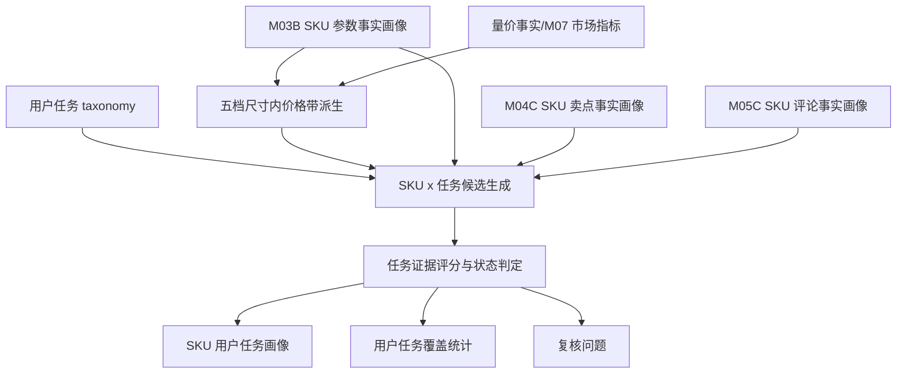

# M09C 用户任务画像详细设计

## 1. 文档定位

本文是 M09C 用户任务画像的工程详细设计，承接：

- `sop_requirements/M09C_user_task_profile_requirements.md`
- `M03B_sku_param_profile_design.md`
- `M04C_claim_fact_profile_design.md`
- `M05C_comment_fact_profile_design.md`
- `M10C_target_group_profile_design.md`
- `M11C_value_battlefield_profile_design.md`
- 已确认的 TV 12 个用户任务预设

M09C 是新语义能力层模块，不复用旧 M09 作为主执行链路。它消费事实层结果，基于已发布用户任务 taxonomy，确定每个 SKU 的主/次/评论观察/厂家主打/潜在/拖后腿用户任务，并生成用户任务覆盖统计。

M09C 首版不使用运行时 LLM。用户任务 taxonomy 可以由分析者使用 LLM 辅助生成，但发布后作为只读资产由程序确定性消费。

M09C 不读取 M10C/M11C 输出，避免循环依赖。M10C/M11C 已有首版代理规则，M09C 落地后作为正式任务画像增强它们的任务支撑输入。

## 2. 总体流程



处理步骤：

1. 解析 `project_id`、`category_code`、`batch_id`、SKU 范围。
2. 加载 TV 用户任务 taxonomy；未发布则阻断。
3. 读取 M03B 参数画像，优先取 M03B 五档尺寸 `size_tier`。
4. 读取量价事实，按 `size_tier` 重新计算 `price_band_in_size_tier`。
5. 读取 M04C 卖点事实，区分参数支撑卖点、厂家声称卖点、无参数支撑卖点和服务履约隔离卖点。
6. 读取 M05C 评论事实，提取用途、人群、购买动机、价格价值、品牌力、竞品、正负向和参数/卖点支持关系。
7. 对每个 SKU x 12 个任务执行评论、卖点、参数、尺寸价格、市场验证和负向拖后腿评分。
8. 根据得分、用户声音、支撑状态和封顶规则判定 `relation_status`。
9. 聚合每个 SKU 的主/次/观察/厂家主打/潜在/拖后腿任务。
10. 重建批次级用户任务覆盖统计。
11. 写入复核问题。

## 3. Taxonomy 结构

### 3.1 数据结构

每个用户任务定义至少包含：

| 字段 | 说明 |
| --- | --- |
| `task_code` | 稳定编码 |
| `task_name` | 中文名称 |
| `definition` | 任务业务定义 |
| `comment_subdimension_codes` | M05C 评论事实匹配 code |
| `comment_keywords` | 补充关键词，仅用于已清洗评论事实文本，不读取原始评论 |
| `positive_comment_rules` | 正向评论如何形成任务需求 |
| `negative_comment_rules` | 负向评论如何形成拖后腿任务或未满足需求 |
| `claim_codes` | 标准卖点匹配 code |
| `param_codes` | 标准参数匹配 code |
| `allowed_size_tiers` | 推荐尺寸档 |
| `allowed_price_bands` | 推荐尺寸内价格带 |
| `adjacent_size_tiers` | 可降级相邻尺寸档 |
| `adjacent_price_bands` | 可降级相邻价格带 |
| `market_validation_rules` | 销量、销额、价格/英寸验证规则 |
| `service_exclusion_rules` | 服务履约隔离规则 |
| `status_caps` | 不同证据缺口下的最高关系状态 |

### 3.2 TV taxonomy 版本

建议版本：

| 项 | 值 |
| --- | --- |
| taxonomy version | `m09c_tv_user_task_taxonomy_v0.1` |
| rule version | `m09c_tv_user_task_profile_v0.1` |
| product category | `TV` |
| SKU prefix | `TV` |

### 3.3 TV 12 个任务规则摘要

| 任务 | 评论匹配 | 卖点匹配 | 参数匹配 | 尺寸价格 |
| --- | --- | --- | --- | --- |
| `TASK_MAINSTREAM_LIVING_VIEWING` | 客厅、家庭、日常看、追剧、综艺 | 客厅影院、HDR、音效、护眼、语音 | 尺寸、4K、HDR、内存、音频 | 中/大/超大，低到中高 |
| `TASK_CINEMA_IMMERSION` | 电影、大片、影院、沉浸、震撼 | 影院、HDR、杜比、音效、控光 | 大屏、HDR、亮度、音频、控光 | 大/超大/巨幕，中以上 |
| `TASK_PREMIUM_PICTURE_EXPERIENCE` | 画质、亮度、色彩、黑位、控光 | MiniLED/OLED/QD、HDR、色域、控光、画质芯片 | 显示技术、亮度、分区、色域、芯片 | 大/超大，中高/高 |
| `TASK_LARGE_SCREEN_UPGRADE` | 换新、旧电视、75/85/98 寸、大屏 | 大屏影院、性价比、全面屏 | 尺寸、价格/英寸、全面屏 | 超大为主，巨幕增强 |
| `TASK_GAMING_CONSOLE_ENTERTAINMENT` | 游戏、主机、PS5、Xbox、高刷、低延迟 | 高刷、低延迟、HDMI2.1 | 刷新率、HDMI2.1、MEMC、内存 | 中/大/超大，中以上 |
| `TASK_SPORTS_MOTION_WATCHING` | 看球、体育、运动、流畅、拖影 | 高刷、运动补偿、低延迟 | 刷新率、MEMC、芯片 | 中尺寸以上，中以上 |
| `TASK_EYE_CARE_LONG_WATCHING` | 孩子、长时间看、不刺眼、护眼 | 护眼、亮度、色彩 | 护眼、低蓝光、无频闪、亮度、刷新率 | 小/中/大，中低以上 |
| `TASK_SENIOR_EASY_OPERATION` | 父母、老人、语音、遥控简单、广告少 | 语音、投屏、AI | 语音、远场语音、智能、内存 | 小/中/大，低到中 |
| `TASK_BEDROOM_SECOND_SCREEN` | 卧室、租房、宿舍、第二台、够用 | 性价比、全面屏、语音 | 小尺寸、基础画质、WiFi、智能 | 小屏低/中低 |
| `TASK_SMART_CASTING_IOT` | 投屏、联网、语音、AI、家电联动、摄像头 | 投屏、语音、AI、智家、摄像头 | WiFi、网络、AI、语音、IoT、摄像头 | 中尺寸以上，中以上 |
| `TASK_HOME_DECOR_SPACE_FIT` | 新家、装修、贴墙、超薄、全面屏、外观 | 全面屏、贴墙、大屏影院 | 尺寸、全面屏、贴墙、厚度/边框 | 大/超大/巨幕，中以上 |
| `TASK_VALUE_FOR_MONEY_PURCHASE` | 性价比、划算、补贴、优惠、预算、值得买 | 性价比、同价位高配 | 价格/英寸、尺寸、配置、销量 | 全尺寸，低/中低/中优先 |

## 4. 输入读取设计

### 4.1 M03B 参数事实

读取 `core3_sku_param_profile`：

| 字段 | 用途 |
| --- | --- |
| `sku_code`、`model_name` | SKU 标识 |
| `param_values_json.screen_size_inch` | 派生五档尺寸 |
| `param_values_json.dimension_tier_profile.size` | 优先使用的 M03B 尺寸档 |
| `param_values_json.*` | 任务参数能力匹配 |
| `evidence_ids` | 参数证据 |
| `profile_hash` | 增量判断 |

参数只证明能力，不证明用户真实购买目的。缺失值、空值、`-`、`unknown` 不得当 false；布尔类特性只有明确存在时给正支撑。

### 4.2 量价事实

读取 `core3_sku_market_profile` 的 `full_observed_window`：

| 字段 | 用途 |
| --- | --- |
| `price_wavg` | 尺寸内价格带派生 |
| `price_per_inch` | 大屏换新、性价比支撑 |
| `sales_volume_total`、`sales_amount_total` | 市场验证 |
| `volume_percentile_in_size`、`amount_percentile_in_size` | 任务市场验证 |
| `evidence_ids` | 市场证据 |

M09C 自行按五档尺寸派生 `price_band_in_size_tier`。不得使用旧 M07 `screen_size_class` 作为主口径。

### 4.3 M04C 卖点事实

读取 `core3_sku_claim_fact_profile` 和 `core3_sku_claim_fact`：

| 字段 | 用途 |
| --- | --- |
| `fact_claim_codes` | 参数支撑后的事实卖点 |
| `claim_code` | 任务卖点匹配 |
| `param_support_status` | 卖点是否可支撑任务 |
| `service_separate_flag` | 服务履约隔离 |
| `evidence_ids` | 卖点证据 |

卖点只能提供厂家表达。没有评论支撑时，最高只能到 `brand_claimed_task` 或 `latent_capability_task`。

### 4.4 M05C 评论事实

读取 `core3_sku_comment_fact_profile` 和 `core3_comment_fact_atom`：

| 字段 | 用途 |
| --- | --- |
| `dimension_type` | 区分用途、人群、品牌力、竞品和产品体验 |
| `subdimension_code` | 任务评论匹配 |
| `polarity` | 正/负/混合 |
| `supported_param_codes`、`contradicted_param_codes` | 评论对参数的支持/反证 |
| `supported_claim_codes`、`contradicted_claim_codes` | 评论对卖点的支持/反证 |
| `clean_comment_text` | 仅用于已清洗事实文本的关键词补充，不读取原始评论 |
| `evidence_ids` | 评论证据 |

服务履约类评论不得进入产品任务评分。品牌力类评论只进入购买心理增强，不能单独触发任务。

## 5. 价格带派生

M09C 与 M10C/M11C 使用相同的价格带派生口径：

```text
在每个 size_tier 内，按 M07 full_observed_window 的 price_wavg 排序；
price_percentile = index / (n - 1)；
再映射到 low/mid_low/mid/mid_high/high。
```

| price_band_in_size_tier | 分位 |
| --- | --- |
| `low` | `0 <= p < 0.20` |
| `mid_low` | `0.20 <= p < 0.40` |
| `mid` | `0.40 <= p < 0.65` |
| `mid_high` | `0.65 <= p < 0.85` |
| `high` | `0.85 <= p <= 1.00` |
| `unknown` | 价格缺失或同尺寸样本不足 |

同尺寸样本不足时，任务关系不能靠价格带成为主任务，需降级或复核。

## 6. 评分设计

### 6.1 评论任务需求分

`comment_task_need_score` 使用 M05C 评论事实：

| 情况 | 分数建议 |
| --- | ---: |
| 直接命中任务用途/购买目的，且正向/中性评论不少于 2 条 | 0.85-1.00 |
| 直接命中任务用途/购买目的，但评论数量少 | 0.60-0.80 |
| 命中人群或体验，能间接支撑任务 | 0.35-0.65 |
| 负向评论集中但需求明确 | 0.45-0.70，并进入拖后腿判断 |
| 无评论命中 | 0 |

### 6.2 卖点任务表达分

`claim_task_alignment_score`：

| 情况 | 分数建议 |
| --- | ---: |
| 命中任务核心卖点，且 M04C 判断为参数支撑事实卖点 | 0.80-1.00 |
| 命中任务核心卖点，参数部分支撑或不适用 | 0.45-0.75 |
| 命中任务核心卖点但参数不支撑 | 0.15-0.35 |
| 只命中服务履约卖点 | 0，进入服务语境 |
| 未命中 | 0 |

### 6.3 参数能力分

`param_capability_score`：

| 情况 | 分数建议 |
| --- | ---: |
| 任务核心参数多数成立 | 0.75-1.00 |
| 任务核心参数部分成立 | 0.40-0.70 |
| 只有辅助参数成立 | 0.15-0.35 |
| 核心参数缺失或不支持 | 0-0.20 |

### 6.4 尺寸价格适配分

| fit status | 规则 | 分数 |
| --- | --- | ---: |
| `matched` | 尺寸档和价格带在任务规则内 | 1.00 |
| `adjacent` | 尺寸或价格相邻 | 0.55 |
| `unknown` | 尺寸或价格缺失 | 0.25 |
| `mismatch` | 尺寸价格明显不匹配 | 0 |

### 6.5 市场验证分

`market_validation_score` 用于增强，不单独生成任务：

| 情况 | 分数建议 |
| --- | ---: |
| 同任务尺寸价格池内销量/销额分位高，且价格效率匹配 | 0.70-1.00 |
| 销量或销额中等，价格位置合理 | 0.35-0.70 |
| 市场样本不足或销量弱 | 0-0.35 |
| 市场缺失 | 0，不直接否定 |

### 6.6 负向拖后腿分

`negative_drag_score`：

| 情况 | 分数建议 |
| --- | ---: |
| 评论对任务核心体验负向集中，且反证卖点/参数 | 0.70-1.00 |
| 评论负向集中，但参数或卖点仍部分支撑 | 0.40-0.70 |
| 只有少量负向评论 | 0.10-0.35 |
| 无负向任务证据 | 0 |

### 6.7 综合分

```text
user_task_score =
  comment_task_need_score * 0.35
  + claim_task_alignment_score * 0.20
  + param_capability_score * 0.20
  + size_price_fit_score * 0.10
  + market_validation_score * 0.10
  - negative_drag_score * 0.05
```

置信度建议：

```text
confidence =
  evidence_domain_coverage * 0.40
  + evidence_count_quality * 0.25
  + score_margin_quality * 0.20
  + input_completeness * 0.15
```

## 7. 状态判定

### 7.1 关系状态

| relation_status | 条件摘要 |
| --- | --- |
| `primary_user_task` | 评论强，卖点/参数至少一类强支撑，尺寸价格不冲突，综合分最高 |
| `secondary_user_task` | 任务成立但不是第一目的，或评论/卖点/参数有一类较弱 |
| `comment_observed_task` | 用户评论强，但厂家卖点或参数支撑不足 |
| `brand_claimed_task` | 厂家卖点强，参数可支撑，但用户评论弱或无 |
| `latent_capability_task` | 参数能力适合该任务，但评论和卖点都弱 |
| `drag_factor_task` | 用户需求明确且负向集中，说明该任务下产品没打好 |
| `not_supported` | 尺寸价格明显不匹配、服务履约、证据不足或服务隔离 |

每个 SKU：

- 最多 1 个 `primary_user_task`。
- 最多 2 个 `secondary_user_task`。
- 可以有多个 `comment_observed_task`、`brand_claimed_task`、`latent_capability_task` 和 `drag_factor_task`。
- 可以没有主任务，但必须写入 `no_primary_reason`。

### 7.2 封顶规则

| 规则 | 最高状态 |
| --- | --- |
| 评论强 + 卖点/参数至少一类强 + 尺寸价格 matched/adjacent | `primary_user_task` |
| 评论强 + 卖点/参数弱 | `comment_observed_task` |
| 评论负向集中 + 需求明确 | `drag_factor_task` |
| 卖点强 + 参数强 + 评论弱/无 | `brand_claimed_task` |
| 参数强 + 卖点弱 + 评论弱/无 | `latent_capability_task` |
| 卖点强 + 参数弱 + 评论弱/无 | `brand_claimed_task`，需复核 |
| 尺寸价格 mismatch | 不得成为 `primary_user_task` 或 `secondary_user_task` |
| 服务履约/物流安装/售后纯命中 | `not_supported` |

### 7.3 主任务选择

主任务候选必须满足：

```text
relation_status in primary-eligible statuses
comment_task_need_score >= 0.55
user_task_score >= 0.55
size_price_fit_status != mismatch
service_excluded = false
```

在候选中按以下顺序选择：

1. `user_task_score` 最高。
2. 评论任务需求分更高。
3. 卖点和参数一致性更高。
4. 尺寸价格更匹配。
5. 仍并列时写入复核问题，不强行生成多个主任务。

## 8. 数据模型设计

### 8.1 `core3_m09c_sku_user_task_profile`

SKU 级画像表，一 SKU 一条。

| 字段 | 类型 | 说明 |
| --- | --- | --- |
| `sku_user_task_profile_id` | text | 主键 |
| `project_id` | text | 项目 |
| `category_code` | text | 品类 |
| `batch_id` | text | 批次 |
| `sku_code` | text | SKU |
| `taxonomy_version` | text | 任务 taxonomy 版本 |
| `rule_version` | text | 评分规则版本 |
| `size_tier` | text | M03B 五档尺寸 |
| `price_band_in_size_tier` | text | 五档尺寸内价格带 |
| `primary_user_task_code` | text | 主用户任务，可空 |
| `primary_relation_status` | text | 主任务状态 |
| `secondary_user_task_codes_json` | jsonb | 次用户任务 |
| `comment_observed_task_codes_json` | jsonb | 评论观察任务 |
| `brand_claimed_task_codes_json` | jsonb | 厂家主打任务 |
| `latent_capability_task_codes_json` | jsonb | 潜在能力任务 |
| `drag_factor_task_codes_json` | jsonb | 拖后腿任务 |
| `task_summary_json` | jsonb | 任务摘要 |
| `no_primary_reason` | text | 无主任务原因 |
| `review_required` | boolean | 是否复核 |
| `confidence` | numeric | 置信度 |
| `evidence_ids_json` | jsonb | 证据 |
| `profile_hash` | text | 输出 hash |
| `is_current` | boolean | 当前版本 |

唯一当前索引建议：

```sql
create unique index uq_core3_m09c_sku_user_task_profile_current
on core3_m09c_sku_user_task_profile(project_id, category_code, batch_id, sku_code, taxonomy_version, rule_version)
where is_current = true;
```

### 8.2 `core3_m09c_sku_user_task_score`

SKU x 用户任务分数表。

| 字段 | 类型 | 说明 |
| --- | --- | --- |
| `sku_user_task_score_id` | text | 主键 |
| `project_id` | text | 项目 |
| `category_code` | text | 品类 |
| `batch_id` | text | 批次 |
| `sku_code` | text | SKU |
| `task_code` | text | 用户任务 |
| `taxonomy_version` | text | taxonomy |
| `rule_version` | text | rule |
| `relation_status` | text | 关系状态 |
| `user_task_score` | numeric | 综合分 |
| `comment_task_need_score` | numeric | 评论需求 |
| `claim_task_alignment_score` | numeric | 卖点表达 |
| `param_capability_score` | numeric | 参数能力 |
| `size_price_fit_score` | numeric | 尺寸价格适配 |
| `market_validation_score` | numeric | 市场验证 |
| `negative_drag_score` | numeric | 负向拖后腿 |
| `size_price_fit_status` | text | matched/adjacent/mismatch/unknown |
| `sentiment_polarity` | text | positive/negative/mixed/neutral/unknown |
| `status_reason_cn` | text | 中文解释 |
| `evidence_ids_json` | jsonb | 证据 |
| `result_hash` | text | 输出 hash |
| `is_current` | boolean | 当前版本 |

### 8.3 `core3_m09c_user_task_coverage`

任务覆盖表，便于查询每个任务有哪些 SKU。

| 字段 | 类型 | 说明 |
| --- | --- | --- |
| `coverage_id` | text | 主键 |
| `project_id` | text | 项目 |
| `category_code` | text | 品类 |
| `batch_id` | text | 批次 |
| `task_code` | text | 用户任务 |
| `relation_status` | text | 主/次/观察/厂家主打/潜在/拖后腿 |
| `taxonomy_version` | text | taxonomy |
| `rule_version` | text | rule |
| `sku_count` | integer | SKU 数 |
| `sku_codes_json` | jsonb | SKU 列表 |
| `top_skus_json` | jsonb | 代表 SKU |
| `size_tier_distribution_json` | jsonb | 尺寸分布 |
| `price_band_distribution_json` | jsonb | 价格分布 |
| `claim_distribution_json` | jsonb | 卖点分布 |
| `param_distribution_json` | jsonb | 参数分布 |
| `comment_dimension_distribution_json` | jsonb | 评论维度分布 |

## 9. 服务设计

### 9.1 主要类

| 类 | 职责 |
| --- | --- |
| `M09cUserTaskTaxonomy` | 保存任务 taxonomy 定义 |
| `M09cUserTaskTaxonomyProvider` | 加载和校验品类任务 taxonomy |
| `M09cSizePriceDeriver` | 按 M03B 五档尺寸派生尺寸内价格带 |
| `M09cUserTaskInputLoader` | 批量读取参数、卖点、评论和市场事实 |
| `M09cUserTaskScorer` | 计算 SKU x 任务分项分、综合分和状态 |
| `M09cUserTaskProfileBuilder` | 聚合 SKU 任务画像 |
| `M09cUserTaskCoverageBuilder` | 重建任务覆盖统计 |
| `M09cUserTaskService` | 编排全量、单 SKU、单任务执行 |
| `M09cUserTaskInsightService` | 查询 taxonomy、SKU 画像和任务覆盖 SKU |

### 9.2 执行接口

```python
def run_user_task_profile(
    *,
    project_id: str,
    category_code: str,
    batch_id: str,
    sku_codes: list[str] | None = None,
    user_task_codes: list[str] | None = None,
    force_rebuild: bool = False,
) -> UserTaskRunResult:
    ...
```

当前实现每次 SKU 分析后重建本批次用户任务覆盖统计。覆盖统计不单独提供 `rebuild-only` 模式，避免跨 SKU 维度统计和最新画像不一致。

### 9.3 增量策略

输入 fingerprint 包含：

- M03B 参数画像 hash。
- M04C 卖点事实画像 hash。
- M05C 评论事实画像 hash。
- M07/市场事实 hash。
- 用户任务 taxonomy hash。
- M09C rule version。

任一变化时对应 SKU x 任务结果需要重算。覆盖统计在 SKU 结果变化后按批次重建。

## 10. CLI 设计

### 10.1 Pipeline CLI

稳定命令：

```bash
python -m app.cli.catforge_pipeline run-user-task \
  --product-category tv \
  --batch-id latest \
  --force-rebuild \
  --format json
```

参数：

| 参数 | 说明 |
| --- | --- |
| `--project-id` | 项目 ID，默认使用配置 |
| `--product-category` | 品类，首版 `tv` |
| `--batch-id` | 批次，支持 `latest` |
| `--sku-code` | 可重复，限定 SKU |
| `--user-task-code` | 可重复，限定任务 |
| `--force-rebuild` | 清理并重算当前范围 |
| `--format` | `json`、`text` |

输出摘要：

| 字段 | 含义 |
| --- | --- |
| `sku_count` | 处理 SKU 数 |
| `profile_count` | 写入 SKU 画像 |
| `score_count` | 写入 SKU x 任务分数 |
| `coverage_count` | 覆盖统计行数 |
| `user_task_count` | 本次 taxonomy 中的任务数 |
| `relation_status_counts` | 各任务关系状态分布 |
| `primary_user_task_counts` | 主用户任务分布 |

### 10.2 Insight CLI

稳定命令：

```bash
python -m app.cli.catforge_insight user-task-taxonomy \
  --product-category tv \
  --format json
```

```bash
python -m app.cli.catforge_insight sku-user-task \
  --sku-code TV00000000 \
  --format json
```

```bash
python -m app.cli.catforge_insight user-task-skus \
  --user-task-code TASK_LARGE_SCREEN_UPGRADE \
  --relation-status primary_user_task \
  --sku-limit 100 \
  --format json
```

查询结果必须返回：

- 任务中文名和定义。
- SKU 主/次/观察/厂家主打/潜在/拖后腿任务。
- 每个任务的评论、卖点、参数、尺寸价格和市场证据摘要。
- 覆盖 SKU、代表 SKU、拖后腿 SKU、需复核 SKU。

## 11. Skill 更新要求

CLI 实现后更新：

| Skill | 新增能力 |
| --- | --- |
| `tools/claude/skills/catforge-pipeline/SKILL.md` | 识别“生成用户任务画像”“重新分析某 SKU 的用户任务”“新数据来了把用户任务准备好” |
| `tools/claude/skills/catforge-insight/SKILL.md` | 识别“查某 SKU 用户任务”“彩电有哪些用户任务”“某任务有哪些 SKU”“哪些 SKU 在某任务拖后腿” |

在 CLI 未实现前，不得把命令写入已安装 skill。

## 12. 测试设计

### 12.1 单元测试

| 测试 | 验证 |
| --- | --- |
| `test_taxonomy_contains_12_tv_tasks` | taxonomy 覆盖 12 个确认任务 |
| `test_size_price_band_uses_m03b_tiers` | 使用五档尺寸口径派生价格带 |
| `test_comment_strong_can_create_primary_task` | 评论强 + 支撑证据可生成主任务 |
| `test_negative_comment_keeps_drag_factor_task` | 负向评论不删除任务，输出拖后腿 |
| `test_claim_without_comment_is_brand_claimed` | 卖点强但评论弱只能厂家主打 |
| `test_param_only_is_latent_capability` | 只有参数强只能潜在能力 |
| `test_service_comment_excluded` | 服务履约不得进入产品任务 |
| `test_primary_task_can_be_empty` | 允许没有主任务并写原因 |
| `test_max_one_primary_two_secondary` | 主/次任务数量约束 |

### 12.2 CLI 测试

| 测试 | 验证 |
| --- | --- |
| `test_run_user_task_cli_single_sku` | 单 SKU 执行写画像和分数 |
| `test_run_user_task_cli_scoped_task` | 限定用户任务执行 |
| `test_sku_user_task_insight_cli` | 查询 SKU 用户任务 |
| `test_user_task_skus_insight_cli` | 查询任务覆盖 SKU |

### 12.3 无外部依赖

所有测试必须使用 fixture 或规则数据，不调用外部 LLM，不访问 205 真实库。

## 13. 性能与复核

执行性能：

- TV 首版按 `SKU x 12 tasks` 计算，当前 100 多个 SKU 可以一次执行。
- 不读取评论原文大表，只读取 M05C 聚合画像和事实 atom 摘要。
- 支持 `--sku-code` 和 `--user-task-code` 限定范围。
- 当前实现每次生成画像后重建本批次用户任务覆盖统计，保证跨 SKU 维度统计完整。

复核触发：

| issue_type | 触发 |
| --- | --- |
| `missing_fact_profile` | 缺 M03B/M04C/M05C 必要画像 |
| `missing_market_profile` | 缺量价事实，尺寸价格未知 |
| `primary_task_tie` | 主任务候选并列，无法确定唯一主任务 |
| `claim_param_conflict` | 卖点强但参数明确反证 |
| `comment_param_conflict` | 评论体验与参数能力冲突 |
| `service_leakage_detected` | 服务履约疑似进入产品任务 |
| `no_primary_with_enough_comments` | 评论足够但无法形成主任务 |
| `taxonomy_version_missing` | taxonomy 未发布或版本不匹配 |

## 14. 验收口径

1. 数据库有独立 M09C 表，不覆盖旧 M09。
2. 12 个任务 taxonomy 可查询。
3. SKU 画像可查询主/次/观察/厂家主打/潜在/拖后腿任务。
4. 每个任务可查询覆盖 SKU，并能按关系状态过滤。
5. 负向评论进入 `drag_factor_task`，不是被过滤。
6. 服务履约、物流安装、售后不进入产品任务。
7. M10C/M11C 后续可读取 M09C 输出增强任务支撑。
8. CLI 和 skill 自然语言入口可执行和查询。
9. 单元测试和 CLI 测试不依赖外部 LLM。
