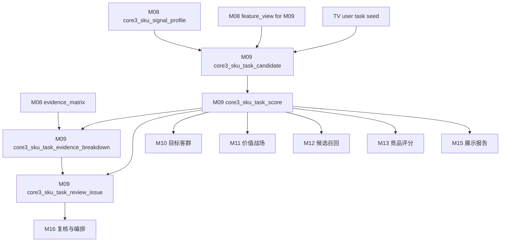
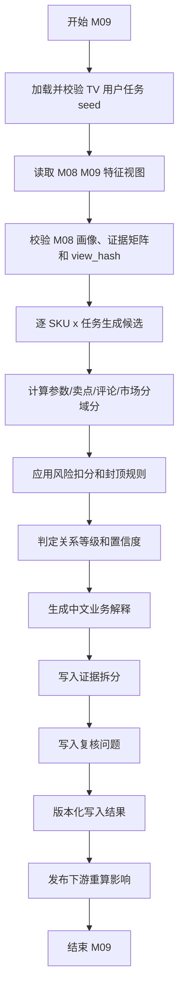

# M09 用户任务模块详细设计

## 1. 文档定位

本文是 CatForge 彩电核心三竞品 SOP 的 M09 详细设计，承接：

- 需求文档：`docs/core3_mvp/real_data_v2/sop_requirements/M09_user_task_requirements.md`
- 总体设计：`docs/core3_mvp/real_data_v2/sop_detailed_design/00_architecture_data_dictionary_design.md`
- 上游 M08：`core3_sku_signal_profile`、`core3_sku_signal_evidence_matrix`、`core3_sku_downstream_feature_view`
- 上游 M02：`core3_evidence_atom`，只通过 M08 evidence 引用回溯
- 任务 seed：`apps/api-server/app/rules/tv_core3_mvp_seed_v0_2.json`
- 下游 M10、M11、M12、M13、M14、M15、M16

M09 基于 M08 SKU 综合信号画像，推断每个 SKU 主要服务哪些用户任务，并输出任务候选、任务得分、关系等级、置信度、证据拆分和复核问题。

M09 不从评论直接贴任务标签，也不把参数、卖点或评论主题直接等同于用户任务。用户任务是“参数能力基础、卖点价值表达、评论真实场景、市场验证信号”四类证据共同推导后的业务判断。

## 2. 模块职责

### 2.1 本模块解决什么

M09 解决六类工程问题：

1. 对每个 SKU 和 10 个 TV MVP 用户任务建立统一关系口径。
2. 区分“进入候选”和“最终任务关系等级”，保留为什么进入候选、为什么被降级或复核。
3. 将参数、卖点、评论、市场四类证据拆分计分，避免单一评论或单一参数直接生成高置信任务。
4. 为 M10 目标客群、M11 价值战场、M12 候选召回、M13 竞品评分提供统一任务输入。
5. 为 M15 高层展示页提供业务化中文解释，回答“为什么认为该 SKU 服务这些任务”。
6. 用 `profile_hash`、`feature_view_hash`、`task_seed_version`、`rule_version` 支撑增量重算。

### 2.2 本模块不解决什么

| 不做事项 | 原因 | 后续模块 |
| --- | --- | --- |
| 不读取原始四张表 | M09 必须消费 M08 统一画像和特征视图 | M00-M08 |
| 不直接读取 M03/M04b/M06/M07 散表做业务判断 | 防止下游绕过统一特征口径 | M08 |
| 不从评论基础维度直接贴任务 | 评论维度只是弱标签，任务要多证据推导 | M06/M09 |
| 不把卖点 code 等同任务 code | 卖点是价值表达，任务是用户使用目的 | M09 |
| 不把单一参数等同任务结论 | 参数只是能力基础，需要评论、卖点或市场补强 | M09 |
| 不生成目标客群 | 任务是客群推断输入，不是客群结论 | M10 |
| 不生成价值战场 | 任务可支撑战场，但不等于战场 | M11 |
| 不做卖点价值分层 | 分层需要战场和可比上下文 | M11.5 |
| 不召回竞品候选 | 任务相似只是候选召回的一个输入 | M12 |
| 不计算竞品组件分 | 任务相似度在 M13 pair 级评分 | M13 |
| 不生成核心三竞品 | M14 选择核心三 | M14 |
| 不输出算法调试文案给高层页 | M15 负责业务展示转换 | M15 |

### 2.3 允许复用历史结果

允许复用历史 M09 输出，但必须同时满足：

- M08 `profile_hash` 未变化。
- M08 `core3_sku_downstream_feature_view where for_module='M09'` 的 `view_hash` 未变化。
- M08 evidence matrix 中与 M09 相关域的 `result_hash` 未变化。
- 任务 seed 文件内容 hash 未变化。
- `task_seed_version` 未变化。
- M09 评分规则版本、阈值版本、封顶规则版本未变化。
- 历史记录 `is_current=true` 且 `processing_status` 不是 `failed`、`blocked`。

## 3. 输入输出总览

### 3.1 必须输入

| 输入 | 来源模块 | 表或文件 | 用途 |
| --- | --- | --- | --- |
| SKU 画像 | M08 | `core3_sku_signal_profile` | 读取 SKU 主画像、完整度、风险、profile hash |
| M09 特征视图 | M08 | `core3_sku_downstream_feature_view where for_module='M09'` | 默认任务推断入口 |
| 证据矩阵 | M08 | `core3_sku_signal_evidence_matrix` | 判断参数、卖点、评论、市场证据覆盖 |
| evidence 原子 | M02 | `core3_evidence_atom` | 仅通过 M08 evidence ID 回溯证据详情 |
| TV 任务 seed | 规则资产 | `tv_core3_mvp_seed_v0_2.json` | 任务本体、映射参数、卖点、评论主题、市场信号和默认权重 |

### 3.2 从 M08 消费的特征

M09 只消费 M08 提供的标准化特征。

| 特征域 | M08 字段或视图 | M09 用途 |
| --- | --- | --- |
| SKU 主数据 | `sku_code`、`model_name`、`brand_name`、`size_segment`、`price_band`、`main_platform` | 任务适用性和业务解释 |
| 参数画像 | `core_params_json`、`param_profile_json`、M09 view 的 `task_relevant_params` | 判断任务能力基础 |
| 卖点画像 | `claim_activation_summary_json`、`claim_evidence_breakdown_json`、M09 view 的 `activated_claims` | 判断任务价值表达 |
| 评论线索 | `comment_signal_summary_json.task_cue`、M09 view 的 `task_cue_comment_signals` | 判断真实用户场景和体验 |
| 价格感知 | `price_perception_signals` | 支撑性价比、大屏换新等任务 |
| 服务信号 | `service_signal` | 只支撑新家装修搭配等服务相关侧面 |
| 市场画像 | `market_position`、`market_summary_json`、`comparable_pool_summary_json` | 判断价格、销量、平台和可比池验证 |
| 风险缺失 | `missing_signals_json`、`risk_signals_json`、`domain_completeness_json` | 降低置信度、封顶或触发复核 |
| 证据索引 | `evidence_refs`、`evidence_matrix_refs_json` | 任务证据拆分和报告回溯 |

### 3.3 明确不消费

| 数据 | 禁止原因 |
| --- | --- |
| 原始 `week_sales_data`、`attribute_data`、`selling_points_data`、`comment_data` | 已由前序模块分层处理 |
| M01 清洗表 | M09 不直接消费清洗层做业务判断 |
| M03 参数散表 | 已经由 M08 统一装配 |
| M04b 卖点散表 | 已经由 M08 统一装配 |
| M06 评论散表 | 已经由 M08 统一装配 |
| M07 市场散表 | 已经由 M08 统一装配 |
| M10 客群结果 | M10 是下游 |
| M11 战场结果 | M11 是下游 |
| M12-M15 竞品和报告结果 | M09 是上游 |

### 3.4 输出表

| 输出表 | 粒度 | 用途 |
| --- | --- | --- |
| `core3_sku_task_candidate` | SKU + 任务 + 候选触发版本 | 记录为什么进入候选、为什么被拒绝或复核 |
| `core3_sku_task_score` | SKU + 任务 + 规则版本 | 记录任务分、关系等级、置信度和业务解释 |
| `core3_sku_task_evidence_breakdown` | SKU + 任务 + 证据域 | 记录参数、卖点、评论、市场、风险分域得分 |
| `core3_sku_task_review_issue` | SKU + 任务或 SKU 级问题 | 记录任务推断复核问题 |

### 3.5 模块关系



## 4. 任务 seed 设计

### 4.1 预制和推导边界

M09 允许预制的是任务本体和规则骨架，不允许预制 SKU 结论。

| 预制项 | 内容 | 是否可直接成为 SKU 结论 |
| --- | --- | --- |
| `task_code` | 稳定任务编码 | 否 |
| `task_name` | 中文业务名 | 否 |
| `definition` | 任务定义 | 否 |
| `aliases`、`keywords` | 别名和关键词 | 否 |
| `positive_param_codes`、`mapped_param_codes` | 任务相关参数 | 否 |
| `positive_claim_codes`、`mapped_claim_codes` | 任务相关卖点 | 否 |
| `comment_topic_codes`、`mapped_topic_codes` | 评论主题映射 | 否 |
| `market_signals` | 市场验证信号 | 否 |
| `score_rule` | 参数、卖点、评论、市场权重 | 否 |
| `default_target_group_codes` | 下游客群提示 | 否，仅 M10 候选参考 |
| `battlefield_codes` | 下游战场提示 | 否，仅 M11 候选参考 |

每个 SKU 的任务关系必须从 M08 的真实画像和特征视图推导出来。

### 4.2 seed 版本

首版使用：

| 项 | 值 |
| --- | --- |
| seed 文件 | `apps/api-server/app/rules/tv_core3_mvp_seed_v0_2.json` |
| 文件内版本 | `core3-mvp-0.2.0` |
| 建议业务版本 | `tv_core3_mvp_seed_v0_2` |
| category_code | `TV` |

M09 输出同时保存：

- `task_seed_version='tv_core3_mvp_seed_v0_2'`
- `task_seed_file_version='core3-mvp-0.2.0'`
- `task_seed_hash`

### 4.3 MVP 10 个用户任务

M09 必须覆盖 seed 中 10 个任务，不得使用旧参考中的 8 个任务，也不得临时新增任务。

| 任务 code | 业务名称 | 定义 | 默认权重 |
| --- | --- | --- | --- |
| `TASK_LIVING_ROOM_CINEMA` | 客厅影院观影 | 家庭客厅大屏观影、追剧和沉浸影音娱乐 | claim 0.40 / param 0.25 / comment 0.20 / market 0.15 |
| `TASK_PREMIUM_PICTURE_AV` | 高端画质影音 | 关注 Mini LED/OLED、高亮、控光、色彩和画质体验 | claim 0.45 / param 0.35 / comment 0.15 / market 0.05 |
| `TASK_GAMING_ENTERTAINMENT` | 游戏娱乐 | 关注高刷、HDMI 2.1、低延迟、VRR 和游戏体验 | claim 0.40 / param 0.35 / comment 0.20 / market 0.05 |
| `TASK_SPORTS_WATCHING` | 体育赛事观看 | 看球赛和高速运动画面时追求清晰、流畅、低拖影 | claim 0.35 / param 0.30 / comment 0.30 / market 0.05 |
| `TASK_LARGE_SCREEN_REPLACEMENT` | 大屏换新 | 从小尺寸或旧电视升级到 75/85 英寸以上大屏，同时关注价格效率 | claim 0.35 / param 0.30 / comment 0.15 / market 0.20 |
| `TASK_CHILD_EYE_CARE` | 儿童护眼 | 儿童、家庭长时间观看时关注护眼、低蓝光、无频闪和家长控制 | claim 0.35 / param 0.35 / comment 0.20 / market 0.10 |
| `TASK_SENIOR_EASY_USE` | 长辈易用 | 长辈或父母使用电视时关注语音、简洁系统、少广告和操作简单 | claim 0.30 / param 0.20 / comment 0.40 / market 0.10 |
| `TASK_VALUE_PURCHASE` | 性价比购买 | 预算敏感或理性购买场景，关注价格、尺寸、销量和评论价值感 | claim 0.25 / param 0.10 / comment 0.25 / market 0.40 |
| `TASK_NEW_HOME_DECORATION` | 新家装修搭配 | 新家装修、客厅空间搭配、外观美学和安装服务场景 | claim 0.35 / param 0.15 / comment 0.35 / market 0.15 |
| `TASK_BEDROOM_SECOND_TV` | 卧室/副屏 | 卧室、副屏或第二台电视场景，关注中小尺寸、低价、护眼和易用 | claim 0.30 / param 0.25 / comment 0.25 / market 0.20 |

### 4.4 seed 校验

M09 启动前必须校验 seed：

| 校验 | 失败处理 |
| --- | --- |
| `category_code='TV'` | 阻塞 |
| `user_tasks` 正好覆盖 10 个 MVP task_code | 阻塞 |
| 每个任务有中文名称、定义、score_rule | 阻塞 |
| `score_rule` 四域权重总和为 1.0，允许浮点误差 0.001 | 阻塞 |
| 映射参数、卖点、评论主题、市场信号至少一个非空 | 复核 |
| task_code 稳定且无重复 | 阻塞 |
| seed hash 可计算 | 阻塞 |

## 5. 数据模型设计

### 5.1 通用字段约定

M09 输出表必须包含以下通用字段。

| 字段 | 类型建议 | 必填 | 说明 |
| --- | --- | --- | --- |
| `project_id` | `text` | 是 | 项目 ID |
| `category_code` | `text` | 是 | MVP 为 `TV` |
| `batch_id` | `text` | 是 | 批次 ID |
| `run_id` | `text` | 否 | 全链路运行 ID |
| `module_run_id` | `text` | 否 | M09 模块运行 ID |
| `rule_version` | `text` | 是 | M09 评分规则版本 |
| `task_seed_version` | `text` | 是 | 任务 seed 业务版本 |
| `task_seed_file_version` | `text` | 是 | seed 文件内版本 |
| `task_seed_hash` | `text` | 是 | seed 文件内容 hash |
| `profile_hash` | `text` | 是 | M08 SKU 画像 hash |
| `feature_view_hash` | `text` | 是 | M08 M09 特征视图 hash |
| `input_fingerprint` | `text` | 是 | 输入 hash |
| `result_hash` | `text` | 是 | 输出业务内容 hash |
| `is_current` | `boolean` | 是 | 是否当前版本 |
| `processing_status` | `text` | 是 | `success`、`warning`、`review_required`、`blocked`、`failed` |
| `review_required` | `boolean` | 是 | 是否需要复核 |
| `review_status` | `text` | 是 | `auto_pass`、`review_required`、`approved`、`rejected`、`waived` |
| `review_reason_json` | `jsonb` | 是 | 复核原因 |
| `created_at` | `timestamptz` | 是 | 创建时间 |
| `updated_at` | `timestamptz` | 是 | 更新时间 |

### 5.2 枚举定义

#### 5.2.1 `candidate_status`

```text
active
rejected
review_required
blocked
```

#### 5.2.2 `candidate_source`

```text
param
claim
comment
market
price_perception
service_signal
seed_gap
```

#### 5.2.3 `relation_level`

```text
main
secondary
weak
insufficient
blocked
```

#### 5.2.4 `evidence_domain`

```text
param
claim
comment
market
risk
seed
profile
```

#### 5.2.5 `support_level`

```text
strong
medium
weak
missing
conflict
not_applicable
```

#### 5.2.6 `review_issue_type`

```text
missing_feature_view
missing_feature
conflict
comment_only
service_only
single_param_only
market_limited
claim_missing
comment_quality_risk
seed_gap
high_score_contradiction
profile_blocked
```

## 6. 表设计：`core3_sku_task_candidate`

### 6.1 表职责

`core3_sku_task_candidate` 记录任务候选生成阶段。它回答“这个 SKU 为什么和这个任务可能相关”，也记录被拒绝或需要复核的候选。

候选记录不等于最终任务。最终任务关系以 `core3_sku_task_score` 为准。

### 6.2 字段级契约

| 字段 | 类型建议 | 必填 | 来源 | 说明 |
| --- | --- | --- | --- | --- |
| `sku_task_candidate_id` | `uuid` | 是 | M09 | 主键 |
| `project_id` | `text` | 是 | M00 | 项目 ID |
| `category_code` | `text` | 是 | M00/M08 | 品类 |
| `batch_id` | `text` | 是 | M00 | 批次 |
| `run_id` | `text` | 否 | M16 | 全链路运行 ID |
| `module_run_id` | `text` | 否 | M09 | 本模块运行 ID |
| `sku_signal_profile_id` | `uuid` | 是 | M08 | SKU 画像 ID |
| `sku_downstream_feature_view_id` | `uuid` | 是 | M08 | M09 特征视图 ID |
| `sku_code` | `text` | 是 | M08 | SKU |
| `model_code` | `text` | 否 | M08 | 型号编码 |
| `model_name` | `text` | 否 | M08 | 型号名 |
| `brand_name` | `text` | 否 | M08 | 品牌 |
| `task_code` | `text` | 是 | seed | 用户任务 code |
| `task_name_cn` | `text` | 是 | seed | 业务名称 |
| `task_definition_cn` | `text` | 是 | seed | 任务定义 |
| `candidate_source_json` | `jsonb` | 是 | M09 | 命中的参数、卖点、评论、市场来源 |
| `candidate_source_count` | `integer` | 是 | M09 | 命中来源域数量 |
| `candidate_initial_score` | `numeric(6,4)` | 是 | M09 | 候选阶段粗分 |
| `candidate_reason_cn` | `text` | 是 | M09 | 中文候选原因 |
| `candidate_status` | `text` | 是 | M09 | active/rejected/review_required/blocked |
| `reject_reason_json` | `jsonb` | 是 | M09 | 被拒绝原因 |
| `missing_signals_json` | `jsonb` | 是 | M08/M09 | 缺失信号 |
| `risk_flags_json` | `jsonb` | 是 | M08/M09 | 风险 |
| `evidence_ids` | `uuid[]` | 是 | M08/M02 | 候选阶段代表 evidence |
| `evidence_matrix_refs_json` | `jsonb` | 是 | M08 | M08 证据矩阵引用 |
| `profile_hash` | `text` | 是 | M08 | 画像 hash |
| `feature_view_hash` | `text` | 是 | M08 | M09 视图 hash |
| `task_seed_version` | `text` | 是 | seed | seed 业务版本 |
| `task_seed_file_version` | `text` | 是 | seed | seed 文件版本 |
| `task_seed_hash` | `text` | 是 | seed | seed hash |
| `rule_version` | `text` | 是 | M09 | 规则版本 |
| `input_fingerprint` | `text` | 是 | M09 | 输入 hash |
| `result_hash` | `text` | 是 | M09 | 结果 hash |
| `is_current` | `boolean` | 是 | M09 | 是否当前 |
| `processing_status` | `text` | 是 | M09 | 处理状态 |
| `review_required` | `boolean` | 是 | M09 | 是否复核 |
| `review_status` | `text` | 是 | M09 | 复核状态 |
| `review_reason_json` | `jsonb` | 是 | M09 | 复核原因 |
| `created_at` | `timestamptz` | 是 | M09 | 创建时间 |
| `updated_at` | `timestamptz` | 是 | M09 | 更新时间 |

### 6.3 主键、唯一键和索引

主键：

```sql
primary key (sku_task_candidate_id)
```

唯一键：

```sql
unique (
  project_id,
  category_code,
  batch_id,
  sku_code,
  task_code,
  profile_hash,
  task_seed_version,
  rule_version,
  result_hash
)
```

当前版本唯一索引：

```sql
create unique index uq_core3_sku_task_candidate_current
on core3_sku_task_candidate(
  project_id,
  category_code,
  batch_id,
  sku_code,
  task_code,
  task_seed_version,
  rule_version
)
where is_current = true;
```

查询索引：

```sql
create index idx_core3_sku_task_candidate_sku
on core3_sku_task_candidate(project_id, category_code, batch_id, sku_code);

create index idx_core3_sku_task_candidate_task
on core3_sku_task_candidate(project_id, category_code, batch_id, task_code, candidate_status);

create index idx_core3_sku_task_candidate_review
on core3_sku_task_candidate(project_id, category_code, batch_id, review_required);

create index idx_core3_sku_task_candidate_source_gin
on core3_sku_task_candidate
using gin (candidate_source_json jsonb_path_ops);
```

## 7. 表设计：`core3_sku_task_score`

### 7.1 表职责

`core3_sku_task_score` 是 M09 主输出，记录每个 SKU 对每个任务的最终任务分、关系等级、置信度和中文业务解释。

MVP 建议每个有效 SKU 对 10 个任务都生成一行 score，未命中的任务关系为 `insufficient`。这样 M10-M15 可以稳定消费，不需要猜测某任务缺行是“未计算”还是“不相关”。

### 7.2 字段级契约

| 字段 | 类型建议 | 必填 | 来源 | 说明 |
| --- | --- | --- | --- | --- |
| `sku_task_score_id` | `uuid` | 是 | M09 | 主键 |
| `project_id` | `text` | 是 | M00 | 项目 |
| `category_code` | `text` | 是 | M00/M08 | 品类 |
| `batch_id` | `text` | 是 | M00 | 批次 |
| `run_id` | `text` | 否 | M16 | 全链路运行 ID |
| `module_run_id` | `text` | 否 | M09 | 模块运行 ID |
| `sku_signal_profile_id` | `uuid` | 是 | M08 | 画像 ID |
| `sku_downstream_feature_view_id` | `uuid` | 是 | M08 | M09 特征视图 ID |
| `sku_code` | `text` | 是 | M08 | SKU |
| `model_code` | `text` | 否 | M08 | 型号编码 |
| `model_name` | `text` | 否 | M08 | 型号名 |
| `brand_name` | `text` | 否 | M08 | 品牌 |
| `task_code` | `text` | 是 | seed | 任务 code |
| `task_name_cn` | `text` | 是 | seed | 中文任务名 |
| `task_definition_cn` | `text` | 是 | seed | 任务定义 |
| `param_signal_score` | `numeric(6,4)` | 是 | M09 | 参数支撑分 |
| `claim_signal_score` | `numeric(6,4)` | 是 | M09 | 卖点支撑分 |
| `comment_signal_score` | `numeric(6,4)` | 是 | M09 | 评论支撑分 |
| `market_signal_score` | `numeric(6,4)` | 是 | M09 | 市场验证分 |
| `raw_task_score` | `numeric(6,4)` | 是 | M09 | 风险修正前得分 |
| `risk_penalty` | `numeric(6,4)` | 是 | M09 | 风险扣分 |
| `task_score` | `numeric(6,4)` | 是 | M09 | 最终任务分 |
| `relation_level` | `text` | 是 | M09 | main/secondary/weak/insufficient/blocked |
| `relation_reason_json` | `jsonb` | 是 | M09 | 关系等级判定原因 |
| `confidence` | `numeric(6,4)` | 是 | M09 | 置信度 |
| `confidence_level` | `text` | 是 | M09 | high/medium/low/unknown |
| `evidence_domain_count` | `integer` | 是 | M09 | 有效证据域数量 |
| `effective_domain_json` | `jsonb` | 是 | M09 | 哪些域有效 |
| `score_breakdown_json` | `jsonb` | 是 | M09 | 权重、原始分、封顶、风险 |
| `cap_rule_applied_json` | `jsonb` | 是 | M09 | 触发的封顶规则 |
| `missing_signals_json` | `jsonb` | 是 | M08/M09 | 缺失信号 |
| `risk_flags_json` | `jsonb` | 是 | M08/M09 | 风险 |
| `business_reason_cn` | `text` | 是 | M09 | 中文业务解释摘要 |
| `business_reason_parts_json` | `jsonb` | 是 | M09 | 能力基础、价值表达、用户反馈、市场验证、待复核点 |
| `evidence_ids` | `uuid[]` | 是 | M08/M02 | 核心 evidence |
| `evidence_matrix_refs_json` | `jsonb` | 是 | M08 | 证据矩阵引用 |
| `profile_hash` | `text` | 是 | M08 | 画像 hash |
| `feature_view_hash` | `text` | 是 | M08 | M09 视图 hash |
| `task_seed_version` | `text` | 是 | seed | seed 业务版本 |
| `task_seed_file_version` | `text` | 是 | seed | seed 文件版本 |
| `task_seed_hash` | `text` | 是 | seed | seed hash |
| `rule_version` | `text` | 是 | M09 | 规则版本 |
| `input_fingerprint` | `text` | 是 | M09 | 输入 hash |
| `result_hash` | `text` | 是 | M09 | 结果 hash |
| `is_current` | `boolean` | 是 | M09 | 是否当前 |
| `processing_status` | `text` | 是 | M09 | 处理状态 |
| `review_required` | `boolean` | 是 | M09 | 是否复核 |
| `review_status` | `text` | 是 | M09 | 复核状态 |
| `review_reason_json` | `jsonb` | 是 | M09 | 复核原因 |
| `created_at` | `timestamptz` | 是 | M09 | 创建时间 |
| `updated_at` | `timestamptz` | 是 | M09 | 更新时间 |

### 7.3 主键、唯一键和索引

主键：

```sql
primary key (sku_task_score_id)
```

唯一键：

```sql
unique (
  project_id,
  category_code,
  batch_id,
  sku_code,
  task_code,
  profile_hash,
  task_seed_version,
  rule_version,
  result_hash
)
```

当前版本唯一索引：

```sql
create unique index uq_core3_sku_task_score_current
on core3_sku_task_score(
  project_id,
  category_code,
  batch_id,
  sku_code,
  task_code,
  task_seed_version,
  rule_version
)
where is_current = true;
```

查询索引：

```sql
create index idx_core3_sku_task_score_sku_relation
on core3_sku_task_score(project_id, category_code, batch_id, sku_code, relation_level, task_score desc);

create index idx_core3_sku_task_score_task
on core3_sku_task_score(project_id, category_code, batch_id, task_code, relation_level);

create index idx_core3_sku_task_score_downstream
on core3_sku_task_score(project_id, category_code, batch_id, sku_code, task_score desc, confidence desc);

create index idx_core3_sku_task_score_hash
on core3_sku_task_score(project_id, category_code, batch_id, profile_hash, task_seed_version, rule_version);

create index idx_core3_sku_task_score_breakdown_gin
on core3_sku_task_score
using gin (score_breakdown_json jsonb_path_ops);
```

## 8. 表设计：`core3_sku_task_evidence_breakdown`

### 8.1 表职责

`core3_sku_task_evidence_breakdown` 保存任务得分的分域证据拆解。它回答“这个任务分由哪些参数、卖点、评论、市场、风险组成”。

每个 `core3_sku_task_score` 至少输出 5 类域记录：`param`、`claim`、`comment`、`market`、`risk`。缺失域也要输出 `support_level='missing'`。

### 8.2 字段级契约

| 字段 | 类型建议 | 必填 | 来源 | 说明 |
| --- | --- | --- | --- | --- |
| `sku_task_evidence_breakdown_id` | `uuid` | 是 | M09 | 主键 |
| `sku_task_score_id` | `uuid` | 是 | M09 | 关联任务分 |
| `project_id` | `text` | 是 | M00 | 项目 |
| `category_code` | `text` | 是 | M00/M08 | 品类 |
| `batch_id` | `text` | 是 | M00 | 批次 |
| `sku_code` | `text` | 是 | M08 | SKU |
| `task_code` | `text` | 是 | seed | 任务 code |
| `evidence_domain` | `text` | 是 | M09 | param/claim/comment/market/risk/seed/profile |
| `support_level` | `text` | 是 | M09 | strong/medium/weak/missing/conflict/not_applicable |
| `support_score` | `numeric(6,4)` | 是 | M09 | 分域原始分 |
| `domain_weight` | `numeric(6,4)` | 是 | seed | 该任务该域权重 |
| `weighted_contribution` | `numeric(6,4)` | 是 | M09 | 加权贡献 |
| `support_summary_cn` | `text` | 是 | M09 | 中文证据摘要 |
| `source_signal_codes_json` | `jsonb` | 是 | M08/seed | 参数、卖点、主题或市场信号码 |
| `source_values_json` | `jsonb` | 是 | M08 | 命中的具体值和强度 |
| `representative_evidence_ids` | `uuid[]` | 是 | M08/M02 | 代表 evidence |
| `evidence_matrix_refs_json` | `jsonb` | 是 | M08 | 证据矩阵引用 |
| `missing_reason_code` | `text` | 否 | M09 | 缺失原因 |
| `risk_flags_json` | `jsonb` | 是 | M08/M09 | 风险 |
| `confidence` | `numeric(6,4)` | 是 | M09 | 分域置信度 |
| `task_seed_version` | `text` | 是 | seed | seed 版本 |
| `rule_version` | `text` | 是 | M09 | 规则版本 |
| `profile_hash` | `text` | 是 | M08 | 画像 hash |
| `input_fingerprint` | `text` | 是 | M09 | 输入 hash |
| `result_hash` | `text` | 是 | M09 | 结果 hash |
| `is_current` | `boolean` | 是 | M09 | 是否当前 |
| `created_at` | `timestamptz` | 是 | M09 | 创建时间 |
| `updated_at` | `timestamptz` | 是 | M09 | 更新时间 |

### 8.3 主键、唯一键和索引

主键：

```sql
primary key (sku_task_evidence_breakdown_id)
```

唯一键：

```sql
unique (
  sku_task_score_id,
  evidence_domain,
  task_seed_version,
  rule_version
)
```

查询索引：

```sql
create index idx_core3_sku_task_evidence_breakdown_score
on core3_sku_task_evidence_breakdown(sku_task_score_id, evidence_domain);

create index idx_core3_sku_task_evidence_breakdown_sku_task
on core3_sku_task_evidence_breakdown(project_id, category_code, batch_id, sku_code, task_code);

create index idx_core3_sku_task_evidence_breakdown_support
on core3_sku_task_evidence_breakdown(project_id, category_code, batch_id, evidence_domain, support_level);

create index idx_core3_sku_task_evidence_breakdown_refs_gin
on core3_sku_task_evidence_breakdown
using gin (representative_evidence_ids);
```

## 9. 表设计：`core3_sku_task_review_issue`

### 9.1 表职责

`core3_sku_task_review_issue` 记录 M09 的复核问题。它既可以关联具体任务，也可以记录 SKU 级问题，例如 M08 没有生成 M09 特征视图。

### 9.2 字段级契约

| 字段 | 类型建议 | 必填 | 来源 | 说明 |
| --- | --- | --- | --- | --- |
| `sku_task_review_issue_id` | `uuid` | 是 | M09 | 主键 |
| `project_id` | `text` | 是 | M00 | 项目 |
| `category_code` | `text` | 是 | M00/M08 | 品类 |
| `batch_id` | `text` | 是 | M00 | 批次 |
| `run_id` | `text` | 否 | M16 | 全链路运行 ID |
| `module_run_id` | `text` | 否 | M09 | 模块运行 ID |
| `sku_code` | `text` | 是 | M08 | SKU |
| `task_code` | `text` | 否 | seed | 可为空，表示 SKU 级问题 |
| `issue_type` | `text` | 是 | M09 | review issue 类型 |
| `issue_level` | `text` | 是 | M09 | `warning`、`blocker` |
| `issue_message_cn` | `text` | 是 | M09 | 中文复核说明 |
| `issue_context_json` | `jsonb` | 是 | M09 | 问题上下文 |
| `related_score_id` | `uuid` | 否 | M09 | 关联任务分 |
| `related_candidate_id` | `uuid` | 否 | M09 | 关联候选 |
| `evidence_ids` | `uuid[]` | 是 | M08/M02 | 相关证据 |
| `profile_hash` | `text` | 是 | M08 | 画像 hash |
| `task_seed_version` | `text` | 是 | seed | seed 版本 |
| `rule_version` | `text` | 是 | M09 | 规则版本 |
| `resolved_status` | `text` | 是 | M16 | `open`、`resolved`、`ignored` |
| `resolved_by` | `text` | 否 | M16 | 处理人 |
| `resolved_at` | `timestamptz` | 否 | M16 | 处理时间 |
| `resolution_note` | `text` | 否 | M16 | 处理说明 |
| `input_fingerprint` | `text` | 是 | M09 | 输入 hash |
| `result_hash` | `text` | 是 | M09 | 结果 hash |
| `is_current` | `boolean` | 是 | M09 | 是否当前 |
| `created_at` | `timestamptz` | 是 | M09 | 创建时间 |
| `updated_at` | `timestamptz` | 是 | M09 | 更新时间 |

### 9.3 主键、唯一键和索引

主键：

```sql
primary key (sku_task_review_issue_id)
```

表达式唯一索引：

```sql
create unique index uq_core3_sku_task_review_issue_result
on core3_sku_task_review_issue (
  project_id,
  category_code,
  batch_id,
  sku_code,
  coalesce(task_code, ''),
  issue_type,
  profile_hash,
  task_seed_version,
  rule_version,
  result_hash
)
```

说明：`task_code` 允许为空，表示 SKU 级复核问题，因此需要用表达式唯一索引把空值归一。

查询索引：

```sql
create index idx_core3_sku_task_review_issue_open
on core3_sku_task_review_issue(project_id, category_code, batch_id, resolved_status, issue_level);

create index idx_core3_sku_task_review_issue_sku
on core3_sku_task_review_issue(project_id, category_code, batch_id, sku_code, task_code);

create index idx_core3_sku_task_review_issue_type
on core3_sku_task_review_issue(project_id, category_code, batch_id, issue_type);
```

## 10. 候选生成规则

### 10.1 候选扫描范围

对每个有效 SKU，M09 对 10 个 seed 任务逐一生成候选判断。

候选判断有三种结果：

| 结果 | 说明 |
| --- | --- |
| `active` | 至少一类证据达到候选阈值，进入正式评分 |
| `rejected` | 未达到候选阈值，但仍会在 score 表记录 `insufficient` |
| `review_required` | 有明显线索但存在冲突、缺失或误用风险 |
| `blocked` | M08 特征视图缺失或 SKU 画像阻塞 |

### 10.2 候选触发条件

满足任一条件即可进入候选。

| 触发来源 | 候选条件 |
| --- | --- |
| 参数触发 | 命中任务核心参数，参数值不是 unknown，且参数域初分 ≥ 0.25 |
| 卖点触发 | 命中任务核心卖点，卖点状态为 high/medium，或可解释的 `param_only` |
| 评论触发 | M06/M08 `task_cue` 命中任务主题，且去重评论或有效句数达到最低阈值 |
| 市场触发 | 命中任务市场信号，例如价格带、销量分位、价格每英寸、平台或可比池信号 |
| 价格感知触发 | 价格评论与任务相关，例如性价比、大屏换新 |
| 服务信号触发 | 仅可触发新家装修搭配，不可触发画质、游戏、体育等核心产品任务 |

### 10.3 候选初分

候选初分用于排序候选，不作为最终任务分。

```text
candidate_initial_score =
  max(param_candidate_score, claim_candidate_score, comment_candidate_score, market_candidate_score)
  + min(candidate_source_count * 0.05, 0.15)
  - candidate_risk_penalty
```

约束：

- `candidate_initial_score` 只用于候选阶段。
- 单评论命中可进入候选，但最终关系等级必须被封顶。
- 单服务信号只允许触发 `TASK_NEW_HOME_DECORATION` 候选。

### 10.4 未映射模式

当 M08 画像中出现高频卖点、评论线索或市场模式无法映射到 10 个任务时，M09 不新增任务，而是写入 `core3_sku_task_review_issue`：

```text
issue_type = seed_gap
issue_message_cn = 当前数据存在高频任务线索，但不在现有 TV MVP 用户任务库中，需要评估是否扩展 seed。
```

## 11. 分域评分规则

### 11.1 参数支撑分

`param_signal_score` 评估 SKU 是否具备完成任务的硬能力基础。

输入：

- seed 中的 `positive_param_codes` 和 `mapped_param_codes`。
- M08 M09 feature view 的 `task_relevant_params`。
- M08 `param_profile_json` 中的 unknown、冲突、置信度。
- M08 evidence matrix 的参数域证据。

评分规则：

| 情形 | 建议得分 |
| --- | --- |
| 命中任务核心参数且达到高阈值 | 0.85-1.00 |
| 命中任务核心参数但强度一般 | 0.60-0.85 |
| 只命中辅助参数 | 0.30-0.60 |
| 参数 unknown 或缺失 | 0.00-0.20 |
| 参数冲突 | 先按可用值给分，再进入风险扣分和复核 |

任务例子：

| 任务 | 参数判断重点 |
| --- | --- |
| 高端画质影音 | Mini LED/OLED/QLED、亮度、分区、色域 |
| 客厅影院观影 | 尺寸、亮度、HDR、音频 |
| 游戏娱乐 | 原生/系统刷新率、HDMI2.1、低延迟、VRR、ALLM |
| 体育赛事观看 | 刷新率、运动补偿、运动画面相关参数 |
| 大屏换新 | 75/85/100 寸，结合价格每英寸验证 |
| 儿童护眼 | 护眼、低蓝光、无频闪、儿童模式 |
| 长辈易用 | 语音、远场语音、长辈模式、内存 |
| 卧室/副屏 | 中小尺寸、语音、护眼 |

### 11.2 卖点支撑分

`claim_signal_score` 评估 SKU 是否主动表达了该任务的价值。

输入：

- seed 中的 `positive_claim_codes` 和 `mapped_claim_codes`。
- M08 的 `activated_claims` 和 `claim_evidence_breakdown`。
- M08 风险中的 `missing_structured_claim`。

评分规则：

| 情形 | 建议得分 |
| --- | --- |
| 高置信卖点，且有结构化卖点和参数共同支撑 | 0.85-1.00 |
| 中置信卖点，或评论增强明显 | 0.65-0.85 |
| `param_only` 技术型卖点 | 0.45-0.70 |
| `comment_only_hint` | 0.20-0.45 |
| 缺结构化卖点但参数强 | 不直接置 0，降低置信和业务说明 |
| 卖点矛盾或弱感知 | 进入风险扣分 |

约束：

- 结构化卖点缺失不等于没有卖点能力。
- `param_only` 必须在业务解释中写成“由参数支撑，宣传卖点证据缺失”。
- 服务型卖点不能支撑画质、游戏、体育等产品核心任务。

### 11.3 评论支撑分

`comment_signal_score` 评估真实用户是否提到相关使用场景、体验或痛点。

输入：

- seed 中的 `comment_topic_codes` 和 `mapped_topic_codes`。
- M08 的 `task_cue_comment_signals`。
- M08 的 `price_perception_signals`、`service_signal`。
- M08 的 `comment_quality_json` 和证据矩阵。

评分规则：

| 情形 | 建议得分 |
| --- | --- |
| 去重评论和有效句充分，主题置信高，情绪明确 | 0.75-1.00 |
| 有明确任务线索但样本一般 | 0.50-0.75 |
| 只有少量评论线索 | 0.25-0.50 |
| 只有通用好评、默认评价或物流安装 | 0.00-0.25 |
| 评论重复高或低价值占比高 | 得分可保留，但置信降低 |

约束：

- 评论不能单独生成高置信主任务。
- 仅评论命中最高关系等级为 `weak`。
- 服务/安装评论只可支撑 `TASK_NEW_HOME_DECORATION` 的服务侧面。
- 评论情感为空保留 unknown，不当中立。

### 11.4 市场验证分

`market_signal_score` 评估任务是否被量价、渠道、平台和可比池验证。

输入：

- seed 中的 `market_signals`。
- M08 的 `market_position`、`market_summary_json`、`comparable_pool_summary_json`。
- M08 的市场和可比池风险。

评分规则：

| 情形 | 建议得分 |
| --- | --- |
| 市场信号与任务高度一致，样本充分 | 0.75-1.00 |
| 市场信号部分一致 | 0.50-0.75 |
| 样本有限但方向可参考 | 0.25-0.50 |
| 市场缺失或可比池不足 | 0.00-0.25 |

任务例子：

| 任务 | 市场验证 |
| --- | --- |
| 大屏换新 | 同尺寸池价格每英寸、销量分位、尺寸池活跃 |
| 性价比购买 | 价格分位偏低、销量较强、价格评论为正 |
| 高端画质影音 | 高端价格带、销额不弱、画质卖点支撑 |
| 客厅影院观影 | 大尺寸、中高价位、销量稳定 |
| 卧室/副屏 | 中小尺寸、低价格带、对应尺寸池活跃 |

约束：

- 当前数据只有线上渠道，不能生成线下任务判断。
- 当前样例全为海信，M09 不做品牌内外过滤。
- `sports_event_season`、`family_purchase` 等当前数据无法直接观测的 seed 市场信号，应标记为 `unknown_market_signal`，不当负向。

## 12. 综合得分、封顶和置信度

### 12.1 综合得分

使用 seed 中每个任务的 `score_rule` 作为默认权重。

```text
raw_task_score =
  claim_signal_score * claim_weight
  + param_signal_score * param_weight
  + comment_signal_score * comment_weight
  + market_signal_score * market_weight

task_score = clamp(raw_task_score - risk_penalty, 0, 1)
```

M09 可以按任务配置轻量调整阈值，但不能随意改 seed 权重。权重调整必须升级 `rule_version`。

### 12.2 风险扣分

建议首版风险扣分：

| 风险 | 扣分建议 | 说明 |
| --- | --- | --- |
| `missing_structured_claim` | 0.03-0.08 | 降低卖点表达置信，不否定能力 |
| `param_unknown_high` | 0.03-0.10 | 参数任务受影响 |
| `param_conflict` | 0.08-0.15 | 关键参数冲突进入复核 |
| `comment_low_value_high` | 0.03-0.08 | 评论支撑降权 |
| `comment_service_dominant` | 0.03-0.10 | 防止服务评论误用 |
| `comment_signal_insufficient` | 0.05-0.12 | 评论证据不足 |
| `market_sample_limited` | 0.03-0.10 | 市场验证降权 |
| `comparable_pool_insufficient` | 0.03-0.08 | 大屏、性价比任务受影响 |
| `evidence_low_confidence` | 0.05-0.12 | 低置信证据风险 |

单任务总扣分建议上限 0.20，避免缺失被误判为业务能力弱。

### 12.3 关系等级

| 等级 | 分数条件 | 证据要求 |
| --- | --- | --- |
| `main` | `task_score >= 0.75` | 至少 3 类证据有效，且参数或卖点必须有效 |
| `secondary` | `0.60 <= task_score < 0.75` | 至少 2 类证据有效，且不能只有评论 |
| `weak` | `0.40 <= task_score < 0.60` | 有相关线索，但证据单薄、缺失或冲突明显 |
| `insufficient` | `< 0.40` | 不足以作为该 SKU 用户任务 |
| `blocked` | 无 M08 特征视图或画像阻塞 | 不能自动推断 |

### 12.4 封顶规则

| 封顶条件 | 最高等级 | 复核 |
| --- | --- | --- |
| 仅评论命中 | `weak` | 若接近 secondary 阈值则复核 |
| 仅服务信号命中 | `weak`，且只适用于新家装修搭配 | 服务误用需复核 |
| 仅单一参数命中 | `weak` | 关键任务需要市场/评论/卖点补强 |
| 缺结构化卖点但任务高度依赖卖点表达 | `secondary` | 进入复核 |
| 关键参数冲突 | `secondary` | 进入复核 |
| 市场样本不足但市场权重高 | `secondary` | 进入复核 |
| M08 特征视图缺失 | `blocked` | 阻塞 |

### 12.5 置信度

任务适配度高不等于置信度高。建议首版：

```text
confidence =
  task_score * 0.35
  + evidence_domain_coverage_score * 0.25
  + m08_profile_confidence * 0.20
  + evidence_quality_score * 0.20
  - confidence_risk_penalty
```

置信等级：

| 等级 | 条件 |
| --- | --- |
| `high` | `confidence >= 0.80`，且无关键复核 |
| `medium` | `0.60 <= confidence < 0.80` |
| `low` | `0.35 <= confidence < 0.60` |
| `unknown` | `< 0.35` 或 `blocked` |

## 13. 业务解释生成

### 13.1 解释结构

每个 `main`、`secondary`、`weak` 任务必须生成中文业务解释。`insufficient` 任务可生成简短“不足原因”。

`business_reason_parts_json` 结构：

```json
{
  "ability_basis_cn": "能力基础：85英寸、Mini LED、高亮和高分区提供大屏画质基础。",
  "value_expression_cn": "价值表达：由参数和部分评论支撑，结构化卖点缺失，宣传证据需复核。",
  "user_feedback_cn": "用户反馈：评论中有画质、尺寸和看球体验线索。",
  "market_validation_cn": "市场验证：线上专业电商和平台电商均有销售记录，处于85寸可比池。",
  "review_points_cn": "待复核点：结构化卖点缺失，部分高刷口径需确认。"
}
```

`business_reason_cn` 由上述内容压缩成 1-3 句，供 M15 报告使用。

### 13.2 文案约束

业务解释必须遵守：

- 用中文业务语言。
- 不展示内部 code、SQL、JSON、字段名或公式。
- 不写“AI 判断”“模型认为”等过程性话术。
- 不把缺失写成负向能力。
- 不把低置信评论写成确定结论。
- 85E7Q 这类缺结构化卖点 SKU，必须明确“参数和评论可支撑，宣传卖点证据缺失”。

## 14. 处理流程

### 14.1 总流程



### 14.2 伪代码

```python
def run_m09_user_task(
    project_id: str,
    category_code: str,
    batch_id: str,
    sku_codes: list[str] | None = None,
    force: bool = False,
) -> M09RunSummary:
    seed = load_and_validate_task_seed("tv_core3_mvp_seed_v0_2")
    views = load_m08_feature_views(project_id, category_code, batch_id, "M09", sku_codes)

    for view in views:
        profile = load_sku_signal_profile(view.sku_signal_profile_id)
        matrix = load_evidence_matrix(view.sku_signal_profile_id)
        input_fingerprint = hash_m09_inputs(profile, view, matrix, seed, rule_version)

        if not force and m09_outputs_unchanged(view.sku_code, input_fingerprint):
            continue

        if not view.ready_for_module:
            write_blocked_scores_for_all_tasks(view, seed)
            write_review_issue(view, issue_type="missing_feature_view")
            continue

        for task in seed.user_tasks:
            candidate = build_task_candidate(view, matrix, task)
            domain_scores = {
                "param": score_param_support(view, matrix, task),
                "claim": score_claim_support(view, matrix, task),
                "comment": score_comment_support(view, matrix, task),
                "market": score_market_support(view, matrix, task)
            }
            risk_result = evaluate_task_risks(view, matrix, task, domain_scores)
            raw_score = weighted_sum(domain_scores, task.score_rule)
            capped = apply_cap_rules(raw_score, domain_scores, risk_result, candidate)
            relation = decide_relation_level(capped.task_score, capped.evidence_domain_count, capped.cap_rules)
            confidence = calculate_task_confidence(capped, profile, matrix, risk_result)
            reason = build_business_reason(view, task, domain_scores, risk_result, relation)

            persist_candidate(candidate)
            score = persist_task_score(task, domain_scores, risk_result, relation, confidence, reason)
            persist_evidence_breakdown(score, domain_scores, matrix)
            persist_review_issues_if_needed(score, candidate, risk_result)

        publish_downstream_invalidation_if_changed(view.sku_code)
```

## 15. 增量策略

### 15.1 输入指纹

`input_fingerprint` 由以下内容稳定 hash：

- M08 `profile_hash`。
- M08 M09 feature view `view_hash`。
- M08 evidence matrix 中 M09 相关域的 hash。
- seed 文件 hash。
- `task_seed_version`。
- M09 `rule_version`。
- 关系阈值和封顶规则版本。
- 业务解释模板版本。

### 15.2 变化传播

| 变化来源 | M09 动作 | 下游影响 |
| --- | --- | --- |
| M08 `profile_hash` 变化 | 重算对应 SKU 10 个任务 | M10-M16 |
| M08 M09 `view_hash` 变化 | 重算对应 SKU 10 个任务 | M10-M16 |
| M08 evidence matrix 变化 | 更新证据拆分、置信度、复核状态 | M10/M11/M15/M16 |
| seed 任务库变化 | 按任务 seed 重算受影响任务 | M10-M16 |
| M09 评分规则变化 | 重算任务分和关系等级 | M10-M16 |
| M02 evidence 状态变化 | 通过 M08 变化传递后更新代表证据 | M15/M16 |

### 15.3 版本写入

写入规则：

1. 新结果与当前 `result_hash` 相同：复用当前版本，只更新运行审计。
2. 新结果与当前 `result_hash` 不同：将旧记录 `is_current=false`，插入新版本。
3. 候选、得分、证据拆分、复核问题要使用同一 `input_fingerprint`。
4. score 变化或 relation 变化要发布下游重算事件。
5. 只有 evidence 代表集变化但 task_score 未变化时，也要通知 M15 更新证据卡。

## 16. 服务、任务和 API 边界

### 16.1 后端服务拆分

| 服务 | 职责 |
| --- | --- |
| `UserTaskService` | M09 编排入口 |
| `TaskSeedLoader` | 加载和校验任务 seed |
| `M09FeatureViewLoader` | 读取 M08 M09 特征视图 |
| `TaskCandidateBuilder` | 生成任务候选 |
| `TaskDomainScorer` | 参数、卖点、评论、市场分域评分 |
| `TaskRiskEvaluator` | 风险扣分和封顶判断 |
| `TaskRelationClassifier` | 判定 main/secondary/weak/insufficient |
| `TaskConfidenceCalculator` | 计算任务置信度 |
| `TaskBusinessReasonBuilder` | 生成中文业务解释 |
| `TaskEvidenceBreakdownBuilder` | 生成证据拆分 |
| `TaskReviewIssueBuilder` | 生成复核问题 |
| `UserTaskRepository` | 读写四张 M09 表 |
| `TaskInvalidationPublisher` | 发布下游重算事件 |

### 16.2 任务入口

建议任务签名：

```python
run_m09_user_task(
    project_id: str,
    category_code: str,
    batch_id: str,
    sku_codes: list[str] | None = None,
    task_codes: list[str] | None = None,
    force: bool = False,
    task_seed_version: str = "tv_core3_mvp_seed_v0_2",
    rule_version: str = "core3_mvp_real_data_v2_m09_v1",
) -> M09RunSummary
```

返回摘要：

| 字段 | 说明 |
| --- | --- |
| `total_sku_count` | 本次扫描 SKU 数 |
| `total_task_score_count` | 写入任务分数量 |
| `candidate_count` | 候选数量 |
| `main_task_count` | 主任务数量 |
| `secondary_task_count` | 次任务数量 |
| `weak_task_count` | 弱相关任务数量 |
| `blocked_count` | 阻塞数量 |
| `review_issue_count` | 复核问题数量 |
| `changed_score_count` | 分数变化数量 |
| `downstream_invalidation_events` | 下游重算事件 |

### 16.3 API 边界

MVP 可提供内部 API：

| API | 方法 | 用途 |
| --- | --- | --- |
| `/api/core3/mvp/skus/{sku_code}/tasks` | GET | 查询 SKU 任务分和关系等级 |
| `/api/core3/mvp/skus/{sku_code}/tasks/{task_code}` | GET | 查询单任务详情 |
| `/api/core3/mvp/skus/{sku_code}/tasks/{task_code}/evidence` | GET | 查询任务证据拆分 |
| `/api/core3/mvp/task-review-issues` | GET | 查询任务复核问题 |
| `/api/core3/mvp/runs/{run_id}/m09` | GET | 查询 M09 运行摘要 |

API 对页面返回中文业务字段，内部 code 可作为隐藏标识，但不应在高层页主文案中直接展示。

## 17. 真实数据适配

### 17.1 当前样例约束

M09 必须遵守 205 PostgreSQL 当前样例事实：

- 市场有 35 个型号，周期为 `26W01` 到 `26W23`。
- 参数有 35 个型号，unknown/空值/`-` 比例较高。
- 结构化卖点只覆盖 5 个型号。
- 评论有 33 个型号，重复和拆行明显，必须使用 M05/M06 去重口径。
- 当前所有品牌均为海信，M09 不做品牌内外判断。
- 当前渠道只有线上，不能推导线下任务。

### 17.2 85E7Q 预期

85E7Q 的 M09 输出必须体现“参数强、评论多、市场有、结构化卖点缺失”。

| 任务 | 预期判断方式 | 注意点 |
| --- | --- | --- |
| 高端画质影音 | Mini LED、5200 亮度、3500 分区、画质评论、高端价格带共同支撑 | 结构化卖点缺失不能伪造，只能写参数强、宣传证据缺失 |
| 客厅影院观影 | 85 英寸、4K、高亮、家庭大屏评论和市场表现共同支撑 | 音效证据不足时不能强写影院音效 |
| 体育赛事观看 | 高刷、运动画面或看球评论可支撑 | 要区分体育观看和游戏娱乐 |
| 游戏娱乐 | 高刷、HDMI2.1 可进入候选 | 缺低延迟、VRR 或游戏评论时不应自动主任务 |
| 大屏换新 | 85 寸、价格每英寸、销量、尺寸空间评论支撑 | 需要 M07 可比池验证 |
| 性价比购买 | 价格分位、销量、促销、价格评论共同支撑 | 高端机型价格不低时只能弱或不足 |
| 新家装修搭配 | 尺寸空间、外观、挂装、安装评论可支撑 | 纯安装服务评论不能替代产品核心任务 |
| 儿童护眼 | 护眼参数、儿童家庭评论支撑 | 无明确护眼/儿童信号时不生成高分 |
| 长辈易用 | 语音、长辈模式、易用评论支撑 | 无长辈/易用信号时不生成高分 |
| 卧室/副屏 | 中小尺寸、低价、卧室/副屏评论支撑 | 85E7Q 默认不应泛化到卧室副屏 |

M09 不需要在设计阶段写死 85E7Q 最终排名，但开发验收必须能解释高分、低分和复核任务的依据。

## 18. 质量规则和复核条件

### 18.1 质量规则

| 规则 | 要求 |
| --- | --- |
| 只消费 M08 | 默认不直接读取原始表或 M03/M04b/M06/M07 散表 |
| seed 对齐 | 只使用 10 个 TV MVP 任务 |
| 候选得分分离 | candidate 和 score 分表保存 |
| 四类证据拆分 | 参数、卖点、评论、市场、风险必须拆分 |
| 缺失是未知 | unknown、空值、`-` 不得当 false |
| 评论去重 | 评论支撑必须使用 M05/M06 去重和有效句口径 |
| 单域封顶 | 仅评论、仅服务、仅单一参数不能高置信主任务 |
| 服务边界 | 安装/物流只支撑相关任务侧面 |
| 线上边界 | 当前数据只支撑线上观察 |
| 同品牌边界 | 不按内外品牌排除任务关系 |
| 版本追溯 | 输出必须有 seed、rule、profile hash |
| 业务语言 | `business_reason_cn` 不暴露内部字段、公式和 code |

### 18.2 复核触发

以下情况写入 `core3_sku_task_review_issue`：

1. M08 未生成 M09 特征视图。
2. M08 画像 `profile_status=blocked`。
3. 任务只由评论命中且得分接近 `secondary` 阈值。
4. 服务/安装评论被用于画质、游戏、体育等产品任务。
5. 关键参数缺失或冲突，例如刷新率、HDMI、亮度、分区、护眼。
6. 结构化卖点缺失但任务高度依赖卖点价值表达。
7. 评论有效样本不足、重复率高或低价值评论占比高。
8. 市场样本不足、可比池不足或价格销量缺关键字段。
9. 高分任务与参数、卖点或评论明显矛盾。
10. 高频真实数据模式无法映射到现有 10 个任务。

## 19. 测试设计

### 19.1 单元测试

| 测试 | 场景 | 断言 |
| --- | --- | --- |
| `test_task_seed_has_10_tasks` | 加载 seed | 正好 10 个任务，权重总和为 1 |
| `test_m09_blocks_without_feature_view` | 无 M08 M09 view | 写 blocked score 和复核问题，不读散表 |
| `test_candidate_and_score_separated` | 单 SKU 命中候选 | candidate 和 score 分别写入 |
| `test_comment_only_capped_to_weak` | 只有评论任务线索 | 最高 `weak` |
| `test_service_only_not_product_task` | 只有安装服务评论 | 不支撑画质/游戏/体育 |
| `test_unknown_param_not_false` | 参数 unknown | 不生成负向结论，只降置信 |
| `test_missing_structured_claim_does_not_zero_task` | 无结构化卖点但参数强 | 卖点支撑降低但不清零 |
| `test_market_unknown_signal_not_negative` | seed 市场信号当前不可观测 | 标为 unknown，不扣成负向 |
| `test_business_reason_cn_no_internal_tokens` | 生成解释 | 不含 code、JSON、SQL、公式 |
| `test_profile_hash_drives_incremental` | M08 hash 不变 | 不重算 |

### 19.2 集成测试

| 测试 | 场景 | 断言 |
| --- | --- | --- |
| M08-M09 集成 | M08 生成 M09 feature view | M09 只消费 M08 视图完成任务推断 |
| M09-M10 集成 | M10 读取任务分 | M10 无需重拼任务证据 |
| M09-M11 集成 | M11 读取主/次任务 | 任务不直接等于战场 |
| M09-M12 集成 | M12 用任务相似做候选特征 | 候选召回不只按任务相同 |
| M09-M15 集成 | M15 展示任务推导 | 页面用业务语言展示证据 |

### 19.3 85E7Q 回归测试

必须固定 85E7Q 回归：

| 验证点 | 预期 |
| --- | --- |
| 高端画质影音 | 能被 Mini LED、亮度、分区、评论和市场解释 |
| 客厅影院观影 | 能被 85 寸、4K、高亮、大屏评论和市场解释 |
| 体育/游戏区分 | 高刷可支撑两类候选，但游戏不能只因高刷自动主任务 |
| 大屏换新 | 必须引用 85 寸和可比池/价格每英寸 |
| 性价比购买 | 如果价格不低，不应高分 |
| 结构化卖点缺失 | 不伪造宣传证据，输出复核点 |
| 卧室/副屏 | 85 寸默认不应泛化成卧室副屏 |

## 20. 验收标准

| 验收项 | 标准 |
| --- | --- |
| 任务库对齐 seed | 覆盖 10 个 TV MVP 任务，不使用临时任务名 |
| 只消费 M08 | 默认不直接读取原始表或散表 |
| 候选与得分分离 | 有候选记录和最终任务分 |
| 每个有效 SKU 有任务分 | 每个有效 SKU 对 10 个任务都有 score 行 |
| 四类证据拆分 | 参数、卖点、评论、市场和风险分域保存 |
| 风险可追溯 | 缺失、冲突、服务误用、样本不足进入复核 |
| 评论不能单独高置信 | 仅评论命中最高 `weak` |
| 服务不能替代产品任务 | 安装/物流只支撑相关任务侧面 |
| unknown 不当 false | 缺失降低置信，不生成负向结论 |
| 85E7Q 可解释 | 能说明高画质、家庭观影、体育/游戏、大屏换新的依据和缺口 |
| 下游可消费 | M10/M11/M12/M13/M15 不需要重新拼任务证据 |
| 高层页可展示 | `business_reason_cn` 是业务语言，不暴露内部过程 |
| 增量可重算 | `profile_hash`、`feature_view_hash`、`task_seed_version`、`rule_version` 可驱动增量 |

## 21. 开发任务拆分建议

后续进入开发阶段时，M09 可拆成以下任务：

| 任务 | 内容 | 主要产物 |
| --- | --- | --- |
| D09-01 | Alembic 表结构 | 四张 M09 表、索引、约束 |
| D09-02 | Pydantic schema | candidate、score、breakdown、review schema |
| D09-03 | seed loader | 加载、校验、hash TV 任务 seed |
| D09-04 | M08 feature view loader | 读取 M09 特征视图和证据矩阵 |
| D09-05 | candidate builder | 候选触发和候选原因 |
| D09-06 | domain scorer | 参数、卖点、评论、市场分域评分 |
| D09-07 | risk and cap evaluator | 风险扣分、封顶和复核 |
| D09-08 | relation and confidence | 关系等级、置信度 |
| D09-09 | business reason builder | 中文业务解释 |
| D09-10 | evidence breakdown builder | 分域证据拆分 |
| D09-11 | incremental and invalidation | hash、版本、下游重算事件 |
| D09-12 | API and run summary | 查询 API、运行摘要 |
| D09-13 | tests | 单元、集成、85E7Q 回归 |

## 22. 下一个模块衔接

M10 目标客群模块必须以 `core3_sku_task_score` 为主输入，结合 M08 的 SKU 画像和评论客群线索推断目标客群。M10 可以使用 seed 中的 `default_target_group_codes` 作为候选提示，但不能把 M09 任务或 seed 默认客群直接当成最终客群结论。
