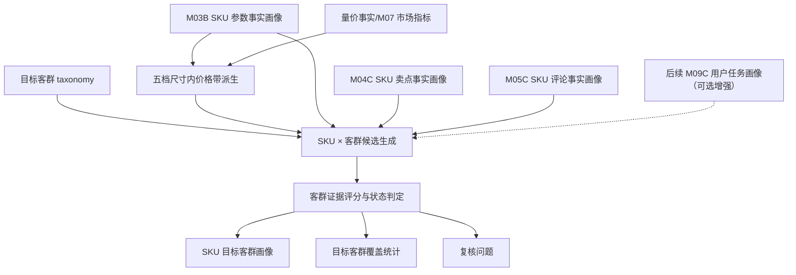

# M10C 目标客群画像详细设计

## 1. 文档定位

本文是 M10C 目标客群画像的工程详细设计，承接：

- `sop_requirements/M10C_target_group_profile_requirements.md`
- `M03B_sku_param_profile_design.md`
- `M04C_claim_fact_profile_design.md`
- `M05C_comment_fact_profile_design.md`
- `M11C_value_battlefield_profile_design.md` 中已经固化的五档尺寸和尺寸内价格带口径
- 已确认的 TV 12 个用户任务预设
- 已确认的 TV 10 个目标客群预设

M10C 是新语义能力层模块，不复用旧 M10 作为主执行链路。它消费事实层结果，基于已发布目标客群 taxonomy，确定每个 SKU 的主/次/评论观察/厂家主打/潜在/未满足目标客群，并生成目标客群覆盖统计。

M10C 首版不使用运行时 LLM。目标客群 taxonomy 可以由分析者使用 LLM 辅助生成，但发布后作为只读资产由程序确定性消费。

M10C 首版不强依赖已经生成的 SKU 用户任务画像。本开发序列中，目标客群模块排在用户任务模块之前，因此首版通过 taxonomy 内的任务 code、评论维度、卖点 code、参数 code 和尺寸价格规则计算 `task_proxy_support`。后续 M09C 落地后，可以作为增强输入接入评分。

## 2. 总体流程



处理步骤：

1. 解析 `project_id`、`category_code`、`batch_id`、SKU 范围。
2. 加载 TV 目标客群 taxonomy；未发布则阻断。
3. 读取 M03B 参数画像，取 M03B 五档尺寸 `size_tier`。
4. 读取量价事实，按 `size_tier` 重新计算 `price_band_in_size_tier`。
5. 读取 M04C 卖点事实，区分参数支撑卖点、无参数支撑卖点和服务履约隔离卖点。
6. 读取 M05C 评论事实，提取人群、用途、购买动机、品牌力、竞品、正负向和参数/卖点支持关系。
7. 首版按目标客群 taxonomy 内的任务 code 和证据规则，间接计算 `task_proxy_support`；M09C 落地后再作为可选增强输入。
8. 对每个 SKU × 客群执行评论、任务、尺寸价格、卖点、参数、市场验证和品牌心理评分。
9. 根据得分、用户声音、支撑状态和封顶规则判定 `relation_status`。
10. 聚合每个 SKU 的主/次/观察/厂家主打/潜在/未满足客群。
11. 重建批次级目标客群覆盖统计。
12. 写入复核问题。

## 3. Taxonomy 结构

### 3.1 数据结构

每个目标客群定义至少包含：

| 字段 | 说明 |
| --- | --- |
| `target_group_code` | 稳定编码 |
| `target_group_name` | 中文名称 |
| `definition` | 客群业务定义 |
| `source_task_codes` | 来源用户任务 code |
| `comment_subdimension_codes` | M05C 评论事实匹配 code |
| `comment_keywords` | 补充关键词，仅用于已清洗评论事实文本，不读取原始评论 |
| `allowed_size_tiers` | 推荐尺寸档 |
| `allowed_price_bands` | 推荐尺寸内价格带 |
| `adjacent_size_tiers` | 可降级相邻尺寸档 |
| `adjacent_price_bands` | 可降级相邻价格带 |
| `claim_codes` | 标准卖点匹配 code |
| `param_codes` | 标准参数匹配 code |
| `brand_boost_codes` | 品牌心理增强 comment code |
| `negative_need_rules` | 负向评论如何转成未满足需求 |
| `service_exclusion_rules` | 服务履约隔离规则 |
| `status_caps` | 不同证据缺口下的最高关系状态 |

### 3.2 TV taxonomy 版本

建议版本：

| 项 | 值 |
| --- | --- |
| taxonomy version | `m10c_tv_target_group_taxonomy_v0.1` |
| rule version | `m10c_tv_target_group_profile_v0.1` |
| product category | `TV` |
| SKU prefix | `TV` |

### 3.3 TV 10 个目标客群规则摘要

| 客群 | 评论匹配 | 任务匹配 | 尺寸价格 | 卖点匹配 | 参数匹配 |
| --- | --- | --- | --- | --- | --- |
| `TG_MAINSTREAM_FAMILY_VIEWER` | `audience_child_family`、`use_living_room_cinema` | 主流客厅、影院沉浸 | 中/大/超大，低到中高 | 客厅影院、HDR、音效、护眼、语音 | 尺寸、4K、HDR、系统、音频 |
| `TG_LARGE_SCREEN_UPGRADER` | `replacement_source`、`appearance_size_fit`、大屏换新表达 | 大屏换新、影院沉浸 | 超大为主，低到中高 | 大屏影院、性价比、全面屏 | 尺寸、价格/英寸、全面屏 |
| `TG_PREMIUM_AV_ENTHUSIAST` | 画质、亮度、控光、色彩、音效 | 高端画质、影院沉浸 | 大/超大，中高/高 | MiniLED/OLED/QD、HDR、色域、控光、画质芯片 | 显示技术、亮度、分区、色域、芯片 |
| `TG_GIANT_HOME_THEATER_BUYER` | 巨幕、新家、大客厅、贴墙 | 影院沉浸、空间融合 | 巨幕，中高/高 | 巨幕影院、HDR、音效、贴墙 | 98 寸以上、旗舰画质、音频、贴墙 |
| `TG_VALUE_MAXIMIZER` | `value_price`、优惠、补贴、划算 | 性价比、大屏换新 | 全尺寸，低/中低/中 | 性价比、同价位高配 | 价格分位、尺寸、配置、销量 |
| `TG_GAMING_SPORTS_USER` | `use_gaming_sports`、高刷、看球、低延迟 | 游戏、体育赛事 | 中/大/超大，中以上 | 高刷、低延迟、HDMI2.1 | 刷新率、HDMI2.1、MEMC、系统性能 |
| `TG_CHILD_FAMILY_LONG_WATCH` | `audience_child_family`、护眼、长看 | 护眼长看、主流家庭 | 小/中/大，中低以上 | 护眼、亮度、色彩 | 护眼、亮度、刷新率、HDR |
| `TG_SENIOR_PARENT_FRIENDLY` | `audience_senior`、语音、广告少、操作简单 | 长辈易用、主流客厅 | 小/中/大，低到中 | 语音、投屏、AI | 语音、智能、网络、内存 |
| `TG_BEDROOM_RENTAL_SECOND_SCREEN` | `audience_rental_room`、`use_bedroom` | 卧室副屏、性价比 | 小屏为主，低/中低 | 性价比、全面屏、语音 | 尺寸、基础画质、智能、价格效率 |
| `TG_SMART_CONNECTED_USER` | `use_casting_online`、投屏、AI、家电联动 | 投屏互联、长辈易用 | 中尺寸以上，中以上 | 投屏、语音、AI、智家、摄像头 | WiFi、网络、AI、语音、IoT、摄像头 |

## 4. 输入读取设计

### 4.1 M03B 参数事实

读取 `core3_sku_param_profile`：

| 字段 | 用途 |
| --- | --- |
| `sku_code`、`model_name` | SKU 标识 |
| `param_values_json.screen_size_inch` | 派生五档尺寸 |
| `param_values_json.dimension_tier_profile.size` | 优先使用的 M03B 尺寸档 |
| `param_values_json.*` | 客群参数能力匹配 |
| `evidence_ids` | 参数证据 |
| `profile_hash` | 增量判断 |

### 4.2 M07 市场事实

读取 `core3_sku_market_profile` 的 `full_observed_window`：

| 字段 | 用途 |
| --- | --- |
| `price_wavg` | 尺寸内价格带派生 |
| `price_per_inch` | 性价比、大屏换新支撑 |
| `sales_volume_total`、`sales_amount_total` | 市场验证 |
| `volume_percentile_in_size`、`amount_percentile_in_size` | 客群购买验证 |
| `evidence_ids` | 市场证据 |

M10C 自行按五档尺寸派生 `price_band_in_size_tier`。不得使用旧 M07 `screen_size_class` 作为主口径。

### 4.3 M04C 卖点事实

读取 `core3_sku_claim_fact_profile` 和 `core3_sku_claim_fact`：

| 字段 | 用途 |
| --- | --- |
| `fact_claim_codes` | 参数支撑后的事实卖点 |
| `claim_code` | 客群卖点匹配 |
| `param_support_status` | 卖点是否可支撑客群 |
| `service_separate_flag` | 服务履约隔离 |
| `evidence_ids` | 卖点证据 |

卖点只能提供厂家表达和能力提示。没有评论或任务支撑时，最高只能到 `brand_claimed_group` 或 `latent_group`。

### 4.4 M05C 评论事实

读取 `core3_sku_comment_fact_profile` 和 `core3_comment_fact_atom`：

| 字段 | 用途 |
| --- | --- |
| `dimension_type` | 区分人群、用途、品牌力、竞品和产品体验 |
| `subdimension_code` | 客群评论匹配 |
| `polarity` | 正/负/混合 |
| `supported_param_codes`、`contradicted_param_codes` | 评论对参数的支持/反证 |
| `supported_claim_codes`、`contradicted_claim_codes` | 评论对卖点的支持/反证 |
| `clean_comment_text` | 仅用于已清洗事实文本的关键词补充，不读取原始评论 |
| `evidence_ids` | 评论证据 |

服务履约类评论不得进入产品客群评分。品牌力类评论只进入 `brand_trust_boost`。

### 4.5 后续 M09C 用户任务画像

M09C 未落地前，M10C 不阻塞。后续接入时读取：

| 字段 | 用途 |
| --- | --- |
| `primary_user_task_codes` | 强任务支撑 |
| `secondary_user_task_codes` | 中等任务支撑 |
| `drag_factor_task_codes` | 未满足任务需求，可转成客群痛点 |
| `task_score` | 替代或增强 `task_proxy_support` |
| `review_required` | 传递复核风险 |

## 5. 价格带派生

M10C 与 M11C 使用相同的价格带派生口径：

```text
在每个 size_tier 内，按 M07 full_observed_window 的 price_wavg 排序；
price_percentile = index / (n - 1)；
再映射到 low/mid_low/mid/mid_high/high。
```

| price_band_in_size_tier | 分位 |
| --- | --- |
| `low` | `0 <= p < 0.20` |
| `mid_low` | `0.20 <= p < 0.40` |
| `mid` | `0.40 <= p < 0.65` |
| `mid_high` | `0.65 <= p < 0.85` |
| `high` | `0.85 <= p <= 1.00` |
| `unknown` | 价格缺失或同尺寸样本不足 |

同尺寸样本不足时，客群关系不能靠价格带成为主客群，需降级或复核。

## 6. 评分设计

### 6.1 评论人群/动机分

`comment_audience_motivation_score` 使用 M05C 评论事实：

| 情况 | 分数建议 |
| --- | ---: |
| 直接命中人群或购买对象，且正向/中性评论不少于 2 条 | 0.85-1.00 |
| 直接命中人群或购买对象，但评论数量少 | 0.60-0.80 |
| 只命中用途场景，无明确人群 | 0.35-0.65 |
| 负向评论集中但需求明确 | 0.45-0.70，并进入 unmet 判断 |
| 无评论命中 | 0 |

### 6.2 任务支撑分

首版 `task_support_score` 由 taxonomy 的 `source_task_codes` 和事实规则代理计算：

| 支撑来源 | 分数建议 |
| --- | ---: |
| 评论直接命中对应任务用途，且卖点或参数至少一类支撑 | 0.75-1.00 |
| 评论直接命中对应任务用途，但卖点/参数弱 | 0.55-0.75 |
| 卖点和参数都支撑，但评论弱 | 0.25-0.50 |
| 只有参数适配 | 0.10-0.30 |
| 无任务证据 | 0 |

M09C 落地后：

| M09C 关系 | 客群任务分 |
| --- | ---: |
| primary user task | 0.85-1.00 |
| secondary user task | 0.55-0.80 |
| drag factor task | 0.45-0.65，并增强 unmet |
| brand claimed task | 0.25-0.50 |
| not supported | 0 |

### 6.3 尺寸价格适配分

| gate status | 规则 | 分数 |
| --- | --- | ---: |
| `matched` | 尺寸档和价格带在客群规则内 | 1.00 |
| `adjacent` | 尺寸或价格相邻 | 0.55 |
| `unknown` | 尺寸或价格缺失 | 0.25 |
| `mismatch` | 尺寸价格明显不匹配 | 0 |

`mismatch` 不一定排除所有客群，但不得成为主客群。例如 85 寸高价 SKU 不应成为卧室副屏主客群。

### 6.4 卖点表达分

`claim_alignment_score`：

| 情况 | 分数建议 |
| --- | ---: |
| 命中客群卖点，且 M04C 判断为参数支撑事实卖点 | 0.80-1.00 |
| 命中客群卖点，参数部分支撑或不适用 | 0.45-0.75 |
| 命中客群卖点但参数不支撑 | 0.15-0.35 |
| 只命中服务履约卖点 | 0，进入服务语境 |
| 未命中 | 0 |

### 6.5 参数能力分

`param_capability_score`：

| 情况 | 分数建议 |
| --- | ---: |
| 客群核心参数多数成立 | 0.75-1.00 |
| 客群核心参数部分成立 | 0.40-0.70 |
| 只有辅助参数成立 | 0.15-0.35 |
| 核心参数缺失或不支持 | 0-0.20 |

参数只能说明适配性。即使参数强，评论/任务弱时也不能成为主客群。

### 6.6 市场验证分

`market_validation_score`：

| 情况 | 分数建议 |
| --- | ---: |
| 同尺寸或同价格池销量/销额较强 | 0.65-1.00 |
| 有销量但不突出 | 0.30-0.60 |
| 样本不足但有效 | 0.15-0.30 |
| 无市场事实 | 0 |

### 6.7 品牌心理增强

`brand_trust_boost` 只使用 M05C 的 `brand_trust`、`brand_repurchase`、`brand_recommendation`：

| 情况 | 分数建议 |
| --- | ---: |
| 本 SKU 评论中多次出现品牌信任/复购/推荐 | 0.03-0.05 |
| 少量出现 | 0.01-0.03 |
| 未出现 | 0 |

品牌心理增强不得单独让 `not_supported` 变成任何有效客群。

### 6.8 综合分

```text
target_group_score =
  comment_audience_motivation_score * 0.30
  + task_support_score * 0.20
  + size_price_fit_score * 0.15
  + claim_alignment_score * 0.12
  + param_capability_score * 0.10
  + market_validation_score * 0.08
  + brand_trust_boost * 0.05
```

综合分只是排序依据，最终关系状态还必须执行封顶规则。

## 7. 状态判定

### 7.1 初始关系

| relation_status | 条件摘要 |
| --- | --- |
| `secondary_target_group` | 评论/任务强，尺寸价格不冲突，卖点或参数至少一类支撑 |
| `comment_observed_group` | 评论直接出现人群/购买动机，但卖点或参数弱 |
| `brand_claimed_group` | 卖点和参数支撑，但评论弱或无 |
| `latent_group` | 尺寸价格和参数能力适配，但评论和卖点弱 |
| `unmet_group_need` | 评论显示该客群需求，但负向集中或支撑不足 |
| `not_supported` | 证据不足、尺寸价格明显不匹配或服务隔离 |

### 7.2 主次客群分配

每个 SKU：

1. 从 `secondary_target_group` 中选择得分最高且符合主客群门槛的一条，升级为 `primary_target_group`。
2. 其余 `secondary_target_group` 最多保留 3 条。
3. 超过 3 条的有效客群降为 `latent_group` 或保留为低优先级观察项。
4. 如果没有主客群，写入 `no_primary_reason_cn`。

主客群建议门槛：

| 条件 | 要求 |
| --- | --- |
| 综合分 | `target_group_score >= 0.68` |
| 评论或任务 | 至少一类强支撑 |
| 尺寸价格 | `matched` 或合理 `adjacent` |
| 卖点/参数 | 至少一类非零支撑 |

### 7.3 封顶规则

| 情况 | 最高状态 |
| --- | --- |
| 评论强，但卖点和参数都弱 | `comment_observed_group` 或 `unmet_group_need` |
| 评论负向集中，且需求明确 | `unmet_group_need` |
| 卖点强 + 参数强 + 评论弱 | `brand_claimed_group` |
| 参数强 + 卖点弱 + 评论弱 | `latent_group` |
| 卖点强 + 参数弱 + 评论弱 | `brand_claimed_group` 且需复核 |
| 三类证据都弱 | `not_supported` |
| 服务履约命中 | `not_supported`，服务语境另记 |

## 8. 数据模型设计

### 8.1 `core3_sku_target_group_profile`

SKU 级画像表，一 SKU 一条。

| 字段 | 类型 | 说明 |
| --- | --- | --- |
| `profile_id` | text | 主键 |
| `project_id` | text | 项目 |
| `category_code` | text | 品类 |
| `batch_id` | text | 批次 |
| `run_id` | text | 运行 ID |
| `module_run_id` | text | 模块运行 ID |
| `product_category` | text | `TV` |
| `taxonomy_version` | text | 客群 taxonomy 版本 |
| `rule_version` | text | 评分规则版本 |
| `sku_code` | text | SKU |
| `model_name` | text | 型号 |
| `brand_name` | text | 品牌 |
| `size_tier` | text | M03B 五档尺寸 |
| `price_band_in_size_tier` | text | 五档尺寸内价格带 |
| `price_percentile_in_size_tier` | numeric | 尺寸内价格分位 |
| `primary_target_group_code` | text | 主客群，可空 |
| `primary_relation_status` | text | 主客群关系 |
| `secondary_target_group_codes_json` | jsonb | 次客群 |
| `comment_observed_group_codes_json` | jsonb | 评论观察客群 |
| `brand_claimed_group_codes_json` | jsonb | 厂家主打客群 |
| `latent_group_codes_json` | jsonb | 潜在客群 |
| `unmet_group_need_codes_json` | jsonb | 未满足客群需求 |
| `target_group_summary_json` | jsonb | 客群摘要 |
| `review_required` | boolean | 是否复核 |
| `review_status` | text | 复核状态 |
| `review_reason_json` | jsonb | 复核原因 |
| `confidence` | numeric | 置信度 |
| `evidence_ids_json` | jsonb | 证据 |
| `profile_hash` | text | 输出 hash |
| `is_current` | boolean | 当前版本 |

唯一键：

```text
(batch_id, taxonomy_version, sku_code, rule_version, is_current)
```

### 8.2 `core3_sku_target_group_score`

SKU x 客群分数表。

| 字段 | 类型 | 说明 |
| --- | --- | --- |
| `score_id` | text | 主键 |
| `project_id` | text | 项目 |
| `category_code` | text | 品类 |
| `batch_id` | text | 批次 |
| `product_category` | text | `TV` |
| `taxonomy_version` | text | 客群 taxonomy 版本 |
| `rule_version` | text | 评分规则版本 |
| `sku_code` | text | SKU |
| `model_name` | text | 型号 |
| `brand_name` | text | 品牌 |
| `target_group_code` | text | 客群 code |
| `target_group_name` | text | 客群名称 |
| `relation_status` | text | 关系状态 |
| `target_group_score` | numeric | 综合分 |
| `comment_audience_motivation_score` | numeric | 评论分 |
| `task_support_score` | numeric | 任务分 |
| `size_price_fit_score` | numeric | 尺寸价格分 |
| `claim_alignment_score` | numeric | 卖点分 |
| `param_capability_score` | numeric | 参数分 |
| `market_validation_score` | numeric | 市场验证分 |
| `brand_trust_boost` | numeric | 品牌心理增强 |
| `sentiment_polarity` | text | 情绪方向 |
| `size_tier` | text | 尺寸档 |
| `price_band_in_size_tier` | text | 尺寸内价格带 |
| `score_breakdown_json` | jsonb | 分项命中详情 |
| `status_reason_cn` | text | 中文解释 |
| `evidence_ids_json` | jsonb | 证据 |
| `review_required` | boolean | 是否复核 |
| `review_status` | text | 复核状态 |
| `confidence` | numeric | 置信度 |
| `result_hash` | text | 输出 hash |
| `is_current` | boolean | 当前版本 |

唯一键：

```text
(batch_id, taxonomy_version, sku_code, target_group_code, rule_version, is_current)
```

### 8.3 `core3_target_group_coverage`

批次级客群覆盖统计表。

| 字段 | 类型 | 说明 |
| --- | --- | --- |
| `coverage_id` | text | 主键 |
| `project_id` | text | 项目 |
| `category_code` | text | 品类 |
| `batch_id` | text | 批次 |
| `product_category` | text | `TV` |
| `taxonomy_version` | text | 客群 taxonomy 版本 |
| `rule_version` | text | 规则版本 |
| `target_group_code` | text | 客群 code |
| `target_group_name` | text | 客群名称 |
| `sku_count` | integer | 有效覆盖 SKU 数 |
| `relation_status_counts_json` | jsonb | 各状态数量 |
| `primary_sku_codes_json` | jsonb | 主客群 SKU |
| `secondary_sku_codes_json` | jsonb | 次客群 SKU |
| `comment_observed_sku_codes_json` | jsonb | 评论观察 SKU |
| `brand_claimed_sku_codes_json` | jsonb | 厂家主打 SKU |
| `latent_sku_codes_json` | jsonb | 潜在 SKU |
| `unmet_need_sku_codes_json` | jsonb | 未满足需求 SKU |
| `top_skus_json` | jsonb | 高分 SKU 摘要 |
| `coverage_hash` | text | 输出 hash |
| `is_current` | boolean | 当前版本 |

唯一键：

```text
(batch_id, taxonomy_version, target_group_code, rule_version, is_current)
```

## 9. 服务设计

### 9.1 类职责

| 类 | 职责 |
| --- | --- |
| `M10CTargetGroupDefinition` | 单个目标客群定义 |
| `M10CTargetGroupTaxonomy` | 品类目标客群 taxonomy |
| `M10CTargetGroupTaxonomyLoader` | 加载已发布 taxonomy |
| `M10CInputReader` | 读取 M03B/M04C/M05C/M07 输入 |
| `M10CProfileBuilder` | 评分、状态判定、SKU 画像和覆盖统计生成 |
| `M10CTargetGroupRepository` | 写入 profile、score、coverage |
| `M10CRunner` | 模块入口，处理 batch、范围、错误和 summary |

### 9.2 输入对象

```python
@dataclass(frozen=True)
class M10CSkuInput:
    sku_code: str
    model_name: str | None
    brand_name: str | None
    param_profile: Core3SkuParamProfile
    market_profile: Core3SkuMarketProfile | None
    claim_profile: Core3SkuClaimFactProfile | None
    claim_facts: tuple[Core3SkuClaimFact, ...]
    comment_profile: Core3SkuCommentFactProfile | None
    comment_facts: tuple[Core3CommentFactAtom, ...]
    size_tier: str
    price_band_in_size_tier: str
    price_percentile_in_size_tier: Decimal | None
```

### 9.3 输出对象

```python
@dataclass(frozen=True)
class M10CServiceResult:
    input_count: int
    profile_count: int
    score_count: int
    coverage_count: int
    warnings: list[str]
    write_summary: dict[str, dict[str, int]]
    summary: dict[str, Any]
```

## 10. CLI 设计

### 10.1 Pipeline CLI

新增命令：

```bash
python -m app.cli.catforge_pipeline run-target-group \
  --product-category tv \
  --batch-id latest \
  --force-rebuild \
  --format json
```

参数：

| 参数 | 说明 |
| --- | --- |
| `--product-category` | 首版 `tv` |
| `--batch-id` | `latest` 或具体 batch |
| `--sku-code` | 可重复，限定 SKU |
| `--target-group-code` | 可重复，限定客群 |
| `--force-rebuild` | hash 冲突时替换 |
| `--format` | `json`、`text` |

自然语言 `ask` 路由：

| 用户说法 | 路由 |
| --- | --- |
| “生成彩电目标客群画像” | `run-target-group --product-category tv` |
| “重新分析 100A4F 的目标客户” | `run-target-group --sku-code ...` |
| “新数据来了，把目标客群准备好” | `run-target-group --batch-id latest` |

### 10.2 Insight CLI

新增查询：

```bash
python -m app.cli.catforge_insight target-group-taxonomy --product-category tv --format json
python -m app.cli.catforge_insight sku-target-group --query 100A4F --include-scores --format json
python -m app.cli.catforge_insight target-group-skus --target-group-code TG_VALUE_MAXIMIZER --sku-limit 100 --format json
```

自然语言 `ask` 路由：

| 用户说法 | 路由 |
| --- | --- |
| “查某个 SKU 的目标客群” | `sku-target-group` |
| “这个 SKU 的目标客户是谁” | `sku-target-group` |
| “查彩电目标客群预设” | `target-group-taxonomy` |
| “性价比理性用户有哪些 SKU” | `target-group-skus` |
| “哪些 SKU 是未满足长辈友好需求” | `target-group-skus --relation-status unmet_group_need` |

## 11. Skill 更新要求

### 11.1 `catforge-pipeline`

新增执行场景：

- “重新生成彩电目标客群画像”
- “重跑某个 SKU 的目标客户分析”
- “新数据来了，把目标客群准备好”

输出摘要必须包含：

- 批次、品类、taxonomy/rule 版本。
- SKU profile 数、score 数、coverage 数。
- 主客群分布、关系状态分布。
- 缺少 M05C/M07 等输入的 warning。

### 11.2 `catforge-insight`

新增查询场景：

- “查某个 SKU 的目标客群”
- “查彩电目标客群预设”
- “某个目标客群有哪些 SKU”
- “哪些 SKU 是未满足某类客群需求”

回复时使用业务语言，避免要求用户知道 M10C。

## 12. 测试要求

### 12.1 单元测试

必须覆盖：

1. Taxonomy 校验：10 个目标客群 code 稳定，规则字段完整。
2. 尺寸价格派生：使用 M03B 五档尺寸和尺寸内价格带，不使用旧 M07 四档。
3. 主流家庭测试：家庭/客厅评论 + 尺寸价格合适时进入主流家庭观影用户。
4. 大屏换新测试：换新/大屏评论 + 70-85 寸价格合适时进入大屏换新升级用户。
5. 高端影音测试：MiniLED/亮度/控光/画质评论强时进入高端影音体验用户。
6. 性价比测试：价值评论 + 低价格分位 + 销量支撑时进入性价比理性用户。
7. 长辈友好测试：给爸妈/老人评论 + 语音/系统支撑时进入长辈友好使用用户。
8. 卧室副屏排除测试：85 寸高价 SKU 不得成为卧室副屏主客群。
9. 品牌力测试：`brand_trust` 只能增强置信度，不能单独生成客群。
10. 服务隔离测试：安装/物流/售后不得进入产品客群。
11. 负向评论测试：负向但需求明确时输出 `unmet_group_need`。
12. CLI 测试：全量、单 SKU、单客群、自然语言 ask 都有确定性结果。

### 12.2 集成测试

用内存 SQLite 构造 M03B/M04C/M05C/M07 最小输入：

- 3 个 SKU 覆盖不同尺寸价格。
- 1 个 SKU 有家庭/大屏/性价比正向评论。
- 1 个 SKU 有厂家智能卖点但无评论，输出 `brand_claimed_group`。
- 1 个 SKU 有长辈使用负向评论，输出 `unmet_group_need`。

断言：

- 生成 3 个 SKU profile。
- 生成 `3 x 10` 个 score。
- 生成 10 个 coverage。
- 自然语言查询能路由到目标客群查询。

## 13. 增量与性能

M10C 首版不调用 LLM，不读取原始评论文本，全量 TV SKU 规模下可一次执行。

增量重算触发：

| 上游变化 | 重算范围 |
| --- | --- |
| M03B 参数画像变更 | 受影响 SKU 的客群分数，覆盖统计重建 |
| M04C 卖点画像变更 | 受影响 SKU 的客群分数，覆盖统计重建 |
| M05C 评论画像变更 | 受影响 SKU 的客群分数，覆盖统计重建 |
| M07 量价事实变更 | 同尺寸档价格带和受影响 SKU，覆盖统计重建 |
| 目标客群 taxonomy 变更 | 全量重算 |
| 后续 M09C 用户任务画像变更 | 接入增强输入后，受影响 SKU 的客群分数，覆盖统计重建 |

如果后续品类扩展导致 SKU 数量显著增加，再补充 chunk 执行和 coverage 单独重建能力。

## 14. 复核规则

需要复核的情况：

| 情况 | review reason |
| --- | --- |
| 没有主客群但评论事实充足 | `no_primary_with_enough_comments` |
| 评论强但参数/卖点都弱 | `comment_strong_claim_param_weak` |
| 卖点强但参数弱 | `brand_claim_param_weak` |
| 负向评论形成未满足需求 | `negative_comment_unmet_need` |
| 尺寸或价格缺失 | `missing_size_or_price_band` |
| 品牌力是唯一信号 | `brand_power_only_not_enough` |
| 服务履约信号被隔离 | `service_signal_excluded` |
| 样本量不足 | `insufficient_market_or_comment_sample` |

复核不阻断写入，但关系状态和置信度必须体现风险。
