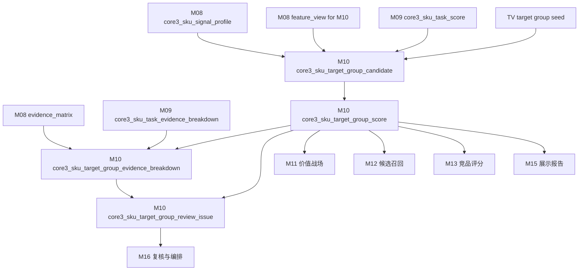
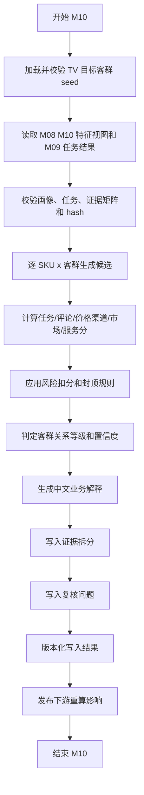

# M10 目标客群模块详细设计

## 1. 文档定位

本文是 CatForge 彩电核心三竞品 SOP 的 M10 详细设计，承接：

- 需求文档：`docs/core3_mvp/real_data_v2/sop_requirements/M10_target_group_requirements.md`
- 总体设计：`docs/core3_mvp/real_data_v2/sop_detailed_design/00_architecture_data_dictionary_design.md`
- 上游 M08：`core3_sku_signal_profile`、`core3_sku_signal_evidence_matrix`、`core3_sku_downstream_feature_view`
- 上游 M09：`core3_sku_task_score`、`core3_sku_task_evidence_breakdown`、`core3_sku_task_review_issue`
- 上游 M02：`core3_evidence_atom`，只通过 M08/M09 evidence 引用回溯
- 目标客群 seed：`apps/api-server/app/rules/tv_core3_mvp_seed_v0_2.json`
- 下游 M11、M12、M13、M14、M15、M16

M10 基于 M09 用户任务、M08 SKU 综合信号画像、M06 经 M08 汇总的评论客群线索和 M07 经 M08 汇总的市场画像，推断每个 SKU 面向的主/次/弱目标客群，并输出客群候选、客群得分、关系等级、置信度、证据拆解和复核问题。

目标客群不是评论里出现“老人”“孩子”“游戏”“安装”等词后的直接标签，也不是 M09 seed 中 `default_target_group_codes` 的自动映射。目标客群是对“谁会买、为什么买、在哪个价格和渠道语境下买”的业务归纳。

## 2. 模块职责

### 2.1 本模块解决什么

M10 解决六类工程问题：

1. 对每个 SKU 和 9 个 TV MVP 目标客群建立统一关系口径。
2. 将 M09 用户任务转换为“购买人群”判断，但保留任务不是客群的边界。
3. 综合任务支撑、评论客群线索、价格渠道适配、市场验证和服务侧面信号。
4. 为 M11 价值战场、M12 候选召回、M13 竞品评分提供统一客群输入。
5. 为 M15 高层展示页提供业务化中文解释，回答“这类人为什么可能买这个 SKU”。
6. 用 `profile_hash`、`task_score_result_hash`、`target_group_seed_version`、`rule_version` 支撑增量重算。

### 2.2 本模块不解决什么

| 不做事项 | 原因 | 后续模块 |
| --- | --- | --- |
| 不读取原始四张表 | M10 必须消费 M08/M09 上游产物 | M00-M09 |
| 不直接读取 M06 评论散表 | 评论客群线索必须经 M06/M08 汇总 | M06/M08 |
| 不把 seed 默认客群映射当结论 | seed 只能触发候选或提供规则骨架 | M10 |
| 不把单个词直接等同客群 | “老人”“孩子”“安装”只是线索 | M10 |
| 不把服务安装评论泛化为产品人群 | 服务只能支撑新家装修或服务侧面 | M10/M11 |
| 不生成价值战场 | 客群是战场输入，不是战场结论 | M11 |
| 不做卖点价值分层 | 分层在战场上下文后处理 | M11.5 |
| 不召回竞品候选 | 客群相似只是召回特征之一 | M12 |
| 不计算竞品评分 | 客群相似在 M13 pair 级评分 | M13 |
| 不选择核心三竞品 | M14 选择核心三 | M14 |
| 不输出算法调试文案给高层页 | M15 负责报告表达 | M15 |

### 2.3 允许复用历史结果

允许复用历史 M10 输出，但必须同时满足：

- M08 `profile_hash` 未变化。
- M08 `core3_sku_downstream_feature_view where for_module='M10'` 的 `view_hash` 未变化。
- M09 当前任务分和任务证据拆分的 hash 未变化。
- M09 任务 seed 版本和 M09 rule version 未变化。
- 目标客群 seed 文件 hash 未变化。
- `target_group_seed_version` 未变化。
- M10 评分规则版本、阈值版本、封顶规则版本未变化。
- 历史记录 `is_current=true` 且 `processing_status` 不是 `failed`、`blocked`。

## 3. 输入输出总览

### 3.1 必须输入

| 输入 | 来源模块 | 表或文件 | 用途 |
| --- | --- | --- | --- |
| SKU 画像 | M08 | `core3_sku_signal_profile` | SKU 主画像、价格带、尺寸、市场、风险 |
| M10 特征视图 | M08 | `core3_sku_downstream_feature_view where for_module='M10'` | 默认客群推断入口 |
| 证据矩阵 | M08 | `core3_sku_signal_evidence_matrix` | 判断客群相关证据覆盖 |
| 用户任务得分 | M09 | `core3_sku_task_score` | 任务支撑分和任务关系等级 |
| 任务证据拆解 | M09 | `core3_sku_task_evidence_breakdown` | 任务证据来自哪些域 |
| 任务复核问题 | M09 | `core3_sku_task_review_issue` | 继承任务侧风险 |
| evidence 原子 | M02 | `core3_evidence_atom` | 通过 evidence ID 回溯证据 |
| TV 客群 seed | 规则资产 | `tv_core3_mvp_seed_v0_2.json.target_groups` | 客群定义、来源任务、市场适配规则和战场提示 |

### 3.2 从 M09 消费的任务结果

M10 不重新推导任务，只消费 M09 current 结果。

| M09 内容 | M10 用途 |
| --- | --- |
| `task_code`、`task_name_cn` | 匹配客群来源任务 |
| `task_score` | 形成任务支撑分 |
| `relation_level` | 主任务强支撑，弱任务只能形成弱客群线索 |
| `business_reason_cn` | 客群解释中的购买任务依据 |
| `evidence_ids` | 客群到任务证据的回溯 |
| `review_required`、`risk_flags_json` | 降低客群置信度或触发复核 |
| `result_hash`、`task_seed_version`、`rule_version` | 增量和审计 |

M09 seed 中的 `default_target_group_codes` 只能作为候选提示，不能直接生成 M10 结论。

### 3.3 从 M08 消费的画像特征

| 特征域 | M08 字段或视图内容 | M10 用途 |
| --- | --- | --- |
| SKU 主数据 | `sku_code`、`model_name`、`brand_name`、`size_segment`、`price_band`、`main_platform` | 客群适配和业务解释 |
| 评论客群线索 | `target_group_cue_comment_signals` | 判断人群、家庭结构、购买动机线索 |
| 价格感知 | `price_perception_signals` | 支撑性价比用户、预算用户、大屏换新 |
| 服务信号 | `service_signal` | 支撑新家装修用户或服务侧面 |
| 市场画像 | `market_summary_json`、`market_signal_summary_json` | 判断价格带、销量、销额、平台表现 |
| 可比池 | `comparable_pool_summary_json` | 判断同尺寸、同价位人群适配是否成立 |
| 风险缺失 | `missing_signals_json`、`risk_signals_json`、`domain_completeness_json` | 降低置信度或进入复核 |
| 证据索引 | `evidence_refs`、`evidence_matrix_refs_json` | 追溯和增量重算 |

### 3.4 明确不消费

| 数据 | 禁止原因 |
| --- | --- |
| 原始 `comment_data` | M10 不直接解析评论 |
| 原始 `week_sales_data`、`attribute_data`、`selling_points_data` | 已由上游分层处理 |
| M03/M04b/M06/M07 散表业务字段 | 已经由 M08 汇总 |
| M11 价值战场结果 | M11 是下游 |
| M12-M15 竞品和报告结果 | M10 是上游 |

### 3.5 输出表

| 输出表 | 粒度 | 用途 |
| --- | --- | --- |
| `core3_sku_target_group_candidate` | SKU + 客群 + 候选触发版本 | 记录为什么进入候选、为什么被拒绝或复核 |
| `core3_sku_target_group_score` | SKU + 客群 + 规则版本 | 记录客群分、关系等级、置信度和中文解释 |
| `core3_sku_target_group_evidence_breakdown` | SKU + 客群 + 证据域 | 记录任务、评论、价格渠道、市场、服务、风险分域证据 |
| `core3_sku_target_group_review_issue` | SKU + 客群或 SKU 级问题 | 记录客群推断复核问题 |

### 3.6 模块关系



## 4. 目标客群 seed 设计

### 4.1 预制和推导边界

M10 允许预制的是客群本体和规则骨架，不允许预制 SKU 客群结论。

| 预制项 | 内容 | 是否可直接成为 SKU 结论 |
| --- | --- | --- |
| `target_group_code` | 稳定客群编码 | 否 |
| `target_group_name` | 中文业务名 | 否 |
| `definition` | 客群定义 | 否 |
| `aliases`、`keywords` | 别名和关键词 | 否 |
| `source_task_codes`、`mapped_task_codes` | 来源任务 | 否 |
| `market_fit_rule.signals` | 市场适配信号 | 否 |
| `mapped_battlefield_codes` | 战场提示 | 否，仅 M11 候选参考 |
| `evidence_requirement` | 证据要求 | 否 |

每个 SKU 的目标客群必须由 M08/M09 的真实画像、任务分、评论线索、价格渠道和市场验证推导出来。

### 4.2 seed 版本

首版使用：

| 项 | 值 |
| --- | --- |
| seed 文件 | `apps/api-server/app/rules/tv_core3_mvp_seed_v0_2.json` |
| 文件内版本 | `core3-mvp-0.2.0` |
| 建议业务版本 | `tv_core3_mvp_seed_v0_2` |
| category_code | `TV` |

M10 输出同时保存：

- `target_group_seed_version='tv_core3_mvp_seed_v0_2'`
- `target_group_seed_file_version='core3-mvp-0.2.0'`
- `target_group_seed_hash`

### 4.3 MVP 9 个目标客群

M10 必须覆盖 seed 中 9 个 `TG_*` 客群，不得使用旧参考中的 `GROUP_*` 代码，也不得临时新增“服务敏感用户”。

| 客群 code | 业务名称 | 定义 | 主要来源任务 | 市场适配信号 |
| --- | --- | --- | --- | --- |
| `TG_FAMILY_UPGRADE` | 家庭换新用户 | 以全家客厅观影、大屏升级和家庭娱乐为核心诉求的人群 | 客厅影院观影、大屏换新 | `large_screen`、`mid_high_sales` |
| `TG_AV_QUALITY_SEEKER` | 画质影音用户 | 对画质技术、亮度、控光、色彩和影音效果敏感的人群 | 高端画质影音 | `premium_picture_claims`、`premium_price_acceptance` |
| `TG_GAMER` | 游戏用户 | 使用电视连接主机或进行游戏娱乐，关注高刷、低延迟和接口的人群 | 游戏娱乐 | `gaming_claims`、`gaming_comments` |
| `TG_SPORTS_FAN` | 体育观看用户 | 经常观看球赛、赛事和高速运动画面的人群 | 体育赛事观看 | `sports_comments`、`motion_claims` |
| `TG_SENIOR_FAMILY` | 长辈家庭用户 | 给父母、老人或长辈使用，重视简单、语音、少广告的人群 | 长辈易用 | `senior_comments`、`low_ads_risk` |
| `TG_CHILD_FAMILY` | 儿童家庭用户 | 家中有儿童，重视护眼、内容管理和长期观看舒适度的人群 | 儿童护眼 | `eye_care_claims`、`child_comments` |
| `TG_VALUE_BUYER` | 性价比用户 | 预算敏感、关注价格效率、优惠和销量口碑的人群 | 性价比购买、大屏换新 | `low_price_percentile`、`high_sales_volume` |
| `TG_NEW_HOME_DECORATOR` | 新家装修用户 | 新家装修或客厅布置阶段，重视外观、尺寸、安装和家居适配的人群 | 新家装修搭配 | `design_claims`、`service_comments` |
| `TG_BEDROOM_SECOND_TV` | 卧室副屏用户 | 购买卧室、副屏或第二台电视，重视尺寸适配、低价和易用的人群 | 卧室/副屏 | `small_size_fit`、`low_price_band` |

### 4.4 seed 校验

M10 启动前必须校验 seed：

| 校验 | 失败处理 |
| --- | --- |
| `category_code='TV'` | 阻塞 |
| `target_groups` 正好覆盖 9 个 MVP target_group_code | 阻塞 |
| 每个客群有中文名称、定义、source_task_codes | 阻塞 |
| `source_task_codes` 均存在于 M09 10 个任务 seed | 阻塞 |
| `market_fit_rule.signals` 可识别 | 复核 |
| `mapped_battlefield_codes` 只作为 M11 提示 | 校验不影响 M10 结论 |
| target_group_code 稳定且无重复 | 阻塞 |
| seed hash 可计算 | 阻塞 |

## 5. 数据模型设计

### 5.1 通用字段约定

M10 输出表必须包含以下通用字段。

| 字段 | 类型建议 | 必填 | 说明 |
| --- | --- | --- | --- |
| `project_id` | `text` | 是 | 项目 ID |
| `category_code` | `text` | 是 | MVP 为 `TV` |
| `batch_id` | `text` | 是 | 批次 ID |
| `run_id` | `text` | 否 | 全链路运行 ID |
| `module_run_id` | `text` | 否 | M10 模块运行 ID |
| `rule_version` | `text` | 是 | M10 评分规则版本 |
| `target_group_seed_version` | `text` | 是 | 客群 seed 业务版本 |
| `target_group_seed_file_version` | `text` | 是 | seed 文件内版本 |
| `target_group_seed_hash` | `text` | 是 | seed 文件内容 hash |
| `profile_hash` | `text` | 是 | M08 SKU 画像 hash |
| `feature_view_hash` | `text` | 是 | M08 M10 特征视图 hash |
| `task_score_fingerprint` | `text` | 是 | M09 任务结果和证据拆分 hash |
| `input_fingerprint` | `text` | 是 | 输入 hash |
| `result_hash` | `text` | 是 | 输出业务内容 hash |
| `is_current` | `boolean` | 是 | 是否当前版本 |
| `processing_status` | `text` | 是 | `success`、`warning`、`review_required`、`blocked`、`failed` |
| `review_required` | `boolean` | 是 | 是否需要复核 |
| `review_status` | `text` | 是 | `auto_pass`、`review_required`、`approved`、`rejected`、`waived` |
| `review_reason_json` | `jsonb` | 是 | 复核原因 |
| `created_at` | `timestamptz` | 是 | 创建时间 |
| `updated_at` | `timestamptz` | 是 | 更新时间 |

### 5.2 枚举定义

#### 5.2.1 `candidate_status`

```text
active
rejected
review_required
blocked
```

#### 5.2.2 `candidate_source`

```text
task
comment
price_channel
market
service
seed_hint
seed_gap
```

#### 5.2.3 `relation_level`

```text
main
secondary
weak
insufficient
blocked
```

#### 5.2.4 `evidence_domain`

```text
task
comment
price_channel
market
service
risk
seed
profile
```

#### 5.2.5 `support_level`

```text
strong
medium
weak
missing
conflict
not_applicable
```

#### 5.2.6 `review_issue_type`

```text
missing_feature_view
missing_task_score
only_comment
only_service
price_mismatch
market_limited
task_conflict
task_review_inherited
comment_quality_risk
seed_gap
profile_blocked
high_score_contradiction
```

## 6. 表设计：`core3_sku_target_group_candidate`

### 6.1 表职责

`core3_sku_target_group_candidate` 记录目标客群候选生成阶段。它回答“这个 SKU 为什么可能面向这个客群”，也记录被拒绝或需要复核的候选。

候选记录不等于最终客群。最终关系以 `core3_sku_target_group_score` 为准。

### 6.2 字段级契约

| 字段 | 类型建议 | 必填 | 来源 | 说明 |
| --- | --- | --- | --- | --- |
| `sku_target_group_candidate_id` | `uuid` | 是 | M10 | 主键 |
| `project_id` | `text` | 是 | M00 | 项目 ID |
| `category_code` | `text` | 是 | M00/M08 | 品类 |
| `batch_id` | `text` | 是 | M00 | 批次 |
| `run_id` | `text` | 否 | M16 | 全链路运行 ID |
| `module_run_id` | `text` | 否 | M10 | 本模块运行 ID |
| `sku_signal_profile_id` | `uuid` | 是 | M08 | SKU 画像 ID |
| `sku_downstream_feature_view_id` | `uuid` | 是 | M08 | M10 特征视图 ID |
| `sku_code` | `text` | 是 | M08 | SKU |
| `model_code` | `text` | 否 | M08 | 型号编码 |
| `model_name` | `text` | 否 | M08 | 型号名 |
| `brand_name` | `text` | 否 | M08 | 品牌 |
| `target_group_code` | `text` | 是 | seed | 客群 code |
| `target_group_name_cn` | `text` | 是 | seed | 客群中文名 |
| `target_group_definition_cn` | `text` | 是 | seed | 客群定义 |
| `candidate_source_json` | `jsonb` | 是 | M10 | 任务、评论、价格渠道、市场、服务触发来源 |
| `candidate_source_count` | `integer` | 是 | M10 | 命中来源域数量 |
| `source_task_codes_json` | `jsonb` | 是 | M09/seed | 关联任务和关系等级 |
| `candidate_initial_score` | `numeric(6,4)` | 是 | M10 | 候选阶段粗分 |
| `candidate_reason_cn` | `text` | 是 | M10 | 中文候选原因 |
| `candidate_status` | `text` | 是 | M10 | active/rejected/review_required/blocked |
| `reject_reason_json` | `jsonb` | 是 | M10 | 被拒绝原因 |
| `missing_signals_json` | `jsonb` | 是 | M08/M10 | 缺失信号 |
| `risk_flags_json` | `jsonb` | 是 | M08/M09/M10 | 风险 |
| `evidence_ids` | `uuid[]` | 是 | M08/M09/M02 | 候选阶段代表 evidence |
| `evidence_matrix_refs_json` | `jsonb` | 是 | M08 | M08 证据矩阵引用 |
| `profile_hash` | `text` | 是 | M08 | 画像 hash |
| `feature_view_hash` | `text` | 是 | M08 | M10 视图 hash |
| `task_score_fingerprint` | `text` | 是 | M09/M10 | M09 任务结果 hash |
| `target_group_seed_version` | `text` | 是 | seed | 客群 seed 业务版本 |
| `target_group_seed_file_version` | `text` | 是 | seed | seed 文件版本 |
| `target_group_seed_hash` | `text` | 是 | seed | seed hash |
| `rule_version` | `text` | 是 | M10 | 规则版本 |
| `input_fingerprint` | `text` | 是 | M10 | 输入 hash |
| `result_hash` | `text` | 是 | M10 | 结果 hash |
| `is_current` | `boolean` | 是 | M10 | 是否当前 |
| `processing_status` | `text` | 是 | M10 | 处理状态 |
| `review_required` | `boolean` | 是 | M10 | 是否复核 |
| `review_status` | `text` | 是 | M10 | 复核状态 |
| `review_reason_json` | `jsonb` | 是 | M10 | 复核原因 |
| `created_at` | `timestamptz` | 是 | M10 | 创建时间 |
| `updated_at` | `timestamptz` | 是 | M10 | 更新时间 |

### 6.3 主键、唯一键和索引

主键：

```sql
primary key (sku_target_group_candidate_id)
```

唯一键：

```sql
unique (
  project_id,
  category_code,
  batch_id,
  sku_code,
  target_group_code,
  profile_hash,
  task_score_fingerprint,
  target_group_seed_version,
  rule_version,
  result_hash
)
```

当前版本唯一索引：

```sql
create unique index uq_core3_sku_target_group_candidate_current
on core3_sku_target_group_candidate(
  project_id,
  category_code,
  batch_id,
  sku_code,
  target_group_code,
  target_group_seed_version,
  rule_version
)
where is_current = true;
```

查询索引：

```sql
create index idx_core3_sku_target_group_candidate_sku
on core3_sku_target_group_candidate(project_id, category_code, batch_id, sku_code);

create index idx_core3_sku_target_group_candidate_group
on core3_sku_target_group_candidate(project_id, category_code, batch_id, target_group_code, candidate_status);

create index idx_core3_sku_target_group_candidate_review
on core3_sku_target_group_candidate(project_id, category_code, batch_id, review_required);

create index idx_core3_sku_target_group_candidate_source_gin
on core3_sku_target_group_candidate
using gin (candidate_source_json jsonb_path_ops);
```

## 7. 表设计：`core3_sku_target_group_score`

### 7.1 表职责

`core3_sku_target_group_score` 是 M10 主输出，记录每个 SKU 对每个目标客群的最终客群分、关系等级、置信度和中文业务解释。

MVP 建议每个有效 SKU 对 9 个目标客群都生成一行 score，未命中的客群关系为 `insufficient`。这样 M11-M15 可以稳定消费，不需要猜测缺行是未计算还是不相关。

### 7.2 字段级契约

| 字段 | 类型建议 | 必填 | 来源 | 说明 |
| --- | --- | --- | --- | --- |
| `sku_target_group_score_id` | `uuid` | 是 | M10 | 主键 |
| `project_id` | `text` | 是 | M00 | 项目 |
| `category_code` | `text` | 是 | M00/M08 | 品类 |
| `batch_id` | `text` | 是 | M00 | 批次 |
| `run_id` | `text` | 否 | M16 | 全链路运行 ID |
| `module_run_id` | `text` | 否 | M10 | 模块运行 ID |
| `sku_signal_profile_id` | `uuid` | 是 | M08 | 画像 ID |
| `sku_downstream_feature_view_id` | `uuid` | 是 | M08 | M10 特征视图 ID |
| `sku_code` | `text` | 是 | M08 | SKU |
| `model_code` | `text` | 否 | M08 | 型号编码 |
| `model_name` | `text` | 否 | M08 | 型号名 |
| `brand_name` | `text` | 否 | M08 | 品牌 |
| `target_group_code` | `text` | 是 | seed | 客群 code |
| `target_group_name_cn` | `text` | 是 | seed | 客群中文名 |
| `target_group_definition_cn` | `text` | 是 | seed | 客群定义 |
| `task_support_score` | `numeric(6,4)` | 是 | M10 | M09 任务支撑分 |
| `comment_group_signal_score` | `numeric(6,4)` | 是 | M10 | 评论客群线索分 |
| `price_channel_fit_score` | `numeric(6,4)` | 是 | M10 | 价格渠道适配分 |
| `market_validation_score` | `numeric(6,4)` | 是 | M10 | 市场验证分 |
| `service_side_score` | `numeric(6,4)` | 是 | M10 | 服务侧面分，只可作为侧证 |
| `raw_target_group_score` | `numeric(6,4)` | 是 | M10 | 风险修正前分 |
| `risk_penalty` | `numeric(6,4)` | 是 | M10 | 风险扣分 |
| `target_group_score` | `numeric(6,4)` | 是 | M10 | 最终客群分 |
| `relation_level` | `text` | 是 | M10 | main/secondary/weak/insufficient/blocked |
| `relation_reason_json` | `jsonb` | 是 | M10 | 关系等级判定原因 |
| `confidence` | `numeric(6,4)` | 是 | M10 | 置信度 |
| `confidence_level` | `text` | 是 | M10 | high/medium/low/unknown |
| `evidence_domain_count` | `integer` | 是 | M10 | 有效证据域数量 |
| `effective_domain_json` | `jsonb` | 是 | M10 | 哪些域有效 |
| `source_task_scores_json` | `jsonb` | 是 | M09/M10 | 来源任务及得分 |
| `score_breakdown_json` | `jsonb` | 是 | M10 | 权重、原始分、封顶、风险 |
| `cap_rule_applied_json` | `jsonb` | 是 | M10 | 触发的封顶规则 |
| `missing_signals_json` | `jsonb` | 是 | M08/M10 | 缺失信号 |
| `risk_flags_json` | `jsonb` | 是 | M08/M09/M10 | 风险 |
| `business_reason_cn` | `text` | 是 | M10 | 中文业务解释摘要 |
| `business_reason_parts_json` | `jsonb` | 是 | M10 | 购买任务、用户线索、价格渠道、市场验证、待复核点 |
| `evidence_ids` | `uuid[]` | 是 | M08/M09/M02 | 核心 evidence |
| `evidence_matrix_refs_json` | `jsonb` | 是 | M08 | 证据矩阵引用 |
| `profile_hash` | `text` | 是 | M08 | 画像 hash |
| `feature_view_hash` | `text` | 是 | M08 | M10 视图 hash |
| `task_score_fingerprint` | `text` | 是 | M09/M10 | M09 任务结果 hash |
| `target_group_seed_version` | `text` | 是 | seed | seed 业务版本 |
| `target_group_seed_file_version` | `text` | 是 | seed | seed 文件版本 |
| `target_group_seed_hash` | `text` | 是 | seed | seed hash |
| `rule_version` | `text` | 是 | M10 | 规则版本 |
| `input_fingerprint` | `text` | 是 | M10 | 输入 hash |
| `result_hash` | `text` | 是 | M10 | 结果 hash |
| `is_current` | `boolean` | 是 | M10 | 是否当前 |
| `processing_status` | `text` | 是 | M10 | 处理状态 |
| `review_required` | `boolean` | 是 | M10 | 是否复核 |
| `review_status` | `text` | 是 | M10 | 复核状态 |
| `review_reason_json` | `jsonb` | 是 | M10 | 复核原因 |
| `created_at` | `timestamptz` | 是 | M10 | 创建时间 |
| `updated_at` | `timestamptz` | 是 | 更新时间 |

### 7.3 主键、唯一键和索引

主键：

```sql
primary key (sku_target_group_score_id)
```

唯一键：

```sql
unique (
  project_id,
  category_code,
  batch_id,
  sku_code,
  target_group_code,
  profile_hash,
  task_score_fingerprint,
  target_group_seed_version,
  rule_version,
  result_hash
)
```

当前版本唯一索引：

```sql
create unique index uq_core3_sku_target_group_score_current
on core3_sku_target_group_score(
  project_id,
  category_code,
  batch_id,
  sku_code,
  target_group_code,
  target_group_seed_version,
  rule_version
)
where is_current = true;
```

查询索引：

```sql
create index idx_core3_sku_target_group_score_sku_relation
on core3_sku_target_group_score(project_id, category_code, batch_id, sku_code, relation_level, target_group_score desc);

create index idx_core3_sku_target_group_score_group
on core3_sku_target_group_score(project_id, category_code, batch_id, target_group_code, relation_level);

create index idx_core3_sku_target_group_score_downstream
on core3_sku_target_group_score(project_id, category_code, batch_id, sku_code, target_group_score desc, confidence desc);

create index idx_core3_sku_target_group_score_hash
on core3_sku_target_group_score(project_id, category_code, batch_id, profile_hash, task_score_fingerprint, target_group_seed_version, rule_version);

create index idx_core3_sku_target_group_score_breakdown_gin
on core3_sku_target_group_score
using gin (score_breakdown_json jsonb_path_ops);
```

## 8. 表设计：`core3_sku_target_group_evidence_breakdown`

### 8.1 表职责

`core3_sku_target_group_evidence_breakdown` 保存客群得分的分域证据拆解。它回答“这个客群判断由哪些任务、评论、价格渠道、市场、服务和风险构成”。

每个 `core3_sku_target_group_score` 至少输出 6 类域记录：`task`、`comment`、`price_channel`、`market`、`service`、`risk`。缺失域也要输出 `support_level='missing'` 或 `not_applicable`。

### 8.2 字段级契约

| 字段 | 类型建议 | 必填 | 来源 | 说明 |
| --- | --- | --- | --- | --- |
| `sku_target_group_evidence_breakdown_id` | `uuid` | 是 | M10 | 主键 |
| `sku_target_group_score_id` | `uuid` | 是 | M10 | 关联客群分 |
| `project_id` | `text` | 是 | M00 | 项目 |
| `category_code` | `text` | 是 | M00/M08 | 品类 |
| `batch_id` | `text` | 是 | M00 | 批次 |
| `sku_code` | `text` | 是 | M08 | SKU |
| `target_group_code` | `text` | 是 | seed | 客群 code |
| `evidence_domain` | `text` | 是 | M10 | task/comment/price_channel/market/service/risk/seed/profile |
| `support_level` | `text` | 是 | M10 | strong/medium/weak/missing/conflict/not_applicable |
| `support_score` | `numeric(6,4)` | 是 | M10 | 分域原始分 |
| `domain_weight` | `numeric(6,4)` | 是 | M10 | 该域权重 |
| `weighted_contribution` | `numeric(6,4)` | 是 | M10 | 加权贡献 |
| `support_summary_cn` | `text` | 是 | M10 | 中文证据摘要 |
| `source_signal_codes_json` | `jsonb` | 是 | M08/M09/seed | 来源任务、评论主题或市场信号 |
| `source_values_json` | `jsonb` | 是 | M08/M09 | 命中的具体值和强度 |
| `representative_evidence_ids` | `uuid[]` | 是 | M08/M09/M02 | 代表 evidence |
| `evidence_matrix_refs_json` | `jsonb` | 是 | M08 | 证据矩阵引用 |
| `missing_reason_code` | `text` | 否 | M10 | 缺失原因 |
| `risk_flags_json` | `jsonb` | 是 | M08/M09/M10 | 风险 |
| `confidence` | `numeric(6,4)` | 是 | M10 | 分域置信度 |
| `target_group_seed_version` | `text` | 是 | seed | 客群 seed 版本 |
| `rule_version` | `text` | 是 | M10 | 规则版本 |
| `profile_hash` | `text` | 是 | M08 | 画像 hash |
| `task_score_fingerprint` | `text` | 是 | M09/M10 | 任务结果 hash |
| `input_fingerprint` | `text` | 是 | M10 | 输入 hash |
| `result_hash` | `text` | 是 | M10 | 结果 hash |
| `is_current` | `boolean` | 是 | M10 | 是否当前 |
| `created_at` | `timestamptz` | 是 | M10 | 创建时间 |
| `updated_at` | `timestamptz` | 是 | 更新时间 |

### 8.3 主键、唯一键和索引

主键：

```sql
primary key (sku_target_group_evidence_breakdown_id)
```

唯一键：

```sql
unique (
  sku_target_group_score_id,
  evidence_domain,
  target_group_seed_version,
  rule_version
)
```

查询索引：

```sql
create index idx_core3_sku_target_group_evidence_breakdown_score
on core3_sku_target_group_evidence_breakdown(sku_target_group_score_id, evidence_domain);

create index idx_core3_sku_target_group_evidence_breakdown_sku_group
on core3_sku_target_group_evidence_breakdown(project_id, category_code, batch_id, sku_code, target_group_code);

create index idx_core3_sku_target_group_evidence_breakdown_support
on core3_sku_target_group_evidence_breakdown(project_id, category_code, batch_id, evidence_domain, support_level);

create index idx_core3_sku_target_group_evidence_breakdown_refs_gin
on core3_sku_target_group_evidence_breakdown
using gin (representative_evidence_ids);
```

## 9. 表设计：`core3_sku_target_group_review_issue`

### 9.1 表职责

`core3_sku_target_group_review_issue` 记录 M10 的复核问题。它既可以关联具体客群，也可以记录 SKU 级问题，例如 M08 没有生成 M10 特征视图，或 M09 任务结果缺失。

### 9.2 字段级契约

| 字段 | 类型建议 | 必填 | 来源 | 说明 |
| --- | --- | --- | --- | --- |
| `sku_target_group_review_issue_id` | `uuid` | 是 | M10 | 主键 |
| `project_id` | `text` | 是 | M00 | 项目 |
| `category_code` | `text` | 是 | M00/M08 | 品类 |
| `batch_id` | `text` | 是 | M00 | 批次 |
| `run_id` | `text` | 否 | M16 | 全链路运行 ID |
| `module_run_id` | `text` | 否 | M10 | 模块运行 ID |
| `sku_code` | `text` | 是 | M08 | SKU |
| `target_group_code` | `text` | 否 | seed | 可为空，表示 SKU 级问题 |
| `issue_type` | `text` | 是 | M10 | review issue 类型 |
| `issue_level` | `text` | 是 | M10 | `warning`、`blocker` |
| `issue_message_cn` | `text` | 是 | M10 | 中文复核说明 |
| `issue_context_json` | `jsonb` | 是 | M10 | 问题上下文 |
| `related_score_id` | `uuid` | 否 | M10 | 关联客群分 |
| `related_candidate_id` | `uuid` | 否 | M10 | 关联候选 |
| `source_task_score_ids` | `uuid[]` | 是 | M09 | 来源任务记录 |
| `evidence_ids` | `uuid[]` | 是 | M08/M09/M02 | 相关证据 |
| `profile_hash` | `text` | 是 | M08 | 画像 hash |
| `task_score_fingerprint` | `text` | 是 | M09/M10 | 任务结果 hash |
| `target_group_seed_version` | `text` | 是 | seed | seed 版本 |
| `rule_version` | `text` | 是 | M10 | 规则版本 |
| `resolved_status` | `text` | 是 | M16 | `open`、`resolved`、`ignored` |
| `resolved_by` | `text` | 否 | M16 | 处理人 |
| `resolved_at` | `timestamptz` | 否 | M16 | 处理时间 |
| `resolution_note` | `text` | 否 | M16 | 处理说明 |
| `input_fingerprint` | `text` | 是 | M10 | 输入 hash |
| `result_hash` | `text` | 是 | M10 | 结果 hash |
| `is_current` | `boolean` | 是 | M10 | 是否当前 |
| `created_at` | `timestamptz` | 是 | M10 | 创建时间 |
| `updated_at` | `timestamptz` | 是 | 更新时间 |

### 9.3 主键、唯一键和索引

主键：

```sql
primary key (sku_target_group_review_issue_id)
```

表达式唯一索引：

```sql
create unique index uq_core3_sku_target_group_review_issue_result
on core3_sku_target_group_review_issue (
  project_id,
  category_code,
  batch_id,
  sku_code,
  coalesce(target_group_code, ''),
  issue_type,
  profile_hash,
  task_score_fingerprint,
  target_group_seed_version,
  rule_version,
  result_hash
)
```

说明：`target_group_code` 允许为空，表示 SKU 级复核问题，因此需要用表达式唯一索引把空值归一。

查询索引：

```sql
create index idx_core3_sku_target_group_review_issue_open
on core3_sku_target_group_review_issue(project_id, category_code, batch_id, resolved_status, issue_level);

create index idx_core3_sku_target_group_review_issue_sku
on core3_sku_target_group_review_issue(project_id, category_code, batch_id, sku_code, target_group_code);

create index idx_core3_sku_target_group_review_issue_type
on core3_sku_target_group_review_issue(project_id, category_code, batch_id, issue_type);
```

## 10. 候选生成规则

### 10.1 候选扫描范围

对每个有效 SKU，M10 对 9 个 seed 客群逐一生成候选判断。

候选判断有四种结果：

| 结果 | 说明 |
| --- | --- |
| `active` | 至少一类证据达到候选阈值，进入正式评分 |
| `rejected` | 未达到候选阈值，但仍会在 score 表记录 `insufficient` |
| `review_required` | 有明显线索但存在冲突、缺失或误用风险 |
| `blocked` | M08 特征视图缺失、M09 任务缺失或 SKU 画像阻塞 |

### 10.2 候选触发条件

满足任一条件即可进入候选。

| 触发来源 | 候选条件 |
| --- | --- |
| 任务触发 | M09 命中客群 `source_task_codes`，且任务关系不是 `insufficient` |
| 评论触发 | M06/M08 `target_group_cue` 命中客群别名、关键词、家庭结构或购买动机 |
| 价格渠道触发 | 价格带、尺寸段、平台与客群市场适配规则匹配 |
| 市场触发 | 可比池、销量、销额或价格分位支持该客群购买语境 |
| 服务触发 | 服务信号命中新家装修、安装省心相关场景 |
| seed 提示触发 | M09 任务 seed 的默认客群命中，但只能形成候选，不能直接得高分 |

### 10.3 候选初分

候选初分用于排序候选，不作为最终客群分。

```text
candidate_initial_score =
  max(task_candidate_score, comment_candidate_score, price_channel_candidate_score, market_candidate_score)
  + min(candidate_source_count * 0.05, 0.15)
  - candidate_risk_penalty
```

约束：

- 单评论命中可进入候选，但最终关系等级最高 `weak`。
- 单服务信号只允许触发 `TG_NEW_HOME_DECORATOR` 候选。
- 单 seed 默认映射只能触发候选，不可成为客群结论。
- `TG_BEDROOM_SECOND_TV` 必须校验尺寸和价格语境。

### 10.4 未映射客群模式

当 M08/M09 产物中出现高频人群、购买动机或服务模式无法映射到 9 个客群时，M10 不新增客群，而是写入 `core3_sku_target_group_review_issue`：

```text
issue_type = seed_gap
issue_message_cn = 当前数据存在高频客群线索，但不在现有 TV MVP 目标客群库中，需要评估是否扩展 seed。
```

## 11. 分域评分规则

### 11.1 任务支撑分

`task_support_score` 是 M10 的核心支撑，来自 M09。

输入：

- seed 中的 `source_task_codes` 和 `mapped_task_codes`。
- M09 `core3_sku_task_score` 的 `task_score`、`relation_level`、`confidence`。
- M09 `core3_sku_task_evidence_breakdown`。
- M09 复核问题。

评分规则：

| M09 任务关系 | 客群支撑 |
| --- | --- |
| `main` | 强支撑，基础分 0.80-1.00 |
| `secondary` | 中支撑，基础分 0.60-0.80 |
| `weak` | 弱支撑，基础分 0.30-0.60 |
| `insufficient` | 不支撑，基础分 0.00-0.20 |
| `blocked` | 阻塞或复核 |

规则：

1. 一个客群可由多个任务共同支撑，取加权聚合，不只取最高任务。
2. `TG_FAMILY_UPGRADE` 需要客厅影院观影和大屏换新至少一个有效，两个都有效时增强。
3. `TG_VALUE_BUYER` 可由性价比购买和大屏换新共同支撑，但必须结合价格渠道适配。
4. M09 任务 `review_required=true` 时，相关客群最高 `secondary` 并继承复核原因。

### 11.2 评论客群线索分

`comment_group_signal_score` 评估评论里是否有明确人群、家庭结构或购买动机线索。

输入：

- M08 M10 feature view 的 `target_group_cue_comment_signals`。
- M08 的 `price_perception_signals` 和 `service_signal`。
- M08 `comment_quality_json` 和证据矩阵。

评分规则：

| 情形 | 建议得分 |
| --- | --- |
| 去重评论和有效句充分，明确出现客群或购买动机 | 0.75-1.00 |
| 有明确线索但样本一般 | 0.50-0.75 |
| 只有少量线索 | 0.25-0.50 |
| 只有通用好评、默认评价或泛化服务 | 0.00-0.25 |
| 评论重复高或低价值占比高 | 得分可保留，但置信降低 |

客群例子：

| 客群 | 评论线索 |
| --- | --- |
| 长辈家庭用户 | “给爸妈买”“老人用着方便”“语音好用” |
| 儿童家庭用户 | “孩子看”“护眼舒服”“家里小孩” |
| 体育观看用户 | “看球”“体育赛事”“运动画面流畅” |
| 性价比用户 | “划算”“优惠”“价格合适” |
| 新家装修用户 | “装修”“新家”“安装师傅”“挂墙” |

约束：

- 评论客群线索不能单独生成高置信主客群。
- 仅评论命中最高 `weak`。
- 服务/安装评论只可支撑 `TG_NEW_HOME_DECORATOR` 或后续服务保障战场侧面。

### 11.3 价格渠道适配分

`price_channel_fit_score` 判断 SKU 的价格、尺寸、平台是否符合该客群购买语境。

输入：

- M08 `price_band`、`size_segment`、`main_platform`。
- M08 `market_summary_json` 中的加权均价、最新均价、价格分位。
- M08 `platform_share` 和渠道事实。
- M08 可比池摘要。

评分规则：

| 客群 | 适配重点 |
| --- | --- |
| 家庭换新用户 | 75/85/100 寸、大屏价格带、线上销量稳定 |
| 画质影音用户 | 中高/高端价格带、高画质参数与销额不弱 |
| 游戏用户 | 高刷/接口任务有效，价格带与游戏型配置匹配 |
| 体育观看用户 | 高刷/运动任务有效，体育评论或运动场景线索 |
| 性价比用户 | 价格分位偏低、促销、销量强，不能只看“评论说划算” |
| 新家装修用户 | 尺寸空间、外观、安装服务和平台交付适配 |
| 卧室副屏用户 | 中小尺寸、低价格带、卧室/副屏语境 |

约束：

- 当前数据只有线上渠道，不能生成线下客群判断。
- 当前全量样例均为海信，M10 不做品牌内外过滤。
- 高价 85 寸不应高置信判为卧室副屏用户。
- 高端 SKU 只有价格评论好时，不足以判为主性价比用户。

### 11.4 市场验证分

`market_validation_score` 判断客群推断是否被销量、销额和可比池验证。

输入：

- M08/M07 市场画像。
- M08/M07 可比池摘要。
- seed `market_fit_rule.signals`。

评分规则：

| 情形 | 建议得分 |
| --- | --- |
| 市场信号与客群高度一致，样本充分 | 0.75-1.00 |
| 市场信号部分一致 | 0.50-0.75 |
| 样本有限但方向可参考 | 0.25-0.50 |
| 市场缺失或可比池不足 | 0.00-0.25 |

当前 seed 中部分市场信号是业务语义，例如 `new_home_purchase`、`low_ads_risk`。若当前数据无法直接观测，应标记为 `unknown_market_signal`，不当负向。

### 11.5 服务侧面分

`service_side_score` 用于记录服务/安装信号，但不作为独立客群强结论。

规则：

1. 服务侧面只可增强 `TG_NEW_HOME_DECORATOR`。
2. 服务侧面可传递给 M11 的服务保障战场提示，但 M10 不直接生成战场。
3. 只有服务评论时，客群最高 `weak`。
4. 服务评论占比过高时，可能说明评论噪声，需要降置信。

## 12. 综合得分、封顶和置信度

### 12.1 综合得分

首版推荐公式：

```text
raw_target_group_score =
  task_support_score * 0.55
  + comment_group_signal_score * 0.20
  + price_channel_fit_score * 0.15
  + market_validation_score * 0.10

target_group_score = clamp(raw_target_group_score - risk_penalty, 0, 1)
```

`service_side_score` 不独立进入主公式，默认通过评论和风险表达；对 `TG_NEW_HOME_DECORATOR` 可在 rule version 中将服务侧面纳入评论域内部。

### 12.2 风险扣分

建议首版风险扣分：

| 风险 | 扣分建议 | 说明 |
| --- | --- | --- |
| M09 任务复核 | 0.05-0.12 | 继承任务不确定性 |
| `missing_structured_claim` | 0.02-0.06 | 降低价值表达置信，不否定客群 |
| `comment_low_value_high` | 0.03-0.08 | 评论线索降权 |
| `comment_service_dominant` | 0.03-0.10 | 防止服务评论泛化 |
| `comment_signal_insufficient` | 0.05-0.12 | 评论客群证据不足 |
| `market_sample_limited` | 0.03-0.10 | 市场验证降权 |
| `comparable_pool_insufficient` | 0.03-0.08 | 大屏、性价比、卧室副屏等受影响 |
| `price_mismatch` | 0.08-0.18 | 价格与客群明显不适配 |
| `evidence_low_confidence` | 0.05-0.12 | 低置信证据风险 |

单客群总扣分建议上限 0.20，避免缺失被误判为业务否定。

### 12.3 关系等级

| 等级 | 分数条件 | 证据要求 |
| --- | --- | --- |
| `main` | `target_group_score >= 0.75` | 至少 2 类证据有效，且任务或市场必须有效 |
| `secondary` | `0.60 <= target_group_score < 0.75` | 至少 2 类证据有效，或一个强任务支撑加一个弱验证 |
| `weak` | `0.40 <= target_group_score < 0.60` | 有相关线索，但证据不足或缺失明显 |
| `insufficient` | `< 0.40` | 不足以作为该 SKU 目标客群 |
| `blocked` | M08/M09 关键输入缺失或阻塞 | 不能自动推断 |

### 12.4 封顶规则

| 封顶条件 | 最高等级 | 复核 |
| --- | --- | --- |
| 仅评论命中 | `weak` | 若接近 secondary 阈值则复核 |
| 仅服务信号命中 | `weak` | 只能支撑新家装修或服务侧说明 |
| 仅 seed 默认映射命中 | `weak` | 不能成为结论，需真实证据 |
| 来源 M09 任务 `review_required=true` | `secondary` | 继承任务复核 |
| 价格渠道明显不适配 | `weak` | 例如高价 85 寸判卧室副屏 |
| 评论有效样本不足 | `secondary` | 降低置信 |
| M08 M10 特征视图缺失 | `blocked` | 阻塞 |
| M09 任务结果缺失 | `blocked` | 阻塞 |

### 12.5 置信度

客群适配度高不等于置信度高。建议首版：

```text
confidence =
  target_group_score * 0.35
  + evidence_domain_coverage_score * 0.25
  + m09_task_confidence_score * 0.20
  + m08_profile_confidence * 0.10
  + evidence_quality_score * 0.10
  - confidence_risk_penalty
```

置信等级：

| 等级 | 条件 |
| --- | --- |
| `high` | `confidence >= 0.80`，且无关键复核 |
| `medium` | `0.60 <= confidence < 0.80` |
| `low` | `0.35 <= confidence < 0.60` |
| `unknown` | `< 0.35` 或 `blocked` |

## 13. 业务解释生成

### 13.1 解释结构

每个 `main`、`secondary`、`weak` 客群必须生成中文业务解释。`insufficient` 客群可生成简短不足原因。

`business_reason_parts_json` 结构：

```json
{
  "purchase_task_cn": "购买任务：客厅影院观影和大屏换新任务较强，说明该 SKU 更适合家庭客厅升级。",
  "user_cue_cn": "用户线索：评论中出现大屏、客厅、看球等使用场景。",
  "price_channel_cn": "价格渠道：处于85寸线上销售语境，专业电商和平台电商均有销售记录。",
  "market_validation_cn": "市场验证：同尺寸池中有销量和销额支撑，可作为家庭换新场景判断依据。",
  "review_points_cn": "待复核点：结构化卖点缺失，部分客群线索依赖评论样本。"
}
```

`business_reason_cn` 由上述内容压缩成 1-3 句，供 M15 报告使用。

### 13.2 文案约束

业务解释必须遵守：

- 用中文业务语言。
- 不展示内部 code、SQL、JSON、字段名或公式。
- 不写“AI 判断”“模型认为”等过程性话术。
- 不把缺失写成负向能力。
- 不把服务好评泛化为产品购买人群。
- 85E7Q 这类高端大屏 SKU，不能因“价格评论”直接写成主性价比用户。

## 14. 处理流程

### 14.1 总流程



### 14.2 伪代码

```python
def run_m10_target_group(
    project_id: str,
    category_code: str,
    batch_id: str,
    sku_codes: list[str] | None = None,
    force: bool = False,
) -> M10RunSummary:
    seed = load_and_validate_target_group_seed("tv_core3_mvp_seed_v0_2")
    views = load_m08_feature_views(project_id, category_code, batch_id, "M10", sku_codes)

    for view in views:
        profile = load_sku_signal_profile(view.sku_signal_profile_id)
        matrix = load_evidence_matrix(view.sku_signal_profile_id)
        task_scores = load_current_m09_task_scores(view.sku_code)
        task_breakdowns = load_current_m09_task_breakdowns(view.sku_code)
        input_fingerprint = hash_m10_inputs(profile, view, matrix, task_scores, task_breakdowns, seed, rule_version)

        if not force and m10_outputs_unchanged(view.sku_code, input_fingerprint):
            continue

        if not view.ready_for_module or not task_scores:
            write_blocked_scores_for_all_groups(view, seed)
            write_review_issue(view, issue_type="missing_feature_view_or_task_score")
            continue

        for target_group in seed.target_groups:
            candidate = build_target_group_candidate(view, task_scores, target_group)
            domain_scores = {
                "task": score_task_support(task_scores, task_breakdowns, target_group),
                "comment": score_comment_group_signal(view, matrix, target_group),
                "price_channel": score_price_channel_fit(view, target_group),
                "market": score_market_validation(view, matrix, target_group),
                "service": score_service_side_signal(view, target_group)
            }
            risk_result = evaluate_target_group_risks(view, task_scores, target_group, domain_scores)
            raw_score = weighted_sum_target_group(domain_scores, target_group, rule_version)
            capped = apply_target_group_cap_rules(raw_score, domain_scores, risk_result, candidate)
            relation = decide_target_group_relation(capped.score, capped.evidence_domain_count, capped.cap_rules)
            confidence = calculate_target_group_confidence(capped, profile, task_scores, matrix, risk_result)
            reason = build_target_group_business_reason(view, task_scores, target_group, domain_scores, risk_result, relation)

            persist_candidate(candidate)
            score = persist_target_group_score(target_group, domain_scores, risk_result, relation, confidence, reason)
            persist_evidence_breakdown(score, domain_scores, matrix, task_breakdowns)
            persist_review_issues_if_needed(score, candidate, risk_result)

        publish_downstream_invalidation_if_changed(view.sku_code)
```

## 15. 增量策略

### 15.1 输入指纹

`input_fingerprint` 由以下内容稳定 hash：

- M08 `profile_hash`。
- M08 M10 feature view `view_hash`。
- M08 evidence matrix 中 M10 相关域 hash。
- M09 current task scores 的 result hash 集合。
- M09 task evidence breakdown 的 result hash 集合。
- M09 task review issue open 状态摘要。
- target group seed 文件 hash。
- `target_group_seed_version`。
- M10 `rule_version`。
- 关系阈值和封顶规则版本。
- 业务解释模板版本。

### 15.2 变化传播

| 变化来源 | M10 动作 | 下游影响 |
| --- | --- | --- |
| M09 任务结果变化 | 重算对应 SKU 9 个客群 | M11-M16 |
| M09 任务证据拆解变化 | 更新客群证据拆分、置信度、复核状态 | M11/M15/M16 |
| M08 `profile_hash` 变化 | 重算价格、评论、市场相关客群分 | M10-M16 |
| M08 M10 `view_hash` 变化 | 重算对应 SKU 9 个客群 | M11-M16 |
| target group seed 变化 | 按 seed 重算受影响客群 | M11-M16 |
| M10 评分规则变化 | 重算客群分和关系等级 | M11-M16 |
| M02 evidence 状态变化 | 通过 M08/M09 变化传递后更新代表证据 | M15/M16 |

### 15.3 版本写入

写入规则：

1. 新结果与当前 `result_hash` 相同：复用当前版本，只更新运行审计。
2. 新结果与当前 `result_hash` 不同：将旧记录 `is_current=false`，插入新版本。
3. 候选、得分、证据拆分、复核问题使用同一 `input_fingerprint`。
4. score 或 relation 变化要发布 M11-M16 重算事件。
5. 只有 evidence 代表集变化但 target_group_score 未变化时，也要通知 M15 更新证据卡。

## 16. 服务、任务和 API 边界

### 16.1 后端服务拆分

| 服务 | 职责 |
| --- | --- |
| `TargetGroupService` | M10 编排入口 |
| `TargetGroupSeedLoader` | 加载和校验目标客群 seed |
| `M10FeatureViewLoader` | 读取 M08 M10 特征视图 |
| `M09TaskResultLoader` | 读取 M09 任务得分、证据拆分和复核问题 |
| `TargetGroupCandidateBuilder` | 生成客群候选 |
| `TargetGroupDomainScorer` | 任务、评论、价格渠道、市场、服务分域评分 |
| `TargetGroupRiskEvaluator` | 风险扣分和封顶判断 |
| `TargetGroupRelationClassifier` | 判定 main/secondary/weak/insufficient |
| `TargetGroupConfidenceCalculator` | 计算客群置信度 |
| `TargetGroupBusinessReasonBuilder` | 生成中文业务解释 |
| `TargetGroupEvidenceBreakdownBuilder` | 生成证据拆分 |
| `TargetGroupReviewIssueBuilder` | 生成复核问题 |
| `TargetGroupRepository` | 读写四张 M10 表 |
| `TargetGroupInvalidationPublisher` | 发布下游重算事件 |

### 16.2 任务入口

建议任务签名：

```python
run_m10_target_group(
    project_id: str,
    category_code: str,
    batch_id: str,
    sku_codes: list[str] | None = None,
    target_group_codes: list[str] | None = None,
    force: bool = False,
    target_group_seed_version: str = "tv_core3_mvp_seed_v0_2",
    rule_version: str = "core3_mvp_real_data_v2_m10_v1",
) -> M10RunSummary
```

返回摘要：

| 字段 | 说明 |
| --- | --- |
| `total_sku_count` | 本次扫描 SKU 数 |
| `total_target_group_score_count` | 写入客群分数量 |
| `candidate_count` | 候选数量 |
| `main_target_group_count` | 主客群数量 |
| `secondary_target_group_count` | 次客群数量 |
| `weak_target_group_count` | 弱相关客群数量 |
| `blocked_count` | 阻塞数量 |
| `review_issue_count` | 复核问题数量 |
| `changed_score_count` | 分数变化数量 |
| `downstream_invalidation_events` | 下游重算事件 |

### 16.3 API 边界

MVP 可提供内部 API：

| API | 方法 | 用途 |
| --- | --- | --- |
| `/api/core3/mvp/skus/{sku_code}/target-groups` | GET | 查询 SKU 客群分和关系等级 |
| `/api/core3/mvp/skus/{sku_code}/target-groups/{target_group_code}` | GET | 查询单客群详情 |
| `/api/core3/mvp/skus/{sku_code}/target-groups/{target_group_code}/evidence` | GET | 查询客群证据拆分 |
| `/api/core3/mvp/target-group-review-issues` | GET | 查询客群复核问题 |
| `/api/core3/mvp/runs/{run_id}/m10` | GET | 查询 M10 运行摘要 |

API 对页面返回中文业务字段，内部 code 可作为隐藏标识，但不应在高层页主文案中直接展示。

## 17. 真实数据适配

### 17.1 当前样例约束

M10 必须遵守 205 PostgreSQL 当前样例事实：

- 市场有 35 个型号，周期为 `26W01` 到 `26W23`。
- 参数有 35 个型号，unknown/空值/`-` 比例较高。
- 结构化卖点只覆盖 5 个型号。
- 评论有 33 个型号，重复和拆行明显，必须使用 M05/M06 去重口径。
- 当前所有品牌均为海信，M10 不做品牌内外判断。
- 当前渠道只有线上，不能推导线下客群。

### 17.2 85E7Q 预期

85E7Q 的 M10 输出必须体现“85 寸、高端画质参数强、评论多、市场有、结构化卖点缺失”。

| 客群 | 预期判断方式 | 注意点 |
| --- | --- | --- |
| 画质影音用户 | 由高端画质影音任务、Mini LED/亮度/分区、画质评论和高端价格带支撑 | 结构化卖点缺失要降低宣传证据置信度 |
| 家庭换新用户 | 由客厅影院观影、大屏换新任务、85 寸、家庭观影/尺寸评论和市场表现支撑 | 区分家庭观影和单纯大尺寸参数 |
| 体育观看用户 | 由体育赛事观看任务、看球评论和高刷/运动画面证据支撑 | 不能只因高刷就默认体育用户为主客群 |
| 游戏用户 | 由游戏娱乐任务、高刷、HDMI2.1 和游戏评论支撑 | 缺游戏评论或低延迟时应为候选或弱客群 |
| 性价比用户 | 由性价比购买任务、价格分位、销量和价格价值评论支撑 | 高端价格带时不能高置信判为主客群 |
| 新家装修用户 | 由新家装修搭配任务、尺寸空间、外观、安装评论支撑 | 纯安装服务好评只能支撑侧面 |
| 儿童家庭用户 | 由儿童护眼任务、护眼参数、儿童/孩子评论支撑 | 无明确儿童/护眼信号时不高分 |
| 长辈家庭用户 | 由长辈易用任务、语音/简单操作、爸妈/老人评论支撑 | 无明确人群线索时不高分 |
| 卧室副屏用户 | 由卧室/副屏任务、中小尺寸、低价、卧室评论支撑 | 85E7Q 默认不应作为主客群 |

M10 不需要在设计阶段写死 85E7Q 最终客群排名，但开发验收必须解释每个主/次/弱客群的证据和被压低原因。

## 18. 质量规则和复核条件

### 18.1 质量规则

| 规则 | 要求 |
| --- | --- |
| 只消费上游产物 | 默认不直接读取原始表或散表 |
| seed 对齐 | 只使用 9 个 TV MVP 目标客群 |
| 候选得分分离 | candidate 和 score 分表保存 |
| 任务不是客群 | seed 默认映射只能触发候选，不能直接成为结论 |
| 客群不是词频 | 单词命中只能形成线索 |
| 评论去重 | 评论客群线索必须使用 M05/M06 去重和有效句口径 |
| 单域封顶 | 仅评论、仅服务、仅 seed 映射不能高置信主客群 |
| 服务边界 | 安装、物流、售后只能支撑服务侧或新家装修 |
| 价格适配 | 性价比、卧室副屏等客群必须有价格或尺寸语境 |
| 样本充分性 | 市场和评论样本不足时降低置信度 |
| unknown 不当 false | 缺失降低置信，不生成负向客群结论 |
| 同品牌边界 | 当前样例都是海信，M10 不做品牌过滤 |
| 线上渠道边界 | 当前样例只有线上渠道，不生成线下人群判断 |
| 业务语言 | `business_reason_cn` 不暴露内部字段、公式和 code |

### 18.2 复核触发

以下情况写入 `core3_sku_target_group_review_issue`：

1. M08 未生成 M10 特征视图。
2. M09 任务结果缺失或对应任务处于复核状态。
3. 客群只由评论命中且得分接近 `secondary` 阈值。
4. 客群只由服务/安装评论命中。
5. 评论客群线索与 M09 任务结论冲突。
6. 高价 SKU 被判为性价比用户且缺少低价分位或促销证据。
7. 大尺寸高端 SKU 被判为卧室副屏用户。
8. 儿童、长辈、游戏、体育等强场景客群缺少明确评论或任务支撑。
9. 市场样本不足、可比池不足或价格销量关键字段缺失。
10. 高频真实客群线索无法映射到现有 9 个 seed 客群。

## 19. 测试设计

### 19.1 单元测试

| 测试 | 场景 | 断言 |
| --- | --- | --- |
| `test_target_group_seed_has_9_groups` | 加载 seed | 正好 9 个 TG 客群，source_task_codes 可解析 |
| `test_m10_blocks_without_feature_view` | 无 M08 M10 view | 写 blocked score 和复核问题，不读散表 |
| `test_m10_blocks_without_m09_scores` | 无 M09 任务结果 | 写 blocked score 和复核问题 |
| `test_candidate_and_score_separated` | 单 SKU 命中候选 | candidate 和 score 分别写入 |
| `test_seed_hint_not_final_group` | 只有 seed 默认映射 | 不能生成主客群 |
| `test_comment_only_capped_to_weak` | 只有评论客群线索 | 最高 `weak` |
| `test_service_only_limited_to_new_home` | 只有安装服务评论 | 只可支撑新家装修侧面 |
| `test_price_mismatch_caps_value_buyer` | 高价 SKU 判性价比 | 降级或复核 |
| `test_large_screen_not_bedroom_second_tv` | 85 寸且无卧室线索 | 卧室副屏不可高分 |
| `test_unknown_not_false` | 价格/评论/市场 unknown | 不生成负向结论，只降置信 |
| `test_business_reason_cn_no_internal_tokens` | 生成解释 | 不含 code、JSON、SQL、公式 |
| `test_profile_and_task_hash_drive_incremental` | hash 不变 | 不重算 |

### 19.2 集成测试

| 测试 | 场景 | 断言 |
| --- | --- | --- |
| M08-M10 集成 | M08 生成 M10 feature view | M10 只消费 M08 视图完成客群推断 |
| M09-M10 集成 | M09 生成任务分 | M10 根据任务分推导客群，无需重推任务 |
| M10-M11 集成 | M11 读取主/次客群 | 客群不直接等于战场 |
| M10-M12 集成 | M12 用客群相似做候选特征 | 候选召回不只按客群相同 |
| M10-M15 集成 | M15 展示客群推导 | 页面用业务语言展示证据 |

### 19.3 85E7Q 回归测试

必须固定 85E7Q 回归：

| 验证点 | 预期 |
| --- | --- |
| 画质影音用户 | 能被高端画质任务、Mini LED、亮度、分区、评论和市场解释 |
| 家庭换新用户 | 能被客厅影院观影、大屏换新、85 寸和市场解释 |
| 体育/游戏区分 | 高刷可支撑两类候选，但不能只因高刷自动主客群 |
| 性价比用户 | 高端价格带时不应主客群，除非价格分位和评论充分支撑 |
| 新家装修用户 | 安装服务只能作为侧面，不替代产品任务 |
| 儿童/长辈用户 | 无明确评论或任务时不高分 |
| 卧室副屏用户 | 85 寸默认不应高分 |
| 结构化卖点缺失 | 不伪造宣传证据，输出复核点 |

## 20. 验收标准

| 验收项 | 标准 |
| --- | --- |
| 客群库对齐 seed | 覆盖 9 个 TV MVP 客群，不使用临时客群名 |
| 只消费上游产物 | 默认不直接读取原始表或散表 |
| 候选与得分分离 | 有候选记录和最终客群分 |
| 每个有效 SKU 有客群分 | 每个有效 SKU 对 9 个客群都有 score 行 |
| 任务不是直接映射 | seed 默认客群只能触发候选，不能直接成为结论 |
| 评论不能单独高置信 | 仅评论命中最高 `weak` |
| 服务不能替代产品人群 | 安装/物流只支撑相关服务侧面 |
| 价格渠道参与评分 | 性价比、卧室副屏、新家装修等必须有价格或渠道语境 |
| 四类证据拆分 | 任务、评论、价格渠道、市场和服务/风险分域保存 |
| unknown 不当 false | 缺失降低置信，不生成负向结论 |
| 85E7Q 可解释 | 能说明画质影音、家庭换新、体育/游戏、性价比等客群的证据和缺口 |
| 下游可消费 | M11/M12/M13/M15 不需要重新拼客群证据 |
| 高层页可展示 | `business_reason_cn` 是业务语言，不暴露内部过程 |
| 增量可重算 | `profile_hash`、`task_score_fingerprint`、`target_group_seed_version`、`rule_version` 可驱动增量 |

## 21. 开发任务拆分建议

后续进入开发阶段时，M10 可拆成以下任务：

| 任务 | 内容 | 主要产物 |
| --- | --- | --- |
| D10-01 | Alembic 表结构 | 四张 M10 表、索引、约束 |
| D10-02 | Pydantic schema | candidate、score、breakdown、review schema |
| D10-03 | seed loader | 加载、校验、hash TV 客群 seed |
| D10-04 | M08 feature view loader | 读取 M10 特征视图和证据矩阵 |
| D10-05 | M09 task result loader | 读取任务分、证据拆分和复核问题 |
| D10-06 | candidate builder | 客群候选触发和候选原因 |
| D10-07 | domain scorer | 任务、评论、价格渠道、市场、服务分域评分 |
| D10-08 | risk and cap evaluator | 风险扣分、封顶和复核 |
| D10-09 | relation and confidence | 关系等级、置信度 |
| D10-10 | business reason builder | 中文业务解释 |
| D10-11 | evidence breakdown builder | 分域证据拆分 |
| D10-12 | incremental and invalidation | hash、版本、下游重算事件 |
| D10-13 | API and run summary | 查询 API、运行摘要 |
| D10-14 | tests | 单元、集成、85E7Q 回归 |

## 22. 下一个模块衔接

M11 价值战场模块必须以 `core3_sku_target_group_score`、`core3_sku_task_score` 和 M08 的卖点/评论战场信号为主输入。M11 可以使用 seed 中的 `mapped_battlefield_codes` 作为候选提示，但不能把 M10 客群或 seed 默认战场直接当成最终价值战场结论。
