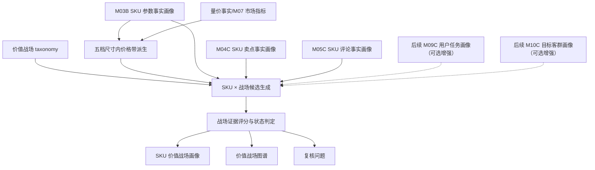

# M11C 价值战场画像与图谱详细设计

## 1. 文档定位

本文是 M11C 价值战场画像与图谱的工程详细设计，承接：

- `sop_requirements/M11C_value_battlefield_profile_requirements.md`
- `M03B_sku_param_profile_design.md`
- `M04C_claim_fact_profile_design.md`
- `M05C_comment_fact_profile_design.md`
- 新版用户任务设计
- 新版目标客群设计

M11C 是新语义能力层模块，不复用旧 M11 作为主执行链路。它消费事实层和语义层结果，基于已发布价值战场 taxonomy，确定每个 SKU 的主/辅/机会/拖后腿价值战场，并生成价值战场图谱。

M11C 首版不使用运行时 LLM。价值战场 taxonomy 可以由分析者使用 LLM 辅助生成，但发布后作为只读资产由程序确定性消费。

M11C 首版不强依赖已经生成的 SKU 用户任务画像或 SKU 目标客群画像。本开发序列中，目标客群和用户任务模块排在 M11C 之后，因此首版通过已发布价值战场 taxonomy 内的任务 code、客群 code、评论维度、卖点 code 和参数 code 完成间接匹配。后续 M09C/M10C 落地后，可以作为增强输入接入评分。

## 2. 总体流程



处理步骤：

1. 解析 `project_id`、`category_code`、`batch_id`、SKU 范围。
2. 加载品类价值战场 taxonomy；未发布则阻断。
3. 读取 M03B 参数画像，取 M03B 五档尺寸 `size_tier`。
4. 读取量价事实，按 `size_tier` 重新计算 `price_band_in_size_tier`。
5. 读取 M04C 卖点事实，区分 `fact_claim`、`claimed_only`、`unsupported_claim`、`service_separate`。
6. 读取 M05C 评论事实，提取用户用途、人群、体验、价值感、品牌力、竞品、正负向和反证关系。
7. 首版按价值战场 taxonomy 内的任务/客群 code 和证据规则，间接判断任务与客群匹配；M09C/M10C 落地后再作为可选增强输入。
8. 对每个 SKU × 战场执行市场门槛、评论、任务/客群规则、卖点、参数和市场验证评分。
9. 根据得分、门槛、用户声音和支撑状态判定 `relation_status` 与 `value_effect`。
10. 聚合每个 SKU 的主/辅/机会/拖后腿战场。
11. 重建批次级价值战场图谱和覆盖统计。
12. 写入复核问题。

## 3. 价值战场 taxonomy

### 3.1 Taxonomy 结构

每个战场定义至少包含：

| 字段 | 说明 |
| --- | --- |
| `battlefield_code` | 稳定编码 |
| `battlefield_name` | 中文名称 |
| `definition` | 战场业务定义 |
| `market_gate` | 尺寸档、价格带、相邻尺寸规则 |
| `primary_task_codes` | 核心用户任务 |
| `secondary_task_codes` | 可支撑的次级任务 |
| `primary_target_group_codes` | 核心目标客群 |
| `comment_match_rules` | 评论事实匹配规则 |
| `claim_match_rules` | 标准卖点匹配规则 |
| `param_match_rules` | 标准参数匹配规则 |
| `market_validation_rules` | 销量、销额、价格效率验证规则 |
| `negative_comment_rules` | 负向评论如何转成拖后腿或未满足需求 |
| `service_exclusion_rules` | 服务履约隔离规则 |
| `status_caps` | 不同证据缺口下的最高关系状态 |

### 3.2 价格带派生

M11C 在 `size_tier` 内按 SKU 加权均价计算价格分位：

| price_band_in_size_tier | 分位 |
| --- | --- |
| `low` | `0 <= p < 0.20` |
| `mid_low` | `0.20 <= p < 0.40` |
| `mid` | `0.40 <= p < 0.65` |
| `mid_high` | `0.65 <= p < 0.85` |
| `high` | `0.85 <= p <= 1.00` |
| `unknown` | 价格缺失或样本不足 |

价格带必须在五档尺寸内计算，不得使用全市场绝对价，也不得使用旧四档 `screen_size_class`。

### 3.3 TV 首版战场规则

| 战场 | 市场门槛 | 评论匹配 | 卖点匹配 | 参数匹配 |
| --- | --- | --- | --- | --- |
| `BF_SMALL_SCREEN_ESSENTIAL_VALUE` | `small_32_45 × low/mid_low` | 卧室、租房、第二台、小房间、便宜、够用、尺寸合适 | `tv_claim_value_price`、`tv_claim_full_screen_design`、`tv_claim_voice_control` | `screen_size_inch <= 45`、基础画质、低价、系统/语音辅助 |
| `BF_SMALL_SMART_EASY_USE` | `small_32_45 × mid/mid_high` | 卧室/长辈/小空间，同时提到语音、投屏、操作方便 | `tv_claim_voice_control`、`tv_claim_casting_connectivity`、`tv_claim_ai_large_model` | 语音、远场语音、WiFi、网络电视、RAM/ROM 不低 |
| `BF_MAINSTREAM_FAMILY_VALUE` | `medium_46_59 / large_60_69 × low/mid_low/mid` | 客厅、家庭、追剧、日常看、价格合适、销量口碑、够用 | `tv_claim_theater_scene`、`tv_claim_value_price`、`tv_claim_hdr_high_brightness`、`tv_claim_full_screen_design` | 50-69 寸，画质 mainstream/enhanced，价格带不高，销量位置较好 |
| `BF_MAINSTREAM_LIVING_BALANCE` | `medium_46_59 / large_60_69 × mid/mid_high` | 家庭观影、画质好、声音可以、系统流畅、护眼舒适 | `tv_claim_hdr_high_brightness`、`tv_claim_wide_color_accuracy`、`tv_claim_speaker_sound`、`tv_claim_eye_care_display`、`tv_claim_voice_control` | 画质、音频、系统、护眼至少多项中等支撑 |
| `BF_LARGE_SCREEN_VALUE_UPGRADE` | `xlarge_70_85 × low/mid_low/mid` | 换大屏、旧电视升级、75/85 寸、客厅震撼、划算、补贴 | `tv_claim_theater_scene`、`tv_claim_value_price`、`tv_claim_full_screen_design` | 70-85 寸，尺寸内价格不高，价格/英寸有优势，销量验证 |
| `BF_LARGE_SCREEN_FAMILY_CINEMA` | `xlarge_70_85 × mid/mid_high` | 客厅影院、电影、追剧、全家看、大屏沉浸、音画体验好 | `tv_claim_theater_scene`、`tv_claim_hdr_high_brightness`、`tv_claim_dolby_audio_video`、`tv_claim_speaker_sound` | 70-85 寸，HDR/亮度/音频/画质组合支撑 |
| `BF_PREMIUM_PICTURE_UPGRADE` | `large_60_69 / xlarge_70_85 × mid_high/high` | 画质、色彩、亮度、黑位、控光、电影效果正向；负向画质扣分 | `tv_claim_miniled_display`、`tv_claim_qd_miniled_display`、`tv_claim_rgb_miniled_display`、`tv_claim_oled_self_lit`、`tv_claim_hdr_high_brightness`、`tv_claim_wide_color_accuracy`、`tv_claim_local_dimming`、`tv_claim_picture_engine_ai` | MiniLED/OLED/QD、亮度、分区控光、色域、HDR、画质芯片 |
| `BF_PREMIUM_VALUE_DOWNTRADE` | `xlarge_70_85 × mid/mid_high` | 配置高、划算、同价位强、比某品牌便宜，画质/大屏体验正向 | `tv_claim_value_price` 加高端画质/高刷/音画卖点 | 高端参数部分成立，价格低于同配置或同池高端 SKU |
| `BF_GAMING_SPORTS_FLUENCY` | 中大尺寸 × `mid` 以上 | 游戏、主机、PS5、Xbox、看球、运动流畅、不卡、低延迟；卡顿/拖影为反证 | `tv_claim_high_refresh_rate`、`tv_claim_gaming_low_latency`、`tv_claim_hdmi21_connectivity` | 刷新率 >=120Hz，HDMI2.1/VRR/ALLM/MEMC，系统性能辅助 |
| `BF_EYE_CARE_FAMILY_COMFORT` | 小/中/大尺寸 × `mid_low` 以上 | 孩子、老人、长时间看、不刺眼、不累眼；反光/刺眼/疲劳为拖后腿 | `tv_claim_eye_care_display` | 护眼、低蓝光、无频闪、防眩、亮度控制、刷新率等 |
| `BF_SMART_CONNECTED_EXPERIENCE` | 中尺寸及以上 × `mid` 以上 | 投屏、联网、语音、智能家居、连接稳定、系统流畅；广告多/卡顿为反证 | `tv_claim_casting_connectivity`、`tv_claim_voice_control`、`tv_claim_ai_large_model`、`tv_claim_smart_home_iot`、`tv_claim_camera_interaction` | WiFi、网络电视、智能电视、AI、语音、全屋智控、摄像头、RAM/ROM |
| `BF_GIANT_HOME_THEATER_FLAGSHIP` | `giant_98_plus × mid_high/high` | 98/100 寸、巨幕、别墅/大客厅、新家、影院感、上墙效果、旗舰体验 | `tv_claim_theater_scene`、`tv_claim_hdr_high_brightness`、`tv_claim_local_dimming`、`tv_claim_dolby_audio_video`、`tv_claim_flush_wall_mount` | 98 寸以上，旗舰画质、音频、贴墙/外观空间适配 |

## 4. 评分与状态判定

### 4.1 市场门槛

市场门槛先于综合分执行。

| gate status | 规则 | 影响 |
| --- | --- | --- |
| `matched` | 尺寸档和价格带在战场定义内 | 可成为主/辅战场 |
| `adjacent` | 尺寸相邻或价格相邻，但不完全匹配 | 最高只能成为辅战场或机会战场 |
| `mismatch` | 尺寸明显不匹配 | 不得成为主/辅战场 |
| `unknown` | 尺寸或价格缺失 | 低置信，需复核 |

示例：43 寸低价 SKU 不得进入 `BF_LARGE_SCREEN_VALUE_UPGRADE`；85 寸高价 SKU 不得作为“小屏刚需性价比战场”的主战场。

### 4.2 分项得分

```text
battlefield_score =
  user_voice_score * 0.30
  + task_group_fit_score * 0.20
  + claim_alignment_score * 0.15
  + param_capability_score * 0.15
  + market_pool_fit_score * 0.15
  + market_validation_score * 0.05
```

说明：

- `user_voice_score` 最高权重，因为用户任务和客群是主观需求，评论优先。
- `market_pool_fit_score` 仍是硬门槛；权重不是唯一约束。
- `claim_alignment_score` 使用 M04C 参数支撑后的卖点。无参数支撑的卖点不得高分。
- `param_capability_score` 证明产品有没有能力，但不能单独决定用户战场。
- `market_validation_score` 用销量、销额、价格效率增强，不直接生成战场。

### 4.3 状态判定

| relation_status | 条件摘要 |
| --- | --- |
| `primary_battlefield` | 市场门槛 matched，用户声音/任务/客群强，参数或卖点至少一类强支撑，综合分最高 |
| `secondary_battlefield` | 证据成立但不是第一竞争理由，或门槛 adjacent 但任务/评论强 |
| `opportunity_battlefield` | 有局部机会，但评论、参数或卖点不足 |
| `brand_claimed_battlefield` | 厂家卖点强，参数可支撑，但用户评论弱或无 |
| `user_observed_battlefield` | 用户评论强，但厂家卖点或参数支撑不足 |
| `drag_factor_battlefield` | 用户需求明确且负向集中，说明该战场下产品没打好 |
| `excluded` | 尺寸价格不匹配、服务履约、证据不足或服务隔离 |

每个 SKU：

- 最多 1 个 `primary_battlefield`。
- 最多 2 个 `secondary_battlefield`。
- 可以有多个 `opportunity_battlefield` 和 `drag_factor_battlefield`。
- 可以没有主战场，但必须写明原因。

### 4.4 价值作用

| value_effect | 含义 |
| --- | --- |
| `premium_driver` | 用户正向、卖点表达、参数能力一致，是该战场的溢价驱动 |
| `basic_support` | 能支撑基础购买理由，但不是溢价点 |
| `brand_claim_only` | 厂家主打，但用户声音不足 |
| `user_observed_need` | 用户有需求，但厂家未明显表达或参数支撑弱 |
| `drag_factor` | 用户有需求且负向集中，对应卖点拖后腿 |
| `unmet_need` | 用户期望存在，但产品能力/卖点明显缺口 |
| `not_applicable` | 不适用 |

负向评论不能直接删除用户任务或价值战场。负向评论代表“用户希望有，但体验没做好”，必须进入 `drag_factor` 或 `unmet_need`。

## 5. 数据模型设计

### 5.1 `core3_sku_value_battlefield_profile`

SKU 级画像表，一 SKU 一条。

| 字段 | 类型 | 说明 |
| --- | --- | --- |
| `sku_value_battlefield_profile_id` | text | 主键 |
| `project_id` | text | 项目 |
| `category_code` | text | 品类 |
| `batch_id` | text | 批次 |
| `sku_code` | text | SKU |
| `taxonomy_version` | text | 战场 taxonomy 版本 |
| `rule_version` | text | 评分规则版本 |
| `size_tier` | text | M03B 五档尺寸 |
| `price_band_in_size_tier` | text | 五档尺寸内价格带 |
| `primary_battlefield_code` | text | 主战场，可空 |
| `primary_relation_status` | text | 主战场状态 |
| `secondary_battlefield_codes_json` | jsonb | 辅战场 |
| `opportunity_battlefield_codes_json` | jsonb | 机会战场 |
| `drag_factor_battlefield_codes_json` | jsonb | 拖后腿战场 |
| `battlefield_summary_json` | jsonb | 战场摘要 |
| `review_required` | boolean | 是否复核 |
| `confidence` | numeric | 置信度 |
| `evidence_ids_json` | jsonb | 证据 |
| `profile_hash` | text | 输出 hash |
| `is_current` | boolean | 当前版本 |

### 5.2 `core3_sku_value_battlefield_score`

SKU × 价值战场分数表。

| 字段 | 类型 | 说明 |
| --- | --- | --- |
| `sku_value_battlefield_score_id` | text | 主键 |
| `sku_code` | text | SKU |
| `battlefield_code` | text | 战场 |
| `relation_status` | text | 关系状态 |
| `value_effect` | text | 价值作用 |
| `battlefield_score` | numeric | 综合分 |
| `market_gate_status` | text | 市场门槛状态 |
| `market_pool_fit_score` | numeric | 市场池适配 |
| `user_voice_score` | numeric | 用户评论声音 |
| `task_group_fit_score` | numeric | 任务客群适配 |
| `claim_alignment_score` | numeric | 卖点表达 |
| `param_capability_score` | numeric | 参数能力 |
| `market_validation_score` | numeric | 市场验证 |
| `sentiment_polarity` | text | 评论正负向 |
| `status_reason_cn` | text | 中文解释 |
| `evidence_ids_json` | jsonb | 证据 |
| `result_hash` | text | 输出 hash |

### 5.3 `core3_value_battlefield_graph_snapshot`

批次级图谱快照。

| 字段 | 类型 | 说明 |
| --- | --- | --- |
| `graph_snapshot_id` | text | 主键 |
| `project_id` | text | 项目 |
| `category_code` | text | 品类 |
| `batch_id` | text | 批次 |
| `taxonomy_version` | text | taxonomy |
| `rule_version` | text | rule |
| `node_count` | integer | 节点数 |
| `edge_count` | integer | 边数 |
| `battlefield_count` | integer | 战场数 |
| `sku_count` | integer | SKU 数 |
| `graph_json` | jsonb | 图谱 |
| `coverage_summary_json` | jsonb | 覆盖统计 |
| `graph_hash` | text | hash |

### 5.4 `core3_value_battlefield_coverage`

战场覆盖表，便于查询每个战场有哪些 SKU。

| 字段 | 类型 | 说明 |
| --- | --- | --- |
| `coverage_id` | text | 主键 |
| `battlefield_code` | text | 战场 |
| `relation_status` | text | 主/辅/机会/拖后腿 |
| `sku_count` | integer | SKU 数 |
| `sku_codes_json` | jsonb | SKU 列表 |
| `top_skus_json` | jsonb | 代表 SKU |
| `size_tier_distribution_json` | jsonb | 尺寸分布 |
| `price_band_distribution_json` | jsonb | 价格分布 |
| `task_distribution_json` | jsonb | 任务分布 |
| `target_group_distribution_json` | jsonb | 客群分布 |
| `claim_distribution_json` | jsonb | 卖点分布 |
| `param_distribution_json` | jsonb | 参数分布 |

## 6. 图谱结构

图谱节点：

| node_type | 说明 |
| --- | --- |
| `battlefield` | 价值战场 |
| `sku` | SKU |
| `user_task` | 用户任务 |
| `target_group` | 目标客群 |
| `claim` | 标准卖点 |
| `param_tier` | 参数档位 |
| `comment_dimension` | 评论事实维度 |

图谱边：

| edge_type | 说明 |
| --- | --- |
| `contains_sku` | 战场覆盖 SKU |
| `primary_sku` | SKU 是该战场主战场 |
| `secondary_sku` | SKU 是该战场辅战场 |
| `drag_factor_sku` | SKU 在该战场拖后腿 |
| `supported_by_task` | 战场由任务支撑 |
| `supported_by_target_group` | 战场由客群支撑 |
| `supported_by_claim` | 战场由卖点支撑 |
| `supported_by_param` | 战场由参数支撑 |
| `validated_by_comment` | 战场由评论验证 |

## 7. CLI 设计

### 7.1 Pipeline CLI

稳定命令：

```bash
python -m app.cli.catforge_pipeline run-value-battlefield \
  --product-category tv \
  --batch-id latest \
  --force-rebuild \
  --format json
```

单 SKU：

```bash
python -m app.cli.catforge_pipeline run-value-battlefield \
  --product-category tv \
  --batch-id latest \
  --sku-code TV00027354 \
  --force-rebuild \
  --format json
```

只重建图谱：

```bash
python -m app.cli.catforge_pipeline run-value-battlefield \
  --product-category tv \
  --batch-id latest \
  --graph-mode rebuild-only \
  --format json
```

参数：

| 参数 | 默认 | 说明 |
| --- | --- | --- |
| `--product-category` | 必填 | 首版 `tv` |
| `--batch-id` | `latest` | 批次 |
| `--sku-code` | 空 | 单 SKU |
| `--battlefield-code` | 空 | 指定战场，可重复 |
| `--force-rebuild` | false | 清理当前范围并重算 |
| `--sku-chunk-size` | 50 | 分批处理 SKU |
| `--graph-mode` | `inline` | `inline`、`skip`、`rebuild-only` |
| `--format` | `json` | 输出格式 |

自然语言入口：

```bash
python -m app.cli.catforge_pipeline ask "生成彩电价值战场画像" --force-rebuild --format json
```

```bash
python -m app.cli.catforge_pipeline ask "查新数据后重新生成价值战场图谱" --force-rebuild --format json
```

### 7.2 Insight CLI

查询 SKU 价值战场：

```bash
python -m app.cli.catforge_insight sku-value-battlefield \
  --sku-code TV00027354 \
  --format json
```

查询某战场覆盖 SKU：

```bash
python -m app.cli.catforge_insight value-battlefield-skus \
  --battlefield-code BF_LARGE_SCREEN_VALUE_UPGRADE \
  --relation-status primary_battlefield \
  --sku-limit 100 \
  --format json
```

查询图谱：

```bash
python -m app.cli.catforge_insight value-battlefield-graph \
  --product-category tv \
  --format json
```

查询 taxonomy：

```bash
python -m app.cli.catforge_insight value-battlefield-taxonomy \
  --product-category tv \
  --format json
```

自然语言入口：

```bash
python -m app.cli.catforge_insight ask "查 85E7Q 的价值战场" --format json
```

```bash
python -m app.cli.catforge_insight ask "大屏换新性价比战场有哪些 SKU" --sku-limit 100 --format json
```

```bash
python -m app.cli.catforge_insight ask "哪些 SKU 在高端画质升级战场拖后腿" --sku-limit 100 --format json
```

## 8. Claude Code Skill 设计

CLI 实现后更新两个 skill。

### 8.1 `catforge-pipeline`

新增触发语：

- “生成彩电价值战场画像”
- “重新跑某个 SKU 的价值战场”
- “新数据来了，把价值战场准备好”
- “生成价值战场图谱”

执行规则：

1. 生成类请求用 `catforge_pipeline ask` 优先。
2. 用户明确 SKU 时加 `--sku-code`。
3. 用户只要图谱时用 `--graph-mode rebuild-only`。
4. 执行后必须摘要 SKU 数、战场数、主战场覆盖数、辅战场覆盖数、拖后腿战场数、图谱节点/边数、复核问题数。

### 8.2 `catforge-insight`

新增触发语：

- “查某 SKU 的价值战场”
- “查某价值战场有哪些 SKU”
- “查价值战场图谱”
- “查某战场的拖后腿 SKU”
- “查某战场的参数、卖点、评论证据”

查询规则：

1. SKU 查询优先返回主战场、辅战场、拖后腿战场和价值作用。
2. 战场查询必须区分主战场 SKU、辅战场 SKU、机会 SKU、拖后腿 SKU。
3. 图谱查询默认返回摘要；用户要明细时再返回边和 SKU 列表。

## 9. 复核规则

| issue_type | 触发条件 | 处理 |
| --- | --- | --- |
| `missing_comment_for_user_battlefield` | 只有卖点/参数，没有用户评论支撑 | 标记厂家主打或机会，不判主战场 |
| `user_need_without_capability` | 评论需求强，但参数/卖点支撑弱 | 标记用户观察或未满足需求 |
| `negative_experience_drag` | 评论负向集中 | 标记拖后腿 |
| `market_gate_mismatch` | 尺寸价格不匹配但其他证据强 | 不得主战场，进入复核 |
| `unsupported_claim_premium` | 卖点宣称高端但参数不支撑 | 不得 `premium_driver` |
| `service_signal_misused` | 服务履约进入产品战场 | 阻断或复核 |
| `no_primary_battlefield` | SKU 无主战场 | 如果评论不足则允许，否则复核 |
| `too_many_primary_candidates` | 多个战场竞争主战场且分差小 | 复核 |

## 10. 测试计划

1. Taxonomy 校验：12 个战场 code 稳定，规则字段完整。
2. 尺寸价格派生：五档尺寸内价格带正确，不使用旧四档市场带。
3. 小屏门槛测试：43 寸不得进入大屏换新主战场。
4. 大屏价值测试：85 寸低价且评论/卖点支撑时进入大屏换新性价比。
5. 高端画质测试：MiniLED/分区/高亮/画质评论强时进入高端画质升级。
6. 拖后腿测试：评论负向集中时输出 `drag_factor_battlefield`。
7. 厂家主打测试：卖点和参数强但评论弱时输出 `brand_claimed_battlefield`。
8. 服务隔离测试：安装/物流/售后不得进入产品价值战场。
9. 图谱测试：每个战场能查询覆盖 SKU，并区分主/辅/机会/拖后腿。
10. CLI 测试：全量、单 SKU、单战场、图谱重建、自然语言 ask 都有确定性结果。

## 11. 增量与性能

M11C 首版是轻量确定性评分，不调用 LLM，也不直接扫描原始评论文本。当前实现默认在一次执行中读取目标 SKU 集合、生成 SKU × 12 个战场分数，并在执行末尾重建一次图谱。全量 TV SKU 规模下风险主要来自上游 M05C/M07，而不是 M11C 本身。

执行范围控制：

| 参数 | 说明 |
| --- | --- |
| `sku_code` | 可重复传入，限制为指定 SKU |
| `battlefield_code` | 可重复传入，限制为指定战场 |
| `graph_mode=inline` | 默认写入图谱快照 |
| `graph_mode=skip` | 只写 SKU 画像和 SKU × 战场分数 |
| `force_rebuild` | 允许同业务键 hash 变化时替换旧结果 |

增量重算触发：

| 上游变化 | 重算范围 |
| --- | --- |
| M03B 参数画像变更 | 受影响 SKU 的战场分数，图谱重建 |
| M04C 卖点画像变更 | 受影响 SKU 的战场分数，图谱重建 |
| M05C 评论画像变更 | 受影响 SKU 的战场分数，图谱重建 |
| 后续 M09C 用户任务画像变更 | 接入增强输入后，受影响 SKU 的战场分数，图谱重建 |
| 后续 M10C 目标客群画像变更 | 接入增强输入后，受影响 SKU 的战场分数，图谱重建 |
| 量价数据变更 | 同尺寸档价格带和受影响 SKU，图谱重建 |
| 战场 taxonomy 变更 | 全量重算 |

如果后续品类扩展导致 SKU 数量显著增加，再补充 chunk 执行和图谱单独重建能力。
