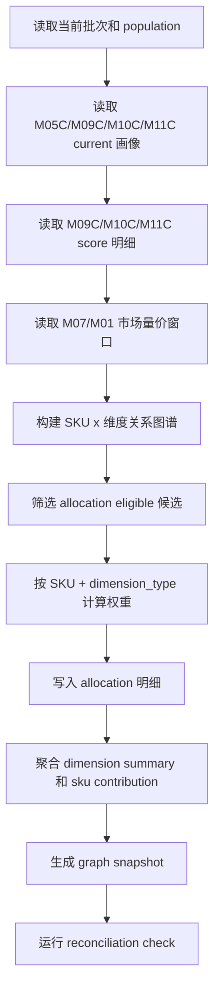

# M11D 新版语义市场图谱与销量分配详细设计

## 1. 定位

M11D 是新版语义能力层的“市场图谱与销量分配结果层”。

它不重新判断 SKU 的用户任务、目标客群或价值战场，也不调用 LLM。它只消费已经完成的事实层和语义层结果：

- M03B SKU 参数事实画像中的五档尺寸口径。
- M05C SKU 评论事实画像，用于限定有真实评论事实支撑的分析 SKU。
- M09C SKU 用户任务画像和分数。
- M10C SKU 目标客群画像和分数。
- M11C SKU 价值战场画像和分数。
- M07/M01 市场量价事实，用于销量、销额、价格和周度市场窗口。

M11D 要解决的问题是：

1. 从“每个 SKU 有哪些任务/客群/战场关系”升级为“每个任务/客群/战场形成什么市场图谱”。
2. 估算每个 SKU 的销量和销额如何解释性分配到多个用户任务、多个目标客群和多个价值战场。
3. 给后续 `catforge_analyst`、OpenClaw Skill 和“小奥家电市场分析专家”提供稳定、可复用、可审计的结果表。

## 2. 与旧 M11.6/M11.7 的关系

旧 M11.6/M11.7 的思想可以迁移，但旧结果不能直接使用。

可迁移：

- 同一 SKU、同一维度类型内做 allocation weight 归一。
- 分配结果表达为估算销量解释，不表达为真实购买归因。
- 维度汇总需要能反查 SKU 构成。
- 需要对 allocation weight、销量、销额做对账。

不能迁移：

- 旧任务、旧客群、旧战场 code。
- 旧 M11.6 的 84 个 SKU 结果。
- 旧 M07 的 `compact_screen/mainstream_living/large_upgrade/ultra_large_flagship` 等旧尺寸口径。
- 旧设计中把所有 SKU 都硬塞进一个可分配维度的做法。

新版原则：

- M11D 使用新版 M09C/M10C/M11C code。
- 所有尺寸统一使用五档：`small_32_45`、`medium_46_59`、`large_60_69`、`xlarge_70_85`、`giant_98_plus`。
- 价格带使用五档尺寸内价格分位：`low`、`mid_low`、`mid`、`mid_high`、`high`。
- 若某 SKU 在某维度类型证据不足，不制造 `unknown` 或 `unassigned` 假维度；应进入未分配诊断。

## 3. 范围

### 3.1 本阶段要做

M11D v0.1 产出三类维度的市场图谱和销量分配：

| 维度类型 | 来源模块 | 输出内容 |
| --- | --- | --- |
| `user_task` | M09C | 用户任务图谱、任务销量/销额分配、任务维度汇总 |
| `target_group` | M10C | 目标客群图谱、客群销量/销额分配、客群维度汇总 |
| `battlefield` | M11C | 价值战场图谱、战场销量/销额分配、战场维度汇总 |

### 3.2 本阶段不做

- 不做竞品选择，竞品库属于后续分析 CLI。
- 不做单 SKU 为什么卖得好的完整推理，M11D 只提供图谱、分配和证据底座。
- 不做卖点维度的独立销量分配。卖点先作为任务、客群、战场关系成立的证据，后续“溢价卖点”问题由分析 CLI 结合 M04C/M09C/M10C/M11C/M11D 查询。
- 不调用外部 LLM。
- 不把服务履约、物流安装、售后等服务语境纳入产品价值图谱或销量分配。

## 4. 分析对象口径

### 4.1 默认 SKU 集

M11D 默认分析 SKU 集为 `fact_complete_with_comment`：

```text
current M05C comment fact profile
∩ current M09C user task profile
∩ current M10C target group profile
∩ current M11C value battlefield profile
∩ market fact exists
```

原因：

- 用户任务、目标客群、价值战场本质上要由真实用户声音优先支撑。
- 没有评论事实的 SKU 可以有参数和卖点，但不应默认进入“用户任务/客群/价值战场市场图谱”。
- 如果后续需要覆盖所有有量价事实的 SKU，可以显式指定 `analysis_population=all_semantic_profiles`。

### 4.2 可选 SKU 集

| population | 含义 | 使用场景 |
| --- | --- | --- |
| `fact_complete_with_comment` | 有 M05C 评论事实、M09C、M10C、M11C 和市场事实 | 默认 |
| `all_semantic_profiles` | 有 M09C、M10C、M11C 和市场事实，不强制有评论事实 | 看新品、低评论 SKU 的品牌声量机会 |
| `custom_sku_list` | 指定 SKU 白名单 | 复核或专项分析 |

输出中必须保存 `analysis_population` 和 SKU 集合统计，避免后续问答不知道市场图谱覆盖了哪些 SKU。

## 5. 市场窗口和量价口径

### 5.1 市场窗口

M11D 所有销量和销额都必须带 `market_window`。

第一版支持：

| market_window | 口径 |
| --- | --- |
| `full_observed_window` | 使用 M07 当前市场画像中的全观测窗口销量、销额、价格和 active week |
| `recent_12w` | 预留；后续从 M01/M07 周度事实聚合最近 12 周 |
| `custom_week_range` | 预留；后续按指定周范围聚合 |

v0.1 默认使用 `full_observed_window`，但结果字段必须预留 `window_start_week`、`window_end_week`、`active_week_count`、`market_source`。

### 5.2 累计量和公平比较

用户已经确认：累计销量容易误导“谁卖得更好”的判断。

因此 M11D 同时输出两套指标：

| 指标 | 用途 |
| --- | --- |
| `allocated_sales_volume`、`allocated_sales_amount` | 表示在选定市场窗口内的市场空间估算 |
| `allocated_avg_weekly_sales_volume`、`allocated_avg_weekly_sales_amount` | 用于不同 SKU 或不同维度之间的公平强弱比较 |

计算：

```text
avg_weekly_sales_volume = sales_volume_total / active_week_count
avg_weekly_sales_amount = sales_amount_total / active_week_count

allocated_avg_weekly_sales_volume = avg_weekly_sales_volume * allocation_weight
allocated_avg_weekly_sales_amount = avg_weekly_sales_amount * allocation_weight
```

自然语言回答中：

- 说“市场空间多大”时，可以用 `allocated_sales_volume/amount`。
- 说“谁更强、谁卖得更好”时，应优先用 `allocated_avg_weekly_*` 或后续重叠周窗口指标。

## 6. 图谱和分配的两层表达

M11D 必须分清两类结果：

### 6.1 图谱覆盖层

图谱覆盖层回答：

- 每个用户任务包含哪些 SKU。
- 每个目标客群包含哪些 SKU。
- 每个价值战场包含哪些 SKU。
- 每个 SKU 与维度之间是什么关系：主、辅、评论观察、品牌宣称、潜在能力、机会、拖后腿等。

图谱覆盖层可以包含非正向价值关系，例如：

- `comment_observed_task`
- `brand_claimed_task`
- `latent_capability_task`
- `drag_factor_task`
- `comment_observed_group`
- `brand_claimed_group`
- `latent_group`
- `unmet_group_need`
- `opportunity_battlefield`
- `brand_claimed_battlefield`
- `user_observed_battlefield`
- `drag_factor_battlefield`

### 6.2 销量分配层

销量分配层回答：

- 该 SKU 的销量/销额估算由哪些任务解释，各占多少。
- 该 SKU 的销量/销额估算由哪些客群解释，各占多少。
- 该 SKU 的销量/销额估算由哪些战场解释，各占多少。

销量分配层只允许证据达到门槛的关系进入 allocation。不能因为图谱覆盖了某个关系，就必然分配销量。

## 7. 关系状态分层

### 7.1 统一关系角色

M11D 把 M09C/M10C/M11C 的关系状态归并成统一 `allocation_role`。

| allocation_role | 含义 | 是否默认参与正向销量分配 |
| --- | --- | --- |
| `primary_value` | SKU 的主任务/主客群/主战场 | 是 |
| `secondary_value` | SKU 的辅任务/辅客群/辅战场 | 是 |
| `observed_need` | 用户评论观察到需求，但不一定被产品充分支撑 | 视证据门槛，可参与需求侧分配 |
| `drag_risk` | 用户有需求但体验负向或产品未做好 | 默认不进入正向分配，进入风险图谱 |
| `brand_claim` | 厂家宣称，评论不足 | 默认不分配销量，只进入图谱 |
| `latent_capability` | 参数具备潜在能力，用户和卖点弱 | 默认不分配销量，只进入图谱 |
| `opportunity` | 有机会进入，但不是当前主价值 | 默认不分配销量，后续机会测算使用 |
| `excluded` | 不成立 | 不进入图谱和分配 |

### 7.2 各模块状态映射

| 来源 | relation_status | allocation_role |
| --- | --- | --- |
| M09C | `primary_user_task` | `primary_value` |
| M09C | `secondary_user_task` | `secondary_value` |
| M09C | `comment_observed_task` | `observed_need` |
| M09C | `drag_factor_task` | `drag_risk` |
| M09C | `brand_claimed_task` | `brand_claim` |
| M09C | `latent_capability_task` | `latent_capability` |
| M10C | `primary_target_group` | `primary_value` |
| M10C | `secondary_target_group` | `secondary_value` |
| M10C | `comment_observed_group` | `observed_need` |
| M10C | `unmet_group_need` | `drag_risk` |
| M10C | `brand_claimed_group` | `brand_claim` |
| M10C | `latent_group` | `latent_capability` |
| M11C | `primary_battlefield` | `primary_value` |
| M11C | `secondary_battlefield` | `secondary_value` |
| M11C | `user_observed_battlefield` | `observed_need` |
| M11C | `drag_factor_battlefield` | `drag_risk` |
| M11C | `brand_claimed_battlefield` | `brand_claim` |
| M11C | `opportunity_battlefield` | `opportunity` |

## 8. Allocation 候选准入

### 8.1 正向分配候选

默认只有以下关系进入正向销量分配：

- `primary_value`
- `secondary_value`

若某维度没有主/辅，但存在评论强支撑的 `observed_need`，可以进入“需求侧分配”，但必须满足：

```text
score >= 0.55
confidence >= 0.50
comment/user voice component >= 0.50
not service context
```

这类分配的 `allocation_value_type` 为 `observed_need`，不能在业务解释中说成“溢价支撑”。

### 8.2 不参与正向分配

以下关系默认不参与正向销量分配：

- `brand_claim`
- `latent_capability`
- `opportunity`
- `drag_risk`
- `excluded`

它们仍进入图谱、机会和风险解释。

### 8.3 无可分配关系

如果某 SKU 在某维度类型没有任何 allocation eligible 关系：

- 不生成假 `unknown` 维度行。
- 不强行把销量分到最高分弱关系。
- 记录 `unallocated_market_volume` 和 `unallocated_market_amount`。
- 写入诊断 issue：`no_allocation_eligible_dimension`。

因此“同一 SKU、同一维度类型 allocation weight 合计为 1”的约束只适用于已进入 allocation 的 SKU。全局汇总必须同时展示：

- `allocated_sku_count`
- `unallocated_sku_count`
- `allocated_market_sales_volume`
- `unallocated_market_sales_volume`
- `allocation_coverage_rate`

## 9. 权重计算

### 9.1 统一公式

对每个 SKU、每个维度类型，先生成候选集合，再计算原始权重：

```text
allocation_basis =
  final_score * 0.45
  + user_or_comment_signal * 0.20
  + product_support_signal * 0.15
  + market_validation_signal * 0.10
  + confidence * 0.10
  - risk_penalty

raw_weight = max(allocation_basis, 0) * relation_factor

allocation_weight = raw_weight / sum(raw_weight for same sku and same dimension_type)
```

若 `sum(raw_weight) <= 0`，该 SKU 该维度类型进入 `no_positive_allocation_basis` 诊断，不做分配。

### 9.2 relation_factor

| allocation_role | relation_factor |
| --- | --- |
| `primary_value` | 1.00 |
| `secondary_value` | 0.70 |
| `observed_need` | 0.45 |
| 其他 | 0 |

### 9.3 各维度分量映射

用户任务：

```text
final_score = user_task_score
user_or_comment_signal = comment_task_need_score
product_support_signal = max(claim_task_alignment_score, param_capability_score)
market_validation_signal = market_validation_score
risk_penalty = negative_drag_score * 0.20
```

目标客群：

```text
final_score = target_group_score
user_or_comment_signal = comment_audience_motivation_score
product_support_signal = max(task_support_score, claim_alignment_score, param_capability_score)
market_validation_signal = market_validation_score
risk_penalty = 0
```

价值战场：

```text
final_score = battlefield_score
user_or_comment_signal = user_voice_score
product_support_signal = max(task_group_fit_score, claim_alignment_score, param_capability_score)
market_validation_signal = market_validation_score
risk_penalty = 0.20 when value_effect in ('drag_factor', 'unmet_need')
```

### 9.4 allocation confidence

```text
allocation_confidence =
  confidence * 0.50
  + evidence_completeness_score * 0.25
  + market_confidence * 0.25
```

上限规则：

| 情况 | confidence 上限 |
| --- | --- |
| `primary_value` 且三类证据齐全 | 1.00 |
| `secondary_value` | 0.85 |
| `observed_need` | 0.70 |
| market fact 低置信 | 0.60 |
| 缺评论事实 | 0.45，且默认不进入 `fact_complete_with_comment` |

## 10. 结果表设计

建议新增 M11D 专用结果表，不复用旧 M11.6/M11.7 表，避免版本混乱。

### 10.1 `core3_semantic_market_allocation`

SKU 到任务/客群/战场的销量解释分配明细。

关键字段：

| 字段 | 说明 |
| --- | --- |
| `allocation_id` | 主键 |
| `project_id`、`category_code`、`batch_id` | 批次隔离 |
| `run_id`、`module_run_id` | 执行审计 |
| `product_category` | 品类 |
| `analysis_population` | SKU 集口径 |
| `market_window` | 市场窗口 |
| `window_start_week`、`window_end_week` | 周度窗口 |
| `dimension_type` | `user_task`、`target_group`、`battlefield` |
| `dimension_code`、`dimension_name` | 维度 |
| `sku_code`、`brand_name`、`model_name` | SKU |
| `size_tier` | 五档尺寸 |
| `price_band_in_size_tier` | 尺寸内五档价格带 |
| `relation_status` | 上游关系状态 |
| `allocation_role` | M11D 统一角色 |
| `allocation_value_type` | `positive_value`、`observed_need`、`diagnostic_only` |
| `source_profile_id`、`source_score_id` | 上游来源 |
| `final_score` | 上游维度总分 |
| `allocation_basis` | 分配基准分 |
| `relation_factor` | 关系系数 |
| `allocation_weight` | SKU 内同维度类型归一权重 |
| `sales_volume_total`、`sales_amount_total` | SKU 市场窗口总量 |
| `avg_weekly_sales_volume`、`avg_weekly_sales_amount` | SKU 周均量 |
| `allocated_sales_volume`、`allocated_sales_amount` | 分配后窗口总量 |
| `allocated_avg_weekly_sales_volume`、`allocated_avg_weekly_sales_amount` | 分配后周均量 |
| `allocation_confidence` | 分配置信度 |
| `allocation_basis_json` | 公式分量 |
| `evidence_ids_json` | 证据 |
| `market_source_json` | M07/M01 来源 |
| `rule_version` | `m11d_semantic_market_allocation_v0.1` |
| `input_fingerprint`、`result_hash` | 幂等 |
| `is_current` | 当前结果 |
| `processing_status` | `success`、`diagnostic`、`blocked` |

唯一约束：

```text
unique(project_id, category_code, batch_id, analysis_population, market_window,
       dimension_type, sku_code, dimension_code, rule_version, is_current)
```

### 10.2 `core3_semantic_market_dimension_summary`

任务/客群/战场维度市场汇总。

关键字段：

| 字段 | 说明 |
| --- | --- |
| `summary_id` | 主键 |
| `dimension_type`、`dimension_code`、`dimension_name` | 维度 |
| `taxonomy_version` | 对应 M09C/M10C/M11C taxonomy |
| `sku_relation_count` | 图谱覆盖 SKU 数 |
| `allocated_sku_count` | 进入销量分配 SKU 数 |
| `primary_sku_count` | 主关系 SKU 数 |
| `secondary_sku_count` | 辅关系 SKU 数 |
| `observed_need_sku_count` | 评论观察需求 SKU 数 |
| `brand_claim_sku_count` | 品牌宣称 SKU 数 |
| `opportunity_sku_count` | 机会 SKU 数 |
| `drag_risk_sku_count` | 拖后腿/未满足 SKU 数 |
| `estimated_sales_volume`、`estimated_sales_amount` | 正向分配销量/销额 |
| `estimated_avg_weekly_sales_volume`、`estimated_avg_weekly_sales_amount` | 正向分配周均量/销额 |
| `observed_need_sales_volume` | 需求侧分配量 |
| `drag_risk_market_volume` | 风险图谱涉及销量，不计入正向分配 |
| `total_market_sales_volume`、`total_market_sales_amount` | 本次 population 总市场 |
| `allocated_market_sales_volume` | 已分配市场 |
| `unallocated_market_sales_volume` | 未分配诊断市场 |
| `sales_volume_share`、`sales_amount_share` | 占已分配市场比例 |
| `allocation_coverage_rate` | 本维度类型已分配市场 / population 市场 |
| `brand_distribution_json` | 品牌结构 |
| `size_price_distribution_json` | 尺寸价格结构 |
| `relation_status_counts_json` | 关系状态计数 |
| `top_skus_json` | SKU 贡献排行 |
| `confidence_avg` | 平均置信度 |
| `business_summary_cn` | 中文摘要 |

### 10.3 `core3_semantic_market_sku_contribution`

维度内 SKU 贡献明细，用于快速回答“这个战场里谁贡献了销量”。

关键字段：

| 字段 | 说明 |
| --- | --- |
| `contribution_id` | 主键 |
| `summary_id` | 关联维度汇总 |
| `allocation_id` | 关联 allocation |
| `sku_code`、`brand_name`、`model_name` | SKU |
| `dimension_type`、`dimension_code` | 维度 |
| `allocation_weight` | SKU 内分配权重 |
| `allocated_sales_volume`、`allocated_sales_amount` | 分配销量/销额 |
| `sku_share_in_dimension_volume` | SKU 在该维度中的销量占比 |
| `sku_rank_in_dimension` | 排名 |
| `contribution_reason_cn` | 贡献原因 |

### 10.4 `core3_semantic_market_graph_snapshot`

跨任务/客群/战场的市场图谱快照。

建议结构：

```json
{
  "nodes": [
    {"node_type": "sku", "sku_code": "...", "size_tier": "...", "price_band_in_size_tier": "..."},
    {"node_type": "dimension", "dimension_type": "battlefield", "dimension_code": "..."}
  ],
  "edges": [
    {
      "sku_code": "...",
      "dimension_type": "battlefield",
      "dimension_code": "...",
      "relation_status": "primary_battlefield",
      "allocation_role": "primary_value",
      "score": 0.82,
      "allocation_weight": 0.68,
      "allocated_sales_volume": 1234.0,
      "allocation_confidence": 0.76
    }
  ],
  "market_totals": {
    "population_sku_count": 184,
    "allocated_sku_count": 170,
    "unallocated_sku_count": 14
  }
}
```

图谱快照保存：

- `graph_json`
- `coverage_summary_json`
- `allocation_summary_json`
- `unallocated_summary_json`
- `rule_version`
- `is_current`

### 10.5 `core3_semantic_market_reconciliation_check`

对账和诊断结果。

检查项：

| issue_code | 条件 | 级别 |
| --- | --- | --- |
| `missing_market_fact` | SKU 缺销量、销额、价格或 active week | blocking |
| `duplicate_current_profile` | 同 SKU 同模块多条 current | blocking |
| `semantic_profile_missing` | SKU 缺 M09C/M10C/M11C 必要画像 | blocking |
| `size_tier_mismatch` | M09C/M10C/M11C 尺寸档不一致 | warning/blocking |
| `price_band_mismatch` | M09C/M10C/M11C 价格带不一致 | warning |
| `no_allocation_eligible_dimension` | SKU 某维度类型无可分配关系 | diagnostic |
| `allocation_weight_not_normalized` | 已分配 SKU 权重和不等于 1 | blocking |
| `allocated_volume_gap` | SKU 分配销量不闭合 | blocking |
| `allocated_amount_gap` | SKU 分配销额不闭合 | blocking |
| `dimension_total_gap` | 维度汇总与 allocation 明细不一致 | blocking |
| `service_context_leakage` | 服务履约进入产品维度 | blocking |
| `taxonomy_version_mixed` | 同一运行混用 taxonomy 版本 | blocking |

## 11. 执行流程



## 12. 幂等和重跑

M11D 采用 current 结果写法：

1. 同一 `project_id/category_code/batch_id/analysis_population/market_window/rule_version` 重跑前，将旧 current 置为 `false`。
2. 新结果写入 `is_current=true`。
3. 每条结果有 `input_fingerprint` 和 `result_hash`。
4. 如果上游 M09C/M10C/M11C/M07 的 taxonomy、rule_version、profile_hash 或 result_hash 变化，M11D 必须全量重算。

## 13. CLI 和 Skill 预留

本阶段先实现结果层，CLI/Skill 只作为后续查询入口，不承载全量计算逻辑。

后续命令建议：

```bash
python -m app.cli.catforge_pipeline run-semantic-market-graph \
  --product-category tv \
  --batch-id latest \
  --analysis-population fact_complete_with_comment \
  --market-window full_observed_window \
  --force-rebuild \
  --format json
```

查询命令建议：

```bash
python -m app.cli.catforge_insight semantic-market-map \
  --product-category tv \
  --dimension-type battlefield \
  --dimension-code BF_LARGE_SCREEN_FAMILY_CINEMA \
  --format json

python -m app.cli.catforge_insight sku-sales-allocation \
  --product-category tv \
  --sku-query "海信 65" \
  --format json
```

## 14. 验收标准

### 14.1 功能验收

1. 可以生成用户任务、目标客群、价值战场三类图谱。
2. 可以查询每个维度覆盖哪些 SKU。
3. 可以查询每个维度估算承接多少销量、销额和周均销量。
4. 可以查询某个 SKU 的销量被分配到哪些任务、客群、战场。
5. 一个 SKU 可以同时进入多个战场，且能解释每个战场的权重。
6. 没有可分配证据的 SKU 不被硬塞进假维度，未分配市场量可见。

### 14.2 数据质量验收

1. 已分配 SKU 在同一 `dimension_type` 内 allocation weight 合计为 1，误差不超过 `0.0001`。
2. 已分配 SKU 的 allocated sales volume/amount 与 SKU 市场窗口总量闭合。
3. 维度 summary 与 allocation 明细闭合。
4. 服务履约、物流安装、售后不得进入产品任务、产品客群、产品战场的正向分配。
5. 尺寸口径必须是五档尺寸，不得出现旧 M07 四档尺寸作为主分类。
6. 价格带必须是尺寸内五档价格分位，不得误认为原始量价表字段。

### 14.3 性能验收

1. 在 205 上 TV 默认 population 全量运行不应显著影响 SSH 可访问性。
2. 批处理应按 SKU 或 score 分块读取，避免一次加载全部关系和全部 JSON。
3. 写入使用批量 upsert 或批量 insert，避免逐行 commit。
4. 不调用 LLM，不受 LLM 并发和 API 延迟影响。

## 15. 对后续“小奥”的价值

M11D 完成后，小奥可以稳定回答：

- “某个价值战场有哪些 SKU，市场空间多大？”
- “某个用户任务覆盖哪些 SKU，哪些品牌占得多？”
- “某个目标客群下哪些 SKU 贡献最大？”
- “某个 SKU 的销量如何分配到多个战场？”
- “为什么一个 SKU 和另一个 SKU 是竞品，它们在哪些战场/任务/客群重合？”
- “某个 SKU 有没有更多战场机会，机会战场对应多少市场空间？”

M11D 不直接给最终经营建议，但它提供经营建议所需的稳定图谱、市场空间、销量切分和证据来源。

## 16. 推荐实现顺序

1. 新增 M11D SQLAlchemy models 和 Alembic migration。
2. 新增 M11D schema/dataclass，统一三类维度 relation_status 到 allocation_role。
3. 新增 repository，读取 M09C/M10C/M11C/M07/M05C current 结果。
4. 新增 service：
   - population builder
   - market window loader
   - graph edge builder
   - allocation calculator
   - summary aggregator
   - reconciliation checker
5. 新增 pipeline CLI 执行入口。
6. 新增只读 analyst CLI 查询入口。
7. 新增单元测试：
   - 权重归一
   - 无可分配关系诊断
   - 服务语境拦截
   - 尺寸/价格口径一致性
   - summary 与 allocation 闭合
8. 部署到 205，先跑 TV `fact_complete_with_comment + full_observed_window`。
9. 抽查一款海信 65 寸 SKU 的任务、客群、战场分配和图谱贡献。
