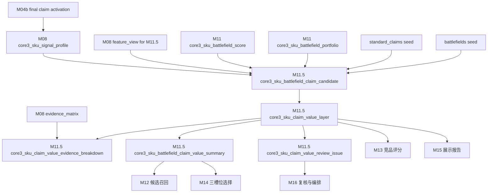
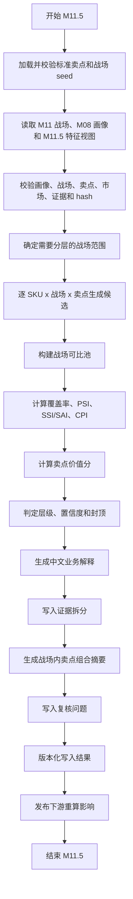

# M11.5 战场内卖点价值分层详细设计

## 1. 文档定位

本文是 CatForge 彩电核心三竞品 SOP 的 M11.5 详细设计，承接：

- 需求文档：`docs/core3_mvp/real_data_v2/sop_requirements/M11_5_claim_value_layer_requirements.md`
- 总体设计：`docs/core3_mvp/real_data_v2/sop_detailed_design/00_architecture_data_dictionary_design.md`
- 上游 M04b：`core3_sku_claim_activation`、`core3_sku_claim_comment_validation`，经 M08 汇总消费
- 上游 M06：评论卖点验证、战场支撑、价格感知、服务和痛点信号，经 M08 汇总消费
- 上游 M07：`core3_sku_market_profile`、`core3_comparable_pool_baseline`、`core3_market_pool_member`，经 M08 汇总消费
- 上游 M08：`core3_sku_signal_profile`、`core3_sku_signal_evidence_matrix`、`core3_sku_downstream_feature_view`
- 上游 M11：`core3_sku_battlefield_score`、`core3_sku_battlefield_evidence_breakdown`、`core3_sku_battlefield_portfolio`
- 上游 M02：`core3_evidence_atom`，只通过 M08/M11 evidence 引用回溯
- seed：`apps/api-server/app/rules/tv_core3_mvp_seed_v0_2.json` 中的 `standard_claims` 和 `battlefields`
- 下游 M12、M13、M14、M15、M16

M11.5 基于 M11 价值战场，在每个具体战场内判断 SKU 的核心卖点属于基础门槛、竞争绩效、溢价倾向、弱感知、样本不足或不适用。

本模块补齐“价值战场”和“卖点价值”的闭环：M11 说明 SKU 参与哪个战场，M11.5 说明在这个战场里哪些卖点只是入场门槛，哪些卖点真正形成竞争差异，哪些卖点可能支撑溢价，哪些卖点虽然被激活但用户和市场感知偏弱。

## 2. 模块职责

### 2.1 本模块解决什么

M11.5 解决七类工程问题：

1. 在 M11 已判定的战场语境内，对标准卖点做价值层级判断。
2. 区分同一卖点在不同战场中的核心、辅助、服务侧、不适用关系。
3. 将卖点激活、参数能力、宣传证据、评论感知、价格支撑、销量支撑和可比池样本统一拆解。
4. 使用覆盖率、PSI、SSI/SAI、CPI 形成可解释指标，但在样本不足时不强判。
5. 生成战场内卖点组合摘要，供 M12/M14 快速判断竞品召回和三槽位解释。
6. 为 M13 提供卖点价值层级组件，不让 M13 重新计算层级。
7. 为 M15 高层展示页提供业务化中文解释，说明“为什么这个卖点在这个战场里有价值或只是门槛”。

### 2.2 本模块不解决什么

| 不做事项 | 原因 | 后续模块 |
| --- | --- | --- |
| 不判断 SKU 是否进入某个战场 | 战场关系由 M11 判定 | M11 |
| 不做全局卖点分层 | 同一卖点在不同战场价值不同 | M11.5 |
| 不新增标准卖点 | 标准卖点由 seed 和 M04/M04b 维护 | M04/M04b |
| 不反向修改 M11 战场结果 | MVP 只正向消费战场上下文 | 二期可选 |
| 不从原始四张表读取业务字段 | 必须消费 M08/M11 上游产物 | M00-M11 |
| 不直接选择竞品 | 分层是候选和评分输入 | M12-M14 |
| 不重新计算竞品组件分 | M13 消费分层做 pair 级评分 | M13 |
| 不生成最终报告 | M15 负责展示表达 | M15 |
| 不把 PSI/SSI 当因果证明 | 量价指标只是相关证据 | M11.5 |

### 2.3 允许复用历史结果

允许复用历史 M11.5 输出，但必须同时满足：

- M11 战场 score、portfolio 和相关 evidence breakdown hash 未变化。
- M08 `profile_hash` 未变化。
- M08 `core3_sku_downstream_feature_view where for_module='M11_5'` 的 `view_hash` 未变化。
- M08 中最终卖点、评论验证、市场画像、可比池摘要相关 hash 未变化。
- standard_claims seed hash 未变化。
- battlefields seed hash 未变化。
- M11.5 规则版本、样本门槛、PSI/SSI/CPI 公式版本未变化。
- 历史记录 `is_current=true` 且 `processing_status` 不是 `failed`、`blocked`。

## 3. 输入输出总览

### 3.1 必须输入

| 输入 | 来源模块 | 表或文件 | 用途 |
| --- | --- | --- | --- |
| 战场得分 | M11 | `core3_sku_battlefield_score` | 决定哪些战场需要分层 |
| 战场证据拆分 | M11 | `core3_sku_battlefield_evidence_breakdown` | 确定战场上下文和风险 |
| 战场组合 | M11 | `core3_sku_battlefield_portfolio` | 决定主/次/机会/弱战场范围 |
| SKU 画像 | M08 | `core3_sku_signal_profile` | 最终卖点、参数、评论、市场、风险 |
| M11.5 特征视图 | M08 | `core3_sku_downstream_feature_view where for_module='M11_5'` | 默认卖点分层入口 |
| 证据矩阵 | M08 | `core3_sku_signal_evidence_matrix` | 判断证据覆盖和置信度 |
| 最终卖点激活 | M04b，经 M08 汇总 | `claim_activation_summary_json`、`claim_evidence_breakdown_json` | 卖点激活、依据、结构化卖点缺失 |
| 市场画像 | M07，经 M08 汇总 | `market_summary_json`、`market_signal_summary_json` | 价格、销量、销额、平台、趋势 |
| 可比池 | M07，经 M08 汇总 | `comparable_pool_summary_json`、pool members refs | 构建战场可比池 |
| evidence 原子 | M02 | `core3_evidence_atom` | 通过 evidence ID 回溯证据 |
| 标准卖点 seed | 规则资产 | `standard_claims` | 卖点定义、参数、评论主题、战场映射 |
| 战场 seed | 规则资产 | `battlefields` | 战场核心卖点、核心参数、评论主题和市场规则 |

### 3.2 从 M11 消费的战场范围

| M11 关系 | M11.5 处理 |
| --- | --- |
| `main` | 必须对该战场核心卖点做完整分层 |
| `secondary` | 必须分层，供 M12/M13 判断相似和差异 |
| `opportunity` | 可分层，用于扩展召回和机会解释 |
| `weak` | 只在卖点已激活或有明确评论/市场证据时分层 |
| `insufficient` | 默认不分层，只记录不足原因 |
| `blocked` | 不分层，写复核问题 |

M11.5 不反向修改 M11 战场关系。二期可考虑用卖点层级反向校准战场强弱，但 MVP 不做。

### 3.3 从 M08/M04b 消费的卖点特征

| 特征 | 用途 |
| --- | --- |
| `claim_code`、`claim_name`、`claim_group` | 标准卖点身份和展示名称 |
| `claim_activation_score` | SKU 该卖点激活强度 |
| `activation_basis` | 参数、宣传、评论、市场、服务构成 |
| `perception_status` | 评论验证、弱感知、矛盾或不足 |
| `mapped_battlefield_codes` | 卖点可进入哪些战场候选 |
| `supporting_param_codes` | 参数能力支撑 |
| `comment_topic_codes` | 评论感知支撑 |
| `missing_structured_claim` | 结构化宣传证据缺失 |
| `evidence_ids` | 参数、宣传、评论、市场证据 |

### 3.4 明确不消费

| 数据 | 禁止原因 |
| --- | --- |
| 原始 `week_sales_data`、`attribute_data`、`selling_points_data`、`comment_data` | 已由上游分层处理 |
| M03/M05/M06/M07 散表业务字段 | 必须通过 M08 消费 |
| M12-M15 竞品和报告结果 | M11.5 是它们的上游 |

### 3.5 输出表

| 输出表 | 粒度 | 用途 |
| --- | --- | --- |
| `core3_sku_battlefield_claim_candidate` | SKU + 战场 + 卖点 + 候选触发版本 | 记录为什么该卖点进入战场分层候选 |
| `core3_sku_claim_value_layer` | SKU + 战场 + 卖点 + 规则版本 | 记录最终卖点价值层级和指标 |
| `core3_sku_claim_value_evidence_breakdown` | SKU + 战场 + 卖点 + 证据域 | 记录激活、参数、宣传、评论、价格、销量、可比池、风险证据 |
| `core3_sku_battlefield_claim_value_summary` | SKU + 战场 + 规则版本 | 记录战场内卖点组合摘要 |
| `core3_sku_claim_value_review_issue` | SKU + 战场 + 卖点或战场级问题 | 记录卖点分层复核问题 |

### 3.6 模块关系



## 4. Seed 设计

### 4.1 预制和推导边界

M11.5 允许预制卖点本体、战场-卖点映射和分层规则骨架，不允许预制 SKU 的卖点价值结论。

| 预制项 | 内容 | 是否可直接成为 SKU 结论 |
| --- | --- | --- |
| `claim_code`、`claim_name` | 20 个 TV MVP 标准卖点 | 否 |
| `definition` | 卖点定义 | 否 |
| `mapped_battlefield_codes` | 卖点可用战场 | 否 |
| `supporting_param_codes` | 卖点支撑参数 | 否 |
| `comment_topic_codes` | 卖点评论主题 | 否 |
| 战场 `core_claim_codes` | 战场核心卖点 | 否 |
| 分层阈值 | coverage、PSI、SSI、CPI 阈值 | 否 |
| 样本门槛 | pool、with/without claim、评论样本门槛 | 否 |

每个 SKU 的分层必须从 M08/M11 真实画像、战场关系、卖点激活、评论和市场可比池推导。

### 4.2 seed 版本

首版使用：

| 项 | 值 |
| --- | --- |
| seed 文件 | `apps/api-server/app/rules/tv_core3_mvp_seed_v0_2.json` |
| 文件内版本 | `core3-mvp-0.2.0` |
| 建议 claim 版本 | `tv_core3_mvp_seed_v0_2` |
| 建议 battlefield 版本 | `tv_core3_mvp_seed_v0_2` |
| category_code | `TV` |

M11.5 输出同时保存：

- `claim_seed_version='tv_core3_mvp_seed_v0_2'`
- `battlefield_seed_version='tv_core3_mvp_seed_v0_2'`
- `seed_file_version='core3-mvp-0.2.0'`
- `claim_seed_hash`
- `battlefield_seed_hash`

### 4.3 20 个标准卖点

MVP 必须覆盖 seed 中 20 个标准卖点。

| 卖点 code | 中文名 | 主要战场 |
| --- | --- | --- |
| `CLAIM_LARGE_SCREEN_IMMERSION` | 大屏沉浸观影 | 家庭观影升级、大屏性价比 |
| `CLAIM_MINI_LED_BACKLIGHT` | Mini LED 背光 | 高端画质 |
| `CLAIM_OLED_SELF_LIT` | OLED 自发光 | 高端画质 |
| `CLAIM_QLED_WIDE_COLOR` | 量子点广色域 | 高端画质 |
| `CLAIM_HIGH_BRIGHTNESS_HDR` | 高亮 HDR | 高端画质、家庭观影升级 |
| `CLAIM_FINE_LOCAL_DIMMING` | 精细分区控光 | 高端画质 |
| `CLAIM_HIGH_REFRESH_RATE` | 高刷新率 | 游戏体育 |
| `CLAIM_GAMING_LOW_LATENCY` | 低延迟游戏 | 游戏体育 |
| `CLAIM_HDMI_2_1_GAMING` | HDMI 2.1 游戏接口 | 游戏体育 |
| `CLAIM_SPORTS_MOTION_SMOOTH` | 体育运动流畅 | 游戏体育 |
| `CLAIM_EYE_CARE_COMFORT` | 护眼舒适 | 家庭护眼 |
| `CLAIM_ELDER_FRIENDLY_SMART` | 长辈友好智能 | 长辈易用 |
| `CLAIM_SMART_VOICE_EASE` | 智能语音易用 | 智能系统、长辈易用 |
| `CLAIM_NO_AD_OR_CLEAN_SYSTEM` | 清爽系统/少广告 | 智能系统、长辈易用 |
| `CLAIM_IMMERSIVE_AUDIO` | 沉浸音效 | 影院音效、家庭观影升级 |
| `CLAIM_DOLBY_CINEMA_AUDIO` | 杜比影音 | 影院音效、家庭观影升级 |
| `CLAIM_THIN_DESIGN` | 超薄美学设计 | 家居美学 |
| `CLAIM_ENERGY_SAVING` | 节能省电 | 大屏性价比 |
| `CLAIM_VALUE_FOR_MONEY` | 高性价比 | 大屏性价比 |
| `CLAIM_INSTALLATION_SERVICE_ASSURANCE` | 安装服务保障 | 服务保障、家居美学 |

### 4.4 战场-卖点范围

| 战场 | 核心卖点 |
| --- | --- |
| 高端画质战场 | Mini LED 背光、OLED 自发光、量子点广色域、高亮 HDR、精细分区控光 |
| 家庭观影升级战场 | 大屏沉浸观影、高亮 HDR、沉浸音效、杜比影音 |
| 游戏体育战场 | 高刷新率、低延迟游戏、HDMI 2.1 游戏接口、体育运动流畅 |
| 大屏性价比战场 | 大屏沉浸观影、高性价比、节能省电 |
| 家庭护眼战场 | 护眼舒适 |
| 长辈易用战场 | 长辈友好智能、智能语音易用、清爽系统/少广告 |
| 智能系统体验战场 | 智能语音易用、清爽系统/少广告、长辈友好智能 |
| 影院音效战场 | 沉浸音效、杜比影音 |
| 家居美学战场 | 超薄美学设计、安装服务保障、大屏沉浸观影 |
| 服务保障战场 | 安装服务保障 |

同一卖点可以出现在多个战场，但分层必须按 `sku_code + battlefield_code + claim_code` 独立计算。

### 4.5 seed 校验

M11.5 启动前必须校验 seed：

| 校验 | 失败处理 |
| --- | --- |
| `standard_claims` 正好覆盖 20 个 MVP claim_code | 阻塞 |
| `battlefields` 正好覆盖 10 个 MVP battlefield_code | 阻塞 |
| 每个战场 `core_claim_codes` 均存在于 standard_claims | 阻塞 |
| 每个卖点的 `mapped_battlefield_codes` 均存在于 battlefields | 阻塞 |
| 卖点支撑参数和评论主题可识别 | 复核 |
| 服务类卖点只映射服务保障或家居美学服务侧 | 复核 |
| seed hash 可计算 | 阻塞 |

## 5. 数据模型设计

### 5.1 通用字段约定

M11.5 输出表必须包含以下通用字段。

| 字段 | 类型建议 | 必填 | 说明 |
| --- | --- | --- | --- |
| `project_id` | `text` | 是 | 项目 ID |
| `category_code` | `text` | 是 | MVP 为 `TV` |
| `batch_id` | `text` | 是 | 批次 ID |
| `run_id` | `text` | 否 | 全链路运行 ID |
| `module_run_id` | `text` | 否 | M11.5 模块运行 ID |
| `rule_version` | `text` | 是 | M11.5 分层规则版本 |
| `claim_seed_version` | `text` | 是 | 标准卖点 seed 业务版本 |
| `battlefield_seed_version` | `text` | 是 | 战场 seed 业务版本 |
| `seed_file_version` | `text` | 是 | seed 文件内版本 |
| `claim_seed_hash` | `text` | 是 | standard_claims seed hash |
| `battlefield_seed_hash` | `text` | 是 | battlefields seed hash |
| `profile_hash` | `text` | 是 | M08 SKU 画像 hash |
| `feature_view_hash` | `text` | 是 | M08 M11.5 特征视图 hash |
| `battlefield_score_fingerprint` | `text` | 是 | M11 战场结果 hash |
| `input_fingerprint` | `text` | 是 | 输入 hash |
| `result_hash` | `text` | 是 | 输出业务内容 hash |
| `is_current` | `boolean` | 是 | 是否当前版本 |
| `processing_status` | `text` | 是 | `success`、`warning`、`review_required`、`blocked`、`failed` |
| `review_required` | `boolean` | 是 | 是否需要复核 |
| `review_status` | `text` | 是 | `auto_pass`、`review_required`、`approved`、`rejected`、`waived` |
| `review_reason_json` | `jsonb` | 是 | 复核原因 |
| `created_at` | `timestamptz` | 是 | 创建时间 |
| `updated_at` | `timestamptz` | 是 | 更新时间 |

### 5.2 枚举定义

#### 5.2.1 `candidate_status`

```text
active
rejected
review_required
blocked
```

#### 5.2.2 `candidate_source`

```text
battlefield_core_claim
claim_battlefield_mapping
claim_activation
param
comment
market
service
seed_gap
```

#### 5.2.3 `battlefield_relevance_role`

```text
core
auxiliary
service
risk
not_applicable
```

#### 5.2.4 `claim_value_layer`

```text
basic_threshold
competitive_performance
premium_tendency
weak_perception
insufficient_sample
not_applicable
blocked
```

#### 5.2.5 `sample_sufficiency`

```text
sufficient
limited
insufficient
unknown
```

#### 5.2.6 `evidence_domain`

```text
activation
param
promo
comment
price
sales
pool
market
service
risk
seed
profile
```

#### 5.2.7 `review_issue_type`

```text
missing_feature_view
missing_battlefield_result
missing_claim_activation
insufficient_pool
insufficient_with_claim
insufficient_without_claim
promo_missing
comment_missing
market_missing
param_conflict
service_misuse
seed_gap
profile_blocked
```

## 6. 表设计：`core3_sku_battlefield_claim_candidate`

### 6.1 表职责

`core3_sku_battlefield_claim_candidate` 记录战场内卖点候选生成阶段。它回答“为什么某个卖点进入某个战场的分层判断”，也记录被拒绝、阻塞或需要复核的候选。

候选记录不等于最终层级。最终层级以 `core3_sku_claim_value_layer` 为准。

### 6.2 字段级契约

| 字段 | 类型建议 | 必填 | 来源 | 说明 |
| --- | --- | --- | --- | --- |
| `sku_battlefield_claim_candidate_id` | `uuid` | 是 | M11.5 | 主键 |
| `project_id` | `text` | 是 | M00 | 项目 ID |
| `category_code` | `text` | 是 | M00/M08 | 品类 |
| `batch_id` | `text` | 是 | M00 | 批次 |
| `run_id` | `text` | 否 | M16 | 全链路运行 ID |
| `module_run_id` | `text` | 否 | M11.5 | 本模块运行 ID |
| `sku_signal_profile_id` | `uuid` | 是 | M08 | SKU 画像 ID |
| `sku_downstream_feature_view_id` | `uuid` | 是 | M08 | M11.5 特征视图 ID |
| `sku_battlefield_score_id` | `uuid` | 是 | M11 | 战场 score ID |
| `sku_code` | `text` | 是 | M08 | SKU |
| `model_code` | `text` | 否 | M08 | 型号编码 |
| `model_name` | `text` | 否 | M08 | 型号名 |
| `brand_name` | `text` | 否 | M08 | 品牌 |
| `battlefield_code` | `text` | 是 | M11/seed | 战场 code |
| `battlefield_name_cn` | `text` | 是 | seed | 战场中文名 |
| `battlefield_relation_level` | `text` | 是 | M11 | M11 战场关系 |
| `claim_code` | `text` | 是 | seed/M08 | 标准卖点 code |
| `claim_name_cn` | `text` | 是 | seed | 标准卖点中文名 |
| `claim_group` | `text` | 否 | seed | picture/gaming/motion/eye_care/smart/audio/design/value/service |
| `candidate_source_json` | `jsonb` | 是 | M11.5 | 战场核心、映射、参数、评论、服务或市场触发来源 |
| `candidate_source_count` | `integer` | 是 | M11.5 | 命中来源域数量 |
| `candidate_reason_cn` | `text` | 是 | M11.5 | 中文候选原因 |
| `candidate_status` | `text` | 是 | M11.5 | active/rejected/review_required/blocked |
| `reject_reason_json` | `jsonb` | 是 | M11.5 | 被拒绝原因 |
| `missing_signals_json` | `jsonb` | 是 | M08/M11.5 | 缺失信号 |
| `risk_flags_json` | `jsonb` | 是 | M08/M11/M11.5 | 风险 |
| `evidence_ids` | `uuid[]` | 是 | M08/M11/M02 | 候选阶段代表 evidence |
| `evidence_matrix_refs_json` | `jsonb` | 是 | M08 | M08 证据矩阵引用 |
| `profile_hash` | `text` | 是 | M08 | 画像 hash |
| `feature_view_hash` | `text` | 是 | M08 | M11.5 视图 hash |
| `battlefield_score_fingerprint` | `text` | 是 | M11/M11.5 | M11 战场结果 hash |
| `claim_seed_version` | `text` | 是 | seed | 卖点 seed 版本 |
| `battlefield_seed_version` | `text` | 是 | seed | 战场 seed 版本 |
| `rule_version` | `text` | 是 | M11.5 | 规则版本 |
| `input_fingerprint` | `text` | 是 | M11.5 | 输入 hash |
| `result_hash` | `text` | 是 | M11.5 | 结果 hash |
| `is_current` | `boolean` | 是 | M11.5 | 是否当前 |
| `processing_status` | `text` | 是 | M11.5 | 处理状态 |
| `review_required` | `boolean` | 是 | M11.5 | 是否复核 |
| `review_status` | `text` | 是 | M11.5 | 复核状态 |
| `review_reason_json` | `jsonb` | 是 | M11.5 | 复核原因 |
| `created_at` | `timestamptz` | 是 | M11.5 | 创建时间 |
| `updated_at` | `timestamptz` | 是 | M11.5 | 更新时间 |

### 6.3 主键、唯一键和索引

主键：

```sql
primary key (sku_battlefield_claim_candidate_id)
```

唯一键：

```sql
unique (
  project_id,
  category_code,
  batch_id,
  sku_code,
  battlefield_code,
  claim_code,
  profile_hash,
  battlefield_score_fingerprint,
  claim_seed_version,
  battlefield_seed_version,
  rule_version,
  result_hash
)
```

当前版本唯一索引：

```sql
create unique index uq_core3_sku_battlefield_claim_candidate_current
on core3_sku_battlefield_claim_candidate(
  project_id,
  category_code,
  batch_id,
  sku_code,
  battlefield_code,
  claim_code,
  claim_seed_version,
  battlefield_seed_version,
  rule_version
)
where is_current = true;
```

查询索引：

```sql
create index idx_core3_sku_battlefield_claim_candidate_sku_bf
on core3_sku_battlefield_claim_candidate(project_id, category_code, batch_id, sku_code, battlefield_code);

create index idx_core3_sku_battlefield_claim_candidate_claim
on core3_sku_battlefield_claim_candidate(project_id, category_code, batch_id, claim_code, candidate_status);

create index idx_core3_sku_battlefield_claim_candidate_review
on core3_sku_battlefield_claim_candidate(project_id, category_code, batch_id, review_required);

create index idx_core3_sku_battlefield_claim_candidate_source_gin
on core3_sku_battlefield_claim_candidate
using gin (candidate_source_json jsonb_path_ops);
```

## 7. 表设计：`core3_sku_claim_value_layer`

### 7.1 表职责

`core3_sku_claim_value_layer` 是 M11.5 主输出，记录每个 SKU 在某个战场内某个标准卖点的价值层级、指标、置信度和中文解释。

每条分层必须包含 `sku_code + battlefield_code + claim_code`。禁止只按 SKU 或只按卖点做全局分层。

### 7.2 字段级契约

| 字段 | 类型建议 | 必填 | 来源 | 说明 |
| --- | --- | --- | --- | --- |
| `sku_claim_value_layer_id` | `uuid` | 是 | M11.5 | 主键 |
| `project_id` | `text` | 是 | M00 | 项目 |
| `category_code` | `text` | 是 | M00/M08 | 品类 |
| `batch_id` | `text` | 是 | M00 | 批次 |
| `run_id` | `text` | 否 | M16 | 全链路运行 ID |
| `module_run_id` | `text` | 否 | M11.5 | 模块运行 ID |
| `sku_signal_profile_id` | `uuid` | 是 | M08 | 画像 ID |
| `sku_downstream_feature_view_id` | `uuid` | 是 | M08 | M11.5 特征视图 ID |
| `sku_battlefield_score_id` | `uuid` | 是 | M11 | 战场 score ID |
| `sku_code` | `text` | 是 | M08 | SKU |
| `model_code` | `text` | 否 | M08 | 型号编码 |
| `model_name` | `text` | 否 | M08 | 型号名 |
| `brand_name` | `text` | 否 | M08 | 品牌 |
| `battlefield_code` | `text` | 是 | M11/seed | 战场 code |
| `battlefield_name_cn` | `text` | 是 | seed | 战场中文名 |
| `battlefield_relation_level` | `text` | 是 | M11 | M11 战场关系 |
| `claim_code` | `text` | 是 | seed/M08 | 标准卖点 code |
| `claim_name_cn` | `text` | 是 | seed | 标准卖点中文名 |
| `claim_group` | `text` | 否 | seed | 卖点组 |
| `claim_activation_score` | `numeric(6,4)` | 是 | M08/M04b | 卖点激活分 |
| `activation_basis_json` | `jsonb` | 是 | M08/M04b | 参数、宣传、评论、市场、服务构成 |
| `battlefield_relevance_role` | `text` | 是 | seed/M11.5 | core/auxiliary/service/risk/not_applicable |
| `comparable_pool_id` | `text` | 否 | M07/M08/M11.5 | 可比池 ID |
| `pool_type` | `text` | 否 | M07/M11.5 | same_battlefield_size_price_platform 等 |
| `pool_sku_count` | `integer` | 是 | M07/M11.5 | 可比池 SKU 数 |
| `with_claim_count` | `integer` | 是 | M11.5 | 池中具备该卖点 SKU 数 |
| `without_claim_count` | `integer` | 是 | M11.5 | 池中不具备该卖点 SKU 数 |
| `coverage_rate` | `numeric(6,4)` | 否 | M11.5 | 覆盖率 |
| `coverage_position_score` | `numeric(6,4)` | 是 | M11.5 | 覆盖率用于门槛/差异判断的得分 |
| `psi` | `numeric(8,4)` | 否 | M11.5 | 价格支撑指数 |
| `ssi` | `numeric(8,4)` | 否 | M11.5 | 销量支撑指数 |
| `sai` | `numeric(8,4)` | 否 | M11.5 | 销额支撑指数 |
| `cpi` | `numeric(8,4)` | 否 | M11.5 | 评论感知指数 |
| `positive_mention_rate` | `numeric(6,4)` | 否 | M06/M11.5 | 正向提及率 |
| `negative_mention_rate` | `numeric(6,4)` | 否 | M06/M11.5 | 负向提及率 |
| `neutral_mention_rate` | `numeric(6,4)` | 否 | M06/M11.5 | 中性提及率 |
| `price_support_score` | `numeric(6,4)` | 是 | M11.5 | PSI 转换得分 |
| `sales_support_score` | `numeric(6,4)` | 是 | M11.5 | SSI/SAI 转换得分 |
| `comment_perception_score` | `numeric(6,4)` | 是 | M11.5 | CPI 转换得分 |
| `claim_value_score` | `numeric(6,4)` | 是 | M11.5 | 卖点价值分 |
| `layer` | `text` | 是 | M11.5 | basic_threshold/competitive_performance/premium_tendency/weak_perception/insufficient_sample/not_applicable/blocked |
| `layer_reason_json` | `jsonb` | 是 | M11.5 | 层级判定原因 |
| `confidence` | `numeric(6,4)` | 是 | M11.5 | 置信度 |
| `confidence_level` | `text` | 是 | M11.5 | high/medium/low/unknown |
| `sample_sufficiency` | `text` | 是 | M11.5 | sufficient/limited/insufficient/unknown |
| `sample_sufficiency_json` | `jsonb` | 是 | M11.5 | pool、with/without、评论、市场周数状态 |
| `missing_signals_json` | `jsonb` | 是 | M08/M11.5 | 缺失信号 |
| `risk_flags_json` | `jsonb` | 是 | M08/M11/M11.5 | 风险 |
| `business_reason_cn` | `text` | 是 | M11.5 | 中文业务解释摘要 |
| `business_reason_parts_json` | `jsonb` | 是 | M11.5 | 战场相关性、激活依据、可比池、价格、销量、评论、复核点 |
| `evidence_ids` | `uuid[]` | 是 | M08/M11/M02 | 核心 evidence |
| `evidence_matrix_refs_json` | `jsonb` | 是 | M08 | 证据矩阵引用 |
| `profile_hash` | `text` | 是 | M08 | 画像 hash |
| `feature_view_hash` | `text` | 是 | M08 | M11.5 视图 hash |
| `battlefield_score_fingerprint` | `text` | 是 | M11/M11.5 | 战场结果 hash |
| `claim_seed_version` | `text` | 是 | seed | 卖点 seed 版本 |
| `battlefield_seed_version` | `text` | 是 | seed | 战场 seed 版本 |
| `rule_version` | `text` | 是 | M11.5 | 规则版本 |
| `input_fingerprint` | `text` | 是 | M11.5 | 输入 hash |
| `result_hash` | `text` | 是 | M11.5 | 结果 hash |
| `is_current` | `boolean` | 是 | M11.5 | 是否当前 |
| `processing_status` | `text` | 是 | M11.5 | 处理状态 |
| `review_required` | `boolean` | 是 | M11.5 | 是否复核 |
| `review_status` | `text` | 是 | M11.5 | 复核状态 |
| `review_reason_json` | `jsonb` | 是 | M11.5 | 复核原因 |
| `created_at` | `timestamptz` | 是 | M11.5 | 创建时间 |
| `updated_at` | `timestamptz` | 是 | 更新时间 |

### 7.3 主键、唯一键和索引

主键：

```sql
primary key (sku_claim_value_layer_id)
```

唯一键：

```sql
unique (
  project_id,
  category_code,
  batch_id,
  sku_code,
  battlefield_code,
  claim_code,
  profile_hash,
  battlefield_score_fingerprint,
  claim_seed_version,
  battlefield_seed_version,
  rule_version,
  result_hash
)
```

当前版本唯一索引：

```sql
create unique index uq_core3_sku_claim_value_layer_current
on core3_sku_claim_value_layer(
  project_id,
  category_code,
  batch_id,
  sku_code,
  battlefield_code,
  claim_code,
  claim_seed_version,
  battlefield_seed_version,
  rule_version
)
where is_current = true;
```

查询索引：

```sql
create index idx_core3_sku_claim_value_layer_sku_bf
on core3_sku_claim_value_layer(project_id, category_code, batch_id, sku_code, battlefield_code, layer);

create index idx_core3_sku_claim_value_layer_claim
on core3_sku_claim_value_layer(project_id, category_code, batch_id, claim_code, layer);

create index idx_core3_sku_claim_value_layer_downstream
on core3_sku_claim_value_layer(project_id, category_code, batch_id, sku_code, battlefield_code, layer, claim_value_score desc);

create index idx_core3_sku_claim_value_layer_hash
on core3_sku_claim_value_layer(project_id, category_code, batch_id, profile_hash, battlefield_score_fingerprint, claim_seed_version, battlefield_seed_version, rule_version);

create index idx_core3_sku_claim_value_layer_reason_gin
on core3_sku_claim_value_layer
using gin (layer_reason_json jsonb_path_ops);
```

## 8. 表设计：`core3_sku_claim_value_evidence_breakdown`

### 8.1 表职责

`core3_sku_claim_value_evidence_breakdown` 保存卖点分层的分域证据拆解。它回答“这个卖点在该战场内为什么被判为门槛、绩效、溢价、弱感知或样本不足”。

每个 `core3_sku_claim_value_layer` 至少输出 9 类域记录：`activation`、`param`、`promo`、`comment`、`price`、`sales`、`pool`、`service`、`risk`。缺失域也要输出 `support_level='missing'` 或 `not_applicable`。

### 8.2 字段级契约

| 字段 | 类型建议 | 必填 | 来源 | 说明 |
| --- | --- | --- | --- | --- |
| `sku_claim_value_evidence_breakdown_id` | `uuid` | 是 | M11.5 | 主键 |
| `sku_claim_value_layer_id` | `uuid` | 是 | M11.5 | 关联分层记录 |
| `project_id` | `text` | 是 | M00 | 项目 |
| `category_code` | `text` | 是 | M00/M08 | 品类 |
| `batch_id` | `text` | 是 | M00 | 批次 |
| `sku_code` | `text` | 是 | M08 | SKU |
| `battlefield_code` | `text` | 是 | M11 | 战场 code |
| `claim_code` | `text` | 是 | seed/M08 | 卖点 code |
| `evidence_domain` | `text` | 是 | M11.5 | activation/param/promo/comment/price/sales/pool/market/service/risk |
| `support_level` | `text` | 是 | M11.5 | strong/medium/weak/missing/conflict/not_applicable |
| `support_score` | `numeric(6,4)` | 是 | M11.5 | 分域得分 |
| `domain_weight` | `numeric(6,4)` | 是 | M11.5 | 该域权重 |
| `weighted_contribution` | `numeric(6,4)` | 是 | M11.5 | 加权贡献 |
| `support_summary_cn` | `text` | 是 | M11.5 | 中文证据摘要 |
| `source_signal_codes_json` | `jsonb` | 是 | M08/seed | 来源参数、评论主题、市场信号或服务信号 |
| `source_values_json` | `jsonb` | 是 | M08/M11.5 | 指标值、样本量、分位、提及率 |
| `representative_evidence_ids` | `uuid[]` | 是 | M08/M02 | 代表 evidence |
| `evidence_matrix_refs_json` | `jsonb` | 是 | M08 | 证据矩阵引用 |
| `missing_reason_code` | `text` | 否 | M11.5 | 缺失原因 |
| `risk_flags_json` | `jsonb` | 是 | M08/M11.5 | 风险 |
| `confidence` | `numeric(6,4)` | 是 | M11.5 | 分域置信度 |
| `claim_seed_version` | `text` | 是 | seed | 卖点 seed 版本 |
| `battlefield_seed_version` | `text` | 是 | seed | 战场 seed 版本 |
| `rule_version` | `text` | 是 | M11.5 | 规则版本 |
| `profile_hash` | `text` | 是 | M08 | 画像 hash |
| `battlefield_score_fingerprint` | `text` | 是 | M11/M11.5 | 战场结果 hash |
| `input_fingerprint` | `text` | 是 | M11.5 | 输入 hash |
| `result_hash` | `text` | 是 | M11.5 | 结果 hash |
| `is_current` | `boolean` | 是 | M11.5 | 是否当前 |
| `created_at` | `timestamptz` | 是 | M11.5 | 创建时间 |
| `updated_at` | `timestamptz` | 是 | 更新时间 |

### 8.3 主键、唯一键和索引

主键：

```sql
primary key (sku_claim_value_evidence_breakdown_id)
```

唯一键：

```sql
unique (
  sku_claim_value_layer_id,
  evidence_domain,
  claim_seed_version,
  battlefield_seed_version,
  rule_version
)
```

查询索引：

```sql
create index idx_core3_sku_claim_value_evidence_breakdown_layer
on core3_sku_claim_value_evidence_breakdown(sku_claim_value_layer_id, evidence_domain);

create index idx_core3_sku_claim_value_evidence_breakdown_sku_bf_claim
on core3_sku_claim_value_evidence_breakdown(project_id, category_code, batch_id, sku_code, battlefield_code, claim_code);

create index idx_core3_sku_claim_value_evidence_breakdown_support
on core3_sku_claim_value_evidence_breakdown(project_id, category_code, batch_id, evidence_domain, support_level);

create index idx_core3_sku_claim_value_evidence_breakdown_refs_gin
on core3_sku_claim_value_evidence_breakdown
using gin (representative_evidence_ids);
```

## 9. 表设计：`core3_sku_battlefield_claim_value_summary`

### 9.1 表职责

`core3_sku_battlefield_claim_value_summary` 保存 SKU 在某个战场下的卖点价值组合摘要。它不替代 `core3_sku_claim_value_layer`，而是给 M12/M14/M15 快速消费的组合视图。

该表回答：

- 这个战场内哪些卖点可支撑溢价？
- 哪些卖点形成竞争绩效？
- 哪些卖点只是基础门槛？
- 哪些卖点弱感知或样本不足？
- 后续竞品比较应该看哪些卖点差异？

### 9.2 字段级契约

| 字段 | 类型建议 | 必填 | 来源 | 说明 |
| --- | --- | --- | --- | --- |
| `sku_battlefield_claim_value_summary_id` | `uuid` | 是 | M11.5 | 主键 |
| `project_id` | `text` | 是 | M00 | 项目 |
| `category_code` | `text` | 是 | M00/M08 | 品类 |
| `batch_id` | `text` | 是 | M00 | 批次 |
| `run_id` | `text` | 否 | M16 | 全链路运行 ID |
| `module_run_id` | `text` | 否 | M11.5 | 模块运行 ID |
| `sku_signal_profile_id` | `uuid` | 是 | M08 | 画像 ID |
| `sku_battlefield_score_id` | `uuid` | 是 | M11 | 战场 score ID |
| `sku_code` | `text` | 是 | M08 | SKU |
| `model_code` | `text` | 否 | M08 | 型号编码 |
| `model_name` | `text` | 否 | M08 | 型号名 |
| `brand_name` | `text` | 否 | M08 | 品牌 |
| `battlefield_code` | `text` | 是 | M11/seed | 战场 code |
| `battlefield_name_cn` | `text` | 是 | seed | 战场中文名 |
| `battlefield_relation_level` | `text` | 是 | M11 | M11 战场关系 |
| `premium_claims_json` | `jsonb` | 是 | M11.5 | 溢价倾向卖点 |
| `performance_claims_json` | `jsonb` | 是 | M11.5 | 竞争绩效卖点 |
| `threshold_claims_json` | `jsonb` | 是 | M11.5 | 基础门槛卖点 |
| `weak_claims_json` | `jsonb` | 是 | M11.5 | 弱感知卖点 |
| `insufficient_claims_json` | `jsonb` | 是 | M11.5 | 样本不足卖点 |
| `not_applicable_claims_json` | `jsonb` | 是 | M11.5 | 不适用卖点 |
| `claim_value_profile_cn` | `text` | 是 | M11.5 | 战场内卖点组合中文摘要 |
| `comparison_focus_claims_json` | `jsonb` | 是 | M11.5 | M12/M13/M14 应重点比较的卖点 |
| `summary_confidence` | `numeric(6,4)` | 是 | M11.5 | 摘要置信度 |
| `summary_risk_flags_json` | `jsonb` | 是 | M11.5 | 摘要风险 |
| `claim_value_layer_refs_json` | `jsonb` | 是 | M11.5 | 关联 layer ID 和 hash |
| `evidence_ids` | `uuid[]` | 是 | M11.5/M02 | 代表 evidence |
| `profile_hash` | `text` | 是 | M08 | 画像 hash |
| `feature_view_hash` | `text` | 是 | M08 | M11.5 视图 hash |
| `battlefield_score_fingerprint` | `text` | 是 | M11/M11.5 | 战场结果 hash |
| `claim_seed_version` | `text` | 是 | seed | 卖点 seed 版本 |
| `battlefield_seed_version` | `text` | 是 | seed | 战场 seed 版本 |
| `rule_version` | `text` | 是 | M11.5 | 规则版本 |
| `input_fingerprint` | `text` | 是 | M11.5 | 输入 hash |
| `result_hash` | `text` | 是 | M11.5 | 结果 hash |
| `is_current` | `boolean` | 是 | M11.5 | 是否当前 |
| `processing_status` | `text` | 是 | M11.5 | 处理状态 |
| `review_required` | `boolean` | 是 | M11.5 | 是否复核 |
| `review_status` | `text` | 是 | M11.5 | 复核状态 |
| `review_reason_json` | `jsonb` | 是 | M11.5 | 复核原因 |
| `created_at` | `timestamptz` | 是 | M11.5 | 创建时间 |
| `updated_at` | `timestamptz` | 是 | 更新时间 |

### 9.3 主键、唯一键和索引

主键：

```sql
primary key (sku_battlefield_claim_value_summary_id)
```

唯一键：

```sql
unique (
  project_id,
  category_code,
  batch_id,
  sku_code,
  battlefield_code,
  profile_hash,
  battlefield_score_fingerprint,
  claim_seed_version,
  battlefield_seed_version,
  rule_version,
  result_hash
)
```

当前版本唯一索引：

```sql
create unique index uq_core3_sku_battlefield_claim_value_summary_current
on core3_sku_battlefield_claim_value_summary(
  project_id,
  category_code,
  batch_id,
  sku_code,
  battlefield_code,
  claim_seed_version,
  battlefield_seed_version,
  rule_version
)
where is_current = true;
```

查询索引：

```sql
create index idx_core3_sku_battlefield_claim_value_summary_sku_bf
on core3_sku_battlefield_claim_value_summary(project_id, category_code, batch_id, sku_code, battlefield_code);

create index idx_core3_sku_battlefield_claim_value_summary_confidence
on core3_sku_battlefield_claim_value_summary(project_id, category_code, batch_id, summary_confidence desc, review_required);

create index idx_core3_sku_battlefield_claim_value_summary_focus_gin
on core3_sku_battlefield_claim_value_summary
using gin (comparison_focus_claims_json jsonb_path_ops);
```

## 10. 表设计：`core3_sku_claim_value_review_issue`

### 10.1 表职责

`core3_sku_claim_value_review_issue` 记录 M11.5 的复核问题。它可以关联具体卖点，也可以记录战场级问题，例如战场可比池不足或 M08 未生成 M11.5 特征视图。

### 10.2 字段级契约

| 字段 | 类型建议 | 必填 | 来源 | 说明 |
| --- | --- | --- | --- | --- |
| `sku_claim_value_review_issue_id` | `uuid` | 是 | M11.5 | 主键 |
| `project_id` | `text` | 是 | M00 | 项目 |
| `category_code` | `text` | 是 | M00/M08 | 品类 |
| `batch_id` | `text` | 是 | M00 | 批次 |
| `run_id` | `text` | 否 | M16 | 全链路运行 ID |
| `module_run_id` | `text` | 否 | M11.5 | 模块运行 ID |
| `sku_code` | `text` | 是 | M08 | SKU |
| `battlefield_code` | `text` | 是 | M11 | 战场 code |
| `claim_code` | `text` | 否 | seed/M08 | 可为空，表示战场级问题 |
| `issue_type` | `text` | 是 | M11.5 | review issue 类型 |
| `issue_level` | `text` | 是 | M11.5 | `warning`、`blocker` |
| `issue_message_cn` | `text` | 是 | M11.5 | 中文复核说明 |
| `issue_context_json` | `jsonb` | 是 | M11.5 | 问题上下文 |
| `related_layer_id` | `uuid` | 否 | M11.5 | 关联分层 |
| `related_candidate_id` | `uuid` | 否 | M11.5 | 关联候选 |
| `related_battlefield_score_id` | `uuid` | 否 | M11 | 关联战场 |
| `evidence_ids` | `uuid[]` | 是 | M08/M11/M02 | 相关证据 |
| `profile_hash` | `text` | 是 | M08 | 画像 hash |
| `battlefield_score_fingerprint` | `text` | 是 | M11/M11.5 | 战场结果 hash |
| `claim_seed_version` | `text` | 是 | seed | 卖点 seed 版本 |
| `battlefield_seed_version` | `text` | 是 | seed | 战场 seed 版本 |
| `rule_version` | `text` | 是 | M11.5 | 规则版本 |
| `resolved_status` | `text` | 是 | M16 | `open`、`resolved`、`ignored` |
| `resolved_by` | `text` | 否 | M16 | 处理人 |
| `resolved_at` | `timestamptz` | 否 | M16 | 处理时间 |
| `resolution_note` | `text` | 否 | M16 | 处理说明 |
| `input_fingerprint` | `text` | 是 | M11.5 | 输入 hash |
| `result_hash` | `text` | 是 | M11.5 | 结果 hash |
| `is_current` | `boolean` | 是 | M11.5 | 是否当前 |
| `created_at` | `timestamptz` | 是 | M11.5 | 创建时间 |
| `updated_at` | `timestamptz` | 是 | 更新时间 |

### 10.3 主键、唯一键和索引

主键：

```sql
primary key (sku_claim_value_review_issue_id)
```

表达式唯一索引：

```sql
create unique index uq_core3_sku_claim_value_review_issue_result
on core3_sku_claim_value_review_issue (
  project_id,
  category_code,
  batch_id,
  sku_code,
  battlefield_code,
  coalesce(claim_code, ''),
  issue_type,
  profile_hash,
  battlefield_score_fingerprint,
  claim_seed_version,
  battlefield_seed_version,
  rule_version,
  result_hash
)
```

说明：`claim_code` 允许为空，表示战场级复核问题，因此需要用表达式唯一索引把空值归一。

查询索引：

```sql
create index idx_core3_sku_claim_value_review_issue_open
on core3_sku_claim_value_review_issue(project_id, category_code, batch_id, resolved_status, issue_level);

create index idx_core3_sku_claim_value_review_issue_sku_bf_claim
on core3_sku_claim_value_review_issue(project_id, category_code, batch_id, sku_code, battlefield_code, claim_code);

create index idx_core3_sku_claim_value_review_issue_type
on core3_sku_claim_value_review_issue(project_id, category_code, batch_id, issue_type);
```

## 11. 分层范围和候选生成

### 11.1 分层范围

M11.5 先按 M11 战场结果确定处理范围：

1. `main`、`secondary` 战场：对 seed 战场核心卖点和 SKU 已激活映射卖点完整分层。
2. `opportunity` 战场：对核心卖点、已激活卖点和有评论/市场信号卖点分层。
3. `weak` 战场：只对已激活或有明确评论/市场证据的卖点分层。
4. `insufficient`、`blocked` 战场：不做正常分层，写不足或阻塞原因。

### 11.2 候选触发条件

满足任一条件即可生成候选。

| 触发来源 | 候选条件 |
| --- | --- |
| 战场核心卖点 | `claim_code` 属于该战场 `core_claim_codes` |
| 卖点映射 | SKU 已激活卖点的 `mapped_battlefield_codes` 包含该战场 |
| 参数触发 | 该战场核心参数命中并可映射到某标准卖点 |
| 评论触发 | 评论验证或战场支撑命中该卖点主题 |
| 市场触发 | 市场/可比池中该卖点有可计算 with/without 差异 |
| 服务触发 | 服务信号命中服务保障或家居美学相关卖点 |

候选只代表“需要判断价值层级”，不代表该卖点有强价值。

### 11.3 候选初分

```text
candidate_initial_score =
  max(core_claim_score, activation_score, param_hint_score, comment_hint_score, market_hint_score)
  + min(candidate_source_count * 0.04, 0.16)
  - candidate_risk_penalty
```

约束：

- 仅 seed 核心卖点但 SKU 无真实激活、参数、评论或市场信号，可以进入候选，但最终通常是 `not_applicable` 或 `insufficient_sample`。
- 仅服务信号只可进入服务保障或家居美学服务侧。
- M11 战场为 `weak` 时，候选需要更严格，避免全量卖点扩散。

## 12. 战场可比池构建

### 12.1 池优先级

M11.5 的 PSI/SSI 必须在战场可比池内计算，不能跨全部 SKU 做全局比较。

| 优先级 | 池定义 | 用途 |
| --- | --- | --- |
| 1 | 同战场、同尺寸段、同价格带、同平台 | 最严格，可支撑强分层 |
| 2 | 同战场、同尺寸段、同平台 | 样本不足时放宽 |
| 3 | 同战场、相邻尺寸段、同价格带 | 大屏或尺寸段样本不足时放宽 |
| 4 | 同战场、同品类线上样本 | 仅方向性参考 |

若放宽后仍不足，标记 `insufficient_sample`，不强算溢价或销量支撑。

### 12.2 样本门槛

| 指标 | 门槛 | 处理 |
| --- | --- | --- |
| `pool_sku_count` | `>=8` 可方向性分层，`>=30` 可强溢价判断 | 低于 8 标记 insufficient |
| `with_claim_count` | `>=3` | 低于 3 不输出强 PSI/SSI |
| `without_claim_count` | `>=3` | 低于 3 不输出强 PSI/SSI |
| `comment_effective_count` | `>=20` 或 M06 样本状态 sufficient | 低于门槛 CPI 只作弱证据 |
| `market_week_count` | 使用 `26W01-26W23` 有效周 | 有效周不足时降置信 |

当前 205 样例只有 35 个型号，很多战场池会低于 30。MVP 必须允许 `insufficient_sample` 和方向性解释，不能强行输出“溢价倾向”。

### 12.3 with/without claim 判定

`with_claim` 必须区分来源：

| 来源 | 说明 |
| --- | --- |
| `promo_supported` | 有结构化卖点或宣传文本证据 |
| `param_supported` | 参数强支撑但缺结构化宣传证据 |
| `comment_supported` | 评论感知支持 |
| `market_supported` | 市场信号辅助 |

PSI/SSI 默认使用 `effective_claim_active=true` 的样本，但输出必须保留来源分布，避免把 85E7Q 这类缺结构化卖点的参数支撑误读为宣传证据充分。

## 13. 指标计算

### 13.1 覆盖率

```text
coverage_rate =
  战场可比池中该卖点有效激活 SKU 数 / 战场可比池 SKU 数
```

规则：

- 有效激活来自 M04b 最终卖点激活或 M08 汇总后的 `param_supported`、`promo_supported`。
- `param_supported` 和 `promo_supported` 要分别计数。
- unknown、空值、`-` 不能当 false。
- 可比池样本不足时覆盖率只作方向性参考。

### 13.2 PSI 价格支撑

```text
PSI = median(price_with_claim) / median(price_without_claim) - 1
```

解释：

- PSI 为正：带该卖点的 SKU 在战场池内价格更高，可能存在溢价信号。
- PSI 接近 0：该卖点更像行业门槛或价格未体现。
- PSI 为负：该卖点不支撑溢价，可能是促销、低价竞争或样本问题。

规则：

- 价格使用 M07/M08 的加权均价，若缺失可降级到最新均价。
- `with_claim_count` 和 `without_claim_count` 不足时，不输出强 PSI。
- PSI 只表示相关性，不表示因果。

### 13.3 SSI/SAI 销量和销额支撑

```text
SSI = median(volume_with_claim) / median(volume_without_claim) - 1
SAI = median(sales_amount_with_claim) / median(sales_amount_without_claim) - 1
```

解释：

- SSI 为正：带该卖点的 SKU 在战场池内销量更好，可能支撑竞争绩效。
- SAI 为正：带该卖点的 SKU 销额更好，可能支撑高端或溢价表现。
- SSI 为负但 PSI 为正：可能存在高价小众、样本不足或定位问题。

规则：

- 销量和销额来自 M07/M08 市场画像。
- 市场有效周数不足时降低置信度。
- 大屏性价比战场必须同时参考价格每英寸和销量，不只看绝对价格。

### 13.4 CPI 评论感知

```text
CPI = positive_mention_rate - negative_mention_rate
positive_mention_rate = positive_claim_mentions / effective_comment_count
negative_mention_rate = negative_claim_mentions / effective_comment_count
neutral_mention_rate = neutral_claim_mentions / effective_comment_count
```

规则：

- 只使用 M05/M06/M04b 经 M08 汇总后的去重评论和卖点验证结果。
- 通用好评、默认评论、纯物流评论不能支撑产品卖点 CPI。
- 服务类 CPI 只用于服务保障和家居美学服务侧，不增强画质、游戏、体育等产品卖点。
- 评论样本不足时不强判弱感知，只输出 `comment_insufficient`。

### 13.5 卖点价值分

首版公式：

```text
claim_value_score =
  claim_activation_score * 0.25
  + battlefield_relevance_score * 0.20
  + coverage_position_score * 0.15
  + price_support_score * 0.15
  + sales_support_score * 0.15
  + comment_perception_score * 0.10
  - risk_penalty
```

其中：

- `battlefield_relevance_score` 判断该卖点是战场核心、辅助、服务侧还是不适用。
- `coverage_position_score` 不是覆盖率越高越好，而是用于区分门槛与差异。
- `price_support_score` 来自 PSI。
- `sales_support_score` 来自 SSI/SAI。
- `comment_perception_score` 来自 CPI。
- `risk_penalty` 包括样本不足、结构化卖点缺失、参数冲突、评论负向等。

## 14. 层级判定

### 14.1 层级规则

| 层级 | 业务含义 | 建议规则 |
| --- | --- | --- |
| `basic_threshold` | 该战场中多数 SKU 都具备，缺了会吃亏，但有了未必拉开差距 | 覆盖率 >= 0.70，PSI/SSI/CPI 无明显正向，或 seed required signal 已行业普及 |
| `competitive_performance` | 能在该战场中形成可见体验差异或销量支撑 | 覆盖率 0.20-0.70，参数可量化，SSI/SAI 或 CPI 有正向支撑 |
| `premium_tendency` | 可能支撑更高价格或高端定位 | 样本充分，PSI >= 0.05，SSI 不明显负向，参数/宣传/评论至少两类证据成立 |
| `weak_perception` | 卖点被激活或宣传存在，但用户/市场感知弱，或证据缺口明显 | 激活分低、CPI 弱或负向、PSI/SSI 无支撑、结构化卖点缺失且无评论补强 |
| `insufficient_sample` | 可比池或评论样本不足，不支持强分层 | pool、with/without claim、市场周数或评论样本低于门槛 |
| `not_applicable` | 卖点与该战场无业务关系 | 非战场核心、非映射卖点且无真实信号 |
| `blocked` | 缺 M11/M08 关键输入 | 无法自动分层 |

### 14.2 封顶规则

| 封顶条件 | 最高层级 | 复核 |
| --- | --- | --- |
| 样本不足 | `insufficient_sample` | 是 |
| 仅参数支撑，缺宣传/评论/市场 | `competitive_performance` | 视战场重要性 |
| 仅宣传支撑，缺参数/评论/市场 | `weak_perception` | 是 |
| 仅评论支撑，缺参数或卖点激活 | `weak_perception` | 是 |
| 结构化卖点缺失 | 不否定技术卖点，但不能强宣传支撑 | 是 |
| 服务类卖点在产品核心战场 | `not_applicable` 或 `weak_perception` | 是 |
| 可比池所有 SKU 都具备且价格/销量无差异 | `basic_threshold` | 否 |
| PSI 正但 SSI 显著负向 | 最高 `premium_tendency` 且低置信，或 `insufficient_sample` | 是 |

### 14.3 置信度

```text
confidence =
  claim_value_score * 0.30
  + sample_sufficiency_score * 0.25
  + evidence_domain_coverage_score * 0.20
  + m08_claim_confidence * 0.15
  + market_and_comment_quality_score * 0.10
  - confidence_risk_penalty
```

置信等级：

| 等级 | 条件 |
| --- | --- |
| `high` | `confidence >= 0.80`，且样本充分、无关键复核 |
| `medium` | `0.60 <= confidence < 0.80` |
| `low` | `0.35 <= confidence < 0.60` |
| `unknown` | `< 0.35` 或 `blocked` |

## 15. 业务解释生成

### 15.1 解释结构

每条分层都要生成中文业务解释。`business_reason_parts_json` 结构：

```json
{
  "battlefield_relevance_cn": "战场相关性：该卖点是高端画质战场核心卖点。",
  "activation_basis_cn": "激活依据：由 Mini LED 参数和高亮分区参数支撑，结构化宣传证据缺失。",
  "pool_status_cn": "可比池表现：同战场同尺寸可比池样本有限，覆盖率仅作方向性参考。",
  "price_support_cn": "价格支撑：带该卖点样本价格更高，但样本不足，不能强判溢价。",
  "sales_support_cn": "销量支撑：销量方向可参考，但不足以单独形成竞争绩效。",
  "comment_perception_cn": "评论感知：画质评论有正向线索，暗场/分区感知还需更多样本。",
  "review_points_cn": "待复核点：结构化卖点缺失，with/without claim 样本不足。"
}
```

`business_reason_cn` 由上述内容压缩成 1-3 句，供 M15 报告使用。

### 15.2 文案约束

业务解释必须遵守：

- 用中文业务语言。
- 不展示内部 code、SQL、JSON、字段名或公式。
- 不写“AI 判断”“模型认为”等过程性话术。
- 不把 PSI/SSI 写成因果证明。
- 不把样本不足写成负向能力。
- 不把缺结构化卖点写成产品没有该能力。

## 16. 处理流程

### 16.1 总流程



### 16.2 伪代码

```python
def run_m11_5_claim_value_layer(
    project_id: str,
    category_code: str,
    batch_id: str,
    sku_codes: list[str] | None = None,
    force: bool = False,
) -> M115RunSummary:
    seed = load_and_validate_claim_and_battlefield_seed("tv_core3_mvp_seed_v0_2")
    views = load_m08_feature_views(project_id, category_code, batch_id, "M11_5", sku_codes)

    for view in views:
        profile = load_sku_signal_profile(view.sku_signal_profile_id)
        matrix = load_evidence_matrix(view.sku_signal_profile_id)
        battlefield_scores = load_current_m11_battlefields(view.sku_code)
        portfolio = load_current_m11_portfolio(view.sku_code)
        input_fingerprint = hash_m115_inputs(profile, view, matrix, battlefield_scores, portfolio, seed, rule_version)

        if not force and m115_outputs_unchanged(view.sku_code, input_fingerprint):
            continue

        if not view.ready_for_module or not battlefield_scores:
            write_blocked_claim_value_records(view, seed)
            write_review_issue(view, issue_type="missing_feature_view_or_battlefield")
            continue

        for battlefield in select_battlefields_for_layering(battlefield_scores):
            candidates = build_claim_candidates(view, battlefield, seed)
            layer_records = []
            for candidate in candidates:
                pool = build_battlefield_claim_pool(view, battlefield, candidate.claim_code)
                metrics = calculate_claim_value_metrics(view, pool, candidate)
                scores = calculate_claim_value_scores(view, battlefield, candidate, metrics)
                risk_result = evaluate_claim_value_risks(view, battlefield, candidate, pool, metrics)
                layer = decide_claim_value_layer(scores, metrics, risk_result, candidate)
                confidence = calculate_claim_value_confidence(scores, metrics, risk_result, view)
                reason = build_claim_value_business_reason(view, battlefield, candidate, metrics, layer, risk_result)

                persist_candidate(candidate)
                layer_record = persist_claim_value_layer(candidate, pool, metrics, scores, layer, confidence, reason)
                persist_evidence_breakdown(layer_record, metrics, matrix)
                persist_review_issues_if_needed(layer_record, risk_result)
                layer_records.append(layer_record)

            persist_battlefield_claim_value_summary(view, battlefield, layer_records)

        publish_downstream_invalidation_if_changed(view.sku_code)
```

## 17. 增量策略

### 17.1 输入指纹

`input_fingerprint` 由以下内容稳定 hash：

- M11 battlefield score result hash 集合。
- M11 portfolio result hash。
- M08 `profile_hash`。
- M08 M11.5 feature view `view_hash`。
- M08 evidence matrix 中 claim/comment/market/pool 相关域 hash。
- M08 最终卖点激活摘要 hash。
- M08 市场画像和可比池摘要 hash。
- standard_claims seed hash。
- battlefields seed hash。
- M11.5 样本门槛、PSI/SSI/CPI 公式、层级规则版本。
- 业务解释模板版本。

### 17.2 变化传播

| 变化来源 | M11.5 动作 | 下游影响 |
| --- | --- | --- |
| M11 战场结果变化 | 重算对应 SKU 对应战场内全部卖点分层 | M12-M16 |
| M04b 卖点激活变化，经 M08 传递 | 重算对应 SKU 相关卖点分层 | M11.5-M16 |
| M08 `profile_hash` 变化 | 重算对应 SKU 分层和摘要 | M11.5-M16 |
| M07 市场画像或可比池变化，经 M08 传递 | 重算 PSI/SSI/SAI、样本状态和层级 | M11.5-M16 |
| M06 评论信号变化，经 M08 传递 | 重算 CPI、评论风险和弱感知判断 | M11.5-M16 |
| standard_claims 或 battlefields seed 变化 | 按版本重算受影响卖点或战场 | M11.5-M16 |
| M11.5 评分规则变化 | 重算层级和置信度 | M12-M16 |
| M02 evidence 状态变化 | 通过 M08/M11 变化传递后更新代表证据 | M15/M16 |

### 17.3 版本写入

写入规则：

1. 新结果与当前 `result_hash` 相同：复用当前版本，只更新运行审计。
2. 新结果与当前 `result_hash` 不同：将旧记录 `is_current=false`，插入新版本。
3. 候选、分层、证据拆分、摘要、复核问题使用同一 `input_fingerprint`。
4. layer、claim_value_score 或 summary 变化要发布 M12-M16 重算事件。
5. 只有 evidence 代表集变化但 layer 未变化时，也要通知 M15 更新证据卡。

## 18. 服务、任务和 API 边界

### 18.1 后端服务拆分

| 服务 | 职责 |
| --- | --- |
| `ClaimValueLayerService` | M11.5 编排入口 |
| `ClaimValueSeedLoader` | 加载和校验 standard_claims 与 battlefields seed |
| `M115FeatureViewLoader` | 读取 M08 M11.5 特征视图 |
| `BattlefieldResultLoader` | 读取 M11 战场分、证据和组合摘要 |
| `ClaimCandidateBuilder` | 生成战场内卖点候选 |
| `BattlefieldClaimPoolBuilder` | 构建战场可比池和 with/without claim 样本 |
| `ClaimValueMetricCalculator` | 计算 coverage、PSI、SSI/SAI、CPI |
| `ClaimValueScorer` | 计算卖点价值分 |
| `ClaimValueLayerClassifier` | 判定层级和封顶 |
| `ClaimValueConfidenceCalculator` | 计算置信度 |
| `ClaimValueBusinessReasonBuilder` | 生成中文业务解释 |
| `ClaimValueEvidenceBreakdownBuilder` | 生成证据拆分 |
| `BattlefieldClaimValueSummaryBuilder` | 生成战场内卖点组合摘要 |
| `ClaimValueReviewIssueBuilder` | 生成复核问题 |
| `ClaimValueRepository` | 读写五张 M11.5 表 |
| `ClaimValueInvalidationPublisher` | 发布下游重算事件 |

### 18.2 任务入口

建议任务签名：

```python
run_m11_5_claim_value_layer(
    project_id: str,
    category_code: str,
    batch_id: str,
    sku_codes: list[str] | None = None,
    battlefield_codes: list[str] | None = None,
    claim_codes: list[str] | None = None,
    force: bool = False,
    claim_seed_version: str = "tv_core3_mvp_seed_v0_2",
    battlefield_seed_version: str = "tv_core3_mvp_seed_v0_2",
    rule_version: str = "core3_mvp_real_data_v2_m11_5_v1",
) -> M115RunSummary
```

返回摘要：

| 字段 | 说明 |
| --- | --- |
| `total_sku_count` | 本次扫描 SKU 数 |
| `battlefield_scope_count` | 进入分层的战场数量 |
| `candidate_count` | 卖点候选数量 |
| `layer_count` | 分层记录数量 |
| `premium_tendency_count` | 溢价倾向数量 |
| `competitive_performance_count` | 竞争绩效数量 |
| `basic_threshold_count` | 基础门槛数量 |
| `weak_perception_count` | 弱感知数量 |
| `insufficient_sample_count` | 样本不足数量 |
| `summary_count` | 战场内卖点摘要数量 |
| `review_issue_count` | 复核问题数量 |
| `changed_layer_count` | 分层变化数量 |
| `downstream_invalidation_events` | 下游重算事件 |

### 18.3 API 边界

MVP 可提供内部 API：

| API | 方法 | 用途 |
| --- | --- | --- |
| `/api/core3/mvp/skus/{sku_code}/battlefields/{battlefield_code}/claim-values` | GET | 查询战场内卖点价值层级 |
| `/api/core3/mvp/skus/{sku_code}/battlefields/{battlefield_code}/claim-values/{claim_code}` | GET | 查询单卖点分层详情 |
| `/api/core3/mvp/skus/{sku_code}/battlefields/{battlefield_code}/claim-value-summary` | GET | 查询战场内卖点组合摘要 |
| `/api/core3/mvp/claim-value-review-issues` | GET | 查询卖点价值复核问题 |
| `/api/core3/mvp/runs/{run_id}/m11-5` | GET | 查询 M11.5 运行摘要 |

API 对页面返回中文业务字段，内部 code 可作为隐藏标识，但不应在高层页主文案中直接展示。

## 19. 真实数据适配

### 19.1 当前样例约束

M11.5 必须遵守 205 PostgreSQL 当前样例事实：

- 市场有 35 个型号，周期为 `26W01` 到 `26W23`。
- 参数有 35 个型号，unknown/空值/`-` 比例较高。
- 结构化卖点只覆盖 5 个型号。
- 评论有 33 个型号，重复和拆行明显，必须使用 M05/M06 去重口径。
- 当前所有品牌均为海信，M11.5 不做品牌内外判断。
- 当前渠道只有线上，不能推导线下卖点价值。
- 85E7Q 有强参数、评论和市场，但无结构化卖点，不能伪造宣传证据。

### 19.2 85E7Q 预期

| 战场 | 卖点 | 预期判断方式 | 注意点 |
| --- | --- | --- | --- |
| 高端画质战场 | Mini LED 背光 | 由 Mini LED 参数、高端画质战场、画质评论和市场池判断分层 | 结构化卖点缺失，宣传证据不能伪造 |
| 高端画质战场 | 高亮 HDR | 由 5200 亮度、画质/亮度评论、价格和销额支撑判断 | 样本不足时不能强判溢价 |
| 高端画质战场 | 精细分区控光 | 由 3500 分区、暗场/画质评论和同战场池表现判断 | 参数强但评论不足时置信度降低 |
| 家庭观影升级战场 | 大屏沉浸观影 | 由 85 寸、客厅观影任务、家庭换新客群和尺寸评论判断 | 在 85 寸池内可能是基础门槛，不一定是差异 |
| 家庭观影升级战场 | 沉浸音效/杜比影音 | 由音响参数、音效评论和宣传证据判断 | 音效证据不足时应为弱感知或样本不足 |
| 游戏体育战场 | 高刷新率 | 由 300HZ、高刷任务、看球/游戏评论和市场池判断 | 缺游戏评论或低延迟时不强判溢价 |
| 游戏体育战场 | HDMI 2.1 游戏接口 | 由 HDMI2.1 参数和接口评论判断 | 仅参数命中时最高竞争绩效，置信度有限 |
| 大屏性价比战场 | 高性价比 | 由价格每英寸、价格分位、销量和价格评论判断 | 高端价格带时不能强判性价比优势 |
| 智能系统体验战场 | 智能语音易用 | 由 4GB/64GB、星海大模型、语音/系统评论判断 | 仅参数存在但评论缺失时不高置信 |
| 服务保障战场 | 安装服务保障 | 由安装/送货/售后评论判断 | 只作为服务侧价值，不能替代产品核心卖点 |

M11.5 不需要在设计阶段写死 85E7Q 最终分层结果，但开发验收必须能解释每个关键卖点为什么被判为门槛、绩效、溢价、弱感知或样本不足。

## 20. 质量规则和复核条件

### 20.1 质量规则

| 规则 | 要求 |
| --- | --- |
| 必须带战场 | 每条结果必须有 `battlefield_code`，不允许全局卖点分层 |
| 不反向决定战场 | M11.5 不修改 M11 战场关系 |
| 分层范围来自 M11 | 默认只处理 M11 main/secondary/opportunity/特定 weak 战场 |
| 候选分层分离 | candidate 和 layer 分表保存 |
| 对齐 seed | 基于 20 个标准卖点和 10 个战场 |
| 样本不足不强判 | 样本不足不能输出强溢价或强绩效 |
| PSI/SSI 非因果 | 价格和销量指标只作为相关证据 |
| 结构化卖点缺失可表达 | 缺失降低置信度，不伪造宣传证据 |
| unknown 不当 false | 参数缺失只降低置信度，不当成卖点不存在 |
| 评论去重 | CPI 必须使用 M05/M06 去重和有效句口径 |
| 服务边界 | 服务类卖点只在服务保障/家居美学服务侧分层 |
| 同品牌边界 | 当前样例都是海信，分层池不做品牌内外过滤 |
| 线上渠道边界 | 当前样例只有线上渠道，不生成线下卖点价值判断 |
| 业务语言 | `business_reason_cn` 不暴露内部字段、公式和 code |

### 20.2 复核触发

以下情况写入 `core3_sku_claim_value_review_issue`：

1. M11 没有相关战场结果。
2. M08 未生成 M11.5 特征视图。
3. M04b 最终卖点激活缺失或处于复核状态。
4. 战场可比池样本不足。
5. with/without claim 样本不足，无法计算 PSI/SSI。
6. 结构化卖点缺失但参数强，容易被误解为宣传证据充分。
7. 评论有效样本不足或评论负向集中。
8. 参数口径冲突，例如刷新率、亮度、分区、HDMI、护眼参数不明确。
9. 服务类卖点被用于画质、游戏、体育等产品核心战场。
10. 卖点在真实数据中高频出现但无法映射到现有 20 个标准卖点或 10 个战场。

## 21. 测试设计

### 21.1 单元测试

| 测试 | 场景 | 断言 |
| --- | --- | --- |
| `test_claim_seed_has_20_claims` | 加载 seed | 正好 20 个标准卖点 |
| `test_battlefield_claim_mapping_valid` | 校验战场核心卖点 | 所有 core_claim_codes 存在 |
| `test_requires_battlefield_code` | 生成分层 | 每条 layer 都有 battlefield_code |
| `test_no_global_claim_layer` | 仅传 SKU 和 claim | 阻塞或复核 |
| `test_sample_insufficient_blocks_premium` | 样本不足但 PSI 高 | 不能输出 premium_tendency |
| `test_only_param_caps_layer` | 仅参数强 | 最高 competitive_performance，置信受限 |
| `test_only_promo_caps_weak` | 仅宣传有、无参数评论市场 | 最高 weak_perception |
| `test_service_misuse_blocked` | 服务卖点进入画质/游戏战场 | not_applicable 或复核 |
| `test_missing_structured_claim_not_false` | 缺结构化卖点但参数强 | 不否定能力，标记 promo_missing |
| `test_psi_ssi_not_computed_when_with_without_low` | with/without 样本不足 | 输出 insufficient_sample 或低置信 |
| `test_cpi_uses_dedup_comment` | 评论重复明显 | CPI 使用 M05/M06 去重口径 |
| `test_hash_drives_incremental` | 输入 hash 不变 | 不重算 |

### 21.2 集成测试

| 测试 | 场景 | 断言 |
| --- | --- | --- |
| M11-M11.5 集成 | M11 输出 main/secondary 战场 | M11.5 只按 M11 范围分层 |
| M08-M11.5 集成 | M08 提供最终卖点、市场、评论 | M11.5 不读散表即可分层 |
| M11.5-M12 集成 | M12 读取 summary | 可用绩效/溢价/门槛卖点做召回提示 |
| M11.5-M13 集成 | M13 读取 layer | 不重新计算 PSI/SSI/CPI |
| M11.5-M15 集成 | M15 展示卖点价值 | 页面用业务语言说明分层 |

### 21.3 85E7Q 回归测试

必须固定 85E7Q 回归：

| 验证点 | 预期 |
| --- | --- |
| Mini LED 背光 | 高端画质战场内可由参数支撑，但宣传证据缺失 |
| 高亮 HDR | 5200 亮度可形成强参数支撑，样本不足时不强判溢价 |
| 精细分区控光 | 3500 分区可形成参数支撑，评论不足时置信降低 |
| 大屏沉浸观影 | 85 寸在家庭观影战场可能是门槛或绩效，需看可比池 |
| 高刷新率 | 游戏体育战场可形成候选，缺游戏评论时不强判溢价 |
| HDMI 2.1 游戏接口 | 仅参数命中时不能高置信溢价 |
| 高性价比 | 高端价格带下不能强判性价比优势 |
| 安装服务保障 | 只能作为服务侧价值，不替代产品核心卖点 |

## 22. 验收标准

| 验收项 | 标准 |
| --- | --- |
| 每条分层都有 `battlefield_code` | 必须 |
| 不做全局卖点分层 | 必须 |
| 分层范围来自 M11 | 必须 |
| 候选与分层分离 | 有候选记录和最终分层 |
| 对齐 seed 卖点和战场 | 基于 20 个标准卖点和 10 个战场 |
| 量价进入 PSI/SSI/SAI | 必须 |
| 评论进入 CPI | 必须，且使用去重有效评论 |
| 样本不足不强判 | 不得强判溢价倾向或竞争绩效 |
| 结构化卖点缺失可表达 | 缺失降低置信度，不伪造宣传证据 |
| 服务卖点有边界 | 服务保障不替代产品核心卖点 |
| 战场摘要可消费 | summary 能给 M12/M14 提供卖点比较重点 |
| 85E7Q 可解释 | 能说明 Mini LED、高亮、分区、大屏、高刷、HDMI、服务等卖点的战场内价值和缺口 |
| 下游可消费 | M12/M13/M14/M15 不需要重新拼卖点价值证据 |
| 高层页可展示 | `business_reason_cn` 是业务语言，不暴露内部过程 |
| 增量可重算 | `profile_hash`、`battlefield_score_fingerprint`、`claim_seed_version`、`battlefield_seed_version`、`rule_version` 可驱动增量 |

## 23. 开发任务拆分建议

后续进入开发阶段时，M11.5 可拆成以下任务：

| 任务 | 内容 | 主要产物 |
| --- | --- | --- |
| D11.5-01 | Alembic 表结构 | 五张 M11.5 表、索引、约束 |
| D11.5-02 | Pydantic schema | candidate、layer、breakdown、summary、review schema |
| D11.5-03 | seed loader | 加载、校验、hash standard_claims 和 battlefields |
| D11.5-04 | M08 feature view loader | 读取 M11.5 特征视图和证据矩阵 |
| D11.5-05 | M11 result loader | 读取战场分、证据拆分和 portfolio |
| D11.5-06 | claim candidate builder | 战场内卖点候选触发和原因 |
| D11.5-07 | battlefield claim pool builder | 构建战场可比池和 with/without claim 样本 |
| D11.5-08 | metric calculator | coverage、PSI、SSI/SAI、CPI |
| D11.5-09 | value scorer and layer classifier | 卖点价值分、层级、封顶 |
| D11.5-10 | confidence and risk evaluator | 置信度、风险和复核 |
| D11.5-11 | business reason builder | 中文业务解释 |
| D11.5-12 | evidence breakdown builder | 分域证据拆分 |
| D11.5-13 | summary builder | 战场内卖点组合摘要 |
| D11.5-14 | incremental and invalidation | hash、版本、下游重算事件 |
| D11.5-15 | API and run summary | 查询 API、运行摘要 |
| D11.5-16 | tests | 单元、集成、85E7Q 回归 |

## 24. 下一个模块衔接

M12 候选池召回模块必须以 M11 的战场组合和 M11.5 的战场内卖点价值摘要为主输入，在同战场中优先召回拥有相同绩效/溢价卖点的候选，或召回具备门槛卖点但形成价格挤压的候选。M12 不应重新计算 PSI、SSI、SAI 或 CPI，也不应绕过 M11.5 直接拼卖点价值证据。
