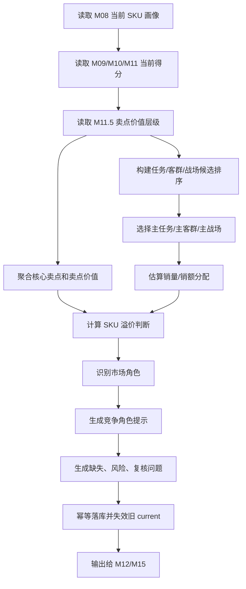

# M11.6 SKU 业务画像聚合详细设计

## 1. 文档定位

本文是 CatForge 彩电核心三竞品真实数据 MVP 的 M11.6 详细设计，新增在 M11.5 战场内卖点价值分层之后、M12 候选池召回之前。

M11.6 的目标不是替代 M08、M09、M10、M11、M11.5，也不是按人工直觉给 SKU 贴标签。它的职责是把上游已经形成的参数画像、卖点激活、评论证据、市场画像、用户任务、目标客群、价值战场和战场内卖点价值层级，聚合成每个 SKU 的业务画像，并为卖点、任务、客群、战场四类维度生成 SKU 级销量/销额解释分配。

M11.6 要回答：

1. 这个 SKU 的主任务、主客群、主战场是什么，证据强弱如何。
2. 这些主判断是否有销量、销额、价格、渠道和评论支撑。
3. 核心卖点处在什么价值层级，能否支撑溢价。
4. SKU 在市场中扮演什么角色，在竞品生成中应作为哪类竞争对象。
5. 缺证据时如何输出业务画像，而不是简单说“没有主战场”。
6. 下游 M12/M13/M14/M15 应该消费哪一张统一画像表，避免再散读 M09-M11.5。
7. 下游 M11.7 如何用本模块的分配结果做全局销量守恒和市场结构汇总。

## 2. 为什么需要 M11.6

现有模块的职责是分层清晰的：

| 模块 | 已解决的问题 | 不足以直接回答的问题 |
| --- | --- | --- |
| M08 SKU 综合信号画像 | 把参数、卖点、评论、市场、可比池装配成统一信号 | 不生成业务结论，不判断主任务、主客群、主战场、溢价和市场角色 |
| M09 用户任务 | 判断 SKU 与各用户任务的关系 | 不输出最终 SKU 业务定位，也不分配销量 |
| M10 目标客群 | 判断 SKU 与各目标客群的关系 | 不说明 SKU 主客群是否被市场接受 |
| M11 价值战场 | 判断 SKU 参与哪些战场 | 不判断卖点价值层级和溢价 |
| M11.5 卖点价值分层 | 判断卖点在战场内是门槛、绩效、溢价倾向、弱感知等 | 不判断 SKU 价格溢价是否被市场接受，也不合成 SKU 整体画像 |
| M12 候选召回 | 找候选竞品 | 如果直接散读 M08-M11.5，容易出现召回口径不一致 |

因此需要一个承上启下的 SKU 业务画像层：

- 对上游：不重新抽取、不重新发明结论，只聚合并校准已有结果。
- 对下游：给 M12-M15 一个稳定、可解释、业务化的 SKU 画像入口。
- 对页面：让业务人员先看到“这款 SKU 怎么定位、靠什么卖、卖给谁、在哪个战场打、量价表现如何”，再看竞品推导。

## 3. 模块职责边界

### 3.1 本模块解决什么

1. 为每个有 M08 当前画像的 SKU 生成一条当前业务画像。
2. 选择主任务、主客群、主战场，并保留候选排序、证据等级和置信度。
3. 把销量、销额、价格、平台、市场分位和趋势纳入主判断的支撑说明。
4. 基于 M11.5 的卖点价值层级，进一步判断 SKU 层面的溢价状态和溢价支撑。
5. 识别 SKU 的市场角色和默认竞争角色提示。
6. 估算卖点、任务、客群、战场维度的销量/销额分配，用于解释“哪些卖点、任务、客群和战场支撑了该 SKU 的销售”。
7. 输出业务化中文摘要，供初始化页面、SKU 画像页、竞品报告页和复核页使用。
8. 标记缺失、冲突、低置信和复核原因。

### 3.2 本模块不解决什么

| 不做事项 | 原因 | 负责模块 |
| --- | --- | --- |
| 不读取原始四张业务表 | 必须消费 M08-M11.5 当前产物 | M00-M11.5 |
| 不重新清洗重复或低质量评论 | 低质量评论已在 M01/M05/M06 处理 | M01/M05/M06 |
| 不重新抽参数、卖点、评论主题 | 抽取层已完成 | M03/M04b/M05/M06 |
| 不重新计算任务/客群/战场分 | M09/M10/M11 是来源 | M09/M10/M11 |
| 不把 M11.5 的 `premium_tendency` 直接等同 SKU 溢价 | 卖点溢价倾向只是 SKU 溢价判断的一类证据 | M11.6 |
| 不做 pair 级竞品判断 | pair 关系由 M12/M13/M14 处理 | M12-M14 |
| 不选择核心三竞品 | M14 选择 | M14 |
| 不生成最终证据报告 | M15 负责报告编排 | M15 |

### 3.3 输出原则

1. 每个 SKU 都应有业务画像；没有完整证据时输出低置信画像，而不是没有画像。
2. “主任务/主客群/主战场”是当前证据下的相对主导方向，不等于强证据结论。
3. 销量分配是估算，不是实际消费者归因，必须标记 `allocation_method` 和 `allocation_confidence`。
4. 溢价判断必须同时看价格位置、卖点价值、市场接受度和评论感知，不能只看价格高或只看某个卖点有 `premium_tendency`。
5. 市场角色和竞争角色是两件事：市场角色描述 SKU 自身在市场中的位置，竞争角色描述它在后续竞品生成中的可能用途。
6. 同品牌 SKU 也可以互为竞品，M11.6 不按品牌内外排除。

## 4. 上游输入

### 4.1 必须输入

| 输入 | 来源 | 用途 |
| --- | --- | --- |
| `core3_sku_signal_profile` | M08 | SKU 主画像、参数、卖点、评论、市场、风险、完整度 |
| `core3_sku_signal_evidence_matrix` | M08 | 证据覆盖、缺失和代表 evidence |
| `core3_sku_downstream_feature_view` | M08 | `for_module='M11_6'` 的裁剪特征，若未实现可先复用 M12/M15 视图字段 |
| `core3_sku_task_score` | M09 | 任务得分、关系等级、置信度、中文解释 |
| `core3_sku_task_evidence_breakdown` | M09 | 任务证据域拆分 |
| `core3_sku_target_group_score` | M10 | 客群得分、关系等级、置信度、中文解释 |
| `core3_sku_target_group_evidence_breakdown` | M10 | 客群证据域拆分 |
| `core3_sku_battlefield_score` | M11 | 战场得分、关系等级、置信度、中文解释 |
| `core3_sku_battlefield_portfolio` | M11 | SKU 战场组合摘要 |
| `core3_sku_battlefield_evidence_breakdown` | M11 | 战场证据域拆分 |
| `core3_sku_claim_value_layer` | M11.5 | 战场内卖点价值层级 |
| `core3_sku_battlefield_claim_value_summary` | M11.5 | 战场内卖点组合摘要 |
| `core3_sku_claim_value_evidence_breakdown` | M11.5 | 卖点价值证据拆分 |
| `core3_evidence_atom` | M02 | 仅通过 evidence_id 回溯代表证据 |

### 4.2 可选输入

原则上 M11.6 不应直接读取 M07 散表。如果 M08 当前字段不足以支持价格、销量、销额、分位和可比池口径，则应优先补 M08/M11.6 feature view。MVP 过渡期允许只读 M07 当前画像表中的不可替代字段，但必须在结果中记录 `market_source='M08'` 或 `market_source='M07_fallback'`。

| 输入 | 使用条件 | 后续要求 |
| --- | --- | --- |
| `core3_sku_market_profile` | M08 未带全量销量、销额、分位字段 | 下个版本补回 M08 |
| `core3_comparable_pool_baseline` | M08 未带可比池中位价和分位摘要 | 下个版本补回 M08 |
| `core3_market_pool_member` | 需要更精确候选基线但 M08 未携带成员摘要 | 下个版本补回 M08 |

### 4.3 明确不消费

| 数据 | 禁止原因 |
| --- | --- |
| 原始 `week_sales_data` | 已由 M00-M07 分层处理 |
| 原始 `attribute_data` | 参数必须来自 M03/M08 |
| 原始 `selling_points_data` | 卖点必须来自 M04b/M08 |
| 原始 `comment_data` | 评论必须来自 M05/M06/M08 的过滤后结果 |
| M12-M15 竞品和报告结果 | M11.6 是它们的上游 |

## 5. 下游输出

### 5.1 输出表清单

| 表 | 粒度 | 用途 |
| --- | --- | --- |
| `core3_sku_business_profile` | SKU + 规则版本 + 批次 | SKU 业务画像主表 |
| `core3_sku_business_profile_dimension` | SKU + 维度类型 + 维度 code | 卖点、任务、客群、战场的候选排序、证据和销量支撑 |
| `core3_sku_business_profile_sales_allocation` | SKU + 维度类型 + 维度 code | 估算销量/销额分配 |
| `core3_sku_business_profile_review_issue` | SKU 或维度级问题 | 画像复核问题 |

### 5.2 `core3_sku_business_profile`

主表保存 SKU 的最终业务画像摘要。建议字段如下。

#### 5.2.1 标识与审计字段

| 字段 | 类型 | 必填 | 说明 |
| --- | --- | --- | --- |
| `sku_business_profile_id` | uuid | 是 | 主键 |
| `project_id` | text | 是 | 项目 ID |
| `category_code` | text | 是 | `TV` |
| `batch_id` | text | 是 | M00 批次 |
| `run_id` | uuid/text | 否 | 全链路运行 |
| `module_run_id` | uuid/text | 否 | M11.6 模块运行 |
| `sku_signal_profile_id` | uuid | 是 | M08 当前画像 |
| `sku_code` | text | 是 | SKU 编码 |
| `brand_name` | text | 否 | 品牌 |
| `model_name` | text | 否 | 型号 |
| `series_name` | text | 否 | 系列 |
| `rule_version` | text | 是 | M11.6 规则版本 |
| `input_fingerprint` | text | 是 | 上游输入 hash |
| `result_hash` | text | 是 | 本行结果 hash |
| `is_current` | boolean | 是 | 当前有效 |
| `processing_status` | text | 是 | `success`、`warning`、`review_required`、`blocked`、`failed` |
| `created_at` | timestamptz | 是 | 创建时间 |
| `updated_at` | timestamptz | 是 | 更新时间 |

唯一键建议：

```text
unique(project_id, category_code, sku_code, batch_id, rule_version, input_fingerprint)
partial unique(project_id, category_code, sku_code, is_current=true)
```

索引建议：

```text
idx_core3_sku_business_profile_project_current(project_id, category_code, is_current)
idx_core3_sku_business_profile_sku(sku_code)
idx_core3_sku_business_profile_primary_battlefield(primary_battlefield_code)
idx_core3_sku_business_profile_market_role(market_role)
idx_core3_sku_business_profile_premium_type(premium_type)
```

#### 5.2.2 市场基础字段

| 字段 | 类型 | 说明 |
| --- | --- | --- |
| `screen_size_inch` | numeric | 尺寸 |
| `size_segment` | text | 尺寸段 |
| `price_band` | text | 价格带 |
| `main_platform` | text | 主平台 |
| `sales_volume_total` | numeric | 分析窗口销量 |
| `sales_amount_total` | numeric | 分析窗口销额 |
| `price_wavg` | numeric | 加权均价 |
| `price_latest` | numeric | 最新价 |
| `price_percentile_in_pool` | numeric | 可比池价格分位 |
| `sales_percentile_in_pool` | numeric | 可比池销量分位 |
| `amount_percentile_in_pool` | numeric | 可比池销额分位 |
| `price_gap_to_pool_median` | numeric | 相对池中位价差 |
| `market_sample_status` | text | `sufficient`、`directional`、`insufficient`、`unknown` |

#### 5.2.3 主画像字段

| 字段 | 类型 | 说明 |
| --- | --- | --- |
| `primary_task_code` | text | 主任务 |
| `primary_task_name` | text | 主任务中文名 |
| `primary_task_score` | numeric | 主任务分 |
| `primary_task_evidence_level` | text | `strong`、`medium`、`weak`、`inferred`、`unknown` |
| `primary_task_confidence` | numeric | 主任务置信度 |
| `primary_target_group_code` | text | 主客群 |
| `primary_target_group_name` | text | 主客群中文名 |
| `primary_target_group_score` | numeric | 主客群分 |
| `primary_target_group_evidence_level` | text | 客群证据等级 |
| `primary_target_group_confidence` | numeric | 主客群置信度 |
| `primary_battlefield_code` | text | 主战场 |
| `primary_battlefield_name` | text | 主战场中文名 |
| `primary_battlefield_score` | numeric | 主战场分 |
| `primary_battlefield_evidence_level` | text | 战场证据等级 |
| `primary_battlefield_confidence` | numeric | 主战场置信度 |
| `secondary_tasks_json` | jsonb | 次任务候选 |
| `secondary_target_groups_json` | jsonb | 次客群候选 |
| `secondary_battlefields_json` | jsonb | 次战场/机会战场候选 |

#### 5.2.4 卖点价值与溢价字段

| 字段 | 类型 | 说明 |
| --- | --- | --- |
| `core_claims_json` | jsonb | 核心卖点及价值层级 |
| `claim_value_summary_json` | jsonb | 门槛、绩效、溢价倾向、弱感知等数量和代表卖点 |
| `claim_value_strength` | numeric | 卖点价值强度 |
| `premium_position` | text | `discount`、`mass`、`upper_mass`、`premium`、`super_premium`、`unknown` |
| `premium_type` | text | 溢价类型，见第 9 节 |
| `premium_support_level` | text | `supported`、`partially_supported`、`unsupported`、`potential`、`unknown` |
| `premium_score` | numeric | SKU 溢价支撑分 |
| `premium_reason_cn` | text | 溢价业务解释 |
| `premium_risk_json` | jsonb | 虚高、样本不足、弱感知、促销干扰等风险 |

#### 5.2.5 市场角色与竞争角色字段

| 字段 | 类型 | 说明 |
| --- | --- | --- |
| `market_role` | text | SKU 自身市场角色 |
| `market_role_reason_cn` | text | 市场角色说明 |
| `competitive_role_hints_json` | jsonb | 后续竞品生成的角色提示 |
| `candidate_recall_priority_json` | jsonb | 给 M12 的召回优先级提示 |
| `same_brand_competition_policy` | text | `allow`，MVP 不排除同品牌 |

#### 5.2.6 销量支撑与质量字段

| 字段 | 类型 | 说明 |
| --- | --- | --- |
| `sales_allocation_summary_json` | jsonb | 主任务/客群/战场销量分配摘要 |
| `evidence_strength` | text | 整体证据强度 |
| `confidence` | numeric | 总置信度 |
| `confidence_level` | text | `high`、`medium`、`low`、`unknown` |
| `missing_signals_json` | jsonb | 缺失信号 |
| `risk_signals_json` | jsonb | 风险信号 |
| `representative_evidence_ids` | jsonb | 代表 evidence |
| `business_summary_cn` | text | 给业务页面的中文摘要 |
| `review_required` | boolean | 是否复核 |
| `review_status` | text | `auto_pass`、`review_required`、`approved`、`rejected`、`waived` |
| `review_reason_json` | jsonb | 复核原因 |

### 5.3 `core3_sku_business_profile_dimension`

该表保存每个 SKU 在卖点、任务、客群、战场四个维度上的候选排序和证据。卖点维度用于表达“这款 SKU 的销量更可能由哪些标准卖点支撑”，不等同于结构化宣传表里是否直接出现该卖点；其证据基础必须来自 M04b/M11.5 的卖点激活、参数支撑、评论验证或卖点价值层级。

| 字段 | 类型 | 说明 |
| --- | --- | --- |
| `profile_dimension_id` | uuid | 主键 |
| `sku_business_profile_id` | uuid | 关联主画像 |
| `dimension_type` | text | `claim`、`task`、`target_group`、`battlefield` |
| `dimension_code` | text | 标准卖点/任务/客群/战场 code |
| `dimension_name` | text | 中文名 |
| `rank_no` | integer | 排名 |
| `is_primary` | boolean | 是否主方向 |
| `relation_level` | text | 上游关系等级 |
| `score` | numeric | 上游分数 |
| `normalized_profile_score` | numeric | M11.6 聚合后的排序分 |
| `evidence_level` | text | 证据等级 |
| `confidence` | numeric | 置信度 |
| `supporting_claims_json` | jsonb | 支撑卖点 |
| `supporting_params_json` | jsonb | 支撑参数 |
| `supporting_comment_signals_json` | jsonb | 评论线索 |
| `supporting_market_signals_json` | jsonb | 市场线索 |
| `sales_support_json` | jsonb | 销量/销额支撑 |
| `reason_cn` | text | 中文理由 |
| `risk_flags_json` | jsonb | 风险 |

唯一键：

```text
unique(sku_business_profile_id, dimension_type, dimension_code)
```

### 5.4 `core3_sku_business_profile_sales_allocation`

该表保存销量/销额在卖点、任务、客群、战场维度上的估算分配。

| 字段 | 类型 | 说明 |
| --- | --- | --- |
| `sales_allocation_id` | uuid | 主键 |
| `sku_business_profile_id` | uuid | 关联主画像 |
| `dimension_type` | text | `claim`、`task`、`target_group`、`battlefield` |
| `dimension_code` | text | 维度 code |
| `allocation_weight` | numeric | 归一化权重 |
| `allocated_sales_volume` | numeric | 估算销量 |
| `allocated_sales_amount` | numeric | 估算销额 |
| `allocation_confidence` | numeric | 分配置信度 |
| `allocation_method` | text | `score_weighted_estimation`、`insufficient_signal`、`blocked_missing_market` |
| `allocation_reason_cn` | text | 中文解释 |
| `input_score_json` | jsonb | 分配所用得分 |
| `created_at` | timestamptz | 创建时间 |

约束：

```text
unique(sku_business_profile_id, dimension_type, dimension_code)
check(allocation_weight >= 0 and allocation_weight <= 1)
```

### 5.5 `core3_sku_business_profile_review_issue`

| 字段 | 类型 | 说明 |
| --- | --- | --- |
| `review_issue_id` | uuid | 主键 |
| `sku_business_profile_id` | uuid | 关联主画像 |
| `issue_scope` | text | `sku`、`task`、`target_group`、`battlefield`、`premium`、`market_role` |
| `issue_code` | text | 问题 code |
| `severity` | text | `info`、`warning`、`blocking` |
| `issue_message_cn` | text | 中文说明 |
| `related_dimension_type` | text | 可空 |
| `related_dimension_code` | text | 可空 |
| `evidence_ids` | jsonb | 相关 evidence |
| `suggested_action_cn` | text | 建议动作 |
| `created_at` | timestamptz | 创建时间 |

## 6. 主任务、主客群、主战场定义

### 6.1 核心原则

一款 SKU 总有当前证据下的相对主方向。证据不足会影响判断准不准，但不应导致业务画像空白。

因此 M11.6 采用两层表达：

| 层 | 含义 |
| --- | --- |
| `primary_*` | 当前证据下排名第一的任务、客群或战场 |
| `*_evidence_level` | 这个第一名是否有强证据支撑 |

示例：

```json
{
  "primary_battlefield_name": "大屏性价比战场",
  "primary_battlefield_evidence_level": "weak",
  "business_meaning": "当前数据下大屏性价比相对最像主战场，但缺结构化卖点，需谨慎展示"
}
```

### 6.2 不能只按上游阈值决定有没有主战场

M11 中 `main`、`secondary`、`opportunity`、`weak` 是战场关系强弱，不是 SKU 是否存在主战场的唯一判断。

M11.6 主战场选择规则：

1. 优先选择 M11 `relation_level in ('main', 'secondary')` 中得分最高者。
2. 如果没有 main/secondary，则选择 opportunity 中得分最高者，并标记 `evidence_level='weak'` 或 `inferred`。
3. 如果只有 weak/insufficient，也选择最高可解释者作为 `primary_battlefield_code`，但 `confidence_level='low'`，并生成复核 issue。
4. 如果 M11 完全无结果，但 M08 有参数/市场/卖点信号，M11.6 不自行发明战场，应标记 `primary_battlefield_code=null`、`processing_status='review_required'`，要求重跑 M11。

主任务和主客群同理。

### 6.3 排序分

对任务、客群、战场统一计算：

```text
normalized_profile_score =
  upstream_score * 0.45
  + relation_factor * 0.20
  + evidence_completeness_score * 0.15
  + market_support_score * 0.10
  + claim_value_support_score * 0.05
  + confidence * 0.05
  - risk_penalty
```

`relation_factor` 建议：

| 上游关系 | factor |
| --- | --- |
| `main` / `primary` | 1.00 |
| `secondary` | 0.82 |
| `opportunity` | 0.65 |
| `weak` | 0.45 |
| `insufficient` | 0.25 |
| `blocked` / `failed` | 0 |

`market_support_score` 来自：

- SKU 有销量/销额数据。
- 当前维度相关战场/任务的市场分位不弱。
- 价格带与维度定义匹配。
- 平台/渠道样本足够。

`claim_value_support_score` 来自：

- 主战场内是否存在 `competitive_performance` 或 `premium_tendency` 卖点。
- 任务/客群对应卖点是否被 M04b 激活。
- 评论弱感知或矛盾会扣分。

## 7. 主方向是否能有销量支撑

### 7.1 结论

可以有销量支撑，但必须表达为估算支撑，而不是实际消费者归因。

原因：

- 周销量表只告诉某 SKU 卖了多少，不知道买家购买时对应哪个任务、客群或战场。
- 任务、客群、战场是从参数、卖点、评论和市场共同推导的业务语义。
- 因此 M11.6 可以把 SKU 的总销量/销额按业务维度权重分配，用于说明“主方向是否承接了该 SKU 的主要销售贡献”。

### 7.2 分配范围

每个 SKU 分四组独立分配：

| 维度 | 分配对象 | 权重合计 |
| --- | --- | --- |
| 卖点 | 当前 SKU 的有效标准卖点候选 | 1.0 |
| 任务 | 当前 SKU 的有效任务候选 | 1.0 |
| 客群 | 当前 SKU 的有效客群候选 | 1.0 |
| 战场 | 当前 SKU 的有效战场候选 | 1.0 |

卖点、任务、客群、战场四组之间不能相加。它们是四个不同视角下对同一 SKU 销量的解释。

### 7.3 有效候选

候选进入销量分配需满足：

```text
normalized_profile_score >= 0.25
and relation_level not in ('blocked', 'failed')
```

如果所有候选都低于 0.25，则取排名前 1 个并标记：

```text
allocation_method='insufficient_signal'
allocation_confidence <= 0.35
```

### 7.4 分配权重

战场销量分配权重不能直接用销量反推，也不能只用 M11 的最终 `battlefield_score`。它要先尊重 M11 已经形成的战场判断，再结合 M11.5 的卖点价值和 M08/M11 的证据完整度，转换成“这个 SKU 的销量更可能由哪个战场解释”的估算权重。

需要区分两类分数：

| 分数 | 来源 | 作用 |
| --- | --- | --- |
| `battlefield_score` | M11 | 判断 SKU 与某战场关系强弱 |
| `battlefield_allocation_basis` | M11.6 | 把战场关系转成销量/销额解释权重 |

#### 7.4.1 M11 战场得分来源

M11 已经为每个 SKU + 战场保存：

- `semantic_score`
- `market_score`
- `battlefield_score`
- `relation_level`
- `confidence`
- `risk_flags_json`

其中：

```text
semantic_score =
  core_task_score * 0.30
  + target_group_score * 0.15
  + core_claim_combo_score * 0.25
  + core_param_capability_score * 0.20
  + comment_support_score * 0.10

market_score =
  price_position_score * 0.25
  + sales_validation_score * 0.25
  + sales_amount_validation_score * 0.15
  + channel_fit_score * 0.10
  + trend_signal_score * 0.10
  + comparable_pool_strength * 0.15

battlefield_score =
  semantic_score * seed.semantic_weight
  + market_score * seed.market_weight
  - risk_penalty
```

默认权重：

| 战场类型 | 语义权重 | 市场权重 |
| --- | ---: | ---: |
| 产品能力型战场 | 0.70 | 0.30 |
| 价格效率型战场 | 0.55 | 0.45 |
| 服务保障型战场 | 0.80 | 0.20 |

#### 7.4.2 M11.6 战场分配基准

M11.6 不重新计算战场结论，只把 M11 战场结果转成销量解释权重：

```text
battlefield_allocation_basis =
  battlefield_score * 0.55
  + market_score * 0.10
  + claim_value_support_score * 0.15
  + evidence_completeness_score * 0.10
  + confidence * 0.10
  - allocation_risk_penalty
```

说明：

| 项 | 含义 |
| --- | --- |
| `battlefield_score` | M11 最终战场强度，保证分配权重继承上游主判断 |
| `market_score` | 单独再给 10%，因为销量解释必须更偏向有市场验证的战场 |
| `claim_value_support_score` | 来自 M11.5，核心卖点如果是竞争绩效或溢价倾向，战场解释权更强 |
| `evidence_completeness_score` | 参数、卖点、评论、市场证据越完整，分配置信越高 |
| `confidence` | M11 战场置信度 |
| `allocation_risk_penalty` | 结构化卖点缺失、仅评论命中、市场样本不足、参数冲突等扣分 |

`claim_value_support_score` 建议：

| 主/次战场内卖点价值 | 分值 |
| --- | ---: |
| 有多个 `competitive_performance` 或 `premium_tendency` | 0.80-1.00 |
| 有 1 个竞争绩效或溢价倾向卖点 | 0.60-0.80 |
| 主要是 `basic_threshold` | 0.30-0.55 |
| 大量 `weak_perception` 或 `insufficient_sample` | 0.10-0.35 |
| 无卖点价值结果 | 0.00-0.20 |

然后按关系等级做一次封顶/折扣：

```text
raw_weight =
  max(battlefield_allocation_basis, 0)
  * relation_factor
```

这里不再额外乘 `confidence_factor` 和 `market_fit_factor`，因为置信度和市场验证已经进入 `battlefield_allocation_basis`，避免重复加权。

归一化：

```text
allocation_weight_i = raw_weight_i / sum(raw_weight_all_candidates)
allocated_sales_volume_i = sku_sales_volume_total * allocation_weight_i
allocated_sales_amount_i = sku_sales_amount_total * allocation_weight_i
```

当前可分析 SKU 的前提是销量和价格数据都存在。若 `sales_volume_total`、`sales_amount_total`、`price_wavg` 或 `price_latest` 缺失，M11.6 不应继续生成可展示分配，应标记 `processing_status='blocked'` 或 `review_required`，并写入 `blocked_missing_market`。这类问题应回到 M07/M08 修复，不允许用 0 或空值参与分配。

#### 7.4.3 卖点分配基准

卖点维度的分配对象是 TV 标准卖点库中的 `claim_code`。每个 SKU 的卖点权重来自 M04b/M11.5/M08，而不是原始宣传文本直接计数。

```text
claim_allocation_basis =
  claim_activation_score * 0.35
  + claim_value_score * 0.25
  + param_support_score * 0.15
  + comment_validation_score * 0.10
  + market_related_support_score * 0.10
  + confidence * 0.05
  - claim_risk_penalty
```

说明：

| 项 | 来源 | 含义 |
| --- | --- | --- |
| `claim_activation_score` | M04b/M08 | 标准卖点是否被参数、宣传、评论激活 |
| `claim_value_score` | M11.5 | 卖点在主/次战场内是门槛、绩效还是溢价倾向 |
| `param_support_score` | M03/M08 | 对应参数是否存在且强 |
| `comment_validation_score` | M05/M06/M04b | 用户评论是否验证或削弱该卖点 |
| `market_related_support_score` | M07/M08 | 该卖点所在战场是否有市场表现支撑 |
| `claim_risk_penalty` | M04b/M11.5 | 弱感知、矛盾、样本不足、只靠低价值评论等风险 |

卖点分配必须覆盖标准卖点候选。若 SKU 没有结构化卖点，但有参数和评论可支撑某些标准卖点，可以形成 `param_inferred` 或 `comment_inferred` 低置信候选；但不得伪造宣传证据。若一个 SKU 连低置信标准卖点候选都无法形成，M11.6 应输出复核问题，由 M11.7 在全局对账时判定该批次不能进入 M12。

### 7.5 主方向销量支撑口径

| 输出 | 计算 |
| --- | --- |
| 主任务销量支撑 | 主任务 allocation_weight、allocated_sales_volume、allocated_sales_amount |
| 主客群销量支撑 | 主客群 allocation_weight、allocated_sales_volume、allocated_sales_amount |
| 主战场销量支撑 | 主战场 allocation_weight、allocated_sales_volume、allocated_sales_amount |
| 支撑等级 | 根据 allocation_weight、市场分位、置信度综合判断 |

支撑等级建议：

| 等级 | 条件 |
| --- | --- |
| `strong` | 主方向 weight >= 0.50，且 sales 或 amount 分位 >= 0.65，confidence >= 0.65 |
| `medium` | 主方向 weight >= 0.35，且 sales 或 amount 分位 >= 0.45 |
| `weak` | 主方向 weight >= 0.20，但市场表现或证据不足 |
| `unknown` | 缺销量/销额或样本不足 |

页面表达必须写成“估算该 SKU 的主要销售贡献更可能来自……”，不能写成“实际销量全部来自……”

### 7.6 M11.6 的本地分配校验边界

M11.6 只负责单 SKU 内部的分配生成和本地校验，不负责全量市场的横向汇总与自洽审计。全局纵横对账由 M11.7 负责。

M11.6 必须在每个 SKU 内部保证：

```text
sum(allocation_weight where sku=S and dimension_type=D) = 1.0
sum(allocated_sales_volume where sku=S and dimension_type=D) = sku_sales_volume_total
sum(allocated_sales_amount where sku=S and dimension_type=D) = sku_sales_amount_total
```

其中 `dimension_type` 分别是：

- `claim`
- `task`
- `target_group`
- `battlefield`

四类维度各自独立守恒，不能彼此相加。例如同一台电视的 1000 台销量，可以在卖点维度分成 450 台大屏沉浸、350 台高刷游戏、200 台高亮 HDR；可以在任务维度分成 600 台大屏换新、300 台游戏体育、100 台新家装修；也可以在战场维度分成 550 台大屏性价比、300 台游戏体育、150 台家庭观影。这些都是对同一销量的不同业务解释，不是多组销量相加。

允许误差：

| 指标 | 允许误差 |
| --- | --- |
| allocation_weight 合计 | `<= 0.0001` |
| 销量合计 | `<= max(1, total_sales_volume * 0.0001)` |
| 销额合计 | `<= total_sales_amount * 0.0001` |

M11.6 不生成全量维度汇总表，不判断 10 个价值战场合计是否等于全量市场销量。该职责属于 M11.7。M11.6 只需要把每个 SKU 的 allocation 明细保存完整，并把 `input_score_json`、`allocation_method`、`allocation_confidence` 写清楚，供 M11.7 复核。

## 8. 卖点价值层级与 SKU 溢价判断

### 8.1 二者关系

M11.5 的卖点价值层级回答：

> 在某个战场中，一个卖点是基础门槛、竞争绩效、溢价倾向、弱感知还是样本不足。

M11.6 的溢价判断回答：

> 这个 SKU 当前价格是否高于可比池，以及这种高价是否被卖点价值、市场接受度和评论感知支撑。

二者不是同一个结论。

| 情况 | 卖点价值层级 | SKU 溢价判断 |
| --- | --- | --- |
| 有 `premium_tendency` 卖点，但价格不高 | 有溢价潜力 | 不是实际溢价，可能是价值未变现 |
| 价格高，但卖点多是 `basic_threshold` | 没有充分卖点支撑 | 可能是虚高或品牌/系列溢价 |
| 价格高，且核心战场有 `competitive_performance`/`premium_tendency` 卖点，销量/销额不弱 | 有价值支撑 | 溢价成立或部分成立 |
| 价格低，但核心卖点强 | 高价值性价比 | 不是溢价，而是配置拦截/性价比压力 |

### 8.2 价格位置

基于可比池计算：

```text
price_gap_to_pool_median =
  (sku_price_wavg - pool_price_median) / pool_price_median
```

价格位置枚举：

| `premium_position` | 条件 |
| --- | --- |
| `discount` | price_percentile <= 0.25 或 gap <= -0.10 |
| `mass` | 0.25 < price_percentile < 0.60 |
| `upper_mass` | 0.60 <= price_percentile < 0.80 |
| `premium` | 0.80 <= price_percentile < 0.95 |
| `super_premium` | price_percentile >= 0.95 |
| `unknown` | 无可比池价格 |

### 8.3 卖点溢价支撑

从 M11.5 读取主战场和次战场的卖点层级：

```text
premium_claim_support =
  weighted_count(premium_tendency) * 1.00
  + weighted_count(competitive_performance) * 0.70
  + weighted_count(basic_threshold) * 0.25
  - weighted_count(weak_perception) * 0.45
  - weighted_count(contradicted_or_risk) * 0.60
```

归一化到 0-1。

权重优先级：

| 卖点所在战场 | 权重 |
| --- | --- |
| 主战场 | 1.00 |
| 次战场 | 0.65 |
| 机会战场 | 0.40 |
| 弱战场 | 0.20 |

### 8.4 市场接受度

市场接受度不是销量绝对值，而是可比池内相对表现：

```text
market_acceptance =
  sales_percentile_in_pool * 0.45
  + amount_percentile_in_pool * 0.45
  + trend_score * 0.10
```

若销量分位缺失但销额分位存在，则按已有字段归一化；若二者都缺失，则 `market_acceptance=null`。

### 8.5 评论接受度

评论接受度来自过滤后的代表评论和 M06/M04b/M11.5 汇总，不允许读原始低价值评论。

```text
comment_acceptance =
  positive_claim_perception * 0.45
  + task_or_battlefield_positive_signal * 0.35
  + price_value_positive_signal * 0.20
  - weak_perception_penalty
  - complaint_penalty
```

评论样本不足时不填 0，标记 `unknown` 或低置信。

### 8.6 SKU 溢价分

```text
premium_score =
  price_position_score * 0.30
  + premium_claim_support * 0.30
  + market_acceptance * 0.25
  + comment_acceptance * 0.10
  + overall_confidence * 0.05
  - premium_risk_penalty
```

`price_position_score`：

| 价格位置 | score |
| --- | --- |
| `discount` | 0.10 |
| `mass` | 0.35 |
| `upper_mass` | 0.60 |
| `premium` | 0.85 |
| `super_premium` | 1.00 |
| `unknown` | null |

### 8.7 溢价类型

| `premium_type` | 业务含义 | 判定逻辑 |
| --- | --- | --- |
| `no_premium` | 无溢价 | 价格位置不高，卖点支撑一般 |
| `value_discount` | 价值低价/配置拦截 | 价格低，但卖点价值或市场表现强 |
| `price_premium_supported` | 价格溢价被支撑 | 价格位置高，卖点和市场接受度都不弱 |
| `price_premium_partially_supported` | 部分支撑 | 价格高，但卖点/市场/评论只有部分成立 |
| `price_premium_unsupported` | 价格虚高风险 | 价格高，但卖点价值、销量或评论支撑不足 |
| `performance_premium` | 性能溢价 | 核心参数和绩效卖点强，价格较高 |
| `brand_or_series_premium` | 品牌/系列溢价 | 价格高但功能证据不足，品牌/系列可能解释 |
| `large_screen_premium` | 大屏溢价 | 尺寸和大屏沉浸支撑更高价格 |
| `claim_premium_potential` | 卖点溢价潜力 | 卖点价值强但当前价格未高于池 |
| `unknown` | 无法判断 | 价格或可比池缺失 |

### 8.8 支撑等级

| `premium_support_level` | 条件 |
| --- | --- |
| `supported` | premium_score >= 0.70，且 price_position 高，claim/market 二者均 >= 0.55 |
| `partially_supported` | premium_score >= 0.50，但 claim/market/comment 有缺口 |
| `unsupported` | 价格高但 premium_score < 0.50 |
| `potential` | 价格不高但 premium_claim_support >= 0.65 |
| `unknown` | 价格或市场样本不足 |

## 9. 市场角色

### 9.1 定义

市场角色描述 SKU 自身在市场数据中的位置。它不是竞品 pair 的角色，也不表示这款 SKU 一定会入选核心三竞品。

### 9.2 枚举和判定

| `market_role` | 中文 | 判定逻辑 |
| --- | --- | --- |
| `sales_leader` | 销量领跑 | sales_percentile >= 0.80，样本充足 |
| `revenue_leader` | 销额领跑 | amount_percentile >= 0.80，样本充足 |
| `price_anchor_high` | 高价锚点 | price_percentile >= 0.85，销量不一定强 |
| `value_volume_driver` | 性价比走量 | price_percentile <= 0.55 且 sales_percentile >= 0.65 |
| `configuration_pressure_source` | 配置压迫源 | 价格相近或偏低，但核心参数/卖点强 |
| `premium_niche` | 高端小众 | price_percentile 高，sales_percentile 低，但卖点价值强 |
| `long_tail` | 长尾 SKU | sales 和 amount 分位都低，证据无明显差异 |
| `promo_driven` | 促销驱动 | 近期价格波动/降价明显且销量变化同步 |
| `new_or_insufficient_market` | 新品或市场样本不足 | 周数、销量或可比池不足 |
| `unknown` | 未知 | 关键市场字段缺失 |

### 9.3 优先级

当多个角色同时满足，按以下优先级选择主角色：

```text
new_or_insufficient_market
> promo_driven
> sales_leader / revenue_leader
> value_volume_driver
> price_anchor_high
> configuration_pressure_source
> premium_niche
> long_tail
> unknown
```

并在 `market_role_reason_cn` 中说明被压制的次角色。

## 10. 竞争角色提示

### 10.1 定义

竞争角色提示是 SKU 作为“候选竞品”时可能扮演的角色。它不是最终 pair 关系，因为 pair 关系必须相对于某个目标 SKU 计算。

M11.6 只输出默认提示，M12/M13 仍需在目标-候选 pair 上重新判断。

### 10.2 角色提示枚举

| role hint | 中文 | SKU 自身画像触发条件 |
| --- | --- | --- |
| `direct_fight_candidate` | 正面对打候选 | 主战场清晰，价格/尺寸/平台在主流区间 |
| `price_pressure_candidate` | 价格挤压候选 | 性价比走量或低价高量 |
| `premium_benchmark_candidate` | 高端标杆候选 | 高价锚点、溢价支撑或高端卖点强 |
| `configuration_pressure_candidate` | 配置压迫候选 | 同价位下参数/卖点价值强 |
| `upgrade_substitute_candidate` | 升级替代候选 | 尺寸/价格/卖点明显上探 |
| `downgrade_substitute_candidate` | 降级替代候选 | 价格更低但主任务/主战场仍成立 |
| `scenario_substitute_candidate` | 场景替代候选 | 任务/客群强，但尺寸或价格不完全同段 |
| `service_reference_candidate` | 服务参考候选 | 服务保障信号强，但产品战场不强 |
| `internal_cannibalization_candidate` | 内部互抢候选 | 同品牌、同尺寸/价位/主战场相近 |

### 10.3 与市场角色的关系

| 市场角色 | 常见竞争角色提示 |
| --- | --- |
| `sales_leader` | `direct_fight_candidate`、`price_pressure_candidate` |
| `revenue_leader` | `premium_benchmark_candidate`、`direct_fight_candidate` |
| `price_anchor_high` | `premium_benchmark_candidate`、`upgrade_substitute_candidate` |
| `value_volume_driver` | `price_pressure_candidate`、`downgrade_substitute_candidate` |
| `configuration_pressure_source` | `configuration_pressure_candidate` |
| `premium_niche` | `premium_benchmark_candidate`、`scenario_substitute_candidate` |
| `promo_driven` | `price_pressure_candidate`，但需要风险标注 |
| `long_tail` | 默认弱提示，需要 M12 低优先级 |

## 11. 处理流程

### 11.1 总流程



### 11.2 处理步骤

#### 步骤 1：读取 SKU 范围

读取所有 `core3_sku_signal_profile.is_current=true` 且 `processing_status not in ('blocked','failed')` 的 SKU。

M11.6 的覆盖目标：

```text
business_profile_count == current_m08_profile_count
```

不能只处理有结构化卖点的 SKU。

#### 步骤 2：构建上游结果快照

对每个 SKU 读取：

- M09 当前任务得分。
- M10 当前客群得分。
- M11 当前战场得分与 portfolio。
- M11.5 当前卖点价值层级和战场摘要。
- M08 市场、参数、评论、风险和证据矩阵。

构建 `input_fingerprint`：

```text
hash(
  m08.profile_hash,
  m09.current_result_hashes,
  m10.current_result_hashes,
  m11.current_result_hashes,
  m11_5.current_result_hashes,
  m11_6.rule_version
)
```

#### 步骤 3：生成维度候选排序

分别处理卖点、任务、客群、战场：

1. 读取上游候选。
2. 计算 `normalized_profile_score`。
3. 排序并标记主/次/机会/弱。
4. 生成中文理由。
5. 写入 `core3_sku_business_profile_dimension`。

#### 步骤 4：选择主方向

使用第 6 节规则选择：

- `primary_task_*`
- `primary_target_group_*`
- `primary_battlefield_*`

主方向必须保留：

- 分数。
- 证据等级。
- 置信度。
- 缺口。
- 代表证据。

#### 步骤 5：估算销量/销额支撑

使用第 7 节规则分别对卖点、任务、客群、战场做分配。

要求：

- 同一 SKU、同一 `dimension_type` 的 `allocation_weight` 合计为 1，允许 0.01 误差。
- 销量缺失不写 0。
- 分配结果必须标记是估算。

#### 步骤 6：聚合卖点价值

以主战场和次战场为核心聚合 M11.5：

```json
{
  "primary_battlefield": {
    "premium_tendency_claims": [],
    "competitive_performance_claims": [],
    "basic_threshold_claims": [],
    "weak_perception_claims": [],
    "insufficient_claims": []
  },
  "secondary_battlefields": []
}
```

如果 SKU 没有结构化卖点：

- 不伪造 `premium_tendency`。
- 可以从参数和评论保留 `inferred_claim_potential`，但不能等同 M11.5 卖点价值层级。
- 溢价判断必须降置信。

#### 步骤 7：计算溢价

按第 8 节计算价格位置、卖点支撑、市场接受度、评论接受度和风险，输出：

- `premium_position`
- `premium_type`
- `premium_support_level`
- `premium_score`
- `premium_reason_cn`
- `premium_risk_json`

#### 步骤 8：识别市场角色

按第 9 节输出 `market_role` 和中文解释。

#### 步骤 9：生成竞争角色提示

按第 10 节输出 `competitive_role_hints_json`，供 M12 初筛和展示解释使用。

#### 步骤 10：质量与复核

生成 review issue：

| issue_code | 条件 |
| --- | --- |
| `missing_market_profile` | 无市场画像或销量/价格关键字段缺失 |
| `missing_claim_value` | 主战场缺 M11.5 分层 |
| `primary_dimension_low_confidence` | 主任务/客群/战场证据等级为 weak/inferred |
| `premium_price_without_support` | 价格高但卖点/市场支撑不足 |
| `sales_allocation_low_confidence` | 维度分配过度依赖弱证据 |
| `claim_allocation_missing` | SKU 无法形成标准卖点分配候选 |
| `market_role_insufficient_sample` | 可比池样本不足 |
| `upstream_incomplete` | M09/M10/M11 某类结果缺失 |

## 12. 增量策略

### 12.1 复用条件

历史 M11.6 结果可复用，必须同时满足：

- M08 当前画像 hash 未变化。
- M09/M10/M11/M11.5 当前结果 hash 未变化。
- 价格、销量、销额、分位和可比池摘要未变化。
- M11.6 规则版本未变化。
- 历史结果 `is_current=true` 且未失败。

### 12.2 重算触发

| 上游变化 | M11.6 处理 | 下游影响 |
| --- | --- | --- |
| M08 profile_hash 变化 | 重算 SKU 业务画像 | M12-M15 |
| M09 任务变化 | 重算主任务和销量分配 | M10-M15 可能需重算 |
| M10 客群变化 | 重算主客群和销量分配 | M11-M15 可能需重算 |
| M11 战场变化 | 重算主战场、卖点聚合、溢价 | M11.5-M15 |
| M11.5 卖点价值变化 | 重算卖点价值摘要和溢价 | M12-M15 |
| M07 市场变化，经 M08 体现 | 重算销量支撑、市场角色、溢价 | M12-M15 |
| M11.6 规则版本变化 | 全量重算 | M12-M15 |

### 12.3 幂等写入

同一 `project_id + category_code + sku_code + batch_id + rule_version + input_fingerprint` 重复运行应返回同一结果，不生成重复 current。

写入顺序：

1. 开事务。
2. 查找可复用 current。
3. 插入新 profile/dimension/allocation/review issue。
4. 将同 SKU 旧 current 置为 false。
5. 新结果置 current。
6. 提交事务。

## 13. API 和页面契约

### 13.1 API

建议新增或扩展：

| API | 用途 |
| --- | --- |
| `POST /api/core3/real-data/m11-6/run` | 执行 SKU 业务画像聚合 |
| `GET /api/core3/real-data/business-profiles` | 查询 SKU 业务画像列表 |
| `GET /api/core3/real-data/business-profiles/{sku_code}` | 查询单 SKU 业务画像详情 |
| `GET /api/core3/real-data/business-profiles/{sku_code}/evidence` | 查看主任务/客群/战场/溢价证据 |

初始化页面中，M11.6 应显示为：

```text
生成 SKU 业务画像
把任务、客群、价值战场、卖点价值、量价表现聚合成每个 SKU 的业务定位。
```

### 13.2 页面展示语言

页面不要展示：

- `premium_tendency`
- `relation_level`
- `normalized_profile_score`
- `M11.6`
- `hash`
- 内部 SQL 错误

页面应展示：

- “主战场：大屏性价比；证据中等，销量支撑较强”
- “主客群：大屏换新家庭；主要由大屏尺寸、价格效率和销量表现支撑”
- “溢价判断：当前不属于价格溢价，更像价值低价/配置拦截”
- “市场角色：性价比走量 SKU”
- “竞品生成提示：优先作为价格挤压和正面对打候选”

## 14. 质量规则

### 14.1 覆盖规则

| 规则 | 要求 |
| --- | --- |
| M08 当前 SKU 覆盖 | 每个 M08 current SKU 必须生成 M11.6 current profile |
| 有卖点 SKU | 必须生成卖点价值摘要和溢价判断 |
| 无卖点 SKU | 仍生成主任务、主客群、主战场，但溢价支撑降置信 |
| 有销量 SKU | 必须生成销量/销额分配 |
| 无销量 SKU | 分配值为 null，不能写 0 |

### 14.2 一致性规则

| 规则 | 要求 |
| --- | --- |
| 主任务来自 M09 | 不允许 M11.6 自行生成任务 code |
| 主客群来自 M10 | 不允许 M11.6 自行生成客群 code |
| 主战场来自 M11 | 不允许 M11.6 自行生成战场 code |
| 卖点价值来自 M11.5 | 不允许 M11.6 自行给卖点打价值层级 |
| 溢价独立判断 | 不允许把 M11.5 `premium_tendency` 直接复制成 SKU 溢价结论 |
| 销量分配可解释 | 每条 allocation 必须有权重和方法 |

### 14.3 复核规则

以下情况必须进入复核：

1. 主战场证据等级为 `weak` 或 `inferred`，但页面要作为重点展示。
2. 价格位置为 `premium` 或 `super_premium`，但 `premium_support_level='unsupported'`。
3. 销量/销额缺失但市场角色不是 `unknown` 或 `new_or_insufficient_market`。
4. M09/M10/M11 任一上游结果缺失。
5. M11.5 在主战场无卖点分层，但 SKU 有结构化卖点。
6. 任务、客群、战场销量分配权重无法归一化。

## 15. 测试设计

### 15.1 单元测试

| 测试 | 断言 |
| --- | --- |
| 主方向选择 | main/secondary/opportunity/weak 不同组合下选择正确 |
| 证据等级 | 主方向可输出 weak/inferred，不误删画像 |
| 销量分配 | 权重归一化，销量/销额按权重分配 |
| 缺销量 | 分配值为 null，不写 0 |
| 溢价支持 | 高价+强卖点+强市场输出 supported |
| 虚高风险 | 高价+弱卖点+弱市场输出 unsupported |
| 溢价潜力 | 卖点强但价格不高输出 claim_premium_potential |
| 市场角色 | sales_leader、value_volume_driver、price_anchor_high 等识别正确 |
| 竞争角色提示 | 根据市场角色和画像输出正确 hints |
| 幂等 | 相同 fingerprint 重跑不重复 current |

### 15.2 集成测试

| 测试 | 断言 |
| --- | --- |
| M08-M11.6 链路 | M08 current SKU 全部生成业务画像 |
| M09/M10/M11/M11.5 缺一类 | 输出 review_required 或 blocked，不伪造结论 |
| 无结构化卖点 SKU | 仍有主任务/客群/战场，溢价低置信 |
| 有结构化卖点 SKU | 生成 claim value summary 和 premium 判断 |
| M12 消费 | M12 能从 M11.6 获取目标 SKU 主画像和候选 role hints |

### 15.3 业务 fixture 验收

本地和 205 真实数据都应覆盖：

1. 有销量、有参数、有评论、无结构化卖点的 SKU。
2. 有销量、有参数、有评论、有结构化卖点的 SKU。
3. 高价但销量弱的 SKU。
4. 低价但销量强的 SKU。
5. 主战场强、次战场也成立的 SKU。
6. 同品牌、同尺寸、同价位的内部竞争 SKU。

## 16. 验收标准

### 16.1 数据验收

1. `core3_sku_business_profile` current 数等于 M08 current SKU 数。
2. 每个 profile 至少有主任务、主客群、主战场的字段；若上游缺失，必须有 review issue。
3. 有销售数据的 SKU，三类 dimension 的 allocation weight 分别合计约等于 1。
4. 有结构化卖点和 M11.5 结果的 SKU，必须有 `claim_value_summary_json`。
5. 溢价字段不能全是默认值；必须根据价格、卖点、市场和评论差异变化。
6. 市场角色不能全部相同；应随价格/销量/销额/样本差异变化。
7. 竞争角色提示不能只输出一个固定值。

### 16.2 业务验收

对任意 SKU，业务人员应能看懂：

1. 这款 SKU 主要服务什么任务。
2. 主要面向什么客群。
3. 主要在哪个价值战场竞争。
4. 这些判断有哪些销量、价格、卖点、评论证据。
5. 它是否有溢价，溢价是否被支撑。
6. 它在市场中是走量、标杆、高价锚点、长尾还是其他角色。
7. 它在竞品生成中更适合做正面对打、价格挤压、配置压迫、高端标杆还是其他角色。

### 16.3 下游验收

M12 之后不应再散读 M09/M10/M11/M11.5 来拼 SKU 画像，而应优先读取：

- `core3_sku_business_profile`
- `core3_sku_business_profile_dimension`
- `core3_sku_business_profile_sales_allocation`

如需细节证据，再按 evidence_id 回溯上游拆分表。

## 17. 与现有设计的调整建议

### 17.1 M08 调整

M08 应增加 `for_module='M11_6'` 的 feature view，包含：

- 市场量价摘要。
- 任务/客群/战场所需的支撑信号摘要。
- 卖点价值和溢价计算所需的 claim summary refs。
- 代表 evidence refs。

### 17.2 M12 调整

M12 的目标 SKU 和候选 SKU 基础画像应优先来自 M11.6，而不是散读 M09-M11.5。

M12 仍可读取上游明细表用于细节评分，但主画像口径以 M11.6 为准。

### 17.3 M15 调整

M15 高层报告中，SKU 画像段应使用 M11.6 的业务摘要：

1. SKU 定位。
2. 主任务、主客群、主战场。
3. 卖点价值与溢价判断。
4. 市场角色和竞争角色提示。
5. 销量支撑和证据风险。

## 18. 开发任务拆分建议

后续开发可按一个完整模块实现，不再拆成过细微任务：

1. Migration + SQLAlchemy model：新增四张表和索引。
2. Schema：新增 profile/dimension/allocation/review issue response。
3. Repository：读取 M08-M11.5 当前结果，幂等写入 M11.6。
4. Service：实现主方向选择、销量分配、溢价、市场角色、竞争角色提示。
5. Runner/API：接入初始化运行页和查询接口。
6. Tests：单元、集成、fixture 链路、M12 消费测试。
7. Frontend：SKU 业务画像页和初始化运行状态展示。

## 19. 核心结论

M11.6 的关键不是多加一张表，而是把“业务画像”从分散算法结果中显式建模：

- 主战场、主客群、主任务是相对主方向，必须和证据强度分开表达。
- 销量可以支撑主方向，但只能以估算分配表达，不能伪装成真实用户归因。
- 卖点价值层级是溢价判断的证据之一，不是 SKU 溢价本身。
- 市场角色描述 SKU 自身，竞争角色提示服务于后续 pair 级竞品生成。
- 有证据缺口的 SKU 也应有画像，只是低置信、可复核，而不是被系统丢掉。
