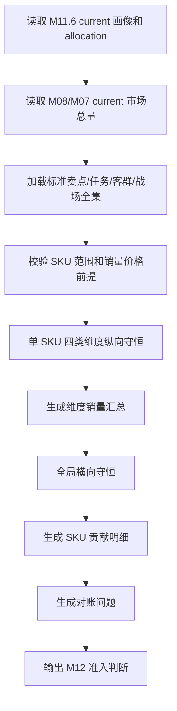

# M11.7 维度销量对账与市场结构汇总详细设计

## 1. 文档定位

M11.7 是 CatForge 彩电核心三竞品真实数据 MVP 中新增的独立模块，位于 M11.6 SKU 业务画像聚合之后、M12 候选池召回之前。

M11.6 负责生成每个 SKU 的业务画像，并把单 SKU 的销量/销额估算分配到标准卖点、用户任务、目标客群和价值战场。M11.7 不重新计算画像、不调整 M11.6 的业务权重，而是做全局对账和市场结构汇总，验证这套分析体系是否自洽：

1. 每个 SKU 在卖点、任务、客群、战场四个维度内是否各自 100% 分配。
2. 所有 SKU 汇总后，20 个标准卖点、10 个用户任务、9 个目标客群、10 个价值战场的估算销量是否分别等于全量 SKU 销量。
3. 每个业务维度由哪些 SKU 贡献，每个 SKU 在该维度中占多少。
4. 如果对不上，原因是数据、current、候选、映射、公式还是批次混算，而不是直接调业务权重。

M11.7 的结论决定 M12 是否可以使用 M11.6 画像进入候选召回。若 M11.7 对账失败，M12 不应继续执行。

## 2. 核心前提

当前 CatForge 样例数据有一个有利前提：

> 进入分析链路的每个有效 SKU 都应该有销量和价格数据。

因此 M11.7 不使用 `UNASSIGNED_*` 业务兜底桶来掩盖缺失。标准口径是：

```text
sum(20 个标准卖点估算销量) = 全量 SKU 销量
sum(10 个用户任务估算销量) = 全量 SKU 销量
sum(9 个目标客群估算销量) = 全量 SKU 销量
sum(10 个价值战场估算销量) = 全量 SKU 销量
```

如果某个 SKU 没有销量或价格：

- 这不是 M11.7 的普通低置信问题。
- 这是 M07/M08 市场画像前提失败。
- M11.7 应阻断并要求回修上游，而不是把它放入未知桶。

如果某个 SKU 有销量价格，但 M11.6 没有为某类维度生成完整分配：

- 这不是正常未分配。
- 这是 M11.6 分配失败或上游 M09/M10/M11/M11.5 结果缺失。
- M11.7 应定位具体 SKU 和维度，生成阻断问题。

## 3. 模块职责边界

### 3.1 本模块解决什么

1. 汇总 M11.6 的 SKU 级分配结果，生成标准卖点、用户任务、目标客群、价值战场的市场规模。
2. 校验单 SKU 内部是否按每个维度类型 100% 分配。
3. 校验全局横向汇总是否与全量 SKU 销量/销额一致。
4. 输出每个业务维度的 SKU 构成、Top SKU 贡献、主方向 SKU 数、平均置信度。
5. 生成对账检查记录和问题定位。
6. 为 M12 提供“可进入候选召回”的批次级准入判断。
7. 为前端展示“市场结构概览”和“维度销量构成”提供数据。

### 3.2 本模块不解决什么

| 不做事项 | 原因 | 负责模块 |
| --- | --- | --- |
| 不重新计算卖点、任务、客群、战场分 | M11.7 是对账模块，不是推断模块 | M09-M11.6 |
| 不调整 M11.6 allocation weight | 对账失败要定位原因，不能直接改权重凑平 | M11.6 |
| 不读取原始四张业务表 | 销量价格应来自 M08/M07 当前画像 | M00-M08 |
| 不生成竞品候选 | 候选召回由 M12 负责 | M12 |
| 不选择核心三竞品 | M14 负责 | M14 |
| 不生成高层报告话术 | M15 负责 | M15 |

## 4. 输入

### 4.1 必须输入

| 输入 | 来源 | 用途 |
| --- | --- | --- |
| `core3_sku_business_profile` | M11.6 | SKU 业务画像、销量价格、主方向 |
| `core3_sku_business_profile_dimension` | M11.6 | SKU 在卖点/任务/客群/战场维度的候选和排序 |
| `core3_sku_business_profile_sales_allocation` | M11.6 | SKU 级销量/销额分配明细 |
| `core3_sku_signal_profile` | M08 | 校验 current SKU 全量和市场基础字段 |
| `core3_sku_market_profile` | M07/M08 | 作为销量/价格权威来源的校验基线，优先经 M08 读取 |
| TV seed | 规则资产 | 标准卖点、任务、客群、战场全集 |

### 4.2 明确不消费

| 数据 | 原因 |
| --- | --- |
| 原始 `week_sales_data` | M11.7 不能绕过 M07/M08 |
| 原始 `attribute_data` | 对账不需要参数原始表 |
| 原始 `selling_points_data` | 对账不重新抽卖点 |
| 原始 `comment_data` | 对账不重新读评论 |
| M12-M15 结果 | M11.7 是 M12 上游 |

## 5. 输出表

### 5.1 输出表清单

| 表 | 粒度 | 用途 |
| --- | --- | --- |
| `core3_business_dimension_sales_summary` | 批次 + 维度类型 + 维度 code | 每个卖点/任务/客群/战场的市场规模 |
| `core3_business_dimension_sku_contribution` | 维度 summary + SKU | 某业务维度由哪些 SKU 贡献 |
| `core3_business_sales_reconciliation_check` | 批次 + 检查类型 | 纵向/横向/全集/current/映射检查 |
| `core3_business_sales_reconciliation_issue` | 检查 + SKU/维度 | 对账失败原因定位 |

### 5.2 `core3_business_dimension_sales_summary`

| 字段 | 类型 | 说明 |
| --- | --- | --- |
| `dimension_sales_summary_id` | uuid | 主键 |
| `project_id` | text | 项目 ID |
| `category_code` | text | `TV` |
| `batch_id` | text | M00 批次 |
| `run_id` | uuid/text | 全链路运行 |
| `module_run_id` | uuid/text | M11.7 模块运行 |
| `source_m11_6_module_run_id` | uuid/text | 来源 M11.6 运行 |
| `dimension_type` | text | `claim`、`task`、`target_group`、`battlefield` |
| `dimension_code` | text | 标准卖点/任务/客群/战场 code |
| `dimension_name` | text | 中文名 |
| `sku_count` | integer | 参与该维度的 SKU 数 |
| `sku_count_primary` | integer | 以该维度为主方向或 Top1 的 SKU 数 |
| `estimated_sales_volume` | numeric | 该维度估算销量 |
| `estimated_sales_amount` | numeric | 该维度估算销额 |
| `sales_volume_share` | numeric | 占全量 SKU 销量比例 |
| `sales_amount_share` | numeric | 占全量 SKU 销额比例 |
| `avg_allocation_confidence` | numeric | 平均分配置信度 |
| `evidence_quality_summary_json` | jsonb | 证据质量摘要 |
| `top_sku_contribution_json` | jsonb | 贡献最高 SKU 摘要 |
| `summary_status` | text | `valid`、`warning`、`failed` |
| `created_at` | timestamptz | 创建时间 |

唯一键：

```text
unique(project_id, category_code, batch_id, module_run_id, dimension_type, dimension_code)
```

### 5.3 `core3_business_dimension_sku_contribution`

| 字段 | 类型 | 说明 |
| --- | --- | --- |
| `dimension_sku_contribution_id` | uuid | 主键 |
| `dimension_sales_summary_id` | uuid | 关联维度汇总 |
| `sku_business_profile_id` | uuid | 关联 M11.6 SKU 画像 |
| `sku_code` | text | SKU |
| `brand_name` | text | 品牌 |
| `model_name` | text | 型号 |
| `allocation_weight` | numeric | SKU 内该维度权重 |
| `allocated_sales_volume` | numeric | SKU 对该维度贡献销量 |
| `allocated_sales_amount` | numeric | SKU 对该维度贡献销额 |
| `sku_share_in_dimension_volume` | numeric | 在该维度销量中的占比 |
| `sku_share_in_dimension_amount` | numeric | 在该维度销额中的占比 |
| `is_primary_dimension` | boolean | 是否该 SKU 主方向或 Top1 |
| `allocation_confidence` | numeric | 分配置信度 |
| `evidence_level` | text | 证据等级 |
| `contribution_reason_cn` | text | 中文解释 |

唯一键：

```text
unique(dimension_sales_summary_id, sku_code)
```

### 5.4 `core3_business_sales_reconciliation_check`

| 字段 | 类型 | 说明 |
| --- | --- | --- |
| `reconciliation_check_id` | uuid | 主键 |
| `project_id` | text | 项目 ID |
| `category_code` | text | `TV` |
| `batch_id` | text | M00 批次 |
| `module_run_id` | uuid/text | M11.7 运行 |
| `source_m11_6_module_run_id` | uuid/text | 来源 M11.6 |
| `check_type` | text | 检查类型 |
| `dimension_type` | text | 可空 |
| `expected_value` | numeric | 应等于的值 |
| `actual_value` | numeric | 实际值 |
| `gap_value` | numeric | 差异 |
| `gap_ratio` | numeric | 差异比例 |
| `status` | text | `pass`、`warning`、`failed` |
| `failure_reason_code` | text | 失败原因 |
| `failure_reason_cn` | text | 中文原因 |
| `created_at` | timestamptz | 创建时间 |

### 5.5 `core3_business_sales_reconciliation_issue`

| 字段 | 类型 | 说明 |
| --- | --- | --- |
| `reconciliation_issue_id` | uuid | 主键 |
| `reconciliation_check_id` | uuid | 关联检查 |
| `issue_scope` | text | `sku`、`dimension`、`batch`、`mapping`、`current` |
| `sku_code` | text | 可空 |
| `dimension_type` | text | 可空 |
| `dimension_code` | text | 可空 |
| `issue_code` | text | 问题 code |
| `severity` | text | `warning`、`blocking` |
| `issue_message_cn` | text | 中文说明 |
| `suggested_action_cn` | text | 建议处理 |
| `created_at` | timestamptz | 创建时间 |

## 6. 标准维度全集

M11.7 使用 seed 中的标准全集做对账。

| 维度类型 | 标准数量 | 来源 |
| --- | ---: | --- |
| `claim` | 20 | TV 标准卖点 |
| `task` | 10 | TV 用户任务 |
| `target_group` | 9 | TV 目标客群 |
| `battlefield` | 10 | TV 价值战场 |

M11.7 不引入业务展示用的 `UNASSIGNED` 维度。若实际结果需要 `UNASSIGNED` 才能对齐，说明 M11.6 或上游推断不完整，应判为 failed 或 warning，而不是生成一个新的业务维度。

## 7. 对账规则

### 7.1 SKU 范围一致性

检查 M08 current SKU 与 M11.6 current business profile：

```text
count(M08 current effective SKU)
= count(M11.6 current business profile)
```

每个 SKU 必须满足：

```text
sales_volume_total is not null
sales_amount_total is not null
price_wavg or price_latest is not null
```

缺任一字段，状态为 `failed`，原因 `missing_market_required_field`。

### 7.2 单 SKU 纵向守恒

对每个 SKU、每个维度类型检查：

```text
sum(allocation_weight) = 1
sum(allocated_sales_volume) = sku_sales_volume_total
sum(allocated_sales_amount) = sku_sales_amount_total
```

检查范围：

- claim
- task
- target_group
- battlefield

如果某 SKU 在某维度类型没有 allocation 行，状态为 failed，原因 `missing_sku_dimension_allocation`。

### 7.3 全局横向守恒

对每个维度类型检查：

```text
sum(estimated_sales_volume by all standard dimension codes)
= sum(sku_sales_volume_total for all current SKU)

sum(estimated_sales_amount by all standard dimension codes)
= sum(sku_sales_amount_total for all current SKU)
```

分别生成四类检查：

| 维度 | 检查 |
| --- | --- |
| 标准卖点 | 20 个卖点估算销量/销额合计等于全量 SKU 总量 |
| 用户任务 | 10 个任务估算销量/销额合计等于全量 SKU 总量 |
| 目标客群 | 9 个客群估算销量/销额合计等于全量 SKU 总量 |
| 价值战场 | 10 个战场估算销量/销额合计等于全量 SKU 总量 |

允许误差：

| 指标 | 允许误差 |
| --- | --- |
| 权重合计 | `<= 0.0001` |
| 销量合计 | `<= max(1, total_sales_volume * 0.0001)` |
| 销额合计 | `<= total_sales_amount * 0.0001` |

### 7.4 维度 SKU 构成

每个维度 summary 必须能反查 SKU 构成。

以价值战场为例：

```text
BF_GAMING_SPORTS estimated_sales_volume
= sum(allocated_sales_volume where dimension_type='battlefield' and dimension_code='BF_GAMING_SPORTS')

sku_share_in_dimension_volume
= sku allocated_sales_volume / battlefield estimated_sales_volume
```

M11.7 要输出：

- 该维度估算销量/销额。
- 占全市场比例。
- 参与 SKU 数。
- 主方向 SKU 数。
- Top SKU 贡献。
- SKU 在该维度中的占比。
- 平均置信度和证据质量。

### 7.5 卖点维度特殊规则

卖点不是互斥事实，而是解释性维度。为了和任务、客群、战场一样自洽，M11.6 必须把每个 SKU 的销量在标准卖点候选中归一化到 100%，M11.7 只校验这个解释体系是否闭合。

业务解释时必须说：

```text
估算该 SKU 销量中，多少比例由某标准卖点支撑。
```

不能说：

```text
用户实际因某卖点购买了多少台。
```

## 8. 失败原因定位

| issue_code | 条件 | 处理 |
| --- | --- | --- |
| `missing_market_required_field` | SKU 缺销量、销额或价格 | 阻断，回修 M07/M08 |
| `m08_m116_sku_count_mismatch` | M08 SKU 数与 M11.6 profile 数不一致 | 阻断，补跑 M11.6 |
| `duplicate_current_profile` | 同 SKU 多条 current | 阻断，修复 current 唯一性 |
| `missing_sku_dimension_allocation` | SKU 某维度无 allocation | 阻断，回修 M11.6 |
| `allocation_weight_not_normalized` | 单 SKU 某维度权重不等于 1 | 阻断，修复 M11.6 归一化 |
| `allocated_volume_gap` | SKU allocation 销量合计不等于 SKU 总销量 | 阻断，修复 M11.6 |
| `allocated_amount_gap` | SKU allocation 销额合计不等于 SKU 总销额 | 阻断，修复 M11.6 |
| `dimension_code_not_in_seed` | allocation 中出现非标准 code | 阻断，修复映射 |
| `dimension_total_gap` | 某维度类型全局汇总不等于全量 SKU | 阻断，定位缺失 SKU/code |
| `batch_mixed` | 混用不同 batch 或 module_run | 阻断，按同一批次重跑 |
| `low_confidence_market_structure` | 总量守恒但平均置信度过低 | warning，可进入复核 |

调整顺序：

1. 先查销量价格前提是否满足。
2. 再查 M08 与 M11.6 current SKU 是否一致。
3. 再查每个 SKU 四类维度 allocation 是否完整。
4. 再查 code 是否都在 seed 标准全集。
5. 再查单 SKU 权重与销量/销额是否闭合。
6. 再查全局按维度汇总是否闭合。
7. 最后才讨论 M11.6 的业务权重是否合理。

禁止为了让总量对齐，按全局战场规模反向摊回 SKU。这会破坏证据链。

## 9. 处理流程



步骤：

1. 读取 M11.6 当前 profile 和 allocation。
2. 读取 M08/M07 当前 SKU 市场总量，确认每个 SKU 有销量、销额、价格。
3. 加载 seed 标准维度全集。
4. 校验 M08 current SKU 与 M11.6 current profile 一致。
5. 校验每个 SKU 在 claim/task/target_group/battlefield 四类维度都完成 100% 分配。
6. 汇总每个标准维度的估算销量和销额。
7. 校验四类维度各自的汇总总量等于全量 SKU 总量。
8. 生成维度 SKU 贡献明细。
9. 生成检查记录和问题。
10. 如果存在 blocking issue，则 M12 不准入。

## 10. API 和页面

### 10.1 API

| API | 用途 |
| --- | --- |
| `POST /api/core3/real-data/m11-7/run` | 执行维度销量对账 |
| `GET /api/core3/real-data/dimension-sales-summary` | 查询卖点/任务/客群/战场市场结构 |
| `GET /api/core3/real-data/dimension-sales-summary/{dimension_type}/{dimension_code}` | 查询某维度 SKU 构成 |
| `GET /api/core3/real-data/reconciliation-checks` | 查询对账检查结果 |

### 10.2 页面展示

初始化页面显示：

```text
校验销量分配与市场结构
检查 SKU 画像分配是否能在卖点、任务、客群、价值战场四个维度上与全量销量对齐。
```

业务页可展示：

- 价值战场规模：每个战场估算销量、销额、占比、SKU 数。
- 卖点规模：每个标准卖点支撑的估算销量、销额、Top SKU。
- 客群规模：每个目标客群对应的估算市场规模。
- 用户任务规模：每个任务对应的估算市场规模。
- 对账状态：通过、警告、失败及原因。

## 11. 测试设计

### 11.1 单元测试

| 测试 | 断言 |
| --- | --- |
| SKU 纵向守恒 | 单 SKU 四类维度权重和为 1 |
| SKU 销量闭合 | allocation 销量合计等于 SKU 总销量 |
| SKU 销额闭合 | allocation 销额合计等于 SKU 总销额 |
| 全局横向守恒 | 每类维度 summary 合计等于全量 SKU 总量 |
| 缺销量价格阻断 | 缺销量/价格不进入未知桶，直接 failed |
| 非 seed code 阻断 | 出现非法 code 时 failed |
| 贡献占比 | SKU contribution share 合计为 1 |

### 11.2 集成测试

| 测试 | 断言 |
| --- | --- |
| M11.6-M11.7 链路 | M11.7 可消费 M11.6 allocation 并生成四类 summary |
| M11.7-M12 准入 | 对账通过时 M12 可继续；失败时 M12 阻断 |
| 真实 fixture | 有销量价格的 SKU 全部参与汇总 |
| 低置信但守恒 | 总量守恒但置信低时 warning，不直接失败 |

## 12. 验收标准

1. 每个有效 SKU 都有销量、销额和价格；缺失则 M11.7 failed。
2. 每个 SKU 在 claim/task/target_group/battlefield 四类维度都完成 100% 分配。
3. 20 个标准卖点估算销量合计等于全量 SKU 销量。
4. 10 个用户任务估算销量合计等于全量 SKU 销量。
5. 9 个目标客群估算销量合计等于全量 SKU 销量。
6. 10 个价值战场估算销量合计等于全量 SKU 销量。
7. 销额同样满足上述四类维度守恒。
8. 每个维度 summary 都能反查 SKU 贡献列表。
9. 对账失败时能定位具体 SKU、维度、code、批次或 current 问题。
10. M12 只在 M11.7 无 blocking issue 时继续执行。

## 13. 与 M11.6 的关系

M11.6 产出解释性分配，M11.7 产出体系自洽证明。

| 问题 | M11.6 | M11.7 |
| --- | --- | --- |
| 单 SKU 主战场是什么 | 负责 | 不负责 |
| 单 SKU 销量如何分到战场 | 负责 | 校验 |
| 10 个战场总销量是否等于全量 SKU 销量 | 不负责 | 负责 |
| 每个战场由哪些 SKU 贡献 | 不负责 | 负责 |
| 对不上时是否调整权重 | 不直接调整 | 定位原因，要求回修 M11.6 或上游 |
| 是否允许进入 M12 | 提供输入 | 给出准入判断 |

M11.7 的价值是让整套分析从“单 SKU 看起来合理”，升级为“全局市场结构也能闭合”。如果从卖点、任务、客群、战场任一视角汇总都能对上同一套 SKU 销量和销额，这套业务推导才具备稳定解释力。
