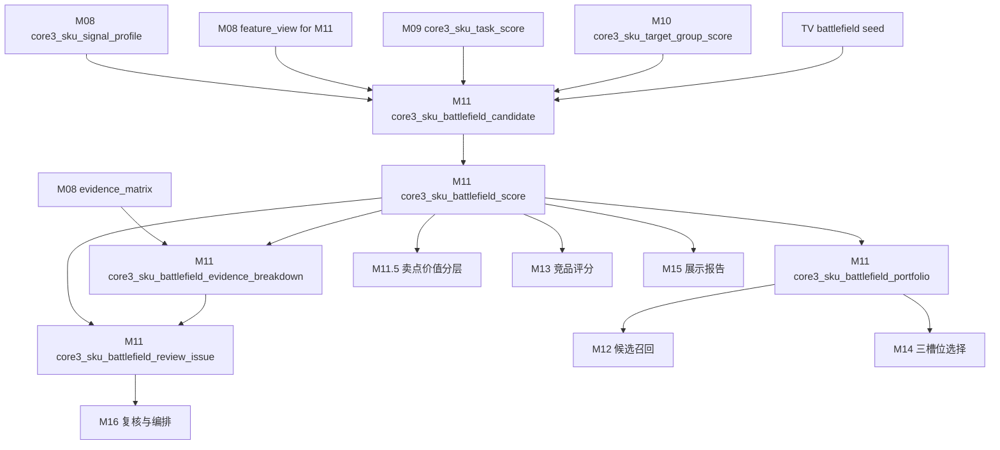
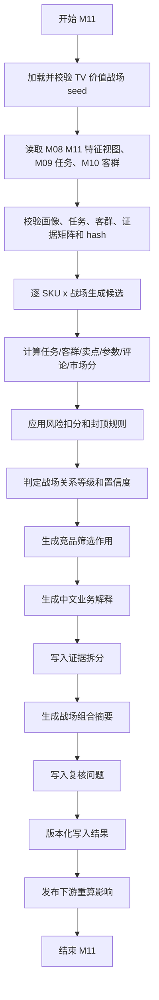

# M11 价值战场模块详细设计

## 1. 文档定位

本文是 CatForge 彩电核心三竞品 SOP 的 M11 详细设计，承接：

- 需求文档：`docs/core3_mvp/real_data_v2/sop_requirements/M11_battlefield_requirements.md`
- 总体设计：`docs/core3_mvp/real_data_v2/sop_detailed_design/00_architecture_data_dictionary_design.md`
- 上游 M08：`core3_sku_signal_profile`、`core3_sku_signal_evidence_matrix`、`core3_sku_downstream_feature_view`
- 上游 M09：`core3_sku_task_score`、`core3_sku_task_evidence_breakdown`、`core3_sku_task_review_issue`
- 上游 M10：`core3_sku_target_group_score`、`core3_sku_target_group_evidence_breakdown`、`core3_sku_target_group_review_issue`
- 上游 M02：`core3_evidence_atom`，只通过 M08/M09/M10 evidence 引用回溯
- 价值战场 seed：`apps/api-server/app/rules/tv_core3_mvp_seed_v0_2.json`
- 下游 M11.5、M12、M13、M14、M15、M16

M11 基于 M08 SKU 综合信号画像、M09 用户任务、M10 目标客群、评论战场支撑和市场画像，判断每个 SKU 参与哪些价值战场，并输出主战场、次战场、机会战场、弱战场、置信度和证据拆解。

价值战场不是卖点列表、不是任务列表、也不是客群标签。价值战场是后续竞品识别的比较语境：系统不是在全市场找“最像的电视”，而是在目标 SKU 真正参与竞争的价值场景中寻找最有业务意义的核心竞品。

## 2. 模块职责

### 2.1 本模块解决什么

M11 解决七类工程问题：

1. 对每个 SKU 和 10 个 TV MVP 价值战场建立统一关系口径。
2. 将任务、客群、参数、卖点、评论和市场验证合并为战场判断。
3. 区分主战场、次战场、机会战场、弱战场和证据不足战场。
4. 输出战场组合摘要，说明后续竞品筛选应优先在哪些语境下比较。
5. 为 M11.5 战场内卖点价值分层提供战场上下文。
6. 为 M12/M13/M14 的候选召回、组件评分和三槽位选择提供战场主线。
7. 为 M15 高层展示页提供业务化中文解释，回答“为什么按这些战场找竞品”。

### 2.2 本模块不解决什么

| 不做事项 | 原因 | 后续模块 |
| --- | --- | --- |
| 不读取原始四张表 | M11 必须消费 M08/M09/M10 上游产物 | M00-M10 |
| 不直接读取 M03/M04b/M06/M07 散表 | 参数、卖点、评论、市场已由 M08 统一装配 | M08 |
| 不把任务直接等同战场 | 任务是用户目的，战场是竞争比较语境 | M11 |
| 不把客群直接等同战场 | 客群是购买人群，战场是价值竞争维度 | M11 |
| 不把卖点 code 直接等同战场 | 卖点只是价值表达和证据之一 | M11 |
| 不从原始评论直接打战场标签 | 评论战场信号必须经 M06/M08 | M06/M08 |
| 不做战场内卖点价值分层 | 分层需要 M11 战场结果作为上下文 | M11.5 |
| 不召回竞品候选 | 战场只是召回主条件之一 | M12 |
| 不计算竞品组件分 | 战场相似度在 pair 级评分 | M13 |
| 不选择核心三竞品 | M14 选择三槽位竞品 | M14 |
| 不生成最终展示报告 | M15 负责展示表达 | M15 |

### 2.3 允许复用历史结果

允许复用历史 M11 输出，但必须同时满足：

- M08 `profile_hash` 未变化。
- M08 `core3_sku_downstream_feature_view where for_module='M11'` 的 `view_hash` 未变化。
- M09 当前任务分、证据拆分和复核摘要 hash 未变化。
- M10 当前客群分、证据拆分和复核摘要 hash 未变化。
- M08 evidence matrix 中与 M11 相关域的 hash 未变化。
- battlefield seed 文件 hash 未变化。
- `battlefield_seed_version` 未变化。
- M11 评分规则版本、阈值版本、封顶规则版本未变化。
- 历史记录 `is_current=true` 且 `processing_status` 不是 `failed`、`blocked`。

## 3. 输入输出总览

### 3.1 必须输入

| 输入 | 来源模块 | 表或文件 | 用途 |
| --- | --- | --- | --- |
| SKU 画像 | M08 | `core3_sku_signal_profile` | 参数、卖点、评论、市场、可比池、风险 |
| M11 特征视图 | M08 | `core3_sku_downstream_feature_view where for_module='M11'` | 默认战场推断入口 |
| 证据矩阵 | M08 | `core3_sku_signal_evidence_matrix` | 判断战场相关证据覆盖 |
| 用户任务得分 | M09 | `core3_sku_task_score` | 核心任务支撑 |
| 任务证据拆解 | M09 | `core3_sku_task_evidence_breakdown` | 任务证据来源 |
| 任务复核问题 | M09 | `core3_sku_task_review_issue` | 继承任务风险 |
| 目标客群得分 | M10 | `core3_sku_target_group_score` | 战场人群适配 |
| 客群证据拆解 | M10 | `core3_sku_target_group_evidence_breakdown` | 客群证据来源 |
| 客群复核问题 | M10 | `core3_sku_target_group_review_issue` | 继承客群风险 |
| evidence 原子 | M02 | `core3_evidence_atom` | 通过 evidence ID 回溯证据 |
| TV 战场 seed | 规则资产 | `tv_core3_mvp_seed_v0_2.json.battlefields` | 战场定义、任务/卖点/参数/评论/市场规则和阈值 |

### 3.2 从 M08 消费的画像特征

| 特征域 | M08 字段或视图内容 | M11 用途 |
| --- | --- | --- |
| SKU 主数据 | `sku_code`、`model_name`、`brand_name`、`size_segment`、`price_band`、`main_platform` | 战场适配和业务解释 |
| 参数画像 | `core_params_json`、`param_profile_json`、M11 view 的 `param_capability_summary` | 判断战场能力基础 |
| 卖点画像 | `claim_activation_summary_json`、`claim_evidence_breakdown_json`、M11 view 的 `activated_claims` | 判断战场价值表达和卖点组合 |
| 评论战场支撑 | `battlefield_support_comment_signals` | 判断用户是否感知到战场价值 |
| 评论痛点风险 | `comment_signal_summary_json.pain_point` | 判断战场削弱和风险 |
| 价格感知 | `comment_signal_summary_json.price_perception` | 支撑大屏性价比、价格挤压等战场 |
| 服务信号 | `comment_signal_summary_json.service_signal` | 支撑服务保障、家居美学战场侧面 |
| 市场画像 | `market_signal_summary`、`market_summary_json` | 价格位置、销量、销额、平台、趋势 |
| 可比池 | `comparable_pool_summary_json` | 同尺寸、同价位、相邻尺寸竞争密度 |
| 风险缺失 | `missing_signals_json`、`risk_signals_json`、`domain_completeness_json` | 降低置信度或进入复核 |
| 证据索引 | `evidence_refs`、`evidence_matrix_refs_json` | 证据拆分和增量重算 |

### 3.3 从 M09/M10 消费的结果

| 输入 | 用途 | 边界 |
| --- | --- | --- |
| M09 主/次/弱任务 | 形成战场任务支撑 | 任务不直接等于战场 |
| M09 任务证据 | 回溯任务能力、评论和市场来源 | 不重新计算任务分 |
| M10 主/次/弱客群 | 判断战场人群适配 | 客群不直接等于战场 |
| M10 客群证据 | 回溯购买人群、价格渠道和市场来源 | 不重新计算客群分 |
| M09/M10 复核状态 | 降低战场置信度或封顶 | 不能忽略上游风险 |

### 3.4 明确不消费

| 数据 | 禁止原因 |
| --- | --- |
| 原始 `week_sales_data`、`attribute_data`、`selling_points_data`、`comment_data` | 已由上游分层处理 |
| M03/M04b/M06/M07 散表业务字段 | 必须通过 M08 统一画像消费 |
| M11.5 卖点价值分层结果 | M11 是 M11.5 上游 |
| M12-M15 竞品和报告结果 | M11 是它们的上游 |

### 3.5 输出表

| 输出表 | 粒度 | 用途 |
| --- | --- | --- |
| `core3_sku_battlefield_candidate` | SKU + 战场 + 候选触发版本 | 记录为什么进入战场候选 |
| `core3_sku_battlefield_score` | SKU + 战场 + 规则版本 | 记录战场分、关系等级和中文解释 |
| `core3_sku_battlefield_evidence_breakdown` | SKU + 战场 + 证据域 | 记录任务、客群、卖点、参数、评论、市场、风险分域证据 |
| `core3_sku_battlefield_portfolio` | SKU + 规则版本 | 记录 SKU 的战场组合和竞品筛选主语境 |
| `core3_sku_battlefield_review_issue` | SKU + 战场或 SKU 级问题 | 记录战场推断复核问题 |

### 3.6 模块关系



## 4. 价值战场 seed 设计

### 4.1 预制和推导边界

M11 允许预制的是战场本体和规则骨架，不允许预制 SKU 战场结论。

| 预制项 | 内容 | 是否可直接成为 SKU 结论 |
| --- | --- | --- |
| `battlefield_code` | 稳定战场编码 | 否 |
| `battlefield_name` | 中文业务名 | 否 |
| `definition` | 战场定义 | 否 |
| `aliases`、`keywords` | 别名和关键词 | 否 |
| `core_task_codes`、`mapped_task_codes` | 核心任务 | 否 |
| `core_claim_codes`、`mapped_claim_codes` | 核心卖点 | 否 |
| `core_param_codes`、`mapped_param_codes` | 核心参数 | 否 |
| `comment_topic_codes`、`mapped_topic_codes` | 评论主题 | 否 |
| `required_signal_rule` | 必需信号规则 | 否 |
| `semantic_market_weights` | 语义和市场权重 | 否 |
| `market_score_rule.signals` | 市场信号规则 | 否 |
| `entry_thresholds` | 进入阈值 | 否 |

每个 SKU 的战场关系必须由 M08/M09/M10 的真实画像、任务、客群、评论和市场验证推导出来。

### 4.2 seed 版本

首版使用：

| 项 | 值 |
| --- | --- |
| seed 文件 | `apps/api-server/app/rules/tv_core3_mvp_seed_v0_2.json` |
| 文件内版本 | `core3-mvp-0.2.0` |
| 建议业务版本 | `tv_core3_mvp_seed_v0_2` |
| category_code | `TV` |

M11 输出同时保存：

- `battlefield_seed_version='tv_core3_mvp_seed_v0_2'`
- `battlefield_seed_file_version='core3-mvp-0.2.0'`
- `battlefield_seed_hash`

### 4.3 MVP 10 个价值战场

M11 必须覆盖 seed 中 10 个 `BF_*` 战场，不得使用旧参考中的过时代码。

| 战场 code | 业务名称 | 定义 | 核心任务 | 语义/市场权重 |
| --- | --- | --- | --- | --- |
| `BF_PREMIUM_PICTURE` | 高端画质战场 | 围绕 Mini LED/OLED、高亮、控光、色彩和高端价格支撑展开竞争 | 高端画质影音 | 0.70 / 0.30 |
| `BF_FAMILY_VIEWING_UPGRADE` | 家庭观影升级战场 | 围绕客厅大屏、HDR、音效和全家观影体验展开竞争 | 客厅影院观影、大屏换新 | 0.65 / 0.35 |
| `BF_GAMING_SPORTS` | 游戏体育战场 | 围绕高刷、低延迟、HDMI 2.1、VRR 和体育运动流畅体验展开竞争 | 游戏娱乐、体育赛事观看 | 0.70 / 0.30 |
| `BF_LARGE_SCREEN_VALUE` | 大屏性价比战场 | 围绕大尺寸、价格/英寸、销量和价值感展开竞争 | 大屏换新、性价比购买 | 0.55 / 0.45 |
| `BF_FAMILY_EYE_CARE` | 家庭护眼战场 | 围绕儿童、家庭长期观看、护眼参数和舒适评论展开竞争 | 儿童护眼、卧室/副屏 | 0.70 / 0.30 |
| `BF_SENIOR_EASE_OF_USE` | 长辈易用战场 | 围绕语音、适老、简洁系统、少广告和长辈评论展开竞争 | 长辈易用 | 0.75 / 0.25 |
| `BF_SMART_SYSTEM_EXPERIENCE` | 智能系统体验战场 | 围绕系统流畅、语音、内存、广告风险和智能体验展开竞争 | 长辈易用、卧室/副屏 | 0.70 / 0.30 |
| `BF_CINEMA_AUDIO_IMMERSION` | 影院音效战场 | 围绕音响功率、杜比、环绕、低音和沉浸影院感展开竞争 | 客厅影院观影 | 0.70 / 0.30 |
| `BF_DESIGN_HOME_FIT` | 家居美学战场 | 围绕外观、超薄、尺寸适配、装修搭配和安装体验展开竞争 | 新家装修搭配 | 0.75 / 0.25 |
| `BF_SERVICE_ASSURANCE` | 服务保障战场 | 围绕安装、送货、售后、做工质量和服务风险展开竞争 | 新家装修搭配 | 0.80 / 0.20 |

`BF_SERVICE_ASSURANCE` 是服务侧战场，不能替代产品核心战场；默认用于报告风险提示或服务保障对比，不作为正面对打竞品召回主线，除非业务明确关注服务竞争。

### 4.4 seed 校验

M11 启动前必须校验 seed：

| 校验 | 失败处理 |
| --- | --- |
| `category_code='TV'` | 阻塞 |
| `battlefields` 正好覆盖 10 个 MVP battlefield_code | 阻塞 |
| 每个战场有中文名称、定义、核心任务、权重和阈值 | 阻塞 |
| `core_task_codes` 均存在于 M09 任务 seed | 阻塞 |
| `core_claim_codes`、`core_param_codes`、`comment_topic_codes` 可识别 | 复核 |
| `semantic_market_weights.semantic + market = 1.0` | 阻塞 |
| `entry_thresholds` 顺序合理 | 阻塞 |
| battlefield_code 稳定且无重复 | 阻塞 |
| seed hash 可计算 | 阻塞 |

## 5. 数据模型设计

### 5.1 通用字段约定

M11 输出表必须包含以下通用字段。

| 字段 | 类型建议 | 必填 | 说明 |
| --- | --- | --- | --- |
| `project_id` | `text` | 是 | 项目 ID |
| `category_code` | `text` | 是 | MVP 为 `TV` |
| `batch_id` | `text` | 是 | 批次 ID |
| `run_id` | `text` | 否 | 全链路运行 ID |
| `module_run_id` | `text` | 否 | M11 模块运行 ID |
| `rule_version` | `text` | 是 | M11 评分规则版本 |
| `battlefield_seed_version` | `text` | 是 | 战场 seed 业务版本 |
| `battlefield_seed_file_version` | `text` | 是 | seed 文件内版本 |
| `battlefield_seed_hash` | `text` | 是 | seed 文件内容 hash |
| `profile_hash` | `text` | 是 | M08 SKU 画像 hash |
| `feature_view_hash` | `text` | 是 | M08 M11 特征视图 hash |
| `task_score_fingerprint` | `text` | 是 | M09 任务结果和证据拆分 hash |
| `target_group_score_fingerprint` | `text` | 是 | M10 客群结果和证据拆分 hash |
| `input_fingerprint` | `text` | 是 | 输入 hash |
| `result_hash` | `text` | 是 | 输出业务内容 hash |
| `is_current` | `boolean` | 是 | 是否当前版本 |
| `processing_status` | `text` | 是 | `success`、`warning`、`review_required`、`blocked`、`failed` |
| `review_required` | `boolean` | 是 | 是否需要复核 |
| `review_status` | `text` | 是 | `auto_pass`、`review_required`、`approved`、`rejected`、`waived` |
| `review_reason_json` | `jsonb` | 是 | 复核原因 |
| `created_at` | `timestamptz` | 是 | 创建时间 |
| `updated_at` | `timestamptz` | 是 | 更新时间 |

### 5.2 枚举定义

#### 5.2.1 `candidate_status`

```text
active
rejected
review_required
blocked
```

#### 5.2.2 `candidate_source`

```text
task
target_group
claim
param
comment
market
service
seed_hint
seed_gap
```

#### 5.2.3 `relation_level`

```text
main
secondary
opportunity
weak
insufficient
blocked
```

#### 5.2.4 `evidence_domain`

```text
task
target_group
claim
param
comment
market
service
risk
seed
profile
```

#### 5.2.5 `support_level`

```text
strong
medium
weak
missing
conflict
not_applicable
```

#### 5.2.6 `competitor_selection_role`

```text
primary_search_context
secondary_search_context
opportunity_monitoring
risk_or_service_context
not_for_core_search
```

#### 5.2.7 `review_issue_type`

```text
missing_feature_view
missing_task_score
missing_target_group_score
only_comment
only_service
market_missing
market_limited
claim_missing
param_conflict
upstream_review
seed_gap
profile_blocked
high_score_contradiction
service_as_core_battlefield
```

## 6. 表设计：`core3_sku_battlefield_candidate`

### 6.1 表职责

`core3_sku_battlefield_candidate` 记录价值战场候选生成阶段。它回答“这个 SKU 为什么可能参与这个战场”，也记录被拒绝或需要复核的候选。

候选记录不等于最终战场。最终关系以 `core3_sku_battlefield_score` 为准。

### 6.2 字段级契约

| 字段 | 类型建议 | 必填 | 来源 | 说明 |
| --- | --- | --- | --- | --- |
| `sku_battlefield_candidate_id` | `uuid` | 是 | M11 | 主键 |
| `project_id` | `text` | 是 | M00 | 项目 ID |
| `category_code` | `text` | 是 | M00/M08 | 品类 |
| `batch_id` | `text` | 是 | M00 | 批次 |
| `run_id` | `text` | 否 | M16 | 全链路运行 ID |
| `module_run_id` | `text` | 否 | M11 | 本模块运行 ID |
| `sku_signal_profile_id` | `uuid` | 是 | M08 | SKU 画像 ID |
| `sku_downstream_feature_view_id` | `uuid` | 是 | M08 | M11 特征视图 ID |
| `sku_code` | `text` | 是 | M08 | SKU |
| `model_code` | `text` | 否 | M08 | 型号编码 |
| `model_name` | `text` | 否 | M08 | 型号名 |
| `brand_name` | `text` | 否 | M08 | 品牌 |
| `battlefield_code` | `text` | 是 | seed | 战场 code |
| `battlefield_name_cn` | `text` | 是 | seed | 战场中文名 |
| `battlefield_definition_cn` | `text` | 是 | seed | 战场定义 |
| `candidate_source_json` | `jsonb` | 是 | M11 | 任务、客群、卖点、参数、评论、市场触发来源 |
| `candidate_source_count` | `integer` | 是 | M11 | 命中来源域数量 |
| `source_task_codes_json` | `jsonb` | 是 | M09/seed | 关联任务 |
| `source_target_group_codes_json` | `jsonb` | 是 | M10/seed | 关联客群 |
| `candidate_initial_score` | `numeric(6,4)` | 是 | M11 | 候选阶段粗分 |
| `candidate_reason_cn` | `text` | 是 | M11 | 中文候选原因 |
| `candidate_status` | `text` | 是 | M11 | active/rejected/review_required/blocked |
| `reject_reason_json` | `jsonb` | 是 | M11 | 被拒绝原因 |
| `missing_signals_json` | `jsonb` | 是 | M08/M11 | 缺失信号 |
| `risk_flags_json` | `jsonb` | 是 | M08/M09/M10/M11 | 风险 |
| `evidence_ids` | `uuid[]` | 是 | M08/M09/M10/M02 | 候选阶段代表 evidence |
| `evidence_matrix_refs_json` | `jsonb` | 是 | M08 | M08 证据矩阵引用 |
| `profile_hash` | `text` | 是 | M08 | 画像 hash |
| `feature_view_hash` | `text` | 是 | M08 | M11 视图 hash |
| `task_score_fingerprint` | `text` | 是 | M09/M11 | M09 任务结果 hash |
| `target_group_score_fingerprint` | `text` | 是 | M10/M11 | M10 客群结果 hash |
| `battlefield_seed_version` | `text` | 是 | seed | 战场 seed 业务版本 |
| `battlefield_seed_file_version` | `text` | 是 | seed | seed 文件版本 |
| `battlefield_seed_hash` | `text` | 是 | seed | seed hash |
| `rule_version` | `text` | 是 | M11 | 规则版本 |
| `input_fingerprint` | `text` | 是 | M11 | 输入 hash |
| `result_hash` | `text` | 是 | M11 | 结果 hash |
| `is_current` | `boolean` | 是 | M11 | 是否当前 |
| `processing_status` | `text` | 是 | M11 | 处理状态 |
| `review_required` | `boolean` | 是 | M11 | 是否复核 |
| `review_status` | `text` | 是 | M11 | 复核状态 |
| `review_reason_json` | `jsonb` | 是 | M11 | 复核原因 |
| `created_at` | `timestamptz` | 是 | M11 | 创建时间 |
| `updated_at` | `timestamptz` | 是 | M11 | 更新时间 |

### 6.3 主键、唯一键和索引

主键：

```sql
primary key (sku_battlefield_candidate_id)
```

唯一键：

```sql
unique (
  project_id,
  category_code,
  batch_id,
  sku_code,
  battlefield_code,
  profile_hash,
  task_score_fingerprint,
  target_group_score_fingerprint,
  battlefield_seed_version,
  rule_version,
  result_hash
)
```

当前版本唯一索引：

```sql
create unique index uq_core3_sku_battlefield_candidate_current
on core3_sku_battlefield_candidate(
  project_id,
  category_code,
  batch_id,
  sku_code,
  battlefield_code,
  battlefield_seed_version,
  rule_version
)
where is_current = true;
```

查询索引：

```sql
create index idx_core3_sku_battlefield_candidate_sku
on core3_sku_battlefield_candidate(project_id, category_code, batch_id, sku_code);

create index idx_core3_sku_battlefield_candidate_battlefield
on core3_sku_battlefield_candidate(project_id, category_code, batch_id, battlefield_code, candidate_status);

create index idx_core3_sku_battlefield_candidate_review
on core3_sku_battlefield_candidate(project_id, category_code, batch_id, review_required);

create index idx_core3_sku_battlefield_candidate_source_gin
on core3_sku_battlefield_candidate
using gin (candidate_source_json jsonb_path_ops);
```

## 7. 表设计：`core3_sku_battlefield_score`

### 7.1 表职责

`core3_sku_battlefield_score` 是 M11 主输出，记录每个 SKU 对每个价值战场的语义分、市场分、最终战场分、关系等级、置信度、竞品选择作用和中文业务解释。

MVP 建议每个有效 SKU 对 10 个价值战场都生成一行 score，未命中的战场关系为 `insufficient`。这样 M11.5-M15 可以稳定消费，不需要猜测缺行是未计算还是不相关。

### 7.2 字段级契约

| 字段 | 类型建议 | 必填 | 来源 | 说明 |
| --- | --- | --- | --- | --- |
| `sku_battlefield_score_id` | `uuid` | 是 | M11 | 主键 |
| `project_id` | `text` | 是 | M00 | 项目 |
| `category_code` | `text` | 是 | M00/M08 | 品类 |
| `batch_id` | `text` | 是 | M00 | 批次 |
| `run_id` | `text` | 否 | M16 | 全链路运行 ID |
| `module_run_id` | `text` | 否 | M11 | 模块运行 ID |
| `sku_signal_profile_id` | `uuid` | 是 | M08 | 画像 ID |
| `sku_downstream_feature_view_id` | `uuid` | 是 | M08 | M11 特征视图 ID |
| `sku_code` | `text` | 是 | M08 | SKU |
| `model_code` | `text` | 否 | M08 | 型号编码 |
| `model_name` | `text` | 否 | M08 | 型号名 |
| `brand_name` | `text` | 否 | M08 | 品牌 |
| `battlefield_code` | `text` | 是 | seed | 战场 code |
| `battlefield_name_cn` | `text` | 是 | seed | 战场中文名 |
| `battlefield_definition_cn` | `text` | 是 | seed | 战场定义 |
| `semantic_score` | `numeric(6,4)` | 是 | M11 | 语义分 |
| `market_score` | `numeric(6,4)` | 是 | M11 | 市场分 |
| `core_task_score` | `numeric(6,4)` | 是 | M09/M11 | 核心任务分 |
| `target_group_score` | `numeric(6,4)` | 是 | M10/M11 | 客群支撑分 |
| `core_claim_combo_score` | `numeric(6,4)` | 是 | M08/M11 | 核心卖点组合分 |
| `core_param_capability_score` | `numeric(6,4)` | 是 | M08/M11 | 参数能力分 |
| `comment_support_score` | `numeric(6,4)` | 是 | M08/M11 | 评论战场支撑分 |
| `pain_point_risk_score` | `numeric(6,4)` | 是 | M08/M11 | 痛点风险分 |
| `price_position_score` | `numeric(6,4)` | 是 | M08/M11 | 价格位置分 |
| `sales_validation_score` | `numeric(6,4)` | 是 | M08/M11 | 销量验证分 |
| `sales_amount_validation_score` | `numeric(6,4)` | 是 | M08/M11 | 销额验证分 |
| `channel_fit_score` | `numeric(6,4)` | 是 | M08/M11 | 渠道/平台适配分 |
| `trend_signal_score` | `numeric(6,4)` | 是 | M08/M11 | 趋势分 |
| `comparable_pool_strength` | `numeric(6,4)` | 是 | M08/M11 | 可比池强度 |
| `raw_battlefield_score` | `numeric(6,4)` | 是 | M11 | 风险修正前战场分 |
| `risk_penalty` | `numeric(6,4)` | 是 | M11 | 风险扣分 |
| `battlefield_score` | `numeric(6,4)` | 是 | M11 | 最终战场分 |
| `relation_level` | `text` | 是 | M11 | main/secondary/opportunity/weak/insufficient/blocked |
| `relation_reason_json` | `jsonb` | 是 | M11 | 关系等级判定原因 |
| `competitor_selection_role` | `text` | 是 | M11 | 对竞品筛选的作用枚举 |
| `competitor_selection_role_cn` | `text` | 是 | M11 | 对后续竞品选择的中文作用 |
| `sample_sufficiency` | `text` | 是 | M08/M11 | `sufficient`、`limited`、`insufficient`、`unknown` |
| `confidence` | `numeric(6,4)` | 是 | M11 | 置信度 |
| `confidence_level` | `text` | 是 | M11 | high/medium/low/unknown |
| `evidence_domain_count` | `integer` | 是 | M11 | 有效证据域数量 |
| `effective_domain_json` | `jsonb` | 是 | M11 | 哪些域有效 |
| `score_breakdown_json` | `jsonb` | 是 | M11 | 权重、原始分、封顶、风险 |
| `cap_rule_applied_json` | `jsonb` | 是 | M11 | 触发的封顶规则 |
| `missing_signals_json` | `jsonb` | 是 | M08/M11 | 缺失信号 |
| `risk_flags_json` | `jsonb` | 是 | M08/M09/M10/M11 | 风险 |
| `business_reason_cn` | `text` | 是 | M11 | 中文业务解释摘要 |
| `business_reason_parts_json` | `jsonb` | 是 | M11 | 任务、客群、产品价值、用户感知、市场验证、竞品作用、复核点 |
| `evidence_ids` | `uuid[]` | 是 | M08/M09/M10/M02 | 核心 evidence |
| `evidence_matrix_refs_json` | `jsonb` | 是 | M08 | 证据矩阵引用 |
| `profile_hash` | `text` | 是 | M08 | 画像 hash |
| `feature_view_hash` | `text` | 是 | M08 | M11 视图 hash |
| `task_score_fingerprint` | `text` | 是 | M09/M11 | M09 任务结果 hash |
| `target_group_score_fingerprint` | `text` | 是 | M10/M11 | M10 客群结果 hash |
| `battlefield_seed_version` | `text` | 是 | seed | seed 业务版本 |
| `battlefield_seed_file_version` | `text` | 是 | seed | seed 文件版本 |
| `battlefield_seed_hash` | `text` | 是 | seed | seed hash |
| `rule_version` | `text` | 是 | M11 | 规则版本 |
| `input_fingerprint` | `text` | 是 | M11 | 输入 hash |
| `result_hash` | `text` | 是 | M11 | 结果 hash |
| `is_current` | `boolean` | 是 | M11 | 是否当前 |
| `processing_status` | `text` | 是 | M11 | 处理状态 |
| `review_required` | `boolean` | 是 | M11 | 是否复核 |
| `review_status` | `text` | 是 | M11 | 复核状态 |
| `review_reason_json` | `jsonb` | 是 | M11 | 复核原因 |
| `created_at` | `timestamptz` | 是 | M11 | 创建时间 |
| `updated_at` | `timestamptz` | 是 | 更新时间 |

### 7.3 主键、唯一键和索引

主键：

```sql
primary key (sku_battlefield_score_id)
```

唯一键：

```sql
unique (
  project_id,
  category_code,
  batch_id,
  sku_code,
  battlefield_code,
  profile_hash,
  task_score_fingerprint,
  target_group_score_fingerprint,
  battlefield_seed_version,
  rule_version,
  result_hash
)
```

当前版本唯一索引：

```sql
create unique index uq_core3_sku_battlefield_score_current
on core3_sku_battlefield_score(
  project_id,
  category_code,
  batch_id,
  sku_code,
  battlefield_code,
  battlefield_seed_version,
  rule_version
)
where is_current = true;
```

查询索引：

```sql
create index idx_core3_sku_battlefield_score_sku_relation
on core3_sku_battlefield_score(project_id, category_code, batch_id, sku_code, relation_level, battlefield_score desc);

create index idx_core3_sku_battlefield_score_battlefield
on core3_sku_battlefield_score(project_id, category_code, batch_id, battlefield_code, relation_level);

create index idx_core3_sku_battlefield_score_downstream
on core3_sku_battlefield_score(project_id, category_code, batch_id, sku_code, competitor_selection_role, battlefield_score desc);

create index idx_core3_sku_battlefield_score_hash
on core3_sku_battlefield_score(project_id, category_code, batch_id, profile_hash, task_score_fingerprint, target_group_score_fingerprint, battlefield_seed_version, rule_version);

create index idx_core3_sku_battlefield_score_breakdown_gin
on core3_sku_battlefield_score
using gin (score_breakdown_json jsonb_path_ops);
```

## 8. 表设计：`core3_sku_battlefield_evidence_breakdown`

### 8.1 表职责

`core3_sku_battlefield_evidence_breakdown` 保存战场得分的分域证据拆解。它回答“这个战场判断由哪些任务、客群、卖点、参数、评论、市场、服务和风险构成”。

每个 `core3_sku_battlefield_score` 至少输出 8 类域记录：`task`、`target_group`、`claim`、`param`、`comment`、`market`、`service`、`risk`。缺失域也要输出 `support_level='missing'` 或 `not_applicable`。

### 8.2 字段级契约

| 字段 | 类型建议 | 必填 | 来源 | 说明 |
| --- | --- | --- | --- | --- |
| `sku_battlefield_evidence_breakdown_id` | `uuid` | 是 | M11 | 主键 |
| `sku_battlefield_score_id` | `uuid` | 是 | M11 | 关联战场分 |
| `project_id` | `text` | 是 | M00 | 项目 |
| `category_code` | `text` | 是 | M00/M08 | 品类 |
| `batch_id` | `text` | 是 | M00 | 批次 |
| `sku_code` | `text` | 是 | M08 | SKU |
| `battlefield_code` | `text` | 是 | seed | 战场 code |
| `evidence_domain` | `text` | 是 | M11 | task/target_group/claim/param/comment/market/service/risk/seed/profile |
| `support_level` | `text` | 是 | M11 | strong/medium/weak/missing/conflict/not_applicable |
| `support_score` | `numeric(6,4)` | 是 | M11 | 分域原始分 |
| `domain_weight` | `numeric(6,4)` | 是 | M11/seed | 该域权重 |
| `weighted_contribution` | `numeric(6,4)` | 是 | M11 | 加权贡献 |
| `support_summary_cn` | `text` | 是 | M11 | 中文证据摘要 |
| `source_signal_codes_json` | `jsonb` | 是 | M08/M09/M10/seed | 来源任务、客群、卖点、参数、评论主题或市场信号 |
| `source_values_json` | `jsonb` | 是 | M08/M09/M10 | 命中的具体值和强度 |
| `representative_evidence_ids` | `uuid[]` | 是 | M08/M09/M10/M02 | 代表 evidence |
| `evidence_matrix_refs_json` | `jsonb` | 是 | M08 | 证据矩阵引用 |
| `missing_reason_code` | `text` | 否 | M11 | 缺失原因 |
| `risk_flags_json` | `jsonb` | 是 | M08/M09/M10/M11 | 风险 |
| `confidence` | `numeric(6,4)` | 是 | M11 | 分域置信度 |
| `battlefield_seed_version` | `text` | 是 | seed | 战场 seed 版本 |
| `rule_version` | `text` | 是 | M11 | 规则版本 |
| `profile_hash` | `text` | 是 | M08 | 画像 hash |
| `task_score_fingerprint` | `text` | 是 | M09/M11 | 任务结果 hash |
| `target_group_score_fingerprint` | `text` | 是 | M10/M11 | 客群结果 hash |
| `input_fingerprint` | `text` | 是 | M11 | 输入 hash |
| `result_hash` | `text` | 是 | M11 | 结果 hash |
| `is_current` | `boolean` | 是 | M11 | 是否当前 |
| `created_at` | `timestamptz` | 是 | M11 | 创建时间 |
| `updated_at` | `timestamptz` | 是 | 更新时间 |

### 8.3 主键、唯一键和索引

主键：

```sql
primary key (sku_battlefield_evidence_breakdown_id)
```

唯一键：

```sql
unique (
  sku_battlefield_score_id,
  evidence_domain,
  battlefield_seed_version,
  rule_version
)
```

查询索引：

```sql
create index idx_core3_sku_battlefield_evidence_breakdown_score
on core3_sku_battlefield_evidence_breakdown(sku_battlefield_score_id, evidence_domain);

create index idx_core3_sku_battlefield_evidence_breakdown_sku_bf
on core3_sku_battlefield_evidence_breakdown(project_id, category_code, batch_id, sku_code, battlefield_code);

create index idx_core3_sku_battlefield_evidence_breakdown_support
on core3_sku_battlefield_evidence_breakdown(project_id, category_code, batch_id, evidence_domain, support_level);

create index idx_core3_sku_battlefield_evidence_breakdown_refs_gin
on core3_sku_battlefield_evidence_breakdown
using gin (representative_evidence_ids);
```

## 9. 表设计：`core3_sku_battlefield_portfolio`

### 9.1 表职责

`core3_sku_battlefield_portfolio` 保存 SKU 的战场组合摘要。它不替代 `core3_sku_battlefield_score`，而是给 M12/M14/M15 快速消费的组合视图。

该表回答：

- 这个 SKU 的主要竞品筛选语境是什么？
- 哪些战场应作为候选召回主条件？
- 哪些战场只是机会监控或风险提示？
- 哪些战场因证据不足不进入后续主流程？

### 9.2 字段级契约

| 字段 | 类型建议 | 必填 | 来源 | 说明 |
| --- | --- | --- | --- | --- |
| `sku_battlefield_portfolio_id` | `uuid` | 是 | M11 | 主键 |
| `project_id` | `text` | 是 | M00 | 项目 |
| `category_code` | `text` | 是 | M00/M08 | 品类 |
| `batch_id` | `text` | 是 | M00 | 批次 |
| `run_id` | `text` | 否 | M16 | 全链路运行 ID |
| `module_run_id` | `text` | 否 | M11 | 模块运行 ID |
| `sku_signal_profile_id` | `uuid` | 是 | M08 | 画像 ID |
| `sku_code` | `text` | 是 | M08 | SKU |
| `model_code` | `text` | 否 | M08 | 型号编码 |
| `model_name` | `text` | 否 | M08 | 型号名 |
| `brand_name` | `text` | 否 | M08 | 品牌 |
| `main_battlefields_json` | `jsonb` | 是 | M11 | 主战场列表，按分数排序 |
| `secondary_battlefields_json` | `jsonb` | 是 | M11 | 次战场列表 |
| `opportunity_battlefields_json` | `jsonb` | 是 | M11 | 机会战场列表 |
| `weak_battlefields_json` | `jsonb` | 是 | M11 | 弱战场列表 |
| `insufficient_battlefields_json` | `jsonb` | 是 | M11 | 证据不足战场列表 |
| `primary_competitor_search_context_cn` | `text` | 是 | M11 | 竞品筛选主语境中文摘要 |
| `primary_search_battlefield_codes_json` | `jsonb` | 是 | M11 | M12/M14 主召回战场 |
| `secondary_search_battlefield_codes_json` | `jsonb` | 是 | M11 | M12/M14 辅助召回战场 |
| `opportunity_monitoring_codes_json` | `jsonb` | 是 | M11 | 机会监控战场 |
| `risk_or_service_context_json` | `jsonb` | 是 | M11 | 服务和风险上下文 |
| `portfolio_confidence` | `numeric(6,4)` | 是 | M11 | 组合置信度 |
| `portfolio_risk_flags_json` | `jsonb` | 是 | M11 | 组合风险 |
| `battlefield_score_refs_json` | `jsonb` | 是 | M11 | 关联 score ID 和 hash |
| `evidence_ids` | `uuid[]` | 是 | M11/M02 | 核心 evidence |
| `profile_hash` | `text` | 是 | M08 | 画像 hash |
| `feature_view_hash` | `text` | 是 | M08 | M11 视图 hash |
| `task_score_fingerprint` | `text` | 是 | M09/M11 | 任务结果 hash |
| `target_group_score_fingerprint` | `text` | 是 | M10/M11 | 客群结果 hash |
| `battlefield_seed_version` | `text` | 是 | seed | seed 版本 |
| `battlefield_seed_hash` | `text` | 是 | seed | seed hash |
| `rule_version` | `text` | 是 | M11 | 规则版本 |
| `input_fingerprint` | `text` | 是 | M11 | 输入 hash |
| `result_hash` | `text` | 是 | M11 | 结果 hash |
| `is_current` | `boolean` | 是 | M11 | 是否当前 |
| `processing_status` | `text` | 是 | M11 | 处理状态 |
| `review_required` | `boolean` | 是 | M11 | 是否复核 |
| `review_status` | `text` | 是 | M11 | 复核状态 |
| `review_reason_json` | `jsonb` | 是 | M11 | 复核原因 |
| `created_at` | `timestamptz` | 是 | M11 | 创建时间 |
| `updated_at` | `timestamptz` | 是 | 更新时间 |

### 9.3 主键、唯一键和索引

主键：

```sql
primary key (sku_battlefield_portfolio_id)
```

唯一键：

```sql
unique (
  project_id,
  category_code,
  batch_id,
  sku_code,
  profile_hash,
  task_score_fingerprint,
  target_group_score_fingerprint,
  battlefield_seed_version,
  rule_version,
  result_hash
)
```

当前版本唯一索引：

```sql
create unique index uq_core3_sku_battlefield_portfolio_current
on core3_sku_battlefield_portfolio(
  project_id,
  category_code,
  batch_id,
  sku_code,
  battlefield_seed_version,
  rule_version
)
where is_current = true;
```

查询索引：

```sql
create index idx_core3_sku_battlefield_portfolio_sku
on core3_sku_battlefield_portfolio(project_id, category_code, batch_id, sku_code);

create index idx_core3_sku_battlefield_portfolio_confidence
on core3_sku_battlefield_portfolio(project_id, category_code, batch_id, portfolio_confidence desc, review_required);

create index idx_core3_sku_battlefield_portfolio_main_gin
on core3_sku_battlefield_portfolio
using gin (primary_search_battlefield_codes_json jsonb_path_ops);
```

## 10. 表设计：`core3_sku_battlefield_review_issue`

### 10.1 表职责

`core3_sku_battlefield_review_issue` 记录 M11 的复核问题。它既可以关联具体战场，也可以记录 SKU 级问题，例如 M08 未生成 M11 特征视图，或 M09/M10 关键结果缺失。

### 10.2 字段级契约

| 字段 | 类型建议 | 必填 | 来源 | 说明 |
| --- | --- | --- | --- | --- |
| `sku_battlefield_review_issue_id` | `uuid` | 是 | M11 | 主键 |
| `project_id` | `text` | 是 | M00 | 项目 |
| `category_code` | `text` | 是 | M00/M08 | 品类 |
| `batch_id` | `text` | 是 | M00 | 批次 |
| `run_id` | `text` | 否 | M16 | 全链路运行 ID |
| `module_run_id` | `text` | 否 | M11 | 模块运行 ID |
| `sku_code` | `text` | 是 | M08 | SKU |
| `battlefield_code` | `text` | 否 | seed | 可为空，表示 SKU 级问题 |
| `issue_type` | `text` | 是 | M11 | review issue 类型 |
| `issue_level` | `text` | 是 | M11 | `warning`、`blocker` |
| `issue_message_cn` | `text` | 是 | M11 | 中文复核说明 |
| `issue_context_json` | `jsonb` | 是 | M11 | 问题上下文 |
| `related_score_id` | `uuid` | 否 | M11 | 关联战场分 |
| `related_candidate_id` | `uuid` | 否 | M11 | 关联候选 |
| `source_task_score_ids` | `uuid[]` | 是 | M09 | 来源任务记录 |
| `source_target_group_score_ids` | `uuid[]` | 是 | M10 | 来源客群记录 |
| `evidence_ids` | `uuid[]` | 是 | M08/M09/M10/M02 | 相关证据 |
| `profile_hash` | `text` | 是 | M08 | 画像 hash |
| `task_score_fingerprint` | `text` | 是 | M09/M11 | 任务结果 hash |
| `target_group_score_fingerprint` | `text` | 是 | M10/M11 | 客群结果 hash |
| `battlefield_seed_version` | `text` | 是 | seed | seed 版本 |
| `rule_version` | `text` | 是 | M11 | 规则版本 |
| `resolved_status` | `text` | 是 | M16 | `open`、`resolved`、`ignored` |
| `resolved_by` | `text` | 否 | M16 | 处理人 |
| `resolved_at` | `timestamptz` | 否 | M16 | 处理时间 |
| `resolution_note` | `text` | 否 | M16 | 处理说明 |
| `input_fingerprint` | `text` | 是 | M11 | 输入 hash |
| `result_hash` | `text` | 是 | M11 | 结果 hash |
| `is_current` | `boolean` | 是 | M11 | 是否当前 |
| `created_at` | `timestamptz` | 是 | M11 | 创建时间 |
| `updated_at` | `timestamptz` | 是 | 更新时间 |

### 10.3 主键、唯一键和索引

主键：

```sql
primary key (sku_battlefield_review_issue_id)
```

表达式唯一索引：

```sql
create unique index uq_core3_sku_battlefield_review_issue_result
on core3_sku_battlefield_review_issue (
  project_id,
  category_code,
  batch_id,
  sku_code,
  coalesce(battlefield_code, ''),
  issue_type,
  profile_hash,
  task_score_fingerprint,
  target_group_score_fingerprint,
  battlefield_seed_version,
  rule_version,
  result_hash
)
```

说明：`battlefield_code` 允许为空，表示 SKU 级复核问题，因此需要用表达式唯一索引把空值归一。

查询索引：

```sql
create index idx_core3_sku_battlefield_review_issue_open
on core3_sku_battlefield_review_issue(project_id, category_code, batch_id, resolved_status, issue_level);

create index idx_core3_sku_battlefield_review_issue_sku
on core3_sku_battlefield_review_issue(project_id, category_code, batch_id, sku_code, battlefield_code);

create index idx_core3_sku_battlefield_review_issue_type
on core3_sku_battlefield_review_issue(project_id, category_code, batch_id, issue_type);
```

## 11. 候选生成规则

### 11.1 候选扫描范围

对每个有效 SKU，M11 对 10 个 seed 战场逐一生成候选判断。

候选判断有四种结果：

| 结果 | 说明 |
| --- | --- |
| `active` | 至少一类真实证据达到候选阈值，进入正式评分 |
| `rejected` | 未达到候选阈值，但仍会在 score 表记录 `insufficient` |
| `review_required` | 有明显线索但存在冲突、缺失或误用风险 |
| `blocked` | M08 特征视图缺失、M09/M10 结果缺失或 SKU 画像阻塞 |

### 11.2 候选触发条件

满足任一条件即可进入候选。

| 触发来源 | 候选条件 |
| --- | --- |
| 任务触发 | M09 命中战场 `core_task_codes`，且任务不是 `insufficient` |
| 客群触发 | M10 命中与战场相关的目标客群，且客群不是 `insufficient` |
| 卖点触发 | M08 最终卖点命中战场 `core_claim_codes` |
| 参数触发 | M08 参数画像命中战场 `core_param_codes`，且不是 unknown |
| 评论触发 | M08 `battlefield_support` 命中战场主题 |
| 市场触发 | M08 市场画像命中战场 `market_score_rule.signals` |
| 服务触发 | 服务信号只可触发 `BF_SERVICE_ASSURANCE` 或 `BF_DESIGN_HOME_FIT` |

### 11.3 候选初分

候选初分用于排序候选，不作为最终战场分。

```text
candidate_initial_score =
  max(task_candidate_score, group_candidate_score, claim_candidate_score, param_candidate_score, comment_candidate_score, market_candidate_score)
  + min(candidate_source_count * 0.04, 0.16)
  - candidate_risk_penalty
```

约束：

- 仅评论命中可进入候选，但最终最高 `weak`。
- 仅 seed 映射命中不能进入 active，必须有真实任务、客群、卖点、参数、评论或市场信号。
- 仅服务信号只可触发服务保障或家居美学候选。
- `BF_SERVICE_ASSURANCE` 默认不进入 `primary_search_context`。

### 11.4 未映射战场模式

当 M08/M09/M10 产物中出现高频价值场景无法映射到 10 个战场时，M11 不新增战场，而是写入 `core3_sku_battlefield_review_issue`：

```text
issue_type = seed_gap
issue_message_cn = 当前数据存在高频价值竞争线索，但不在现有 TV MVP 价值战场库中，需要评估是否扩展 seed。
```

## 12. 分域评分规则

### 12.1 核心任务分

`core_task_score` 来自 M09 与战场 seed `core_task_codes` 的匹配。

| M09 任务关系 | 战场任务支撑 |
| --- | --- |
| `main` | 强支撑，0.80-1.00 |
| `secondary` | 中支撑，0.60-0.80 |
| `weak` | 弱支撑，0.30-0.60 |
| `insufficient` | 不支撑，0.00-0.20 |
| `blocked` | 阻塞或复核 |

规则：

- 多个核心任务共同命中时增强，但不能超过 1.0。
- M09 任务复核会传递到 M11，相关战场最高 `secondary`。
- 游戏体育战场需要区分游戏和体育来源，不能因高刷单独强判整个战场。

### 12.2 客群支撑分

`target_group_score` 来自 M10 客群和 seed 战场映射提示。

规则：

- 主客群强支撑，次客群中支撑，弱客群只做弱支撑。
- 客群不能单独生成主战场，至少需要任务、卖点、参数、评论或市场补强。
- M10 复核状态会传递到 M11。
- `TG_VALUE_BUYER` 对大屏性价比战场有支撑，但必须结合价格和市场验证。

### 12.3 核心卖点组合分

`core_claim_combo_score` 来自 M08 最终卖点激活与 seed `core_claim_codes` 的匹配。

评分规则：

| 情形 | 建议得分 |
| --- | --- |
| 多个核心卖点 high/medium，且有结构化卖点和参数支撑 | 0.80-1.00 |
| 核心卖点 `param_only`，参数强但结构化卖点缺失 | 0.45-0.70 |
| 只有评论感知，缺参数或卖点 | 0.20-0.45 |
| 卖点缺失或无匹配 | 0.00-0.20 |
| 卖点矛盾或弱感知 | 得分保留但进入风险 |

约束：

- 结构化卖点缺失不能伪造宣传证据。
- 缺结构化卖点不否定参数能力，但会降低卖点组合置信度。
- 服务保障卖点不能支撑画质、游戏、体育等产品核心战场。

### 12.4 核心参数能力分

`core_param_capability_score` 来自 M08 参数画像与 seed `core_param_codes` 的匹配。

规则：

- 数值参数按任务阈值或可比池分位判断强度。
- 布尔参数明确为真才给正分。
- unknown、空值、`-` 不当 false。
- 参数冲突会进入风险并封顶。

战场例子：

| 战场 | 参数能力重点 |
| --- | --- |
| 高端画质 | Mini LED/OLED/QLED、亮度、分区、色域 |
| 家庭观影升级 | 尺寸、亮度、HDR、音频 |
| 游戏体育 | 刷新率、HDMI2.1、低延迟、运动补偿 |
| 大屏性价比 | 屏幕尺寸、价格每英寸所需基础 |
| 家庭护眼 | 护眼、低蓝光、无频闪、儿童模式 |
| 长辈易用 | 语音、远场语音、长辈模式、内存 |

### 12.5 评论支撑分

`comment_support_score` 来自 M08 `battlefield_support` 和相关评论主题。

规则：

- 必须使用 M05/M06 去重和有效句口径。
- 只用 M08 汇总后的战场评论信号，不读原始评论。
- 评论可验证用户是否感知画质、看球、游戏、音效、价格、安装等。
- 评论痛点进入 `pain_point_risk_score`，不直接扣到 0。
- 仅评论命中最高 `weak`。

### 12.6 市场分

`market_score` 来自价格、销量、销额、渠道、趋势和可比池。

首版公式：

```text
market_score =
  price_position_score * 0.25
  + sales_validation_score * 0.25
  + sales_amount_validation_score * 0.15
  + channel_fit_score * 0.10
  + trend_signal_score * 0.10
  + comparable_pool_strength * 0.15
```

规则：

- 当前真实样例是 `26W01` 到 `26W23` 周维度，不能写成 12 个月口径。
- 当前只有线上渠道，不能生成线下战场结论。
- 当前全量样例均为海信，M11 不做品牌内外过滤。
- 大屏性价比战场必须看价格每英寸、价格分位、销量和促销趋势。
- 高端画质战场必须看高端价格带是否有销额或销量支撑。
- 家庭观影升级战场必须看大尺寸池和同价位池表现。
- 市场样本不足不否定战场，但不能作为高置信主战场。

## 13. 综合得分、封顶和置信度

### 13.1 语义分

首版语义分：

```text
semantic_score =
  core_task_score * 0.30
  + target_group_score * 0.15
  + core_claim_combo_score * 0.25
  + core_param_capability_score * 0.20
  + comment_support_score * 0.10
```

### 13.2 最终战场分

使用 seed `semantic_market_weights` 作为默认权重。

```text
raw_battlefield_score =
  semantic_score * seed.semantic_weight
  + market_score * seed.market_weight

battlefield_score = clamp(raw_battlefield_score - risk_penalty, 0, 1)
```

如果 seed 缺失某一特殊战场权重，默认：

- 产品能力型战场：语义 0.70，市场 0.30。
- 价格效率型战场：语义 0.55，市场 0.45。
- 服务保障型战场：语义 0.80，市场 0.20。

### 13.3 风险扣分

| 风险 | 扣分建议 | 说明 |
| --- | --- | --- |
| M09 任务复核 | 0.04-0.10 | 继承任务不确定性 |
| M10 客群复核 | 0.04-0.10 | 继承客群不确定性 |
| `missing_structured_claim` | 0.03-0.08 | 降低卖点组合置信 |
| `param_unknown_high` | 0.03-0.10 | 参数能力不确定 |
| `param_conflict` | 0.08-0.15 | 关键参数冲突 |
| `comment_low_value_high` | 0.03-0.08 | 评论支撑降权 |
| `comment_signal_insufficient` | 0.05-0.12 | 评论感知不足 |
| `market_sample_limited` | 0.05-0.12 | 市场验证不足 |
| `comparable_pool_insufficient` | 0.04-0.10 | 可比池不足 |
| `service_as_core_battlefield` | 0.08-0.18 | 服务信号误作产品战场 |

单战场总扣分建议上限 0.22，避免缺失被误判为业务否定。

### 13.4 关系等级

优先读取 seed `entry_thresholds`，首版默认：

| 等级 | 分数条件 | 证据要求 | 下游用途 |
| --- | --- | --- | --- |
| `main` | `battlefield_score >= 0.75` | 语义和市场均有效，至少 3 类证据支撑 | M12/M13/M14 核心筛选主线 |
| `secondary` | `0.55 <= battlefield_score < 0.75` | 语义强但市场中等，或市场强但语义成立 | 正面对打或辅助筛选 |
| `opportunity` | `0.45 <= battlefield_score < 0.55` | 有能力或市场机会，但证据不完整 | 机会监控或报告提示 |
| `weak` | `0.35 <= battlefield_score < 0.45` | 有线索但不足以形成竞品主线 | 不作为核心筛选主线 |
| `insufficient` | `< 0.35` | 证据不足 | 不进入后续召回主条件 |
| `blocked` | 关键输入缺失 | 不能自动推断 | 复核 |

### 13.5 封顶规则

| 封顶条件 | 最高等级 | 复核 |
| --- | --- | --- |
| 没有市场支撑 | `secondary` | 主战场必须有市场验证 |
| 仅评论命中 | `weak` | 接近 secondary 时复核 |
| 仅 seed 映射命中 | `insufficient` | 必须有真实信号 |
| 仅服务信号命中 | `weak` | 只支撑服务保障或家居服务侧面 |
| 结构化卖点缺失但战场高度依赖卖点表达 | `secondary` | 复核 |
| 关键参数冲突 | `secondary` | 复核 |
| M09/M10 上游结果复核 | `secondary` | 继承复核 |
| 可比池不足 | `secondary` | 不能高置信主战场 |
| `BF_SERVICE_ASSURANCE` | `secondary` | 默认不作为产品核心筛选主线 |

### 13.6 置信度

战场适配度高不等于置信度高。建议首版：

```text
confidence =
  battlefield_score * 0.30
  + evidence_domain_coverage_score * 0.25
  + upstream_task_group_confidence * 0.20
  + m08_profile_confidence * 0.10
  + evidence_quality_score * 0.15
  - confidence_risk_penalty
```

置信等级：

| 等级 | 条件 |
| --- | --- |
| `high` | `confidence >= 0.80`，且无关键复核 |
| `medium` | `0.60 <= confidence < 0.80` |
| `low` | `0.35 <= confidence < 0.60` |
| `unknown` | `< 0.35` 或 `blocked` |

## 14. 战场组合摘要

### 14.1 组合生成规则

M11 在全部战场 score 写入后生成 `core3_sku_battlefield_portfolio`。

规则：

1. `main_battlefields_json` 按 `battlefield_score desc, confidence desc` 排序。
2. 如果没有 `main`，用最高 `secondary` 作为主筛选语境，但标记 `no_main_battlefield`.
3. `primary_search_battlefield_codes_json` 默认取 main 战场，最多 3 个。
4. `secondary_search_battlefield_codes_json` 取 secondary 战场，过滤服务保障默认主线。
5. `opportunity_monitoring_codes_json` 保存 opportunity 战场。
6. `risk_or_service_context_json` 保存 `BF_SERVICE_ASSURANCE`、弱市场和复核提示。

### 14.2 竞品筛选作用

| 战场 | 默认 `competitor_selection_role` |
| --- | --- |
| 高端画质战场 | `primary_search_context` 或 `secondary_search_context` |
| 家庭观影升级战场 | `primary_search_context` |
| 游戏体育战场 | `secondary_search_context`，证据充分时可主线 |
| 大屏性价比战场 | `primary_search_context` 或 `opportunity_monitoring` |
| 家庭护眼战场 | `secondary_search_context` 或 `opportunity_monitoring` |
| 长辈易用战场 | `secondary_search_context` 或 `opportunity_monitoring` |
| 智能系统体验战场 | `opportunity_monitoring` 或 `secondary_search_context` |
| 影院音效战场 | `opportunity_monitoring`，证据充分时辅助 |
| 家居美学战场 | `opportunity_monitoring` 或服务/装修侧面 |
| 服务保障战场 | `risk_or_service_context` |

## 15. 业务解释生成

### 15.1 解释结构

每个 `main`、`secondary`、`opportunity`、`weak` 战场必须生成中文业务解释。`insufficient` 战场可生成简短不足原因。

`business_reason_parts_json` 结构：

```json
{
  "task_basis_cn": "任务基础：高端画质影音和客厅影院观影任务形成战场支撑。",
  "target_group_cn": "目标人群：画质影音用户和家庭换新用户匹配该战场。",
  "product_value_cn": "产品价值：85英寸、Mini LED、高亮和高分区提供产品能力基础。",
  "user_perception_cn": "用户感知：评论中有画质、尺寸和看球体验线索。",
  "market_validation_cn": "市场验证：线上专业电商和平台电商均有销售记录，处于85寸可比池。",
  "competitor_selection_role_cn": "竞品选择作用：适合作为高端画质和家庭观影两个语境下的竞品筛选主线。",
  "review_points_cn": "待复核点：结构化卖点缺失，部分音效和低延迟证据不足。"
}
```

### 15.2 文案约束

业务解释必须遵守：

- 用中文业务语言。
- 不展示内部 code、SQL、JSON、字段名或公式。
- 不写“AI 判断”“模型认为”等过程性话术。
- 不把缺失写成负向能力。
- 不把服务保障写成产品核心竞争力，除非业务场景明确关注服务。
- 85E7Q 这类缺结构化卖点 SKU，必须明确“参数和评论可支撑，宣传卖点证据缺失”。

## 16. 处理流程

### 16.1 总流程



### 16.2 伪代码

```python
def run_m11_battlefield(
    project_id: str,
    category_code: str,
    batch_id: str,
    sku_codes: list[str] | None = None,
    force: bool = False,
) -> M11RunSummary:
    seed = load_and_validate_battlefield_seed("tv_core3_mvp_seed_v0_2")
    views = load_m08_feature_views(project_id, category_code, batch_id, "M11", sku_codes)

    for view in views:
        profile = load_sku_signal_profile(view.sku_signal_profile_id)
        matrix = load_evidence_matrix(view.sku_signal_profile_id)
        task_scores = load_current_m09_task_scores(view.sku_code)
        target_group_scores = load_current_m10_target_group_scores(view.sku_code)
        input_fingerprint = hash_m11_inputs(
            profile, view, matrix, task_scores, target_group_scores, seed, rule_version
        )

        if not force and m11_outputs_unchanged(view.sku_code, input_fingerprint):
            continue

        if not view.ready_for_module or not task_scores or not target_group_scores:
            write_blocked_scores_for_all_battlefields(view, seed)
            write_review_issue(view, issue_type="missing_feature_view_or_upstream_result")
            continue

        battlefield_scores = []
        for battlefield in seed.battlefields:
            candidate = build_battlefield_candidate(view, task_scores, target_group_scores, battlefield)
            domain_scores = {
                "task": score_core_task_support(task_scores, battlefield),
                "target_group": score_target_group_support(target_group_scores, battlefield),
                "claim": score_core_claim_combo(view, matrix, battlefield),
                "param": score_core_param_capability(view, matrix, battlefield),
                "comment": score_comment_battlefield_support(view, matrix, battlefield),
                "market": score_market_validation(view, matrix, battlefield),
                "service": score_service_context(view, battlefield)
            }
            risk_result = evaluate_battlefield_risks(view, task_scores, target_group_scores, battlefield, domain_scores)
            semantic_score = calculate_semantic_score(domain_scores)
            market_score = domain_scores["market"].score
            raw_score = weighted_sum_semantic_market(semantic_score, market_score, battlefield.semantic_market_weights)
            capped = apply_battlefield_cap_rules(raw_score, domain_scores, risk_result, battlefield)
            relation = decide_battlefield_relation(capped.score, battlefield.entry_thresholds, capped.cap_rules)
            role = decide_competitor_selection_role(battlefield, relation, domain_scores, risk_result)
            confidence = calculate_battlefield_confidence(capped, profile, task_scores, target_group_scores, matrix, risk_result)
            reason = build_battlefield_business_reason(view, task_scores, target_group_scores, battlefield, domain_scores, role, risk_result)

            persist_candidate(candidate)
            score = persist_battlefield_score(battlefield, domain_scores, capped, relation, role, confidence, reason)
            persist_evidence_breakdown(score, domain_scores, matrix)
            persist_review_issues_if_needed(score, candidate, risk_result)
            battlefield_scores.append(score)

        persist_battlefield_portfolio(view, battlefield_scores)
        publish_downstream_invalidation_if_changed(view.sku_code)
```

## 17. 增量策略

### 17.1 输入指纹

`input_fingerprint` 由以下内容稳定 hash：

- M08 `profile_hash`。
- M08 M11 feature view `view_hash`。
- M08 evidence matrix 中 M11 相关域 hash。
- M09 current task scores 的 result hash 集合。
- M09 task evidence breakdown 的 result hash 集合。
- M09 open review issue 摘要。
- M10 current target group scores 的 result hash 集合。
- M10 target group evidence breakdown 的 result hash 集合。
- M10 open review issue 摘要。
- battlefield seed 文件 hash。
- `battlefield_seed_version`。
- M11 `rule_version`。
- 关系阈值、封顶规则和组合摘要规则版本。
- 业务解释模板版本。

### 17.2 变化传播

| 变化来源 | M11 动作 | 下游影响 |
| --- | --- | --- |
| M08 `profile_hash` 变化 | 重算参数、卖点、评论、市场相关战场分 | M11-M16 |
| M08 M11 `view_hash` 变化 | 重算对应 SKU 10 个战场 | M11-M16 |
| M09 任务结果变化 | 重算对应 SKU 战场任务支撑 | M11-M16 |
| M10 客群结果变化 | 重算对应 SKU 战场客群支撑 | M11-M16 |
| M08 证据矩阵变化 | 更新证据拆解和置信度 | M11.5-M15 |
| battlefield seed 变化 | 按 seed 重算受影响战场 | M11-M16 |
| M11 评分规则变化 | 重算战场分、关系和组合摘要 | M11.5-M16 |
| M02 evidence 状态变化 | 通过 M08/M09/M10 变化传递后更新代表证据 | M15/M16 |

### 17.3 版本写入

写入规则：

1. 新结果与当前 `result_hash` 相同：复用当前版本，只更新运行审计。
2. 新结果与当前 `result_hash` 不同：将旧记录 `is_current=false`，插入新版本。
3. 候选、得分、证据拆分、组合摘要、复核问题使用同一 `input_fingerprint`。
4. score、relation 或 portfolio 变化要发布 M11.5-M16 重算事件。
5. 只有 evidence 代表集变化但战场分未变化时，也要通知 M15 更新证据卡。

## 18. 服务、任务和 API 边界

### 18.1 后端服务拆分

| 服务 | 职责 |
| --- | --- |
| `BattlefieldService` | M11 编排入口 |
| `BattlefieldSeedLoader` | 加载和校验价值战场 seed |
| `M11FeatureViewLoader` | 读取 M08 M11 特征视图 |
| `M09TaskResultLoader` | 读取任务分、证据拆分和复核问题 |
| `M10TargetGroupResultLoader` | 读取客群分、证据拆分和复核问题 |
| `BattlefieldCandidateBuilder` | 生成战场候选 |
| `BattlefieldDomainScorer` | 任务、客群、卖点、参数、评论、市场、服务分域评分 |
| `BattlefieldRiskEvaluator` | 风险扣分和封顶判断 |
| `BattlefieldRelationClassifier` | 判定 main/secondary/opportunity/weak/insufficient |
| `CompetitorSelectionRoleBuilder` | 生成竞品筛选作用 |
| `BattlefieldConfidenceCalculator` | 计算战场置信度 |
| `BattlefieldBusinessReasonBuilder` | 生成中文业务解释 |
| `BattlefieldEvidenceBreakdownBuilder` | 生成证据拆分 |
| `BattlefieldPortfolioBuilder` | 生成战场组合摘要 |
| `BattlefieldReviewIssueBuilder` | 生成复核问题 |
| `BattlefieldRepository` | 读写五张 M11 表 |
| `BattlefieldInvalidationPublisher` | 发布下游重算事件 |

### 18.2 任务入口

建议任务签名：

```python
run_m11_battlefield(
    project_id: str,
    category_code: str,
    batch_id: str,
    sku_codes: list[str] | None = None,
    battlefield_codes: list[str] | None = None,
    force: bool = False,
    battlefield_seed_version: str = "tv_core3_mvp_seed_v0_2",
    rule_version: str = "core3_mvp_real_data_v2_m11_v1",
) -> M11RunSummary
```

返回摘要：

| 字段 | 说明 |
| --- | --- |
| `total_sku_count` | 本次扫描 SKU 数 |
| `total_battlefield_score_count` | 写入战场分数量 |
| `candidate_count` | 候选数量 |
| `main_battlefield_count` | 主战场数量 |
| `secondary_battlefield_count` | 次战场数量 |
| `opportunity_battlefield_count` | 机会战场数量 |
| `weak_battlefield_count` | 弱战场数量 |
| `blocked_count` | 阻塞数量 |
| `portfolio_count` | 战场组合数量 |
| `review_issue_count` | 复核问题数量 |
| `changed_score_count` | 分数变化数量 |
| `downstream_invalidation_events` | 下游重算事件 |

### 18.3 API 边界

MVP 可提供内部 API：

| API | 方法 | 用途 |
| --- | --- | --- |
| `/api/core3/mvp/skus/{sku_code}/battlefields` | GET | 查询 SKU 战场分和关系等级 |
| `/api/core3/mvp/skus/{sku_code}/battlefields/{battlefield_code}` | GET | 查询单战场详情 |
| `/api/core3/mvp/skus/{sku_code}/battlefields/{battlefield_code}/evidence` | GET | 查询战场证据拆分 |
| `/api/core3/mvp/skus/{sku_code}/battlefield-portfolio` | GET | 查询 SKU 战场组合摘要 |
| `/api/core3/mvp/battlefield-review-issues` | GET | 查询战场复核问题 |
| `/api/core3/mvp/runs/{run_id}/m11` | GET | 查询 M11 运行摘要 |

API 对页面返回中文业务字段，内部 code 可作为隐藏标识，但不应在高层页主文案中直接展示。

## 19. 真实数据适配

### 19.1 当前样例约束

M11 必须遵守 205 PostgreSQL 当前样例事实：

- 市场有 35 个型号，周期为 `26W01` 到 `26W23`。
- 参数有 35 个型号，unknown/空值/`-` 比例较高。
- 结构化卖点只覆盖 5 个型号。
- 评论有 33 个型号，重复和拆行明显，必须使用 M05/M06 去重口径。
- 当前所有品牌均为海信，M11 不做品牌内外判断。
- 当前渠道只有线上，不能推导线下战场。

### 19.2 85E7Q 预期

85E7Q 的 M11 输出必须体现“85 寸、高端画质参数强、评论多、市场有、结构化卖点缺失”。

| 战场 | 预期判断方式 | 注意点 |
| --- | --- | --- |
| 高端画质战场 | Mini LED、5200 亮度、3500 分区、高端画质任务、画质影音用户、画质评论和高端价格带共同支撑 | 结构化卖点缺失不能伪造，应降低卖点组合置信度但不否定参数能力 |
| 家庭观影升级战场 | 85 寸、客厅影院观影、大屏换新、家庭换新用户、画质/尺寸评论和市场表现共同支撑 | 音效证据不足时不能把影院音效写成强证据 |
| 游戏体育战场 | 高刷、HDMI2.1、游戏/体育任务或看球评论可支撑 | 要区分游戏与体育，缺低延迟或游戏评论时不应作为主战场 |
| 大屏性价比战场 | 85 寸、价格每英寸、销量、价格感知和大屏换新任务支撑 | 如果价格不低或销量验证不足，只能是机会或弱战场 |
| 家庭护眼战场 | 护眼参数、儿童护眼任务、儿童/护眼评论支撑 | 无明确护眼或儿童信号时不高分 |
| 长辈易用战场 | 长辈易用任务、语音、长辈评论和系统易用支撑 | 无明确爸妈/老人线索时不高分 |
| 智能系统体验战场 | 4GB/64GB、星海大模型、语音/系统评论支撑 | 仅参数存在但评论缺失时不应高置信 |
| 影院音效战场 | 音响功率、杜比/音效卖点和音质评论支撑 | 音效证据不足时最多弱或机会 |
| 家居美学战场 | 新家装修任务、尺寸空间、外观、挂装和安装评论支撑 | 服务安装不能替代外观和装修适配 |
| 服务保障战场 | 安装、送货、售后评论和服务保障卖点支撑 | 作为服务侧风险/保障对比，不替代产品核心战场 |

M11 不需要在设计阶段写死 85E7Q 最终战场排名，但开发验收必须解释每个主/次/机会/弱战场的证据和被压低原因。

## 20. 质量规则和复核条件

### 20.1 质量规则

| 规则 | 要求 |
| --- | --- |
| 战场库对齐 seed | 只使用 10 个 TV MVP 战场 |
| 只消费上游产物 | 默认不直接读取原始表或散表 |
| 候选得分分离 | candidate 和 score 分表保存 |
| 战场不是标签 | 任务、客群、卖点、评论任一单域都不能直接生成高置信战场 |
| 语义和市场分离 | semantic_score 和 market_score 分别保存并解释 |
| 主战场必须有市场验证 | 没有市场支撑不能高置信主战场 |
| 评论去重 | 评论战场支撑必须使用 M05/M06 去重和有效句口径 |
| 卖点缺失不伪造 | 结构化卖点缺失表达为缺口，不补写宣传证据 |
| unknown 不当 false | 参数缺失降低置信度，不生成负向结论 |
| 服务边界 | 服务保障不能替代产品核心战场 |
| 可比池约束 | 主/机会战场都要说明可比池样本状态 |
| 同品牌边界 | 当前样例都是海信，M11 不做品牌过滤 |
| 线上渠道边界 | 当前样例只有线上渠道，不生成线下战场判断 |
| 业务语言 | `business_reason_cn` 和 `competitor_selection_role_cn` 不暴露内部字段、公式和 code |

### 20.2 复核触发

以下情况写入 `core3_sku_battlefield_review_issue`：

1. M08 未生成 M11 特征视图。
2. M09 任务结果缺失或相关任务处于复核状态。
3. M10 客群结果缺失或相关客群处于复核状态。
4. 战场只由评论命中且得分接近 `secondary` 阈值。
5. 战场只由服务/安装评论命中。
6. 语义分高但市场分缺失或样本不足。
7. 市场分高但任务、卖点、参数和评论语义不足。
8. 结构化卖点缺失但战场高度依赖卖点表达。
9. 关键参数缺失或口径冲突，例如刷新率、HDMI、亮度、分区、护眼、语音。
10. 服务保障战场被作为产品核心战场使用。
11. 高频真实战场模式无法映射到现有 10 个 seed 战场。

## 21. 测试设计

### 21.1 单元测试

| 测试 | 场景 | 断言 |
| --- | --- | --- |
| `test_battlefield_seed_has_10_battlefields` | 加载 seed | 正好 10 个 BF 战场，权重总和为 1 |
| `test_m11_blocks_without_feature_view` | 无 M08 M11 view | 写 blocked score 和复核问题，不读散表 |
| `test_m11_blocks_without_m09_or_m10` | 无任务或客群结果 | 写 blocked score 和复核问题 |
| `test_candidate_and_score_separated` | 单 SKU 命中候选 | candidate 和 score 分别写入 |
| `test_task_not_direct_battlefield` | 只有任务映射 | 不能直接主战场 |
| `test_comment_only_capped_to_weak` | 只有评论战场线索 | 最高 `weak` |
| `test_service_only_not_core_product_battlefield` | 只有安装服务评论 | 不支撑画质/游戏/体育 |
| `test_no_market_caps_main_battlefield` | 语义强但市场缺失 | 最高 `secondary` |
| `test_missing_structured_claim_does_not_zero_battlefield` | 无结构化卖点但参数强 | 卖点分降低但不清零 |
| `test_unknown_param_not_false` | 参数 unknown | 不生成负向结论，只降置信 |
| `test_portfolio_filters_service_from_primary` | 服务保障得分高 | 不进入默认主召回语境 |
| `test_business_reason_cn_no_internal_tokens` | 生成解释 | 不含 code、JSON、SQL、公式 |
| `test_hash_drives_incremental` | 输入 hash 不变 | 不重算 |

### 21.2 集成测试

| 测试 | 场景 | 断言 |
| --- | --- | --- |
| M08-M11 集成 | M08 生成 M11 feature view | M11 只消费 M08 视图完成战场推断 |
| M09-M11 集成 | M09 生成任务分 | M11 根据任务分推导任务支撑 |
| M10-M11 集成 | M10 生成客群分 | M11 根据客群分推导人群适配 |
| M11-M11.5 集成 | M11 输出主/次/机会战场 | M11.5 可按战场上下文分层卖点 |
| M11-M12 集成 | M12 读取战场组合 | 候选召回按主/次战场区别处理 |
| M11-M15 集成 | M15 展示战场推导 | 页面用业务语言说明为什么按这些战场找竞品 |

### 21.3 85E7Q 回归测试

必须固定 85E7Q 回归：

| 验证点 | 预期 |
| --- | --- |
| 高端画质战场 | 能被 Mini LED、亮度、分区、任务、客群、评论和市场解释 |
| 家庭观影升级战场 | 能被 85 寸、客厅影院、大屏换新、家庭换新和市场解释 |
| 游戏体育战场 | 高刷和 HDMI2.1 可候选，但缺游戏/低延迟/体育证据时不自动主战场 |
| 大屏性价比战场 | 需要价格每英寸、价格感知和销量验证 |
| 结构化卖点缺失 | 不伪造宣传证据，输出复核点 |
| 服务保障战场 | 可作为服务风险/保障上下文，不替代产品核心战场 |
| 战场组合 | 主筛选语境应优先体现画质、家庭观影、大屏价值等真实支撑强的战场 |

## 22. 验收标准

| 验收项 | 标准 |
| --- | --- |
| 战场库对齐 seed | 覆盖 10 个 TV MVP 战场，不使用临时战场名 |
| 只消费上游产物 | 默认不直接读取原始表或散表 |
| 候选与得分分离 | 有候选记录和最终战场分 |
| 每个有效 SKU 有战场分 | 每个有效 SKU 对 10 个战场都有 score 行 |
| 任务/客群不是直接映射 | 只能触发候选或支撑分，不能直接成为结论 |
| 语义分和市场分分离 | 分别保存并可解释 |
| 主战场必须有市场验证 | 没有市场支撑不能高置信主战场 |
| 评论不能单独高置信 | 仅评论命中最高 `weak` |
| 服务不能替代产品战场 | 服务信号只支撑服务保障或家居服务侧面 |
| 结构化卖点缺失可表达 | 缺失降低置信度，不伪造宣传证据 |
| 战场组合可消费 | portfolio 能给 M12/M14 提供主筛选语境 |
| 85E7Q 可解释 | 能说明高端画质、家庭观影、游戏体育、大屏性价比等战场的证据和缺口 |
| 下游可消费 | M11.5/M12/M13/M14/M15 不需要重新拼战场证据 |
| 高层页可展示 | `business_reason_cn` 和 `competitor_selection_role_cn` 是业务语言 |
| 增量可重算 | `profile_hash`、`task_score_fingerprint`、`target_group_score_fingerprint`、`battlefield_seed_version`、`rule_version` 可驱动增量 |

## 23. 开发任务拆分建议

后续进入开发阶段时，M11 可拆成以下任务：

| 任务 | 内容 | 主要产物 |
| --- | --- | --- |
| D11-01 | Alembic 表结构 | 五张 M11 表、索引、约束 |
| D11-02 | Pydantic schema | candidate、score、breakdown、portfolio、review schema |
| D11-03 | seed loader | 加载、校验、hash TV 战场 seed |
| D11-04 | M08 feature view loader | 读取 M11 特征视图和证据矩阵 |
| D11-05 | M09/M10 result loader | 读取任务、客群得分和复核问题 |
| D11-06 | candidate builder | 战场候选触发和候选原因 |
| D11-07 | domain scorer | 任务、客群、卖点、参数、评论、市场、服务分域评分 |
| D11-08 | semantic/market scorer | 语义分、市场分和最终战场分 |
| D11-09 | risk and cap evaluator | 风险扣分、封顶和复核 |
| D11-10 | relation and role builder | 关系等级、竞品筛选作用 |
| D11-11 | business reason builder | 中文业务解释 |
| D11-12 | evidence breakdown builder | 分域证据拆分 |
| D11-13 | portfolio builder | 战场组合摘要 |
| D11-14 | incremental and invalidation | hash、版本、下游重算事件 |
| D11-15 | API and run summary | 查询 API、运行摘要 |
| D11-16 | tests | 单元、集成、85E7Q 回归 |

## 24. 下一个模块衔接

M11.5 战场内卖点价值分层必须以 `core3_sku_battlefield_score` 中的主/次/机会战场为上下文，结合 M08 的最终卖点、评论验证和 M07 市场/可比池，判断每个战场内卖点属于基础门槛、竞争绩效、溢价倾向还是弱感知。M11.5 不应反向修改 M11 战场结果。
