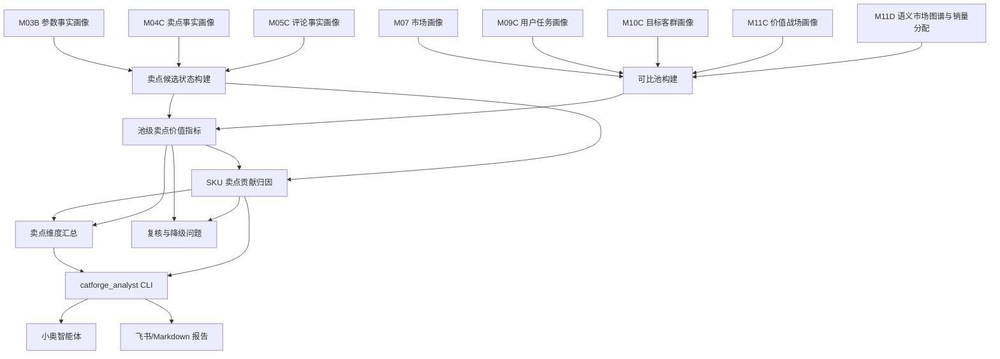

# M12C 卖点价值量化与贡献归因详细设计

## 1. 文档定位

本文是 M12C 的工程详细设计，承接：

- 需求文档：`docs/core3_mvp/real_data_v2/sop_requirements/M12C_claim_value_quantification_requirements.md`
- M03B SKU 参数事实画像。
- M04C SKU 卖点事实画像。
- M05C SKU 评论事实画像。
- M07 SKU 市场画像。
- M09C 用户任务画像。
- M10C 目标客群画像。
- M11C 价值战场画像。
- M11D 语义市场图谱与销量分配。
- `catforge_analyst` 原子能力和小奥家电市场分析专家。

M12C 的核心原则是：先在可比市场池中估算卖点组的可观测市场差异，再把 SKU 相对同池基准的超额表现解释性分摊到若干卖点。

M12C 不做严格因果推断。它输出的是可观测市场贡献估计，用于业务分析、竞品解释和机会判断。所有结果必须区分：

1. **池级卖点组差异**：有某卖点且证据成立的一组 SKU，相比同池对照组的价格、周均销量、周均销额差异。
2. **SKU 超额解释份额**：本品相对同池基准的超额表现，按卖点证据权重进行解释性分摊。

报告和智能体不得把第二类数值写成“单一卖点带来 X 元/X 台”的因果贡献。

## 2. 总体架构



## 3. 输入契约

### 3.1 SKU 基础范围

首版支持两个 population：

| population | 构成 | 用途 |
| --- | --- | --- |
| `claim_value_ready_with_comment` | M04C + M05C + M07 + M09C + M10C + M11C + M11D | 默认业务问答 |
| `claim_value_ready` | M04C + M07 + M09C + M10C + M11C + M11D | 新品、低评论 SKU 补充分析 |

如果用户问“真实用户为什么买”，默认使用 `claim_value_ready_with_comment`。如果目标 SKU 没有评论事实，允许退到 `claim_value_ready`，但必须提示“用户评论验证不足”。

### 3.2 卖点状态输入

从 M04C、M03B、M05C 组合生成 `SkuClaimState`：

| 字段 | 来源 | 说明 |
| --- | --- | --- |
| `sku_code` | M04C/M07 | SKU |
| `claim_code` | M04C | 标准卖点 |
| `claim_name` | M04C | 中文卖点名 |
| `claim_dimension` | M04C | 卖点一级维度 |
| `claim_position` | M04C | 卖点维度位置 |
| `param_support_status` | M04C/M03B | 参数支撑状态 |
| `param_support_score` | M04C/M03B | 参数支撑分 |
| `comment_support_status` | M05C | 评论支持、反证、负向或未知 |
| `comment_support_score` | M05C | 评论支撑分 |
| `positive_comment_count` | M05C | 正向评论证据数量 |
| `negative_comment_count` | M05C | 负向评论证据数量 |
| `evidence_ids` | M04C/M05C | 可追溯证据 |

### 3.3 市场状态输入

从 M07 读取 `SkuMarketState`：

| 字段 | 说明 |
| --- | --- |
| `size_tier` | 五档尺寸口径 |
| `price_band_in_size_tier` | 尺寸内五档价格带 |
| `price_wavg` | 加权均价 |
| `sales_volume_total` | 观察窗口销量 |
| `sales_amount_total` | 观察窗口销额 |
| `avg_weekly_sales_volume` | 周均销量 |
| `avg_weekly_sales_amount` | 周均销额 |
| `active_week_count` | 活跃周 |
| `main_platform` | 主平台 |
| `main_channel_type` | 主渠道 |

如果 M07 价格带与 M03B 尺寸档不一致，M12C 必须优先使用 M03B 五档尺寸口径，并记录 `size_tier_source=param_fact`。

### 3.4 语义状态输入

从 M09C/M10C/M11C/M11D 读取：

| 字段 | 说明 |
| --- | --- |
| `primary_user_task_code` | 主用户任务 |
| `secondary_user_task_codes` | 辅用户任务 |
| `primary_target_group_code` | 主目标客群 |
| `secondary_target_group_codes` | 辅目标客群 |
| `primary_battlefield_code` | 主价值战场 |
| `secondary_battlefield_codes` | 辅价值战场 |
| `opportunity_battlefield_codes` | 机会战场 |
| `drag_factor_battlefield_codes` | 拖后腿战场 |
| `semantic_allocation` | M11D 的任务/客群/战场销量分配 |
| `dimension_market_space` | M11D 的任务/客群/战场市场空间 |

## 4. 可比池设计

### 4.1 Pool Key

M12C 的核心结果都必须带 `pool_key`。

首版定义：

```text
pool_key =
  product_category
  + market_window
  + population
  + size_tier
  + price_band_group
  + context_type
  + context_code
```

其中：

| 字段 | 说明 |
| --- | --- |
| `size_tier` | 五档尺寸 |
| `price_band_group` | 同价带或相邻价带扩展 |
| `context_type` | `market_pool`、`battlefield`、`user_task`、`target_group`、`competitor_set` |
| `context_code` | 对应战场、任务、客群或候选池编码 |

### 4.2 可比池构建步骤

对每个目标 SKU、每个标准卖点、每个上下文：

1. 从同 `product_category` 和 `market_window` 中取候选 SKU。
2. 限定同 `size_tier`。
3. 限定同 `price_band_in_size_tier`。
4. 限定同 `context_type/context_code`，例如同主价值战场或同主用户任务。
5. 若样本不足，允许按顺序放宽：
   - 同价格带 -> 相邻价格带。
   - 主战场 -> 主辅战场。
   - 主任务 -> 主辅任务。
   - 主客群 -> 主辅客群。
   - 单一语义上下文 -> 尺寸价格池。
6. 每次放宽必须写入 `relaxation_path_json`。

### 4.3 样本门槛

首版建议门槛：

| 门槛 | 建议值 | 处理 |
| --- | ---: | --- |
| `min_pool_sku_count` | 8 | 低于则降级为弱估计 |
| `min_with_claim_sku_count` | 3 | 低于则不能判断正向价值 |
| `min_without_claim_sku_count` | 3 | 低于则不能稳定计算对照差异 |
| `min_active_week_count_median` | 4 | 低于则市场表现置信度降低 |
| `min_comment_supported_sku_count` | 2 | 低于则不能判用户验证普遍成立 |

样本不足时可以保留观察结果，但 `sample_status=insufficient`，`claim_value_role` 不能输出 `premium_driver_estimated`。

### 4.4 有卖点组和对照组

`with_claim` 组：

- M04C 命中该标准卖点。
- 参数支撑状态为 `supported` 或 `partial_supported`。
- 非服务履约卖点。

`strong_with_claim` 组：

- M04C 命中该标准卖点。
- 参数支撑 `supported`。
- M05C 评论支持或 M11C 主/辅战场强支撑。

`without_claim` 组：

- 未命中该标准卖点。
- 或命中但参数支撑不足。
- 或命中但被评论明显反证。

`unknown` 组：

- 数据缺失导致不能判断有无。

计算对照差异时默认使用 `strong_with_claim` 对比 `without_claim`。如果 `strong_with_claim` 样本不足，则退到 `with_claim` 并降低置信度。

## 5. 池级卖点价值指标

### 5.1 基础聚合

对每个 `claim_code + pool_key` 聚合：

```text
with_price_median
without_price_median
with_avg_weekly_sales_volume_median
without_avg_weekly_sales_volume_median
with_avg_weekly_sales_amount_median
without_avg_weekly_sales_amount_median
with_sales_volume_share
without_sales_volume_share
```

默认使用中位数减少极端 SKU 影响，同时保留均值。

### 5.2 异常处理

在池内做轻量 winsorize：

- 价格低于 P5 或高于 P95 的 SKU 不删除，但计算均值时截尾。
- 周均销量低于 P5 或高于 P95 的 SKU 不删除，但计算均值时截尾。
- 中位数不截尾。

如果池内 SKU 少于 8，不做截尾，只标记 `small_pool`。

### 5.3 核心指标公式

价格溢价：

```text
price_premium_abs = with_price_median - without_price_median
price_premium_rate = price_premium_abs / without_price_median
```

销量提升：

```text
weekly_sales_lift_abs =
  with_avg_weekly_sales_volume_median
  - without_avg_weekly_sales_volume_median

weekly_sales_lift_rate =
  weekly_sales_lift_abs / without_avg_weekly_sales_volume_median
```

销额提升：

```text
weekly_sales_amount_lift_abs =
  with_avg_weekly_sales_amount_median
  - without_avg_weekly_sales_amount_median
```

市场份额优势：

```text
market_share_lift =
  with_sales_volume_share / with_claim_sku_count
  - without_sales_volume_share / without_claim_sku_count
```

字段在数据库中可以继续沿用 `price_premium_abs` 等名称，但对 CLI、Skill、飞书报告必须使用业务别名：

| 内部字段 | 业务展示名 | 解释边界 |
| --- | --- | --- |
| `price_premium_abs` | 可比池卖点价格差异 | 有卖点组价格中位数 - 对照组价格中位数 |
| `price_premium_rate` | 可比池卖点价格差异率 | 组间价格差异率 |
| `weekly_sales_lift_abs` | 可比池卖点周均销量差异 | 有卖点组周均销量中位数 - 对照组周均销量中位数 |
| `weekly_sales_amount_lift_abs` | 可比池卖点周均销额差异 | 有卖点组周均销额中位数 - 对照组周均销额中位数 |
| `market_share_lift` | 可比池份额差异 | 组间份额优势 |

这些指标只能说明组间可观测差异。由于同池 SKU 常常同时具备多个卖点，不能把 `price_premium_abs=280` 解释成“该卖点单独值 280 元”。

### 5.4 价值强度分

将指标归一到 0-1：

```text
price_effect_score = clamp(price_premium_rate / 0.20, -1, 1)
sales_effect_score = clamp(weekly_sales_lift_rate / 0.50, -1, 1)
amount_effect_score = clamp(weekly_sales_amount_lift_rate / 0.50, -1, 1)
comment_effect_score = positive_comment_support_rate - negative_comment_rate
semantic_effect_score = share_of_primary_or_secondary_semantic_relation
```

综合：

```text
claim_value_effect_score =
  0.25 * price_effect_score
  + 0.25 * sales_effect_score
  + 0.20 * amount_effect_score
  + 0.15 * comment_effect_score
  + 0.15 * semantic_effect_score
```

如果样本不足，综合分只作为观察分，不用于高置信结论。

## 6. SKU 卖点贡献归因

### 6.1 SKU 超额表现

对目标 SKU 在某个 `pool_key` 下计算相对基准：

```text
baseline_price = pool_without_claim_or_pool_median_price
baseline_weekly_sales = pool_without_claim_or_pool_median_weekly_sales
baseline_weekly_sales_amount = pool_without_claim_or_pool_median_weekly_amount

sku_price_premium_abs = sku_price - baseline_price
sku_weekly_sales_lift_abs = sku_avg_weekly_sales_volume - baseline_weekly_sales
sku_weekly_sales_amount_lift_abs = sku_avg_weekly_sales_amount - baseline_weekly_sales_amount
```

若目标 SKU 低于基准，则该部分为负向或拖后腿，不参与正向溢价分摊。

### 6.2 候选卖点权重

对 SKU 的每个卖点计算 `claim_attribution_weight_raw`：

```text
claim_attribution_weight_raw =
  claim_value_effect_score_positive
  * claim_evidence_strength
  * semantic_support_strength
  * user_validation_factor
```

组成：

| 因子 | 来源 | 说明 |
| --- | --- | --- |
| `claim_value_effect_score_positive` | 池级指标 | 只取正向部分，负向进入风险 |
| `claim_evidence_strength` | M04C/M03B | 卖点文本和参数支撑 |
| `semantic_support_strength` | M09C/M10C/M11C | 是否支撑主战场、主任务、主客群 |
| `user_validation_factor` | M05C | 评论正向、负向或未知 |

建议权重：

```text
claim_evidence_strength =
  0.60 * param_support_score
  + 0.40 * claim_match_score

semantic_support_strength =
  max(
    battlefield_support_weight,
    user_task_support_weight,
    target_group_support_weight
  )

user_validation_factor =
  1.20 if comment positive and no strong negative
  1.00 if comment unknown but semantic/param strong
  0.60 if mixed comments
  0.20 if negative concentrated
```

### 6.3 贡献归一

对同一个 SKU、同一个 `pool_key`：

```text
claim_attribution_weight =
  claim_attribution_weight_raw / sum(raw weights of positive candidate claims)
```

估算贡献：

```text
estimated_price_premium_abs =
  max(0, sku_price_premium_abs) * claim_attribution_weight

estimated_weekly_sales_lift_abs =
  max(0, sku_weekly_sales_lift_abs) * claim_attribution_weight

estimated_weekly_sales_amount_lift_abs =
  max(0, sku_weekly_sales_amount_lift_abs) * claim_attribution_weight
```

这三个估算是解释性分摊，不是卖点真实因果贡献。

对外展示必须使用以下业务别名：

| 内部字段 | 业务展示名 | 解释边界 |
| --- | --- | --- |
| `estimated_price_premium_abs` | 本品超额价格解释份额 | 本品高于同池基准的价格差中，由该卖点参与解释的部分 |
| `estimated_weekly_sales_lift_abs` | 本品超额周均销量解释份额 | 本品高于同池基准的销量差中，由该卖点参与解释的部分 |
| `estimated_weekly_sales_amount_lift_abs` | 本品超额周均销额解释份额 | 本品高于同池基准的销额差中，由该卖点参与解释的部分 |
| `contribution_share_in_sku` | 本品超额表现解释占比 | 该卖点在本品正向候选卖点中的权重占比 |

如果目标 SKU 本身低于同池基准，则正向超额解释份额为 0，应转入机会、拖后腿或竞品拦截分析。不得为了展示正数而把负向差异取绝对值。

### 6.4 负向贡献

如果卖点存在以下情况，输出 `drag_factor`：

- 评论负向集中。
- 参数支撑不足但厂家强宣传。
- 该卖点支撑本 SKU 主战场，但 M11C 标为拖后腿战场。
- 同池竞品普遍具备且评论正向，本品缺失或弱。

负向贡献不从正向超额表现中分摊，单独输出：

```text
estimated_drag_weekly_sales_abs
estimated_drag_sales_amount_abs
drag_reason_cn
```

首版可以只输出等级和原因，不强行输出负销量。

### 6.5 高价竞品拦截与价格上探机会

当目标 SKU 的某卖点池级价格差异为负或不显著，或目标 SKU 低于同池高价 SKU 时，需要补充“高价竞品拦截/价格上探机会”分析。

候选高价竞品池：

1. 同 `size_tier`。
2. 同 `price_band_in_size_tier` 或相邻更高价格带。
3. 主/辅价值战场、用户任务、目标客群与目标 SKU 有有效重合。
4. `avg_weekly_sales_volume` 不低于同池 P25，或销额/销量处于可观察活跃水平。
5. 非服务履约卖点驱动。

对每个高价竞品计算：

```text
competitor_price_delta = competitor_price - target_price
competitor_sales_valid = competitor_avg_weekly_sales >= pool_weekly_sales_p25
claim_gap_strength =
  competitor_claim_support_strength
  - target_claim_support_strength
```

输出规则：

| 情况 | 输出标签 | 说明 |
| --- | --- | --- |
| 高价竞品有，本品缺失，且该卖点池级价格差异为正 | `high_price_competitor_intercept` | 竞品用该卖点解释更高价格或更高端心智 |
| 高价竞品有，本品也有，但竞品评论/参数/场景表达显著更强 | `weak_user_perception_claim` | 本品存在卖点，但用户感知或证据不够强 |
| 多个高价竞品反复出现同一卖点，本品缺失或弱 | `price_up_opportunity` | 可作为本品价格上探或高端表达机会 |
| 高价竞品只是具备同池普遍卖点 | `basic_threshold` | 不能作为差异化机会 |

### 6.6 组合型增值卖点

如果单个卖点的池级价格差异为负或不显著，但该卖点在高价 SKU 中反复与其他高价值卖点组合出现，需要识别为组合型增值卖点。

组合识别步骤：

1. 在同 `pool_key` 中筛选高价且有成交能力的 SKU，默认价格高于池内 P60，周均销量高于 P25。
2. 抽取这些 SKU 的正向卖点集合，只保留参数和评论至少一项成立的卖点。
3. 统计二元或三元卖点组合的出现频次和覆盖 SKU。
4. 组合内至少一个卖点有正向池级价格差异或正向销额差异。
5. 若目标 SKU 具备组合的一部分，输出 `value_bundle_claim`；若缺失关键组合卖点，输出 `price_up_opportunity`。

组合型增值卖点的自然语言必须写清楚“与哪些卖点组合后参与高端价值解释”，不能写成单点独立溢价。

## 7. 卖点价值角色判定

### 7.1 判定规则

| 角色 | 判定条件 |
| --- | --- |
| `premium_driver_estimated` | 池级价格差异为正，销额提升为正，SKU 该卖点支撑主战场/主任务/主客群，参数和评论至少一项强验证 |
| `sales_driver_estimated` | 价格溢价不显著，但周均销量或市场份额提升明显，且评论或语义支撑成立 |
| `basic_threshold` | 同池覆盖率高，具备该卖点不产生明显溢价，但缺失 SKU 表现明显弱 |
| `value_bundle_claim` | 单点价格差异不强，但在高价 SKU 的卖点组合中反复出现，并与正向卖点共同支撑高端价值 |
| `weak_user_perception_claim` | 本品具备卖点或参数，但评论支撑弱、负向明显，或弱于同池高价竞品 |
| `high_price_competitor_intercept` | 同池高价且有成交能力的竞品具备，本品缺失、表达弱或评论弱 |
| `price_up_opportunity` | 高价 SKU 反复具备且有市场价值，本品补强后可能提升高端解释空间 |
| `brand_claim_only` | 卖点文本强，参数或评论验证不足，市场效果不稳定 |
| `user_validated_need` | 评论需求强，但本品卖点或参数支撑不足 |
| `drag_factor` | 评论负向、参数不支撑或竞品强对照导致本品被削弱 |
| `opportunity_gap` | 同池强竞品具备且有正向价值，本品缺失或弱 |
| `sample_insufficient` | with/without 样本、活跃周或评论样本不足 |

`premium_driver_estimated` 必须同时满足“池级价格差异为正”和“证据成立”。如果池级价格差异为负，即使 SKU 超额价格解释份额为正，也不能展示为价格支撑卖点；应转为 `sales_driver_estimated`、`basic_threshold`、`value_bundle_claim`、`weak_user_perception_claim` 或机会/拦截分析。

### 7.2 业务展示优先级

一个 SKU 的卖点列表展示顺序：

1. `premium_driver_estimated`
2. `sales_driver_estimated`
3. `value_bundle_claim`
4. `basic_threshold`
5. `high_price_competitor_intercept`
6. `price_up_opportunity`
7. `weak_user_perception_claim`
8. `opportunity_gap`
9. `drag_factor`
10. `brand_claim_only`
11. `user_validated_need`
12. `sample_insufficient`

自然语言短答默认只讲前三个业务结论；飞书报告默认展示 Top5，并保留明显机会/拖后腿。

## 8. 数据模型

### 8.1 `core3_claim_value_context_pool`

| 字段 | 类型建议 | 说明 |
| --- | --- | --- |
| `pool_id` | text | 主键 |
| `project_id` | text | 项目 |
| `category_code` | text | 源品类 |
| `product_category` | text | 业务品类 |
| `batch_id` | text | 批次 |
| `market_window` | text | 市场窗口 |
| `analysis_population` | text | 分析 SKU 集 |
| `claim_code` | text | 标准卖点 |
| `context_type` | text | market_pool/battlefield/user_task/target_group/competitor_set |
| `context_code` | text | 上下文 code |
| `size_tier` | text | 五档尺寸 |
| `price_band_group` | text | 价格带或扩展价格带 |
| `pool_sku_count` | integer | 池内 SKU 数 |
| `with_claim_sku_count` | integer | 有卖点组 SKU 数 |
| `without_claim_sku_count` | integer | 对照组 SKU 数 |
| `unknown_claim_sku_count` | integer | 未知组 SKU 数 |
| `pool_sku_codes_json` | jsonb | 池内 SKU |
| `relaxation_path_json` | jsonb | 放宽路径 |
| `sample_status` | text | sufficient/weak/insufficient |
| `pool_hash` | text | 输入 hash |
| `rule_version` | text | 规则版本 |
| `is_current` | boolean | 当前结果 |

### 8.2 `core3_claim_value_pool_metric`

| 字段 | 类型建议 | 说明 |
| --- | --- | --- |
| `metric_id` | text | 主键 |
| `pool_id` | text | 可比池 |
| `claim_code` | text | 标准卖点 |
| `claim_name` | text | 卖点中文 |
| `with_price_median` | numeric | 有卖点组价格中位数 |
| `without_price_median` | numeric | 对照组价格中位数 |
| `price_premium_abs` | numeric | 可比池卖点价格差异金额 |
| `price_premium_rate` | numeric | 可比池卖点价格差异率 |
| `with_weekly_sales_median` | numeric | 有卖点组周均销量中位数 |
| `without_weekly_sales_median` | numeric | 对照组周均销量中位数 |
| `weekly_sales_lift_abs` | numeric | 周均销量优势 |
| `weekly_sales_lift_rate` | numeric | 周均销量优势率 |
| `weekly_sales_amount_lift_abs` | numeric | 周均销额优势 |
| `market_share_lift` | numeric | 池内市场份额优势 |
| `claim_value_effect_score` | numeric | 综合价值效果分 |
| `effect_confidence` | numeric | 置信度 |
| `business_summary_cn` | text | 中文解释 |
| `quality_flags_json` | jsonb | 样本、异常和降级标记 |
| `result_hash` | text | 结果 hash |

对外输出时，`price_premium_abs` 必须显示为“可比池卖点价格差异”，`weekly_sales_lift_abs` 必须显示为“可比池卖点周均销量差异”。字段名可以在 debug 模式出现，业务模式不得直接展示。

### 8.3 `core3_sku_claim_value_quantification`

| 字段 | 类型建议 | 说明 |
| --- | --- | --- |
| `sku_claim_value_id` | text | 主键 |
| `pool_id` | text | 可比池 |
| `sku_code` | text | SKU |
| `brand_name` | text | 品牌 |
| `model_name` | text | 型号 |
| `claim_code` | text | 标准卖点 |
| `claim_name` | text | 中文卖点 |
| `claim_value_role` | text | 卖点价值角色 |
| `claim_evidence_strength` | numeric | 卖点证据强度 |
| `param_support_strength` | numeric | 参数支撑强度 |
| `comment_support_strength` | numeric | 评论支撑强度 |
| `semantic_support_strength` | numeric | 语义支撑强度 |
| `estimated_price_premium_abs` | numeric | 本品超额价格解释份额 |
| `estimated_weekly_sales_lift_abs` | numeric | 本品超额周均销量解释份额 |
| `estimated_weekly_sales_amount_lift_abs` | numeric | 本品超额周均销额解释份额 |
| `contribution_share_in_sku` | numeric | SKU 超额表现解释份额 |
| `attribution_confidence` | numeric | 归因置信度 |
| `supporting_dimensions_json` | jsonb | 支撑的战场/任务/客群 |
| `evidence_ids_json` | jsonb | 证据 |
| `reason_cn` | text | 中文解释 |
| `quality_flags_json` | jsonb | 降级、样本、异常 |
| `rule_version` | text | 规则版本 |
| `is_current` | boolean | 当前结果 |

对外输出时，`estimated_price_premium_abs` 必须显示为“本品超额价格解释份额”，`estimated_weekly_sales_lift_abs` 必须显示为“本品超额周均销量解释份额”。业务模式不得显示为“卖点加价金额”。

建议新增或派生以下展示字段：

| 字段 | 类型建议 | 说明 |
| --- | --- | --- |
| `business_value_label` | text | 强溢价卖点/强销量卖点/基础门槛/组合型增值/用户感知不足/高价竞品拦截/价格上探机会 |
| `business_value_meaning_cn` | text | 业务类型含义 |
| `pool_claim_price_delta_abs` | numeric | 对外展示的可比池卖点价格差异 |
| `pool_claim_weekly_sales_delta_abs` | numeric | 对外展示的可比池卖点销量差异 |
| `sku_excess_price_explained_abs` | numeric | 对外展示的本品超额价格解释份额 |
| `sku_excess_weekly_sales_explained_abs` | numeric | 对外展示的本品超额销量解释份额 |
| `bundle_claims_json` | jsonb | 组合型增值时依赖的卖点组合 |
| `intercept_competitor_skus_json` | jsonb | 高价竞品拦截时的代表 SKU |

### 8.4 `core3_sku_claim_contribution_attribution`

| 字段 | 类型建议 | 说明 |
| --- | --- | --- |
| `attribution_id` | text | 主键 |
| `sku_code` | text | SKU |
| `context_type` | text | 上下文 |
| `context_code` | text | 上下文 code |
| `pool_id` | text | 可比池 |
| `baseline_price` | numeric | 基准价格 |
| `baseline_weekly_sales_volume` | numeric | 基准周均销量 |
| `baseline_weekly_sales_amount` | numeric | 基准周均销额 |
| `sku_price_premium_abs` | numeric | SKU 相对基准价格差 |
| `sku_weekly_sales_lift_abs` | numeric | SKU 相对基准销量差 |
| `sku_weekly_sales_amount_lift_abs` | numeric | SKU 相对基准销额差 |
| `positive_claims_json` | jsonb | 正向贡献卖点 |
| `drag_claims_json` | jsonb | 拖后腿卖点 |
| `opportunity_claims_json` | jsonb | 机会缺口卖点 |
| `attribution_summary_cn` | text | 中文归因摘要 |
| `confidence` | numeric | 整体置信度 |

### 8.5 `core3_claim_value_dimension_summary`

| 字段 | 类型建议 | 说明 |
| --- | --- | --- |
| `summary_id` | text | 主键 |
| `claim_code` | text | 卖点 |
| `dimension_type` | text | battlefield/user_task/target_group/market_pool |
| `dimension_code` | text | 维度 code |
| `dimension_name` | text | 中文名 |
| `size_tier` | text | 尺寸档 |
| `price_band_group` | text | 价格带 |
| `sku_count` | integer | 覆盖 SKU 数 |
| `premium_driver_sku_count` | integer | 溢价卖点 SKU 数 |
| `sales_driver_sku_count` | integer | 销量卖点 SKU 数 |
| `basic_threshold_sku_count` | integer | 基础门槛 SKU 数 |
| `drag_factor_sku_count` | integer | 拖后腿 SKU 数 |
| `opportunity_gap_sku_count` | integer | 机会缺口 SKU 数 |
| `estimated_sales_volume` | numeric | 维度相关销量空间 |
| `estimated_avg_weekly_sales_volume` | numeric | 周均销量空间 |
| `top_skus_json` | jsonb | 代表 SKU |
| `business_summary_cn` | text | 中文总结 |

### 8.6 `core3_claim_value_review_issue`

| 字段 | 类型建议 | 说明 |
| --- | --- | --- |
| `issue_id` | text | 主键 |
| `issue_scope` | text | sku/claim/pool/context |
| `sku_code` | text | 可空 |
| `claim_code` | text | 可空 |
| `pool_id` | text | 可空 |
| `issue_code` | text | 问题 code |
| `issue_level` | text | info/warning/blocker |
| `issue_cn` | text | 中文问题 |
| `recommended_action_cn` | text | 建议 |
| `resolved_status` | text | open/resolved/ignored |

## 9. 处理流程

### 9.1 批处理入口

建议 CLI：

```bash
python -m app.cli.catforge_pipeline run-claim-value-quantification \
  --project-id core3 \
  --category-code TV \
  --product-category tv \
  --batch-id latest \
  --market-window full_observed_window \
  --analysis-population claim_value_ready_with_comment
```

也可以纳入 `catforge_pipeline run-all-semantic-analysis` 的后续步骤，但首版建议独立执行，方便复核口径。

### 9.2 批处理步骤

1. 解析 batch、品类、market_window、analysis_population。
2. 加载 eligible SKU。
3. 构建每个 SKU 的 `SkuClaimState`。
4. 构建每个 SKU 的 `SkuMarketState`。
5. 构建语义状态和 M11D 图谱空间。
6. 枚举 `claim_code + context_type/context_code + size_tier/price_band`。
7. 构建可比池并写 `core3_claim_value_context_pool`。
8. 计算池级卖点价值指标并写 `core3_claim_value_pool_metric`。
9. 对每个 SKU 做卖点角色判断并写 `core3_sku_claim_value_quantification`。
10. 对每个 SKU 做超额表现分摊并写 `core3_sku_claim_contribution_attribution`。
11. 聚合卖点维度汇总并写 `core3_claim_value_dimension_summary`。
12. 写 review issue。
13. 写批次 summary 和 hash。

## 10. CLI 查询设计

### 10.1 统一 CLI 约定

M12C 查询能力统一放在 `catforge_analyst` 下，由 `catforge_analyst ask` 做自然语言路由，原子 CLI 负责稳定输出。

所有 M12C CLI 都必须支持：

| 参数 | 必填 | 默认值 | 说明 |
| --- | --- | --- | --- |
| `--project-id` | 否 | 当前配置 | 项目 ID |
| `--category-code` | 否 | `TV` | 源品类 |
| `--product-category` | 否 | `tv` | 业务品类 |
| `--batch-id` | 否 | `latest` | 批次 |
| `--market-window` | 否 | `full_observed_window` | 市场窗口 |
| `--analysis-population` | 否 | `claim_value_ready_with_comment` | 分析 SKU 集 |
| `--format` | 否 | `text` | `text` 或 `json` |
| `--top-n` | 否 | `5` | 报告默认展示数量；短答可由 Skill 压缩为 3 |
| `--debug` | 否 | `false` | 是否暴露技术字段 |
| `--include-business-labels` | 否 | `true` | 是否输出业务类型和业务含义 |
| `--include-intercept-opportunities` | 否 | `true` | 是否输出高价竞品拦截和价格上探机会 |

统一 JSON 外壳：

```json
{
  "status": "ok",
  "question_type": "claim_contribution",
  "result": {},
  "business_answer": {
    "short_answer_cn": "",
    "key_findings": [],
    "limitations": [],
    "report_payload": {}
  },
  "data_scope": {
    "batch_id": "",
    "market_window": "",
    "analysis_population": "",
    "sample_status": ""
  }
}
```

状态码：

| status | 含义 | 用户侧处理 |
| --- | --- | --- |
| `ok` | 成功 | 输出业务结论 |
| `not_found` | SKU、卖点或维度不存在 | 给出可选搜索建议 |
| `ambiguous` | SKU 或卖点匹配多个候选 | 要求二次选择 |
| `insufficient_data` | 数据不足，不能稳定量化 | 输出限制和可观察事实 |
| `not_supported` | 当前品类或层级尚未支持 | 说明边界，不套用其他品类 |
| `error` | 程序错误 | 输出简短失败信息，debug 模式给技术信息 |

### 10.2 `claim-value-space`

用途：查询某卖点在某市场池、价值战场、用户任务或目标客群中的价值表现。

命令：

```bash
catforge_analyst claim-value-space \
  --claim "MiniLED" \
  --dimension-type battlefield \
  --dimension "高端画质升级" \
  --size-tier large_60_69 \
  --price-band mid_high \
  --format json
```

专属参数：

| 参数 | 必填 | 说明 |
| --- | --- | --- |
| `--claim` 或 `--claim-code` | 是 | 卖点名称或标准卖点 code |
| `--dimension-type` | 否 | `market_pool`、`battlefield`、`user_task`、`target_group` |
| `--dimension` 或 `--dimension-code` | 否 | 战场、任务、客群名称或 code |
| `--size-tier` | 否 | 五档尺寸 |
| `--price-band` | 否 | 尺寸内价格带 |
| `--include-relaxed-pool` | 否 | 是否允许样本不足时展示放宽池 |

`result` 结构：

```json
{
  "claim": {"claim_code": "", "claim_name": ""},
  "context": {"dimension_type": "", "dimension_code": "", "dimension_name": "", "size_tier": "", "price_band": ""},
  "pool": {
    "pool_sku_count": 0,
    "with_claim_sku_count": 0,
    "without_claim_sku_count": 0,
    "sample_status": "",
    "relaxation_path": []
  },
  "market_effect": {
    "price_premium_abs": 0,
    "price_premium_rate": 0,
    "weekly_sales_lift_abs": 0,
    "weekly_sales_amount_lift_abs": 0,
    "market_share_lift": 0,
    "effect_confidence": 0
  },
  "business_effect": {
    "pool_claim_price_delta_abs": 0,
    "pool_claim_weekly_sales_delta_abs": 0,
    "pool_claim_weekly_sales_amount_delta_abs": 0,
    "display_caution_cn": ""
  },
  "representative_skus": {"with_claim": [], "without_claim": []}
}
```

业务短答要点：

- 先说这个卖点在该池中是否具备可观测价值。
- 再说价格溢价、周均销量优势、周均销额优势。
- 最后说明样本是否足够。

### 10.3 `sku-claim-value`

用途：查询某 SKU 的全部卖点价值量化。

命令：

```bash
catforge_analyst sku-claim-value \
  --sku "海信 65E7Q" \
  --context-type battlefield \
  --context "高端画质升级" \
  --format json
```

专属参数：

| 参数 | 必填 | 说明 |
| --- | --- | --- |
| `--sku` 或 `--sku-code` | 是 | SKU、型号或品牌型号 |
| `--context-type` | 否 | `market_pool`、`battlefield`、`user_task`、`target_group` |
| `--context` 或 `--context-code` | 否 | 指定分析上下文 |
| `--role` | 否 | 过滤 `premium_driver_estimated`、`sales_driver_estimated` 等 |

`result` 结构：

```json
{
  "sku": {"sku_code": "", "brand_name": "", "model_name": ""},
  "context": {},
  "claim_roles": {
    "premium_drivers": [],
    "sales_drivers": [],
    "basic_thresholds": [],
    "brand_claim_only": [],
    "opportunity_gaps": [],
    "drag_factors": [],
    "sample_insufficient": []
  },
  "claim_details": [
    {
      "claim_code": "",
      "claim_name": "",
      "claim_value_role": "",
      "business_value_label": "",
      "business_value_meaning_cn": "",
      "pool_claim_price_delta_abs": 0,
      "pool_claim_weekly_sales_delta_abs": 0,
      "sku_excess_price_explained_abs": 0,
      "sku_excess_weekly_sales_explained_abs": 0,
      "estimated_price_premium_abs": 0,
      "estimated_weekly_sales_lift_abs": 0,
      "estimated_weekly_sales_amount_lift_abs": 0,
      "param_support_strength": 0,
      "comment_support_strength": 0,
      "semantic_support_strength": 0,
      "attribution_confidence": 0,
      "reason_cn": ""
    }
  ]
}
```

### 10.4 `claim-contribution`

用途：回答“某 SKU 卖得好，哪些卖点贡献最大”。

命令：

```bash
catforge_analyst claim-contribution \
  --sku "海信 65E7Q" \
  --context-type battlefield \
  --context "高端画质升级" \
  --top-n 5 \
  --format json
```

专属参数：

| 参数 | 必填 | 说明 |
| --- | --- | --- |
| `--sku` 或 `--sku-code` | 是 | 目标 SKU |
| `--context-type` | 否 | 默认优先主价值战场 |
| `--context` 或 `--context-code` | 否 | 指定战场、任务、客群或市场池 |
| `--include-drag` | 否 | 是否同时输出拖后腿卖点 |
| `--include-opportunity` | 否 | 是否同时输出机会缺口 |

`result` 结构：

```json
{
  "sku": {},
  "baseline": {
    "pool_name": "",
    "baseline_price": 0,
    "baseline_weekly_sales_volume": 0,
    "baseline_weekly_sales_amount": 0
  },
  "sku_excess_performance": {
    "sku_price_premium_abs": 0,
    "sku_weekly_sales_lift_abs": 0,
    "sku_weekly_sales_amount_lift_abs": 0
  },
  "top_contributing_claims": [],
  "value_bundle_claims": [],
  "high_price_competitor_intercepts": [],
  "price_up_opportunities": [],
  "drag_claims": [],
  "opportunity_claims": [],
  "attribution_summary_cn": "",
  "confidence": 0
}
```

业务短答模板：

```text
结论：本品当前 Top5 卖点价值分为 A、B、C、D、E：其中 A/B 是更强的价格或销量支撑，C 是组合型增值，D 是基础门槛，E 是高价竞品拦截或价格上探机会。

A 在{可比池}中，有卖点组相对对照组价格差异约 X 元，并支撑本品的{主战场/主任务/主客群}。
B 更偏销量卖点，价格差异不显著，但有卖点组对应周均销量差异约 Y 台。
C 单点不构成独立溢价，但与{卖点组合}共同支撑高端价值解释。
D 是基础门槛，用户默认期待，缺失会拖累成交，但不应单独包装成高溢价。
E 来自同池高价竞品，本品缺失、表达弱或评论感知弱，适合作为上探机会。

以上是可观测贡献估计，不代表严格因果。
```

### 10.5 `claim-opportunity-gaps`

用途：查询本品相对竞品或可比池缺哪些有市场价值的卖点。

命令：

```bash
catforge_analyst claim-opportunity-gaps \
  --sku "海信 65E7Q" \
  --competitor "创维 65A7H PRO" \
  --format json
```

专属参数：

| 参数 | 必填 | 说明 |
| --- | --- | --- |
| `--sku` 或 `--sku-code` | 是 | 目标 SKU |
| `--competitor` 或 `--competitor-sku-code` | 否 | 指定竞品；为空则使用当前竞品集 |
| `--competitor-set-source` | 否 | `existing_competitor_set` 或 `same_pool_top_skus` |
| `--context-type` | 否 | 指定战场/任务/客群 |
| `--min-opportunity-score` | 否 | 机会阈值 |

`result` 结构：

```json
{
  "sku": {},
  "competitors": [],
  "opportunity_gaps": [
    {
      "claim_code": "",
      "claim_name": "",
      "competitor_support": "",
      "target_support": "",
      "market_effect": {},
      "related_dimensions": [],
      "opportunity_priority": "high|medium|low",
      "reason_cn": ""
    }
  ],
  "not_actionable_claims": []
}
```

业务回答必须区分：

- 竞品有、本品没有，且该卖点在同池有价值。
- 竞品有、本品也有，但竞品评论或场景表达更强。
- 竞品有，但该卖点只是基础门槛，不建议作为机会重点。

### 10.6 `claim-value-compare`

用途：比较本品和一个或多个竞品在核心卖点上的价值差异。

命令：

```bash
catforge_analyst claim-value-compare \
  --sku "海信 65E7Q" \
  --competitor "创维 65A7H PRO" \
  --competitor "TCL 65Q9L PRO" \
  --format json
```

专属参数：

| 参数 | 必填 | 说明 |
| --- | --- | --- |
| `--sku` 或 `--sku-code` | 是 | 目标 SKU |
| `--competitor` 或 `--competitor-sku-code` | 是 | 可重复，最多默认 3 个 |
| `--claim` 或 `--claim-code` | 否 | 限定某些卖点 |
| `--context-type` | 否 | 默认使用主价值战场和共同竞品池 |
| `--explain-delta` | 否 | 是否输出价差/销量差解释 |

`result` 结构：

```json
{
  "target_sku": {},
  "competitor_skus": [],
  "comparison_matrix": [
    {
      "claim_code": "",
      "claim_name": "",
      "target_role": "",
      "competitor_roles": {},
      "target_business_value_label": "",
      "competitor_business_value_labels": {},
      "pool_claim_price_delta_abs": 0,
      "pool_claim_weekly_sales_delta_abs": 0,
      "target_sku_excess_price_explained_abs": 0,
      "pair_price_delta_explained_abs": {},
      "pair_weekly_sales_delta_explained_abs": {},
      "explanation_role": "target_advantage|competitor_intercept|shared_threshold|not_decisive",
      "reason_cn": ""
    }
  ],
  "summary_cn": ""
}
```

`claim-value-compare` 是回答“本品比某竞品贵多少、销量高多少，哪些卖点能解释”的主入口。判断规则：

- 如果本品和竞品都有同一卖点，只有本品在参数强度、评论验证、语义支撑或市场效果上更强，才能解释本品价差。
- 如果双方都有且强度相近，该卖点应标为共同门槛，不解释价差。
- 如果竞品有且市场价值强，本品缺失或弱，该卖点是竞品拦截或本品机会缺口。
- 如果卖点只有厂家表达，没有评论或市场验证，不能用于解释价差。

### 10.7 `catforge_analyst ask` 路由

自然语言入口必须优先解析三类对象：

1. SKU：型号、品牌型号、sku_code。
2. 卖点：卖点名称、同义词、标准卖点 code。
3. 对比对象：竞品、价值战场、用户任务、目标客群、尺寸价格池。

路由表：

| 用户问法 | 主 CLI | 组合 CLI |
| --- | --- | --- |
| “某 SKU 哪些卖点是溢价卖点” | `sku-claim-value` | `claim-contribution` |
| “某 SKU 卖得好靠什么卖点” | `claim-contribution` | `sku-claim-value` |
| “某卖点在某池里值多少钱” | `claim-value-space` | 无 |
| “某 SKU 比竞品贵在哪里” | `claim-value-compare` | `claim-contribution` |
| “竞品靠哪些卖点拦截本品” | `claim-value-compare` | `claim-opportunity-gaps` |
| “本品怎么扩大销量” | `claim-opportunity-gaps` | `claim-contribution`、`claim-value-space` |
| “某卖点是不是基础门槛” | `claim-value-space` | `sku-claim-value` |

歧义处理：

- 多个 SKU 命中：返回候选列表，要求二次选择。
- 多个卖点命中：返回候选卖点，例如 MiniLED、高亮 HDR、精细分区控光。
- 指定 AC 但 AC 卖点或评论 taxonomy 未发布：返回 `not_supported`，不得套用 TV taxonomy。

## 11. Skill 与智能体设计

### 11.1 Skill 文件职责

M12C 完成后需要更新两个 Skill。

| Skill | 文件 | 职责 |
| --- | --- | --- |
| `catforge-insight` | `tools/claude/skills/catforge-insight/SKILL.md` | 遇到卖点价值、卖点贡献、值多少钱等问题时转交 `catforge_analyst`，不虚构未实现的 insight 命令 |
| `xiaoao-home-appliance-market-analysis` | `tools/openclaw/skills/xiaoao-home-appliance-market-analysis/SKILL.md` | 规定小奥如何调用 M12C 原子能力并组织卖点价值分析答案 |

### 11.2 Skill 路由规则

Skill 必须把用户问题转成以下 SOP。

#### SOP A：某 SKU 哪些卖点是溢价卖点

1. 调 `sku-claim-value` 获取卖点角色。
2. 调 `claim-contribution` 获取超额表现拆解。
3. 只在短答中讲前三个核心卖点。
4. 对每个卖点说明：支撑哪个战场、任务、客群；价格溢价或销量优势；置信度。
5. 如果生成报告，附飞书链接。

#### SOP B：某卖点值多少钱

1. 调 `claim-value-space`。
2. 必须确认上下文：尺寸、价格带、战场/任务/客群。
3. 样本不足时只讲观察，不给强结论。
4. 输出价格溢价、周均销量优势、周均销额优势。

#### SOP C：本品比竞品贵在哪里

1. 调 `claim-value-compare`。
2. 若没有指定竞品，先调用现有竞品 SOP 获取前三竞品。
3. 区分本品优势、竞品拦截、共同门槛、不构成差异的卖点。
4. 不能把双方都有且强度相近的卖点写成价差支撑。

#### SOP D：怎么扩大销量

1. 调 `claim-contribution` 看当前正向卖点。
2. 调 `claim-opportunity-gaps` 看竞品有价值卖点。
3. 调 `claim-value-space` 验证机会卖点所在池空间。
4. 输出机会优先级：高价值且本品弱、客群/战场匹配、样本可靠的优先。

### 11.3 小奥回答结构

默认短答控制在 600 字以内：

```text
结论：
本品当前最有价值的卖点建议看 A、B、C。A 是强溢价卖点，B 是强销量卖点，C 是高价竞品拦截或价格上探机会。

分析：
A 在{可比池}中，有卖点组相对对照组价格差异约 X 元，并支撑{主战场/主任务/主客群}。
B 价格差异不明显，但有卖点组对应周均销量差异约 Y 台，适合解释成交规模。
C 来自同池高价竞品或高价卖点组合，本品缺失、表达弱或评论感知弱，适合作为上探机会。

限制：
以上是可观测贡献估计；详细分析见飞书报告链接。
```

禁止回答：

- “A 卖点导致销量增加 X 台。”
- “A 卖点绝对值 X 元。”
- “所有 SKU 的 A 卖点平均值多少钱。”
- “服务好所以产品可以溢价。”
- “空调用彩电卖点规则判断。”

### 11.4 飞书报告集成

现有竞品报告应新增独立章节：`卖点价值量化`。该章节不能并入“卖点画像”；“卖点画像”只展示事实，“卖点价值量化”展示价值估计和机会判断。

章节结构：

1. **本品卖点价值结论**：Top5 卖点价值，区分强溢价、强销量、基础门槛、组合型增值、用户感知不足、高价竞品拦截和价格上探机会。
2. **四款产品卖点价值横向对比**：横轴为本品和前三竞品，纵轴为比较内容，放在具体产品画像之前。
3. **本品卖点价值拆解**：卖点、业务类型、业务含义、可比池卖点价格差异、可比池卖点销量差异、本品超额解释份额、值钱的市场、业务解释。
4. **每个竞品卖点价值拆解**：按同样口径展示前三竞品。
5. **卖点-战场-任务-客群证据表**：说明卖点支撑哪些业务维度。
6. **高价竞品拦截和价格上探机会**：同池高价 SKU 的有价值卖点、本品缺失或弱的点、代表 SKU。
7. **组合型增值卖点和用户感知不足**：说明哪些卖点需要与其他卖点组合表达，哪些卖点存在但评论/场景感知弱。
8. **样本和口径限制**：可比池、样本数、是否放宽、是否评论不足。

四款产品横向对比建议包含以下子表：

1. 市场画像对比。
2. 价值战场画像对比。
3. 用户任务画像对比。
4. 目标客群画像对比。
5. 卖点画像事实对比。
6. 参数画像事实对比。
7. 卖点价值量化对比。

卖点价值量化表头：

| 排名 | 卖点 | 业务类型 | 业务含义 | 可比池卖点价格差异 | 可比池卖点销量差异 | 本品超额价格解释份额 | 本品超额销量解释份额 | 值钱的市场 | 业务解释 |
| --- | --- | --- | --- | --- | --- | --- | --- | --- | --- |

飞书正文不得展示内部表名、rule version、JSON 字段和代码枚举；必要时用业务中文替代，例如：

| 内部角色 | 飞书展示 |
| --- | --- |
| `premium_driver_estimated` | 强溢价卖点 |
| `sales_driver_estimated` | 强销量卖点 |
| `basic_threshold` | 基础门槛卖点 |
| `value_bundle_claim` | 组合型增值卖点 |
| `weak_user_perception_claim` | 用户感知不足卖点 |
| `high_price_competitor_intercept` | 高价竞品拦截卖点 |
| `price_up_opportunity` | 价格上探机会卖点 |
| `brand_claim_only` | 厂家主张，市场验证不足 |
| `drag_factor` | 拖后腿卖点 |
| `opportunity_gap` | 机会缺口 |
| `sample_insufficient` | 样本不足 |

卖点价值量化表下方必须放置口径备注：

```text
说明：可比池卖点价格差异/销量差异是有卖点组与对照组的可观测差异，不是单一卖点因果贡献。本品超额解释份额是把本品高于同池基准的价格、销量、销额表现按卖点证据权重做解释性分摊，不能理解为“一个卖点单独增加 X 元或 X 台/周”。同池 SKU 往往同时具备多个卖点，数值用于排序、解释和发现机会。
```

## 12. 测试设计

### 12.1 单元测试

必须覆盖：

1. 可比池构建优先级。
2. 样本不足降级。
3. with/without 组计算。
4. 价格溢价、销量提升、销额提升公式。
5. SKU 正向贡献分摊。
6. 负向卖点不进入正向分摊。
7. 服务履约不进入产品溢价。
8. 缺失不当成否定。
9. 同一 SKU 多视角贡献不相加。
10. 中文回答不暴露内部字段。
11. 池级价格差异为负时，不输出 `premium_driver_estimated`。
12. SKU 超额解释份额不被展示为单卖点因果金额。
13. 组合型增值卖点必须带 `bundle_claims_json` 或业务解释。
14. 高价竞品拦截必须带代表竞品 SKU 和同池可比原因。

### 12.2 集成测试

至少构造以下场景：

| 场景 | 预期 |
| --- | --- |
| MiniLED 在高端画质池中有足够样本且价格更高 | 输出 `premium_driver_estimated` |
| 高刷在游戏体育池中销量优势明显但价格溢价弱 | 输出 `sales_driver_estimated` |
| 4K 在同池普遍具备 | 输出 `basic_threshold` |
| 厂家宣传智能但评论负向 | 输出 `drag_factor` 或 `brand_claim_only` |
| 竞品有护眼且市场表现好，本品缺失 | 输出 `opportunity_gap` |
| with_claim 样本只有 1 个 | 输出 `sample_insufficient` |
| 某卖点池级价格差异为负但销量差异为正 | 输出 `sales_driver_estimated`，不得输出 `premium_driver_estimated` |
| 本品超额价格为正但该卖点池级价格差异为负 | 不展示为价格支撑卖点 |
| 高价竞品反复具备某卖点组合，本品只具备其中一部分 | 输出 `value_bundle_claim` 或 `price_up_opportunity` |
| 本品具备卖点但评论支撑弱于高价竞品 | 输出 `weak_user_perception_claim` |
| 飞书报告生成卖点价值表 | 表头包含业务类型、业务含义、可比池差异、本品超额解释份额和口径备注 |

### 12.3 验收样例

首版验收建议选择：

- 海信 65E7Q。
- 创维 65A7H PRO。
- TCL 65Q9L PRO。
- 创维 65A6F ULTRA。

需要能回答：

1. 海信 65E7Q 的 Top5 卖点价值是什么，哪些是溢价、销量、基础门槛、组合增值或机会。
2. 创维 65A7H PRO 对海信形成压力的卖点是什么。
3. TCL 65Q9L PRO 是配置对标还是卖点价值替代。
4. 创维 65A6F ULTRA 的低价分流是否由基础门槛卖点支撑。
5. 哪些卖点在该 65 寸高价池中只是门槛，不应作为溢价宣传。
6. 海信 65E7Q 与前三竞品的卖点价值横向对比是否能解释竞品拦截点。
7. 当报告展示“+X 元/+Y 台/周”时，是否清楚区分可比池差异和本品超额解释份额。

## 13. 性能和运行要求

M12C 不调用外部 LLM，应该可以批量运行。

性能策略：

1. 按 `product_category + batch_id + market_window` 一次性加载基础画像。
2. 先构建内存中的 SKU 状态索引，再批量计算 pool。
3. pool 结果去重，多个 SKU 共享同一个 `claim_code + pool_key` 指标。
4. 写入使用批量 upsert，并用 `is_current` 标记当前版本。
5. 支持 `--sku-codes` 小范围重算和 `--claim-codes` 单卖点重算。

预计 TV 当前 100-300 个 SKU 规模可以秒级到分钟级完成。后续扩展到数千 SKU 时，需要把 pool 聚合下推到 SQL。

## 14. 增量重算

以下变化必须触发重算：

| 变化 | 重算范围 |
| --- | --- |
| M04C 卖点事实变化 | 相关 SKU 和相关 claim 的 pool |
| M05C 评论事实变化 | 相关 SKU 的 claim value 和相关 pool 的评论因子 |
| M07 市场画像变化 | 同 batch 全量 pool metric 和 SKU attribution |
| M09C/M10C/M11C 画像变化 | 相关语义上下文 pool 和 SKU attribution |
| M11D 图谱变化 | 相关维度 summary 和上下文 pool |
| claim taxonomy 变化 | 相关品类全量重算 |
| 规则版本变化 | 全量重算 |

## 15. 风险和降级

| 风险 | 处理 |
| --- | --- |
| 样本少 | 标记 `sample_insufficient`，只做观察 |
| 卖点高度共线 | 输出组合贡献，不强拆单个卖点 |
| 品牌力影响无法完全控制 | 在解释中说明品牌和渠道未完全隔离 |
| 促销资源缺失 | 不把短期销量异常直接归因给卖点 |
| 评论不足 | 降级为参数/厂家表达成立，用户验证不足 |
| 价格带内 SKU 差异仍大 | 输出可比池放宽路径和置信度 |
| 服务卖点混入 | 服务隔离，不进入产品溢价 |

## 16. 首版实现顺序

建议分四步实现：

1. **结果模型和批处理骨架**：新增表、repository、service、pipeline CLI。
2. **池级卖点价值指标**：先实现 `claim-value-space` 和 pool metric。
3. **SKU 卖点贡献归因**：实现 `sku-claim-value` 和 `claim-contribution`。
4. **竞品和报告集成**：实现 `claim-opportunity-gaps`、`claim-value-compare`，接入小奥 Skill 和飞书报告。

每一步都必须有测试，不依赖外部 LLM。
