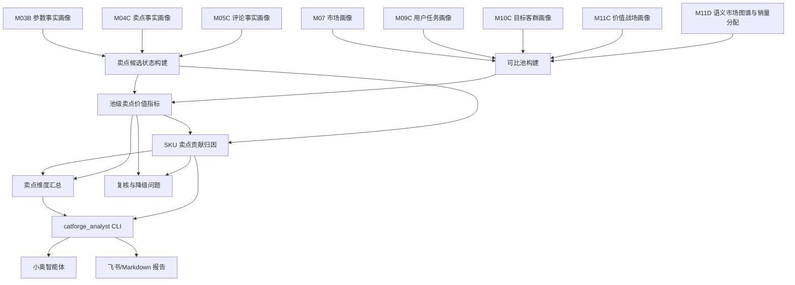

# M12C 卖点价值量化与贡献归因详细设计

## 1. 文档定位

本文是 M12C 的工程详细设计，承接：

- 需求文档：`docs/core3_mvp/real_data_v2/sop_requirements/M12C_claim_value_quantification_requirements.md`
- M03B SKU 参数事实画像。
- M04C SKU 卖点事实画像。
- M05C SKU 评论事实画像。
- M07 SKU 市场画像。
- M09C 用户任务画像。
- M10C 目标客群画像。
- M11C 价值战场画像。
- M11D 语义市场图谱与销量分配。
- `catforge_analyst` 原子能力和小奥家电市场分析专家。

M12C 的核心原则是：先在可比市场池中估算卖点的可观测市场价值，再把 SKU 相对同池基准的超额表现解释性分摊到若干卖点。

M12C 不做严格因果推断。它输出的是可观测市场贡献估计，用于业务分析、竞品解释和机会判断。

## 2. 总体架构



## 3. 输入契约

### 3.1 SKU 基础范围

首版支持两个 population：

| population | 构成 | 用途 |
| --- | --- | --- |
| `claim_value_ready_with_comment` | M04C + M05C + M07 + M09C + M10C + M11C + M11D | 默认业务问答 |
| `claim_value_ready` | M04C + M07 + M09C + M10C + M11C + M11D | 新品、低评论 SKU 补充分析 |

如果用户问“真实用户为什么买”，默认使用 `claim_value_ready_with_comment`。如果目标 SKU 没有评论事实，允许退到 `claim_value_ready`，但必须提示“用户评论验证不足”。

### 3.2 卖点状态输入

从 M04C、M03B、M05C 组合生成 `SkuClaimState`：

| 字段 | 来源 | 说明 |
| --- | --- | --- |
| `sku_code` | M04C/M07 | SKU |
| `claim_code` | M04C | 标准卖点 |
| `claim_name` | M04C | 中文卖点名 |
| `claim_dimension` | M04C | 卖点一级维度 |
| `claim_position` | M04C | 卖点维度位置 |
| `param_support_status` | M04C/M03B | 参数支撑状态 |
| `param_support_score` | M04C/M03B | 参数支撑分 |
| `comment_support_status` | M05C | 评论支持、反证、负向或未知 |
| `comment_support_score` | M05C | 评论支撑分 |
| `positive_comment_count` | M05C | 正向评论证据数量 |
| `negative_comment_count` | M05C | 负向评论证据数量 |
| `evidence_ids` | M04C/M05C | 可追溯证据 |

### 3.3 市场状态输入

从 M07 读取 `SkuMarketState`：

| 字段 | 说明 |
| --- | --- |
| `size_tier` | 五档尺寸口径 |
| `price_band_in_size_tier` | 尺寸内五档价格带 |
| `price_wavg` | 加权均价 |
| `sales_volume_total` | 观察窗口销量 |
| `sales_amount_total` | 观察窗口销额 |
| `avg_weekly_sales_volume` | 周均销量 |
| `avg_weekly_sales_amount` | 周均销额 |
| `active_week_count` | 活跃周 |
| `main_platform` | 主平台 |
| `main_channel_type` | 主渠道 |

如果 M07 价格带与 M03B 尺寸档不一致，M12C 必须优先使用 M03B 五档尺寸口径，并记录 `size_tier_source=param_fact`。

### 3.4 语义状态输入

从 M09C/M10C/M11C/M11D 读取：

| 字段 | 说明 |
| --- | --- |
| `primary_user_task_code` | 主用户任务 |
| `secondary_user_task_codes` | 辅用户任务 |
| `primary_target_group_code` | 主目标客群 |
| `secondary_target_group_codes` | 辅目标客群 |
| `primary_battlefield_code` | 主价值战场 |
| `secondary_battlefield_codes` | 辅价值战场 |
| `opportunity_battlefield_codes` | 机会战场 |
| `drag_factor_battlefield_codes` | 拖后腿战场 |
| `semantic_allocation` | M11D 的任务/客群/战场销量分配 |
| `dimension_market_space` | M11D 的任务/客群/战场市场空间 |

## 4. 可比池设计

### 4.1 Pool Key

M12C 的核心结果都必须带 `pool_key`。

首版定义：

```text
pool_key =
  product_category
  + market_window
  + population
  + size_tier
  + price_band_group
  + context_type
  + context_code
```

其中：

| 字段 | 说明 |
| --- | --- |
| `size_tier` | 五档尺寸 |
| `price_band_group` | 同价带或相邻价带扩展 |
| `context_type` | `market_pool`、`battlefield`、`user_task`、`target_group`、`competitor_set` |
| `context_code` | 对应战场、任务、客群或候选池编码 |

### 4.2 可比池构建步骤

对每个目标 SKU、每个标准卖点、每个上下文：

1. 从同 `product_category` 和 `market_window` 中取候选 SKU。
2. 限定同 `size_tier`。
3. 限定同 `price_band_in_size_tier`。
4. 限定同 `context_type/context_code`，例如同主价值战场或同主用户任务。
5. 若样本不足，允许按顺序放宽：
   - 同价格带 -> 相邻价格带。
   - 主战场 -> 主辅战场。
   - 主任务 -> 主辅任务。
   - 主客群 -> 主辅客群。
   - 单一语义上下文 -> 尺寸价格池。
6. 每次放宽必须写入 `relaxation_path_json`。

### 4.3 样本门槛

首版建议门槛：

| 门槛 | 建议值 | 处理 |
| --- | ---: | --- |
| `min_pool_sku_count` | 8 | 低于则降级为弱估计 |
| `min_with_claim_sku_count` | 3 | 低于则不能判断正向价值 |
| `min_without_claim_sku_count` | 3 | 低于则不能稳定计算对照差异 |
| `min_active_week_count_median` | 4 | 低于则市场表现置信度降低 |
| `min_comment_supported_sku_count` | 2 | 低于则不能判用户验证普遍成立 |

样本不足时可以保留观察结果，但 `sample_status=insufficient`，`claim_value_role` 不能输出 `premium_driver_estimated`。

### 4.4 有卖点组和对照组

`with_claim` 组：

- M04C 命中该标准卖点。
- 参数支撑状态为 `supported` 或 `partial_supported`。
- 非服务履约卖点。

`strong_with_claim` 组：

- M04C 命中该标准卖点。
- 参数支撑 `supported`。
- M05C 评论支持或 M11C 主/辅战场强支撑。

`without_claim` 组：

- 未命中该标准卖点。
- 或命中但参数支撑不足。
- 或命中但被评论明显反证。

`unknown` 组：

- 数据缺失导致不能判断有无。

计算对照差异时默认使用 `strong_with_claim` 对比 `without_claim`。如果 `strong_with_claim` 样本不足，则退到 `with_claim` 并降低置信度。

## 5. 池级卖点价值指标

### 5.1 基础聚合

对每个 `claim_code + pool_key` 聚合：

```text
with_price_median
without_price_median
with_avg_weekly_sales_volume_median
without_avg_weekly_sales_volume_median
with_avg_weekly_sales_amount_median
without_avg_weekly_sales_amount_median
with_sales_volume_share
without_sales_volume_share
```

默认使用中位数减少极端 SKU 影响，同时保留均值。

### 5.2 异常处理

在池内做轻量 winsorize：

- 价格低于 P5 或高于 P95 的 SKU 不删除，但计算均值时截尾。
- 周均销量低于 P5 或高于 P95 的 SKU 不删除，但计算均值时截尾。
- 中位数不截尾。

如果池内 SKU 少于 8，不做截尾，只标记 `small_pool`。

### 5.3 核心指标公式

价格溢价：

```text
price_premium_abs = with_price_median - without_price_median
price_premium_rate = price_premium_abs / without_price_median
```

销量提升：

```text
weekly_sales_lift_abs =
  with_avg_weekly_sales_volume_median
  - without_avg_weekly_sales_volume_median

weekly_sales_lift_rate =
  weekly_sales_lift_abs / without_avg_weekly_sales_volume_median
```

销额提升：

```text
weekly_sales_amount_lift_abs =
  with_avg_weekly_sales_amount_median
  - without_avg_weekly_sales_amount_median
```

市场份额优势：

```text
market_share_lift =
  with_sales_volume_share / with_claim_sku_count
  - without_sales_volume_share / without_claim_sku_count
```

### 5.4 价值强度分

将指标归一到 0-1：

```text
price_effect_score = clamp(price_premium_rate / 0.20, -1, 1)
sales_effect_score = clamp(weekly_sales_lift_rate / 0.50, -1, 1)
amount_effect_score = clamp(weekly_sales_amount_lift_rate / 0.50, -1, 1)
comment_effect_score = positive_comment_support_rate - negative_comment_rate
semantic_effect_score = share_of_primary_or_secondary_semantic_relation
```

综合：

```text
claim_value_effect_score =
  0.25 * price_effect_score
  + 0.25 * sales_effect_score
  + 0.20 * amount_effect_score
  + 0.15 * comment_effect_score
  + 0.15 * semantic_effect_score
```

如果样本不足，综合分只作为观察分，不用于高置信结论。

## 6. SKU 卖点贡献归因

### 6.1 SKU 超额表现

对目标 SKU 在某个 `pool_key` 下计算相对基准：

```text
baseline_price = pool_without_claim_or_pool_median_price
baseline_weekly_sales = pool_without_claim_or_pool_median_weekly_sales
baseline_weekly_sales_amount = pool_without_claim_or_pool_median_weekly_amount

sku_price_premium_abs = sku_price - baseline_price
sku_weekly_sales_lift_abs = sku_avg_weekly_sales_volume - baseline_weekly_sales
sku_weekly_sales_amount_lift_abs = sku_avg_weekly_sales_amount - baseline_weekly_sales_amount
```

若目标 SKU 低于基准，则该部分为负向或拖后腿，不参与正向溢价分摊。

### 6.2 候选卖点权重

对 SKU 的每个卖点计算 `claim_attribution_weight_raw`：

```text
claim_attribution_weight_raw =
  claim_value_effect_score_positive
  * claim_evidence_strength
  * semantic_support_strength
  * user_validation_factor
```

组成：

| 因子 | 来源 | 说明 |
| --- | --- | --- |
| `claim_value_effect_score_positive` | 池级指标 | 只取正向部分，负向进入风险 |
| `claim_evidence_strength` | M04C/M03B | 卖点文本和参数支撑 |
| `semantic_support_strength` | M09C/M10C/M11C | 是否支撑主战场、主任务、主客群 |
| `user_validation_factor` | M05C | 评论正向、负向或未知 |

建议权重：

```text
claim_evidence_strength =
  0.60 * param_support_score
  + 0.40 * claim_match_score

semantic_support_strength =
  max(
    battlefield_support_weight,
    user_task_support_weight,
    target_group_support_weight
  )

user_validation_factor =
  1.20 if comment positive and no strong negative
  1.00 if comment unknown but semantic/param strong
  0.60 if mixed comments
  0.20 if negative concentrated
```

### 6.3 贡献归一

对同一个 SKU、同一个 `pool_key`：

```text
claim_attribution_weight =
  claim_attribution_weight_raw / sum(raw weights of positive candidate claims)
```

估算贡献：

```text
estimated_price_premium_abs =
  max(0, sku_price_premium_abs) * claim_attribution_weight

estimated_weekly_sales_lift_abs =
  max(0, sku_weekly_sales_lift_abs) * claim_attribution_weight

estimated_weekly_sales_amount_lift_abs =
  max(0, sku_weekly_sales_amount_lift_abs) * claim_attribution_weight
```

这三个估算是解释性分摊，不是卖点真实因果贡献。

### 6.4 负向贡献

如果卖点存在以下情况，输出 `drag_factor`：

- 评论负向集中。
- 参数支撑不足但厂家强宣传。
- 该卖点支撑本 SKU 主战场，但 M11C 标为拖后腿战场。
- 同池竞品普遍具备且评论正向，本品缺失或弱。

负向贡献不从正向超额表现中分摊，单独输出：

```text
estimated_drag_weekly_sales_abs
estimated_drag_sales_amount_abs
drag_reason_cn
```

首版可以只输出等级和原因，不强行输出负销量。

## 7. 卖点价值角色判定

### 7.1 判定规则

| 角色 | 判定条件 |
| --- | --- |
| `premium_driver_estimated` | 池级价格溢价为正，销额提升为正，SKU 该卖点支撑主战场/主任务/主客群，参数和评论至少一项强验证 |
| `sales_driver_estimated` | 价格溢价不显著，但周均销量或市场份额提升明显，且评论或语义支撑成立 |
| `basic_threshold` | 同池覆盖率高，具备该卖点不产生明显溢价，但缺失 SKU 表现明显弱 |
| `brand_claim_only` | 卖点文本强，参数或评论验证不足，市场效果不稳定 |
| `user_validated_need` | 评论需求强，但本品卖点或参数支撑不足 |
| `drag_factor` | 评论负向、参数不支撑或竞品强对照导致本品被削弱 |
| `opportunity_gap` | 同池强竞品具备且有正向价值，本品缺失或弱 |
| `sample_insufficient` | with/without 样本、活跃周或评论样本不足 |

### 7.2 业务展示优先级

一个 SKU 的卖点列表展示顺序：

1. `premium_driver_estimated`
2. `sales_driver_estimated`
3. `basic_threshold`
4. `opportunity_gap`
5. `drag_factor`
6. `brand_claim_only`
7. `user_validated_need`
8. `sample_insufficient`

自然语言回答中默认只讲前三类和明显机会/拖后腿，不堆全部卖点。

## 8. 数据模型

### 8.1 `core3_claim_value_context_pool`

| 字段 | 类型建议 | 说明 |
| --- | --- | --- |
| `pool_id` | text | 主键 |
| `project_id` | text | 项目 |
| `category_code` | text | 源品类 |
| `product_category` | text | 业务品类 |
| `batch_id` | text | 批次 |
| `market_window` | text | 市场窗口 |
| `analysis_population` | text | 分析 SKU 集 |
| `claim_code` | text | 标准卖点 |
| `context_type` | text | market_pool/battlefield/user_task/target_group/competitor_set |
| `context_code` | text | 上下文 code |
| `size_tier` | text | 五档尺寸 |
| `price_band_group` | text | 价格带或扩展价格带 |
| `pool_sku_count` | integer | 池内 SKU 数 |
| `with_claim_sku_count` | integer | 有卖点组 SKU 数 |
| `without_claim_sku_count` | integer | 对照组 SKU 数 |
| `unknown_claim_sku_count` | integer | 未知组 SKU 数 |
| `pool_sku_codes_json` | jsonb | 池内 SKU |
| `relaxation_path_json` | jsonb | 放宽路径 |
| `sample_status` | text | sufficient/weak/insufficient |
| `pool_hash` | text | 输入 hash |
| `rule_version` | text | 规则版本 |
| `is_current` | boolean | 当前结果 |

### 8.2 `core3_claim_value_pool_metric`

| 字段 | 类型建议 | 说明 |
| --- | --- | --- |
| `metric_id` | text | 主键 |
| `pool_id` | text | 可比池 |
| `claim_code` | text | 标准卖点 |
| `claim_name` | text | 卖点中文 |
| `with_price_median` | numeric | 有卖点组价格中位数 |
| `without_price_median` | numeric | 对照组价格中位数 |
| `price_premium_abs` | numeric | 价格溢价金额 |
| `price_premium_rate` | numeric | 价格溢价率 |
| `with_weekly_sales_median` | numeric | 有卖点组周均销量中位数 |
| `without_weekly_sales_median` | numeric | 对照组周均销量中位数 |
| `weekly_sales_lift_abs` | numeric | 周均销量优势 |
| `weekly_sales_lift_rate` | numeric | 周均销量优势率 |
| `weekly_sales_amount_lift_abs` | numeric | 周均销额优势 |
| `market_share_lift` | numeric | 池内市场份额优势 |
| `claim_value_effect_score` | numeric | 综合价值效果分 |
| `effect_confidence` | numeric | 置信度 |
| `business_summary_cn` | text | 中文解释 |
| `quality_flags_json` | jsonb | 样本、异常和降级标记 |
| `result_hash` | text | 结果 hash |

### 8.3 `core3_sku_claim_value_quantification`

| 字段 | 类型建议 | 说明 |
| --- | --- | --- |
| `sku_claim_value_id` | text | 主键 |
| `pool_id` | text | 可比池 |
| `sku_code` | text | SKU |
| `brand_name` | text | 品牌 |
| `model_name` | text | 型号 |
| `claim_code` | text | 标准卖点 |
| `claim_name` | text | 中文卖点 |
| `claim_value_role` | text | 卖点价值角色 |
| `claim_evidence_strength` | numeric | 卖点证据强度 |
| `param_support_strength` | numeric | 参数支撑强度 |
| `comment_support_strength` | numeric | 评论支撑强度 |
| `semantic_support_strength` | numeric | 语义支撑强度 |
| `estimated_price_premium_abs` | numeric | 可解释价格溢价 |
| `estimated_weekly_sales_lift_abs` | numeric | 可解释周均销量优势 |
| `estimated_weekly_sales_amount_lift_abs` | numeric | 可解释周均销额优势 |
| `contribution_share_in_sku` | numeric | SKU 超额表现解释份额 |
| `attribution_confidence` | numeric | 归因置信度 |
| `supporting_dimensions_json` | jsonb | 支撑的战场/任务/客群 |
| `evidence_ids_json` | jsonb | 证据 |
| `reason_cn` | text | 中文解释 |
| `quality_flags_json` | jsonb | 降级、样本、异常 |
| `rule_version` | text | 规则版本 |
| `is_current` | boolean | 当前结果 |

### 8.4 `core3_sku_claim_contribution_attribution`

| 字段 | 类型建议 | 说明 |
| --- | --- | --- |
| `attribution_id` | text | 主键 |
| `sku_code` | text | SKU |
| `context_type` | text | 上下文 |
| `context_code` | text | 上下文 code |
| `pool_id` | text | 可比池 |
| `baseline_price` | numeric | 基准价格 |
| `baseline_weekly_sales_volume` | numeric | 基准周均销量 |
| `baseline_weekly_sales_amount` | numeric | 基准周均销额 |
| `sku_price_premium_abs` | numeric | SKU 相对基准价格差 |
| `sku_weekly_sales_lift_abs` | numeric | SKU 相对基准销量差 |
| `sku_weekly_sales_amount_lift_abs` | numeric | SKU 相对基准销额差 |
| `positive_claims_json` | jsonb | 正向贡献卖点 |
| `drag_claims_json` | jsonb | 拖后腿卖点 |
| `opportunity_claims_json` | jsonb | 机会缺口卖点 |
| `attribution_summary_cn` | text | 中文归因摘要 |
| `confidence` | numeric | 整体置信度 |

### 8.5 `core3_claim_value_dimension_summary`

| 字段 | 类型建议 | 说明 |
| --- | --- | --- |
| `summary_id` | text | 主键 |
| `claim_code` | text | 卖点 |
| `dimension_type` | text | battlefield/user_task/target_group/market_pool |
| `dimension_code` | text | 维度 code |
| `dimension_name` | text | 中文名 |
| `size_tier` | text | 尺寸档 |
| `price_band_group` | text | 价格带 |
| `sku_count` | integer | 覆盖 SKU 数 |
| `premium_driver_sku_count` | integer | 溢价卖点 SKU 数 |
| `sales_driver_sku_count` | integer | 销量卖点 SKU 数 |
| `basic_threshold_sku_count` | integer | 基础门槛 SKU 数 |
| `drag_factor_sku_count` | integer | 拖后腿 SKU 数 |
| `opportunity_gap_sku_count` | integer | 机会缺口 SKU 数 |
| `estimated_sales_volume` | numeric | 维度相关销量空间 |
| `estimated_avg_weekly_sales_volume` | numeric | 周均销量空间 |
| `top_skus_json` | jsonb | 代表 SKU |
| `business_summary_cn` | text | 中文总结 |

### 8.6 `core3_claim_value_review_issue`

| 字段 | 类型建议 | 说明 |
| --- | --- | --- |
| `issue_id` | text | 主键 |
| `issue_scope` | text | sku/claim/pool/context |
| `sku_code` | text | 可空 |
| `claim_code` | text | 可空 |
| `pool_id` | text | 可空 |
| `issue_code` | text | 问题 code |
| `issue_level` | text | info/warning/blocker |
| `issue_cn` | text | 中文问题 |
| `recommended_action_cn` | text | 建议 |
| `resolved_status` | text | open/resolved/ignored |

## 9. 处理流程

### 9.1 批处理入口

建议 CLI：

```bash
python -m app.cli.catforge_pipeline run-claim-value-quantification \
  --project-id core3 \
  --category-code TV \
  --product-category tv \
  --batch-id latest \
  --market-window full_observed_window \
  --analysis-population claim_value_ready_with_comment
```

也可以纳入 `catforge_pipeline run-all-semantic-analysis` 的后续步骤，但首版建议独立执行，方便复核口径。

### 9.2 批处理步骤

1. 解析 batch、品类、market_window、analysis_population。
2. 加载 eligible SKU。
3. 构建每个 SKU 的 `SkuClaimState`。
4. 构建每个 SKU 的 `SkuMarketState`。
5. 构建语义状态和 M11D 图谱空间。
6. 枚举 `claim_code + context_type/context_code + size_tier/price_band`。
7. 构建可比池并写 `core3_claim_value_context_pool`。
8. 计算池级卖点价值指标并写 `core3_claim_value_pool_metric`。
9. 对每个 SKU 做卖点角色判断并写 `core3_sku_claim_value_quantification`。
10. 对每个 SKU 做超额表现分摊并写 `core3_sku_claim_contribution_attribution`。
11. 聚合卖点维度汇总并写 `core3_claim_value_dimension_summary`。
12. 写 review issue。
13. 写批次 summary 和 hash。

## 10. CLI 查询设计

### 10.1 `claim-value-space`

用途：查询某卖点在某市场池或语义维度中的价值表现。

示例：

```bash
catforge_analyst claim-value-space \
  --claim "MiniLED" \
  --dimension-type battlefield \
  --dimension "高端画质升级" \
  --size-tier large_60_69 \
  --price-band mid_high
```

输出要点：

- 样本数。
- 有卖点组和对照组。
- 价格溢价。
- 周均销量优势。
- 周均销额优势。
- 置信度和样本限制。

### 10.2 `sku-claim-value`

用途：查询某 SKU 的全部卖点价值量化。

输出要点：

- 溢价卖点。
- 销量卖点。
- 基础门槛卖点。
- 机会缺口。
- 拖后腿卖点。
- 每个卖点的参数、评论、语义、市场证据。

### 10.3 `claim-contribution`

用途：回答“这个 SKU 卖得好，哪些卖点贡献最大”。

输出结构：

```text
结论：
  本品主要由 A、B、C 三类卖点解释超额表现。

贡献拆解：
  A：支撑主战场，价格溢价估计 X 元，周均销量优势估计 Y 台。
  B：支撑主客群，价格溢价不明显，但销量优势明显。
  C：基础门槛，缺失会拖累，但不单独支撑溢价。

限制：
  当前为可观测贡献估计，不代表严格因果。
```

### 10.4 `claim-opportunity-gaps`

用途：查询本品相对竞品缺哪些有市场价值的卖点。

输入：

- target SKU。
- competitor SKU 或 competitor set。
- 可选战场、任务、客群。

输出：

- 竞品具备且有价值的卖点。
- 本品缺失、弱表达或评论负向的卖点。
- 该卖点所在市场空间。
- 机会优先级。

### 10.5 `claim-value-compare`

用途：比较本品和若干竞品在核心卖点上的价值差异。

输出矩阵：

| 维度 | 本品 | 竞品 A | 竞品 B | 竞品 C |
| --- | --- | --- | --- | --- |
| 溢价卖点 | ... | ... | ... | ... |
| 基础门槛 | ... | ... | ... | ... |
| 拖后腿 | ... | ... | ... | ... |
| 机会缺口 | ... | ... | ... | ... |
| 价格溢价估计 | ... | ... | ... | ... |
| 周均销量优势估计 | ... | ... | ... | ... |

## 11. 智能体回答约束

M12C 支撑小奥回答时必须遵守：

1. 先给业务结论，再给证据拆解。
2. 不暴露表名、字段名、JSON、rule_version，除非用户明确要求技术口径。
3. 不说“因果导致”，使用“可观测贡献估计”“对应优势”“支撑解释”。
4. 默认只讲前三个核心卖点，详细报告再展开。
5. 必须说明卖点价值成立的上下文，例如 65 寸高价池、高端画质战场、主流家庭客群。
6. 对样本不足必须直接说明，不强行给金额。
7. 对服务履约类内容必须说明不是产品溢价卖点。

推荐短答模板：

```text
结论：这款 SKU 的主要溢价卖点建议看 A、B、C。

A 是第一卖点，不是因为厂家说了这个卖点，而是它同时满足三个条件：
一是支撑本品的主价值战场和主用户任务；
二是有参数或评论证据支撑；
三是在同尺寸、同价格带、同战场的可比池中，对应更高的价格或周均销额表现。

B 更偏销量卖点，价格溢价不明显，但能解释本品在同池中的周均销量优势。
C 是基础门槛，用户默认期待，缺失会拖累成交，但不应单独包装成溢价。

详细量化和竞品对比见报告链接。
```

## 12. 测试设计

### 12.1 单元测试

必须覆盖：

1. 可比池构建优先级。
2. 样本不足降级。
3. with/without 组计算。
4. 价格溢价、销量提升、销额提升公式。
5. SKU 正向贡献分摊。
6. 负向卖点不进入正向分摊。
7. 服务履约不进入产品溢价。
8. 缺失不当成否定。
9. 同一 SKU 多视角贡献不相加。
10. 中文回答不暴露内部字段。

### 12.2 集成测试

至少构造以下场景：

| 场景 | 预期 |
| --- | --- |
| MiniLED 在高端画质池中有足够样本且价格更高 | 输出 `premium_driver_estimated` |
| 高刷在游戏体育池中销量优势明显但价格溢价弱 | 输出 `sales_driver_estimated` |
| 4K 在同池普遍具备 | 输出 `basic_threshold` |
| 厂家宣传智能但评论负向 | 输出 `drag_factor` 或 `brand_claim_only` |
| 竞品有护眼且市场表现好，本品缺失 | 输出 `opportunity_gap` |
| with_claim 样本只有 1 个 | 输出 `sample_insufficient` |

### 12.3 验收样例

首版验收建议选择：

- 海信 65E7Q。
- 创维 65A7H PRO。
- TCL 65Q9L PRO。
- 创维 65A6F ULTRA。

需要能回答：

1. 海信 65E7Q 的前三个溢价卖点是什么。
2. 创维 65A7H PRO 对海信形成压力的卖点是什么。
3. TCL 65Q9L PRO 是配置对标还是卖点价值替代。
4. 创维 65A6F ULTRA 的低价分流是否由基础门槛卖点支撑。
5. 哪些卖点在该 65 寸高价池中只是门槛，不应作为溢价宣传。

## 13. 性能和运行要求

M12C 不调用外部 LLM，应该可以批量运行。

性能策略：

1. 按 `product_category + batch_id + market_window` 一次性加载基础画像。
2. 先构建内存中的 SKU 状态索引，再批量计算 pool。
3. pool 结果去重，多个 SKU 共享同一个 `claim_code + pool_key` 指标。
4. 写入使用批量 upsert，并用 `is_current` 标记当前版本。
5. 支持 `--sku-codes` 小范围重算和 `--claim-codes` 单卖点重算。

预计 TV 当前 100-300 个 SKU 规模可以秒级到分钟级完成。后续扩展到数千 SKU 时，需要把 pool 聚合下推到 SQL。

## 14. 增量重算

以下变化必须触发重算：

| 变化 | 重算范围 |
| --- | --- |
| M04C 卖点事实变化 | 相关 SKU 和相关 claim 的 pool |
| M05C 评论事实变化 | 相关 SKU 的 claim value 和相关 pool 的评论因子 |
| M07 市场画像变化 | 同 batch 全量 pool metric 和 SKU attribution |
| M09C/M10C/M11C 画像变化 | 相关语义上下文 pool 和 SKU attribution |
| M11D 图谱变化 | 相关维度 summary 和上下文 pool |
| claim taxonomy 变化 | 相关品类全量重算 |
| 规则版本变化 | 全量重算 |

## 15. 风险和降级

| 风险 | 处理 |
| --- | --- |
| 样本少 | 标记 `sample_insufficient`，只做观察 |
| 卖点高度共线 | 输出组合贡献，不强拆单个卖点 |
| 品牌力影响无法完全控制 | 在解释中说明品牌和渠道未完全隔离 |
| 促销资源缺失 | 不把短期销量异常直接归因给卖点 |
| 评论不足 | 降级为参数/厂家表达成立，用户验证不足 |
| 价格带内 SKU 差异仍大 | 输出可比池放宽路径和置信度 |
| 服务卖点混入 | 服务隔离，不进入产品溢价 |

## 16. 首版实现顺序

建议分四步实现：

1. **结果模型和批处理骨架**：新增表、repository、service、pipeline CLI。
2. **池级卖点价值指标**：先实现 `claim-value-space` 和 pool metric。
3. **SKU 卖点贡献归因**：实现 `sku-claim-value` 和 `claim-contribution`。
4. **竞品和报告集成**：实现 `claim-opportunity-gaps`、`claim-value-compare`，接入小奥 Skill 和飞书报告。

每一步都必须有测试，不依赖外部 LLM。
