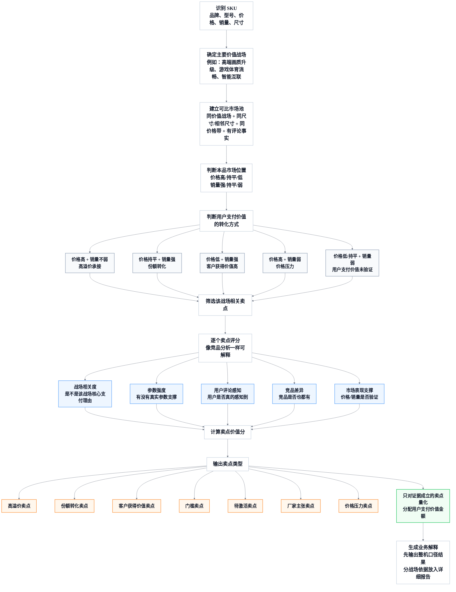

# M12C 用户卖点支付价值分析详细设计

## 1. 设计目标

M12C 要实现一个独立、可追溯、可解释的用户卖点支付价值分析能力。它以 M04C 的卖点事实为基础，把 SKU 的卖点放到真实价值战场、用户评论和可比市场池中，判断用户是否真的愿意为这些卖点付费，或因为这些卖点更愿意选择该产品。

设计目标：

1. 以 SKU 的既有标准卖点为分析对象，逐个判断用户支付价值。
2. 先在单个价值战场内计算，再按战场权重汇总为 SKU 结果。
3. 像竞品分析一样提供业务人员能看懂的评分、权重、可比池和证据链。
4. 不把基础门槛卖点误判为高溢价卖点。
5. 不把可解释金额写成单一卖点的因果收益。
6. 支持 CLI、Skill、Markdown 和飞书报告。

## 2. 模块边界

| 模块 | 边界 |
| --- | --- |
| M04C 卖点画像 | 判断产品有什么卖点、卖点是否有参数或评论事实支撑 |
| M11C 价值战场 | 判断 SKU 落在哪些价值战场、关系状态是什么 |
| M11D 市场图谱 | 提供价值战场、用户任务、目标客群的空间和销量分配 |
| M12C 用户卖点支付价值 | 判断这些卖点在用户选择和支付上是否有价值，价值在哪个战场成立 |

M12C 可以读取 M04C 的卖点分类，但不能复用 M04C 的结论直接判断“溢价”。M04C 是事实层，M12C 是市场价值解释层。

## 3. 数据流



图中节点只用于表达处理顺序。实际报告和 Skill 回答必须在图后追加业务解释，避免用户只看到“高溢价、份额转化”等标签但不知道含义。

### 3.1 支付价值转化方式解释

| 分支 | 业务含义 | 输出要求 |
| --- | --- | --- |
| 价格高 + 销量不弱，高溢价承接 | 价格已经上探，销量没有明显受损，用户支付意愿被价格承接 | 可以分配可解释金额，但必须保留可比池和证据链 |
| 价格持平 + 销量强，份额转化 | 卖点主要提高选择率，价值体现在销量、销额或份额 | 输出销量/销额贡献，不输出高溢价金额 |
| 价格低 + 销量强，客户获得价值高 | 用户获得的价值高于当前价格，形成“更值”的选择理由 | 输出客户获得价值和份额表现，不写成高价溢价 |
| 价格高 + 销量弱，价格压力 | 卖点没有充分支撑高价，或竞品表达更强 | 输出风险和降级原因，不进入正向价值总榜 |
| 价格低/持平 + 销量弱，用户支付价值未验证 | 当前价格和销量都没有验证卖点价值 | 输出待验证或厂家主张，不强行量化 |

### 3.2 卖点类型解释

| 卖点类型 | 程序判定 | 报告解释 |
| --- | --- | --- |
| 高溢价卖点 | `market_position_type=premium_accepted`，卖点价值分达标，且非门槛 | 用户愿意为该卖点多付钱；展示整机口径可解释金额和主要成立场景 |
| 份额转化卖点 | `market_position_type=share_conversion`，销量或销额优势明显 | 卖点提高选择率；展示可解释销量/销额，不展示为价格溢价 |
| 客户获得价值卖点 | `market_position_type=customer_value_gain`，价格低但销量强 | 用户觉得更值；展示价值感和性价比来源 |
| 门槛卖点 | 同池覆盖高、对照组不足或组间价格差异不稳定 | 进入市场池的基础能力；缺了会掉队，有了不单独加价 |
| 待激活卖点 | 参数或卖点事实强，但评论、市场或表达验证不足 | 本品有潜在优势；需要加强用户教育、导购表达或评论验证 |
| 厂家主张卖点 | 主要来自宣传文本，参数/评论/市场证据不足 | 厂家已表达但用户支付价值未成立；不分配金额 |
| 竞品拦截卖点 | 竞品具备并验证，本品缺失、弱表达或弱感知 | 竞品可能改变用户选择；作为补强和防守方向 |
| 价格压力卖点 | 价格高但销量弱，卖点未被用户或市场承接 | 该卖点不足以解释当前价格；作为定价或表达风险 |

这两张解释表必须进入 Markdown 和飞书报告模板，也要进入小奥 Skill 的长答和“解释这个卖点为什么是这个类型”的回答中。

## 4. 核心数据结构

### 4.1 `SkuClaimValueContext`

```text
SkuClaimValueContext
- category_code
- batch_id
- market_window
- sku_code
- brand
- model_name
- size_value
- size_tier
- price_band
- price_wavg
- avg_weekly_sales_volume
- avg_weekly_sales_amount
- primary_battlefield
- secondary_battlefields
- battlefield_allocations
- primary_user_tasks
- primary_target_groups
```

`battlefield_allocations` 优先来自 M11D。缺失时用关系权重兜底。

### 4.2 `ClaimAnalysisUnit`

每个 SKU 的每个标准卖点生成一个分析单元：

```text
ClaimAnalysisUnit
- sku_code
- claim_code
- claim_name
- claim_dimension
- claim_fact_status
- param_support_status
- comment_support_status
- related_param_codes
- related_comment_topics
- related_battlefield_codes
- service_excluded_flag
```

`service_excluded_flag=true` 的服务履约、物流安装、售后卖点不得进入产品用户支付价值分析。

### 4.3 `BattlefieldClaimResult`

单战场卖点结果：

```text
BattlefieldClaimResult
- sku_code
- battlefield_code
- claim_code
- claim_type
- claim_value_score
- value_space_amount
- allocated_value_amount
- allocated_weekly_sales_effect
- market_position_type
- parameter_evidence
- comment_evidence
- competitor_evidence
- sample_grade
- downgrade_reason
- explanation_cn
```

### 4.4 `SkuClaimValueSummary`

SKU 汇总结果：

```text
SkuClaimValueSummary
- sku_code
- claim_code
- claim_name
- final_claim_type
- total_value_amount
- total_weekly_sales_effect
- main_supporting_battlefields
- score_by_dimension
- evidence_summary_cn
- risk_or_opportunity_cn
- calculation_trace
```

## 5. 分析战场选择

默认分析范围：

```text
analysis_battlefields
= primary_battlefield
+ secondary_battlefields
```

机会战场、厂家主张战场、拖后腿战场不进入正向汇总：

| 关系状态 | 处理方式 |
| --- | --- |
| 主战场 | 进入正向计算，默认权重 1.0 |
| 辅战场 | 进入正向计算，默认权重 0.6-0.8 |
| 机会战场 | 只进入机会分析，不计入正向总额 |
| 厂家主张战场 | 只用于表达不足或待验证分析 |
| 拖后腿战场 | 只用于风险分析 |

如果用户指定战场，只计算指定战场，不做 SKU 汇总。

## 6. 可比市场池构建

### 6.1 初始池

单个战场的初始池：

```text
same category
+ same batch
+ same market_window
+ same battlefield_code
+ same size_tier or exact size
+ same price_band
+ market facts ready
+ param and claim facts ready
```

默认优先使用有评论事实的 SKU。样本不足时可放宽评论要求，但结果必须降级。

### 6.2 放宽规则

放宽必须按顺序执行，并记录 `pool_relax_level`：

| 等级 | 规则 |
| --- | --- |
| L0 | 同战场、同具体尺寸、同价格带、有评论 |
| L1 | 同战场、同尺寸档、同价格带、有评论 |
| L2 | 同战场、同尺寸档、相邻价格带、有评论 |
| L3 | 同战场、同尺寸档、同/相邻价格带，不强制评论 |
| L4 | 同尺寸档、同/相邻价格带，不限定战场，仅用于门槛判断 |

L4 不得输出高溢价，只能用于判断基础门槛、样本不足和待激活。

### 6.3 样本等级

| 等级 | 条件 | 可输出结论 |
| --- | --- | --- |
| 样本充分 | 池内 SKU >= 6，且有卖点组和对照组都 >= 2 | 可输出高溢价、份额转化、门槛等 |
| 弱样本 | 池内 SKU >= 4，但某组样本不足 | 可输出倾向性结论，必须提示 |
| 样本不足 | 池内 SKU < 4，或缺少对照组 | 只能输出待验证或定性判断 |

## 7. 市场位置判断

对目标 SKU 在单战场可比池中计算：

```text
price_gap_ratio = (target_price - baseline_price) / baseline_price
sales_gap_ratio = (target_weekly_sales - baseline_weekly_sales) / baseline_weekly_sales
amount_gap_ratio = (target_weekly_amount - baseline_weekly_amount) / baseline_weekly_amount
```

阈值建议：

| 指标 | 判定 |
| --- | --- |
| `price_gap_ratio >= 0.05` | 价格高 |
| `abs(price_gap_ratio) < 0.05` | 价格接近 |
| `price_gap_ratio <= -0.05` | 价格低 |
| `sales_gap_ratio >= 0.10` | 销量强 |
| `sales_gap_ratio <= -0.10` | 销量弱 |
| 其余 | 销量接近 |

市场位置类型：

| 类型 | 条件 | 解释 |
| --- | --- | --- |
| `premium_accepted` | 价格高，销量不弱 | 可承接高溢价 |
| `price_pressure` | 价格高，销量弱 | 高价承压 |
| `share_conversion` | 价格接近，销量强 | 卖点转化为份额 |
| `customer_value_gain` | 价格低，销量强 | 用户获得价值强 |
| `unverified` | 价格不高且销量不强 | 用户支付价值未验证 |

## 8. 门槛卖点先行校验

在计算强溢价之前，必须先判门槛。

门槛判断同时看 M04C 卖点覆盖和 M03B 参数覆盖：

```text
claim_coverage = pool_skus_with_claim / pool_sku_count
param_coverage = pool_skus_with_core_param / pool_sku_count
```

满足以下任一情况，优先进入门槛或待验证，不得直接判强溢价：

1. `param_coverage >= 0.75` 且有无卖点组价格差异不稳定。
2. `claim_coverage >= 0.75` 且对照组不足。
3. 卖点是战场入围条件，例如 65 寸高价 MiniLED 池中的 MiniLED、高刷、HDR 基础支持。
4. 宣传覆盖低但参数覆盖高，例如 HDMI2.1 文本少但参数普遍存在。

门槛卖点仍可参与组合解释，但不能作为高溢价主结论。

## 9. 卖点价值分计算

### 9.1 公式

```text
claim_value_score
= 0.20 * battlefield_relevance_score
+ 0.25 * parameter_strength_score
+ 0.25 * comment_perception_score
+ 0.15 * competitor_difference_score
+ 0.15 * market_validation_score
```

输出分值统一为 0-100。

### 9.2 战场相关度

| 分值 | 条件 |
| ---: | --- |
| 90-100 | 卖点是该战场核心支付理由 |
| 70-89 | 卖点强相关，但不是唯一核心 |
| 40-69 | 卖点间接相关 |
| 0-39 | 与该战场弱相关 |

例如 HDMI2.1 对游戏体育流畅战场相关度高，对高端画质升级战场相关度较低。

### 9.3 参数强度

参数强度来自参数事实和同池位置：

```text
parameter_strength_score =
  parameter_presence_score
+ parameter_tier_score
+ parameter_rank_score
- missing_or_conflict_penalty
```

示例：

- 亮度 5200nits 在 65 寸高价池显著领先，应给高参数强度。
- MiniLED 如果同池普遍具备，只能给基础参数存在分，不能给高差异分。
- 参数缺失不能直接判否，除非上游标准明确“缺失即无”。

### 9.4 用户评论感知

评论感知分来自 M05C：

| 情况 | 分值方向 |
| --- | --- |
| 正向评论数量充足，且与卖点直接相关 | 高 |
| 评论提到但正负混合 | 中 |
| 评论很少或只间接相关 | 低 |
| 负向集中 | 进入风险或拖后腿 |

评论权重必须高于单纯厂家宣传。对“用户卖点支付价值”问题，如果没有评论验证，应降级为待激活或厂家主张。

### 9.5 竞品差异

竞品差异分按可替代压力判断，不能简单按“竞品越少有越高”处理：

| 情况 | 分值方向 |
| --- | --- |
| 本品强，主要直接竞品弱或缺失 | 高 |
| 本品与竞品都有，但本品参数档位明显更强 | 中高 |
| 同池普遍具备 | 低，通常进入门槛 |
| 竞品更强 | 输出竞品拦截或价格压力 |

### 9.6 市场验证

市场验证分来自价格、销量、销额和战场分配：

| 情况 | 分值方向 |
| --- | --- |
| 价格高且销量不弱 | 支持高溢价 |
| 价格接近但销量强 | 支持份额转化 |
| 价格低且销量强 | 支持客户获得价值 |
| 价格高但销量弱 | 进入价格压力 |
| 样本不足 | 降级 |

### 9.7 可追溯评分卡结构

程序必须为每个 `sku_code + battlefield_code + claim_code` 保存完整评分卡，保证结果像竞品分析一样可复核。

```text
ClaimValueScorecard
- sku_code
- battlefield_code
- claim_code
- total_score
- final_claim_type
- dimension_scores
  - battlefield_relevance: raw_score, weight, weighted_score, reason_cn, evidence_refs
  - parameter_strength: raw_score, weight, weighted_score, reason_cn, evidence_refs
  - comment_perception: raw_score, weight, weighted_score, reason_cn, evidence_refs
  - competitor_difference: raw_score, weight, weighted_score, reason_cn, evidence_refs
  - market_validation: raw_score, weight, weighted_score, reason_cn, evidence_refs
- downgrade_reasons
- sample_grade
- pool_key
- report_explanation_cn
```

评分卡写入和展示要求：

| 要求 | 说明 |
| --- | --- |
| 维度权重固定可见 | 报告中能看到 20%、25%、25%、15%、15% 的权重 |
| 每个维度有业务解释 | 不能只输出分数，必须说明该分数来自什么事实 |
| 每个维度有证据引用 | 参数、评论、竞品、市场池证据至少保留可追溯引用 |
| 降级原因独立输出 | 门槛、样本不足、评论不足、竞品更强不能被总分掩盖 |
| 总分不替代业务类型 | 高分仍可能是门槛；业务类型由市场位置、门槛校验和证据链共同决定 |

报告层建议展示：

| 维度 | 权重 | 得分 | 加权贡献 | 业务解释 |
| --- | ---: | ---: | ---: | --- |
| 战场相关度 | 20% | 90 | 18.0 | 该卖点直接服务该战场核心支付理由 |
| 参数强度 | 25% | 95 | 23.8 | 参数在同池处于领先或高位 |
| 用户评论感知 | 25% | 70 | 17.5 | 用户评论有正向感知，但直指样本仍需增强 |
| 竞品差异 | 15% | 75 | 11.3 | 主要竞品具备相近卖点，但本品参数更强 |
| 市场验证 | 15% | 80 | 12.0 | 同战场高价下销量不弱，市场验证成立 |

## 10. 单战场金额和销量空间

### 10.1 价格空间

```text
raw_price_space = target_price - baseline_price
effective_price_space = abs(raw_price_space) * market_validation_coefficient
```

`market_validation_coefficient` 由销量位置、样本等级和评论验证决定：

| 条件 | 系数 |
| --- | ---: |
| 销量强，样本充分，评论支持 | 0.90-1.00 |
| 销量接近，样本充分 | 0.70-0.85 |
| 销量弱或评论弱 | 0.30-0.60 |
| 样本不足 | 0.10-0.30 |

价格空间的业务含义必须随市场位置变化：

| 市场位置 | 金额解释 |
| --- | --- |
| 高价且销量不弱 | 高溢价承接空间 |
| 高价且销量弱 | 价格压力空间 |
| 低价且销量强 | 客户获得价值空间 |
| 同价且销量强 | 主要看销量/销额，不强调金额 |

### 10.2 销量空间

```text
weekly_sales_space = max(0, target_weekly_sales - baseline_weekly_sales)
weekly_amount_space = max(0, target_weekly_amount - baseline_weekly_amount)
```

如果目标价格低但销量强，优先输出销量和销额空间，避免误写“溢价”。

### 10.3 卖点分配

同一战场中，先筛选相关卖点：

```text
eligible_claims =
  claims where battlefield_relevance_score >= min_relevance
  and service_excluded_flag = false
  and claim_type not in brand_claim_only
```

卖点分配权重：

```text
claim_share =
  claim_value_score
  / sum(claim_value_score of eligible_claims in same battlefield and same value_type)
```

卖点金额：

```text
claim_price_value =
  effective_price_space
  * claim_share
  * claim_type_coefficient
```

卖点销量：

```text
claim_weekly_sales_value =
  weekly_sales_space
  * claim_share
  * claim_type_coefficient
```

如果该战场没有正向价格空间，则 `claim_price_value` 不展示为溢价金额；可展示为客户获得价值、份额转化或待验证。

## 11. SKU 层汇总

SKU 层汇总必须按战场权重合并，不能把原始金额直接相加。

```text
sku_claim_price_value =
  sum(claim_price_value_by_battlefield * battlefield_weight)
```

```text
sku_claim_weekly_sales_value =
  sum(claim_weekly_sales_value_by_battlefield * battlefield_weight)
```

战场权重：

1. 优先使用 M11D allocation weight。
2. 若缺失，主战场 1.0，辅战场 0.6-0.8。
3. 机会、厂家主张、拖后腿不进入正向总额。

汇总时必须保留来源：

```text
main_supporting_battlefields = [
  {battlefield_code, battlefield_name, relation_status, battlefield_weight, claim_type, claim_value}
]
```

同一卖点在不同战场可能类型不同。例如 HDMI2.1 在游戏体育流畅战场可能是份额转化卖点，在高端画质战场可能只是弱相关或门槛。

### 11.1 用户默认看到的结果

CLI 和 Skill 面向业务用户输出时，默认展示 SKU 整机口径的最终结果。分战场金额、战场权重、可比池和样本等级是结果依据，不是短答主结构。

当用户问“某 SKU 的某个卖点用户卖点支付价值是多少”时，输出应按以下顺序组织：

1. 最终分类：该卖点在整机口径下是高溢价卖点、份额转化卖点、客户获得价值卖点、门槛卖点、待激活卖点、价格压力卖点等。
2. 最终数值：该卖点在整机口径下的用户卖点支付价值，或说明当前不支持金额量化。
3. 业务含义：该数值代表用户对什么价值的认可，例如亮度、HDR 明暗层次、强光客厅观看、高端画质感知。
4. 主要成立场景：用业务语言概括主要成立场景，例如高端画质升级、影院沉浸、主流客厅观看。
5. 依据摘要：只保留关键事实，例如参数领先、用户评论正向、主要竞品差异、市场验证成立。
6. 详细链接：分战场明细和计算过程放到 Markdown 或飞书报告。

短答中不得把“在哪个战场多少钱、乘以哪个权重、怎么汇总”作为主要答案。用户需要追问“为什么是这个数”或打开详细报告时，才展开分战场计算过程。

## 12. 分类规则

分类优先级：

1. 服务履约类直接排除。
2. 样本不足先降级。
3. 门槛校验先于高溢价判断。
4. 再根据市场位置、卖点价值分和证据链分类。

分类规则：

| 分类 | 必要条件 |
| --- | --- |
| 高溢价卖点 | 市场位置为 `premium_accepted`；卖点价值分 >= 75；不是门槛；参数和评论至少一个强，另一个不弱 |
| 份额转化卖点 | 市场位置为 `share_conversion`；卖点价值分 >= 70；销量或销额强 |
| 客户获得价值卖点 | 市场位置为 `customer_value_gain`；卖点价值分 >= 70；价格低但销量强 |
| 门槛卖点 | 同池覆盖高、对照组不足或价差不稳定 |
| 待激活卖点 | 参数强但评论/市场验证不足，或样本弱 |
| 厂家主张卖点 | 卖点文本存在，但参数、评论、市场都弱 |
| 竞品拦截卖点 | 主要竞品具备且验证强，本品缺失或弱 |
| 价格压力卖点 | 价格高但销量弱，且卖点未能获得用户或市场验证 |

同一卖点如果命中多个分类，按业务输出优先级展示：

```text
价格压力 > 竞品拦截 > 高溢价 > 份额转化 > 客户获得价值 > 待激活 > 门槛 > 厂家主张
```

但在详情中保留全部战场来源。

## 13. 65E7Q 计算示例

以下是海信 65E7Q 在“高端画质升级战场”的示例计算口径，用于验收算法是否自洽。

### 13.1 战场与可比池

| 项目 | 示例 |
| --- | --- |
| 目标 SKU | 海信 65E7Q |
| 价值战场 | 高端画质升级 |
| 尺寸 | 65 英寸 |
| 价格带 | 65 寸 high |
| 目标价格 | 约 5,949 元 |
| 直接可比基准 | 约 5,580 元 |
| 原始价差 | 约 370 元 |
| 市场验证系数 | 约 0.90 |
| 单战场高溢价承接空间 | 约 333 元/台 |

该数值表示在该可比战场中，当前价格差可被卖点和市场证据解释的空间；它不代表所有卖点共同必然让价格高 333 元。

### 13.2 卖点判断

| 卖点 | 初步业务判断 | 原因 |
| --- | --- | --- |
| 5200nits 高亮 | 高溢价候选 | 与高端画质战场强相关，参数强，能解释高亮 HDR 体验 |
| 1920 分区控光 | 待激活高溢价候选 | 参数强，但评论对控光/黑位直接感知可能不足 |
| MT9655/画质芯片 | 高溢价候选 | 与画质处理、控光、高刷和智能体验相关，竞品显式芯片覆盖低 |
| 98% 色域/色彩 | 体验支撑卖点 | 与画质体验相关，评论有色彩反馈时增强 |
| MiniLED | 门槛卖点 | 65 寸高价池普遍具备，不能单独解释高价 |
| HDMI2.1 | 非本战场主卖点 | 更适合在游戏体育流畅战场判断 |
| 护眼显示 | 待验证卖点 | 需要护眼参数和长看评论支撑 |
| 杜比/影音认证 | 待验证卖点 | 需要影音任务和评论验证，不能只靠认证文本 |

### 13.3 分配示例

如果高端画质战场中有效候选为高亮、控光、画质芯片、色彩、MiniLED，则示例输出应类似：

| 卖点 | 类型 | 可解释金额 | 说明 |
| --- | --- | ---: | --- |
| 5200nits 高亮 | 高溢价卖点 | 约 90 元/台 | 参数强且与高端画质战场直接相关 |
| MT9655/画质芯片 | 高溢价卖点 | 约 80 元/台 | 支撑画质处理和高阶体验，具备差异性 |
| 98% 色域/色彩 | 体验支撑卖点 | 约 70 元/台 | 支撑画质感知，需要评论验证增强 |
| 1920 分区控光 | 待激活卖点 | 约 50 元/台 | 参数强，但用户直接感知证据不足时降级 |
| MiniLED | 门槛卖点 | 低权重计入 | 作为战场入围条件，不作为高溢价主因 |

以上金额仅为示例计算口径，实际数值必须由当前数据库重新计算，并保留可比池和权重。

## 14. 输出格式

### 14.1 短答

短答控制在 600 字以内：

```text
结论：海信 65E7Q 的 5200nits 高亮属于高溢价卖点。按整机口径汇总后，它当前可解释的用户卖点支付价值约 X 元/台。

这个卖点的业务价值主要来自高端画质升级、影院沉浸观看和强光客厅观看场景。用户认可的是高亮度带来的明暗层次、强对比和白天客厅观看清晰度。它可以支撑海信 65E7Q 的高端画质解释；游戏体育或智能互联等弱相关场景只作为辅助背景，不进入该卖点的主要价值口径。

详细报告见：{link}
```

### 14.2 Markdown/飞书报告

报告结构：

1. 结论摘要。
2. 用户卖点支付价值总榜，展示整机口径的最终分类和最终数值。
3. 分价值战场分析，作为结果依据和可追溯明细。
4. 卖点逐项解释。
5. 门槛卖点与待激活卖点。
6. 竞品拦截和价格压力。
7. 计算口径和样本说明。

报告表格建议：

| 卖点 | 业务分类 | 主要成立战场 | 可解释金额 | 可解释销量 | 参数证据 | 评论证据 | 竞品差异 | 降级/风险 |
| --- | --- | --- | ---: | ---: | --- | --- | --- | --- |

表格下必须放置口径备注：

```text
说明：可解释金额和可解释销量是基于可比市场池、价值战场权重和证据分数得到的解释性分摊，用于判断卖点价值强弱和排序，不代表该卖点单独导致价格或销量变化。
```

## 15. CLI 设计

### 15.1 `claim-value sku`

```bash
catforge_analyst claim-value sku \
  --category-code TV \
  --query "海信 65E7Q" \
  --market-window full_observed_window \
  --top-n 8 \
  --format markdown
```

输出 SKU 层总榜和分战场来源。

### 15.2 `claim-value battlefield`

```bash
catforge_analyst claim-value battlefield \
  --category-code TV \
  --query "海信 65E7Q" \
  --battlefield-code BF_PREMIUM_PICTURE_UPGRADE \
  --format markdown
```

只计算指定价值战场。

### 15.3 `claim-value explain`

```bash
catforge_analyst claim-value explain \
  --category-code TV \
  --query "海信 65E7Q" \
  --claim-code tv_claim_hdmi_2_1
```

解释某个卖点为什么是高溢价、门槛、待激活或风险。

### 15.4 `claim-value compare`

```bash
catforge_analyst claim-value compare \
  --category-code TV \
  --query "海信 65E7Q" \
  --competitors "创维 65A7H PRO,TCL 65Q9L PRO,创维 65A6F ULTRA"
```

横向对比本品和竞品的卖点支付价值。

### 15.5 `claim-value report`

```bash
catforge_analyst claim-value report \
  --category-code TV \
  --query "海信 65E7Q" \
  --report-target feishu
```

生成 Markdown 或飞书文档链接。

## 16. Skill 设计

小奥 Skill 路由：

| 用户话术 | 调用 |
| --- | --- |
| “某 SKU 的用户卖点价值有哪些” | `claim-value sku` |
| “哪些卖点能支撑高价” | `claim-value sku --focus premium` |
| “某卖点为什么不是高溢价” | `claim-value explain` |
| “在某战场靠什么卖点” | `claim-value battlefield` |
| “和竞品相比哪些卖点有优势” | `claim-value compare` |

回答约束：

1. 不暴露内部 JSON 和数据库字段。
2. 不使用后台字段名、算法过程词或工程调试语言。
3. 对金额和销量必须说清楚是解释性分摊。
4. 样本不足时直接说“当前只能定性判断，不能量化为高溢价”。
5. 基础门槛卖点不能包装成优势卖点。

## 17. 测试设计

单元测试必须覆盖：

1. 同池普遍具备卖点被判为门槛，而不是高溢价。
2. 宣传覆盖低但参数覆盖高的卖点被校准为门槛或待验证。
3. 价格高且销量不弱时，允许输出高溢价候选。
4. 价格高且销量弱时，输出价格压力。
5. 价格低且销量强时，输出客户获得价值，不输出高溢价。
6. 样本不足时降级。
7. 指定单战场时不做跨战场汇总。
8. SKU 汇总时按战场权重合并，不直接相加。
9. 服务履约卖点被排除。
10. CLI 输出不包含内部过程语言。

集成验收：

1. 用海信 65E7Q 生成独立卖点价值报告。
2. 验证 HDMI2.1、MiniLED、HDR 不会因为取数扩大被误列为高端画质战场的高溢价 Top。
3. 验证高亮、分区控光、画质芯片能在高端画质战场进入候选，并能说明证据和降级原因。
4. 验证飞书报告可读、结构稳定、权限由报告生成层统一处理。

## 18. 实现顺序

建议按以下顺序实现：

1. 重构 M12C 结果模型，增加单战场结果和 SKU 汇总结果。
2. 实现可比市场池和样本等级。
3. 实现门槛卖点先行校验。
4. 实现卖点价值分。
5. 实现单战场金额/销量空间。
6. 实现 SKU 层战场权重汇总。
7. 实现 CLI 原子能力。
8. 实现 Skill 路由和短答模板。
9. 实现 Markdown/飞书报告模板。
10. 用 65E7Q 完成回归验收。
