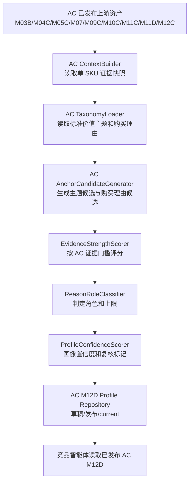

# M12D AC SKU成交理由画像详细设计

## 1. 设计目标

AC M12D 在通用 M12D 架构上增加空调品类的 taxonomy、候选生成门槛、证据评分规则和发布验收。它不重写 TV M12D，也不把 AC 逻辑放进竞品分析智能体。

首版设计目标：

1. 建立 AC 标准价值主题和标准购买理由的版本化 taxonomy。
2. 基于 AC 参数、卖点、评论、市场、语义和 M12C 证据生成单 SKU 成交理由画像。
3. 明确哪些空调卖点在证据不足时只能作为弱表达或辅助理由。
4. 发布后供竞品智能体读取，未发布或缺失时下游降级。

## 2. 版本与边界

| 项 | 约定 |
| --- | --- |
| `category_code` | `AC` |
| taxonomy version | `m12d_ac_purchase_reason_anchor_taxonomy_v0.1` |
| 初始 profile version | `m12d_ac_purchase_reason_profile_v0_1_draft` |
| 匹数价格池重算发布版本 | `m12d_ac_purchase_reason_profile_v0_2` |
| 下游消费门槛 | 仅允许读取 `category_code=AC`、`status=published`、`is_current=true` 的画像 |

边界：

- 不复用 TV 标准购买理由。
- 不在运行时自动生成标准 taxonomy。
- 不在竞品智能体里补跑 M12D。
- 不把安装、售后、补贴单独判为产品核心购买理由。

## 3. 数据流



## 4. 复用与新增模块

| 模块 | 处理方式 |
| --- | --- |
| `SkuPurchaseReasonContextBuilder` | 复用通用接口，增加 AC 字段读取和 AC 缺失状态。 |
| `PurchaseReasonAnchorTaxonomy` | 增加 AC taxonomy 配置和 category isolation 测试。 |
| `AnchorCandidateGenerator` | 增加 AC 候选门槛，不修改 TV 规则。 |
| `EvidenceStrengthScorer` | 增加 AC 证据域权重和弱表达上限。 |
| `ReasonRoleClassifier` | 复用角色框架，增加 AC 硬门槛。 |
| `PurchaseReasonProfileRepository` | 复用发布和读取契约，确保 `category_code=AC` 隔离。 |
| `catforge_analyst sku-purchase-reason` | AC taxonomy 未发布前应阻断；G06 后允许 AC 单 SKU 预览。 |
| 竞品智能体 | G09 后只读取已发布 AC M12D；不实现 AC M12D 生产逻辑。 |

## 5. AC 输入上下文

AC context 应包含以下领域。缺失字段保留 unknown。

```json
{
  "category_code": "AC",
  "project_id": "core3_real_data_v2",
  "batch_id": "latest",
  "sku": {
    "sku_code": "AC00038063",
    "brand_name": "海信",
    "model_name": "KFR-88LW/N8KS1-1U"
  },
  "param_profile": {
    "installation_type": "柜机",
    "capacity_hp": "3匹",
    "cooling_capacity": null,
    "heating_capacity": null,
    "air_volume": null,
    "apf": null,
    "energy_efficiency_level": null,
    "noise_db": null,
    "fresh_air_volume": null
  },
  "claim_fact_profile": {},
  "comment_profile": {},
  "market_profile": {},
  "task_profile": {},
  "target_group_profile": {},
  "battlefield_profile": {},
  "claim_value_profile": {}
}
```

字段说明：

- `installation_type` 用于区分挂机、柜机、风管机等安装形态。
- `capacity_hp`、制冷量、制热量和循环风量用于冷暖能力与大空间覆盖判断。
- `apf` 和能效等级用于长期用电成本判断。
- `noise_db`、睡眠模式和评论用于睡眠静音判断。
- 新风量、净化/除菌、柔风、防直吹和扫风用于舒适风与健康空气判断。

## 6. AC taxonomy 配置结构

taxonomy 配置必须显式区分 value themes 和 purchase reasons。

```json
{
  "category_code": "AC",
  "taxonomy_version": "m12d_ac_purchase_reason_anchor_taxonomy_v0.1",
  "value_themes": [
    {
      "code": "cooling_heating_capacity_assurance",
      "name_cn": "冷暖能力确定感",
      "evidence_domains": ["param_fact", "comment_perception", "semantic_scene", "market_acceptance"]
    }
  ],
  "purchase_reasons": [
    {
      "code": "room_size_capacity_match_reduces_risk",
      "name_cn": "匹数空间匹配降低买小风险",
      "related_value_theme_codes": [
        "cooling_heating_capacity_assurance",
        "installation_space_fit"
      ],
      "candidate_gate_domain_groups": [
        ["capacity_param"],
        ["room_size_scene", "comment_perception", "market_acceptance"]
      ],
      "role_cap_rules": []
    }
  ]
}
```

## 7. 候选生成规则

候选生成分两层：

1. 先从 AC 证据生成 value theme 候选，用于解释“用户获得什么价值”。
2. 再根据 purchase reason 的门槛生成购买理由候选，用于后续角色判定。

关键规则：

- 单一厂家卖点只能生成带角色上限的弱候选。
- 购买理由必须至少命中一个事实或评论/市场/语义补证域。
- 同一参数或同源卖点只能计一次，不重复加分。
- TV value theme 或 TV purchase reason 在 AC 上必须被拒绝。

## 8. AC 证据域评分

| 证据域 | 分值 | AC 判定口径 |
| --- | ---: | --- |
| 参数事实 | 0-3 | 匹数、制冷量、制热量、循环风量、APF、能效等级、噪音、新风量等是否支撑理由。 |
| 事实卖点 | 0-2 | M04C 卖点是否成立，是否有参数或同源事实支撑。 |
| 评论感知 | 0-2 | 用户是否提到冷暖快、省电、静音、风感、除湿、安装、异味等正负向体验。 |
| M12C 支付价值 | 0-3 | 是否高溢价、份额转化、客户获得价值、门槛、待激活或价格压力。 |
| 语义场景 | 0-2 | 是否落在卧室睡眠、客厅大空间、老人儿童、租房小房间、季节可靠性等任务。 |
| 市场承接 | 0-2 | 同安装形态、同匹数/能力段、同价格带下的销量、销额和价格位置是否承接。 |

强度映射沿用 M12D 通用规则：

```text
raw_evidence_score = sum(domain_scores) - conflict_penalty

strong: raw_evidence_score >= 9 且至少两个强证据域
medium: raw_evidence_score >= 6
weak: raw_evidence_score >= 3
insufficient: raw_evidence_score < 3
```

## 9. 角色上限与冲突规则

| 场景 | 规则 |
| --- | --- |
| 只有一级能效/省电卖点，无 APF、评论、M12C 或市场承接 | `weak_expression` |
| 只有新风/净化/除菌卖点，无新风量、健康空气评论、M12C 或场景补证 | `weak_expression` |
| 只有静音卖点，无噪音参数、卧室任务或静音评论 | `supporting` 上限 |
| 只有防直吹/柔风卖点，无风感评论、老人儿童房任务或技术参数 | `supporting` 上限 |
| 低价但缺少核心冷暖能力或市场承接 | `weak_expression` |
| 安装、售后、补贴、物流单独成立 | 不得进入 `core_payment` |
| 评论明显集中在噪音大、制冷慢、安装差、异味、耗电高 | 降低角色或生成 `risk_drag` |

`core_payment` 判定必须同时满足：

- `evidence_strength=strong`。
- 至少一个强证据域来自参数事实、评论感知、M12C 支付价值或市场承接。
- 购买理由中文名能解释用户选择。
- 没有主导冲突。

## 10. 输出 schema

输出沿用通用 `SkuPurchaseReasonProfile`，AC 示例：

```json
{
  "schema_version": "sku_purchase_reason_profile_v1",
  "category_code": "AC",
  "project_id": "core3_real_data_v2",
  "version": "m12d_ac_purchase_reason_profile_v0_1_draft",
  "taxonomy_version": "m12d_ac_purchase_reason_anchor_taxonomy_v0.1",
  "batch_id": "latest",
  "sku_code": "AC00038063",
  "display_name_cn": "海信 KFR-88LW/N8KS1-1U",
  "status": "draft",
  "core_reasons_cn": [
    "大空间冷暖能力和长期能效共同解释柜机升级购买"
  ],
  "anchors": [
    {
      "anchor_code": "large_space_one_step_cooling_heating",
      "anchor_cn": "大空间冷暖一步到位",
      "related_value_theme_codes": [
        "large_space_coverage",
        "cooling_heating_capacity_assurance"
      ],
      "role": "core_payment",
      "evidence_strength": "strong",
      "confidence": 0.78,
      "evidence_domains": [
        "param_fact",
        "comment_perception",
        "semantic_scene",
        "market_acceptance"
      ],
      "support_summary_cn": "柜机和大匹数能力覆盖客厅大空间任务，评论与市场承接支持冷暖一步到位。",
      "weakness_summary_cn": "",
      "source_refs": []
    }
  ],
  "core_payment_anchors": ["large_space_one_step_cooling_heating"],
  "supporting_anchors": ["long_term_energy_saving_offsets_price"],
  "weak_expression_anchors": [],
  "risk_drag_anchors": [],
  "risk_flags": [],
  "profile_confidence": 0.74,
  "review_status": "auto_pass"
}
```

## 11. 实现任务拆分

AC M12D 不直接在一个大任务中完成，必须按以下顺序推进：

1. 上游证据审计与样本确认。
2. AC 价值主题和购买理由候选提炼脚本。
3. AC 标准 taxonomy v0.1 人审草案固化。
4. taxonomy loader 和 candidate generator 支持 AC。
5. 证据强度和角色判定适配 AC。
6. 单 SKU CLI 和 Markdown 预览支持 AC。
7. 小批量验证与规则修正。
8. 全量 AC batch 生成。
9. 发布 AC M12D 版本与下游消费契约。
10. 竞品智能体 AC M12D 消费验收。

## 12. 测试策略

必须覆盖：

- AC taxonomy 能被加载，且 `category_code=AC`。
- TV taxonomy 不会污染 AC 候选。
- 一级能效、新风、静音、柔风、低价等弱表达上限生效。
- 参数缺失保持 unknown，不当作 false。
- M12C 缺失时画像降级，不生成强核心支付理由。
- Repository 只读取已发布 current AC 版本。
- 竞品智能体在 AC M12D 缺失时降级，不补跑 M12D。

## 13. 验收产物

| 阶段 | 产物 |
| --- | --- |
| G01 | AC 上游证据审计报告和小批量样本清单。 |
| G02 | AC 候选提炼脚本和候选报告。 |
| G03 | AC 标准价值主题/购买理由 taxonomy v0.1 草案。 |
| G04-G06 | AC 画像生成代码、CLI、Markdown 预览和单元测试。 |
| G07 | 10-20 个 AC SKU 小批量验证报告。 |
| G08 | AC 全量 batch 结果、质量统计和失败清单。 |
| G09 | 已发布 AC M12D 版本和下游消费 fixture。 |
| AC-CA-G01 | 竞品智能体读取 AC M12D 的端到端验收报告。 |
