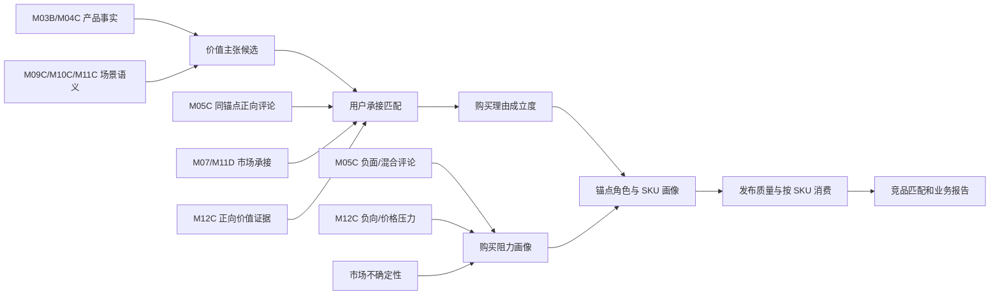

# M12D 购买理由成立度、购买阻力与产品价值主张分层详细设计

版本：`v0.1-draft`

日期：`2026-07-11`

## 1. 设计目标

在不新增虚假证据的前提下，将 M12D 从“一个混合分数决定理由是否存在”改造成三段式判断：

1. 产品价值主张是否存在。
2. 用户购买理由是否由正向证据成立。
3. 已成立理由承受什么购买阻力。

## 2. 总体流程



## 3. 模块边界

| 模块 | 责任 |
| --- | --- |
| `AnchorCandidateGenerator` | 生成产品价值主张和购买理由候选；正负评论必须按锚点匹配。 |
| `ReasonEstablishmentScorer` | 只计算正向成立证据，不读取负面压力扣分。 |
| `UserValidationClassifier` | 判断 proposition/user_supported/market_supported/user_validated。 |
| `PurchasePressureClassifier` | 独立生成压力类型、强度、影响方面和证据。 |
| `ReasonRoleClassifier` | 根据成立状态和用户承接决定 core/supporting/proposition，不因普通压力删除理由。 |
| `ProfileConfidenceScorer` | 只用成立理由计算画像置信度；压力形成并行摘要。 |
| `ReleaseQualityEvaluator` | 计算版本覆盖风险，不覆盖 SKU 级状态。 |
| 竞品智能体 | 只消费发布的 M12D 成立理由和压力，不生产或修正 M12D。 |

## 4. Typed Contract

### 4.1 枚举

```text
ReasonEstablishmentStatus =
  unassessed | established | established_limited | proposition_only | rejected

UserValidationStatus =
  unassessed | user_validated | user_supported | market_supported | not_observed

PurchasePressureLevel =
  unassessed | none | low | medium | high | critical

PurchasePressureType =
  localized_negative | mixed_feedback | negative_dominant |
  m12c_value_headwind | market_uncertainty |
  objective_falsification | evidence_misalignment
```

`unassessed` 只用于历史兼容或新算法尚未执行；不得解释为不成立、未承接或无压力。历史 `core_eligible` 使用 `null`，不得猜测为 `false`。

### 4.2 锚点字段

| 字段 | 类型 | 说明 |
| --- | --- | --- |
| `establishment_status` | varchar | 理由成立状态。 |
| `establishment_score` | numeric | 只汇总正向成立证据。 |
| `establishment_domains_json` | jsonb | 成立证据域。 |
| `user_validation_status` | varchar | 用户承接层级。 |
| `core_eligible` | bool | 是否可进入核心理由收敛。 |
| `core_ineligible_reasons_json` | jsonb | 仅保存成立不足、事实证伪和错配原因。 |
| `pressure_level` | varchar | 独立压力强度。 |
| `pressure_tags_json` | jsonb | 结构化压力记录。 |
| `pressure_summary_cn` | text | 业务中文说明。 |
| `comparison_limitations_json` | jsonb | 市场/金额/替代比较限制。 |

### 4.3 压力记录

```json
{
  "pressure_type": "mixed_feedback",
  "pressure_level": "medium",
  "affected_aspect_code": "reflection_control",
  "affected_anchor_code": "same_size_picture_step_up",
  "positive_count": 18,
  "negative_count": 3,
  "dominance": "positive",
  "limits_establishment": false,
  "limits_comparison": false,
  "summary_cn": "画质升级理由成立，但反光体验存在少量争议。",
  "source_refs": []
}
```

## 5. 正向成立算法

### 5.1 证据域

继续使用参数事实、事实卖点、用户感知、M12C 价值、语义场景、市场承接和卖点位置等域，但执行以下约束：

- `COMMENT_PERCEPTION` 只在存在与当前锚点同维度的正向评论事实时计分。
- `CLAIM_VALUE` 只读取当前锚点引用 claim 的正向/中性价值角色。
- `MARKET_ACCEPTANCE` 只证明市场承接或客观位置，不直接证明主观支付意愿。
- 负面评论和 M12C 负向不进入 `establishment_score`。

### 5.2 分层门槛

```text
standard_core:
  score >= 9
  strong_domains >= 2
  scene_fit = true
  user_validation in {user_validated, user_supported}

no_core_fallback:
  baseline_core_count = 0
  score >= 8
  strong_domains >= 2
  scene_fit = true
  anchor_comment_alignment = true when comment domain is used
  reason_business_boundary = true

reason_specific_fallback:
  baseline_core_count = 0
  score >= 7
  strong_domains >= 2
  scene_fit = true
  reason_specific_boundary = true
  score < 7 forbidden
```

### 5.3 TV 理由专属边界

- `big_screen_cinema_substitution`：屏幕尺寸至少 75 英寸，并有大屏/影院同维度用户或市场证据。
- `low_price_core_experience_intact`：品类或同尺寸价格带为 low/mid_low，并有直接价格价值感知或客观市场承接。
- `picture_upgrade_justifies_price`、`worth_paying_more_for_experience_upgrade`：同尺寸价格位置为 mid_high/high，且有画质正向感知；主观 WTP 不能只靠参数。
- 游戏理由必须命中游戏、高刷、主机适配或运动流畅同维度证据。
- TV 家装和家庭操作理由只有产品事实时为 `proposition_only`。

### 5.4 AC 理由专属边界

G01 基线审计后按 AC taxonomy 固化，不复用 TV 数值。至少覆盖：

- 匹数/房间能力适配。
- 能效节省。
- 舒适风、静音、新风、清洁维护。
- 安装和服务只能辅助，不独立成为核心产品购买理由。

## 6. 用户承接分类

```text
proposition_only:
  product_fact_or_claim = true
  semantic_scene = true
  no anchor-aligned user/market/M12C support

user_supported:
  anchor_aligned_positive_comment = true
  product_or_scene_fact = true

market_supported:
  market_acceptance = true
  product_fact = true
  only allowed for objective comparison reasons

user_validated:
  anchor_aligned_positive_comment = true
  and one of market_acceptance / positive_M12C / explicit_choice_evidence
```

`proposition_only` 输出产品价值主张，不进入核心购买理由。它不触发 `failed` 或版本不可用。

## 7. 购买阻力算法

### 7.1 评论压力

对同 SKU、同锚点、同方面评论分别统计正向、负向和混合：

```text
localized_negative: negative > 0 and positive dominates
mixed_feedback: positive > 0 and negative > 0
negative_dominant: negative weighted count > positive weighted count
```

以上状态不修改成立分。只有以下情况限制成立：

- 正向证据实际上来自其他锚点，标记 `evidence_misalignment`。
- 可验证参数/能力被事实证伪，标记 `objective_falsification`。

### 7.2 M12C 压力

- `drag_factor`、价格拦截或价值承接弱形成 `m12c_value_headwind`。
- 金额不可量化只限制金额/WTP 表达。
- M12C 负向与用户正向可以同时存在；报告表达为“用户感知成立，但市场价值承接偏弱”。
- 未引用 claim 不得扩散到其他锚点。

### 7.3 市场不确定性

市场池、价格带或尺寸池样本不足形成 `market_uncertainty`：

- 不删除由用户和产品事实成立的理由。
- 限制同池排名、市场规模和替代压力强结论。

## 8. 角色和画像决策

| 条件 | 角色 |
| --- | --- |
| 成立且 core eligible | `core_payment` |
| 成立但未入选前三或用户承接有限 | `supporting` |
| 仅产品价值主张 | `proposition`，兼容读取期映射为 supporting |
| 成立证据不足 | `weak_expression` |
| 事实证伪或证据错配 | `rejected`，兼容期映射为 risk_drag |

压力字段独立存在，不再使用 `risk_drag` 表示所有负面。核心理由可同时带 high pressure。

## 9. SKU 状态和版本质量

### 9.1 SKU 状态

- `ready`：至少一个用户购买理由成立并通过核心收敛。
- `ready_limited`：只有 supporting 或 proposition，但参数/卖点/市场等维度可用。
- `weak_expression_only`：只有弱表达，仍可消费事实维度。
- `missing_input` / `failed`：仅用于真实必需输入缺失或执行失败。

### 9.2 版本状态

版本状态保存覆盖率和审批风险，但读取端必须先看版本是否允许消费，再看 SKU 状态：

```text
version blocked -> 不消费
version ready/limited -> 按 SKU 状态和维度能力消费
```

`limited` 版本中的 `ready` SKU 不自动映射为 `published_degraded`。版本级覆盖不足不能改变该 SKU 已成立的购买理由。

### 9.3 发布质量复算

发布门槛同时保留两层覆盖率，不能互相替代：

```text
strong_consumption_rate = ready / expected_sku_count
sku_consumable_rate = (ready + ready_limited + weak_expression_only) / expected_sku_count
```

- `strong_consumption_rate` 对应现有 `ready_rate`，门槛为 `>= 0.85`。
- `sku_consumable_rate` 门槛为 `>= 0.95`，表示 SKU 至少有参数、卖点、市场、产品价值主张或成立理由中的一个业务维度可消费。
- `core_payment_missing_rate` 继续单独衡量缺少核心成交理由的比例，门槛为 `<= 0.15`；它不等于 SKU 不可消费率。
- `ready_or_limited_rate` 只作为兼容诊断字段输出，不参与 go/no-go 判定。

## 10. 竞品消费

- 购买理由重合度只比较 `established` 且可消费的理由。
- 产品价值主张单独比较“产品希望传达什么”，不能写成用户已经认可。
- 压力画像单独比较：同一理由谁的压力更低、负面集中在哪个方面。
- 替代压力计算可读取成立理由、市场竞争和压力，但不得把压力标签反向改成理由不存在。
- 报告业务表达示例：`画质升级是该 SKU 的核心购买理由，同时反光体验存在中等争议。`

### 10.1 候选消费门控

```text
candidate blocked/not_found -> candidate_top3_eligible = false
candidate facts_only -> 其他业务维度可参与；购买理由重合 = 0
candidate limited -> 可做有限理由比较，不得升级为首选直接竞品
candidate strong -> 可进入购买理由重合和直接竞品判断
```

`proposition_only` 即使与目标核心理由同 code/同 family，也只记录为“产品希望传达但尚未观察到用户承接”，覆盖权重、证据对等分和候选优势分均为 0。

### 10.2 三层比较输出

| 层次 | 回答的问题 | 是否改变理由成立 |
| --- | --- | --- |
| 购买理由重合 | 双方已经成立的用户选择理由重合多少 | 否，只消费成立结果 |
| 替代压力 | 竞品通过价值、价格、配置、场景或市场分流多大程度影响本品 | 否 |
| 购买阻力 | 本品和竞品各自已成立理由上还存在哪些用户顾虑 | 否 |

购买阻力不是竞品识别评分维度，不进入 100 分制，也不在顶部看板或“分析过程”目录中设置独立模块。只有双方存在同一已成立理由、且两侧阻力均不是 `unassessed` 时，才在关键价值锚点或产品画像下以“补充说明（不计分）”横向展示；无共同成立理由、任一侧未评估或仅有占位结论时整段省略。`proposition_only/rejected/weak_expression` 不进入同理由压力比较。顶部市场验证固定展示“均价 + 周均销量 + 销量量级”，不得用重叠周数替代均价。

### 10.3 Top 3 追溯

每个候选输出 `ranking_trace`：目标/候选消费模式、购买理由重合分、替代压力分、两者对 100 分制的贡献、是否应用版本统一降级和中文排序作用。`version_wide_degradation_applied` 固定为 false；实际门控来自 SKU capabilities。

## 11. 数据迁移和兼容

- 新字段优先以 JSON/typed schema 加入现有 anchor/profile 表；若增加列，提供 Alembic migration。
- 历史版本缺少新字段时，由 reader 映射为 `unassessed`，不得猜测压力或用户承接。
- 新版本写入必须同时生成成立、承接和压力字段。
- 兼容字段在至少一个正式发布周期内保留。

## 12. 测试矩阵

| 场景 | 预期 |
| --- | --- |
| 正向画质评论 + 少量反光负评 | 画质理由成立，压力 medium。 |
| 同维度负面占主导 | 理由仍可存在，压力 high；不得无声删除。 |
| 评论来自其他维度 | 不计用户承接，标记 evidence_misalignment。 |
| 参数+卖点+场景，无用户承接 | proposition_only。 |
| 事实被明确证伪 | rejected。 |
| limited 版本中的 ready SKU | 按 ready 消费，不统一降级。 |
| TV/AC 同名压力类型 | 使用各自锚点映射，无 taxonomy 串用。 |

## 13. Shadow 验收

- G01 冻结 TV/AC 基线、影响集合、允许迁移和未影响样本。
- TV 必须复核 QF15A 139 个无核心 SKU；当前反事实 `304 ready / 36 limited / 37 weak` 仅作为校验线索，不是强制配额。
- AC 分别测算普通负面、产品价值主张和用户承接分布。
- 每个新增核心理由必须有同锚点正向证据和理由业务边界。
- 每个压力标签必须可追溯到负面评论、M12C 或市场不确定性。
- 不写 current，不改变线上 Top 3，直至部署和发布任务获批。
