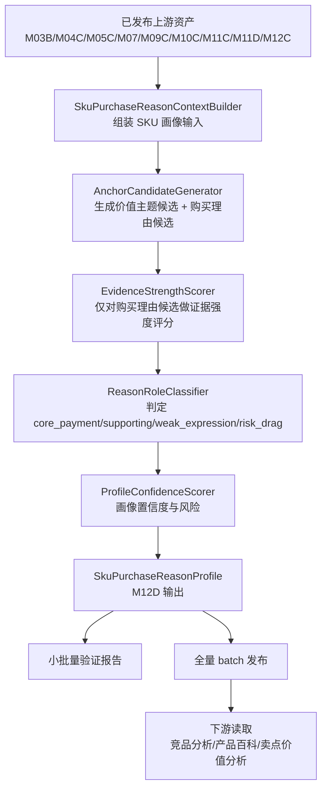

# M12D SKU成交理由画像详细设计

## 1. 设计目标

M12D 要实现一个独立、可批量生成、可审计的 SKU 成交理由画像模块。它以已发布的事实、语义、市场和 M12C 卖点支付价值结果为输入，生成单 SKU 的核心成交理由、关键价值锚点、证据强度、置信度和风险标记。

设计目标：

1. 先分析单个 SKU 自身的成交理由，再让下游做 pair 级比较。
2. 把“核心支付理由、辅助理由、弱表达、拖累理由”分开，不把所有卖点都写成成交理由。
3. 把 `value_price`、`price_value`、厂家主张、位置标签和泛化表达降级为弱表达，除非有事实、评论、M12C 或市场承接补证。
4. 支持小批量验证、全量 TV batch 生成、版本发布和下游稳定消费。
5. 不调用外部 LLM；首版使用规则、配置和可测试的评分函数。

## 2. 模块边界

| 模块 | 边界 |
| --- | --- |
| M03B/M04C/M05C/M07/M09C/M10C/M11C/M11D/M12C | 上游输入，M12D 不重建这些结果。 |
| M12D SKU成交理由画像 | 单 SKU 级画像生产、评分、证据汇总、质量标记和发布。 |
| 竞品分析智能体 | 下游消费者，只读取已发布 M12D，再做 pair 级可替代性和替代压力。 |

M12D 不做：

- 不选择竞品。
- 不计算目标-候选 pair 分。
- 不生成竞品报告。
- 不替代 M12C 的卖点支付价值量化。
- 不把服务履约、安装、售后作为产品核心价值锚点。

## 3. 数据流



## 4. 核心服务

| 服务 | 职责 |
| --- | --- |
| `SkuPurchaseReasonContextBuilder` | 读取单 SKU 上游结果，形成统一上下文。 |
| `AnchorCandidateGenerator` | 按电视两层 taxonomy 从参数、卖点、评论、M12C、战场、任务、客群和市场中生成价值主题候选与购买理由候选。 |
| `EvidenceStrengthScorer` | 计算每个购买理由候选的证据域、证据强度和冲突信号。 |
| `ReasonRoleClassifier` | 判定锚点角色：`core_payment`、`supporting`、`weak_expression`、`risk_drag`。 |
| `ProfileConfidenceScorer` | 计算画像整体置信度、低置信原因和复核标记。 |
| `PurchaseReasonProfileRepository` | 读取、保存、按版本发布 M12D 结果。 |
| `PurchaseReasonProfileCli` | 支持单 SKU、小批量、全量生成和验证报告。 |

## 5. 输入上下文

```json
{
  "category_code": "TV",
  "project_id": "core3_real_data_v2",
  "version": "20260708",
  "batch_id": "latest",
  "sku": {
    "sku_code": "TV00029112",
    "brand_name": "海信",
    "model_name": "65E7Q"
  },
  "param_profile": {},
  "claim_fact_profile": {},
  "comment_profile": {},
  "market_profile": {},
  "task_profile": {},
  "target_group_profile": {},
  "battlefield_profile": {},
  "claim_value_profile": {}
}
```

上下文构建规则：

- 缺失值保持 unknown，不得当作 false。
- M12C 缺失时设置 `claim_value_status=missing`，但仍允许生成低置信画像。
- 服务履约、物流安装、售后、权益和补贴信号必须打上非产品价值标记。
- 所有来源保留 evidence 或 source 摘要，业务输出只展示中文解释。

## 6. 两层 taxonomy 和候选生成

首版 TV 使用配置化两层 taxonomy：

### 6.1 标准价值主题

价值主题回答“用户获得什么可感知价值”，只作为解释维度、证据归因和下游展示参照，不直接进入 `core_payment/supporting/weak_expression/risk_drag` 角色判定。

| value_theme_code | 中文名 | 主要证据 |
| --- | --- | --- |
| `picture_upgrade_perception` | 画质升级感 | MiniLED/OLED/QLED、亮度、分区、HDR、色彩、画质评论、M12C 画质支付价值。 |
| `dynamic_stability_perception` | 动态画面稳定感 | 刷新率、HDMI2.1、VRR、低延迟、运动/体育/游戏评论。 |
| `living_room_immersion_perception` | 客厅沉浸感 | 大屏、音响、杜比、电影/追剧、客厅观影任务。 |
| `budget_configuration_efficiency` | 预算配置效率 | 同尺寸价格位置、配置获得感、性价比评论、M12C 客户获得价值。 |
| `long_watch_comfort_perception` | 长看舒适感 | 低蓝光、无频闪、抗反光、儿童/家庭长看评论。 |
| `operation_convenience_perception` | 操作便利感 | AI、语音、投屏、IoT、系统易用和互联任务。 |
| `space_aesthetic_fit` | 空间审美适配 | 超薄、贴墙、全面屏、壁画、外观、新家客厅。 |

### 6.2 标准购买理由

购买理由回答“用户为什么选择这个 SKU”，必须包含用户任务/场景、价格或竞品取舍、SKU 证据组合和弱表达边界。G05 只对购买理由候选做证据强度评分和角色判定。

| purchase_reason_code | 中文名 | 对应价值主题 |
| --- | --- | --- |
| `picture_upgrade_justifies_price` | 画质配置解释加价 | `picture_upgrade_perception` |
| `low_price_core_experience_intact` | 低价不明显牺牲核心体验 | `budget_configuration_efficiency`, `picture_upgrade_perception`, `operation_convenience_perception` |
| `same_price_core_config_gain` | 同价位核心配置获得感 | `budget_configuration_efficiency`, `picture_upgrade_perception`, `dynamic_stability_perception` |
| `same_size_picture_step_up` | 同尺寸画质越级获得感 | `picture_upgrade_perception`, `budget_configuration_efficiency` |
| `worth_paying_more_for_experience_upgrade` | 贵得值的体验升级 | `picture_upgrade_perception`, `dynamic_stability_perception`, `living_room_immersion_perception` |
| `av_user_willing_to_pay_for_picture` | 影音用户愿为画质升级付费 | `picture_upgrade_perception`, `living_room_immersion_perception` |
| `gaming_device_fit_reduces_risk` | 游戏设备适配降低踩坑风险 | `dynamic_stability_perception` |
| `sports_motion_stability` | 体育/运动画面流畅更稳 | `dynamic_stability_perception` |
| `big_screen_cinema_substitution` | 大屏影音替代影院感 | `living_room_immersion_perception`, `picture_upgrade_perception` |
| `living_room_upgrade_one_step` | 客厅换新一步到位 | `living_room_immersion_perception`, `picture_upgrade_perception` |
| `family_long_watch_comfort_assurance` | 家庭长时间观看更安心 | `long_watch_comfort_perception` |
| `family_operation_less_friction` | 家庭多设备使用更省操作 | `operation_convenience_perception` |
| `new_home_aesthetic_fit` | 新家客厅审美适配 | `space_aesthetic_fit` |

生成规则：

1. 参数、卖点、评论、M12C、战场、任务、客群和市场都可以贡献价值主题候选。
2. 购买理由候选必须通过 `candidate_gate_domain_groups`，例如 `贵得值的体验升级` 需要中高/高价格位置、可感知体验证据、评论/M12C/市场承接。
3. 单一弱证据只能生成带 `role_cap=weak_expression` 的候选，不能进入强成交理由。
4. 宽泛卖点必须拆成具体能力或业务理由。
5. 同源同参的多个卖点合并为同一个候选证据，不重复计数。

## 7. 证据强度评分

每个购买理由候选先计算证据域得分：

| 证据域 | 分值 | 说明 |
| --- | ---: | --- |
| 参数事实 | 0-3 | 是否有具体参数、档位优势或核心能力。 |
| 事实卖点 | 0-2 | 是否有 M04C 成立卖点和参数支撑。 |
| 评论感知 | 0-2 | 是否有用户正向感知，是否存在负向冲突。 |
| M12C 支付价值 | 0-3 | 是否高溢价、份额转化、客户获得价值、门槛或价格压力。 |
| 语义场景 | 0-2 | 是否落在主/辅价值战场、任务和客群。 |
| 市场承接 | 0-2 | 价格、销量、销额是否承接该价值。 |

证据强度映射：

```text
raw_evidence_score = sum(domain_scores) - conflict_penalty

strong: raw_evidence_score >= 9 且至少两个强证据域
medium: raw_evidence_score >= 6
weak: raw_evidence_score >= 3
insufficient: raw_evidence_score < 3
```

冲突扣分：

- 评论负向明显：-2
- 价格高但销量弱且 M12C 标为价格压力：-2
- 只有厂家主张或位置标签：封顶 `weak`
- 只有服务/权益/补贴：封顶 `weak_expression`，不得进入产品核心购买理由
- 样本不足：降低置信度，不直接判 false

## 8. 角色判定

```text
role =
  core_payment      if evidence_strength strong and scene_fit high and no hard conflict
  supporting        if evidence_strength medium or strong but scene_fit medium
  weak_expression   if evidence_strength weak or source is claim_position/brand_claim_only
  risk_drag         if conflict or negative signal dominates
```

硬门槛：

- `core_payment` 必须至少包含一个强证据域：参数事实、M12C 支付价值、评论感知或市场承接。
- `budget_configuration_efficiency` 只有价格价值表达时只能作为弱价值主题；相关购买理由必须有价格位置、配置事实、评论价值感或 M12C 客户获得价值，才可升级。
- `risk_drag` 不得同时出现在 `core_payment_anchors`。

## 9. 输出 schema

```json
{
  "schema_version": "sku_purchase_reason_profile_v1",
  "category_code": "TV",
  "project_id": "core3_real_data_v2",
  "version": "20260708",
  "batch_id": "latest",
  "sku_code": "TV00029112",
  "display_name_cn": "海信 65E7Q",
  "status": "ready",
  "core_reasons_cn": [
    "贵得值的体验升级和游戏设备适配共同支撑高价段升级购买"
  ],
  "anchors": [
    {
      "anchor_code": "worth_paying_more_for_experience_upgrade",
      "anchor_cn": "贵得值的体验升级",
      "related_value_theme_codes": ["picture_upgrade_perception", "dynamic_stability_perception"],
      "role": "core_payment",
      "evidence_strength": "strong",
      "confidence": 0.82,
      "evidence_domains": ["param_fact", "fact_claim", "claim_value", "semantic_scene", "market_acceptance"],
      "support_summary_cn": "中高价位、MiniLED 画质、144Hz 动态体验和 M12C 支付价值共同支撑贵得值。",
      "weakness_summary_cn": "",
      "source_refs": []
    }
  ],
  "core_payment_anchors": ["worth_paying_more_for_experience_upgrade"],
  "supporting_anchors": ["gaming_device_fit_reduces_risk"],
  "weak_expression_anchors": ["same_price_core_config_gain"],
  "risk_drag_anchors": [],
  "risk_flags": ["weak_price_value_expression"],
  "profile_confidence": 0.76,
  "review_status": "auto_pass"
}
```

## 10. 存储设计

建议新增两张表，或先以现有分析结果存储结构扩展落地：

### `core3_sku_purchase_reason_profile`

| 字段 | 类型 | 说明 |
| --- | --- | --- |
| `id` | uuid | 主键。 |
| `category_code` | varchar | 品类。 |
| `project_id` | varchar | 项目。 |
| `version` | varchar | 画像规则版本。 |
| `batch_id` | varchar | 数据批次。 |
| `sku_code` | varchar | SKU。 |
| `status` | varchar | `ready` / `missing_input` / `failed` / `review_required`。 |
| `core_reasons_json` | jsonb | 核心成交理由。 |
| `anchors_json` | jsonb | 锚点明细。 |
| `profile_confidence` | numeric | 整体置信度。 |
| `risk_flags_json` | jsonb | 风险标记。 |
| `review_status` | varchar | 自动通过、需复核、已复核。 |
| `created_at` / `updated_at` | timestamp | 审计时间。 |

### `core3_sku_purchase_reason_anchor`

| 字段 | 类型 | 说明 |
| --- | --- | --- |
| `profile_id` | uuid | 画像 ID。 |
| `anchor_code` | varchar | 锚点 code。 |
| `anchor_cn` | varchar | 中文名。 |
| `role` | varchar | `core_payment` / `supporting` / `weak_expression` / `risk_drag`。 |
| `evidence_strength` | varchar | 证据强度。 |
| `confidence` | numeric | 锚点置信度。 |
| `evidence_domains_json` | jsonb | 证据域。 |
| `support_summary_cn` | text | 支撑解释。 |
| `source_refs_json` | jsonb | 证据引用。 |

## 11. CLI 设计

单 SKU：

```bash
python -m app.cli.catforge_analyst sku-purchase-reason \
  --query "海信 65E7Q" \
  --product-category tv \
  --batch-id latest \
  --format json
```

小批量验证：

```bash
python -m app.cli.catforge_analyst sku-purchase-reason-batch \
  --sku-codes TV00029112,TV00029936,TV00029113 \
  --product-category tv \
  --batch-id latest \
  --format markdown
```

全量生成：

```bash
python -m app.cli.catforge_analyst sku-purchase-reason-batch \
  --product-category tv \
  --batch-id latest \
  --all-skus \
  --publish-version 20260708
```

CLI 输出必须区分：

- 生成成功数量。
- 失败 SKU。
- 低置信 SKU。
- 需人工复核 SKU。
- 可供下游消费的发布版本。

## 12. 小批量验证

首批建议验证 SKU：

| SKU | 验证重点 |
| --- | --- |
| 海信 65E7Q | 贵得值的体验升级、游戏设备适配、预算价值弱表达边界。 |
| 创维 65A7H PRO | 画质配置解释加价、新家客厅审美适配、家庭客厅场景表达。 |
| TCL 65Q9L PRO | 同价位核心配置获得感、画质升级付费和游戏设备适配。 |
| 小米 L65MC-SP | 价格贴身、低价不明显牺牲核心体验、语义弱于直接竞品。 |
| 创维 65A6F ULTRA | 下探分流、低价保留核心体验。 |

验证报告必须展示：

- 每个 SKU 的核心成交理由。
- 每个购买理由锚点的角色、证据强度和置信度。
- 被降级为弱表达的购买理由及原因。
- 需业务复核的问题。
- 与现有竞品报告旧结论的差异。

## 13. 全量生成与发布

全量生成流程：

1. 固定输入 batch 和 M12D 规则版本。
2. 逐 SKU 生成画像。
3. 输出质量统计。
4. 对低置信和失败 SKU 生成复核清单。
5. 发布 `m12d_profile_version`。
6. 下游只能消费 `ready` 且已发布版本。

质量统计至少包括：

- 总 SKU 数。
- `ready` 数。
- `review_required` 数。
- `missing_input` 数。
- `failed` 数。
- 平均 `profile_confidence`。
- `core_payment` 缺失 SKU 数。
- 弱表达占比最高的购买理由族。

## 14. 下游消费契约

竞品分析智能体读取 M12D 时必须遵守：

- 按 `category_code + project_id + batch_id + m12d_profile_version + sku_code` 获取画像。
- 只消费 `ready` 或允许降级的 `review_required` 画像。
- 如果目标 SKU M12D 缺失，竞品分析必须返回“成交理由画像待生成/置信度不足”，不能临时生成成交理由。
- 如果候选 SKU M12D 缺失，该候选的关键价值锚点可替代性降置信度，必要时退出 Top 3。
- 下游不得修改 M12D 中的锚点角色，只能在 pair 级判断覆盖、替代或候选更强。

## 15. 测试设计

| 测试 | 断言 |
| --- | --- |
| 画像生成 | 单 SKU 能输出 schema 完整的 `SKU成交理由画像`。 |
| 核心理由数量 | `core_reasons_cn` 不超过 3 条，且不是参数清单。 |
| 两层 taxonomy | `value_theme_candidates` 和 `purchase_reason_candidates` 分开输出。 |
| 购买理由门槛 | `贵得值的体验升级` 必须同时具备价格位置、体验证据和评论/M12C/市场承接。 |
| 弱表达封顶 | 只有 price/value 标签时，`budget_configuration_efficiency` 或相关购买理由候选为 `weak_expression`。 |
| M12C 缺失 | 可以生成低置信画像，但不强判 `core_payment`。 |
| 服务剥离 | 服务、安装、售后不进入产品核心成交理由。 |
| 宽泛卖点拆解 | 宽泛“高端画质”只能作为价值主题证据，不能直接成为标准购买理由。 |
| 风险标记 | 评论负向或价格压力会降低角色或置信度。 |
| 批量生成 | 小批量和全量命令输出成功、失败、低置信和复核清单。 |
| 下游契约 | 未发布 M12D 不被竞品分析消费。 |

## 16. 开发任务拆分

M12D 自身应拆成独立 goal：

1. M12D 需求和详细设计确认。
2. 上游证据分析脚本和首批 SKU 样本审计。
3. 输出 schema、配置和存储迁移。
4. `SkuPurchaseReasonContextBuilder` 和两层候选生成。
5. 证据强度评分、角色判定和置信度评分。
6. 单 SKU CLI、批量 CLI 和验证报告。
7. 小批量验证与规则修正。
8. TV 全量生成与质量报告。
9. 发布 M12D 版本，交付给竞品分析智能体消费。
