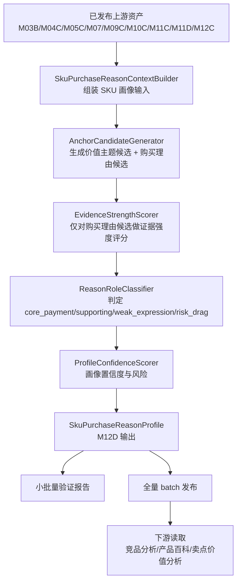

# M12D SKU成交理由画像详细设计

## 1. 设计目标

M12D 要实现一个独立、可批量生成、可审计的 SKU 成交理由画像模块。它以已发布的事实、语义、市场和 M12C 卖点支付价值结果为输入，生成单 SKU 的核心成交理由、关键价值锚点、证据强度、置信度和风险标记。

设计目标：

1. 先分析单个 SKU 自身的成交理由，再让下游做 pair 级比较。
2. 把“核心支付理由、辅助理由、弱表达、拖累理由”分开，不把所有卖点都写成成交理由。
3. 把 `value_price`、`price_value`、厂家主张、位置标签和泛化表达降级为弱表达，除非有事实、评论、M12C 或市场承接补证。
4. 支持小批量验证、全量 TV batch 生成、版本发布和下游稳定消费。
5. 不调用外部 LLM；首版使用规则、配置和可测试的评分函数。

## 2. 模块边界

| 模块 | 边界 |
| --- | --- |
| M03B/M04C/M05C/M07/M09C/M10C/M11C/M11D/M12C | 上游输入，M12D 不重建这些结果。 |
| M12D SKU成交理由画像 | 单 SKU 级画像生产、评分、证据汇总、质量标记和发布。 |
| 竞品分析智能体 | 下游消费者，只读取已发布 M12D，再做 pair 级可替代性和替代压力。 |

M12D 不做：

- 不选择竞品。
- 不计算目标-候选 pair 分。
- 不生成竞品报告。
- 不替代 M12C 的卖点支付价值量化。
- 不把服务履约、安装、售后作为产品核心价值锚点。

## 3. 数据流



## 4. 核心服务

| 服务 | 职责 |
| --- | --- |
| `SkuPurchaseReasonContextBuilder` | 读取单 SKU 上游结果，形成统一上下文。 |
| `AnchorCandidateGenerator` | 按电视两层 taxonomy 从参数、卖点、评论、M12C、战场、任务、客群和市场中生成价值主题候选与购买理由候选。 |
| `EvidenceStrengthScorer` | 计算每个购买理由候选的证据域、证据强度和冲突信号。 |
| `ReasonRoleClassifier` | 判定锚点角色：`core_payment`、`supporting`、`weak_expression`、`risk_drag`。 |
| `ProfileConfidenceScorer` | 计算画像整体置信度、低置信原因和复核标记。 |
| `PurchaseReasonProfileRepository` | 读取、保存、按版本发布 M12D 结果。 |
| `PurchaseReasonProfileCli` | 支持单 SKU、小批量、全量生成和验证报告。 |

## 5. 输入上下文

```json
{
  "category_code": "TV",
  "project_id": "core3_real_data_v2",
  "version": "20260708",
  "batch_id": "latest",
  "sku": {
    "sku_code": "TV00029112",
    "brand_name": "海信",
    "model_name": "65E7Q"
  },
  "param_profile": {},
  "claim_fact_profile": {},
  "comment_profile": {},
  "market_profile": {},
  "task_profile": {},
  "target_group_profile": {},
  "battlefield_profile": {},
  "claim_value_profile": {},
  "input_quality": {
    "param_profile": {
      "availability": "present",
      "usability": "usable",
      "issues": []
    }
  }
}
```

上下文构建规则：

- 缺失值保持 unknown，不得当作 false。
- M12C 缺失时设置 `claim_value_status=missing`；只限制依赖支付价值的相关锚点，不自动降低其他锚点或整个画像的置信度。
- 服务履约、物流安装、售后、权益和补贴信号必须打上非产品价值标记。
- 所有来源保留 evidence 或 source 摘要，业务输出只展示中文解释。
- 不再使用一个通用 `_profile_status` 把所有上游 `quality_flags` 归为 `partial`。每个上游模块必须通过专用质量适配器输出 `availability`、`usability`、`issue_severity` 和 `issue_scope`。
- `*_missing` 等历史标记必须与当前 serving scope 实际选中的上游记录核对；当前记录存在时，历史缺失只能保留为 lineage 信息。

## 6. 两层 taxonomy 和候选生成

首版 TV 使用配置化两层 taxonomy：

### 6.1 标准价值主题

价值主题回答“用户获得什么可感知价值”，只作为解释维度、证据归因和下游展示参照，不直接进入 `core_payment/supporting/weak_expression/risk_drag` 角色判定。

| value_theme_code | 中文名 | 主要证据 |
| --- | --- | --- |
| `picture_upgrade_perception` | 画质升级感 | MiniLED/OLED/QLED、亮度、分区、HDR、色彩、画质评论、M12C 画质支付价值。 |
| `dynamic_stability_perception` | 动态画面稳定感 | 刷新率、HDMI2.1、VRR、低延迟、运动/体育/游戏评论。 |
| `living_room_immersion_perception` | 客厅沉浸感 | 大屏、音响、杜比、电影/追剧、客厅观影任务。 |
| `budget_configuration_efficiency` | 预算配置效率 | 同尺寸价格位置、配置获得感、性价比评论、M12C 客户获得价值。 |
| `long_watch_comfort_perception` | 长看舒适感 | 低蓝光、无频闪、抗反光、儿童/家庭长看评论。 |
| `operation_convenience_perception` | 操作便利感 | AI、语音、投屏、IoT、系统易用和互联任务。 |
| `space_aesthetic_fit` | 空间审美适配 | 超薄、贴墙、全面屏、壁画、外观、新家客厅。 |

### 6.2 标准购买理由

购买理由回答“用户为什么选择这个 SKU”，必须包含用户任务/场景、价格或竞品取舍、SKU 证据组合和弱表达边界。G05 只对购买理由候选做证据强度评分和角色判定。

| purchase_reason_code | 中文名 | 对应价值主题 |
| --- | --- | --- |
| `picture_upgrade_justifies_price` | 画质配置解释加价 | `picture_upgrade_perception` |
| `low_price_core_experience_intact` | 低价不明显牺牲核心体验 | `budget_configuration_efficiency`, `picture_upgrade_perception`, `operation_convenience_perception` |
| `same_price_core_config_gain` | 同价位核心配置获得感 | `budget_configuration_efficiency`, `picture_upgrade_perception`, `dynamic_stability_perception` |
| `same_size_picture_step_up` | 同尺寸画质越级获得感 | `picture_upgrade_perception`, `budget_configuration_efficiency` |
| `worth_paying_more_for_experience_upgrade` | 贵得值的体验升级 | `picture_upgrade_perception`, `dynamic_stability_perception`, `living_room_immersion_perception` |
| `av_user_willing_to_pay_for_picture` | 影音用户愿为画质升级付费 | `picture_upgrade_perception`, `living_room_immersion_perception` |
| `gaming_device_fit_reduces_risk` | 游戏设备适配降低踩坑风险 | `dynamic_stability_perception` |
| `sports_motion_stability` | 体育/运动画面流畅更稳 | `dynamic_stability_perception` |
| `big_screen_cinema_substitution` | 大屏影音替代影院感 | `living_room_immersion_perception`, `picture_upgrade_perception` |
| `living_room_upgrade_one_step` | 客厅换新一步到位 | `living_room_immersion_perception`, `picture_upgrade_perception` |
| `family_long_watch_comfort_assurance` | 家庭长时间观看更安心 | `long_watch_comfort_perception` |
| `family_operation_less_friction` | 家庭多设备使用更省操作 | `operation_convenience_perception` |
| `new_home_aesthetic_fit` | 新家客厅审美适配 | `space_aesthetic_fit` |

生成规则：

1. 参数、卖点、评论、M12C、战场、任务、客群和市场都可以贡献价值主题候选。
2. 购买理由候选必须通过 `candidate_gate_domain_groups`，例如 `贵得值的体验升级` 需要中高/高价格位置、可感知体验证据、评论/M12C/市场承接。
3. 单一弱证据只能生成带 `role_cap=weak_expression` 的候选，不能进入强成交理由。
4. 宽泛卖点必须拆成具体能力或业务理由。
5. 同源同参的多个卖点合并为同一个候选证据，不重复计数。

## 7. 证据强度评分

每个购买理由候选先计算证据域得分：

| 证据域 | 分值 | 说明 |
| --- | ---: | --- |
| 参数事实 | 0-3 | 是否有具体参数、档位优势或核心能力。 |
| 事实卖点 | 0-2 | 是否有 M04C 成立卖点和参数支撑。 |
| 评论感知 | 0-2 | 是否有用户正向感知，是否存在负向冲突。 |
| M12C 支付价值 | 0-3 | 是否高溢价、份额转化、客户获得价值、门槛或价格压力。 |
| 语义场景 | 0-2 | 是否落在主/辅价值战场、任务和客群。 |
| 市场承接 | 0-2 | 价格、销量、销额是否承接该价值。 |

证据强度映射：

```text
raw_evidence_score = sum(domain_scores)
adjusted_evidence_score = raw_evidence_score - anchor_scoped_penalty

strong: adjusted_evidence_score >= 9 且至少两个强证据域
medium: adjusted_evidence_score >= 6
weak: adjusted_evidence_score >= 3
insufficient: adjusted_evidence_score < 3
```

冲突扣分：

- 评论负向明显：-2
- 价格高但销量弱且 M12C 标为价格压力：-2
- 只有厂家主张或位置标签：封顶 `weak`
- 只有服务/权益/补贴：封顶 `weak_expression`，不得进入产品核心购买理由
- 样本不足：降低置信度，不直接判 false
- 输入范围说明、未被当前锚点引用的卖点/评论/关系问题和历史缺失标记：不扣分
- 删除全局 `missing_or_partial_inputs` 扣分；缺失或冲突只能作用于依赖该证据域的锚点

## 8. 角色判定

```text
role =
  core_payment      if evidence_strength strong and scene_fit high and no hard conflict
  supporting        if evidence_strength medium or strong but scene_fit medium
  weak_expression   if evidence_strength weak or source is claim_position/brand_claim_only
  risk_drag         if conflict or negative signal dominates
```

硬门槛：

- `core_payment` 必须至少包含一个强证据域：参数事实、M12C 支付价值、评论感知或市场承接。
- `budget_configuration_efficiency` 只有价格价值表达时只能作为弱价值主题；相关购买理由必须有价格位置、配置事实、评论价值感或 M12C 客户获得价值，才可升级。
- `risk_drag` 不得同时出现在 `core_payment_anchors`。
- 价格解释、溢价和 WTP 类锚点必须有 M12C，或同时具备价格位置、评论感知和市场承接；功能适配类锚点不把 M12C 设为全局硬门槛。
- 初判为 `core_payment` 的锚点按置信度、证据域完整度和业务区分度排序；同锚点族去重后最多保留 3 个，其余降为 `supporting`。

## 9. 输出 schema

```json
{
  "schema_version": "sku_purchase_reason_profile_v1",
  "category_code": "TV",
  "project_id": "core3_real_data_v2",
  "version": "20260708",
  "batch_id": "latest",
  "sku_code": "TV00029112",
  "display_name_cn": "海信 65E7Q",
  "status": "ready",
  "review_required": false,
  "core_reasons_cn": [
    "贵得值的体验升级和游戏设备适配共同支撑高价段升级购买"
  ],
  "anchors": [
    {
      "anchor_code": "worth_paying_more_for_experience_upgrade",
      "anchor_cn": "贵得值的体验升级",
      "related_value_theme_codes": ["picture_upgrade_perception", "dynamic_stability_perception"],
      "role": "core_payment",
      "evidence_strength": "strong",
      "confidence": 0.82,
      "evidence_domains": ["param_fact", "fact_claim", "claim_value", "semantic_scene", "market_acceptance"],
      "support_summary_cn": "中高价位、MiniLED 画质、144Hz 动态体验和 M12C 支付价值共同支撑贵得值。",
      "weakness_summary_cn": "",
      "source_refs": []
    }
  ],
  "core_payment_anchors": ["worth_paying_more_for_experience_upgrade"],
  "supporting_anchors": ["gaming_device_fit_reduces_risk"],
  "weak_expression_anchors": ["same_price_core_config_gain"],
  "risk_drag_anchors": [],
  "risk_flags": ["weak_price_value_expression"],
  "profile_confidence": 0.76,
  "review_status": "auto_pass",
  "input_quality": {
    "market_profile": {
      "availability": "present",
      "usability": "usable",
      "issues": [
        {
          "code": "online_only_channel",
          "severity": "info",
          "scope": "profile"
        }
      ]
    }
  }
}
```

## 10. 存储设计

建议新增两张表，或先以现有分析结果存储结构扩展落地：

### `core3_sku_purchase_reason_profile`

| 字段 | 类型 | 说明 |
| --- | --- | --- |
| `id` | uuid | 主键。 |
| `category_code` | varchar | 品类。 |
| `project_id` | varchar | 项目。 |
| `version` | varchar | 画像规则版本。 |
| `batch_id` | varchar | 数据批次。 |
| `sku_code` | varchar | SKU。 |
| `status` | varchar | `ready` / `ready_limited` / `weak_expression_only` / `missing_input` / `failed`；复核要求使用独立字段。 |
| `input_quality_json` | jsonb | 各输入的 availability、usability、问题严重度、作用域和受影响锚点。 |
| `core_reasons_json` | jsonb | 核心成交理由。 |
| `anchors_json` | jsonb | 锚点明细。 |
| `profile_confidence` | numeric | 整体置信度。 |
| `risk_flags_json` | jsonb | 风险标记。 |
| `review_status` | varchar | 自动通过、需复核、已复核。 |
| `created_at` / `updated_at` | timestamp | 审计时间。 |

版本表新增 `release_quality_status=ready/limited/blocked`。原 `ready_degraded` 只作为旧版本兼容值读取，新规则不再生成该状态。

### `core3_sku_purchase_reason_anchor`

| 字段 | 类型 | 说明 |
| --- | --- | --- |
| `profile_id` | uuid | 画像 ID。 |
| `anchor_code` | varchar | 锚点 code。 |
| `anchor_cn` | varchar | 中文名。 |
| `role` | varchar | `core_payment` / `supporting` / `weak_expression` / `risk_drag`。 |
| `evidence_strength` | varchar | 证据强度。 |
| `confidence` | numeric | 锚点置信度。 |
| `evidence_domains_json` | jsonb | 证据域。 |
| `support_summary_cn` | text | 支撑解释。 |
| `source_refs_json` | jsonb | 证据引用。 |

## 11. CLI 设计

单 SKU：

```bash
python -m app.cli.catforge_analyst sku-purchase-reason \
  --query "海信 65E7Q" \
  --product-category tv \
  --batch-id latest \
  --format json
```

小批量验证：

```bash
python -m app.cli.catforge_analyst sku-purchase-reason-batch \
  --sku-codes TV00029112,TV00029936,TV00029113 \
  --product-category tv \
  --batch-id latest \
  --format markdown
```

全量生成：

```bash
python -m app.cli.catforge_analyst sku-purchase-reason-batch \
  --product-category tv \
  --batch-id latest \
  --all-skus \
  --publish-version 20260708
```

CLI 输出必须区分：

- 生成成功数量。
- 失败 SKU。
- 低置信 SKU。
- 需人工复核 SKU。
- 可供下游消费的发布版本。

## 12. 小批量验证

首批建议验证 SKU：

| SKU | 验证重点 |
| --- | --- |
| 海信 65E7Q | 贵得值的体验升级、游戏设备适配、预算价值弱表达边界。 |
| 创维 65A7H PRO | 画质配置解释加价、新家客厅审美适配、家庭客厅场景表达。 |
| TCL 65Q9L PRO | 同价位核心配置获得感、画质升级付费和游戏设备适配。 |
| 小米 L65MC-SP | 价格贴身、低价不明显牺牲核心体验、语义弱于直接竞品。 |
| 创维 65A6F ULTRA | 下探分流、低价保留核心体验。 |

验证报告必须展示：

- 每个 SKU 的核心成交理由。
- 每个购买理由锚点的角色、证据强度和置信度。
- 被降级为弱表达的购买理由及原因。
- 需业务复核的问题。
- 与现有竞品报告旧结论的差异。

## 13. 全量生成与发布

全量生成流程：

1. 固定输入 batch 和 M12D 规则版本。
2. 逐 SKU 生成画像。
3. 输出质量统计。
4. 对低置信和失败 SKU 生成复核清单。
5. 发布 `m12d_profile_version`。
6. 下游只能消费 `ready` 且已发布版本。

质量统计至少包括：

- 总 SKU 数。
- `ready` 数。
- `review_required` 数。
- `missing_input` 数。
- `failed` 数。
- 平均 `profile_confidence`。
- `core_payment` 缺失 SKU 数。
- 弱表达占比最高的购买理由族。
- `ready_limited` 数。
- `info/warning/blocking` 问题数及 SKU 覆盖率。
- 同一 `blocking` 问题的最大 SKU 覆盖率。

发布门槛：

| 指标 | TV 门槛 |
| --- | ---: |
| 生成成功率 | `>= 98%` |
| `ready` 占比 | `>= 85%` |
| `ready + ready_limited` 占比 | `>= 95%` |
| `review_required` 占比 | `<= 15%` |
| `missing_input + failed` 占比 | `<= 5%` |
| 核心成交理由缺失占比 | `<= 15%` |
| 重点验证 SKU 通过率 | `100%` |

如果同一 `blocking` 问题覆盖超过 20% SKU，版本质量状态必须为 `blocked`。版本表应新增 `release_quality_status=ready/limited/blocked`；只有 `ready` 可直接成为竞品分析的当前强消费版本，`limited` 必须人工批准并由下游明确降级，`blocked` 不得发布为当前版本。

## 14. 下游消费契约

竞品分析智能体读取 M12D 时必须遵守：

- 按 `category_code + project_id + batch_id + m12d_profile_version + sku_code` 获取画像。
- `ready` 可参与关键价值锚点强比较和竞品排序；`ready_limited` 只参与降级展示和局部比较，不能形成强替代结论。
- `review_required` 是独立判断，不得把所有带提示信息的画像当作不可用。
- 如果目标 SKU M12D 缺失，竞品分析必须返回“成交理由画像待生成/置信度不足”，不能临时生成成交理由。
- 如果候选 SKU M12D 缺失，该候选的关键价值锚点可替代性降置信度，必要时退出 Top 3。
- 下游不得修改 M12D 中的锚点角色，只能在 pair 级判断覆盖、替代或候选更强。

## 15. 测试设计

| 测试 | 断言 |
| --- | --- |
| 画像生成 | 单 SKU 能输出 schema 完整的 `SKU成交理由画像`。 |
| 核心理由数量 | `core_reasons_cn` 不超过 3 条，且不是参数清单。 |
| 两层 taxonomy | `value_theme_candidates` 和 `purchase_reason_candidates` 分开输出。 |
| 购买理由门槛 | `贵得值的体验升级` 必须同时具备价格位置、体验证据和评论/M12C/市场承接。 |
| 弱表达封顶 | 只有 price/value 标签时，`budget_configuration_efficiency` 或相关购买理由候选为 `weak_expression`。 |
| M12C 缺失 | 价格/WTP 类锚点没有替代性的价格、评论和市场证据时不得强判 `core_payment`；功能适配类锚点可由其他强证据成立。 |
| 服务剥离 | 服务、安装、售后不进入产品核心成交理由。 |
| 宽泛卖点拆解 | 宽泛“高端画质”只能作为价值主题证据，不能直接成为标准购买理由。 |
| 风险标记 | 评论负向或价格压力会降低角色或置信度。 |
| 批量生成 | 小批量和全量命令输出成功、失败、低置信和复核清单。 |
| 下游契约 | 未发布 M12D 不被竞品分析消费。 |
| 范围说明不降级 | `online_only_channel`、观察窗口不足 52 周、服务评论排除等 `info` 不降低画像状态或置信度。 |
| 等价参数不冲突 | 原始尺寸段与派生标准尺寸段映射到同一规范值后不产生冲突。 |
| 局部问题不扩散 | 一个未被锚点引用的卖点行、评论主题或次要语义关系不能降级整个 SKU。 |
| 历史缺失重算 | 当前 serving scope 已有 M03B 时，历史 `m03b_param_profile_missing` 不得继续判缺失。 |
| 核心锚点上限 | 每个 SKU 最多 3 个 `core_payment`，并按锚点族去重。 |
| 全量发布门槛 | 未达到正常率、复核率和系统性异常门槛时不得成为当前强消费版本。 |

## 16. 系统质量重设计

### 16.1 数据结构

新增内部结构 `M12DInputQuality`：

```json
{
  "module_code": "M07",
  "availability": "present",
  "usability": "usable",
  "issues": [
    {
      "code": "observed_window_less_than_52w",
      "severity": "info",
      "scope": "profile",
      "affected_anchor_codes": [],
      "source_refs": []
    }
  ]
}
```

`severity` 语义：

- `info`：口径、范围和过滤说明；不扣分、不复核。
- `warning`：证据有限或局部矛盾；只影响 `affected_anchor_codes`。
- `blocking`：会改变核心锚点、画像身份或发布结论；可触发复核或阻断。

### 16.2 模块专用适配器

| 适配器 | 可用判断 | 问题处理 |
| --- | --- | --- |
| `M03BQualityAdapter` | 当前参数画像存在且核心参数达到品类门槛 | 原始值和派生值先规范化；只有影响当前锚点的真实事实冲突为 `blocking` |
| `M04CQualityAdapter` | 至少有一个可引用事实卖点 | `claim_text_unmatched` 为覆盖警告；历史 M03B 缺失按当前 scope 重算 |
| `M05CQualityAdapter` | 至少有一个产品事实评论或可判评论摘要 | 服务评论排除为 `info`；矛盾绑定到相关 claim/anchor |
| `M07QualityAdapter` | `sample_status=sufficient` 且市场置信度达到品类门槛 | 线上渠道和观察窗口为 `info`；真实样本不足才为 `warning/blocking` |
| `M09C/M10C/M11CQualityAdapter` | 主关系存在且置信度达标 | 次要关系复核不传播到画像；主关系不可判才限制画像 |
| `M12CQualityAdapter` | 当前锚点至少有一个可引用卖点价值行 | 阈值说明和不相关卖点行不传播；按锚点汇总相关行 |

### 16.3 状态汇总

禁止继续使用“任意质量标记即 `partial`、任意部分状态即整 SKU 部分可用”的最坏值汇总。新流程为：

1. 先生成购买理由候选。
2. 对每个候选收集实际引用的证据。
3. 只将引用证据上的 `warning/blocking` 传给该锚点。
4. 计算锚点角色和置信度。
5. 对强锚点按族去重并限制为 3 个。
6. 根据核心锚点和画像级 `blocking` 问题计算画像状态。
7. 最后根据全量分布计算发布质量状态。

锚点判定公式：

```text
adjusted_evidence_score = sum(matched_domain_scores) - sum(anchor_scoped_penalties)

strong = adjusted_evidence_score >= 9
         and strong_domain_count >= 2
         and scene_fit = true
         and no anchor_blocking_issue

medium = adjusted_evidence_score >= 6 and not strong
weak = adjusted_evidence_score >= 3 and not medium
insufficient = adjusted_evidence_score < 3
```

问题影响：

| 问题 | 分数影响 | 置信度影响 | 角色影响 |
| --- | ---: | ---: | --- |
| `info` | 0 | 0 | 无 |
| 一般 `warning` | 由问题 code 的显式规则决定，不允许通用扣分 | 每条最多 -0.05，同锚点累计最多 -0.15 | 可保持原角色 |
| 评论与相关卖点事实矛盾 | -2 | -0.10 | 不能仅凭该卖点成为核心 |
| 当前锚点市场样本不足 | -1 | -0.05 | 强证据需其他域补足 |
| 支付价值拖累或相关负向占优 | -2 至 -3 | 最高封顶 0.30 | `risk_drag` 或人工复核 |
| `blocking` | 不使用通用固定扣分 | 最高封顶 0.30 | 不能成为 `core_payment` |

M12C 在 QF-09 已提供 `assess_m12c_claim_value_quality(rows, referenced_claim_codes=...)`。M12D 输入适配必须把当前购买理由 taxonomy 引用的 claim code 传入该接口：金额不可量化只禁止金额/WTP 结论，相对比较受限只降低该锚点的比较解释；未引用的 M12C 行不参与该锚点状态。该接入属于 QF-10，不在 M12C 生产任务中提前修改评分。

### 16.4 QF-10 ContextBuilder 落地

- 质量策略版本：`m12d_input_quality_scope_v0.2`。
- `M12DInputSnapshot.quality` 保存单模块 typed 质量结果，`M12DSkuPurchaseReasonContext.input_quality_json` 汇总七组输入质量；profile runner 仅持久化该 DTO，不在本任务改变评分、角色、置信度或画像状态机。
- ContextBuilder 按当前 `serving-scope:{category}:{source_batch_ids}` 重新读取依赖。历史 lineage 中的 missing flag 只作审计，不覆盖当前可用事实。
- M03B 只把当前锚点使用的真实参数冲突标为 blocking；M04C 重新核验参数依赖；M05C 将服务评论排除记为 info、卖点矛盾绑定相关锚点；M07 将观察窗口、新上市、零销量和线上渠道记为市场口径；M09C/M10C/M11C 只限制缺失的主关系；M11D 只限制当前低置信关系；M12C 只聚合 taxonomy 引用的 claim code。
- 兼容状态由 `legacy_status_from_quality` 单向投影：`missing -> missing`，profile/release blocking -> `conflict`，profile/release limited/unusable -> `partial`，row/relation/anchor issue -> `ready`。后续 QF-11 直接消费 typed issue，不反向解析兼容状态。
- Candidate shadow 同时比较“新 context”和“移除 quality DTO 的同一 context”；二者候选业务摘要必须完全一致，确保 QF-10 不提前修改候选、评分或角色。

### 16.5 QF-11 锚点级评分政策

新增 `purchase_reason_anchor_quality.py`，将 typed issue 显式投影为 `affected_domain`、`score_penalty`、`confidence_penalty`、`confidence_cap`、`role_cap` 和 `hard_risk`。评分器只消费当前 `anchor_code` 命中的 issue。

| issue/policy | 分数 | 置信度 | 角色 |
| --- | ---: | ---: | --- |
| `info`、空 affected anchors、未命中锚点 | 0 | 0 | 无影响 |
| 参数待复核、语义主关系不可用、市场池样本限制 | 同一证据域最多 -1 | 每条 -0.05，累计最多 -0.15 | 其他证据可补足 |
| `comment_claim_contradiction` | -2 | -0.10 | 不自动转 risk_drag |
| `m12c_related_claim_negative` | -2 | -0.10 | warning，其他强证据可补足 |
| 当前锚点 claim 进入 attribution `drag_claims_json` | -3 | 封顶 0.30 | `risk_drag` |
| 任意 anchor-scoped blocking | 不通用扣分 | 封顶 0.30 | 最多 `supporting`，不得 core |

聚合顺序：

1. 从候选的原始证据域计算 domain score。
2. M12C 通过 ContextBuilder 的 `anchor_claim_value_roles` 读取当前锚点对应 claim；无当前锚点 claim 映射时不计 M12C 域。
3. 同一 affected domain 的多个 issue 只取最大 score penalty，避免市场池/价格带/尺寸池重复扣分。
4. 移除 `missing_or_partial_inputs`、全局评论负向数量和全局 `drag_factor` 传播。
5. 价格/WTP 理由按 TV/AC 各自 code 集合检查 M12C 或“评论 + 价格市场承接”替代门槛；功能理由不设 M12C 全局门槛。
6. QF-11 只改变锚点 raw/domain/adjusted score、置信度、强度和角色；画像状态、review、核心锚点收敛和发布门槛留给 QF-12/QF-13。

核心锚点选择：

1. 先按 `adjusted_evidence_score`、锚点置信度、强证据域数量、taxonomy 固定优先级排序。
2. 同 `anchor_family_code` 只保留第一名为 `core_payment`。
3. 最多保留 3 个 `core_payment`；其余强锚点降为 `supporting`，并记录 `core_limit_or_family_dedup`。
4. 排序必须稳定，同一输入重复运行结果一致。

画像置信度：

```text
selected_core = 按上述规则选出的最多 3 个核心锚点
rank_weights = [0.60, 0.25, 0.15]
profile_confidence = sum(anchor_confidence[i] * normalized_available_weight[i])
```

只有 1 或 2 个核心锚点时，对已有权重重新归一化，不因核心理由数量少而机械扣分。没有核心锚点时，`limited_confidence` 取最高辅助锚点置信度，不能与 `profile_confidence` 混用。未被核心/辅助锚点引用的输入缺失不得进入画像置信度。

画像状态：

```text
ready                if core_count >= 1 and profile_confidence >= 0.70 and no profile_blocking_issue
ready_limited        if core_count = 0 and max_supporting_confidence >= 0.60 and no profile_blocking_issue
weak_expression_only if no core/supporting and weak_anchor_count >= 1
missing_input        if no usable anchor can be generated because required inputs are absent
failed               if execution, schema, lineage or version contract fails
```

`review_required=true` 仅在以下任一条件成立时设置：进入核心候选的锚点存在尚未解决的 `blocking` 问题；两个互斥事实会改变核心锚点角色；主语义关系无法唯一判定且会改变画像；人工复核可能改变发布状态。`info`、一般 `warning`、未选中的次要关系和弱表达本身不触发复核。

### 16.4 影子运行

每次规则升级必须先以相同输入运行旧版和新版，输出：

- SKU 状态迁移矩阵。
- 核心锚点新增、删除和角色变化。
- 置信度变化超过 0.1 的 SKU。
- 同一问题覆盖超过 20% 的系统性异常。
- 重点 SKU 的业务解释差异。

2026-07-11 只读影子测算在保留既有强证据阈值、场景门槛、弱表达封顶和真实风险的前提下，仅删除错误的全局部分状态扣分，就使核心成交理由覆盖从 257/377 提升到 332/377（88.1%）。正式实现必须以 85% `ready` 门槛和最多 3 个核心锚点共同验收，不能简单取消扣分后直接发布。

## 17. 开发任务拆分

系统质量修复按“一个模块一次完整闭环”执行，并同时覆盖 TV/AC。权威任务链为：

- `docs/core3_mvp/real_data_v2/development/M12D_TV_AC_QUALITY_FIX_development_tasks.md`
- `docs/core3_mvp/real_data_v2/development/M12D_TV_AC_QUALITY_FIX_goal_dispatch.md`

原审计的 29 类问题归并为 20 个任务：上游 M03B/M04C/M05C/M07/M09C/M10C/M11C/M12C 各一个修复、测试、双品类模块重跑任务；M12D 按输入质量、锚点评分、画像决策和发布控制拆分；其余任务负责双品类验证、竞品消费、部署和发布。每个共享模块任务必须分别记录 TV/AC 影响集合、允许迁移和未影响 SKU 回归集合，不得通过降低强证据门槛、硬编码 SKU 或自动发布降级版本满足正常率。
