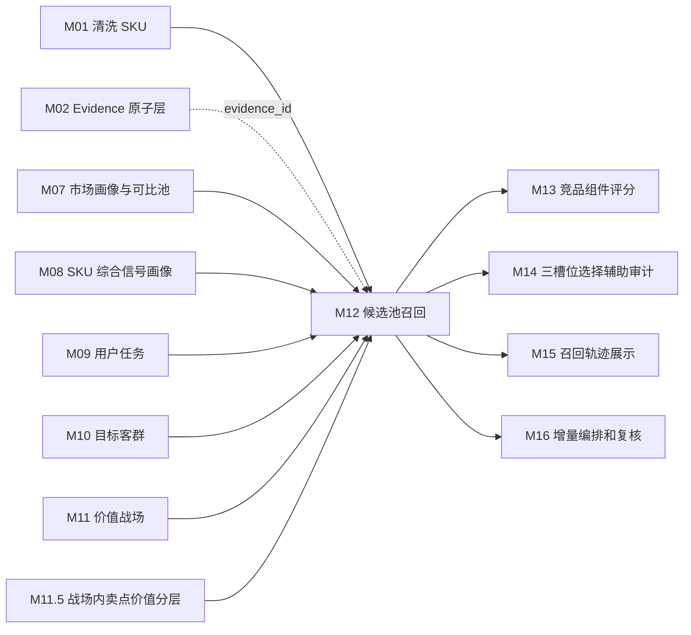
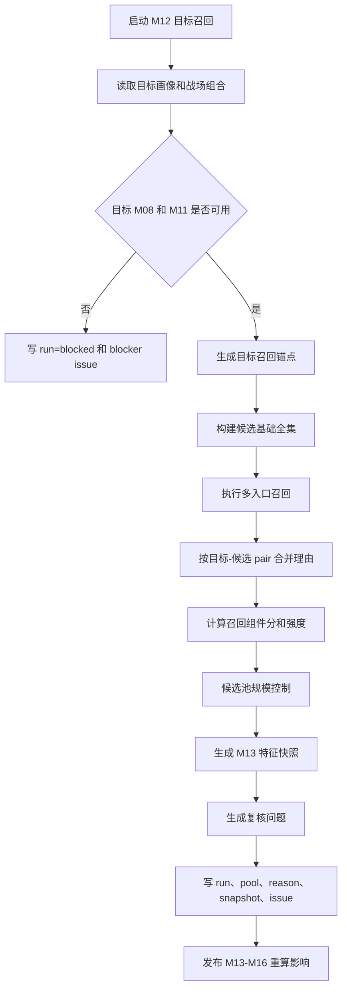

# M12 候选池召回模块详细设计

## 0. 文档定位

本文是 CatForge 彩电核心三竞品真实数据 v2 的 M12 详细设计，基于：

- 需求文档：`docs/core3_mvp/real_data_v2/sop_requirements/M12_candidate_recall_requirements.md`
- 总体架构：`docs/core3_mvp/real_data_v2/sop_detailed_design/00_architecture_data_dictionary_design.md`
- SOP：`cankao/CatForge_竞品生成SOP_详细指导_v1.md`
- 模块说明：`cankao/catforge_sop_md/modules/M12_候选池召回模块.md`
- 展示规范：`cankao/CatForge_核心竞品展示页_UI设计规范_v1.md`
- 205 PostgreSQL 真实样例数据基线
- M07-M11.5 已定义的市场、画像、任务、客群、战场和卖点价值输出契约

M12 的职责是为目标 SKU 召回可解释的竞品候选池。它不判断最终核心竞品，不做组件评分，不做三槽位选择，也不生成高层报告结论。

当前设计阶段要求：本文件应能直接拆成开发任务、数据库迁移、服务实现、测试用例和验收脚本。

## 1. 模块职责

### 1.1 解决的问题

M12 要回答业务上的“哪些 SKU 具备竞争可能，为什么进入候选池”。它从全量清洗 SKU 中，围绕目标 SKU 生成目标-候选 pair，并保留每个 pair 的召回入口、关系类型、代表证据、业务理由和给 M13 评分使用的特征快照。

M12 必须支持以下业务判断：

1. 目标 SKU 和候选 SKU 是否处在同一或相邻竞争语境。
2. 候选 SKU 是正面对打、价格/销量挤压、配置拦截、高端标杆、潜在下探、升级替代、降级替代、场景替代还是服务参考。
3. 候选和目标在战场、任务、客群、卖点价值、价格、尺寸、平台、销量、销额和趋势上如何重合或差异。
4. 召回理由来自哪个上游模块，是否能回溯到 evidence。
5. 候选池规模是否适合交给 M13 做组件评分。
6. 哪些候选只能弱召回或仅复核，不能进入高层页面的核心竞品表达。

### 1.2 输入边界

M12 默认只消费清洗层、画像层、推断层和 evidence 层，不直接读取四张原始表。

允许读取：

- M01 `core3_clean_sku`
- M02 `core3_evidence_atom`
- M07 `core3_sku_market_profile`
- M07 `core3_comparable_pool_baseline`
- M07 `core3_market_pool_member`
- M08 `core3_sku_signal_profile`
- M08 `core3_sku_signal_evidence_matrix`
- M08 `core3_sku_downstream_feature_view where for_module='M12'`
- M09 `core3_sku_task_score`
- M10 `core3_sku_target_group_score`
- M11 `core3_sku_battlefield_score`
- M11 `core3_sku_battlefield_portfolio`
- M11.5 `core3_sku_claim_value_layer`
- M11.5 `core3_sku_battlefield_claim_value_summary`

禁止读取：

- 原始 `week_sales_data`
- 原始 `attribute_data`
- 原始 `selling_points_data`
- 原始 `comment_data`
- M13 评分结果
- M14 三槽位结果
- M15 报告结果

### 1.3 输出边界

M12 输出五类结果：

| 表 | 作用 |
| --- | --- |
| `core3_candidate_recall_run` | 一次目标 SKU 候选召回运行记录 |
| `core3_candidate_pool` | 目标-候选 pair 主表，是 M13 主输入 |
| `core3_candidate_recall_reason` | 一个 pair 的多条召回理由 |
| `core3_candidate_feature_snapshot` | M13 可直接消费的 pair 特征快照 |
| `core3_candidate_recall_review_issue` | 候选召回复核问题 |

M12 不输出最终排序。`recall_priority_score` 只用于候选池收敛和 M13 前置筛选，不是竞品分。

### 1.4 可复用历史结果

满足以下条件时可以复用历史结果：

- 目标 SKU 的 `target_profile_hash` 未变化。
- 参与候选全集的候选 SKU `candidate_profile_hash` 未变化。
- M07 市场画像、可比池和市场成员 hash 未变化。
- M09/M10/M11/M11.5 当前结果的 fingerprint 未变化。
- evidence 状态版本未变化。
- `rule_version` 未变化。

复用只能通过 `is_current=true` 的结果判断，不能删除旧记录后覆盖。

### 1.5 与前后模块关系



M12 消费 M11 的主/次/机会战场和 M11.5 的战场内卖点价值摘要，但不反向修改上游结论。

## 2. 真实数据约束

### 2.1 当前样例数据事实

205 PostgreSQL 当前真实样例：

- 35 个量价型号。
- 品牌均为海信。
- 周期为 `26W01` 到 `26W23`。
- 渠道只有线上。
- 平台为专业电商和平台电商。
- 结构化卖点只覆盖 5 个型号。
- 85E7Q 有量价、参数、评论，但无结构化卖点。

因此 M12 必须遵守：

1. 不按品牌内外过滤候选；海信 SKU 可以互为竞品。
2. 不生成线下渠道、全渠道或 12 个月口径。
3. 85E7Q 这类无结构化卖点 SKU 不能因卖点缺失被剔除。
4. 卖点缺失应降低卖点价值入口置信度，不能伪造宣传证据。
5. 评论维度只能作为上游 M05/M06/M09-M11.5 已处理后的证据使用，M12 不能重新从评论粗标签推导任务、客群或战场。

### 2.2 85E7Q 目标样例约束

以 85E7Q `TV00029115` 为目标时，M12 至少要检查：

- 同 85 寸 SKU：`85E8Q`、`85E5S-PRO`、`85E5Q-PRO`、`85E5Q`、`85E52S-PRO`、`85E52Q`、`85E3Q`、`85D30QD`
- 相邻 75 寸 SKU：用于降级替代、价格/销量挤压和大屏性价比判断。
- 相邻 100 寸 SKU：用于升级替代、高端标杆和大屏换新判断。
- 同价位或相邻价位 SKU：用于正面对打、价格压力、配置拦截和潜在下探。

85E7Q 的重点召回语境：

| 语境 | 应检查的真实信号 |
| --- | --- |
| 高端画质 | Mini LED、高亮度、分区背光、画质评论、同战场得分 |
| 家庭观影升级 | 85 寸、大屏、画质、音效、家庭观看任务 |
| 游戏体育 | 300HZ、HDMI2.1、游戏/看球评论、运动流畅 |
| 大屏性价比 | 价格每英寸、销量、销额、价格价值评论 |
| 智能系统与服务 | 只做辅助召回或复核，不替代产品核心战场 |

## 3. 核心概念和枚举

### 3.1 召回入口 `recall_source`

| 枚举 | 中文含义 | 来源模块 | 强召回资格 |
| --- | --- | --- | --- |
| `comparable_pool` | 可比池召回 | M07/M08 | 是 |
| `battlefield` | 价值战场召回 | M11 | 是 |
| `task` | 用户任务召回 | M09 | 是 |
| `audience` | 目标客群召回 | M10 | 中等，低置信客群降级 |
| `claim_value` | 战场内卖点价值召回 | M11.5 | 是 |
| `market_pressure` | 市场压力召回 | M07/M08 | 是 |
| `scenario_service` | 场景和服务召回 | M09/M10/M11/M11.5 | 否，默认封顶 |

### 3.2 候选关系类型 `relation_type`

| 枚举 | 中文 | 业务解释 |
| --- | --- | --- |
| `direct_fight` | 正面对打 | 主战场、尺寸、价格、平台和核心卖点高度接近 |
| `price_volume_pressure` | 价格/销量挤压 | 更低价格或更强销量承接相近任务和客群 |
| `configuration_pressure` | 配置拦截 | 同价或相近价位下，关键参数或卖点价值更强 |
| `premium_benchmark` | 高端标杆 | 更高价或更高定位 SKU 提供上探参照 |
| `potential_downward_pressure` | 潜在下探 | 高端 SKU 有降价趋势，可能压缩目标价格空间 |
| `upgrade_substitute` | 升级替代 | 更高价格 SKU 承接同一升级需求 |
| `downgrade_substitute` | 降级替代 | 更低价格 SKU 承接基础任务 |
| `scenario_substitute` | 场景替代 | 配置/价格不完全同段，但争夺同一使用场景 |
| `service_reference` | 服务保障参考 | 服务或安装售后形成比较价值 |

一个候选 pair 可以有多个 `relation_type`。M12 不允许只保留最高优先级关系而丢掉其他命中理由。

### 3.3 召回强度 `recall_strength`

| 枚举 | 条件 | 下游处理 |
| --- | --- | --- |
| `strong` | 至少 3 个入口命中，且包含战场或市场入口 | M13 必须评分 |
| `medium` | 至少 2 个入口命中，或 1 个强战场入口且证据完整 | M13 应评分 |
| `weak` | 只有 1 个入口命中，或证据/样本不足 | M13 可评分但需标注 |
| `review_only` | 只有服务、评论或缺失严重 | 默认不进入核心三槽位 |

封顶规则：

| 情况 | 强度上限 |
| --- | --- |
| 仅评论入口 | `weak` |
| 仅服务入口 | `review_only` |
| 无市场证据 | `medium` |
| 无语义证据 | `weak` |
| 候选画像缺失严重 | `weak` |
| 客群低置信且无其他强入口 | `weak` |
| 结构化卖点缺失但参数/评论可补证 | 不封顶，但降低 `claim_value_recall_score` |

### 3.4 价格关系 `price_relation`

| 枚举 | 计算口径 |
| --- | --- |
| `lower` | 候选加权均价低于目标，差距超过 8% |
| `similar` | 候选加权均价与目标差距在正负 8% 内 |
| `higher` | 候选加权均价高于目标，差距超过 8% |
| `unknown` | 目标或候选均价缺失 |

价格差：

```text
price_gap_pct = (candidate_price_wavg - target_price_wavg) / target_price_wavg
```

当目标均价为空、0 或 unknown 时，`price_gap_pct=null`，`price_relation='unknown'`，不得把价格未知当成更低价。

### 3.5 尺寸关系 `size_relation`

| 枚举 | 计算口径 |
| --- | --- |
| `same` | 尺寸相同 |
| `adjacent_larger` | 候选大一档，MVP 首版为 +10 到 +15 寸 |
| `adjacent_smaller` | 候选小一档，MVP 首版为 -10 到 -15 寸 |
| `larger_cross` | 候选明显更大，超过相邻档 |
| `smaller_cross` | 候选明显更小，超过相邻档 |
| `unknown` | 目标或候选尺寸缺失 |

尺寸缺失不能当成不可比，只能降低可比池入口和尺寸相似分。

### 3.6 运行状态 `recall_status`

| 枚举 | 含义 |
| --- | --- |
| `success` | 正常完成，候选池规模和证据可用 |
| `limited` | 完成但数据缺失较多或候选偏少 |
| `review_required` | 完成但需要人工复核 |
| `blocked` | 缺少目标 M08 画像或 M11 战场，无法召回 |
| `failed` | 程序异常失败 |

### 3.7 样本状态 `sample_status`

| 枚举 | 含义 |
| --- | --- |
| `sufficient` | 市场、语义、画像证据满足召回要求 |
| `limited` | 有部分证据缺失，但可形成弱或中召回 |
| `insufficient` | 证据不足，只能复核或阻塞 |
| `unknown` | 上游未提供足够质量状态 |

## 4. 输入输出总览

### 4.1 必须输入

| 输入 | 最小字段 | 用途 |
| --- | --- | --- |
| `core3_clean_sku` | `sku_code`、`model_name`、`brand_name`、`category_code`、`is_current` | 构建候选全集 |
| `core3_sku_signal_profile` | `sku_code`、`profile_hash`、`profile_status`、`profile_summary_json`、`risk_flags_json` | 目标和候选统一画像 |
| `core3_sku_downstream_feature_view` | `for_module='M12'`、`feature_payload_json`、`view_hash` | M12 默认读取的裁剪特征 |
| `core3_sku_market_profile` | 价格、销量、销额、趋势、平台、样本状态、evidence | 价格和市场压力 |
| `core3_comparable_pool_baseline` | 池类型、目标 SKU、统计、rule_version | 可比池入口 |
| `core3_market_pool_member` | 池成员、成员关系、分位、证据 | 可比池成员召回 |
| `core3_sku_task_score` | 任务分、关系等级、置信度、evidence | 任务重合和场景替代 |
| `core3_sku_target_group_score` | 客群分、关系等级、置信度、evidence | 客群重合 |
| `core3_sku_battlefield_score` | 战场分、关系等级、角色作用、evidence | 战场重合 |
| `core3_sku_battlefield_portfolio` | 主/次/机会/弱战场、主召回战场 | 战场召回锚点 |
| `core3_sku_claim_value_layer` | 战场、卖点、层级、价值分、证据 | 卖点价值重合和拦截 |
| `core3_sku_battlefield_claim_value_summary` | 绩效/溢价/门槛/弱感知卖点摘要 | M12 快速匹配卖点重点 |

### 4.2 主要输出

| 输出 | 下游 |
| --- | --- |
| `core3_candidate_recall_run` | M16、运营审计 |
| `core3_candidate_pool` | M13、M14、M15、M16 |
| `core3_candidate_recall_reason` | M13、M15、M16 |
| `core3_candidate_feature_snapshot` | M13 |
| `core3_candidate_recall_review_issue` | M16 |

## 5. 表设计公共字段

除特殊说明外，M12 表都包含以下公共字段：

| 字段 | 类型建议 | 必填 | 说明 |
| --- | --- | --- | --- |
| `id` | `uuid` | 是 | 主键 |
| `project_id` | `uuid` | 是 | 项目 |
| `category_code` | `varchar(64)` | 是 | MVP 为 `TV` |
| `batch_id` | `uuid` | 是 | M00 批次 |
| `run_id` | `uuid` | 是 | M16 或本模块运行 ID |
| `rule_version` | `varchar(64)` | 是 | 召回规则版本 |
| `input_fingerprint` | `varchar(128)` | 是 | 输入摘要 hash |
| `result_hash` | `varchar(128)` | 是 | 输出摘要 hash |
| `is_current` | `boolean` | 是 | 是否当前版本 |
| `created_at` | `timestamptz` | 是 | 创建时间 |
| `updated_at` | `timestamptz` | 是 | 更新时间 |

`is_current=true` 只允许同一业务唯一键保留一条。重跑时新插入结果，并把旧记录置为 `is_current=false`。

## 6. 表设计：`core3_candidate_recall_run`

### 6.1 表用途

记录一次目标 SKU 候选召回运行。它回答“本次从多少 SKU 中召回了多少候选，状态如何，是否需要复核”。

### 6.2 字段

| 字段 | 类型建议 | 必填 | 来源 | 说明 |
| --- | --- | --- | --- | --- |
| `id` | `uuid` | 是 | M12 | 主键 |
| `project_id` | `uuid` | 是 | run context | 项目 |
| `category_code` | `varchar(64)` | 是 | run context | 品类 |
| `batch_id` | `uuid` | 是 | M00 | 批次 |
| `run_id` | `uuid` | 是 | M16/M12 | 本次运行 |
| `target_sku_code` | `varchar(128)` | 是 | 输入 | 目标 SKU |
| `target_model_name` | `varchar(255)` | 是 | M01/M08 | 目标型号 |
| `target_brand_name` | `varchar(255)` | 否 | M01/M08 | 目标品牌 |
| `analysis_window_start` | `varchar(32)` | 否 | M07 | 首版为 `26W01` |
| `analysis_window_end` | `varchar(32)` | 否 | M07 | 首版为 `26W23` |
| `candidate_universe_count` | `integer` | 是 | M12 | 基础候选全集数量 |
| `candidate_selected_count` | `integer` | 是 | M12 | 输出候选数量，不含被拒绝全集 |
| `strong_candidate_count` | `integer` | 是 | M12 | 强召回数量 |
| `medium_candidate_count` | `integer` | 是 | M12 | 中召回数量 |
| `weak_candidate_count` | `integer` | 是 | M12 | 弱召回数量 |
| `review_candidate_count` | `integer` | 是 | M12 | 仅复核数量 |
| `blocked_reason` | `varchar(128)` | 否 | M12 | 阻塞原因 |
| `recall_status` | `varchar(32)` | 是 | M12 | `success/limited/review_required/blocked/failed` |
| `recall_summary_cn` | `text` | 是 | M12 | 中文摘要 |
| `target_anchor_json` | `jsonb` | 是 | M12 | 目标召回锚点 |
| `pool_control_json` | `jsonb` | 是 | M12 | 候选池规模控制结果 |
| `quality_flags_json` | `jsonb` | 是 | M12 | 运行级质量标记 |
| `target_profile_hash` | `varchar(128)` | 是 | M08 | 目标画像 hash |
| `market_fingerprint` | `varchar(128)` | 否 | M07 | 市场画像/可比池 hash |
| `task_fingerprint` | `varchar(128)` | 否 | M09 | 任务结果摘要 |
| `audience_fingerprint` | `varchar(128)` | 否 | M10 | 客群结果摘要 |
| `battlefield_fingerprint` | `varchar(128)` | 否 | M11 | 战场结果摘要 |
| `claim_value_fingerprint` | `varchar(128)` | 否 | M11.5 | 卖点价值结果摘要 |
| `evidence_revision` | `varchar(128)` | 否 | M02 | evidence 状态版本 |
| `rule_version` | `varchar(64)` | 是 | 配置 | 召回规则版本 |
| `input_fingerprint` | `varchar(128)` | 是 | M12 | 输入 hash |
| `result_hash` | `varchar(128)` | 是 | M12 | 输出 hash |
| `is_current` | `boolean` | 是 | M12 | 当前版本 |
| `created_at` | `timestamptz` | 是 | 系统 | 创建时间 |
| `updated_at` | `timestamptz` | 是 | 系统 | 更新时间 |

### 6.3 `target_anchor_json` 结构

```json
{
  "primary_battlefields": ["BF_PREMIUM_PICTURE"],
  "secondary_battlefields": ["BF_FAMILY_VIEWING_UPGRADE"],
  "opportunity_battlefields": ["BF_GAMING_SPORTS"],
  "primary_tasks": ["TASK_LIVING_ROOM_CINEMA"],
  "secondary_tasks": ["TASK_GAMING_ENTERTAINMENT"],
  "primary_audiences": ["TG_FAMILY_UPGRADE"],
  "focus_claims": [
    {
      "battlefield_code": "BF_PREMIUM_PICTURE",
      "claim_code": "CLAIM_MINI_LED_BACKLIGHT",
      "layer": "competitive_performance"
    }
  ],
  "size_inch": 85,
  "price_wavg": 9999.99,
  "price_band": "9000_12000",
  "platforms": ["专业电商", "平台电商"],
  "market_window": "26W01-26W23"
}
```

高层展示 API 不直接返回内部 code，需要由 M15 转为中文业务语言。

### 6.4 约束和索引

```sql
alter table core3_candidate_recall_run
  add constraint pk_core3_candidate_recall_run primary key (id);

create unique index uq_core3_candidate_recall_run_current
on core3_candidate_recall_run(project_id, category_code, batch_id, target_sku_code, rule_version)
where is_current = true;

create index idx_core3_candidate_recall_run_target
on core3_candidate_recall_run(project_id, category_code, batch_id, target_sku_code, recall_status);

create index idx_core3_candidate_recall_run_status
on core3_candidate_recall_run(project_id, category_code, batch_id, recall_status, created_at desc);

create index idx_core3_candidate_recall_run_hash
on core3_candidate_recall_run(project_id, category_code, batch_id, input_fingerprint, rule_version);
```

## 7. 表设计：`core3_candidate_pool`

### 7.1 表用途

记录目标-候选 SKU pair，是 M13 组件评分的主输入。每个 pair 只保留一条当前主记录，但保留所有召回入口和关系类型。

### 7.2 字段

| 字段 | 类型建议 | 必填 | 来源 | 说明 |
| --- | --- | --- | --- | --- |
| `id` | `uuid` | 是 | M12 | 主键 |
| `candidate_recall_run_id` | `uuid` | 是 | M12 | 关联 `core3_candidate_recall_run.id` |
| `project_id` | `uuid` | 是 | run context | 项目 |
| `category_code` | `varchar(64)` | 是 | run context | 品类 |
| `batch_id` | `uuid` | 是 | M00 | 批次 |
| `run_id` | `uuid` | 是 | M16/M12 | 运行 |
| `target_sku_code` | `varchar(128)` | 是 | 输入 | 目标 SKU |
| `target_model_name` | `varchar(255)` | 是 | M01/M08 | 目标型号 |
| `target_brand_name` | `varchar(255)` | 否 | M01/M08 | 目标品牌 |
| `candidate_sku_code` | `varchar(128)` | 是 | M01/M08 | 候选 SKU |
| `candidate_model_name` | `varchar(255)` | 是 | M01/M08 | 候选型号 |
| `candidate_brand_name` | `varchar(255)` | 否 | M01/M08 | 候选品牌 |
| `same_brand_flag` | `boolean` | 是 | M12 | 同品牌标记，不用于排除 |
| `model_family_key` | `varchar(128)` | 否 | M08/M12 | 型号族，用于重复和信息增量复核 |
| `hard_filter_pass` | `boolean` | 是 | M12 | 是否通过基础硬过滤 |
| `hard_filter_reason` | `varchar(128)` | 否 | M12 | 未通过原因 |
| `relation_types_json` | `jsonb` | 是 | M12 | 命中的候选关系类型 |
| `candidate_role_hints_json` | `jsonb` | 是 | M12 | 角色提示，供 M13/M14 辅助 |
| `recall_sources_json` | `jsonb` | 是 | M12 | 命中的召回入口 |
| `matched_battlefields_json` | `jsonb` | 是 | M11/M12 | 战场重合和差异 |
| `matched_tasks_json` | `jsonb` | 是 | M09/M12 | 任务重合和替代链 |
| `matched_audiences_json` | `jsonb` | 是 | M10/M12 | 客群重合和置信度 |
| `matched_claim_layers_json` | `jsonb` | 是 | M11.5/M12 | 战场内卖点价值重合或差异 |
| `price_relation` | `varchar(32)` | 是 | M07/M12 | `lower/similar/higher/unknown` |
| `price_gap_pct` | `numeric(8,4)` | 否 | M07/M12 | 候选相对目标价格差 |
| `target_price_wavg` | `numeric(14,2)` | 否 | M07 | 目标加权均价 |
| `candidate_price_wavg` | `numeric(14,2)` | 否 | M07 | 候选加权均价 |
| `size_relation` | `varchar(32)` | 是 | M08/M12 | 尺寸关系 |
| `target_size_inch` | `numeric(6,2)` | 否 | M03/M08 | 目标尺寸 |
| `candidate_size_inch` | `numeric(6,2)` | 否 | M03/M08 | 候选尺寸 |
| `platform_overlap_score` | `numeric(6,4)` | 是 | M07/M12 | 平台重合度 |
| `market_relation_json` | `jsonb` | 是 | M07/M12 | 销量、销额、趋势、价格压力 |
| `base_comparability_score` | `numeric(6,4)` | 是 | M12 | 基础可比性 |
| `battlefield_recall_score` | `numeric(6,4)` | 是 | M12 | 战场召回分 |
| `task_audience_recall_score` | `numeric(6,4)` | 是 | M12 | 任务客群召回分 |
| `claim_value_recall_score` | `numeric(6,4)` | 是 | M12 | 卖点价值召回分 |
| `market_pressure_recall_score` | `numeric(6,4)` | 是 | M12 | 市场压力召回分 |
| `evidence_quality_score` | `numeric(6,4)` | 是 | M12 | 证据质量 |
| `recall_priority_score` | `numeric(6,4)` | 是 | M12 | 召回优先分，不是竞品分 |
| `recall_strength` | `varchar(32)` | 是 | M12 | `strong/medium/weak/review_only` |
| `sample_status` | `varchar(32)` | 是 | M12 | `sufficient/limited/insufficient/unknown` |
| `data_quality_flags_json` | `jsonb` | 是 | M12 | 数据质量风险 |
| `business_reason_cn` | `text` | 是 | M12 | 中文业务召回理由 |
| `business_reason_short_cn` | `varchar(255)` | 是 | M12 | 高层页面短理由，经 M15 可复用 |
| `review_required` | `boolean` | 是 | M12 | 是否需要复核 |
| `review_reason` | `varchar(128)` | 否 | M12 | 首要复核原因 |
| `evidence_ids` | `uuid[]` | 是 | 上游/M12 | pair 代表 evidence |
| `missing_evidence_reasons_json` | `jsonb` | 是 | M12 | 缺失原因 |
| `target_profile_hash` | `varchar(128)` | 是 | M08 | 目标画像 hash |
| `candidate_profile_hash` | `varchar(128)` | 是 | M08 | 候选画像 hash |
| `pair_feature_hash` | `varchar(128)` | 是 | M12 | pair 特征 hash |
| `rule_version` | `varchar(64)` | 是 | 配置 | 规则版本 |
| `input_fingerprint` | `varchar(128)` | 是 | M12 | 输入 hash |
| `result_hash` | `varchar(128)` | 是 | M12 | 输出 hash |
| `is_current` | `boolean` | 是 | M12 | 当前版本 |
| `created_at` | `timestamptz` | 是 | 系统 | 创建时间 |
| `updated_at` | `timestamptz` | 是 | 系统 | 更新时间 |

### 7.3 JSON 字段结构

#### `relation_types_json`

```json
[
  {
    "relation_type": "direct_fight",
    "support_score": 0.82,
    "support_level": "strong",
    "source_reason_ids": ["uuid"],
    "business_label_cn": "正面对打"
  }
]
```

#### `matched_battlefields_json`

```json
{
  "overlap": [
    {
      "battlefield_code": "BF_PREMIUM_PICTURE",
      "target_level": "main",
      "candidate_level": "main",
      "target_score": 0.86,
      "candidate_score": 0.81,
      "overlap_strength": "strong"
    }
  ],
  "target_only": [],
  "candidate_only": [
    {
      "battlefield_code": "BF_SERVICE_ASSURANCE",
      "candidate_level": "secondary"
    }
  ]
}
```

#### `matched_claim_layers_json`

```json
{
  "same_performance_claims": [
    {
      "battlefield_code": "BF_PREMIUM_PICTURE",
      "claim_code": "CLAIM_MINI_LED_BACKLIGHT",
      "target_layer": "competitive_performance",
      "candidate_layer": "competitive_performance"
    }
  ],
  "candidate_stronger_claims": [
    {
      "battlefield_code": "BF_PREMIUM_PICTURE",
      "claim_code": "CLAIM_HIGH_BRIGHTNESS_HDR",
      "target_layer": "basic_threshold",
      "candidate_layer": "premium_tendency"
    }
  ],
  "weak_or_missing": [
    {
      "claim_code": "CLAIM_GAMING_LOW_LATENCY",
      "reason": "目标或候选卖点证据不足"
    }
  ]
}
```

#### `market_relation_json`

```json
{
  "window": "26W01-26W23",
  "platforms_considered": ["专业电商", "平台电商"],
  "candidate_sales_strength": "higher",
  "candidate_amount_strength": "similar",
  "candidate_price_trend": "down",
  "target_price_trend": "stable",
  "pressure_flags": ["lower_price", "sales_not_weaker"],
  "market_evidence_status": "sufficient"
}
```

### 7.4 约束和索引

```sql
alter table core3_candidate_pool
  add constraint pk_core3_candidate_pool primary key (id);

alter table core3_candidate_pool
  add constraint fk_core3_candidate_pool_run
  foreign key (candidate_recall_run_id)
  references core3_candidate_recall_run(id);

create unique index uq_core3_candidate_pool_current
on core3_candidate_pool(
  project_id,
  category_code,
  batch_id,
  target_sku_code,
  candidate_sku_code,
  rule_version
)
where is_current = true;

create index idx_core3_candidate_pool_target_strength
on core3_candidate_pool(project_id, category_code, batch_id, target_sku_code, recall_strength, recall_priority_score desc);

create index idx_core3_candidate_pool_candidate
on core3_candidate_pool(project_id, category_code, batch_id, candidate_sku_code);

create index idx_core3_candidate_pool_review
on core3_candidate_pool(project_id, category_code, batch_id, review_required, review_reason);

create index idx_core3_candidate_pool_role_gin
on core3_candidate_pool using gin (candidate_role_hints_json);

create index idx_core3_candidate_pool_relation_gin
on core3_candidate_pool using gin (relation_types_json);
```

## 8. 表设计：`core3_candidate_recall_reason`

### 8.1 表用途

记录每个目标-候选 pair 的多条召回理由。它回答“这个候选到底是从哪几个入口被召回，每个入口的证据是什么”。

一个 pair 必须至少有一条 `core3_candidate_recall_reason`。

### 8.2 字段

| 字段 | 类型建议 | 必填 | 来源 | 说明 |
| --- | --- | --- | --- | --- |
| `id` | `uuid` | 是 | M12 | 主键 |
| `candidate_pool_id` | `uuid` | 是 | M12 | 关联 `core3_candidate_pool.id` |
| `candidate_recall_run_id` | `uuid` | 是 | M12 | 关联运行 |
| `project_id` | `uuid` | 是 | run context | 项目 |
| `category_code` | `varchar(64)` | 是 | run context | 品类 |
| `batch_id` | `uuid` | 是 | M00 | 批次 |
| `run_id` | `uuid` | 是 | M16/M12 | 运行 |
| `target_sku_code` | `varchar(128)` | 是 | 输入 | 目标 SKU |
| `candidate_sku_code` | `varchar(128)` | 是 | 输入 | 候选 SKU |
| `reason_type` | `varchar(64)` | 是 | M12 | 召回入口 |
| `relation_type` | `varchar(64)` | 是 | M12 | 候选关系类型 |
| `source_module` | `varchar(32)` | 是 | M12 | M07/M08/M09/M10/M11/M11.5 |
| `source_table` | `varchar(128)` | 否 | M12 | 来源表 |
| `source_record_ids_json` | `jsonb` | 是 | M12 | 来源记录 ID |
| `support_score` | `numeric(6,4)` | 是 | M12 | 支撑分 |
| `support_level` | `varchar(32)` | 是 | M12 | `strong/medium/weak/missing` |
| `confidence` | `numeric(6,4)` | 是 | M12 | 理由置信度 |
| `cap_applied` | `varchar(64)` | 否 | M12 | 封顶规则 |
| `business_reason_cn` | `text` | 是 | M12 | 中文理由 |
| `source_payload_json` | `jsonb` | 是 | M12 | 结构化来源信息 |
| `risk_flags_json` | `jsonb` | 是 | M12 | 风险 |
| `evidence_ids` | `uuid[]` | 是 | 上游/M12 | 证据 |
| `missing_evidence_reasons_json` | `jsonb` | 是 | M12 | 缺失原因 |
| `rule_version` | `varchar(64)` | 是 | 配置 | 规则版本 |
| `input_fingerprint` | `varchar(128)` | 是 | M12 | 输入 hash |
| `result_hash` | `varchar(128)` | 是 | M12 | 输出 hash |
| `is_current` | `boolean` | 是 | M12 | 当前版本 |
| `created_at` | `timestamptz` | 是 | 系统 | 创建时间 |
| `updated_at` | `timestamptz` | 是 | 系统 | 更新时间 |

### 8.3 `source_payload_json` 示例

可比池理由：

```json
{
  "pool_type": "same_size_same_price_platform_overlap",
  "target_size_inch": 85,
  "candidate_size_inch": 85,
  "price_relation": "similar",
  "platform_overlap_score": 1.0,
  "market_window": "26W01-26W23"
}
```

战场理由：

```json
{
  "battlefield_code": "BF_PREMIUM_PICTURE",
  "target_battlefield_level": "main",
  "candidate_battlefield_level": "main",
  "target_score": 0.86,
  "candidate_score": 0.81,
  "overlap_rule": "main_to_main"
}
```

卖点价值理由：

```json
{
  "battlefield_code": "BF_GAMING_SPORTS",
  "claim_code": "CLAIM_HIGH_REFRESH_RATE",
  "target_layer": "premium_tendency",
  "candidate_layer": "competitive_performance",
  "relation": "same_or_close_layer"
}
```

### 8.4 约束和索引

```sql
alter table core3_candidate_recall_reason
  add constraint pk_core3_candidate_recall_reason primary key (id);

alter table core3_candidate_recall_reason
  add constraint fk_core3_candidate_recall_reason_pool
  foreign key (candidate_pool_id)
  references core3_candidate_pool(id);

create unique index uq_core3_candidate_recall_reason_current
on core3_candidate_recall_reason(
  project_id,
  category_code,
  batch_id,
  target_sku_code,
  candidate_sku_code,
  reason_type,
  relation_type,
  source_module,
  result_hash,
  rule_version
)
where is_current = true;

create index idx_core3_candidate_recall_reason_pair
on core3_candidate_recall_reason(project_id, category_code, batch_id, target_sku_code, candidate_sku_code);

create index idx_core3_candidate_recall_reason_type
on core3_candidate_recall_reason(project_id, category_code, batch_id, reason_type, relation_type, support_level);

create index idx_core3_candidate_recall_reason_evidence_gin
on core3_candidate_recall_reason using gin (evidence_ids);
```

## 9. 表设计：`core3_candidate_feature_snapshot`

### 9.1 表用途

保存 M13 评分所需的 pair 特征快照。M13 不应重新拼 M07-M11.5 的散表，而应默认读取该表。

该表不保存最终组件分，只保存可复用特征、原始差异、证据索引和质量状态。

### 9.2 字段

| 字段 | 类型建议 | 必填 | 来源 | 说明 |
| --- | --- | --- | --- | --- |
| `id` | `uuid` | 是 | M12 | 主键 |
| `candidate_pool_id` | `uuid` | 是 | M12 | 关联候选 pair |
| `candidate_recall_run_id` | `uuid` | 是 | M12 | 关联运行 |
| `project_id` | `uuid` | 是 | run context | 项目 |
| `category_code` | `varchar(64)` | 是 | run context | 品类 |
| `batch_id` | `uuid` | 是 | M00 | 批次 |
| `run_id` | `uuid` | 是 | M16/M12 | 运行 |
| `target_sku_code` | `varchar(128)` | 是 | 输入 | 目标 SKU |
| `candidate_sku_code` | `varchar(128)` | 是 | 输入 | 候选 SKU |
| `battlefield_overlap_json` | `jsonb` | 是 | M11/M12 | 战场重合 |
| `task_overlap_json` | `jsonb` | 是 | M09/M12 | 任务重合 |
| `audience_overlap_json` | `jsonb` | 是 | M10/M12 | 客群重合 |
| `claim_value_overlap_json` | `jsonb` | 是 | M11.5/M12 | 卖点价值重合与差异 |
| `price_feature_json` | `jsonb` | 是 | M07/M12 | 价格特征 |
| `channel_feature_json` | `jsonb` | 是 | M07/M12 | 平台/渠道特征 |
| `size_feature_json` | `jsonb` | 是 | M03/M08/M12 | 尺寸特征 |
| `market_feature_json` | `jsonb` | 是 | M07/M12 | 销量、销额、趋势 |
| `param_feature_json` | `jsonb` | 是 | M03/M08/M12 | 关键参数相似与优劣 |
| `quality_feature_json` | `jsonb` | 是 | M08/M12 | 缺失、冲突、样本不足 |
| `m13_component_input_json` | `jsonb` | 是 | M12 | M13 组件分的直接输入 |
| `evidence_ids` | `uuid[]` | 是 | 上游/M12 | 代表 evidence |
| `feature_hash` | `varchar(128)` | 是 | M12 | 快照 hash |
| `rule_version` | `varchar(64)` | 是 | 配置 | 规则版本 |
| `input_fingerprint` | `varchar(128)` | 是 | M12 | 输入 hash |
| `result_hash` | `varchar(128)` | 是 | M12 | 输出 hash |
| `is_current` | `boolean` | 是 | M12 | 当前版本 |
| `created_at` | `timestamptz` | 是 | 系统 | 创建时间 |
| `updated_at` | `timestamptz` | 是 | 系统 | 更新时间 |

### 9.3 `m13_component_input_json` 结构

```json
{
  "price_similarity": {
    "raw": 0.88,
    "basis": "weighted_avg_price",
    "evidence_ids": ["uuid"]
  },
  "price_advantage": {
    "raw": 0.20,
    "price_gap_pct": -0.08
  },
  "channel_overlap": {
    "raw": 1.0,
    "platforms": ["专业电商", "平台电商"]
  },
  "size_similarity": {
    "raw": 1.0,
    "size_relation": "same"
  },
  "param_similarity": {
    "raw": 0.76,
    "matched_params": ["size_inch", "refresh_rate", "hdmi_2_1"],
    "different_params": ["brightness", "local_dimming_zones"]
  },
  "claim_similarity": {
    "raw": 0.70,
    "matched_claims": ["CLAIM_MINI_LED_BACKLIGHT"],
    "missing_reason": "目标缺结构化卖点，使用参数和评论补证"
  },
  "task_similarity": {
    "raw": 0.82,
    "matched_tasks": ["TASK_LIVING_ROOM_CINEMA"]
  },
  "target_group_similarity": {
    "raw": 0.78,
    "matched_groups": ["TG_FAMILY_UPGRADE"]
  },
  "battlefield_similarity": {
    "raw": 0.85,
    "matched_battlefields": ["BF_PREMIUM_PICTURE"]
  },
  "sales_strength": {
    "raw": 0.63,
    "basis": "26W01-26W23 online"
  },
  "param_superiority": {
    "raw": 0.25,
    "candidate_stronger_params": []
  },
  "claim_superiority": {
    "raw": 0.35,
    "candidate_stronger_claims": []
  },
  "price_drop_signal": {
    "raw": 0.10,
    "basis": "recent_week_trend"
  },
  "recent_sales_growth": {
    "raw": 0.18,
    "basis": "recent_week_trend"
  },
  "evidence_quality": {
    "raw": 0.72,
    "missing_domains": ["structured_claim"]
  }
}
```

M13 可以重新归一化这些 raw 值，但不能绕过 M12 重新做候选召回。

### 9.4 约束和索引

```sql
alter table core3_candidate_feature_snapshot
  add constraint pk_core3_candidate_feature_snapshot primary key (id);

alter table core3_candidate_feature_snapshot
  add constraint fk_core3_candidate_feature_snapshot_pool
  foreign key (candidate_pool_id)
  references core3_candidate_pool(id);

create unique index uq_core3_candidate_feature_snapshot_current
on core3_candidate_feature_snapshot(
  project_id,
  category_code,
  batch_id,
  target_sku_code,
  candidate_sku_code,
  rule_version
)
where is_current = true;

create index idx_core3_candidate_feature_snapshot_pair
on core3_candidate_feature_snapshot(project_id, category_code, batch_id, target_sku_code, candidate_sku_code);

create index idx_core3_candidate_feature_snapshot_feature_hash
on core3_candidate_feature_snapshot(project_id, category_code, batch_id, feature_hash);

create index idx_core3_candidate_feature_snapshot_m13_gin
on core3_candidate_feature_snapshot using gin (m13_component_input_json);
```

## 10. 表设计：`core3_candidate_recall_review_issue`

### 10.1 表用途

记录 M12 运行级、目标级、候选级的复核问题。该表由 M16 消费进入复核队列。

### 10.2 字段

| 字段 | 类型建议 | 必填 | 来源 | 说明 |
| --- | --- | --- | --- | --- |
| `id` | `uuid` | 是 | M12 | 主键 |
| `candidate_recall_run_id` | `uuid` | 是 | M12 | 关联运行 |
| `candidate_pool_id` | `uuid` | 否 | M12 | 可为空，表示目标级问题 |
| `project_id` | `uuid` | 是 | run context | 项目 |
| `category_code` | `varchar(64)` | 是 | run context | 品类 |
| `batch_id` | `uuid` | 是 | M00 | 批次 |
| `run_id` | `uuid` | 是 | M16/M12 | 运行 |
| `target_sku_code` | `varchar(128)` | 是 | 输入 | 目标 SKU |
| `candidate_sku_code` | `varchar(128)` | 否 | 输入 | 候选 SKU |
| `issue_scope` | `varchar(32)` | 是 | M12 | `run/target/pair/reason/snapshot` |
| `issue_type` | `varchar(64)` | 是 | M12 | 问题类型 |
| `issue_level` | `varchar(32)` | 是 | M12 | `warning/review/blocker` |
| `issue_message_cn` | `text` | 是 | M12 | 中文问题 |
| `suggested_action_cn` | `text` | 否 | M12 | 建议动作 |
| `source_payload_json` | `jsonb` | 是 | M12 | 问题上下文 |
| `evidence_ids` | `uuid[]` | 是 | 上游/M12 | 相关证据 |
| `resolved_status` | `varchar(32)` | 是 | M16 | `open/resolved/ignored` |
| `resolved_by` | `varchar(128)` | 否 | M16 | 处理人 |
| `resolved_at` | `timestamptz` | 否 | M16 | 处理时间 |
| `resolution_note` | `text` | 否 | M16 | 处理备注 |
| `rule_version` | `varchar(64)` | 是 | 配置 | 规则版本 |
| `input_fingerprint` | `varchar(128)` | 是 | M12 | 输入 hash |
| `result_hash` | `varchar(128)` | 是 | M12 | 输出 hash |
| `is_current` | `boolean` | 是 | M12 | 当前版本 |
| `created_at` | `timestamptz` | 是 | 系统 | 创建时间 |
| `updated_at` | `timestamptz` | 是 | 系统 | 更新时间 |

### 10.3 问题类型

| `issue_type` | 级别 | 触发条件 |
| --- | --- | --- |
| `missing_target_profile` | blocker | 目标缺 M08 画像 |
| `missing_target_battlefield` | blocker | 目标缺 M11 战场结果 |
| `empty_pool` | blocker | 无候选输出 |
| `too_small_pool` | review | 当前 35 型号样例下候选数少于 3 |
| `too_large_pool` | review | 候选池过大或原因重复 |
| `single_source_pool` | review | 候选全部来自单一入口 |
| `all_candidates_insufficient_sample` | review | 候选全部样本不足 |
| `no_market_evidence` | review | 候选或目标缺市场证据 |
| `no_semantic_evidence` | review | 候选缺任务/客群/战场/卖点语义证据 |
| `only_service_signal` | review | 候选只因服务信号进入 |
| `weak_audience_signal` | warning | 客群低置信但被用于召回 |
| `structured_claim_missing` | warning | 结构化卖点缺失导致卖点价值入口降级 |
| `model_family_overcrowded` | review | 同一型号族候选过多，业务增量不足 |
| `feature_snapshot_missing` | blocker | 候选已入池但 M13 快照缺失 |
| `duplicate_reason` | warning | 同一入口重复生成等价理由 |

### 10.4 约束和索引

```sql
alter table core3_candidate_recall_review_issue
  add constraint pk_core3_candidate_recall_review_issue primary key (id);

alter table core3_candidate_recall_review_issue
  add constraint fk_core3_candidate_recall_review_issue_run
  foreign key (candidate_recall_run_id)
  references core3_candidate_recall_run(id);

create unique index uq_core3_candidate_recall_review_issue_current
on core3_candidate_recall_review_issue(
  project_id,
  category_code,
  batch_id,
  target_sku_code,
  coalesce(candidate_sku_code, ''),
  issue_scope,
  issue_type,
  result_hash,
  rule_version
)
where is_current = true;

create index idx_core3_candidate_recall_review_issue_open
on core3_candidate_recall_review_issue(project_id, category_code, batch_id, resolved_status, issue_level);

create index idx_core3_candidate_recall_review_issue_target
on core3_candidate_recall_review_issue(project_id, category_code, batch_id, target_sku_code, candidate_sku_code);
```

## 11. 目标召回锚点生成

### 11.1 锚点来源

M12 在召回前必须先为目标 SKU 生成目标锚点。

| 锚点 | 来源 | 处理 |
| --- | --- | --- |
| 主战场 | M11 `core3_sku_battlefield_portfolio.primary_search_battlefield_codes_json` | 强召回主条件 |
| 次战场 | M11 `secondary_search_battlefield_codes_json` | 辅助召回 |
| 机会战场 | M11 opportunity | 扩展召回，需要市场或价格压力 |
| 主任务 | M09 `relation_level in ('main','primary')` | 任务重合 |
| 次任务 | M09 `relation_level in ('secondary','supporting')` | 场景替代 |
| 主客群 | M10 高分且高置信客群 | 客群重合 |
| 重点卖点 | M11.5 summary 中绩效/溢价/门槛卖点 | 卖点价值召回 |
| 尺寸 | M08/M03 标准尺寸 | 同尺寸、相邻尺寸 |
| 价格 | M07 加权均价和价格带 | 同价、低价、高价、下探 |
| 平台 | M07 平台份额 | 平台重合 |
| 市场 | M07 销量、销额、趋势 | 压力召回 |

### 11.2 目标必备条件

M12 开始目标召回时必须检查：

| 条件 | 缺失处理 |
| --- | --- |
| 目标有 `core3_sku_signal_profile` | 缺失则 `blocked` |
| 目标有 `core3_sku_downstream_feature_view for_module='M12'` | 缺失则 `review_required`，可回退到 profile 摘要 |
| 目标有 M11 战场组合 | 缺失则 `blocked` |
| 目标有 M07 市场画像 | 缺失则可弱召回，市场入口不可用 |
| 目标有 M09/M10 | 缺失则任务/客群入口不可用 |
| 目标有 M11.5 | 缺失则卖点价值入口不可用 |

目标缺 M08 或 M11 时，不能继续强行召回，必须写入 `core3_candidate_recall_run.recall_status='blocked'` 和 review issue。

## 12. 候选基础全集构建

### 12.1 硬过滤

基础全集硬过滤只做品类和身份边界，不做品牌排除。

必须满足：

1. `category_code='TV'` 或清洗品类为彩电并已映射到 TV。
2. `candidate_sku_code != target_sku_code`。
3. 候选存在 `core3_clean_sku is_current=true`。
4. 候选存在 M08 画像，或存在可解释的画像缺失 issue。
5. 候选至少有一个 evidence 或一个当前上游推断结果。

不得因为以下情况直接剔除：

- 同品牌。
- 结构化卖点缺失。
- 评论不足。
- 市场证据局部缺失。
- 客群或任务低置信。

这些情况进入质量标记或复核规则。

### 12.2 软过滤和召回入口

价格、销量、尺寸、平台等字段缺失时，只影响对应召回入口：

| 缺失 | 不可用入口 | 其他入口 |
| --- | --- | --- |
| 价格缺失 | 可比池同价、价格压力、潜在下探 | 战场、任务、客群、卖点价值仍可弱召回 |
| 尺寸缺失 | 同尺寸、相邻尺寸 | 战场、任务、客群仍可弱召回 |
| 平台缺失 | 平台重合 | 战场、任务、客群仍可弱召回 |
| 市场缺失 | 销量/销额/趋势压力 | 最高 `medium` |
| 语义缺失 | 任务/客群/战场/卖点价值 | 最高 `weak` |

### 12.3 候选全集输出统计

基础全集不单独落表，但必须写入 `core3_candidate_recall_run`：

- `candidate_universe_count`
- `quality_flags_json.universe_excluded_count`
- `quality_flags_json.universe_excluded_reasons`
- `pool_control_json.universe_scope`

如果全集小于 3，要写目标级 review issue。

## 13. 多入口召回规则

### 13.1 总体合并方式

M12 采用多入口召回、pair 去重、理由保留：

```text
candidate_reasons = []
candidate_reasons += recall_by_comparable_pool(target_anchor, universe)
candidate_reasons += recall_by_battlefield(target_anchor, universe)
candidate_reasons += recall_by_task(target_anchor, universe)
candidate_reasons += recall_by_audience(target_anchor, universe)
candidate_reasons += recall_by_claim_value(target_anchor, universe)
candidate_reasons += recall_by_market_pressure(target_anchor, universe)
candidate_reasons += recall_by_scenario_service(target_anchor, universe)

pairs = merge_reasons_by_target_candidate(candidate_reasons)
```

每个召回入口返回标准 reason 对象：

```json
{
  "target_sku_code": "TV00029115",
  "candidate_sku_code": "TVxxxx",
  "reason_type": "battlefield",
  "relation_type": "direct_fight",
  "source_module": "M11",
  "support_score": 0.82,
  "support_level": "strong",
  "business_reason_cn": "与目标同属高端画质主战场，尺寸和价格带接近，可进入正面对打候选。",
  "source_payload_json": {},
  "evidence_ids": []
}
```

### 13.2 可比池召回

来源：

- `core3_comparable_pool_baseline`
- `core3_market_pool_member`
- M08 的 `comparable_pool_summary`

召回条件：

| 条件 | 关系类型 |
| --- | --- |
| 同尺寸 + 同价位 + 平台重合 | `direct_fight` |
| 同尺寸 + 更低价 + 销量不弱 | `price_volume_pressure` |
| 相邻大尺寸 + 更高价 + 战场重合 | `upgrade_substitute` 或 `premium_benchmark` |
| 相邻小尺寸 + 更低价 + 任务重合 | `downgrade_substitute` |
| 同价位但关键参数强于目标 | `configuration_pressure` |

首版阈值：

| 指标 | 阈值 |
| --- | --- |
| 平台重合度 | `>= 0.30` |
| 同价位 | 价格差在正负 8% 内 |
| 相邻价位 | 价格差在正负 30% 内 |
| 销量不弱 | 候选销量分位不低于目标分位 - 0.15 |
| 同尺寸 | 尺寸相同 |
| 相邻尺寸 | 75/85/100 等相邻档 |

如果候选来自 M07 可比池，但市场样本不足，仍可生成 reason，但 `support_level='weak'`。

### 13.3 价值战场召回

来源：

- `core3_sku_battlefield_score`
- `core3_sku_battlefield_portfolio`

召回条件：

| 条件 | 支撑 |
| --- | --- |
| 目标主战场 = 候选主战场 | 强 |
| 目标主战场 = 候选次战场 | 中 |
| 目标次战场 = 候选主战场 | 中 |
| 目标机会战场 = 候选主战场，且价格或销量有压力 | 中 |
| 只重合弱战场 | 弱或不召回 |

默认不把 `BF_SERVICE_ASSURANCE` 作为产品核心正面对打主线。若服务战场是唯一重合，只能生成 `scenario_service` 或 `service_reference`，强度封顶为 `review_only`。

### 13.4 用户任务召回

来源：

- `core3_sku_task_score`

召回条件：

| 条件 | 关系类型 |
| --- | --- |
| 同一主任务 | `direct_fight` 或 `scenario_substitute` |
| 目标主任务 = 候选次任务 | `scenario_substitute` |
| 任务组合相似 | `scenario_substitute` |
| 大屏换新与性价比购买替代链 | `downgrade_substitute` 或 `price_volume_pressure` |
| 高端画质影音与客厅影院观影组合 | `direct_fight` 或 `premium_benchmark` |

M12 不能从评论粗标签重新抽任务，只能使用 M09 已确认任务。

### 13.5 目标客群召回

来源：

- `core3_sku_target_group_score`

召回条件：

| 条件 | 处理 |
| --- | --- |
| 同一主客群且高置信 | 中到强 |
| 目标主客群 = 候选次客群 | 中 |
| 客群不同但任务和价格压力强 | 场景替代辅助 |
| 客群低置信 | reason 标记 `weak_audience_signal` |

客群入口不能独立形成 strong，必须有任务、战场、市场或卖点价值入口支撑。

### 13.6 战场内卖点价值召回

来源：

- `core3_sku_claim_value_layer`
- `core3_sku_battlefield_claim_value_summary`

召回条件：

| 条件 | 关系类型 |
| --- | --- |
| 同战场同绩效卖点或同溢价卖点 | `direct_fight` |
| 候选在目标弱感知卖点上更强 | `configuration_pressure` |
| 候选拥有相同门槛卖点但价格更低 | `price_volume_pressure` |
| 候选在目标主战场卖点层级整体更强且价格更高 | `premium_benchmark` |
| 高端候选卖点更强且价格趋势下探 | `potential_downward_pressure` |
| 目标或候选卖点样本不足但参数强 | 弱召回并复核 |

M12 不重新计算 M11.5 的 PSI、SSI、SAI、CPI，只使用 M11.5 输出的 layer、score、summary 和 evidence。

### 13.7 市场压力召回

来源：

- `core3_sku_market_profile`
- M08 市场摘要

召回条件：

| 条件 | 关系类型 |
| --- | --- |
| 同价位高销量 | `price_volume_pressure` |
| 同价位高销额 | `direct_fight` 或 `price_volume_pressure` |
| 更低价 + 销量不弱 | `price_volume_pressure` |
| 更高价 + 销额不弱 + 主战场重合 | `premium_benchmark` |
| 更高价 + 近期价格下行 + 主战场重合 | `potential_downward_pressure` |
| 相邻尺寸价格每英寸更低 | `downgrade_substitute` 或 `price_volume_pressure` |

市场口径必须保留：

- 周期：`26W01-26W23`
- 渠道：线上
- 平台：专业电商、平台电商
- 价格：加权均价或最近有效均价，需在 payload 中说明

### 13.8 场景与服务召回

来源：

- M09/M10 场景任务和客群
- M11 服务保障、家居美学、智能系统等辅助战场
- M11.5 服务类卖点价值

边界：

1. 服务保障只作为服务侧比较或风险提示。
2. 新家装修、安装服务、家居美学可以作为场景替代辅助入口。
3. 仅服务信号召回时 `recall_strength='review_only'`。
4. 仅场景服务召回的候选默认不挤占产品核心候选名额。

## 14. 召回优先分和强度计算

### 14.1 组件分

```text
recall_priority_score =
  base_comparability_score * 0.20
  + battlefield_recall_score * 0.25
  + task_audience_recall_score * 0.15
  + claim_value_recall_score * 0.15
  + market_pressure_recall_score * 0.20
  + evidence_quality_score * 0.05
```

每个组件取值范围 `0.00-1.00`。

### 14.2 组件计算建议

| 组件 | 计算来源 | 首版规则 |
| --- | --- | --- |
| `base_comparability_score` | 尺寸、价格、平台、品类 | 同品类基础 0.25，同尺寸 0.25，同/邻价 0.25，平台重合 0.25 |
| `battlefield_recall_score` | M11 | 主主重合 1.0，主次/次主 0.75，机会主且市场压力 0.55 |
| `task_audience_recall_score` | M09/M10 | 任务 60%，客群 40%，低置信客群按 0.5 折减 |
| `claim_value_recall_score` | M11.5 | 同绩效/溢价 1.0，候选更强 0.85，同门槛 0.55，样本不足 0.30 |
| `market_pressure_recall_score` | M07 | 低价高销 1.0，同价高销 0.85，高端标杆 0.70，市场缺失 0 |
| `evidence_quality_score` | M02/M08 | 证据域覆盖、样本充分、缺失折减 |

### 14.3 强度判定

1. 统计 `hit_source_count`。
2. 判断是否包含强入口：`comparable_pool`、`battlefield`、`claim_value`、`market_pressure`。
3. 初判：
   - `hit_source_count >= 3` 且包含战场或市场入口：`strong`
   - `hit_source_count >= 2`：`medium`
   - `hit_source_count = 1`：`weak`
4. 应用封顶规则。
5. 如果 `recall_priority_score < 0.25`，最高为 `weak`。
6. 如果 `recall_priority_score >= 0.70` 且未触发封顶，可为 `strong`。

### 14.4 关系类型优先级

关系类型不互斥，但 M12 需要给 M13/M14 提供角色提示：

| 角色提示 | 来源关系 |
| --- | --- |
| `direct` | `direct_fight` |
| `pressure` | `price_volume_pressure`、`downgrade_substitute` |
| `benchmark` | `premium_benchmark` |
| `potential` | `potential_downward_pressure` |
| `configuration` | `configuration_pressure` |
| `scenario` | `scenario_substitute` |
| `service` | `service_reference` |

若一个候选同时命中多个角色，全部保留到 `candidate_role_hints_json`。M14 后续负责在三槽位中选择，不由 M12 裁决。

## 15. 去重合并和候选池收敛

### 15.1 Pair 去重

同一 `target_sku_code + candidate_sku_code + rule_version` 只生成一条当前 `core3_candidate_pool` 记录。

合并规则：

- `relation_types_json` 汇总全部关系类型。
- `recall_sources_json` 汇总全部召回入口。
- `matched_battlefields_json` 合并战场重合。
- `matched_tasks_json` 合并任务重合。
- `matched_audiences_json` 合并客群重合。
- `matched_claim_layers_json` 合并卖点层级重合与差异。
- `evidence_ids` 去重，最多保留代表 evidence，完整证据在 reason 级保存。
- `business_reason_cn` 选最重要 2-3 条理由组织成中文解释。
- `recall_priority_score` 使用综合组件分，不简单取最高入口分。

### 15.2 候选池规模控制

候选池规模目标：

| 数据规模 | 合理候选规模 |
| --- | --- |
| 当前 35 型号样例 | 8-20 个 |
| 100-500 SKU | 15-40 个 |
| 1000+ SKU | 20-80 个 |

收敛顺序：

1. 保留所有 `strong` 候选。
2. 每个目标主战场至少保留 direct、pressure、benchmark/potential 类型候选。
3. 保留价格/销量压力明显候选。
4. 保留高端标杆或潜在下探候选。
5. 弱召回只保留有明确业务增量的候选。
6. 仅服务信号候选进入复核，不挤占产品核心候选名额。

### 15.3 当前 35 型号样例特殊处理

当前样例只有 35 个量价型号，不能机械套用 1000 SKU 的 20-80 规模。

规则：

- 候选少于 3：`too_small_pool`。
- 候选 3-7：`limited`，但可继续 M13。
- 候选 8-20：合理。
- 候选超过 25：检查是否过滤过松或同型号族过密。
- 35 个样例下不能为了凑够 8 个候选伪造弱理由。

## 16. 处理流程

### 16.1 总流程



### 16.2 编号步骤

1. 读取 `run_context`：`project_id`、`category_code`、`batch_id`、`run_id`、目标 SKU 列表、`rule_version`。
2. 对每个目标 SKU 读取 M08 画像和 M11 战场组合。
3. 缺 M08 或 M11 时写 blocked run 和 review issue，停止该目标。
4. 读取 M07、M09、M10、M11.5 当前结果，生成目标锚点。
5. 从 M01/M08 构建基础候选全集。
6. 对每个候选读取 M08 视图、M07 市场、M09/M10/M11/M11.5 当前结果摘要。
7. 执行七个召回入口，生成 reason 列表。
8. reason 去重，按 pair 合并。
9. 计算价格关系、尺寸关系、平台重合和市场关系。
10. 计算召回优先分和召回强度。
11. 应用封顶规则。
12. 应用候选池规模控制。
13. 生成中文 `business_reason_cn`。
14. 生成 M13 `core3_candidate_feature_snapshot`。
15. 生成复核问题。
16. 在事务中写入五张输出表。
17. 将旧当前记录置为 `is_current=false`。
18. 通知 M16 下游 M13-M16 需要重算。

### 16.3 伪代码

```python
def run_candidate_recall(context, target_sku_code):
    target_profile = feature_repo.get_sku_profile(context, target_sku_code)
    target_portfolio = score_repo.get_battlefield_portfolio(context, target_sku_code)

    if not target_profile:
        return write_blocked_run("missing_target_profile")
    if not target_portfolio:
        return write_blocked_run("missing_target_battlefield")

    anchor = anchor_builder.build(
        context=context,
        target_sku_code=target_sku_code,
        target_profile=target_profile,
        target_portfolio=target_portfolio,
    )

    universe = universe_builder.build(context, target_sku_code)

    reasons = []
    for candidate in universe:
        features = pair_feature_loader.load(context, target_sku_code, candidate.sku_code)
        reasons.extend(comparable_pool_recaller.recall(anchor, candidate, features))
        reasons.extend(battlefield_recaller.recall(anchor, candidate, features))
        reasons.extend(task_recaller.recall(anchor, candidate, features))
        reasons.extend(audience_recaller.recall(anchor, candidate, features))
        reasons.extend(claim_value_recaller.recall(anchor, candidate, features))
        reasons.extend(market_pressure_recaller.recall(anchor, candidate, features))
        reasons.extend(scenario_service_recaller.recall(anchor, candidate, features))

    pair_drafts = pair_merger.merge(reasons)
    pair_drafts = recall_scorer.score(pair_drafts)
    pair_drafts = strength_capper.apply(pair_drafts)
    selected_pairs = pool_controller.select(anchor, pair_drafts)
    snapshots = snapshot_builder.build_for_m13(selected_pairs)
    issues = review_builder.build(anchor, universe, pair_drafts, selected_pairs, snapshots)

    return repository.replace_current_results(
        run_record=run_summary(anchor, universe, selected_pairs, issues),
        pairs=selected_pairs,
        reasons=reasons_for_selected_pairs(selected_pairs),
        snapshots=snapshots,
        issues=issues,
    )
```

## 17. 中文业务理由生成

### 17.1 生成原则

M12 的中文理由面向业务人员和后续报告，不应出现：

- SQL、UUID、JSON。
- 英文内部字段名。
- “模型认为”“AI 推理”。
- “相似度 0.72”这种无上下文数字堆砌。

理由必须说明：

1. 为什么同一竞争语境。
2. 候选扮演什么角色。
3. 用了哪些真实证据域。
4. 是否有缺失或需要谨慎。

### 17.2 理由模板

正面对打：

```text
该候选与目标同处{主战场中文名}，尺寸同段、价格带接近，且在{卖点中文名}等核心卖点上具备同类支撑，适合作为正面对打候选。
```

价格/销量挤压：

```text
该候选承接相近的{任务中文名}需求，价格低于目标且销量表现不弱，可能在同平台形成价格/销量挤压。
```

配置拦截：

```text
该候选在{参数或卖点中文名}上强于目标，价格又处在相邻区间，适合作为配置拦截候选。
```

高端标杆：

```text
该候选在{战场中文名}上与目标重合，但价格和卖点价值更高，可作为上探标杆观察。
```

潜在下探：

```text
该候选当前价格高于目标，但与目标主战场重合且存在价格下行信号，需要关注其下探后对目标价格空间的挤压。
```

服务参考：

```text
该候选主要因服务或安装体验信号进入参考池，只适合做服务侧对比，不应直接作为产品核心竞品。
```

### 17.3 85E7Q 特殊说明

当目标 85E7Q 缺结构化卖点时，理由应使用：

```text
目标缺结构化卖点记录，本次以标准参数、评论验证和市场表现补充判断，卖点价值相关召回置信度已降级。
```

不能写成：

```text
目标宣传 Mini LED 卖点强。
```

除非 M04a/M04b 已有真实宣传 evidence。

## 18. 增量策略

### 18.1 触发源

| 变化来源 | M12 动作 | 下游影响 |
| --- | --- | --- |
| M01 SKU 新增/失效 | 更新候选全集 | M12-M16 |
| M02 evidence 状态变化 | 更新证据和复核状态 | M12-M16 |
| M07 市场画像变化 | 重算可比池、价格、销量、趋势召回 | M12-M16 |
| M08 目标画像变化 | 重算该目标全部候选 | M12-M16 |
| M08 候选画像变化 | 重算涉及该候选的 pair | M12-M16 |
| M09 任务变化 | 重算任务入口和快照 | M12-M16 |
| M10 客群变化 | 重算客群入口和快照 | M12-M16 |
| M11 战场变化 | 重算战场入口和角色提示 | M12-M16 |
| M11.5 卖点价值变化 | 重算卖点价值入口和配置/标杆关系 | M12-M16 |
| 召回规则变化 | 按新 `rule_version` 全量重算 | M12-M16 |

### 18.2 Fingerprint

目标级 `input_fingerprint`：

```text
hash(
  project_id,
  category_code,
  batch_id,
  target_sku_code,
  target_profile_hash,
  target_m07_market_hash,
  target_m09_task_fingerprint,
  target_m10_audience_fingerprint,
  target_m11_battlefield_fingerprint,
  target_m115_claim_value_fingerprint,
  candidate_universe_hash,
  evidence_revision,
  rule_version
)
```

Pair 级 `pair_feature_hash`：

```text
hash(
  target_profile_hash,
  candidate_profile_hash,
  target_market_hash,
  candidate_market_hash,
  battlefield_overlap_payload,
  task_overlap_payload,
  audience_overlap_payload,
  claim_value_overlap_payload,
  price_feature_payload,
  channel_feature_payload,
  size_feature_payload,
  rule_version
)
```

### 18.3 历史保留

重跑策略：

1. 插入新 run。
2. 对同业务键旧 run/pool/reason/snapshot/issue 置 `is_current=false`。
3. 插入新结果。
4. 保留旧结果供审计。
5. M13 只消费 `is_current=true` 的 M12 输出。

### 18.4 失效处理

候选 SKU 在 M01 标记失效时：

- 新一轮 M12 不再选入该候选。
- 旧 pair 保留，但 `is_current=false`。
- 若 M13/M14 仍引用旧 pair，M16 生成重算计划。

## 19. 服务和任务边界

### 19.1 服务建议

后端服务文件：

```text
apps/api-server/app/services/core3_real_data/candidate_recall_service.py
```

主要类：

| 类 | 职责 |
| --- | --- |
| `CandidateRecallService` | M12 入口，按目标运行召回 |
| `TargetAnchorBuilder` | 生成目标召回锚点 |
| `CandidateUniverseBuilder` | 构建候选基础全集 |
| `PairFeatureLoader` | 读取目标和候选的上游特征 |
| `ComparablePoolRecaller` | 可比池召回 |
| `BattlefieldRecaller` | 战场召回 |
| `TaskRecaller` | 任务召回 |
| `AudienceRecaller` | 客群召回 |
| `ClaimValueRecaller` | 卖点价值召回 |
| `MarketPressureRecaller` | 市场压力召回 |
| `ScenarioServiceRecaller` | 场景服务召回 |
| `RecallReasonMerger` | reason 合并为 pair |
| `RecallPriorityScorer` | 计算召回优先分 |
| `RecallStrengthCapper` | 应用强度封顶规则 |
| `CandidatePoolController` | 候选池规模控制 |
| `CandidateFeatureSnapshotBuilder` | 生成 M13 特征快照 |
| `CandidateRecallReviewBuilder` | 生成复核问题 |

### 19.2 Repository 边界

| Repository | 访问范围 |
| --- | --- |
| `FeatureRepository` | M08 画像、M08 下游视图、M07 市场画像 |
| `ScoreRepository` | M09/M10/M11/M11.5 当前结果 |
| `CompetitorRepository` | M12 输出表 |
| `EvidenceRepository` | evidence 状态和短证据引用 |
| `JobRepository` | M16 run、重算计划、复核状态 |

M12 的 repository 不允许直接读取原始表。

### 19.3 Runner

M16 调用：

```text
Core3ModuleRunner.run("M12", run_context, target_scope)
```

`target_scope` 支持：

| Scope | 含义 |
| --- | --- |
| `all_targets` | 批次内所有目标 SKU |
| `target_sku_list` | 指定目标 SKU |
| `changed_targets` | 上游变化影响的目标 |
| `changed_pairs` | 候选画像变化影响的 pair |

Runner 输出：

```json
{
  "module_code": "M12",
  "status": "success",
  "input_count": 35,
  "output_count": 12,
  "output_hash": "sha256...",
  "review_issues": [],
  "warnings": [],
  "downstream_impacts": ["M13", "M14", "M15", "M16"]
}
```

### 19.4 API 边界

M12 不需要面向高层主屏提供独立业务 API，但需要运营和技术追溯 API。

内部调度：

| API | 用途 |
| --- | --- |
| `POST /api/mvp/core3/v2/projects/{project_id}/targets/{sku}/candidate-recall/run` | 触发指定目标召回 |
| `GET /api/mvp/core3/v2/projects/{project_id}/targets/{sku}/candidate-recall/runs/{run_id}` | 查看召回运行 |

技术追溯：

| API | 用途 |
| --- | --- |
| `GET /api/mvp/core3/v2/projects/{project_id}/targets/{sku}/candidate-audit` | 候选池、召回理由和未选原因 |
| `GET /api/mvp/core3/v2/projects/{project_id}/targets/{sku}/candidate-audit/{candidate_sku}` | 单候选召回路径 |

业务展示 API 不直接暴露 M12 内部英文枚举，由 M15 转中文。

## 20. 质量和复核规则

### 20.1 运行级规则

| 条件 | 处理 |
| --- | --- |
| 缺目标 M08 画像 | `blocked` + `missing_target_profile` |
| 缺目标 M11 战场 | `blocked` + `missing_target_battlefield` |
| 候选全集为空 | `blocked` + `empty_pool` |
| 结果候选为空 | `blocked` 或 `review_required` |
| 35 型号样例候选少于 3 | `review_required` + `too_small_pool` |
| 候选过多且重复 | `review_required` + `too_large_pool` |
| 候选全部来自单入口 | `review_required` + `single_source_pool` |

### 20.2 Pair 级规则

| 条件 | 处理 |
| --- | --- |
| pair 无召回理由 | 不写 pool，写 `feature_missing` 或程序异常 |
| pair 无 evidence 且无缺失原因 | `review_required` |
| 仅服务信号 | `recall_strength='review_only'` |
| 无市场证据 | 强度最高 `medium` |
| 无语义证据 | 强度最高 `weak` |
| 结构化卖点缺失 | `structured_claim_missing` warning |
| 同型号族过多 | `model_family_overcrowded` review |

### 20.3 快照规则

每个入池 pair 必须有一条当前 `core3_candidate_feature_snapshot`。缺失时：

- pair 保留，但 `review_required=true`。
- 写 `feature_snapshot_missing` blocker。
- M13 不应评分该 pair。

### 20.4 Evidence 规则

1. 每条 reason 必须有 `evidence_ids` 或 `missing_evidence_reasons_json`。
2. pair 级 `evidence_ids` 至少合并各入口代表 evidence。
3. 不能把缺失当反证。
4. evidence 状态失效后，M12 必须重算或降级。

## 21. 测试设计

### 21.1 单元测试

| 测试 | 场景 | 期望 |
| --- | --- | --- |
| `test_same_brand_not_excluded` | 全部海信 SKU | 候选全集不按品牌排除 |
| `test_missing_target_profile_blocks` | 目标缺 M08 | run blocked，写 blocker issue |
| `test_missing_target_battlefield_blocks` | 目标缺 M11 | run blocked，写 blocker issue |
| `test_price_relation_unknown` | 价格缺失 | price_relation unknown，不当低价 |
| `test_size_relation_adjacent` | 75/85/100 | 正确识别相邻尺寸 |
| `test_comparable_pool_direct_reason` | 同尺寸同价同平台 | 生成 direct_fight reason |
| `test_market_pressure_reason` | 更低价销量不弱 | 生成 price_volume_pressure reason |
| `test_claim_value_configuration_pressure` | 候选卖点层级更强 | 生成 configuration_pressure reason |
| `test_service_only_capped_review_only` | 仅服务信号 | 强度封顶 review_only |
| `test_reason_merge_keeps_all_sources` | 多入口命中同 pair | pool 保留全部 sources 和 relation types |
| `test_recall_score_not_final_score` | 输出 score | 字段命名和 API 不表达最终竞品分 |
| `test_feature_snapshot_required` | pair 入池 | 生成 M13 快照 |

### 21.2 集成测试

| 测试 | 输入 | 期望 |
| --- | --- | --- |
| M08-M12 集成 | 有目标画像和候选画像 | 能构建候选全集 |
| M11-M12 集成 | 有主/次战场 | 战场入口召回可用 |
| M11.5-M12 集成 | 有卖点价值摘要 | claim_value 入口可用 |
| M12-M13 集成 | M12 输出 pair 和 snapshot | M13 不需读全量 SKU 召回 |
| M12-M16 集成 | 候选过小或缺证据 | M16 能读取复核 issue |

### 21.3 85E7Q 回归测试

以 `TV00029115` / `85E7Q` 为目标：

| 验收点 | 期望 |
| --- | --- |
| 同 85 寸候选检查 | 至少检查 85E8Q、85E5S-PRO、85E5Q-PRO、85E5Q、85E52S-PRO、85E52Q、85E3Q、85D30QD |
| 相邻尺寸检查 | 检查 75 寸和 100 寸候选 |
| 同品牌候选 | 海信候选可进入池 |
| 结构化卖点缺失 | 85E7Q 不因缺卖点被剔除 |
| 画质战场 | Mini LED、高亮、分区可参与召回 |
| 游戏体育 | 300HZ、HDMI2.1 可参与召回 |
| 服务边界 | 服务信号只能辅助或复核 |
| 中文理由 | 不出现 UUID、SQL、英文字段名 |

### 21.4 数据库约束测试

| 测试 | 期望 |
| --- | --- |
| current 唯一索引 | 同一目标-候选 pair 当前仅一条 |
| 历史保留 | 重跑后旧记录 `is_current=false` |
| 外键 | reason 和 snapshot 必须关联 pool |
| JSON GIN | relation/source/snapshot 可按 JSON 查询 |
| evidence array | evidence 查询可用 |

## 22. 验收标准

| 验收项 | 标准 |
| --- | --- |
| 不排除同品牌 | 当前全部海信样例仍能召回候选 |
| 不直接读取原始表 | M12 服务和 repository 不访问四张原始表 |
| 召回不是排序 | 不输出最终核心竞品，不输出三槽位 |
| 每个候选有入口 | 每个 pair 至少一条 reason |
| 多入口不丢失 | 同一 pair 保留全部召回入口和关系类型 |
| 关系类型可区分 | direct、pressure、configuration、benchmark、potential、upgrade、downgrade、scenario、service 均可表达 |
| M11/M11.5 参与召回 | 战场和卖点价值必须进入 pair 特征 |
| M13 可消费 | 每个入池 pair 有 feature snapshot |
| 证据可追溯 | 每个 pair/reason 有 evidence 或缺失原因 |
| 缺失不当 false | 价格、尺寸、卖点、评论、市场缺失均保留 unknown/limited |
| 当前市场口径正确 | 使用 `26W01-26W23` 线上、专业电商/平台电商 |
| 85E7Q 可用 | 缺结构化卖点仍能通过参数、评论、市场和战场召回候选 |
| 服务边界清晰 | 仅服务信号不能作为产品核心强候选 |
| 高层可展示 | M15 能把召回理由转为业务推导，不暴露内部字段 |
| 增量可重跑 | 上游 hash 变化能触发 M12 和 M13-M16 重算 |

## 23. 开发任务拆分建议

| 任务 | 内容 |
| --- | --- |
| D12-01 | Alembic 新增 M12 五张表、约束和索引 |
| D12-02 | Pydantic schema：run、pool、reason、snapshot、issue |
| D12-03 | `CompetitorRepository` 增加 M12 读写和 current 切换 |
| D12-04 | `TargetAnchorBuilder` |
| D12-05 | `CandidateUniverseBuilder` |
| D12-06 | `PairFeatureLoader` |
| D12-07 | 七个 Recaller 实现 |
| D12-08 | reason merge 和 relation type 合并 |
| D12-09 | recall priority scorer 和 strength capper |
| D12-10 | pool controller 和规模复核 |
| D12-11 | M13 feature snapshot builder |
| D12-12 | review issue builder |
| D12-13 | M16 runner 接入 |
| D12-14 | candidate audit API |
| D12-15 | 单元测试、集成测试、85E7Q 回归 |

## 24. 下一个模块衔接

M13 竞品组件评分模块必须以 `core3_candidate_pool` 和 `core3_candidate_feature_snapshot` 为主输入，不应绕过 M12 重新从全量 SKU 召回候选。M13 可以根据 M12 的 `candidate_role_hints_json` 分别计算正面对打、价格/销量挤压、高端标杆/潜在下探等角色分，但最终排序和三槽位选择仍由 M13/M14 负责，M12 的 `recall_priority_score` 只能作为候选池质量和收敛参考。
