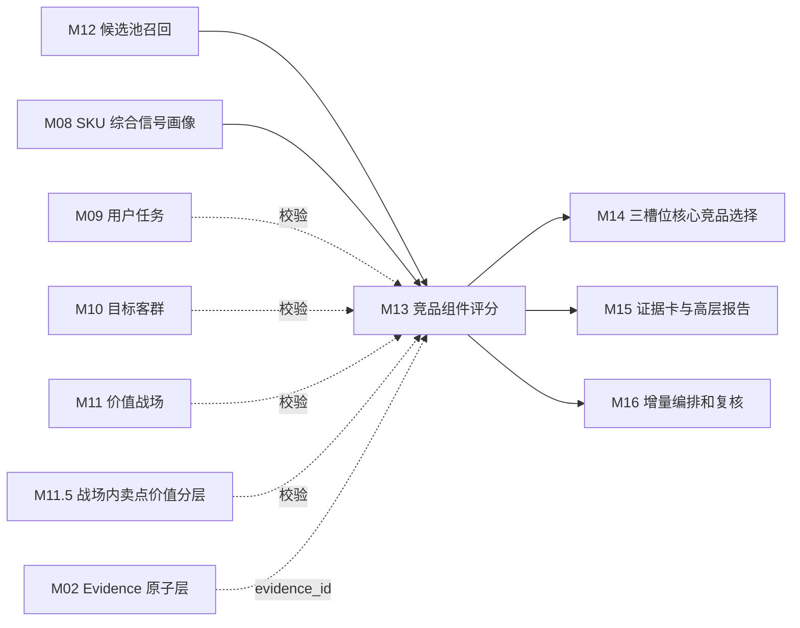
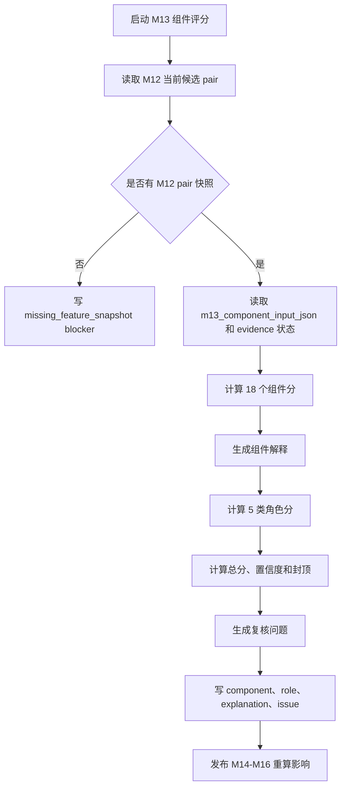

# M13 竞品组件评分模块详细设计

## 0. 文档定位

本文是 CatForge 彩电核心三竞品真实数据 v2 的 M13 详细设计，基于：

- 需求文档：`docs/core3_mvp/real_data_v2/sop_requirements/M13_component_scoring_requirements.md`
- 总体架构：`docs/core3_mvp/real_data_v2/sop_detailed_design/00_architecture_data_dictionary_design.md`
- 上游 M12 详细设计：`docs/core3_mvp/real_data_v2/sop_detailed_design/M12_candidate_recall_design.md`
- SOP：`cankao/CatForge_竞品生成SOP_详细指导_v1.md`
- 模块说明：`cankao/catforge_sop_md/modules/M13_竞品组件评分模块.md`
- 展示规范：`cankao/CatForge_核心竞品展示页_UI设计规范_v1.md`
- 205 PostgreSQL 真实样例数据基线

M13 的职责是对 M12 召回的目标-候选 pair 做组件评分和角色评分，解释候选“在哪些维度构成竞争压力”。M13 不生成候选池，不选择核心三竞品，不生成高层报告结论。

当前设计阶段要求：本文件应能直接拆成开发任务、数据库迁移、服务实现、测试用例和验收脚本。

## 1. 模块职责

### 1.1 解决的问题

M13 要把 M12 的“为什么进入候选池”进一步量化为“为什么像竞品、在哪些维度构成压力、适合哪个竞品角色、证据是否可靠”。

M13 需要回答：

1. 目标 SKU 和候选 SKU 是否争夺同一价值战场。
2. 双方是否处于可比较的价格、尺寸、平台和市场位置。
3. 候选是否在关键参数、卖点价值、任务、客群或用户感知上形成对打、拦截或下探压力。
4. 候选更适合正面对打、价格/销量挤压，还是高端标杆/潜在下探。
5. 每个组件分背后的证据是否完整、可靠、可追溯。
6. 哪些候选虽然分数不低，但因证据缺失、样本不足、服务信号过重或同质重复，需要 M14 谨慎选择。

### 1.2 输入边界

M13 默认只消费 M12 输出和画像/推断层当前结果，不直接读取四张原始表。

必须读取：

| 输入 | 来源 | 用途 |
| --- | --- | --- |
| `core3_candidate_pool` | M12 | 目标-候选 pair、召回强度、关系类型和角色提示 |
| `core3_candidate_recall_reason` | M12 | 候选多入口召回理由 |
| `core3_candidate_feature_snapshot` | M12 | M13 评分直接输入 |
| `core3_sku_signal_profile` | M08 | 画像状态、缺失风险和 profile hash 补充 |
| `core3_evidence_atom` | M02 | evidence 回溯和状态校验 |

允许按需读取但不能重建 M12 特征：

| 输入 | 来源 | 用途 |
| --- | --- | --- |
| `core3_sku_market_profile` | M07 | 校验价格、销量、销额、平台、趋势证据状态 |
| `core3_sku_task_score` | M09 | 校验任务组件来源 |
| `core3_sku_target_group_score` | M10 | 校验客群组件来源 |
| `core3_sku_battlefield_score` | M11 | 校验战场组件来源 |
| `core3_sku_claim_value_layer` | M11.5 | 校验卖点价值组件来源 |

禁止读取：

- 原始 `week_sales_data`
- 原始 `attribute_data`
- 原始 `selling_points_data`
- 原始 `comment_data`
- M12 未召回的全量 SKU
- M14 三槽位结果
- M15 报告结果

### 1.3 输出边界

M13 输出四类结果：

| 表 | 作用 |
| --- | --- |
| `core3_candidate_component_score` | pair 级组件总览、组件分、总分、置信度和风险 |
| `core3_candidate_role_score` | pair 在不同竞品角色下的独立角色分 |
| `core3_candidate_component_explanation` | 每个组件的中文解释、证据和置信度 |
| `core3_candidate_score_review_issue` | 评分复核问题 |

M13 不输出最终核心竞品，不输出槽位选择，不生成报告段落。

### 1.4 与前后模块关系



M14 不重新计算组件分，只消费 M13 结果。M13 也不能绕过 M12 从全量 SKU 中补评分对象。

## 2. 真实数据约束

### 2.1 当前样例数据事实

205 PostgreSQL 当前真实样例：

- 35 个量价型号。
- 品牌均为海信，同品牌内部 SKU 可以互为竞品。
- 周期为 `26W01` 到 `26W23`。
- 渠道只有线上，平台为专业电商和平台电商。
- 结构化卖点只覆盖 5 个型号。
- 85E7Q 有量价、参数、评论，但无结构化卖点。

因此 M13 必须遵守：

1. 不因为同品牌降低或排除评分。
2. 量价口径只能写 `26W01-26W23` 线上周数据，不能写 12 个月或全渠道。
3. 渠道重合首版基于平台电商和专业电商，不能生成线下结论。
4. 结构化卖点缺失不是卖点弱，只是宣传证据缺口。
5. 参数 unknown、评论 unknown、市场样本不足不能当作 false。
6. 服务、安装、配送、客服只能影响服务参考和风险，不替代产品核心战场。

### 2.2 85E7Q 目标样例约束

以 85E7Q `TV00029115` 为目标时，M13 必须能解释：

| 问题 | 评分要求 |
| --- | --- |
| 85E7Q 与其他 85 寸型号是否正面对打 | 尺寸、价格、平台、战场、任务、卖点价值共同解释 |
| Mini LED、高亮、分区是否形成画质优势 | 参数优势、卖点价值对打、战场重合和市场压力共同解释 |
| 300HZ、HDMI2.1 是否形成游戏体育竞争 | 高刷、HDMI、游戏/体育任务、评论和市场证据共同解释 |
| 无结构化卖点怎么办 | 参数和评论可补证，但卖点组件置信度体现宣传证据缺口 |
| 服务反馈怎么处理 | 进入服务参考或风险，不提升产品核心角色分 |
| 当前只有海信怎么办 | 作为同品牌内部竞争、同系列替代或同价位挤压正常评分 |
| 75/100 寸相邻尺寸怎么评分 | 作为升级/降级替代或大屏价值压力，不当作同尺寸正面对打 |

## 3. 核心概念和枚举

### 3.1 组件 code

M13 首版组件如下：

| 组件 code | 中文名 | 主要输入 |
| --- | --- | --- |
| `base_comparability` | 基础可比性 | M12 尺寸、价格、平台、品类 |
| `battlefield_fit` | 战场重合 | M12/M11 战场重合 |
| `task_overlap` | 用户任务重合 | M12/M09 任务重合 |
| `audience_overlap` | 客群重合 | M12/M10 客群重合 |
| `price_position` | 价格位置 | M12/M07 价格特征 |
| `price_advantage` | 价格优势 | M12/M07 价差、价格带 |
| `size_fit` | 尺寸形态 | M12/M08 尺寸关系 |
| `channel_overlap` | 平台重合 | M12/M07 平台重合 |
| `param_similarity` | 参数相似 | M12/M08 参数特征 |
| `param_superiority` | 参数优势 | M12/M08 参数优劣 |
| `claim_confrontation` | 卖点价值对打 | M12/M11.5 卖点层级 |
| `claim_superiority` | 卖点优势 | M12/M11.5 候选更强卖点 |
| `claim_threshold_sufficiency` | 门槛卖点满足 | M12/M11.5 门槛层级 |
| `market_threat` | 市场压力 | M12/M07 销量、销额、趋势 |
| `sales_amount_strength` | 销额强度 | M12/M07 销额、价格位置 |
| `comment_perception` | 评论感知差异 | M12/M08 评论摘要 |
| `price_trend` | 价格趋势与下探 | M12/M07 价格趋势 |
| `evidence_completeness` | 证据完整度 | M02/M08/M12 证据覆盖 |

每个组件必须输出：

- `score`
- `confidence`
- `support_level`
- `support_summary_cn`
- `risk_flags`
- `supporting_evidence_ids`
- `weakening_evidence_ids`
- `source_payload_json`

### 3.2 角色 code

| 角色 code | 中文名 | 下游槽位 |
| --- | --- | --- |
| `direct_fight` | 正面对打 | M14 正面对打槽 |
| `price_volume_pressure` | 价格/销量挤压 | M14 价格/销量挤压槽 |
| `benchmark_potential` | 高端标杆/潜在下探 | M14 高端标杆/潜在下探槽 |
| `configuration_pressure` | 配置拦截 | M14 辅助判断 |
| `service_reference` | 服务参考 | M15 参考和 M16 复核，不默认进入核心槽 |

### 3.3 支撑等级 `support_level`

| 枚举 | 含义 |
| --- | --- |
| `strong` | 证据完整，组件对竞争判断支撑强 |
| `medium` | 有明确证据，但存在局部缺失或只支撑部分场景 |
| `weak` | 有弱证据，可辅助解释 |
| `missing` | 该组件证据缺失 |
| `conflict` | 不同证据之间冲突 |
| `not_applicable` | 该组件对当前 pair 不适用 |

### 3.4 样本状态 `sample_status`

| 枚举 | 含义 |
| --- | --- |
| `sufficient` | 样本满足评分要求 |
| `limited` | 局部样本不足，允许评分但降置信度 |
| `insufficient` | 样本不足，不能自动入选 |
| `unknown` | 上游未给出明确样本状态 |

### 3.5 复核级别 `issue_level`

| 枚举 | 含义 |
| --- | --- |
| `warning` | 可继续下游，但应提示 |
| `review` | 需要人工复核后再自动入选 |
| `blocker` | 阻塞该 pair 的自动评分或下游选择 |

## 4. 输入契约

### 4.1 从 M12 读取的主输入

M13 必须从以下 M12 current 记录开始：

```text
core3_candidate_pool
  join core3_candidate_feature_snapshot
  left join core3_candidate_recall_reason
where is_current = true
```

过滤条件：

1. `core3_candidate_pool.hard_filter_pass=true`。
2. `core3_candidate_pool.recall_strength in ('strong','medium','weak','review_only')`。
3. `core3_candidate_feature_snapshot.is_current=true`。
4. `core3_candidate_feature_snapshot.candidate_pool_id = core3_candidate_pool.id`。

如果入池候选缺 feature snapshot，M13 不应回读散表拼快照，必须写 `missing_feature_snapshot` blocker。

### 4.2 `m13_component_input_json` 使用方式

M12 的 `m13_component_input_json` 是 M13 的默认组件 raw 输入。

M13 可以：

- 标准化 raw 值。
- 按规则版本重新加权。
- 结合 M12 `quality_feature_json` 调整置信度。
- 校验 evidence 状态。

M13 不可以：

- 绕过 M12 重新召回候选。
- 直接从原始表补算价格、参数、评论、卖点。
- 把 M12 未提供的缺失项当成 false。

### 4.3 输入缺失处理

| 缺失 | 处理 |
| --- | --- |
| `core3_candidate_pool` 缺失 | 不评分 |
| `core3_candidate_feature_snapshot` 缺失 | blocker issue |
| `m13_component_input_json` 缺部分组件 | 对应组件 `missing`，整体降置信 |
| M12 标记 `review_only` | 可评分，但角色分封顶 |
| evidence 失效 | 组件降置信或转 `missing/conflict` |
| 结构化卖点缺失 | 卖点组件降宣传证据置信，不当成卖点弱 |

## 5. 输出表总览

| 表 | 粒度 | 下游 |
| --- | --- | --- |
| `core3_candidate_component_score` | 目标 SKU + 候选 SKU + 规则版本 | M14/M15/M16 |
| `core3_candidate_role_score` | 目标 SKU + 候选 SKU + 角色 + 规则版本 | M14/M15 |
| `core3_candidate_component_explanation` | 目标 SKU + 候选 SKU + 组件 + 规则版本 | M15/M16 |
| `core3_candidate_score_review_issue` | 目标/候选/组件/角色问题 | M16 |

M13 不单独设计 run 表，运行状态由 M16 `core3_module_run` 管理；M13 输出表通过 `run_id` 和 `input_fingerprint` 追溯运行。

## 6. 表设计公共字段

除特殊说明外，M13 表包含：

| 字段 | 类型建议 | 必填 | 说明 |
| --- | --- | --- | --- |
| `id` | `uuid` | 是 | 主键 |
| `project_id` | `uuid` | 是 | 项目 |
| `category_code` | `varchar(64)` | 是 | MVP 为 `TV` |
| `batch_id` | `uuid` | 是 | 批次 |
| `run_id` | `uuid` | 是 | M16 或 M13 运行 ID |
| `target_sku_code` | `varchar(128)` | 是 | 目标 SKU |
| `candidate_sku_code` | `varchar(128)` | 是 | 候选 SKU |
| `rule_version` | `varchar(64)` | 是 | 评分规则版本 |
| `input_fingerprint` | `varchar(128)` | 是 | 输入摘要 hash |
| `result_hash` | `varchar(128)` | 是 | 输出摘要 hash |
| `is_current` | `boolean` | 是 | 是否当前版本 |
| `created_at` | `timestamptz` | 是 | 创建时间 |
| `updated_at` | `timestamptz` | 是 | 更新时间 |

重跑时插入新记录，并将同业务键旧记录置 `is_current=false`。

## 7. 表设计：`core3_candidate_component_score`

### 7.1 表用途

保存一个目标-候选 pair 的组件分总览、总分、角色分摘要、证据完整度、置信度和风险。M14 用它做槽位候选初筛，M15 用它生成证据卡摘要。

### 7.2 字段

| 字段 | 类型建议 | 必填 | 来源 | 说明 |
| --- | --- | --- | --- | --- |
| `id` | `uuid` | 是 | M13 | 主键 |
| `candidate_pool_id` | `uuid` | 是 | M12 | 关联 M12 pair |
| `feature_snapshot_id` | `uuid` | 是 | M12 | 关联 M12 pair 快照 |
| `project_id` | `uuid` | 是 | run context | 项目 |
| `category_code` | `varchar(64)` | 是 | run context | 品类 |
| `batch_id` | `uuid` | 是 | M00 | 批次 |
| `run_id` | `uuid` | 是 | M16/M13 | 运行 |
| `target_sku_code` | `varchar(128)` | 是 | M12 | 目标 SKU |
| `target_model_name` | `varchar(255)` | 是 | M12/M08 | 目标型号 |
| `candidate_sku_code` | `varchar(128)` | 是 | M12 | 候选 SKU |
| `candidate_model_name` | `varchar(255)` | 是 | M12/M08 | 候选型号 |
| `candidate_brand_name` | `varchar(255)` | 否 | M12/M08 | 候选品牌 |
| `same_brand_flag` | `boolean` | 是 | M12 | 同品牌标记，不用于降权 |
| `candidate_relation_types_json` | `jsonb` | 是 | M12 | 候选关系类型 |
| `candidate_role_hints_json` | `jsonb` | 是 | M12 | M12 角色提示 |
| `recall_strength` | `varchar(32)` | 是 | M12 | 召回强度 |
| `base_comparability_score` | `numeric(6,4)` | 是 | M13 | 基础可比性 |
| `battlefield_fit_score` | `numeric(6,4)` | 是 | M13 | 战场重合 |
| `task_overlap_score` | `numeric(6,4)` | 是 | M13 | 用户任务重合 |
| `audience_overlap_score` | `numeric(6,4)` | 是 | M13 | 客群重合 |
| `price_position_score` | `numeric(6,4)` | 是 | M13 | 价格位置 |
| `price_advantage_score` | `numeric(6,4)` | 是 | M13 | 价格优势 |
| `size_fit_score` | `numeric(6,4)` | 是 | M13 | 尺寸形态 |
| `channel_overlap_score` | `numeric(6,4)` | 是 | M13 | 平台重合 |
| `param_similarity_score` | `numeric(6,4)` | 是 | M13 | 参数相似 |
| `param_superiority_score` | `numeric(6,4)` | 是 | M13 | 参数优势 |
| `claim_confrontation_score` | `numeric(6,4)` | 是 | M13 | 卖点价值对打 |
| `claim_superiority_score` | `numeric(6,4)` | 是 | M13 | 卖点优势 |
| `claim_threshold_sufficiency_score` | `numeric(6,4)` | 是 | M13 | 门槛卖点满足 |
| `market_threat_score` | `numeric(6,4)` | 是 | M13 | 市场压力 |
| `sales_amount_strength_score` | `numeric(6,4)` | 是 | M13 | 销额强度 |
| `comment_perception_score` | `numeric(6,4)` | 是 | M13 | 评论感知差异 |
| `price_trend_score` | `numeric(6,4)` | 是 | M13 | 价格趋势与下探 |
| `evidence_completeness_score` | `numeric(6,4)` | 是 | M13 | 证据完整度 |
| `component_scores_json` | `jsonb` | 是 | M13 | 全组件结构化结果 |
| `component_total_score` | `numeric(6,4)` | 是 | M13 | 组件总分，仅辅助 |
| `direct_fight_score` | `numeric(6,4)` | 是 | M13 | 正面对打分，冗余自 role 表 |
| `price_volume_pressure_score` | `numeric(6,4)` | 是 | M13 | 价格/销量挤压分 |
| `benchmark_potential_score` | `numeric(6,4)` | 是 | M13 | 高端标杆/潜在下探分 |
| `configuration_pressure_score` | `numeric(6,4)` | 是 | M13 | 配置拦截辅助分 |
| `service_reference_score` | `numeric(6,4)` | 是 | M13 | 服务参考分 |
| `confidence` | `numeric(6,4)` | 是 | M13 | 综合置信度 |
| `sample_status` | `varchar(32)` | 是 | M12/M13 | 样本状态 |
| `main_strengths_json` | `jsonb` | 是 | M13 | 候选强支撑点 |
| `main_gaps_json` | `jsonb` | 是 | M13 | 候选证据缺口 |
| `risk_flags_json` | `jsonb` | 是 | M13 | 风险 |
| `review_required` | `boolean` | 是 | M13 | 是否复核 |
| `review_reason` | `varchar(128)` | 否 | M13 | 首要复核原因 |
| `positive_evidence_ids` | `uuid[]` | 是 | M13 | 支撑证据 |
| `weakening_evidence_ids` | `uuid[]` | 是 | M13 | 削弱证据 |
| `evidence_ids` | `uuid[]` | 是 | M13 | 代表证据全集 |
| `target_profile_hash` | `varchar(128)` | 是 | M08/M12 | 目标画像 hash |
| `candidate_profile_hash` | `varchar(128)` | 是 | M08/M12 | 候选画像 hash |
| `feature_snapshot_hash` | `varchar(128)` | 是 | M12 | 快照 hash |
| `component_rule_version` | `varchar(64)` | 是 | 配置 | 组件规则版本 |
| `role_rule_version` | `varchar(64)` | 是 | 配置 | 角色规则版本 |
| `rule_version` | `varchar(64)` | 是 | 配置 | 总规则版本 |
| `input_fingerprint` | `varchar(128)` | 是 | M13 | 输入 hash |
| `result_hash` | `varchar(128)` | 是 | M13 | 输出 hash |
| `is_current` | `boolean` | 是 | M13 | 当前版本 |
| `created_at` | `timestamptz` | 是 | 系统 | 创建时间 |
| `updated_at` | `timestamptz` | 是 | 系统 | 更新时间 |

### 7.3 `component_scores_json` 结构

```json
{
  "base_comparability": {
    "score": 0.88,
    "confidence": 0.92,
    "support_level": "strong",
    "support_summary_cn": "同品类、同尺寸、价格带接近，且平台重合。",
    "risk_flags": [],
    "evidence_ids": ["uuid"]
  },
  "claim_confrontation": {
    "score": 0.68,
    "confidence": 0.58,
    "support_level": "medium",
    "support_summary_cn": "双方在高端画质战场均有 Mini LED 和高亮相关支撑，但目标缺结构化卖点宣传证据。",
    "risk_flags": ["structured_claim_missing"],
    "evidence_ids": ["uuid"]
  }
}
```

### 7.4 `main_strengths_json` 结构

```json
[
  {
    "strength_type": "battlefield",
    "title_cn": "高端画质战场重合",
    "summary_cn": "双方都在高端画质战场具备主支撑。",
    "component_codes": ["battlefield_fit", "claim_confrontation"],
    "evidence_ids": ["uuid"]
  }
]
```

### 7.5 `main_gaps_json` 结构

```json
[
  {
    "gap_type": "structured_claim_missing",
    "summary_cn": "目标缺结构化卖点记录，卖点组件以参数和评论补证，宣传证据置信度下降。",
    "affected_components": ["claim_confrontation", "claim_superiority"]
  }
]
```

### 7.6 约束和索引

```sql
alter table core3_candidate_component_score
  add constraint pk_core3_candidate_component_score primary key (id);

alter table core3_candidate_component_score
  add constraint fk_core3_candidate_component_score_pool
  foreign key (candidate_pool_id)
  references core3_candidate_pool(id);

alter table core3_candidate_component_score
  add constraint fk_core3_candidate_component_score_snapshot
  foreign key (feature_snapshot_id)
  references core3_candidate_feature_snapshot(id);

create unique index uq_core3_candidate_component_score_current
on core3_candidate_component_score(
  project_id,
  category_code,
  batch_id,
  target_sku_code,
  candidate_sku_code,
  rule_version
)
where is_current = true;

create index idx_core3_candidate_component_score_target
on core3_candidate_component_score(project_id, category_code, batch_id, target_sku_code, component_total_score desc);

create index idx_core3_candidate_component_score_roles
on core3_candidate_component_score(project_id, category_code, batch_id, target_sku_code, direct_fight_score desc, price_volume_pressure_score desc, benchmark_potential_score desc);

create index idx_core3_candidate_component_score_review
on core3_candidate_component_score(project_id, category_code, batch_id, review_required, review_reason);

create index idx_core3_candidate_component_score_json_gin
on core3_candidate_component_score using gin (component_scores_json);
```

## 8. 表设计：`core3_candidate_role_score`

### 8.1 表用途

记录每个候选 pair 在各竞品角色上的独立分数和解释。M14 直接按角色读取该表构建三槽位候选。

每个入池 pair 至少输出 5 条当前角色记录：

- `direct_fight`
- `price_volume_pressure`
- `benchmark_potential`
- `configuration_pressure`
- `service_reference`

### 8.2 字段

| 字段 | 类型建议 | 必填 | 来源 | 说明 |
| --- | --- | --- | --- | --- |
| `id` | `uuid` | 是 | M13 | 主键 |
| `candidate_component_score_id` | `uuid` | 是 | M13 | 关联组件总览 |
| `candidate_pool_id` | `uuid` | 是 | M12 | 关联 M12 pair |
| `feature_snapshot_id` | `uuid` | 是 | M12 | 关联快照 |
| `project_id` | `uuid` | 是 | run context | 项目 |
| `category_code` | `varchar(64)` | 是 | run context | 品类 |
| `batch_id` | `uuid` | 是 | M00 | 批次 |
| `run_id` | `uuid` | 是 | M16/M13 | 运行 |
| `target_sku_code` | `varchar(128)` | 是 | M12 | 目标 SKU |
| `candidate_sku_code` | `varchar(128)` | 是 | M12 | 候选 SKU |
| `role_code` | `varchar(64)` | 是 | M13 | 角色 code |
| `role_name_cn` | `varchar(64)` | 是 | M13 | 中文角色 |
| `role_score` | `numeric(6,4)` | 是 | M13 | 角色分 |
| `role_confidence` | `numeric(6,4)` | 是 | M13 | 角色置信度 |
| `role_rank_hint` | `integer` | 否 | M13 | 角色内排序提示 |
| `auto_select_eligible` | `boolean` | 是 | M13 | 是否具备 M14 自动入选基本资格 |
| `auto_select_block_reason` | `varchar(128)` | 否 | M13 | 自动入选阻断原因 |
| `role_business_reason_cn` | `text` | 是 | M13 | 中文角色解释 |
| `role_business_reason_short_cn` | `varchar(255)` | 是 | M13 | 短解释 |
| `formula_version` | `varchar(64)` | 是 | 配置 | 角色公式版本 |
| `component_contribution_json` | `jsonb` | 是 | M13 | 组件贡献 |
| `positive_evidence_ids` | `uuid[]` | 是 | M13 | 支撑证据 |
| `weakening_evidence_ids` | `uuid[]` | 是 | M13 | 削弱证据 |
| `risk_flags_json` | `jsonb` | 是 | M13 | 风险 |
| `review_required` | `boolean` | 是 | M13 | 是否复核 |
| `review_reason` | `varchar(128)` | 否 | M13 | 复核原因 |
| `rule_version` | `varchar(64)` | 是 | 配置 | 规则版本 |
| `input_fingerprint` | `varchar(128)` | 是 | M13 | 输入 hash |
| `result_hash` | `varchar(128)` | 是 | M13 | 输出 hash |
| `is_current` | `boolean` | 是 | M13 | 当前版本 |
| `created_at` | `timestamptz` | 是 | 系统 | 创建时间 |
| `updated_at` | `timestamptz` | 是 | 系统 | 更新时间 |

### 8.3 `component_contribution_json` 结构

```json
{
  "formula": "direct_fight_v1",
  "weighted_components": [
    {
      "component_code": "battlefield_fit",
      "score": 0.86,
      "weight": 0.22,
      "contribution": 0.1892
    },
    {
      "component_code": "claim_confrontation",
      "score": 0.68,
      "weight": 0.18,
      "contribution": 0.1224
    }
  ],
  "caps": [],
  "penalties": []
}
```

### 8.4 约束和索引

```sql
alter table core3_candidate_role_score
  add constraint pk_core3_candidate_role_score primary key (id);

alter table core3_candidate_role_score
  add constraint fk_core3_candidate_role_score_component
  foreign key (candidate_component_score_id)
  references core3_candidate_component_score(id);

create unique index uq_core3_candidate_role_score_current
on core3_candidate_role_score(
  project_id,
  category_code,
  batch_id,
  target_sku_code,
  candidate_sku_code,
  role_code,
  rule_version
)
where is_current = true;

create index idx_core3_candidate_role_score_role
on core3_candidate_role_score(project_id, category_code, batch_id, target_sku_code, role_code, role_score desc);

create index idx_core3_candidate_role_score_auto
on core3_candidate_role_score(project_id, category_code, batch_id, role_code, auto_select_eligible, role_confidence desc);
```

## 9. 表设计：`core3_candidate_component_explanation`

### 9.1 表用途

保存组件级解释，供 M15 证据卡、M14 未选原因和 M16 复核使用。它回答“这个组件为什么高、为什么低、证据在哪里、缺口是什么”。

每个入池 pair 必须对 18 个组件输出解释记录。证据缺失也要输出 `support_level='missing'`，不能省略。

### 9.2 字段

| 字段 | 类型建议 | 必填 | 来源 | 说明 |
| --- | --- | --- | --- | --- |
| `id` | `uuid` | 是 | M13 | 主键 |
| `candidate_component_score_id` | `uuid` | 是 | M13 | 关联组件总览 |
| `candidate_pool_id` | `uuid` | 是 | M12 | 关联 M12 pair |
| `feature_snapshot_id` | `uuid` | 是 | M12 | 关联快照 |
| `project_id` | `uuid` | 是 | run context | 项目 |
| `category_code` | `varchar(64)` | 是 | run context | 品类 |
| `batch_id` | `uuid` | 是 | M00 | 批次 |
| `run_id` | `uuid` | 是 | M16/M13 | 运行 |
| `target_sku_code` | `varchar(128)` | 是 | M12 | 目标 SKU |
| `candidate_sku_code` | `varchar(128)` | 是 | M12 | 候选 SKU |
| `component_code` | `varchar(64)` | 是 | M13 | 组件 code |
| `component_name_cn` | `varchar(128)` | 是 | M13 | 中文组件名 |
| `score` | `numeric(6,4)` | 是 | M13 | 组件分 |
| `confidence` | `numeric(6,4)` | 是 | M13 | 组件置信度 |
| `support_level` | `varchar(32)` | 是 | M13 | 支撑等级 |
| `business_explanation_cn` | `text` | 是 | M13 | 中文业务解释 |
| `positive_summary_cn` | `text` | 否 | M13 | 支撑摘要 |
| `gap_summary_cn` | `text` | 否 | M13 | 缺口摘要 |
| `supporting_evidence_ids` | `uuid[]` | 是 | M13 | 支撑证据 |
| `weakening_evidence_ids` | `uuid[]` | 是 | M13 | 削弱证据 |
| `missing_evidence_reasons_json` | `jsonb` | 是 | M13 | 缺失原因 |
| `source_payload_json` | `jsonb` | 是 | M12/M13 | 来源摘要 |
| `risk_flags_json` | `jsonb` | 是 | M13 | 风险 |
| `rule_version` | `varchar(64)` | 是 | 配置 | 规则版本 |
| `input_fingerprint` | `varchar(128)` | 是 | M13 | 输入 hash |
| `result_hash` | `varchar(128)` | 是 | M13 | 输出 hash |
| `is_current` | `boolean` | 是 | M13 | 当前版本 |
| `created_at` | `timestamptz` | 是 | 系统 | 创建时间 |
| `updated_at` | `timestamptz` | 是 | 系统 | 更新时间 |

### 9.3 解释示例

```json
{
  "component_code": "price_position",
  "component_name_cn": "价格位置",
  "score": 0.84,
  "confidence": 0.90,
  "support_level": "strong",
  "business_explanation_cn": "候选与目标处于相邻价格带，适合作为同预算比较对象。",
  "source_payload_json": {
    "market_window": "26W01-26W23",
    "price_relation": "similar",
    "price_gap_pct": 0.05,
    "platforms_considered": ["专业电商", "平台电商"]
  }
}
```

### 9.4 约束和索引

```sql
alter table core3_candidate_component_explanation
  add constraint pk_core3_candidate_component_explanation primary key (id);

alter table core3_candidate_component_explanation
  add constraint fk_core3_candidate_component_explanation_score
  foreign key (candidate_component_score_id)
  references core3_candidate_component_score(id);

create unique index uq_core3_candidate_component_explanation_current
on core3_candidate_component_explanation(
  project_id,
  category_code,
  batch_id,
  target_sku_code,
  candidate_sku_code,
  component_code,
  rule_version
)
where is_current = true;

create index idx_core3_candidate_component_explanation_pair
on core3_candidate_component_explanation(project_id, category_code, batch_id, target_sku_code, candidate_sku_code);

create index idx_core3_candidate_component_explanation_component
on core3_candidate_component_explanation(project_id, category_code, batch_id, component_code, support_level);

create index idx_core3_candidate_component_explanation_evidence_gin
on core3_candidate_component_explanation using gin (supporting_evidence_ids);
```

## 10. 表设计：`core3_candidate_score_review_issue`

### 10.1 表用途

保存 M13 评分复核问题。M16 读取该表进入复核队列，M14 读取 unresolved blocker/review 问题决定是否允许自动入选。

### 10.2 字段

| 字段 | 类型建议 | 必填 | 来源 | 说明 |
| --- | --- | --- | --- | --- |
| `id` | `uuid` | 是 | M13 | 主键 |
| `candidate_component_score_id` | `uuid` | 否 | M13 | 关联组件总览 |
| `candidate_role_score_id` | `uuid` | 否 | M13 | 关联角色分 |
| `candidate_pool_id` | `uuid` | 否 | M12 | 关联候选 pair |
| `feature_snapshot_id` | `uuid` | 否 | M12 | 关联快照 |
| `project_id` | `uuid` | 是 | run context | 项目 |
| `category_code` | `varchar(64)` | 是 | run context | 品类 |
| `batch_id` | `uuid` | 是 | M00 | 批次 |
| `run_id` | `uuid` | 是 | M16/M13 | 运行 |
| `target_sku_code` | `varchar(128)` | 是 | M12 | 目标 SKU |
| `candidate_sku_code` | `varchar(128)` | 否 | M12 | 候选 SKU，目标级问题可空 |
| `issue_scope` | `varchar(32)` | 是 | M13 | `pair/component/role/evidence` |
| `component_code` | `varchar(64)` | 否 | M13 | 组件 code |
| `role_code` | `varchar(64)` | 否 | M13 | 角色 code |
| `issue_type` | `varchar(64)` | 是 | M13 | 问题类型 |
| `issue_level` | `varchar(32)` | 是 | M13 | `warning/review/blocker` |
| `issue_message_cn` | `text` | 是 | M13 | 中文问题 |
| `suggested_action_cn` | `text` | 否 | M13 | 建议处理 |
| `source_payload_json` | `jsonb` | 是 | M13 | 问题上下文 |
| `evidence_ids` | `uuid[]` | 是 | M13 | 相关证据 |
| `resolved_status` | `varchar(32)` | 是 | M16 | `open/resolved/ignored` |
| `resolved_by` | `varchar(128)` | 否 | M16 | 处理人 |
| `resolved_at` | `timestamptz` | 否 | M16 | 处理时间 |
| `resolution_note` | `text` | 否 | M16 | 处理备注 |
| `rule_version` | `varchar(64)` | 是 | 配置 | 规则版本 |
| `input_fingerprint` | `varchar(128)` | 是 | M13 | 输入 hash |
| `result_hash` | `varchar(128)` | 是 | M13 | 输出 hash |
| `is_current` | `boolean` | 是 | M13 | 当前版本 |
| `created_at` | `timestamptz` | 是 | 系统 | 创建时间 |
| `updated_at` | `timestamptz` | 是 | 系统 | 更新时间 |

### 10.3 问题类型

| `issue_type` | 级别 | 触发条件 |
| --- | --- | --- |
| `missing_feature_snapshot` | blocker | M12 入池但缺 pair 快照 |
| `missing_candidate_profile` | blocker | 候选缺 M08 画像 |
| `no_market_evidence` | review | 市场证据缺失但市场/价格角色分较高 |
| `no_semantic_evidence` | review | 任务、客群、战场、卖点证据缺失但正面对打分较高 |
| `only_service_signal` | review | 只有服务信号却出现高角色分 |
| `high_score_low_confidence` | review | 角色分或总分高但置信度低 |
| `param_conflict` | review | 高刷、HDMI、亮度、分区等关键参数冲突 |
| `claim_missing` | warning | 结构化卖点缺失导致卖点组件低置信 |
| `sample_insufficient` | review | 样本不足但分数接近 M14 阈值 |
| `component_missing` | blocker | 必要组件未输出解释 |
| `role_score_missing` | blocker | 必要角色分缺失 |
| `service_over_weighted` | review | 服务分影响产品核心角色分 |
| `same_family_duplicate_high_score` | review | 同型号族候选高度重复且分数接近 |

### 10.4 约束和索引

```sql
alter table core3_candidate_score_review_issue
  add constraint pk_core3_candidate_score_review_issue primary key (id);

create unique index uq_core3_candidate_score_review_issue_current
on core3_candidate_score_review_issue(
  project_id,
  category_code,
  batch_id,
  target_sku_code,
  coalesce(candidate_sku_code, ''),
  issue_scope,
  coalesce(component_code, ''),
  coalesce(role_code, ''),
  issue_type,
  result_hash,
  rule_version
)
where is_current = true;

create index idx_core3_candidate_score_review_issue_open
on core3_candidate_score_review_issue(project_id, category_code, batch_id, resolved_status, issue_level);

create index idx_core3_candidate_score_review_issue_pair
on core3_candidate_score_review_issue(project_id, category_code, batch_id, target_sku_code, candidate_sku_code);
```

## 11. 组件评分设计

### 11.1 通用组件输出

每个组件计算后形成标准对象：

```json
{
  "component_code": "battlefield_fit",
  "score": 0.86,
  "confidence": 0.82,
  "support_level": "strong",
  "support_summary_cn": "双方主战场都指向高端画质。",
  "risk_flags": [],
  "supporting_evidence_ids": ["uuid"],
  "weakening_evidence_ids": [],
  "source_payload_json": {}
}
```

### 11.2 基础可比性 `base_comparability`

输入：

- M12 `size_feature_json`
- M12 `price_feature_json`
- M12 `channel_feature_json`
- M12 `quality_feature_json`

首版：

```text
base_comparability_score =
  category_match * 0.20
  + size_comparable * 0.25
  + price_comparable * 0.25
  + platform_overlap * 0.20
  + profile_ready * 0.10
```

规则：

- 同品类必须为 1，否则不应进入评分。
- 同尺寸取 1，相邻尺寸取 0.75，跨尺寸取 0.35，unknown 取 0.2 且降置信。
- 同价位取 1，相邻价位取 0.75，高低价差过大取 0.35，unknown 取 0.2 且降置信。
- 当前渠道只基于专业电商和平台电商。

### 11.3 战场重合 `battlefield_fit`

输入：

- M12 `battlefield_overlap_json`
- M11 `core3_sku_battlefield_score` 校验

首版：

| 场景 | 分值 |
| --- | ---: |
| 目标主战场与候选主战场重合 | 1.00 |
| 目标主战场与候选次战场重合 | 0.80 |
| 目标次战场与候选主战场重合 | 0.75 |
| 目标机会战场与候选主战场重合且市场压力强 | 0.60 |
| 只有弱战场重合 | 0.25 |
| 服务战场唯一重合 | 0.20，且标记 `service_only` |

战场样本不足时不强行低分，而是降低 `confidence`。

### 11.4 任务重合 `task_overlap`

输入：

- M12 `task_overlap_json`
- M09 当前任务结果校验

首版：

| 场景 | 分值 |
| --- | ---: |
| 双方主任务相同 | 1.00 |
| 目标主任务与候选次任务相同 | 0.80 |
| 同一任务组合相似 | 0.75 |
| 替代链关系成立 | 0.60 |
| 仅弱任务线索 | 0.35 |
| 任务缺失 | 0.00，support `missing` |

### 11.5 客群重合 `audience_overlap`

输入：

- M12 `audience_overlap_json`
- M10 当前客群结果校验

规则：

- 同主客群且同任务：0.90-1.00。
- 同客群但任务不同：0.55-0.70。
- 同任务但客群不明：0.35-0.55。
- 客群低置信时 score 可保留，confidence 降低 30%-50%。

### 11.6 价格位置 `price_position`

输入：

- M12 `price_feature_json`

首版：

| 价格关系 | score | 说明 |
| --- | ---: | --- |
| `similar` | 1.00 | 正面对打价格基础强 |
| `lower` 且差距 8%-20% | 0.75 | 可比较，但偏价格挤压 |
| `higher` 且差距 8%-25% | 0.65 | 可比较，但偏标杆 |
| 差距超过 30% | 0.30 | 只适合升级/降级或下探解释 |
| `unknown` | 0.00 | 缺价格证据 |

### 11.7 价格优势 `price_advantage`

输入：

- M12 `price_feature_json`
- M12 `market_feature_json`

规则：

```text
if price_relation == 'lower':
  price_advantage = clamp(abs(price_gap_pct) / 0.30, 0, 1)
elif price_relation == 'similar':
  price_advantage = 0.30
else:
  price_advantage = 0.00
```

价格未知时为 missing。价格优势不能用于高端标杆分。

### 11.8 尺寸形态 `size_fit`

输入：

- M12 `size_feature_json`

规则：

| 尺寸关系 | score | 角色倾向 |
| --- | ---: | --- |
| `same` | 1.00 | 正面对打 |
| `adjacent_larger` | 0.75 | 升级/标杆 |
| `adjacent_smaller` | 0.70 | 降级/价格挤压 |
| `larger_cross` 或 `smaller_cross` | 0.30 | 弱替代 |
| `unknown` | 0.00 | 缺失 |

### 11.9 平台重合 `channel_overlap`

输入：

- M12 `channel_feature_json`

规则：

```text
channel_overlap_score = platform_overlap_score
```

首版只使用线上平台。若出现线下字段，必须由 M07 扩展后再消费。

### 11.10 参数相似 `param_similarity`

输入：

- M12 `param_feature_json`
- M08 参数摘要

规则：

1. 只比较目标主/次战场相关核心参数。
2. unknown 参数不计入分母，也不当作不相似。
3. 参数冲突时输出 `conflict` 并写复核 issue。
4. 非核心参数只作为解释，不大幅提升分数。

### 11.11 参数优势 `param_superiority`

输入：

- M12 `param_feature_json`

规则：

- 候选在目标主战场关键参数上更强，增加分。
- 候选参数更强但价格明显更高，倾向标杆。
- 候选参数更强且价格接近，倾向配置拦截。
- 目标参数 unknown 时，不把候选强判为优势，需降置信。

关键参数组：

| 战场 | 参数 |
| --- | --- |
| 高端画质 | Mini LED/OLED、亮度、分区、色域、HDR |
| 游戏体育 | 刷新率、HDMI2.1、低延迟、运动补偿 |
| 大屏价值 | 尺寸、价格每英寸、销量 |
| 智能体验 | RAM、ROM、语音、AI |

### 11.12 卖点价值对打 `claim_confrontation`

输入：

- M12 `claim_value_overlap_json`
- M11.5 当前结果校验

规则：

| 场景 | score | confidence |
| --- | ---: | --- |
| 同战场同绩效或溢价卖点 | 高 | 高 |
| 候选卖点层级略强或略弱 | 中高 | 中高 |
| 只同门槛卖点 | 中 | 中 |
| 参数/评论补证但无结构化卖点 | 中 | 降置信 |
| 只有宣传卖点无参数/评论/市场 | 中低 | 降置信 |
| 服务卖点匹配 | 不提升产品核心分 | 进入服务参考 |

### 11.13 卖点优势 `claim_superiority`

候选在目标主战场的关键卖点层级强于目标时得分。

规则：

- 候选从门槛到绩效：中。
- 候选从绩效到溢价：高。
- 目标弱感知而候选绩效/溢价：高，标记配置拦截。
- 目标卖点 evidence 缺失：不把候选判强，只能降置信并写缺口。

### 11.14 门槛卖点满足 `claim_threshold_sufficiency`

用于价格/销量挤压。候选价格更低时，必须证明其基础体验没有断档。

规则：

- 候选满足目标主战场门槛卖点：高。
- 候选部分满足但证据不足：中。
- 候选门槛卖点缺失：低置信。
- 仅价格低但门槛体验缺证据，不允许价格挤压高分。

### 11.15 市场压力 `market_threat`

输入：

- M12 `market_feature_json`

规则：

| 场景 | 分值倾向 |
| --- | --- |
| 同可比池销量或销额高于目标 | 高 |
| 低价且销量不弱 | 高 |
| 高价且销额强 | 中高，偏标杆 |
| 近期销量上升 | 中高 |
| 市场样本不足 | 降置信 |

### 11.16 销额强度 `sales_amount_strength`

用于高端标杆/潜在下探。高价候选如果销额不弱，说明高端价值有市场承接。

规则：

- 候选销额分位高：高。
- 候选销量低但销额高：中高，偏高端标杆。
- 候选高价但销额弱：低。
- 样本不足：低置信。

### 11.17 评论感知差异 `comment_perception`

输入：

- M12 快照中的评论摘要
- M08 评论信号摘要

规则：

- 双方同任务正向评论都强：增强正面对打。
- 候选在目标痛点上更强：增强拦截。
- 候选负向风险明显：降低 confidence 或写 risk。
- 重复、空评论、模板评论不得高分。
- 服务评论只进服务参考，不提升产品核心角色分。

### 11.18 价格趋势 `price_trend`

输入：

- M12 `market_feature_json`

规则：

- 高价候选价格下行且战场重合：增强潜在下探。
- 低价候选促销频繁且销量不弱：增强价格/销量挤压。
- 价格波动大但样本不足：写复核。

### 11.19 证据完整度 `evidence_completeness`

证据域：

- 市场证据
- 参数证据
- 卖点证据
- 评论证据
- 任务、客群、战场推导证据
- M12 召回证据

首版：

```text
evidence_completeness_score =
  market_evidence * 0.22
  + param_evidence * 0.18
  + claim_evidence * 0.16
  + comment_evidence * 0.12
  + task_audience_battlefield_evidence * 0.22
  + recall_evidence * 0.10
```

结构化卖点缺失时：

- `claim_evidence` 不得直接为 0。
- 如果参数和评论可补证，`claim_evidence` 可按补证质量给 0.35-0.60。
- 必须标记 `structured_claim_missing`。

## 12. 角色分设计

### 12.1 正面对打分 `direct_fight_score`

业务问题：谁和目标最像，正在抢同一批用户？

首版：

```text
direct_fight_score =
  battlefield_fit_score * 0.22
  + claim_confrontation_score * 0.18
  + task_overlap_score * 0.14
  + audience_overlap_score * 0.10
  + price_position_score * 0.12
  + size_fit_score * 0.08
  + channel_overlap_score * 0.08
  + market_threat_score * 0.08
```

封顶：

- 无战场证据：最高 0.45。
- 无价格和尺寸证据：最高 0.55。
- 仅服务信号：最高 0.30。
- M12 `review_only`：最高 0.50。

### 12.2 价格/销量挤压分 `price_volume_pressure_score`

业务问题：谁用更低价格或更强销量抢走目标本来能拿到的需求？

首版：

```text
price_volume_pressure_score =
  task_overlap_score * 0.18
  + audience_overlap_score * 0.10
  + price_advantage_score * 0.22
  + market_threat_score * 0.18
  + battlefield_fit_score * 0.12
  + channel_overlap_score * 0.08
  + claim_threshold_sufficiency_score * 0.07
  + price_trend_score * 0.05
```

封顶：

- 候选无价格优势且无销量优势：最高 0.45。
- 无市场证据：最高 0.50。
- 门槛卖点不足或缺证据：最高 0.65。
- 仅任务相似：最高 0.40。

### 12.3 高端标杆/潜在下探分 `benchmark_potential_score`

业务问题：谁比目标更高端，或价格下探后会压缩目标上探空间？

首版：

```text
benchmark_potential_score =
  param_superiority_score * 0.20
  + claim_superiority_score * 0.18
  + battlefield_fit_score * 0.18
  + sales_amount_strength_score * 0.14
  + price_premium_or_downshift_score * 0.14
  + task_overlap_score * 0.08
  + channel_overlap_score * 0.05
  + evidence_completeness_score * 0.03
```

`price_premium_or_downshift_score` 从 `price_position`、`price_trend` 和 M12 市场趋势组合得到：

- 候选高价且高端证据强：中高。
- 候选高价且价格下行：高。
- 候选同价但配置强：中，转配置拦截。
- 候选低价：低。

封顶：

- 无参数或卖点优势：最高 0.50。
- 无战场重合：最高 0.45。
- 高价但无销额或市场承接：最高 0.65。

### 12.4 配置拦截分 `configuration_pressure_score`

首版：

```text
configuration_pressure_score =
  param_superiority_score * 0.30
  + claim_superiority_score * 0.25
  + price_position_score * 0.15
  + battlefield_fit_score * 0.15
  + evidence_completeness_score * 0.10
  + market_threat_score * 0.05
```

配置拦截不是 M14 首版独立槽位，但要作为正面对打和高端标杆解释素材。

### 12.5 服务参考分 `service_reference_score`

首版：

```text
service_reference_score =
  service_signal_strength * 0.45
  + comment_perception_score * 0.25
  + evidence_completeness_score * 0.20
  + market_threat_score * 0.10
```

服务参考分不得反向提升 `direct_fight_score`、`price_volume_pressure_score` 或 `benchmark_potential_score`。如果实现中发现服务参考贡献进入产品核心角色，必须写 `service_over_weighted` issue。

## 13. 总分和置信度

### 13.1 组件总分

`component_total_score` 只用于 M14 辅助排序，不能单独作为入选核心竞品结论。

首版：

```text
component_total_score =
  base_comparability_score * 0.10
  + battlefield_fit_score * 0.16
  + task_overlap_score * 0.10
  + audience_overlap_score * 0.08
  + price_position_score * 0.10
  + size_fit_score * 0.06
  + channel_overlap_score * 0.06
  + param_similarity_score * 0.08
  + claim_confrontation_score * 0.12
  + market_threat_score * 0.10
  + comment_perception_score * 0.04
```

总分不包含 `service_reference_score`，避免服务信号替代产品核心竞争。

### 13.2 综合置信度

```text
confidence =
  min(key_component_confidences)
  * (0.60 + evidence_completeness_score * 0.40)
  * sample_status_factor
  * upstream_review_factor
```

因子：

| 因子 | 取值 |
| --- | --- |
| `sample_status=sufficient` | 1.00 |
| `sample_status=limited` | 0.80 |
| `sample_status=insufficient` | 0.55 |
| `sample_status=unknown` | 0.70 |
| 上游无 review | 1.00 |
| 上游 warning | 0.90 |
| 上游 review_required | 0.75 |
| 上游 blocker | 0.00 |

### 13.3 高分低置信

满足任一条件写 `high_score_low_confidence`：

- `component_total_score >= 0.70` 且 `confidence < 0.55`。
- 任一核心角色分 `>= 0.70` 且 `role_confidence < 0.55`。
- 角色分接近 M14 阈值但 evidence 完整度 `< 0.50`。

## 14. 中文解释生成

### 14.1 原则

解释必须是业务语言，不出现：

- SQL、UUID、JSON。
- 英文字段名。
- “模型推理”“AI 判断”。
- 单独堆分数而没有业务含义。

解释必须说明：

1. 哪个竞争维度成立。
2. 真实支撑来自价格、尺寸、平台、战场、任务、参数、卖点、销量、评论中的哪些。
3. 有哪些缺口或风险。

### 14.2 组件解释模板

战场：

```text
双方都围绕{战场中文名}竞争，目标该战场为{目标战场级别}，候选为{候选战场级别}，因此战场重合支撑较强。
```

价格：

```text
候选与目标处在{价格关系中文}，价格口径为 26W01-26W23 线上周均价，适合用于{正面对打/价格挤压/高端标杆}判断。
```

卖点：

```text
双方在{战场中文名}下的{卖点中文名}具备可比价值，候选为{候选层级中文}，目标为{目标层级中文}。
```

卖点缺失：

```text
目标缺结构化卖点记录，本组件以参数和评论补证，宣传证据置信度下降。
```

服务：

```text
该信号主要来自安装、配送或客服体验，只适合作为服务侧参考，不提升产品核心竞品角色分。
```

## 15. 处理流程

### 15.1 总流程



### 15.2 编号步骤

1. 读取 `run_context`：`project_id`、`category_code`、`batch_id`、`run_id`、`rule_version`。
2. 查询 M12 当前候选 pair。
3. 对每个 pair 读取当前 `core3_candidate_feature_snapshot`。
4. 缺快照时写 blocker issue，跳过该 pair 自动评分。
5. 解析 `m13_component_input_json`、各特征 JSON 和 M12 风险。
6. 校验 evidence 状态。
7. 计算 18 个组件分。
8. 为每个组件生成解释记录，缺失也写 explanation。
9. 计算 5 类角色分。
10. 应用角色分封顶和服务边界。
11. 计算组件总分和综合置信度。
12. 生成强支撑点、证据缺口和风险。
13. 生成复核问题。
14. 在事务中写四张输出表。
15. 将旧 current 结果置为 `is_current=false`。
16. 通知 M16 下游 M14-M16 需要重算。

### 15.3 伪代码

```python
def run_component_scoring(context, target_scope):
    pairs = competitor_repo.list_current_candidate_pairs(context, target_scope)
    outputs = []

    for pair in pairs:
        snapshot = competitor_repo.get_current_feature_snapshot(pair.id)
        if snapshot is None:
            outputs.append(review_issue(pair, "missing_feature_snapshot", "blocker"))
            continue

        input_payload = snapshot.m13_component_input_json
        evidence_status = evidence_repo.load_status(snapshot.evidence_ids)

        components = component_calculator.calculate(
            pair=pair,
            snapshot=snapshot,
            input_payload=input_payload,
            evidence_status=evidence_status,
        )

        explanations = explanation_builder.build(pair, snapshot, components)
        role_scores = role_score_calculator.calculate(pair, components)
        role_scores = role_capper.apply(pair, role_scores, components)
        total_score = total_score_calculator.calculate(components)
        confidence = confidence_calculator.calculate(pair, components, role_scores)
        issues = review_builder.build(pair, snapshot, components, role_scores, confidence)

        outputs.append(
            ScoringResult(
                pair=pair,
                components=components,
                explanations=explanations,
                role_scores=role_scores,
                total_score=total_score,
                confidence=confidence,
                issues=issues,
            )
        )

    score_repo.replace_current_m13_results(context, outputs)
    job_repo.publish_downstream_impacts(context, modules=["M14", "M15", "M16"])
```

## 16. 增量策略

### 16.1 触发源

| 变化来源 | M13 动作 | 下游影响 |
| --- | --- | --- |
| M12 候选新增 | 新增 pair 评分 | M14-M16 |
| M12 候选失效 | 当前 M13 评分置非 current | M14-M16 |
| M12 pair 快照变化 | 重算对应 pair | M14-M16 |
| M08 画像变化 | 通过 M12 快照变化触发；必要时校验重算 | M13-M16 |
| M09/M10/M11/M11.5 变化 | 通过 M12 快照变化触发；组件校验发现不一致时复核 |
| M07 市场画像变化 | 重算价格、渠道、销量、趋势组件 | M13-M16 |
| M02 evidence 状态变化 | 重算证据完整度、解释和置信度 | M15-M16 |
| 评分规则变化 | 按新规则版本重算全部 current pair | M14-M16 |

### 16.2 Fingerprint

Pair 级 `input_fingerprint`：

```text
hash(
  project_id,
  category_code,
  batch_id,
  target_sku_code,
  candidate_sku_code,
  candidate_pool_id,
  feature_snapshot_id,
  feature_snapshot_hash,
  target_profile_hash,
  candidate_profile_hash,
  evidence_revision,
  component_rule_version,
  role_rule_version,
  rule_version
)
```

结果 `result_hash`：

```text
hash(
  component_scores_json,
  role_scores_json,
  component_total_score,
  confidence,
  risk_flags_json,
  review_required
)
```

### 16.3 历史保留

重跑时：

1. 对同业务键旧 component、role、explanation、issue 置 `is_current=false`。
2. 插入新结果。
3. 保留历史供 M16 审计。
4. M14 只读取 `is_current=true` 且未被 blocker 阻断的 M13 结果。

## 17. 服务和任务边界

### 17.1 服务建议

后端服务文件：

```text
apps/api-server/app/services/core3_real_data/component_scoring_service.py
```

主要类：

| 类 | 职责 |
| --- | --- |
| `ComponentScoringService` | M13 入口，按目标或 pair 执行评分 |
| `M13InputLoader` | 读取 M12 pair、snapshot 和 evidence 状态 |
| `ComponentCalculator` | 计算 18 个组件 |
| `ComponentExplanationBuilder` | 生成组件解释 |
| `RoleScoreCalculator` | 计算 5 类角色分 |
| `RoleScoreCapper` | 应用角色封顶和服务边界 |
| `ScoreConfidenceCalculator` | 计算综合置信度 |
| `ScoreReviewIssueBuilder` | 生成复核问题 |
| `ComponentScoringRepository` | 写入 M13 四张表 |

### 17.2 Repository 边界

| Repository | 访问范围 |
| --- | --- |
| `CompetitorRepository` | 读取 M12 candidate pool、reason、snapshot |
| `ScoreRepository` | 写 M13 component、role、explanation、issue |
| `FeatureRepository` | 只读 M08 画像状态补充 |
| `EvidenceRepository` | evidence 状态校验 |
| `JobRepository` | M16 module run、重算计划和复核队列 |

不得使用 `RawSourceRepository`。

### 17.3 Runner

M16 调用：

```text
Core3ModuleRunner.run("M13", run_context, target_scope)
```

`target_scope` 支持：

| Scope | 含义 |
| --- | --- |
| `all_targets` | 批次内全部目标 |
| `target_sku_list` | 指定目标 |
| `candidate_pair_list` | 指定 pair |
| `changed_pairs` | M12/M08/M07/evidence 变化影响的 pair |

Runner 输出：

```json
{
  "module_code": "M13",
  "status": "success",
  "input_count": 12,
  "output_count": 12,
  "output_hash": "sha256...",
  "review_issues": [],
  "warnings": [],
  "downstream_impacts": ["M14", "M15", "M16"]
}
```

### 17.4 API 边界

内部调度：

| API | 用途 |
| --- | --- |
| `POST /api/mvp/core3/v2/projects/{project_id}/targets/{sku}/component-score/run` | 触发目标候选评分 |
| `GET /api/mvp/core3/v2/projects/{project_id}/targets/{sku}/component-score/runs/{run_id}` | 查看评分运行 |

技术追溯：

| API | 用途 |
| --- | --- |
| `GET /api/mvp/core3/v2/projects/{project_id}/targets/{sku}/score-audit` | 查看候选组件分、角色分和复核问题 |
| `GET /api/mvp/core3/v2/projects/{project_id}/targets/{sku}/score-audit/{candidate_sku}` | 查看单候选评分拆解 |

高层业务 API 不直接暴露 M13 内部公式和英文枚举，由 M15 转成业务化报告。

## 18. 质量和复核规则

### 18.1 Pair 级规则

| 条件 | 处理 |
| --- | --- |
| 缺 M12 pair 快照 | blocker |
| 候选缺 M08 画像 | blocker |
| M12 `review_only` 且角色分高 | review |
| 组件总分高但证据完整度低 | review |
| 角色分高但置信度低 | review |
| 只有服务或评论证据却产品角色高 | review |
| 市场证据缺失但价格挤压分高 | review |
| 语义证据缺失但正面对打分高 | review |

### 18.2 组件级规则

| 条件 | 处理 |
| --- | --- |
| 组件输入缺失 | explanation support `missing` |
| 关键参数冲突 | support `conflict` + review issue |
| 结构化卖点缺失 | warning，卖点组件降置信 |
| unknown 被当 false | 测试失败，不能验收 |
| 服务信号进入产品核心分 | review issue |

### 18.3 角色级规则

| 条件 | 处理 |
| --- | --- |
| direct 高但无主战场重合 | 封顶并 review |
| pressure 高但无价格/销量压力 | 封顶并 review |
| benchmark 高但无参数/卖点优势 | 封顶并 review |
| service 高 | 只作为服务参考，不可自动核心入选 |
| 任一必要角色缺失 | blocker |

## 19. 测试设计

### 19.1 单元测试

| 测试 | 场景 | 期望 |
| --- | --- | --- |
| `test_scores_only_m12_candidates` | 输入包含非候选 SKU | 非 M12 pair 不评分 |
| `test_missing_snapshot_blocks` | 候选缺 M12 快照 | 写 blocker，不回读原始表 |
| `test_unknown_not_false` | 参数 unknown | 不当成参数弱，只降置信 |
| `test_same_brand_scored` | 目标和候选同为海信 | 正常评分 |
| `test_online_platform_scope` | 只有专业电商/平台电商 | 不生成线下渠道 |
| `test_claim_missing_reduces_confidence_not_score_zero` | 缺结构化卖点但参数补证 | 卖点组件可评分但降置信 |
| `test_service_signal_does_not_raise_core_roles` | 服务信号强 | 不提升 direct/pressure/benchmark |
| `test_direct_score_formula` | 标准组件输入 | direct 分按公式 |
| `test_pressure_score_cap` | 无价格优势 | pressure 封顶 |
| `test_benchmark_score_cap` | 无参数/卖点优势 | benchmark 封顶 |
| `test_high_score_low_confidence_issue` | 高分低证据 | 写 review issue |
| `test_all_components_have_explanations` | pair 评分完成 | 18 个组件解释齐全 |

### 19.2 集成测试

| 测试 | 输入 | 期望 |
| --- | --- | --- |
| M12-M13 集成 | M12 pair + snapshot | 生成 component、role、explanation |
| M13-M14 集成 | M13 role score | M14 可按角色读取 |
| M13-M15 集成 | component explanation | M15 可生成证据卡 |
| M13-M16 集成 | 高分低置信 | M16 复核队列可读 |
| Evidence 状态变更 | evidence 失效 | 组件置信度和 issue 更新 |

### 19.3 85E7Q 回归测试

以 `TV00029115` / `85E7Q` 为目标：

| 验收点 | 期望 |
| --- | --- |
| 同 85 寸候选 | 能输出正面对打、价格挤压或配置拦截分 |
| 75/100 寸候选 | 能输出升级/降级或高端标杆解释，不当同尺寸 |
| Mini LED/亮度/分区 | 进入画质相关参数和卖点组件 |
| 300HZ/HDMI2.1 | 进入游戏体育相关参数组件 |
| 缺结构化卖点 | 卖点组件置信度降级，不判为卖点弱 |
| 服务评论 | 只影响服务参考或风险 |
| 同品牌 | 不降权、不排除 |
| 中文解释 | 不出现 UUID、SQL、英文字段名 |

### 19.4 数据库约束测试

| 测试 | 期望 |
| --- | --- |
| current 唯一索引 | 同 pair 当前仅一条 component score |
| 角色记录完整 | 每个 pair 5 条当前 role score |
| 组件解释完整 | 每个 pair 18 条当前 explanation |
| 历史保留 | 重跑后旧记录 `is_current=false` |
| blocker 生效 | M14 不读取 blocker 未解决 pair |

## 20. 验收标准

| 验收项 | 标准 |
| --- | --- |
| 只评分 M12 候选 | 必须，不绕过候选池 |
| 不直接读取原始表 | 必须 |
| 组件分可拆解 | 18 个组件分和解释齐全 |
| 角色分独立 | direct、pressure、benchmark、configuration、service 分开 |
| 量价进入评分 | 价格、销量、销额、趋势、平台参与 |
| 战场和卖点进入评分 | M11/M11.5 必须参与 |
| 证据质量参与置信度 | 高分低证据必须提示 |
| 同品牌可评分 | 海信 SKU 之间正常评分 |
| 服务边界清晰 | 服务不能替代产品核心组件 |
| 缺失不当 false | unknown 只降置信或标缺失 |
| 85E7Q 可解释 | 能解释同尺寸、画质、游戏体育、价格挤压、卖点缺失 |
| M14 可直接消费 | 输出 component score 和 role score |
| 高层页可展示 | M15 能转为业务证据，不暴露公式细节 |
| 增量可重跑 | M12 快照、evidence、规则变化可触发重算 |

## 21. 开发任务拆分建议

| 任务 | 内容 |
| --- | --- |
| D13-01 | Alembic 新增 M13 四张表、约束和索引 |
| D13-02 | Pydantic schema：component、role、explanation、issue |
| D13-03 | `ScoreRepository` 增加 M13 读写和 current 切换 |
| D13-04 | `M13InputLoader` 读取 M12 pair/snapshot/evidence |
| D13-05 | 组件计算器实现 18 个组件 |
| D13-06 | 角色分公式和封顶规则 |
| D13-07 | 置信度和证据完整度计算 |
| D13-08 | 中文解释生成器 |
| D13-09 | 复核 issue 生成器 |
| D13-10 | M16 runner 接入 |
| D13-11 | score audit API |
| D13-12 | 单元测试、集成测试、85E7Q 回归 |

## 22. 下一个模块衔接

M14 三槽位核心竞品选择模块必须以 `core3_candidate_component_score` 和 `core3_candidate_role_score` 为主输入。M14 可以使用 M13 的 `component_total_score` 辅助排序，但不能用总分直接决定入选；必须按 `direct_fight_score`、`price_volume_pressure_score`、`benchmark_potential_score` 三个槽位分别选择，并结合 `confidence`、`evidence_completeness_score`、`risk_flags_json` 和复核状态判断是否可自动入选。
