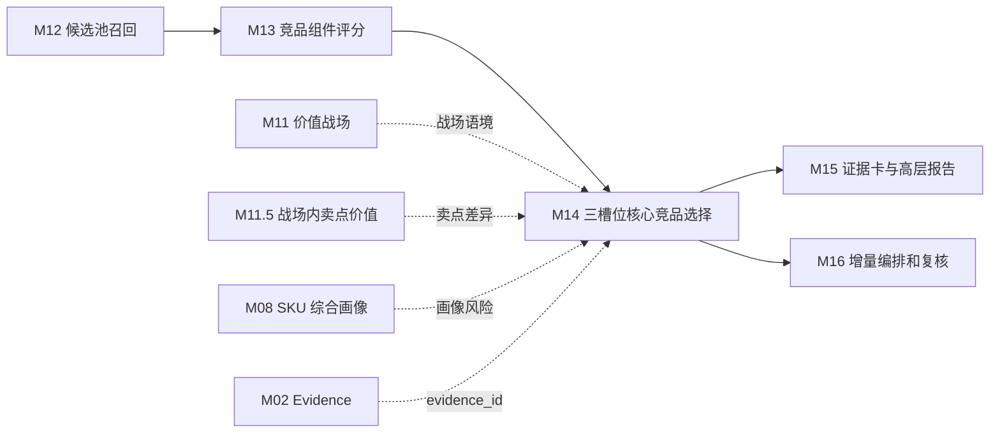
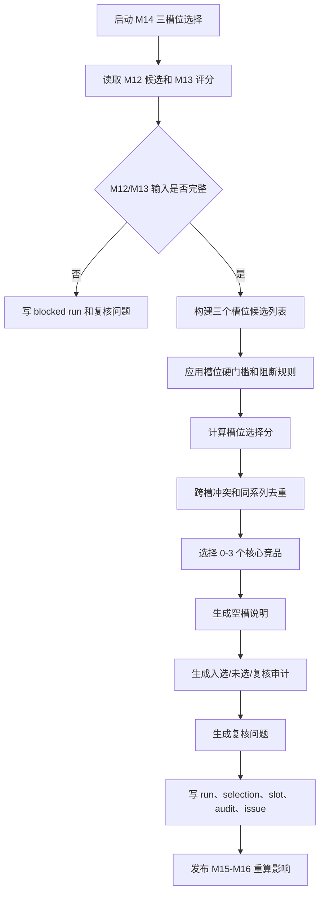

# M14 三槽位核心竞品选择模块详细设计

## 0. 文档定位

本文是 CatForge 彩电核心三竞品真实数据 v2 的 M14 详细设计，基于：

- 需求文档：`docs/core3_mvp/real_data_v2/sop_requirements/M14_core3_selection_requirements.md`
- 总体架构：`docs/core3_mvp/real_data_v2/sop_detailed_design/00_architecture_data_dictionary_design.md`
- 上游 M12 详细设计：`docs/core3_mvp/real_data_v2/sop_detailed_design/M12_candidate_recall_design.md`
- 上游 M13 详细设计：`docs/core3_mvp/real_data_v2/sop_detailed_design/M13_component_scoring_design.md`
- SOP：`cankao/CatForge_竞品生成SOP_详细指导_v1.md`
- 模块说明：`cankao/catforge_sop_md/modules/M14_三槽位核心竞品选择模块.md`
- 展示规范：`cankao/CatForge_核心竞品展示页_UI设计规范_v1.md`
- 205 PostgreSQL 真实样例数据基线

M14 的职责是从 M13 已评分候选中选择 0-3 个核心竞品，并为每个入选 SKU 输出唯一业务槽位、选择理由、证据、差异、策略含义和风险。M14 是核心竞品判断模块，但不是 TopN 排名模块。

当前设计阶段要求：本文件应能直接拆成开发任务、数据库迁移、服务实现、测试用例和验收脚本。

## 1. 模块职责

### 1.1 解决的问题

M14 要回答业务领导最关心的五个问题：

1. 当前目标 SKU 最值得关注的核心竞品是谁，数量可以是 0-3 个。
2. 每个核心竞品分别代表什么竞争压力。
3. 为什么不能简单按 M13 总分取前三。
4. 为什么部分候选分数不低但没有入选。
5. 如果无法选满三个槽位，缺口是什么、是否需要复核。

M14 必须输出可被 M15 直接转换为业务页面的结论结构，但不负责页面排版和报告生成。

### 1.2 输入边界

M14 只消费 M12/M13 结果和必要的上游摘要，不直接读取原始表，不重新计算组件分。

必须读取：

| 输入 | 来源 | 用途 |
| --- | --- | --- |
| `core3_candidate_pool` | M12 | 候选 pair、召回关系、召回强度 |
| `core3_candidate_recall_reason` | M12 | 候选进入池的多入口原因 |
| `core3_candidate_feature_snapshot` | M12 | pair 特征和 M13 快照追溯 |
| `core3_candidate_component_score` | M13 | 组件总览、总分、置信度、风险 |
| `core3_candidate_role_score` | M13 | 三槽位角色分和辅助角色分 |
| `core3_candidate_component_explanation` | M13 | 入选和未选理由素材 |
| `core3_candidate_score_review_issue` | M13 | 阻断、复核和风险 |
| `core3_sku_battlefield_portfolio` | M11 | 目标 SKU 主/次/机会战场组合 |
| `core3_sku_battlefield_claim_value_summary` | M11.5 | 目标和候选战场内卖点价值摘要 |
| `core3_sku_signal_profile` | M08 | 目标和候选画像、缺失和 profile hash |
| `core3_evidence_atom` | M02 | evidence 状态和短证据引用 |

禁止读取：

- 原始 `week_sales_data`
- 原始 `attribute_data`
- 原始 `selling_points_data`
- 原始 `comment_data`
- M12 未召回候选之外的全量 SKU
- M15 报告 payload

### 1.3 输出边界

M14 输出五类结果：

| 表 | 作用 |
| --- | --- |
| `core3_competitor_selection_run` | 一次目标 SKU 三槽位选择运行 |
| `core3_competitor_selection` | 入选核心竞品，M15 核心竞品卡主输入 |
| `core3_competitor_slot_decision` | 每个槽位的 selected/empty/review 状态 |
| `core3_competitor_selection_audit` | 每个候选入选、未选或复核的审计原因 |
| `core3_competitor_selection_review_issue` | 选择复核问题 |

M14 不输出几十个 TopN，也不强行补满三个槽位。

### 1.4 与前后模块关系



M15 只消费 M14 的选择结果、空槽说明和审计原因，不重新选择竞品。

## 2. 真实数据约束

### 2.1 当前样例数据事实

205 PostgreSQL 当前真实样例：

- 35 个量价型号。
- 品牌均为海信。
- 周期为 `26W01` 到 `26W23`。
- 渠道只有线上，平台为专业电商和平台电商。
- 结构化卖点只覆盖 5 个型号。
- 85E7Q 有量价、参数、评论，但无结构化卖点。

因此 M14 必须遵守：

1. 不排除同品牌 SKU。
2. 不设置“同一品牌最多 1 个”这类品牌上限。
3. 同系列候选可以去重，但去重依据是业务信息增量，不是品牌。
4. 不把“同为 85 寸”作为唯一入选理由。
5. 结构化卖点缺失要写成宣传证据缺口，不能写成卖点弱。
6. 服务、安装、配送、客服只作为服务侧证据或风险，不替代产品核心三槽位。
7. 量价口径只使用 `26W01-26W23` 线上周数据，不写全渠道或 12 个月。

### 2.2 85E7Q 目标约束

以 85E7Q `TV00029115` 为目标时，M14 必须能解释：

| 槽位 | 选择要求 |
| --- | --- |
| 正面对打 | 候选不能只因 85 寸入选，必须有战场、价格、平台、任务或卖点价值依据 |
| 价格/销量挤压 | 候选必须有价格优势、销量/销额压力或趋势压力，不可只有语义相似 |
| 高端标杆/潜在下探 | 候选必须有参数/卖点优势、高端价格锚点、销额承接或下探信号 |
| 空槽 | 若证据不足，输出空槽原因，不硬凑 |
| 同品牌 | 解释为同品牌内部竞争、同系列替代或同价位挤压 |
| 卖点缺失 | 说明“宣传卖点数据缺口”，不说明“卖点弱” |

## 3. 核心概念和枚举

### 3.1 三槽位

| `slot_code` | 中文名称 | 业务问题 | 典型策略含义 |
| --- | --- | --- | --- |
| `direct_fight` | 正面对打竞品 | 谁和我最像，正在抢同一批用户？ | 定价对位、核心卖点表达、渠道对位 |
| `price_volume_pressure` | 价格/销量挤压竞品 | 谁以更低价格、更强销量或足够体验抢走需求？ | 价格防守、促销监控、权益包设计 |
| `benchmark_potential` | 高端标杆/潜在下探竞品 | 谁更强，或降价后会压到我？ | 上探空间判断、高端防御、参数对比 |

每个槽位 MVP 最多入选 1 个候选。同一候选最终只能占用一个槽位。

### 3.2 决策状态 `decision_status`

| 枚举 | 含义 |
| --- | --- |
| `selected` | 槽位已选择高置信或可接受置信候选 |
| `empty` | 槽位无可入选候选 |
| `review_required` | 槽位有候选但需复核后才能入选 |
| `blocked` | 缺少 M12/M13 关键输入，无法决策 |

### 3.3 选择运行状态 `selection_status`

| 枚举 | 含义 |
| --- | --- |
| `success` | 至少一个槽位选出，且无阻塞问题 |
| `limited` | 有入选但未满 3 个，或存在弱证据说明 |
| `review_required` | 存在候选但不能自动入选或需业务确认 |
| `blocked` | M12/M13 输入不足，无法选择 |
| `failed` | 程序异常失败 |

### 3.4 候选审计决策 `decision`

| 枚举 | 含义 |
| --- | --- |
| `selected` | 入选某个核心槽位 |
| `rejected` | 未入选，有明确原因 |
| `review` | 候选有价值但需要复核 |
| `blocked` | 候选因输入缺失无法评估 |

### 3.5 空槽原因 `empty_reason_code`

| 枚举 | 含义 |
| --- | --- |
| `no_candidate` | 没有候选进入槽位 |
| `low_confidence` | 有候选但置信度不足 |
| `insufficient_market_evidence` | 市场证据不足 |
| `insufficient_semantic_evidence` | 战场、任务或卖点证据不足 |
| `duplicate_with_selected` | 候选与已选竞品高度重复 |
| `service_only` | 候选只有服务侧价值 |
| `sample_limited` | 可比池、评论或市场样本不足 |
| `blocked_by_review_issue` | M13/M14 blocker 未解决 |

### 3.6 压力等级 `pressure_level`

| 枚举 | 规则建议 |
| --- | --- |
| `high` | `slot_selection_score >= 0.75` 且 `confidence >= 0.70` |
| `medium_high` | `slot_selection_score >= 0.65` 且 `confidence >= 0.60` |
| `medium` | `slot_selection_score >= 0.55` 且无 blocker |
| `review_required` | 分数可观但置信或证据不足 |

## 4. 输入契约

### 4.1 候选读取

M14 读取 M12/M13 当前结果：

```text
core3_candidate_pool p
join core3_candidate_component_score cs on cs.candidate_pool_id = p.id
join core3_candidate_role_score rs on rs.candidate_pool_id = p.id
left join core3_candidate_score_review_issue si on si.candidate_pool_id = p.id
where p.is_current = true
  and cs.is_current = true
  and rs.is_current = true
```

候选必须满足：

1. 在 M12 `core3_candidate_pool` 中存在。
2. 有 M13 `core3_candidate_component_score`。
3. 至少有三个核心角色的 `core3_candidate_role_score`：
   - `direct_fight`
   - `price_volume_pressure`
   - `benchmark_potential`
4. 未被 unresolved M13 blocker 阻断。

### 4.2 不进入自动选择的情况

| 情况 | 处理 |
| --- | --- |
| 候选未在 M12 池中 | 不评估 |
| 候选无 M13 组件分 | 写 M14 review issue |
| 候选无核心角色分 | 写 `missing_role_score` issue |
| 候选有 unresolved blocker | 进入 audit，不能自动入选 |
| 候选只有服务信号 | 可审计，可复核，不进产品核心槽 |
| 候选证据完整度低于阈值 | 进入 review，不自动入选 |

### 4.3 规则配置

首版建议规则版本 `m14_core3_selection_v1`：

| 参数 | 默认值 |
| --- | ---: |
| `role_score_candidate_threshold` | 0.60 |
| `auto_select_confidence_threshold` | 0.50 |
| `auto_select_evidence_threshold` | 0.50 |
| `slot_selection_auto_threshold` | 0.60 |
| `role_score_close_gap` | 0.05 |
| `duplicate_similarity_threshold` | 0.85 |
| `max_selected_per_target` | 3 |
| `max_selected_per_slot` | 1 |

注意：不配置品牌上限。

## 5. 输出表总览

| 表 | 粒度 | 下游 |
| --- | --- | --- |
| `core3_competitor_selection_run` | 目标 SKU + 规则版本 | M15/M16 |
| `core3_competitor_selection` | 入选候选 + 槽位 | M15 |
| `core3_competitor_slot_decision` | 目标 SKU + 槽位 | M15/M16 |
| `core3_competitor_selection_audit` | 目标 SKU + 候选 | M15/M16 |
| `core3_competitor_selection_review_issue` | 目标/槽位/候选问题 | M16 |

所有表保留历史，通过 `is_current=true` 查询当前结果。

## 6. 表设计公共字段

除特殊说明外，M14 表包含：

| 字段 | 类型建议 | 必填 | 说明 |
| --- | --- | --- | --- |
| `id` | `uuid` | 是 | 主键 |
| `project_id` | `uuid` | 是 | 项目 |
| `category_code` | `varchar(64)` | 是 | MVP 为 `TV` |
| `batch_id` | `uuid` | 是 | 批次 |
| `run_id` | `uuid` | 是 | M16 或 M14 运行 ID |
| `target_sku_code` | `varchar(128)` | 是 | 目标 SKU |
| `rule_version` | `varchar(64)` | 是 | 选择规则版本 |
| `input_fingerprint` | `varchar(128)` | 是 | 输入 hash |
| `result_hash` | `varchar(128)` | 是 | 输出 hash |
| `is_current` | `boolean` | 是 | 当前版本 |
| `created_at` | `timestamptz` | 是 | 创建时间 |
| `updated_at` | `timestamptz` | 是 | 更新时间 |

重跑时插入新结果，并把同业务键旧结果置为 `is_current=false`。

## 7. 表设计：`core3_competitor_selection_run`

### 7.1 表用途

记录一次目标 SKU 三槽位选择运行。它回答“本次有多少候选、多少已评分、选出几个、哪些槽位为空、是否需要复核”。

### 7.2 字段

| 字段 | 类型建议 | 必填 | 来源 | 说明 |
| --- | --- | --- | --- | --- |
| `id` | `uuid` | 是 | M14 | 主键 |
| `project_id` | `uuid` | 是 | run context | 项目 |
| `category_code` | `varchar(64)` | 是 | run context | 品类 |
| `batch_id` | `uuid` | 是 | M00 | 批次 |
| `run_id` | `uuid` | 是 | M16/M14 | 运行 |
| `target_sku_code` | `varchar(128)` | 是 | 输入 | 目标 SKU |
| `target_model_name` | `varchar(255)` | 是 | M08/M12 | 目标型号 |
| `target_brand_name` | `varchar(255)` | 否 | M08/M12 | 目标品牌 |
| `candidate_count` | `integer` | 是 | M12 | M12 当前候选数 |
| `scored_candidate_count` | `integer` | 是 | M13 | M13 已评分候选数 |
| `selected_count` | `integer` | 是 | M14 | 入选数量，0-3 |
| `empty_slot_count` | `integer` | 是 | M14 | 空槽数量 |
| `review_candidate_count` | `integer` | 是 | M14 | 需复核候选数 |
| `blocked_candidate_count` | `integer` | 是 | M14 | 被 blocker 阻断候选数 |
| `selection_status` | `varchar(32)` | 是 | M14 | `success/limited/review_required/blocked/failed` |
| `selection_summary_cn` | `text` | 是 | M14 | 中文选择摘要 |
| `empty_slots_json` | `jsonb` | 是 | M14 | 空槽摘要 |
| `selection_policy_json` | `jsonb` | 是 | M14 | 本次规则和阈值快照 |
| `target_profile_hash` | `varchar(128)` | 是 | M08 | 目标画像 hash |
| `m12_recall_fingerprint` | `varchar(128)` | 是 | M12 | 候选池指纹 |
| `m13_score_fingerprint` | `varchar(128)` | 是 | M13 | 评分结果指纹 |
| `evidence_revision` | `varchar(128)` | 否 | M02 | evidence 状态版本 |
| `rule_version` | `varchar(64)` | 是 | 配置 | 规则版本 |
| `input_fingerprint` | `varchar(128)` | 是 | M14 | 输入 hash |
| `result_hash` | `varchar(128)` | 是 | M14 | 输出 hash |
| `is_current` | `boolean` | 是 | M14 | 当前版本 |
| `created_at` | `timestamptz` | 是 | 系统 | 创建时间 |
| `updated_at` | `timestamptz` | 是 | 系统 | 更新时间 |

### 7.3 `selection_policy_json`

```json
{
  "role_score_candidate_threshold": 0.6,
  "auto_select_confidence_threshold": 0.5,
  "auto_select_evidence_threshold": 0.5,
  "duplicate_similarity_threshold": 0.85,
  "brand_limit_enabled": false,
  "max_selected_per_target": 3,
  "max_selected_per_slot": 1
}
```

### 7.4 约束和索引

```sql
alter table core3_competitor_selection_run
  add constraint pk_core3_competitor_selection_run primary key (id);

create unique index uq_core3_competitor_selection_run_current
on core3_competitor_selection_run(project_id, category_code, batch_id, target_sku_code, rule_version)
where is_current = true;

create index idx_core3_competitor_selection_run_target
on core3_competitor_selection_run(project_id, category_code, batch_id, target_sku_code, selection_status);

create index idx_core3_competitor_selection_run_status
on core3_competitor_selection_run(project_id, category_code, batch_id, selection_status, created_at desc);
```

## 8. 表设计：`core3_competitor_selection`

### 8.1 表用途

记录入选核心竞品，是 M15 核心竞品卡主输入。每条记录代表一个候选在一个槽位入选。

### 8.2 字段

| 字段 | 类型建议 | 必填 | 来源 | 说明 |
| --- | --- | --- | --- | --- |
| `id` | `uuid` | 是 | M14 | 主键 |
| `selection_run_id` | `uuid` | 是 | M14 | 关联选择运行 |
| `candidate_pool_id` | `uuid` | 是 | M12 | 候选 pair |
| `component_score_id` | `uuid` | 是 | M13 | 组件分 |
| `role_score_id` | `uuid` | 是 | M13 | 对应槽位角色分 |
| `project_id` | `uuid` | 是 | run context | 项目 |
| `category_code` | `varchar(64)` | 是 | run context | 品类 |
| `batch_id` | `uuid` | 是 | M00 | 批次 |
| `run_id` | `uuid` | 是 | M16/M14 | 运行 |
| `target_sku_code` | `varchar(128)` | 是 | 输入 | 目标 SKU |
| `target_model_name` | `varchar(255)` | 是 | M08/M12 | 目标型号 |
| `candidate_sku_code` | `varchar(128)` | 是 | M12 | 入选 SKU |
| `candidate_model_name` | `varchar(255)` | 是 | M12 | 入选型号 |
| `candidate_brand_name` | `varchar(255)` | 否 | M12 | 入选品牌 |
| `same_brand_flag` | `boolean` | 是 | M12 | 同品牌标记，只作说明 |
| `slot_code` | `varchar(64)` | 是 | M14 | 槽位 code |
| `slot_name_cn` | `varchar(64)` | 是 | M14 | 中文槽位名 |
| `selection_rank` | `integer` | 是 | M14 | 槽位内顺序，MVP 为 1 |
| `primary_battlefield_code` | `varchar(64)` | 否 | M11/M14 | 主要战场 |
| `primary_battlefield_name_cn` | `varchar(128)` | 否 | seed/M14 | 主要战场中文 |
| `slot_selection_score` | `numeric(6,4)` | 是 | M14 | 槽位选择分 |
| `role_score` | `numeric(6,4)` | 是 | M13 | 对应角色分 |
| `component_total_score` | `numeric(6,4)` | 是 | M13 | 组件总分 |
| `confidence` | `numeric(6,4)` | 是 | M13/M14 | 入选置信度 |
| `evidence_completeness_score` | `numeric(6,4)` | 是 | M13 | 证据完整度 |
| `pressure_level` | `varchar(32)` | 是 | M14 | 压力等级 |
| `business_conclusion_cn` | `text` | 是 | M14 | 一句话业务结论 |
| `battlefield_reason_cn` | `text` | 是 | M14 | 战场理由 |
| `task_audience_reason_cn` | `text` | 是 | M14 | 任务/客群理由 |
| `claim_value_reason_cn` | `text` | 是 | M14 | 卖点价值理由 |
| `price_channel_reason_cn` | `text` | 是 | M14 | 价格/渠道理由 |
| `market_reason_cn` | `text` | 是 | M14 | 市场压力理由 |
| `target_advantage_cn` | `text` | 是 | M14 | 目标优势 |
| `competitor_advantage_cn` | `text` | 是 | M14 | 竞品优势 |
| `strategy_implication_cn` | `text` | 是 | M14 | 策略含义 |
| `risk_note_cn` | `text` | 否 | M14 | 风险说明 |
| `component_scores_json` | `jsonb` | 是 | M13/M14 | 关键组件分 |
| `role_scores_json` | `jsonb` | 是 | M13/M14 | 各角色分摘要 |
| `selection_evidence_json` | `jsonb` | 是 | M14 | 选择证据结构 |
| `review_required` | `boolean` | 是 | M14 | 是否复核 |
| `review_reason` | `varchar(128)` | 否 | M14 | 复核原因 |
| `evidence_ids` | `uuid[]` | 是 | M13/M14 | 关键 evidence |
| `rule_version` | `varchar(64)` | 是 | 配置 | 规则版本 |
| `input_fingerprint` | `varchar(128)` | 是 | M14 | 输入 hash |
| `result_hash` | `varchar(128)` | 是 | M14 | 输出 hash |
| `is_current` | `boolean` | 是 | M14 | 当前版本 |
| `created_at` | `timestamptz` | 是 | 系统 | 创建时间 |
| `updated_at` | `timestamptz` | 是 | 系统 | 更新时间 |

### 8.3 `selection_evidence_json`

```json
{
  "why_selected": [
    {
      "dimension": "battlefield",
      "summary_cn": "双方都在高端画质战场具备主支撑。",
      "evidence_ids": ["uuid"]
    },
    {
      "dimension": "price_channel",
      "summary_cn": "价格带接近，且线上平台重合。",
      "evidence_ids": ["uuid"]
    }
  ],
  "target_advantages": ["目标在亮度和分区参数上具备优势"],
  "competitor_advantages": ["竞品在价格或销量上形成压力"],
  "risks": ["目标缺结构化卖点记录，宣传证据需复核"]
}
```

### 8.4 约束和索引

```sql
alter table core3_competitor_selection
  add constraint pk_core3_competitor_selection primary key (id);

alter table core3_competitor_selection
  add constraint fk_core3_competitor_selection_run
  foreign key (selection_run_id)
  references core3_competitor_selection_run(id);

create unique index uq_core3_competitor_selection_current_slot
on core3_competitor_selection(project_id, category_code, batch_id, target_sku_code, slot_code, rule_version)
where is_current = true;

create unique index uq_core3_competitor_selection_current_candidate
on core3_competitor_selection(project_id, category_code, batch_id, target_sku_code, candidate_sku_code, rule_version)
where is_current = true;

create index idx_core3_competitor_selection_target
on core3_competitor_selection(project_id, category_code, batch_id, target_sku_code, selection_rank);

create index idx_core3_competitor_selection_evidence_gin
on core3_competitor_selection using gin (evidence_ids);
```

## 9. 表设计：`core3_competitor_slot_decision`

### 9.1 表用途

记录每个槽位的最终状态。即使槽位为空，也必须输出一条记录，供 M15 展示“暂无高置信候选”的业务说明。

每个目标每次运行必须输出 3 条当前槽位决策。

### 9.2 字段

| 字段 | 类型建议 | 必填 | 来源 | 说明 |
| --- | --- | --- | --- | --- |
| `id` | `uuid` | 是 | M14 | 主键 |
| `selection_run_id` | `uuid` | 是 | M14 | 关联运行 |
| `selected_competitor_selection_id` | `uuid` | 否 | M14 | 入选记录，可空 |
| `project_id` | `uuid` | 是 | run context | 项目 |
| `category_code` | `varchar(64)` | 是 | run context | 品类 |
| `batch_id` | `uuid` | 是 | M00 | 批次 |
| `run_id` | `uuid` | 是 | M16/M14 | 运行 |
| `target_sku_code` | `varchar(128)` | 是 | 输入 | 目标 SKU |
| `slot_code` | `varchar(64)` | 是 | M14 | 槽位 |
| `slot_name_cn` | `varchar(64)` | 是 | M14 | 中文槽位 |
| `decision_status` | `varchar(32)` | 是 | M14 | selected/empty/review_required/blocked |
| `selected_candidate_sku_code` | `varchar(128)` | 否 | M14 | 入选候选 |
| `top_candidate_sku_code` | `varchar(128)` | 否 | M14 | 槽位最高候选 |
| `slot_candidate_count` | `integer` | 是 | M14 | 进入槽位候选数 |
| `eligible_candidate_count` | `integer` | 是 | M14 | 可自动入选候选数 |
| `empty_reason_code` | `varchar(64)` | 否 | M14 | 空槽原因 |
| `empty_reason_cn` | `text` | 否 | M14 | 空槽中文说明 |
| `review_reason` | `varchar(128)` | 否 | M14 | 复核原因 |
| `top_candidate_score` | `numeric(6,4)` | 否 | M13/M14 | 最高候选槽位分 |
| `top_candidate_confidence` | `numeric(6,4)` | 否 | M13 | 最高候选置信度 |
| `decision_payload_json` | `jsonb` | 是 | M14 | 决策结构 |
| `evidence_ids` | `uuid[]` | 是 | M14 | 关键 evidence |
| `rule_version` | `varchar(64)` | 是 | 配置 | 规则版本 |
| `input_fingerprint` | `varchar(128)` | 是 | M14 | 输入 hash |
| `result_hash` | `varchar(128)` | 是 | M14 | 输出 hash |
| `is_current` | `boolean` | 是 | M14 | 当前版本 |
| `created_at` | `timestamptz` | 是 | 系统 | 创建时间 |
| `updated_at` | `timestamptz` | 是 | 系统 | 更新时间 |

### 9.3 空槽说明模板

```text
暂无高置信候选。原因：该槽位候选证据不足，需要补充市场或语义证据后复核。
```

### 9.4 约束和索引

```sql
alter table core3_competitor_slot_decision
  add constraint pk_core3_competitor_slot_decision primary key (id);

create unique index uq_core3_competitor_slot_decision_current
on core3_competitor_slot_decision(project_id, category_code, batch_id, target_sku_code, slot_code, rule_version)
where is_current = true;

create index idx_core3_competitor_slot_decision_status
on core3_competitor_slot_decision(project_id, category_code, batch_id, decision_status, empty_reason_code);
```

## 10. 表设计：`core3_competitor_selection_audit`

### 10.1 表用途

记录每个候选入选、未选、复核或阻断的决策原因。M15 的“候选池与未选原因”折叠区读取该表。

### 10.2 字段

| 字段 | 类型建议 | 必填 | 来源 | 说明 |
| --- | --- | --- | --- | --- |
| `id` | `uuid` | 是 | M14 | 主键 |
| `selection_run_id` | `uuid` | 是 | M14 | 关联运行 |
| `candidate_pool_id` | `uuid` | 是 | M12 | 候选 pair |
| `component_score_id` | `uuid` | 否 | M13 | 组件分 |
| `project_id` | `uuid` | 是 | run context | 项目 |
| `category_code` | `varchar(64)` | 是 | run context | 品类 |
| `batch_id` | `uuid` | 是 | M00 | 批次 |
| `run_id` | `uuid` | 是 | M16/M14 | 运行 |
| `target_sku_code` | `varchar(128)` | 是 | 输入 | 目标 SKU |
| `candidate_sku_code` | `varchar(128)` | 是 | M12 | 候选 SKU |
| `candidate_model_name` | `varchar(255)` | 是 | M12 | 候选型号 |
| `candidate_brand_name` | `varchar(255)` | 否 | M12 | 候选品牌 |
| `evaluated_slot_codes_json` | `jsonb` | 是 | M14 | 被评估槽位 |
| `decision` | `varchar(32)` | 是 | M14 | selected/rejected/review/blocked |
| `selected_slot_code` | `varchar(64)` | 否 | M14 | 入选槽位 |
| `best_slot_code` | `varchar(64)` | 否 | M14 | 最强槽位 |
| `decision_reason_cn` | `text` | 是 | M14 | 中文决策理由 |
| `failed_conditions_json` | `jsonb` | 是 | M14 | 未满足条件 |
| `slot_scores_json` | `jsonb` | 是 | M13/M14 | 各槽位分和选择分 |
| `candidate_total_score` | `numeric(6,4)` | 否 | M13 | 组件总分 |
| `best_role_score` | `numeric(6,4)` | 否 | M13 | 最高角色分 |
| `evidence_completeness_score` | `numeric(6,4)` | 否 | M13 | 证据完整度 |
| `confidence` | `numeric(6,4)` | 否 | M13/M14 | 置信度 |
| `risk_flags_json` | `jsonb` | 是 | M13/M14 | 风险 |
| `duplicate_with_candidate_sku_code` | `varchar(128)` | 否 | M14 | 若因重复未选，记录已选候选 |
| `business_distinctiveness_score` | `numeric(6,4)` | 否 | M14 | 业务信息增量 |
| `strategic_value_score` | `numeric(6,4)` | 否 | M14 | 策略价值 |
| `evidence_ids` | `uuid[]` | 是 | M13/M14 | 证据 |
| `rule_version` | `varchar(64)` | 是 | 配置 | 规则版本 |
| `input_fingerprint` | `varchar(128)` | 是 | M14 | 输入 hash |
| `result_hash` | `varchar(128)` | 是 | M14 | 输出 hash |
| `is_current` | `boolean` | 是 | M14 | 当前版本 |
| `created_at` | `timestamptz` | 是 | 系统 | 创建时间 |
| `updated_at` | `timestamptz` | 是 | 系统 | 更新时间 |

### 10.3 未选原因示例

```json
{
  "failed_conditions": [
    {
      "condition": "evidence_completeness",
      "summary_cn": "证据完整度低于自动入选阈值"
    },
    {
      "condition": "duplicate_with_selected",
      "summary_cn": "与已选正面对打候选在尺寸、价格和战场上高度重复"
    }
  ]
}
```

### 10.4 约束和索引

```sql
alter table core3_competitor_selection_audit
  add constraint pk_core3_competitor_selection_audit primary key (id);

create unique index uq_core3_competitor_selection_audit_current
on core3_competitor_selection_audit(project_id, category_code, batch_id, target_sku_code, candidate_sku_code, rule_version)
where is_current = true;

create index idx_core3_competitor_selection_audit_decision
on core3_competitor_selection_audit(project_id, category_code, batch_id, target_sku_code, decision);

create index idx_core3_competitor_selection_audit_slot
on core3_competitor_selection_audit(project_id, category_code, batch_id, selected_slot_code, best_role_score desc);
```

## 11. 表设计：`core3_competitor_selection_review_issue`

### 11.1 表用途

记录 M14 的选择复核问题。M16 读取该表进入复核队列，M15 根据 unresolved issue 调整报告语气。

### 11.2 字段

| 字段 | 类型建议 | 必填 | 来源 | 说明 |
| --- | --- | --- | --- | --- |
| `id` | `uuid` | 是 | M14 | 主键 |
| `selection_run_id` | `uuid` | 是 | M14 | 关联运行 |
| `selection_id` | `uuid` | 否 | M14 | 关联入选记录 |
| `slot_decision_id` | `uuid` | 否 | M14 | 关联槽位决策 |
| `selection_audit_id` | `uuid` | 否 | M14 | 关联审计 |
| `project_id` | `uuid` | 是 | run context | 项目 |
| `category_code` | `varchar(64)` | 是 | run context | 品类 |
| `batch_id` | `uuid` | 是 | M00 | 批次 |
| `run_id` | `uuid` | 是 | M16/M14 | 运行 |
| `target_sku_code` | `varchar(128)` | 是 | 输入 | 目标 SKU |
| `slot_code` | `varchar(64)` | 否 | M14 | 槽位，可空 |
| `candidate_sku_code` | `varchar(128)` | 否 | M12 | 候选，可空 |
| `issue_scope` | `varchar(32)` | 是 | M14 | `run/slot/candidate/selection` |
| `issue_type` | `varchar(64)` | 是 | M14 | 问题类型 |
| `issue_level` | `varchar(32)` | 是 | M14 | warning/review/blocker |
| `issue_message_cn` | `text` | 是 | M14 | 中文问题 |
| `suggested_action_cn` | `text` | 否 | M14 | 建议处理 |
| `source_payload_json` | `jsonb` | 是 | M14 | 问题上下文 |
| `evidence_ids` | `uuid[]` | 是 | M13/M14 | 相关 evidence |
| `resolved_status` | `varchar(32)` | 是 | M16 | open/resolved/ignored |
| `resolved_by` | `varchar(128)` | 否 | M16 | 处理人 |
| `resolved_at` | `timestamptz` | 否 | M16 | 处理时间 |
| `resolution_note` | `text` | 否 | M16 | 处理备注 |
| `rule_version` | `varchar(64)` | 是 | 配置 | 规则版本 |
| `input_fingerprint` | `varchar(128)` | 是 | M14 | 输入 hash |
| `result_hash` | `varchar(128)` | 是 | M14 | 输出 hash |
| `is_current` | `boolean` | 是 | M14 | 当前版本 |
| `created_at` | `timestamptz` | 是 | 系统 | 创建时间 |
| `updated_at` | `timestamptz` | 是 | 系统 | 更新时间 |

### 11.3 问题类型

| `issue_type` | 级别 | 触发条件 |
| --- | --- | --- |
| `empty_candidate_pool` | blocker | M12 候选池为空 |
| `missing_role_score` | blocker | M13 核心角色分缺失 |
| `all_slots_empty` | review | 三个槽位都为空 |
| `low_confidence_top_candidate` | review | 槽位最高候选置信度不足 |
| `high_score_low_evidence` | review | 高分但证据完整度低 |
| `insufficient_market_evidence` | review | 入选或候选缺有效市场证据 |
| `service_only_candidate` | review | 候选只有服务信号 |
| `selection_conflict` | review | 同一候选跨槽冲突且分差很小 |
| `duplicate_candidate` | warning | 多个同系列候选高度重复 |
| `missing_direct_battlefield` | review | 正面对打缺双方战场依据 |
| `missing_pressure_signal` | review | 价格挤压缺价格或销量证据 |
| `missing_benchmark_signal` | review | 标杆槽缺参数/卖点优势或下探证据 |

### 11.4 约束和索引

```sql
alter table core3_competitor_selection_review_issue
  add constraint pk_core3_competitor_selection_review_issue primary key (id);

create unique index uq_core3_competitor_selection_review_issue_current
on core3_competitor_selection_review_issue(
  project_id,
  category_code,
  batch_id,
  target_sku_code,
  coalesce(slot_code, ''),
  coalesce(candidate_sku_code, ''),
  issue_scope,
  issue_type,
  result_hash,
  rule_version
)
where is_current = true;

create index idx_core3_competitor_selection_review_issue_open
on core3_competitor_selection_review_issue(project_id, category_code, batch_id, resolved_status, issue_level);

create index idx_core3_competitor_selection_review_issue_target
on core3_competitor_selection_review_issue(project_id, category_code, batch_id, target_sku_code, slot_code);
```

## 12. 槽位候选构建

### 12.1 正面对打槽

进入候选条件：

```text
direct_fight_score >= role_score_candidate_threshold
and confidence >= 0.45
and evidence_completeness_score >= 0.45
and not unresolved_blocker
```

还需满足至少两类可比：

- 战场可比。
- 价格可比。
- 尺寸可比。
- 平台可比。
- 任务/客群可比。
- 卖点/参数可比。

不得仅因同尺寸入选。

### 12.2 价格/销量挤压槽

进入候选条件：

```text
price_volume_pressure_score >= role_score_candidate_threshold
and confidence >= 0.45
and not unresolved_blocker
and (
  price_advantage_score > 0
  or market_threat_score >= 0.65
  or price_trend_score >= 0.60
)
```

如果没有价格、销量或趋势证据，即使任务相似也不能自动入选。

### 12.3 高端标杆/潜在下探槽

进入候选条件：

```text
benchmark_potential_score >= role_score_candidate_threshold
and confidence >= 0.45
and not unresolved_blocker
and (
  param_superiority_score > 0
  or claim_superiority_score > 0
  or price_trend_score >= 0.60
  or sales_amount_strength_score >= 0.65
)
```

如果只有价格更高、没有参数/卖点/销额/下探证据，不能自动入选。

## 13. 槽位选择分

### 13.1 公式

```text
slot_selection_score =
  role_score * 0.45
  + evidence_completeness_score * 0.15
  + market_pressure_or_validity_score * 0.15
  + business_distinctiveness_score * 0.15
  + strategic_value_score * 0.10
  - selection_risk_penalty
```

### 13.2 分项定义

| 分项 | 来源 | 说明 |
| --- | --- | --- |
| `role_score` | M13 `core3_candidate_role_score` | 对应槽位角色分 |
| `evidence_completeness_score` | M13 | 证据完整度 |
| `market_pressure_or_validity_score` | M13 价格、销量、销额、趋势组件 | 正面对打看市场有效性，压力槽看压力，标杆槽看销额和下探 |
| `business_distinctiveness_score` | M14 | 与已选候选的业务信息差异 |
| `strategic_value_score` | M14 | 对定价、防守、上探或卖点表达的策略价值 |
| `selection_risk_penalty` | M13/M14 | 样本不足、服务信号过重、同系列重复、证据缺口等 |

### 13.3 业务信息增量

M14 需要避免三个槽位选出业务上几乎一样的候选。

`business_distinctiveness_score` 建议：

| 情况 | 分值 |
| --- | ---: |
| 代表不同槽位压力，且战场/价格/尺寸/策略含义不同 | 1.00 |
| 与已选候选有部分重合，但角色不同 | 0.70 |
| 同系列同尺寸同价位同战场，只有小参数差异 | 0.30 |
| 与已选候选高度重复 | 0.00 |

### 13.4 策略价值

| 槽位 | 策略价值判断 |
| --- | --- |
| 正面对打 | 是否对定价、卖点表达和渠道对位有明确参考 |
| 价格/销量挤压 | 是否能指导价格防守、促销或权益包 |
| 高端标杆/潜在下探 | 是否能指导上探空间、参数防御或高端故事 |

## 14. 去重和冲突处理

### 14.1 同一候选跨槽冲突

同一 `candidate_sku_code` 只能最终入选一个槽位。

处理：

1. 计算候选在所有槽位的 `slot_selection_score`。
2. 若最高槽位领先第二槽位超过 `role_score_close_gap`，选择最高槽位。
3. 若分差很小，按业务解释更清晰的槽位选择。
4. 价格接近偏正面对打；明显低价偏价格/销量挤压；明显高端偏标杆/潜在下探。
5. 未占用槽位写 audit，说明“该候选已作为另一个角色入选”。

### 14.2 同系列重复

不得使用品牌上限。当前所有样例均为海信，品牌上限会误伤真实竞品。

同系列重复处理：

1. 根据 M12 `model_family_key`、尺寸、价格带、战场、角色分和组件解释判断。
2. 高度重复时，保留 `slot_selection_score` 更高且业务解释更强的候选。
3. 若两个同系列候选代表不同压力，例如一个低价挤压、一个高端下探，可以同时入选不同槽位。
4. 被去重候选写 audit，`decision='rejected'`，原因 `duplicate_with_selected`。

### 14.3 TopN 禁止规则

M14 禁止：

- 按 `component_total_score` 直接取前三。
- 按单一 `role_score` 不看证据和槽位去重。
- 为了凑满三个槽位选择低置信候选。
- 用服务参考分补产品核心槽位。

## 15. 入选理由生成

### 15.1 六层结论结构

每个入选竞品必须输出六层信息：

1. 结论：它是什么角色的核心竞品。
2. 主战场：它在哪个价值战场对目标构成压力。
3. 推导：从战场、任务、客群、卖点价值、市场压力逐步说明。
4. 证据：列出关键 evidence。
5. 差异：目标优势和竞品优势。
6. 风险：说明样本不足、卖点缺失、评论噪声或同品牌内部口径限制。

### 15.2 一句话结论模板

正面对打：

```text
它与目标在{尺寸/价格带}、{主战场}和线上主销平台上高度接近，是用户在同一预算下最可能同时比较的型号。
```

价格/销量挤压：

```text
它承接相近的{任务/客群}需求，并通过{更低价格/更强销量/促销趋势}对目标形成防守压力。
```

高端标杆/潜在下探：

```text
它在{关键参数/卖点价值/高端市场表现}上强于目标，若价格下探会压缩目标的上探空间。
```

### 15.3 缺失和风险话术

结构化卖点缺失：

```text
目标缺结构化卖点记录，本次以参数、评论和市场证据补充判断，宣传证据仍需复核。
```

服务信号：

```text
服务体验只作为风险或服务侧参考，不作为产品核心竞品入选主因。
```

同品牌：

```text
当前样例数据均为海信型号，本次识别的是同品牌内部的同价位、同战场或同系列竞争关系。
```

## 16. 处理流程

### 16.1 总流程



### 16.2 编号步骤

1. 读取 `run_context`：`project_id`、`category_code`、`batch_id`、`run_id`、目标 SKU、`rule_version`。
2. 读取目标当前 M12 候选池和 M13 评分。
3. 若候选池为空或 M13 角色分缺失，写 blocked/review run。
4. 读取 M13 unresolved blocker/review issue。
5. 构建三个槽位候选列表。
6. 按槽位应用最低角色分、置信度、证据完整度和业务条件。
7. 计算每个槽位候选的 `slot_selection_score`。
8. 处理同一候选跨槽冲突。
9. 处理同系列或高度重复候选。
10. 每个槽位最多选择 1 个候选。
11. 若槽位无候选或仅有低置信候选，输出空槽或复核状态。
12. 为入选候选生成六层中文业务结论。
13. 为全部候选生成 audit。
14. 生成 M14 复核问题。
15. 在事务中写入五张输出表。
16. 将旧 current 结果置为 `is_current=false`。
17. 通知 M16 下游 M15-M16 需要重算。

### 16.3 伪代码

```python
def run_core3_selection(context, target_sku_code):
    pairs = competitor_repo.list_current_candidate_pairs(context, target_sku_code)
    scores = score_repo.list_current_m13_scores(context, target_sku_code)
    issues = score_repo.list_open_m13_issues(context, target_sku_code)

    if not pairs:
        return write_blocked_or_empty_run("empty_candidate_pool")
    if not has_required_role_scores(scores):
        return write_blocked_run("missing_role_score")

    slot_candidates = {
        "direct_fight": build_direct_candidates(pairs, scores, issues),
        "price_volume_pressure": build_pressure_candidates(pairs, scores, issues),
        "benchmark_potential": build_benchmark_candidates(pairs, scores, issues),
    }

    for slot_code, candidates in slot_candidates.items():
        for candidate in candidates:
            candidate.slot_selection_score = slot_scorer.score(slot_code, candidate)
            candidate.failed_conditions = gate_checker.failed_conditions(slot_code, candidate)

    selected = conflict_resolver.select_unique_candidates(slot_candidates)
    selected = duplicate_resolver.remove_low_value_duplicates(selected, slot_candidates)

    slot_decisions = slot_decision_builder.build(slot_candidates, selected)
    selection_rows = selection_builder.build(selected)
    audit_rows = audit_builder.build(pairs, scores, selected, slot_candidates)
    review_issues = review_builder.build(slot_decisions, audit_rows, selected)
    run_row = run_summary_builder.build(pairs, scores, selected, slot_decisions, review_issues)

    repository.replace_current_results(
        run=run_row,
        selections=selection_rows,
        slot_decisions=slot_decisions,
        audit_rows=audit_rows,
        review_issues=review_issues,
    )
```

## 17. 增量策略

### 17.1 触发源

| 变化来源 | M14 动作 | 下游影响 |
| --- | --- | --- |
| M12 候选池变化 | 重算目标三槽位选择 | M15-M16 |
| M13 组件分变化 | 重算目标三槽位选择 | M15-M16 |
| M13 角色分变化 | 重算目标三槽位选择 | M15-M16 |
| M13 复核状态变化 | 重算自动入选资格和语气 | M15-M16 |
| M11 战场变化 | 通过 M12/M13 变化触发；必要时重写战场理由 | M14-M16 |
| M11.5 卖点价值变化 | 重算卖点理由和槽位资格 | M14-M16 |
| M08 画像变化 | 更新风险、缺失和同系列判断 | M14-M16 |
| M02 evidence 状态变化 | 更新证据、置信和复核问题 | M15-M16 |
| 选择规则变化 | 按新 `rule_version` 重算 | M15-M16 |

### 17.2 Fingerprint

目标级 `input_fingerprint`：

```text
hash(
  project_id,
  category_code,
  batch_id,
  target_sku_code,
  target_profile_hash,
  m12_recall_fingerprint,
  m13_score_fingerprint,
  open_m13_issue_fingerprint,
  evidence_revision,
  selection_policy_json,
  rule_version
)
```

`result_hash`：

```text
hash(
  selected_competitor_sku_codes_by_slot,
  slot_decisions,
  audit_decisions,
  review_required,
  selection_summary_cn
)
```

### 17.3 历史保留

重跑时：

1. 插入新 `core3_competitor_selection_run`。
2. 同业务键旧 selection、slot_decision、audit、review_issue 置 `is_current=false`。
3. 插入新结果。
4. M15 只读取 M14 `is_current=true` 的 selection run 和结果。

## 18. 服务和任务边界

### 18.1 服务建议

后端服务文件：

```text
apps/api-server/app/services/core3_real_data/core3_selection_service.py
```

主要类：

| 类 | 职责 |
| --- | --- |
| `Core3SelectionService` | M14 入口，执行目标 SKU 三槽位选择 |
| `SelectionInputLoader` | 读取 M12/M13 current 输入 |
| `SlotCandidateBuilder` | 构建三个槽位候选列表 |
| `SlotGateChecker` | 应用槽位门槛和阻断规则 |
| `SlotSelectionScorer` | 计算槽位选择分 |
| `CrossSlotConflictResolver` | 处理同一候选跨槽冲突 |
| `DuplicateCandidateResolver` | 处理同系列和高度重复候选 |
| `SelectionReasonBuilder` | 生成六层中文结论 |
| `SlotDecisionBuilder` | 生成 selected/empty/review 槽位状态 |
| `SelectionAuditBuilder` | 生成候选审计 |
| `SelectionReviewIssueBuilder` | 生成复核问题 |
| `Core3SelectionRepository` | 写入 M14 五张表 |

### 18.2 Repository 边界

| Repository | 访问范围 |
| --- | --- |
| `CompetitorRepository` | 读取 M12 候选、写 M14 选择结果 |
| `ScoreRepository` | 读取 M13 组件分、角色分、解释、复核 |
| `FeatureRepository` | 读取 M08 画像摘要和风险 |
| `EvidenceRepository` | 校验 evidence 状态 |
| `JobRepository` | M16 run、复核队列和重算计划 |

不得使用 `RawSourceRepository`。

### 18.3 Runner

M16 调用：

```text
Core3ModuleRunner.run("M14", run_context, target_scope)
```

`target_scope` 支持：

| Scope | 含义 |
| --- | --- |
| `all_targets` | 批次内全部目标 |
| `target_sku_list` | 指定目标 |
| `changed_targets` | M12/M13/evidence 变化影响的目标 |

Runner 输出：

```json
{
  "module_code": "M14",
  "status": "success",
  "input_count": 12,
  "output_count": 2,
  "output_hash": "sha256...",
  "review_issues": [],
  "warnings": [],
  "downstream_impacts": ["M15", "M16"]
}
```

### 18.4 API 边界

内部调度：

| API | 用途 |
| --- | --- |
| `POST /api/mvp/core3/v2/projects/{project_id}/targets/{sku}/core3-selection/run` | 触发三槽位选择 |
| `GET /api/mvp/core3/v2/projects/{project_id}/targets/{sku}/core3-selection/runs/{run_id}` | 查看选择运行 |

技术追溯：

| API | 用途 |
| --- | --- |
| `GET /api/mvp/core3/v2/projects/{project_id}/targets/{sku}/selection-audit` | 查看入选、未选、空槽和复核原因 |

业务展示由 M15 `report` API 提供，M14 API 不直接面向高层主屏。

## 19. 质量和复核规则

### 19.1 运行级

| 条件 | 处理 |
| --- | --- |
| M12 候选池为空 | blocked 或 review_required |
| M13 无可用角色分 | blocked |
| 三槽位全空 | review_required |
| selected_count > 3 | 测试失败 |
| 任一候选占多个槽位 | 测试失败 |

### 19.2 槽位级

| 槽位 | 必须检查 |
| --- | --- |
| 正面对打 | 双方战场依据、价格/尺寸/渠道可比、服务非主因 |
| 价格/销量挤压 | 价格、销量、销额或趋势压力至少一种有效 |
| 高端标杆/潜在下探 | 参数/卖点优势、高端销额或价格下探证据 |

### 19.3 候选级

| 条件 | 处理 |
| --- | --- |
| 高分低证据 | 不自动入选，写 review |
| 只有服务信号 | 不进产品核心槽，写 review |
| 同系列高度重复 | 审计未选原因 |
| 结构化卖点缺失 | 可入选但风险说明必须出现 |
| 市场证据不足 | 不能高置信入选 |

## 20. 可选 LLM 裁决边界

MVP 首版不依赖 LLM 做选择。若后续启用 LLM 复核，只能作为规则选择后的审阅器，并遵守：

1. 只能在 M12 候选池和 M13 已评分结果内选择。
2. 只能返回候选 ID 和槽位建议，不能创造新 SKU。
3. 必须引用已有 evidence。
4. 输出必须通过 schema validator。
5. 失败或不合规时回退规则结果。
6. 测试必须使用 mock，不允许外部 LLM 调用。

## 21. 测试设计

### 21.1 单元测试

| 测试 | 场景 | 期望 |
| --- | --- | --- |
| `test_outputs_zero_to_three` | 候选不足 | 输出 0-3，不硬凑 |
| `test_no_total_top3` | 总分最高但槽位不匹配 | 不按总分入选 |
| `test_same_brand_allowed` | 全部海信候选 | 可入选 |
| `test_no_brand_limit` | 多个同品牌不同角色 | 不因品牌上限剔除 |
| `test_candidate_one_slot_only` | 同候选多角色高分 | 只占一个槽 |
| `test_empty_slot_written` | 槽位无高置信候选 | 写 slot_decision empty |
| `test_service_only_not_selected` | 服务参考高分 | 不进产品核心槽 |
| `test_high_score_low_evidence_review` | 高分低证据 | 不自动入选，写 review |
| `test_duplicate_family_rejected_with_audit` | 同系列高度重复 | 保留增量强者，审计未选者 |
| `test_claim_missing_risk_not_weakness` | 结构化卖点缺失 | 风险写证据缺口 |

### 21.2 集成测试

| 测试 | 输入 | 期望 |
| --- | --- | --- |
| M13-M14 集成 | M13 component/role score | 能构建三个槽位候选 |
| M14-M15 集成 | M14 selection/slot/audit | M15 可生成核心竞品卡和空槽说明 |
| M14-M16 集成 | 复核问题 | M16 可读取 review issue |
| Evidence 状态变化 | evidence 失效 | 入选置信和 review 状态更新 |

### 21.3 85E7Q 回归测试

以 `TV00029115` / `85E7Q` 为目标：

| 验收点 | 期望 |
| --- | --- |
| 同品牌候选 | 海信候选可入选 |
| 正面对打 | 入选理由包含双方战场，不只写同尺寸 |
| 价格挤压 | 理由包含价格、销量、销额或趋势压力 |
| 高端标杆 | 理由包含参数/卖点优势、高端价格锚点或下探 |
| 卖点缺失 | 写宣传证据缺口，不写卖点弱 |
| 服务评论 | 不作为产品核心入选主因 |
| 空槽 | 证据不足时输出空槽原因 |
| 中文业务语言 | 不出现 UUID、SQL、英文字段名 |

### 21.4 数据库约束测试

| 测试 | 期望 |
| --- | --- |
| current run 唯一 | 同目标当前只有一条 selection run |
| current slot 唯一 | 同目标同槽位当前只有一条 selection |
| current candidate 唯一 | 同目标同候选当前最多入选一次 |
| 三槽位决策完整 | 每次运行输出 3 条 slot_decision |
| 历史保留 | 重跑后旧结果 `is_current=false` |

## 22. 验收标准

| 验收项 | 标准 |
| --- | --- |
| 输出 0-3 个核心竞品 | 必须 |
| 不强行凑满 | 必须 |
| 三槽位角色清晰 | direct、pressure、benchmark/potential |
| 不按总分 TopN | 必须 |
| 每个入选理由可追溯 M13 组件分 | 必须 |
| 每个入选结论有 evidence | 必须 |
| 每个槽位都有决策记录 | selected/empty/review/blocked |
| 未选候选有审计原因 | 必须支持 M15 候选池折叠区 |
| 同品牌 SKU 可入选 | 必须 |
| 不设置品牌上限 | 必须 |
| 同系列去重基于业务增量 | 必须 |
| 正面对打解释包含双方战场依据 | 必须 |
| 价格挤压解释包含价格或销量压力 | 必须 |
| 高端标杆解释包含优势或下探风险 | 必须 |
| 服务信号有边界 | 不替代产品核心槽 |
| 85E7Q 可解释 | 能说明同品牌、卖点缺失、三槽位或空槽原因 |
| M15 可直接消费 | selection、slot、audit 结构齐全 |
| 增量可重跑 | M12/M13/evidence/规则变化可触发重算 |

## 23. 开发任务拆分建议

| 任务 | 内容 |
| --- | --- |
| D14-01 | Alembic 新增 M14 五张表、约束和索引 |
| D14-02 | Pydantic schema：selection run、selection、slot、audit、issue |
| D14-03 | `Core3SelectionRepository` 读写和 current 切换 |
| D14-04 | `SelectionInputLoader` 读取 M12/M13 输入 |
| D14-05 | `SlotCandidateBuilder` 三槽位候选构建 |
| D14-06 | `SlotGateChecker` 硬门槛和阻断规则 |
| D14-07 | `SlotSelectionScorer` 槽位选择分 |
| D14-08 | `CrossSlotConflictResolver` 跨槽冲突 |
| D14-09 | `DuplicateCandidateResolver` 同系列去重 |
| D14-10 | `SelectionReasonBuilder` 六层中文结论 |
| D14-11 | `SlotDecisionBuilder` 空槽和复核状态 |
| D14-12 | `SelectionAuditBuilder` 未选原因 |
| D14-13 | `SelectionReviewIssueBuilder` 复核问题 |
| D14-14 | M16 runner 接入 |
| D14-15 | selection audit API |
| D14-16 | 单元测试、集成测试、85E7Q 回归 |

## 24. 下一个模块衔接

M15 证据卡与高层报告模块必须以 `core3_competitor_selection_run`、`core3_competitor_selection`、`core3_competitor_slot_decision` 和 `core3_competitor_selection_audit` 为主输入。M15 不重新选择竞品，不重新计算 M13 分数，只把 M14 的三槽位结果、空槽原因、未选审计和证据链转换为高层可读的业务页面和报告 payload。
