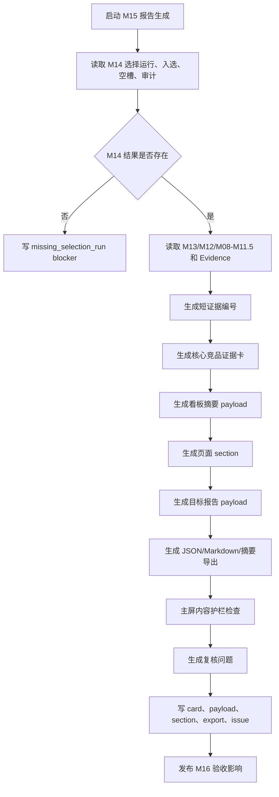

# M15 证据卡与高层报告模块详细设计

## 0. 文档定位

本文是 CatForge 彩电核心三竞品真实数据 v2 的 M15 详细设计，基于：

- 需求文档：`docs/core3_mvp/real_data_v2/sop_requirements/M15_evidence_report_requirements.md`
- 总体架构：`docs/core3_mvp/real_data_v2/sop_detailed_design/00_architecture_data_dictionary_design.md`
- 上游 M14 详细设计：`docs/core3_mvp/real_data_v2/sop_detailed_design/M14_core3_selection_design.md`
- 上游 M13 详细设计：`docs/core3_mvp/real_data_v2/sop_detailed_design/M13_component_scoring_design.md`
- 上游 M12 详细设计：`docs/core3_mvp/real_data_v2/sop_detailed_design/M12_candidate_recall_design.md`
- SOP：`cankao/CatForge_竞品生成SOP_详细指导_v1.md`
- 模块说明：`cankao/catforge_sop_md/modules/M15_证据卡与高层报告模块.md`
- UI 规范：`cankao/CatForge_核心竞品展示页_UI设计规范_v1.md`
- 205 PostgreSQL 真实样例数据基线

M15 的职责是把 M14 的核心三竞品选择结果转成业务高层可读的证据卡、页面 payload、看板摘要 payload、报告 section 和导出内容。完整竞品分析报告在小奥或飞书会话中应作为佐证层；主回答应优先使用看板摘要展示“竞品是谁、重合在哪里、影响是什么、证据入口在哪里”。M15 不是算法调试页，不重新选择竞品，不重新计算 M13/M14 分数，不展示内部英文枚举、表名、字段名、UUID、SQL、模型过程或过程性 AI 文案。

当前设计阶段要求：本文件应能直接拆成开发任务、数据库迁移、服务实现、前端 API、测试用例和验收脚本。

## 1. 模块职责

### 1.1 解决的问题

M15 要把“竞品为什么成立”转成高层可读的汇报结构，回答：

1. 当前目标 SKU 识别出几个核心竞品，分别是谁。
2. 每个核心竞品代表正面对打、价格/销量挤压，还是高端标杆/潜在下探。
3. 为什么这些 SKU 是竞品，而不是普通相似 SKU。
4. 结论背后的价格、渠道、参数、卖点、任务、战场、市场和评论证据是什么。
5. 哪些证据不足，需要业务复核。
6. 报告是否适合给高层展示、导出和持续追踪。
7. 小奥或飞书卡片能否不阅读完整报告，直接看懂 Top 3 竞品和核心重合结构。

### 1.2 汇报顺序

M15 的内容顺序必须是：

1. 先说核心竞品是谁。
2. 再说每个竞品代表什么竞争压力。
3. 再解释为什么这些 SKU 是竞品。
4. 再展示关键证据、差异和策略含义。
5. 最后提供可展开的 SOP 推导轨迹、候选池未选原因和数据质量说明。

### 1.3 输入边界

M15 默认只消费上游结果和 evidence，不直接读取原始表。

必须读取：

| 输入 | 来源 | 用途 |
| --- | --- | --- |
| `core3_competitor_selection_run` | M14 | 选择状态、入选数量、空槽数量 |
| `core3_competitor_selection` | M14 | 入选核心竞品、业务结论、策略含义 |
| `core3_competitor_slot_decision` | M14 | 每个槽位 selected/empty/review 状态 |
| `core3_competitor_selection_audit` | M14 | 入选、未选、复核和阻断原因 |
| `core3_competitor_selection_review_issue` | M14 | 选择复核问题 |
| `core3_candidate_component_score` | M13 | 组件分、置信度、风险和证据完整度 |
| `core3_candidate_role_score` | M13 | 角色分和角色解释 |
| `core3_candidate_component_explanation` | M13 | 组件级证据解释 |
| `core3_candidate_pool` | M12 | 候选池规模、召回强度和关系类型 |
| `core3_candidate_recall_reason` | M12 | 候选进入池的业务理由 |
| `core3_sku_signal_profile` | M08 | 目标和竞品 SKU 画像 |
| `core3_sku_task_score` | M09 | 目标和竞品任务摘要 |
| `core3_sku_target_group_score` | M10 | 目标和竞品客群摘要 |
| `core3_sku_battlefield_score` | M11 | 目标和竞品战场摘要 |
| `core3_sku_claim_value_layer` | M11.5 | 战场内卖点价值分层 |
| `core3_evidence_atom` | M02 | evidence 原子和原始来源回溯 |

禁止读取或展示：

- 原始 `week_sales_data`
- 原始 `attribute_data`
- 原始 `selling_points_data`
- 原始 `comment_data`
- 未经 M14 审计的全量候选
- 未经 M02 标准化的原始证据
- prompt、模型过程、SQL、调试日志

### 1.4 输出边界

M15 输出：

| 表 | 作用 |
| --- | --- |
| `core3_evidence_card` | 每个入选核心竞品的证据卡 |
| `core3_target_report_payload` | 单 SKU 高层报告聚合 payload |
| `core3_report_section` | 页面各区域可渲染 section |
| `core3_report_export` | JSON/Markdown/摘要/证据卡导出产物 |
| `core3_report_review_issue` | 报告内容和展示质量复核问题 |

其中 `core3_report_review_issue` 是 M15 对 M16 的复核输出表，用于检查主屏是否出现内部字段、UUID、语气错误、证据缺失等问题。

M15 只输出业务 payload，不发送飞书消息，也不生成飞书卡片组件 JSON。飞书卡片渲染由小奥入口或 `CompetitorAnswer` 展示适配层负责，适配层只能消费 M15 的看板摘要和报告链接，不能重新拼竞品结论。

## 2. 真实数据约束

### 2.1 当前样例数据事实

205 PostgreSQL 当前真实样例：

- 35 个量价型号。
- 品牌均为海信。
- 周期为 `26W01` 到 `26W23`。
- 渠道只有线上，平台为专业电商和平台电商。
- 结构化卖点只覆盖 5 个型号。
- 85E7Q 有量价、参数、评论，但无结构化卖点。

M15 必须按以下方式表述：

| 数据事实 | 报告表达 |
| --- | --- |
| 当前只有海信品牌 | “当前样例数据内识别出的同品牌内部竞争关系” |
| 85E7Q 无结构化卖点 | “宣传卖点数据缺口”，不能写“卖点弱” |
| 周销为 26W01-26W23 | “基于 26W01-26W23 线上周数据” |
| 平台只有专业电商/平台电商 | “线上平台重合”，不能写线下 |
| 评论有重复和拆行 | “评论证据来自去重后的下游信号” |
| 服务评论较多 | “服务侧证据或风险”，不能替代产品核心竞争结论 |

### 2.2 85E7Q 报告要求

以 85E7Q `TV00029115` 为目标时，报告必须能解释：

1. 当前识别出的核心竞品是谁，并在第一屏展示。
2. 主要竞争语境来自哪些价值战场和用户任务。
3. 正面对打候选为什么成立：战场、任务、价格、尺寸、渠道、卖点价值。
4. 价格/销量挤压候选为什么成立：低价、销量、门槛体验、任务或客群拦截。
5. 高端标杆/潜在下探候选为什么成立：参数/卖点优势、价格锚点、销额或下探风险。
6. 结构化卖点缺失如何影响置信度。
7. 当前只有海信数据时，为什么不能写全市场外部品牌结论。
8. 无法选满三个槽位时，如何展示空槽原因和复核建议。

## 3. 页面和报告信息架构

### 3.1 页面主结构

M15 生成的 payload 支持以下页面结构：

| 区域 | section_code | 默认状态 | 作用 |
| --- | --- | --- | --- |
| 顶部结论 | `executive` | visible | 先展示核心竞品结论 |
| 目标 SKU 信号卡 | `target_profile` | visible | 说明目标 SKU 是什么 |
| 核心竞品卡 | `competitor_cards` | visible | 三槽位主视觉 |
| 目标竞争语境 | `battlefield_context` | visible | 说明价值战场和任务客群 |
| 为什么是竞品 | `why_competitor` | visible | 业务推导解释 |
| 证据矩阵 | `evidence_matrix` | collapsed | 展示证据强弱和来源 |
| 关键差异与策略 | `strategy` | visible | 目标和竞品差异、策略含义 |
| 候选池未选原因 | `candidate_audit` | collapsed | 展示未选原因 |
| SOP 推导轨迹 | `sop_trace` | collapsed | 7 步推导 |
| 数据质量说明 | `data_quality` | collapsed | 样例范围、缺口和复核 |
| 报告导出 | `export` | visible | 导出入口 |

主屏默认只展开：顶部结论、目标 SKU 信号卡、核心竞品卡、目标竞争语境、策略摘要。证据矩阵、候选池、SOP 推导和数据质量默认折叠或抽屉展示。

### 3.2 高层主屏禁止内容

主屏不得出现：

- 英文内部枚举、表名、字段名。
- 原始 UUID。
- SQL。
- JSON 大段结构。
- M00-M16 完整技术链路。
- 算法公式堆叠。
- “AI 认为”“模型判断”“生成过程”“正在思考”等文案。
- 原始大表和候选 TopN 大表。

### 3.3 可展开内容边界

可在二级抽屉或折叠区展示：

- 证据矩阵。
- 候选池未选原因。
- 7 步 SOP 推导轨迹。
- 数据质量说明。
- 技术追溯入口。

即使在二级区域，也不展示 UUID，使用短证据编号。

## 4. Evidence 短编号设计

### 4.1 短编号规则

M15 必须把 `evidence_id` 转成业务可读短编号，主屏不得展示 UUID 或 hash。

短编号格式：

```text
市场证据 01
参数证据 03
评论证据 08
卖点证据 02
任务证据 01
战场证据 02
```

### 4.2 编号生成

编号按目标 SKU + 报告版本内稳定生成：

```text
short_ref = evidence_domain_cn + " " + sequence_2_digits
```

排序优先级：

1. 入选核心竞品卡用到的证据。
2. 价格、渠道、参数、卖点、市场、评论。
3. 任务、客群、战场推导。
4. 候选池未选原因。

### 4.3 回溯关系

短编号必须保存：

- `short_ref`
- `evidence_id`
- `evidence_domain`
- `display_summary_cn`
- `source_table_cn`
- `source_time_window`
- `raw_trace_allowed`

主屏只显示 `short_ref` 和摘要。技术追溯 API 可通过短编号回查 `core3_evidence_atom`。

## 5. 输出表总览

| 表 | 粒度 | 下游 |
| --- | --- | --- |
| `core3_evidence_card` | 目标 SKU + 入选竞品 + 槽位 | 前端/M16/导出/看板摘要 |
| `core3_target_report_payload` | 目标 SKU + selection_run + 规则版本 | 前端主报告 API/小奥看板业务 payload |
| `core3_report_section` | 目标 SKU + section | 前端分区渲染 |
| `core3_report_export` | 目标 SKU + export_type + 规则版本 | 导出下载/复制摘要 |
| `core3_report_review_issue` | 目标/section/card/export 问题 | M16 复核 |

所有表保留历史，通过 `is_current=true` 查询当前结果。

## 6. 表设计公共字段

除特殊说明外，M15 表包含：

| 字段 | 类型建议 | 必填 | 说明 |
| --- | --- | --- | --- |
| `id` | `uuid` | 是 | 主键 |
| `project_id` | `uuid` | 是 | 项目 |
| `category_code` | `varchar(64)` | 是 | MVP 为 `TV` |
| `batch_id` | `uuid` | 是 | 批次 |
| `run_id` | `uuid` | 是 | M16 或 M15 运行 ID |
| `target_sku_code` | `varchar(128)` | 是 | 目标 SKU |
| `selection_run_id` | `uuid` | 是 | M14 选择运行 |
| `rule_version` | `varchar(64)` | 是 | 报告规则版本 |
| `input_fingerprint` | `varchar(128)` | 是 | 输入 hash |
| `result_hash` | `varchar(128)` | 是 | 输出 hash |
| `is_current` | `boolean` | 是 | 当前版本 |
| `created_at` | `timestamptz` | 是 | 创建时间 |
| `updated_at` | `timestamptz` | 是 | 更新时间 |

重跑时插入新结果，并把同业务键旧结果置 `is_current=false`。

## 7. 表设计：`core3_evidence_card`

### 7.1 表用途

每个入选核心竞品生成一张证据卡。证据卡是 M15 面向业务高层的最小可信结论单元。

若 M14 入选数量为 0，则不生成入选竞品证据卡，但 `core3_target_report_payload` 和空槽 section 仍必须生成。

### 7.2 字段

| 字段 | 类型建议 | 必填 | 来源 | 说明 |
| --- | --- | --- | --- | --- |
| `id` | `uuid` | 是 | M15 | 主键 |
| `card_id` | `varchar(128)` | 是 | M15 | 可展示卡片 ID |
| `selection_run_id` | `uuid` | 是 | M14 | 选择运行 |
| `selection_id` | `uuid` | 是 | M14 | 入选记录 |
| `component_score_id` | `uuid` | 否 | M13 | 组件分 |
| `candidate_pool_id` | `uuid` | 否 | M12 | 候选 pair |
| `project_id` | `uuid` | 是 | run context | 项目 |
| `category_code` | `varchar(64)` | 是 | run context | 品类 |
| `batch_id` | `uuid` | 是 | M00 | 批次 |
| `run_id` | `uuid` | 是 | M16/M15 | 运行 |
| `target_sku_code` | `varchar(128)` | 是 | M14 | 目标 SKU |
| `target_model_name` | `varchar(255)` | 是 | M14 | 目标型号 |
| `target_display_name_cn` | `varchar(255)` | 是 | M15 | 目标中文展示名 |
| `competitor_sku_code` | `varchar(128)` | 是 | M14 | 竞品 SKU |
| `competitor_model_name` | `varchar(255)` | 是 | M14 | 竞品型号 |
| `competitor_brand_name` | `varchar(255)` | 否 | M14 | 竞品品牌 |
| `competitor_display_name_cn` | `varchar(255)` | 是 | M15 | 竞品中文展示名 |
| `slot_code` | `varchar(64)` | 是 | M14 | 槽位 code |
| `slot_name_cn` | `varchar(64)` | 是 | M14 | 中文业务角色 |
| `primary_battlefield_code` | `varchar(64)` | 否 | M14 | 主要战场 code，主屏可隐藏 |
| `primary_battlefield_name_cn` | `varchar(128)` | 是 | M14/M15 | 主要战场中文 |
| `pressure_level_cn` | `varchar(64)` | 是 | M14/M15 | 竞争压力 |
| `readiness_level` | `varchar(32)` | 是 | M15 | ready/review_required/insufficient |
| `confidence_label_cn` | `varchar(32)` | 是 | M15 | 高/中/低/需复核 |
| `headline_cn` | `varchar(255)` | 是 | M15 | 结论标题 |
| `summary_cn` | `text` | 是 | M14/M15 | 业务摘要 |
| `dashboard_summary_cn` | `text` | 是 | M15 | 给小奥/飞书看板使用的短摘要 |
| `one_sentence_reason_cn` | `text` | 是 | M14/M15 | 一句话理由 |
| `price_evidence_cn` | `text` | 否 | M13/M15 | 价格证据摘要 |
| `channel_evidence_cn` | `text` | 否 | M13/M15 | 渠道证据摘要 |
| `param_evidence_cn` | `text` | 否 | M13/M15 | 参数证据摘要 |
| `claim_value_evidence_cn` | `text` | 否 | M13/M15 | 卖点价值证据摘要 |
| `task_audience_evidence_cn` | `text` | 否 | M13/M15 | 任务客群证据摘要 |
| `overlap_rows_json` | `jsonb` | 是 | M09-M11/M13/M15 | 看板用重合结构行 |
| `market_evidence_cn` | `text` | 否 | M13/M15 | 市场证据摘要 |
| `comment_evidence_cn` | `text` | 否 | M13/M15 | 评论证据摘要 |
| `evidence_matrix_json` | `jsonb` | 是 | M13/M15 | 证据矩阵 |
| `key_difference_cn` | `text` | 是 | M14/M15 | 关键差异 |
| `target_advantage_cn` | `text` | 是 | M14 | 目标 SKU 优势 |
| `competitor_advantage_cn` | `text` | 是 | M14 | 竞品优势 |
| `strategy_implication_cn` | `text` | 是 | M14/M15 | 策略含义 |
| `risk_note_cn` | `text` | 否 | M14/M15 | 证据风险 |
| `short_evidence_refs_json` | `jsonb` | 是 | M15 | 短证据编号 |
| `evidence_ids` | `text[]` | 是 | M02/M14/M15 | 原始 evidence ID，页面默认隐藏 |
| `display_payload_json` | `jsonb` | 是 | M15 | 前端卡片渲染 payload |
| `action_links_json` | `jsonb` | 是 | M15 | 看板按钮和报告证据入口 |
| `export_payload_json` | `jsonb` | 是 | M15 | 导出用 payload |
| `selection_result_hash` | `varchar(128)` | 是 | M14 | 入选结果 hash |
| `rule_version` | `varchar(64)` | 是 | 配置 | 报告规则版本 |
| `input_fingerprint` | `varchar(128)` | 是 | M15 | 输入 hash |
| `result_hash` | `varchar(128)` | 是 | M15 | 输出 hash |
| `is_current` | `boolean` | 是 | M15 | 当前版本 |
| `created_at` | `timestamptz` | 是 | 系统 | 创建时间 |
| `updated_at` | `timestamptz` | 是 | 系统 | 更新时间 |

### 7.3 `evidence_matrix_json` 结构

```json
[
  {
    "evidence_type_cn": "价格证据",
    "strength_label_cn": "强",
    "score_label_cn": "高",
    "summary_cn": "候选与目标处于相近价格带，适合作为同预算比较对象。",
    "short_refs": ["市场证据 01"],
    "risk_cn": null
  },
  {
    "evidence_type_cn": "卖点证据",
    "strength_label_cn": "中",
    "score_label_cn": "需复核",
    "summary_cn": "目标缺结构化卖点记录，本项以参数和评论补证。",
    "short_refs": ["参数证据 03", "评论证据 02"],
    "risk_cn": "宣传卖点数据缺口"
  }
]
```

### 7.4 `display_payload_json`

`display_payload_json` 是业务页面直接渲染的卡片结构，不包含 UUID、英文内部枚举或表名。

```json
{
  "role_label": "正面对打竞品",
  "competitor_name": "海信 85E8Q",
  "battlefield": "高端画质战场",
  "pressure": "高",
  "one_sentence_reason": "它与目标在尺寸、价格带和高端画质战场上高度接近，是用户在同一预算下最可能同时比较的型号。",
  "five_dimension_evidence": [
    {"label": "价格", "summary": "价格带接近", "strength": "强"},
    {"label": "渠道", "summary": "线上平台重合", "strength": "中高"}
  ],
  "overlap_rows": [
    {
      "dimension": "价值战场",
      "strength": "强重合",
      "matched_points": ["高端画质", "智能互联", "家装融合"],
      "impact": "用户会在同一高端画质预算池中横向比较。"
    },
    {
      "dimension": "用户任务",
      "strength": "中高重合",
      "matched_points": ["观影画质", "游戏流畅", "客厅大屏"],
      "impact": "核心购买任务相近，会影响同一批用户的最终选择。"
    }
  ],
  "key_difference": {
    "target_advantage": "目标在亮度和分区参数上具备优势",
    "competitor_advantage": "竞品价格或销量形成压力"
  },
  "strategy_implication": "定价上应重点监控该竞品价格变化。",
  "action_links": [
    {"label": "查看完整报告", "url": "https://example.feishu.cn/docx/report"},
    {"label": "查看证据矩阵", "anchor": "evidence_matrix"}
  ]
}
```

### 7.5 约束和索引

```sql
alter table core3_evidence_card
  add constraint pk_core3_evidence_card primary key (id);

create unique index uq_core3_evidence_card_current
on core3_evidence_card(project_id, category_code, batch_id, target_sku_code, competitor_sku_code, slot_code, rule_version)
where is_current = true;

create index idx_core3_evidence_card_target
on core3_evidence_card(project_id, category_code, batch_id, target_sku_code, slot_code);

create index idx_core3_evidence_card_selection
on core3_evidence_card(selection_run_id, selection_id);

create index idx_core3_evidence_card_evidence_gin
on core3_evidence_card using gin (evidence_ids);
```

## 8. 表设计：`core3_target_report_payload`

### 8.1 表用途

保存单 SKU 高层报告聚合 payload。前端报告 API 默认读取该表，不在前端重新拼业务结论。

### 8.2 字段

| 字段 | 类型建议 | 必填 | 来源 | 说明 |
| --- | --- | --- | --- | --- |
| `id` | `uuid` | 是 | M15 | 主键 |
| `project_id` | `uuid` | 是 | run context | 项目 |
| `category_code` | `varchar(64)` | 是 | run context | 品类 |
| `batch_id` | `uuid` | 是 | M00 | 批次 |
| `run_id` | `uuid` | 是 | M16/M15 | 运行 |
| `target_sku_code` | `varchar(128)` | 是 | M14 | 目标 SKU |
| `target_display_name_cn` | `varchar(255)` | 是 | M15 | 目标中文展示 |
| `report_title_cn` | `varchar(255)` | 是 | M15 | 报告标题 |
| `executive_conclusion_cn` | `text` | 是 | M15 | 高层结论 |
| `readiness_level` | `varchar(32)` | 是 | M15 | ready/review_required/insufficient |
| `confidence_label_cn` | `varchar(32)` | 是 | M15 | 报告置信标签 |
| `data_scope_note_cn` | `text` | 是 | M15 | 数据覆盖范围说明 |
| `target_profile_summary_cn` | `text` | 是 | M08/M15 | 目标 SKU 摘要 |
| `selection_run_id` | `uuid` | 是 | M14 | 选择运行 |
| `selected_count` | `integer` | 是 | M14 | 入选数量 |
| `empty_slot_count` | `integer` | 是 | M14 | 空槽数量 |
| `battlefield_summary_json` | `jsonb` | 是 | M11/M15 | 价值战场摘要 |
| `task_group_summary_json` | `jsonb` | 是 | M09/M10/M15 | 任务客群摘要 |
| `target_signal_cards_json` | `jsonb` | 是 | M08/M15 | 目标信号卡 |
| `core_competitors_json` | `jsonb` | 是 | M14/M15 | 0-3 个核心竞品卡摘要 |
| `dashboard_payload_json` | `jsonb` | 是 | M15 | 小奥/飞书看板业务摘要 |
| `empty_slots_json` | `jsonb` | 是 | M14/M15 | 空槽说明 |
| `why_competitor_logic_json` | `jsonb` | 是 | M12-M14/M15 | 为什么是竞品的业务推导 |
| `evidence_matrix_json` | `jsonb` | 是 | M13/M15 | 证据矩阵 |
| `key_difference_json` | `jsonb` | 是 | M14/M15 | 关键差异 |
| `strategy_hint_json` | `jsonb` | 是 | M14/M15 | 策略提示 |
| `sop_trace_json` | `jsonb` | 是 | M08-M14/M15 | 7 步推导轨迹 |
| `candidate_pool_summary_json` | `jsonb` | 是 | M12/M14/M15 | 候选池和未选原因 |
| `review_questions_json` | `jsonb` | 是 | M14/M15/M16 | 需业务确认问题 |
| `data_quality_note_cn` | `text` | 是 | M00-M08/M15 | 数据质量说明 |
| `short_evidence_map_json` | `jsonb` | 是 | M15/M02 | 短证据编号映射 |
| `report_evidence_links_json` | `jsonb` | 是 | M15 | 报告、section 和证据入口 |
| `export_payload_json` | `jsonb` | 是 | M15 | 导出用结构 |
| `ui_guardrail_result_json` | `jsonb` | 是 | M15 | 主屏质量检查结果 |
| `m14_selection_fingerprint` | `varchar(128)` | 是 | M14 | 选择结果指纹 |
| `evidence_revision` | `varchar(128)` | 否 | M02 | evidence 状态版本 |
| `rule_version` | `varchar(64)` | 是 | 配置 | 报告规则版本 |
| `input_fingerprint` | `varchar(128)` | 是 | M15 | 输入 hash |
| `result_hash` | `varchar(128)` | 是 | M15 | 输出 hash |
| `is_current` | `boolean` | 是 | M15 | 当前版本 |
| `created_at` | `timestamptz` | 是 | 系统 | 创建时间 |
| `updated_at` | `timestamptz` | 是 | 系统 | 更新时间 |

### 8.3 `dashboard_payload_json` 结构

`dashboard_payload_json` 是给小奥问答、飞书消息卡片或后续链接预览复用的业务摘要结构。它不是完整报告，也不是飞书卡片组件 JSON。

```json
{
  "schema_version": "competitor_dashboard_v1",
  "title": "海信 85E7Q 重点竞品看板",
  "target": {
    "sku_code": "TV00029115",
    "model_name": "85E7Q",
    "summary": "基于 26W01-26W23 线上样例数据识别核心竞品。"
  },
  "summary_cn": "当前识别出 2 个高置信核心竞品，另有 1 个槽位需补充数据复核。",
  "competitors": [
    {
      "rank": 1,
      "name": "海信 85E8Q",
      "role_cn": "正面对打竞品",
      "pressure_cn": "高",
      "reason_cn": "与目标在高端画质战场、观影和游戏任务上高度接近。",
      "overlap_rows": [
        {
          "dimension_cn": "价值战场",
          "strength_cn": "强重合",
          "matched_points_cn": ["高端画质", "智能互联", "家装融合"],
          "impact_cn": "用户会在同一高端画质预算池中横向比较。"
        },
        {
          "dimension_cn": "用户任务",
          "strength_cn": "中高重合",
          "matched_points_cn": ["观影画质", "游戏流畅", "客厅大屏"],
          "impact_cn": "核心购买任务相近，会影响同一批用户的最终选择。"
        },
        {
          "dimension_cn": "目标客群",
          "strength_cn": "中重合",
          "matched_points_cn": ["品质升级家庭", "大屏客厅用户"],
          "impact_cn": "客群重叠会造成同一购买池内的配置和价格对比。"
        }
      ],
      "shared_anchors_cn": ["Mini LED", "高刷", "大屏客厅"],
      "market_validation_cn": "价格带和线上渠道重合，具备同场比较条件。",
      "evidence_refs": ["市场证据 01", "参数证据 03"],
      "action_links": [
        {"label": "查看完整报告", "url": "https://example.feishu.cn/docx/report"},
        {"label": "查看证据矩阵", "section_code": "evidence_matrix"}
      ]
    }
  ],
  "report_evidence_links": [
    {"label": "完整竞品分析报告", "url": "https://example.feishu.cn/docx/report"}
  ]
}
```

生成要求：

- 每个入选竞品至少包含价值战场、用户任务、目标客群三类 `overlap_rows`；没有足够证据时填“证据不足，需复核”，不能删除维度。
- `strength_cn` 必须配合 `matched_points_cn` 和 `impact_cn` 展示，不能只给“重合强度 66%”。
- `summary_cn` 必须能作为飞书卡片首屏摘要单独成立。
- `report_evidence_links` 只放佐证入口，不能把完整报告正文塞进看板 payload。

### 8.4 `sop_trace_json` 结构

只展示 7 步：

```json
[
  {
    "step_no": 1,
    "step_name_cn": "SKU 信号画像",
    "business_result_cn": "目标具备 85 寸、Mini LED、高亮、高刷等核心信号。",
    "evidence_status_cn": "证据较完整",
    "short_refs": ["参数证据 01", "市场证据 01"]
  },
  {
    "step_no": 7,
    "step_name_cn": "三槽位选择",
    "business_result_cn": "选择正面对打和价格/销量挤压候选，高端标杆槽位暂无高置信候选。",
    "evidence_status_cn": "需复核 1 个空槽",
    "short_refs": []
  }
]
```

禁止在 `sop_trace_json` 中放 M00-M16 完整链路、SQL、公式、JSON 大段或模型过程。

### 8.5 约束和索引

```sql
alter table core3_target_report_payload
  add constraint pk_core3_target_report_payload primary key (id);

create unique index uq_core3_target_report_payload_current
on core3_target_report_payload(project_id, category_code, batch_id, target_sku_code, selection_run_id, rule_version)
where is_current = true;

create index idx_core3_target_report_payload_target
on core3_target_report_payload(project_id, category_code, batch_id, target_sku_code, readiness_level);

create index idx_core3_target_report_payload_json_gin
on core3_target_report_payload using gin (core_competitors_json);
```

## 9. 表设计：`core3_report_section`

### 9.1 表用途

把报告拆成可渲染 section，前端按 section 顺序展示。这样页面不需要理解算法表，只需要渲染中文业务 payload。

### 9.2 字段

| 字段 | 类型建议 | 必填 | 来源 | 说明 |
| --- | --- | --- | --- | --- |
| `id` | `uuid` | 是 | M15 | 主键 |
| `target_report_payload_id` | `uuid` | 是 | M15 | 关联报告 payload |
| `project_id` | `uuid` | 是 | run context | 项目 |
| `category_code` | `varchar(64)` | 是 | run context | 品类 |
| `batch_id` | `uuid` | 是 | M00 | 批次 |
| `run_id` | `uuid` | 是 | M16/M15 | 运行 |
| `target_sku_code` | `varchar(128)` | 是 | M14 | 目标 SKU |
| `selection_run_id` | `uuid` | 是 | M14 | 选择运行 |
| `section_code` | `varchar(64)` | 是 | M15 | section code |
| `section_title_cn` | `varchar(128)` | 是 | M15 | 中文标题 |
| `section_order` | `integer` | 是 | M15 | 展示顺序 |
| `section_payload_json` | `jsonb` | 是 | M15 | 区域结构化内容 |
| `display_status` | `varchar(32)` | 是 | M15 | visible/collapsed/hidden |
| `readiness_level` | `varchar(32)` | 是 | M15 | ready/review_required/insufficient |
| `contains_internal_field_flag` | `boolean` | 是 | M15 | 是否含内部字段，必须 false |
| `contains_uuid_flag` | `boolean` | 是 | M15 | 是否含 UUID，必须 false |
| `evidence_ids` | `text[]` | 是 | M02/M15 | 关联 evidence，页面隐藏 |
| `short_evidence_refs_json` | `jsonb` | 是 | M15 | 展示短证据 |
| `rule_version` | `varchar(64)` | 是 | 配置 | 报告规则版本 |
| `input_fingerprint` | `varchar(128)` | 是 | M15 | 输入 hash |
| `result_hash` | `varchar(128)` | 是 | M15 | 输出 hash |
| `is_current` | `boolean` | 是 | M15 | 当前版本 |
| `created_at` | `timestamptz` | 是 | 系统 | 创建时间 |
| `updated_at` | `timestamptz` | 是 | 系统 | 更新时间 |

### 9.3 section 枚举

| section_code | 标题 | 默认状态 |
| --- | --- | --- |
| `executive` | 核心结论 | visible |
| `target_profile` | 目标 SKU 信号 | visible |
| `competitor_cards` | 核心竞品卡 | visible |
| `battlefield_context` | 目标竞争语境 | visible |
| `why_competitor` | 为什么是竞品 | visible |
| `evidence_matrix` | 证据矩阵 | collapsed |
| `strategy` | 关键差异与策略含义 | visible |
| `candidate_audit` | 候选池与未选原因 | collapsed |
| `sop_trace` | SOP 推导轨迹 | collapsed |
| `data_quality` | 数据质量说明 | collapsed |
| `export` | 报告导出 | visible |

### 9.4 约束和索引

```sql
alter table core3_report_section
  add constraint pk_core3_report_section primary key (id);

create unique index uq_core3_report_section_current
on core3_report_section(project_id, category_code, batch_id, target_sku_code, selection_run_id, section_code, rule_version)
where is_current = true;

create index idx_core3_report_section_order
on core3_report_section(project_id, category_code, batch_id, target_sku_code, section_order);

create index idx_core3_report_section_display
on core3_report_section(project_id, category_code, batch_id, display_status, readiness_level);
```

## 10. 表设计：`core3_report_export`

### 10.1 表用途

保存报告导出产物，确保导出内容与页面 payload 来自同一版本，而不是导出时重新生成事实。

### 10.2 字段

| 字段 | 类型建议 | 必填 | 来源 | 说明 |
| --- | --- | --- | --- | --- |
| `id` | `uuid` | 是 | M15 | 主键 |
| `target_report_payload_id` | `uuid` | 是 | M15 | 关联报告 payload |
| `project_id` | `uuid` | 是 | run context | 项目 |
| `category_code` | `varchar(64)` | 是 | run context | 品类 |
| `batch_id` | `uuid` | 是 | M00 | 批次 |
| `run_id` | `uuid` | 是 | M16/M15 | 运行 |
| `target_sku_code` | `varchar(128)` | 是 | M14 | 目标 SKU |
| `selection_run_id` | `uuid` | 是 | M14 | 选择运行 |
| `export_type` | `varchar(64)` | 是 | M15 | json/markdown/report_summary/evidence_cards |
| `export_title_cn` | `varchar(255)` | 是 | M15 | 导出标题 |
| `export_payload` | `text` | 是 | M15 | 导出内容 |
| `export_payload_json` | `jsonb` | 否 | M15 | JSON 导出结构 |
| `data_scope_note_cn` | `text` | 是 | M15 | 数据范围说明 |
| `readiness_level` | `varchar(32)` | 是 | M15 | 导出成熟度 |
| `checksum` | `varchar(128)` | 是 | M15 | 导出内容 hash |
| `page_payload_hash` | `varchar(128)` | 是 | M15 | 页面 payload hash |
| `export_status` | `varchar(32)` | 是 | M15 | ready/failed/review_required |
| `failure_reason` | `text` | 否 | M15 | 失败原因 |
| `rule_version` | `varchar(64)` | 是 | 配置 | 报告规则版本 |
| `input_fingerprint` | `varchar(128)` | 是 | M15 | 输入 hash |
| `result_hash` | `varchar(128)` | 是 | M15 | 输出 hash |
| `is_current` | `boolean` | 是 | M15 | 当前版本 |
| `created_at` | `timestamptz` | 是 | 系统 | 创建时间 |
| `updated_at` | `timestamptz` | 是 | 系统 | 更新时间 |

### 10.3 导出类型

| export_type | 内容 |
| --- | --- |
| `json` | 完整结构化 payload |
| `markdown` | 单 SKU 竞品分析报告草稿 |
| `report_summary` | 可复制汇报摘要 |
| `evidence_cards` | 核心竞品证据卡集合 |

### 10.4 约束和索引

```sql
alter table core3_report_export
  add constraint pk_core3_report_export primary key (id);

create unique index uq_core3_report_export_current
on core3_report_export(project_id, category_code, batch_id, target_sku_code, selection_run_id, export_type, rule_version)
where is_current = true;

create index idx_core3_report_export_target
on core3_report_export(project_id, category_code, batch_id, target_sku_code, export_type, export_status);
```

## 11. 表设计：`core3_report_review_issue`

### 11.1 表用途

保存 M15 报告复核问题。M16 读取该表进入复核队列，前端可根据 unresolved issue 显示“需复核”状态。

### 11.2 字段

| 字段 | 类型建议 | 必填 | 来源 | 说明 |
| --- | --- | --- | --- | --- |
| `id` | `uuid` | 是 | M15 | 主键 |
| `target_report_payload_id` | `uuid` | 否 | M15 | 报告 payload |
| `evidence_card_id` | `uuid` | 否 | M15 | 证据卡 |
| `report_section_id` | `uuid` | 否 | M15 | section |
| `report_export_id` | `uuid` | 否 | M15 | 导出 |
| `project_id` | `uuid` | 是 | run context | 项目 |
| `category_code` | `varchar(64)` | 是 | run context | 品类 |
| `batch_id` | `uuid` | 是 | M00 | 批次 |
| `run_id` | `uuid` | 是 | M16/M15 | 运行 |
| `target_sku_code` | `varchar(128)` | 是 | M14 | 目标 SKU |
| `selection_run_id` | `uuid` | 是 | M14 | 选择运行 |
| `issue_scope` | `varchar(32)` | 是 | M15 | report/card/section/export/language/evidence |
| `section_code` | `varchar(64)` | 否 | M15 | section |
| `issue_type` | `varchar(64)` | 是 | M15 | 问题类型 |
| `issue_level` | `varchar(32)` | 是 | M15 | warning/review/blocker |
| `issue_message_cn` | `text` | 是 | M15 | 中文问题 |
| `suggested_action_cn` | `text` | 否 | M15 | 建议处理 |
| `source_payload_json` | `jsonb` | 是 | M15 | 问题上下文 |
| `evidence_ids` | `text[]` | 是 | M15 | 相关 evidence |
| `resolved_status` | `varchar(32)` | 是 | M16 | open/resolved/ignored |
| `resolved_by` | `varchar(128)` | 否 | M16 | 处理人 |
| `resolved_at` | `timestamptz` | 否 | M16 | 处理时间 |
| `resolution_note` | `text` | 否 | M16 | 处理备注 |
| `rule_version` | `varchar(64)` | 是 | 配置 | 报告规则版本 |
| `input_fingerprint` | `varchar(128)` | 是 | M15 | 输入 hash |
| `result_hash` | `varchar(128)` | 是 | M15 | 输出 hash |
| `is_current` | `boolean` | 是 | M15 | 当前版本 |
| `created_at` | `timestamptz` | 是 | 系统 | 创建时间 |
| `updated_at` | `timestamptz` | 是 | 系统 | 更新时间 |

### 11.3 问题类型

| issue_type | 级别 | 触发条件 |
| --- | --- | --- |
| `missing_selection_run` | blocker | M14 没有选择运行 |
| `all_slots_empty` | review | M14 三槽位都为空 |
| `missing_evidence_card_field` | blocker | 入选竞品证据卡必要字段缺失 |
| `missing_evidence` | blocker | 入选结论没有 evidence 或缺失原因 |
| `internal_field_exposed` | blocker | 主屏出现英文内部字段、表名或 code |
| `uuid_exposed` | blocker | 主屏出现 UUID/hash |
| `tone_confidence_mismatch` | review | 低置信使用确定语气 |
| `missing_data_scope_note` | blocker | 数据范围说明缺失 |
| `claim_gap_not_disclosed` | review | 结构化卖点缺失但报告未提示 |
| `service_as_core_claim` | review | 服务体验被写成产品核心竞争力 |
| `missing_candidate_audit` | review | 候选池未选原因缺失 |
| `missing_dashboard_payload` | blocker | 报告 payload 未生成小奥/飞书看板摘要 |
| `dashboard_overlap_missing` | review | 看板竞品缺少战场、任务或客群重合结构 |
| `export_payload_mismatch` | blocker | 导出 payload 与页面 payload 不一致 |
| `sop_trace_too_technical` | review | SOP 推导出现 M00-M16、SQL、公式或内部过程 |

### 11.4 约束和索引

```sql
alter table core3_report_review_issue
  add constraint pk_core3_report_review_issue primary key (id);

create unique index uq_core3_report_review_issue_current
on core3_report_review_issue(
  project_id,
  category_code,
  batch_id,
  target_sku_code,
  selection_run_id,
  issue_scope,
  coalesce(section_code, ''),
  issue_type,
  result_hash,
  rule_version
)
where is_current = true;

create index idx_core3_report_review_issue_open
on core3_report_review_issue(project_id, category_code, batch_id, resolved_status, issue_level);

create index idx_core3_report_review_issue_target
on core3_report_review_issue(project_id, category_code, batch_id, target_sku_code, issue_type);
```

## 12. 内容生成规则

### 12.1 高层结论

高层结论由 M14 入选结果驱动：

| M14 结果 | 表达 |
| --- | --- |
| 3 个高置信竞品 | “当前识别出 3 个核心竞品，分别代表...” |
| 2 个高置信竞品 | “当前识别出 2 个高置信核心竞品，另有 1 个槽位暂无高置信候选...” |
| 1 个高置信竞品 | “当前只有 1 个高置信核心竞品，其余方向需要补充数据或复核...” |
| 0 个竞品 | “当前数据不足以形成高置信核心竞品结论...” |

不能为了形成完整话术补写不存在的竞品。

### 12.2 置信度语气

| 置信度 | 允许话术 | 禁止话术 |
| --- | --- | --- |
| high | “识别为”“主要竞争压力来自” | “可能也许” |
| medium | “倾向判断为”“需要业务复核” | “确定是” |
| low | “当前仅作为候选参考” | “核心竞品是” |
| insufficient | “当前数据不足以判断” | “系统已确认” |

### 12.3 中文业务语言转换

| 内部字段 | 页面表达 |
| --- | --- |
| `direct_fight` | 正面对打竞品 |
| `price_volume_pressure` | 价格/销量挤压竞品 |
| `benchmark_potential` | 高端标杆/潜在下探竞品 |
| `battlefield_fit_score` | 价值战场重合度 |
| `task_overlap_score` | 用户任务重合度 |
| `evidence_id` | 证据编号 |
| `sample_status=insufficient` | 样本不足，需复核 |
| `review_required` | 需要业务复核 |

### 12.4 证据摘要

每张核心竞品卡最多展示 5-7 条关键证据，优先级：

1. 价格。
2. 渠道。
3. 参数。
4. 卖点价值。
5. 市场。
6. 评论。
7. 任务/客群。

缺失和风险不能隐藏；缺失应写成“证据缺口”，不是负向能力结论。

### 12.5 策略提示

策略提示必须来自 M14/M13 evidence：

| 角色 | 策略提示范围 |
| --- | --- |
| 正面对打 | 定价对位、卖点表达、渠道监控 |
| 价格/销量挤压 | 价格防守、促销节奏、权益包 |
| 高端标杆/潜在下探 | 上探空间、高端参数对比、下探风险 |
| 服务参考 | 服务保障或安装体验，不生成产品核心防守建议 |

### 12.6 看板摘要

看板摘要服务于飞书会话和小奥问答，信息密度高于一句话回答，低于完整报告。

生成顺序：

1. 顶部 `summary_cn` 先说明识别出几个核心竞品、是否有空槽、数据范围。
2. 每个竞品用 `role_cn`、`pressure_cn` 和 `reason_cn` 建立第一判断。
3. `overlap_rows` 固定展示价值战场、用户任务、目标客群三类重合；必要时可附加价格带、渠道、卖点价值。
4. 每一行必须包含“重合在哪些点”和“为什么影响成交判断”。
5. `shared_anchors_cn` 只放用户能理解的产品锚点，不放内部 code。
6. `market_validation_cn` 用价格、销量、渠道或时间窗口说明该竞品有现实比较条件。
7. `action_links` 放完整报告、证据矩阵、进一步分析入口。

看板摘要不得：

- 展示内部字段、UUID、SQL 或模型过程。
- 使用大段报告正文替代摘要。
- 用单一“重合强度”数字替代重合结构。
- 让飞书卡片适配层重新推导竞品结论。

## 13. 报告生成流程

### 13.1 总流程



### 13.2 编号步骤

1. 读取 `run_context`：`project_id`、`category_code`、`batch_id`、`run_id`、目标 SKU、`rule_version`。
2. 读取 M14 当前选择运行。
3. 缺 M14 选择运行时生成 blocker issue 和 insufficient report skeleton。
4. 读取 M14 入选、槽位决策、审计、复核问题。
5. 读取入选候选对应 M13 组件分、角色分、组件解释。
6. 读取候选召回理由和候选池摘要。
7. 读取目标和竞品 M08-M11.5 摘要。
8. 根据所有 evidence 生成短证据编号。
9. 为每个入选竞品生成证据卡。
10. 基于证据卡和 M09-M11 维度摘要生成 `dashboard_payload_json`。
11. 为每个页面区域生成 `core3_report_section`。
12. 聚合生成 `core3_target_report_payload`。
13. 生成 JSON、Markdown、汇报摘要和证据卡导出。
14. 执行 UI guardrail 检查：内部字段、UUID、语气、数据范围、证据缺失、看板重合结构缺失。
15. 生成 `core3_report_review_issue`。
16. 在事务中写入五张输出表。
17. 将旧 current 结果置 `is_current=false`。
18. 通知 M16 报告验收状态。

### 13.3 伪代码

```python
def run_evidence_report(context, target_sku_code):
    selection_run = selection_repo.get_current_run(context, target_sku_code)
    if selection_run is None:
        skeleton = report_builder.build_insufficient_report("missing_selection_run")
        issues = [report_issue("missing_selection_run", "blocker")]
        return report_repo.replace_current_results(skeleton=skeleton, issues=issues)

    selections = selection_repo.list_current_selections(selection_run.id)
    slot_decisions = selection_repo.list_current_slot_decisions(selection_run.id)
    audits = selection_repo.list_current_selection_audits(selection_run.id)

    score_bundle = score_repo.load_m13_bundle(selections)
    trace_bundle = trace_repo.load_m08_to_m115_summary(context, target_sku_code, selections)
    evidence_atoms = evidence_repo.load_evidence(evidence_ids_from(selection_run, selections, audits, score_bundle))

    short_ref_map = evidence_ref_service.build_short_refs(evidence_atoms)
    cards = evidence_card_builder.build(selections, score_bundle, short_ref_map)
    dashboard_payload = dashboard_payload_builder.build(selection_run, cards, trace_bundle, short_ref_map)
    sections = report_section_builder.build(selection_run, selections, slot_decisions, audits, cards, trace_bundle, short_ref_map)
    payload = report_payload_builder.build(selection_run, sections, cards, dashboard_payload, short_ref_map)
    exports = report_export_builder.build(payload, cards)
    guardrail_issues = report_guardrail.check(payload, sections, cards, exports, dashboard_payload)

    report_repo.replace_current_results(
        cards=cards,
        payload=payload,
        sections=sections,
        exports=exports,
        issues=guardrail_issues,
    )
```

## 14. 主屏内容护栏

### 14.1 内部字段检查

M15 必须对主屏 payload 执行文本扫描，发现以下内容写 blocker：

- `core3_`
- `candidate_`
- `_score`
- `_json`
- `_id`
- `uuid`
- `SQL`
- `M00` 到 `M16` 完整技术模块名
- `AI 认为`
- `模型判断`
- `生成过程`

例外：SOP 抽屉中允许显示 7 步中文名称，但不允许显示完整技术表名和字段名。

### 14.2 UUID 检查

主屏和导出摘要不得出现 UUID/hash 正则：

```text
[0-9a-fA-F]{8}-[0-9a-fA-F]{4}-[0-9a-fA-F]{4}-[0-9a-fA-F]{4}-[0-9a-fA-F]{12}
```

技术追溯 API 可以返回原始 evidence ID，但业务报告 API 不返回。

### 14.3 语气检查

规则：

- `readiness_level='insufficient'` 不允许出现“识别为核心竞品”。
- `confidence_label_cn='低'` 不允许出现“确定”“主要压力来自”。
- `review_required=true` 必须出现“需复核”或等价说明。

### 14.4 数据范围检查

每个报告必须包含：

- 当前样例数据范围。
- 周期 `26W01-26W23`。
- 线上平台口径。
- 同品牌样例数据说明。
- 结构化卖点缺失说明，如果目标或入选竞品有该风险。

### 14.5 看板摘要检查

`dashboard_payload_json` 必须执行独立检查：

| 条件 | 处理 |
| --- | --- |
| 缺 `summary_cn` 或 `competitors` | blocker |
| 入选竞品未进入看板 | blocker |
| 入选竞品缺价值战场、用户任务、目标客群三类重合行 | review |
| `overlap_rows` 只有分数、没有命中点和影响解释 | review |
| `report_evidence_links` 缺完整报告入口 | review |
| payload 出现内部字段、UUID、SQL 或模型过程 | blocker |

## 15. 增量策略

### 15.1 触发源

| 变化来源 | M15 动作 | 下游影响 |
| --- | --- | --- |
| M14 选择结果变化 | 重建证据卡、section、payload、导出 | M15/M16 |
| M14 空槽或审计变化 | 更新空槽说明和候选池未选原因 | M15/M16 |
| M13 组件解释变化 | 更新证据矩阵、关键差异、策略提示 | M15/M16 |
| M12 候选召回理由变化 | 更新候选池摘要和 SOP trace | M15/M16 |
| M08-M11.5 画像和推导变化 | 更新目标语境、任务、客群、战场、卖点摘要和看板重合结构 | M15/M16 |
| M02 evidence 状态变化 | 更新短证据编号、证据明细、置信度和风险 | M15/M16 |
| 报告规则变化 | 按新 `rule_version` 重建报告 | M15/M16 |

### 15.2 Fingerprint

目标报告 `input_fingerprint`：

```text
hash(
  project_id,
  category_code,
  batch_id,
  target_sku_code,
  selection_run_id,
  m14_selection_result_hash,
  m13_explanation_fingerprint,
  m12_audit_fingerprint,
  m08_to_m115_summary_fingerprint,
  evidence_revision,
  report_rule_version
)
```

结果 `result_hash`：

```text
hash(
  executive_conclusion_cn,
  core_competitors_json,
  dashboard_payload_json,
  empty_slots_json,
  evidence_matrix_json,
  sop_trace_json,
  candidate_pool_summary_json,
  readiness_level,
  ui_guardrail_result_json
)
```

### 15.3 历史保留

重跑时：

1. 插入新 evidence card、payload、section、export、issue。
2. 同业务键旧记录置 `is_current=false`。
3. 保留历史报告以支持追溯。
4. 前端只读取 `is_current=true`。

## 16. 服务和任务边界

### 16.1 服务建议

后端服务文件：

```text
apps/api-server/app/services/core3_real_data/evidence_report_service.py
```

主要类：

| 类 | 职责 |
| --- | --- |
| `EvidenceReportService` | M15 入口，生成报告和证据卡 |
| `ReportInputLoader` | 读取 M14/M13/M12/M08-M11.5/Evidence |
| `EvidenceShortRefService` | evidence ID 到短编号映射 |
| `EvidenceCardBuilder` | 生成核心竞品证据卡 |
| `DashboardPayloadBuilder` | 生成小奥/飞书可复用的看板业务摘要 |
| `ReportSectionBuilder` | 生成页面 section |
| `TargetReportPayloadBuilder` | 聚合单 SKU 报告 payload |
| `ReportExportBuilder` | 生成 JSON/Markdown/摘要/证据卡导出 |
| `ReportGuardrailChecker` | 检查内部字段、UUID、语气和数据范围 |
| `ReportReviewIssueBuilder` | 生成复核问题 |
| `ReportRepository` | 写入 M15 五张表 |

### 16.2 Repository 边界

| Repository | 访问范围 |
| --- | --- |
| `CompetitorRepository` | 读取 M12/M14 候选、选择、审计 |
| `ScoreRepository` | 读取 M13 组件分、角色分、解释 |
| `FeatureRepository` | 读取 M08-M11.5 摘要 |
| `EvidenceRepository` | 读取 evidence atom 和状态 |
| `ReportRepository` | 写 M15 报告、证据卡、section、导出、issue |
| `JobRepository` | M16 run、复核队列和验收状态 |

不得使用 `RawSourceRepository`。

### 16.3 Runner

M16 调用：

```text
Core3ModuleRunner.run("M15", run_context, target_scope)
```

`target_scope` 支持：

| Scope | 含义 |
| --- | --- |
| `all_targets` | 批次内全部目标 |
| `target_sku_list` | 指定目标 |
| `changed_targets` | M14/M13/evidence 变化影响的目标 |

Runner 输出：

```json
{
  "module_code": "M15",
  "status": "success",
  "input_count": 1,
  "output_count": 1,
  "output_hash": "sha256...",
  "review_issues": [],
  "warnings": [],
  "downstream_impacts": ["M16"]
}
```

### 16.4 API 边界

业务展示 API：

| API | 用途 |
| --- | --- |
| `GET /api/mvp/core3/v2/projects/{project_id}/targets/{sku_or_model}/report` | 单 SKU 高层报告 |
| `GET /api/mvp/core3/v2/projects/{project_id}/targets/{sku_or_model}/report/dashboard` | 小奥/飞书看板业务摘要 |
| `GET /api/mvp/core3/v2/projects/{project_id}/targets/{sku_or_model}/evidence-cards` | 核心竞品证据卡 |
| `GET /api/mvp/core3/v2/projects/{project_id}/targets/{sku_or_model}/report/sections` | 页面 section |
| `GET /api/mvp/core3/v2/projects/{project_id}/targets/{sku_or_model}/exports/{export_type}` | 报告导出 |

技术追溯 API：

| API | 用途 |
| --- | --- |
| `GET /api/mvp/core3/v2/projects/{project_id}/targets/{sku}/evidence-ref/{short_ref}` | 短证据编号回溯 |
| `GET /api/mvp/core3/v2/projects/{project_id}/targets/{sku}/report-quality` | 报告护栏检查结果 |

业务展示 API 不返回原始 UUID、内部字段、SQL 或技术表名。`report/dashboard` 返回业务摘要结构，不返回飞书卡片 JSON；飞书卡片渲染属于小奥入口展示适配层。

## 17. 质量和复核规则

### 17.1 报告级规则

| 条件 | 处理 |
| --- | --- |
| 缺 M14 选择运行 | 生成 insufficient skeleton + blocker |
| 三槽位全空 | 报告可生成，但 readiness 为 review_required 或 insufficient |
| 缺数据范围说明 | blocker |
| 高层结论与入选数量不一致 | blocker |
| 看板摘要缺失或与入选竞品不一致 | blocker |
| 页面 payload 和导出 payload 不一致 | blocker |

### 17.2 证据卡规则

| 条件 | 处理 |
| --- | --- |
| 入选竞品无证据卡 | blocker |
| 证据卡缺一句话理由 | blocker |
| 证据卡缺 evidence 或缺失原因 | blocker |
| 卖点缺失未提示 | review |
| 服务信号写成产品核心竞争力 | review |

### 17.3 看板摘要规则

| 条件 | 处理 |
| --- | --- |
| 每个入选竞品缺 `dashboard_summary_cn` | blocker |
| 看板只展示竞品名单，不展示重合结构 | review |
| 看板重合行少于价值战场、用户任务、目标客群三类 | review |
| 看板缺完整报告或证据矩阵入口 | review |
| 看板摘要使用完整报告长段落堆叠 | review |

### 17.4 UI 文案规则

| 条件 | 处理 |
| --- | --- |
| 主屏出现内部英文字段 | blocker |
| 主屏出现 UUID/hash | blocker |
| 出现 AI 过程性文案 | review |
| 低置信用确定语气 | review |
| SOP 展示超过 7 步或出现 M00-M16 | review |

## 18. 测试设计

### 18.1 单元测试

| 测试 | 场景 | 期望 |
| --- | --- | --- |
| `test_missing_selection_run_blocks` | 缺 M14 run | 生成 blocker 和 insufficient skeleton |
| `test_evidence_card_for_each_selection` | M14 有 2 个入选 | 生成 2 张证据卡 |
| `test_empty_slot_payload` | M14 有空槽 | payload 有空槽原因 |
| `test_short_evidence_refs_no_uuid` | evidence IDs 输入 | 主屏只显示短编号 |
| `test_internal_field_guardrail` | payload 含 `_score` 或 `core3_` | 写 blocker |
| `test_confidence_tone_guardrail` | low 置信使用确定语气 | 写 review |
| `test_claim_gap_disclosed` | 目标缺结构化卖点 | 报告写宣传卖点数据缺口 |
| `test_service_not_core_claim` | 服务证据强 | 不生成产品核心防守结论 |
| `test_dashboard_payload_generated` | M14 有入选竞品 | 生成看板摘要并包含 Top 竞品 |
| `test_dashboard_overlap_rows_required` | 入选竞品缺重合行 | 写 dashboard overlap review issue |
| `test_export_matches_page_payload` | 生成导出 | checksum 与页面 payload 匹配 |
| `test_sop_trace_seven_steps` | 生成 SOP trace | 只包含 7 步中文业务轨迹 |

### 18.2 集成测试

| 测试 | 输入 | 期望 |
| --- | --- | --- |
| M14-M15 集成 | selection、slot、audit | 生成报告和证据卡 |
| M13-M15 集成 | component explanation | 生成证据矩阵 |
| M12-M15 集成 | recall reason/audit | 生成候选池未选原因 |
| M09-M11-M15 集成 | 任务、客群、战场摘要 | 生成看板重合结构 |
| M02-M15 集成 | evidence atom | 生成短编号并可回溯 |
| M15-M16 集成 | report issue | M16 可读取复核项 |

### 18.3 85E7Q 回归测试

以 `TV00029115` / `85E7Q` 为目标：

| 验收点 | 期望 |
| --- | --- |
| 第一屏 | 先展示核心竞品数量和三槽位状态 |
| 同品牌说明 | 报告写当前样例数据内的同品牌竞争 |
| 正面对打解释 | 包含双方战场、价格/尺寸/渠道、卖点价值 |
| 看板重合结构 | 每个入选竞品展示战场、任务、客群三类重合及成交影响 |
| 价格挤压解释 | 包含价格、销量、趋势或门槛体验 |
| 高端标杆解释 | 包含参数/卖点优势、销额或下探风险 |
| 卖点缺失 | 写宣传卖点数据缺口 |
| 数据范围 | 写 26W01-26W23 线上样例数据 |
| 主屏文案 | 无英文内部字段、无 UUID、无 AI 过程文案 |

### 18.4 数据库约束测试

| 测试 | 期望 |
| --- | --- |
| current evidence card 唯一 | 同目标同竞品同槽位当前只有一张 |
| current payload 唯一 | 同目标同 selection_run 当前只有一个 payload |
| section 完整 | 必须生成核心 section |
| 导出一致 | 导出 hash 与 page payload 可比对 |
| 历史保留 | 重跑后旧记录 `is_current=false` |

## 19. 验收标准

| 验收项 | 标准 |
| --- | --- |
| 第一屏先展示核心竞品结论 | 必须 |
| 每个入选竞品有业务角色卡 | 必须 |
| 每个竞品解释为什么是竞品 | 必须 |
| 生成小奥/飞书可复用看板摘要 | 必须 |
| 看板展示战场、任务、客群重合结构 | 必须 |
| 每个入选竞品有证据卡 | 必须 |
| 主屏无英文内部字段 | 必须 |
| 主屏无 UUID/hash | 必须 |
| 证据卡可追溯 evidence | 必须 |
| 报告说明数据覆盖范围和缺口 | 必须 |
| SOP 推导链只展示 7 步 | 必须 |
| 候选池未选原因可展开 | 必须 |
| 空槽有原因和复核建议 | 必须 |
| 低置信有提示 | 必须 |
| 服务证据有边界 | 不替代产品核心竞争结论 |
| 85E7Q 卖点缺失正确表达 | 必须 |
| 当前样例数据不冒充全市场 | 必须 |
| 支持 JSON/Markdown/汇报摘要/证据卡导出 | 推荐 |
| 前端不重新拼业务结论 | 必须 |
| M16 可读取报告复核问题 | 必须 |

## 20. 开发任务拆分建议

| 任务 | 内容 |
| --- | --- |
| D15-01 | Alembic 新增 M15 五张表、约束和索引 |
| D15-02 | Pydantic schema：evidence card、payload、section、export、issue |
| D15-03 | `ReportRepository` 写入和 current 切换 |
| D15-04 | `ReportInputLoader` 读取 M14/M13/M12/M08-M11.5/Evidence |
| D15-05 | `EvidenceShortRefService` |
| D15-06 | `EvidenceCardBuilder` |
| D15-07 | `DashboardPayloadBuilder` |
| D15-08 | `ReportSectionBuilder` |
| D15-09 | `TargetReportPayloadBuilder` |
| D15-10 | `ReportExportBuilder` |
| D15-11 | `ReportGuardrailChecker` |
| D15-12 | `ReportReviewIssueBuilder` |
| D15-13 | M16 runner 接入 |
| D15-14 | report/dashboard/evidence-cards/sections/export API |
| D15-15 | 前端页面 payload 和小奥看板 payload 对接契约测试 |
| D15-16 | 单元测试、集成测试、85E7Q 回归 |

## 21. 下一个模块衔接

M16 增量任务编排、复核和验收模块必须以 M15 的 `core3_target_report_payload`、`core3_evidence_card`、`core3_report_section`、`core3_report_export` 和 `core3_report_review_issue` 为输入，判断报告是否达到可展示、可导出和可复核要求。M16 还需要验收 `dashboard_payload_json` 是否可支撑小奥/飞书看板，但不生成报告内容，也不渲染飞书卡片。M16 只验收 M15 的报告成熟度、证据完整度、导出一致性、看板摘要完整性和复核问题状态。
