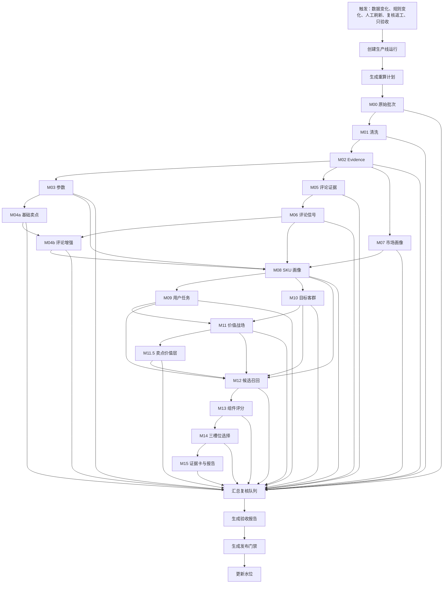
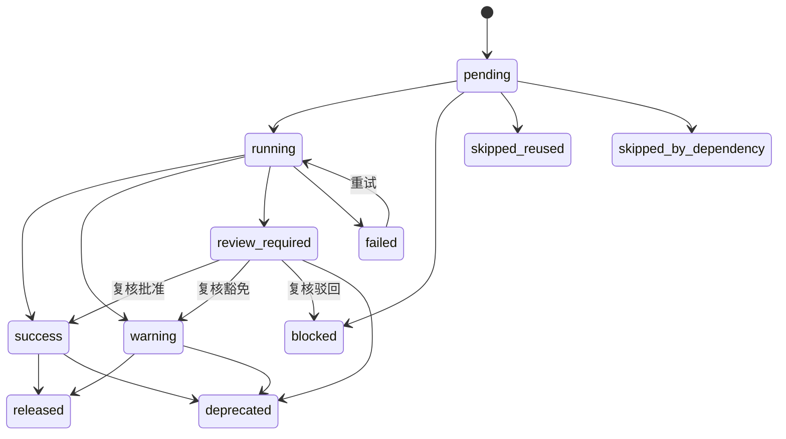
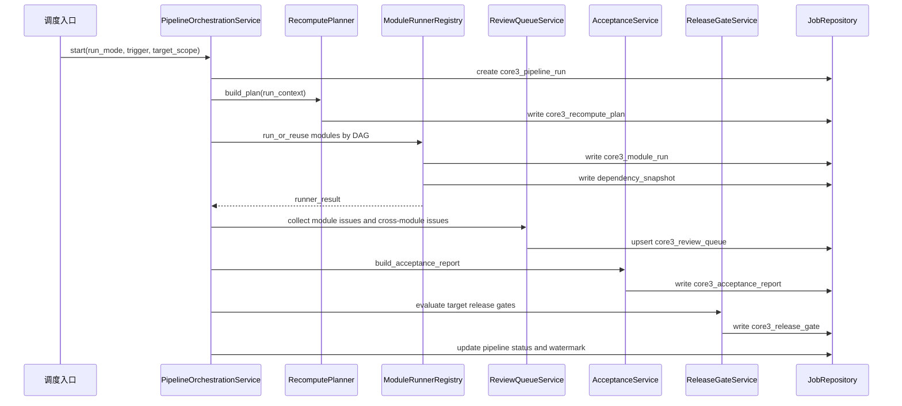

# M16 增量任务编排、复核和验收详细设计

## 1. 文档定位

本文是 `M16 增量任务编排、复核和验收模块` 的工程详细设计，承接：

- `docs/core3_mvp/real_data_v2/sop_requirements/M16_incremental_review_acceptance_requirements.md`
- `docs/core3_mvp/real_data_v2/sop_detailed_design/00_architecture_data_dictionary_design.md`
- `docs/core3_mvp/real_data_v2/sop_detailed_design/M00-M15` 详细设计
- `cankao/CatForge_竞品生成SOP_详细指导_v1.md`
- `cankao/catforge_sop_md/modules/M16_增量任务编排、复核和验收模块.md`
- `cankao/CatForge_核心竞品展示页_UI设计规范_v1.md`

当前设计阶段要求：本文件应能直接拆成数据库迁移、服务实现、任务 runner、API schema、测试用例和验收脚本。

M16 是真实数据 v2 生产线治理模块。它负责调度、增量影响分析、模块运行状态、复核队列、验收报告、发布门禁和水位管理，不负责清洗、抽取、画像、评分、选择或报告正文生成。

## 2. 模块职责

### 2.1 解决的问题

M16 解决五类工程问题：

1. 数据新增或规则变化后，应从哪个模块开始重算。
2. M00-M15 是否按依赖图执行，是否有模块绕过上游产物。
3. 每个模块是否成功、复用、阻断、失败或需要人工复核。
4. 哪些目标 SKU 报告可汇报、需复核、带说明可汇报或必须阻断。
5. 后续原始表持续增加时，如何只处理增量并保留历史可追溯。

### 2.2 不解决的问题

M16 不做：

| 不做事项 | 应由模块 |
| --- | --- |
| 原始表扫描和行 hash | M00 |
| 清洗和质量诊断 | M01 |
| evidence 原子生成 | M02 |
| 参数、卖点、评论语义抽取 | M03-M06、M04b |
| 市场、SKU、任务、客群、战场画像 | M07-M11.5 |
| 候选召回、评分、三槽位选择 | M12-M14 |
| 高层报告正文和证据卡 | M15 |
| 前端重新拼业务结论 | 禁止 |

M16 可以读取这些模块的输出、状态、hash 和复核问题，但不能直接读取原始表生成业务判断。

### 2.3 运行原则

| 原则 | 要求 |
| --- | --- |
| 模块化编排 | 每个模块独立 runner、独立状态、独立输出 hash |
| 增量优先 | 只重算受影响范围，未变化结果可合法复用 |
| 失败可恢复 | 上游成功结果保留，下游阻断或跳过，不删除历史 |
| 复核不丢 | 低置信、冲突、样本不足、报告风险都进入队列 |
| 发布有门禁 | 未通过门禁不能标记为正式汇报或正式导出 |
| 历史可追溯 | 任意发布报告可追溯到 run、batch、rule、seed、evidence |
| 样本限制可见 | 205 样例数据限制必须进入验收和门禁说明 |

## 3. 上游输入

### 3.1 数据接入和清洗层

| 模块 | 表或产物 | M16 使用方式 |
| --- | --- | --- |
| M00 | `core3_source_batch` | 读取批次、原始表水位、批次状态 |
| M00 | `core3_source_row_registry` | 判断新增、变化、失效行 |
| M00 | `core3_source_impacted_sku` | 生成受影响 SKU 和数据域 |
| M01 | 清洗事实表 | 校验清洗输出数量和 clean hash |
| M01 | `core3_data_quality_issue` | 汇总质量复核问题 |
| M02 | `core3_evidence_atom` | 校验证据覆盖、证据状态和证据失效 |

### 3.2 抽取和画像层

| 模块 | 关键产物 | M16 使用方式 |
| --- | --- | --- |
| M03 | 标准参数、参数冲突、复核问题 | 判断参数变化和参数风险 |
| M04a | 基础卖点激活、卖点缺失、冲突 | 判断卖点覆盖和宣传冲突 |
| M05 | 去重评论、句级 evidence、评论质量问题 | 判断评论样本是否可用 |
| M06 | 评论主题、情绪、场景、痛点、服务边界 | 校验评论信号是否越界 |
| M04b | 评论验证增强和弱感知提示 | 判断卖点感知是否可进入报告 |
| M07 | 市场画像、价格带、渠道平台 | 判断量价变化和可比池变化 |
| M08 | SKU 综合画像、`profile_hash` | 驱动 M09-M15 重算 |
| M09 | 用户任务得分和复核问题 | 驱动 M11、M12、M15 语境 |
| M10 | 目标客群得分和复核问题 | 驱动 M11、M12、M15 语境 |
| M11 | 价值战场和复核问题 | 驱动 M11.5、M12、M15 |
| M11.5 | 战场内卖点价值层 | 驱动 M12-M15 |

### 3.3 竞品结果和报告层

| 模块 | 关键产物 | M16 使用方式 |
| --- | --- | --- |
| M12 | 候选池、召回理由、候选复核问题 | 判断候选池是否足够和可审计 |
| M13 | 组件评分、角色分、评分复核问题 | 判断评分是否可被 M14 使用 |
| M14 | 三槽位选择、空槽、未选审计、选择复核问题 | 判断核心三竞品结论是否可发布 |
| M15 | 证据卡、报告 payload、section、导出、报告复核问题 | 判断高层报告是否可汇报和导出 |

## 4. 下游输出

M16 输出治理结果，不输出新的业务分析结论。

| 表 | 粒度 | 用途 |
| --- | --- | --- |
| `core3_pipeline_run` | 一次全链路或增量运行 | 总运行记录 |
| `core3_recompute_plan` | 模块 + 目标对象 | 说明为什么跑、跑什么、复用什么 |
| `core3_module_run` | 模块 + 目标对象 | 独立模块运行状态 |
| `core3_module_dependency_snapshot` | 模块依赖边 | 记录上游 hash、版本和复用状态 |
| `core3_review_queue` | 复核问题 | 汇总 M00-M15 和 M16 追加问题 |
| `core3_review_decision` | 人工复核动作 | 记录批准、驳回、豁免、补数据和重算要求 |
| `core3_acceptance_report` | pipeline run | 运行验收和质量摘要 |
| `core3_release_gate` | 目标 SKU 报告 | 判断可汇报、需复核、阻断或已发布 |
| `core3_pipeline_watermark` | 原始表或模块水位 | 支持增量运行 |

## 5. 真实数据约束

当前 205 PostgreSQL 样例数据限制必须进入 M16 验收和门禁：

| 数据事实 | 门禁处理 |
| --- | --- |
| 35 个量价型号，品牌均为海信 | 不按品牌内外部过滤，同品牌 SKU 可以互为竞品 |
| 周销覆盖 26W01-26W23 | 可以做样例期线上趋势，不能写成长期市场结论 |
| 渠道为线上，平台为专业电商和平台电商 | 不能输出线下门店竞争判断 |
| 参数 2843 行但 unknown、空值、`-` 较多 | 缺失不当 false，相关结论降置信或进入复核 |
| 卖点 65 行且只覆盖 5 个型号 | 卖点缺失是数据覆盖问题，不等于 SKU 没有卖点 |
| 85E7Q 无结构化卖点 | M16 发布门禁必须检查 M15 是否明确提示卖点证据缺口 |
| 评论 62426 行但有重复和拆行 | 评论只能基于去重评论和句级 evidence 使用 |
| 服务类评论较多 | 服务体验不能替代产品核心竞争证明 |

85E7Q `TV00029115` 的门禁要求：

1. 市场、参数、评论覆盖正常。
2. 结构化卖点缺失被 M04a、M04b、M08、M15 明确表达。
3. 候选竞品允许为其他海信 85 吋或相近战场型号。
4. 同品牌不被排除。
5. 若只能选出 1-2 个高置信竞品，必须有空槽原因。
6. 高层页面不出现英文内部字段、UUID、SQL、JSON、模型过程或 AI 话术。

## 6. 模块依赖 DAG

M16 不改变依赖方向，只做调度和验收。



## 7. 运行模式

| 模式 | 触发场景 | 处理范围 | 首版要求 |
| --- | --- | --- | --- |
| `bootstrap_full` | 首次接入真实样例数据 | 全量批次、全量 SKU、全量目标 | 必须支持 |
| `daily_incremental` | 原始表新增或修订 | 受影响 SKU、候选池相关目标、发布目标 | 必须支持 |
| `ruleset_replay` | 规则、seed、本体或阈值调整 | 受规则影响模块及其下游 | 必须支持 |
| `single_target_refresh` | 指定目标 SKU 复查 | 指定目标及候选池相关 SKU | 必须支持 |
| `review_rework` | 人工复核改变处理口径 | 被复核对象及下游 | 必须支持 |
| `acceptance_only` | 不重算，只重新验收 | 已有 M15 报告和复核状态 | 必须支持 |

首版可以用同步 runner 或离线任务实现，但字段和状态必须为后续 Celery/Redis 队列保留。

## 8. 状态机

### 8.1 模块运行状态

| 状态 | 含义 | 是否允许进入下游 |
| --- | --- | --- |
| `pending` | 已计划未执行 | 否 |
| `running` | 正在执行 | 否 |
| `success` | 成功且无阻断 | 是 |
| `warning` | 成功但有非阻断提示 | 是 |
| `review_required` | 成功但需复核 | 默认不发布，可进入受限下游 |
| `blocked` | 缺少必要上游或复核未完成 | 否 |
| `failed` | 执行异常 | 否 |
| `skipped_reused` | 依赖 hash 未变，复用历史结果 | 取决于复用结果状态 |
| `skipped_by_dependency` | 上游失败或阻断导致跳过 | 否 |
| `released` | 目标报告已发布 | 是 |
| `deprecated` | 被新版本替代 | 否 |

### 8.2 状态流转



人工复核只能改变复核状态和发布门禁，不能直接篡改上游事实产物。若复核改变业务规则或事实解释，必须触发 `review_rework`。

### 8.3 发布门禁状态

| 状态 | 含义 |
| --- | --- |
| `not_ready` | 报告或必要上游未生成 |
| `review_required` | 可查看但需处理复核 |
| `releasable` | 可汇报或导出 |
| `released` | 已正式发布 |
| `blocked` | 阻断发布 |

## 9. 表设计：`core3_pipeline_run`

### 9.1 表用途

记录一次生产线运行。`run_id` 是 M16 调度、模块运行、复核、验收和发布门禁的主线索引。

### 9.2 字段契约

| 字段 | 类型建议 | 必填 | 来源 | 说明 |
| --- | --- | --- | --- | --- |
| `run_id` | `uuid` | 是 | M16 | 主键 |
| `parent_run_id` | `uuid` | 否 | M16 | 重试或返工来源运行 |
| `project_id` | `varchar(64)` | 是 | 请求/配置 | 项目编号 |
| `category_code` | `varchar(32)` | 是 | 请求/配置 | 彩电固定 `TV` |
| `run_mode` | `varchar(32)` | 是 | 请求 | 运行模式 |
| `trigger_type` | `varchar(32)` | 是 | 请求/M00/M16 | data_change/rule_change/manual/review/export_acceptance |
| `triggered_by` | `varchar(128)` | 是 | 用户/系统 | 触发人或任务 |
| `data_batch_id` | `uuid` | 否 | M00 | 原始批次 |
| `target_scope_json` | `jsonb` | 是 | 请求/M16 | 本次目标范围 |
| `ruleset_version` | `varchar(64)` | 是 | 配置 | 总规则版本 |
| `module_version_json` | `jsonb` | 是 | 配置 | M00-M16 模块版本 |
| `seed_version_json` | `jsonb` | 是 | 配置 | seed 和本体版本 |
| `input_watermark_json` | `jsonb` | 是 | M16 | 启动时输入水位 |
| `status` | `varchar(32)` | 是 | M16 | 运行状态 |
| `started_at` | `timestamptz` | 是 | M16 | 开始时间 |
| `finished_at` | `timestamptz` | 否 | M16 | 结束时间 |
| `output_summary_json` | `jsonb` | 是 | M16 | 输出数量摘要 |
| `quality_summary_json` | `jsonb` | 是 | M16 | 质量摘要 |
| `release_status` | `varchar(32)` | 是 | M16 | not_ready/review_required/releasable/released/blocked |
| `error_code` | `varchar(64)` | 否 | M16 | 总运行错误码 |
| `error_message_cn` | `text` | 否 | M16 | 中文错误说明 |
| `created_at` | `timestamptz` | 是 | M16 | 创建时间 |
| `updated_at` | `timestamptz` | 是 | M16 | 更新时间 |

### 9.3 JSON 契约

`target_scope_json`：

```json
{
  "scope_type": "all_sku | target_sku_list | changed_sku | demo_target",
  "sku_codes": ["TV00029115"],
  "include_related_targets": true,
  "related_target_reason": "candidate_pool_or_released_report",
  "data_domains": ["market", "param", "claim", "comment"],
  "note_cn": "85E7Q 单目标刷新"
}
```

`module_version_json`：

```json
{
  "M00": "source-registry-1.0.0",
  "M01": "cleaning-1.0.0",
  "M16": "pipeline-1.0.0"
}
```

`seed_version_json`：

```json
{
  "param_seed": "tv-param-seed-2026-06",
  "claim_seed": "tv-claim-seed-2026-06",
  "task_seed": "tv-task-seed-2026-06",
  "target_group_seed": "tv-target-group-seed-2026-06",
  "battlefield_seed": "tv-battlefield-seed-2026-06"
}
```

`output_summary_json`：

```json
{
  "module_count": 19,
  "module_success_count": 18,
  "module_reused_count": 4,
  "processed_sku_count": 35,
  "processed_target_count": 35,
  "report_ready_count": 12,
  "report_review_required_count": 8,
  "report_blocked_count": 3
}
```

### 9.4 主键、唯一键和索引

```sql
alter table core3_pipeline_run
  add constraint pk_core3_pipeline_run primary key (run_id);

create index idx_core3_pipeline_run_project_time
on core3_pipeline_run(project_id, category_code, started_at desc);

create index idx_core3_pipeline_run_status
on core3_pipeline_run(project_id, category_code, status, release_status);

create index idx_core3_pipeline_run_batch
on core3_pipeline_run(data_batch_id);

create index idx_core3_pipeline_run_parent
on core3_pipeline_run(parent_run_id);
```

## 10. 表设计：`core3_recompute_plan`

### 10.1 表用途

记录本次为什么重跑、从哪个模块开始、哪些目标可复用、哪些目标阻断。它是 M16 的可解释增量计划，不是执行日志。

### 10.2 字段契约

| 字段 | 类型建议 | 必填 | 来源 | 说明 |
| --- | --- | --- | --- | --- |
| `plan_id` | `uuid` | 是 | M16 | 主键 |
| `run_id` | `uuid` | 是 | M16 | 生产线运行 |
| `project_id` | `varchar(64)` | 是 | M16 | 项目 |
| `category_code` | `varchar(32)` | 是 | M16 | 品类 |
| `batch_id` | `uuid` | 否 | M00 | 数据批次 |
| `module_code` | `varchar(16)` | 是 | M16 | 计划执行模块 |
| `target_type` | `varchar(32)` | 是 | M16 | batch/sku/target_sku/candidate/report |
| `target_id` | `varchar(128)` | 是 | M16 | 批次、SKU、目标 SKU 或 pair |
| `start_from_module` | `varchar(16)` | 是 | M16 | 变化起点模块 |
| `change_domain` | `varchar(32)` | 是 | M00/M16 | market/param/claim/comment/profile/rule/review/report |
| `change_reason_cn` | `text` | 是 | M16 | 中文触发原因 |
| `upstream_dependency_hash` | `varchar(128)` | 否 | M16 | 当前上游依赖 hash |
| `previous_output_hash` | `varchar(128)` | 否 | M16 | 上次输出 hash |
| `planned_action` | `varchar(32)` | 是 | M16 | run/reuse/block/skip |
| `priority` | `varchar(32)` | 是 | M16 | normal/high/demo |
| `related_targets_json` | `jsonb` | 是 | M16 | 受影响目标扩散 |
| `plan_reason_json` | `jsonb` | 是 | M16 | 结构化计划原因 |
| `created_at` | `timestamptz` | 是 | M16 | 创建时间 |

### 10.3 JSON 契约

`related_targets_json`：

```json
{
  "direct_sku": ["TV00029115"],
  "candidate_pool_targets": ["TV00029115", "TV00028701"],
  "released_targets": ["TV00029115"],
  "reason_cn": "候选 SKU 价格变化可能影响已发布目标的压力槽位"
}
```

`plan_reason_json`：

```json
{
  "source_table": "attribute_data",
  "changed_row_count": 12,
  "first_affected_module": "M03",
  "affected_modules": ["M03", "M04a", "M08", "M09", "M10", "M11", "M11.5", "M12", "M13", "M14", "M15"],
  "reuse_modules": ["M05", "M06", "M07"],
  "reason_cn": "参数行变化，评论和市场依赖未变，可复用对应基础产物"
}
```

### 10.4 主键、唯一键和索引

```sql
alter table core3_recompute_plan
  add constraint pk_core3_recompute_plan primary key (plan_id);

create unique index uq_core3_recompute_plan_target
on core3_recompute_plan(run_id, module_code, target_type, target_id);

create index idx_core3_recompute_plan_action
on core3_recompute_plan(run_id, planned_action, priority);

create index idx_core3_recompute_plan_domain
on core3_recompute_plan(project_id, category_code, batch_id, change_domain);
```

## 11. 表设计：`core3_module_run`

### 11.1 表用途

记录每个模块、每个处理对象的独立运行状态。M16 判断失败恢复、复用历史和发布门禁时以此表为准。

### 11.2 字段契约

| 字段 | 类型建议 | 必填 | 来源 | 说明 |
| --- | --- | --- | --- | --- |
| `module_run_id` | `uuid` | 是 | M16 | 主键 |
| `run_id` | `uuid` | 是 | M16 | 生产线运行 |
| `plan_id` | `uuid` | 否 | M16 | 对应重算计划 |
| `project_id` | `varchar(64)` | 是 | M16 | 项目 |
| `category_code` | `varchar(32)` | 是 | M16 | 品类 |
| `batch_id` | `uuid` | 否 | M00 | 数据批次 |
| `module_code` | `varchar(16)` | 是 | M16 | 模块编码 |
| `module_name_cn` | `varchar(128)` | 是 | M16 | 中文模块名 |
| `target_type` | `varchar(32)` | 是 | M16 | batch/sku/target_sku/candidate/report |
| `target_id` | `varchar(128)` | 是 | M16 | 处理对象 |
| `status` | `varchar(32)` | 是 | M16/Runner | 模块状态 |
| `input_count` | `integer` | 是 | Runner | 输入记录数 |
| `changed_input_count` | `integer` | 是 | Runner | 变化输入数 |
| `output_count` | `integer` | 是 | Runner | 输出记录数 |
| `warning_count` | `integer` | 是 | Runner | 警告数 |
| `review_issue_count` | `integer` | 是 | Runner/M16 | 复核问题数 |
| `dependency_hash` | `varchar(128)` | 否 | M16 | 依赖 hash |
| `output_hash` | `varchar(128)` | 否 | Runner | 输出 hash |
| `hash_version` | `varchar(32)` | 是 | M16 | hash 算法版本 |
| `rule_version` | `varchar(64)` | 是 | 配置 | 模块规则版本 |
| `module_version` | `varchar(64)` | 是 | 配置 | 模块实现版本 |
| `seed_version` | `varchar(64)` | 否 | 配置 | seed 版本 |
| `reused_from_module_run_id` | `uuid` | 否 | M16 | 复用历史模块运行 |
| `run_summary_json` | `jsonb` | 是 | Runner | 模块运行摘要 |
| `error_code` | `varchar(64)` | 否 | Runner/M16 | 错误编码 |
| `error_message_cn` | `text` | 否 | Runner/M16 | 中文错误说明 |
| `started_at` | `timestamptz` | 是 | M16 | 开始时间 |
| `finished_at` | `timestamptz` | 否 | M16 | 结束时间 |

### 11.3 Runner 返回契约

每个模块 runner 必须返回：

```json
{
  "status": "success",
  "input_count": 100,
  "changed_input_count": 12,
  "output_count": 35,
  "output_hash": "sha256:...",
  "warnings": [
    {
      "warning_type": "claim_coverage_limited",
      "target_id": "TV00029115",
      "message_cn": "85E7Q 缺少结构化卖点数据"
    }
  ],
  "review_issues": [
    {
      "issue_type": "missing_structured_claim",
      "severity": "medium",
      "target_type": "sku",
      "target_id": "TV00029115",
      "suggested_action_cn": "报告中作为数据覆盖限制说明"
    }
  ],
  "downstream_impacts": ["M08", "M12", "M15"]
}
```

### 11.4 主键、唯一键和索引

```sql
alter table core3_module_run
  add constraint pk_core3_module_run primary key (module_run_id);

create unique index uq_core3_module_run_target
on core3_module_run(run_id, module_code, target_type, target_id);

create index idx_core3_module_run_status
on core3_module_run(run_id, status, module_code);

create index idx_core3_module_run_target_lookup
on core3_module_run(project_id, category_code, batch_id, target_type, target_id);

create index idx_core3_module_run_reuse
on core3_module_run(reused_from_module_run_id);
```

## 12. 表设计：`core3_module_dependency_snapshot`

### 12.1 表用途

记录下游模块依赖了哪些上游产物、规则版本和运行编号。发布门禁检查“是否绕过上游”时依赖此表。

### 12.2 字段契约

| 字段 | 类型建议 | 必填 | 来源 | 说明 |
| --- | --- | --- | --- | --- |
| `snapshot_id` | `uuid` | 是 | M16 | 主键 |
| `run_id` | `uuid` | 是 | M16 | 生产线运行 |
| `module_run_id` | `uuid` | 是 | M16 | 当前模块运行 |
| `project_id` | `varchar(64)` | 是 | M16 | 项目 |
| `category_code` | `varchar(32)` | 是 | M16 | 品类 |
| `batch_id` | `uuid` | 否 | M00 | 数据批次 |
| `module_code` | `varchar(16)` | 是 | M16 | 当前模块 |
| `target_type` | `varchar(32)` | 是 | M16 | 当前目标类型 |
| `target_id` | `varchar(128)` | 是 | M16 | 当前目标 |
| `upstream_module_code` | `varchar(16)` | 是 | M16 | 上游模块 |
| `upstream_target_id` | `varchar(128)` | 否 | M16 | 上游目标 |
| `upstream_module_run_id` | `uuid` | 否 | M16 | 上游运行 |
| `upstream_output_hash` | `varchar(128)` | 否 | M16 | 上游输出 hash |
| `upstream_rule_version` | `varchar(64)` | 否 | M16 | 上游规则版本 |
| `upstream_module_version` | `varchar(64)` | 否 | M16 | 上游实现版本 |
| `dependency_status` | `varchar(32)` | 是 | M16 | current/reused/missing/invalid |
| `dependency_reason_cn` | `text` | 否 | M16 | 中文说明 |
| `created_at` | `timestamptz` | 是 | M16 | 创建时间 |

### 12.3 主键、唯一键和索引

```sql
alter table core3_module_dependency_snapshot
  add constraint pk_core3_module_dependency_snapshot primary key (snapshot_id);

create unique index uq_core3_module_dependency_snapshot_edge
on core3_module_dependency_snapshot(
  run_id,
  module_code,
  target_type,
  target_id,
  upstream_module_code,
  coalesce(upstream_target_id, '')
);

create index idx_core3_module_dependency_snapshot_invalid
on core3_module_dependency_snapshot(run_id, dependency_status);

create index idx_core3_module_dependency_snapshot_upstream
on core3_module_dependency_snapshot(upstream_module_run_id);
```

## 13. 表设计：`core3_review_queue`

### 13.1 表用途

汇总 M00-M15 复核问题，并追加 M16 跨模块问题。它是人工复核入口，也是发布门禁的输入。

### 13.2 字段契约

| 字段 | 类型建议 | 必填 | 来源 | 说明 |
| --- | --- | --- | --- | --- |
| `review_id` | `uuid` | 是 | M16 | 主键 |
| `run_id` | `uuid` | 是 | M16 | 生产线运行 |
| `source_module_run_id` | `uuid` | 否 | M00-M16 | 来源模块运行 |
| `project_id` | `varchar(64)` | 是 | M16 | 项目 |
| `category_code` | `varchar(32)` | 是 | M16 | 品类 |
| `batch_id` | `uuid` | 否 | M00 | 数据批次 |
| `module_code` | `varchar(16)` | 是 | 来源模块 | 来源模块 |
| `target_type` | `varchar(32)` | 是 | 来源模块 | batch/sku/target_sku/candidate/report |
| `target_id` | `varchar(128)` | 是 | 来源模块 | 复核对象 |
| `target_sku_code` | `varchar(64)` | 否 | 来源模块 | 目标 SKU |
| `candidate_sku_code` | `varchar(64)` | 否 | 来源模块 | 候选 SKU |
| `object_type` | `varchar(64)` | 是 | 来源模块 | param/claim/comment/task/battlefield/candidate/score/selection/report/run |
| `object_id` | `varchar(128)` | 否 | 来源模块 | 业务对象编号 |
| `issue_type` | `varchar(64)` | 是 | 来源模块/M16 | 问题类型 |
| `severity` | `varchar(32)` | 是 | 来源模块/M16 | blocker/high/medium/low |
| `issue_title_cn` | `varchar(256)` | 是 | 来源模块/M16 | 中文标题 |
| `issue_detail_cn` | `text` | 是 | 来源模块/M16 | 中文说明 |
| `evidence_ids` | `jsonb` | 是 | 来源模块 | 相关 evidence |
| `risk_flags_json` | `jsonb` | 是 | 来源模块/M16 | 风险标记 |
| `suggested_action_cn` | `text` | 是 | 来源模块/M16 | 建议动作 |
| `review_status` | `varchar(32)` | 是 | M16/人工 | pending/approved/rejected/waived/resolved |
| `reviewer` | `varchar(128)` | 否 | 人工 | 复核人 |
| `reviewed_at` | `timestamptz` | 否 | 人工 | 复核时间 |
| `resolution_note_cn` | `text` | 否 | 人工 | 处理说明 |
| `is_blocking_release` | `boolean` | 是 | M16 | 是否阻断发布 |
| `created_at` | `timestamptz` | 是 | M16 | 创建时间 |
| `updated_at` | `timestamptz` | 是 | M16 | 更新时间 |

### 13.3 问题类型

| 类型 | 来源 | 默认级别 | 处理 |
| --- | --- | --- | --- |
| `source_count_drop` | M01/M16 | blocker | 阻断发布 |
| `model_code_conflict` | M00/M01 | high | 阻断受影响 SKU |
| `param_unknown_high` | M03 | medium | 降置信 |
| `param_claim_conflict` | M03/M04a | high | 阻断相关卖点高置信 |
| `claim_coverage_missing` | M04a/M15 | medium | 必须在报告说明 |
| `comment_duplicate_high` | M05 | medium | 评论降权 |
| `service_signal_overused` | M06/M04b/M15 | medium | 不能支撑产品核心结论 |
| `single_source_task` | M09 | medium | 降低任务置信度 |
| `single_source_battlefield` | M11 | medium | 降低战场置信度 |
| `candidate_pool_too_small` | M12 | high | 不硬凑三竞品 |
| `score_near_threshold` | M13 | medium | 选择需提示 |
| `slot_not_filled` | M14 | high | 需要空槽原因 |
| `evidence_card_missing` | M15 | high | 阻断对应卡 |
| `uuid_exposed` | M15/M16 | blocker | 阻断发布 |
| `internal_field_exposed` | M15/M16 | blocker | 阻断发布 |
| `confidence_tone_mismatch` | M15/M16 | high | 修改报告或复核 |
| `dependency_hash_missing` | M16 | blocker | 阻断发布 |
| `raw_table_mutated` | M16 | blocker | 阻断验收 |

### 13.4 主键、唯一键和索引

```sql
alter table core3_review_queue
  add constraint pk_core3_review_queue primary key (review_id);

create unique index uq_core3_review_queue_issue
on core3_review_queue(
  run_id,
  module_code,
  target_type,
  target_id,
  issue_type,
  coalesce(object_id, '')
);

create index idx_core3_review_queue_pending
on core3_review_queue(project_id, category_code, review_status, severity);

create index idx_core3_review_queue_target
on core3_review_queue(project_id, category_code, batch_id, target_sku_code);

create index idx_core3_review_queue_blocking
on core3_review_queue(run_id, is_blocking_release, severity);
```

## 14. 表设计：`core3_review_decision`

### 14.1 表用途

记录人工复核动作。复核动作本身不可覆盖源问题，只能追加决策记录并更新 `core3_review_queue.review_status`。

### 14.2 字段契约

| 字段 | 类型建议 | 必填 | 来源 | 说明 |
| --- | --- | --- | --- | --- |
| `decision_id` | `uuid` | 是 | M16 | 主键 |
| `review_id` | `uuid` | 是 | 人工/API | 复核问题 |
| `run_id` | `uuid` | 是 | M16 | 生产线运行 |
| `decision_type` | `varchar(32)` | 是 | 人工 | approve/reject/waive/request_data/rework_rule |
| `decision_reason_cn` | `text` | 是 | 人工 | 中文原因 |
| `impact_scope_json` | `jsonb` | 是 | M16/人工 | 影响范围 |
| `need_recompute` | `boolean` | 是 | M16/人工 | 是否需要重算 |
| `recompute_mode` | `varchar(32)` | 否 | M16 | review_rework/ruleset_replay/single_target_refresh |
| `created_followup_run_id` | `uuid` | 否 | M16 | 触发的新 run |
| `decided_by` | `varchar(128)` | 是 | 人工 | 处理人 |
| `decided_at` | `timestamptz` | 是 | M16 | 处理时间 |

### 14.3 决策语义

| 决策 | 含义 | 是否可能触发重算 |
| --- | --- | --- |
| `approve` | 认可模块结论 | 否 |
| `reject` | 不认可模块结论 | 是 |
| `waive` | 带说明豁免 | 否 |
| `request_data` | 要求补充数据 | 是，等新数据进入 |
| `rework_rule` | 规则或 seed 需要修订 | 是 |

### 14.4 主键、唯一键和索引

```sql
alter table core3_review_decision
  add constraint pk_core3_review_decision primary key (decision_id);

create index idx_core3_review_decision_review
on core3_review_decision(review_id, decided_at desc);

create index idx_core3_review_decision_recompute
on core3_review_decision(run_id, need_recompute, recompute_mode);
```

## 15. 表设计：`core3_acceptance_report`

### 15.1 表用途

记录一次运行是否达到 MVP 可用标准。它是运营验收和后续开发回归的统一依据。

### 15.2 字段契约

| 字段 | 类型建议 | 必填 | 来源 | 说明 |
| --- | --- | --- | --- | --- |
| `acceptance_id` | `uuid` | 是 | M16 | 主键 |
| `run_id` | `uuid` | 是 | M16 | 生产线运行 |
| `project_id` | `varchar(64)` | 是 | M16 | 项目 |
| `category_code` | `varchar(32)` | 是 | M16 | 品类 |
| `data_batch_id` | `uuid` | 否 | M00 | 数据批次 |
| `processed_sku_count` | `integer` | 是 | M16 | 已处理 SKU 数 |
| `processed_target_count` | `integer` | 是 | M16 | 已处理目标 SKU 数 |
| `report_ready_count` | `integer` | 是 | M15/M16 | 可用报告数 |
| `high_confidence_report_count` | `integer` | 是 | M15/M16 | 高置信报告数 |
| `medium_confidence_report_count` | `integer` | 是 | M15/M16 | 中置信报告数 |
| `limited_report_count` | `integer` | 是 | M15/M16 | 数据受限但可说明 |
| `blocked_report_count` | `integer` | 是 | M16 | 阻断数量 |
| `avg_competitor_count` | `numeric(6,3)` | 是 | M14/M16 | 平均核心竞品数量 |
| `direct_slot_fill_rate` | `numeric(6,4)` | 是 | M14/M16 | 正面对打填充率 |
| `pressure_slot_fill_rate` | `numeric(6,4)` | 是 | M14/M16 | 压力槽位填充率 |
| `benchmark_slot_fill_rate` | `numeric(6,4)` | 是 | M14/M16 | 标杆槽位填充率 |
| `evidence_coverage_rate` | `numeric(6,4)` | 是 | M02/M15/M16 | 证据覆盖率 |
| `review_pending_count` | `integer` | 是 | M16 | 待复核数量 |
| `blocker_count` | `integer` | 是 | M16 | blocker 数量 |
| `warning_count` | `integer` | 是 | M16 | warning 数量 |
| `acceptance_status` | `varchar(32)` | 是 | M16 | passed/passed_with_warning/failed |
| `acceptance_summary_cn` | `text` | 是 | M16 | 中文验收摘要 |
| `data_scope_note_cn` | `text` | 是 | M16 | 数据范围说明 |
| `acceptance_detail_json` | `jsonb` | 是 | M16 | 分层验收明细 |
| `created_at` | `timestamptz` | 是 | M16 | 创建时间 |

### 15.3 分层验收明细

`acceptance_detail_json`：

```json
{
  "data_ingestion": {
    "status": "passed",
    "checks": [
      {
        "check_code": "raw_tables_readonly",
        "result": "passed",
        "message_cn": "四张原始表未被改写"
      }
    ]
  },
  "module_chain": {
    "status": "passed_with_warning",
    "checks": [
      {
        "check_code": "dependency_hash_complete",
        "result": "passed",
        "message_cn": "M08-M15 均记录上游依赖 hash"
      }
    ]
  },
  "business_output": {
    "status": "passed_with_warning",
    "checks": [
      {
        "check_code": "slot_fill",
        "result": "warning",
        "message_cn": "部分目标只选出 1-2 个高置信竞品，已生成空槽原因"
      }
    ]
  },
  "executive_display": {
    "status": "passed",
    "checks": [
      {
        "check_code": "no_internal_field",
        "result": "passed",
        "message_cn": "高层主屏未出现内部字段、UUID 或 SQL"
      }
    ]
  }
}
```

### 15.4 主键、唯一键和索引

```sql
alter table core3_acceptance_report
  add constraint pk_core3_acceptance_report primary key (acceptance_id);

create unique index uq_core3_acceptance_report_run
on core3_acceptance_report(run_id);

create index idx_core3_acceptance_report_status
on core3_acceptance_report(project_id, category_code, acceptance_status, created_at desc);
```

## 16. 表设计：`core3_release_gate`

### 16.1 表用途

按目标 SKU 判断 M15 报告是否可汇报、需复核、带说明可发布或必须阻断。高层页面只读取门禁结论和少量中文说明，不展示 M16 内部运行细节。

### 16.2 字段契约

| 字段 | 类型建议 | 必填 | 来源 | 说明 |
| --- | --- | --- | --- | --- |
| `release_gate_id` | `uuid` | 是 | M16 | 主键 |
| `run_id` | `uuid` | 是 | M16 | 生产线运行 |
| `project_id` | `varchar(64)` | 是 | M16 | 项目 |
| `category_code` | `varchar(32)` | 是 | M16 | 品类 |
| `batch_id` | `uuid` | 否 | M00 | 数据批次 |
| `target_sku_code` | `varchar(64)` | 是 | M16/M15 | 目标 SKU |
| `report_payload_id` | `uuid` | 否 | M15 | 报告 payload |
| `selection_run_id` | `uuid` | 否 | M14 | 选择运行 |
| `gate_status` | `varchar(32)` | 是 | M16 | not_ready/review_required/releasable/released/blocked |
| `gate_reason_cn` | `text` | 是 | M16 | 中文门禁原因 |
| `required_review_ids` | `jsonb` | 是 | M16 | 必须处理的复核 |
| `warning_review_ids` | `jsonb` | 是 | M16 | 可带说明发布的问题 |
| `data_scope_note_cn` | `text` | 是 | M16 | 数据范围说明 |
| `display_badges_json` | `jsonb` | 是 | M16 | 高层页面徽标 |
| `released_by` | `varchar(128)` | 否 | 人工 | 发布人 |
| `released_at` | `timestamptz` | 否 | 人工 | 发布时间 |
| `created_at` | `timestamptz` | 是 | M16 | 创建时间 |
| `updated_at` | `timestamptz` | 是 | M16 | 更新时间 |

### 16.3 门禁规则

可发布至少满足：

1. 必要模块状态为 `success`、`warning` 或合法 `skipped_reused`。
2. 没有 blocker 问题。
3. high 问题已处理或被有理由降级。
4. M14 至少有 1 个可解释核心竞品。
5. 核心竞品有证据卡和 evidence 追溯。
6. M15 报告和导出不出现 UUID、内部字段、SQL、JSON 大段和 AI 过程文案。
7. 样例数据限制已说明。
8. 当前同品牌样例不被误写成外部品牌市场结论。

允许 `releasable` 但带说明：

| 场景 | 必须说明 |
| --- | --- |
| 只有海信品牌 | 竞品关系是样例数据内的核心竞争关系 |
| 只有线上渠道 | 不能做线下门店判断 |
| 85E7Q 无结构化卖点 | 卖点证据缺口，不等于产品无卖点 |
| 评论重复或服务类较多 | 评论仅作为用户感知补充 |
| 未选满 3 个槽位 | 空槽原因和后续补数建议 |

必须 `blocked`：

| 场景 | 原因 |
| --- | --- |
| 核心竞品无 evidence | 无法支撑业务结论 |
| 报告结论与 M14 不一致 | 结果链路不一致 |
| 低置信写成确定结论 | 语气越权 |
| 主屏出现 UUID、内部字段、SQL | 不符合高层展示规范 |
| 关键上游失败但报告仍正式生成 | 链路绕过 |
| 原始表被清洗流程覆盖 | 数据治理违规 |

### 16.4 主键、唯一键和索引

```sql
alter table core3_release_gate
  add constraint pk_core3_release_gate primary key (release_gate_id);

create unique index uq_core3_release_gate_target
on core3_release_gate(run_id, target_sku_code);

create index idx_core3_release_gate_status
on core3_release_gate(project_id, category_code, gate_status, updated_at desc);

create index idx_core3_release_gate_target_lookup
on core3_release_gate(project_id, category_code, batch_id, target_sku_code);
```

## 17. 表设计：`core3_pipeline_watermark`

### 17.1 表用途

记录原始表、模块和目标 SKU 的处理水位，支持 `daily_incremental` 和失败恢复。

### 17.2 字段契约

| 字段 | 类型建议 | 必填 | 来源 | 说明 |
| --- | --- | --- | --- | --- |
| `watermark_id` | `uuid` | 是 | M16 | 主键 |
| `project_id` | `varchar(64)` | 是 | M16 | 项目 |
| `category_code` | `varchar(32)` | 是 | M16 | 品类 |
| `watermark_type` | `varchar(32)` | 是 | M16 | source_table/module/target_sku |
| `source_table` | `varchar(64)` | 否 | M00/M16 | 原始表 |
| `module_code` | `varchar(16)` | 否 | M16 | 模块 |
| `target_id` | `varchar(128)` | 否 | M16 | SKU 或目标 |
| `last_source_pk` | `varchar(128)` | 否 | M00 | 已处理最大来源主键 |
| `last_write_time` | `timestamptz` | 否 | M00 | 已处理最大写入时间 |
| `last_row_hash_snapshot` | `varchar(128)` | 否 | M00 | 行 hash 快照编号 |
| `last_success_run_id` | `uuid` | 否 | M16 | 上次成功运行 |
| `last_success_module_run_id` | `uuid` | 否 | M16 | 上次成功模块运行 |
| `last_output_hash` | `varchar(128)` | 否 | M16 | 上次输出 hash |
| `watermark_json` | `jsonb` | 是 | M16 | 扩展水位 |
| `updated_at` | `timestamptz` | 是 | M16 | 更新时间 |

### 17.3 原始表水位

| 原始表 | 水位字段 |
| --- | --- |
| `week_sales_data` | `id`、`write_time`、row_hash |
| `attribute_data` | `id`、`write_time`、row_hash |
| `selling_points_data` | `id`、`write_time`、row_hash |
| `comment_data` | `id`、`write_time`、`comment_id`、正文 hash、分句 hash |

### 17.4 主键、唯一键和索引

```sql
alter table core3_pipeline_watermark
  add constraint pk_core3_pipeline_watermark primary key (watermark_id);

create unique index uq_core3_pipeline_watermark_scope
on core3_pipeline_watermark(
  project_id,
  category_code,
  watermark_type,
  coalesce(source_table, ''),
  coalesce(module_code, ''),
  coalesce(target_id, '')
);

create index idx_core3_pipeline_watermark_run
on core3_pipeline_watermark(last_success_run_id, last_success_module_run_id);
```

## 18. 处理流程

### 18.1 总流程



### 18.2 编号步骤

1. 接收运行请求，校验 `project_id`、`category_code`、`run_mode`、`target_scope`。
2. 读取当前规则版本、模块版本、seed 版本。
3. 读取 `core3_pipeline_watermark`，形成 `input_watermark_json`。
4. 创建 `core3_pipeline_run`，状态为 `pending`。
5. 若运行模式不是 `acceptance_only`，调用或读取 M00 批次结果。
6. 从 M00 受影响 SKU、行 hash、数据域变化生成 `core3_recompute_plan`。
7. 如果是规则变化，按规则影响表扩散到对应模块及下游。
8. 如果是单目标刷新，补充候选池相关 SKU 和已发布目标。
9. 按 DAG 逐层执行模块。
10. 每个模块先计算 `dependency_hash`，与历史 `output_hash` 比较。
11. 依赖未变时写 `skipped_reused`，记录 `reused_from_module_run_id`。
12. 依赖变化时调用对应 module runner。
13. runner 返回状态、输出 hash、警告和复核问题。
14. 写入 `core3_module_run` 和 `core3_module_dependency_snapshot`。
15. 上游 failed/blocked 时，下游写 `skipped_by_dependency`。
16. 汇总所有模块复核问题，追加 M16 跨模块复核问题。
17. 生成 `core3_acceptance_report`。
18. 按目标 SKU 生成 `core3_release_gate`。
19. 运行成功后更新水位。
20. 结束 `core3_pipeline_run`。

### 18.3 伪代码

```python
def run_pipeline(request: PipelineRunRequest) -> PipelineRunResult:
    context = create_run_context(request)
    run = job_repo.create_pipeline_run(context)

    try:
        if request.run_mode != "acceptance_only":
            batch = ensure_source_batch(context)
            plan = planner.build_recompute_plan(context, batch)
            job_repo.save_plan(plan)
            execute_plan(context, plan)
        else:
            plan = planner.build_acceptance_only_plan(context)
            job_repo.save_plan(plan)

        review_summary = review_service.collect_and_upsert(context)
        acceptance = acceptance_service.build_report(context, review_summary)
        gates = release_gate_service.evaluate_all_targets(context, acceptance)

        final_status = derive_pipeline_status(acceptance, gates)
        watermark_service.update_on_success(context, final_status)
        job_repo.finish_pipeline_run(run.run_id, final_status, acceptance, gates)
        return PipelineRunResult(run_id=run.run_id, status=final_status)
    except RecoverableModuleError as exc:
        job_repo.mark_failed(run.run_id, exc.code, exc.message_cn)
        raise
```

```python
def execute_plan(context: RunContext, plan: RecomputePlan) -> None:
    for module_code in topo_order(plan):
        for target in plan.targets_for(module_code):
            if has_failed_required_dependency(context, module_code, target):
                record_skipped_by_dependency(context, module_code, target)
                continue

            dependency_hash = dependency_service.compute_hash(
                context=context,
                module_code=module_code,
                target=target,
            )

            reusable = job_repo.find_reusable_module_run(
                module_code=module_code,
                target=target,
                dependency_hash=dependency_hash,
                rule_version=context.rule_version(module_code),
                module_version=context.module_version(module_code),
            )

            if reusable and plan.action(module_code, target) == "reuse":
                record_reuse(context, module_code, target, reusable)
                continue

            runner = runner_registry.get(module_code)
            result = runner.run(context=context, target_scope=target)
            record_module_result(context, module_code, target, dependency_hash, result)
```

## 19. 增量影响分析

### 19.1 数据变化扩散

| 变化来源 | 首个重算模块 | 必须继续影响 | 可复用模块 |
| --- | --- | --- | --- |
| `week_sales_data` 新增或修订 | M01/M02/M07 | M08-M15 | 参数、卖点、评论基础层可复用 |
| `attribute_data` 新增或修订 | M01/M02/M03 | M04a、M08-M15 | 评论基础层、市场画像可复用 |
| `selling_points_data` 新增或修订 | M01/M02/M04a | M04b、M08-M15 | 市场和评论基础层可复用 |
| `comment_data` 新增或修订 | M01/M02/M05 | M06、M04b、M08-M15 | 参数抽取和市场画像可复用 |
| 原始行失效或消失 | M00-M02 | 依赖该 evidence 的所有下游 | 必须按 evidence 状态判断 |

### 19.2 规则变化扩散

| 变化来源 | 重算范围 |
| --- | --- |
| 参数 seed 或解析规则 | M03-M15 |
| 卖点 seed 或激活规则 | M04a、M04b、M08-M15 |
| 评论分句、主题、情绪、场景规则 | M05、M06、M04b、M08-M15 |
| 市场价格带或渠道规则 | M07-M15 |
| SKU 画像合并规则 | M08-M15 |
| 用户任务 seed 或推导规则 | M09、M11-M15 |
| 目标客群 seed 或推导规则 | M10-M15 |
| 价值战场 seed 或推导规则 | M11-M15 |
| 战场内卖点价值规则 | M11.5-M15 |
| 候选召回规则 | M12-M15 |
| 组件评分规则 | M13-M15 |
| 三槽位选择规则 | M14-M15 |
| 报告展示和语言规则 | M15 |
| 验收门禁规则 | M16 `acceptance_only` |

### 19.3 目标扩散

SKU 变化需要扩散到三类目标：

| 目标类型 | 判断依据 |
| --- | --- |
| 直接受影响 SKU | M00 受影响 SKU |
| 可比池受影响目标 | 与变化 SKU 在尺寸、价格带、渠道、主战场或候选池中有关 |
| 已发布或演示目标 | 业务配置、M16 发布记录或演示目标，例如 85E7Q |

示例：85E7Q 本身未变，但同尺寸同价位 SKU 的价格变化可能影响 85E7Q 的压力槽位，需要从 M12 或 M13 开始重算 85E7Q 报告。

### 19.4 hash 规则

`dependency_hash` 由以下内容稳定计算：

1. 上游模块输出 hash。
2. 当前模块规则版本。
3. 当前模块实现版本。
4. 相关 seed 版本。
5. 目标范围。
6. 复核状态中影响重算的决策。

hash 计算要求：

- JSON key 固定排序。
- null、空字符串、`unknown`、`-` 保持不同语义。
- evidence 状态变化必须进入 hash。
- 复用旧结果必须记录 `reused_from_module_run_id`。

## 20. 复核队列生成

### 20.1 来源问题汇总

M16 从各模块读取以下字段或等价产物：

```text
review_required
review_status
review_reason
risk_flags
missing_signals_json
evidence_ids
confidence
confidence_level
sample_status
```

每个来源问题转成 `core3_review_queue` 的统一问题行。来源模块原始问题不被删除。

### 20.2 跨模块复核判断

M16 追加以下跨模块问题：

| 场景 | 级别 | 触发条件 |
| --- | --- | --- |
| 下游无依赖 hash | blocker | M08-M15 输出存在但没有 dependency snapshot |
| 复用旧结果但规则已变 | blocker | `skipped_reused` 且 rule_version 不一致 |
| 同一目标同规则重复发布不同结果 | blocker | 当前 released 结果冲突 |
| 主屏出现内部字段 | blocker | M15 section 或 export 命中禁用词 |
| 主屏出现 UUID/hash | blocker | 命中 UUID/hash 正则 |
| 85E7Q 卖点缺失未说明 | high | `TV00029115` 无结构化卖点且 M15 无限制说明 |
| 海信内部竞品被过滤 | high | 候选池因 same_brand 被排除 |
| 服务体验被当成产品核心卖点 | medium | M06 服务信号支撑 M15 核心卖点 |
| 当前线上样例被写成全市场结论 | high | 报告无线上范围限定 |

### 20.3 blocker 处理

任何 `severity=blocker` 且 `review_status` 未处理时：

1. 对应目标 `core3_release_gate.gate_status=blocked`。
2. pipeline `release_status` 至少为 `blocked` 或 `review_required`。
3. 不允许导出正式报告。
4. 可允许技术追溯页查看问题。

## 21. 验收报告逻辑

### 21.1 数据接入验收

检查项：

| 检查 | 通过标准 |
| --- | --- |
| 原始表只读 | 运行前后四张原始表行数和 row_hash 不被 M16 改写 |
| 批次完整 | M00 有批次、水位、行 hash、受影响 SKU |
| 清洗完整 | M01 生成清洗结果和质量问题 |
| evidence 完整 | M02 生成 evidence 原子 |
| 水位一致 | 本次处理行数和输入水位可解释 |

### 21.2 模块链路验收

检查项：

| 检查 | 通过标准 |
| --- | --- |
| DAG 正确 | M00-M15 依赖方向不被破坏 |
| 模块运行独立 | 每个被计划模块有 `core3_module_run` |
| 依赖快照完整 | 下游模块记录上游 hash 和版本 |
| 可复用 | 未变化模块标记 `skipped_reused` |
| 失败传播 | 失败或阻断传递到下游 |

### 21.3 业务输出验收

检查项：

| 检查 | 通过标准 |
| --- | --- |
| 候选池 | M12 有召回来源和未进入说明 |
| 组件评分 | M13 有组件证据和角色分 |
| 三槽位选择 | M14 有角色、空槽原因和未选审计 |
| 报告顺序 | M15 先说竞品，再解释为什么 |
| 低置信处理 | 不隐藏低置信和样本不足 |

### 21.4 高层展示验收

检查项：

| 检查 | 通过标准 |
| --- | --- |
| 30 秒理解 | 能回答核心竞品是谁、代表什么压力、为什么选择 |
| 中文业务语言 | 不出现内部英文枚举、表名、字段名 |
| 证据可读 | 展示短证据编号，技术追溯可回到 evidence |
| 无 AI 过程文案 | 不出现模型思考、自动生成过程、自夸话术 |
| 数据范围清楚 | 样例数据限制和更新时间可见 |

## 22. 发布门禁计算

### 22.1 目标级门禁

```python
def evaluate_target_gate(target_sku_code: str, context: RunContext) -> ReleaseGate:
    module_status = load_required_module_status(target_sku_code, context)
    report = report_repo.get_current_report(target_sku_code, context)
    issues = review_repo.list_target_issues(target_sku_code, context)

    if missing_required_module(module_status):
        return blocked("必要模块未生成或未通过")

    if has_open_blocker(issues):
        return blocked("存在阻断级复核问题")

    if report is None:
        return not_ready("报告尚未生成")

    if report_has_internal_artifact(report):
        return blocked("报告出现内部字段、UUID 或技术过程")

    if has_open_high_issue(issues):
        return review_required("存在高优先级复核问题")

    if has_warning_only(issues) or data_scope_limited(target_sku_code):
        return releasable_with_note("可汇报，但需展示样例范围和数据限制")

    return releasable("可汇报")
```

### 22.2 总运行门禁

| 条件 | pipeline `release_status` |
| --- | --- |
| 所有目标均 blocked 或关键链路失败 | `blocked` |
| 存在 blocker 但部分目标可技术查看 | `blocked` |
| 无 blocker 但存在待复核 high 问题 | `review_required` |
| 全部目标可汇报但有 warning | `releasable` |
| 已人工发布 | `released` |

## 23. 服务边界

### 23.1 后端服务

建议放在：

```text
apps/api-server/app/services/core3_real_data/pipeline_orchestration_service.py
```

服务拆分：

| 服务 | 职责 |
| --- | --- |
| `PipelineOrchestrationService` | 创建 run、驱动 DAG、总状态管理 |
| `RecomputePlanner` | 生成增量计划和目标扩散 |
| `DependencyResolver` | 计算依赖 hash、判断复用和缺失 |
| `ModuleRunnerRegistry` | 注册和调用 M00-M15 runner |
| `ModuleRunRecorder` | 写入模块状态、输出统计和依赖快照 |
| `ReviewQueueService` | 汇总复核问题、追加跨模块问题 |
| `ReviewDecisionService` | 处理人工复核决策和返工触发 |
| `AcceptanceService` | 生成验收报告 |
| `ReleaseGateService` | 计算目标 SKU 发布门禁 |
| `WatermarkService` | 读取和更新增量水位 |

### 23.2 Repository

M16 使用 `JobRepository`，但不直接访问原始表：

| Repository | 允许访问 |
| --- | --- |
| `JobRepository` | M16 运行、计划、模块状态、复核、验收、门禁、水位 |
| `SourceRegistryRepository` | M00 批次、受影响 SKU、水位摘要 |
| `EvidenceRepository` | evidence 状态和覆盖检查 |
| `FeatureRepository` | M03-M11.5 画像和复核状态摘要 |
| `CompetitorRepository` | M12-M14 候选、评分、选择摘要 |
| `ReportRepository` | M15 报告、证据卡、导出和报告复核问题 |

禁止 M16 使用 `RawSourceRepository` 生成业务结论。原始表只用于校验水位和只读保护时读取 hash 摘要，且应通过 M00 产物完成。

### 23.3 Runner 接口

```python
class Core3ModuleRunner(Protocol):
    module_code: str

    def run(
        self,
        context: Core3RunContext,
        target_scope: ModuleTargetScope,
    ) -> Core3ModuleRunResult:
        ...
```

`Core3ModuleRunResult` 字段：

| 字段 | 必填 | 说明 |
| --- | --- | --- |
| `status` | 是 | success/warning/review_required/blocked/failed |
| `input_count` | 是 | 输入数量 |
| `changed_input_count` | 是 | 变化输入数量 |
| `output_count` | 是 | 输出数量 |
| `output_hash` | 条件 | 成功或 warning 时必填 |
| `warnings` | 是 | 警告列表 |
| `review_issues` | 是 | 复核问题列表 |
| `downstream_impacts` | 是 | 下游影响模块 |
| `summary_json` | 是 | 模块摘要 |

## 24. API 设计

### 24.1 内部调度 API

| API | 方法 | 用途 |
| --- | --- | --- |
| `/api/mvp/core3/v2/projects/{project_id}/pipeline/run` | POST | 启动运行 |
| `/api/mvp/core3/v2/projects/{project_id}/pipeline/runs/{run_id}` | GET | 查看运行状态 |
| `/api/mvp/core3/v2/projects/{project_id}/pipeline/runs/{run_id}/modules` | GET | 查看模块运行 |
| `/api/mvp/core3/v2/projects/{project_id}/pipeline/runs/{run_id}/plan` | GET | 查看重算计划 |
| `/api/mvp/core3/v2/projects/{project_id}/pipeline/runs/{run_id}/retry` | POST | 重试失败模块 |

`POST /pipeline/run` 请求：

```json
{
  "category_code": "TV",
  "run_mode": "single_target_refresh",
  "trigger_type": "manual",
  "target_scope": {
    "scope_type": "target_sku_list",
    "sku_codes": ["TV00029115"],
    "include_related_targets": true
  },
  "ruleset_version": "core3-real-data-v2-1.0.0"
}
```

### 24.2 复核 API

| API | 方法 | 用途 |
| --- | --- | --- |
| `/api/mvp/core3/v2/projects/{project_id}/review-queue` | GET | 查看复核队列 |
| `/api/mvp/core3/v2/projects/{project_id}/review-queue/{review_id}` | GET | 查看复核详情 |
| `/api/mvp/core3/v2/projects/{project_id}/review-queue/{review_id}/decision` | POST | 提交复核决策 |

复核决策请求：

```json
{
  "decision_type": "waive",
  "decision_reason_cn": "当前为样例数据，卖点缺失作为报告限制说明，不阻断演示",
  "need_recompute": false
}
```

### 24.3 验收和门禁 API

| API | 方法 | 用途 |
| --- | --- | --- |
| `/api/mvp/core3/v2/projects/{project_id}/acceptance/{run_id}` | GET | 查看验收报告 |
| `/api/mvp/core3/v2/projects/{project_id}/release-gates` | GET | 查看目标 SKU 门禁 |
| `/api/mvp/core3/v2/projects/{project_id}/targets/{sku}/release-gate` | GET | 查看单目标门禁 |
| `/api/mvp/core3/v2/projects/{project_id}/targets/{sku}/release` | POST | 标记正式发布 |

### 24.4 高层页面返回边界

高层业务页面可以读取：

- `gate_status` 的中文展示。
- 数据版本和更新时间。
- 样例数据限制说明。
- 是否需要复核。

高层业务页面不得展示：

- `core3_module_run` 细节。
- M00-M16 完整技术链路。
- 内部表名和字段名。
- UUID、SQL、JSON 大段。
- 异常堆栈和任务队列细节。

## 25. 质量和复核规则

### 25.1 warning 条件

| 条件 | 处理 |
| --- | --- |
| 当前只有线上渠道 | 写入数据范围说明 |
| 只有海信品牌 | 写入样例范围说明，不阻断 |
| 85E7Q 无结构化卖点 | 要求 M15 明确显示卖点证据缺口 |
| 三槽位未选满但有合理空槽原因 | 可带说明汇报 |
| 评论重复偏高但已去重 | 评论降权并提示 |

### 25.2 review_required 条件

| 条件 | 处理 |
| --- | --- |
| 参数 unknown 比例高 | 降置信，进入复核 |
| 参数和宣传卖点冲突 | 阻断相关卖点高置信 |
| 任务、客群、战场靠单一来源 | 复核业务解释 |
| 候选池少于 3 个 | 不硬凑，复核空槽 |
| 评分接近阈值 | 复核角色选择 |
| M15 低置信语气偏确定 | 复核报告语气 |

### 25.3 blocked 条件

| 条件 | 处理 |
| --- | --- |
| 原始表被改写 | 运行失败，阻断发布 |
| 关键模块失败但下游仍发布 | 阻断发布 |
| 下游缺 dependency hash | 阻断发布 |
| 核心竞品没有 evidence | 阻断发布 |
| M15 主屏出现 UUID、内部字段或 SQL | 阻断发布 |
| 报告结论与 M14 选择不一致 | 阻断发布 |
| 复核队列写入失败 | 阻断发布 |

## 26. 异常处理和恢复

| 异常 | 处理 |
| --- | --- |
| M00 扫描失败 | pipeline failed，不启动下游 |
| M01 清洗失败 | M02-M15 标记 `skipped_by_dependency` |
| M02 evidence 失败 | 业务模块全部阻断 |
| 单个 SKU 抽取失败 | 仅阻断该 SKU 和受影响目标 |
| 单个目标报告失败 | 不阻断其他目标 |
| 模块超时 | 标记 failed，可按模块重试 |
| 复核队列写入失败 | 阻断发布 |
| 导出失败 | 分析结果保留，但不能标记完整 released |

重试规则：

1. 重试使用同一 `run_id` 或新建 `parent_run_id`。
2. 不删除上一轮失败记录。
3. 成功后验收报告记录重试模块。
4. 重试不能改写已发布历史报告。

## 27. 幂等和历史版本

### 27.1 幂等要求

同一输入、同一规则、同一 seed、同一复核状态下：

- `dependency_hash` 稳定。
- `output_hash` 稳定。
- `core3_recompute_plan` 粒度稳定。
- `core3_release_gate` 结论稳定。

### 27.2 历史保留

| 对象 | 保留方式 |
| --- | --- |
| pipeline run | 不删除 |
| module run | 不覆盖 |
| review issue | 不覆盖，追加 decision |
| acceptance report | 每个 run 一份 |
| release gate | 每个 run + target 一份 |
| 已发布报告 | 不覆盖，新版本另存 |

## 28. 测试设计

### 28.1 单元测试

| 测试 | 场景 | 期望 |
| --- | --- | --- |
| `test_plan_market_change` | 量价变化 | 从 M07 扩散到 M15 |
| `test_plan_param_change` | 参数变化 | 从 M03 扩散到 M15 |
| `test_plan_comment_change` | 评论变化 | M05、M06、M04b、M08-M15 |
| `test_rule_replay_task_seed` | 任务 seed 变化 | M09、M11-M15 |
| `test_dependency_hash_stable` | 同输入重跑 | hash 一致 |
| `test_dependency_hash_null_semantics` | null、空、unknown、`-` | 不混淆 |
| `test_reuse_when_unchanged` | 依赖不变 | 生成 `skipped_reused` |
| `test_block_on_missing_dependency` | 缺上游 | 下游 `skipped_by_dependency` |
| `test_review_blocker_gate` | blocker 未处理 | 门禁 blocked |
| `test_warning_gate` | 只有样例限制 | 可带说明发布 |

### 28.2 Repository 测试

| 测试 | 期望 |
| --- | --- |
| pipeline run 主键和状态查询 | 可按项目、品类、时间检索 |
| recompute plan 唯一键 | 同 run/module/target 不重复 |
| module run 唯一键 | 同 run/module/target 不重复 |
| dependency snapshot 缺失查询 | 可检出 missing/invalid |
| review queue 去重 | 同问题不重复插入 |
| review decision 追加 | 不覆盖原复核问题 |
| release gate 查询 | 可按目标 SKU 查询当前 run 门禁 |
| watermark upsert | 同范围只有一条 current 水位 |

### 28.3 集成测试

| 测试 | 期望 |
| --- | --- |
| bootstrap_full | M00-M15 都有计划和模块运行 |
| daily_incremental | 只重算受影响模块和相关目标 |
| ruleset_replay | 按规则影响表扩散 |
| single_target_refresh | 85E7Q 可单目标刷新 |
| review_rework | 复核驳回后触发下游重算 |
| acceptance_only | 不调用业务 runner，只生成验收和门禁 |
| failed_recovery | 上游成功保留，下游失败可重试 |
| no_raw_mutation | 原始四表不被改写 |

### 28.4 85E7Q 回归测试

目标 `TV00029115` / 85E7Q 必测：

| 测试 | 期望 |
| --- | --- |
| 同品牌候选 | 海信内部 SKU 不被过滤 |
| 卖点缺失 | 门禁显示卖点证据缺口 |
| 线上范围 | 门禁和报告显示线上样例范围 |
| 评论边界 | 服务体验不支撑产品核心卖点 |
| 空槽处理 | 不足 3 个高置信竞品时有空槽原因 |
| 主屏清洁 | 无内部字段、UUID、SQL、AI 过程文案 |

### 28.5 API 测试

| API | 测试点 |
| --- | --- |
| `POST /pipeline/run` | schema、非法模式、单目标刷新 |
| `GET /pipeline/runs/{run_id}` | 状态、错误、摘要 |
| `GET /review-queue` | 级别过滤、目标过滤、分页 |
| `POST /review-queue/{review_id}/decision` | 决策类型、重算触发 |
| `GET /acceptance/{run_id}` | 分层验收明细 |
| `GET /targets/{sku}/release-gate` | 高层可见字段边界 |

测试不依赖外部 LLM。涉及语义抽取的上游结果用离线 fixture 或 mock runner。

## 29. 开发任务拆分建议

| 任务编号 | 内容 |
| --- | --- |
| D16-01 | 建 M16 表迁移和 SQLAlchemy model |
| D16-02 | 建 M16 Pydantic schema 和枚举 |
| D16-03 | 实现 `JobRepository` |
| D16-04 | 实现 `PipelineOrchestrationService` |
| D16-05 | 实现 `RecomputePlanner` 和影响扩散规则 |
| D16-06 | 实现 `DependencyResolver` 和 hash 工具 |
| D16-07 | 实现 `ModuleRunnerRegistry` 和 runner 协议 |
| D16-08 | 实现 `ReviewQueueService` |
| D16-09 | 实现 `ReviewDecisionService` |
| D16-10 | 实现 `AcceptanceService` |
| D16-11 | 实现 `ReleaseGateService` |
| D16-12 | 实现 `WatermarkService` |
| D16-13 | 实现内部调度、复核、验收和门禁 API |
| D16-14 | 建 mock runner 和 85E7Q fixture |
| D16-15 | 单元、repository、集成和 API 测试 |
| D16-16 | 运营生产线状态页接口契约 |

## 30. 验收标准

| 验收项 | 标准 |
| --- | --- |
| M16 不生成业务结论 | 必须 |
| 不用一个大脚本替代模块化编排 | 必须 |
| `core3_pipeline_run` 可记录运行 | 必须 |
| `core3_recompute_plan` 可解释重算原因 | 必须 |
| `core3_module_run` 每模块独立状态 | 必须 |
| `core3_module_dependency_snapshot` 记录上游 hash | 必须 |
| `core3_review_queue` 汇总 M00-M15 问题 | 必须 |
| `core3_review_decision` 记录人工动作 | 必须 |
| `core3_acceptance_report` 分层验收 | 必须 |
| `core3_release_gate` 阻断不合格报告 | 必须 |
| `core3_pipeline_watermark` 支持增量 | 必须 |
| 支持 `bootstrap_full` 和 `daily_incremental` | 必须 |
| 支持 `ruleset_replay` 和 `acceptance_only` | 必须 |
| 候选 SKU 变化能影响相关目标 SKU | 必须 |
| blocker 问题阻断发布 | 必须 |
| 低置信和样本不足可带说明发布 | 必须 |
| 205 样例数据限制被识别 | 必须 |
| 85E7Q 卖点缺失纳入门禁说明 | 必须 |
| 高层报告无内部字段、UUID 和 AI 过程文案 | 必须 |
| 历史结果不覆盖，版本可追溯 | 必须 |
| 单目标刷新可运行 | 必须 |
| 批量目标运行可统计可发布数量 | 推荐 |

## 31. 与下一阶段衔接

M16 是 SOP 详细设计序列的最后一个模块。完成本文后，不再继续新增 SOP 模块详细设计。下一阶段应进入：

1. 全套详细设计评审：检查 M00-M16 字段、状态、hash、复核和门禁口径是否一致。
2. 开发任务拆分：按数据底座、抽取画像、竞品推导、报告展示、任务编排五条线拆任务。
3. 迁移和模型设计：把本文表契约转换成 Alembic、SQLAlchemy、Pydantic schema。
4. 测试计划生成：围绕 85E7Q fixture、205 样例数据和无外部 LLM 的确定性测试建立用例。

M16 开发时必须保持与 M15 的边界：M15 负责生成高层报告内容，M16 只判断报告是否可汇报、可导出、需复核或被阻断。
