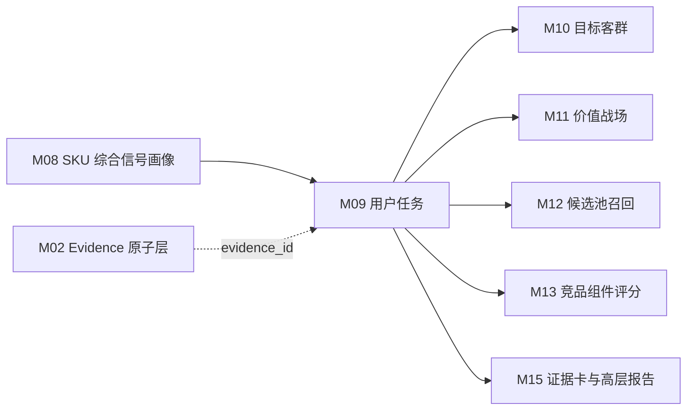

# M09 用户任务模块 SOP 需求

## 0. 单模块强化状态

本文件已按“单模块逐一强化”要求完成第一轮强化。下一步应处理 M10 目标客群模块。

## 1. 模块目标

M09 基于 M08 SKU 综合信号画像，推断每个 SKU 主要服务哪些用户任务，并输出任务候选、任务得分、任务关系等级、置信度和可追溯证据。

用户任务不是评论主题、卖点标签或参数项的直接映射，而是四类证据共同推导后的业务判断：

1. 参数说明该 SKU 是否具备完成任务的能力基础。
2. 卖点说明该 SKU 是否主动表达了对应任务价值。
3. 评论说明用户是否真实提到了相关使用场景、体验或痛点。
4. 市场说明该 SKU 在相应尺寸、价格、渠道和销量环境中是否被验证。

M09 要服务两个下游目的：

- 给 M10 目标客群、M11 价值战场、M12 候选召回和 M13 竞品评分提供统一任务口径。
- 给 M15 高层展示页提供“为什么认为该 SKU 服务这些任务”的业务化解释，用于展示页七步推导中的“② 用户任务识别”。

M09 不选择竞品，也不把任务直接升级为客群或战场。

## 2. 设计依据

本模块依据：

- `cankao/CatForge_竞品生成SOP_详细指导_v1.md` 的 M09 要求。
- `cankao/catforge_sop_md/modules/M09_用户任务模块.md`。
- `cankao/CatForge_核心竞品展示页_UI设计规范_v1.md` 中“用户任务识别”和七步推导展示要求。
- M08 已强化后的 SKU 综合信号画像和下游特征边界。
- `apps/api-server/app/rules/tv_core3_mvp_seed_v0_2.json` 中真实可用的 TV 用户任务种子库。
- [00 真实样例数据基线](00_real_data_baseline.md)。
- 数据分层原则：M09 默认消费 M08 画像和 M08 下游视图，不直接读取原始表做业务判断。

## 3. 上游输入

### 3.1 必须输入

| 输入 | 来源 | 用途 |
| --- | --- | --- |
| `core3_sku_signal_profile` | M08 | SKU 统一画像，提供参数、卖点、评论、市场、风险和完整度摘要 |
| `core3_sku_downstream_feature_view` | M08 | `for_module=M09` 的任务特征视图，作为本模块默认入口 |
| `core3_sku_signal_evidence_matrix` | M08 | 判断参数、卖点、评论、市场证据覆盖和置信度 |
| `core3_evidence_atom` | M02 | 通过 evidence_id 回溯证据来源 |
| `user_tasks` seed | 标准任务库 | 任务定义、别名、关键词、映射参数、映射卖点、评论主题、市场信号和默认权重 |

### 3.2 从 M08 消费的特征

M09 只消费 M08 提供的标准化特征，不在本模块内重新抽取参数、评论或市场指标。

| 特征域 | M08 字段或视图内容 | M09 用途 |
| --- | --- | --- |
| SKU 主数据 | `sku_code`、`model_name`、`brand_name`、`size_segment`、`price_band`、`main_platform` | 任务适用性和业务解释 |
| 参数画像 | `core_params_json`、`param_profile_json` | 判断任务能力基础，例如尺寸、Mini LED、亮度、分区、高刷、HDMI、护眼、语音 |
| 卖点画像 | `claim_activation_summary_json`、`claim_evidence_breakdown_json` | 判断任务价值表达和宣传支撑 |
| 评论信号 | `comment_signal_summary_json.task_cue` | 判断用户是否真实提及场景、用途、体验、痛点 |
| 价格感知 | `comment_signal_summary_json.price_perception` | 支撑性价比购买、大屏换新等任务 |
| 服务信号 | `comment_signal_summary_json.service_signal` | 只支撑新家装修搭配、安装省心等任务侧面，不替代产品任务 |
| 市场画像 | `market_summary_json`、`comparable_pool_summary_json` | 判断价格带、销量、销额、平台、可比池位置和样本充分性 |
| 风险缺失 | `missing_signals_json`、`risk_signals_json`、`domain_completeness_json` | 降低置信度或触发复核 |
| 证据索引 | `evidence_ids`、`profile_hash` | 追溯和增量重算 |

### 3.3 明确不直接消费

| 数据 | 处理 |
| --- | --- |
| 原始 `week_sales_data`、`attribute_data`、`selling_points_data`、`comment_data` | 不直接读取 |
| M01 清洗表 | 不直接读取，除非通过 M08 回溯定位质量问题 |
| M03/M04b/M06/M07 散表 | 不直接读取业务字段，调试可通过 M08 evidence 回溯 |
| 评论基础分类 | 只能作为 M06 任务线索的上游参考，不能在 M09 直接贴任务 |
| M10 目标客群结果 | M10 是下游 |
| M11 价值战场结果 | M11 是下游 |
| M12-M15 竞品和报告结果 | M09 是它们的上游 |

## 4. 本模块不做什么

- 不从原始评论直接打任务标签。
- 不把“产品体验/服务体验/物流安装/价格感知/未知初判”直接当成用户任务。
- 不把卖点 code 直接等同于任务 code。
- 不把单个参数直接等同于任务结论。
- 不生成目标客群最终结论。
- 不生成价值战场最终结论。
- 不召回候选 SKU。
- 不选择核心竞品。
- 不输出面向领导页的大段技术过程、公式、JSON 或内部字段名。

## 5. 预制与抽取边界

### 5.1 预制内容

M09 允许预制的是“任务本体和规则骨架”，不是 SKU 结论。

| 预制项 | 内容 | 来源 | 是否可直接成为结论 |
| --- | --- | --- | --- |
| 任务 code 与中文名 | 10 个 MVP 用户任务 | seed | 否 |
| 任务定义 | 业务定义、别名、关键词 | seed | 否 |
| 映射参数 | `positive_param_codes`、`mapped_param_codes` | seed | 否 |
| 映射卖点 | `positive_claim_codes`、`mapped_claim_codes` | seed | 否 |
| 映射评论主题 | `comment_topic_codes`、`mapped_topic_codes` | seed | 否 |
| 映射市场信号 | `market_signals` | seed | 否 |
| 默认权重 | `score_rule` | seed | 否 |
| 下游提示 | `default_target_group_codes`、`battlefield_codes` | seed | 否，M10/M11 只能作为候选参考 |

预制任务库需要版本化，例如 `task_seed_version=tv_core3_mvp_seed_v0_2`。任务库变化必须触发 M09 重算。

### 5.2 从真实数据抽取或推导的内容

每个 SKU 的任务关系必须从 M08 画像中推导：

| 推导内容 | 生成方式 |
| --- | --- |
| 参数任务支撑 | 用 seed 中的参数映射匹配 M08 参数画像，并按数值强度、口径确定性和缺失状态评分 |
| 卖点任务支撑 | 用 seed 中的卖点映射匹配 M04b 经 M08 汇总后的最终卖点激活，不伪造缺失卖点 |
| 评论任务线索 | 只消费 M06 经 M08 汇总的 `task_cue`，使用去重评论、句子证据、主题置信度和情绪倾向 |
| 市场任务验证 | 使用 M07 经 M08 汇总的价格带、销量、销额、平台、可比池、价格每英寸和样本状态 |
| 缺失与风险 | 使用 M08 的风险缺失信号，对任务置信度和关系等级做封顶或复核 |
| 业务解释 | 基于四类证据生成中文结论，说明能力基础、用户反馈、市场验证和待复核点 |

## 6. MVP 用户任务库

MVP 必须对齐真实 seed 中的 10 个任务。任务名称用于业务展示，任务 code 只用于内部契约。

| 任务 code | 业务名称 | 任务定义 | 典型支撑信号 |
| --- | --- | --- | --- |
| `TASK_LIVING_ROOM_CINEMA` | 客厅影院观影 | 家庭客厅大屏观影、追剧和沉浸影音娱乐 | 大尺寸、高亮、音效、画质/音效评论、中高价位家庭需求 |
| `TASK_PREMIUM_PICTURE_AV` | 高端画质影音 | 关注 Mini LED/OLED、高亮、控光、色彩和画质体验 | Mini LED、OLED、亮度、分区、画质评论、高端价格带 |
| `TASK_GAMING_ENTERTAINMENT` | 游戏娱乐 | 关注高刷、HDMI 2.1、低延迟、VRR 和游戏体验 | 高刷、HDMI2.1、低延迟、游戏流畅评论、游戏价格带 |
| `TASK_SPORTS_WATCHING` | 体育赛事观看 | 看球赛和高速运动画面时追求清晰、流畅、低拖影 | 高刷、运动补偿、看球/体育评论、赛事季节信号 |
| `TASK_LARGE_SCREEN_REPLACEMENT` | 大屏换新 | 从小尺寸或旧电视升级到 75/85 英寸以上大屏并关注价格效率 | 75/85/100 寸、价格每英寸、销量、尺寸空间评论 |
| `TASK_CHILD_EYE_CARE` | 儿童护眼 | 儿童、家庭长时间观看时关注护眼、低蓝光、无频闪和家长控制 | 护眼参数、儿童/家庭评论、低蓝光/无频闪卖点 |
| `TASK_SENIOR_EASY_USE` | 长辈易用 | 长辈或父母使用电视时关注语音、简洁系统、少广告和操作简单 | 语音、长辈模式、系统易用评论、低退货风险 |
| `TASK_VALUE_PURCHASE` | 性价比购买 | 预算敏感或理性购买场景，关注价格、尺寸、销量和评论价值感 | 价格分位、销量、促销、价格评论、性价比卖点 |
| `TASK_NEW_HOME_DECORATION` | 新家装修搭配 | 新家装修、客厅空间搭配、外观美学和安装服务场景 | 尺寸空间、外观、挂装、安装服务评论、装修场景 |
| `TASK_BEDROOM_SECOND_TV` | 卧室/副屏 | 卧室、副屏或第二台电视场景，关注中小尺寸、低价、护眼和易用 | 中小尺寸、低价、语音、护眼、卧室/副屏评论 |

本模块不得新增临时任务名。确有高频真实数据无法覆盖时，输出 `unmapped_task_pattern` 供复核，不能直接加入任务库。

## 7. 处理流程

### 7.1 加载任务特征

对每个 SKU 读取 `core3_sku_downstream_feature_view` 中 `for_module=M09` 的特征包。

特征包至少包含：

- SKU 主数据和核心业务标签。
- 参数任务支撑特征。
- 最终卖点激活特征。
- 评论 `task_cue` 特征。
- 价格价值感、服务信号和风险提示。
- 市场画像和可比池摘要。
- evidence_id 列表和 `profile_hash`。

如果 M08 未生成 M09 特征视图，M09 不应绕过 M08 直接拼散表，应输出 `blocked_by_missing_feature_view` 复核问题。

### 7.2 生成任务候选

对每个 SKU 和每个 seed 任务分别判断是否进入候选。

进入候选的条件满足任一即可：

| 触发来源 | 候选条件 |
| --- | --- |
| 参数触发 | 命中任务核心参数，且参数值不是 unknown |
| 卖点触发 | 命中任务核心卖点，且卖点状态为 high/medium 或可解释的 `param_only` |
| 评论触发 | M06 `task_cue` 命中任务主题，且有效去重评论或句子数达到最低阈值 |
| 市场触发 | 命中任务要求的价格、销量、价格每英寸、可比池或渠道信号 |

候选只代表“可能相关”，不代表主任务。候选阶段必须保留 `candidate_reason` 和初始证据。

### 7.3 计算参数支撑分

`param_signal_score` 评估 SKU 是否具备完成任务的硬能力。

规则：

- 只使用 M03 经 M08 汇总后的标准参数，不直接解析原始参数文本。
- unknown、空值、`-` 不能当 false。
- 数值参数按任务阈值或同尺寸可比池分位判断强度。
- 布尔参数只在明确为真时给正分，缺失只降低完整度。
- 参数口径冲突要进入 `risk_penalty`，例如刷新率原生/系统口径不清。

典型例子：

| 任务 | 参数判断 |
| --- | --- |
| 高端画质影音 | Mini LED/OLED、峰值亮度、分区、色域等 |
| 游戏娱乐 | 原生刷新率、HDMI2.1、低延迟、VRR、ALLM 等 |
| 体育赛事观看 | 刷新率、运动补偿、拖影相关参数 |
| 大屏换新 | 尺寸段、价格每英寸所需参数基础 |
| 长辈易用 | 语音、远场语音、长辈模式、系统内存 |

### 7.4 计算卖点支撑分

`claim_signal_score` 评估 SKU 是否有明确价值表达。

规则：

- 只使用 M04b 经 M08 汇总后的最终卖点激活。
- 结构化卖点缺失不能当成无卖点，但要降低卖点支撑和置信度。
- 技术型卖点可以由 `param_only` 形成基础支撑，但在业务解释中必须标注“由参数支撑，缺结构化宣传证据”。
- 评论只能增强卖点感知，不能把评论本身变成卖点激活。
- 服务型卖点只能支撑与服务、安装、新家装修相关的任务侧面，不能替代画质、游戏、体育等产品能力。

### 7.5 计算评论支撑分

`comment_signal_score` 评估真实用户是否提到相关任务场景或体验。

规则：

- 只使用 M06 的 `task_cue`，并通过 M08 统一入口消费。
- 评论支撑必须基于去重评论、有效句子和主题置信度。
- 高频通用好评、默认评价、纯物流安装评价不能直接支撑产品任务。
- 评论可验证“看球”“孩子看”“爸妈用”“装修安装”“价格划算”等任务线索。
- 评论不能单独生成高置信主任务；评论单域命中最高只能到 `weak`，除非参数、卖点或市场至少一个域同时支撑。

### 7.6 计算市场验证分

`market_signal_score` 评估任务是否被量价、渠道和可比池验证。

规则：

- 使用 M07 经 M08 汇总的 26W01-26W23 周维度市场画像。
- 当前真实样例只有线上渠道，不能生成线下任务结论。
- 当前全量样例均为海信，不做内外品牌过滤。
- 同尺寸、相邻尺寸和同价位池的样本状态必须参与置信度。
- 市场信号只做验证，不替代参数和评论。

典型例子：

| 任务 | 市场验证 |
| --- | --- |
| 大屏换新 | 85 寸同尺寸池价格每英寸、销量分位、促销趋势 |
| 性价比购买 | 价格分位偏低、销量较强、价格评论为正 |
| 高端画质影音 | 高端价格带且销额不弱 |
| 客厅影院观影 | 大尺寸中高价位且销量稳定 |
| 卧室/副屏 | 中小尺寸、低价格带、对应尺寸池活跃 |

### 7.7 风险修正与关系等级

任务最终得分使用 seed 的 `score_rule` 作为默认权重，首版允许按任务覆盖情况做轻量调整，但必须记录规则版本。

推荐计算：

```text
raw_task_score =
  claim_signal_score * seed.claim_weight
  + param_signal_score * seed.param_weight
  + comment_signal_score * seed.comment_weight
  + market_signal_score * seed.market_weight

task_score = clamp(raw_task_score - risk_penalty, 0, 1)
```

关系等级建议：

| 等级 | 建议阈值 | 证据要求 |
| --- | --- | --- |
| `main` | `task_score >= 0.75` | 至少 3 类证据有效，且参数或卖点必须有效 |
| `secondary` | `0.60 <= task_score < 0.75` | 至少 2 类证据有效，且不能只有评论 |
| `weak` | `0.40 <= task_score < 0.60` | 有相关线索，但证据单薄、缺失或冲突明显 |
| `insufficient` | `< 0.40` | 不足以作为该 SKU 用户任务 |

封顶规则：

- 仅评论命中：最高 `weak`。
- 仅服务信号命中：只能支撑 `TASK_NEW_HOME_DECORATION` 或服务侧说明，不能支撑产品核心任务。
- 仅单一参数命中：最高 `weak`；若任务依赖的是单一硬规格，也需要市场或评论补强才能进入 `secondary`。
- 结构化卖点缺失：不否定任务，但降低 `claim_signal_score` 和 `confidence`。
- 市场样本不足：不否定任务，但不能作为强市场验证。
- 关键参数口径冲突：任务进入复核，不能自动作为 `main`。

### 7.8 生成业务解释

每个 `main`、`secondary`、`weak` 任务都要生成业务化解释，供 M15 展示页使用。

解释模板：

```text
系统判断该 SKU 与「{任务名称}」相关，主要因为：
能力基础：{参数证据}
价值表达：{卖点证据或缺失说明}
用户反馈：{评论线索}
市场验证：{价格、销量、渠道或可比池信号}
待复核点：{缺失、冲突或样本不足}
```

页面主文案只展示中文业务语言，不展示内部 code、SQL、JSON 或公式。

## 8. 输出数据契约

### 8.1 `core3_sku_task_candidate`

记录候选生成阶段结果，便于复核“为什么进入候选但未成为主任务”。

| 字段 | 说明 |
| --- | --- |
| `project_id` | 项目 |
| `category_code` | 品类，MVP 为 `TV` |
| `batch_id` | 批次 |
| `sku_code` | SKU |
| `task_code` | 任务 code |
| `task_name_cn` | 业务名称 |
| `candidate_source_json` | 触发候选的参数、卖点、评论、市场来源 |
| `candidate_reason_cn` | 候选原因中文摘要 |
| `candidate_status` | active/rejected/review_required |
| `missing_signals_json` | 缺失信号 |
| `risk_flags_json` | 风险 |
| `evidence_ids` | 候选阶段 evidence |
| `profile_hash` | 依赖的 M08 画像 hash |
| `task_seed_version` | 任务库版本 |
| `rule_version` | 规则版本 |
| `created_at` | 创建时间 |
| `updated_at` | 更新时间 |

### 8.2 `core3_sku_task_score`

记录任务评分和关系等级，是 M10-M15 的主输入。

| 字段 | 说明 |
| --- | --- |
| `project_id` | 项目 |
| `category_code` | 品类 |
| `batch_id` | 批次 |
| `sku_code` | SKU |
| `model_name` | 型号 |
| `brand_name` | 品牌 |
| `task_code` | 任务 code |
| `task_name_cn` | 业务名称 |
| `task_definition_cn` | 任务定义 |
| `param_signal_score` | 参数支撑分 |
| `claim_signal_score` | 卖点支撑分 |
| `comment_signal_score` | 评论支撑分 |
| `market_signal_score` | 市场验证分 |
| `risk_penalty` | 风险扣分 |
| `task_score` | 最终任务分 |
| `relation_level` | main/secondary/weak/insufficient |
| `confidence` | 置信度 |
| `evidence_domain_count` | 有效证据域数量 |
| `missing_signals_json` | 缺失信号 |
| `risk_flags_json` | 风险 |
| `business_reason_cn` | 中文业务解释 |
| `review_required` | 是否需要复核 |
| `review_reason` | 复核原因 |
| `evidence_ids` | 核心 evidence |
| `profile_hash` | 依赖的 M08 画像 hash |
| `task_seed_version` | 任务库版本 |
| `rule_version` | 规则版本 |
| `created_at` | 创建时间 |
| `updated_at` | 更新时间 |

### 8.3 `core3_sku_task_evidence_breakdown`

记录任务得分拆解，供证据卡和技术详情使用。

| 字段 | 说明 |
| --- | --- |
| `project_id` | 项目 |
| `category_code` | 品类 |
| `batch_id` | 批次 |
| `sku_code` | SKU |
| `task_code` | 任务 code |
| `evidence_domain` | param/claim/comment/market/risk |
| `support_level` | strong/medium/weak/missing/conflict |
| `support_score` | 分域得分 |
| `support_summary_cn` | 中文证据摘要 |
| `source_signal_codes_json` | 参数、卖点、主题或市场信号码 |
| `representative_evidence_ids` | 代表证据 |
| `confidence` | 分域置信度 |
| `created_at` | 创建时间 |

### 8.4 `core3_sku_task_review_issue`

记录需要业务或数据复核的问题。

| 字段 | 说明 |
| --- | --- |
| `project_id` | 项目 |
| `category_code` | 品类 |
| `batch_id` | 批次 |
| `sku_code` | SKU |
| `task_code` | 任务 code，可为空表示 SKU 级问题 |
| `issue_type` | missing_feature/conflict/comment_only/service_only/market_limited/seed_gap |
| `issue_level` | warning/blocker |
| `issue_message_cn` | 中文问题说明 |
| `evidence_ids` | 相关证据 |
| `resolved_status` | open/resolved/ignored |
| `created_at` | 创建时间 |

## 9. 质量规则

| 规则 | 要求 |
| --- | --- |
| 缺失是未知 | unknown、空值、`-` 不能当成 false |
| 评论去重 | 评论支撑必须使用 M05/M06 去重和有效句口径 |
| 证据拆分 | 任务得分必须拆成参数、卖点、评论、市场和风险 |
| 置信度独立 | 任务适配度高不等于置信度高，结构化卖点缺失和样本不足要降低置信度 |
| 单域封顶 | 仅评论、仅服务或仅单一参数不能生成高置信主任务 |
| 同品牌可竞品 | 当前数据全是海信，M09 不做品牌排除，为后续同品牌竞品提供任务口径 |
| 线上边界 | 当前样例只有线上渠道，不能推导线下任务 |
| 可比池约束 | 涉及大屏、价格、性价比任务时必须引用 M07 可比池状态 |
| 版本追溯 | 输出必须包含 `task_seed_version`、`rule_version`、`profile_hash` |
| 业务语言 | 面向 M15 的解释必须是中文业务语言，不暴露内部英文 token |

## 10. 复核触发条件

以下情况需要进入 `core3_sku_task_review_issue`：

- M08 未生成 M09 特征视图。
- 任务只由评论命中且得分接近 `secondary` 阈值。
- 服务/安装评论被误用于画质、游戏、体育等产品任务。
- 关键参数缺失或口径冲突，例如刷新率、HDMI、亮度、分区、护眼。
- 结构化卖点缺失但任务依赖卖点价值表达。
- 评论有效样本不足、重复率过高或低价值评论占比过高。
- 市场样本不足、可比池不足或价格销量缺关键字段。
- 高分任务与参数或卖点明显矛盾。
- 高频评论、卖点或市场模式无法映射到现有 10 个任务，形成 `unmapped_task_pattern`。

## 11. 85E7Q 样例要求

85E7Q 的 M09 输出必须体现真实数据约束：参数强、评论多、市场有、结构化卖点缺失。

| 任务 | 预期判断方式 | 注意点 |
| --- | --- | --- |
| 高端画质影音 | Mini LED、5200 亮度、3500 分区、画质评论和高端价格带共同支撑 | 结构化卖点缺失不能伪造，只能写成参数强、宣传证据缺失 |
| 客厅影院观影 | 85 英寸、4K、高亮、家庭大屏评论和市场表现共同支撑 | 音效证据不足时不能强写影院音效 |
| 体育赛事观看 | 高刷、运动画面或看球评论可支撑 | 要区分体育观看和游戏娱乐，不能只因高刷就推游戏 |
| 游戏娱乐 | 高刷、HDMI2.1 可进入候选 | 缺低延迟、VRR 或游戏评论时不应自动作为主任务 |
| 大屏换新 | 85 寸、价格每英寸、销量和尺寸空间评论支撑 | 需要 M07 可比池验证 |
| 性价比购买 | 价格分位、销量、促销和价格评论共同支撑 | 高端机型如果价格不低，只能是弱或不足 |
| 新家装修搭配 | 尺寸空间、外观、挂装、安装评论可支撑 | 纯安装服务评论不能替代产品核心任务 |
| 儿童护眼 | 护眼参数、儿童家庭评论支撑 | 没有明确护眼/儿童信号时不生成高分 |
| 长辈易用 | 语音、长辈模式、易用评论支撑 | 没有长辈/易用信号时不生成高分 |
| 卧室/副屏 | 中小尺寸、低价、卧室/副屏评论支撑 | 85E7Q 默认不应因为“电视”泛化到卧室副屏 |

M09 不需要在需求阶段给出 85E7Q 最终任务排名，但开发验收时必须能解释每个高分、低分和复核任务的依据。

## 12. 与其他模块关系



下游消费边界：

| 下游模块 | 使用 M09 内容 | 边界 |
| --- | --- | --- |
| M10 目标客群 | `relation_level`、任务得分、任务证据 | seed 中的默认客群只能作为候选，不是 M10 结论 |
| M11 价值战场 | 主/次任务和证据拆解 | 任务不直接等于战场，还要结合卖点、市场和评论战场信号 |
| M12 候选召回 | 同任务、同尺寸、同价位、同渠道特征 | 候选召回不得只按任务相同召回 |
| M13 组件评分 | `task_similarity` 和任务证据完整度 | 任务相似只是组件之一 |
| M15 报告 | 中文业务解释和代表证据 | 页面不展示内部 code、公式、JSON |
| M16 增量编排 | `profile_hash`、`task_seed_version`、复核问题 | 画像或规则变化才重算 |

## 13. 增量重算要求

| 变化来源 | M09 动作 | 下游影响 |
| --- | --- | --- |
| M08 `profile_hash` 变化 | 重算对应 SKU 全部任务候选和任务分 | M10-M16 |
| M08 证据矩阵变化 | 更新证据拆解和置信度 | M10-M15 |
| seed 任务库变化 | 按 `task_seed_version` 重算受影响任务 | M10-M16 |
| 评分规则变化 | 按 `rule_version` 重算任务分和等级 | M10-M16 |
| M02 evidence 状态变化 | 更新代表证据和复核状态 | M15/M16 |

增量运行时需要保留历史版本，不覆盖原结论；新结果以 `batch_id + profile_hash + task_seed_version + rule_version` 区分。

## 14. 验收标准

| 验收项 | 标准 |
| --- | --- |
| 任务库对齐 seed | 必须覆盖 10 个 MVP 任务，不使用临时任务名 |
| 只消费 M08 | 默认不直接读取原始表或散表 |
| 候选与得分分离 | 必须有候选记录和最终任务分 |
| 四类证据拆分 | 参数、卖点、评论、市场必须分域保存 |
| 风险可追溯 | 缺失、冲突、服务误用、样本不足必须进入复核 |
| 评论不能单独高置信 | 仅评论命中最高 weak |
| 服务不能替代产品任务 | 安装/物流只支撑相关任务侧面 |
| unknown 不当 false | 缺失降低置信度，不生成负向结论 |
| 85E7Q 可解释 | 能说明高画质、家庭观影、体育/游戏、大屏换新的证据和缺口 |
| 下游可消费 | M10/M11/M12/M13/M15 不需要重新拼任务证据 |
| 高层页可展示 | `business_reason_cn` 能转成业务语言，不暴露内部过程 |
| 增量可重算 | `profile_hash`、`task_seed_version`、`rule_version` 可驱动增量 |
