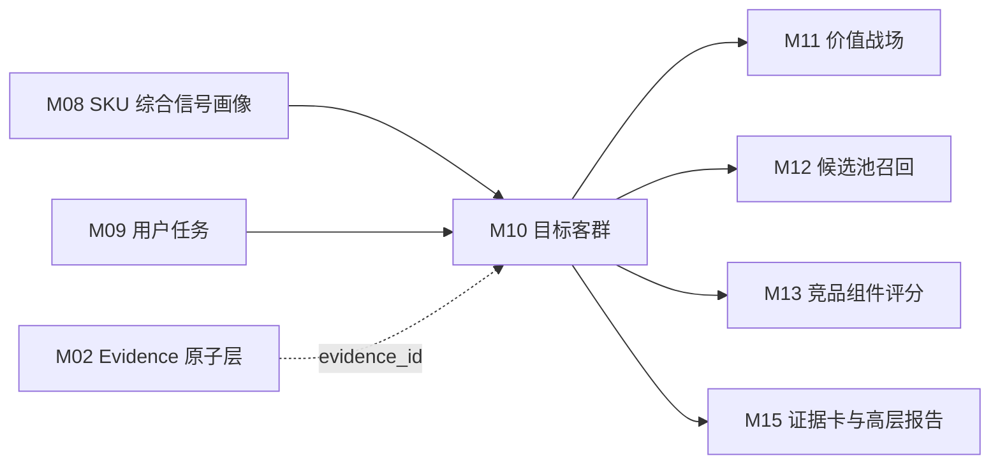

# M10 目标客群模块 SOP 需求

## 0. 单模块强化状态

本文件已按“单模块逐一强化”要求完成第一轮强化。下一步应处理 M11 价值战场模块。

## 1. 模块目标

M10 基于 M09 用户任务、M08 SKU 综合信号画像、M06 评论客群线索和 M07 市场画像，推断每个 SKU 面向的主/次/弱目标客群，并输出客群候选、客群得分、关系等级、置信度和证据拆解。

目标客群不是评论里出现“老人”“孩子”“游戏”等词后的直接标签，也不是 M09 任务 seed 中 `default_target_group_codes` 的自动映射。客群是对“谁会买、为什么买、在哪个价格和渠道语境下买”的业务归纳。

M10 要回答四个问题：

1. 该 SKU 最有可能服务哪些购买人群？
2. 这些人群判断是由任务、评论、价格渠道还是市场验证支撑？
3. 哪些客群只是线索，不能作为高置信结论？
4. 这些客群如何向 M11 价值战场、M12 候选召回、M13 竞品评分和 M15 高层报告传递？

M10 的输出用于展示页七步推导中的“③ 目标客群判断”，但页面只展示业务语言，不展示内部评分过程。

## 2. 设计依据

本模块依据：

- `cankao/CatForge_竞品生成SOP_详细指导_v1.md` 的 M10 要求。
- `cankao/catforge_sop_md/modules/M10_目标客群模块.md`。
- `cankao/CatForge_核心竞品展示页_UI设计规范_v1.md` 中“目标客群判断”和七步推导展示要求。
- M06 已强化后的 `target_group_cue`、`price_perception`、`service_signal` 边界。
- M08 已强化后的 SKU 综合信号画像和下游特征边界。
- M09 已强化后的用户任务候选、任务得分和任务证据拆解。
- `apps/api-server/app/rules/tv_core3_mvp_seed_v0_2.json` 中真实可用的 TV 目标客群种子库。
- [00 真实样例数据基线](00_real_data_baseline.md)。
- 数据分层原则：M10 默认消费 M08/M09 上游产物，不直接读取原始表做业务判断。

## 3. 上游输入

### 3.1 必须输入

| 输入 | 来源 | 用途 |
| --- | --- | --- |
| `core3_sku_task_score` | M09 | 主/次/弱用户任务、任务得分和任务关系等级 |
| `core3_sku_task_evidence_breakdown` | M09 | 任务证据拆分，判断客群证据来自哪些任务 |
| `core3_sku_signal_profile` | M08 | SKU 统一画像，提供价格带、尺寸、渠道、市场、评论、风险和完整度 |
| `core3_sku_downstream_feature_view` | M08 | `for_module=M10` 的客群特征视图 |
| `core3_sku_signal_evidence_matrix` | M08 | 判断客群相关证据覆盖和置信度 |
| `core3_evidence_atom` | M02 | 通过 evidence_id 回溯证据来源 |
| `target_groups` seed | 标准客群库 | 客群定义、别名、关键词、来源任务、市场适配规则和战场映射提示 |

### 3.2 从 M09 消费的任务结果

M10 不重新推导任务，只消费 M09 的结果：

| M09 内容 | M10 用途 |
| --- | --- |
| `task_code`、`task_name_cn` | 判断客群关联任务 |
| `task_score` | 形成任务支撑分 |
| `relation_level` | 主任务对客群强支撑，弱任务只能形成弱客群线索 |
| `business_reason_cn` | 生成客群业务解释 |
| `evidence_ids` | 建立客群到任务证据的回溯 |
| `review_required`、`risk_flags_json` | 降低客群置信度或触发复核 |

M09 seed 中的 `default_target_group_codes` 只能作为候选提示，不能直接生成 M10 结论。

### 3.3 从 M08 消费的画像特征

| 特征域 | M08 字段或视图内容 | M10 用途 |
| --- | --- | --- |
| SKU 主数据 | `sku_code`、`model_name`、`brand_name`、`size_segment`、`price_band`、`main_platform` | 客群适配和业务解释 |
| 评论客群线索 | `comment_signal_summary_json.target_group_cue` | 判断人群、家庭结构、购买动机线索 |
| 价格感知 | `comment_signal_summary_json.price_perception` | 支撑性价比用户、预算用户、大屏换新用户 |
| 服务信号 | `comment_signal_summary_json.service_signal` | 支撑新家装修用户或服务敏感侧面 |
| 市场画像 | `market_summary_json` | 判断价格带、销量、销额、平台表现 |
| 可比池 | `comparable_pool_summary_json` | 判断同尺寸、同价位人群适配是否成立 |
| 风险缺失 | `missing_signals_json`、`risk_signals_json`、`domain_completeness_json` | 降低置信度或进入复核 |
| 证据索引 | `evidence_ids`、`profile_hash` | 追溯和增量重算 |

### 3.4 明确不直接消费

| 数据 | 处理 |
| --- | --- |
| 原始 `comment_data` | 不直接读取 |
| 原始 `week_sales_data`、`attribute_data`、`selling_points_data` | 不直接读取 |
| 评论基础分类 | 只能经 M06 转换为客群线索后消费 |
| M11 价值战场结果 | M11 是下游 |
| M12-M15 竞品和报告结果 | M10 是它们的上游 |

## 4. 本模块不做什么

- 不直接从评论文本生成客群结论。
- 不把 seed 的客群映射当成 SKU 客群结果。
- 不把“老人/孩子/游戏/安装”等单个词直接等同目标客群。
- 不把服务安装评论泛化为产品购买人群。
- 不定义价值战场。
- 不召回候选 SKU。
- 不做竞品评分。
- 不选择核心竞品。
- 不输出面向高层页面的公式、JSON 或内部 code。

## 5. 预制与抽取边界

### 5.1 预制内容

M10 允许预制“客群本体和规则骨架”，不允许预制 SKU 客群结论。

| 预制项 | 内容 | 来源 | 是否可直接成为结论 |
| --- | --- | --- | --- |
| 客群 code 与中文名 | 9 个 MVP 目标客群 | seed | 否 |
| 客群定义 | 业务定义、别名、关键词 | seed | 否 |
| 来源任务 | `source_task_codes`、`mapped_task_codes` | seed | 否 |
| 市场适配规则 | `market_fit_rule.signals` | seed | 否 |
| 战场提示 | `mapped_battlefield_codes` | seed | 否，M11 只能作为候选参考 |
| 证据要求 | `evidence_requirement` | seed | 否 |

客群 seed 需要版本化，例如 `target_group_seed_version=tv_core3_mvp_seed_v0_2`。seed 变化必须触发 M10 重算。

### 5.2 从真实数据推导的内容

每个 SKU 的目标客群必须由上游真实数据推导：

| 推导内容 | 生成方式 |
| --- | --- |
| 任务支撑 | 用 M09 的主/次/弱任务匹配 seed 的来源任务 |
| 评论客群线索 | 用 M06 经 M08 汇总的 `target_group_cue` 判断人群、家庭结构和购买动机 |
| 价格渠道适配 | 用 M08/M07 的价格带、平台、价格分位和销量状态判断人群适配 |
| 市场验证 | 用 M08/M07 的同尺寸、同价位、销量、销额和样本状态验证 |
| 服务敏感侧面 | 用 `service_signal` 支撑新家装修、安装省心、服务保障相关客群侧面 |
| 风险和缺失 | 用 M08/M09 的风险标记封顶或触发复核 |
| 业务解释 | 用中文解释“这类人为什么可能买这个 SKU” |

## 6. MVP 目标客群库

MVP 必须对齐真实 seed 中的 9 个目标客群。不得临时增加“服务敏感用户”为独立客群；服务敏感只能作为 `TG_NEW_HOME_DECORATOR` 或服务保障战场的支撑线索，后续是否入库需业务复核。

| 客群 code | 业务名称 | 客群定义 | 主要来源任务 | 典型支撑信号 |
| --- | --- | --- | --- | --- |
| `TG_FAMILY_UPGRADE` | 家庭换新用户 | 以全家客厅观影、大屏升级和家庭娱乐为核心诉求的人群 | 客厅影院观影、大屏换新 | 85/75/100 寸、家庭观影评论、同尺寸销量 |
| `TG_AV_QUALITY_SEEKER` | 画质影音用户 | 对画质技术、亮度、控光、色彩和影音效果敏感的人群 | 高端画质影音 | Mini LED/OLED、高亮、分区、画质评论、高端价格带 |
| `TG_GAMER` | 游戏用户 | 使用电视连接主机或进行游戏娱乐，关注高刷、低延迟和接口的人群 | 游戏娱乐 | 高刷、HDMI2.1、低延迟、游戏评论 |
| `TG_SPORTS_FAN` | 体育观看用户 | 经常观看球赛、赛事和高速运动画面的人群 | 体育赛事观看 | 看球评论、高刷、运动补偿、赛事场景 |
| `TG_SENIOR_FAMILY` | 长辈家庭用户 | 给父母、老人或长辈使用，重视简单、语音、少广告的人群 | 长辈易用 | 爸妈/老人评论、语音、系统易用、少广告 |
| `TG_CHILD_FAMILY` | 儿童家庭用户 | 家中有儿童，重视护眼、内容管理和长期观看舒适度的人群 | 儿童护眼 | 孩子/儿童评论、护眼参数、低蓝光/无频闪 |
| `TG_VALUE_BUYER` | 性价比用户 | 预算敏感、关注价格效率、优惠和销量口碑的人群 | 性价比购买、大屏换新 | 价格分位、促销、销量、价格价值评论 |
| `TG_NEW_HOME_DECORATOR` | 新家装修用户 | 新家装修或客厅布置阶段，重视外观、尺寸、安装和家居适配的人群 | 新家装修搭配 | 装修/新家评论、外观、尺寸空间、安装服务 |
| `TG_BEDROOM_SECOND_TV` | 卧室副屏用户 | 购买卧室、副屏或第二台电视，重视尺寸适配、低价和易用的人群 | 卧室/副屏 | 中小尺寸、低价、卧室/副屏评论、语音护眼 |

## 7. 处理流程

### 7.1 加载客群特征

对每个 SKU 读取：

- M09 `core3_sku_task_score` 中 `main/secondary/weak` 任务。
- M09 `core3_sku_task_evidence_breakdown` 中任务证据。
- M08 `core3_sku_downstream_feature_view` 中 `for_module=M10` 的客群特征包。
- seed `target_groups` 定义。

如果 M08 未提供 M10 特征视图，或 M09 未生成任务结果，M10 不应绕过上游直接拼散表，应输出复核问题。

### 7.2 生成客群候选

对每个 SKU 和每个 seed 客群分别判断是否进入候选。

进入候选的条件满足任一即可：

| 触发来源 | 候选条件 |
| --- | --- |
| 任务触发 | M09 命中该客群的 `source_task_codes`，且任务关系不是 `insufficient` |
| 评论触发 | M06 `target_group_cue` 命中该客群别名、关键词或购买动机 |
| 价格渠道触发 | 价格带、平台、尺寸段与客群市场适配规则匹配 |
| 市场触发 | 可比池、销量、销额或价格分位支持该客群购买语境 |
| 服务触发 | 服务信号命中新家装修、安装省心相关场景 |

候选不等于结论。候选记录必须保留 `candidate_reason_cn`，说明为什么进入候选。

### 7.3 计算任务支撑分

`task_support_score` 是 M10 的核心支撑，来自 M09。

建议规则：

| M09 任务关系 | 客群支撑 |
| --- | --- |
| `main` | 强支撑，对映射客群给高分 |
| `secondary` | 中支撑，可形成客群候选或次客群 |
| `weak` | 弱支撑，只能形成弱客群或复核线索 |
| `insufficient` | 不支撑客群 |

任务到客群的映射必须来自 seed 的 `source_task_codes`，不能临时硬写。一个客群可以由多个任务共同支撑，例如 `TG_FAMILY_UPGRADE` 可由客厅影院观影和大屏换新共同支撑。

### 7.4 计算评论客群线索分

`comment_group_signal_score` 使用 M06 `target_group_cue`。

规则：

- 只使用 M06 经 M08 汇总后的客群线索，不重新解析评论。
- 需要使用去重评论、有效句子、主题置信度和情绪方向。
- “给爸妈买”“老人用着方便”支撑长辈家庭用户。
- “孩子看”“护眼舒服”支撑儿童家庭用户。
- “看球”“体育赛事”支撑体育观看用户。
- “性价比”“划算”“优惠”支撑性价比用户，但还需价格和市场验证。
- “安装快”“师傅专业”只能作为服务侧线索，优先支撑新家装修用户或服务保障战场，不能单独生成产品核心客群。

评论客群线索不能单独生成高置信主客群；评论单域命中最高只能到 `weak`，除非任务、价格渠道或市场至少一个域同时支撑。

### 7.5 计算价格渠道适配分

`price_channel_fit_score` 判断 SKU 的价格和渠道是否符合该客群购买语境。

规则：

- 使用 M08/M07 的价格带、最新均价、加权均价、价格分位、渠道平台和同尺寸可比池。
- 当前真实样例只有线上渠道，不能生成线下客群判断。
- 当前全量样例均为海信，M10 不做品牌内外过滤。
- 高价 SKU 可以支撑画质影音用户和家庭换新用户，但不能仅凭“价格评论好”就高置信支撑性价比用户。
- 中小尺寸、低价带才适合卧室副屏用户；85 寸大屏默认不应强支撑卧室副屏。

### 7.6 计算市场验证分

`market_validation_score` 判断客群推断是否被销量、销额和可比池验证。

典型规则：

| 客群 | 市场验证 |
| --- | --- |
| 家庭换新用户 | 大尺寸池销量稳定或销额不弱 |
| 画质影音用户 | 高端价格带、画质参数强、销额不弱 |
| 性价比用户 | 价格分位较低、销量较强、价格评论为正 |
| 新家装修用户 | 尺寸空间和安装服务评论较强，市场样本可用 |
| 卧室副屏用户 | 中小尺寸、低价格带、对应尺寸池活跃 |

市场样本不足时不能否定客群，但要降低置信度并进入复核。

### 7.7 风险修正与关系等级

建议计算：

```text
raw_target_group_score =
  task_support_score * 0.55
  + comment_group_signal_score * 0.20
  + price_channel_fit_score * 0.15
  + market_validation_score * 0.10

target_group_score = clamp(raw_target_group_score - risk_penalty, 0, 1)
```

如果某一客群的 seed 证据要求更偏市场或评论，可以在规则版本中做任务级权重调整，但必须记录 `rule_version`。

关系等级建议：

| 等级 | 建议阈值 | 证据要求 |
| --- | --- | --- |
| `main` | `target_group_score >= 0.75` | 至少 2 类证据有效，且任务或市场必须有效 |
| `secondary` | `0.60 <= target_group_score < 0.75` | 至少 2 类证据有效，或一个强任务支撑加一个弱验证 |
| `weak` | `0.40 <= target_group_score < 0.60` | 有相关线索，但证据不足或缺失明显 |
| `insufficient` | `< 0.40` | 不足以作为该 SKU 目标客群 |

封顶规则：

- 仅评论命中：最高 `weak`。
- 仅服务信号命中：最高 `weak`；只能支撑新家装修或服务保障相关解释。
- 仅 seed 默认映射命中：不能输出结论，必须有 M09 任务分或真实信号。
- M09 任务 `review_required=true`：相关客群最高 `secondary`，并继承复核原因。
- 价格渠道明显不适配：相关客群最高 `weak`，例如高端 85 寸不能强判卧室副屏用户。
- 评论有效样本不足：降低 `confidence`，不能自动升为主客群。

### 7.8 生成业务解释

每个 `main`、`secondary`、`weak` 客群都要生成中文业务解释。

解释模板：

```text
系统判断该 SKU 与「{客群名称}」相关，主要因为：
购买任务：{来自 M09 的任务支撑}
用户线索：{评论中的人群或购买动机}
价格渠道：{价格带、渠道、尺寸段适配}
市场验证：{销量、销额、可比池或样本状态}
待复核点：{缺失、冲突或样本不足}
```

面向高层页面时，应转为自然业务语言，例如“更像服务家庭客厅换新和高端画质改善人群”，避免显示内部 code。

## 8. 输出数据契约

### 8.1 `core3_sku_target_group_candidate`

记录客群候选生成阶段，便于复核“为什么进入候选但未成为主客群”。

| 字段 | 说明 |
| --- | --- |
| `project_id` | 项目 |
| `category_code` | 品类，MVP 为 `TV` |
| `batch_id` | 批次 |
| `sku_code` | SKU |
| `target_group_code` | 客群 code |
| `target_group_name_cn` | 客群中文名 |
| `candidate_source_json` | 任务、评论、价格渠道、市场、服务触发来源 |
| `candidate_reason_cn` | 候选原因中文摘要 |
| `candidate_status` | active/rejected/review_required |
| `source_task_codes_json` | 关联任务 |
| `missing_signals_json` | 缺失信号 |
| `risk_flags_json` | 风险 |
| `evidence_ids` | 候选 evidence |
| `profile_hash` | M08 画像 hash |
| `task_score_version` | M09 任务结果版本 |
| `target_group_seed_version` | 客群库版本 |
| `rule_version` | 规则版本 |
| `created_at` | 创建时间 |
| `updated_at` | 更新时间 |

### 8.2 `core3_sku_target_group_score`

记录客群评分和关系等级，是 M11-M15 的主输入。

| 字段 | 说明 |
| --- | --- |
| `project_id` | 项目 |
| `category_code` | 品类 |
| `batch_id` | 批次 |
| `sku_code` | SKU |
| `model_name` | 型号 |
| `brand_name` | 品牌 |
| `target_group_code` | 客群 code |
| `target_group_name_cn` | 客群中文名 |
| `target_group_definition_cn` | 客群定义 |
| `task_support_score` | 任务支撑分 |
| `comment_group_signal_score` | 评论客群线索分 |
| `price_channel_fit_score` | 价格渠道适配分 |
| `market_validation_score` | 市场验证分 |
| `risk_penalty` | 风险扣分 |
| `target_group_score` | 最终客群分 |
| `relation_level` | main/secondary/weak/insufficient |
| `confidence` | 置信度 |
| `evidence_domain_count` | 有效证据域数量 |
| `source_task_scores_json` | 来源任务及得分 |
| `missing_signals_json` | 缺失信号 |
| `risk_flags_json` | 风险 |
| `business_reason_cn` | 中文业务解释 |
| `review_required` | 是否需要复核 |
| `review_reason` | 复核原因 |
| `evidence_ids` | 核心 evidence |
| `profile_hash` | M08 画像 hash |
| `task_score_version` | M09 任务结果版本 |
| `target_group_seed_version` | 客群库版本 |
| `rule_version` | 规则版本 |
| `created_at` | 创建时间 |
| `updated_at` | 更新时间 |

### 8.3 `core3_sku_target_group_evidence_breakdown`

记录客群得分拆解，供 M15 证据卡和技术详情使用。

| 字段 | 说明 |
| --- | --- |
| `project_id` | 项目 |
| `category_code` | 品类 |
| `batch_id` | 批次 |
| `sku_code` | SKU |
| `target_group_code` | 客群 code |
| `evidence_domain` | task/comment/price_channel/market/service/risk |
| `support_level` | strong/medium/weak/missing/conflict |
| `support_score` | 分域得分 |
| `support_summary_cn` | 中文证据摘要 |
| `source_signal_codes_json` | 来源任务、评论主题或市场信号 |
| `representative_evidence_ids` | 代表证据 |
| `confidence` | 分域置信度 |
| `created_at` | 创建时间 |

### 8.4 `core3_sku_target_group_review_issue`

记录需要业务或数据复核的问题。

| 字段 | 说明 |
| --- | --- |
| `project_id` | 项目 |
| `category_code` | 品类 |
| `batch_id` | 批次 |
| `sku_code` | SKU |
| `target_group_code` | 客群 code，可为空表示 SKU 级问题 |
| `issue_type` | missing_task/only_comment/only_service/price_mismatch/market_limited/task_conflict/seed_gap |
| `issue_level` | warning/blocker |
| `issue_message_cn` | 中文问题说明 |
| `evidence_ids` | 相关证据 |
| `resolved_status` | open/resolved/ignored |
| `created_at` | 创建时间 |

## 9. 质量规则

| 规则 | 要求 |
| --- | --- |
| 客群不是词频 | 单词命中只能形成线索，不能直接形成结论 |
| 客群不是任务默认映射 | seed 的 `default_target_group_codes` 只能触发候选 |
| 评论去重 | 评论客群线索必须使用 M05/M06 去重和有效句口径 |
| 服务边界 | 安装、物流、售后只能支撑服务侧或新家装修，不能替代产品人群 |
| 价格适配 | 性价比、卧室副屏等客群必须有价格或尺寸语境 |
| 样本充分性 | 市场和评论样本不足时降低置信度 |
| unknown 不当 false | 缺失降低置信度，不生成负向客群结论 |
| 同品牌不排除 | 当前样例都是海信，M10 不做品牌过滤 |
| 线上渠道边界 | 当前样例只有线上渠道，不生成线下人群判断 |
| 版本追溯 | 输出必须包含 `target_group_seed_version`、`rule_version`、`profile_hash` |
| 业务语言 | 面向 M15 的解释必须是中文业务语言，不暴露内部英文 token |

## 10. 复核触发条件

以下情况需要进入 `core3_sku_target_group_review_issue`：

- M08 未生成 M10 特征视图。
- M09 任务结果缺失或对应任务处于复核状态。
- 客群只由评论命中且得分接近 `secondary` 阈值。
- 客群只由服务/安装评论命中。
- 评论客群线索与 M09 任务结论冲突。
- 高价 SKU 被判为性价比用户且缺少低价分位或促销证据。
- 大尺寸高端 SKU 被判为卧室副屏用户。
- 儿童、长辈、游戏、体育等强场景客群缺少明确评论或任务支撑。
- 市场样本不足、可比池不足或价格销量关键字段缺失。
- 高频真实客群线索无法映射到现有 9 个 seed 客群。

## 11. 85E7Q 样例要求

85E7Q 的 M10 输出必须体现真实数据约束：85 寸、高端画质参数强、评论多、市场有、结构化卖点缺失。

| 客群 | 预期判断方式 | 注意点 |
| --- | --- | --- |
| 画质影音用户 | 由高端画质影音任务、Mini LED/亮度/分区、画质评论和高端价格带支撑 | 结构化卖点缺失要降低宣传证据置信度 |
| 家庭换新用户 | 由客厅影院观影、大屏换新任务、85 寸、家庭观影/尺寸评论和市场表现支撑 | 需要区分家庭观影和单纯大尺寸参数 |
| 体育观看用户 | 由体育赛事观看任务、看球评论和高刷/运动画面证据支撑 | 不能只因高刷就默认体育用户为主客群 |
| 游戏用户 | 由游戏娱乐任务、高刷、HDMI2.1 和游戏评论支撑 | 缺游戏评论或低延迟时应为候选或弱客群 |
| 性价比用户 | 由性价比购买任务、价格分位、销量和价格价值评论支撑 | 高端价格带时不能高置信判为主客群 |
| 新家装修用户 | 由新家装修搭配任务、尺寸空间、外观、安装评论支撑 | 纯安装服务好评只能支撑侧面 |
| 儿童家庭用户 | 由儿童护眼任务、护眼参数、儿童/孩子评论支撑 | 无明确儿童/护眼信号时不高分 |
| 长辈家庭用户 | 由长辈易用任务、语音/简单操作、爸妈/老人评论支撑 | 无明确人群线索时不高分 |
| 卧室副屏用户 | 由卧室/副屏任务、中小尺寸、低价、卧室评论支撑 | 85E7Q 默认不应作为主客群 |

M10 不需要在需求阶段给出 85E7Q 最终客群排名，但开发验收时必须解释每个主/次/弱客群的证据和被压低原因。

## 12. 与其他模块关系



下游消费边界：

| 下游模块 | 使用 M10 内容 | 边界 |
| --- | --- | --- |
| M11 价值战场 | 主/次客群、客群证据和风险 | 客群不直接等于战场，还要结合任务、卖点和市场 |
| M12 候选召回 | 同客群、同任务、同尺寸、同价位辅助召回 | 候选召回不得只按客群相同召回 |
| M13 组件评分 | 客群相似度和客群证据完整度 | 客群相似只是组件之一 |
| M15 报告 | 中文客群解释和代表证据 | 页面不展示内部 code、公式、JSON |
| M16 增量编排 | `profile_hash`、`target_group_seed_version`、复核问题 | 画像、任务或规则变化才重算 |

## 13. 增量重算要求

| 变化来源 | M10 动作 | 下游影响 |
| --- | --- | --- |
| M09 任务结果变化 | 重算对应 SKU 全部客群候选和客群分 | M11-M16 |
| M08 `profile_hash` 变化 | 重算价格、评论、市场相关客群分 | M10-M16 |
| M08 证据矩阵变化 | 更新证据拆解和置信度 | M11-M15 |
| target group seed 变化 | 按 `target_group_seed_version` 重算受影响客群 | M11-M16 |
| 评分规则变化 | 按 `rule_version` 重算客群分和等级 | M11-M16 |
| M02 evidence 状态变化 | 更新代表证据和复核状态 | M15/M16 |

增量运行时需要保留历史版本，不覆盖原结论；新结果以 `batch_id + profile_hash + task_score_version + target_group_seed_version + rule_version` 区分。

## 14. 验收标准

| 验收项 | 标准 |
| --- | --- |
| 客群库对齐 seed | 必须覆盖 9 个 MVP 客群，不使用临时客群名 |
| 只消费上游产物 | 默认不直接读取原始表或散表 |
| 候选与得分分离 | 必须有候选记录和最终客群分 |
| 任务不是直接映射 | seed 默认客群只能触发候选，不能直接成为结论 |
| 评论不能单独高置信 | 仅评论命中最高 weak |
| 服务不能替代产品人群 | 安装/物流只支撑相关服务侧面 |
| 价格渠道参与评分 | 性价比、卧室副屏、新家装修等必须有价格或渠道语境 |
| 四类证据拆分 | 任务、评论、价格渠道、市场必须分域保存 |
| unknown 不当 false | 缺失降低置信度，不生成负向结论 |
| 85E7Q 可解释 | 能说明画质影音、家庭换新、体育/游戏、性价比等客群的证据和缺口 |
| 下游可消费 | M11/M12/M13/M15 不需要重新拼客群证据 |
| 高层页可展示 | `business_reason_cn` 能转成业务语言，不暴露内部过程 |
| 增量可重算 | `profile_hash`、`task_score_version`、`target_group_seed_version`、`rule_version` 可驱动增量 |
