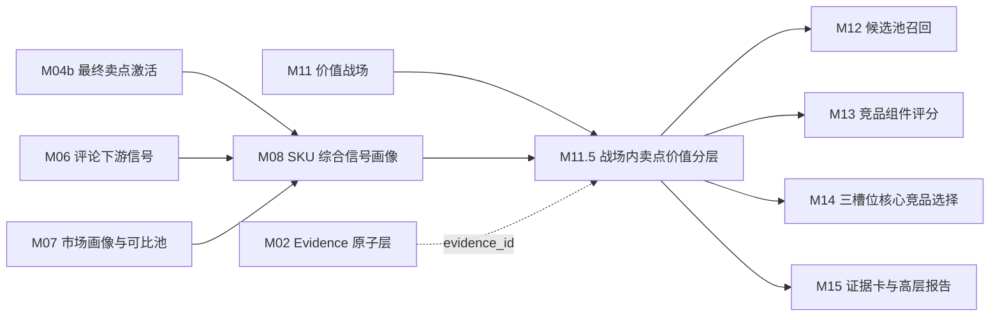

# M11.5 战场内卖点价值分层 SOP 需求

## 0. 单模块强化状态

本文件已按“单模块逐一强化”要求完成第一轮强化。下一步应处理 M12 候选池召回模块。

## 1. 模块目标

M11.5 基于 M11 价值战场、M04b 最终卖点激活、M06 评论感知、M07 市场画像与可比池、M08 SKU 综合信号画像，在每个具体价值战场内判断 SKU 的核心卖点属于基础门槛、竞争绩效、溢价倾向、弱感知或样本不足。

本模块补齐“价值战场”和“卖点价值”的闭环：M11 说明 SKU 参与哪个战场，M11.5 说明在这个战场里，哪些卖点只是入场门槛，哪些卖点真正形成竞争差异，哪些卖点可能支撑溢价，哪些卖点虽然被激活但用户和市场感知偏弱。

M11.5 要回答五个问题：

1. 在某个已判定的价值战场内，SKU 的哪些卖点值得参与后续竞品比较？
2. 同一卖点在不同战场中是核心、辅助、服务侧还是不适用？
3. 卖点价值由参数、宣传、评论、价格、销量和可比池中的哪些证据支撑？
4. 当前样本是否足够支撑“溢价倾向”或“竞争绩效”判断？
5. 这些分层如何传递给 M12 候选召回、M13 组件评分、M14 三槽位选择和 M15 高层报告？

M11.5 不判断 SKU 是否进入战场，不选择竞品，也不生成最终报告。它只在 M11 已给出的战场语境中，对卖点价值进行分层。

## 2. 设计依据

本模块依据：

- `cankao/CatForge_竞品生成SOP_详细指导_v1.md` 的 M11.5 要求。
- `cankao/catforge_sop_md/modules/M11_5_战场内卖点价值分层模块.md`。
- `cankao/CatForge_核心竞品展示页_UI设计规范_v1.md` 中价值战场卡片、证据矩阵和高层报告展示要求。
- M04b 已强化后的最终卖点激活、评论验证增强和宣传证据缺失边界。
- M06 已强化后的 `claim_validation`、`battlefield_support`、`price_perception`、`service_signal`、`pain_point` 边界。
- M07 已强化后的市场画像和可比池基线。
- M08 已强化后的 SKU 综合信号画像和 M11.5 下游特征边界。
- M11 已强化后的价值战场结果。
- `apps/api-server/app/rules/tv_core3_mvp_seed_v0_2.json` 中真实可用的 20 个标准卖点和 10 个价值战场映射。
- [00 真实样例数据基线](00_real_data_baseline.md)。
- 数据分层原则：M11.5 默认消费 M08/M11/M04b/M06/M07 上游产物，不直接读取原始表做业务判断。

## 3. 上游输入

### 3.1 必须输入

| 输入 | 来源 | 用途 |
| --- | --- | --- |
| `core3_sku_battlefield_score` | M11 | SKU 的主/次/机会/弱战场和战场分 |
| `core3_sku_battlefield_evidence_breakdown` | M11 | 战场证据拆分，判断卖点在该战场中的上下文 |
| `core3_sku_battlefield_portfolio` | M11 | SKU 战场组合摘要，决定分层范围 |
| `core3_sku_signal_profile` | M08 | SKU 统一画像，提供最终卖点、参数、评论、市场、风险和完整度 |
| `core3_sku_downstream_feature_view` | M08 | `for_module=M11.5` 的卖点价值分层特征视图 |
| `core3_sku_signal_evidence_matrix` | M08 | 判断卖点、评论、市场证据覆盖和置信度 |
| `core3_sku_claim_activation` | M04b，经 M08 汇总 | 最终卖点激活、激活依据、宣传证据缺失和评论验证 |
| `core3_sku_market_profile` | M07，经 M08 汇总 | 价格、销量、销额、平台、趋势 |
| `core3_comparable_pool_baseline` | M07，经 M08 汇总 | 同尺寸、同价、战场可比池基础 |
| `core3_evidence_atom` | M02 | 通过 evidence_id 回溯证据来源 |
| `standard_claims` seed | 标准卖点库 | 卖点定义、激活规则、映射参数、映射任务、映射战场 |
| `battlefields` seed | 标准战场库 | 战场核心卖点、核心参数、评论主题和市场信号 |

### 3.2 从 M11 消费的战场范围

M11.5 只对 M11 输出的相关战场做分层：

| M11 关系 | M11.5 处理 |
| --- | --- |
| `main` | 必须对该战场核心卖点做完整分层 |
| `secondary` | 必须做分层，供 M12/M13 判断候选相似和竞争差异 |
| `opportunity` | 可做分层，但默认用于扩展召回和机会解释 |
| `weak` | 只在卖点被激活或有明显评论/市场证据时做弱分层 |
| `insufficient` | 默认不做分层，只记录不足原因 |

M11.5 不反向修改 M11 战场关系。是否用 M11.5 反向校准 M11 是二期能力，不属于 MVP 必需项。

### 3.3 从 M08/M04b 消费的卖点特征

| 特征 | 用途 |
| --- | --- |
| `claim_code`、`claim_name`、`claim_group` | 标准卖点身份和展示名称 |
| `claim_activation_score` | SKU 该卖点激活强度 |
| `activation_basis` | param/promo/comment/market/service 的构成 |
| `perception_status` | 评论验证、弱感知、矛盾或不足 |
| `mapped_battlefield_codes` | 卖点可进入哪些战场候选 |
| `supporting_param_codes` | 参数能力支撑 |
| `comment_topic_codes` | 评论感知支撑 |
| `missing_structured_claim` | 结构化宣传证据缺失 |
| `evidence_ids` | 参数、宣传、评论、市场证据 |

### 3.4 从 M07/M08 消费的市场与可比池特征

| 特征 | 用途 |
| --- | --- |
| `weighted_avg_price`、`latest_price` | PSI 价格支撑 |
| `sales_volume`、`sales_amount` | SSI 销量/销额支撑 |
| `price_percentile`、`sales_percentile`、`sales_amount_percentile` | 同池位置 |
| `main_platform`、`channel_share` | 渠道可比性 |
| `comparable_pool_id`、`pool_sku_count` | 可比池样本 |
| `same_size_pool`、`same_price_pool`、`battlefield_pool` | 分层池构建 |
| `pool_sample_status` | 样本充分性 |

### 3.5 明确不直接消费

| 数据 | 处理 |
| --- | --- |
| 原始 `week_sales_data`、`attribute_data`、`selling_points_data`、`comment_data` | 不直接读取 |
| M03/M05/M06/M07 散表 | 不直接读取业务字段，调试可通过 M08 evidence 回溯 |
| M12-M15 竞品和报告结果 | M11.5 是它们的上游 |

## 4. 本模块不做什么

- 不判断 SKU 是否进入某个价值战场，M11 负责。
- 不做全局卖点分层，所有结果必须带 `battlefield_code`。
- 不新增标准卖点，M04/M04b 和 seed 负责。
- 不把单个卖点分层直接等同竞品结论。
- 不召回竞品，M12 负责。
- 不计算完整竞品组件分，M13 负责。
- 不选择三槽位竞品，M14 负责。
- 不生成最终高层报告，M15 负责。
- 不把样本不足的 PSI/SSI 当成真实溢价证据。

## 5. 预制与抽取边界

### 5.1 预制内容

M11.5 允许预制“卖点本体、战场-卖点映射和分层规则骨架”，不允许预制 SKU 的卖点价值结论。

| 预制项 | 内容 | 来源 | 是否可直接成为结论 |
| --- | --- | --- | --- |
| 标准卖点 code 与名称 | 20 个 TV MVP 标准卖点 | `standard_claims` seed | 否 |
| 战场核心卖点 | 每个战场的 `core_claim_codes` | `battlefields` seed | 否 |
| 卖点映射战场 | `mapped_battlefield_codes` | `standard_claims` seed | 否 |
| 卖点支撑参数 | `supporting_param_codes` | `standard_claims` seed | 否 |
| 卖点评论主题 | `comment_topic_codes` | `standard_claims` seed | 否 |
| 分层阈值 | coverage、PSI、SSI、CPI 阈值 | 规则版本 | 否 |
| 样本门槛 | 最小池样本、with/without claim 样本 | 规则版本 | 否 |

预制内容必须版本化，例如 `claim_seed_version=tv_core3_mvp_seed_v0_2`、`battlefield_seed_version=tv_core3_mvp_seed_v0_2`、`rule_version=m11_5_claim_value_layer_v1`。

### 5.2 从真实数据推导的内容

| 推导内容 | 生成方式 |
| --- | --- |
| 卖点是否进入战场内分层 | M11 战场结果 + seed 战场核心卖点 + SKU 已激活卖点 |
| 卖点激活强度 | M04b 经 M08 汇总后的最终激活 |
| 参数强度 | M08 参数画像中对应标准参数的值、完整度和口径 |
| 宣传证据 | M04a/M04b 经 M08 汇总后的结构化卖点或文本证据 |
| 评论感知 | M06/M04b 经 M08 汇总后的卖点验证、战场支撑和痛点风险 |
| 价格支撑 | M07/M08 可比池中的 with/without claim 价格差异 |
| 销量支撑 | M07/M08 可比池中的 with/without claim 销量或销额差异 |
| 可比池样本状态 | M07/M08 的同尺寸、同价位、同战场候选池样本 |
| 业务解释 | 中文说明为什么该卖点在该战场是门槛、绩效、溢价、弱感知或样本不足 |

## 6. 标准战场-卖点范围

MVP 必须基于真实 seed 的 10 个战场和 20 个标准卖点做分层。下表列出每个战场的核心卖点范围。

| 战场 | 核心卖点 |
| --- | --- |
| 高端画质战场 | Mini LED 背光、OLED 自发光、量子点广色域、高亮 HDR、精细分区控光 |
| 家庭观影升级战场 | 大屏沉浸观影、高亮 HDR、沉浸音效、杜比影音 |
| 游戏体育战场 | 高刷新率、低延迟游戏、HDMI 2.1 游戏接口、体育运动流畅 |
| 大屏性价比战场 | 大屏沉浸观影、高性价比、节能省电 |
| 家庭护眼战场 | 护眼舒适 |
| 长辈易用战场 | 长辈友好智能、智能语音易用、清爽系统/少广告 |
| 智能系统体验战场 | 智能语音易用、清爽系统/少广告、长辈友好智能 |
| 影院音效战场 | 沉浸音效、杜比影音 |
| 家居美学战场 | 超薄美学设计、安装服务保障、大屏沉浸观影 |
| 服务保障战场 | 安装服务保障 |

同一卖点可以出现在多个战场，但分层必须按 `sku_code + battlefield_code + claim_code` 独立计算。例如：

| 卖点 | 游戏体育战场 | 家庭观影升级战场 | 长辈易用战场 |
| --- | --- | --- | --- |
| 高刷新率 | 可能是竞争绩效 | 可能只是辅助体验 | 通常不适用 |
| 大屏沉浸观影 | 可能不适用 | 可能是基础门槛或绩效 | 通常不适用 |
| 安装服务保障 | 不替代产品体验 | 只做服务侧补充 | 不支撑长辈易用核心 |

## 7. 处理流程

### 7.1 加载战场内分层范围

对每个 SKU 读取 M11 战场结果：

- `main`、`secondary` 战场：必须分层。
- `opportunity` 战场：按候选召回需要分层。
- `weak` 战场：只有该战场核心卖点被激活或有明确评论/市场信号时分层。
- `insufficient` 战场：不做卖点分层，只记录不足原因。

如果 M11 没有结果，M11.5 不应绕过 M11 直接做卖点价值分层。

### 7.2 生成战场内卖点候选

对每个 SKU、每个相关战场、每个标准卖点生成候选。

进入候选的条件满足任一即可：

| 触发来源 | 候选条件 |
| --- | --- |
| 战场核心卖点 | `claim_code` 属于该战场 `core_claim_codes` |
| 卖点映射 | SKU 已激活卖点的 `mapped_battlefield_codes` 包含该战场 |
| 参数触发 | 该战场核心参数命中并可映射到某标准卖点 |
| 评论触发 | 评论验证或战场支撑命中该卖点的主题 |
| 服务触发 | 服务信号命中服务保障或家居美学相关卖点 |

候选只代表“需要判断价值层级”，不代表该卖点有强价值。候选阶段必须保留 `candidate_reason_cn`。

### 7.3 构建战场可比池

M11.5 的 PSI/SSI 必须在战场可比池内计算，不能跨全部 SKU 做全局比较。

建议池优先级：

1. M07/M08 已提供的同战场、同尺寸段、同价格带、同平台可比池。
2. 若样本不足，放宽到同战场、同尺寸段、同平台。
3. 若仍不足，放宽到同战场、相邻尺寸段、同价格带。
4. 若仍不足，标记 `insufficient_sample`，不强算溢价或销量支撑。

样本门槛建议：

| 指标 | 最低要求 |
| --- | --- |
| `pool_sku_count` | 建议 >= 8 才可输出方向性分层，>= 30 才可支持强溢价判断 |
| `with_claim_count` | 建议 >= 3 |
| `without_claim_count` | 建议 >= 3 |
| `comment_effective_count` | 建议 >= 20 条去重有效评论或按 M06 样本状态判断 |
| `market_week_count` | 使用 26W01-26W23，有效周数不足时降低置信度 |

当前 205 样例数据只有 35 个型号，很多战场池会低于 30。因此 MVP 必须允许 `insufficient_sample` 和方向性解释，不能强行输出“溢价倾向”。

### 7.4 计算覆盖率

```text
coverage_rate =
  战场可比池中该卖点有效激活 SKU 数 / 战场可比池 SKU 数
```

规则：

- 有效激活必须来自 M04b 最终卖点激活。
- 结构化卖点缺失但参数强，可计入 `param_supported_claim_count`，但要和 `promo_supported_claim_count` 分开。
- unknown、空值、`-` 不能当 false。
- 如果可比池样本不足，覆盖率只作方向性参考。

### 7.5 计算 PSI 价格支撑

```text
PSI = median(price_with_claim) / median(price_without_claim) - 1
```

解释：

- PSI 为正：带该卖点的 SKU 在战场池内价格更高，可能存在溢价信号。
- PSI 接近 0：该卖点更像行业门槛或价格未体现。
- PSI 为负：该卖点不支撑溢价，可能是促销、低价竞争或样本问题。

规则：

- 价格使用 M07/M08 的加权均价或最新均价，规则版本要固定。
- `with_claim_count` 和 `without_claim_count` 不足时，不输出强 PSI。
- PSI 只表示相关性，不表示因果。

### 7.6 计算 SSI 销量支撑

```text
SSI = median(volume_with_claim) / median(volume_without_claim) - 1
```

可选扩展：

```text
SAI = median(sales_amount_with_claim) / median(sales_amount_without_claim) - 1
```

解释：

- SSI 为正：带该卖点的 SKU 在战场池内销量更好，可能支撑竞争绩效。
- SAI 为正：带该卖点的 SKU 销额更好，可能支撑高端或溢价表现。
- SSI 为负但 PSI 为正：可能存在高价小众、样本不足或定位问题。

规则：

- 销量和销额都来自 M07/M08 市场画像。
- 市场有效周数不足时降低置信度。
- 大屏性价比战场必须同时参考价格每英寸和销量，不只看绝对价格。

### 7.7 计算 CPI 评论感知

```text
CPI = 正向评论提及率 - 负向评论提及率
```

建议拆分：

```text
positive_mention_rate = positive_claim_mentions / effective_comment_count
negative_mention_rate = negative_claim_mentions / effective_comment_count
neutral_mention_rate = neutral_claim_mentions / effective_comment_count
```

规则：

- 只使用 M05/M06/M04b 经 M08 汇总后的去重评论和卖点验证结果。
- 通用好评、默认评论、纯物流评论不能支撑产品卖点 CPI。
- 服务类 CPI 只用于服务保障和家居美学服务侧，不增强画质、游戏、体育等产品卖点。
- 评论样本不足时不强判弱感知，只输出 `comment_insufficient`。

### 7.8 计算卖点价值分

建议首版：

```text
claim_value_score =
  claim_activation_score * 0.25
  + battlefield_relevance_score * 0.20
  + coverage_position_score * 0.15
  + price_support_score * 0.15
  + sales_support_score * 0.15
  + comment_perception_score * 0.10
  - risk_penalty
```

其中：

- `battlefield_relevance_score` 判断该卖点是战场核心、辅助、服务侧还是不适用。
- `coverage_position_score` 不是覆盖率越高越好，而是用于区分门槛与差异。
- `price_support_score` 来自 PSI。
- `sales_support_score` 来自 SSI/SAI。
- `comment_perception_score` 来自 CPI。
- `risk_penalty` 包括样本不足、结构化卖点缺失、参数冲突、评论负向等。

### 7.9 分层规则

| 层级 | 业务含义 | 建议规则 |
| --- | --- | --- |
| `basic_threshold` 基础门槛 | 该战场中多数 SKU 都具备，缺了会吃亏，但有了未必拉开差距 | 覆盖率 >= 0.70，PSI/SSI/CPI 无明显正向，或 seed required signal 已行业普及 |
| `competitive_performance` 竞争绩效 | 能在该战场中形成可见体验差异或销量支撑 | 覆盖率 0.20-0.70，参数可量化，SSI/SAI 或 CPI 有正向支撑 |
| `premium_tendency` 溢价倾向 | 可能支撑更高价格或高端定位 | 样本充分，PSI >= 0.05，SSI 不明显负向，参数/宣传/评论至少两类证据成立 |
| `weak_perception` 弱感知 | 卖点被激活或宣传存在，但用户/市场感知弱，或证据缺口明显 | 激活分低、CPI 弱或负向、PSI/SSI 无支撑、结构化卖点缺失且无评论补强 |
| `insufficient_sample` 样本不足 | 可比池或评论样本不足，不支持强分层 | pool、with/without claim、市场周数或评论样本低于门槛 |
| `not_applicable` 不适用 | 卖点与该战场无业务关系 | 非战场核心、非映射卖点且无真实信号 |

封顶规则：

- 样本不足时不能输出 `premium_tendency`。
- 仅参数支撑且缺宣传/评论/市场时，最高 `competitive_performance`，置信度不高。
- 仅宣传支撑且缺参数/评论/市场时，最高 `weak_perception`。
- 仅评论支撑且无参数或卖点激活时，最高 `weak_perception`，并进入复核。
- 结构化卖点缺失不否定技术卖点，但降低置信度和宣传支撑。
- 服务类卖点不能在产品核心战场输出 `premium_tendency`。
- 可比池中所有 SKU 都有该卖点且价格/销量无明显差异，优先判为 `basic_threshold`。

### 7.10 生成业务解释

每条分层都要生成中文业务解释。

解释模板：

```text
在「{战场名称}」中，{卖点名称} 被判为「{分层}」：
战场相关性：{核心/辅助/服务侧/不适用}
激活依据：{参数、宣传、评论、市场证据}
可比池表现：{覆盖率、样本状态}
价格支撑：{PSI 方向和解释}
销量支撑：{SSI/SAI 方向和解释}
评论感知：{CPI 方向和典型反馈}
待复核点：{结构化卖点缺失、样本不足、冲突或负向风险}
```

面向高层页面时，只展示业务化结论，例如“Mini LED 和分区控光在高端画质战场更接近竞争绩效/溢价支撑；高刷在游戏体育战场有价值，但若缺游戏评论只能作为辅助证据”。

## 8. 输出数据契约

### 8.1 `core3_sku_battlefield_claim_candidate`

记录战场内卖点候选，便于复核“为什么某个卖点进入或未进入分层”。

| 字段 | 说明 |
| --- | --- |
| `project_id` | 项目 |
| `category_code` | 品类，MVP 为 `TV` |
| `batch_id` | 批次 |
| `sku_code` | SKU |
| `battlefield_code` | 战场 code |
| `battlefield_name_cn` | 战场中文名 |
| `claim_code` | 标准卖点 code |
| `claim_name_cn` | 标准卖点中文名 |
| `candidate_source_json` | 战场核心、卖点映射、参数、评论、服务或市场触发来源 |
| `candidate_reason_cn` | 候选原因中文摘要 |
| `candidate_status` | active/rejected/review_required |
| `battlefield_relation_level` | M11 战场关系 |
| `missing_signals_json` | 缺失信号 |
| `risk_flags_json` | 风险 |
| `evidence_ids` | 候选 evidence |
| `profile_hash` | M08 画像 hash |
| `battlefield_score_version` | M11 战场结果版本 |
| `claim_seed_version` | 卖点库版本 |
| `rule_version` | 规则版本 |
| `created_at` | 创建时间 |
| `updated_at` | 更新时间 |

### 8.2 `core3_sku_claim_value_layer`

记录最终战场内卖点价值分层，是 M12-M15 的主输入。

| 字段 | 说明 |
| --- | --- |
| `project_id` | 项目 |
| `category_code` | 品类 |
| `batch_id` | 批次 |
| `sku_code` | SKU |
| `model_name` | 型号 |
| `brand_name` | 品牌 |
| `battlefield_code` | 战场 code |
| `battlefield_name_cn` | 战场中文名 |
| `battlefield_relation_level` | M11 战场关系 |
| `claim_code` | 标准卖点 code |
| `claim_name_cn` | 标准卖点中文名 |
| `claim_group` | picture/gaming/motion/eye_care/smart/audio/design/value/service |
| `claim_activation_score` | 卖点激活分 |
| `activation_basis_json` | 参数、宣传、评论、市场、服务构成 |
| `battlefield_relevance_role` | core/auxiliary/service/risk/not_applicable |
| `comparable_pool_id` | 可比池 ID |
| `pool_sku_count` | 可比池 SKU 数 |
| `with_claim_count` | 池中具备该卖点 SKU 数 |
| `without_claim_count` | 池中不具备该卖点 SKU 数 |
| `coverage_rate` | 覆盖率 |
| `psi` | 价格支撑指数 |
| `ssi` | 销量支撑指数 |
| `sai` | 销额支撑指数，可为空 |
| `cpi` | 评论感知指数 |
| `positive_mention_rate` | 正向提及率 |
| `negative_mention_rate` | 负向提及率 |
| `claim_value_score` | 卖点价值分 |
| `layer` | basic_threshold/competitive_performance/premium_tendency/weak_perception/insufficient_sample/not_applicable |
| `confidence` | 置信度 |
| `sample_sufficiency` | sufficient/limited/insufficient |
| `missing_signals_json` | 缺失信号 |
| `risk_flags_json` | 风险 |
| `business_reason_cn` | 中文业务解释 |
| `review_required` | 是否需要复核 |
| `review_reason` | 复核原因 |
| `evidence_ids` | 核心 evidence |
| `profile_hash` | M08 画像 hash |
| `battlefield_score_version` | M11 战场结果版本 |
| `claim_seed_version` | 卖点库版本 |
| `battlefield_seed_version` | 战场库版本 |
| `rule_version` | 规则版本 |
| `created_at` | 创建时间 |
| `updated_at` | 更新时间 |

### 8.3 `core3_sku_claim_value_evidence_breakdown`

记录卖点价值分层的证据拆分，供 M13 评分和 M15 证据卡使用。

| 字段 | 说明 |
| --- | --- |
| `project_id` | 项目 |
| `category_code` | 品类 |
| `batch_id` | 批次 |
| `sku_code` | SKU |
| `battlefield_code` | 战场 code |
| `claim_code` | 标准卖点 code |
| `evidence_domain` | activation/param/promo/comment/price/sales/pool/risk/service |
| `support_level` | strong/medium/weak/missing/conflict |
| `support_score` | 分域得分 |
| `support_summary_cn` | 中文证据摘要 |
| `source_signal_codes_json` | 来源参数、评论主题、市场信号或服务信号 |
| `representative_evidence_ids` | 代表证据 |
| `confidence` | 分域置信度 |
| `created_at` | 创建时间 |

### 8.4 `core3_sku_battlefield_claim_value_summary`

记录每个 SKU 在每个战场下的卖点价值组合摘要，供 M12/M14 快速消费。

| 字段 | 说明 |
| --- | --- |
| `project_id` | 项目 |
| `category_code` | 品类 |
| `batch_id` | 批次 |
| `sku_code` | SKU |
| `battlefield_code` | 战场 code |
| `premium_claims_json` | 溢价倾向卖点 |
| `performance_claims_json` | 竞争绩效卖点 |
| `threshold_claims_json` | 基础门槛卖点 |
| `weak_claims_json` | 弱感知卖点 |
| `insufficient_claims_json` | 样本不足卖点 |
| `claim_value_profile_cn` | 战场内卖点组合中文摘要 |
| `summary_confidence` | 摘要置信度 |
| `evidence_ids` | 代表 evidence |
| `profile_hash` | M08 画像 hash |
| `rule_version` | 规则版本 |
| `created_at` | 创建时间 |

### 8.5 `core3_sku_claim_value_review_issue`

记录需要复核的问题。

| 字段 | 说明 |
| --- | --- |
| `project_id` | 项目 |
| `category_code` | 品类 |
| `batch_id` | 批次 |
| `sku_code` | SKU |
| `battlefield_code` | 战场 code |
| `claim_code` | 标准卖点 code，可为空 |
| `issue_type` | insufficient_pool/claim_missing/promo_missing/comment_missing/market_missing/param_conflict/service_misuse/seed_gap |
| `issue_level` | warning/blocker |
| `issue_message_cn` | 中文问题说明 |
| `evidence_ids` | 相关证据 |
| `resolved_status` | open/resolved/ignored |
| `created_at` | 创建时间 |

## 9. 质量规则

| 规则 | 要求 |
| --- | --- |
| 必须带战场 | 每条结果必须有 `battlefield_code`，不允许全局卖点分层 |
| 不反向决定战场 | M11.5 不修改 M11 战场关系 |
| 样本不足不强判 | 样本不足不能输出强溢价或强绩效 |
| PSI/SSI 非因果 | 价格和销量指标只作为相关证据 |
| 结构化卖点缺失可表达 | 缺失降低置信度，不伪造宣传证据 |
| unknown 不当 false | 参数缺失只降低置信度，不当成卖点不存在 |
| 评论去重 | CPI 必须使用 M05/M06 去重和有效句口径 |
| 服务边界 | 服务类卖点只在服务保障/家居美学服务侧分层 |
| 同品牌不排除 | 当前样例都是海信，分层池不做品牌内外过滤 |
| 线上渠道边界 | 当前样例只有线上渠道，不生成线下卖点价值判断 |
| 版本追溯 | 输出必须包含 `claim_seed_version`、`battlefield_seed_version`、`rule_version`、`profile_hash` |
| 业务语言 | 面向 M15 的解释必须是中文业务语言，不暴露内部英文 token |

## 10. 复核触发条件

以下情况需要进入 `core3_sku_claim_value_review_issue`：

- M11 没有相关战场结果。
- M08 未生成 M11.5 特征视图。
- M04b 最终卖点激活缺失或处于复核状态。
- 战场可比池样本不足。
- with/without claim 样本不足，无法计算 PSI/SSI。
- 结构化卖点缺失但参数强，容易被误解为宣传证据充分。
- 评论有效样本不足或评论负向集中。
- 参数口径冲突，例如刷新率、亮度、分区、HDMI、护眼参数不明确。
- 服务类卖点被用于画质、游戏、体育等产品核心战场。
- 卖点在真实数据中高频出现但无法映射到现有 20 个标准卖点或 10 个战场。

## 11. 85E7Q 样例要求

85E7Q 的 M11.5 输出必须体现真实数据约束：参数强、评论多、市场有、结构化卖点缺失。

| 战场 | 卖点 | 预期判断方式 | 注意点 |
| --- | --- | --- | --- |
| 高端画质战场 | Mini LED 背光 | 由 Mini LED 参数、高端画质战场、画质评论和市场池判断分层 | 85E7Q 缺结构化卖点，宣传证据不能伪造 |
| 高端画质战场 | 高亮 HDR | 由 5200 亮度、画质/亮度评论、价格和销额支撑判断 | 样本不足时不能强判溢价 |
| 高端画质战场 | 精细分区控光 | 由 3500 分区、暗场/画质评论和同战场池表现判断 | 参数强但评论不足时置信度降低 |
| 家庭观影升级战场 | 大屏沉浸观影 | 由 85 寸、客厅观影任务、家庭换新客群和尺寸评论判断 | 在 85 寸池内可能是基础门槛，不一定是差异 |
| 家庭观影升级战场 | 沉浸音效/杜比影音 | 由音响参数、音效评论和宣传证据判断 | 音效证据不足时应为弱感知或样本不足 |
| 游戏体育战场 | 高刷新率 | 由 300HZ、高刷任务、看球/游戏评论和市场池判断 | 缺游戏评论或低延迟时不强判溢价 |
| 游戏体育战场 | HDMI 2.1 游戏接口 | 由 HDMI2.1 参数和接口评论判断 | 仅参数命中时最高竞争绩效，置信度有限 |
| 大屏性价比战场 | 高性价比 | 由价格每英寸、价格分位、销量和价格评论判断 | 高端价格带时不能强判性价比优势 |
| 智能系统体验战场 | 智能语音易用 | 由 4GB/64GB、星海大模型、语音/系统评论判断 | 仅参数存在但评论缺失时不高置信 |
| 服务保障战场 | 安装服务保障 | 由安装/送货/售后评论判断 | 只作为服务侧价值，不能替代产品核心卖点 |

M11.5 不需要在需求阶段给出 85E7Q 最终分层结果，但开发验收时必须能解释每个关键卖点为什么被判为门槛、绩效、溢价、弱感知或样本不足。

## 12. 与其他模块关系



下游消费边界：

| 下游模块 | 使用 M11.5 内容 | 边界 |
| --- | --- | --- |
| M12 候选召回 | 在同战场中优先召回拥有相同绩效/溢价卖点的候选，或召回具备价格挤压的门槛卖点候选 | M12 不重新计算 PSI/SSI/CPI |
| M13 组件评分 | 卖点价值层级、分层证据、样本充分性 | M13 只消费分层，不重新判断层级 |
| M14 三槽位选择 | 识别正面对打、高端标杆和价格挤压候选的卖点差异 | 三槽位不是简单取溢价卖点最多 |
| M15 报告 | 中文卖点价值解释和代表证据 | 页面不展示内部公式和 JSON |
| M16 增量编排 | `profile_hash`、`battlefield_score_version`、复核问题 | 画像、战场、卖点、市场或规则变化才重算 |

## 13. 增量重算要求

| 变化来源 | M11.5 动作 | 下游影响 |
| --- | --- | --- |
| M11 战场结果变化 | 重算对应 SKU 对应战场内全部卖点分层 | M12-M16 |
| M04b 卖点激活变化 | 重算对应 SKU 相关卖点分层 | M11.5-M16 |
| M08 `profile_hash` 变化 | 重算对应 SKU 分层和摘要 | M11.5-M16 |
| M07 市场画像或可比池变化 | 重算 PSI/SSI/SAI、样本状态和层级 | M11.5-M16 |
| M06 评论信号变化 | 重算 CPI、评论风险和弱感知判断 | M11.5-M16 |
| standard_claims 或 battlefields seed 变化 | 按版本重算受影响卖点或战场 | M11.5-M16 |
| 评分规则变化 | 按 `rule_version` 重算层级和置信度 | M11.5-M16 |
| M02 evidence 状态变化 | 更新代表证据和复核状态 | M15/M16 |

增量运行时需要保留历史版本，不覆盖原结论；新结果以 `batch_id + profile_hash + battlefield_score_version + claim_seed_version + battlefield_seed_version + rule_version` 区分。

## 14. 验收标准

| 验收项 | 标准 |
| --- | --- |
| 每条分层都有 `battlefield_code` | 必须 |
| 不做全局卖点分层 | 必须 |
| 分层范围来自 M11 | 必须 |
| 候选与分层分离 | 必须有候选记录和最终分层 |
| 对齐 seed 卖点和战场 | 必须基于 20 个标准卖点和 10 个战场 |
| 量价进入 PSI/SSI/SAI | 必须 |
| 评论进入 CPI | 必须，且使用去重有效评论 |
| 样本不足不强判 | 不得强判溢价倾向或竞争绩效 |
| 结构化卖点缺失可表达 | 缺失降低置信度，不伪造宣传证据 |
| 服务卖点有边界 | 服务保障不替代产品核心卖点 |
| 85E7Q 可解释 | 能说明 Mini LED、高亮、分区、大屏、高刷、HDMI、服务等卖点的战场内价值和缺口 |
| 下游可消费 | M12/M13/M14/M15 不需要重新拼卖点价值证据 |
| 高层页可展示 | `business_reason_cn` 能转成业务语言，不暴露内部过程 |
| 增量可重算 | `profile_hash`、`battlefield_score_version`、`claim_seed_version`、`battlefield_seed_version`、`rule_version` 可驱动增量 |
