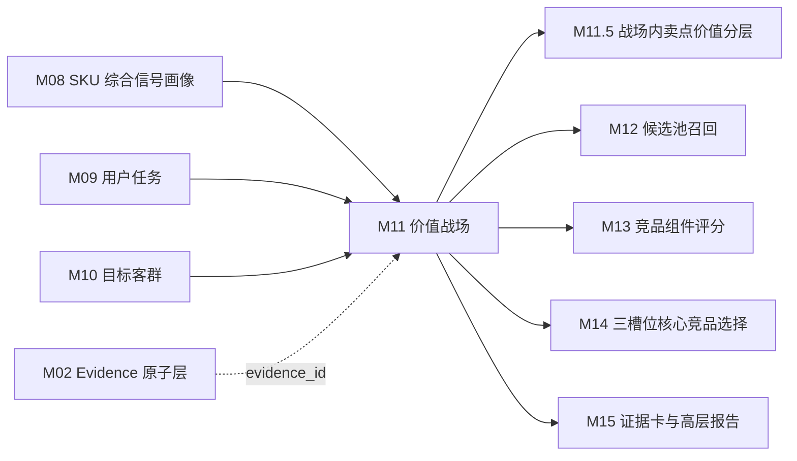

# M11 价值战场模块 SOP 需求

## 0. 单模块强化状态

本文件已按“单模块逐一强化”要求完成第一轮强化。下一步应处理 M11.5 战场内卖点价值分层模块。

## 1. 模块目标

M11 基于 M08 SKU 综合信号画像、M09 用户任务、M10 目标客群、M06 评论战场支撑信号和 M07 市场画像，判断每个 SKU 参与哪些价值战场，并输出主战场、次战场、机会战场、弱战场、置信度和证据拆解。

价值战场不是卖点列表、不是任务列表、也不是客群标签。价值战场是后续竞品识别的比较语境：系统不是在全市场找“最像的电视”，而是在目标 SKU 真正参与竞争的价值场景中寻找最有业务意义的核心竞品。

M11 要回答五个问题：

1. 该 SKU 主要在哪些价值维度上参与竞争？
2. 这些战场是由任务、客群、卖点参数、评论还是市场验证共同支撑？
3. 哪些战场只是能力具备但市场或用户感知不足？
4. 哪些战场只适合做机会或弱参考，不应作为核心竞品筛选主线？
5. 这些战场如何传递给 M11.5、M12、M13、M14 和 M15？

M11 的输出用于展示页七步推导中的“④ 价值战场判定”。页面主文案要用业务语言说明“为什么按这些战场找竞品”，不展示完整公式、JSON 或内部字段名。

## 2. 设计依据

本模块依据：

- `cankao/CatForge_竞品生成SOP_详细指导_v1.md` 的 M11 要求。
- `cankao/catforge_sop_md/modules/M11_价值战场模块.md`。
- `cankao/CatForge_核心竞品展示页_UI设计规范_v1.md` 中“价值战场卡片”和七步推导展示要求。
- M06 已强化后的 `battlefield_support`、`pain_point`、`price_perception`、`service_signal` 边界。
- M08 已强化后的 SKU 综合信号画像和下游特征边界。
- M09 已强化后的用户任务结果。
- M10 已强化后的目标客群结果。
- `apps/api-server/app/rules/tv_core3_mvp_seed_v0_2.json` 中真实可用的 TV 价值战场种子库。
- [00 真实样例数据基线](00_real_data_baseline.md)。
- 数据分层原则：M11 默认消费 M08/M09/M10 上游产物，不直接读取原始表做业务判断。

## 3. 上游输入

### 3.1 必须输入

| 输入 | 来源 | 用途 |
| --- | --- | --- |
| `core3_sku_signal_profile` | M08 | SKU 统一画像，提供参数、卖点、评论、市场、风险和完整度摘要 |
| `core3_sku_downstream_feature_view` | M08 | `for_module=M11` 的战场特征视图 |
| `core3_sku_signal_evidence_matrix` | M08 | 判断战场相关证据覆盖和置信度 |
| `core3_sku_task_score` | M09 | 用户任务得分、关系等级和复核状态 |
| `core3_sku_task_evidence_breakdown` | M09 | 任务证据拆分 |
| `core3_sku_target_group_score` | M10 | 目标客群得分、关系等级和复核状态 |
| `core3_sku_target_group_evidence_breakdown` | M10 | 客群证据拆分 |
| `core3_evidence_atom` | M02 | 通过 evidence_id 回溯证据来源 |
| `battlefields` seed | 标准战场库 | 战场定义、映射任务、卖点、参数、评论主题、市场权重和阈值 |

### 3.2 从 M08 消费的画像特征

M11 不重新抽取参数、卖点、评论和市场指标，只通过 M08 统一入口消费。

| 特征域 | M08 字段或视图内容 | M11 用途 |
| --- | --- | --- |
| SKU 主数据 | `sku_code`、`model_name`、`brand_name`、`size_segment`、`price_band`、`main_platform` | 战场适配和业务解释 |
| 参数画像 | `core_params_json`、`param_profile_json` | 判断战场能力基础，例如 Mini LED、亮度、分区、高刷、HDMI、护眼、语音 |
| 卖点画像 | `claim_activation_summary_json`、`claim_evidence_breakdown_json` | 判断战场核心价值表达和卖点组合 |
| 评论战场支撑 | `comment_signal_summary_json.battlefield_support` | 判断用户是否感知到该战场价值 |
| 评论痛点风险 | `comment_signal_summary_json.pain_point` | 判断战场削弱和风险 |
| 价格感知 | `comment_signal_summary_json.price_perception` | 支撑大屏性价比、价格挤压等战场 |
| 服务信号 | `comment_signal_summary_json.service_signal` | 支撑服务保障、家居美学战场，不替代产品核心战场 |
| 市场画像 | `market_summary_json` | 判断价格位置、销量、销额、渠道和趋势 |
| 可比池 | `comparable_pool_summary_json` | 判断同尺寸、同价位、相邻尺寸池的战场竞争密度 |
| 风险缺失 | `missing_signals_json`、`risk_signals_json`、`domain_completeness_json` | 降低置信度或触发复核 |
| 证据索引 | `evidence_ids`、`profile_hash` | 追溯和增量重算 |

### 3.3 从 M09/M10 消费的推导结果

| 输入 | 用途 | 边界 |
| --- | --- | --- |
| M09 主/次任务 | 形成战场任务支撑 | 任务不直接等于战场 |
| M09 任务证据 | 回溯能力、评论和市场来源 | 不重新计算任务分 |
| M10 主/次客群 | 判断战场人群适配 | 客群不直接等于战场 |
| M10 客群证据 | 回溯购买人群、价格渠道和市场来源 | 不重新计算客群分 |
| M09/M10 复核状态 | 降低战场置信度或封顶 | 不能忽略上游风险 |

### 3.4 明确不直接消费

| 数据 | 处理 |
| --- | --- |
| 原始 `week_sales_data`、`attribute_data`、`selling_points_data`、`comment_data` | 不直接读取 |
| M03/M04b/M06/M07 散表 | 不直接读取业务字段，调试可通过 M08 evidence 回溯 |
| M11.5 卖点价值分层结果 | M11 是 M11.5 上游 |
| M12-M15 竞品和报告结果 | M11 是它们的上游 |

## 4. 本模块不做什么

- 不把卖点 code 直接等同战场结论。
- 不把任务或客群默认映射直接等同战场结论。
- 不从原始评论直接打战场标签。
- 不做战场内卖点价值分层，M11.5 负责。
- 不召回竞品，M12 负责。
- 不计算竞品组件分，M13 负责。
- 不选择三槽位竞品，M14 负责。
- 不生成最终展示报告，M15 负责。
- 不输出完整公式、SQL、JSON 或模型过程给高层页面。

## 5. 预制与抽取边界

### 5.1 预制内容

M11 允许预制“战场本体和规则骨架”，不允许预制 SKU 战场结论。

| 预制项 | 内容 | 来源 | 是否可直接成为结论 |
| --- | --- | --- | --- |
| 战场 code 与中文名 | 10 个 MVP 价值战场 | seed | 否 |
| 战场定义 | 业务定义、别名、关键词 | seed | 否 |
| 核心任务 | `core_task_codes`、`mapped_task_codes` | seed | 否 |
| 核心卖点 | `core_claim_codes`、`mapped_claim_codes` | seed | 否 |
| 核心参数 | `core_param_codes`、`mapped_param_codes` | seed | 否 |
| 评论主题 | `comment_topic_codes`、`mapped_topic_codes` | seed | 否 |
| 必需信号规则 | `required_signal_rule` | seed | 否 |
| 语义/市场权重 | `semantic_market_weights` | seed | 否 |
| 市场信号规则 | `market_score_rule.signals` | seed | 否 |
| 进入阈值 | `entry_thresholds` | seed | 否 |

战场 seed 需要版本化，例如 `battlefield_seed_version=tv_core3_mvp_seed_v0_2`。seed 变化必须触发 M11 重算。

### 5.2 从真实数据推导的内容

每个 SKU 的战场关系必须从上游真实数据推导：

| 推导内容 | 生成方式 |
| --- | --- |
| 任务支撑 | 用 M09 任务得分匹配 seed 战场核心任务 |
| 客群支撑 | 用 M10 客群得分匹配 seed 相关客群和战场提示 |
| 参数能力 | 用 M08 参数画像匹配 seed 战场核心参数 |
| 卖点组合 | 用 M08 最终卖点激活匹配 seed 战场核心卖点 |
| 评论验证 | 用 M06 经 M08 汇总的 `battlefield_support` 和相关主题判断用户感知 |
| 痛点削弱 | 用 M06 经 M08 汇总的 `pain_point` 判断战场风险 |
| 市场验证 | 用 M07 经 M08 汇总的价格、销量、销额、渠道、趋势、可比池判断战场强弱 |
| 战场解释 | 用中文说明该战场为什么是主、次、机会或弱 |

## 6. MVP 价值战场库

MVP 必须对齐真实 seed 中的 10 个价值战场。战场名称用于业务展示，战场 code 只用于内部契约。

| 战场 code | 业务名称 | 战场定义 | 典型支撑信号 |
| --- | --- | --- | --- |
| `BF_PREMIUM_PICTURE` | 高端画质战场 | 围绕 Mini LED/OLED、高亮、控光、色彩和高端价格支撑展开竞争 | 高端画质任务、Mini LED、亮度、分区、画质评论、高端价格带 |
| `BF_FAMILY_VIEWING_UPGRADE` | 家庭观影升级战场 | 围绕客厅大屏、HDR、音效和全家观影体验展开竞争 | 客厅观影任务、大屏换新、85 寸、画质/音效/尺寸评论 |
| `BF_GAMING_SPORTS` | 游戏体育战场 | 围绕高刷、低延迟、HDMI2.1、VRR 和体育运动流畅体验展开竞争 | 游戏/体育任务、高刷、HDMI2.1、看球或游戏评论 |
| `BF_LARGE_SCREEN_VALUE` | 大屏性价比战场 | 围绕大尺寸、价格/英寸、销量和价值感展开竞争 | 大屏换新、性价比任务、价格每英寸、销量、价格评论 |
| `BF_FAMILY_EYE_CARE` | 家庭护眼战场 | 围绕儿童、家庭长期观看、护眼参数和舒适评论展开竞争 | 儿童护眼任务、护眼参数、孩子/护眼评论 |
| `BF_SENIOR_EASE_OF_USE` | 长辈易用战场 | 围绕语音、适老、简洁系统、少广告和长辈评论展开竞争 | 长辈易用任务、语音、长辈评论、系统易用 |
| `BF_SMART_SYSTEM_EXPERIENCE` | 智能系统体验战场 | 围绕系统流畅、语音、内存、广告风险和智能体验展开竞争 | 语音、内存、AI、系统评论、广告风险 |
| `BF_CINEMA_AUDIO_IMMERSION` | 影院音效战场 | 围绕音响功率、杜比、环绕、低音和沉浸影院感展开竞争 | 音响参数、杜比卖点、音质评论、客厅影院任务 |
| `BF_DESIGN_HOME_FIT` | 家居美学战场 | 围绕外观、超薄、尺寸适配、装修搭配和安装体验展开竞争 | 新家装修任务、外观/挂装/尺寸评论、安装服务 |
| `BF_SERVICE_ASSURANCE` | 服务保障战场 | 围绕安装、送货、售后、做工质量和服务风险展开竞争 | 安装售后评论、服务保障卖点、服务风险 |

`BF_SERVICE_ASSURANCE` 是服务侧战场，不能替代产品核心战场；它可用于报告风险提示或服务保障对比，但默认不作为正面对打竞品召回主线，除非业务明确关注服务竞争。

## 7. 处理流程

### 7.1 加载战场特征

对每个 SKU 读取：

- M08 `core3_sku_downstream_feature_view` 中 `for_module=M11` 的战场特征包。
- M09 `core3_sku_task_score` 和任务证据拆解。
- M10 `core3_sku_target_group_score` 和客群证据拆解。
- seed `battlefields` 定义。

如果 M08 未提供 M11 特征视图，或 M09/M10 关键结果缺失，M11 不应绕过上游直接拼散表，应输出复核问题。

### 7.2 生成战场候选

对每个 SKU 和每个 seed 战场分别判断是否进入候选。

进入候选的条件满足任一即可：

| 触发来源 | 候选条件 |
| --- | --- |
| 任务触发 | M09 命中战场 `core_task_codes`，且任务不是 `insufficient` |
| 客群触发 | M10 命中与战场相关的目标客群，且客群不是 `insufficient` |
| 卖点触发 | M08 最终卖点命中战场 `core_claim_codes` |
| 参数触发 | M08 参数画像命中战场 `core_param_codes`，且不是 unknown |
| 评论触发 | M08 `battlefield_support` 命中战场主题 |
| 市场触发 | M08 市场画像命中战场 `market_score_rule.signals` |

候选只代表“该战场可能相关”，不能直接进入主战场。候选记录必须保留 `candidate_reason_cn`。

### 7.3 计算语义分

`semantic_score` 衡量 SKU 在该战场的业务语义是否成立。

建议首版：

```text
semantic_score =
  core_task_score * 0.30
  + target_group_score * 0.15
  + core_claim_combo_score * 0.25
  + core_param_capability_score * 0.20
  + comment_support_score * 0.10
```

规则：

- 任务来自 M09，主任务强支撑，次任务中支撑，弱任务只作弱支撑。
- 客群来自 M10，主客群强支撑，弱客群不能单独形成高分战场。
- 卖点组合来自 M04b 经 M08 汇总后的最终卖点激活，结构化卖点缺失不能伪造。
- 参数能力来自 M03 经 M08 汇总后的标准参数，unknown 不能当 false。
- 评论支撑来自 M06 经 M08 汇总后的 `battlefield_support`，不能直接读原始评论。
- 评论痛点风险需要进入扣分或复核，例如画质差、音质差、安装差。

战场语义不是单项命中。例如高刷参数可触发游戏体育战场候选，但缺少游戏/体育任务、卖点或评论时不能直接成为主战场。

### 7.4 计算市场分

`market_score` 衡量 SKU 在该战场下是否有真实市场验证。

建议首版：

```text
market_score =
  price_position_fit * 0.25
  + sales_validation_score * 0.25
  + sales_amount_validation_score * 0.15
  + channel_fit_score * 0.10
  + trend_signal_score * 0.10
  + comparable_pool_strength * 0.15
```

规则：

- 当前真实样例为 26W01-26W23 周维度数据，不能写成 12 个月口径。
- 当前只有线上渠道，不能生成线下战场结论。
- 当前全量样例均为海信，M11 不做品牌内外过滤。
- 大屏性价比战场必须看价格每英寸、价格分位、销量和促销趋势。
- 高端画质战场必须看高端价格带是否有销额或销量支撑。
- 家庭观影升级战场必须看大尺寸池和同价位池的表现。
- 市场样本不足不否定战场，但不能作为高置信主战场。

### 7.5 计算最终战场分

使用 seed 的 `semantic_market_weights` 作为默认权重。

```text
raw_battlefield_score =
  semantic_score * seed.semantic_weight
  + market_score * seed.market_weight

battlefield_score = clamp(raw_battlefield_score - risk_penalty, 0, 1)
```

如果 seed 未覆盖某一特殊战场权重，使用默认：

- 产品能力型战场：语义 0.70，市场 0.30。
- 价格效率型战场：语义 0.55，市场 0.45。
- 服务保障型战场：语义 0.80，市场 0.20。

### 7.6 关系等级判定

关系等级建议：

| 等级 | 建议阈值 | 证据要求 | 用于后续 |
| --- | --- | --- | --- |
| `main` | `battlefield_score >= 0.75` | 语义和市场均有效，且至少 3 类证据支撑 | M12/M13/M14 核心筛选主线 |
| `secondary` | `0.60 <= battlefield_score < 0.75` | 语义强但市场中等，或市场强但语义仍成立 | 可作为正面对打或高端标杆辅助 |
| `opportunity` | `0.45 <= battlefield_score < 0.60` | 有能力或市场机会，但证据不完整 | 价格挤压、机会监控或报告提示 |
| `weak` | `0.35 <= battlefield_score < 0.45` | 有线索但不足以形成竞品主线 | 不作为核心筛选主线 |
| `insufficient` | `< 0.35` | 证据不足 | 不进入后续召回主条件 |

封顶规则：

- 没有市场支撑：最高 `secondary`，不能作为高置信主战场。
- 仅评论命中：最高 `weak`。
- 仅 seed 映射命中：不能输出结论，必须有真实任务、卖点、参数、评论或市场信号。
- 仅服务信号命中：只能支撑 `BF_SERVICE_ASSURANCE` 或 `BF_DESIGN_HOME_FIT`，不能替代画质、游戏、体育等产品核心战场。
- 结构化卖点缺失：不否定战场，但降低 `core_claim_combo_score` 和 `confidence`。
- 关键参数冲突：相关战场进入复核，最高 `secondary`。
- M09/M10 上游结果处于复核状态：相关战场继承复核原因，最高 `secondary`。
- 可比池不足：不能输出高置信主战场。

### 7.7 生成竞品筛选作用

每个 `main`、`secondary`、`opportunity` 战场都要输出“竞品选择作用”，供 M12/M14/M15 使用。

示例：

| 战场 | 竞品选择作用 |
| --- | --- |
| 高端画质战场 | 找正面对打竞品和高端标杆/潜在下探竞品 |
| 家庭观影升级战场 | 找同尺寸、同价位、同家庭观影任务的直接竞争 SKU |
| 游戏体育战场 | 找高刷、HDMI、游戏/运动流畅体验相近的候选 |
| 大屏性价比战场 | 找价格/销量挤压竞品，判断价格防守边界 |
| 家庭护眼战场 | 仅在护眼证据充分时作为家庭用户筛选辅助 |
| 服务保障战场 | 默认作为风险和服务对比，不作为产品竞品主线 |

### 7.8 生成业务解释

每个 `main`、`secondary`、`opportunity`、`weak` 战场都要生成中文业务解释。

解释模板：

```text
系统判断该 SKU 参与「{战场名称}」，关系为「{关系等级}」：
任务基础：{来自 M09 的任务支撑}
目标人群：{来自 M10 的客群支撑}
产品价值：{参数和卖点组合}
用户感知：{评论战场支撑或痛点风险}
市场验证：{价格、销量、销额、渠道、可比池}
竞品选择作用：{为什么这个战场会影响后续竞品选择}
待复核点：{缺失、冲突、样本不足}
```

面向高层页面时，只展示结论、依据和竞品选择作用，不展示内部公式。

## 8. 输出数据契约

### 8.1 `core3_sku_battlefield_candidate`

记录战场候选生成阶段，便于复核“为什么进入候选但未成为主战场”。

| 字段 | 说明 |
| --- | --- |
| `project_id` | 项目 |
| `category_code` | 品类，MVP 为 `TV` |
| `batch_id` | 批次 |
| `sku_code` | SKU |
| `battlefield_code` | 战场 code |
| `battlefield_name_cn` | 战场中文名 |
| `candidate_source_json` | 任务、客群、卖点、参数、评论、市场触发来源 |
| `candidate_reason_cn` | 候选原因中文摘要 |
| `candidate_status` | active/rejected/review_required |
| `missing_signals_json` | 缺失信号 |
| `risk_flags_json` | 风险 |
| `evidence_ids` | 候选 evidence |
| `profile_hash` | M08 画像 hash |
| `task_score_version` | M09 任务结果版本 |
| `target_group_score_version` | M10 客群结果版本 |
| `battlefield_seed_version` | 战场库版本 |
| `rule_version` | 规则版本 |
| `created_at` | 创建时间 |
| `updated_at` | 更新时间 |

### 8.2 `core3_sku_battlefield_score`

记录战场评分和关系等级，是 M11.5-M15 的主输入。

| 字段 | 说明 |
| --- | --- |
| `project_id` | 项目 |
| `category_code` | 品类 |
| `batch_id` | 批次 |
| `sku_code` | SKU |
| `model_name` | 型号 |
| `brand_name` | 品牌 |
| `battlefield_code` | 战场 code |
| `battlefield_name_cn` | 战场中文名 |
| `battlefield_definition_cn` | 战场定义 |
| `semantic_score` | 语义分 |
| `market_score` | 市场分 |
| `core_task_score` | 核心任务分 |
| `target_group_score` | 客群支撑分 |
| `core_claim_combo_score` | 核心卖点组合分 |
| `core_param_capability_score` | 参数能力分 |
| `comment_support_score` | 评论战场支撑分 |
| `pain_point_risk_score` | 痛点风险分 |
| `price_position_score` | 价格位置分 |
| `sales_validation_score` | 销量验证分 |
| `sales_amount_validation_score` | 销额验证分 |
| `channel_fit_score` | 渠道适配分 |
| `trend_signal_score` | 趋势分 |
| `comparable_pool_strength` | 可比池强度 |
| `risk_penalty` | 风险扣分 |
| `battlefield_score` | 最终战场分 |
| `relation_level` | main/secondary/opportunity/weak/insufficient |
| `confidence` | 置信度 |
| `sample_sufficiency` | 样本充分性 |
| `competitor_selection_role_cn` | 对后续竞品选择的作用 |
| `business_reason_cn` | 中文业务解释 |
| `missing_signals_json` | 缺失信号 |
| `risk_flags_json` | 风险 |
| `review_required` | 是否需要复核 |
| `review_reason` | 复核原因 |
| `evidence_ids` | 核心 evidence |
| `profile_hash` | M08 画像 hash |
| `task_score_version` | M09 任务结果版本 |
| `target_group_score_version` | M10 客群结果版本 |
| `battlefield_seed_version` | 战场库版本 |
| `rule_version` | 规则版本 |
| `created_at` | 创建时间 |
| `updated_at` | 更新时间 |

### 8.3 `core3_sku_battlefield_evidence_breakdown`

记录战场得分拆解，供 M11.5、M15 证据卡和技术详情使用。

| 字段 | 说明 |
| --- | --- |
| `project_id` | 项目 |
| `category_code` | 品类 |
| `batch_id` | 批次 |
| `sku_code` | SKU |
| `battlefield_code` | 战场 code |
| `evidence_domain` | task/target_group/claim/param/comment/market/risk/service |
| `support_level` | strong/medium/weak/missing/conflict |
| `support_score` | 分域得分 |
| `support_summary_cn` | 中文证据摘要 |
| `source_signal_codes_json` | 来源任务、客群、卖点、参数、评论主题或市场信号 |
| `representative_evidence_ids` | 代表证据 |
| `confidence` | 分域置信度 |
| `created_at` | 创建时间 |

### 8.4 `core3_sku_battlefield_portfolio`

记录 SKU 的战场组合摘要，供 M12/M14/M15 快速消费。

| 字段 | 说明 |
| --- | --- |
| `project_id` | 项目 |
| `category_code` | 品类 |
| `batch_id` | 批次 |
| `sku_code` | SKU |
| `main_battlefields_json` | 主战场列表 |
| `secondary_battlefields_json` | 次战场列表 |
| `opportunity_battlefields_json` | 机会战场列表 |
| `weak_battlefields_json` | 弱战场列表 |
| `primary_competitor_search_context_cn` | 竞品筛选主语境中文摘要 |
| `portfolio_confidence` | 组合置信度 |
| `portfolio_risk_flags_json` | 组合风险 |
| `evidence_ids` | 核心 evidence |
| `profile_hash` | M08 画像 hash |
| `battlefield_seed_version` | 战场库版本 |
| `rule_version` | 规则版本 |
| `created_at` | 创建时间 |

### 8.5 `core3_sku_battlefield_review_issue`

记录需要业务或数据复核的问题。

| 字段 | 说明 |
| --- | --- |
| `project_id` | 项目 |
| `category_code` | 品类 |
| `batch_id` | 批次 |
| `sku_code` | SKU |
| `battlefield_code` | 战场 code，可为空表示 SKU 级问题 |
| `issue_type` | missing_feature/only_comment/only_service/market_missing/claim_missing/param_conflict/upstream_review/seed_gap |
| `issue_level` | warning/blocker |
| `issue_message_cn` | 中文问题说明 |
| `evidence_ids` | 相关证据 |
| `resolved_status` | open/resolved/ignored |
| `created_at` | 创建时间 |

## 9. 质量规则

| 规则 | 要求 |
| --- | --- |
| 战场不是标签 | 任务、客群、卖点、评论任一单域都不能直接生成高置信战场 |
| 语义和市场并重 | 主战场必须同时有语义支撑和市场验证 |
| 评论去重 | 评论战场支撑必须使用 M05/M06 去重和有效句口径 |
| 卖点缺失不伪造 | 结构化卖点缺失要表达为缺失，不得补写宣传证据 |
| unknown 不当 false | 参数缺失降低置信度，不生成负向结论 |
| 服务边界 | 服务保障不能替代产品核心战场 |
| 可比池约束 | 主战场和机会战场都要说明可比池样本状态 |
| 同品牌不排除 | 当前样例都是海信，M11 不做品牌过滤 |
| 线上渠道边界 | 当前样例只有线上渠道，不生成线下战场判断 |
| 版本追溯 | 输出必须包含 `battlefield_seed_version`、`rule_version`、`profile_hash` |
| 业务语言 | 面向 M15 的解释必须是中文业务语言，不暴露内部英文 token |

## 10. 复核触发条件

以下情况需要进入 `core3_sku_battlefield_review_issue`：

- M08 未生成 M11 特征视图。
- M09 任务结果缺失或相关任务处于复核状态。
- M10 客群结果缺失或相关客群处于复核状态。
- 战场只由评论命中且得分接近 `secondary` 阈值。
- 战场只由服务/安装评论命中。
- 语义分高但市场分缺失或样本不足。
- 市场分高但任务、卖点、参数和评论语义不足。
- 结构化卖点缺失但战场高度依赖卖点表达。
- 关键参数缺失或口径冲突，例如刷新率、HDMI、亮度、分区、护眼、语音。
- 服务保障战场被作为产品核心战场使用。
- 高频真实战场模式无法映射到现有 10 个 seed 战场。

## 11. 85E7Q 样例要求

85E7Q 的 M11 输出必须体现真实数据约束：85 寸、高端画质参数强、评论多、市场有、结构化卖点缺失。

| 战场 | 预期判断方式 | 注意点 |
| --- | --- | --- |
| 高端画质战场 | Mini LED、5200 亮度、3500 分区、高端画质任务、画质影音用户、画质评论和高端价格带共同支撑 | 结构化卖点缺失不能伪造，应降低卖点组合置信度但不否定参数能力 |
| 家庭观影升级战场 | 85 寸、客厅影院观影、大屏换新、家庭换新用户、画质/尺寸评论和市场表现共同支撑 | 音效证据不足时不能把影院音效写成强证据 |
| 游戏体育战场 | 高刷、HDMI2.1、游戏/体育任务或看球评论可支撑 | 要区分游戏与体育，缺低延迟或游戏评论时不应作为主战场 |
| 大屏性价比战场 | 85 寸、价格每英寸、销量、价格感知和大屏换新任务支撑 | 如果价格不低或销量验证不足，只能是机会或弱战场 |
| 家庭护眼战场 | 护眼参数、儿童护眼任务、儿童/护眼评论支撑 | 无明确护眼或儿童信号时不高分 |
| 长辈易用战场 | 长辈易用任务、语音、长辈评论和系统易用支撑 | 无明确爸妈/老人线索时不高分 |
| 智能系统体验战场 | 4GB/64GB、星海大模型、语音/系统评论支撑 | 仅参数存在但评论缺失时不应高置信 |
| 影院音效战场 | 音响功率、杜比/音效卖点和音质评论支撑 | 音效证据不足时最多弱或机会 |
| 家居美学战场 | 新家装修任务、尺寸空间、外观、挂装和安装评论支撑 | 服务安装不能替代外观和装修适配 |
| 服务保障战场 | 安装、送货、售后评论和服务保障卖点支撑 | 作为服务侧风险/保障对比，不替代产品核心战场 |

M11 不需要在需求阶段给出 85E7Q 最终战场排名，但开发验收时必须解释每个主/次/机会/弱战场的证据和被压低原因。

## 12. 与其他模块关系



下游消费边界：

| 下游模块 | 使用 M11 内容 | 边界 |
| --- | --- | --- |
| M11.5 卖点价值分层 | 主/次/机会战场和战场证据 | M11.5 在战场内判断卖点价值层级，不反向修改 M11 |
| M12 候选召回 | 主/次战场作为召回主条件，机会战场作为扩展条件 | 不按弱战场召回核心候选 |
| M13 组件评分 | 战场相似度、战场强弱、市场验证 | 战场相似只是组件之一，还要看价格、渠道、参数、任务 |
| M14 三槽位选择 | 战场组合和竞品选择作用 | 三槽位不是简单取战场得分最高 |
| M15 报告 | 中文战场解释和代表证据 | 页面不展示内部 code、公式、JSON |
| M16 增量编排 | `profile_hash`、`battlefield_seed_version`、复核问题 | 画像、任务、客群或规则变化才重算 |

## 13. 增量重算要求

| 变化来源 | M11 动作 | 下游影响 |
| --- | --- | --- |
| M08 `profile_hash` 变化 | 重算参数、卖点、评论、市场相关战场分 | M11-M16 |
| M09 任务结果变化 | 重算对应 SKU 战场任务支撑 | M11-M16 |
| M10 客群结果变化 | 重算对应 SKU 战场客群支撑 | M11-M16 |
| M08 证据矩阵变化 | 更新证据拆解和置信度 | M11.5-M15 |
| battlefield seed 变化 | 按 `battlefield_seed_version` 重算受影响战场 | M11-M16 |
| 评分规则变化 | 按 `rule_version` 重算战场分和等级 | M11-M16 |
| M02 evidence 状态变化 | 更新代表证据和复核状态 | M15/M16 |

增量运行时需要保留历史版本，不覆盖原结论；新结果以 `batch_id + profile_hash + task_score_version + target_group_score_version + battlefield_seed_version + rule_version` 区分。

## 14. 验收标准

| 验收项 | 标准 |
| --- | --- |
| 战场库对齐 seed | 必须覆盖 10 个 MVP 战场，不使用临时战场名 |
| 只消费上游产物 | 默认不直接读取原始表或散表 |
| 候选与得分分离 | 必须有候选记录和最终战场分 |
| 任务/客群不是直接映射 | 只能触发候选或支撑分，不能直接成为结论 |
| 语义分和市场分分离 | 必须分别保存并可解释 |
| 主战场必须有市场验证 | 没有市场支撑不能高置信主战场 |
| 评论不能单独高置信 | 仅评论命中最高 weak |
| 服务不能替代产品战场 | 服务信号只支撑服务保障或家居服务侧面 |
| 结构化卖点缺失可表达 | 缺失降低置信度，不伪造宣传证据 |
| 85E7Q 可解释 | 能说明高端画质、家庭观影、游戏体育、大屏性价比等战场的证据和缺口 |
| 下游可消费 | M11.5/M12/M13/M14/M15 不需要重新拼战场证据 |
| 高层页可展示 | `business_reason_cn` 和 `competitor_selection_role_cn` 能转成业务语言 |
| 增量可重算 | `profile_hash`、`task_score_version`、`target_group_score_version`、`battlefield_seed_version`、`rule_version` 可驱动增量 |
