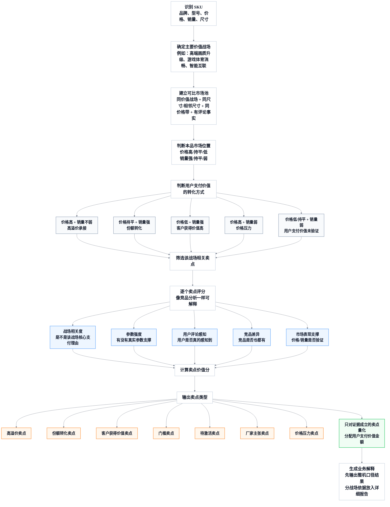

# M12C 用户卖点支付价值分析需求

## 1. 模块定位

M12C 是新版事实层之后的独立业务分析模块，用来回答“用户为什么愿意为某个 SKU 的某些卖点付费，哪些卖点真正形成高溢价、份额转化或价格压力”。

M12C 不再作为竞品分析报告里的附属章节。它应该能被 CLI、Skill 和小奥家电市场分析专家独立调用，回答以下问题：

- 某 SKU 的用户卖点价值有哪些？
- 某 SKU 哪些卖点能支撑高溢价？
- 某 SKU 哪些卖点只是门槛，有了不加价但缺了会掉队？
- 某 SKU 在某个价值战场里，哪些卖点被用户认可？
- 某 SKU 和竞品相比，哪些卖点是本品优势、竞品拦截点或价格压力点？

M12C 的核心产出是“可解释的用户支付价值判断”，不是严格因果归因。业务表达必须使用“支撑、验证、可解释、观察到、在可比市场中形成优势”等措辞，不得写成“某卖点单独导致涨价 X 元或增加销量 Y 台”。

## 2. 上游输入

M12C 承接当前新版链路中的事实和语义画像：

| 输入 | 用途 |
| --- | --- |
| M03B SKU 参数事实画像 | 判断卖点是否有真实参数支撑，识别参数强弱和档位 |
| M04C SKU 卖点事实画像 | 获取本 SKU 已成立的标准卖点和厂家表达 |
| M05C SKU 评论事实画像 | 判断用户是否真实感知、认可或负向反馈该卖点 |
| M07 SKU 市场画像 | 获取价格、销量、销额、尺寸档、价格带、渠道等市场事实 |
| M09C 用户任务画像 | 判断卖点服务的用户使用目的 |
| M10C 目标客群画像 | 判断卖点服务的目标用户 |
| M11C 价值战场画像 | 判断 SKU 在哪些价值战场中竞争 |
| M11D 语义市场图谱 | 获取战场、任务、客群的市场空间和销量分配权重 |

如果目标 SKU 缺少评论事实，可以输出“用户评论验证不足”的降级结果，但不得强判高溢价卖点。

## 3. 核心业务定义

| 术语 | 定义 |
| --- | --- |
| 用户卖点支付价值 | 用户因为某卖点愿意多付钱，或在同价/低价时更愿意选择该产品的可观测价值 |
| 高溢价卖点 | 价格高于可比池，销量不弱，且卖点有参数、评论和语义场景支撑 |
| 份额转化卖点 | 价格没有明显更高，但该卖点支撑更强销量、销额或市场份额 |
| 客户获得价值卖点 | 卖点强、用户认可，但价格没有完全收取，形成“更值”的选择理由 |
| 门槛卖点 | 同池大多数产品都具备，缺了会掉队，有了不单独加价 |
| 待激活卖点 | 参数或卖点事实强，但评论、表达或市场验证不足，尚未转化为溢价或份额 |
| 厂家主张卖点 | 主要来自宣传表达，缺少参数、评论或市场验证 |
| 价格压力卖点 | 被用来支撑高价，但销量或用户评论没有验证，可能削弱转化 |
| 竞品拦截卖点 | 竞品在同一购买池中具备并获得市场验证，而本品缺失、弱表达或弱感知 |

## 4. 分析对象

M12C 默认分析当前 SKU 在 M04C 中已经识别的标准卖点。它不从竞品或高价产品组合中直接倒推本品卖点。

每个卖点都要形成一条独立分析单元：

```text
SKU 卖点分析单元
= 本 SKU 已成立标准卖点
+ 参数显示明显支持但卖点表达弱的关键能力
- 服务履约、物流安装、售后等非产品卖点
```

宽泛卖点必须下钻到参数再判断。例如：

| 宽泛卖点 | 必须下钻的参数或事实 |
| --- | --- |
| 高端画质 | 背光/面板类型、亮度、控光分区、色域、HDR、画质芯片 |
| 性能强 | 芯片型号、内存、存储、系统流畅度、AI 画质能力 |
| 游戏体验 | 刷新率、HDMI2.1、VRR/ALLM、低延迟、芯片 |
| 智能互联 | 语音、投屏、IoT 联动、WiFi、摄像头、AI 能力 |
| 护眼舒适 | 护眼认证、低蓝光、无频闪、亮度调节、长看评论 |

如果某卖点宣传覆盖低，但参数事实显示同池普遍具备，例如 HDMI2.1 在 65 寸高价池大多数 SKU 都有，则不能因为“宣传少”误判为人无我有的强溢价卖点。

## 5. 总体计算路径

M12C 采用“先单战场、后 SKU 汇总”的路径。



图只表达分析顺序，不能替代业务解释。报告和 Skill 必须在图下方紧跟两张解释表，让读者清楚每个分支和每个卖点类型的含义。

### 5.1 图中“用户支付价值转化方式”解释

| 图中分支 | 业务含义 | 报告应如何表达 |
| --- | --- | --- |
| 价格高 + 销量不弱，高溢价承接 | 本品价格高于可比池，同时销量没有明显受损，说明用户愿意为相关价值付费 | “该卖点具备高溢价承接条件，可解释本品部分高价空间” |
| 价格持平 + 销量强，份额转化 | 本品没有明显卖贵，但凭借该卖点获得更强选择率、销量或销额 | “该卖点主要转化为市场份额和销量，而不是价格溢价” |
| 价格低 + 销量强，客户获得价值高 | 本品具备较强卖点，但价格没有完全收取，用户感到更值 | “该卖点提高了用户获得价值，是本品性价比或价值感的来源” |
| 价格高 + 销量弱，价格压力 | 本品价格已经上探，但卖点、评论或市场表现没有承接 | “该卖点暂不能支撑当前高价，存在价格压力或表达不足” |
| 价格低/持平 + 销量弱，用户支付价值未验证 | 卖点没有带来明显价格或销量结果 | “该卖点当前缺少市场验证，只能作为待验证或厂家主张” |

### 5.2 图中“卖点类型”解释

| 卖点类型 | 业务定义 | 典型判定条件 | 报告展示方式 |
| --- | --- | --- | --- |
| 高溢价卖点 | 用户愿意为该卖点支付更高价格，并且市场销量没有明显反证 | 价格高于可比池、销量不弱、卖点价值分高、参数/评论/竞品差异成立 | 展示整机口径可解释金额，说明主要成立场景和证据 |
| 份额转化卖点 | 该卖点不一定抬高价格，但能提升选择率、销量或销额 | 价格接近可比池、销量或销额强、用户任务和评论支撑明确 | 展示可解释销量/销额贡献，不写成价格溢价 |
| 客户获得价值卖点 | 用户感知价值高于实际价格，形成“更值”的购买理由 | 价格低于可比池、销量强、参数或评论证据强 | 展示为价值感/性价比来源，说明企业尚未完全收进价格 |
| 门槛卖点 | 进入该市场池必须具备的基础能力，有了不加价，缺了会掉队 | 同池覆盖高、对照组不足、价格差异不稳定 | 明确写成门槛，不进入高溢价 Top |
| 待激活卖点 | 产品事实或参数强，但用户感知、表达或市场验证不足 | 参数强但评论弱、样本弱、导购表达不足或战场验证不足 | 展示为可培育机会，说明需要补评论、表达或渠道教育 |
| 厂家主张卖点 | 主要是厂家宣传，缺少参数、评论和市场验证 | 只有卖点文本，缺少硬参数、用户评论或可比池支持 | 展示为待验证主张，不分配用户支付价值金额 |
| 竞品拦截卖点 | 竞品用该卖点改变用户对本品价值判断，本品缺失或弱 | 直接竞品具备且市场表现好，本品缺失、参数弱或评论弱 | 展示为防守风险或补强方向 |
| 价格压力卖点 | 本品用该卖点支撑高价，但用户和市场没有承接 | 价格高、销量弱、评论弱或竞品更强 | 展示为价格风险，不得写成高溢价卖点 |

默认问题“某 SKU 的用户卖点价值有哪些”应计算主价值战场和辅价值战场。机会战场、厂家主张战场、拖后腿战场不进入正向总额，只作为机会或风险说明。

如果用户明确问“在高端画质升级战场有哪些卖点有价值”，则只计算该单一价值战场。

## 6. 可比市场池

每个单战场计算都必须先建立可比市场池。默认顺序：

1. 同品类、同批次、同观察窗口。
2. 同价值战场。
3. 同尺寸档或同具体尺寸；样本不足时允许相邻尺寸档。
4. 同价格带；样本不足时允许相邻价格带。
5. 有市场画像、参数画像、卖点画像；默认优先有评论事实的 SKU。

可比池必须记录：

| 字段 | 要求 |
| --- | --- |
| `pool_key` | 稳定标识，包含品类、窗口、战场、尺寸、价格带 |
| `pool_sku_count` | 可比 SKU 数 |
| `with_claim_count` | 具备该卖点或关键参数组 SKU 数 |
| `without_claim_count` | 对照组 SKU 数 |
| `pool_relax_level` | 是否从同尺寸/同价带放宽到相邻范围 |
| `sample_grade` | 样本充分、弱样本、样本不足 |
| `baseline_price` | 可比基准价 |
| `baseline_weekly_sales` | 可比基准周均销量 |
| `battlefield_market_space` | 该战场总空间，优先来自 M11D |

样本不足时不能输出强溢价，只能输出“待验证、待激活、样本不足”。

## 7. 市场位置矩阵

M12C 先判断目标 SKU 在该价值战场里的市场位置，再决定卖点价值的业务解释。

| 价格位置 | 销量位置 | 业务解释 |
| --- | --- | --- |
| 高于可比池 | 不弱于可比池 | 高溢价承接：卖点有机会解释高价且市场接受 |
| 高于可比池 | 弱于可比池 | 价格压力：卖点不足以支撑当前价格，或表达/用户感知不足 |
| 接近可比池 | 强于可比池 | 份额转化：卖点没有明显抬价，但提高选择概率 |
| 低于可比池 | 强于可比池 | 客户获得价值：用户觉得更值，卖点转化为份额而非价格 |
| 低于或接近可比池 | 弱于可比池 | 用户支付价值未验证：卖点未形成明显市场结果 |

价格和销量的“高、低、强、弱”必须基于同战场可比池，不得直接拿全品类均值判断。

## 8. 卖点价值分

每个卖点在每个价值战场中计算一个 0-100 分的卖点价值分：

```text
卖点价值分
= 0.20 * 战场相关度
+ 0.25 * 参数强度
+ 0.25 * 用户评论感知
+ 0.15 * 竞品差异
+ 0.15 * 市场验证
```

| 维度 | 权重 | 业务问题 | 主要依据 | 结果必须展示什么 |
| --- | ---: | --- | --- | --- |
| 战场相关度 | 20% | 这个卖点是不是该价值战场的核心支付理由 | 价值战场定义、卖点与战场映射、主/辅战场关系 | 说明该卖点在哪些战场成立，弱相关战场不重复计价 |
| 参数强度 | 25% | 产品有没有真实参数支撑，参数在同池处于什么位置 | M03B 参数、参数档位、同池排名、参数缺失/冲突 | 列出关键参数、同池档位、领先/持平/落后 |
| 用户评论感知 | 25% | 用户是否真的感知到，并且正向认可 | M05C 评论事实、正负向、评论数量和强度 | 列出正向/负向评论主题，说明评论是否足够支撑 |
| 竞品差异 | 15% | 主要竞品是否也有，本品是否有差异化 | 同池竞品卖点、参数、评论和市场表现 | 说明是人无我有、人强我强、竞品更强，还是同池普遍具备 |
| 市场验证 | 15% | 价格、销量、销额是否验证该卖点的商业价值 | M07 市场画像、M11D 战场空间、可比池基准 | 说明该卖点对应高溢价、份额转化、客户获得价值或价格压力 |

业务输出中可以展示维度得分，但必须使用业务语言解释，不暴露内部字段名。

### 8.1 可追溯评分卡

M12C 的评分必须像竞品分析一样可追溯。每个卖点的结果都要能拆成“维度权重 + 维度得分 + 得分依据 + 证据来源 + 降级原因”，不能只输出一个总分或一句判断。

每个卖点必须输出以下评分卡：

| 项目 | 要求 |
| --- | --- |
| 总分 | 0-100 分，按五个维度加权得到 |
| 维度得分 | 每个维度都输出原始得分和加权后得分 |
| 评分依据 | 用业务语言说明为什么给这个分 |
| 证据来源 | 至少包含参数证据、评论证据、竞品证据、市场证据中的可用项 |
| 降级原因 | 样本不足、评论不足、同池普遍具备、参数缺失、竞品更强等必须明确 |
| 结果类型 | 高溢价、份额转化、客户获得价值、门槛、待激活、厂家主张、竞品拦截、价格压力 |

评分档位：

| 分值 | 解释 |
| ---: | --- |
| 85-100 | 证据强，且与该战场核心支付理由高度一致 |
| 70-84 | 证据较强，可以作为主要解释之一 |
| 50-69 | 有一定支撑，但存在评论、参数、竞品或市场验证短板 |
| 30-49 | 只能作为辅助背景或待激活卖点 |
| 0-29 | 不成立、弱相关或只能作为厂家主张 |

报告和 Skill 必须能回答“为什么这个卖点是这个类型、为什么是这个数”。示例结构：

| 维度 | 权重 | 本卖点得分 | 加权贡献 | 业务解释 |
| --- | ---: | ---: | ---: | --- |
| 战场相关度 | 20% | 90 | 18.0 | 5200nits 高亮直接服务高端画质升级和影院沉浸 |
| 参数强度 | 25% | 95 | 23.8 | 亮度参数在同池处于高位 |
| 用户评论感知 | 25% | 70 | 17.5 | 用户画质正向评论成立，但高亮直指评论仍需增强 |
| 竞品差异 | 15% | 75 | 11.3 | 主要竞品有高亮表达，但本品亮度参数更强 |
| 市场验证 | 15% | 80 | 12.0 | 本品在同战场高价下销量不弱 |

以上表格是展示格式要求，具体分数由程序根据当前数据计算。

## 9. 用户支付价值空间和金额分配

单个价值战场中，先计算该战场对目标 SKU 的用户支付价值空间：

```text
战场用户支付价值空间
= abs(目标 SKU 价格 - 可比基准价格)
  * 市场验证系数
```

当目标 SKU 价格高于可比基准且销量不弱，该空间解释为“高溢价承接空间”。

当目标 SKU 价格接近或低于可比基准但销量强，该空间不解释为价格溢价，应转为“份额转化”或“客户获得价值”，用销量/销额优势表达。

卖点金额分配：

```text
某卖点在该战场的用户支付价值金额
= 战场用户支付价值空间
  * 该卖点价值分占比
  * 卖点类型系数
```

卖点类型系数：

| 类型 | 系数 | 说明 |
| --- | ---: | --- |
| 高溢价卖点 | 1.0 | 价格高且销量不弱，证据链成立 |
| 份额转化卖点 | 0.8 | 价格不高但销量/销额强 |
| 客户获得价值卖点 | 0.7 | 用户获得价值高，企业未完全收进价格 |
| 待激活卖点 | 0.4-0.6 | 参数强但评论或市场验证不足 |
| 门槛卖点 | 0.2-0.4 | 同池普遍具备，不作为高溢价主因 |
| 厂家主张卖点 | 0 | 只有宣传，无充分证据 |

SKU 层汇总：

```text
某卖点 SKU 总用户支付价值
= sum(该卖点在各价值战场的金额 * 战场权重)
```

战场权重优先使用 M11D 的销量分配权重；缺失时使用关系权重：

| 战场关系 | 默认权重 |
| --- | ---: |
| 主战场 | 1.0 |
| 辅战场 | 0.6-0.8 |
| 机会战场 | 不进入正向总额，只进机会分析 |
| 厂家主张战场 | 不进入正向总额 |
| 拖后腿战场 | 不进入正向总额，只进风险分析 |

不得把不同价值战场的原始金额直接相加。报告必须保留每个卖点的分战场来源。

### 9.1 默认业务回答口径

用户问“某 SKU 的某个卖点用户卖点支付价值是多少”时，默认答案必须是 **全部相关价值战场计算完成后的 SKU 整机口径结果**，而不是先展示各战场计算过程。

默认短答必须包含：

1. 该卖点最终属于什么业务类型，例如高溢价卖点、份额转化卖点、门槛卖点或待激活卖点。
2. 该卖点在 SKU 整机口径下的最终用户卖点支付价值，例如“约 X 元/台”或“暂不支持金额量化”。
3. 该卖点主要在哪些业务场景中成立，用业务语言表达，例如“高端画质升级和影院沉浸观看”，不要把“在哪个战场多少钱”作为主答案。
4. 该卖点为什么能或不能支撑支付价值，用用户购买理由表达，例如“用户愿意为强光客厅下的亮度、HDR 明暗层次和高端画质感知付费”。
5. 如果某些战场只提供辅助支撑或弱相关，应合并为业务说明，不在短答中逐项展开计算。

分价值战场金额、权重、可比池、样本等级和公式属于详细报告或解释展开内容。自然语言主回答不得以“先算哪个战场、再乘什么权重”的过程作为结论。

## 10. 卖点分类输出

M12C 对外展示时，第一层是业务分类，第二层才是具体卖点。

### 10.1 价值贡献类

| 类型 | 判定条件 |
| --- | --- |
| 高溢价卖点 | 目标 SKU 在该战场价格高于基准、销量不弱；卖点价值分高；参数、评论、竞品差异和市场验证成立 |
| 份额转化卖点 | 价格不明显更高，但销量、销额或份额显著强；用户评论或任务支撑强 |
| 客户获得价值卖点 | 卖点强、价格未完全上收，用户用更低价格获得高价值体验 |

### 10.2 市场门槛类

| 类型 | 判定条件 |
| --- | --- |
| 门槛卖点 | 同池高覆盖，有卖点组与对照组价格差异不稳定；缺失会影响入围，但不单独形成溢价 |

### 10.3 待转化类

| 类型 | 判定条件 |
| --- | --- |
| 待激活卖点 | 参数强或本品表达强，但用户评论、导购表达、战场验证或样本不足 |
| 厂家主张卖点 | 主要来自宣传，缺少参数/评论/市场支撑 |

### 10.4 竞争风险类

| 类型 | 判定条件 |
| --- | --- |
| 竞品拦截卖点 | 竞品有且获得市场验证，本品缺失、弱表达或评论弱 |
| 价格压力卖点 | 本品用该卖点支撑高价，但销量或评论没有承接 |

## 11. 65E7Q 示例口径

以海信 65E7Q 在“高端画质升级战场”为例，当前口径应这样解释：

1. 先确认它是否在该战场中有主/辅关系，以及 M11D 是否有销量分配权重。
2. 建立高端画质升级战场中的 65 寸高价可比池。
3. 判断 65E7Q 的价格约 5,949 元，高于直接可比基准约 5,580 元；若销量不弱，则存在高溢价承接空间。
4. 将该战场中与高端画质相关的卖点逐个评分：5200nits 高亮、1920 分区控光、画质芯片、广色域、MiniLED 等。
5. MiniLED 本身如果同池普遍具备，应更偏门槛；5200nits、1920 分区、芯片型号和用户画质评论才是更强的支付价值依据。
6. 如果 HDMI2.1、护眼、杜比等卖点在该战场中相关度弱，或同池普遍具备，不能因为批量取数扩大就进入高溢价 Top。

示例输出应该写成：

```text
在高端画质升级战场，65E7Q 的用户支付价值主要来自高亮度、控光分区、画质芯片和色彩表现。MiniLED 是进入该战场的基础门槛，不能单独解释高价。HDMI2.1 更适合放在游戏体育流畅战场中判断，不能混入高端画质战场的高溢价卖点。
```

## 12. CLI 和 Skill 需求

### 12.1 CLI

需要新增或改造 `catforge_analyst` 原子能力：

| 命令 | 用途 |
| --- | --- |
| `claim-value sku` | 查询某 SKU 用户卖点支付价值 |
| `claim-value battlefield` | 查询某 SKU 在指定价值战场的卖点价值 |
| `claim-value compare` | 对比本品与 1-3 个竞品的卖点支付价值 |
| `claim-value report` | 生成 Markdown 或飞书文档报告 |
| `claim-value explain` | 展开某卖点的计算过程和证据链 |

CLI 必须支持：

- `--category-code`
- `--batch-id`
- `--market-window`
- `--sku-code` 或 `--query`
- `--battlefield-code`
- `--top-n`
- `--format json|markdown|text`
- `--report-target markdown|feishu`
- `--debug`，仅调试模式暴露内部字段。

### 12.2 Skill

小奥 Skill 应支持自然语言路由：

| 用户问题 | 路由 |
| --- | --- |
| “65E7Q 的用户卖点价值有哪些？” | `claim-value sku` |
| “65E7Q 哪些卖点能支撑高价？” | `claim-value sku --focus premium` |
| “65E7Q 在高端画质战场靠什么卖点？” | `claim-value battlefield` |
| “为什么 HDMI2.1 不是强溢价卖点？” | `claim-value explain` |
| “和创维 65A7H PRO 相比，海信哪些卖点有优势？” | `claim-value compare` |

Skill 的回答约束：

1. 先给业务结论，再给证据。
2. 全部使用中文业务语言。
3. 不暴露 JSON、表名、内部模块名和字段名。
4. 量化金额必须说明是“可解释价值空间”，不是因果收益。
5. 样本不足时必须明示降级原因。
6. 短答必须使用算完后的 SKU 整机口径结果；分战场计算过程放 Markdown 或飞书文档，短答控制在 600 字以内。

## 13. 报告需求

独立卖点价值报告应包含：

1. 结论摘要：本品用户卖点支付价值 Top、门槛卖点、待激活卖点、价格压力点。
2. SKU 层汇总：按战场权重合并后的卖点总榜，展示最终整机口径的价值结果。
3. 分战场依据：每个主/辅价值战场的市场池、价格位置、销量位置和卖点价值，作为明细依据。
4. 卖点逐项分析：每个卖点的类型、金额/销量空间、证据链、降级原因。
5. 竞品拦截：竞品具备且市场验证更强的卖点。
6. 计算说明：可比池、权重、样本充分性、不可因果化的口径说明。

报告不得把卖点价值量化塞回“卖点画像”章节。卖点画像是事实，M12C 是用户支付价值分析，两者必须分开。

## 14. 验收标准

1. 能对海信 65E7Q 输出独立的用户卖点支付价值报告。
2. 能解释为什么某些基础卖点，如 HDMI2.1、MiniLED、HDR，不能直接进入高溢价卖点。
3. 能按单个价值战场输出卖点价值，并能汇总到 SKU 总榜。
4. 能展示每个卖点的战场相关度、参数强度、用户评论感知、竞品差异和市场验证。
5. 能展示可比市场池和样本充分性。
6. 能区分高溢价、份额转化、客户获得价值、门槛、待激活、厂家主张、竞品拦截和价格压力。
7. 能在样本不足、对照组不足、评论不足时降级，不强行量化。
8. 能被小奥智能体用自然语言调用。
9. 单元测试不依赖外部 LLM。
10. 输出报告使用中文业务语言，不出现内部工程过程语。
